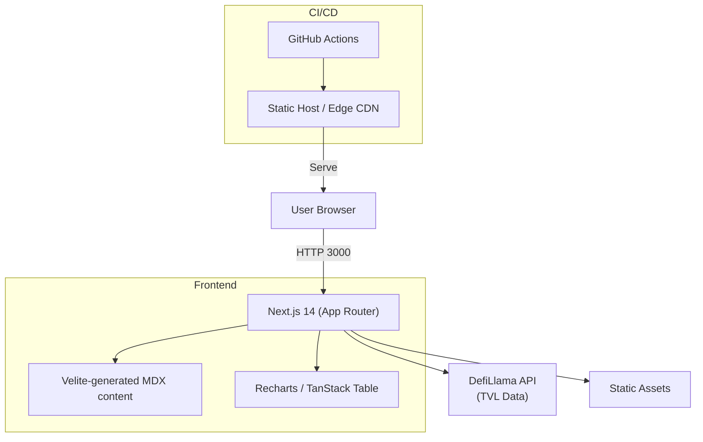

# DeFiScan

[](https://github.com/deficollective/defiscan/actions/workflows/nextbuild.yml)
[](./LICENSE)
[](https://github.com/deficollective/defiscan/issues)
[](https://deficollective.org)

Transparency on decentralization in DeFi. **DeFiScan** monitors the maturity and centralization risks of decentralized-finance protocols through an open, community-driven framework.

[Read the methodology](https://deficollective.org/blog/introducing-defiscan) · [Live Site](https://defiscan.info) · [Community Bounty Program](./campaigns/README.MD)

---

## 📚 Table of Contents
- [Features](#features)
- [Tech Stack](#tech-stack)
- [Architecture](#architecture)
- [Quick Start](#quick-start)
- [Scripts](#scripts)
- [Add a Protocol Review](#add-a-protocol-review)
- [Contributing](#contributing)
- [Acknowledgements](#acknowledgements)
- [License](#license)

## Features
- Formal decentralization stage framework (Stage 0–2 + Infrastructure scores).
- Live TVL analytics powered by DefiLlama.
- Interactive risk rosettes & dashboards built with Recharts and TanStack Table.
- MDX-based content pipeline (Velite) for version-controlled protocol reviews.
- Fully static frontend (Next.js 14 App Router) deployable to any edge/CDN.

## Tech Stack
| Layer | Tech |
|-------|------|
| Framework | Next.js 14 (React 18, TypeScript) |
| Styling | Tailwind CSS 3, Radix Primitives |
| Content | Velite 0.1 – MDX collections |
| Data | DefiLlama API |
| Visualisation | Recharts, Lucide Icons |
| CI/CD | GitHub Actions |
| Hosting | Static build (e.g. Vercel / Cloudflare Pages) |

## Architecture



## Quick Start
### Prerequisites
- Node ≥ 18
- pnpm / npm

### Local Development
```bash
git clone https://github.com/deficollective/defiscan.git
cd defiscan
npm install        # or pnpm install
npm run dev        # Next.js dev server on http://localhost:3000
```

### Production Build
```bash
npm run build
npm start          # Serves the compiled `.next` output
```

## Scripts
| Command | Description |
|---------|-------------|
| `npm run dev` | Start local dev server |
| `npm run build` | Compile production bundle |
| `npm start` | Serve the bundled app |
| `npm run lint` | ESLint code quality check |
| `npm run prettier` | Format codebase with Prettier |

## Add a Protocol Review
1. Fork this repo and create a new branch.  
2. Copy `src/content/template.md` to `src/content/protocols/<protocol-name>.md`.  
3. Fill out the front-matter and sections following the in-file comments.  
4. Generate the permission table with the [Permission Scanner](https://github.com/deficollective/permission-scanner).  
5. Open a Pull Request. The maintainers will validate the Velite schema and review your analysis.

Need inspiration? Check existing examples under `src/content/protocols`.

## Contributing
We're a Web3 community project—issues, pull requests and protocol reviews are **very welcome**!  
Before submitting code:
- Run `npm run lint && npm run prettier` to keep style consistent.
- Make sure new pages render without TypeScript errors.
- For larger changes, open an issue first so we can discuss scope.

Join the conversation:
- 🗣️ [Discord](https://discord.gg/Z467Ehv6VU)
- 🐦 [Twitter / X](https://x.com/defiscan_info)

### Community Bounty Program 💰
Want to earn crypto while helping DeFi become more transparent? Join our **Community Review Program**!

1. **Pick a protocol** – Check the open bounty list in [`campaigns/README.MD`](./campaigns/README.MD).
2. **Reserve it** – Open a **draft PR** with the review template to claim the slot (valid for 2 weeks).
3. **Analyse & write** – Use the [Permission Scanner](https://github.com/deficollective/permission-scanner) and fill out the MDX template.
4. **Submit PR** – Convert your draft PR to "Ready for review", respond to feedback, and get it merged.
5. **Get paid** – Successful reviews are rewarded with **500 LUSD on Optimism**.

Rules (tl;dr):
- One active PR per reviewer.
- Focus on **one chain deployment** per review.
- Follow the naming convention: `protocol | chain | YYYY-MM-DD` (deadline = now + 14 days).
- Full rules & checklist live in [`campaigns/README.MD`](./campaigns/README.MD).

> Whether you're a researcher, auditor, or passionate degen—your contribution helps the whole ecosystem. 🙏

## Acknowledgements
- **L2Beat** – pizza diagram concept, MIT-licensed.  
- **DefiLlama** – historical TVL data powering our analytics.

## License
MIT — see [LICENSE](./LICENSE).

---

Made with ❤️ by the [DeFi Collective](https://DeFiCollective.org)