# ⭐️ DeFiScan Community Review Program

Help us grow DeFi transparency!  Complete a decentralization **protocol review** and earn **500 LUSD** on Optimism.

---

## 📚 Table of Contents
- [Overview](#overview)
- [Bounty at a Glance](#bounty-at-a-glance)
- [Getting Started](#getting-started)
- [Workflow](#workflow)
- [Rules](#rules)
- [Success Checklist](#success-checklist)
- [Payout](#payout)
- [FAQ](#faq)
- [Contact](#contact)

## Overview
The Community Review Program rewards researchers, auditors & curious degens for adding high-quality protocol reviews to DeFiScan.  Reviews assess decentralization risks and assign a Stage (0–2) score.

## Bounty at a Glance
| Item | Details |
|------|---------|
| Reward | **500 LUSD** per accepted review |
| Network | Optimism |
| Time Budget | 14 days from reservation |
| Scope | One protocol **on one chain** |
| Template | [`src/content/template.md`](../src/content/template.md) |
| Tooling | [Permission-Scanner](https://github.com/deficollective/permission-scanner) |

## Getting Started
1. **Read** the [methodology blog](https://deficollective.org/blog/introducing-defiscan) & skim existing reviews.
2. **Check open bounties** in the Issues tab or reach out on Discord to suggest a new one.
3. **Fork** this repo & clone it locally.

## Workflow

```mermaid
flowchart LR
  A[Reserve Draft PR] --> B[Analyse & Draft Report]
  B --> C[Submit PR for Review]
  C --> D[Core Team Feedback]
  D -- Fixes --> B
  D --> E[PR Approved & Merged]
  E --> F[Payout 500 LUSD 💸]
```

1. **Reserve** – Open a **draft PR** named `protocol | chain | YYYY-MM-DD` (deadline = today + 14 days).
2. **Analyse & Draft** – Run Permission-Scanner, fill the template (MDX front-matter + sections).
3. **Submit** – Mark PR as "Ready for review"; team will leave feedback within ~3 days.
4. **Iterate** – Address comments quickly; we're friendly 😊.
5. **Merge & Payout** – After approval, PR is merged and reward sent on Optimism.

## Rules
1. **One active PR per reviewer** (unless analysing different chains).
2. Reviews must target **one chain deployment**.
3. Stay within the **14-day window** or the bounty re-opens.
4. Use the naming convention exactly: `protocol | chain | YYYY-MM-DD`.
5. Follow the template & include all required tables (contracts, permissions, security councils, etc.).

## Success Checklist
- [ ] Draft PR opened & approved for reservation
- [ ] Template front-matter completed (metadata, stage, risks, etc.)
- [ ] Permission table generated via Permission-Scanner
- [ ] Narrative sections filled (Upgradeability, Autonomy, etc.)
- [ ] All links (Etherscan, docs, etc.) verified
- [ ] Review ready within 14 days
- [ ] Feedback addressed, PR merged

## Payout
- **Amount**: 500 LUSD (Liquity USD)
- **Network**: Optimism
- **Timing**: Within 1 week after merge
- **Process**: We'll DM you on Discord/Twitter to collect your Optimism address.  Alternatively leave it in the PR description.

## FAQ
**Q: Can I review a protocol that isn't listed yet?**  
A: Yes! Ping us on Discord to coordinate and avoid duplicate work.

**Q: Do I need prior auditing experience?**  
A: Not strictly—just follow the methodology carefully.  We review every submission.

## Contact
- 🗣️ Discord: <https://discord.gg/Z467Ehv6VU> (`#defiscan` channel)  
- 🐦 X / Twitter: <https://x.com/defiscan_info>

*
Thanks for contributing to DeFi decentralization!*
