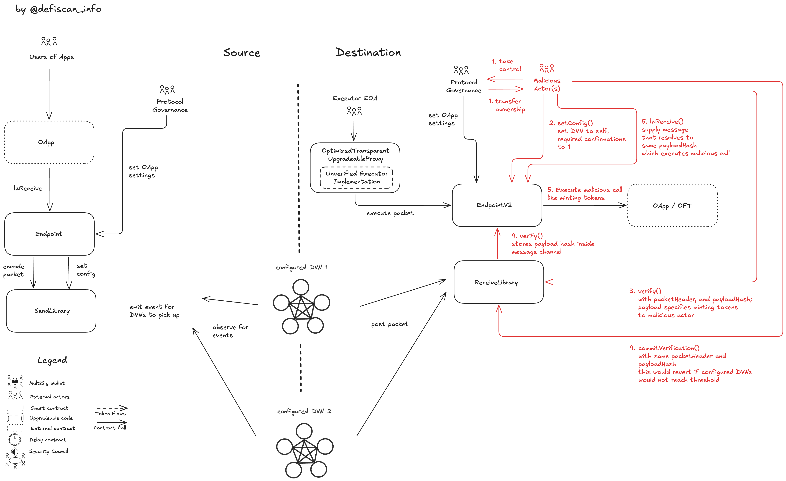

Few months ago we started releasing reports on the decentralization of infrastructure protocols which DeFi protocols rely upon as dependencies. Today we are releasing a report on the centralization risk of protocols integrating Layer Zero. In this blog article we demonstrate a proof of concept with a link to a repository on how a project that is built on top of Layer Zero can be compromised by centralizing the verifier set within Layer Zero configurations of a protocol. This impacts a single protocol as Layer Zero popularized the isolated security compared to the shared security of canonical bridges. We also referenced Layer Zero in one of our existing reports and assess [Maverick V2](/protocols/maverick-v2/ethereum) with our analysis derived from the PoC and the [infrastructure risk report](/protocols/layerzero/ethereum).

At DeFiScan we push for transparency and inform the ecosystem on centralization risks by exposing upgradeability and dependencies in the smart contract architecture of DeFi protocols.

## Layer Zero

Layer Zero is a cross-chain messaging protocol that enables the transfer of value and data between different blockchains. It is composed of a few building blocks. To be specific, let's say we have Ethereum Mainnet and Arbitrum as our two chains. On each chain, we have an endpoint contract that acts as entry gate for cross-chain communication. 

As an example, we analyse a protocol that is built on top of Layer Zero and our protocol has a contract on each chain, connected to the chain's endpoint contract. If users want to transfer value from Ethereum Mainnet to Arbitrum, our smart contract on Ethereum Mainnet will call the endpoint contract on Ethereum Mainnet and if our contract is a token for example it either burns the tokens or locks it on Ethereum Mainnet.

 The call from our token contract to the endpoint contract will emit an event that is picked up by our verifier network or the default verifier network configured by Layer Zero if none has been specified by the protocol. These configured verifier networks run offchain algorithms that listen to these blockchain emitted events and verify the events. Each verifier network, if they deem the transaction as valid, will call on the destination network (here Arbitrum) the receiver library and send a transaction to mark the message as valid (for reference, we use this in step 3 maliciousily). This verification includes the details of the source and destination of the message, and the payload that has to be executed on the destination network. **Crucially**, the validator network is trusted to report the information accurately, there is no cryptographic primitives that bind the transaction on the source chain to the message sent by the validator network on the destination chain. In a next step, if all required verifiers have verified the message, the verification can be committed.  Once comitted, the message is executable on the destination network. Any actor can call the endpoint contract on Arbitrum to execute the message, which calls our token contract with the verified payload, and, for example, mints an equivalent amount of tokens that were locked on Ethereum Mainnet.

### Example Transcaction bridging from Ethereum Sepolia to Arbitrum Sepolia

Send call on OFT (Mainnet Sepolia Tx):

https://sepolia.etherscan.io/tx/0xc4fc209f2c778c9609f4ecd85131f778b11e03e6866696cc259e6f3275b1fd26

execute302 call (Arbitrum Sepolia Tx):

https://sepolia.arbiscan.io/tx/0x9a3c2b7dc6212ca62acbe44d33e958ffc82e67955770c0a5acab9d65b3fd1fab


## Upgradeability within Layer Zero

The configuration of the verifier set within Layer Zero is upgradeable. This means that the verifier set can be changed by the protocol that is built on top of Layer Zero.

## Proof of Concept

In the upcoming sections we will show a proof of concept on how a project that is built on top of Layer Zero can be compromised by centralizing the verifier set within Layer Zero configurations of a protocol.

In Layer Zero each project either relies on the default configuration or can configure their own verifier set.

The default configuration is a set of verifiers that are chosen by the Layer Zero team.

## Step 1

In a first step the attacker takes control over the account which is the owner of the smart contract that is built on top of Layer Zero. To make the PoC easier to follow the attacker transfers the ownership of the smart contract to an EOA spun up by the attacker.

Reference transactions:

transfer ownership: [0x4194774aef7111988eeb6c1ca062097ff553669302f5c825f527232aa8721989](https://sepolia.etherscan.io/tx/0x4194774aef7111988eeb6c1ca062097ff553669302f5c825f527232aa8721989)
set delegate: [0x43b66ae30b6b366be3d0048bd2777938cba5eecc73f4e357fd3a7869fedbdb3f](https://sepolia.etherscan.io/tx/0x43b66ae30b6b366be3d0048bd2777938cba5eecc73f4e357fd3a7869fedbdb3f)

## Step 2

Next, the attacker sets the configuration within an endpoint on a chain he or she wants to exploit. For example this could be Ethereum Mainnet.

The verifier set can be changed to a set of verifiers that are controlled by the attacker (the array `requiredDVNs` just holds one address, requiredDVNCount is one). This could be simply an EOA which crafts a payload that the attacker wants to be executed, verifies this message and commits it to the destination chain. With a single required verifier and minimal confirmations required the attack can happen almost instantly. If the integrating contract is a token for example, the attacker could simply mint or unlock tokens on any of the configured blockchains.

```solidity
    UlnConfig memory uln = UlnConfig({
        confirmations: 1, // minimum block confirmations required on A before sending to B
        requiredDVNCount: 1, // number of DVNs required
        optionalDVNCount: type(uint8).max, // optional DVNs count, uint8
        optionalDVNThreshold: 0, // optional DVN threshold
        requiredDVNs: requiredDVNs, // sorted list of required DVN addresses
        optionalDVNs: optionalDVN // sorted list of optional DVNs
    });
```

Reference transaction:

[0xf3db5c1921a9fe7f52235cbafd2649a5167489b6db86baa5c00e405de7ee09f1](https://sepolia.etherscan.io/tx/0xf3db5c1921a9fe7f52235cbafd2649a5167489b6db86baa5c00e405de7ee09f1)

## Step 3

The attacker calls `verify()` on the receiving library with the payload he/she wants to execute. This will verify the payload. If the integrating contract is an OFT, the payload is just the receiving address and the amount scaled by the shared decimals. To complete the payload, a global unique identifier (guid) is added at the beginning, this number can be random. The payload is hashed and submitted.

Additionally, a `_packetHeader` is supplied which specifies the source and destination contract and chain id of the message path, the nonce of the message, and the packet version.

```solidity
// payload hash
bytes memory _message = abi.encodePacked(
    bytes32(uint256(uint160(attacker))), // address padded to 32 bytes
    uint64(AMOUNT_TO_STEAL) // amount in shared decimals
);

bytes32 _guid = bytes32(uint256(69)); // guid is a global unique identifier
bytes memory payload = abi.encodePacked(_guid, _message);
bytes32 _payloadHash = keccak256(payload);
uint64 nonce = 3; // we did one incoming tx on mainnet from arbitrum until now, (0 if not initialized, 1 one tx)

IReceiveUln302 uln = IReceiveUln302(ulnAddress);

// packetversion: 1 byte
// nonce: 8 bytes
// srcEid: 4 bytes
// sender: 32 bytes
// dstEid: 4 bytes
// receiver: 32 bytes
// total: 81 bytes
bytes memory _packetHeader = abi.encodePacked(packetVersion, nonce, srcEid, sender, dstEid, receiver);
```

The `EndpointV2` contract will later check if this payload has been _verified_ by the required verifiers (what we just did).

Reference transaction:

[0x537f887bf58eaa4975f42cb96de5825c4af0898cea0e29ac723133328f3cb2a3](https://sepolia.etherscan.io/tx/0x537f887bf58eaa4975f42cb96de5825c4af0898cea0e29ac723133328f3cb2a3)

## Step 4

The attacker calls `commitVerification` on the receiving library with the same payload hash and packet header as with the verify call. This will commit the verification to the destination chain. That means the payload hash is stored inside the `EndpointV2` contract.

This call will revert if the payload hash or packet header do not match the verify call and if the required verifiers have not verified the payload, as we just in Step 3.

Reference transaction:

[0xc2bae285c1232ec8329343379857c191c8c701c95278942652680e500db067b9](https://sepolia.etherscan.io/tx/0xc2bae285c1232ec8329343379857c191c8c701c95278942652680e500db067b9)

## Step 5

We can call `lzReceive` on the `EndpointV2` contract with a message whose hash is equal to the payload hash we submitted in Step 3 and 4. This will execute the payload on the destination chain.

```solidity
bytes memory _message = abi.encodePacked(
    bytes32(uint256(uint160(attacker))), // address padded to 32 bytes
    uint64(AMOUNT_TO_STEAL) // amount in shared decimals
);

// MALICIOUS: We dont use packet's data from event but our attack params that we have verified and comitted
ILayerZeroEndpointV2(endpoint).lzReceive(_origin, OFT_ADDRESS_MAINNET, _guid, _message, _extraData);
```

[0x44196a9b06dcb79a41f943cd9a4f4c2358739400b57e1de2c49145b3d9c873e2](https://sepolia.etherscan.io/tx/0x44196a9b06dcb79a41f943cd9a4f4c2358739400b57e1de2c49145b3d9c873e2)



## Severity

The severity of the attack vector depends on the contract that is built on top of Layer Zero. If the contract is an OFT, the severity is high as the attacker can steal any amount of tokens.

The severity is comparable to an upgradeable token contract, as the upgrade can include stealing funds and minting unbacked tokens. However, compared to a non-upgradeable token with fixed supply, introducing Layer Zero integration increases the risk of exploitation through centralization.

## Mitigation

Only a designated delegate of an OApp/OFT or the OApp/OFT contract can configure the verifier set as in Step 2.
In order to prevent this attack vector or it's likelihood, the following options exist

1. the verifier set is immutable, no delegate is configured for the OApp/OFT and no delegate can be configured, this is achieved by overriding `setDelegate` function inside the integrating contract and disable the function. Additionally, the OApp/OFT must not implement a function that calls the `setConfig` function on the Endpoint. This comes with the trade-off that the verifier set cannot be changed in the future and if the verifier stops working or is discontinued, new contracts need to be deployed.
2. the verifier set is mutable, but the ownership and the registered delegate of the OApp/OFT belongs to a multisig account that satisfies the security council requirements or an onchain governance process that has distributed voting power. This makes compromise and exploit attempts more difficult.

## Shared vs isolated security

Layer Zero brought the concept of shared security to crosschain communication, where each DApp can configure their own verifier set and their requirements. This allows for scaling up the security budget when the App grows and change partners who are trusted in a modular way. However it also introduces a new risk of centralization and requires a lot more effort in monitoring to see if the configured DVNs are non-malicious from the side of the DeFi community as in contrast with bridges that are shared between many DApps.

## Risk through Layer Zero Labs

Layer Zero Labs manages the default verifier set, which is used by default when an app has no verifier configured. If Layer Zero Labs were to be compromised, the default verifier set could be compromised as well, leading to attacks on all DApps that use the default verifier set.

## Closing remarks

Layer Zero is a powerful tool for crosschain communication, but it also splits centralization risk into each app. It is important to be aware of these risks and to take appropriate measures to mitigate them. We hope this article has helped you understand the risks of centralization in Layer Zero and the importance of taking appropriate measures to mitigate them.

## Disclaimer

This article is for educational purposes only. The authors are not liable for any loss or damage arising from the use of this article.
