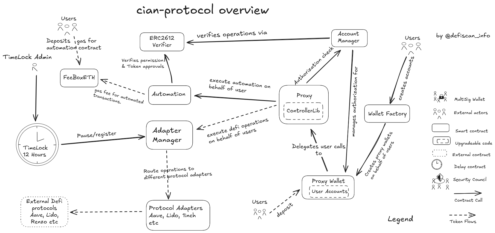

# Summary

Cian is a yield aggregator that automates yield optimization — the process of automatically adjusting a yield strategy to maximize returns — by pooling user funds into vaults and depending on the strategy the vault implements deploys them to external protocols (lending, borrowing, staking, and restaking) to achieve the highest possible returns with minimal effort from the user. The Cian protocol provide three products for users to get yield. The cian yield layer which has 80% of the protocol tvl, the Cian strategy mainnet vaults and Cian automation.

# Ratings

## Chain

Cian protocol deploys yield strategies on various chains, this review focuses on the yield strategies on Ethereum mainnet. 

> Chain score: Low

## Upgradeability

Many critical system contracts WalletFactory, AdapterManager, FeeBoxStETH, FeeBoxETH, AaveAdapter, and WethGateway have their their critical functions like pause, registering of adapters, changing ownership etc restricted to onlyTimelock but the `Timelock` contract - with a delay of only 12hours - owner/admin is the `Cian Deployer` an EOA. Malicious or compromised updates initiated by this address could lead to the direct loss of user funds.

The Yield layer product vaults is no different as the 3/4 multisig can pause vault operations, change the address authorized for redeem operations, and upgrade the vault as the admin of the proxy.

> Upgradeability score: High

## Autonomy

As a yield aggregator protocol, Cian sources its yield from multiple protocols. These are divided into three main categories depending on the yield source: staking yield, restaking yield, and lending yield sources. Examples include Lido Protocol for staking yield, Symbiotic, Mellow Protocol and Renzo Protocol for restaking yield, and Aave and Sparklend for lending yield sources. Dependence on multiple protocols that are at stage 0 on their decentralzation score increases dependecy failure and complexity. A failure on any of these protocols could result in loss or thefts of user fund or degraded protocol experience for users.

> Autonomy score: High

## Exit Window

The TimeLock contract implements a 12-hour delay and is controlled by the Cian Deployer. The Cian Deployer, as the sole admin of the TimeLock contract, can arbitrarily pause the adapterManager and core functionality in other contracts. The Yield layer vaults are controlled by an undeclared multisig which can arbitrarily withdraw funds and deny withdrawals from the vaults.

> Exit Window score: High

## Accessibility

All three products of Cian protocol are only accessible via the https://cian.app front end. There are no self-hosted options for users to deploy, and if the front end goes down, there's no way for users to withdraw or deposit their assets or use the protocol. Therefore, the accessibility score is high.

> Accessibility score: High

## Conclusion

The Cian protocol critical permissions are controlled by an EOA who is also the Owner of the TimeLock contract and thus earns a high upgradeability score. The exit window delay of 12 hours is poor with the TimeLock contract owner/admin an EOA, thus its Exit Window score is high.

With a dependence on multiple protocols for yield that are also **Stage 0** in their decentralization score and no robust governance or safety mechanism in case of dependency failure, gets a high in its Autonomy score. The protocol thus achieves a **Stage 0** decentralization score

The protocol could reach **Stage 1** by implementing the security council requirements for [Undeclared](#security-council) multisig account and for all yield layer vault contracts 2) increasing the delay period in the `TimeLock` contract and transferring ownership of the `TimeLock` contract to a multisig account. 3) Creating a governance system that controls all critical functions in the core contracts that are currently held by the `Cian Deployer`

# Reviewer's Notes

⚠️ During analysis, Several of the mainnet contracts (ControllerLib, ControllerLibSub and ControllerLink)  are proxies but only their implementation address was referenced in the protocol docs. The yield layer vault contracts github repository is private and critical functions in the yield layer vaults are controlled by an undeclared 3/4 multisig which is not found in the protocol docs. Some permission functions are excluded because they can only be called from a user controlled account.

All vaults contract in the yield layer share the same permission functions so I used VaultYieldETH as a reference in the permission section.

# Protocol Analysis

## Mainnet strategy vaults and Automation products

`ControllerLib` is the main execution layer for user accounts. It executes operations through the `AdapterManager`, which routes calls to appropriate protocol adapters. 

The `Account Manager` handles account permissions and authorizations within the system. It maintains a registry of accounts and controls which addresses can perform specific operations on them. ProxyWallet acts as the user interface contract that delegates calls to the controller implementations.

The `AdapterManager` serves as the central registry and gateway that manages all protocol adapters in the system, routing calls to these adapters. Protocol adapters are contracts that interact with external protocols. The `TimeLock` can pause and register protocol adapters. Users deposit tokens to `FeeBoxETH` to be used by the `Automation` contract as gas.
`Automation` allows for the automated execution of operations on user accounts. It verifies permissions using the `ERC2612Verifier`, which manages the permissions between accounts and operators. This setup enables account owners to grant specific permissions either directly through the approve() function or via EIP-712 signatures. Users create accounts through the `WalletFactory`, which deploys `ProxyWallet` instances pointing to ControllerLib implementations. The Automation system can then execute operations on these accounts after verification through `ERC2612Verifier`, with all protocol interactions routed through the `AdapterManager` to specific protocol adapters.

Here include the diagram. Please explain what the main contracts are doing within the diagram.

## Cian Yield Layer

The Vault contract receive user assets and issue LP tokens. It is the repository for user deposits and allocates funds to various strategies in the Vault. To withdraw funds frm the vault, users must request to withdraw through the `redeemOperator` contract which calls the `Manager` contract to batch execute user withdrawals and position adjustments.The `multisig` approves user withdrawals from the vault through thr `redeemOperator`, sets funds allocation to strategies.

# Dependencies

Cian-protocol uses chainlink oracles for in both their yield layer and strategy vaults to fetch prices onchain. Both strategy and Yield layer vaults allocate funds to external protocols like Aave, Lido, Renzo, and Sparklend either by staking, restaking, lending or borrowing to these protocols. These introduces a high dependency risk as there is no robust safety or governace mechanism in place in case of failure.

# Governance

## Security Council

New table with all the multisigs

| Name          | Account | Type     | ≥ 7 signers | ≥ 51% threshold | ≥ 50% non-insider | Signers public |
| ------------- | ------- | -------- | ----------- | --------------- | ----------------- | -------------- |
| Undeclared Multisig | [0x261090afE1E7305474F4e3eEFCAca9964eBffFf5](https://etherscan.io/address/0x261090afE1E7305474F4e3eEFCAca9964eBffFf5)  | Multisig | ✅          | ❌              | ❌                | ✅             |

# Technical Analysis

## Contracts

| Contract Name | Address |
| ------------- | ------------------------------------------- |
| ERC2612Verifier | [0x045969904402F5e674ef1f27713F3230929538DF](https://etherscan.io/address/0x045969904402F5e674ef1f27713F3230929538DF) |
| WalletFactory | [0x8B46CB994218767f07C86Ba62fecAfdcb19cc001](https://etherscan.io/address/0x8B46CB994218767f07C86Ba62fecAfdcb19cc001) |
| Automation | [0x53C8bF6875C66E8d7C42e30BeeF7e6241997F7e3](https://etherscan.io/address/0x53C8bF6875C66E8d7C42e30BeeF7e6241997F7e3) |
| ControllerLib | [0x74D2Bef5Afe200DaCC76FE2D3C4022435b54CdbB](https://etherscan.io/address/0x74D2Bef5Afe200DaCC76FE2D3C4022435b54CdbB) |
| ControllerLibSub | [0x68041721C81c695B72495F78BeaC4F7DFD7b19c8](https://etherscan.io/address/0x68041721C81c695B72495F78BeaC4F7DFD7b19c8) |
| ControllerLink | [0xb329504622bd79329c6F82CF8c60c807dF2090c4](https://etherscan.io/address/0xb329504622bd79329c6F82CF8c60c807dF2090c4) |
| Timelock | [0xb39e6f93cff9Af7011810f41a4ed9b14582019b7](https://etherscan.io/address/0xb39e6f93cff9Af7011810f41a4ed9b14582019b7) |
| AdapterManager | [0xc936161B3C80494172ae58734e3CE16e26D493C1](https://etherscan.io/address/0xc936161B3C80494172ae58734e3CE16e26D493C1) |
| WethGateway | [0xc397df95d7313159b667c58A541201BD936a2aA3](https://etherscan.io/address/0xc397df95d7313159b667c58A541201BD936a2aA3) |
| AaveAdapter | [0x5b465489FF729f73ec911245A84B25231b5824bA](https://etherscan.io/address/0x5b465489FF729f73ec911245A84B25231b5824bA) |
| FeeBoxStETH | [0xC5C9953516635659e03345738D8390b7ada6351c](https://etherscan.io/address/0xC5C9953516635659e03345738D8390b7ada6351c) |
| FeeBoxETH | [0x0b20d5d59E14C71a948D55439019a2Aaf74Fa7B4](https://etherscan.io/address/0x0b20d5d59E14C71a948D55439019a2Aaf74Fa7B4) |
| YlstETHVault (Implementation) | [0x0695ea1585e159368c95da0e65d611fd27ea3862](https://etherscan.io/address/0x0695ea1585e159368c95da0e65d611fd27ea3862) |
| YlstETHVault (Proxy) | [0x3498fDed9C88Ae83b3BC6a302108F2da408e613b](https://etherscan.io/address/0x3498fDed9C88Ae83b3BC6a302108F2da408e613b) |
|| VaultYieldETH (Proxy)       | [0xB13aa2d0345b0439b064f26B82D8dCf3f508775d](https://etherscan.io/address/0xB13aa2d0345b0439b064f26B82D8dCf3f508775d) |
| VaultYieldETH (Implementation) | [0xa1dc0b6a02ab091580dc57bdd5fe8a9e577e0842](https://etherscan.io/address/0xa1dc0b6a02ab091580dc57bdd5fe8a9e577e0842) |
| Vault (Proxy)               | [0xd4Cc9b31e9eF33E392FF2f81AD52BE8523e0993b](https://etherscan.io/address/0xd4Cc9b31e9eF33E392FF2f81AD52BE8523e0993b) |
| Vault (Implementation)      | [0x7a9ca85e0d4f32004d47620df03982b1afd18e37](https://etherscan.io/address/0x7a9ca85e0d4f32004d47620df03982b1afd18e37) |
| VaultYieldRSETH (Proxy)     | [0xd87a19fF681AE98BF10d2220D1AE3Fbd374ADE4e](https://etherscan.io/address/0xd87a19fF681AE98BF10d2220D1AE3Fbd374ADE4e) |
| VaultYieldRSETH (Implementation) | [0x90639665f88fb7a8258608fcc6d5e2bf8d5dfc01](https://etherscan.io/address/0x90639665f88fb7a8258608fcc6d5e2bf8d5dfc01) |
| TransparentUpgradeableProxy | [0x8D76e7847dFbEA6e9F4C235CADF51586bA3560A2](https://etherscan.io/address/0x8D76e7847dFbEA6e9F4C235CADF51586bA3560A2) |
| VaultYieldFBTC (Proxy)      | [0x9fdDAD44eD6b77e6777dC1b16ee4FCcCBaF0A019](https://etherscan.io/address/0x9fdDAD44eD6b77e6777dC1b16ee4FCcCBaF0A019) |
| VaultYieldFBTC (Implementation) | [0x5200817ce523f8340a6fa00f800b7df71c000af4](https://etherscan.io/address/0x5200817ce523f8340a6fa00f800b7df71c000af4) |

## All Permission owners

| Name | Account                                     					    | Type         |
| ---- | ---------------------------------------------------------------------------------- | ------------ |
| TimeLock | [0xb39e6f93cff9Af7011810f41a4ed9b14582019b7](https://etherscan.io/address/0xb39e6f93cff9Af7011810f41a4ed9b14582019b7)| Contract |
| Cian Deployer | [0x8FA9aa69a6e94c1cd49FbF214C833B2911D02553](https://etherscan.io/address/0x8fa9aa69a6e94c1cd49fbf214c833b2911d02553) | EOA |
| AdapterManager | [0xc936161B3C80494172ae58734e3CE16e26D493C1](https://etherscan.io/address/0xc936161B3C80494172ae58734e3CE16e26D493C1) | Contract 
| Undeclared multisig | [0x261090afE1E7305474F4e3eEFCAca9964eBffFf5](https://etherscan.io/address/0x261090afE1E7305474F4e3eEFCAca9964eBffFf5) | Multisig |

## Permissions

| Contract Name | Function Name | Impact | Owner |
| ------------- | ------------- | ------ | ------------------- |
| ERC2612Verifier | revoke | It sets the approvals_deadline to revoke existing permissions. This removes previously granted execution permissions for specific operations. A malicious account owner could revoke critical permissions during active operations, causing system failures or trapping funds. | Account Owner |
| ERC2612Verifier | approve | It writes to approvals_types and approvals_deadline to grant execution permissions. This enables specific operations to be performed on behalf of the account. A malicious account owner could approve unauthorized operations or extend permissions indefinitely, allowing exploitation of the account. | Account Owner |
| WalletFactory | setTimelock | It updates the TIMELOCK_ADDRESS state variable to a new timelock contract address. The timelock controls critical system parameters and upgrade mechanisms. A malicious timelock could set itself to a compromised address, gaining permanent control over all factory operations and wallet deployments. | Timelock Contract (0xb39e6f93cff9Af7011810f41a4ed9b14582019b7) |
| WalletFactory | setTrustLogic | It updates trustAccountLogic and trustSubAccountLogic addresses for wallet implementations. These logic contracts define the behavior of all deployed wallets. A malicious timelock could set malicious logic contracts, causing all future wallet deployments to contain backdoors or fund-draining capabilities. | Timelock Contract (0xb39e6f93cff9Af7011810f41a4ed9b14582019b7) |
| Automation | setLoanProvider | It updates the customizedLoanProviders mapping for specific loan provider preferences. This allows accounts to use custom flash loan providers for operations. A malicious account owner could set a malicious loan provider that steals funds during flash loan operations. | Account Owner |
| Automation | _executeVerifyBasic | It executes basic operations after verifying permissions through the ERC2612 verifier. This enables automated execution of trading and DeFi operations. A malicious operator with valid permissions could execute unauthorized trades or drain account funds through approved operations. | Permitted by ERC2612 Verifier |
| Automation | _executeVerifyAdapter | It executes adapter-based operations after permission verification. This allows interaction with external DeFi protocols through adapters. A malicious operator could exploit vulnerable adapters or execute sandwich attacks against the account's transactions. | Permitted by ERC2612 Verifier |
| Automation | _autoExecute | It performs automated execution of operations with permission checks. This enables bot-driven trading and yield farming strategies. A malicious bot operator could front-run user transactions or execute trades at unfavorable prices to extract MEV. | Permitted by ERC2612 Verifier |
| Automation | autoExecute | It executes automated operations on behalf of users with verified permissions. This provides hands-off DeFi strategy execution and portfolio management. A malicious automation service could execute strategies that benefit the operator at the user's expense or time trades for maximum slippage. | Permitted by ERC2612 Verifier |
| Automation | autoApprove | It handles token approvals for automated operations with permission verification. This manages ERC20 token permissions required for DeFi interactions. A malicious operator could approve excessive token amounts to malicious contracts, enabling future unauthorized token transfers. | Permitted by ERC2612 Verifier |
| Automation | autoApproveWithPermit | It handles token approvals using EIP-2612 permits for gasless approval operations. This enables gasless token permission management for DeFi operations. A malicious operator could abuse permit signatures to grant unlimited token approvals to malicious contracts. | Permitted by ERC2612 Verifier |
| Automation | doFlashLoan | It executes flash loans using configured loan providers for leveraged operations. This enables high-leverage trading and complex arbitrage strategies. A malicious operator could use flash loans to manipulate prices, extract maximum slippage, or drain account funds through leveraged liquidations. | Permitted by ERC2612 Verifier |
| Automation | autoExecuteOnSubAccount | It executes operations on sub-accounts with permission verification. This enables automated management of trading sub-accounts and portfolio allocation. A malicious operator could drain sub-account funds or execute trades that benefit the main account at the sub-account's expense. | Permitted by ERC2612 Verifier |
| Automation | doFlashLoanOnSubAccount | It executes flash loans on sub-accounts using configured providers. This enables leveraged operations across multiple account segments. A malicious operator could use sub-account flash loans to circumvent main account limits or create cascading liquidations across account segments. | Permitted by ERC2612 Verifier |
| ControllerLib | renounceOwnership | It permanently removes the current owner by setting _owner to the zero address. This action makes the contract permanently brickable. A malicious owner could renounce ownership to trap user funds in an unmanageable contract state. | Account Owner |
| ControllerLib | transferOwnership | It changes the contract owner by updating the _owner state variable to a new address. This transfers admin control over owner-protected functions to the new address. A malicious owner could transfer ownership to an attacker-controlled address, compromising the entire protocol's security and user funds. | Account Owner |
| ControllerLib | initialize | It sets up the contract's core components by writing to autoExecutor, adapterManager, walletFactory, and _owner state variables during initial deployment. This establishes the fundamental architecture and access controls for the entire DeFi automation system. A malicious actor with initialization access could compromise the security of all future user interactions and fund management. | Contract Initializer with Proxy Check |
| ControllerLib | reinitialize | It updates the contract's core component addresses (walletFactory, autoExecutor, adapterManager) while preserving existing state. This allows for system upgrades and component replacements in the protocol architecture. A malicious owner could reinitialize with compromised component addresses, redirecting user funds to attacker-controlled contracts during upgrade procedures. | Account Owner with Proxy Check |
| ControllerLib | fallback | It temporarily sets the currentAdapter state variable to allow delegated execution through adapter contracts. This enables the contract to execute arbitrary logic through registered adapter contracts while maintaining access control. A malicious adapter contract could exploit this delegation mechanism to execute unauthorized operations, potentially draining user funds or manipulating protocol state. |Adapter Contract |
| ControllerLib | executeOnAdapter | Executes arbitrary calls through registered adapter contracts by temporarily setting currentAdapter and delegating execution. This enables complex DeFi operations like depositing/staking through modular adapter architecture. A malicious automation system or compromised owner could drain user accounts through malicious adapter interactions. | Automation System or Account Owner |
| ControllerLib | multiCall | It executes multiple operations in a single transaction by batching calls through the adapter system. This enables complex, atomic DeFi operations. A malicious automation system could batch unauthorized operations together, making it difficult to detect individual malicious actions. | Automation System or Account Owner |
| ControllerLib | approve | It grants token spending permissions to external contracts by calling the ERC20 approve function. This enables the automation contracts to spend the account's tokens for DeFi operations like lending or staking. A malicious automation system could approve unlimited token spending to malicious contracts, draining user tokens. | Automation System or Account Owner |
| ControllerLibSub | renounceOwnership | Permanently removes ownership from the sub-account by setting _owner to zero address. This makes the sub-account permanently unmanageable by any external party. A malicious sub-account owner could renounce ownership to permanently lock funds. | Cian Deployer (0x8D76e7847dFbEA6e9F4C235CADF51586bA3560A2) |
| ControllerLibSub | transferOwnership | It transfers ownership of the sub-account to a new address by updating the _owner state variable. This enables ownership changes within the sub-account ecosystem while maintaining separation from the main account. A malicious Owner could transfer control to an attacker, compromising funds and operations specific to that sub-account. | Cian Deployer (0x8FA9aa69a6e94c1cd49FbF214C833B2911D02553) |
| ControllerLibSub | executeOnAdapter | It executes operations through registered adapters specifically for sub-account functionality. This enables sub-accounts to access DeFi protocols while maintaining isolation from the main account. A malicious sub-account owner could execute unauthorized DeFi operations, potentially affecting the broader account ecosystem or violating user-defined sub-account restrictions. | Null Address (0x0000000000000000000000000000000000000000) |
| ControllerLibSub | multiCall | It batches multiple operations for execution within the sub-account context through the adapter system. This enables complex, atomic DeFi strategies specific to the sub-account while maintaining operational efficiency. A malicious sub-account owner could batch harmful operations together, making it difficult to detect individual malicious actions while executing complex manipulation schemes. | Null Address (0x0000000000000000000000000000000000000000)  |
| ControllerLibSub | withdrawAssets | It transfers tokens or ETH from the sub-account to specified recipients, handling both ERC20 tokens and native ETH. This enables fund retrieval and rebalancing operations within the sub-account ecosystem. A malicious owner could drain all sub-account assets allocated to that specific sub-account. | Null Address (0x0000000000000000000000000000000000000000) |
| ControllerLibSub | approveTokens | It grants token spending permissions to external contracts specifically for sub-account tokens, requiring EOA owner authorization. This enables sub-accounts to participate in DeFi protocols while maintaining EOA-level security controls. A malicious EOA owner could approve sub-account tokens to malicious contracts, enabling unauthorized spending and potential drainage of sub-account token balances. | Null Address (0x0000000000000000000000000000000000000000) |
| ControllerLink | renounceOwnership | It permanently removes the owner by setting _owner to zero address. This makes the account linking system permanently ungovernable. A malicious owner could renounce ownership to permanently disable the account verification and linking system. | Cian Deployer (0x8FA9aa69a6e94c1cd49FbF214C833B2911D02553) |
| ControllerLink | transferOwnership | Transfer contract ownership to a new address. This moves complete control over the account linking system to a new address. A malicious owner could transfer ownership to an attacker-controlled address, compromising the security of all linked accounts in the system. | Cian Deployer (0x8FA9aa69a6e94c1cd49FbF214C833B2911D02553) |
| ControllerLink | setTimelock | Updates the TIMELOCK_ADDRESS by writing the new timelock contract address to storage. This changes which timelock contract has administrative control over the linking system. A malicious timelock could gain admin access to the account linking infrastructure. | Timelock Contract (0xb39e6f93cff9Af7011810f41a4ed9b14582019b7) |
| ControllerLink | initialize | It sets up the walletFactory address that controls account creation and linking within the system. A malicious timelock could initialize with a compromised walletfactory address, allowing unauthorized account creation and compromising the entire user authentication system. | Timelock Contract (0xb39e6f93cff9Af7011810f41a4ed9b14582019b7) |
| ControllerLink | addAuth | It creates new account linkages by updating userList, accountList, accountID, accountAddr, userLink, accountLink, and accounts mappings. This registers new accounts within the system and establishes authentication relationships. A malicious factory contract could add unauthorized account links, potentially allowing attackers to access accounts they don't own or bypassing authentication mechanisms. | Trust Factory (0x8B46CB994218767f07C86Ba62fecAfdcb19cc001) |
| ControllerLink | removeAuth | It removes account authentication by clearing entries from userList, accountList, accountID, userLink, and accountLink mappings after verification. This breaks the link between users and their accounts, removing access permissions. A malicious owner could remove authentication for user accounts preventing users from accessing their own accounts. | Cian Deployer (0x8FA9aa69a6e94c1cd49FbF214C833B2911D02553) |
| Timelock | renounceOwnership | It permanently removes the owner by setting _owner to zero address. A malicious owner could renounce ownership make the timelock system permanently unmanageable in emergency situations. | Cian Deployer (0x8FA9aa69a6e94c1cd49FbF214C833B2911D02553) |
| Timelock | transferOwnership | Transfer ownership to a new address. A malicious owner could transfer ownership to an attacker controlled address and gain control over all protocols controlled by this timelock. | Cian Deployer (0x8FA9aa69a6e94c1cd49FbF214C833B2911D02553) |
| Timelock | setDelay | It modifies the timelock delay period by updating the delay state variable within MINIMUM_DELAY and MAXIMUM_DELAY bounds. This changes how long transactions must wait before execution. A malicious timelock admin could set an extremely short delay, reducing the security window for users to detect and respond to malicious proposals. | Timelock Contract |
| Timelock | acceptAdmin | It transfers admin privileges by moving pendingAdmin to admin and clearing pendingAdmin. This finalizes administrative control changes within the timelock governance system. A malicious pending admin could accept admin privileges to gain control over all timelock operations. | Pending Admin |
| Timelock | setPendingAdmin | Initiates admin changes by setting pendingAdmin and updating admin_initialized, beginning the two-step admin transfer process. This starts the admin transition mechanism while maintaining existing admin control. A malicious current admin could set a compromised address as pending admin | Cian Deployer or Timelock Contract |
| Timelock | queueTransaction | It schedules future transactions by adding them to queuedTransactions mapping with execution timestamps based on the delay period. A malicious admin could queue harmful transactions to execute after the delay period. | Cian Deployer (0x8FA9aa69a6e94c1cd49FbF214C833B2911D02553) |
| Timelock | cancelTransaction | It removes queued transactions by setting their queuedTransactions mapping entry to false, preventing future execution. This provides a mechanism to stop scheduled operations. A malicious admin could cancel legitimate transactions. | Cian Deployer (0x8FA9aa69a6e94c1cd49FbF214C833B2911D02553) |
| Timelock | executeTransaction | It executes previously queued transactions. A malicious admin could execute harmful transactions immediately when the delay period expires. | Cian Deployer (0x8FA9aa69a6e94c1cd49FbF214C833B2911D02553) |
| AdapterManager | renounceOwnership | Renounce ownership by transferring owner to null address. This action makes it impossible to perform owner-restricted operations like adapter management. A malicious owner could renounce ownership to lock the contract in an unmanageable state. | Cian Deployer (0x8FA9aa69a6e94c1cd49FbF214C833B2911D02553) |
| AdapterManager | transferOwnership | Transfer contract ownership to a new address. This grants admin control register adapters, manage timelock and pause controls. A malicious owner can take over the adapter manager contract. | Cian Deployer (0x8FA9aa69a6e94c1cd49FbF214C833B2911D02553) |
| AdapterManager | setTimelock | It updates the timelock address in the contract. This changes which address can register/unregister adapters and modify pause permissions. A malicious timelock could drain user funds through malicious adapter registrations. | Timelock Contract (0xb39e6f93cff9Af7011810f41a4ed9b14582019b7) |
| AdapterManager | registerAdapters | It writes to adapter index mappings to add new adapters to the system. A malicious timelock could register malicious adapters to steal user funds. | Timelock Contract (0xb39e6f93cff9Af7011810f41a4ed9b14582019b7) |
| AdapterManager | unregisterAdapters | It modifies the adapter index mappings to remove adapters from the available list without changing the maximum index. This can disable harmful or outdated adapters. A malicious timelock could unregister legitimate adapters to force users toward malicious alternatives. | Timelock Contract (0xb39e6f93cff9Af7011810f41a4ed9b14582019b7) |
| AdapterManager | setPauseWhiteList | It modifies the suspend permissions mapping to grant or revoke pause privileges for specific addresses. This function manages which addresses can emergency-pause the protocol beyond just the timelock and owner. A malicious timelock could grant pause permissions to controlled addresses. | Timelock Contract (0xb39e6f93cff9Af7011810f41a4ed9b14582019b7) |
| AdapterManager | setPause | It writes to the paused state variable to enable or disable protocol operations. This can halt all user interactions with adapters. A malicious owner could pause the protocol. | Cian Deployer (0x8FA9aa69a6e94c1cd49FbF214C833B2911D02553) |
| WethGateway | sweep | It reads the timelock address and adapter address to recover stuck tokens on the gateway contract. A malicious timelock could drain all tokens held by the WethGateway contract. | Timelock Contract (0xb39e6f93cff9Af7011810f41a4ed9b14582019b7) |
| WethGateway | setTimelock | It updates the timelock address. This changes which address has the power to sweep funds and perform other admin operations on the gateway. A malicious timelock can sweep all funds from the gateway disrupt WETH conversion operations for users. | Timelock Contract (0xb39e6f93cff9Af7011810f41a4ed9b14582019b7) |
| WethGateway | renounceOwnership | It sets the owner address to zero, permanently removing ownership privileges from the WethGateway contract. This eliminates the owner's ability to perform admin functions. A malicious owner could renounce ownership to lock the contract in a state where only the timelock can perform admin functions. | Cian Deployer (0x8FA9aa69a6e94c1cd49FbF214C833B2911D02553) |
| WethGateway | transferOwnership | It changes the contract owner to a new owner address. This transfers admin and ownership privileges to a different address. A malicious owner could transfer ownership to a malicious address that could  compromise the WETH gateway functionality. | Cian Deployer (0x8FA9aa69a6e94c1cd49FbF214C833B2911D02553) |
| AaveAdapter | sweep | It reads timelock and adapter addresses to enable recovery of stuck tokens from the Aave adapter contract. This emergency function allows the protocol to recover tokens that might be stuck due to failed transactions or contract upgrades. A malicious timelock could use this function to steal all tokens held by the AaveAdapter. | Timelock Contract (0xb39e6f93cff9Af7011810f41a4ed9b14582019b7) |
| AaveAdapter | setTimelock | It updates the timelock address. This changes which address can sweep funds and perform other timelock-restricted operations on the adapter. A malicious timelock could set itself to a controlled address, gaining permanent admin access to manipulate Aave interactions or steal user funds. | Timelock Contract (0xb39e6f93cff9Af7011810f41a4ed9b14582019b7) |
| AaveAdapter | renounceOwnership | It sets the owner address to zero, permanently removing ownership control from the AaveAdapter contract. This eliminates the owner's admin privileges. A malicious owner could renounce ownership to lock the contract in its current state. | Cian Deployer (0x8FA9aa69a6e94c1cd49FbF214C833B2911D02553) |
| AaveAdapter | transferOwnership | It changes the contract owner to a new address. A malicious owner could transfer ownership to an adversarial address that could interfere with legitimate adapter operations or coordinate attacks against user positions in Aave. | Cian Deployer (0x8FA9aa69a6e94c1cd49FbF214C833B2911D02553) |
| AaveAdapter | initialize | It writes to the trusted A-token address mapping based on input parameters and current contract state. This function sets up the adapter's configuration for interacting with specific Aave markets and tokens. A malicious timelock could initialize the adapter with malicious A-token addresses, redirecting user deposits to controlled contracts that could steal funds. | Timelock Contract (0xb39e6f93cff9Af7011810f41a4ed9b14582019b7) |
| AaveAdapter | deposit | It reads various Aave-related addresses and approval states to facilitate user deposits into Aave lending pools. This function enables users to supply assets to Aave and earn lending interest through the protocol. A malicious adapter manager could deposit to malicious contracts instead of legitimate Aave pools. | Adapter Manager (0xc936161B3C80494172ae58734e3CE16e26D493C1) |
| AaveAdapter | positionTransfer | It writes to the executor address and reads flash loan vault information to facilitate position transfers. This enables position management operations, like flash loans to restructure user positions. A malicious adapter manager could set malicious executor addresses that steal funds during position transfers, manipulate flash loan operations to extract value. | Adapter Manager (0xc936161B3C80494172ae58734e3CE16e26D493C1) |
| FeeBoxStETH | sweep | It transfers tokens from the contract to the ADAPTER_ADDRESS by reading the adapter address and checking timelock permissions. This function allows the protocol to recover or redistribute accumulated tokens within the fee collection system. A malicious timelock controller could drain all tokens held by the contract to an arbitrary adapter address. | Timelock Contract (0xb39e6f93cff9Af7011810f41a4ed9b14582019b7) |
| FeeBoxStETH | setTimelock | It updates the TIMELOCK_ADDRESS state variable that controls admin access to critical functions. This changes the timelock contract address. A malicious current timelock could take permanent control of all timelock-protected functions. | Timelock Contract (0xb39e6f93cff9Af7011810f41a4ed9b14582019b7) |
| FeeBoxStETH | renounceOwnership | It sets the _owner state variable to zero address, permanently removing ownership privileges from the contract. This action irreversibly removes the owner's ability to call owner-only functions like transferOwnership. A malicious owner could renounce ownership to leave the contract permanently without owner-level administration. | Cian Deployer (0x8FA9aa69a6e94c1cd49FbF214C833B2911D02553) |
| FeeBoxStETH | transferOwnership | It changes the _owner state variable to a new address. This function shifts control of owner-protected functions to the new owner address. A malicious owner could transfer ownership to a compromised address | Cian Deployer (0x8FA9aa69a6e94c1cd49FbF214C833B2911D02553) |
| FeeBoxStETH | initialize | It sets the balanceController and feeReceiver addresses during contract initialization. This sets the addresses that control balance management and fee distribution within the protocol. A malicious timelock could redirect fees to an unauthorized receiver or set a compromised balance controller during initialization. | Timelock Contract (0xb39e6f93cff9Af7011810f41a4ed9b14582019b7) |
| FeeBoxStETH | setAdapterManager | It updates the ADAPTER_MANAGER state variable which controls who can call deposit and withdrawal functions. This changes which address has permission to manage user deposits and withdrawals of stETH tokens. A malicious timelock could set a malicious adapter manager that could manipulate user funds or block deposit/withdrawal operations. | Timelock Contract (0xb39e6f93cff9Af7011810f41a4ed9b14582019b7) |
| FeeBoxStETH | setBalance | It updates the tokenBalance state variable to track the internal accounting of stETH tokens. This function maintains the contract's internal record of token holdings separate from actual blockchain balances. A malicious balance controller could manipulate internal accounting to create discrepancies that could be exploited for unauthorized withdrawals or fee manipulation. | Balance Controller (0x5CD3D24377B517A93d4D32BB015c60DdE7e1313e) |
| FeeBoxStETH | paymentCheck | It reads stETH balances, compares with tokenBalance, and transfers any excess to the feeReceiver while updating internal accounting. This function processes fee collection by detecting and transferring accumulated stETH rewards to the designated fee recipient. A malicious balance controller could manipulate the payment timing or amounts to redirect fees or create accounting inconsistencies. | Balance Controller (0x5CD3D24377B517A93d4D32BB015c60DdE7e1313e) |
| FeeBoxStETH | depositWithPermit | It processes stETH deposits using permit signatures, updates nonces, and adjusts tokenBalance while performing payment checks. This function enables gasless deposits of stETH tokens through EIP-2612 permit functionality with automatic fee processing. A malicious adapter manager could replay signatures, manipulate deposit amounts, or exploit the permit mechanism to drain user tokens. | Adapter Manager (0xc936161B3C80494172ae58734e3CE16e26D493C1) |
| FeeBoxStETH | withdrawWithPermit | It processes stETH withdrawals using permit signatures, updates nonces, and adjusts tokenBalance while performing payment checks. This function enables gasless withdrawals of stETH tokens through permit signatures with automatic fee collection. A malicious adapter manager could manipulate withdrawal amounts, or exploit permit signatures to prevent users from accessing their funds. | Adapter Manager (0xc936161B3C80494172ae58734e3CE16e26D493C1) |
| FeeBoxETH | sweep | It transfers tokens from the contract to the ADAPTER_ADDRESS. This function allows the protocol to redistribute accumulated tokens within the fee collection system. A malicious timelock controller could drain all tokens held by the contract to an arbitrary adapter address. | Timelock Contract (0xb39e6f93cff9Af7011810f41a4ed9b14582019b7) |
| FeeBoxETH | setTimelock | It updates the TIMELOCK_ADDRESS state variable that controls admin access to critical functions. A malicious current timelock could transfer control to a compromised address, effectively taking permanent control of all timelock-protected functions. | Timelock Contract (0xb39e6f93cff9Af7011810f41a4ed9b14582019b7) |
| FeeBoxETH | renounceOwnership | It sets the _owner state variable to zero address, permanently removing ownership privileges from the contract. This action irreversibly removes the owner's ability to call owner-only functions like transferOwnership. A malicious owner could renounce ownership to prevent legitimate governance changes or leave the contract permanently without owner-level administration. | Cian Deployer (0x8FA9aa69a6e94c1cd49FbF214C833B2911D02553) |
| FeeBoxETH | transferOwnership | It changes the _owner state variable to transfer ownership control to a new address. This function shifts administrative control of owner-protected functions to the new owner address. A malicious owner could transfer ownership to a compromised address or permanently lock out legitimate administrators from owner functions. | Cian Deployer (0x8FA9aa69a6e94c1cd49FbF214C833B2911D02553) |
| FeeBoxETH | initialize | It sets the balanceController and feeReceiver addresses during contract initialization. This establishes the core operational addresses that control balance management and fee distribution within the protocol. A malicious timelock could redirect fees to an unauthorized receiver or set a compromised balance controller during initialization. | Timelock Contract (0xb39e6f93cff9Af7011810f41a4ed9b14582019b7) |
| FeeBoxETH | setAdapterManager | It updates the ADAPTER_MANAGER state variable which controls who can call deposit and withdrawal functions to a new address. A malicious timelock could set a compromised adapter manager that could manipulate user funds or block legitimate deposit/withdrawal operations. | Timelock Contract (0xb39e6f93cff9Af7011810f41a4ed9b14582019b7) |
| FeeBoxETH | setBalance | It updates the ethBalance state variable to track the internal accounting of ETH tokens. A malicious balance controller could manipulate internal accounting to create discrepancies that could be exploited for unauthorized withdrawals. | Balance Controller (0x5CD3D24377B517A93d4D32BB015c60DdE7e1313e) |
| FeeBoxETH | paymentCheck | This function processes fee collection by detecting and transferring accumulated ETH rewards to the designated fee recipient. A malicious balance controller could manipulate the amounts to redirect fees. | Balance Controller (0x5CD3D24377B517A93d4D32BB015c60DdE7e1313e) |
| FeeBoxETH | depositWithPermit | This function enables gasless deposits of ETH tokens through EIP-2612 permit functionality with automatic fee processing. A malicious adapter manager could exploit the permit mechanism to drain user ETH funds. | Adapter Manager (0xc936161B3C80494172ae58734e3CE16e26D493C1) |
| FeeBoxETH | withdrawWithPermit | Enables gasless withdrawals of ETH tokens through permit signatures with automatic fee collection. A malicious adapter manager could manipulate withdrawal amounts. | Adapter Manager (0xc936161B3C80494172ae58734e3CE16e26D493C1) |  
| VaultYieldETH               | createStrategy                 | It reads maximum position limit, ownership storage, and strategy list to add a new strategy to the vault and sets its initial position limit. A malicious owner could add a harmful strategy, leading to loss of deposited funds managed by that strategy. | `Undeclared Multisig` (0x261090afE1E7305474F4e3eEFCAca9964eBffFf5) |
| VaultYieldETH               | removeStrategy                 | This removes an existing strategy from the vault. A malicious owner could remove a legitimate strategy, disrupting the vault's operation. | `Undeclared Multisig` (0x261090afE1E7305474F4e3eEFCAca9964eBffFf5) |
| VaultYieldETH               | updateStrategyLimit            | This function updates the maximum amount of assets a specific strategy can manage. A malicious owner could set an excessively high limit on a risky strategy or a very low limit on a productive one, impacting vault performance and safety. | `Undeclared Multisig` (0x261090afE1E7305474F4e3eEFCAca9964eBffFf5) |                                   |
| VaultYieldETH               | renounceOwnership              | Transfers ownership to the zero address, making the contract ownerless. A malicious owner could renounce ownership, leaving the contract without an admin to manage parameters or respond to issues. | `Undeclared Multisig` (0x261090afE1E7305474F4e3eEFCAca9964eBffFf5) |
| VaultYieldETH               | transferOwnership              |  Tranfers contract ownership to a new address. A malicious owner could transfer ownership to an attacker's address, gaining full admin control over the vault. | `Undeclared Multisig` (0x261090afE1E7305474F4e3eEFCAca9964eBffFf5) |
| VaultYieldETH               | updateMarketCapacity           | This updates the total market capacity of the vault, limiting total deposits. | `Undeclared Multisig` (0x261090afE1E7305474F4e3eEFCAca9964eBffFf5) |
| VaultYieldETH               | updateManagementFee            | This function updates the management fee rate collected by the vault. A malicious owner could set a high management fee, significantly reducing user yield. | `Undeclared Multisig` (0x261090afE1E7305474F4e3eEFCAca9964eBffFf5) |
| VaultYieldETH               | updateManagementFeeClaimPeriod | It updates the minimum time period between management fee claims. | `Undeclared Multisig` (0x261090afE1E7305474F4e3eEFCAca9964eBffFf5) |
| VaultYieldETH               | updateMaxPriceUpdatePeriod     | This function updates the maximum time allowed between price updates for the vault's assets. A malicious owner could set an extremely long period, causing the vault's exchange rate to become stale and inaccurate, leading to unfair deposit/withdrawal prices. | `Undeclared Multisig` (0x261090afE1E7305474F4e3eEFCAca9964eBffFf5) |
| VaultYieldETH               | updateRevenueRate              | Updates the revenue fee rate collected by the vault on profits. A malicious owner could set a high revenue fee, significantly impacting user returns. | `Undeclared Multisig` (0x261090afE1E7305474F4e3eEFCAca9964eBffFf5) |
| VaultYieldETH               | updateExitFeeRate              | Updates the fee applied when users withdraw/redeem from the vault. A malicious owner could set a prohibitively high exit fee, effectively trapping user funds in the vault. | `Undeclared Multisig` (0x261090afE1E7305474F4e3eEFCAca9964eBffFf5) |
| VaultYieldETH               | updateRebalancer               | Updates the address authorized to perform rebalancing operations. A malicious owner could set the rebalancer to an attacker's address, allowing them to manipulate asset allocation and drain funds through malicious strategies. | `Undeclared Multisig` (0x261090afE1E7305474F4e3eEFCAca9964eBffFf5) |
| VaultYieldETH               | updateFeeReceiver              | This function updates the address that receives collected fees. A malicious owner could set the fee receiver to their own redirecting all vault fees. | `Undeclared Multisig` (0x261090afE1E7305474F4e3eEFCAca9964eBffFf5) |
| VaultYieldETH               | updateRedeemOperator           | This function updates the address authorized to perform specific redemption operations. A malicious owner could set the redeem operator to an attacker's address, giving them control over certain redemption flows. |    `Undeclared Multisig` (0x261090afE1E7305474F4e3eEFCAca9964eBffFf5) |
| VaultYieldETH               | updateExchangePrice            | This function updates the internal exchange rate between assets and shares, reflecting vault performance. A malicious rebalancer could manipulate the exchange price, unfairly benefiting depositors or redeemers or causing accounting issues. | Rebalancer Role                                           |
| VaultYieldETH               | stakeTo                        | It reads message sender, specific contract addresses (etherfiPool, EETH, WETH, STETH), and vault parameters. This function likely sends assets to a staking pool as part of the vault's strategy. A malicious rebalancer could direct funds to a fraudulent staking contract or misuse the staking function. | Rebalancer Role                                           |
| VaultYieldETH               | migrateMint                    | It reads ownership storage, message sender, ERC20 storage, vault state, vault parameters, and precision. This function appears to allow the owner to mint shares, possibly for migration or initialization purposes. A malicious owner could mint an unlimited amount of shares, diluting existing holders. | `Undeclared Multisig` (0x261090afE1E7305474F4e3eEFCAca9964eBffFf5) |
| VaultYieldETH               | sweep                          | This function allows the owner to retrieve arbitrary ERC20 tokens from the vault, excluding the main asset. A malicious owner could drain unintended tokens held by the vault. | `Undeclared Multisig` (0x261090afE1E7305474F4e3eEFCAca9964eBffFf5) |
| VaultYieldETH               | pause                          | It reads vault parameters, pausable storage, and ownership storage. This function allows the owner or rebalancer to pause certain vault operations. A malicious owner or rebalancer could pause the vault indefinitely, preventing deposits, withdrawals, or redemptions. | Account Owner or Rebalancer Role                          |
| VaultYieldETH               | unpause                        | This function allows the owner to unpause the contract. A malicious owner could unpause the contract prematurely after an issue is detected but not fully resolved. | `Undeclared Multisig` (0x261090afE1E7305474F4e3eEFCAca9964eBffFf5) |

