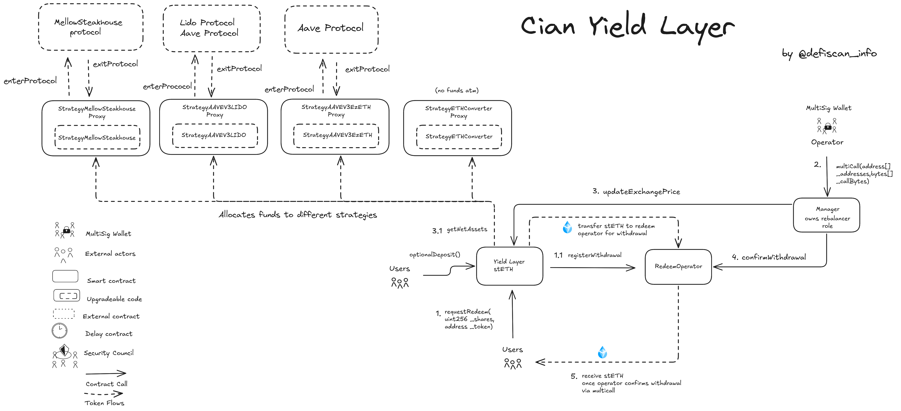

# Summary

Cian Yield Layer is a yield aggregator that automates yield optimization — the process of automatically adjusting a yield strategy to maximize returns — by pooling user funds into vaults and deploying them to external protocols (lending, borrowing, staking, and restaking) to achieve the highest possible returns with minimal effort from the user. The Cian Protocol provides three products for users to get yield. The Cian Yield Layer, the Cian Strategy Mainnet Vaults and Cian Automation.

# Ratings

## Chain

Cian Yield Layer deploys yield strategies on various chains, this review focuses on the yield strategies on Ethereum mainnet. 

> Chain score: Low

## Upgradeability

The Cian Yield layer is fully upgradable allowing for the updates of all vaults (`YlFBTC`, `YlBTCLst`, `YlrsETH`, `YlstETH`) and strategy contracts e.g (`StrategyETHConverter`, `StrategyAAVEV3LIDO`). This can result in the loss of funds or unclaimed yield as well as lead to other changes in the expected performance of the protocol. 

The permission to upgrade the Cian Yield layer vaults (`YlstETH`, `YlBTCLst`, `YlrsETH`) and strategy contracts e.g (`StrategyAAVEV3LIDO`, `StrategyETHConverter`) is controlled by a 3/4 multisig for some vaults (`YlstETH`, `YlBTCLst`, `YlrsETH`) or an EOA in some e.g (VaultYieldETH, VaultYieldRSETH).  This makes the upgradeability score High.

> Upgradeability score: High

## Autonomy

As a yield aggregator protocol, Cian sources its yield from multiple protocols. These are divided into three main categories depending on the yield source: staking yield, restaking yield, and lending yield sources. Examples include Lido Protocol for staking yield, Symbiotic, Mellow Protocol and Renzo Protocol for restaking yield, and Aave and Sparklend for lending yield sources. Dependence on multiple protocols that are at stage 0 on their decentralzation score increases dependecy failure and complexity. A failure on any of these protocols could result in loss or thefts of user fund or degraded protocol experience for users.

> Autonomy score: High

## Exit Window

Withdrawals are not instant in the Cian Yield Layer, as users must first request withdrawals from the Yield layer vaults. The `redeemOperator` must then confirm each withdrawal request through the `Manager` contract. This `Manager` contract is controlled by an undisclosed multisig or an EOA that can arbitrarily withdraw funds and deny withdrawals from the vaults in cases of emergency, security breaches, or protocol insolvency. As a result, the exit window score is rated as High.

> Exit Window score: High

## Accessibility

The Cian Yield Layer is only accessible via the https://cian.app front end. There are no self-hosted options for users to deploy, and if the front end goes down, there's no way for users to withdraw or deposit their assets or use the protocol. Therefore, the accessibility score is high.

> Accessibility score: High

## Conclusion

The Cian Yiel Layer critical permissions are controlled by an EOA and undeclared multisig, thus earns a high upgradeability score. As in all vaults contract, users withdrawal must first be approved by vault owners, thus its Exit Window score is high.

With a dependence on multiple protocols for yield that are also **Stage 0** in their decentralization score and no robust governance or safety mechanism in case of dependency failure, gets a high in its Autonomy score. The protocol thus achieves a **Stage 0** decentralization score

The protocol could reach **Stage 0** by implementing the security council requirements for [Undeclared](#security-council) multisig account and for all yield layer vault contracts 1) Publishing and verfiying contract source code and their respective repositories. 2) Creating a governance system that controls all critical functions in the core contracts that are currently held by the all vault owners

# Reviewer's Notes

⚠️ During analysis, Several of the yield layer vault contracts and strategy contracts are unverified, are proxies and only their implementation address was referenced in the protocol docs. The yield layer vault contracts github repository is private and critical functions in the yield layer vaults are controlled by an undeclared 3/4 multisig which is not found in the protocol docs. Due to having unverified and undeclared multisig, this review will be in the Others section

# Protocol Analysis

## Cian Yield Layer

Users deposit their assets into the Vault contract. In return for their deposits, users receive corresponding LP tokens. These tokens represent their share of the assets held in the Vault. The allocation ratios for strategy funds within the Vault contract are set by the `Operator`, a multi-sig wallet. 

Based on the strategy fund allocation ratios set in the Vault contract, assets from the Vault are transferred to the corresponding strategy contracts. These contracts perform specific asset operations, such as investing, trading, or lending, based on the defined strategies to generate returns for the users. Each strategy operates according to its predefined rules and objectives. The `redeemOperator` contract is mainly used to record user withdrawal request data, handle the withdrawal operations and completes each withdrawal operation in a single transaction.

To withdraw funds from the vault, users must send a withdrawal request to the `redeemOperator` contract which also calls the `Manager` contract to batch execute user withdrawals and position adjustments after which a user recieves stETH. The `Operator` approves user withdrawals from the vault through the `Manager` contract.

# Dependencies

Cian-protocol uses chainlink oracles for in both their yield layer and strategy vaults to fetch prices onchain. Both strategy and Yield layer vaults allocate funds to external protocols like Aave, Lido, Renzo, and Sparklend either by staking, restaking, lending or borrowing to these protocols. These introduces a high dependency risk as there is no robust safety or governace mechanism in place in case of failure.

# Governance

## Security Council

New table with all the multisigs

| Name          | Account | Type     | ≥ 7 signers | ≥ 51% threshold | ≥ 50% non-insider | Signers public |
| ------------- | ------- | -------- | ----------- | --------------- | ----------------- | -------------- |
| Owner YlstETH (undeclared) | [0x261090afE1E7305474F4e3eEFCAca9964eBffFf5](https://etherscan.io/address/0x261090afE1E7305474F4e3eEFCAca9964eBffFf5)  | Multisig | ❌          | ✅              | ❌                | ❌             |

# Technical Analysis

## Contracts

| Contract Name                             | Address                                                                                                               |
| ----------------------------------------- | --------------------------------------------------------------------------------------------------------------------- |
| Manager (YlstETH)                         | [0x6d425B3D302DD82cC611866eC8176d435307b616](https://etherscan.io/address/0x6d425B3D302DD82cC611866eC8176d435307b616) |
| RedeemOperator (YlstETH)                  | [0xdAc6748CbB7CD9DA1868eB7aD598273122f012db](https://etherscan.io/address/0xdAc6748CbB7CD9DA1868eB7aD598273122f012db) |
| StrategyETHConverter (Proxy)              | [0xe2da457580a0b4aDA538fea681daaBA3A1BdEA7E](https://etherscan.io/address/0xe2da457580a0b4aDA538fea681daaBA3A1BdEA7E) |
| StrategyETHConverter (Implementation)     | [0x89ad2070b7522b08aa046e100350a9c2afc9758c](https://etherscan.io/address/0x89ad2070b7522b08aa046e100350a9c2afc9758c) |
| StrategyAAVEV3LIDO (Proxy)                | [0x07833EAdF87CD3079da281395f2fBA24b61F90f7](https://etherscan.io/address/0x07833EAdF87CD3079da281395f2fBA24b61F90f7) |
| StrategyAAVEV3LIDO (Implementation)       | [0x9191dc9e81bef6feea0dc4d6994d5392b898edf8](https://etherscan.io/address/0x9191dc9e81bef6feea0dc4d6994d5392b898edf8) |
| StrategyMellowSteakhouse (Proxy)          | [0xFed44EdF4560DC09271d3a7d514B843F789540A5](https://etherscan.io/address/0xFed44EdF4560DC09271d3a7d514B843F789540A5) |
| StrategyMellowSteakhouse (Implementation) | [0x77521826f516f02a123fd1f2ffe262f2133169b7](https://etherscan.io/address/0x77521826f516f02a123fd1f2ffe262f2133169b7) |
| StrategyCompoundRSETH (Proxy)             | [0x3e2fC649E407e4bf0e14d620284ADd5366f2AC2d](https://etherscan.io/address/0x3e2fC649E407e4bf0e14d620284ADd5366f2AC2d) |
| StrategyCompoundRSETH (Implementation)    | [0xb45222a152d4a05f791df8e101f8bf8e86e640e9](https://etherscan.io/address/0xb45222a152d4a05f791df8e101f8bf8e86e640e9) |
| StrategyAAVEV3EzETH (Proxy)               | [0xd6813390a28c8e3bc0dc838a346bd48f98b6da6f](https://etherscan.io/address/0xd6813390a28c8e3bc0dc838a346bd48f98b6da6f) |
| StrategyAAVEV3EzETH (Implementation)      | [0x64909259bc66e45ab66ee38a5fe3d284102254a3](https://etherscan.io/address/0x64909259bc66e45ab66ee38a5fe3d284102254a3) |
| StrategyAAVEV3RsETH (Proxy)               | [0x1114D5C199dAe5f94a045947e3DF776e9f9C07c4](https://etherscan.io/address/0x1114D5C199dAe5f94a045947e3DF776e9f9C07c4) |
| StrategyAAVEV3RsETH (Implementation)      | [0x48bf0e645054b5cbe5636acd267d20022179d72f](https://etherscan.io/address/0x48bf0e645054b5cbe5636acd267d20022179d72f) |
| VaultYieldETH (Proxy)                     | [0xB13aa2d0345b0439b064f26B82D8dCf3f508775d](https://etherscan.io/address/0xB13aa2d0345b0439b064f26B82D8dCf3f508775d) |
| VaultYieldETH (Implementation)            | [0xA1Dc0B6A02AB091580DC57bDd5Fe8a9E577E0842](https://etherscan.io/address/0xA1Dc0B6A02AB091580DC57bDd5Fe8a9E577E0842) |
| Manager (YlrsETH)                         | [0xAc1894C6914639e18f8FA69FEBd324eE91c96065](https://etherscan.io/address/0xAc1894C6914639e18f8FA69FEBd324eE91c96065) |
| RedeemOperator (YlrsETH)                  | [0x47DBD71Db64617f6cBD45eB9D9Ba876F40ED239E](https://etherscan.io/address/0x47DBD71Db64617f6cBD45eB9D9Ba876F40ED239E) |
| StrategyAAVEV3RsETH (Proxy)               | [0x659195FB6c4D77cf116564cb6487d2Effd60bcE3](https://etherscan.io/address/0x659195FB6c4D77cf116564cb6487d2Effd60bcE3) |
| StrategyAAVEV3RsETH (Implementation)      | [0xd68155afa39083a276ebbcd24265d5ae57c7585c](https://etherscan.io/address/0xd68155afa39083a276ebbcd24265d5ae57c7585c) |
| StrategyCompound (Proxy)                  | [0xB69ca6D2Fb435318800F267DD217d64Fa4BE137e](https://etherscan.io/address/0xB69ca6D2Fb435318800F267DD217d64Fa4BE137e) |
| StrategyCompound (Implementation)         | [0x21047effcc9dc9f88f47fe823ea9e2453593d7a0](https://etherscan.io/address/0x21047effcc9dc9f88f47fe823ea9e2453593d7a0) |
| VaultYieldRSETH (Proxy)                   | [0xd87a19fF681AE98BF10d2220D1AE3Fbd374ADE4e](https://etherscan.io/address/0xd87a19fF681AE98BF10d2220D1AE3Fbd374ADE4e) |
| VaultYieldRSETH (Implementation)          | [0x90639665f88fb7a8258608fcc6d5e2bf8d5dfc01](https://etherscan.io/address/0x90639665f88fb7a8258608fcc6d5e2bf8d5dfc01) |
| Manager (YlBTCLST)                        | [0x5085B552639cFC0e49Bb645Ae4637F6e55F0F01f](https://etherscan.io/address/0x5085B552639cFC0e49Bb645Ae4637F6e55F0F01f) |
| StrategySolv (Proxy)                      | [0x103e04A36B1123f6Ba48874AC47d39acbFe20b97](https://etherscan.io/address/0x103e04A36B1123f6Ba48874AC47d39acbFe20b97) |
| StrategySolv (Implementation)             | [0x41076df3ed1c59860245471b918f423ec44b840d](https://etherscan.io/address/0x41076df3ed1c59860245471b918f423ec44b840d) |
| StrategyBedrock (Proxy)                   | [0x53a6F68c159518eB1ecFbac5d1e4c77F0A683B26](https://etherscan.io/address/0x53a6F68c159518eB1ecFbac5d1e4c77F0A683B26) |
| StrategyBedrock (Implementation)          | [0xa22772cf929c4a38a03c927e688a51684f4c6465](https://etherscan.io/address/0xa22772cf929c4a38a03c927e688a51684f4c6465) |
| StrategyPump (Proxy)                      | [0x54e1C5834A65877d121CC63504cC36A1A10abfD5](https://etherscan.io/address/0x54e1C5834A65877d121CC63504cC36A1A10abfD5) |
| StrategyPump (Implementation)             | [0xe170ee6fb2222b42362181537a21bd429cf7f1cc](https://etherscan.io/address/0xe170ee6fb2222b42362181537a21bd429cf7f1cc) |
| Vault (Proxy)                             | [0x6c77bdE03952BbcB923815d90A73a7eD7EC895D1](https://etherscan.io/address/0x6c77bdE03952BbcB923815d90A73a7eD7EC895D1) |
| Vault (Implementation)                    | [0xa994911ee05de3c183533b2dd68ceeb7490de97c](https://etherscan.io/address/0xa994911ee05de3c183533b2dd68ceeb7490de97c) |
| Manager (YlFBTC)                          | [0x140B58b84ea6923325b2325577b9E141B4480A7c](https://etherscan.io/address/0x140B58b84ea6923325b2325577b9E141B4480A7c) |
| StrategySolv (Proxy)                      | [0x597d42F0Cd2888C53726bD64f4aD06c3636ef796](https://etherscan.io/address/0x597d42F0Cd2888C53726bD64f4aD06c3636ef796) |
| StrategySolv (Implementation)             | [0xf703e47280f5ad1de97373b89b9b4d0b41df6681](https://etherscan.io/address/0xf703e47280f5ad1de97373b89b9b4d0b41df6681) |
| StrategyBedrock (Proxy)                   | [0xe67Ab3036C866519a0885A58d4408c164eA897e9](https://etherscan.io/address/0xe67Ab3036C866519a0885A58d4408c164eA897e9) |
| StrategyBedrock (Implementation)          | [0xc091a0078889b3b12b6d9e44273a782a73678ff5](https://etherscan.io/address/0xc091a0078889b3b12b6d9e44273a782a73678ff5) |
| StrategyPumpBTC (Proxy)                   | [0x71b3Bf3FCc6d59aE9317595Cc4126EcfF2f8FCc8](https://etherscan.io/address/0x71b3Bf3FCc6d59aE9317595Cc4126EcfF2f8FCc8) |
| StrategyPumpBTC (Implementation)          | [0xf12e223408bc50b64b33dae393ef0fb1d926b491](https://etherscan.io/address/0xf12e223408bc50b64b33dae393ef0fb1d926b491) |
| VaultYieldFBTC (Proxy)                    | [0x9fdDAD44eD6b77e6777dC1b16ee4FCcCBaF0A019](https://etherscan.io/address/0x9fdDAD44eD6b77e6777dC1b16ee4FCcCBaF0A019) |
| VaultYieldFBTC (Implementation)           | [0x2fdc50b1e91bc810646ad933e2734579b4c632ba](https://etherscan.io/address/0x2fdc50b1e91bc810646ad933e2734579b4c632ba) |

## All Permission owners

| Name                   | Account                                                                                                               | Type     |
| ---------------------- | --------------------------------------------------------------------------------------------------------------------- | -------- |
| Owner (YlstETH)        | [0x261090afE1E7305474F4e3eEFCAca9964eBffFf5](https://etherscan.io/address/0x261090afE1E7305474F4e3eEFCAca9964eBffFf5) | Multisig |
| Vault Owner            | [0x8FA9aa69a6e94c1cd49FbF214C833B2911D02553](https://etherscan.io/address/0x8FA9aa69a6e94c1cd49FbF214C833B2911D02553) | EOA      |
| Operator               | [0x994Cc8Ef6aC289d0016dC28E691CF75eaE4e776b](https://etherscan.io/address/0x994Cc8Ef6aC289d0016dC28E691CF75eaE4e776b) | Contract |
| Rebalancer 2 (YlstETH) | [0x7c0393F1CF1faf3106478960bEf21635Ff6182C4](https://etherscan.io/address/0x7c0393F1CF1faf3106478960bEf21635Ff6182C4) | Multisig |
| Rebalancer 2 (YlrsETH) | [0x20E5737D4B888154c8220304310aBb8b63881D2a](https://etherscan.io/address/0x20E5737D4B888154c8220304310aBb8b63881D2a) | Multisig |
| FeeReceiver            | [0xc554747ffde2e378a562a09f2f72f4121C1d493D](https://etherscan.io/address/0xc554747ffde2e378a562a09f2f72f4121C1d493D) | EOA      |
| Owner (YlrsETH)        | [0x0b5d3121E144cf1410850c9608651a039BFd543e](https://etherscan.io/address/0x0b5d3121E144cf1410850c9608651a039BFd543e) | Multisig |
| Owner (YlBTCLST)       | [0x28784DbF1DA93da28873c9f4A8B471D64A11FCfd](https://etherscan.io/address/0x28784DbF1DA93da28873c9f4A8B471D64A11FCfd) | Multisig |

## Permissions

| Contract                                  | Function                       | Impact | Owner                          |
| ----------------------------------------- | ------------------------------ | ------ | ------------------------------ |
| Manager (YlstETH)                         | renounceOwnership              | Abandons ownership of the contract. A malicious `Owner` could renounce ownership to permanently make user funds stuck in the contract.    | Owner (YlstETH)                |
| Manager (YlstETH)                         | transferOwnership              | Tranfers contract ownership to a new address. A malicious `Owner` could grant withdrawals to an attacker's address.    | Owner (YlstETH)                |
| Manager (YlstETH)                         | addOperator                    | Adds a new address to the set of approved operators that can call functions like multiCall. A malicious Owner could add an attacker's address as an operator, allowing them to execute arbitrary, harmful batch transactions.    | Owner (YlstETH)                |
| Manager (YlstETH)                         | removeOperator                 | Removes an existing address from the set of approved operators. A malicious `Owner` could remove all legitimate operators, halting critical vault operations.    | Owner (YlstETH)                |
| Manager (YlstETH)                         | multiCall                      | It allows a whitelisted operator to execute a batch of function calls in a single transaction, which enables efficient management and rebalancing of the vault's strategies.   | Operator (YlstETH)             |
| RedeemOperator (YlstETH)                  | renounceOwnership              | Abandons ownership of the contract. A malicious owner could renounce ownership to brick the contract permanently.| Owner (YlstETH)                |
| RedeemOperator (YlstETH)                  | transferOwnership              | Updates the owner of the `RedeemOperator` contract: the account responsible for recording and processing user withdrawals. A malicious Owner can suspend user withdrawals.    | Owner (YlstETH)                |
| RedeemOperator (YlstETH)                  | updateOperator                 | It assigns a new address as the Operator for the contract. A malicious `Owner` could set an attacker's address as the operator, allowing them to manipulate or halt user withdrawals.    | Owner (YlstETH)                |
| RedeemOperator (YlstETH)                  | updateFeeReceiver              | Updates the address that receives collected fees. A malicious `Vault Owner` could set the fee receiver to their own address redirecting all vault fees.   | Owner (YlstETH)                |
| RedeemOperator (YlstETH)                  | confirmWithdrawal              | Finalizes a user's withdrawal request, triggering the transfer of assets. A malicious `Manager` could confirm a fraudulent withdrawal to an attacker's address.    | Manager (YlstETH)              |
| RedeemOperator (YlstETH)                  | sweep                          | It allows the `Owner` to withdraw any arbitrary ERC20 tokens sent to the `Vault (YlstETH)` by mistake. A malicious `Owner` could use this to steal these ERC20 tokens.    | Owner (YlstETH)                |
| RedeemOperator (YlstETH)                  | registerWithdrawal             | It records a user's withdrawal request, initiated by the main Vault contract.    | VaultYieldETH                  |
| StrategyETHConverter (Proxy)              | upgradeToAndCall               | Updates the implementation of the `StrategyETHConverter` contract. Can only be triggered by the Owner itself. A compromised multisig can replace `StrategyETHConverter (Implementation)` and steal user funds.  | Owner (YlstETH)                |
| StrategyETHConverter (Implementation)     | renounceOwnership              | Abandons ownership of the contract. A malicious owner could renounce ownership to brick the contract permanently. | Owner (YlstETH)               |
| StrategyETHConverter (Implementation)     | transferOwnership              | Tranfers contract ownership to a new address. A malicious owner could transfer ownership to an attacker's address, gaining full admin control over the vault.    | Owner (YlstETH)                |
| StrategyETHConverter (Implementation)     | updateRebalancer               | Updates the address authorized to perform rebalancing operations. A malicious `Owner` could set the rebalancer to an attacker's address, allowing them to drain all funds within this strategy.    | Owner (YlstETH)                |
| StrategyETHConverter (Implementation)     | convertToken                   | Exchanges one token for another as part of the strategy's logic, for rebalancing the portfolio or entering/exiting positions.   | Manager (YlstETH)              |
| StrategyETHConverter (Implementation)     | claimUnstake                   | This function claims tokens that have completed an unstaking or cooldown period. A malicious `Manager` could delay calling claimUnstake, causing a loss of yield or opportunity.    | Manager (YlstETH)              |
| StrategyETHConverter (Implementation)     | onTransferIn                   | This callback function is triggered when the Vault transfers assets into the strategy. This is the primary entry point for allocating new funds to the strategy. A compromised Vault could call this function outside of a legitimate deposit flow, causing accounting mismatches.  | VaultYieldETH                  |
| StrategyETHConverter (Implementation)     | transferToVault                | It moves assets from the strategy back to the main Vault. This is used to free up capital for withdrawals. A malicious `Manager` could trap funds within the strategy and prevent user withdrawals.  | Manager (YlstETH)              |
| StrategyAAVEV3LIDO (Proxy)                | upgradeToAndCall               | Updates the implementation of the `StrategyAAVEV3LIDO` contract. Can only be triggered by the Owner itself. A malicious `Owner` can replace `StrategyAAVEV3LIDO (Implementation)` and drain user funds.    | Owner (YlstETH)                |
| StrategyAAVEV3LIDO (Implementation)       | renounceOwnership              | Abandons ownership of the contract. A malicious owner could renounce ownership to brick the contract permanently | Owner (YlstETH)                |
| StrategyAAVEV3LIDO (Implementation)       | transferOwnership              | Tranfers contract ownership to a new address. A malicious owner could transfer ownership to an attacker's address, gaining full admin control over the vault.    | Owner (YlstETH)                |
| StrategyAAVEV3LIDO (Implementation)       | updateFlashloanHelper          | It sets the address of a helper contract used for flashloans. A malicious `Owner` could set the helper to a malicious contract designed to steal funds during a flashloan operation.    | Owner (YlstETH)                |
| StrategyAAVEV3LIDO (Implementation)       | updateRebalancer               | Updates the address authorized to perform rebalancing operations. A malicious `Owner` could set the rebalancer to an attacker's address, allowing them to drain all funds within this strategy.    | Owner (YlstETH)                |
| StrategyAAVEV3LIDO (Implementation)       | updateSafeProtocolRatio        | Updates a safety parameter related to a loan-to-value (LTV) or collateral ratio, which is crucial for managing the risk of liquidation in a lending protocol.    | Owner (YlstETH)                |
| StrategyAAVEV3LIDO (Implementation)       | convertToken                   | Exchanges one token for another as part of the strategy's logic, for rebalancing the portfolio or entering/exiting positions.   | Manager (YlstETH)              |
| StrategyAAVEV3LIDO (Implementation)       | onTransferIn                   | This callback function is triggered when the Vault transfers assets into the strategy. This is the primary entry point for allocating new funds to the strategy. A compromised Vault could call this function outside of a legitimate deposit flow, causing accounting mismatches.   | VaultYieldETH                  |
| StrategyAAVEV3LIDO (Implementation)       | transferToVault                | It moves assets from the strategy back to the main Vault. This is used to free up capital for withdrawals or for rebalancing. A malicious `Manager` could trap funds within the strategy and prevent user withdrawals.    | Manager (YlstETH)              |
| StrategyAAVEV3LIDO (Implementation)       | wrap                           | Converts the native token to its wrapped ERC20 version (WETH), necessary for interacting with DeFi protocols.    | Manager (YlstETH)              |
| StrategyAAVEV3LIDO (Implementation)       | unwrap                         | It converts a wrapped token like WETH back to its native version (ETH). This is done before returning funds to users.    | Manager (YlstETH)              |
| StrategyAAVEV3LIDO (Implementation)       | repay                          | Repays a loan taken from a lending protocol, for managing debt and avoiding liquidation of collateral.    | Manager (YlstETH)              |
| StrategyAAVEV3LIDO (Implementation)       | leverage                       | It borrows funds against existing collateral to increase the strategy's exposure, which magnifies both potential gains and losses. A malicious `Manager` could take on excessive leverage, making the position vulnerable to liquidation.    | Manager (YlstETH)              |
| StrategyAAVEV3LIDO (Implementation)       | deleverage                     | Repays debt to decrease the strategy's exposure and risk either to secure profits or reduce risk in volatile conditions.    | Manager (YlstETH)              |
| StrategyMellowSteakhouse (Proxy)          | upgradeToAndCall               | Updates the implementation of the `StrategyMellowSteakhouse` contract. Can only be triggered by the Owner itself. A malicious `Owner` can replace `StrategyMellowSteakhouse(Implementation)` and drain user funds.        | Owner (YlstETH)                |
| StrategyMellowSteakhouse (Implementation) | renounceOwnership              | Abandons ownership of the contract. A malicious owner could renounce ownership to brick the contract permanently.    | Owner (YlstETH)                |
| StrategyMellowSteakhouse (Implementation) | transferOwnership              | Tranfers contract ownership to a new address. A malicious owner could transfer ownership to an attacker's address, gaining full admin control over the vault.    | Owner (YlstETH)                |
| StrategyMellowSteakhouse (Implementation) | updateRebalancer               | Updates the address authorized to perform rebalancing operations. A malicious `Owner` could set the rebalancer to an attacker's address, allowing them to drain all funds within this strategy.    | Owner (YlstETH)                |
| StrategyMellowSteakhouse (Implementation) | convertToken                   | Exchanges one token for another as part of the strategy's logic, for rebalancing the portfolio or entering/exiting positions.   | Manager (YlstETH)              |
| StrategyMellowSteakhouse (Implementation) | claimUnstake                   | This function claims tokens that have completed an unstaking or cooldown period. A malicious `Manager` could delay calling claimUnstake, causing a loss of yield or opportunity.    | Manager (YlstETH)              |
| StrategyMellowSteakhouse (Implementation) | onTransferIn                   | This callback function is triggered when the Vault transfers assets into the strategy. This is the primary entry point for allocating new funds to the strategy. A compromised Vault could call this function outside of a legitimate deposit flow, causing accounting mismatches.   | VaultYieldETH                  |
| StrategyMellowSteakhouse (Implementation) | transferToVault                | It moves assets from the strategy back to the main Vault. This is used to free up capital for withdrawals. A malicious `Manager` could trap funds within the strategy and prevent user withdrawals.    | Manager (YlstETH)              |
| StrategyMellowSteakhouse (Implementation) | enterProtocol                  | This function deposits funds into the underlying yield protocol. This is the core function for depositing assets to external protocols for yield.  | Manager (YlstETH)              |
| StrategyMellowSteakhouse (Implementation) | exitProtocol                   | It withdraws funds from the underlying yield protocol either for rebalancing or meeting user withdrawal requests. A malicious `Manager` could refuse user withdrawal requests.    | Manager (YlstETH)              |
| StrategyMellowSteakhouse (Implementation) | claim                          | It claims yield rewards earned by the strategy.    | Manager (YlstETH)              |
| StrategyMellowSteakhouse (Implementation) | wrap                           | Converts the native token to its wrapped ERC20 version (WETH), necessary for interacting with DeFi protocols.    | Manager (YlstETH)              |
| StrategyMellowSteakhouse (Implementation) | unwrap                         | It converts a wrapped token like WETH back to its native version (ETH). This is done before returning funds to users.    | Manager (YlstETH)              |
| StrategyCompoundRSETH (Proxy)             | upgradeToAndCall               | Updates the implementation of the `StrategyCompoundRSETH` contract. Can only be triggered by the Owner itself. A malicious `Owner` can replace `StrategyCompoundRSETH (Implementation)` and drain user funds.    | Owner (YlstETH)                |
| StrategyCompoundRSETH (Implementation)    | renounceOwnership              | Abandons ownership of the contract. A malicious owner could renounce ownership to brick the contract permanently.    | Owner (YlstETH)                |
| StrategyCompoundRSETH (Implementation)    | transferOwnership              | Tranfers contract ownership to a new address. A malicious owner could transfer ownership to an attacker's address, gaining full admin control over the vault.    | Owner (YlstETH)                |
| StrategyCompoundRSETH (Implementation)    | updateFlashloanHelper          | It sets the address of a helper contract used for flashloans. A malicious `Owner` could set the helper to a malicious contract designed to steal funds during a flashloan operation.    | Owner (YlstETH)                |
| StrategyCompoundRSETH (Implementation)    | updateRebalancer               | Updates the address authorized to perform rebalancing operations. A malicious `Owner` could set the rebalancer to an attacker's address, allowing them to drain all funds within this strategy.    | Owner (YlstETH)                |
| StrategyCompoundRSETH (Implementation)    | updateSafeProtocolRatio        | Updates a safety parameter related to a loan-to-value (LTV) or collateral ratio, which is crucial for managing the risk of liquidation in a lending protocol.    | Owner (YlstETH)                |
| StrategyCompoundRSETH (Implementation)    | convertToken                   | Exchanges one token for another as part of the strategy's logic, for rebalancing the portfolio or entering/exiting positions.    | Manager (YlstETH)              |
| StrategyCompoundRSETH (Implementation)    | claimUnstake                   | This function claims tokens that have completed an unstaking or cooldown period. A malicious `Manager` could delay calling claimUnstake, causing a loss of yield or opportunity.    | Manager (YlstETH)              |
| StrategyCompoundRSETH (Implementation)    | onTransferIn                   | This callback function is triggered when the Vault transfers assets into the strategy. This is the primary entry point for allocating new funds to the strategy. A compromised Vault could call this function outside of a legitimate deposit flow, causing accounting mismatches.  | VaultYieldETH                  |
| StrategyCompoundRSETH (Implementation)    | transferToVault                | It moves assets from the `StrategyCompoundRSETH` back to the main Vault. This is used to free up capital for withdrawals. A malicious `Manager` could trap funds within the strategy and prevent user withdrawals.    | Manager (YlstETH)              |
| StrategyCompoundRSETH (Implementation)    | swapToken                      | It exchanges one token for another using a decentralized exchange, which is a core part of rebalancing the strategy's assets. A malicious `Rebalancer` could execute swaps through a malicious router to steal value.    | Manager (YlstETH)              |
| StrategyCompoundRSETH (Implementation)    | stake                          | It deposits assets into a staking contract to earn yield. A malicious `Rebalancer` can stake funds in a fraudulent contract, resulting in lost funds.    | Manager (YlstETH)              |
| StrategyCompoundRSETH (Implementation)    | unstake                        | Withdraws assets from a staking contract, to realize gains or move capital.    | Manager (YlstETH)              |
| StrategyCompoundRSETH (Implementation)    | confirmUnstake                 | Finalizes an unstaking process that may have a time delay, which completes the withdrawal of assets from a staking pool.    | Manager (YlstETH)              |
| StrategyCompoundRSETH (Implementation)    | leverage                       | It borrows funds against existing collateral to increase the strategy's exposure, which magnifies both potential gains and losses. A malicious `Manager` could take on excessive leverage, making the position vulnerable to liquidation.    | Manager (YlstETH)              |
| StrategyCompoundRSETH (Implementation)    | deleverage                     | Repays debt to decrease the strategy's exposure and risk either to secure profits or reduce risk in volatile conditions.   | Manager (YlstETH)              |
| StrategyCompoundRSETH (Implementation)    | repay                          | Repays a loan taken from a lending protocol, for managing debt and avoiding liquidation of collateral.    | Manager (YlstETH)              |
| StrategyCompoundRSETH (Implementation)    | claimAndSwap                   | It claims rewards tokens and immediately swaps them for the vault's base asset. This automates the process of compounding yield.   | Manager (YlstETH)              |
| StrategyAAVEV3EzETH (Proxy)               | upgradeToAndCall               | Updates the implementation of the `StrategyAAVEV3EzETH` contract. Can only be triggered by the Owner itself. A malicious `Owner` can replace `StrategyAAVEV3EzETH (Implementation)` and drain user funds.    | Owner (YlstETH)                |
| StrategyAAVEV3EzETH (Implementation)      | renounceOwnership              | Abandons ownership of the contract. A malicious owner could renounce ownership to brick the contract permanently.    | Owner (YlstETH)                |
| StrategyAAVEV3EzETH (Implementation)      | transferOwnership              | Tranfers contract ownership to a new address. A malicious owner could transfer ownership to an attacker's address, gaining full admin control over the strategy vault.    | Owner (YlstETH)                |
| StrategyAAVEV3EzETH (Implementation)      | enterProtocol                  | This function deposits funds into the underlying yield protocol. This is the core function for depositing assets to external protocols for yield.   | Manager (YlstETH)              |
| StrategyAAVEV3EzETH (Implementation)      | updateFlashloanHelper          | It sets the address of a helper contract used for flashloans. A malicious `Owner` could set the helper to a malicious contract designed to steal funds during a flashloan operation.    | Owner (YlstETH)                |
| StrategyAAVEV3EzETH (Implementation)      | updateRebalancer               | Updates the address authorized to perform rebalancing operations. A malicious `Owner` could set the rebalancer to an attacker's address, allowing them to drain all funds within this strategy.   | Owner (YlstETH)                |
| StrategyAAVEV3EzETH (Implementation)      | updateSafeProtocolRatio        | Updates a safety parameter related to a loan-to-value (LTV) or collateral ratio, which is crucial for managing the risk of liquidation in a lending protocol.    | Owner (YlstETH)                |
| StrategyAAVEV3EzETH (Implementation)      | onTransferIn                   | This callback function is triggered when the Vault transfers assets into the strategy. This is the primary entry point for allocating new funds to the strategy. A compromised Vault could call this function outside of a legitimate deposit flow, causing accounting mismatches.    | VaultYieldETH                  |
| StrategyAAVEV3EzETH (Implementation)      | transferToVault                | It moves assets from `StrategyAAVEV3EzETH` back to the main Vault, to process user withdrawals. A malicious `Manager` could trap funds within the strategy and prevent user withdrawals.    | Manager (YlstETH)              |
| StrategyAAVEV3EzETH (Implementation)      | repay                          | Repays a loan taken from a lending protocol, for managing debt and avoiding liquidation of collateral.    | Manager (YlstETH)              |
| StrategyAAVEV3EzETH (Implementation)      | wrap                           | Converts the native token to its wrapped ERC20 version (WETH), necessary for interacting with DeFi protocols.    | Manager (YlstETH)              |
| StrategyAAVEV3EzETH (Implementation)      | unwrap                         | It converts a wrapped token like WETH back to its native version (ETH). This is done before returning funds to users.    | Manager (YlstETH)              |
| StrategyAAVEV3EzETH (Implementation)      | convertToEzETH                 | It converts a base asset into the ezETH liquid restaking token, a core mechanism for entering the strategy's primary yield source.    | Manager (YlstETH)              |
| StrategyAAVEV3EzETH (Implementation)      | convertFromEzETH               | It converts the ezETH token back into the base asset, necessary for exiting the strategy or rebalancing.    | Manager (YlstETH)              |
| StrategyAAVEV3EzETH (Implementation)      | claimExited                    | It claims assets that have completed the exit queue from the underlying protocol, which finalizes the withdrawal process from the external protocol.    | Manager (YlstETH)              |
| StrategyAAVEV3EzETH (Implementation)      | leverage                       | It borrows funds against existing collateral to increase the strategy's exposure, which magnifies both potential gains and losses. A malicious `Manager` could take on excessive leverage, making the position vulnerable to liquidation.   | Manager (YlstETH)              |
| StrategyAAVEV3EzETH (Implementation)      | deleverage                     | Repays debt to decrease the strategy's exposure and risk either to secure profits or reduce risk in volatile conditions.   | Manager (YlstETH)              |
| StrategyAAVEV3EzETH (Implementation)      | claim                          | It claims yield rewards earned by the strategy.   | Manager (YlstETH)              |
| StrategyAAVEV3RsETH (Proxy)               | upgradeToAndCall               | Updates the implementation of the `StrategyAAVEV3RsETH` contract. Can only be triggered by the Owner itself. A malicious `Owner` can replace `StrategyAAVEV3RsETH (Implementation)` and drain user funds.   | Owner (YlstETH)                |
| StrategyAAVEV3RsETH (Implementation)      | renounceOwnership              | Abandons ownership of the contract. A malicious `Owner` could renounce ownership to brick the contract permanently.   | Owner (YlstETH)                |
| StrategyAAVEV3RsETH (Implementation)      | transferOwnership              | Tranfers contract ownership to a new address. A malicious owner could transfer ownership to an attacker's address, gaining full admin control over the strategy vault.    | Owner (YlstETH)                |
| StrategyAAVEV3RsETH (Implementation)      | updateFlashloanHelper          | It sets the address of a helper contract used for flashloans. A malicious `Owner` could set the helper to a malicious contract designed to steal funds during a flashloan operation.    | Owner (YlstETH)                |
| StrategyAAVEV3RsETH (Implementation)      | updateRebalancer               | Updates the address authorized to perform rebalancing operations. The rebalancer is authorized to execute fund movements and strategy adjustments. A malicious `Owner` could set the rebalancer to an attacker's address, allowing them to drain all funds within this strategy.  | Owner (YlstETH)                |
| StrategyAAVEV3RsETH (Implementation)      | updateSafeProtocolRatio        | Updates a safety parameter related to a loan-to-value (LTV) or collateral ratio, which is crucial for managing the risk of liquidation in a lending protocol.    | Owner (YlstETH)                |
| StrategyAAVEV3RsETH (Implementation)      | convertToken                   | Exchanges one token for another as part of the strategy's logic, for rebalancing the portfolio or entering/exiting positions.   | Rebalancer 2 (YlstETH)         |
| StrategyAAVEV3RsETH (Implementation)      | claimUnstake                   | This function claims tokens that have completed an unstaking or cooldown period. A malicious `Manager` could delay calling claimUnstake, causing a loss of yield or opportunity.    | Rebalancer 2 (YlstETH)         |
| StrategyAAVEV3RsETH (Implementation)      | onTransferIn                   | This callback function is triggered when the Vault transfers assets into the strategy. This is the primary entry point for allocating new funds to the strategy. A compromised Vault could call this function outside of a legitimate deposit flow, causing accounting mismatches.   | VaultYieldETH                  |
| StrategyAAVEV3RsETH (Implementation)      | transferToVault                | It moves assets from `StrategyAAVEV3RsETH` back to the main Vault, for withdrawals or for rebalancing. A malicious `Rebalancer` could trap funds within the strategy and prevent user withdrawals.    | Rebalancer 2 (YlstETH)         |
| StrategyAAVEV3RsETH (Implementation)      | swapToken                      | It exchanges one token for another using a decentralized exchange, which is a core part of rebalancing the strategy's assets. A malicious `Rebalancer` could execute swaps through a malicious router to steal value.    | Rebalancer 2 (YlstETH)         |
| StrategyAAVEV3RsETH (Implementation)      | stake                          | It deposits assets into a staking contract to earn yield. A malicious `Rebalancer` can stake funds in a fraudulent contract, resulting in lost funds.    | Rebalancer 2 (YlstETH)         |
| StrategyAAVEV3RsETH (Implementation)      | unstake                        | Withdraws assets from a staking contract, to realize gains or move capital.    | Rebalancer 2 (YlstETH)         |
| StrategyAAVEV3RsETH (Implementation)      | repay                          | Repays a loan taken from a lending protocol, for managing debt and avoiding liquidation of collateral.    | Rebalancer 2 (YlstETH)         |
| StrategyAAVEV3RsETH (Implementation)      | leverage                       | It borrows funds against existing collateral to increase the strategy's exposure, which magnifies both potential gains and losses. A malicious `Rebalancer` could take on excessive leverage, making the position vulnerable to liquidation.    | Rebalancer 2 (YlstETH)         |
| StrategyAAVEV3RsETH (Implementation)      | deleverage                     | Repays debt to decrease the strategy's exposure and risk either to secure profits or reduce risk in volatile conditions.    | Rebalancer 2 (YlstETH)         |
| StrategyAAVEV3RsETH (Implementation)      | enterProtocol                  | This function deposits funds into the underlying yield protocol. This is the core function for depositing assets to external protocols for yield.   | Rebalancer 2 (YlstETH)         |
| VaultYieldETH (Proxy)                     | upgradeToAndCall               | Updates the implementation of the `VaultYieldETH` contract. Can only be triggered by the Owner itself. A malicious `Vault Owner` can replace `VaultYieldETH(Implementation)` and drain user funds.   | Vault Owner                    |
| VaultYieldETH (Implementation)            | createStrategy                 | It adds a new strategy to the `VaultYieldETH` vault and sets its initial position limit. A malicious `Vault Owner` could add a harmful strategy, leading to loss of deposited funds managed by that strategy.    | Vault Owner                    |
| VaultYieldETH (Implementation)            | removeStrategy                 | This removes an existing strategy from the `VaultYieldETH` vault. A malicious `Vault Owner` could remove a legitimate strategy, disrupting the vault's operation or bricking user funds.    | Vault Owner                    |
| VaultYieldETH (Implementation)            | updateStrategyLimit            | This function updates the maximum amount of assets a specific strategy can manage. A malicious `Vault Owner` could set the limit to 100% for a malicious strategy, draining all funds in the vault.   | Vault Owner                    |
| VaultYieldETH (Implementation)            | renounceOwnership              | Abandons ownership of the contract, making the contract ownerless. A malicious `Vault Owner` could renounce ownership, leaving the contract without an admin to manage parameters or respond to issues.     | Vault Owner                    |
| VaultYieldETH (Implementation)            | transferOwnership              | Tranfers contract ownership to a new address. A malicious `Vault Owner` could transfer ownership to an attacker's address, giving them control of critical vault parameters.    | Vault Owner                    |
| VaultYieldETH (Implementation)            | updateMarketCapacity           | This updates the total market capacity of the vault, limiting total deposits.  | Vault Owner                    |
| VaultYieldETH (Implementation)            | updateManagementFee            | This updates the management fee rate collected by the vault. A malicious `Vault Owner` could set a high management fee, significantly reducing user yield.    | Vault Owner                    |
| VaultYieldETH (Implementation)            | updateManagementFeeClaimPeriod | It updates the minimum time period between management fee claims.     | Vault Owner                   |
| VaultYieldETH (Implementation)            | updateMaxPriceUpdatePeriod     | Updates the maximum time allowed between price updates for the vault's assets. A malicious `Vault Owner` could set an extremely long period, causing the vault's exchange rate to become stale and inaccurate, leading to unfair deposit/withdrawal prices.    | Vault Owner                    |
| VaultYieldETH (Implementation)            | updateRevenueRate              | Updates the revenue fee rate collected by the vault on profits. A malicious `Vault Owner` could set a high revenue fee, significantly impacting user returns.    | Vault Owner                    |
| VaultYieldETH (Implementation)            | updateExitFeeRate              | Updates the fee applied when users withdraw/redeem from the vault. A malicious `Vault Owner` could set a high exit fee, trapping user funds in the vault.	| Vault Owner                    |
| VaultYieldETH (Implementation)            | updateRebalancer               | Updates the address authorized to perform rebalancing operations. A malicious `Vault Owner` could set the rebalancer to an attacker's address, allowing them to drain funds through malicious strategies.    | Vault Owner                    |
| VaultYieldETH (Implementation)            | updateFeeReceiver              | This function updates the address that receives collected fees. A malicious `Vault Owner` could set the fee receiver to their own address redirecting all vault fees.    | Vault Owner                    |
| VaultYieldETH (Implementation)            | updateRedeemOperator           | This function updates the address authorized to process user withdrawal requests. A malicious redeem operator can stop user withrawal requests.   | Vault Owner                    |
| VaultYieldETH (Implementation)            | updateExchangePrice            | Updates the internal exchange rate between assets and shares, reflecting vault performance. A malicious `Manager` could manipulate the exchange price, causing accounting issues.    | Manager (YlstETH)              |
| VaultYieldETH (Implementation)            | stakeTo                        | This function sends assets to a staking pool as part of the vault's strategy. A malicious `Manager` could direct funds to a fraudulent staking contract or misuse the staking function.    | Manager (YlstETH)              |
| VaultYieldETH (Implementation)            | migrateMint                    | This function allows the owner to mint shares, possibly for migration or initialization purposes. A malicious `Vault Owner` could mint an unlimited amount of shares, diluting existing holders.    | Vault Owner                    |
| VaultYieldETH (Implementation)            | collectManagementFee           | This function collects management fee and send it to the `FeeReceiver`.   | FeeReceiver (YlstETH)          |
| VaultYieldETH (Implementation)            | collectRevenue                 | This function collects revenue and send it to the `FeeReceiver`.    | FeeReceiver (YlstETH)          |
| VaultYieldETH (Implementation)            | sweep                          | This function allows the `Vault Owner` to retrieve arbitrary ERC20 tokens accidentally sent to the vault. A malicious `Vault Owner` could drain unintended tokens held by the vault. | Vault Owner                    |
| VaultYieldETH (Implementation)            | pause                          | This function allows the `Vault Owner` to pause certain vault operations. A malicious `Vault Owner` could pause the vault indefinitely, preventing deposits or withdrawals.  | Vault Owner                 |
| VaultYieldETH (Implementation)            | unpause                        | This function allows the `Vault Owner` to unpause the contract. A malicious `Vault Owner` could unpause the contract prematurely after an issue is detected but not fully resolved.  | Vault Owner                    |
| StrategyCompound (Proxy)                  | upgradeToAndCall               | Updates the implementation of the `StrategyCompound` contract. Can only be triggered by the `Owner` itself. A malicious `Owner` can replace `StrategyCompound (Implementation)` and drain user funds.     | Owner (YlrsETH)                |
| StrategyCompound (Implementation)         | renounceOwnership              | Abandons ownership of the contract. A malicious `Owner` could renounce ownership, leaving the contract without an admin to manage parameters or respond to issues.      | Owner (YlrsETH)                |
| StrategyCompound (Implementation)         | transferOwnership              | Tranfers contract ownership to a new address. A malicious `Owner` could transfer ownership to an attacker's address, giving them control of critical vault parameters.    | Owner (YlrsETH)                |
| StrategyCompound (Implementation)         | updateFlashloanHelper          | It sets the address of a helper contract used for flashloans. A malicious `Owner` could set the helper to a malicious contract designed to steal funds during a flashloan operation.   | Owner (YlrsETH)                |
| StrategyCompound (Implementation)         | updateRebalancer               | This function updates the rebalancer address. The rebalancer is authorized to execute fund movements and strategy adjustments. A malicious `Owner` could set the rebalancer to an attacker's address, allowing them to drain all funds within this strategy.    | Owner (YlrsETH)                |
| StrategyCompound (Implementation)         | updateSafeProtocolRatio        | Updates a safety parameter related to a loan-to-value (LTV) or collateral ratio, which is crucial for managing the risk of liquidation in a lending protocol.    | Owner (YlrsETH)                |
| StrategyCompound (Implementation)         | unstake                        | Withdraws assets from a staking contract, to realize gains or move capital.    | Manager (YlrsETH)              |
| StrategyCompound (Implementation)         | onTransferIn                   | This callback function is triggered when the Vault transfers assets into the strategy. This is the primary entry point for allocating new funds to the strategy. A compromised Vault could call this function outside of a legitimate deposit flow, causing accounting mismatches.   | VaultYieldRSETH                |
| StrategyCompound (Implementation)         | transferToVault                | Transfers funds from `StrategyCompound (Implementation)` back to the main Vault, for withdrawals or for rebalancing. A malicious `Manager` could trap funds within the strategy and prevent user withdrawals.    | Manager (YlrsETH)              |
| StrategyCompound (Implementation)         | repay                          | Repays a loan taken from a lending protocol, for managing debt and avoiding liquidation of collateral.    | Manager (YlrsETH)              |
| StrategyCompound (Implementation)         | leverage                       | It borrows funds against existing collateral to increase the strategy's exposure, which magnifies both potential gains and losses. A malicious `Manager` could take on excessive leverage, making the position vulnerable to liquidation.    | Manager (YlrsETH)              |
| StrategyCompound (Implementation)         | deleverage                     | Repays debt to decrease the strategy's exposure and risk either to secure profits or reduce risk in volatile conditions.   | Manager (YlrsETH)              |
| StrategyCompound (Implementation)         | claimAndSwap                   | It claims rewards tokens and immediately swaps them for the vault's base asset. This automates the process of compounding yield.   | Manager (YlrsETH)              |
| StrategyAAVEV3RsETH (Proxy)               | upgradeToAndCall               | Updates the implementation of the `StrategyAAVEV3RsETH` contract. Can only be triggered by the Owner itself. A malicious `Owner` can replace `StrategyAAVEV3RsETH (Implementation)` and drain user funds.     | Owner (YlrsETH)                |
| VaultYieldRSETH (Proxy)                   | upgradeToAndCall               | Updates the implementation of the `VaultYieldRSETH` contract. Can only be triggered by the Owner itself. A malicious `Vault Owner` can replace `VaultYieldRSETH (Implementation)` and drain user funds.     | Vault Owner                    |
| VaultYieldRSETH (Implementation)          | updateMarketCapacity           | This updates the total market capacity of the vault, limiting total deposits.   | Vault Owner                    |
| VaultYieldRSETH (Implementation)          | updateManagementFee            | This updates the management fee rate collected by the vault. A malicious `Vault Owner` could set a high management fee, significantly reducing user yield.   | Vault Owner                    |
| VaultYieldRSETH (Implementation)          | updateManagementFeeClaimPeriod | It updates the minimum time period between management fee claims.   | Vault Owner                    |
| VaultYieldRSETH (Implementation)          | updateMaxPriceUpdatePeriod     | Updates the maximum time allowed between price updates for the vault's assets. A malicious `Vault Owner` could set an extremely long period, causing the vault's exchange rate to become stale and inaccurate, leading to unfair deposit/withdrawal prices.   | Vault Owner                    |
| VaultYieldRSETH (Implementation)          | updateRevenueRate              | Updates the revenue fee rate collected by the vault on profits. A malicious `Vault Owner` could set a high revenue fee, significantly impacting user returns.   | Vault Owner                    |
| VaultYieldRSETH (Implementation)          | updateExitFeeRate              | Updates the fee applied when users withdraw/redeem from the vault. A malicious `Vault Owner` could set a high exit fee, trapping user funds in the vault.    | Vault Owner                    |
| VaultYieldRSETH (Implementation)          | updateRebalancer               | This function updates the rebalancer address. The rebalancer is authorized to execute fund movements and strategy adjustments. A malicious `Vault Owner` could set the rebalancer to an attacker's address, allowing them to drain all funds within this strategy.    | Vault Owner                    |
| VaultYieldRSETH (Implementation)          | updateUnbackedMinter           | It sets the address that is allowed to mint vault shares without providing underlying assets. A malicious `Vault Owner` could set their address and mint infinite shares, stealing the vault's assets.   | Vault Owner                    |
| VaultYieldRSETH (Implementation)          | updateFeeReceiver              | This function updates the address that receives collected fees. A malicious `Vault Owner` could set the fee receiver to their own address redirecting all vault fees.    | Vault Owner                    |
| VaultYieldRSETH (Implementation)          | updateRedeemOperator           | This function updates the address authorized to process user withdrawal requests. A malicious redeem operator can stop user withrawal requests.  | Vault Owner                    |
| VaultYieldRSETH (Implementation)          | addToken                       | Adds a new token to the list of assets the vault can hold. A malicious `Vault Owner` could add a malicious or non-standard token, disrupting the protocol.   | Vault Owner                    |
| VaultYieldRSETH (Implementation)          | removeToken                    | It removes a token from the list of assets the vault can hold. `Vault Owner` could remove a legitimate token that still has a balance in the vault, potentially trapping those funds.    | Vault Owner                    |
| VaultYieldRSETH (Implementation)          | updateExchangePrice            | Updates the internal exchange rate between assets and shares, reflecting vault performance. A malicious `Manager` could manipulate the exchange price, causing accounting issues.    | Manager (YlrsETH)              |
| VaultYieldRSETH (Implementation)          | burnUnbacked                   | Allows an address to burn shares without receiving assets.  | 0x0                            |
| VaultYieldRSETH (Implementation)          | mintUnbacked                   | Allows the address to mint shares without providing assets.   | 0x0                            |
| VaultYieldRSETH (Implementation)          | collectManagementFee           | This function collects management fee and send it to the `FeeReceiver`.   | FeeReceiver (YlstETH, YlrsETH) |
| VaultYieldRSETH (Implementation)          | collectRevenue                 | This function collects revenue and send it to the `FeeReceiver`.    | FeeReceiver (YlstETH, YlrsETH) |
| VaultYieldRSETH (Implementation)          | pause                          | This function allows the `Vault Owner` to pause certain vault operations. A malicious `Vault Owner` could pause the vault indefinitely, preventing deposits or withdrawals.    | Vault Owner                    |
| VaultYieldRSETH (Implementation)          | unpause                        | This function allows the `Vault Owner` to unpause the contract. A malicious `Vault Owner` could unpause the contract prematurely after an issue is detected but not fully resolved.    | Vault Owner                    |
| VaultYieldRSETH (Implementation)          | createStrategy                 | It adds a new strategy to the ` VaultYieldRSETH` vault and sets its initial position limit. A malicious `Vault Owner` could add a harmful strategy, leading to loss of deposited funds managed by that strategy.    | Vault Owner                    |
| VaultYieldRSETH (Implementation)          | removeStrategy                 | This removes an existing strategy from the `VaultYieldRSETH` vault. A malicious `Vault Owner` could remove a legitimate strategy, disrupting the vault's operation or bricking user funds.    | Vault Owner                    |
| VaultYieldRSETH (Implementation)          | updateStrategyLimit            | This function updates the maximum percentage of vault assets that can be allocated to a specific strategy. A malicious `Vault Owner` could set the limit to 100% for a malicious strategy, draining all funds in the vault.    | Vault Owner                    |
| VaultYieldRSETH (Implementation)          | renounceOwnership              | Abandons ownership of the contract. A malicious `Vault Owner` could renounce ownership, leaving the contract without an admin to manage parameters or respond to issues.   | Vault Owner                    |
| VaultYieldRSETH (Implementation)          | transferOwnership              | Tranfers contract ownership to a new address. A malicious `Owner` could transfer ownership to an attacker's address, giving them control of critical vault parameters.    | Vault Owner                    |
| StrategySolv (Proxy)                      | upgradeToAndCall               | Updates the implementation of the `StrategySolv` contract. Can only be triggered by the `Owner` itself. A malicious `Owner` can replace `StrategySolv (Implementation)` and drain user funds.     | Owner (YlBTCLST)               |
| StrategySolv (Implementation)             | updateRebalancer               | This function updates the rebalancer address. The rebalancer is authorized to execute fund movements and strategy adjustments. A malicious `Owner` could set the rebalancer to an attacker's address, allowing them to drain all funds within this strategy.    | Owner (YlBTCLST)               |
| StrategySolv (Implementation)             | transferToVault                | It moves assets from the `StrategySolv (Implementation) back to the main Vault. This is used to free up capital for withdrawals or for rebalancing. A malicious `Manager` could trap funds within the strategy and prevent user withdrawals.    | Manager (YlBTCLst)             |
| StrategySolv (Implementation)             | renounceOwnership              | Abandons ownership of the contract, making the contract ownerless. A malicious `Owner` could renounce ownership, leaving the contract without an admin to manage parameters or respond to issues.    | Owner (YlBTCLST)               |
| StrategySolv (Implementation)             | transferOwnership              | Tranfers contract ownership to a new address. A malicious `Owner` could transfer ownership to an attacker's address, giving them control of critical vault parameters.   | Owner (YlBTCLST)               |
| StrategySolv (Implementation)             | onTransferIn                   | This callback function is triggered when the Vault transfers assets into the strategy. This is the primary entry point for allocating new funds to the strategy. A compromised Vault could call this function outside of a legitimate deposit flow, causing accounting mismatches.   | Vault (YlBTCLst)               |
| StrategySolv (Implementation)             | convertToken                   | Exchanges one token for another as part of the strategy's logic, for rebalancing the portfolio or entering/exiting positions.   | Manager (YlBTCLst)             |
| StrategySolv (Implementation)             | enterPendle                    | It deposits assets into a Pendle liquidity pool. This is a core function for generating yield within the strategy. A malicious `Manager` could enter a pool with bad parameters.    | Manager (YlBTCLst)             |
| StrategySolv (Implementation)             | exitPendle                     | This function withdraws assets from a Pendle liquidity pool for rebalancing or exiting a position. A malicious `Manager` could refuse to exit a position, trapping funds in the Pendle protocol.   | Manager (YlBTCLst)             |
| StrategySolv (Implementation)             | enterEqb                       | Deposits assets into an Equilibria Finance liquidity pool, for generating yield within the strategy.   | Manager (YlBTCLst)             |
| StrategySolv (Implementation)             | exitEqb                        | Withdraws assets from an Equilibria Finance liquidity pool, for rebalancing or exiting the position.   | Manager (YlBTCLst)             |
| StrategySolv (Implementation)             | swapYtToToken                  | Swaps Pendle Yield Tokens (YT) for the underlying token. This is part of the yield realization process.   | Manager (YlBTCLst)             |
| StrategySolv (Implementation)             | claim                          | It claims yield rewards earned by the strategy.   | Manager (YlBTCLst)             |
| StrategySolv (Implementation)             | claimAll                       | Claims all available yield rewards from multiple sources within the strategy. This is a convenience function for compounding yield.   | Manager (YlBTCLst)             |
| StrategySolv (Implementation)             | claimEqb                       | It claims yield rewards specifically from the Equilibria protocol.   | Manager (YlBTCLst)             |
| StrategySolv (Implementation)             | sendXEQB                       | It sends xEQB tokens, likely to another contract for staking or governance.  A malicious `Manager` could send the tokens to their address.    | Manager (YlBTCLst)             |
| StrategyBedrock (Proxy)                   | upgradeToAndCall               | Updates the implementation of the `StrategyBedrock` contract. Can only be triggered by the `Owner` itself. A malicious `Owner` can replace `StrategyBedrock (Implementation)` and drain user funds.     | Owner (YlBTCLST)               |
| StrategyBedrock (Implementation)          | updateRebalancer               | This function updates the rebalancer address. The rebalancer is authorized to execute fund movements and strategy adjustments. A malicious `Owner` could set the rebalancer to an attacker's address, allowing them to drain all funds within this strategy.    | Owner (YlBTCLST)               |
| StrategyBedrock (Implementation)          | transferToVault                | Tranfers assets from `StrategyBedrock (Implementation)` back to the main Vault, freeing up capital for withdrawals or for rebalancing. A malicious `Manager` could trap funds within the strategy and prevent user withdrawals.    | Manager (YlBTCLst)             |
| StrategyBedrock (Implementation)          | renounceOwnership              | Abandons ownership of the contract. A malicious `Owner` could renounce ownership, leaving the contract without an admin to manage parameters or respond to issues.    | Owner (YlBTCLST)               |
| StrategyBedrock (Implementation)          | transferOwnership              | Tranfers contract ownership to a new address. A malicious `Owner` could transfer ownership to an attacker's address, giving them control of critical vault parameters.    | Owner (YlBTCLST)               |
| StrategyBedrock (Implementation)          | onTransferIn                   | This callback function is triggered when the Vault transfers assets into the strategy. This is the primary entry point for allocating new funds to the strategy. A compromised Vault could call this function outside of a legitimate deposit flow, causing accounting mismatches.    | Vault (YlBTCLst)               |
| StrategyBedrock (Implementation)          | convertToken                   | Exchanges one token for another as part of the strategy's logic, for rebalancing the portfolio or entering/exiting positions.   | Manager (YlBTCLst)             |
| StrategyBedrock (Implementation)          | enterPendle                    | It deposits assets into a Pendle liquidity pool. This is a core function for generating yield within the strategy. A malicious `Manager` could enter a pool with bad parameters.    | Manager (YlBTCLst)             |
| StrategyBedrock (Implementation)          | exitPendle                     | This function withdraws assets from a Pendle liquidity pool for rebalancing or exiting a position. A malicious `Manager` could refuse to exit a position, trapping funds in the Pendle protocol.  | Manager (YlBTCLst)             |
| StrategyBedrock (Implementation)          | exitPendleDualToken            | Withdraws assets from a dual-token Pendle Finance liquidity pool. This is a specific exit function for a certain pool type.   | Manager (YlBTCLst)             |
| StrategyBedrock (Implementation)          | enterEqb                       | Deposits assets into an Equilibria Finance liquidity pool, for generating yield within the strategy.   | Manager (YlBTCLst)             |
| StrategyBedrock (Implementation)          | exitEqb                        | Withdraws assets from an Equilibria Finance liquidity pool, for rebalancing or exiting the position.   | Manager (YlBTCLst)             |
| StrategyBedrock (Implementation)          | swapYtToToken                  | It swaps Pendle Yield Tokens (YT) for the underlying token, which is part of the yield realization process.    | Manager (YlBTCLst)             |
| StrategyBedrock (Implementation)          | claim                          | Claims yield rewards earned by the strategy. This function realizes profits for the vault.   | Manager (YlBTCLst)             |
| StrategyBedrock (Implementation)          | claimEqb                       | It claims yield rewards specifically from the Equilibria protocol.   | Manager (YlBTCLst)             |
| StrategyBedrock (Implementation)          | sendXEQB                       | It sends xEQB tokens, likely to another contract for staking or governance.  A malicious `Manager` could send the tokens to their address.   | Manager (YlBTCLst)             |
| StrategyPump (Proxy)                      | upgradeToAndCall               | Updates the implementation of the `StrategyPump` contract. Can only be triggered by the `Owner` itself. A malicious `Owner` can replace `StrategyPump(Implementation)` and drain user funds.     | Owner (YlBTCLST)               |
| Vault (YlBTCLst) (Proxy)                  | upgradeToAndCall               | Updates the implementation of the `Vault (YlBTCLst)` contract. Can only be triggered by the `Owner` itself. A malicious `Vault Owner` can replace `Vault (YlBTCLst) (Implementation)` and drain user funds.     | Vault Owner                    |
| Vault (YlBTCLst) (Implementation)         | updateMarketCapacity           | This updates the total market capacity of the vault, limiting total deposits.    | Vault Owner                    |
| Vault (YlBTCLst) (Implementation)         | updateManagementFee            | This updates the management fee rate collected by the vault. A malicious `Vault Owner` could set a high management fee, significantly reducing user yield.    | Vault Owner                    |
| Vault (YlBTCLst) (Implementation)         | updateManagementFeeClaimPeriod | It updates the minimum time period between management fee claims.    | Vault Owner                    |
| Vault (YlBTCLst) (Implementation)         | updateMaxPriceUpdatePeriod     | Updates the maximum time allowed between price updates for the vault's assets. A malicious `Vault Owner` could set an extremely long period, causing the vault's exchange rate to become stale and inaccurate, leading to unfair deposit/withdrawal prices.    | Vault Owner                    |
| Vault (YlBTCLst) (Implementation)         | updateRevenueRate              | Updates the revenue fee rate collected by the vault on profits. A malicious `Vault Owner` could set a high revenue fee, significantly impacting user returns.   | Vault Owner                    |
| Vault (YlBTCLst) (Implementation)         | updateExitFeeRate              | Updates the fee applied when users withdraw/redeem from the vault. A malicious `Vault Owner` could set a high exit fee, effectively trapping user funds in the vault.   | Vault Owner                    |
| Vault (YlBTCLst) (Implementation)         | updateRebalancer               | This function changes the rebalancer address. The rebalancer is authorized to execute fund movements and strategy adjustments. A malicious `Vault Owner` could set the rebalancer to an attacker's address, allowing them to drain all funds within this strategy.    | Vault Owner                    |
| Vault (YlBTCLst) (Implementation)         | updateFeeReceiver              | Updates the address that receives collected fees. A malicious `Vault Owner` could set the fee receiver to their own address redirecting all vault fees.   | Vault Owner                    |
| Vault (YlBTCLst) (Implementation)         | updateRedeemOperator           | Updates the address authorized to process user withdrawal requests. A malicious redeem operator can stop user withrawal requests.    | Vault Owner                    |
| Vault (YlBTCLst) (Implementation)         | addToken                       | Adds a new token to the list of assets the vault can hold. A malicious `Vault Owner` could add a malicious or non-standard token, disrupting the protocol.   | Vault Owner                    |
| Vault (YlBTCLst) (Implementation)         | removeToken                    | It removes a token from the list of assets the vault can hold. `Vault Owner` could remove a legitimate token that still has a balance in the vault, potentially trapping those funds.| Vault Owner                    |
| Vault (YlBTCLst) (Implementation)         | updateExchangePrice            | Updates the internal exchange rate between assets and shares, reflecting vault performance. A malicious `Manager` could manipulate the exchange price, causing accounting issues.   | Manager (YlBTCLst)             |
| Vault (YlBTCLst) (Implementation)         | transferToStrategy             | Transfers user funds from `Vault (YlBTCLst)` to a strategy contract, to generate yield. A malicious `Vault Owner` could drain protocol through a malicious strategy.     | Vault Owner                    |
| Vault (YlBTCLst) (Implementation)         | optionalDeposit                |  Allows a whitelisted user to deposit a specified token into `Vault (YlBTCLst) (Implementation)`.   | ['onlyWhiteList']              |
| Vault (YlBTCLst) (Implementation)         | adminRedeem                    | It allows the `Vault Owner` to redeem shares on behalf of a user. A malicious `Vault Owner` could use this to forcibly redeem a user's shares.    | Vault Owner                    |
| Vault (YlBTCLst) (Implementation)         | deposit                        | It allows a whitelisted user to deposit assets and receive vault shares.     | ['onlyWhiteList']              |
| Vault (YlBTCLst) (Implementation)         | mint                           | It allows a whitelisted user to mint a specific number of shares by providing the required assets.    | ['onlyWhiteList']              |
| Vault (YlBTCLst) (Implementation)         | collectManagementFee           | This function collects management fee and send it to the `FeeReceiver`.   | FeeReceiver                    |
| Vault (YlBTCLst) (Implementation)         | collectRevenue                 | This function collects revenue and send it to the `FeeReceiver`.    | FeeReceiver                    |
| Vault (YlBTCLst) (Implementation)         | sweep                          | It allows the `Vault Owner` to withdraw any arbitrary ERC20 tokens sent to the `Vault (YlBTCLst)` by mistake. A malicious `Vault Owner` could use this to steal these ERC20 tokens.    | Vault Owner                    |
| Vault (YlBTCLst) (Implementation)         | pause                          | This function allows the `Vault Owner` to pause certain vault operations. A malicious `Vault Owner` could pause the vault indefinitely, preventing deposits or withdrawals.    | Vault Owner                    |
| Vault (YlBTCLst) (Implementation)         | unpause                        | This function allows the `Vault Owner` to unpause the contract. A malicious `Vault Owner` could unpause the contract prematurely after an issue is detected but not fully resolved.    | Vault Owner                    |
| Vault (YlBTCLst) (Implementation)         | createStrategy                 | It adds a new strategy to the `Vault (YlBTCLst)` and sets its initial position limit. A malicious `Vault Owner` could add a harmful strategy, leading to loss of deposited funds managed by that strategy.   | Vault Owner                    |
| Vault (YlBTCLst) (Implementation)         | removeStrategy                 | This removes an existing strategy from the `Vault (YlBTCLst)` vault. A malicious `Vault Owner` could remove a legitimate strategy, disrupting the vault's operation or bricking user funds.    | Vault Owner                    |
| Vault (YlBTCLst) (Implementation)         | updateStrategyLimit            | This function updates the maximum percentage of vault assets that can be allocated to a specific strategy. A malicious `Vault Owner` could set the limit to 100% for a malicious strategy, draining all funds in the vault.   | Vault Owner                    |
| Vault (YlBTCLst) (Implementation)         | renounceOwnership              | Abandons ownership of the contract. A malicious `Vault Owner` could renounce ownership, leaving the contract without an admin to manage parameters or respond to issues.    | Vault Owner                    |
| Vault (YlBTCLst) (Implementation)         | transferOwnership              | Tranfers contract ownership to a new address. A malicious `Vault Owner` could transfer ownership to an attacker's address, giving them control of critical vault parameters.    | Vault Owner                    |
| Vault (YlBTCLst) (Implementation)         | addWhiteList                   | It adds a new address to the whitelist which are allowed to call restricted functions like deposit and mint. A malicious `Vault Owner` could add an attacker's address to the whitelist and mint unlimited Vault shares.  | Vault Owner                    |
| Vault (YlBTCLst) (Implementation)         | removeWhiteList                | It removes an address from the whitelist. This revokes an address's special permissions. A malicious `Vault Owner` could remove legitimate users or contracts from the whitelist, causing a denial of service.    | Vault Owner
| StrategySolv (Proxy)                      | upgradeToAndCall               | Updates the implementation of the `StrategySolv ` contract. Can only be triggered by the Owner itself. A malicious `Vault Owner` can replace `StrategySolv  (Implementation)` and drain user funds.     | Vault Owner                    |
| StrategySolv (Implementation)             | renounceOwnership              | Abandons ownership of the contract. A malicious `Vault Owner` could renounce ownership, leaving the contract without an admin to manage parameters or respond to issues.   | Vault Owner                    |
| StrategySolv (Implementation)             | transferOwnership              | Tranfers contract ownership to a new address. A malicious `Vault Owner` could transfer ownership to an attacker's address, giving them control of critical vault parameters.   | Vault Owner                    |
| StrategySolv (Implementation)             | updateRebalancer               | This function updates the rebalancer address. The rebalancer is authorized to execute fund movements and strategy adjustments. A malicious `Vault Owner` could set the rebalancer to an attacker's address, allowing them to drain all funds within this strategy.    | Vault Owner                    |
| StrategySolv (Implementation)             | onTransferIn                   | This callback function is triggered when the Vault transfers assets into the strategy. This is the primary entry point for allocating new funds to the strategy. A compromised Vault could call this function outside of a legitimate deposit flow, causing accounting mismatches.   | VaultYieldFBTC                 |
| StrategySolv (Implementation)             | transferToVault                | Tranfers assets from `StrategySolv (Implementation)` back to the main Vault, freeing up capital for withdrawals or for rebalancing. A malicious `Manager` could trap funds within the strategy and prevent user withdrawals.    | Manager (YlFBTC)               |
| StrategySolv (Implementation)             | enterProtocol                  | This function deposits funds into the underlying yield protocol. This is the core function for depositing assets to external protocols for yield.   | Manager (YlFBTC)               |
| StrategySolv (Implementation)             | exitProtocol                   | It withdraws funds from the underlying yield protocol either for rebalancing or meeting user withdrawal requests. A malicious `Manager` could refuse user withdrawal requests.    | Manager (YlFBTC)               |
| StrategySolv (Implementation)             | claimUnstake                   | This function claims tokens that have completed an unstaking or cooldown period. A malicious `Manager` could delay calling claimUnstake, causing a loss of yield or opportunity.    | Manager (YlFBTC)               |
| StrategyBedrock (Proxy)                   | upgradeToAndCall               | Updates the implementation of the `StrategyBedrock` contract. Can only be triggered by the Owner itself. A malicious `Vault Owner` can replace `StrategyBedrock (Implementation)` and drain user funds.     | Vault Owner                    |
| StrategyBedrock (Implementation)          | renounceOwnership              | Abandons ownership of the contract. A malicious `Vault Owner` could renounce ownership, leaving the contract without an admin to manage parameters or respond to issues.    | Vault Owner                    |
| StrategyBedrock (Implementation)          | transferOwnership              | Tranfers contract ownership to a new address. A malicious `Vault Owner` could transfer ownership to an attacker's address, giving them control of critical vault parameters.   | Vault Owner                    |
| StrategyBedrock (Implementation)          | updateRebalancer               | This function updates the rebalancer address. The rebalancer is authorized to execute fund movements and strategy adjustments. A malicious `Vault Owner` could set the rebalancer to an attacker's address, allowing them to drain all funds within this strategy.    | Vault Owner                    |
| StrategyBedrock (Implementation)          | onTransferIn                   | This callback function is triggered when the Vault transfers assets into the strategy. This is the primary entry point for allocating new funds to the strategy. A compromised Vault could call this function outside of a legitimate deposit flow, causing accounting mismatches.   | VaultYieldFBTC                 |
| StrategyBedrock (Implementation)          | transferToVault                | Tranfers assets from `StrategyBedrock (Implementation)` back to the main Vault, freeing up capital for withdrawals or for rebalancing. A malicious `Manager` could trap funds within the strategy and prevent user withdrawals.    | Manager (YlFBTC)               |
| StrategyBedrock (Implementation)          | enterProtocol                  | This function deposits funds into the underlying yield protocol. This is the core function for depositing assets to external protocols for yield.   | Manager (YlFBTC)               |
| StrategyBedrock (Implementation)          | enterPendle                    | It deposits assets into a Pendle liquidity pool. This is a core function for generating yield within the strategy. A malicious `Manager` could enter a pool with bad parameters.    | Manager (YlFBTC)               |
| StrategyBedrock (Implementation)          | exitPendle                     | This function withdraws assets from a Pendle liquidity pool for rebalancing or exiting a position. A malicious `Manager` could refuse to exit a position, trapping funds in the Pendle protocol.  | Manager (YlFBTC)               |
| StrategyPumpBTC (Proxy)                   | upgradeToAndCall               | Updates the implementation of the `StrategyPumpBTC` contract. Can only be triggered by the Owner itself. A malicious `Vault Owner` can replace `StrategyPumpBTC(Implementation)` and drain user funds.     | Vault Owner                    |
| StrategyPumpBTC (Implementation)          | renounceOwnership              | Abandons ownership of the contract. A malicious `Vault Owner` could renounce ownership, leaving the contract without an admin to manage parameters or respond to issues.    | Vault Owner                    |
| StrategyPumpBTC (Implementation)          | transferOwnership              | Tranfers contract ownership to a new address. A malicious `Vault Owner` could transfer ownership to an attacker's address, giving them control of critical vault parameters.   | Vault Owner                    |
| StrategyPumpBTC (Implementation)          | updateRebalancer               | This function updates the rebalancer address. The rebalancer is authorized to execute fund movements and strategy adjustments. A malicious `Vault Owner` could set the rebalancer to an attacker's address, allowing them to drain all funds within this strategy.    | Vault Owner                    |
| StrategyPumpBTC (Implementation)          | onTransferIn                   | This callback function is triggered when the Vault transfers assets into the strategy. This is the primary entry point for allocating new funds to the strategy. A compromised Vault could call this function outside of a legitimate deposit flow, causing accounting mismatches.    | VaultYieldFBTC                 |
| StrategyPumpBTC (Implementation)          | transferToVault                | Tranfers assets from `StrategyPumpBTC (Implementation)` back to the main Vault, freeing up capital for withdrawals or for rebalancing. A malicious `Manager` could trap funds within the strategy and prevent user withdrawals.    | Manager (YlFBTC)               |
| StrategyPumpBTC (Implementation)          | enterProtocol                  | This function deposits funds into the underlying yield protocol. This is the core function for depositing assets to external protocols for yield.   | Manager (YlFBTC)               |
| VaultYieldFBTC (Proxy)                    | upgradeToAndCall               | Updates the implementation of the `VaultYieldFBTC` contract. Can only be triggered by the Owner itself. A malicious `Vault Owner` can replace `VaultYieldFBTC(Implementation)` and drain user funds.     | Vault Owner                    |

Note: The permissions for all Manager contracts (YlFBTC, YlBTCLst, YlrsETH, YlstETH) are similar; therefore, only Manager (YlstETH) is shown on the permissions page. RedeemOperator contracts of (YlrsETH, YlstETH) have the same functions; only RedeemOperator (YlstETH) is shown on the permissions page. 
The permissions for StrategyAAVEV3RsETH (Implementation) (YlstETH) and StrategyAAVEV3RsETH (Implementation) (YlrsETH) have similar functions; as a result, only one is shown on the permissions page. Likewise, StrategySolv (Implementation) (YlBTCLST) and StrategyPump (Implementation) have similar functions, so only StrategySolv is shown above.

