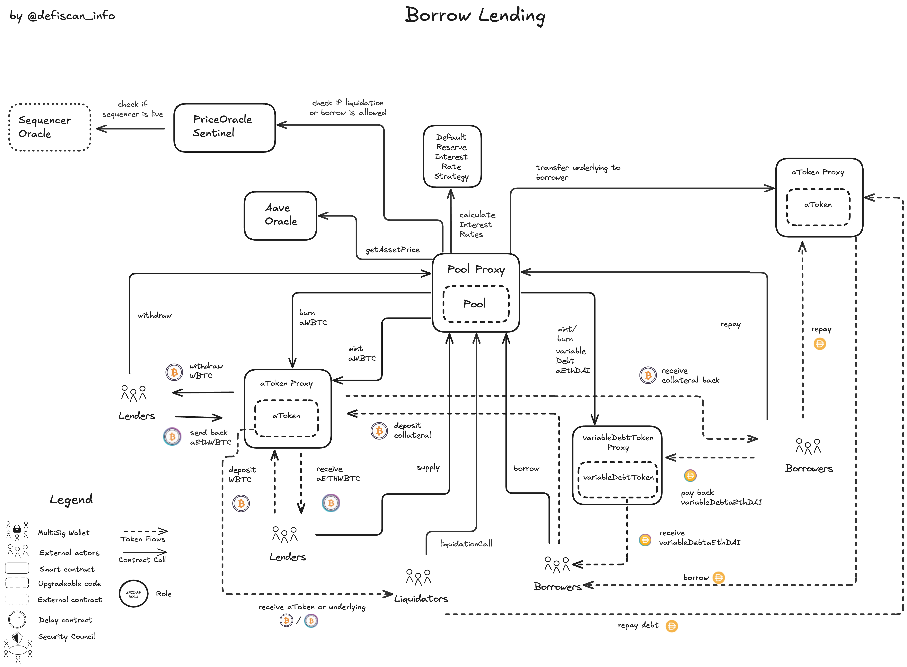
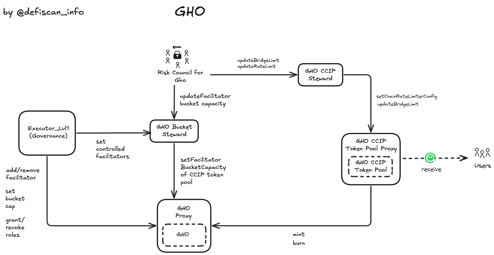

# Summary

Aave v3 is a lending protocol that allows users to lend and borrow different ERC20 assets. Users are able to create positions that consist of debt in different loan assets which is secured by different collateral assets. The lending market allows anyone to liquidate insolvent positions, based on an external price feed and specific collateral factors representing an asset's specific risk profile. Furthermore, instead of borrowing supplied assets, Aave V3 also issues its own stablecoin, `GHO`. Users can borrow and lend `GHO` like any other asset in the system.

The Aave DAO is Aave's onchain governance system, allowing `AAVE`, `stkAAVE` and `aAAVE` holders to govern over various aspects ranging across treasury management, risk management and strategic initiatives.

# Ratings

## Chain

The report is concerned with the Aave V3 instance deployed on Arbitrum. Arbitrum achieves a _Medium_ centralization risk score.

> Chain score: Medium

## Upgradeability

The Aave v3 protocol can be analyzed in a number of logical modules: Core Lend & Borrow, Reserve Parameters, Treasury, Aave Ecosystem Reserves & Rewards, GHO Stablecoin and Aave Governance. Each module exposes various degrees of control as explained in more detail below. Overall, these control vectors could result in the _loss of user funds_, _loss of unclaimed yield_ or otherwise _materially affect the expected performance_ of the protocol. All the control vectors, apart from the Emergency Admin's priviledge, are behind governance vote or if permissions are given to a multisig account, the permission is successfully restricted to prevent mis-use by using steward contracts. If the Emergency Admin adhered to the _security council standards_, the _Upgradeability_ Risk would achieve a _Medium_ score. With the current setup the Aave V3 core instance achieves a _High_ upgradeability score.

### Core Lending & Borrowing

This module forms the core of Aave v3's borrow & lending features and keeps track of users' positions and related protocol state. It centers around the `Pool` contract that governs how debt in the system can be built up, collateralized and how positions can be liquidated. It includes Aave v3's `aTokens` and `variableDebtTokens`. All of these contracts are fully upgradeable through the _Aave Governance_ [module](#aave-governance). An unintended (or malicious) contract upgrade can result in the _loss of user funds_, _loss of unclaimed yield_ or otherwise _materially affect the expected protocol performance_.

Special attention is required for the [Emergency Admin](#security-council) multisig (Aave Protocol Guardian Arbitrum), which owns the role `EMERGENCY_ADMIN` that allows to pause a single reserve or pause the entire core market instance (all reserves / the entire Pool). The [Emergency Admin](#security-council) can also disable the grace period for liquidations after discontinuing the pause and resume market activities. The actions by the [Emergency Admin](#security-council) are reversible, but require a governance vote. The [Emergency Admin](#security-council) does not adhere to the _security council requirements_, as the members of the multisig are considered _insiders_ of the Aave DAO (service providers and key voting power holders). In case of a market down turn the [Emergency Admin](#security-council) could mis-use the power to liquidate from a priviledged position. Quoting the [Aave V3 technical paper](https://github.com/aave-dao/aave-v3-origin/blob/main/docs/Aave_V3_Technical_Paper.pdf) page 16.

> Timed with a market crash, the attacker can turn the pool off, and then atomically perform the sequence (turn-on - liquidate - turn-off), allowing him to be the sole liquidator.

### Reserve Parameters

The _Reserve Parameters_ module is responsible for maintaining and updating critical risk parameters in the Aave v3 protocol. Among others, these include the set of enabled collateral and loan assets, their specific _liquidation loan-to-value_ ratios, _liquidation bonuses_ or _interest rate parameters_ and _borrow and supply caps_. An upgradeable `PoolConfigurator` contract controls these parameters with permissions to implement changes delegated to different, specialized, multisig accounts such as the [Emergency Admin](#security-council) or [Risk Council](#security-council). A system of _Roles_, implemented using OpenZeppelin's ACL pattern, and _Stewards_ ensures that these multisig accounts can only implement changes in a limited range or with a certain frequency. This system thus limits the risk of unintended updates through the multisig accounts. However, an upgrade of the `PoolConfigurator` contract could remove these safeguards, for instance by assigning permissions to an _EOA_ or multisig account directly, thus reintroducing the risk of _loss of funds_, _loss of unclaimed yield_ or a _material change of the expected protocol performance_.

### Treasury, Aave Ecosystem Reserves and Rewards System

This module manages how fees are collected, spent and third-party rewards allocated and claimed by users on Arbitrum. Fees taken across the Aave v3 protocol (and previous versions) are collected in the `TreasuryCollector`, a fully upgradeable contract. Through _Aave Governance_ and different (upgradeable) utility contracts these funds are distributed among _service providers_ and ecosystem initiatives.

### GHO Stablecoin

GHO is created on Ethereum Mainnet, but can be bridged to Arbitrum through Chainlink's CCIP (see [Autonomy section](#autonomy) for more details). The [Risk Council](#security-council) for Gho on Arbitrum, has permissions to configure the GHO CCIP Token Pool on Arbitrum, which mints GHO to a user address, when a user locks an equivalent amount of GHO on Ethereum Mainnet. The configuration entails rate limiting and bridge limiting (total amount of GHO on Arbitrum). The Risk Council furthermore can update the bucket capacity of listed facilitators. Facilitators are contracts that are allowed to mint and burn GHO. The only listed facilitator on Arbitrum is the GHO CCIP Token Pool.

The [Risk Council](#security-council) could temporarily block GHO cross-chain by setting low rate limiting, or setting the facilitator capacity below the current Arbitrum issuance, preventing new minting on Arbitrum even if users locked GHO on Ethereum Mainnet. This could lead to _temporarily loss of funds_. The _Aave Governance_ can revert restore user funds on Ethereum Mainnet with the permission to release GHO tokens from the corresponding mainnet GHO CCIP pool.

The _Aave Governance_ can upgrade the GHO contract or add/remove facilitators that can mint/burn GHO. This could open the possibility of uncontrolled minting or burning of GHO in case of an unintended upgrade. If abused, this control thus introduces a risk of _loss of funds_, _loss of unclaimed yield_ (accrued interest in GHO) or an otherwise _material impact on the expected protocol performance_ for GHO holders and Aave users.

### Aave Governance

_Aave Governance_ refers to Aave v3's onchain governance system which controls contract upgrades as well as other critical permissions as outlined above. We discuss the governance process itself in the _Exit Window_ [section](#exit-window) and here focus on upgradeability and control in this module itself.

The Aave Governance carries out votes on a Voting Netowrk (current options: Ethereum Mainnet, Polygon PoS or Avalanche). The votes occur on previously registered payloads that specify targeted contracts on Aave protocol instances. Therefore each chain with an active Aave V3 deployments has the Governance Executor infrastructure to register and execute successfully voted payloads.

An unintended proposal could change the _Aave Governance_ system and reassign its control to a less robust or fully centralized setup on Arbitrum via changing ownership over the `PayloadsController` or the `Executor_Lvl1`. In order to mitigate this risk the [Aave Governance v3 Guardian](#security-council) multisig account, adhering to the _Security Council_ requirements, can cancel the execution of unintended proposals. On the other hand, this control can be abused to censor regular proposals with majority support.

> Upgradeability score: High

## Autonomy

### CCIP

GHO on arbitrum solely relies on CCIP for bridging native GHO from Ethereum. Chainlink CCIP achieves a _High_ centralization risk score as discussed in a separate report [here](/protocols/ccip).

### Risk Oracle

Next to handing some control over market parameters to the _Risk Council_ via steward contracts, the Aave V3 instance on Arbitrum automates the borrow and supply cap automatically by handing off the exact values to a risk oracle implemented by Chaos Labs (service provider to the DAO). `EdgeRiskSteward` makes sure the values submitted by the `RiskOracle` contract are within guardrails to prevent abusive behavior. Upon failure of the `RiskOracle`, the _Risk Council_ can still update borrow and supply caps.

### Oracle and Prices

The Aave V3 protocol relies on Chainlink oracle feeds to price collateral and borrowed assets in the system. Chainlink price feeds achieve a _High_ centralization risk score as discussed in a separate report [here](/protocols/chainlink-oracles).

The protocol does currently have limited validation on asset prices provided by Chainlink. These checks include upper caps for stablecoins and LSTs and a sanity check that the price is above 0 for all assets. If the reported price by the price feed was below 0, a fallback oracle would be queried.

Aave has currently no fallback oracle price feeds instantiated. As a consequence if the price was equal to or below 0, user actions on the `Pool` contract that require a price would revert.

The replacement of a stale or untrusted oracle price feed requires a governance vote on permission level 1 (see Exit Window).

### Cross-Chain Vote

Votes are currently held on Polygon by using a system called a.DI for cross-chain communication developed by the Aave Community (BGD Labs).

The a.DI does not rely on a single bridge provider to move messages across different networks, but uses a 2/3 threshold, sending the messages in parallel via different bridge providers, reducing the dependency on a single provider.

If the community cannot or does not want to use the a.DI or the other voting networks, then the community still can carry out the vote on Ethereum Mainnet. This would eliminate the cross-chain dependencies for voting.

The cross-chain voting system has low centralization risk because of its fault tolerant design, while the oracle system is currently unmitigated.

For transmitting the voting results from Ethereum Mainnet to Arbitrum, the cross-chain infrastructure by Arbitrum is used (`ArbAdapter`), inheriting the trust assumptions by using Arbitrum.

> Autonomy score: high

## Exit Window

Critical permissions, including contract upgrades, are controlled by _Aave Governance_ and an [Emergency Admin](#security-council) multisig account.

Two levels of permissions are separated in the (current) implementation of _Aave Governance_: _Level 2_ defines permissions on the governance system itself and on the `AAVE` token contract, _Level 1_ covers the remaining permissions. On the Arbitrum deployment only _Level 1_ permissions exist.

AAVE holders (also stkAAVE, aAAVE) are able to create new proposals (requires 80,000 / 200,0000 votes for Level 1 / Level 2) and vote on proposals (at least 320,000 / 1,040,000 votes are required for a valid proposal and a voting differential (yes minus no votes) of 80,000 / 1,040,000 votes).

Votes start 1 day after proposal creation and the voting period is 10 days for _Level 2_, and 3 days for _Level 1_ proposals.

The execution of successful votes is blocked by an Exit Window with a delay of 7 days for _Level 2_ and 1 day for _Level 1_ permissions. While these Exit Windows do not qualify for a _Low_ or _Medium_ score, the risk of unwanted updates is further mitigated by the [Aave Governance V3 Guardian](#security-council) multisig, which is able to cancel unintended governance proposals and which adheres to the _Security Council_ requirements.

However, these safeguards do only apply to permissions controlled by _Aave Governance_. The [Emergency Admin](#security-council) multisig too holds critical permissions which are not protected with an Exit Window or _Security Council_ setup. Specifically, the [Emergency Admin](#security-council) is able to pause individual Aave markets or the entire protocol as well as disabling the liquidation grace period. If compromised e.g. during a high-volatility market, these permissions could be taken advantage of, in order to execute controlled liquidations.

Meanwhile the permissions of multisig accounts [Risk Council](#security-council) for `Gho` and for the `Pool` contract are sufficiently restricted by steward contracts in terms of frequency of updates and magnitude of the updates, such that an exit window is not required.

> Exit Window score: High

## Accessibility

The frontend of Aave V3 app is open source. The frontend allows to interact with all instances. Each commit (ie each change to the code base) is published to IPFS (https://github.com/aave/interface/releases).

In addition to that Aave is also available through [DeFi Saver](https://app.defisaver.com/aave).

https://aave.com/help/aave-101/accessing-aave

> Accessibility score: low

## Conclusion

The Aave v3 Arbitrum deployment achieves _High_ centralization risk scores for its _Upgradeability_, _Autonomy_ and _Exit Window_ dimensions. It thus ranks **Stage 0**.

The project mitigates the _Exit Window_ risk by having a Governance Guardian that suffices the _Security Council_ setup.

The protocol could reach **Stage 1** by implementing fallback mechanism around the Chainlink oracle (or Chainlink adopting a _Security Council_ setup for its own multisig account).

The project additionally could advance to **Stage 2** if the on-chain governance (DAO) used a 30-day _Exit Window_ instead of only 7 days.

# Reviewer Notes

⚠️ During our analysis, we identified a unverified role (not mentioned in the docs https://github.com/bgd-labs/aave-permissions-book/blob/main/out/ARBITRUM_ONE-V3.md#admins). Role Id is 0xd1d2cf869016112a9af1107bcf43c3759daf22cf734aad47d0c9c726e33bc782. The owners of this role are related to the V2 to V3 migration.

# Protocol Analysis

## Upgradeable Pool Contract and mutable reserve parameters

## GHO

# Dependencies

## Price Oracle

Aave stores the oracle price feeds in the `AaveOracle` contract. The price feeds can be one of 3 kind,

1. regular un-mitigated Chainlink price feed (for all volatile assets)
2. a `PriceCapAdapterStable` contract which wraps the regular Chainlink price feed and adds an upper cap to the reported stablecoin price, if the price is above the cap, the cap is returned, otherwise the price is returned
3. a price cap adapter for LSTs which checks the price ratio of the asset/underlying and compares it to an upper cap computed by the maximum allowed growth rate and the duration since the last check

The Chainlink oracle system itself is upgradeable potentially resulting in the publishing of unintended or malicious prices. The permissions to upgrade are controlled by a multisig account with a 4-of-9 signers threshold. This multisig account is listed in the Chainlink docs but signers are not publicly announced. The Chainlink multisig thus does not suffice the Security Council requirements specified by either L2Beat or DeFiScan resulting in a High centralization score.

## Risk Oracle

Besides the [Risk Council](#security-council) having control over market parameters via steward contracts, the Aave V3 instance on Arbitrum automates the borrow and supply cap automatically by handing off the updates of this caps to a risk oracle implemented by Chaos Labs (service provider to the DAO). This allows automatic updates of these risk parameters based on risk models in real time. `EdgeRiskSteward` makes sure the values submitted by the `RiskOracle` contract are within guardrails to prevent abusive behavior by malicious intent.

## Price Oracle Sentinel

Aave V3 instances on Layer 2s make use of the Sequencer oracle offered by Chainlink. This oracle informs smart contracts whether the sequencer of the respective rollup is currently offline. Sophisticated actors can force transactions on native rollups via posting them directly on Ethereum mainnet. To prevent sophisticated actors to liquidate users during sequencer downtime, Aave implemented the `PriceOracleSentinel` contract that prevents liquidations, if the oracle reports downtime of the sequencer. If this sequencer oracle does not report sequencer downtime, the protection for simple users fails. If the oracle reports downtime even if there is no downtime, the system's capability for liquidations is un-necessarily blocked for the grace period (1 hour). Even if the `PriceOracleSentinel` fails the protocol impact on users is marginal, thus the score for this dependency risk is low.

## CCIP for GHO

The GHO tokens on Arbitrum are bridged from Mainnet via [CCIP](https://docs.chain.link/ccip/directory/mainnet/token/GHO). CCIP stands for Cross-Chain Interoperability Protocol and is a product by Chainlink.

The tokens are bridged by a token lock/release mechanism on mainnet, and a mint/burn mechanism on Arbitrum. For example a user locks GHO on mainnet, and an equivalent amount gets minted by the GHO contract on Arbitrum. The GHO token on Arbitrum, unlike the GHO token on mainnnet, is upgradeable.

Chainlink CCIP is covered in more detail in our separate report [here](/protocols/ccip).

## Layer 1 Governance

Aave V3 on Arbitrum relies on the governance smart contracts on Ethereum Mainnet and bridging votes from Polygon to mainnet. See the mainnet core instance report for a detailed system breakdown and analysis [here](./aave).

# Governance

Community vote is enforced on Arbitrum through the following process:

1. The community registers a payload at the `PayloadsController` contract on Arbitrum
2. The community starts a vote on the Governance contract on Ethereum Mainnet specififying Arbitrum and the payload Id
3. The vote starts after 1 day delay and gets ported via a.DI to a voting network (currently Polygon)
4. When the vote has passed, the result is transferred back to Ethereum Mainnet
5. The vote can be executed. The call to execute the payload is bridged to Arbitrums PayloadController
6. After the Exit Window has passed, the community can trigger execution.

## Security Council

This table shows the external permission owners and how they are rated against the security council criteria.

| External Permission Owner                        | Address                                                                                                              | Type         | At least 7 signers | At least 51% threshold | Above 50% non-insiders signers | Signers publicly announced                                                                                                                  |
| ------------------------------------------------ | -------------------------------------------------------------------------------------------------------------------- | ------------ | ------------------ | ---------------------- | ------------------------------ | ------------------------------------------------------------------------------------------------------------------------------------------- |
| Executor_lvl1                                    | [0xFF1137243698CaA18EE364Cc966CF0e02A4e6327](https://arbiscan.io/address/0xFF1137243698CaA18EE364Cc966CF0e02A4e6327) | Contract     | n/a                | n/a                    | n/a                            | n/a                                                                                                                                         |
| Aave Governance Guardian Arbitrum                | [0x1a0581dd5c7c3da4ba1cda7e0bca7286afc4973b](https://arbiscan.io/address/0x1a0581dd5c7c3da4ba1cda7e0bca7286afc4973b) | Multisig 5/9 | ✅                 | ✅                     | ✅                             | ✅ ([source](https://aave.com/docs/primitives/governance#community-guardians-protocol-emergency-guardian))                                  |
| Aave Protocol Guardian Arbitrum (EmergencyAdmin) | [0xcb45e82419baebcc9ba8b1e5c7858e48a3b26ea6](https://arbiscan.io/address/0xcb45e82419baebcc9ba8b1e5c7858e48a3b26ea6) | Multisig 5/9 | ✅                 | ✅                     | ❌                             | ✅ ([source](https://aave.com/docs/primitives/governance#community-guardians-governance-emergency-guardian))                                |
| Risk Council                                     | [0x47c71dFEB55Ebaa431Ae3fbF99Ea50e0D3d30fA8](https://arbiscan.io/address/0x47c71dFEB55Ebaa431Ae3fbF99Ea50e0D3d30fA8) | Multisig 2/2 | ❌                 | ✅                     | ❌                             | ✅ ([source](https://vote.onaave.com/proposal/?proposalId=197&ipfsHash=0x2f41406557b0fc69c256916c066a77c57434fa77ccab3cfe56c8db6a4f306c01)) |
| Risk Council (for Gho)                           | [0x8513e6F37dBc52De87b166980Fa3F50639694B60](https://arbiscan.io/address/0x8513e6F37dBc52De87b166980Fa3F50639694B60) | Multisig 3/4 | ❌                 | ✅                     | ❌                             | ❌                                                                                                                                          |
| Guardian (PoolExposureSteward)                   | [0x22740deBa78d5a0c24C58C740e3715ec29de1bFa](https://arbiscan.io/address/0x22740deBa78d5a0c24C58C740e3715ec29de1bFa) | Multisig ?/? | ❌                 | ✅                     | ❌                             | ❌                                                                                                                                          |
| BGD Labs (Retry Role)                            | [0x1fcd437d8a9a6ea68da858b78b6cf10e8e0bf959](https://arbiscan.io/address/0x1fcd437d8a9a6ea68da858b78b6cf10e8e0bf959) | Multisig 2/3 | ❌                 | ✅                     | ❌                             | ✅ ([source](https://github.com/bgd-labs/aave-permissions-book/blob/main/out/ARBITRUM_ONE-V3.md#guardians))                                 |
| ACI Automation (Bot)                             | [0x3Cbded22F878aFC8d39dCD744d3Fe62086B76193](https://arbiscan.io/address/0x3Cbded22F878aFC8d39dCD744d3Fe62086B76193) | EOA          | n/a                | n/a                    | n/a                            | n/a                                                                                                                                         |
| CleanUp Admin                                    | [0xdeadD8aB03075b7FBA81864202a2f59EE25B312b](https://arbiscan.io/address/0xdeadD8aB03075b7FBA81864202a2f59EE25B312b) | Multisig 2/3 | ❌                 | ✅                     | ❌                             | ✅ ([source](https://vote.onaave.com/proposal/?proposalId=270&ipfsHash=0x4043001b72316afa6b6728772941bfa08f127b66c1c006316a3f20510b6738ab)) |
| AaveStewardInjectorCaps guardian                 | [0x87dFb794364f2B117C8dbaE29EA622938b3Ce465](https://arbiscan.io/address/0x87dFb794364f2B117C8dbaE29EA622938b3Ce465) | Multisig 1/2 | ❌                 | ❌                     | ❌                             | ❌                                                                                                                                          |
| Chaos Labs' Multi-sig?                           | [0x14C3fe96adf6068C2D5616D239fc93f61D85dF85](https://arbiscan.io/address/0x14C3fe96adf6068C2D5616D239fc93f61D85dF85) | Multisig 2/4 | ❌                 | ❌                     | ❌                             | ❌                                                                                                                                          |
| Chaos Labs' Bot                                  | [0x42939e82df15afc586bb95f7dd69afb6dc24a6f9](https://arbiscan.io/address/0x42939e82df15afc586bb95f7dd69afb6dc24a6f9) | EOA          | n/a                | n/a                    | n/a                            | n/a                                                                                                                                         |

💡 The BGD Labs maintains a public markdown page on the existing permissions to inform its users: https://github.com/bgd-labs/aave-permissions-book/blob/main/out/ARBITRUM_ONE-V3.md
