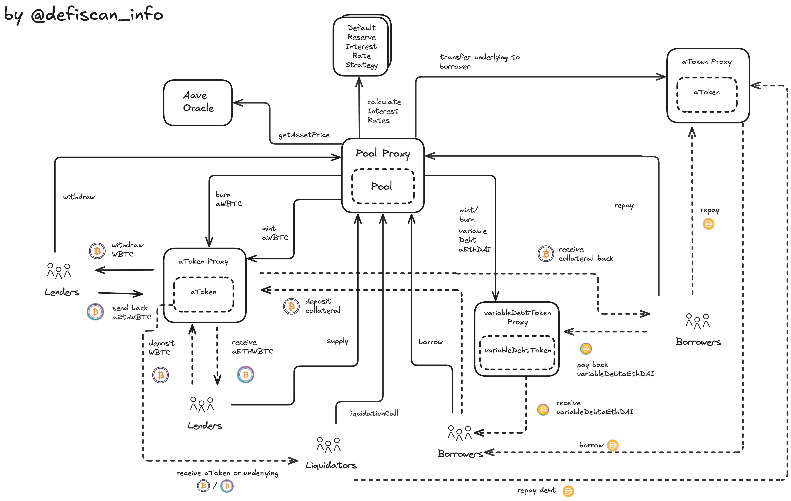
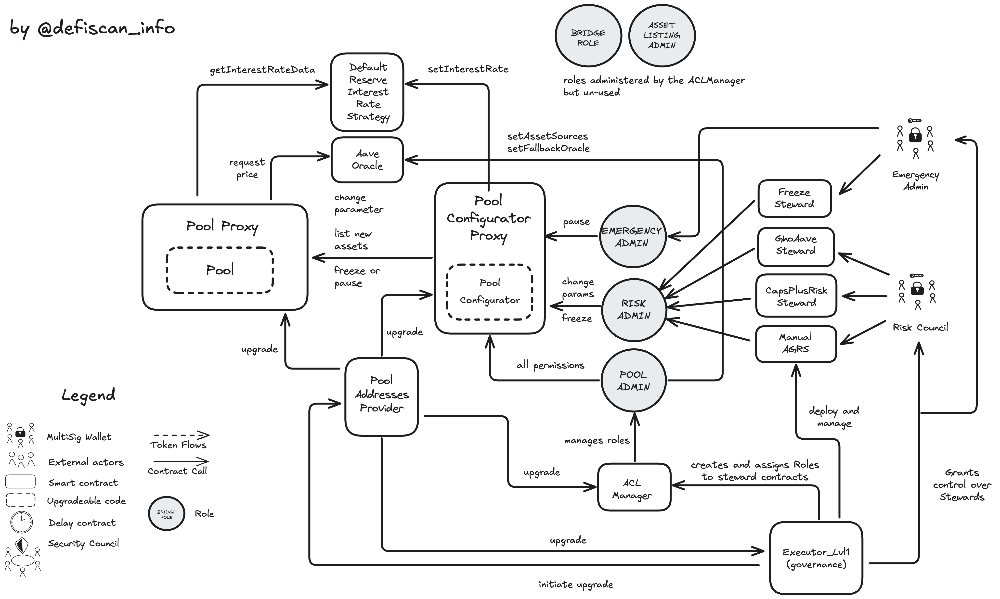
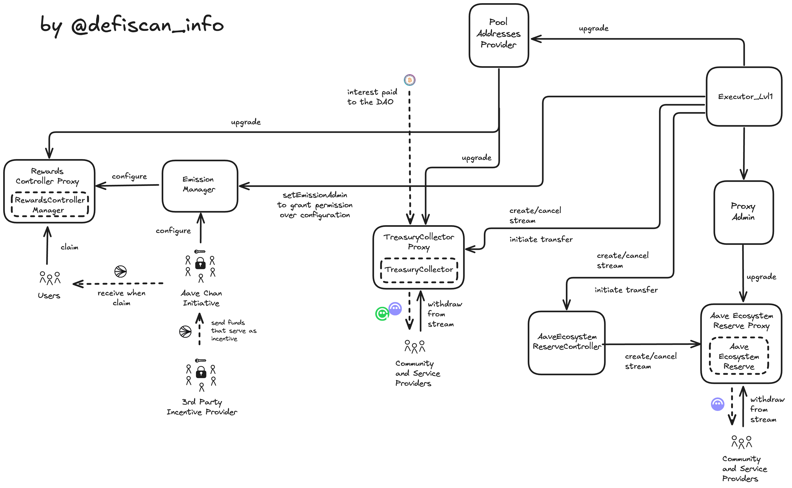

# Summary

Aave V3 allows users to lend and borrow Erc20 tokens and earn yield for lending. Aave V3 also created its own stablecoin called GHO.

On Ethereum Mainnet 3 markets exist mainnet, Lido and EtherFi. Markets Prime (Lido) and EtherFi exist to allow efficient parameters for borrow and lending while containerize the risk associated with leveraged staked ETH. This report focuses on the Mainnet market (V3).

# Overview

## Chain

The report is concerned with the Aave V3 deployment on Ethereum mainnet.

> Chain score: low

## Upgradeability

Aave V3 allows for the upgrade of contracts. Those upgrades can change the logic and implementation of the markets, the reserves, the governance and the smart contract infrastructure around them. The upgrades could result in the loss of funds or the loss of unclaimed yield of users.

The permission to upgrade the protocol is controlled by an on-chain governance (DAO) with `AAVE`, `aAAVE` or `stkAAVE` token holders submitting and voting on DAO proposals. A multisig account, the `Aave V3 Governance Guardian` has the permission to cancel proposals to mitigate the risk of malicious or otherwise unintended proposals. The Governance Guardian can potentially be abused to censor proposals.

Furthermore, another multisig account, the `EmergencyAdmin`, has the permission to pause markets, temporarily disabling and withdrawing assets, if suspicious activity is detected. This role can potentially be abused to freeze funds and unclaimed yield in the protocol.

### Stewards

The Aave system makes use of a concept called steward contract. These steward contracts sit between the contract with upgradeable parameters and a multisig. The steward enforces rate limiting and maximal changes to the current parameter value in absolute or in relative terms. This allows to reduce trust assumptions to the empowered councils and increases the adaptability to changing market environments. Stewards that are part of Aave V3 are:

- `FreezingSteward`
- `CapsPlusRiskSteward`
- `ManualAGRS`
- `SvrOracleSteward`
- `GhoAaveSteward`
- `GhoGsmSteward`
- `GhoBucketSteward`
- `GhoCCIPSteward`
- `ClinicSteward`
- `GranularGuardianAccessControl`

Learn more about the stewards in the permission table.

> Upgradeability score: high

## Autonomy

### Oracle and Prices

The Aave V3 protocol relies on Chainlink oracle feeds to price collateral and borrowed assets in the system. The protocol does not validate asset prices (apart from checking that they are above 0) returned by Chainlink. Aave V3 has the option to install a fallback oracle mechanism but is currently not used. The replacement of a stale or untrusted oracle feed requires a governance vote on level 1 (see Exit Window).

The Chainlink oracle system itself is upgradeable without decentralized ownership over those permissions. This dependency thus introduces centralization risk in the Aave V3 protocol.

### Cross-Chain Vote

Votes are currently held on Polygon by using a system called a.DI for cross-chain communication developed by the Aave Community (BGD Labs).

The a.DI does not rely on a single bridge provider to move messages across different networks, but uses a 2/3 threshold, sending the messages in parallel via different bridge providers, reducing the dependency on a single provider.

If the community cannot or does not want to use the a.DI or the other voting networks, then the community still can carry out the vote on Ethereum Mainnet. This would eliminate the cross-chain dependencies for voting.

The cross-chain voting system has low centralisation risk as because of its fault tolerant design, while the oracle system is currently unmitigated.

> Autonomy score: high

## Exit Window

Permissions, including protocol upgrades, are controlled by an onchain governance system.

There are two levels of permissions that can be executed by the DAO. Level 2 for permissions on the governance and AAVE token contract, and Level 1 for the remaining system.

AAVE holders (also stkAAVE, aAAVE) are able to create new proposals (requires 80,000 / 200,0000 votes for level 1 / level 2) and vote on proposals (at least 320,000 / 1,040,000 votes are required for a valid proposal and a voting differential (yes minus no) of 80,000 / 1,040,000 votes). The vote starts 1 day after the proposal was created.

The voting period is 10 days for Level 2, and 3 days for Level 1.

The two levels have different time locks before the proposal is executed after a vote has passed. 7 days for Level 2 and 1 day for Level 1 executed permissions.

While Level 1 and Level 2 do not meet the 30-day exit window requirement, Level 2 meets the 7-day exit window requirement, but high impact upgradeability permissions of Level 1 are not protected by a 7-day exit window.

However, malicious or unintended proposals can be intercepted by the Aave Governance V3 Guardian multisig account, which satisfies the Security Council requirements.

> Exit Window score: high

## Accessibility

The frontend of Aave V3 app is open source. Each commit (ie each change to the code base) is published to IPFS (https://github.com/aave/interface/releases).

In addition to that Aave is also available through [DeFi Saver](https://app.defisaver.com/aave).

https://aave.com/help/aave-101/accessing-aave

> Accessibility score: low

## Conclusion

The Aave-v3 Ethereum mainnet protocol achieves High centralization risk scores for its Upgradeability, Autonomy and Exit Window dimensions. It thus ranks **Stage 0**.

The project mitigates the Exit Window risk by having a Governance Guardian that suffices the Security Council setup.

The protocol could reach **Stage 1** by implementing fallback mechanism around the Chainlink oracle (or Chainlink adopting a Security Council setup for its own multisig account).

The project additionally could advance to **Stage 2** if the on-chain governance (DAO) used a 30-day exit window instead of only 7 days.

# Technical Analysis

## Upgradeable Pool Contract and mutable reserve parameters

The center of the Aave V3 market is the contract called `Pool.sol` (`0x87870Bca3F3fD6335C3F4ce8392D69350B4fA4E2`). Each supported asset that can be supplied and/or borrowed is attached to a reserve in this pool. A reserve specifies the market parameters for this asset (Loan-to-Value, Liquidation Threshold, Supply and Borrow Caps and the interest rate model). Additionally, each asset (ie reserve) can be enabled or disabled for borrowing, if disabled, the asset can only be supplied as collateral for borrowing other assets. The assets are technically deposited to the respective aToken contracts (the receipt token of supplied assets) of a given reserve.

The `Pool` contract is completely upgradeable via the proxy-pattern. The permission to update the pool contract via the proxy is owned by the on-chain governance (DAO).

Moreover, the control over market parameters, emergency freezing and pausing is additionally handed to multi-sigs and off-chain systems through steward contracts which allows the governance to delegate certain permissions in a fine grained manner as seen in the diagram. The `PoolConfigurator` contract is the contract that has the permissions to change any reserve parameter. It mirrors the `Pool` functions that change reserve parameters and decorates them with access control to certain roles. The capability to pause and freeze is assigned to `EMERGENCY_ADMIN` role, while LTV or Supply and Borrow Caps are assigned to the `RISK_ADMIN` role. Steward contracts in turn are regular smart contracts that mirror a specific selection of the endpoints on the `PoolConfigurator` contract, but with guardrails for changing parameters and they also include rate limiting to certain functions. Councils which are regular multi-sigs are the permission owners of this steward functions and thus have only limited control over reserve parameters which prevents malicious behavior and reduces trust assumptions. The Governance itself can also update reserve parameters if the community wants to. Governance has direct permissions on the `PoolConfigurator` endpoints via the role called `POOL_ADMIN`.

While `RISK_ADMIN` manages liquidity and market risk on a continuous basis in certain cases protection of user funds requires a halt of the system.
In the diagram above the `Emergency Guardian` is shown owning the `EMERGENCY_ADMIN` role directly and owning permissions on the `FreezeSteward` contract. This is a 5 of 9 multi-sig consisting various parties selected by the community.

## Governance

The on-chain governance system of Aave is multi-chain by design. The creation of proposals and voting on the proposals in permissionless. In this paragraph, the architecture and existing permissions are highlighted.

To get to the stage of voting and creating an on-chain proposal a few prior steps need to be passed to have sufficient probability of being accepted through an on-chain vote.

1. The proposal was discussed with the community and incorporated feedback
2. A temperature check on Snapshot is conducted. This vote is not binding, but it helps determining if sufficient support is within the community to move the proposal forward.
3. ARFC (Aave Request for Final Comments) where service provider and community members prepare the AIP
4. AIP (Aave Improvement Proposal) which includes the contract payload submission
5. Actual on-chain vote
6. Execution

### AIP - Payload submission

Payload submission is technically permissionless. The payload is created by calling `createPayload` on the `PayloadsController` contract. The payload is an array of actions and each action contains information that specifies which contract to call with what data.

### Voting

Voting can be held on either Ethereum Mainnet, Polygon (PoS) or Avalanche. When proposal is created (`createProposal`) the specified `VotingPortal` address determines the voting network of the particular vote. Once the voting is activated by the community, the details of the vote (proposal id, snapshot and voting duration) are sent to the voting network cross-chain with the general purpose Aave delivery infrastructure (a.DI). Mainnet AAVE, aAAVE and stkAAVE token holders can vote on the voting network (e.g Polygon PoS) via the `VotingMachine` contract. The `VotingMachine` contract uses state tree hashes to validate the voting power of each voter. Once the voting duration is over, users can call `closeAndSendVote` which sends the results back to mainnet.

### Execution

Once the proposal passes, the function `executeProposal` on the `AaveGovernanceV3` allows to execute the approved proposal, which forwards the message to the `CrossChainController` (calling `forward`). The CCC forwards the proposal to each chain where the proposal must be executed. If the proposal is also dedicated to the deployment on Ethereum, the payload id is forwarded to the `SameChainAdapter` that calls the function `receiveCrossChainMessage` on the `PayloadsController` contract, which queues the payload to be executed. The payload was previously created on the `PayloadsController` by calling `createPayload` which is needed to be referenced in the governance proposal (see previous section). Anyone can call `executePayload` once sufficient time has passed (timelock). By calling `executePayload` on the `PayloadsController` `executeTransaction` on the `Executor Lvl1` contract will be triggered. A technical detail, if in this report it is mentioned that the governance owns the permission, it is actually (if we are very precise) this `Executor Lvl1` contract (as shown in the permission table) because community approved payloads will act from this contract. Alternatively also the `Executor Lvl2` can be the chosen executor by the payload if it requires permission to update the AAVE token or the Aave governance contract.

In case of a malicious proposal the `Aave Governance V3 Guardian` can step in and stop the malicious proposal of being executed at the level of the `Payloads Controller` or at the Governance contract level (`AaveGovernanceV3`). Note this is can happen even if the proposal is supported by the majority of the community.

## Smart Contract Upgrade Flow

Many contracts of the Aave V3 system are directly upgradeable through a proxy pattern (see in the contract table for proxy keyword). The `Executor` contract would call the `upgradeTo` and point to the referenced new implementation contract that is specified in the payload. Additionally to the proxy upgrade pattern, Aave V3 has a contract called `PoolAddressesProvider` which serves as a registry of contracts. Through this contract upgrades can be made by deploying a new contract and switching the reference inside the `PoolAddressesProvider` as contracts in the Aave V3 system rely on `PoolAddressesProvider` as a registry of Aave V3 contracts. Also the `PoolAddressesProvider` is owner of many crucial contracts as well.

Contracts that `PoolAddressesProvider` owns or can set are

- `Pool`
- `PoolConfigurator`
- `ACLManager`
- `Governance Executor`

## Treasury

Treasury is funded through reserve fees collected when users pay back debt. The treasury contract is called `Collector` and allows the Aave DAO to pay service providers and fund incentives to grow the Aave ecosystem.

The DAO community can vote on proposals that call `createStream` or `transfer` on the `Collector` contract to spend tokens on behalf of the DAO.

Additionally, the DAO owns permissions to create streams and initiate transfers from the Ecosystem Reserve which holds Aave tokens. The DAO executes via a controller contract called `AaveEcosystemReserveController`.

Both the treasury and the Aave reserve are upgradeable contracts which are sensitive to update, as they hold a lot of value.

### Incentives

3rd parties can list incentives additional to the interest rate paid to the suppliers of capital via the `EmissionManager`. The governance admits the emission admin role to an on-chain account that can configure the details of a specific incentive (token, amount of tokens, duration). The tokens are claimed from an account external of the Aave V3 system (for example the ACI multi-sig) via the `RewardsController` contract.
As a consequence the trust assumptions on receiving the additional incentives has to be studied on a case-by-case basis.

## GHO

GHO is the native stablecoin of Aave. The actual total supply of GHO is governed by the facilitators, which are a set of contracts that have permission to call mint on GHO. But the total minted GHO cannot exceed an amount set by the DAO. This is enforced by a limit on each facilitator (bucket cap).

Currently the facilitators are

- GhoAToken (Aave market)
- GhoDirectMinter
- GHOFlashMinter
- GHO Stability Modules (USDC, USDT)

Via the `GSM` GHO is redeemable for `USDC` and `USDT` at a 1:1 rate up to a certain USDC and USDT cap. The GHO dedicated multi-sig `Risk Council` can update the exposure caps to USDC/USDT via the `GhoGsmSteward` (read about steward concept in the overview section). Upon receiving USDC/USDT `GSM` supplies the stablecoins to the Aave USDC and USDT reserve and issues freshly minted GHO to the seller of the stablecoins. Similarly if the user buys USDC or USDT from the GSM, the returned GHO is burned.

GHO can be borrowed from the reserve at a dynamic interest rate. The total borrowed GHO cannot exceed the bucket cap. Governance and the Risk Council manage the interest rate by supplying fresh GHO to the reserve via the `GhoDirectMinter` or they can withdraw and burn GHO from the reserve increasing the interest rate.

