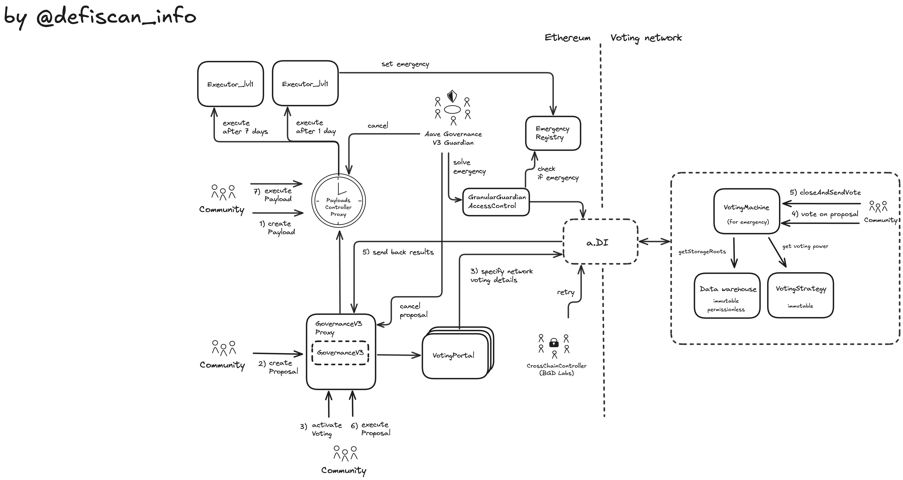

# Summary

Aave V3 allows users to lend and borrow Erc20 tokens and earn yield for lending.

On Ethereum Mainnet 3 markets exist mainnet, Lido and EtherFi. Markets Lido and EtherFi exist to allow efficient parameters for borrow and lending while containerize the risk associated with leveraged staked ETH. This report focuses on the Mainnet market (V3).

# Overview

## Chain

The report is concerned with the Aave V3 deployment on Ethereum mainnet.

> Chain score: high

## Upgradeability

Aave V3 allows for the upgrade of contracts. Those upgrades can change the logic and implementation of the markets, the reserves, the governance and the smart contract infrastructure around them. The upgrades could potentially result in the loss of funds or the loss of unclaimed yield of users. To enforce only positive and non-harmful upgrades of the contracts an on-chain governance (DAO) is set in place that reflects the intentions of the Aave Community.

In case of a malicious governance hijack by claiming enough voting power to pass a vote, the `Aave V3 Governance Guardian` can step in and veto the passed vote from being enforced.

Aave V3 also allows for changes of market parameters to manage the market and liquidity risk that come with offering borrow-lending operations to users. The updates to this parameters are ultimately executed via the `Risk Council`, but the Risk Council interacts via a layered system of contracts which restricts the permissions with guardrails, such that changes are extremely unlikely to lead to loss of funds or yield.

> Upgradeability score: high

## Autonomy

### Oracle and Prices

The Aave V3 protocol relies on Chainlink oracle feeds to price collateral and borrowed assets in the system. The protocol does not validate asset prices (apart from checking that they are above 0) returned by Chainlink. Aave V3 has the possibility to install a fallback oracle mechanism but is currently not-used or instantiated. The replacement of a stale or untrusted oracle feed requires a Aave V3 governance vote with a delay (see Exit Window).

The Chainlink oracle system itself is upgradeable without decentralized ownership over those permissions. This dependency thus introduces centralization risk in the Aave V3 protocol.

### Bridging and Votes

Bridging voting power

> Upgradeability score: high

## Exit Window

The suggested changes of a proposal are enforced after a timelock delay of either one day or 7 days.

> Exit Window score: low

## Accessibility

The frontend of Aave V3 app is open source. Each commit (ie each change to the code base) is published to IPFS (https://github.com/aave/interface/releases).

> Accessibility score: high

## Conclusion

Aave V3 is rated **Stage 1** because of the possibility to upgrade contracts with no limits on logic changes which in the worst scenario could lead to loss of funds and the upgrades are not sufficiently protected by a long enough exit window (>= 30 days) in combination with the on-chain governance.

The project could reach **Stage 2** if the on-chain governance (DAO) used a 30-day exit window instead of only 7 days.

# Technical Analysis

## Upgradeable Pool Contract and mutable reserve parameters

The center of an Aave V3 market is the liquidity pool contract called `Pool.sol`. Users can supply or borrow assets to this contract (`0x87870Bca3F3fD6335C3F4ce8392D69350B4fA4E2`). Each supported asset that can be supplied and/or borrowed is attached to a reserve in this pool. A reserve specifies the market parameters for this asset (Loan-to-Value, Liquidation Threshold, Supply and Borrow Caps and the interest rate model). Additionally, each asset (ie reserve) can be enabled or disabled for borrowing, if disabled, the asset can only be supplied as collateral for borrowing other assets.

The `Pool` contract is completely upgradeable via the proxy-pattern. The right to update the pool contract via the proxy lies only with the on-chain governance (DAO).

Additionally, all parameters of the reserves are also fully mutable (parameters are mentioned in previous paragraph). The unrestricted ability to change these parameters also only lies with the on-chain DAO.

However, the control over market parameters, emergency freezing and pausing is additionally handed to multi-sigs and off-chain systems through a layered system which allows the governance to delegate certain permissions in a fine grained manner. The complete list of roles and role owners is shown in the list of roles.

The diagram shows how Aave V3 manages control over Reserve parameters via a set of roles, stewards and councils. The illustration is not exhaustive, it is missing some roles and the detailed mechanism on how to create and delegate roles. The `PoolConfigurator` contract is the contract that has the permissions to change any reserve parameter. It mirrors the `Pool` functions that change reserve parameters and decorates them with access control to certain roles. For example pausing and freezing are assigned to `EMERGENCY_ADMIN` role, while LTV or Supply and Borrow Caps are assigned to `RISK_ADMIN`. Steward contracts in turn are regular smart contracts that mirror a specific selection of the endpoints on the `PoolConfigurator` contract, but with guardrails for changing parameters and they also include rate limiting to certain functions. Councils which are regular multi-sigs are the permission owners of this steward functions and thus have only limited control over reserve parameters which prevents malicious behavior. The Governance itself can also update reserve parameters if the community wants to and has direct permissions on the `PoolConfigurator` endpoints via the role called `POOL_ADMIN`.

While `RISK_ADMIN` manages liquidity and market risk on a continuous basis my nuding supply and demand, in certain cases protection of user funds requires a halt of the system.
In the diagram above the `Emergency Guardian` is shown owning one role directly `EMERGENCY_ADMIN` and owning permissions on the `FreezeSteward` contract. This is a 5 of 9 multi-sig consisting various parties selected by the community.

## Governance

mention: Governance Level 1 Executor == Short

The on-chain governance system of Aave is multi-chain by design. The creation of proposals and voting on the proposals in permissionless. In this paragraph, the architecture and existing permissions are highlighted.

To get to the stage of voting and creating an on-chain proposal a few prior steps need to be passed to have sufficient probability of being accepted through an on-chain vote.

1. The proposal was discussed with the community and incorporated feedback
2. A temperature check on Snapshot is conducted. This vote is not binding, but it helps determining if sufficient support is within the community to move the proposal forward.
3. ARFC (Aave Request for Final Comments) where service provider and community members prepare the AIP
4. AIP (Aave Improvement Proposal) which includes the contract payload submission
5. Actual on-chain vote
6. Execution

### AIP - Payload submission

Payload submission is technically permissionless. The payload is created by calling `createPayload` on the `PayloadsController` contract. The payload is an array of actions and each action contains information that specifies which contract to call with what data.

### Execution

Proposals are voted on in the `AaveGovernanceV3` contract. Once the proposal passes the function `executeProposal` on the `AaveGovernanceV3` allows to execute the approved proposal, which forwards the message to the `CrossChainController` (calling `forward`) that forwards the proposal to each chain where the proposal must be executed. If the proposal is also dedicated to the deployment on Ethereum, the call is forwarded to the `SameChainAdapter` that calls the function `receiveCrossChainMessage` on the `PayloadsController` contract, which queues the payload to be executed. The payload was previously created on the `PayloadsController` by calling `createPayload` which is needed to be referenced in the governance proposal. Anyone can call `executePayload` once sufficient time has passed (timelock). By calling `executePayload` on the `PayloadsController` `executeTransaction` on the `Executor Lvl1` contract will be triggered. A technical detail, if in this report it is mentioned that the governance owns the permission, it is actually (if we are very precise) this `Executor Lvl1` contract (as shown in the permission table) because community approved payloads will act from this contract.

In case of a malicious proposal the `Aave Governance V3 Guardian` can step in and stop the malicious proposal of being executed at the level of the `Payloads Controller`. Note this is can happen even if the proposal is supported by the majority of the community.

Additionally proposals on the `AaveGovernanceV3` contract (before proposal is executed) can be cancelled by BGD Labs with this [EOA](https://etherscan.io/address/0xEAF6183bAb3eFD3bF856Ac5C058431C8592394d6). This places significant power to Bored Ghost Developing Labs as the governance can not update itself to remove this veto permission. Note this is can happen even if the proposal is supported by the majority of the community.

## Smart Contract Upgrade Flow

Many contracts of the Aave V3 system are directly upgradeable through a proxy pattern (see in the contract table for proxy keyword). The `Executor` contract would call the `upgradeTo` after deploying a new implementation contract. Additionally to the proxy upgrade pattern, Aave V3 has a contract called `PoolAddressesProvider` which serves as a registry of contracts. Through this contract upgrades can be made by deploying a new contract and switching the reference inside the `PoolAddressesProvider` as contracts in the Aave V3 system rely on `PoolAddressesProvider` as reference which contract they can call. Also the `PoolAddressesProvider` is owner of many crucial contracts as well.

Contracts that `PoolAddressesProvider` owns or can set are

- `Pool`
- `PoolConfigurator`
- `ACLManager`
- `Governance Executor`

Takeover over the `PoolAddressesProvider` contract has the most severe consequences as this contract is the owner of the Pool contract.

## Modules around the Pool Contract

- gho
- debt switch, repay with collateral
- portal

- incentives
- oracle
- atoken
- weth gateway

## Contracts

| Contract Name                                       | Address                                                                                                               |
| --------------------------------------------------- | --------------------------------------------------------------------------------------------------------------------- |
| Pool (Proxy)                                        | [0x87870Bca3F3fD6335C3F4ce8392D69350B4fA4E2](https://etherscan.io/address/0x87870Bca3F3fD6335C3F4ce8392D69350B4fA4E2) |
| Pool (Implementation)                               | [0x9aEb8aAA1cA38634Aa8C0c8933E7fB4D61091327](https://etherscan.io/address/0x9aEb8aAA1cA38634Aa8C0c8933E7fB4D61091327) |
| DefaultReserveInterestRateStrategy                  | [0x9ec6F08190DeA04A54f8Afc53Db96134e5E3FdFB](https://etherscan.io/address/0x9ec6F08190DeA04A54f8Afc53Db96134e5E3FdFB) |
| GHOFlashMinter                                      | [0xb639D208Bcf0589D54FaC24E655C79EC529762B8](https://etherscan.io/address/0xb639D208Bcf0589D54FaC24E655C79EC529762B8) |
| WrappedTokenGatewayV3                               | [0xA434D495249abE33E031Fe71a969B81f3c07950D](https://etherscan.io/address/0xA434D495249abE33E031Fe71a969B81f3c07950D) |
| PoolAddressesProvider                               | [0x2f39d218133AFaB8F2B819B1066c7E434Ad94E9e](https://etherscan.io/address/0x2f39d218133AFaB8F2B819B1066c7E434Ad94E9e) |
| PoolConfigurator (Proxy)                            | [0x64b761D848206f447Fe2dd461b0c635Ec39EbB27](https://etherscan.io/address/0x64b761D848206f447Fe2dd461b0c635Ec39EbB27) |
| PoolConfigurator (Implementation)                   | [0xE5e48Ad1F9D1A894188b483DcF91f4FaD6AbA43b](https://etherscan.io/address/0xE5e48Ad1F9D1A894188b483DcF91f4FaD6AbA43b) |
| UiPoolDataProvider                                  | [0x194324C9Af7f56E22F1614dD82E18621cb9238E7](https://etherscan.io/address/0x194324C9Af7f56E22F1614dD82E18621cb9238E7) |
| UiIncentiveDataProvider                             | [0x5a40cDe2b76Da2beD545efB3ae15708eE56aAF9c](https://etherscan.io/address/0x5a40cDe2b76Da2beD545efB3ae15708eE56aAF9c) |
| UiGHODataProvider                                   | [0x379c1EDD1A41218bdbFf960a9d5AD2818Bf61aE8](https://etherscan.io/address/0x379c1EDD1A41218bdbFf960a9d5AD2818Bf61aE8) |
| ACLManager                                          | [0xc2aaCf6553D20d1e9d78E365AAba8032af9c85b0](https://etherscan.io/address/0xc2aaCf6553D20d1e9d78E365AAba8032af9c85b0) |
| WalletBalanceProvider                               | [0xC7be5307ba715ce89b152f3Df0658295b3dbA8E2](https://etherscan.io/address/0xC7be5307ba715ce89b152f3Df0658295b3dbA8E2) |
| TreasuryCollector (Proxy)                           | [0x464C71f6c2F760DdA6093dCB91C24c39e5d6e18c](https://etherscan.io/address/0x464C71f6c2F760DdA6093dCB91C24c39e5d6e18c) |
| TreasuryCollector (Implementation)                  | [0x83b7ce402a0e756e901c4a9d1cafa27ca9572afc](https://etherscan.io/address/0x83b7ce402a0e756e901c4a9d1cafa27ca9572afc) |
| Aave (Proxy) (Token)                                | [0x7Fc66500c84A76Ad7e9c93437bFc5Ac33E2DDaE9](https://etherscan.io/address/0x7Fc66500c84A76Ad7e9c93437bFc5Ac33E2DDaE9) |
| Aave (Implementation) (Token)                       | [0x5d4aa78b08bc7c530e21bf7447988b1be7991322](https://etherscan.io/address/0x5d4aa78b08bc7c530e21bf7447988b1be7991322) |
| stkAAVE (Proxy)                                     | [0x4da27a545c0c5B758a6BA100e3a049001de870f5](https://etherscan.io/address/0x4da27a545c0c5B758a6BA100e3a049001de870f5) |
| stkAAVE (Implementation)                            | [0x0fe58fe1caa69951dc924a8c222be19013b89476](https://etherscan.io/address/0x0fe58fe1caa69951dc924a8c222be19013b89476) |
| GHO                                                 | [0x40D16FC0246aD3160Ccc09B8D0D3A2cD28aE6C2f](https://etherscan.io/address/0x40D16FC0246aD3160Ccc09B8D0D3A2cD28aE6C2f) |
| stkGHO (Proxy)                                      | [0x1a88Df1cFe15Af22B3c4c783D4e6F7F9e0C1885d](https://etherscan.io/address/0x1a88Df1cFe15Af22B3c4c783D4e6F7F9e0C1885d) |
| stkGHO (Implementation)                             | [0x50f9d4e28309303f0cdcac8af0b569e8b75ab857](https://etherscan.io/address/0x50f9d4e28309303f0cdcac8af0b569e8b75ab857) |
| ABPT (Proxy)                                        | [0x41A08648C3766F9F9d85598fF102a08f4ef84F84](https://etherscan.io/address/0x41A08648C3766F9F9d85598fF102a08f4ef84F84) |
| ABPT (Implementation)                               | [0xadc74a134082ea85105258407159fbb428a73782](https://etherscan.io/address/0xadc74a134082ea85105258407159fbb428a73782) |
| stkABPT (Proxy)                                     | [0xa1116930326D21fB917d5A27F1E9943A9595fb47](https://etherscan.io/address/0xa1116930326D21fB917d5A27F1E9943A9595fb47) |
| stkABPT (Implementation)                            | [0x1401bf602d95a0d52978961644b7bdd117cf6df6](https://etherscan.io/address/0x1401bf602d95a0d52978961644b7bdd117cf6df6) |
| AaveEcosystemReserveV2 (Proxy)                      | [0x25F2226B597E8F9514B3F68F00f494cF4f286491](https://etherscan.io/address/0x25F2226B597E8F9514B3F68F00f494cF4f286491) |
| AaveEcosystemReserveV2 (Implementation)             | [0x10c74b37ad4541e394c607d78062e6d22d9ad632](https://etherscan.io/address/0x10c74b37ad4541e394c607d78062e6d22d9ad632) |
| AaveProtocolDataProvider                            | [0x497a1994c46d4f6C864904A9f1fac6328Cb7C8a6](https://etherscan.io/address/0x497a1994c46d4f6C864904A9f1fac6328Cb7C8a6) |
| RewardsController (Proxy)                           | [0x8164Cc65827dcFe994AB23944CBC90e0aa80bFcb](https://etherscan.io/address/0x8164Cc65827dcFe994AB23944CBC90e0aa80bFcb) |
| RewardsController (Implementation)                  | [0xe7b67f44ea304dd7f6d215b13686637ff64cd2b2](https://etherscan.io/address/0xe7b67f44ea304dd7f6d215b13686637ff64cd2b2) |
| EmissionManager                                     | [0x223d844fc4B006D67c0cDbd39371A9F73f69d974](https://etherscan.io/address/0x223d844fc4B006D67c0cDbd39371A9F73f69d974) |
| StaticATokenFactory (Proxy)                         | [0x411D79b8cC43384FDE66CaBf9b6a17180c842511](https://etherscan.io/address/0x411D79b8cC43384FDE66CaBf9b6a17180c842511) |
| StaticATokenFactory (Implementation)                | [0x7a68e572efe159753813eb86a8c84157d684bda2](https://etherscan.io/address/0x7a68e572efe159753813eb86a8c84157d684bda2) |
| PoolAddressesProviderRegistry                       | [0xbaA999AC55EAce41CcAE355c77809e68Bb345170](https://etherscan.io/address/0xbaA999AC55EAce41CcAE355c77809e68Bb345170) |
| AaveOracle                                          | [0x54586bE62E3c3580375aE3723C145253060Ca0C2](https://etherscan.io/address/0x54586bE62E3c3580375aE3723C145253060Ca0C2) |
| RepayWithCollateral / ParaSwapRepayAdapter          | [0x35bb522b102326ea3F1141661dF4626C87000e3E](https://etherscan.io/address/0x35bb522b102326ea3F1141661dF4626C87000e3E) |
| CollateralSwitch / ParaSwapLiquiditySwapAdapter     | [0xADC0A53095A0af87F3aa29FE0715B5c28016364e](https://etherscan.io/address/0xADC0A53095A0af87F3aa29FE0715B5c28016364e) |
| DebtSwitch / ParaSwapDebtSwapAdapterV3GHO           | [0xd7852E139a7097E119623de0751AE53a61efb442](https://etherscan.io/address/0xd7852E139a7097E119623de0751AE53a61efb442) |
| WithdrawSwitchAdapter / ParaSwapWithdrawSwapAdapter | [0x78F8Bd884C3D738B74B420540659c82f392820e0](https://etherscan.io/address/0x78F8Bd884C3D738B74B420540659c82f392820e0) |
| ACLAdmin / Executor_lvl1 (Proxy)                    | [0x5300A1a15135EA4dc7aD5a167152C01EFc9b192A](https://etherscan.io/address/0x5300A1a15135EA4dc7aD5a167152C01EFc9b192A) |
| Executor_lvl2                                       | [0x17Dd33Ed0e3dD2a80E37489B8A63063161BE6957](https://etherscan.io/address/0x17Dd33Ed0e3dD2a80E37489B8A63063161BE6957) |
| CapsPlusRiskSteward                                 | [0x82dcCF206Ae2Ab46E2099e663F70DeE77caE7778](https://etherscan.io/address/0x82dcCF206Ae2Ab46E2099e663F70DeE77caE7778) |
| ProxyAdmin                                          | [0xD3cF979e676265e4f6379749DECe4708B9A22476](https://etherscan.io/address/0xD3cF979e676265e4f6379749DECe4708B9A22476) |
| ProxyAdminLong                                      | [0x86C3FfeE349A7cFf7cA88C449717B1b133bfb517](https://etherscan.io/address/0x86C3FfeE349A7cFf7cA88C449717B1b133bfb517) |
| FreezingSteward                                     | [0x2eE68ACb6A1319de1b49DC139894644E424fefD6](https://etherscan.io/address/0x2eE68ACb6A1319de1b49DC139894644E424fefD6) |
| ? AaveMerkleDistributor                             | [0xa88c6D90eAe942291325f9ae3c66f3563B93FE10](https://etherscan.io/address/0xa88c6D90eAe942291325f9ae3c66f3563B93FE10) |
| ? AavePolEthBridge                                  | [0x1C2BA5b8ab8e795fF44387ba6d251fa65AD20b36](https://etherscan.io/address/0x1C2BA5b8ab8e795fF44387ba6d251fa65AD20b36) |
| Manual AGRS (RiskSteward)                           | [0x7C7143f4bE189928A6a98D8686c5e84c893c59c7](https://etherscan.io/address/0x7C7143f4bE189928A6a98D8686c5e84c893c59c7) |
| GranularGuardianAccessControl                       | [0x4457cA11E90f416Cc1D3a8E1cA41C0cdEcC251d4](https://etherscan.io/address/0x4457cA11E90f416Cc1D3a8E1cA41C0cdEcC251d4) |
| AaveGovernanceV3 (Proxy)                            | [0x9AEE0B04504CeF83A65AC3f0e838D0593BCb2BC7](https://etherscan.io/address/0x9AEE0B04504CeF83A65AC3f0e838D0593BCb2BC7) |
| AaveGovernanceV3 (Implementation)                   | [0x58bcb647c4beff253b4b6996c62f737b783f2cdd](https://etherscan.io/address/0x58bcb647c4beff253b4b6996c62f737b783f2cdd) |
| PayloadsController (Proxy)                          | [0xdAbad81aF85554E9ae636395611C58F7eC1aAEc5](https://etherscan.io/address/0xdAbad81aF85554E9ae636395611C58F7eC1aAEc5) |
| PayloadsController (Implementation)                 | [0x7222182cb9c5320587b5148bf03eee107ad64578](https://etherscan.io/address/0x7222182cb9c5320587b5148bf03eee107ad64578) |
| VotingMachine                                       | [0x617332a777780F546261247F621051d0b98975Eb](https://etherscan.io/address/0x617332a777780F546261247F621051d0b98975Eb) |
| VotingPortal_Eth_Eth                                | [0xf23f7De3AC42F22eBDA17e64DC4f51FB66b8E21f](https://etherscan.io/address/0xf23f7De3AC42F22eBDA17e64DC4f51FB66b8E21f) |
| VotingPortal_Eth_Avax                               | [0x33aCEf7365809218485873B7d0d67FeE411B5D79](https://etherscan.io/address/0x33aCEf7365809218485873B7d0d67FeE411B5D79) |
| VotingPortal_Eth_Pol                                | [0x9b24C168d6A76b5459B1d47071a54962a4df36c3](https://etherscan.io/address/0x9b24C168d6A76b5459B1d47071a54962a4df36c3) |
| EmergencyRegistry                                   | [0x73C6Fb358dDA8e84D50e98A98F7c0dF32e15C7e9](https://etherscan.io/address/0x73C6Fb358dDA8e84D50e98A98F7c0dF32e15C7e9) |
| CCIP Adapter                                        | [0xB7a6618df58626C3a122ABAFD6Ee63Af63f3Ef29](https://etherscan.io/address/0xB7a6618df58626C3a122ABAFD6Ee63Af63f3Ef29) |
| Polygon native adapter                              | [0x1562F1b2487F892BBA8Ef325aF054Fd157510a71](https://etherscan.io/address/0x1562F1b2487F892BBA8Ef325aF054Fd157510a71) |
| LayerZero adapter                                   | [0x8410d9BD353b420ebA8C48ff1B0518426C280FCC](https://etherscan.io/address/0x8410d9BD353b420ebA8C48ff1B0518426C280FCC) |
| Hyperlane adapter                                   | [0x01dcb90Cf13b82Cde4A0BAcC655585a83Af3cCC1](https://etherscan.io/address/0x01dcb90Cf13b82Cde4A0BAcC655585a83Af3cCC1) |
| CrossChainController (Proxy)                        | [0xEd42a7D8559a463722Ca4beD50E0Cc05a386b0e1](https://etherscan.io/address/0xEd42a7D8559a463722Ca4beD50E0Cc05a386b0e1) |
| CrossChainControllerUpgradeRev3 (Implementation)    | [0x92f4736b72d131d836b3e4d4c3c23fe53150ce4d](https://etherscan.io/address/0x92f4736b72d131d836b3e4d4c3c23fe53150ce4d) |

## Permission owners

| Name                                     | Account                                                                                                               | Type         |
| ---------------------------------------- | --------------------------------------------------------------------------------------------------------------------- | ------------ |
| EmergencyAdmin                           | [0x2cfe3ec4d5a6811f4b8067f0de7e47dfa938aa30](https://etherscan.io/address/0x2cfe3ec4d5a6811f4b8067f0de7e47dfa938aa30) | Multisig 5/9 |
| ACLAdmin                                 | [0xEE56e2B3D491590B5b31738cC34d5232F378a8D5](https://etherscan.io/address/0xEE56e2B3D491590B5b31738cC34d5232F378a8D5) |              |
| Risk Council                             | [0x47c71dFEB55Ebaa431Ae3fbF99Ea50e0D3d30fA8](https://etherscan.io/address/0x47c71dFEB55Ebaa431Ae3fbF99Ea50e0D3d30fA8) | Multisig 2/2 |
| CrossChainController Guardian (BGD Labs) | [0xb812d0944f8F581DfAA3a93Dda0d22EcEf51A9CF](https://etherscan.io/address/0xb812d0944f8F581DfAA3a93Dda0d22EcEf51A9CF) | Multisig 2/3 |
| Aave Governance V3 Guardian              | [0xCe52ab41C40575B072A18C9700091Ccbe4A06710](https://etherscan.io/address/0xCe52ab41C40575B072A18C9700091Ccbe4A06710) | Multisig 5/9 |
| BGD Labs (Owner of Governance Guardian)  | [0xEAF6183bAb3eFD3bF856Ac5C058431C8592394d6](https://etherscan.io/address/0xEAF6183bAb3eFD3bF856Ac5C058431C8592394d6) | EOA          |

## Permissions

| Contract                                                          | Function                               | Impact                                                                                                                                                                                                                                                                                                                                                                                                                                                                                                                                                                                                                                                                                                                                                                                                                                                                                                                                   | Owner                                                                                                                                                                        |
| ----------------------------------------------------------------- | -------------------------------------- | ---------------------------------------------------------------------------------------------------------------------------------------------------------------------------------------------------------------------------------------------------------------------------------------------------------------------------------------------------------------------------------------------------------------------------------------------------------------------------------------------------------------------------------------------------------------------------------------------------------------------------------------------------------------------------------------------------------------------------------------------------------------------------------------------------------------------------------------------------------------------------------------------------------------------------------------- | ---------------------------------------------------------------------------------------------------------------------------------------------------------------------------- |
| Pool (Proxy) (BaseImmutableAdminUpgradeabilityProxy)              | admin                                  | Permissioned getter of the owner address (only the owner can retrieve it on-chain). The owner address is stored in the bytecode (keyword immutable) and is thus immutable.                                                                                                                                                                                                                                                                                                                                                                                                                                                                                                                                                                                                                                                                                                                                                               | PoolAddressesProvider                                                                                                                                                        |
| Pool (Proxy) (BaseImmutableAdminUpgradeabilityProxy)              | PoolAddressesProvider                  | Permissioned getter of the implementation address.                                                                                                                                                                                                                                                                                                                                                                                                                                                                                                                                                                                                                                                                                                                                                                                                                                                                                       | PoolAddressesProvider                                                                                                                                                        |
| Pool (Proxy) (BaseImmutableAdminUpgradeabilityProxy)              | upgradeTo                              | This function allows the permission owner to set a new implementation contract to forward calls to. This can change the whole pool implementation logic and thus can affect deposits, collateral and unclaimed yield. The function on `PoolAddressesProvider` that can call this function is `setAddress` and this function is governed by the Aave Governance. Thus this change needs to pass governance vote, but as all governance votes it can be vetoed by the Aave Governance V3 Guardian to protect against malicious governance proposals that have passed.                                                                                                                                                                                                                                                                                                                                                                      | PoolAddressesProvider                                                                                                                                                        |
| Pool (Proxy) (BaseImmutableAdminUpgradeabilityProxy)              | upgradeToAndCall                       | Same as `upgradeTo` (previous row) but allows to atomically call also a function on the new implementation contract in one transaction.                                                                                                                                                                                                                                                                                                                                                                                                                                                                                                                                                                                                                                                                                                                                                                                                  | PoolAddressesProvider                                                                                                                                                        |
| Pool (Implementation)                                             | initReserve                            | Initializes a reserve, activating it, assigning an aToken and debt tokens and an interest rate strategy. This function is permissioned and only the `PoolConfigurator` can execute it. This function is called if support for a new asset is desired. Users can supply this asset, receive the aToken or if they want to borrow they receive the debt token, while the interest rate strategy is applied for users positions.                                                                                                                                                                                                                                                                                                                                                                                                                                                                                                            | PoolConfigurator (Proxy)                                                                                                                                                     |
| Pool (Implementation)                                             | dropReserve                            | The `dropReserve` function in Aave V3 serves as a mechanism to permanently remove a reserve from the pool's active reserves. This action is more comprehensive than freezing or pausing, as it completely deactivates the reserve, preventing any further user interactions with the asset within the pool. Dropping the reserve requires that the aToken and the DebtToken supplies are 0.                                                                                                                                                                                                                                                                                                                                                                                                                                                                                                                                              | PoolConfigurator (Proxy)                                                                                                                                                     |
| Pool (Implementation)                                             | setReserveInterestRateStrategyAddress  | Sets the interest rate strategy of a reserve. It achieves this by pointing to a new smart contract that implements the interest rate strategy. The PoolConfigurator is the only permissioned account to call this function. The change to this new interest rate strategy most likely results in different future yield. Past unclaimed yield is not affected.                                                                                                                                                                                                                                                                                                                                                                                                                                                                                                                                                                           | PoolConfigurator (Proxy)                                                                                                                                                     |
| Pool (Implementation)                                             | syncIndexesState                       | Accumulates interest to all indexes of the reserve. To be used when required by the configurator, for example when updating interest rates strategy data.                                                                                                                                                                                                                                                                                                                                                                                                                                                                                                                                                                                                                                                                                                                                                                                | PoolConfigurator (Proxy)                                                                                                                                                     |
| Pool (Implementation)                                             | syncRatesState                         | When the protocol's governance decides to modify the interest rate strategy for a reserve, it's crucial to synchronize the reserve's indexes with the new strategy to maintain accurate interest calculations. `syncRatesState` achieves that. The `PoolConfigurator` contract facilitates this process. For instance, in the `setReserveInterestRateStrategyAddress` function within the `PoolConfigurator`, the `syncIndexesState` function is called to update the reserve's state before applying the new interest rate strategy.                                                                                                                                                                                                                                                                                                                                                                                                    | PoolConfigurator (Proxy)                                                                                                                                                     |
| Pool (Implementation)                                             | updateBridgeProtocolFee                | Updates the protocol fee on the bridging. The fee is sent to the protocol treasury. The fee is raised when calling `backUnbacked` on the `Pool` contract.                                                                                                                                                                                                                                                                                                                                                                                                                                                                                                                                                                                                                                                                                                                                                                                | PoolConfigurator (Proxy)                                                                                                                                                     |
| Pool (Implementation)                                             | updateFlashloanPremiums                | Increasing flashLoanPremiumTotal: Raises the overall cost of flash loans, potentially reducing their usage but increasing earnings for both liquidity providers and the protocol. Adjusting flashLoanPremiumToProtocol: Alters the revenue split between liquidity providers and the protocol. A higher value directs more fees to the protocol treasury, while a lower value benefits liquidity providers. There are no limits enforced on the smart contract level.                                                                                                                                                                                                                                                                                                                                                                                                                                                                    | PoolConfigurator (Proxy)                                                                                                                                                     |
| Pool (Implementation)                                             | configureEModeCategory                 | Configures a new or alters an existing collateral configuration of an eMode. Users can opt-in using eMode to profit from better LTV settings for correlated assets. This function sets LTV, liquidationThreshold and liquidationBonus. There are no boundaries enforced on the settings of an eMode in the Pool contract, but on the PoolConfigurator, which is the only contract permissioned to call this function, has relative boundaries.                                                                                                                                                                                                                                                                                                                                                                                                                                                                                           | PoolConfigurator (Proxy)                                                                                                                                                     |
| Pool (Implementation)                                             | configureEModeCategoryCollateralBitmap | While `configureEModeCategory` specifies the LTV, liquidationThreshold and liquidationBonus, `configureEModeCategoryBorrowableBitmap` specifies which assets belong to a certain EMode (ie. which assets are closely correlated) and can serve as collateral in this EMode.                                                                                                                                                                                                                                                                                                                                                                                                                                                                                                                                                                                                                                                              | PoolConfigurator (Proxy)                                                                                                                                                     |
| Pool (Implementation)                                             | configureEModeCategoryBorrowableBitmap | Specifies which assets belong to a certain EMode (ie. which assets are closely correlated) and can be borrowed in this EMode.                                                                                                                                                                                                                                                                                                                                                                                                                                                                                                                                                                                                                                                                                                                                                                                                            | PoolConfigurator (Proxy)                                                                                                                                                     |
| Pool (Implementation)                                             | resetIsolationModeTotalDebt            | Resets the isolation mode total debt of the given asset to zero. It requires the given asset has zero debt ceiling. Which is done by `setDebtCeiling` inside `PoolConfigurator`, first it sets debt ceiling to 0 and then sets total debt to 0. This action is indicating that no new borrowing against this asset is allowed.                                                                                                                                                                                                                                                                                                                                                                                                                                                                                                                                                                                                           | PoolConfigurator (Proxy)                                                                                                                                                     |
| Pool (Implementation)                                             | setLiquidationGracePeriod              | Sets the liquidation grace period of the given asset (applied for all positions). This halts liquidations for a specific asset until a certain timestamp. `PoolConfigurator` only calls this function when pausing a reserve or when disabling the Liquidation Grace Period e.g after discontinuing the pause.                                                                                                                                                                                                                                                                                                                                                                                                                                                                                                                                                                                                                           | PoolConfigurator (Proxy)                                                                                                                                                     |
| Pool (Implementation)                                             | rescueTokens                           | Rescue and transfer tokens locked in this contract. This function can transfer ERC20 tokens from this contract on demand. Useful when users send tokens to this contract by mistake. This function can be called by the `POOL_ADMIN` any time.                                                                                                                                                                                                                                                                                                                                                                                                                                                                                                                                                                                                                                                                                           | `POOL_ADMIN`                                                                                                                                                                 |
| Pool (Implementation)                                             | mintUnbacked                           | `mintUnbacked` function is a specialized mechanism that allows authorized bridge contracts to mint aTokens without immediately supplying the corresponding underlying assets. This function is integral to Aave's cross-chain liquidity feature known as "Portals", which facilitates seamless asset transfers across different blockchain networks for users. Users can have the funds on the destination chain with the transanction mined. Upon arrival of the underlying assets on the target network by the bridge, the bridge contract invokes the `backUnbacked` function and pays a fee to Aave V3 Portal system. This function supplies the underlying assets to the Aave protocol, thereby backing the previously minted aTokens and ensuring the system's solvency.                                                                                                                                                           | no permission holder (ie un-used for bridging from L2 to Mainnet)                                                                                                            |
| DefaultReserveInterestRateStrategyV2                              | setInterestRateParams                  | Sets the interest rate parameters for a certain reserve. The supplied parameters to the function are checked against constant boundaries (MIN_OPTIMAL_POINT, MAX_OPTIMAL_POINT, slope2 > slope1, MAX_BORROW_RATE). Past unclaimed yield is not affected. Future yield is suspect to change.                                                                                                                                                                                                                                                                                                                                                                                                                                                                                                                                                                                                                                              | `PoolConfigurator`                                                                                                                                                           |
| Pool (Implementation)                                             | backUnbacked                           | See `mintUnbacked`                                                                                                                                                                                                                                                                                                                                                                                                                                                                                                                                                                                                                                                                                                                                                                                                                                                                                                                       | no permission holder (ie un-used)                                                                                                                                            |
| GHOFlashMinter                                                    | updateFee                              | Updates the percentage fee for flashloans. The percentage of the flash-minted amount that needs to be repaid. The fee is expressed in bps. A value of 100, results in 1%. The max fee that is constraint to 100% (10000).                                                                                                                                                                                                                                                                                                                                                                                                                                                                                                                                                                                                                                                                                                                | `POOL_ADMIN`                                                                                                                                                                 |
| GHOFlashMinter                                                    | updateGhoTreasury                      | Updates the address of the Gho Treasury. The GhoTreasury is where flashloan revenue fees are sent to (via calling `distributeFeesToTreasury` on the same contract). The current destination (Treasury) is the `TreasuryCollector` contract. The right to change the beneficiary lies solely with the Governance (owning `POOL_ADMIN` role)                                                                                                                                                                                                                                                                                                                                                                                                                                                                                                                                                                                               | `POOL_ADMIN`                                                                                                                                                                 |
| WrappedTokenGatewayV3                                             | renounceOwnership                      | Calling this function results in the contract not having any permissioned function calls allowed.                                                                                                                                                                                                                                                                                                                                                                                                                                                                                                                                                                                                                                                                                                                                                                                                                                        | ACLAdmin / Executor_lvl1 (Proxy)                                                                                                                                             |
| WrappedTokenGatewayV3                                             | transferOwnership                      | Transfers the permission to call all functions with the `onlyOwner` modifier. The owner is currently the Governance executor.                                                                                                                                                                                                                                                                                                                                                                                                                                                                                                                                                                                                                                                                                                                                                                                                            | ACLAdmin / Executor_lvl1 (Proxy)                                                                                                                                             |
| WrappedTokenGatewayV3                                             | emergencyTokenTransfer                 | Transfers ERC20 from the contract to a specified target address. This serves to recover ERC20 tokens that are stuck due to direct transfers to the contract address.                                                                                                                                                                                                                                                                                                                                                                                                                                                                                                                                                                                                                                                                                                                                                                     | ACLAdmin / Executor_lvl1 (Proxy)                                                                                                                                             |
| WrappedTokenGatewayV3                                             | emergencyEtherTransfer                 | For native Ether recovery in case of stuck Ether due to selfdestructs or ether transfers to the pre-computed contract address before deployment.                                                                                                                                                                                                                                                                                                                                                                                                                                                                                                                                                                                                                                                                                                                                                                                         | ACLAdmin / Executor_lvl1 (Proxy)                                                                                                                                             |
| PoolAddressesProvider                                             | renounceOwnership                      | Calling this function results in the contract not having any permissioned function calls being allowed. `PoolAddressesProvider` contract oversees all addresses of a Aave market deployment. Ownership over this contract is crucial. It's directly governed by the Aave Governance executor contract. Renouncing ownership would result in the loss of ownership over the `Pool` and the `PoolConfigurator` contract.                                                                                                                                                                                                                                                                                                                                                                                                                                                                                                                   | ACLAdmin / Executor_lvl1 (Proxy)                                                                                                                                             |
| PoolAddressesProvider                                             | transferOwnership                      | Transfers the permission to call all functions with the `onlyOwner` modifier. Transferring ownership over this contract to a malicious actor results in loss of funds, as the owner over `PoolAddressesProvider` can fully upgrade the `Pool` contract.                                                                                                                                                                                                                                                                                                                                                                                                                                                                                                                                                                                                                                                                                  | ACLAdmin / Executor_lvl1 (Proxy)                                                                                                                                             |
| PoolAddressesProvider                                             | setMarketId                            | Associates a market id with this `PoolAddressesProvider`. This can be used to create an onchain registry of PoolAddressesProviders to identify and validate multiple Aave markets. Like it is done by `PoolAddressesProviderRegistry` which keeps track of different `PoolAddressesProvider`. Currently on Ethereum Mainnet there are three markets main market, lido market and etherfi market. They all got their own `PoolAddressesProvider` instance, and also their own `Pool`, `PoolConfigurator` and `ACLManager` and a bunch of other contracts.                                                                                                                                                                                                                                                                                                                                                                                 | ACLAdmin / Executor_lvl1 (Proxy)                                                                                                                                             |
| PoolAddressesProvider                                             | setAddress                             | Sets a new address in the `PoolAddressesProvider` for one of the following contracts `Pool`, `PoolConfigurator`, `PriceOracle`, `ACLManager`, `Executor` and `PriceOracleSentinel`. `PoolAddressesProvider` is the main registry of addresses part of or connected to the a specific market. Permission over this function is crucial as it allows to set relationships between contracts. Setting a new `PoolConfigurator` or `ACLManager` would allow an attacker to change Reserve Parameters at will which would result in the loss of funds.                                                                                                                                                                                                                                                                                                                                                                                        | ACLAdmin / Executor_lvl1 (Proxy)                                                                                                                                             |
| PoolAddressesProvider                                             | setAddressAsProxy                      | Similar to setAddress but this function sets address as an implementation address of the registered proxy and initialises it. This allows to upgrade the proxy contracts, for example `Pool` or `PoolConfigurator`.                                                                                                                                                                                                                                                                                                                                                                                                                                                                                                                                                                                                                                                                                                                      | ACLAdmin / Executor_lvl1 (Proxy)                                                                                                                                             |
| PoolAddressesProvider                                             | setPoolImpl                            | Same effect like `setAddressAsProxy`, but specifically designated function for updating the `Pool` implementation contract.                                                                                                                                                                                                                                                                                                                                                                                                                                                                                                                                                                                                                                                                                                                                                                                                              | ACLAdmin / Executor_lvl1 (Proxy)                                                                                                                                             |
| PoolAddressesProvider                                             | setPoolConfiguratorImpl                | Same effect like `setAddressAsProxy`, but specifically designated function for updating `PoolConfiguration` implementation contract.                                                                                                                                                                                                                                                                                                                                                                                                                                                                                                                                                                                                                                                                                                                                                                                                     | ACLAdmin / Executor_lvl1 (Proxy)                                                                                                                                             |
| PoolAddressesProvider                                             | setPriceOracle                         | Same effect like `setAddressAsProxy`, but specifically designated function for updating price oracle implementation contract.                                                                                                                                                                                                                                                                                                                                                                                                                                                                                                                                                                                                                                                                                                                                                                                                            | ACLAdmin / Executor_lvl1 (Proxy)                                                                                                                                             |
| PoolAddressesProvider                                             | setACLManager                          | Same effect like setAddressAsProxy, but specifically designated function for updating ACL Manager implementation contract.                                                                                                                                                                                                                                                                                                                                                                                                                                                                                                                                                                                                                                                                                                                                                                                                               | ACLAdmin / Executor_lvl1 (Proxy)                                                                                                                                             |
| PoolAddressesProvider                                             | setACLAdmin                            | Same effect like `setAddressAsProxy`, but specifically designated function for updating ACL Admin implementation contract.                                                                                                                                                                                                                                                                                                                                                                                                                                                                                                                                                                                                                                                                                                                                                                                                               | ACLAdmin / Executor_lvl1 (Proxy)                                                                                                                                             |
| PoolAddressesProvider                                             | setPriceOracleSentinel                 | Same effect like `setAddressAsProxy`, but specifically designated function for updating price oracle sentinel implementation contract.                                                                                                                                                                                                                                                                                                                                                                                                                                                                                                                                                                                                                                                                                                                                                                                                   | ACLAdmin / Executor_lvl1 (Proxy)                                                                                                                                             |
| PoolAddressesProvider                                             | setPoolDataProvider                    | Same effect like `setAddressAsProxy`, but specifically designated function for updating pool data provider implementation contract.                                                                                                                                                                                                                                                                                                                                                                                                                                                                                                                                                                                                                                                                                                                                                                                                      | ACLAdmin / Executor_lvl1 (Proxy)                                                                                                                                             |
| PoolConfigurator (Proxy) (BaseImmutableAdminUpgradeabilityProxy)  | admin                                  | Permissioned getter of the owner address (only the owner can retrieve it on-chain). The owner address is stored in the bytecode (keyword immutable) and is thus immutable.                                                                                                                                                                                                                                                                                                                                                                                                                                                                                                                                                                                                                                                                                                                                                               | PoolAddressesProvider                                                                                                                                                        |
| PoolConfigurator (Proxy) (BaseImmutableAdminUpgradeabilityProxy)  | PoolAddressesProvider                  | Permissioned getter of the implementation address.                                                                                                                                                                                                                                                                                                                                                                                                                                                                                                                                                                                                                                                                                                                                                                                                                                                                                       | PoolAddressesProvider                                                                                                                                                        |
| PoolConfigurator (Proxy) (BaseImmutableAdminUpgradeabilityProxy)  | upgradeTo                              | This function allows the permission owner to set a new implementation contract to direct calls to. If the new implementation contract has flaws (on purpose or faulty), then this could lead to loss of funds, as the `PoolConfigurator` can fully update reserve parameters on the `Pool` contract.                                                                                                                                                                                                                                                                                                                                                                                                                                                                                                                                                                                                                                     | PoolAddressesProvider                                                                                                                                                        |
| PoolConfigurator (Proxy) (BaseImmutableAdminUpgradeabilityProxy)  | upgradeToAndCall                       | Upgrade the implementation where the proxy points to and call a function on the new implementation. This is often used to initialize the proxied contract. (see for risk row above)                                                                                                                                                                                                                                                                                                                                                                                                                                                                                                                                                                                                                                                                                                                                                      | PoolAddressesProvider                                                                                                                                                        |
| PoolConfigurator (Implementation)                                 | initReserves                           | Initializes multiple reserves for the pool contract. Initialize each reserve by creating and initializing aToken and variable debt token and sets the reserve as active. Calls `initReserve` on the Pool contract.                                                                                                                                                                                                                                                                                                                                                                                                                                                                                                                                                                                                                                                                                                                       | Caller needs to have either `AssetListingAdmin` or `POOL_ADMIN` Role assigned. See ownership over roles in [Roles Permission Overview](#roles-permission-overview). (Proxy). |
| PoolConfigurator (Implementation)                                 | dropReserve                            | Calls dropReserve on the Pool contract. See `dropReserve` of `Pool (Implementation)`                                                                                                                                                                                                                                                                                                                                                                                                                                                                                                                                                                                                                                                                                                                                                                                                                                                     | `POOL_ADMIN` Role                                                                                                                                                            |
| PoolConfigurator (Implementation)                                 | updateAToken                           | Updates the aToken implementation contract. This could change the way how the aToken of a certain reserve behaves. With a bad or maliciously implemented aToken this could lead to loss of funds, when depositing.                                                                                                                                                                                                                                                                                                                                                                                                                                                                                                                                                                                                                                                                                                                       | `POOL_ADMIN` Role                                                                                                                                                            |
| PoolConfigurator (Implementation)                                 | updateVariableDebtToken                | Updates the variable debt token implementation for a specific reserve.                                                                                                                                                                                                                                                                                                                                                                                                                                                                                                                                                                                                                                                                                                                                                                                                                                                                   | `POOL_ADMIN` Role                                                                                                                                                            |
| PoolConfigurator (Implementation)                                 | setReserveBorrowing                    | Sets if an asset is borrowable from a reserve. Requires asset to be listed. It is called either by the Payload of an approved on-chain governance vote via L1 Executor or by the `Risk Council` that calls a Steward that owns the `RISK_ADMIN` role.                                                                                                                                                                                                                                                                                                                                                                                                                                                                                                                                                                                                                                                                                    | `RISK_ADMIN` or `POOL_ADMIN` Role                                                                                                                                            |
| PoolConfigurator (Implementation)                                 | configureReserveAsCollateral           | Configures the reserve collateralization parameters (LTV, liquidationThreshold, liquidationBonus) for a specific asset. Calls `setConfiguration` on the Pool contract. A malicious contract that has the `RISK_ADMIN` role assigned could drop the liquidationThreshold to 0 and liquidate users.                                                                                                                                                                                                                                                                                                                                                                                                                                                                                                                                                                                                                                        | `RISK_ADMIN` or `POOL_ADMIN` Role                                                                                                                                            |
| PoolConfigurator (Implementation)                                 | setReserveFlashLoaning                 | Enable or disable flashloans on a reserve.                                                                                                                                                                                                                                                                                                                                                                                                                                                                                                                                                                                                                                                                                                                                                                                                                                                                                               | `RISK_ADMIN` or `POOL_ADMIN` Role                                                                                                                                            |
| PoolConfigurator (Implementation)                                 | setReserveActive                       | Sets the active state of the reserve. If the reserve is not paused or frozen it is in functional mode. It is called to continue the reserve after it has been paused or frozen. This decision is only permitted for the executor of governance votes.                                                                                                                                                                                                                                                                                                                                                                                                                                                                                                                                                                                                                                                                                    | `POOL_ADMIN` Role                                                                                                                                                            |
| PoolConfigurator (Implementation)                                 | setBorrowableInIsolation               | Sets this flag to true/false, if true the asset will be borrowable against isolated collaterals and the borrowed amount will be accumulated in the isolated collateral's total debt exposure. Only assets of the same family (e.g. USD stablecoins) should be borrowable in isolation mode to keep consistency in the debt ceiling calculations.                                                                                                                                                                                                                                                                                                                                                                                                                                                                                                                                                                                         | `RISK_ADMIN` or `PoolAdmin` Role                                                                                                                                             |
| PoolConfigurator (Implementation)                                 | setReservePause                        | Unlike `setPoolPause` this function pauses one specific reserve. A paused reserve does not allow any interaction supply, borrow, repay, swap interest rate, liquidate, atoken transfers. It is called either by the Payload of an approved Vote via L1 Executor or any address with the `EMERGENCY_ADMIN` role. A malicious `EMERGENCY_ADMIN` address could pause - unpause - liquidate and be the sole liquidator as this is possible in an atomic transaction.                                                                                                                                                                                                                                                                                                                                                                                                                                                                         | `EMERGENCY_ADMIN` or `POOL_ADMIN` Role                                                                                                                                       |
| PoolConfigurator (Implementation)                                 | disableLiquidationGracePeriod          | Allows liquidations for a certain asset again and overrule a liquidation grace period. A malicious `EMERGENCY_ADMIN` address could disable the liquidation grace period and liquidate positions in pole position.                                                                                                                                                                                                                                                                                                                                                                                                                                                                                                                                                                                                                                                                                                                        | `EMERGENCY_ADMIN` or `POOL_ADMIN` Role                                                                                                                                       |
| PoolConfigurator (Implementation)                                 | setReserveFactor                       | The amount from the paid borrowers interest that is paid to the reserve (DAO treasury). The maximal % is 100% and thus it would re-direct all future paid interest to the DAO instead of the lender. However, no un-claimed yield is lost for the users if this was decided.                                                                                                                                                                                                                                                                                                                                                                                                                                                                                                                                                                                                                                                             | `RISK_ADMIN` or `POOL_ADMIN` Role                                                                                                                                            |
| PoolConfigurator (Implementation)                                 | setDebtCeiling                         | Sets the max amount that can be borrowed from a certain type of asset in isolation mode. If the debt ceiling is set below of the current debt, no future borrow operations are allowed until the debt moves below the ceiling.                                                                                                                                                                                                                                                                                                                                                                                                                                                                                                                                                                                                                                                                                                           | `RISK_ADMIN` or `POOL_ADMIN` Role                                                                                                                                            |
| PoolConfigurator (Implementation)                                 | setSiloedBorrowing                     | Sets the flag for an asset whether it is in siloed mode, ie. can only be borrowed against itself.                                                                                                                                                                                                                                                                                                                                                                                                                                                                                                                                                                                                                                                                                                                                                                                                                                        | `RISK_ADMIN` or `POOL_ADMIN` Role                                                                                                                                            |
| PoolConfigurator (Implementation)                                 | setBorrowCap                           | The Borrow Cap sets a maximum limit on the total amount of a specific asset that can be borrowed from the protocol. If the borrow cap is set lower the current debt, no future borrow operations are allowed until the debt moves below the cap.                                                                                                                                                                                                                                                                                                                                                                                                                                                                                                                                                                                                                                                                                         | `RISK_ADMIN` or `POOL_ADMIN` Role                                                                                                                                            |
| PoolConfigurator (Implementation)                                 | setSupplyCap                           | A limit set on the total amount of a particular asset that can be supplied to the Aave protocol.                                                                                                                                                                                                                                                                                                                                                                                                                                                                                                                                                                                                                                                                                                                                                                                                                                         | `RISK_ADMIN` or `POOL_ADMIN` Role                                                                                                                                            |
| PoolConfigurator (Implementation)                                 | setLiquidationProtocolFee              | Updates the liquidation protocol fee of a reserve. This specifies the amount that is deducted from the liquidationBonus paid to the liquidator.                                                                                                                                                                                                                                                                                                                                                                                                                                                                                                                                                                                                                                                                                                                                                                                          | `RISK_ADMIN` or `POOL_ADMIN` Role                                                                                                                                            |
| PoolConfigurator (Implementation)                                 | setEModeCategory                       | Calls `configureEModeCategory` on the Pool contract (see Pool (Implementation) - configureEModeCategory for more details).                                                                                                                                                                                                                                                                                                                                                                                                                                                                                                                                                                                                                                                                                                                                                                                                               | `RISK_ADMIN` or `POOL_ADMIN` Role                                                                                                                                            |
| PoolConfigurator (Implementation)                                 | setAssetCollateralInEMode              | Calls `configureEModeCategoryCollateralBitmap` on the Pool contract (see Pool (Implementation) - configureEModeCategoryCollateralBitmap)                                                                                                                                                                                                                                                                                                                                                                                                                                                                                                                                                                                                                                                                                                                                                                                                 | `RISK_ADMIN` or `POOL_ADMIN` Role                                                                                                                                            |
| PoolConfigurator (Implementation)                                 | setAssetBorrowableInEMode              | Calls `configureEModeCategoryBorrowableBitmap` on the Pool contract (See Pool Implementation - configureEModeCategoryBorrowableBitmap)                                                                                                                                                                                                                                                                                                                                                                                                                                                                                                                                                                                                                                                                                                                                                                                                   | `RISK_ADMIN` or `POOL_ADMIN` Role                                                                                                                                            |
| PoolConfigurator (Implementation)                                 | setUnbackedMintCap                     | Updates the unbacked mint cap of reserve, ie specifies how much can be borrowed cross-chain. See `mintUnbacked` on Pool (Implemenation) for more details.                                                                                                                                                                                                                                                                                                                                                                                                                                                                                                                                                                                                                                                                                                                                                                                | `RISK_ADMIN` or `POOL_ADMIN` Role                                                                                                                                            |
| PoolConfigurator (Implementation)                                 | setReserveInterestRateData             | Calls `setInterestRateParams` on the interest rate strategy contract. Past unclaimed yield is not affected. Future yield is suspect to change.                                                                                                                                                                                                                                                                                                                                                                                                                                                                                                                                                                                                                                                                                                                                                                                           | `RISK_ADMIN` or `POOL_ADMIN` Role                                                                                                                                            |
| PoolConfigurator (Implementation)                                 | setReserveInterestRateStrategyAddress  | Calls `setReserveInterestRateStrategyAddress` on the `Pool` contract. And sets the Interest Rate Strategy for a certain reserve.                                                                                                                                                                                                                                                                                                                                                                                                                                                                                                                                                                                                                                                                                                                                                                                                         | `RISK_ADMIN` or `POOL_ADMIN` Role                                                                                                                                            |
| PoolConfigurator (Implementation)                                 | setReserveFreeze                       | Calls `setReserveFreeze` on the `Pool` contract and sets the reserve flag on ReserveConfigurationMap thus freezes a certain reserve. A frozen reserve doesn't allow any new supply, borrow or rate swap but allows repayments, liquidations, rate rebalances and withdrawals. It is called either by the Payload of an approved Vote via L1 Executor or by `FreezingSteward`'s `setFreeze` function called by a contract that has the `EMERGENCY_ADMIN` assigned to it.                                                                                                                                                                                                                                                                                                                                                                                                                                                                  | `RISK_ADMIN` or `POOL_ADMIN` Role                                                                                                                                            |
| PoolConfigurator (Implementation)                                 | setPoolPause                           | When invoked, `setPoolPause` halts all user interactions across the entire pool (ie. all reserves). This includes actions such as supplying assets, borrowing, repaying, withdrawing, and liquidations. When un-pausing a graceperiod can be specified which is the count of seconds after unpause during which liquidations will not be allowed. It is called either by the Payload of an approved Vote via L1 Executor or any address with the `EMERGENCY_ADMIN` role. A malicious contract owning the `EMERGENCY_ADMIN` role could pause - unpause - liquidate and thus be the sole liquidator as this is possible in a single transaction.                                                                                                                                                                                                                                                                                           | `EMERGENCY_ADMIN` or `POOL_ADMIN` Role                                                                                                                                       |
| PoolConfigurator (Implementation)                                 | updateBridgeProtocolFee                | Updates the bridge fee collected by the protocol reserves. The maximal fee is a 100%, thus making the bridge pay 100% of the bridged amount to the DAO treasury.                                                                                                                                                                                                                                                                                                                                                                                                                                                                                                                                                                                                                                                                                                                                                                         | `POOL_ADMIN` role                                                                                                                                                            |
| PoolConfigurator (Implementation)                                 | updateFlashloanPremiumTotal            | The total flash loan fee, represented by FLASHLOAN_PREMIUM_TOTAL, is divided between liquidity providers (LPs) and the protocol's reserves. See `updateFlashloanPremiums` on `Pool` contract.                                                                                                                                                                                                                                                                                                                                                                                                                                                                                                                                                                                                                                                                                                                                            | `POOL_ADMIN` role                                                                                                                                                            |
| PoolConfigurator (Implementation)                                 | updateFlashloanPremiumToProtocol       | Updates the flash loan premium collected by protocol reserves. See `updateFlashloanPremiums` on `Pool` contract.                                                                                                                                                                                                                                                                                                                                                                                                                                                                                                                                                                                                                                                                                                                                                                                                                         | `POOL_ADMIN` role                                                                                                                                                            |
| ACLManager                                                        | grantRole                              | Caller can grant role for a certain role (available in Access Control List Manager are `DEFAULT_ADMIN`, `POOL_ADMIN`, `EMERGENCY_ADMIN`, `RISK_ADMIN`, `FLASH_BORROWER`, `BRIDGE_ROLE` and `ASSET_LISTING_ADMIN`). These roles are needed on the `PoolConfigurator` contract to protect permissioned functions. See methods of the `PoolConfigurator` what each role can achieve.                                                                                                                                                                                                                                                                                                                                                                                                                                                                                                                                                        | The admin of each role can grant the role to new contracts or EOAs. See the roles table for the admin of each role.                                                          |
| ACLManager                                                        | revokeRole                             | Removes role privilege from a certain address for a given role.                                                                                                                                                                                                                                                                                                                                                                                                                                                                                                                                                                                                                                                                                                                                                                                                                                                                          | The admin of each role can revoke the role from an address that owns the respective role. See the roles table for the admin of each role.                                    |
| ACLManager                                                        | setRoleAdmin                           | Sets admins for each role. The admin of each role has the permission to allow new addresses to call functions on the `PoolConfigurator` contract. This function needs to be handled with care. Wrong addresses with `POOL_ADMIN` role can steal funds, by listing malicious aToken or debt Token implementations. Other roles can also lead to undesired and harmful actions, but are less privileged on the `PoolConfigurator` contract.                                                                                                                                                                                                                                                                                                                                                                                                                                                                                                | `DEFAULT_ADMIN` (ACLAdmin / Executor_lvl1 (Proxy))                                                                                                                           |
| ACLManager                                                        | addPoolAdmin                           | Calls grantRole for `POOL_ADMIN`. `POOL_ADMIN` is the most powerful role on the `PoolConfigurator` contract. It allows to set all market parameters without restrictions and list aTokens and debt tokens.                                                                                                                                                                                                                                                                                                                                                                                                                                                                                                                                                                                                                                                                                                                               | `DEFAULT_ADMIN` (ACLAdmin / Executor_lvl1 (Proxy))                                                                                                                           |
| ACLManager                                                        | removePoolAdmin                        | Calls revokeRole for `POOL_ADMIN`.                                                                                                                                                                                                                                                                                                                                                                                                                                                                                                                                                                                                                                                                                                                                                                                                                                                                                                       | `DEFAULT_ADMIN` (ACLAdmin / Executor_lvl1 (Proxy))                                                                                                                           |
| ACLManager                                                        | addEmergencyAdmin                      | Calls grantRole for `EMERGENCY_ADMIN`. See `setPoolPause`, `disableLiquidationGracePeriod`, `setFreeze` and `setReserveFreeze` for associated risks.                                                                                                                                                                                                                                                                                                                                                                                                                                                                                                                                                                                                                                                                                                                                                                                     | `DEFAULT_ADMIN` (ACLAdmin / Executor_lvl1 (Proxy))                                                                                                                           |
| ACLManager                                                        | removeEmergencyAdmin                   | Calls revokeRole for `EMERGENCY_ADMIN`.                                                                                                                                                                                                                                                                                                                                                                                                                                                                                                                                                                                                                                                                                                                                                                                                                                                                                                  | `DEFAULT_ADMIN` (ACLAdmin / Executor_lvl1 (Proxy))                                                                                                                           |
| ACLManager                                                        | addRiskAdmin                           | Calls grantRole for `RISK_ADMIN`.                                                                                                                                                                                                                                                                                                                                                                                                                                                                                                                                                                                                                                                                                                                                                                                                                                                                                                        | `DEFAULT_ADMIN` (ACLAdmin / Executor_lvl1 (Proxy))                                                                                                                           |
| ACLManager                                                        | removeRiskAdmin                        | Calls revokeRole for `RISK_ADMIN`.                                                                                                                                                                                                                                                                                                                                                                                                                                                                                                                                                                                                                                                                                                                                                                                                                                                                                                       | `DEFAULT_ADMIN` (ACLAdmin / Executor_lvl1 (Proxy))                                                                                                                           |
| ACLManager                                                        | addFlashBorrower                       | Calls grantRole for `FLASH_BORROWER`.                                                                                                                                                                                                                                                                                                                                                                                                                                                                                                                                                                                                                                                                                                                                                                                                                                                                                                    | `DEFAULT_ADMIN` (ACLAdmin / Executor_lvl1 (Proxy))                                                                                                                           |
| ACLManager                                                        | removeFlashBorrower                    | Calls grantRole for `FLASH_BORROWER`.                                                                                                                                                                                                                                                                                                                                                                                                                                                                                                                                                                                                                                                                                                                                                                                                                                                                                                    | `DEFAULT_ADMIN` (ACLAdmin / Executor_lvl1 (Proxy))                                                                                                                           |
| ACLManager                                                        | addBridge                              | Calls grantRole for `BRIDGE`.                                                                                                                                                                                                                                                                                                                                                                                                                                                                                                                                                                                                                                                                                                                                                                                                                                                                                                            | `DEFAULT_ADMIN` (ACLAdmin / Executor_lvl1 (Proxy))                                                                                                                           |
| ACLManager                                                        | removeBridge                           | Calls revokeRole for `BRIDGE`.                                                                                                                                                                                                                                                                                                                                                                                                                                                                                                                                                                                                                                                                                                                                                                                                                                                                                                           | `DEFAULT_ADMIN` (ACLAdmin / Executor_lvl1 (Proxy))                                                                                                                           |
| ACLManager                                                        | addAssetListingAdmin                   | Calls grantRole for `ASSET_LISTING_ADMIN`.                                                                                                                                                                                                                                                                                                                                                                                                                                                                                                                                                                                                                                                                                                                                                                                                                                                                                               | `DEFAULT_ADMIN` (ACLAdmin / Executor_lvl1 (Proxy))                                                                                                                           |
| ACLManager                                                        | removeAssetListingAdmin                | Calls revokeRole for `ASSET_LISTING_ADMIN`.                                                                                                                                                                                                                                                                                                                                                                                                                                                                                                                                                                                                                                                                                                                                                                                                                                                                                              | `DEFAULT_ADMIN` (ACLAdmin / Executor_lvl1 (Proxy))                                                                                                                           |
| Collector (Proxy) (BaseImmutableAdminUpgradeabilityProxy)         | admin                                  | Permissioned getter of the owner address (only the owner can retrieve it on-chain). The owner address is stored in the bytecode (keyword immutable) and is thus immutable.                                                                                                                                                                                                                                                                                                                                                                                                                                                                                                                                                                                                                                                                                                                                                               | PoolAddressesProvider                                                                                                                                                        |
| Collector (Proxy) (BaseImmutableAdminUpgradeabilityProxy)         | PoolAddressesProvider                  | Permissioned getter of the implementation address.                                                                                                                                                                                                                                                                                                                                                                                                                                                                                                                                                                                                                                                                                                                                                                                                                                                                                       | PoolAddressesProvider                                                                                                                                                        |
| Collector (Proxy) (BaseImmutableAdminUpgradeabilityProxy)         | upgradeTo                              | This function allows the permission owner to set a new implementation contract to direct calls to.                                                                                                                                                                                                                                                                                                                                                                                                                                                                                                                                                                                                                                                                                                                                                                                                                                       | PoolAddressesProvider                                                                                                                                                        |
| Collector (Proxy) (BaseImmutableAdminUpgradeabilityProxy)         | upgradeToAndCall                       | Upgrade the backing implementation of the proxy and call a function on the new implementation. This is often used to initialize the proxied contract.                                                                                                                                                                                                                                                                                                                                                                                                                                                                                                                                                                                                                                                                                                                                                                                    | PoolAddressesProvider                                                                                                                                                        |
| Collector (Implementation)                                        | grantRole                              | The contract acts as treasury contract of Aave. It is used to pay incentives and service providers that help the DAO. Collector inherits `AccessControl` by OpenZeppelin. Two immutable roles exist `FUNDS_ADMIN` and `DEFAULT_ADMIN`, but the contract allows more registering new roles by calling this function with a new identifier. The admin of the roles is the `DEFAULT_ADMIN` role. The `FUNDS_ADMIN` can call `approve`, `transfer`, `createStream`, `cancelStream` and `withdrawFromStream`.                                                                                                                                                                                                                                                                                                                                                                                                                                 | `DEFAULT_ADMIN` owned currently by Executor_lvl1                                                                                                                             |
| Collector (Implementation)                                        | revokeRole                             | Transfer the ownership of the funds administrator role.                                                                                                                                                                                                                                                                                                                                                                                                                                                                                                                                                                                                                                                                                                                                                                                                                                                                                  | `DEFAULT_ADMIN` owned currently by Executor_lvl1                                                                                                                             |
| Collector (Implementation)                                        | renounceRole                           | An account that owns a role can renounce its role by calling this function. If the `DEFAULT_ADMIN` calls this function no new roles can be assigned, created and revoked, freezing roles as they are, apart from other role owners calling `renounceRole` themselves.                                                                                                                                                                                                                                                                                                                                                                                                                                                                                                                                                                                                                                                                    | The owner of a role                                                                                                                                                          |
| Collector (Implementation)                                        | approve                                | Owner of the `FUNDS_ADMIN` role can approve a recipient a token and an amount to withdraw from the treasury (the collector contract). If called maliciously an attacker can steal funds from the DAO.                                                                                                                                                                                                                                                                                                                                                                                                                                                                                                                                                                                                                                                                                                                                    | `FUNDS_ADMIN` owned currently by Executor_lvl1                                                                                                                               |
| Collector (Implementation)                                        | transfer                               | Owner of the `FUNDS_ADMIN` role can transfer an amount of a certain token from the treasury (the collector contract) to a recipient. If called maliciously an attacker can steal funds from the DAO.                                                                                                                                                                                                                                                                                                                                                                                                                                                                                                                                                                                                                                                                                                                                     | `FUNDS_ADMIN` owned currently by Executor_lvl1                                                                                                                               |
| Collector (Implementation)                                        | createStream                           | Owner of the `FUNDS_ADMIN` role can create a token deposit that is vested and streamed to a recipient over a certain period of time from the treasury (the collector contract). This is often used to pay service providers to the DAO over a period of time. A stream can be cancelled at any point, the remaining funds that are not streamed yet, remain with the DAO treasury.                                                                                                                                                                                                                                                                                                                                                                                                                                                                                                                                                       | `FUNDS_ADMIN` owned currently by Executor_lvl1                                                                                                                               |
| Collector (Implementation)                                        | cancelStream                           | Owner of the `FUNDS_ADMIN` or the recipient can cancel the token stream. (see `createStream` for more context). The pro-rata amount of the stream deposit that are not withdrawn yet by the recipient are paid to the recipient.                                                                                                                                                                                                                                                                                                                                                                                                                                                                                                                                                                                                                                                                                                         | `FUNDS_ADMIN` owned currently by Executor_lvl1 or streams recipient                                                                                                          |
| Collector (Implementation)                                        | withdrawFromStream                     | Withdraws from the contract to the recipient's account. This should be called by the beneficiary of the DAO treasury. Even if the caller is not the recipient but the `FUNDS_ADMIN` the funds move to the recipient of the stream.                                                                                                                                                                                                                                                                                                                                                                                                                                                                                                                                                                                                                                                                                                       | `FUNDS_ADMIN` owned currently by Executor_lvl1 or streams recipient                                                                                                          |
| Aave (Proxy) (Token)                                              | admin                                  | Permissioned getter of the owner address (only the owner can retrieve it on-chain).                                                                                                                                                                                                                                                                                                                                                                                                                                                                                                                                                                                                                                                                                                                                                                                                                                                      | ProxyAdminLong                                                                                                                                                               |
| Aave (Proxy) (Token)                                              | changeAdmin                            | The admin can upgrade the contract. This function allows to change the admin of this contract, ie. the permission holder of upgrading the token. Upgrading the ERC20 token's implementation can lead to loss of funds. The current admin is owned by the Governance mitigating the risk of malicious impact.                                                                                                                                                                                                                                                                                                                                                                                                                                                                                                                                                                                                                             | ProxyAdminLong                                                                                                                                                               |
| Aave (Proxy) (Token)                                              | upgradeTo                              | This function allows to update the implementation of this contract. Upgrading the ERC20 token's implementation can lead to loss of funds. The current admin is owned by the Governance mitigating the risk of malicious impact.                                                                                                                                                                                                                                                                                                                                                                                                                                                                                                                                                                                                                                                                                                          | ProxyAdminLong                                                                                                                                                               |
| Aave (Proxy) (Token)                                              | upgradeToAndCall                       | Same as `upgradeTo` (previous row) but allows to atomically call also a function on the new implementation contract in one transaction.                                                                                                                                                                                                                                                                                                                                                                                                                                                                                                                                                                                                                                                                                                                                                                                                  | ProxyAdminLong                                                                                                                                                               |
| stkAAVE (Proxy)                                                   | admin                                  | Permissioned getter of the owner address (only the owner can retrieve it on-chain).                                                                                                                                                                                                                                                                                                                                                                                                                                                                                                                                                                                                                                                                                                                                                                                                                                                      | ProxyAdminLong                                                                                                                                                               |
| stkAAVE (Proxy)                                                   | changeAdmin                            | The admin can upgrade the contract. This function allows to change the admin of this contract, ie. the permission holder of upgrading the Aave staking contract. Upgrading the implementation can lead to loss of funds. The current admin is owned by the Governance mitigating the risk of malicious impact.                                                                                                                                                                                                                                                                                                                                                                                                                                                                                                                                                                                                                           | ProxyAdminLong                                                                                                                                                               |
| stkAAVE (Proxy)                                                   | upgradeTo                              | This function allows to update the implementation of this contract. Upgrading the staking contract's implementation can lead to loss of funds. The current admin is owned by the Governance mitigating the risk of malicious impact.                                                                                                                                                                                                                                                                                                                                                                                                                                                                                                                                                                                                                                                                                                     | ProxyAdminLong                                                                                                                                                               |
| stkAAVE (Proxy)                                                   | upgradeToAndCall                       | Same as `upgradeTo` (previous row) but allows to atomically call also a function on the new implementation contract in one transaction.                                                                                                                                                                                                                                                                                                                                                                                                                                                                                                                                                                                                                                                                                                                                                                                                  | ProxyAdminLong                                                                                                                                                               |
| stkAAVE (Implementation)                                          | configureAssets                        | This function allows the owner of the EMISSION_MANAGER role to change the emission rate that are emitted as rewards on staked Aave tokens. This could reduce future rewards to 0. Unclaimed accumulated yield is not affected.                                                                                                                                                                                                                                                                                                                                                                                                                                                                                                                                                                                                                                                                                                           | EMISSION_MANAGER (assigned to the Executor_Lvl1)                                                                                                                             |
| stkAAVE (Implementation)                                          | cooldownOnBehalfOf                     | Allows the `CLAIM_HELPER_ROLE` to start the cooldown for a Aave staker. After the cooldown is over, a limited time window is available in which the user can withdraw the funds.                                                                                                                                                                                                                                                                                                                                                                                                                                                                                                                                                                                                                                                                                                                                                         | Role CLAIM_HELPER_ROLE (owned by Executor_Lvl1)                                                                                                                              |
| stkAAVE (Implementation)                                          | redeemOnBehalf                         | Allows the `CLAIM_HELPER_ROLE` to redeem the staked Aave (underlying) for the stkAAVE tokens for any user that is in the cooldown window. Nothing prevents the Governor to withdraw user funds to a 3rd party or seize the assets.                                                                                                                                                                                                                                                                                                                                                                                                                                                                                                                                                                                                                                                                                                       | Role CLAIM_HELPER_ROLE (owned by Executor_Lvl1)                                                                                                                              |
| stkAAVE (Implementation)                                          | claimRewardsOnBehalf                   | Allows the `CLAIM_HELPER_ROLE` to claim emissioned rewards on behalf of a user. Nothing prevents the Governor to claim user funds to a 3rd party.                                                                                                                                                                                                                                                                                                                                                                                                                                                                                                                                                                                                                                                                                                                                                                                        | Role CLAIM_HELPER_ROLE (owned by Executor_Lvl1)                                                                                                                              |
| stkAAVE (Implementation)                                          | claimRewardsAndRedeemOnBehalf          | Allows the `CLAIM_HELPER_ROLE` to combine both calls (`redeemOnBehalf`, `claimRewardsOnBehalf`) into one. Risk to claim principal or yield to a 3rd party also exist here.                                                                                                                                                                                                                                                                                                                                                                                                                                                                                                                                                                                                                                                                                                                                                               | Role CLAIM_HELPER_ROLE (owned by Executor_Lvl1)                                                                                                                              |
| stkAAVE (Implementation)                                          | slash                                  | Allows the `SLASH_ADMIN_ROLE` owner to slash. After a slashing event, the exchange rate is updated to reflect the reduced total assets, proportionally affecting all stakers. The module then enters a post-slashing period during which new staking is temporarily disabled to prevent dilution of existing stakers' shares. Stakers can redeem their tokens without waiting for a cooldown period, allowing them to exit the module promptly. No further slashing events can occur until the current one is settled. The claimed funds from slashing is used to cover shortfalls of the protocol. To resume the staking contract (allow new deposits and new slashing events) the function `settleSlashing` needs to be called.                                                                                                                                                                                                        | Role SLASH_ADMIN_ROLE (owned by Executor_Lvl1)                                                                                                                               |
| stkAAVE (Implementation)                                          | settleSlashing                         | This function can be called by the `SLASH_ADMIN_ROLE` owner to conclude the slashing and resume the staking contract to normal state. Staking and cooldown periods are active again.                                                                                                                                                                                                                                                                                                                                                                                                                                                                                                                                                                                                                                                                                                                                                     | Role SLASH_ADMIN_ROLE (owned by Executor_Lvl1)                                                                                                                               |
| stkAAVE (Implementation)                                          | setMaxSlashablePercentage              | This function allows the `SLASH_ADMIN_ROLE` to set a new max slashable percentage of the staked assets. The percentage can be as high as 99%. There is no rate limiting on changing this parameter.                                                                                                                                                                                                                                                                                                                                                                                                                                                                                                                                                                                                                                                                                                                                      | Role SLASH_ADMIN_ROLE (owned by Executor_Lvl1)                                                                                                                               |
| stkAAVE (Implementation)                                          | setCooldownSeconds                     | This function allows the `COOLDOWN_ADMIN_ROLE` owner to set a new duration for the cooldown. There are no restriction on setting the cooldown duration. It specifies how long a user needs to wait until the staked position can be closed.                                                                                                                                                                                                                                                                                                                                                                                                                                                                                                                                                                                                                                                                                              | Role COOLDOWN_ADMIN_ROLE (owned by Executor_Lvl1)                                                                                                                            |
| stkAAVE (Implementation)                                          | setPendingAdmin                        | Allows to change role owner (`CLAIM_ADMIN_ROLE`, `SLASH_ADMIN_ROLE`, `COOLDOWN_ADMIN_ROLE`). Only the certain role owner can introduce this change. The new owner needs to accept the role by calling `claimRoleAdmin`.                                                                                                                                                                                                                                                                                                                                                                                                                                                                                                                                                                                                                                                                                                                  | each role owner can set its successor                                                                                                                                        |
| stkAAVE (Implementation)                                          | claimRoleAdmin                         | After a role is assigned to a new address, the address has status pending admin for a certain role. This account needs to call this function `claimRoleAdmin` to take ownership over this role.                                                                                                                                                                                                                                                                                                                                                                                                                                                                                                                                                                                                                                                                                                                                          | onlyPendingRoleAdmin                                                                                                                                                         |
| stkAAVE (Implementation)                                          | claimRewardsAndStakeOnBehalf           | Allows the `CLAIM_HELPER_ROLE` owner to claim rewards and stake on behalf of a user that has a position. Nothing prevents the Governor to claim rewards from a user and stake them on behalf a 3rd party.                                                                                                                                                                                                                                                                                                                                                                                                                                                                                                                                                                                                                                                                                                                                | Role CLAIM_HELPER_ROLE (owned by Executor_Lvl1)                                                                                                                              |
| GHO                                                               | grantRole                              |                                                                                                                                                                                                                                                                                                                                                                                                                                                                                                                                                                                                                                                                                                                                                                                                                                                                                                                                          | DEFAULT_ADMIN                                                                                                                                                                |
| GHO                                                               | revokeRole                             |                                                                                                                                                                                                                                                                                                                                                                                                                                                                                                                                                                                                                                                                                                                                                                                                                                                                                                                                          | DEFAULT_ADMIN                                                                                                                                                                |
| GHO                                                               | addFacilitator                         |                                                                                                                                                                                                                                                                                                                                                                                                                                                                                                                                                                                                                                                                                                                                                                                                                                                                                                                                          | FACILITATOR_MANAGER_ROLE                                                                                                                                                     |
| GHO                                                               | removeFacilitator                      |                                                                                                                                                                                                                                                                                                                                                                                                                                                                                                                                                                                                                                                                                                                                                                                                                                                                                                                                          | FACILITATOR_MANAGER_ROLE                                                                                                                                                     |
| GHO                                                               | setFacilitatorBucketCapacity           |                                                                                                                                                                                                                                                                                                                                                                                                                                                                                                                                                                                                                                                                                                                                                                                                                                                                                                                                          | BUCKET_MANAGER_ROLE                                                                                                                                                          |
| EmissionManager                                                   | renounceOwnership                      | Calling this function disables all function calls to onlyOwner guarded functions for future transactions. Functions that are solely permissioned for the emission manager of a certain reward is not affected. However, it's not possible to assign new emission manager accounts after renouncing ownership.                                                                                                                                                                                                                                                                                                                                                                                                                                                                                                                                                                                                                            | ACLAdmin / Executor_lvl1 (Proxy).                                                                                                                                            |
| EmissionManager                                                   | transferOwnership                      | Calling this function transfers the right to call all the functions guarded by onlyOwner modifier.                                                                                                                                                                                                                                                                                                                                                                                                                                                                                                                                                                                                                                                                                                                                                                                                                                       | ACLAdmin / Executor_lvl1 (Proxy).                                                                                                                                            |
| EmissionManager                                                   | setEmissionAdmin                       | By calling this function on the `EmissionManager` contract the owner can assign new emission managers (role) of new reward assets or update the admin an existing reward asset. Each reward asset can have multiple incentive campaigns, but the emission manager is the same for one reward asset. The emission manager calls always the `EmissionManager` contract which calls the `RewardsController` functions.                                                                                                                                                                                                                                                                                                                                                                                                                                                                                                                      | ACLAdmin / Executor_lvl1 (Proxy).                                                                                                                                            |
| EmissionManager                                                   | configureAssets                        | For a given reward asset the emission manager (role) can call this function on the `EmissionManager` contract to configure a incentivization campaign with emission rate, start and end timestamp.                                                                                                                                                                                                                                                                                                                                                                                                                                                                                                                                                                                                                                                                                                                                       | emission manager of the referenced reward asset                                                                                                                              |
| EmissionManager                                                   | setTransferStrategy                    | Allows to update the address of the transfer strategy contract. The transfer strategy contract allows to send tokens from the allocated incentive treasury to the beneficiary user.                                                                                                                                                                                                                                                                                                                                                                                                                                                                                                                                                                                                                                                                                                                                                      | emission manager of the referenced reward asset                                                                                                                              |
| EmissionManager                                                   | setRewardOracle                        | Allows to update the address of the oracle contract. The price oracle of a reward is used for displaying correct data about the incentives on the UI frontend.                                                                                                                                                                                                                                                                                                                                                                                                                                                                                                                                                                                                                                                                                                                                                                           | emission manager of the referenced reward asset                                                                                                                              |
| EmissionManager                                                   | setDistributionEnd                     | Allows to update the end of the distribution phase. This can be changed during an active distribution phase. If done so, the future rewards could be completely reduced, if the end is set to the current timestamp.                                                                                                                                                                                                                                                                                                                                                                                                                                                                                                                                                                                                                                                                                                                     | emission manager of the referenced reward asset                                                                                                                              |
| EmissionManager                                                   | setEmissionPerSecond                   | Allows to update the emission rate of reward tokens. This can be changed even during an active distribution phase. If done so, the future rewards could be completely reduced, if the rate is set to 0.                                                                                                                                                                                                                                                                                                                                                                                                                                                                                                                                                                                                                                                                                                                                  | emission manager of the referenced reward asset                                                                                                                              |
| EmissionManager                                                   | setRewardsController                   | Updates the address of the `RewardsController`. While the `RewardsController` has an immutable reference to the `EmissionManager` contract, the `EmissionManager` can freely point to another new `RewardsController` contract. Ongoing emissions are not affected by removing the pointer via this function.                                                                                                                                                                                                                                                                                                                                                                                                                                                                                                                                                                                                                            | Only emission admin of the given reward (each reward has it's own admin).                                                                                                    |
| EmissionManager                                                   | setClaimer                             | Whitelists an address to claim the rewards on behalf of another address                                                                                                                                                                                                                                                                                                                                                                                                                                                                                                                                                                                                                                                                                                                                                                                                                                                                  | ACLAdmin / Executor_lvl1 (Proxy).                                                                                                                                            |
| RewardsController (Proxy) (BaseImmutableAdminUpgradeabilityProxy) | admin                                  | Permissioned getter of the owner address (only the owner can retrieve it on-chain). The owner address is stored in the bytecode (keyword immutable) and is thus immutable.                                                                                                                                                                                                                                                                                                                                                                                                                                                                                                                                                                                                                                                                                                                                                               | PoolAddressesProvider                                                                                                                                                        |
| RewardsController (Proxy) (BaseImmutableAdminUpgradeabilityProxy) | PoolAddressesProvider                  | Permissioned getter of the implementation address.                                                                                                                                                                                                                                                                                                                                                                                                                                                                                                                                                                                                                                                                                                                                                                                                                                                                                       | PoolAddressesProvider                                                                                                                                                        |
| RewardsController (Proxy) (BaseImmutableAdminUpgradeabilityProxy) | upgradeTo                              | This function allows the permission owner to set a new implementation contract to forward calls to. This can change the whole `RewardsController` implementation logic and thus can affect rewards from ongoing incentive campaigns. The function on `PoolAddressesProvider` that can call this function is `setAddress` and this function is governed by the Aave Governance. Thus this change needs to pass governance vote, but as all governance votes it can be vetoed by the Aave Governance V3 Guardian to protect against malicious governance proposals that have passed.                                                                                                                                                                                                                                                                                                                                                       | PoolAddressesProvider                                                                                                                                                        |
| RewardsController (Proxy) (BaseImmutableAdminUpgradeabilityProxy) | upgradeToAndCall                       | Same as `upgradeTo` (previous row) but allows to atomically call also a function on the new implementation contract in one transaction.                                                                                                                                                                                                                                                                                                                                                                                                                                                                                                                                                                                                                                                                                                                                                                                                  | PoolAddressesProvider                                                                                                                                                        |
| RewardsController (Implementation)                                | configureAssets                        | Allows to start a new incentive campaign, specifying start and end of the campaign, reward token and the distributed token amount. It is called by the `configureAsset` function on the `EmissionManager` contract. This allows to control on the `EmissionManager` the access to this function, by allowing accounts to manage emissions for certain assets.                                                                                                                                                                                                                                                                                                                                                                                                                                                                                                                                                                            | EmissionManager                                                                                                                                                              |
| RewardsController (Implementation)                                | setTransferStrategy                    | Allows to update the address of the transfer strategy contract. The transfer strategy contract allows to send tokens from the allocated incentive treasury to the beneficiary user. According to the Aave Governance this role is currently held by the Aave Chan Initiative's multisig. The `setTransferStrategy` function is called by the `setTransferStrategy` function on the `EmissionManager` contract. This allows to control on the `EmissionManager` the access to this function, by allowing accounts to manage emissions for certain assets.                                                                                                                                                                                                                                                                                                                                                                                 | EmissionManager                                                                                                                                                              |
| RewardsController (Implementation)                                | setRewardOracle                        | Allows to update the address of the oracle contract. The Price Oracle of a reward is used for displaying correct data about the incentives on the UI frontend. The `setRewardOracle` function is called by the `setRewardOracle` function on the `EmissionManager` contract. This allows to control on the `EmissionManager` the access to this function, by allowing accounts to manage emissions for certain assets.                                                                                                                                                                                                                                                                                                                                                                                                                                                                                                                   | EmissionManager                                                                                                                                                              |
| RewardsController (Implementation)                                | setDistributionEnd                     | Allows to update the end of the distribution phase. This can be changed during an active distribution phase. If done so, the future rewards could be completely reduced, if the end is set to the current timestamp. The `setDistributionEnd` function is called by the `setDistributionEnd` function on the `EmissionManager` contract. This allows to control on the `EmissionManager` the access to this function, by allowing accounts to manage emissions for certain assets.                                                                                                                                                                                                                                                                                                                                                                                                                                                       | EmissionManager                                                                                                                                                              |
| RewardsController (Implementation)                                | setEmissionPerSecond                   | Allows to update the emission rate of reward tokens. This can be changed even during an active distribution phase. If done so, the future rewards could be completely reduced, if the rate is set to 0. The `setEmissionPerSecond` function is called by the `setEmissionPerSecond` function on the `EmissionManager` contract. This allows to control on the `EmissionManager` the access to this function, by allowing accounts to manage emissions for certain assets.                                                                                                                                                                                                                                                                                                                                                                                                                                                                | EmissionManager                                                                                                                                                              |
| RewardsController (Implementation)                                | setClaimer                             | Allows to set specific accounts to claim on behalf of the beneficiary. It is called by the `setClaimer` function on the `EmissionManager` contract.                                                                                                                                                                                                                                                                                                                                                                                                                                                                                                                                                                                                                                                                                                                                                                                      | EmissionManager                                                                                                                                                              |
| StaticATokenFactory (Proxy)                                       | admin                                  | Returns the current admin.                                                                                                                                                                                                                                                                                                                                                                                                                                                                                                                                                                                                                                                                                                                                                                                                                                                                                                               | ProxyAdmin (0xD3cF979e676265e4f6379749DECe4708B9A22476)                                                                                                                      |
| StaticATokenFactory (Proxy)                                       | implementation                         | Returns the current implementation of the StaticAToken Factory.                                                                                                                                                                                                                                                                                                                                                                                                                                                                                                                                                                                                                                                                                                                                                                                                                                                                          | ProxyAdmin (0xD3cF979e676265e4f6379749DECe4708B9A22476)                                                                                                                      |
| StaticATokenFactory (Proxy)                                       | changeAdmin                            | Changes the admin of the proxy.                                                                                                                                                                                                                                                                                                                                                                                                                                                                                                                                                                                                                                                                                                                                                                                                                                                                                                          | ProxyAdmin (0xD3cF979e676265e4f6379749DECe4708B9A22476)                                                                                                                      |
| StaticATokenFactory (Proxy)                                       | upgradeTo                              | Upgrade the implementation of the proxy. The StaticATokenFactory is a factory and registry contract that manages all deployed StaticAToken instances for a specified Aave pool. It allows deploying new StaticAToken instances on demand and validates that there is only one StaticAToken instance per underlying asset. This contract maintains a mapping between underlying assets (aToken) and their corresponding StaticAToken addresses. StaticAToken are ERC-4626 compliant tokens that wrap Aave's aTokens to provide a non-rebasing yield accrual mechanism. Updating the implementation contract changes the token factory's logic.                                                                                                                                                                                                                                                                                            | ProxyAdmin (0xD3cF979e676265e4f6379749DECe4708B9A22476)                                                                                                                      |
| StaticATokenFactory (Proxy)                                       | upgradeToAndCall                       | Upgrade the implementation of the proxy, and then call a function from the new implementation as specified by `data`, which should be an encoded function call. This is useful to initialize new storage variables in the proxied contract.                                                                                                                                                                                                                                                                                                                                                                                                                                                                                                                                                                                                                                                                                              | ProxyAdmin (0xD3cF979e676265e4f6379749DECe4708B9A22476)                                                                                                                      |
| PoolAddressesProviderRegistry                                     | transferOwnership                      | Transfers the ownership over the `onlyOwner` permissions in this contract.                                                                                                                                                                                                                                                                                                                                                                                                                                                                                                                                                                                                                                                                                                                                                                                                                                                               | ACLAdmin / Executor_lvl1 (Proxy)                                                                                                                                             |
| PoolAddressesProviderRegistry                                     | renounceOwnership                      | Revokes the ownership over this contract. All permissioned functions in this contract are not callable after calling renounceOwnership.                                                                                                                                                                                                                                                                                                                                                                                                                                                                                                                                                                                                                                                                                                                                                                                                  | ACLAdmin / Executor_lvl1 (Proxy)                                                                                                                                             |
| PoolAddressesProviderRegistry                                     | registerAddressesProvider              | Registers a contract address of a deployed `PoolAddressesProvider`. This is used when a new market is deployed. On Ethereum Mainnet currently three markets exist, each has its own `PoolAddressesProvider` contract which is a central reference for a market instance.                                                                                                                                                                                                                                                                                                                                                                                                                                                                                                                                                                                                                                                                 | ACLAdmin / Executor_lvl1 (Proxy)                                                                                                                                             |
| PoolAddressesProviderRegistry                                     | unregisterAddressesProvider            | Removes an addresses provider from the list of registered addresses providers                                                                                                                                                                                                                                                                                                                                                                                                                                                                                                                                                                                                                                                                                                                                                                                                                                                            | ACLAdmin / Executor_lvl1 (Proxy)                                                                                                                                             |
| AaveOracle                                                        | setAssetSources                        | `AaveOracle` contract is an aggregated interface for many different price feeds and it redirects the `latestAnswer` price to the primary chainlink pricefeed oracle contract based on the specified asset. `setAssetSources` sets or replaces a chainlink price sources of a specified asset (oracle price feed contracts). The `Pool` contract calls the price source that is set with this function to determine the value of collateral and borrowed assets. If no price feed was registered or the pricefeed is not functioning for a requested asset, the call will revert. This disables `withdraw` and `borrow` calls on the `Pool` contract. The `Pool` or certain reserves in the `Pool` would then need to be paused to replace the oracle. Malicious price sources could be listed here but the DAO governance is in control of listing.                                                                                      | `POOL_ADMIN` OR `ASSET_LISTING_ADMIN`                                                                                                                                        |
| AaveOracle                                                        | setFallbackOracle                      | Sets the fallback oracle. The fallback oracle is like `AaveOracle` a contract that aggregates multiple sources. Currently no fallback oracle is set on AaveV3 main market. It would allow to increase price certainty for a given asset irrespective of oracle failures. If operated it would trigger if prices reported by the primary oracle are below 0.                                                                                                                                                                                                                                                                                                                                                                                                                                                                                                                                                                              | `POOL_ADMIN` OR `ASSET_LISTING_ADMIN`                                                                                                                                        |
| RepayWithCollateral / ParaSwapRepayAdapter                        | transferOwnership                      | The owner can transfer ownership over the permission functions. The new address can call transferOwnership, renounceOwnership and rescueTokens.                                                                                                                                                                                                                                                                                                                                                                                                                                                                                                                                                                                                                                                                                                                                                                                          | ACLAdmin / Executor_lvl1 (Proxy)                                                                                                                                             |
| RepayWithCollateral / ParaSwapRepayAdapter                        | renounceOwnership                      | Revokes the ownership over this contract. All permissioned functions in this contract are not callable after calling renounceOwnership.                                                                                                                                                                                                                                                                                                                                                                                                                                                                                                                                                                                                                                                                                                                                                                                                  | ACLAdmin / Executor_lvl1 (Proxy)                                                                                                                                             |
| RepayWithCollateral / ParaSwapRepayAdapter                        | rescueTokens                           | The permission owner can claim the wrongfully sent erc20 tokens to this contract.                                                                                                                                                                                                                                                                                                                                                                                                                                                                                                                                                                                                                                                                                                                                                                                                                                                        | ACLAdmin / Executor_lvl1 (Proxy)                                                                                                                                             |
| RepayWithCollateral / ParaSwapRepayAdapter                        | executeOperation                       | Uses the received funds from the flash loan to repay a debt on the protocol on behalf of the user. Then pulls the collateral from the user and swaps it to the debt asset to repay the flash loan. The user should give this contract allowance to pull the ATokens in order to withdraw the underlying asset, swap it and repay the flash loan.                                                                                                                                                                                                                                                                                                                                                                                                                                                                                                                                                                                         | `Pool` contract                                                                                                                                                              |
| CollateralSwitch / ParaSwapLiquiditySwapAdapter                   | transferOwnership                      | The owner can transfer ownership over the permission functions. The new address can call transferOwnership, renounceOwnership and rescueTokens.                                                                                                                                                                                                                                                                                                                                                                                                                                                                                                                                                                                                                                                                                                                                                                                          | ACLAdmin / Executor_lvl1 (Proxy)                                                                                                                                             |
| CollateralSwitch / ParaSwapLiquiditySwapAdapter                   | renounceOwnership                      | Revokes the ownership over this contract. All permissioned functions in this contract are not callable after calling renounceOwnership.                                                                                                                                                                                                                                                                                                                                                                                                                                                                                                                                                                                                                                                                                                                                                                                                  | ACLAdmin / Executor_lvl1 (Proxy)                                                                                                                                             |
| CollateralSwitch / ParaSwapLiquiditySwapAdapter                   | rescueTokens                           | The permission owner can claim the wrongfully sent erc20 tokens to this contract.                                                                                                                                                                                                                                                                                                                                                                                                                                                                                                                                                                                                                                                                                                                                                                                                                                                        | ACLAdmin / Executor_lvl1 (Proxy)                                                                                                                                             |
| CollateralSwitch / ParaSwapLiquiditySwapAdapter                   | executeOperation                       | Uses the received funds from the flash loan to repay a debt on the protocol on behalf of the user. Then pulls the collateral from the user and swaps it to the debt asset to repay the flash loan. The user should give this contract allowance to pull the ATokens in order to withdraw the underlying asset, swap it and repay the flash loan.                                                                                                                                                                                                                                                                                                                                                                                                                                                                                                                                                                                         | `Pool` contract                                                                                                                                                              |
| DebtSwitch / ParaSwapDebtSwapAdapterV3GHO                         | transferOwnership                      | The owner can transfer ownership over the permission functions. The new address can call transferOwnership, renounceOwnership and rescueTokens.                                                                                                                                                                                                                                                                                                                                                                                                                                                                                                                                                                                                                                                                                                                                                                                          | ACLAdmin / Executor_lvl1 (Proxy)                                                                                                                                             |
| DebtSwitch / ParaSwapDebtSwapAdapterV3GHO                         | renounceOwnership                      | Revokes the ownership over this contract. All permissioned functions in this contract are not callable after calling renounceOwnership.                                                                                                                                                                                                                                                                                                                                                                                                                                                                                                                                                                                                                                                                                                                                                                                                  | ACLAdmin / Executor_lvl1 (Proxy)                                                                                                                                             |
| DebtSwitch / ParaSwapDebtSwapAdapterV3GHO                         | rescueTokens                           | The permission owner can claim the wrongfully sent erc20 tokens to this contract.                                                                                                                                                                                                                                                                                                                                                                                                                                                                                                                                                                                                                                                                                                                                                                                                                                                        | ACLAdmin / Executor_lvl1 (Proxy)                                                                                                                                             |
| WithdrawSwitchAdapter / ParaSwapWithdrawSwapAdapter               | transferOwnership                      | The owner can transfer ownership over the permission functions. The new address can call transferOwnership, renounceOwnership and rescueTokens.                                                                                                                                                                                                                                                                                                                                                                                                                                                                                                                                                                                                                                                                                                                                                                                          | ACLAdmin / Executor_lvl1 (Proxy)                                                                                                                                             |
| WithdrawSwitchAdapter / ParaSwapWithdrawSwapAdapter               | renounceOwnership                      | Revokes the ownership over this contract. All permissioned functions in this contract are not callable after calling renounceOwnership.                                                                                                                                                                                                                                                                                                                                                                                                                                                                                                                                                                                                                                                                                                                                                                                                  | ACLAdmin / Executor_lvl1 (Proxy)                                                                                                                                             |
| WithdrawSwitchAdapter / ParaSwapWithdrawSwapAdapter               | rescueTokens                           | The permission owner can claim the wrongfully sent erc20 tokens to this contract.                                                                                                                                                                                                                                                                                                                                                                                                                                                                                                                                                                                                                                                                                                                                                                                                                                                        |
| ACLAdmin / Executor_lvl1 (Proxy)                                  | transferOwnership                      | impact                                                                                                                                                                                                                                                                                                                                                                                                                                                                                                                                                                                                                                                                                                                                                                                                                                                                                                                                   | PayloadsController (Proxy)                                                                                                                                                   |
| ACLAdmin / Executor_lvl1 (Proxy)                                  | renounceOwnership                      | impact                                                                                                                                                                                                                                                                                                                                                                                                                                                                                                                                                                                                                                                                                                                                                                                                                                                                                                                                   | PayloadsController (Proxy)                                                                                                                                                   |
| ACLAdmin / Executor_lvl1 (Proxy)                                  | executeTransaction                     | impact                                                                                                                                                                                                                                                                                                                                                                                                                                                                                                                                                                                                                                                                                                                                                                                                                                                                                                                                   | PayloadsController (Proxy)                                                                                                                                                   |
| ACLAdmin / Executor_lvl2 (Proxy)                                  | transferOwnership                      | impact                                                                                                                                                                                                                                                                                                                                                                                                                                                                                                                                                                                                                                                                                                                                                                                                                                                                                                                                   | PayloadsController (Proxy)                                                                                                                                                   |
| ACLAdmin / Executor_lvl2 (Proxy)                                  | renounceOwnership                      | impact                                                                                                                                                                                                                                                                                                                                                                                                                                                                                                                                                                                                                                                                                                                                                                                                                                                                                                                                   | PayloadsController (Proxy)                                                                                                                                                   |
| ACLAdmin / Executor_lvl2 (Proxy)                                  | executeTransaction                     | impact                                                                                                                                                                                                                                                                                                                                                                                                                                                                                                                                                                                                                                                                                                                                                                                                                                                                                                                                   | PayloadsController (Proxy)                                                                                                                                                   |
| CapsPlusRiskSteward (will be deprecated for AGRS)                 | updateCaps                             | Allows increasing borrow and supply caps accross multiple assets. A cap increase is only possible ever 5 days for each asset. A cap increase is only allowed to increase the cap by 50%. This function calls via an intermediate contract `setSupplyCap` and `setBorrowCap` on `PoolConfigurator`.                                                                                                                                                                                                                                                                                                                                                                                                                                                                                                                                                                                                                                       | Risk Council                                                                                                                                                                 |
| ProxyAdmin                                                        | transferOwnership                      | Calling this function transfers the ownership from the current owner to the new designated owner. The owner can change the admin of the owned proxies and upgrade owned proxies.                                                                                                                                                                                                                                                                                                                                                                                                                                                                                                                                                                                                                                                                                                                                                         | ACLAdmin / Executor_lvl1 (Proxy)                                                                                                                                             |
| ProxyAdmin                                                        | renounceOwnership                      | By calling this function the proxies that are owned by this ProxyAdmin contract cannot be upgraded anymore. See permission owner column for occurrence of ProxyAdmin as owner.                                                                                                                                                                                                                                                                                                                                                                                                                                                                                                                                                                                                                                                                                                                                                           | ACLAdmin / Executor_lvl1 (Proxy)                                                                                                                                             |
| ProxyAdmin                                                        | changeProxyAdmin                       | The owner can change the admin of an owned proxy and thus does not own the specified proxy anymore. The proxy cannot be upgraded anymore by this ProxyAdmin.                                                                                                                                                                                                                                                                                                                                                                                                                                                                                                                                                                                                                                                                                                                                                                             | ACLAdmin / Executor_lvl1 (Proxy)                                                                                                                                             |
| ProxyAdmin                                                        | upgrade                                | This function allows the proxy admin to upgrade proxy contracts that are owned.                                                                                                                                                                                                                                                                                                                                                                                                                                                                                                                                                                                                                                                                                                                                                                                                                                                          | ACLAdmin / Executor_lvl1 (Proxy)                                                                                                                                             |
| ProxyAdmin                                                        | upgradeAndCall                         | This function allows the proxy admin to upgrade proxy contracts that are owned and call a function on this new implementation contract.                                                                                                                                                                                                                                                                                                                                                                                                                                                                                                                                                                                                                                                                                                                                                                                                  | ACLAdmin / Executor_lvl1 (Proxy)                                                                                                                                             |
| ProxyAdminLong                                                    | transferOwnership                      | Calling this function transfers the ownership from the current owner to the new designated owner. The owner can change the admin of the owned proxies and upgrade owned proxies.                                                                                                                                                                                                                                                                                                                                                                                                                                                                                                                                                                                                                                                                                                                                                         | Executor_lvl2                                                                                                                                                                |
| ProxyAdminLong                                                    | renounceOwnership                      | By calling this function the proxies that are owned by this ProxyAdminLong contract cannot be upgraded anymore. See permission owner column for occurrence of ProxyAdminLong as owner.                                                                                                                                                                                                                                                                                                                                                                                                                                                                                                                                                                                                                                                                                                                                                   | Executor_lvl2                                                                                                                                                                |
| ProxyAdminLong                                                    | changeProxyAdmin                       | The owner can change the admin of an owned proxy and thus does not own the specified proxy anymore. The proxy cannot be upgraded anymore by this ProxyAdminLong.                                                                                                                                                                                                                                                                                                                                                                                                                                                                                                                                                                                                                                                                                                                                                                         | Executor_lvl2                                                                                                                                                                |
| ProxyAdminLong                                                    | upgrade                                | This function allows the proxy admin to upgrade proxy contracts that are owned.                                                                                                                                                                                                                                                                                                                                                                                                                                                                                                                                                                                                                                                                                                                                                                                                                                                          | Executor_lvl2                                                                                                                                                                |
| ProxyAdminLong                                                    | upgradeAndCall                         | This function allows the proxy admin to upgrade proxy contracts that are owned and call a function on this new implementation contract.                                                                                                                                                                                                                                                                                                                                                                                                                                                                                                                                                                                                                                                                                                                                                                                                  | Executor_lvl2                                                                                                                                                                |
| FreezingSteward                                                   | setFreeze                              | An address with the role EMERGENCY_ADMIN can call `setFreeze` through this FreezingSteward contract. It calls `setReserveFreeze` on the `PoolConfigurator` contract and freezes a certain reserve. A frozen reserve doesn't allow any new supply, borrow or rate swap but allows repayments, liquidations, rate rebalances and withdrawals.                                                                                                                                                                                                                                                                                                                                                                                                                                                                                                                                                                                              | EMERGENCY_ADMIN                                                                                                                                                              |
| AaveMerkleDistributor                                             | transferOwnership                      | Calling this function transfers the ownership over this contract. As a consequence, a new owner is allowed to post merkle tree roots and also to remove tokens from this distributor contract. Thus this contract could be maliciously captured to claim the rewards in this contract. This function needs to be protected by a secure setup, like an on-chain DAO or a security council.                                                                                                                                                                                                                                                                                                                                                                                                                                                                                                                                                | ACLAdmin / Executor_lvl1 (Proxy)                                                                                                                                             |
| AaveMerkleDistributor                                             | renounceOwnership                      | If this function is called, no tokens or native ether can be rescued or claimed before distribution receivers designated in the merkle tree. Also no future distributions can be posted.                                                                                                                                                                                                                                                                                                                                                                                                                                                                                                                                                                                                                                                                                                                                                 | ACLAdmin / Executor_lvl1 (Proxy)                                                                                                                                             |
| AaveMerkleDistributor                                             | addDistributions                       | This function allows the owner to post one or more merkle trees and respective tokens for claiming by the beneficiaries.                                                                                                                                                                                                                                                                                                                                                                                                                                                                                                                                                                                                                                                                                                                                                                                                                 | ACLAdmin / Executor_lvl1 (Proxy)                                                                                                                                             |
| AaveMerkleDistributor                                             | emergencyTokenTransfers                | This function allows the owner to remove tokens from the MerkleDistributor. This is intended to be used for stuck ERC20 tokens that were falsely sent to this contract. However, it could be mis-used to remove the promised rewards.                                                                                                                                                                                                                                                                                                                                                                                                                                                                                                                                                                                                                                                                                                    | ACLAdmin / Executor_lvl1 (Proxy)                                                                                                                                             |
| AaveMerkleDistributor                                             | emergencyEtherTransfers                | Helps to transfer native Ether from the utility contract, for native Ether recovery in case of stuck Ether due selfdestructs or transfer ether to pre-computated contract address before deployment.                                                                                                                                                                                                                                                                                                                                                                                                                                                                                                                                                                                                                                                                                                                                     | ACLAdmin / Executor_lvl1 (Proxy)                                                                                                                                             |
| AavePolEthERC20Bridge                                             | bridge                                 | This function withdraws an ERC20 token from Polygon to Mainnet. exit() needs to be called on mainnet with the corresponding burnProof in order to complete. Polygon only. Function will revert if called from other network.                                                                                                                                                                                                                                                                                                                                                                                                                                                                                                                                                                                                                                                                                                             | ACLAdmin / Executor_lvl1 (Proxy)                                                                                                                                             |
| AavePolEthERC20Bridge                                             | emergencyTokenTransfer                 | This function allows to claim falsely sent ERC20 tokens from this contract.                                                                                                                                                                                                                                                                                                                                                                                                                                                                                                                                                                                                                                                                                                                                                                                                                                                              | ACLAdmin / Executor_lvl1 (Proxy)                                                                                                                                             |
| AavePolEthERC20Bridge                                             | emergencyEtherTransfer                 | Method called to rescue ether sent erroneously to the contract. Only callable by owner.                                                                                                                                                                                                                                                                                                                                                                                                                                                                                                                                                                                                                                                                                                                                                                                                                                                  | ACLAdmin / Executor_lvl1 (Proxy)                                                                                                                                             |
| AavePolEthERC20Bridge                                             | transferOwnership                      | Transfers the ownership over this contract to a new owner. The owner can rescue tokens and bridge assets.                                                                                                                                                                                                                                                                                                                                                                                                                                                                                                                                                                                                                                                                                                                                                                                                                                | ACLAdmin / Executor_lvl1 (Proxy)                                                                                                                                             |
| AavePolEthERC20Bridge                                             | renounceOwnership                      | This function allows to renounce ownership over this contract. In this case this bridge contract is not functional anymore.                                                                                                                                                                                                                                                                                                                                                                                                                                                                                                                                                                                                                                                                                                                                                                                                              | ACLAdmin / Executor_lvl1 (Proxy)                                                                                                                                             |
| Manual AGRS (RiskSteward) - Mainnet Market                        | updateCaps                             | Allows increasing borrow and supply caps across multiple assets. This function enforces boundaries to increase/decrease the cap only after 3 days at least have passed since the last cap update on a specific asset. This function calls `updateCaps` on `AaveV3ConfigEngine` which in turn calls `executeCapsUpdate` on `CapsEngine` which calls `setSupplyCap` and `setBorrowCap` on contract `PoolConfigurator`. The `PoolConfigurator` contract will then call `setConfiguration` on the `Pool` contract and enforcing this new cap on supply and borrow calls. If the supply cap is lower than current supply, no future deposits can be made until the cap is increased or the total amount of deposits is lower as the cap (same goes for borrow).                                                                                                                                                                               | RISK_COUNCIL                                                                                                                                                                 |
| Manual AGRS (RiskSteward) - Mainnet Market                        | updateRates                            | Allows updating interest rates params across multiple assets. The following parameters are subject to change with this function: `optimalUsageRatio` (Optimal Point), `baseVariableBorrowRate`, `variableRateSlope1` and `variableRateSlope2`. A rate update is only possible after minDelay has passed after last update. A rate increase / decrease is only allowed by a magnitude of maxPercentChange. `optimalUsageRatio` by 3%, `baseVariableBorrowRate` by 0.5%, `variableRateSlope1` by 0.5% and `variableRateSlope2` by 5%. This function calls via an intermediate contract `setReserveInterestRateData` on `PoolConfigurator` which in turn calls the `Pool` contract to `setConfiguration`. The change is immediate but since the change is in low % digits the risk associated with it is deemed low.                                                                                                                        | RISK_COUNCIL                                                                                                                                                                 |
| Manual AGRS (RiskSteward) - Mainnet Market                        | updateCollateralSide                   | Allows updating collateral params across multiple assets. The following parameters are subject to change with this function: `ltv`, `liqThreshold`, `liqBonus` and `debtCeiling`. A collateral update is only possible after minDelay has passed after last update. The above mentioned parameters are only allowed to increase / decrease by a magnitude of maxPercentChange (`ltv` by 0.25%, `liqThreshold` by 0.25%, `liqBonus` by 0.5% and `debtCeiling` by 20% (relative)). This function calls via an intermediate contract (`AaveV3ConfigEngine`) `configureReserveAsCollateral` on `PoolConfigurator`. The change is immediate but since the change is in low % digits the risk associated with it is deemed low.                                                                                                                                                                                                                | RISK_COUNCIL                                                                                                                                                                 |
| Manual AGRS (RiskSteward) - Mainnet Market                        | updateLstPriceCaps                     | Allows to set a max ratio (ie price) of Liquid Staking Tokens to underlying base token when querying the oracle. This is used when querying the price of the deposited LST asset. If the price is above the ratio (max Cap which is set with this function), the max cap is returned to protect the protocol from unrealistic collateral prices. The AGRS contract enforces a max update of 5% (relative to the current cap).                                                                                                                                                                                                                                                                                                                                                                                                                                                                                                            | RISK_COUNCIL                                                                                                                                                                 |
| Manual AGRS (RiskSteward) - Mainnet Market                        | updateStablePriceCaps                  | Allows to set a max ratio (ie price) of Stablecoins to underlying asset (USD e.g) when querying the oracle. This is used when querying the price of the deposited stablecoin. If the price is above the ratio (max Cap which is set with this function), the max cap is returned to protect the protocol from unrealistic collateral prices. The AGRS contract enforces a max update of 0.5% (relative to the current cap).                                                                                                                                                                                                                                                                                                                                                                                                                                                                                                              | RISK_COUNCIL                                                                                                                                                                 |
| Manual AGRS (RiskSteward) - Mainnet Market                        | setRiskConfig                          | This function allows to set any of the risk parameter through governance. While the other functions are restricted in impact (bounded % changes), this function call has no boundaries, but has to pass a governance vote. It can set `ltv`, `liquidationThreshold`, `liquidationBonus`, `supplyCap`, `borrowCap`, `debtCeiling`, `baseVariableBorrowRate`, `variableRateSlope1`, `variableRateSlope2`, `optimalUsageRatio`, `priceCapLst` and `priceCapStable`                                                                                                                                                                                                                                                                                                                                                                                                                                                                          | todo                                                                                                                                                                         |
| Manual AGRS (RiskSteward) - Mainnet Market                        | setAddressRestricted                   | Called by the owner to set an asset/oracle as restricted. If asset/oracle is marked as restricted then its risk parameters can not be updated by the risk steward. As a consequence only the owner (ACLAdmin) can make changes to the risk parameters of this asset/oracle.                                                                                                                                                                                                                                                                                                                                                                                                                                                                                                                                                                                                                                                              | todo                                                                                                                                                                         |
| Manual AGRS (RiskSteward) - Mainnet Market                        | transferOwnership                      | The owner of this contract can designate a new owner with this function. This new contract/EOA could set all risk parameters of all assets in the Aave protocol.                                                                                                                                                                                                                                                                                                                                                                                                                                                                                                                                                                                                                                                                                                                                                                         | todo                                                                                                                                                                         |
| Manual AGRS (RiskSteward) - Mainnet Market                        | renounceOwnership                      | If the owner renounces ownership no global risk updates can be made apart from incremental changes by risk admins.                                                                                                                                                                                                                                                                                                                                                                                                                                                                                                                                                                                                                                                                                                                                                                                                                       | todo                                                                                                                                                                         |
| GranularGuardianAccessControl                                     | transferOwnership                      | wait, first CrossChainController                                                                                                                                                                                                                                                                                                                                                                                                                                                                                                                                                                                                                                                                                                                                                                                                                                                                                                         | todo                                                                                                                                                                         |
| GranularGuardianAccessControl                                     | renounceOwnership                      | wait, first CrossChainController                                                                                                                                                                                                                                                                                                                                                                                                                                                                                                                                                                                                                                                                                                                                                                                                                                                                                                         | todo                                                                                                                                                                         |
| GranularGuardianAccessControl                                     | updateGuardian                         | wait, first CrossChainController                                                                                                                                                                                                                                                                                                                                                                                                                                                                                                                                                                                                                                                                                                                                                                                                                                                                                                         | todo                                                                                                                                                                         |
| GranularGuardianAccessControl                                     | grantRole                              | wait, first CrossChainController                                                                                                                                                                                                                                                                                                                                                                                                                                                                                                                                                                                                                                                                                                                                                                                                                                                                                                         | todo                                                                                                                                                                         |
| GranularGuardianAccessControl                                     | revokeRole                             | wait, first CrossChainController                                                                                                                                                                                                                                                                                                                                                                                                                                                                                                                                                                                                                                                                                                                                                                                                                                                                                                         | todo                                                                                                                                                                         |
| GranularGuardianAccessControl                                     | retryEnvelope                          | wait, first CrossChainController                                                                                                                                                                                                                                                                                                                                                                                                                                                                                                                                                                                                                                                                                                                                                                                                                                                                                                         | todo                                                                                                                                                                         |
| GranularGuardianAccessControl                                     | retryTransaction                       | wait, first CrossChainController                                                                                                                                                                                                                                                                                                                                                                                                                                                                                                                                                                                                                                                                                                                                                                                                                                                                                                         | todo                                                                                                                                                                         |
| GranularGuardianAccessControl                                     | solveEmergency                         | wait, first CrossChainController                                                                                                                                                                                                                                                                                                                                                                                                                                                                                                                                                                                                                                                                                                                                                                                                                                                                                                         | todo                                                                                                                                                                         |
| CrossChainController (Proxy)                                      | changeAdmin                            | The CrossChainController (using an upgradable proxy pattern) is a contract that represents the Aave Delivery Infrastructure (a.DI). This report is concerned with Ethereum Mainnet, thus this contract represents a.DI on Ethereum. a.DI is a component in the Aave Protocol designed for cross-chain communication for DAO messages. It helps to minimise the risk of the underlying individual bridge providers and enabling Aave's governance decisions and protocol updates to propagate across different blockchain environments efficiently. Changing the Admin with the function `changeAdmin` gives a new address the power to specify the new implementation over cross-chain communication. False or hostile take over are fatal for the project's cross-chain dependencies as messages from and to Ethereum could be compromised signalling wrong votes to Ethereum or signalling false function calls to destination chains. | ProxyAdmin                                                                                                                                                                   |
| CrossChainController (Proxy)                                      | upgradeTo                              | This function call allows to upgrade the implementation of the CrossChainController contract. At time of this writing CrossChainControllerUpgradeRev3 is the current version. The risk associated with this function is to deploy and upgrade to a new implementation that is compromised or less secure. If a vulnerability is introduced, cross-chain messages from and to Ethereum could signal wrong votes and decisions of the DAO.                                                                                                                                                                                                                                                                                                                                                                                                                                                                                                 | ProxyAdmin                                                                                                                                                                   |
| CrossChainController (Proxy)                                      | upgradeToAndCall                       | Same as `upgradeTo` but this function will atomically execute a designated function on the deployed implementation contract as part of the upgrade.                                                                                                                                                                                                                                                                                                                                                                                                                                                                                                                                                                                                                                                                                                                                                                                      | ProxyAdmin                                                                                                                                                                   |
| CrossChainControllerUpgradeRev3 (Implemenation)                   | renounceOwnership                      | The owner controls the following functions exclusively `transferOwnership`, `updateGuardian`, `updateConfirmations`, `updateMessagesValidityTimestamp`, `allowReceiverBrdigeAdapters`, `disallowReceiverBrdigeAdapters`, `approveSenders`, `removeSenders`, `enableBridgeAdapters`, `disableBridgeAdapters`, `udpateOptimalBandwidthByChain`. By calling renounceOwnership the CrossChainController has no owner anymore. The previously mentioned functions are not callable anymore. As a result important parameters of CrossChainReceiver and CrossChainForwarder (send messages to other chains) cannot be changed anymore. While it mostly would affect efficiency, disabling or disallowing hacked bridges would not be possible, but since the system already abstracts single bridges to a consensus based abstracted cross-chain platform, single failures do not have a immediate effect.                                     | ACLAdmin / Executor_lvl1 (Proxy)                                                                                                                                             |
| CrossChainControllerUpgradeRev3 (Implemenation)                   | transferOwnership                      | Transferring ownership would allow another address to call the above mentioned functions plus also not exclusively by owner held permissions over the following functions `updateGuardian`, `retryEnvelope`, `retryTransaction`.                                                                                                                                                                                                                                                                                                                                                                                                                                                                                                                                                                                                                                                                                                         | ACLAdmin / Executor_lvl1 (Proxy)                                                                                                                                             |
| CrossChainControllerUpgradeRev3 (Implemenation)                   | updateGuardian                         | Method to update the CrossChainController guardian. The guardian can retry envelopes and transactions on the CrossChainForwarder (parent contract of CrossChainController) if they failed on the target chains.                                                                                                                                                                                                                                                                                                                                                                                                                                                                                                                                                                                                                                                                                                                          | Guardian (Multisig)                                                                                                                                                          |
| CrossChainControllerUpgradeRev3 (Implemenation)                   | emergencyTokenTransfer                 | Method called to rescue tokens sent erroneously to the contract. Only callable by the `rescueGuardian` which is assigned to the owner.                                                                                                                                                                                                                                                                                                                                                                                                                                                                                                                                                                                                                                                                                                                                                                                                   | todo                                                                                                                                                                         |
| CrossChainControllerUpgradeRev3 (Implemenation)                   | emergencyEtherTransfer                 | todo                                                                                                                                                                                                                                                                                                                                                                                                                                                                                                                                                                                                                                                                                                                                                                                                                                                                                                                                     | todo                                                                                                                                                                         |
| CrossChainControllerUpgradeRev3 (Implemenation)                   | updateConfirmations                    | todo                                                                                                                                                                                                                                                                                                                                                                                                                                                                                                                                                                                                                                                                                                                                                                                                                                                                                                                                     | todo                                                                                                                                                                         |
| CrossChainControllerUpgradeRev3 (Implemenation)                   | updateMessagesValidityTimestamp        | todo                                                                                                                                                                                                                                                                                                                                                                                                                                                                                                                                                                                                                                                                                                                                                                                                                                                                                                                                     | todo                                                                                                                                                                         |
| CrossChainControllerUpgradeRev3 (Implemenation)                   | allowReceiverBridgeAdapters            | todo                                                                                                                                                                                                                                                                                                                                                                                                                                                                                                                                                                                                                                                                                                                                                                                                                                                                                                                                     | todo                                                                                                                                                                         |
| CrossChainControllerUpgradeRev3 (Implemenation)                   | disallowReceiverBridgeAdapters         | todo                                                                                                                                                                                                                                                                                                                                                                                                                                                                                                                                                                                                                                                                                                                                                                                                                                                                                                                                     | todo                                                                                                                                                                         |
| CrossChainControllerUpgradeRev3 (Implemenation)                   | receiveCrossChainMessage               | todo                                                                                                                                                                                                                                                                                                                                                                                                                                                                                                                                                                                                                                                                                                                                                                                                                                                                                                                                     | todo                                                                                                                                                                         |
| CrossChainControllerUpgradeRev3 (Implemenation)                   | updateGuardian                         | todo                                                                                                                                                                                                                                                                                                                                                                                                                                                                                                                                                                                                                                                                                                                                                                                                                                                                                                                                     | todo                                                                                                                                                                         |
| CrossChainControllerUpgradeRev3 (Implemenation)                   | forwardMessage                         | todo                                                                                                                                                                                                                                                                                                                                                                                                                                                                                                                                                                                                                                                                                                                                                                                                                                                                                                                                     | todo                                                                                                                                                                         |
| CrossChainControllerUpgradeRev3 (Implemenation)                   | retryEnvelope                          | todo                                                                                                                                                                                                                                                                                                                                                                                                                                                                                                                                                                                                                                                                                                                                                                                                                                                                                                                                     | todo                                                                                                                                                                         |
| CrossChainControllerUpgradeRev3 (Implemenation)                   | retryTransaction                       | todo                                                                                                                                                                                                                                                                                                                                                                                                                                                                                                                                                                                                                                                                                                                                                                                                                                                                                                                                     | todo                                                                                                                                                                         |
| CrossChainControllerUpgradeRev3 (Implemenation)                   | approveSenders                         | todo                                                                                                                                                                                                                                                                                                                                                                                                                                                                                                                                                                                                                                                                                                                                                                                                                                                                                                                                     | todo                                                                                                                                                                         |
| CrossChainControllerUpgradeRev3 (Implemenation)                   | removeSenders                          | todo                                                                                                                                                                                                                                                                                                                                                                                                                                                                                                                                                                                                                                                                                                                                                                                                                                                                                                                                     | todo                                                                                                                                                                         |
| CrossChainControllerUpgradeRev3 (Implemenation)                   | enableBridgeAdapters                   | todo                                                                                                                                                                                                                                                                                                                                                                                                                                                                                                                                                                                                                                                                                                                                                                                                                                                                                                                                     | todo                                                                                                                                                                         |
| CrossChainControllerUpgradeRev3 (Implemenation)                   | disableBridgeAdapters                  | todo                                                                                                                                                                                                                                                                                                                                                                                                                                                                                                                                                                                                                                                                                                                                                                                                                                                                                                                                     | todo                                                                                                                                                                         |
| CrossChainControllerUpgradeRev3 (Implemenation)                   | updateOptimalBandwidthByChain          | todo                                                                                                                                                                                                                                                                                                                                                                                                                                                                                                                                                                                                                                                                                                                                                                                                                                                                                                                                     | todo                                                                                                                                                                         |
| AaveGovernanceV3 (Proxy)                                          | changeAdmin                            |                                                                                                                                                                                                                                                                                                                                                                                                                                                                                                                                                                                                                                                                                                                                                                                                                                                                                                                                          | ProxyAdminLong                                                                                                                                                               |
| AaveGovernanceV3 (Proxy)                                          | upgradeTo                              |                                                                                                                                                                                                                                                                                                                                                                                                                                                                                                                                                                                                                                                                                                                                                                                                                                                                                                                                          | ProxyAdminLong                                                                                                                                                               |
| AaveGovernanceV3 (Proxy)                                          | upgradeToAndCall                       |                                                                                                                                                                                                                                                                                                                                                                                                                                                                                                                                                                                                                                                                                                                                                                                                                                                                                                                                          | ProxyAdminLong                                                                                                                                                               |
| AaveGovernanceV3 (Implementation)                                 | renounceOwnership                      |                                                                                                                                                                                                                                                                                                                                                                                                                                                                                                                                                                                                                                                                                                                                                                                                                                                                                                                                          | onlyOwner                                                                                                                                                                    |
| AaveGovernanceV3 (Implementation)                                 | transferOwnership                      |                                                                                                                                                                                                                                                                                                                                                                                                                                                                                                                                                                                                                                                                                                                                                                                                                                                                                                                                          | onlyOwner                                                                                                                                                                    |
| AaveGovernanceV3 (Implementation)                                 | updateGuardian                         |                                                                                                                                                                                                                                                                                                                                                                                                                                                                                                                                                                                                                                                                                                                                                                                                                                                                                                                                          | onlyOwnerOrGuardian                                                                                                                                                          |
| AaveGovernanceV3 (Implementation)                                 | updateCancellationFee                  |                                                                                                                                                                                                                                                                                                                                                                                                                                                                                                                                                                                                                                                                                                                                                                                                                                                                                                                                          | onlyOwner                                                                                                                                                                    |
| AaveGovernanceV3 (Implementation)                                 | addVotingPortals                       |                                                                                                                                                                                                                                                                                                                                                                                                                                                                                                                                                                                                                                                                                                                                                                                                                                                                                                                                          | onlyOwner                                                                                                                                                                    |
| AaveGovernanceV3 (Implementation)                                 | rescueVotingPortal                     |                                                                                                                                                                                                                                                                                                                                                                                                                                                                                                                                                                                                                                                                                                                                                                                                                                                                                                                                          | onlyOwner                                                                                                                                                                    |
| AaveGovernanceV3 (Implementation)                                 | removeVotingPortals                    |                                                                                                                                                                                                                                                                                                                                                                                                                                                                                                                                                                                                                                                                                                                                                                                                                                                                                                                                          | onlyOwner                                                                                                                                                                    |
| AaveGovernanceV3 (Implementation)                                 | setVotingConfigs                       |                                                                                                                                                                                                                                                                                                                                                                                                                                                                                                                                                                                                                                                                                                                                                                                                                                                                                                                                          | onlyOwner                                                                                                                                                                    |
| AaveGovernanceV3 (Implementation)                                 | setPowerStrategy                       |                                                                                                                                                                                                                                                                                                                                                                                                                                                                                                                                                                                                                                                                                                                                                                                                                                                                                                                                          | onlyOwner                                                                                                                                                                    |
| AaveGovernanceV3 (Implementation)                                 | updateGasLimit                         |                                                                                                                                                                                                                                                                                                                                                                                                                                                                                                                                                                                                                                                                                                                                                                                                                                                                                                                                          | onlyOwner                                                                                                                                                                    |

In order to prevent repetitiveness the `BaseImmutableAdminUpgradeabilityProxy`'s permissions are only included once in the table above. The following list of addresses have this proxy implementation:

| Contract                  | Address                                    |
| ------------------------- | ------------------------------------------ |
| Pool (Proxy)              | 0x87870Bca3F3fD6335C3F4ce8392D69350B4fA4E2 |
| PoolConfigurator (Proxy)  | 0x64b761D848206f447Fe2dd461b0c635Ec39EbB27 |
| TreasuryCollector (Proxy) | 0x464C71f6c2F760DdA6093dCB91C24c39e5d6e18c |
| RewardsController (Proxy) | 0x8164Cc65827dcFe994AB23944CBC90e0aa80bFcb |

### Roles Permission inside `ACLManager`

ID refers to the 32-bytes value that is used within `AccessControl` by Open Zeppelin (inherited by `ACLManager`) to identify different roles.

RoleAdmin is currently the Governance Executor, but technically any address could become a role admin.

| Role                | ID                                                                 | Role Owners                                                                                                                                                                                                                                                                                                                                                                                                                                                                                                                                    | Role Admin                       |
| ------------------- | ------------------------------------------------------------------ | ---------------------------------------------------------------------------------------------------------------------------------------------------------------------------------------------------------------------------------------------------------------------------------------------------------------------------------------------------------------------------------------------------------------------------------------------------------------------------------------------------------------------------------------------- | -------------------------------- |
| POOL_ADMIN          | 0x12ad05bde78c5ab75238ce885307f96ecd482bb402ef831f99e7018a0f169b7b | ACLAdmin / Executor_lvl1 (Proxy)                                                                                                                                                                                                                                                                                                                                                                                                                                                                                                               | ACLAdmin / Executor_lvl1 (Proxy) |
| RISK_ADMIN          | 0x8aa855a911518ecfbe5bc3088c8f3dda7badf130faaf8ace33fdc33828e18167 | CapsPlusRiskSteward, FreezingSteward, GhoAaveSteward, Manual AGRS                                                                                                                                                                                                                                                                                                                                                                                                                                                                              | ACLAdmin / Executor_lvl1 (Proxy) |
| BRIDGE_ROLE         | 0x08fb31c3e81624356c3314088aa971b73bcc82d22bc3e3b184b4593077ae3278 |                                                                                                                                                                                                                                                                                                                                                                                                                                                                                                                                                | ACLAdmin / Executor_lvl1 (Proxy) |
| EMERGENCY_ADMIN     | 0x5c91514091af31f62f596a314af7d5be40146b2f2355969392f055e12e0982fb | EmergencyAdmin                                                                                                                                                                                                                                                                                                                                                                                                                                                                                                                                 | ACLAdmin / Executor_lvl1 (Proxy) |
| ASSET_LISTING_ADMIN | 0x19c860a63258efbd0ecb7d55c626237bf5c2044c26c073390b74f0c13c857433 |                                                                                                                                                                                                                                                                                                                                                                                                                                                                                                                                                | ACLAdmin / Executor_lvl1 (Proxy) |
| FLASH_BORROWER      | 0x939b8dfb57ecef2aea54a93a15e86768b9d4089f1ba61c245e6ec980695f4ca4 | 0xd9d8e68717ce24ccbf162868aaad7e38d81b05d1, 0x72915d41982dfcaf30b871290618e59c45edba7f, 0x8761e0370f94f68db8eaa731f4fc581f6ad0bd68, 0xab515542d621574f9b5212d50593cd0c07e641bd, 0x85105b7e11c442ca6ff6b4d90d7a439f68376ac4, 0x45c00508c14601fd1c1e296eb3c0e3eeedca45d0, 0x6e8ac99b2ec2e08600c7d0aab970f31e9b11957a, 0x3a657ec8a755d2e43ddbfdeadc15899edaf8dcf8, 0xb5b29320d2dde5ba5bafa1ebcd270052070483ec, 0x0274a704a6d9129f90a62ddc6f6024b33ecdad36, 0x49d9409111a6363d82c4371ffa43faea660c917b, 0x352423e2fa5d5c99343d371c9e3bc56c87723cc7 | ACLAdmin / Executor_lvl1 (Proxy) |
| unkown??            | 0xd1d2cf869016112a9af1107bcf43c3759daf22cf734aad47d0c9c726e33bc782 | 0x872fbcb1b582e8cd0d0dd4327fbfa0b4c2730995, 0xb748952c7bc638f31775245964707bcc5ddfabfc                                                                                                                                                                                                                                                                                                                                                                                                                                                         | ACLAdmin / Executor_lvl1 (Proxy) |

## Dependencies

insert text

## Exit Window

insert text

# Security Council

See http://localhost:3000/learn-more#security-council-requirements for guidance.

change  or  accordingly

|  / | Requirement                                             |
| ------ | ------------------------------------------------------- |
|      | At least 7 signers                                      |
|      | At least 51% threshold                                  |
|      | At least 50% non-team signers                           |
|      | Signers are publicly announced (with name or pseudonym) |

# Acknowledgement

The Aave protocol maintains a public markdown page on the existing permissions to inform the users of the protocol: https://github.com/bgd-labs/aave-permissions-book/blob/main/out/MAINNET-V3.md
