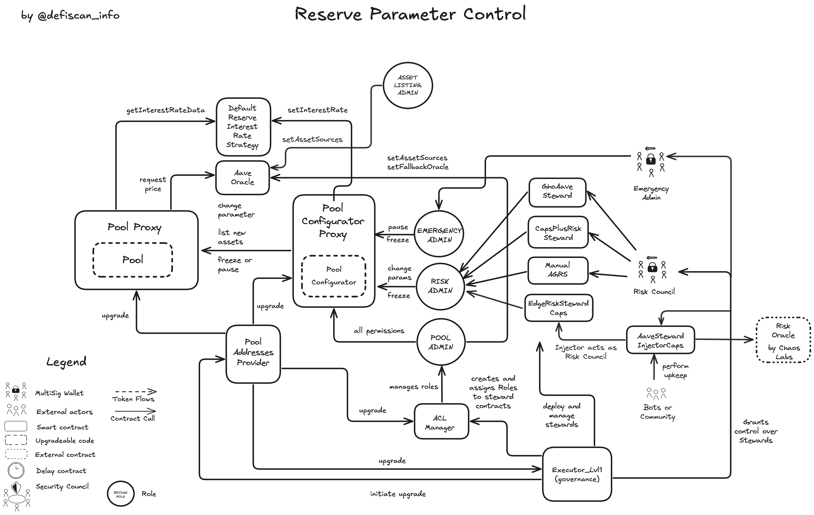

# Summary

Aave v3 is a lending protocol that allows users to lend and borrow different ERC20 assets. This review focuses on the Arbitrum deployment of Aave v3.

Aave v3 on Arbitrum uses for most the same contract code as Aave v3 Core on Ethereum mainnet instance. The Aave DAO deployed the _Lend & Borrow_, the _Reserve Parameters_ and the _Treasury, Aave Ecosystem Reserves & Rewards_ modules to offer the same functionality on Arbitrum.

We only report on the specific differences in this report, to understand the redeployed and re-used modules check out our Aave v3 Core instance [report](/protocols/aave).

# Ratings

## Chain

The report is concerned with the Aave V3 instance deployed on Arbitrum. Arbitrum achieves a _Medium_ centralization risk score.

> Chain score: Medium

## Upgradeability

The permissions and _Upgradeability_ in the re-deployed contracts of the modules _Core Lend & Borrow_, _Reserve Parameters_, _Treasury, Aave Ecosystem Reserves & Rewards_ are the same to the Aave v3 Core instance.

### GHO Stablecoin

GHO is created on Ethereum Mainnet, but can be bridged to Arbitrum through Chainlink's CCIP (see [Autonomy section](#autonomy) for more details). The [Risk Council](#security-council) for Gho on Arbitrum, has permissions to configure the GHO CCIP Token Pool on Arbitrum, which mints GHO to the receiving user address, when a user locks an equivalent amount of GHO on Ethereum Mainnet. The configuration entails rate limiting and bridge limiting (total amount of GHO on Arbitrum). These configuration parameters are handled by the projects themselves and not by CCIP/Chainlink. The [Risk Council](#security-council) furthermore can update the bucket capacity of listed facilitators. Facilitators in GHO are contracts that are allowed to mint and burn GHO. The only listed facilitator on Arbitrum is the GHO CCIP Token Pool.

The [Risk Council](#security-council) could temporarily block GHO cross-chain by setting low rate limiting, or setting the facilitator capacity below the current Arbitrum issuance, preventing new minting on Arbitrum even if users are currently bridging GHO from Ethereum Mainnet to Arbitrum. This could lead to _temporarily loss of funds_. The _Aave Governance_ can restore user funds on Ethereum Mainnet with the permission to release GHO tokens from the corresponding mainnet GHO CCIP pool.

The _Aave Governance_ can upgrade the GHO contract, which is unlike the Ethereum Mainnet instance not immutable. Additionally the _Aave Governance_ can add or remove facilitators that can mint or burn GHO. This could open the possibility of uncontrolled minting or burning of GHO in case of an unintended upgrade. If abused, this control thus introduces a risk of _loss of funds_, _loss of unclaimed yield_ (accrued interest in GHO) or an otherwise _material impact on the expected protocol performance_ for GHO holders and Aave users.

### Aave Governance

The _Aave Governance_ on Arbitrum is unlike the _Aave Governance_ on Ethereum mainnet only for execution of registered and voted payloads. Aave DAO voters cannot vote on Arbitrum. The setup of the executor, time exit and bridging votes from Mainnet to Arbitrum has been discussed in our Aave v3 Core instance [report](/protocols/aave).

> Upgradeability score: High

## Autonomy

### CCIP

GHO on arbitrum solely relies on CCIP for bridging native GHO from Ethereum. Chainlink CCIP achieves a _High_ centralization risk score as discussed in a separate report [here](/protocols/ccip).

### Risk Oracle

Next to handing some control over market parameters to the [Risk Council](#security-council) via steward contracts, the Aave V3 instance on Arbitrum automates the borrow and supply cap automatically by handing off the exact values to a risk oracle implemented by Chaos Labs (service provider to the DAO). The Risk Oracle by Chaos Labs receives a _High centralization_ rating but the `EdgeRiskSteward` makes sure the values submitted by the `RiskOracle` contract are within guardrails to prevent abusive behavior. Upon failure of the `RiskOracle`, the [Risk Council](#security-council) can still update borrow and supply caps. No additional dependency risk is introduced by using the Risk Oracle provided by Chaos Labs.

> Autonomy score: high

## Exit Window

The Aave v3 instance on Arbitrum uses the same exit window as the Aave v3 Core instance on Ethereum mainnet.

Read more in our Aave v3 Core instance [report](/protocols/aave).

> Exit Window score: High

## Accessibility

Aave V3 deployment on Arbitrum is accessible through the same Aave UI and third party UIs than the Aave v3 Core instance.

Read more in our Aave v3 Core instance [report](/protocols/aave).

> Accessibility score: low

## Conclusion

The Aave v3 Arbitrum deployment achieves _High_ centralization risk scores for its _Upgradeability_, _Autonomy_ and _Exit Window_ dimensions. It thus ranks **Stage 0**.

The protocol could reach **Stage 1** by; 1) adopting the security council requirements for the [Emergency Admin](#security-council) multisig account and 2) implementing fallback mechanism around the Chainlink oracle (or Chainlink adopting a _Security Council_ setup for its own multisig account).

The project additionally could advance to **Stage 2** if all critical permissions were assigned to _Aave Governance_ and protected with a 30-day _Exit Window_.

# Reviewer Notes

⚠️ During our analysis, we identified a unverified role (not mentioned in the docs https://github.com/bgd-labs/aave-permissions-book/blob/main/out/ARBITRUM_ONE-V3.md#admins). Role Id is 0xd1d2cf869016112a9af1107bcf43c3759daf22cf734aad47d0c9c726e33bc782. The owners of this role are related to the V2 to V3 migration.

# Protocol Analysis

## Upgradeable Pool Contract and mutable reserve parameters

The only notable distinction between the Lending logic on Ethereum L1 and a L2 is the existence and reliance on the `PriceOracleSentinel` contract which prevents liquidations when the sequencer of a L2 is down, in this case the sequencer of Arbitrum. This is an additional safety mechanism and does not introduce any dependency risk.

A second notable distinction between Aave on Arbitrum and Aave on Ethereum Core, is the automation of risk parameters via the Risk Oracle. The Risk Oracle pushes parameters based on quantitative risk models, to optimize performance under current market risk. The values fetched from the Risk Oracle have to meet the criteria by the EdgeRiskSteward, which prevents excessive and malicious parameter updates.

## GHO

GHO is minted and issued on Ethereum mainnet based on crypto collateral. In order to expand the reach of GHO into Arbitrum, CCIP token bridge is used. When GHO is locked in the CCIP token pool on Ethereum mainnet, an equivalent amount minus fees is minted on Arbitrum. The CCIP token bridge is the solely bridge that is permissioned to bridge GHO. To release GHO on mainnet, the GHO tokens have to be returned into the GHO CCIP token pool on Arbitrum and are burned.

# Dependencies

## Risk Oracle

Besides the [Risk Council](#security-council) having control over market parameters via steward contracts, the Aave V3 instance on Arbitrum automates the borrow and supply cap automatically by handing off the updates of this caps to a risk oracle implemented by Chaos Labs (service provider to the DAO). This allows automatic updates of these risk parameters based on risk models in real time. `EdgeRiskSteward` makes sure the values submitted by the `RiskOracle` contract are within guardrails to prevent abusive behavior by malicious intent.

## Price Oracle Sentinel

Aave V3 instances on Layer 2s make use of the Sequencer oracle offered by Chainlink. This oracle informs smart contracts whether the sequencer of the respective rollup is currently offline. Sophisticated actors can force transactions on native rollups via posting them directly on Ethereum mainnet. To prevent sophisticated actors to liquidate users during sequencer downtime, Aave implemented the `PriceOracleSentinel` contract that prevents liquidations, if the Chainlink _L2 Sequencer Uptime Oracle_ reports downtime of the sequencer. The _L2 Sequencer Uptime Oracle_ was assessed to be highly centralized as written in this [report](/protocols/chainlink-sequencer-oracles).

If this sequencer oracle does not report sequencer downtime, the protection for non-sophisticated users fails. If the oracle reports downtime even if there is no downtime, the system's capability for liquidations is un-necessarily blocked for the grace period (1 hour). This grace period can be set to 0, if the oracle is permanently misbehaving or out of order. Even if the _L2 Sequencer Uptime Oracle_ by Chainlink fails the protocol impact on users is marginal, thus the reliance on the dependency is low and as such the Dependency risk is _Low_.

## CCIP for GHO

The GHO tokens on Arbitrum are bridged from Mainnet via CCIP. CCIP stands for Cross-Chain Interoperability Protocol and is a protocol and product by Chainlink.

The GHO tokens are bridged by lock/release mechanism on mainnet, and a mint/burn mechanism on Arbitrum. In the case of GHO a user locks GHO on mainnet, and an equivalent amount gets minted by the GHO contract on Arbitrum. The GHO token on Arbitrum, unlike the GHO token on mainnnet, is upgradeable.

Chainlink CCIP is covered in more detail in our separate report [here](/protocols/ccip).

## Layer 1 Governance

Aave V3 on Arbitrum relies on the governance smart contracts on Ethereum Mainnet and bridging votes from Polygon to mainnet. See the mainnet core instance report for a detailed system breakdown and analysis [here](/protocols/aave).

# Governance

Community vote is enforced on Arbitrum through the following process:

1. The community registers a payload at the `PayloadsController` contract on Arbitrum
2. The community starts a vote on the Governance contract on Ethereum Mainnet specififying Arbitrum and the payload Id
3. The vote starts after 1 day delay and gets ported via a.DI to a voting network (currently Polygon)
4. When the vote has passed, the result is transferred back to Ethereum Mainnet
5. The vote can be executed. The call to execute the payload is bridged to Arbitrums PayloadController
6. After the Exit Window has passed, the community can trigger execution.

## Security Council

This table shows the external permission owners and how they are rated against the security council criteria.

| External Permission Owner                        | Address                                                                                                              | Type         | At least 7 signers | At least 51% threshold | Above 50% non-insiders signers | Signers publicly announced                                                                                                                  |
| ------------------------------------------------ | -------------------------------------------------------------------------------------------------------------------- | ------------ | ------------------ | ---------------------- | ------------------------------ | ------------------------------------------------------------------------------------------------------------------------------------------- |
| Executor_lvl1                                    | [0xFF1137243698CaA18EE364Cc966CF0e02A4e6327](https://arbiscan.io/address/0xFF1137243698CaA18EE364Cc966CF0e02A4e6327) | Contract     | n/a                | n/a                    | n/a                            | n/a                                                                                                                                         |
| Aave Governance Guardian Arbitrum                | [0x1a0581dd5c7c3da4ba1cda7e0bca7286afc4973b](https://arbiscan.io/address/0x1a0581dd5c7c3da4ba1cda7e0bca7286afc4973b) | Multisig 5/9 | ✅                 | ✅                     | ✅                             | ✅ ([source](https://aave.com/docs/primitives/governance#community-guardians-protocol-emergency-guardian))                                  |
| Aave Protocol Guardian Arbitrum (EmergencyAdmin) | [0xcb45e82419baebcc9ba8b1e5c7858e48a3b26ea6](https://arbiscan.io/address/0xcb45e82419baebcc9ba8b1e5c7858e48a3b26ea6) | Multisig 5/9 | ✅                 | ✅                     | ❌                             | ✅ ([source](https://aave.com/docs/primitives/governance#community-guardians-governance-emergency-guardian))                                |
| Risk Council                                     | [0x47c71dFEB55Ebaa431Ae3fbF99Ea50e0D3d30fA8](https://arbiscan.io/address/0x47c71dFEB55Ebaa431Ae3fbF99Ea50e0D3d30fA8) | Multisig 2/2 | ❌                 | ✅                     | ❌                             | ✅ ([source](https://vote.onaave.com/proposal/?proposalId=197&ipfsHash=0x2f41406557b0fc69c256916c066a77c57434fa77ccab3cfe56c8db6a4f306c01)) |
| Risk Council (for Gho)                           | [0x8513e6F37dBc52De87b166980Fa3F50639694B60](https://arbiscan.io/address/0x8513e6F37dBc52De87b166980Fa3F50639694B60) | Multisig 3/4 | ❌                 | ✅                     | ❌                             | ❌                                                                                                                                          |
| Guardian (PoolExposureSteward)                   | [0x22740deBa78d5a0c24C58C740e3715ec29de1bFa](https://arbiscan.io/address/0x22740deBa78d5a0c24C58C740e3715ec29de1bFa) | Multisig ?/? | ❌                 | ✅                     | ❌                             | ❌                                                                                                                                          |
| BGD Labs (Retry Role)                            | [0x1fcd437d8a9a6ea68da858b78b6cf10e8e0bf959](https://arbiscan.io/address/0x1fcd437d8a9a6ea68da858b78b6cf10e8e0bf959) | Multisig 2/3 | ❌                 | ✅                     | ❌                             | ✅ ([source](https://github.com/bgd-labs/aave-permissions-book/blob/main/out/ARBITRUM_ONE-V3.md#guardians))                                 |
| ACI Automation (Bot)                             | [0x3Cbded22F878aFC8d39dCD744d3Fe62086B76193](https://arbiscan.io/address/0x3Cbded22F878aFC8d39dCD744d3Fe62086B76193) | EOA          | n/a                | n/a                    | n/a                            | n/a                                                                                                                                         |
| CleanUp Admin                                    | [0xdeadD8aB03075b7FBA81864202a2f59EE25B312b](https://arbiscan.io/address/0xdeadD8aB03075b7FBA81864202a2f59EE25B312b) | Multisig 2/3 | ❌                 | ✅                     | ❌                             | ✅ ([source](https://vote.onaave.com/proposal/?proposalId=270&ipfsHash=0x4043001b72316afa6b6728772941bfa08f127b66c1c006316a3f20510b6738ab)) |
| AaveStewardInjectorCaps guardian                 | [0x87dFb794364f2B117C8dbaE29EA622938b3Ce465](https://arbiscan.io/address/0x87dFb794364f2B117C8dbaE29EA622938b3Ce465) | Multisig 1/2 | ❌                 | ❌                     | ❌                             | ❌                                                                                                                                          |

|

💡 The BGD Labs maintains a public markdown page on the existing permissions to inform its users: https://github.com/bgd-labs/aave-permissions-book/blob/main/out/ARBITRUM_ONE-V3.md

# Contracts and Permissions

## Contracts

| Contract Name                                       | Address                                                                                                              |
| --------------------------------------------------- | -------------------------------------------------------------------------------------------------------------------- |
| Pool (Proxy)                                        | [0x794a61358D6845594F94dc1DB02A252b5b4814aD](https://arbiscan.io/address/0x794a61358D6845594F94dc1DB02A252b5b4814aD) |
| Pool (Implementation)                               | [0x7f775bb7af2e7e09d5dc9506c95516159a5ca0d0](https://arbiscan.io/address/0x7f775bb7af2e7e09d5dc9506c95516159a5ca0d0) |
| L2Encoder                                           | [0x9abADECD08572e0eA5aF4d47A9C7984a5AA503dC](https://arbiscan.io/address/0x9abADECD08572e0eA5aF4d47A9C7984a5AA503dC) |
| aToken (Proxy) (example)                            | [0x82E64f49Ed5EC1bC6e43DAD4FC8Af9bb3A2312EE](https://arbiscan.io/address/0x82E64f49Ed5EC1bC6e43DAD4FC8Af9bb3A2312EE) |
| aToken (Implementation) (example)                   | [0x1be1798b70aee431c2986f7ff48d9d1fa350786a](https://arbiscan.io/address/0x1be1798b70aee431c2986f7ff48d9d1fa350786a) |
| variableDebtToken (Proxy) (example)                 | [0x8619d80FB0141ba7F184CbF22fd724116D9f7ffC](https://arbiscan.io/address/0x8619d80FB0141ba7F184CbF22fd724116D9f7ffC) |
| variableDebtToken (Implementation)                  | [0x5e76e98e0963ecdc6a065d1435f84065b7523f39](https://arbiscan.io/address/0x5e76e98e0963ecdc6a065d1435f84065b7523f39) |
| DefaultReserveInterestRateStrategyV2                | [0x429F16dBA3B9e1900087Cbaa7b50D38Bc60fB73F](https://arbiscan.io/address/0x429F16dBA3B9e1900087Cbaa7b50D38Bc60fB73F) |
| V3RateStrategyFactory (Proxy)                       | [0xcC47c4Fe1F7f29ff31A8b62197023aC8553C7896](https://arbiscan.io/address/0xcC47c4Fe1F7f29ff31A8b62197023aC8553C7896) |
| V3RateStrategyFactory (Implementation)              | [0x2feb46e48494356955159b9ed8e795add1e1ad7b](https://arbiscan.io/address/0x2feb46e48494356955159b9ed8e795add1e1ad7b) |
| WrappedTokenGatewayV3                               | [0x5283BEcEd7ADF6D003225C13896E536f2D4264FF](https://arbiscan.io/address/0x5283BEcEd7ADF6D003225C13896E536f2D4264FF) |
| PoolAddressesProvider                               | [0xa97684ead0e402dC232d5A977953DF7ECBaB3CDb](https://arbiscan.io/address/0xa97684ead0e402dC232d5A977953DF7ECBaB3CDb) |
| PoolAddressesProviderRegistry                       | [0x770ef9f4fe897e59daCc474EF11238303F9552b6](https://arbiscan.io/address/0x770ef9f4fe897e59daCc474EF11238303F9552b6) |
| PoolConfigurator (Proxy)                            | [0x8145eddDf43f50276641b55bd3AD95944510021E](https://arbiscan.io/address/0x8145eddDf43f50276641b55bd3AD95944510021E) |
| PoolConfigurator (Implementation)                   | [0xe5e48ad1f9d1a894188b483dcf91f4fad6aba43b](https://arbiscan.io/address/0xe5e48ad1f9d1a894188b483dcf91f4fad6aba43b) |
| UiPoolDataProvider                                  | [0x5c5228aC8BC1528482514aF3e27E692495148717](https://arbiscan.io/address/0x5c5228aC8BC1528482514aF3e27E692495148717) |
| UiIncentiveDataProvider                             | [0x68100bD5345eA474D93577127C11F39FF8463e93](https://arbiscan.io/address/0x68100bD5345eA474D93577127C11F39FF8463e93) |
| AaveProtocolDataProvider                            | [0x14496b405D62c24F91f04Cda1c69Dc526D56fDE5](https://arbiscan.io/address/0x14496b405D62c24F91f04Cda1c69Dc526D56fDE5) |
| WalletBalanceProvider                               | [0xBc790382B3686abffE4be14A030A96aC6154023a](https://arbiscan.io/address/0xBc790382B3686abffE4be14A030A96aC6154023a) |
| ACLManager                                          | [0xa72636CbcAa8F5FF95B2cc47F3CDEe83F3294a0B](https://arbiscan.io/address/0xa72636CbcAa8F5FF95B2cc47F3CDEe83F3294a0B) |
| TreasuryCollector (Proxy)                           | [0x053D55f9B5AF8694c503EB288a1B7E552f590710](https://arbiscan.io/address/0x053D55f9B5AF8694c503EB288a1B7E552f590710) |
| TreasuryCollector (Implementation)                  | [0x83b7ce402a0e756e901c4a9d1cafa27ca9572afc](https://arbiscan.io/address/0x83b7ce402a0e756e901c4a9d1cafa27ca9572afc) |
| ClinicSteward                                       | [0x7B58055fC6bE4B23cF8c9287b7d3C4adBE919a9c](https://arbiscan.io/address/0x7B58055fC6bE4B23cF8c9287b7d3C4adBE919a9c) |
| RewardsController (Proxy)                           | [0x929EC64c34a17401F460460D4B9390518E5B473e](https://arbiscan.io/address/0x929EC64c34a17401F460460D4B9390518E5B473e) |
| RewardsController (Implementation)                  | [0x5f4d15d761528c57a5c30c43c1dab26fc5452731](https://arbiscan.io/address/0x5f4d15d761528c57a5c30c43c1dab26fc5452731) |
| EmissionManager                                     | [0x048f2228D7Bf6776f99aB50cB1b1eaB4D1d4cA73](https://arbiscan.io/address/0x048f2228D7Bf6776f99aB50cB1b1eaB4D1d4cA73) |
| StataTokenFactory (Proxy)                           | [0xd85922fFF51ba4130cEC7c499db4Ac3Eb9981EaD](https://arbiscan.io/address/0xd85922fFF51ba4130cEC7c499db4Ac3Eb9981EaD) |
| StataTokenFactory (Implementation)                  | [0xEB4C7182e566e5E692f4C3002029e6EE65bA83C7](https://arbiscan.io/address/0xEB4C7182e566e5E692f4C3002029e6EE65bA83C7) |
| AaveOracle                                          | [0xb56c2F0B653B2e0b10C9b928C8580Ac5Df02C7C7](https://arbiscan.io/address/0xb56c2F0B653B2e0b10C9b928C8580Ac5Df02C7C7) |
| PriceOracleSentinel                                 | [0x7A9ff54A6eE4a21223036890bB8c4ea2D62c686b](https://arbiscan.io/address/0x7A9ff54A6eE4a21223036890bB8c4ea2D62c686b) |
| RepayWithCollateral / ParaSwapRepayAdapter          | [0xE28E2c8d240dd5eBd0adcab86fbD79df7a052034](https://arbiscan.io/address/0xE28E2c8d240dd5eBd0adcab86fbD79df7a052034) |
| CollateralSwitch / ParaSwapLiquiditySwapAdapter     | [0xF3C3F14dd7BDb7E03e6EBc3bc5Ffc6D66De12251](https://arbiscan.io/address/0xF3C3F14dd7BDb7E03e6EBc3bc5Ffc6D66De12251) |
| DebtSwitch / ParaSwapDebtSwapAdapterV3              | [0x63dfa7c09Dc2Ff4030d6B8Dc2ce6262BF898C8A4](https://arbiscan.io/address/0x63dfa7c09Dc2Ff4030d6B8Dc2ce6262BF898C8A4) |
| WithdrawSwitchAdapter / ParaSwapWithdrawSwapAdapter | [0x5598BbFA2f4fE8151f45bBA0a3edE1b54B51a0a9](https://arbiscan.io/address/0x5598BbFA2f4fE8151f45bBA0a3edE1b54B51a0a9) |
| ACLAdmin / Executor_lvl1                            | [0xFF1137243698CaA18EE364Cc966CF0e02A4e6327](https://arbiscan.io/address/0xFF1137243698CaA18EE364Cc966CF0e02A4e6327) |
| CapsPlusRiskSteward                                 | [0xADf86b537eF08591c2777E144322E8b0Ca7E82a7](https://arbiscan.io/address/0xADf86b537eF08591c2777E144322E8b0Ca7E82a7) |
| FreezingSteward                                     | [0xe59470B3BE3293534603487E00A44C72f2CD466d](https://arbiscan.io/address/0xe59470B3BE3293534603487E00A44C72f2CD466d) |
| Manual AGRS (RiskSteward)                           | [0x14568979093FFF97aeBD73F58051a4f0e297b1eB](https://arbiscan.io/address/0x14568979093FFF97aeBD73F58051a4f0e297b1eB) |
| AaveV3ConfigEngine                                  | [0x5EcF74eb2feC38fe80F8f20f7eb302F276635fff](https://arbiscan.io/address/0x5EcF74eb2feC38fe80F8f20f7eb302F276635fff) |
| PoolExposureSteward                                 | [0xfB1D12D7C9c3Eb6b40fe0502801CdFCE816a0d18](https://arbiscan.io/address/0xfB1D12D7C9c3Eb6b40fe0502801CdFCE816a0d18) |
| ArbAdapter                                          | [0xc8a2ADC4261c6b669CdFf69E717E77C9cFeB420d](https://arbiscan.io/address/0xc8a2ADC4261c6b669CdFf69E717E77C9cFeB420d) |
| CrossChainController (Proxy)                        | [0xCbFB78a3Eeaa611b826E37c80E4126c8787D29f0](https://arbiscan.io/address/0xCbFB78a3Eeaa611b826E37c80E4126c8787D29f0) |
| CrossChainController (Implementation)               | [0x92f4736b72d131d836b3e4d4c3c23fe53150ce4d](https://arbiscan.io/address/0x92f4736b72d131d836b3e4d4c3c23fe53150ce4d) |
| PayloadsController (Proxy)                          | [0x89644CA1bB8064760312AE4F03ea41b05dA3637C](https://arbiscan.io/address/0x89644CA1bB8064760312AE4F03ea41b05dA3637C) |
| PayloadsController (Implementation)                 | [0x118dfd5418890c0332042ab05173db4a2c1d283c](https://arbiscan.io/address/0x118dfd5418890c0332042ab05173db4a2c1d283c) |
| GranularGuardianAccessControl                       | [0x4922093c476CfbCF903C7C4082d2D64bAE8A37cE](https://arbiscan.io/address/0x4922093c476CfbCF903C7C4082d2D64bAE8A37cE) |
| ProxyAdmin                                          | [0xD3cF979e676265e4f6379749DECe4708B9A22476](https://arbiscan.io/address/0xD3cF979e676265e4f6379749DECe4708B9A22476) |
| UpgradeableGhoToken (Proxy)                         | [0x7dfF72693f6A4149b17e7C6314655f6A9F7c8B33](https://arbiscan.io/address/0x7dfF72693f6A4149b17e7C6314655f6A9F7c8B33) |
| UpgradeableGhoToken (Implementation)                | [0xb415dfb897423cc83c3de8db0518d4fa7496c813](https://arbiscan.io/address/0xb415dfb897423cc83c3de8db0518d4fa7496c813) |
| GhoCCIPTokenPool (Proxy)                            | [0xB94Ab28c6869466a46a42abA834ca2B3cECCA5eB](https://arbiscan.io/address/0xB94Ab28c6869466a46a42abA834ca2B3cECCA5eB) |
| GhoCCIPTokenPool (Implementation)                   | [0x6e637e1e48025e51315d50ab96d5b3be1971a715](https://arbiscan.io/address/0x6e637e1e48025e51315d50ab96d5b3be1971a715) |
| GhoAaveSteward                                      | [0xd2D586f849620ef042FE3aF52eAa10e9b78bf7De](https://arbiscan.io/address/0xd2D586f849620ef042FE3aF52eAa10e9b78bf7De) |
| GhoBucketSteward                                    | [0xa9afaE6A53E90f9E4CE0717162DF5Bc3d9aBe7B2](https://arbiscan.io/address/0xa9afaE6A53E90f9E4CE0717162DF5Bc3d9aBe7B2) |
| GhoCcipSteward                                      | [0xCd5ab470AaC5c13e1063ee700503f3346b7C90Db](https://arbiscan.io/address/0xCd5ab470AaC5c13e1063ee700503f3346b7C90Db) |
| RiskOracle                                          | [0x861eeAdB55E41f161F31Acb1BFD4c70E3a964Aed](https://arbiscan.io/address/0x861eeAdB55E41f161F31Acb1BFD4c70E3a964Aed) |
| EdgeRiskStewardCaps                                 | [0x085E34722e04567Df9E6d2c32e82fd74f3342e79](https://arbiscan.io/address/0x085E34722e04567Df9E6d2c32e82fd74f3342e79) |
| AaveStewardInjectorCaps                             | [0x35d53dEB2F6f40Ea7af32B6F8BEd88eA966DF1D9](https://arbiscan.io/address/0x35d53dEB2F6f40Ea7af32B6F8BEd88eA966DF1D9) |

## All Permission owners

| Name                                             | Account                                                                                                              | Type         |
| ------------------------------------------------ | -------------------------------------------------------------------------------------------------------------------- | ------------ |
| Executor_lvl1                                    | [0xFF1137243698CaA18EE364Cc966CF0e02A4e6327](https://arbiscan.io/address/0xFF1137243698CaA18EE364Cc966CF0e02A4e6327) | Contract     |
| PoolAddressesProvider                            | [0xa97684ead0e402dC232d5A977953DF7ECBaB3CDb](https://arbiscan.io/address/0xa97684ead0e402dC232d5A977953DF7ECBaB3CDb) | Contract     |
| PoolConfigurator                                 | [0x8145eddDf43f50276641b55bd3AD95944510021E](https://arbiscan.io/address/0x8145eddDf43f50276641b55bd3AD95944510021E) | Contract     |
| ProxyAdmin                                       | [0xD3cF979e676265e4f6379749DECe4708B9A22476](https://arbiscan.io/address/0xD3cF979e676265e4f6379749DECe4708B9A22476) | Contract     |
| Aave Protocol Guardian Arbitrum (EmergencyAdmin) | [0xcb45e82419baebcc9ba8b1e5c7858e48a3b26ea6](https://arbiscan.io/address/0xcb45e82419baebcc9ba8b1e5c7858e48a3b26ea6) | Multisig 5/9 |
| Aave Governance Guardian Arbitrum                | [0x1a0581dd5c7c3da4ba1cda7e0bca7286afc4973b](https://arbiscan.io/address/0x1a0581dd5c7c3da4ba1cda7e0bca7286afc4973b) | Multisig 5/9 |
| BGD Labs (retry role)                            | [0x1fcd437d8a9a6ea68da858b78b6cf10e8e0bf959](https://arbiscan.io/address/0x1fcd437d8a9a6ea68da858b78b6cf10e8e0bf959) | Multisig 2/3 |
| Risk Council (for Pool Stewards)                 | [0x47c71dFEB55Ebaa431Ae3fbF99Ea50e0D3d30fA8](https://arbiscan.io/address/0x47c71dFEB55Ebaa431Ae3fbF99Ea50e0D3d30fA8) | Multisig 2/2 |
| CleanUp Admin                                    | [0xdeadd8ab03075b7fba81864202a2f59ee25b312b](https://arbiscan.io/address/0xdeadd8ab03075b7fba81864202a2f59ee25b312b) | Multisig 2/3 |
| ACI Automation (Bot)                             | [0x3Cbded22F878aFC8d39dCD744d3Fe62086B76193](https://arbiscan.io/address/0x3Cbded22F878aFC8d39dCD744d3Fe62086B76193) | EOA          |
| Risk Council for Gho                             | [0x8513e6F37dBc52De87b166980Fa3F50639694B60](https://arbiscan.io/address/0x8513e6F37dBc52De87b166980Fa3F50639694B60) | Multisig 3/4 |

## Permissions

| Contract                                                            | Function                               | Impact                                                                                                                                                                                                                                                                                                                                                                                                                                                                                                                                                                                                                                                                                                                                                                                                                                                                                                                                        | Owner                                                                                                                                                                        |
| ------------------------------------------------------------------- | -------------------------------------- | --------------------------------------------------------------------------------------------------------------------------------------------------------------------------------------------------------------------------------------------------------------------------------------------------------------------------------------------------------------------------------------------------------------------------------------------------------------------------------------------------------------------------------------------------------------------------------------------------------------------------------------------------------------------------------------------------------------------------------------------------------------------------------------------------------------------------------------------------------------------------------------------------------------------------------------------- | ---------------------------------------------------------------------------------------------------------------------------------------------------------------------------- |
| Pool (Proxy) (InitializableImmutableAdminUpgradeabilityProxy)       | admin                                  | Permissioned getter of the owner address (only the owner can retrieve it on-chain). The owner address is stored in the bytecode (keyword immutable) and is thus immutable.                                                                                                                                                                                                                                                                                                                                                                                                                                                                                                                                                                                                                                                                                                                                                                    | PoolAddressesProvider                                                                                                                                                        |
| Pool (Proxy) (InitializableImmutableAdminUpgradeabilityProxy)       | implementation                         | Permissioned getter of the implementation address.                                                                                                                                                                                                                                                                                                                                                                                                                                                                                                                                                                                                                                                                                                                                                                                                                                                                                            | PoolAddressesProvider                                                                                                                                                        |
| Pool (Proxy) (InitializableImmutableAdminUpgradeabilityProxy)       | upgradeTo                              | This function allows the permission owner to set a new implementation contract to forward calls to. This can change the whole pool implementation logic and thus can affect deposits, collateral and unclaimed yield. The function on `PoolAddressesProvider` that can call this function is `setAddress` and this function is governed by the Aave Governance. Thus this change needs to pass governance vote, but as all governance votes it can be vetoed by the Aave Governance V3 Guardian to protect against malicious governance proposals that have passed.                                                                                                                                                                                                                                                                                                                                                                           | PoolAddressesProvider                                                                                                                                                        |
| Pool (Proxy) (InitializableImmutableAdminUpgradeabilityProxy)       | upgradeToAndCall                       | Same as `upgradeTo` (previous row) but allows to atomically call also a function on the new implementation contract in one transaction.                                                                                                                                                                                                                                                                                                                                                                                                                                                                                                                                                                                                                                                                                                                                                                                                       | PoolAddressesProvider                                                                                                                                                        |
| L2PoolInstance (Implementation)                                     | initReserve                            | Initializes a reserve, activating it, assigning an aToken and debt tokens and an interest rate strategy. This function is permissioned and only the `PoolConfigurator` can execute it. This function is called if support for a new asset is desired. Users can supply this asset, receive the aToken or if they want to borrow they receive the debt token, while the interest rate strategy is applied for users positions.                                                                                                                                                                                                                                                                                                                                                                                                                                                                                                                 | PoolConfigurator (Proxy)                                                                                                                                                     |
| L2PoolInstance (Implementation)                                     | dropReserve                            | The `dropReserve` function in Aave V3 serves as a mechanism to permanently remove a reserve from the pool's active reserves. This action is more comprehensive than freezing or pausing, as it completely deactivates the reserve, preventing any further user interactions with the asset within the pool. Dropping the reserve requires that the aToken and the DebtToken supplies are 0.                                                                                                                                                                                                                                                                                                                                                                                                                                                                                                                                                   | PoolConfigurator (Proxy)                                                                                                                                                     |
| L2PoolInstance (Implementation)                                     | setReserveInterestRateStrategyAddress  | Sets the interest rate strategy of a reserve. It achieves this by pointing to a new smart contract that implements the interest rate strategy. The `PoolConfigurator` is the only permissioned account to call this function. The change to this new interest rate strategy most likely results in different future yield. Past unclaimed yield is not affected.                                                                                                                                                                                                                                                                                                                                                                                                                                                                                                                                                                              | PoolConfigurator (Proxy)                                                                                                                                                     |
| Pool (Implementation)                                               | syncIndexesState                       | Accumulates interest to all indexes of the reserve. To be used when required by the configurator, for example when updating interest rates strategy data.                                                                                                                                                                                                                                                                                                                                                                                                                                                                                                                                                                                                                                                                                                                                                                                     | PoolConfigurator (Proxy)                                                                                                                                                     |
| L2PoolInstance (Implementation)                                     | syncRatesState                         | When the protocol's governance decides to modify the interest rate strategy for a reserve, it's crucial to synchronize the reserve's indexes with the new strategy to maintain accurate interest calculations. `syncRatesState` achieves that. The `PoolConfigurator` contract facilitates this process. For instance, in the `setReserveInterestRateStrategyAddress` function within the `PoolConfigurator`, the `syncIndexesState` function is called to update the reserve's state before applying the new interest rate strategy.                                                                                                                                                                                                                                                                                                                                                                                                         | PoolConfigurator (Proxy)                                                                                                                                                     |
| L2PoolInstance (Implementation)                                     | updateBridgeProtocolFee                | Updates the protocol fee on the bridging. The fee is sent to the protocol treasury. The fee is raised when calling `backUnbacked` on the `Pool` contract.                                                                                                                                                                                                                                                                                                                                                                                                                                                                                                                                                                                                                                                                                                                                                                                     | PoolConfigurator (Proxy)                                                                                                                                                     |
| L2PoolInstance (Implementation)                                     | setConfiguration                       | Allows to update all configurations of a reserve at once without any guardrails.                                                                                                                                                                                                                                                                                                                                                                                                                                                                                                                                                                                                                                                                                                                                                                                                                                                              | PoolConfigurator (Proxy)                                                                                                                                                     |
| L2PoolInstance (Implementation)                                     | updateFlashloanPremiums                | Increasing flashLoanPremiumTotal: Raises the overall cost of flash loans, potentially reducing their usage but increasing earnings for both liquidity providers and the protocol. Adjusting flashLoanPremiumToProtocol: Alters the revenue split between liquidity providers and the protocol. A higher value directs more fees to the protocol treasury, while a lower value benefits liquidity providers. There are no limits enforced on the smart contract level.                                                                                                                                                                                                                                                                                                                                                                                                                                                                         | PoolConfigurator (Proxy)                                                                                                                                                     |
| L2PoolInstance (Implementation)                                     | configureEModeCategory                 | Configures a new or alters an existing collateral configuration of an eMode. Users can opt-in using eMode to profit from better LTV settings for correlated assets. This function sets LTV, liquidationThreshold and liquidationBonus. There are no boundaries enforced on the settings of an eMode in the Pool contract, but on the PoolConfigurator, which is the only contract permissioned to call this function, has relative boundaries.                                                                                                                                                                                                                                                                                                                                                                                                                                                                                                | PoolConfigurator (Proxy)                                                                                                                                                     |
| L2PoolInstance (Implementation)                                     | configureEModeCategoryCollateralBitmap | While `configureEModeCategory` specifies the LTV, liquidationThreshold and liquidationBonus, `configureEModeCategoryBorrowableBitmap` specifies which assets belong to a certain EMode (ie. which assets are closely correlated) and can serve as collateral in this EMode.                                                                                                                                                                                                                                                                                                                                                                                                                                                                                                                                                                                                                                                                   | PoolConfigurator (Proxy)                                                                                                                                                     |
| L2PoolInstance (Implementation)                                     | configureEModeCategoryBorrowableBitmap | Specifies which assets belong to a certain EMode (ie. which assets are closely correlated) and can be borrowed in this EMode.                                                                                                                                                                                                                                                                                                                                                                                                                                                                                                                                                                                                                                                                                                                                                                                                                 | PoolConfigurator (Proxy)                                                                                                                                                     |
| L2PoolInstance (Implementation)                                     | resetIsolationModeTotalDebt            | Resets the isolation mode total debt of the given asset to zero. It requires the given asset has zero debt ceiling. Which is done by `setDebtCeiling` inside `PoolConfigurator`, first it sets debt ceiling to 0 and then sets total debt to 0. This action is indicating that no new borrowing against this asset is allowed.                                                                                                                                                                                                                                                                                                                                                                                                                                                                                                                                                                                                                | PoolConfigurator (Proxy)                                                                                                                                                     |
| L2PoolInstance (Implementation)                                     | setLiquidationGracePeriod              | Sets the liquidation grace period of the given asset (applied for all positions). This halts liquidations for a specific asset until a certain timestamp. `PoolConfigurator` only calls this function when pausing a reserve or when disabling the Liquidation Grace Period e.g after discontinuing the pause.                                                                                                                                                                                                                                                                                                                                                                                                                                                                                                                                                                                                                                | PoolConfigurator (Proxy)                                                                                                                                                     |
| L2PoolInstance (Implementation)                                     | rescueTokens                           | Rescue and transfer tokens locked in this contract. This function can transfer ERC20 tokens from this contract on demand. Useful when users send tokens to this contract by mistake. This function can be called by the `POOL_ADMIN` any time.                                                                                                                                                                                                                                                                                                                                                                                                                                                                                                                                                                                                                                                                                                | `POOL_ADMIN`                                                                                                                                                                 |
| L2PoolInstance (Implementation)                                     | mintUnbacked                           | `mintUnbacked` function is a specialized mechanism that allows authorized bridge contracts to mint aTokens without immediately supplying the corresponding underlying assets. This function is integral to Aave's cross-chain liquidity feature known as "Portals", which facilitates seamless asset transfers across different blockchain networks for users. Users can have the funds on the destination chain with the transanction mined. Upon arrival of the underlying assets on the target network by the bridge, the bridge contract invokes the `backUnbacked` function and pays a fee to Aave V3 Portal system. This function supplies the underlying assets to the Aave protocol, thereby backing the previously minted aTokens and ensuring the system's solvency.                                                                                                                                                                | no permission holder (ie un-used)                                                                                                                                            |
| L2PoolInstance (Implementation)                                     | backUnbacked                           | See `mintUnbacked`                                                                                                                                                                                                                                                                                                                                                                                                                                                                                                                                                                                                                                                                                                                                                                                                                                                                                                                            | no permission holder (ie un-used)                                                                                                                                            |
| L2PoolInstance (Implementation)                                     | eliminateReserveDeficit                | Allows the Umbrella system to cover bad debt by burning aTokens or GHO.                                                                                                                                                                                                                                                                                                                                                                                                                                                                                                                                                                                                                                                                                                                                                                                                                                                                       | listed Umbrella in the PoolAddressesProvider (currently none)                                                                                                                |
| DefaultReserveInterestRateStrategyV2                                | setInterestRateParams                  | Sets the interest rate parameters for a certain reserve. The supplied parameters to the function are checked against constant boundaries (MIN_OPTIMAL_POINT, MAX_OPTIMAL_POINT, slope2 > slope1, MAX_BORROW_RATE). Past unclaimed yield is not affected. Future yield is suspect to change.                                                                                                                                                                                                                                                                                                                                                                                                                                                                                                                                                                                                                                                   | PoolConfigurator (Proxy)                                                                                                                                                     |
| aToken (Proxy)                                                      | upgradeTo                              | This function allows to update the aToken's implementation and change its logic. The governance holds the permission via the `PoolConfigurator` contract. This function needs to be protected as it can lead to loss of funds if used maliciously.                                                                                                                                                                                                                                                                                                                                                                                                                                                                                                                                                                                                                                                                                            | PoolConfigurator (Proxy)                                                                                                                                                     |
| aToken (Proxy)                                                      | upgradeToAndCall                       | Similar to `upgradeTo` but it allows to call a function after the upgrade which is often used to initialise the new implementation contract.                                                                                                                                                                                                                                                                                                                                                                                                                                                                                                                                                                                                                                                                                                                                                                                                  | PoolConfigurator (Proxy)                                                                                                                                                     |
| aToken (Implementation)                                             | setIncentivesController                | All operations that change balance through user actions cause, if specified, a hook call to the `IncentivesController`. If the `IncentivesController` is removed by this function (setting to 0 address) or a new contract is appointed as `IncentivesController` during an on-going incentive campaign, then incentives rewards that could not been accumulated by user actions are lost. No effect if no incentive campaign is active for this asset.                                                                                                                                                                                                                                                                                                                                                                                                                                                                                       | `POOL_ADMIN`                                                                                                                                                                 |
| aToken (Implementation)                                             | rescueTokens                           | This function allows to rescue tokens that were sent to this contract by mistake. The implementation prevents to "rescue" the underlying asset.                                                                                                                                                                                                                                                                                                                                                                                                                                                                                                                                                                                                                                                                                                                                                                                               | `POOL_ADMIN`                                                                                                                                                                 |
| aToken (Implementation)                                             | mint                                   | aTokens are minted when user deposits funds into an Aave reserve. User interacts with the `Pool` and thus is the `Pool` the only contract that is allowed to call this function and mint value accruing receipt tokens to the user. User funds also are held in the aToken contract. If this contract is updated maliciously it will lead to loss of funds.                                                                                                                                                                                                                                                                                                                                                                                                                                                                                                                                                                                   | Pool (Proxy)                                                                                                                                                                 |
| aToken (Implementation)                                             | burn                                   | When a user returns the aTokens, they are burned and the user receives back the underlying asset that was deposited. Only the `Pool` contract is allowed to facilitate this movement of assets.                                                                                                                                                                                                                                                                                                                                                                                                                                                                                                                                                                                                                                                                                                                                               | Pool (Proxy)                                                                                                                                                                 |
| aToken (Implementation)                                             | mintToTreasury                         | This function is called via the same named function on the `Pool` contract `mintToTreasury`. The function on the `Pool` contract is permissionless. It allows the treasury to collect income on the reserve activity based on the accrued amount for the treasury. This function creates income for the Treasury via minting new aTokens.                                                                                                                                                                                                                                                                                                                                                                                                                                                                                                                                                                                                     | Pool (Proxy)                                                                                                                                                                 |
| aToken (Implementation)                                             | transferOnLiquidation                  | Transfers aTokens in the event of a borrow being liquidated from the borrower to the liquidator if the liquidators reclaims the aTokens. Only the `Pool` contract is allowed to make this call.                                                                                                                                                                                                                                                                                                                                                                                                                                                                                                                                                                                                                                                                                                                                               | Pool (Proxy)                                                                                                                                                                 |
| aToken (Implementation)                                             | transferUnderlyingTo                   | Transfers the underlying asset to the specified address. This is used when the underlying asset is transferred based on a borrow, withdraw or flashloan operation.                                                                                                                                                                                                                                                                                                                                                                                                                                                                                                                                                                                                                                                                                                                                                                            | Pool (Proxy)                                                                                                                                                                 |
| aToken (Implementation)                                             | handleRepayment                        | Currently not implemented since for ERC20 no further action is required after the transfer. However, future aTokens may introduce functionalities such as staking the underlying asset to earn LM rewards. In such cases, `handleRepayment()` would handle the staking process.                                                                                                                                                                                                                                                                                                                                                                                                                                                                                                                                                                                                                                                               | Pool (Proxy)                                                                                                                                                                 |
| variableDebtToken (Proxy)                                           | upgradeTo                              | This function allows to update the variableDebtTokens's implementation and change its logic. The governance holds the permission via the `PoolConfigurator` contract.                                                                                                                                                                                                                                                                                                                                                                                                                                                                                                                                                                                                                                                                                                                                                                         | PoolConfigurator (Proxy)                                                                                                                                                     |
| variableDebtToken (Proxy)                                           | upgradeToAndCall                       | Similar to `upgradeTo` but it allows to call a function after the upgrade which is often used to initialise the new implementation contract.                                                                                                                                                                                                                                                                                                                                                                                                                                                                                                                                                                                                                                                                                                                                                                                                  | PoolConfigurator (Proxy)                                                                                                                                                     |
| variableDebtToken (Implementation)                                  | setIncentivesController                | All operations that change balance through user actions cause, if specified, a hook call to the `IncentivesController`. If the `IncentivesController` is removed by this function (setting to 0 address) or a new contract is appointed as `IncentivesController` during an on-going incentive campaign, then incentives rewards that could not been accumulated by user actions are lost. No effect if no incentive campaign is active for this asset.                                                                                                                                                                                                                                                                                                                                                                                                                                                                                       | `POOL_ADMIN`                                                                                                                                                                 |
| variableDebtToken (Implementation)                                  | mint                                   | Variable debt tokens are issued for borrowers as a receipt for the borrowed assets. Only the `Pool` contract is permissioned to call this function based on positions that are opened via the `Pool` contract.                                                                                                                                                                                                                                                                                                                                                                                                                                                                                                                                                                                                                                                                                                                                | Pool (Proxy)                                                                                                                                                                 |
| variableDebtToken (Implementation)                                  | burn                                   | The variable debt tokens are burned when the borrower repays the debt.                                                                                                                                                                                                                                                                                                                                                                                                                                                                                                                                                                                                                                                                                                                                                                                                                                                                        | Pool (Proxy)                                                                                                                                                                 |
| WrappedTokenGatewayV3                                               | renounceOwnership                      | Calling this function results in the contract not having any permissioned function calls allowed.                                                                                                                                                                                                                                                                                                                                                                                                                                                                                                                                                                                                                                                                                                                                                                                                                                             | Executor_lvl1                                                                                                                                                                |
| WrappedTokenGatewayV3                                               | transferOwnership                      | Transfers the permission to call all functions with the `onlyOwner` modifier. The owner is currently the Governance executor.                                                                                                                                                                                                                                                                                                                                                                                                                                                                                                                                                                                                                                                                                                                                                                                                                 | Executor_lvl1                                                                                                                                                                |
| WrappedTokenGatewayV3                                               | emergencyTokenTransfer                 | Transfers ERC20 from the contract to a specified target address. This serves to recover ERC20 tokens that are stuck due to direct transfers to the contract address.                                                                                                                                                                                                                                                                                                                                                                                                                                                                                                                                                                                                                                                                                                                                                                          | Executor_lvl1                                                                                                                                                                |
| WrappedTokenGatewayV3                                               | emergencyEtherTransfer                 | For native Ether recovery in case of stuck Ether due to selfdestructs or ether transfers to the pre-computed contract address before deployment.                                                                                                                                                                                                                                                                                                                                                                                                                                                                                                                                                                                                                                                                                                                                                                                              | Executor_lvl1                                                                                                                                                                |
| PoolAddressesProvider                                               | renounceOwnership                      | Calling this function results in the contract not having any permissioned function calls being allowed. `PoolAddressesProvider` contract keeps all addresses of a Aave market deployment. Ownership over this contract is crucial. It's directly governed by the Aave Governance executor contract. Renouncing ownership would result in the loss of ownership over the `Pool` and the `PoolConfigurator` contract.                                                                                                                                                                                                                                                                                                                                                                                                                                                                                                                           | Executor_lvl1                                                                                                                                                                |
| PoolAddressesProvider                                               | transferOwnership                      | Transfers the permission to call all functions with the `onlyOwner` modifier. Transferring ownership over this contract to a malicious actor results in loss of funds, as the owner over `PoolAddressesProvider` can fully upgrade the `Pool` contract.                                                                                                                                                                                                                                                                                                                                                                                                                                                                                                                                                                                                                                                                                       | Executor_lvl1                                                                                                                                                                |
| PoolAddressesProvider                                               | setMarketId                            | Associates a market id with this `PoolAddressesProvider`. This can be used to create an onchain registry of PoolAddressesProviders to identify and validate multiple Aave markets. Like it is done by `PoolAddressesProviderRegistry` which keeps track of different `PoolAddressesProvider`.                                                                                                                                                                                                                                                                                                                                                                                                                                                                                                                                                                                                                                                 | Executor_lvl1                                                                                                                                                                |
| PoolAddressesProvider                                               | setAddress                             | Sets a new address in the `PoolAddressesProvider` for one of the following contracts `Pool`, `PoolConfigurator`, `PriceOracle`, `ACLManager`, `Executor` and `PriceOracleSentinel`. `PoolAddressesProvider` is the main registry of addresses part of or connected to the a specific market. Permission over this function is crucial as it allows to set relationships between contracts. Setting a new `PoolConfigurator` or `ACLManager` would allow an attacker to change Reserve Parameters at will which would result in the loss of funds.                                                                                                                                                                                                                                                                                                                                                                                             | Executor_lvl1                                                                                                                                                                |
| PoolAddressesProvider                                               | setAddressAsProxy                      | Similar to setAddress but this function sets address as an implementation address of the registered proxy and initialises it. This allows to upgrade the proxy contracts, for example `Pool` or `PoolConfigurator`.                                                                                                                                                                                                                                                                                                                                                                                                                                                                                                                                                                                                                                                                                                                           | Executor_lvl1                                                                                                                                                                |
| PoolAddressesProvider                                               | setPoolImpl                            | Same effect like `setAddressAsProxy`, but specifically designated function for updating the `Pool` implementation contract.                                                                                                                                                                                                                                                                                                                                                                                                                                                                                                                                                                                                                                                                                                                                                                                                                   | Executor_lvl1                                                                                                                                                                |
| PoolAddressesProvider                                               | setPoolConfiguratorImpl                | Same effect like `setAddressAsProxy`, but specifically designated function for updating `PoolConfiguration` implementation contract.                                                                                                                                                                                                                                                                                                                                                                                                                                                                                                                                                                                                                                                                                                                                                                                                          | Executor_lvl1                                                                                                                                                                |
| PoolAddressesProvider                                               | setPriceOracle                         | Same effect like `setAddressAsProxy`, but specifically designated function for updating price oracle implementation contract.                                                                                                                                                                                                                                                                                                                                                                                                                                                                                                                                                                                                                                                                                                                                                                                                                 | Executor_lvl1                                                                                                                                                                |
| PoolAddressesProvider                                               | setACLManager                          | Same effect like `setAddressAsProxy`, but specifically designated function for updating ACL Manager implementation contract.                                                                                                                                                                                                                                                                                                                                                                                                                                                                                                                                                                                                                                                                                                                                                                                                                  | Executor_lvl1                                                                                                                                                                |
| PoolAddressesProvider                                               | setACLAdmin                            | Same effect like `setAddressAsProxy`, but specifically designated function for updating ACL Admin (`Executor_lvl1`) implementation contract.                                                                                                                                                                                                                                                                                                                                                                                                                                                                                                                                                                                                                                                                                                                                                                                                  | Executor_lvl1                                                                                                                                                                |
| PoolAddressesProvider                                               | setPriceOracleSentinel                 | Same effect like `setAddressAsProxy`, but specifically designated function for updating price oracle sentinel implementation contract.                                                                                                                                                                                                                                                                                                                                                                                                                                                                                                                                                                                                                                                                                                                                                                                                        | Executor_lvl1                                                                                                                                                                |
| PoolAddressesProvider                                               | setPoolDataProvider                    | Same effect like `setAddressAsProxy`, but specifically designated function for updating pool data provider implementation contract.                                                                                                                                                                                                                                                                                                                                                                                                                                                                                                                                                                                                                                                                                                                                                                                                           | Executor_lvl1                                                                                                                                                                |
| PoolConfigurator (Proxy) (BaseImmutableAdminUpgradeabilityProxy)    | admin                                  | Permissioned getter of the owner address (only the owner can retrieve it on-chain). The owner address is stored in the bytecode (keyword immutable) and is thus immutable.                                                                                                                                                                                                                                                                                                                                                                                                                                                                                                                                                                                                                                                                                                                                                                    | PoolAddressesProvider                                                                                                                                                        |
| PoolConfigurator (Proxy) (BaseImmutableAdminUpgradeabilityProxy)    | implementation                         | Permissioned getter of the implementation address.                                                                                                                                                                                                                                                                                                                                                                                                                                                                                                                                                                                                                                                                                                                                                                                                                                                                                            | PoolAddressesProvider                                                                                                                                                        |
| PoolConfigurator (Proxy) (BaseImmutableAdminUpgradeabilityProxy)    | upgradeTo                              | This function allows the permission owner to set a new implementation contract to direct calls to. If the new implementation contract has flaws (on purpose or faulty), then this could lead to loss of funds, as the `PoolConfigurator` can fully update reserve parameters on the `Pool` contract.                                                                                                                                                                                                                                                                                                                                                                                                                                                                                                                                                                                                                                          | PoolAddressesProvider                                                                                                                                                        |
| PoolConfigurator (Proxy) (BaseImmutableAdminUpgradeabilityProxy)    | upgradeToAndCall                       | Upgrade the implementation where the proxy points to and call a function on the new implementation. This is often used to initialize the proxied contract. (see for risk row above)                                                                                                                                                                                                                                                                                                                                                                                                                                                                                                                                                                                                                                                                                                                                                           | PoolAddressesProvider                                                                                                                                                        |
| PoolConfigurator (Implementation)                                   | initReserves                           | Initializes multiple reserves for the pool contract. Initialize each reserve by creating and initializing aToken and variable debt token and sets the reserve as active. Calls `initReserve` on the Pool contract.                                                                                                                                                                                                                                                                                                                                                                                                                                                                                                                                                                                                                                                                                                                            | Caller needs to have either `AssetListingAdmin` or `POOL_ADMIN` Role assigned. See ownership over roles in [Roles Permission Overview](#roles-permission-overview). (Proxy). |
| PoolConfigurator (Implementation)                                   | dropReserve                            | Calls dropReserve on the Pool contract. See `dropReserve` of `Pool (Implementation)`                                                                                                                                                                                                                                                                                                                                                                                                                                                                                                                                                                                                                                                                                                                                                                                                                                                          | `POOL_ADMIN` Role                                                                                                                                                            |
| PoolConfigurator (Implementation)                                   | updateAToken                           | Updates the aToken implementation contract. This could change the way how the aToken of a certain reserve behaves. With a bad or maliciously implemented aToken this could lead to loss of funds for depositors.                                                                                                                                                                                                                                                                                                                                                                                                                                                                                                                                                                                                                                                                                                                              | `POOL_ADMIN` Role                                                                                                                                                            |
| PoolConfigurator (Implementation)                                   | updateVariableDebtToken                | Updates the variable debt token implementation for a specific reserve.                                                                                                                                                                                                                                                                                                                                                                                                                                                                                                                                                                                                                                                                                                                                                                                                                                                                        | `POOL_ADMIN` Role                                                                                                                                                            |
| PoolConfigurator (Implementation)                                   | setReserveBorrowing                    | Sets if an asset is borrowable from a reserve. Requires asset to be listed. It is called either by the Payload of an approved on-chain governance vote via `Executor_lvl1` (has `POOL_ADMIN` role assigned) or by the `Risk Council` that calls a Steward that owns the `RISK_ADMIN` role.                                                                                                                                                                                                                                                                                                                                                                                                                                                                                                                                                                                                                                                    | `RISK_ADMIN` or `POOL_ADMIN` Role                                                                                                                                            |
| PoolConfigurator (Implementation)                                   | configureReserveAsCollateral           | Configures the reserve collateralization parameters (LTV, liquidationThreshold, liquidationBonus) for a specific asset. Calls `setConfiguration` on the Pool contract. A malicious contract that has the `RISK_ADMIN` role assigned could drop the liquidationThreshold to 0 and liquidate users.                                                                                                                                                                                                                                                                                                                                                                                                                                                                                                                                                                                                                                             | `RISK_ADMIN` or `POOL_ADMIN` Role                                                                                                                                            |
| PoolConfigurator (Implementation)                                   | setReserveFlashLoaning                 | Enable or disable flashloans on a reserve.                                                                                                                                                                                                                                                                                                                                                                                                                                                                                                                                                                                                                                                                                                                                                                                                                                                                                                    | `RISK_ADMIN` or `POOL_ADMIN` Role                                                                                                                                            |
| PoolConfigurator (Implementation)                                   | setReserveActive                       | Sets the active state of the reserve. If the reserve is not paused or frozen it is in functional mode. It is called to continue the reserve after it has been paused or frozen. This decision is only permitted for the executor of governance votes.                                                                                                                                                                                                                                                                                                                                                                                                                                                                                                                                                                                                                                                                                         | `POOL_ADMIN` Role                                                                                                                                                            |
| PoolConfigurator (Implementation)                                   | setBorrowableInIsolation               | Sets this flag to true/false, if true the asset will be borrowable against isolated collaterals and the borrowed amount will be accumulated in the isolated collateral's total debt exposure. Only assets of the same family (e.g. USD stablecoins) should be borrowable in isolation mode to keep consistency in the debt ceiling calculations.                                                                                                                                                                                                                                                                                                                                                                                                                                                                                                                                                                                              | `RISK_ADMIN` or `POOL_ADMIN` Role                                                                                                                                            |
| PoolConfigurator (Implementation)                                   | setReservePause                        | Unlike `setPoolPause` this function pauses one specific reserve. A paused reserve does not allow any interaction supply, borrow, repay, swap interest rate, liquidate, atoken transfers. It is called either by the Payload of an approved Vote via L1 Executor or any address with the `EMERGENCY_ADMIN` role. A malicious `EMERGENCY_ADMIN` address could pause - unpause - liquidate and be the sole liquidator as this is possible in an atomic transaction.                                                                                                                                                                                                                                                                                                                                                                                                                                                                              | `EMERGENCY_ADMIN` or `POOL_ADMIN` Role                                                                                                                                       |
| PoolConfigurator (Implementation)                                   | disableLiquidationGracePeriod          | Allows liquidations for a certain asset again and overrule a liquidation grace period. A malicious `EMERGENCY_ADMIN` address could disable the liquidation grace period and liquidate positions in pole position.                                                                                                                                                                                                                                                                                                                                                                                                                                                                                                                                                                                                                                                                                                                             | `EMERGENCY_ADMIN` or `POOL_ADMIN` Role                                                                                                                                       |
| PoolConfigurator (Implementation)                                   | setReserveFactor                       | The amount from the paid borrowers interest that is paid to the reserve (DAO treasury). The maximal % is 100% and thus it would re-direct all future paid interest to the DAO instead of the lender. However, no un-claimed yield is lost for the users if this was decided.                                                                                                                                                                                                                                                                                                                                                                                                                                                                                                                                                                                                                                                                  | `RISK_ADMIN` or `POOL_ADMIN` Role                                                                                                                                            |
| PoolConfigurator (Implementation)                                   | setDebtCeiling                         | Sets the max amount that can be borrowed from a certain type of asset in isolation mode. If the debt ceiling is set below of the current debt, no future borrow operations are allowed until the debt moves below the ceiling.                                                                                                                                                                                                                                                                                                                                                                                                                                                                                                                                                                                                                                                                                                                | `RISK_ADMIN` or `POOL_ADMIN` Role                                                                                                                                            |
| PoolConfigurator (Implementation)                                   | setSiloedBorrowing                     | Sets the flag for an asset whether it is in siloed mode, ie. can only be borrowed against itself.                                                                                                                                                                                                                                                                                                                                                                                                                                                                                                                                                                                                                                                                                                                                                                                                                                             | `RISK_ADMIN` or `POOL_ADMIN` Role                                                                                                                                            |
| PoolConfigurator (Implementation)                                   | setBorrowCap                           | The Borrow Cap sets a maximum limit on the total amount of a specific asset that can be borrowed from the protocol. If the borrow cap is set lower the current debt, no future borrow operations are allowed until the debt moves below the cap.                                                                                                                                                                                                                                                                                                                                                                                                                                                                                                                                                                                                                                                                                              | `RISK_ADMIN` or `POOL_ADMIN` Role                                                                                                                                            |
| PoolConfigurator (Implementation)                                   | setSupplyCap                           | A limit set on the total amount of a particular asset that can be supplied to the Aave protocol.                                                                                                                                                                                                                                                                                                                                                                                                                                                                                                                                                                                                                                                                                                                                                                                                                                              | `RISK_ADMIN` or `POOL_ADMIN` Role                                                                                                                                            |
| PoolConfigurator (Implementation)                                   | setLiquidationProtocolFee              | Updates the liquidation protocol fee of a reserve. This specifies the amount that is deducted from the liquidationBonus paid to the liquidator.                                                                                                                                                                                                                                                                                                                                                                                                                                                                                                                                                                                                                                                                                                                                                                                               | `RISK_ADMIN` or `POOL_ADMIN` Role                                                                                                                                            |
| PoolConfigurator (Implementation)                                   | setEModeCategory                       | Calls `configureEModeCategory` on the Pool contract (see Pool (Implementation) - configureEModeCategory for more details).                                                                                                                                                                                                                                                                                                                                                                                                                                                                                                                                                                                                                                                                                                                                                                                                                    | `RISK_ADMIN` or `POOL_ADMIN` Role                                                                                                                                            |
| PoolConfigurator (Implementation)                                   | setAssetCollateralInEMode              | Calls `configureEModeCategoryCollateralBitmap` on the Pool contract (see Pool (Implementation) - configureEModeCategoryCollateralBitmap)                                                                                                                                                                                                                                                                                                                                                                                                                                                                                                                                                                                                                                                                                                                                                                                                      | `RISK_ADMIN` or `POOL_ADMIN` Role                                                                                                                                            |
| PoolConfigurator (Implementation)                                   | setAssetBorrowableInEMode              | Calls `configureEModeCategoryBorrowableBitmap` on the Pool contract (See Pool Implementation - configureEModeCategoryBorrowableBitmap)                                                                                                                                                                                                                                                                                                                                                                                                                                                                                                                                                                                                                                                                                                                                                                                                        | `RISK_ADMIN` or `POOL_ADMIN` Role                                                                                                                                            |
| PoolConfigurator (Implementation)                                   | setUnbackedMintCap                     | Updates the unbacked mint cap of reserve, ie specifies how much can be borrowed cross-chain. See `mintUnbacked` on Pool (Implemenation) for more details.                                                                                                                                                                                                                                                                                                                                                                                                                                                                                                                                                                                                                                                                                                                                                                                     | `RISK_ADMIN` or `POOL_ADMIN` Role                                                                                                                                            |
| PoolConfigurator (Implementation)                                   | setReserveInterestRateData             | Calls `setInterestRateParams` on the interest rate strategy contract. Past unclaimed yield is not affected. Future yield is suspect to change.                                                                                                                                                                                                                                                                                                                                                                                                                                                                                                                                                                                                                                                                                                                                                                                                | `RISK_ADMIN` or `POOL_ADMIN` Role                                                                                                                                            |
| PoolConfigurator (Implementation)                                   | setReserveInterestRateStrategyAddress  | Calls `setReserveInterestRateStrategyAddress` on the `Pool` contract. And sets the Interest Rate Strategy for a certain reserve.                                                                                                                                                                                                                                                                                                                                                                                                                                                                                                                                                                                                                                                                                                                                                                                                              | `RISK_ADMIN` or `POOL_ADMIN` Role                                                                                                                                            |
| PoolConfigurator (Implementation)                                   | setReserveFreeze                       | Calls `setReserveFreeze` on the `Pool` contract and sets the reserve flag on ReserveConfigurationMap thus freezes a certain reserve. A frozen reserve doesn't allow any new supply, borrow or rate swap but allows repayments, liquidations, rate rebalances and withdrawals. It is called either by the Payload of an approved Vote via L1 Executor or by `FreezingSteward`'s `setFreeze` function called by a contract that has the `EMERGENCY_ADMIN` assigned to it.                                                                                                                                                                                                                                                                                                                                                                                                                                                                       | `RISK_ADMIN`, `EMERGENCY_ADMIN` or `POOL_ADMIN` Role                                                                                                                         |
| PoolConfigurator (Implementation)                                   | setPoolPause                           | When invoked, `setPoolPause` halts all user interactions across the entire pool (ie. all reserves). This includes actions such as supplying assets, borrowing, repaying, withdrawing, and liquidations. When un-pausing a graceperiod can be specified which is the count of seconds after unpause during which liquidations will not be allowed. It is called either by the Payload of an approved Vote via L1 Executor or any address with the `EMERGENCY_ADMIN` role. A malicious contract owning the `EMERGENCY_ADMIN` role could pause - unpause - liquidate and thus be the sole liquidator as this is possible in a single transaction.                                                                                                                                                                                                                                                                                                | `EMERGENCY_ADMIN` or `POOL_ADMIN` Role                                                                                                                                       |
| PoolConfigurator (Implementation)                                   | updateBridgeProtocolFee                | Updates the bridge fee collected by the protocol reserves. The maximal fee is a 100%, thus making the bridge pay 100% of the bridged amount to the DAO treasury.                                                                                                                                                                                                                                                                                                                                                                                                                                                                                                                                                                                                                                                                                                                                                                              | `POOL_ADMIN` role                                                                                                                                                            |
| PoolConfigurator (Implementation)                                   | updateFlashloanPremiumTotal            | The total flash loan fee, represented by FLASHLOAN_PREMIUM_TOTAL, is divided between liquidity providers (LPs) and the protocol's reserves. See `updateFlashloanPremiums` on `Pool` contract.                                                                                                                                                                                                                                                                                                                                                                                                                                                                                                                                                                                                                                                                                                                                                 | `POOL_ADMIN` role                                                                                                                                                            |
| PoolConfigurator (Implementation)                                   | updateFlashloanPremiumToProtocol       | Updates the flash loan premium collected by protocol reserves. See `updateFlashloanPremiums` on `Pool` contract.                                                                                                                                                                                                                                                                                                                                                                                                                                                                                                                                                                                                                                                                                                                                                                                                                              | `POOL_ADMIN` role                                                                                                                                                            |
| V3RateStrategyFactory (TransparentUpgradeableProxy)                 | changeAdmin                            | The admin of the proxy is allowed to upgrade the rate strategy factory and change the default used interest rate strategy for reserves. Currently the interest rate strategies that are created from the factory have immutable guardrails on the different parameters used for a interest rate curve. This could be potentially changed.                                                                                                                                                                                                                                                                                                                                                                                                                                                                                                                                                                                                     | ProxyAdmin (0xD3cF979e676265e4f6379749DECe4708B9A22476)                                                                                                                      |
| V3RateStrategyFactory (TransparentUpgradeableProxy)                 | upgradeTo                              | See `changeAdmin` for the same contract. This function is called to trigger the update.                                                                                                                                                                                                                                                                                                                                                                                                                                                                                                                                                                                                                                                                                                                                                                                                                                                       | ProxyAdmin (0xD3cF979e676265e4f6379749DECe4708B9A22476)                                                                                                                      |
| V3RateStrategyFactory (TransparentUpgradeableProxy)                 | upgradeToAndCall                       | See `changeAdmin` for the same contract. This function is called to trigger the update and call a function atomically in one transaction.                                                                                                                                                                                                                                                                                                                                                                                                                                                                                                                                                                                                                                                                                                                                                                                                     | ProxyAdmin (0xD3cF979e676265e4f6379749DECe4708B9A22476)                                                                                                                      |
| ACLManager                                                          | grantRole                              | Caller can grant role for a certain role (available in Access Control List Manager are `DEFAULT_ADMIN`, `POOL_ADMIN`, `EMERGENCY_ADMIN`, `RISK_ADMIN`, `FLASH_BORROWER`, `BRIDGE_ROLE` and `ASSET_LISTING_ADMIN`). These roles are needed on the `PoolConfigurator` contract to protect permissioned functions. See methods of the `PoolConfigurator` what each role can achieve.                                                                                                                                                                                                                                                                                                                                                                                                                                                                                                                                                             | The admin of each role can grant the role to new contracts or EOAs. See the roles table for the admin of each role.                                                          |
| ACLManager                                                          | revokeRole                             | Removes role privilege from a certain address for a given role.                                                                                                                                                                                                                                                                                                                                                                                                                                                                                                                                                                                                                                                                                                                                                                                                                                                                               | The admin of each role can revoke the role from an address that owns the respective role. See the roles table for the admin of each role.                                    |
| ACLManager                                                          | setRoleAdmin                           | Sets admins for each role. The admin of each role has the permission to allow new addresses to call functions on the `PoolConfigurator` contract. This function needs to be handled with care. Wrong addresses with `POOL_ADMIN` role can steal funds, by listing malicious aToken or debt Token implementations. Other roles can also lead to undesired and harmful actions, but are less privileged on the `PoolConfigurator` contract.                                                                                                                                                                                                                                                                                                                                                                                                                                                                                                     | `DEFAULT_ADMIN`                                                                                                                                                              |
| ACLManager                                                          | addPoolAdmin                           | Calls grantRole for `POOL_ADMIN`. `POOL_ADMIN` is the most powerful role on the `PoolConfigurator` contract. It allows to set all market parameters without restrictions and list aTokens and debt tokens.                                                                                                                                                                                                                                                                                                                                                                                                                                                                                                                                                                                                                                                                                                                                    | `DEFAULT_ADMIN`                                                                                                                                                              |
| ACLManager                                                          | removePoolAdmin                        | Calls revokeRole for `POOL_ADMIN`.                                                                                                                                                                                                                                                                                                                                                                                                                                                                                                                                                                                                                                                                                                                                                                                                                                                                                                            | `DEFAULT_ADMIN`                                                                                                                                                              |
| ACLManager                                                          | addEmergencyAdmin                      | Calls grantRole for `EMERGENCY_ADMIN`. See `setPoolPause`, `disableLiquidationGracePeriod`, `setFreeze` and `setReserveFreeze` for associated risks.                                                                                                                                                                                                                                                                                                                                                                                                                                                                                                                                                                                                                                                                                                                                                                                          | `DEFAULT_ADMIN`                                                                                                                                                              |
| ACLManager                                                          | removeEmergencyAdmin                   | Calls revokeRole for `EMERGENCY_ADMIN`.                                                                                                                                                                                                                                                                                                                                                                                                                                                                                                                                                                                                                                                                                                                                                                                                                                                                                                       | `DEFAULT_ADMIN`                                                                                                                                                              |
| ACLManager                                                          | addRiskAdmin                           | Calls grantRole for `RISK_ADMIN`.                                                                                                                                                                                                                                                                                                                                                                                                                                                                                                                                                                                                                                                                                                                                                                                                                                                                                                             | `DEFAULT_ADMIN`                                                                                                                                                              |
| ACLManager                                                          | removeRiskAdmin                        | Calls revokeRole for `RISK_ADMIN`.                                                                                                                                                                                                                                                                                                                                                                                                                                                                                                                                                                                                                                                                                                                                                                                                                                                                                                            | `DEFAULT_ADMIN`                                                                                                                                                              |
| ACLManager                                                          | addFlashBorrower                       | Calls grantRole for `FLASH_BORROWER`.                                                                                                                                                                                                                                                                                                                                                                                                                                                                                                                                                                                                                                                                                                                                                                                                                                                                                                         | `DEFAULT_ADMIN`                                                                                                                                                              |
| ACLManager                                                          | removeFlashBorrower                    | Calls grantRole for `FLASH_BORROWER`.                                                                                                                                                                                                                                                                                                                                                                                                                                                                                                                                                                                                                                                                                                                                                                                                                                                                                                         | `DEFAULT_ADMIN`                                                                                                                                                              |
| ACLManager                                                          | addBridge                              | Calls grantRole for `BRIDGE`.                                                                                                                                                                                                                                                                                                                                                                                                                                                                                                                                                                                                                                                                                                                                                                                                                                                                                                                 | `DEFAULT_ADMIN`                                                                                                                                                              |
| ACLManager                                                          | removeBridge                           | Calls revokeRole for `BRIDGE`.                                                                                                                                                                                                                                                                                                                                                                                                                                                                                                                                                                                                                                                                                                                                                                                                                                                                                                                | `DEFAULT_ADMIN`                                                                                                                                                              |
| ACLManager                                                          | addAssetListingAdmin                   | Calls grantRole for `ASSET_LISTING_ADMIN`.                                                                                                                                                                                                                                                                                                                                                                                                                                                                                                                                                                                                                                                                                                                                                                                                                                                                                                    | `DEFAULT_ADMIN`                                                                                                                                                              |
| ACLManager                                                          | removeAssetListingAdmin                | Calls revokeRole for `ASSET_LISTING_ADMIN`.                                                                                                                                                                                                                                                                                                                                                                                                                                                                                                                                                                                                                                                                                                                                                                                                                                                                                                   | `DEFAULT_ADMIN`                                                                                                                                                              |
| Collector (Proxy) (InitializableAdminUpgradeabilityProxy)           | admin                                  | Permissioned getter of the owner address (only the owner can retrieve it on-chain). The owner address is stored in the bytecode (keyword immutable) and is thus immutable.                                                                                                                                                                                                                                                                                                                                                                                                                                                                                                                                                                                                                                                                                                                                                                    | ProxyAdmin                                                                                                                                                                   |
| Collector (Proxy) (InitializableAdminUpgradeabilityProxy)           | implementation                         | Permissioned getter of the implementation address.                                                                                                                                                                                                                                                                                                                                                                                                                                                                                                                                                                                                                                                                                                                                                                                                                                                                                            | ProxyAdmin                                                                                                                                                                   |
| Collector (Proxy) (InitializableAdminUpgradeabilityProxy)           | upgradeTo                              | This function allows the permission owner to set a new implementation contract to direct calls to.                                                                                                                                                                                                                                                                                                                                                                                                                                                                                                                                                                                                                                                                                                                                                                                                                                            | ProxyAdmin                                                                                                                                                                   |
| Collector (Proxy) (InitializableAdminUpgradeabilityProxy)           | upgradeToAndCall                       | Upgrade the backing implementation of the proxy and call a function on the new implementation. This is often used to initialize the proxied contract.                                                                                                                                                                                                                                                                                                                                                                                                                                                                                                                                                                                                                                                                                                                                                                                         | ProxyAdmin                                                                                                                                                                   |
| Collector (Implementation)                                          | grantRole                              | The contract acts as treasury contract of Aave. It is used to pay incentives and service providers that help the DAO. Collector inherits `AccessControl` by OpenZeppelin. Two immutable roles exist `FUNDS_ADMIN` and `DEFAULT_ADMIN`, but the contract allows more registering new roles by calling this function with a new identifier. The admin of the roles is the `DEFAULT_ADMIN` role. The `FUNDS_ADMIN` can call `approve`, `transfer`, `createStream`, `cancelStream` and `withdrawFromStream`.                                                                                                                                                                                                                                                                                                                                                                                                                                      | `DEFAULT_ADMIN`                                                                                                                                                              |
| Collector (Implementation)                                          | revokeRole                             | Transfer the ownership of the funds administrator role.                                                                                                                                                                                                                                                                                                                                                                                                                                                                                                                                                                                                                                                                                                                                                                                                                                                                                       | `DEFAULT_ADMIN`                                                                                                                                                              |
| Collector (Implementation)                                          | renounceRole                           | An account that owns a role can renounce its role by calling this function. If the `DEFAULT_ADMIN` calls this function no new roles can be assigned, created and revoked, freezing roles as they are, apart from other role owners calling `renounceRole` themselves.                                                                                                                                                                                                                                                                                                                                                                                                                                                                                                                                                                                                                                                                         | The owner of a role                                                                                                                                                          |
| Collector (Implementation)                                          | approve                                | Owner of the `FUNDS_ADMIN` role can approve a recipient a token and an amount to withdraw from the treasury (the collector contract). If called maliciously an attacker can steal funds from the DAO.                                                                                                                                                                                                                                                                                                                                                                                                                                                                                                                                                                                                                                                                                                                                         | `FUNDS_ADMIN`                                                                                                                                                                |
| Collector (Implementation)                                          | transfer                               | Owner of the `FUNDS_ADMIN` role can transfer an amount of a certain token from the treasury (the collector contract) to a recipient. If called maliciously an attacker can steal funds from the DAO.                                                                                                                                                                                                                                                                                                                                                                                                                                                                                                                                                                                                                                                                                                                                          | `FUNDS_ADMIN`                                                                                                                                                                |
| Collector (Implementation)                                          | createStream                           | Owner of the `FUNDS_ADMIN` role can create a token deposit that is vested and streamed to a recipient over a certain period of time from the treasury (the collector contract). This is often used to pay service providers to the DAO over a period of time. A stream can be cancelled at any point, the remaining funds that are not streamed yet, remain with the DAO treasury.                                                                                                                                                                                                                                                                                                                                                                                                                                                                                                                                                            | `FUNDS_ADMIN`                                                                                                                                                                |
| Collector (Implementation)                                          | cancelStream                           | Owner of the `FUNDS_ADMIN` or the recipient can cancel the token stream. (see `createStream` for more context). The pro-rata amount of the stream deposit that are not withdrawn yet by the recipient are paid to the recipient.                                                                                                                                                                                                                                                                                                                                                                                                                                                                                                                                                                                                                                                                                                              | `FUNDS_ADMIN` or streams recipient                                                                                                                                           |
| Collector (Implementation)                                          | withdrawFromStream                     | Withdraws from the contract to the recipient's account. This should be called by the beneficiary of the DAO treasury. Even if the caller is not the recipient but the `FUNDS_ADMIN` the funds move to the recipient of the stream.                                                                                                                                                                                                                                                                                                                                                                                                                                                                                                                                                                                                                                                                                                            | `FUNDS_ADMIN` or streams recipient                                                                                                                                           |
| ClinicSteward                                                       | renewAllowance                         | The underlying asset of each position that should be liquidated or repaid needs to be approved from the `ClinicSteward` to the `Pool` contract. This function gives infinite allowance to the `Pool` for the specified asset, such that each asset only needs to be approved once.                                                                                                                                                                                                                                                                                                                                                                                                                                                                                                                                                                                                                                                            | `CLEANUP_ROLE`                                                                                                                                                               |
| ClinicSteward                                                       | batchRepayBadDebt                      | For the specified users this call repays the debt of users that have no collateral. The amount to repay is sourced from the Treasury (`Collector`). Surplus amounts are paid back to the `Collector`. The function can use the underlying asset or the aToken.                                                                                                                                                                                                                                                                                                                                                                                                                                                                                                                                                                                                                                                                                | `CLEANUP_ROLE`                                                                                                                                                               |
| ClinicSteward                                                       | batchLiquidate                         | For a specified debtAsset and collateralAsset pair the specified users get liquidated. Excess funds are sent back to the `Collector`. The function can use the underlying asset or the aToken.                                                                                                                                                                                                                                                                                                                                                                                                                                                                                                                                                                                                                                                                                                                                                | `CLEANUP_ROLE`                                                                                                                                                               |
| ClinicSteward                                                       | setAvailableBudget                     | The function allows the permission owner to allow the `CLEANUP_ROLE` owner to repay and liquidate positions up to this amount. With each repay or liquidate call the budget gets decreased and later has to be re-allocated by the `DEFAULT_ADMIN_ROLE`.                                                                                                                                                                                                                                                                                                                                                                                                                                                                                                                                                                                                                                                                                      | `DEFAULT_ADMIN_ROLE`                                                                                                                                                         |
| ClinicSteward                                                       | grantRole                              | The admin of the roles can grant new roles to new addresses. This Contract can not exploit or take funds to itself as the functions source funds from the Treasury and repay them atomically in one transaction.                                                                                                                                                                                                                                                                                                                                                                                                                                                                                                                                                                                                                                                                                                                              | `DEFAULT_ADMIN_ROLE`                                                                                                                                                         |
| ClinicSteward                                                       | revokeRole                             | The admin of the roles can take away roles from role owners. If no role owner of `CLEANUP_ROLE` bad debt starts to accumulate. (Umbrella system will handle this in the near future.)                                                                                                                                                                                                                                                                                                                                                                                                                                                                                                                                                                                                                                                                                                                                                         | `DEFAULT_ADMIN_ROLE`                                                                                                                                                         |
| EmissionManager                                                     | renounceOwnership                      | Calling this function disables all function calls to onlyOwner guarded functions for future transactions. Functions that are solely permissioned for the emission manager of a certain reward is not affected. However, it's not possible to assign new emission manager accounts after renouncing ownership.                                                                                                                                                                                                                                                                                                                                                                                                                                                                                                                                                                                                                                 | Executor_lvl1                                                                                                                                                                |
| EmissionManager                                                     | transferOwnership                      | Calling this function transfers the right to call all the functions guarded by onlyOwner modifier.                                                                                                                                                                                                                                                                                                                                                                                                                                                                                                                                                                                                                                                                                                                                                                                                                                            | Executor_lvl1                                                                                                                                                                |
| EmissionManager                                                     | setEmissionAdmin                       | By calling this function on the `EmissionManager` contract the owner can assign new emission managers (role) of new reward assets or update the admin an existing reward asset. Each reward asset can have multiple incentive campaigns, but the emission manager is the same for one reward asset. The emission manager calls always the `EmissionManager` contract which calls the `RewardsController` functions.                                                                                                                                                                                                                                                                                                                                                                                                                                                                                                                           | Executor_lvl1                                                                                                                                                                |
| EmissionManager                                                     | setEmissionManager                     | By calling this function on the `EmissionManager` contract the owner can link the EmissionManager contract with another `RewardsController` contract. The `RewardsController` needs to update the `EmissionManager` reference too, otherwise the permissions on the `EmissionManager` do not work.                                                                                                                                                                                                                                                                                                                                                                                                                                                                                                                                                                                                                                            | Executor_lvl1                                                                                                                                                                |
| EmissionManager                                                     | configureAssets                        | For a given reward asset the emission manager (role) can call this function on the `EmissionManager` contract to configure a incentivization campaign with emission rate, start and end timestamp.                                                                                                                                                                                                                                                                                                                                                                                                                                                                                                                                                                                                                                                                                                                                            | emission manager of the referenced reward asset                                                                                                                              |
| EmissionManager                                                     | setTransferStrategy                    | Allows to update the address of the transfer strategy contract. The transfer strategy contract allows to send tokens from the allocated incentive treasury to the beneficiary user.                                                                                                                                                                                                                                                                                                                                                                                                                                                                                                                                                                                                                                                                                                                                                           | emission manager of the referenced reward asset                                                                                                                              |
| EmissionManager                                                     | setRewardOracle                        | Allows to update the address of the oracle contract. The price oracle of a reward is used for displaying correct data about the incentives on the UI frontend.                                                                                                                                                                                                                                                                                                                                                                                                                                                                                                                                                                                                                                                                                                                                                                                | emission manager of the referenced reward asset                                                                                                                              |
| EmissionManager                                                     | setDistributionEnd                     | Allows to update the end of the distribution phase. This can be changed during an active distribution phase. If done so, the future rewards could be completely reduced, if the end is set to the current timestamp.                                                                                                                                                                                                                                                                                                                                                                                                                                                                                                                                                                                                                                                                                                                          | emission manager of the referenced reward asset                                                                                                                              |
| EmissionManager                                                     | setEmissionPerSecond                   | Allows to update the emission rate of reward tokens. This can be changed even during an active distribution phase. If done so, the future rewards could be completely reduced, if the rate is set to 0.                                                                                                                                                                                                                                                                                                                                                                                                                                                                                                                                                                                                                                                                                                                                       | emission manager of the referenced reward asset                                                                                                                              |
| EmissionManager                                                     | setRewardsController                   | Updates the address of the `RewardsController`. While the `RewardsController` has an immutable reference to the `EmissionManager` contract, the `EmissionManager` can freely point to another new `RewardsController` contract. Ongoing emissions are not affected by removing the pointer via this function.                                                                                                                                                                                                                                                                                                                                                                                                                                                                                                                                                                                                                                 | Only emission admin of the given reward (each reward has it's own admin).                                                                                                    |
| EmissionManager                                                     | setClaimer                             | Whitelists an address to claim the rewards on behalf of another address                                                                                                                                                                                                                                                                                                                                                                                                                                                                                                                                                                                                                                                                                                                                                                                                                                                                       | Executor_lvl1                                                                                                                                                                |
| RewardsController (Proxy) (InitializableAdminUpgradeabilityProxy)   | admin                                  | Permissioned getter of the owner address (only the owner can retrieve it on-chain). The owner address is stored in the bytecode (keyword immutable) and is thus immutable.                                                                                                                                                                                                                                                                                                                                                                                                                                                                                                                                                                                                                                                                                                                                                                    | PoolAddressesProvider                                                                                                                                                        |
| RewardsController (Proxy) (InitializableAdminUpgradeabilityProxy)   | implementation                         | Permissioned getter of the implementation address.                                                                                                                                                                                                                                                                                                                                                                                                                                                                                                                                                                                                                                                                                                                                                                                                                                                                                            | PoolAddressesProvider                                                                                                                                                        |
| RewardsController (Proxy) (InitializableAdminUpgradeabilityProxy)   | upgradeTo                              | This function allows the permission owner to set a new implementation contract to forward calls to. This can change the whole `RewardsController` implementation logic and thus can affect rewards from ongoing incentive campaigns. The function on `PoolAddressesProvider` that can call this function is `setAddress` and this function is governed by the Aave Governance. Thus this change needs to pass governance vote, but as all governance votes it can be vetoed by the Aave Governance V3 Guardian to protect against malicious governance proposals that have passed.                                                                                                                                                                                                                                                                                                                                                            | PoolAddressesProvider                                                                                                                                                        |
| RewardsController (Proxy) (InitializableAdminUpgradeabilityProxy)   | upgradeToAndCall                       | Same as `upgradeTo` (previous row) but allows to atomically call also a function on the new implementation contract in one transaction.                                                                                                                                                                                                                                                                                                                                                                                                                                                                                                                                                                                                                                                                                                                                                                                                       | PoolAddressesProvider                                                                                                                                                        |
| RewardsController (Implementation)                                  | configureAssets                        | Allows to start a new incentive campaign, specifying start and end of the campaign, reward token and the distributed token amount. It is called by the `configureAsset` function on the `EmissionManager` contract. This allows to control on the `EmissionManager` the access to this function, by allowing accounts to manage emissions for certain assets.                                                                                                                                                                                                                                                                                                                                                                                                                                                                                                                                                                                 | EmissionManager                                                                                                                                                              |
| RewardsController (Implementation)                                  | setTransferStrategy                    | Allows to update the address of the transfer strategy contract. The transfer strategy contract allows to send tokens from the allocated incentive treasury to the beneficiary user. According to the Aave Governance this role is currently held by the Aave Chan Initiative's multisig. The `setTransferStrategy` function is called by the `setTransferStrategy` function on the `EmissionManager` contract. This allows to control on the `EmissionManager` the access to this function, by allowing accounts to manage emissions for certain assets.                                                                                                                                                                                                                                                                                                                                                                                      | EmissionManager                                                                                                                                                              |
| RewardsController (Implementation)                                  | setRewardOracle                        | Allows to update the address of the oracle contract. The Price Oracle of a reward is used for displaying correct data about the incentives on the UI frontend. The `setRewardOracle` function is called by the `setRewardOracle` function on the `EmissionManager` contract. This allows to control on the `EmissionManager` the access to this function, by allowing accounts to manage emissions for certain assets.                                                                                                                                                                                                                                                                                                                                                                                                                                                                                                                        | EmissionManager                                                                                                                                                              |
| RewardsController (Implementation)                                  | setDistributionEnd                     | Allows to update the end of the distribution phase. This can be changed during an active distribution phase. If done so, the future rewards could be completely reduced, if the end is set to the current timestamp. The `setDistributionEnd` function is called by the `setDistributionEnd` function on the `EmissionManager` contract. This allows to control on the `EmissionManager` the access to this function, by allowing accounts to manage emissions for certain assets.                                                                                                                                                                                                                                                                                                                                                                                                                                                            | EmissionManager                                                                                                                                                              |
| RewardsController (Implementation)                                  | setEmissionPerSecond                   | Allows to update the emission rate of reward tokens. This can be changed even during an active distribution phase. If done so, the future rewards could be completely reduced, if the rate is set to 0. The `setEmissionPerSecond` function is called by the `setEmissionPerSecond` function on the `EmissionManager` contract. This allows to control on the `EmissionManager` the access to this function, by allowing accounts to manage emissions for certain assets.                                                                                                                                                                                                                                                                                                                                                                                                                                                                     | EmissionManager                                                                                                                                                              |
| RewardsController (Implementation)                                  | setClaimer                             | Allows to set specific accounts to claim on behalf of the beneficiary. It is called by the `setClaimer` function on the `EmissionManager` contract.                                                                                                                                                                                                                                                                                                                                                                                                                                                                                                                                                                                                                                                                                                                                                                                           | EmissionManager                                                                                                                                                              |
| RewardsController (Implementation)                                  | claimRewardsOnBehalf                   | Allows a white listed claimer to claim pending rewards on behalf of another user. The claimed rewards can be sent to any address up to the choice of the caller.                                                                                                                                                                                                                                                                                                                                                                                                                                                                                                                                                                                                                                                                                                                                                                              | Whitelisted Claimers For that user                                                                                                                                           |
| RewardsController (Implementation)                                  | claimAllRewardsOnBehalf                | Allows a whitelisted claimer to claim all pending rewards on behald of another user. The claimed rewards can be sent to any address up to the choice of the caller.                                                                                                                                                                                                                                                                                                                                                                                                                                                                                                                                                                                                                                                                                                                                                                           | Whitelisted Claimers For that user                                                                                                                                           |
| StataTokenFactory (Proxy)                                           | admin                                  | Returns the current admin.                                                                                                                                                                                                                                                                                                                                                                                                                                                                                                                                                                                                                                                                                                                                                                                                                                                                                                                    | ProxyAdmin (0xD3cF979e676265e4f6379749DECe4708B9A22476)                                                                                                                      |
| StataTokenFactory (Proxy)                                           | implementation                         | Returns the current implementation of the StaticAToken Factory.                                                                                                                                                                                                                                                                                                                                                                                                                                                                                                                                                                                                                                                                                                                                                                                                                                                                               | ProxyAdmin (0xD3cF979e676265e4f6379749DECe4708B9A22476)                                                                                                                      |
| StataTokenFactory (Proxy)                                           | changeAdmin                            | Changes the admin of the proxy.                                                                                                                                                                                                                                                                                                                                                                                                                                                                                                                                                                                                                                                                                                                                                                                                                                                                                                               | ProxyAdmin (0xD3cF979e676265e4f6379749DECe4708B9A22476)                                                                                                                      |
| StataTokenFactory (Proxy)                                           | upgradeTo                              | Upgrade the implementation of the proxy. The StataTokenFactory is a factory and registry contract that manages all deployed StaticAToken instances for a specified Aave pool. It allows deploying new StaticAToken instances on demand and validates that there is only one StaticAToken instance per underlying asset. This contract maintains a mapping between underlying assets (aToken) and their corresponding StaticAToken addresses. StaticAToken are ERC-4626 compliant tokens that wrap Aave's aTokens to provide a non-rebasing yield accrual mechanism. Updating the implementation contract changes the token factory's logic.                                                                                                                                                                                                                                                                                                   | ProxyAdmin (0xD3cF979e676265e4f6379749DECe4708B9A22476)                                                                                                                      |
| StataTokenFactory (Proxy)                                           | upgradeToAndCall                       | Upgrade the implementation of the proxy, and then call a function from the new implementation as specified by `data`, which should be an encoded function call. This is useful to initialize new storage variables in the proxied contract.                                                                                                                                                                                                                                                                                                                                                                                                                                                                                                                                                                                                                                                                                                   | ProxyAdmin (0xD3cF979e676265e4f6379749DECe4708B9A22476)                                                                                                                      |
| PoolAddressesProviderRegistry                                       | transferOwnership                      | Transfers the ownership over the `onlyOwner` permissions in this contract.                                                                                                                                                                                                                                                                                                                                                                                                                                                                                                                                                                                                                                                                                                                                                                                                                                                                    | Executor_lvl1                                                                                                                                                                |
| PoolAddressesProviderRegistry                                       | renounceOwnership                      | Revokes the ownership over this contract. All permissioned functions in this contract are not callable after calling renounceOwnership.                                                                                                                                                                                                                                                                                                                                                                                                                                                                                                                                                                                                                                                                                                                                                                                                       | Executor_lvl1                                                                                                                                                                |
| PoolAddressesProviderRegistry                                       | registerAddressesProvider              | Registers a contract address of a deployed `PoolAddressesProvider`. This is used when a new market is deployed. On Ethereum Mainnet currently three markets exist, each has its own `PoolAddressesProvider` contract which is a central reference for a market instance.                                                                                                                                                                                                                                                                                                                                                                                                                                                                                                                                                                                                                                                                      | Executor_lvl1                                                                                                                                                                |
| PoolAddressesProviderRegistry                                       | unregisterAddressesProvider            | Removes an addresses provider from the list of registered addresses providers                                                                                                                                                                                                                                                                                                                                                                                                                                                                                                                                                                                                                                                                                                                                                                                                                                                                 | Executor_lvl1                                                                                                                                                                |
| AaveOracle                                                          | setAssetSources                        | `AaveOracle` contract is an aggregated interface for many different price feeds and it redirects the `latestAnswer` price to the primary chainlink pricefeed oracle contract based on the specified asset. `setAssetSources` sets or replaces a chainlink price sources of a specified asset (oracle price feed contracts). The `Pool` contract calls the price source that is set with this function to determine the value of collateral and borrowed assets. If no price feed was registered or the pricefeed is not functioning for a requested asset, the call will revert. This disables `withdraw` and `borrow` calls on the `Pool` contract. The `Pool` or certain reserves in the `Pool` would then need to be paused to replace the oracle. Malicious price sources could be listed here but the DAO governance is in control of listing.                                                                                           | `POOL_ADMIN` OR `ASSET_LISTING_ADMIN`                                                                                                                                        |
| AaveOracle                                                          | setFallbackOracle                      | Sets the fallback oracle. The fallback oracle is like `AaveOracle` a contract that aggregates multiple sources. Currently no fallback oracle is set on AaveV3 main market. It would allow to increase price certainty for a given asset irrespective of oracle failures. If operated it would trigger if prices reported by the primary oracle are below 0.                                                                                                                                                                                                                                                                                                                                                                                                                                                                                                                                                                                   | `POOL_ADMIN` OR `ASSET_LISTING_ADMIN`                                                                                                                                        |
| PriceOracleSentinel                                                 | setSequencerOracle                     | The PriceOracleSentinel checks when users want to borrow or liquidate, if the Sequencer is up, if not, these operations are not possible. This mechanism is in place to protect non-sophisticated users that unlike the sophisticated users cannot force transactions onto the rollup with the rollup L1 contract even if the Sequencer is down. This function allows to set a new sequencer oracle. An unfair or manipulated sequencer oracle removes the protection of unfair liquidations. This is only the case if the position is below LLTV and the sequencer is down.                                                                                                                                                                                                                                                                                                                                                                  | `POOL_ADMIN`                                                                                                                                                                 |
| PriceOracleSentinel                                                 | setGracePeriod                         | This function allows to set a grace period. The grace period determines the duration after a detected sequencer downtime in which liquidatable positions are protected. There are no limits enforced. A `RISK_ADMIN` role owner could set the grace period to 0, if a sequencer down time is detected force the transaction right at the beginning of the down time and make use of unfair liquidations. Currently no `RISK_ADMIN` role owner possesses functions to call `setGracePeriod`.                                                                                                                                                                                                                                                                                                                                                                                                                                                   | `POOL_ADMIN` OR `RISK_ADMIN`                                                                                                                                                 |
| RepayWithCollateral / ParaSwapRepayAdapter                          | transferOwnership                      | The owner can transfer ownership over the permission functions. The new address can call transferOwnership, renounceOwnership and rescueTokens.                                                                                                                                                                                                                                                                                                                                                                                                                                                                                                                                                                                                                                                                                                                                                                                               | Executor_lvl1                                                                                                                                                                |
| RepayWithCollateral / ParaSwapRepayAdapter                          | renounceOwnership                      | Revokes the ownership over this contract. All permissioned functions in this contract are not callable after calling renounceOwnership.                                                                                                                                                                                                                                                                                                                                                                                                                                                                                                                                                                                                                                                                                                                                                                                                       | Executor_lvl1                                                                                                                                                                |
| RepayWithCollateral / ParaSwapRepayAdapter                          | rescueTokens                           | The permission owner can claim the wrongfully sent erc20 tokens to this contract.                                                                                                                                                                                                                                                                                                                                                                                                                                                                                                                                                                                                                                                                                                                                                                                                                                                             | Executor_lvl1                                                                                                                                                                |
| RepayWithCollateral / ParaSwapRepayAdapter                          | executeOperation                       | Uses the received funds from the flash loan to repay a debt on the protocol on behalf of the user. Then pulls the collateral from the user and swaps it to the debt asset to repay the flash loan. The user should give this contract allowance to pull the ATokens in order to withdraw the underlying asset, swap it and repay the flash loan.                                                                                                                                                                                                                                                                                                                                                                                                                                                                                                                                                                                              | Pool                                                                                                                                                                         |
| CollateralSwitch / ParaSwapLiquiditySwapAdapter                     | transferOwnership                      | The owner can transfer ownership over the permission functions. The new address can call transferOwnership, renounceOwnership and rescueTokens.                                                                                                                                                                                                                                                                                                                                                                                                                                                                                                                                                                                                                                                                                                                                                                                               | Executor_lvl1                                                                                                                                                                |
| CollateralSwitch / ParaSwapLiquiditySwapAdapter                     | renounceOwnership                      | Revokes the ownership over this contract. All permissioned functions in this contract are not callable after calling renounceOwnership.                                                                                                                                                                                                                                                                                                                                                                                                                                                                                                                                                                                                                                                                                                                                                                                                       | Executor_lvl1                                                                                                                                                                |
| CollateralSwitch / ParaSwapLiquiditySwapAdapter                     | rescueTokens                           | The permission owner can claim the wrongfully sent erc20 tokens to this contract.                                                                                                                                                                                                                                                                                                                                                                                                                                                                                                                                                                                                                                                                                                                                                                                                                                                             | Executor_lvl1                                                                                                                                                                |
| CollateralSwitch / ParaSwapLiquiditySwapAdapter                     | executeOperation                       | This function allows a user to switch the collateral asset of a position via a flashloan. It is executed via the Pool contract which calls this adapter.                                                                                                                                                                                                                                                                                                                                                                                                                                                                                                                                                                                                                                                                                                                                                                                      | Pool                                                                                                                                                                         |
| DebtSwitch / ParaSwapDebtSwapAdapterV3                              | transferOwnership                      | The owner can transfer ownership over the permission functions. The new address can call transferOwnership, renounceOwnership and rescueTokens.                                                                                                                                                                                                                                                                                                                                                                                                                                                                                                                                                                                                                                                                                                                                                                                               | Executor_lvl1                                                                                                                                                                |
| DebtSwitch / ParaSwapDebtSwapAdapterV3                              | renounceOwnership                      | Revokes the ownership over this contract. All permissioned functions in this contract are not callable after calling renounceOwnership.                                                                                                                                                                                                                                                                                                                                                                                                                                                                                                                                                                                                                                                                                                                                                                                                       | Executor_lvl1                                                                                                                                                                |
| DebtSwitch / ParaSwapDebtSwapAdapterV3                              | rescueTokens                           | The permission owner can claim the wrongfully sent erc20 tokens to this contract.                                                                                                                                                                                                                                                                                                                                                                                                                                                                                                                                                                                                                                                                                                                                                                                                                                                             | Executor_lvl1                                                                                                                                                                |
| DebtSwitch / ParaSwapDebtSwapAdapterV3                              | executeOperation                       | This function allows a user to swithc the debt asset of a position via a flashloan. It is executed via the Pool contract which calls this adapter.                                                                                                                                                                                                                                                                                                                                                                                                                                                                                                                                                                                                                                                                                                                                                                                            | Pool                                                                                                                                                                         |
| WithdrawSwitchAdapter / ParaSwapWithdrawSwapAdapter                 | transferOwnership                      | The owner can transfer ownership over the permission functions. The new address can call transferOwnership, renounceOwnership and rescueTokens.                                                                                                                                                                                                                                                                                                                                                                                                                                                                                                                                                                                                                                                                                                                                                                                               | Executor_lvl1                                                                                                                                                                |
| WithdrawSwitchAdapter / ParaSwapWithdrawSwapAdapter                 | renounceOwnership                      | Revokes the ownership over this contract. All permissioned functions in this contract are not callable after calling renounceOwnership.                                                                                                                                                                                                                                                                                                                                                                                                                                                                                                                                                                                                                                                                                                                                                                                                       | Executor_lvl1                                                                                                                                                                |
| WithdrawSwitchAdapter / ParaSwapWithdrawSwapAdapter                 | rescueTokens                           | The permission owner can claim the wrongfully sent erc20 tokens to this contract.                                                                                                                                                                                                                                                                                                                                                                                                                                                                                                                                                                                                                                                                                                                                                                                                                                                             | Executor_lvl1                                                                                                                                                                |
| Executor_lvl1                                                       | transferOwnership                      | `Executor_lvl1` allows to execute registered payloads on the Arbtrium layer 2. The ownership should only be transferred to a contract that executes voting results of the DAO. Malicious ownership will lead to loss of user funds and DAO treasury funds on the Arbitrum layer 2.                                                                                                                                                                                                                                                                                                                                                                                                                                                                                                                                                                                                                                                            | PayloadsController (Proxy)                                                                                                                                                   |
| Executor_lvl1                                                       | renounceOwnership                      | Renounces ownership over the governance executor. If the ownership is renounced, the L1 governance cannot execute voting decisions on Arbitrum anymore (cannot call `executeTransaction`). The permissions owned by `Executor_lvl1` are disabled.                                                                                                                                                                                                                                                                                                                                                                                                                                                                                                                                                                                                                                                                                             | PayloadsController (Proxy)                                                                                                                                                   |
| Executor_lvl1                                                       | executeTransaction                     | Payloads that were created by the community with `createPayload` on the `PayloadsController` can be executed from the `PayloadsController` with `executePayload` and trigger the `executeTransaction` on the `Executor_lvl1` if the payload id identifies a successful vote and the time delay of 1 day has passed since `executeProposal` has been called on the `GovernanceV3` contract. The `Executor_lvl1` then calls all functions that have been specified in the payload. (see all permissions with permission owner `Executor_lvl1`)                                                                                                                                                                                                                                                                                                                                                                                                  | PayloadsController (Proxy)                                                                                                                                                   |
| CapsPlusRiskSteward (will be deprecated for AGRS)                   | updateCaps                             | Allows increasing borrow and supply caps accross multiple assets. A cap increase is only possible ever 5 days for each asset. A cap increase is only allowed to increase the cap by 50%. This function calls via an intermediate contract `setSupplyCap` and `setBorrowCap` on `PoolConfigurator`.                                                                                                                                                                                                                                                                                                                                                                                                                                                                                                                                                                                                                                            | Risk Council                                                                                                                                                                 |
| Manual AGRS (RiskSteward)                                           | updateCaps                             | Allows increasing borrow and supply caps across multiple assets. This function enforces boundaries to increase/decrease the cap only after 3 days at least have passed since the last cap update on a specific asset. This function calls `updateCaps` on `AaveV3ConfigEngine` which in turn calls `executeCapsUpdate` on `CapsEngine` which calls `setSupplyCap` and `setBorrowCap` on contract `PoolConfigurator`. The `PoolConfigurator` contract will then call `setConfiguration` on the `Pool` contract and enforcing this new cap on supply and borrow calls. If the supply cap is lower than current supply, no future deposits can be made until the cap is increased or the total amount of deposits is lower as the cap (same goes for borrow).                                                                                                                                                                                    | `RISK_COUNCIL`                                                                                                                                                               |
| Manual AGRS (RiskSteward)                                           | updateRates                            | Allows updating interest rates params across multiple assets. The following parameters are subject to change with this function: `optimalUsageRatio` (Optimal Point), `baseVariableBorrowRate`, `variableRateSlope1` and `variableRateSlope2`. A rate update is only possible after minDelay has passed after last update. A rate increase / decrease is only allowed by a magnitude of maxPercentChange. `optimalUsageRatio` by 3%, `baseVariableBorrowRate` by 0.5%, `variableRateSlope1` by 0.5% and `variableRateSlope2` by 5%. This function calls via an intermediate contract `setReserveInterestRateData` on `PoolConfigurator` which in turn calls the `Pool` contract to `setConfiguration`. The change is immediate but since the change is in low % digits the risk associated with it is deemed low.                                                                                                                             | `RISK_COUNCIL`                                                                                                                                                               |
| Manual AGRS (RiskSteward)                                           | updateCollateralSide                   | Allows updating collateral params across multiple assets. The following parameters are subject to change with this function: `ltv`, `liqThreshold`, `liqBonus` and `debtCeiling`. A collateral update is only possible after minDelay has passed after last update. The above mentioned parameters are only allowed to increase / decrease by a magnitude of maxPercentChange (`ltv` by 0.25%, `liqThreshold` by 0.25%, `liqBonus` by 0.5% and `debtCeiling` by 20% (relative)). This function calls via an intermediate contract (`AaveV3ConfigEngine`) `configureReserveAsCollateral` on `PoolConfigurator`. The change is immediate but since the change is in low % digits the risk associated with it is deemed low.                                                                                                                                                                                                                     | `RISK_COUNCIL`                                                                                                                                                               |
| Manual AGRS (RiskSteward)                                           | updateLstPriceCaps                     | Allows to set a max ratio (ie price) of Liquid Staking Tokens to underlying base token when querying the oracle. This is used when querying the price of the deposited LST asset. If the price is above the ratio (max Cap which is set with this function), the max cap is returned to protect the protocol from unrealistic collateral prices. The AGRS contract enforces a max update of 5% (relative to the current cap).                                                                                                                                                                                                                                                                                                                                                                                                                                                                                                                 | `RISK_COUNCIL`                                                                                                                                                               |
| Manual AGRS (RiskSteward)                                           | updateStablePriceCaps                  | Allows to set a max ratio (ie price) of Stablecoins to underlying asset (USD e.g) when querying the oracle. This is used when querying the price of the deposited stablecoin. If the price is above the ratio (max Cap which is set with this function), the max cap is returned to protect the protocol from unrealistic collateral prices. The AGRS contract enforces a max update of 0.5% (relative to the current cap).                                                                                                                                                                                                                                                                                                                                                                                                                                                                                                                   | `RISK_COUNCIL`                                                                                                                                                               |
| Manual AGRS (RiskSteward)                                           | setRiskConfig                          | This function allows to set the guardrails for this steward. It can set the max percentage change and the max frequency for `ltv`, `liquidationThreshold`, `liquidationBonus`, `supplyCap`, `borrowCap`, `debtCeiling`, `baseVariableBorrowRate`, `variableRateSlope1`, `variableRateSlope2`, `optimalUsageRatio`, `priceCapLst` and `priceCapStable`.                                                                                                                                                                                                                                                                                                                                                                                                                                                                                                                                                                                        | Executor_lvl1                                                                                                                                                                |
| Manual AGRS (RiskSteward)                                           | setAddressRestricted                   | Called by the owner to set an asset/oracle as restricted. If asset/oracle is marked as restricted then its risk parameters can not be updated by the risk steward. As a consequence only the owner (ACLAdmin) can make changes to the risk parameters of this asset/oracle.                                                                                                                                                                                                                                                                                                                                                                                                                                                                                                                                                                                                                                                                   | Executor_lvl1                                                                                                                                                                |
| Manual AGRS (RiskSteward)                                           | transferOwnership                      | The owner of this contract can designate a new owner with this function. This new contract/EOA could remove all guardrails for updating reserve parameters of all assets in the Aave protocol. This could lead to loss of funds.                                                                                                                                                                                                                                                                                                                                                                                                                                                                                                                                                                                                                                                                                                              | Executor_lvl1                                                                                                                                                                |
| Manual AGRS (RiskSteward)                                           | renounceOwnership                      | If the owner renounces ownership the guardrails for the updates of the reserve parameters through this RiskSteward instance cannot be changed anymore.                                                                                                                                                                                                                                                                                                                                                                                                                                                                                                                                                                                                                                                                                                                                                                                        | Executor_lvl1                                                                                                                                                                |
| PoolExposureSteward                                                 | updateGuardian                         | The guardian role is owned by a service provider of the DAO and owns full control over the funds, but the configured actions by the DAO are restricted. Funds can only flow to the Collector (Treasury).                                                                                                                                                                                                                                                                                                                                                                                                                                                                                                                                                                                                                                                                                                                                      | Executor_lvl1                                                                                                                                                                |
| PoolExposureSteward                                                 | renounceOwnership                      | The ownership allows to set a new guardian. The guardian should move funds reasonably between Aave V3 markets. When Ownership is lost, a misbehaving guardian cannot be removed.                                                                                                                                                                                                                                                                                                                                                                                                                                                                                                                                                                                                                                                                                                                                                              | Executor_lvl1                                                                                                                                                                |
| PoolExposureSteward                                                 | transferOwnership                      | The ownership allows to set a new guardian. The new owner can change the guardian.                                                                                                                                                                                                                                                                                                                                                                                                                                                                                                                                                                                                                                                                                                                                                                                                                                                            | Executor_lvl1                                                                                                                                                                |
| PoolExposureSteward                                                 | depositV3                              | This function allows to deposit funds from the treasury to an Aave V3 instance.                                                                                                                                                                                                                                                                                                                                                                                                                                                                                                                                                                                                                                                                                                                                                                                                                                                               | Executor_lvl1 and Guardian                                                                                                                                                   |
| PoolExposureSteward                                                 | withdrawV3                             | This function allows to withdraw funds from the Aave V3 instance and deposit into the treasury.                                                                                                                                                                                                                                                                                                                                                                                                                                                                                                                                                                                                                                                                                                                                                                                                                                               | Executor_lvl1 and Guardian                                                                                                                                                   |
| PoolExposureSteward                                                 | withdrawV2                             | This function allows to withdraw funds from the Aave V2 instance and deposit into the treasury.                                                                                                                                                                                                                                                                                                                                                                                                                                                                                                                                                                                                                                                                                                                                                                                                                                               | Executor_lvl1 and Guardian                                                                                                                                                   |
| PoolExposureSteward                                                 | migrateV2toV3                          | This function allows the guardian or the governance to move reserve tokens from Aave V2 to an Aave V3 instance.                                                                                                                                                                                                                                                                                                                                                                                                                                                                                                                                                                                                                                                                                                                                                                                                                               | Executor_lvl1 and Guardian                                                                                                                                                   |
| PoolExposureSteward                                                 | migrateBetweenV3                       | This function allows the guardian or the governance to move funds from one Aave V3 instance to another Aave V3 instance.                                                                                                                                                                                                                                                                                                                                                                                                                                                                                                                                                                                                                                                                                                                                                                                                                      | Executor_lvl1 and Guardian                                                                                                                                                   |
| PoolExposureSteward                                                 | approvePool                            | Pools (Aave V3 instances) approved with this function can be used to deposit and withdraw from/to the Treasury (Collector).                                                                                                                                                                                                                                                                                                                                                                                                                                                                                                                                                                                                                                                                                                                                                                                                                   | Executor_lvl1                                                                                                                                                                |
| PoolExposureSteward                                                 | revokePool                             | Approved pools can be revoked with this function. If all pools are revoked, this function has no capabilities to move funds to and from the treasury.                                                                                                                                                                                                                                                                                                                                                                                                                                                                                                                                                                                                                                                                                                                                                                                         | Executor_lvl1                                                                                                                                                                |
| CrossChainController (Proxy)                                        | changeAdmin                            | The CrossChainController (using an upgradable proxy pattern) is a contract that is a part of the Aave Delivery Infrastructure (a.DI). This report is concerned with Arbitrum (Layer 2). a.DI is a component in the Aave Protocol designed for cross-chain communication for DAO messages. It helps to minimise the risk of the underlying individual bridge providers and enabling Aave's governance decisions and protocol updates to propagate across different blockchain environments efficiently. Changing the Admin with the function `changeAdmin` gives a new address the power to specify the new implementation over cross-chain communication. False or hostile take over are fatal for the project's cross-chain dependencies as messages from and to Arbitrum could be compromised signalling wrong votes from Ethereum (Governance Chain). Currently the Aave V3 mainnet a.DI does not allow to receive messages from Arbitrum. | ProxyAdmin                                                                                                                                                                   |
| CrossChainController (Proxy)                                        | upgradeTo                              | This function call allows to upgrade the implementation of the CrossChainController contract. At time of this writing CrossChainControllerUpgradeRev3 is the current version. The risk associated with this function is to deploy and upgrade to a new implementation that is compromised or less secure. If a vulnerability is introduced, cross-chain messages to Arbitrum Aave System could signal wrong votes and decisions of the DAO coming from mainnet.                                                                                                                                                                                                                                                                                                                                                                                                                                                                               | ProxyAdmin                                                                                                                                                                   |
| CrossChainController (Proxy)                                        | upgradeToAndCall                       | Same as `upgradeTo` but this function will atomically execute a designated function on the deployed implementation contract as part of the upgrade.                                                                                                                                                                                                                                                                                                                                                                                                                                                                                                                                                                                                                                                                                                                                                                                           | ProxyAdmin                                                                                                                                                                   |
| CrossChainControllerUpgradeRev3 (Implemenation)                     | renounceOwnership                      | The owner controls the following functions exclusively `transferOwnership`, `updateGuardian`, `updateConfirmations`, `updateMessagesValidityTimestamp`, `allowReceiverBridgeAdapters`, `disallowReceiverBridgeAdapters`, `approveSenders`, `removeSenders`, `enableBridgeAdapters`, `disableBridgeAdapters`, `udpateOptimalBandwidthByChain`. By calling renounceOwnership the CrossChainController has no owner anymore. The previously mentioned functions are as a direct consequence not callable anymore. As a result important parameters of CrossChainReceiver and CrossChainForwarder (send messages to other chains) cannot be changed anymore. While it mostly would affect efficiency, disabling or disallowing hacked bridges would not be possible, but since the system already abstracts single bridges to a consensus based abstracted cross-chain platform, single failures do not have a immediate effect.                  | Executor_lvl1                                                                                                                                                                |
| CrossChainControllerUpgradeRev3 (Implemenation)                     | transferOwnership                      | Transferring ownership would allow another address to call the above mentioned functions plus also not exclusively by owner held permissions over the following functions `updateGuardian`, `retryEnvelope`, `retryTransaction`.                                                                                                                                                                                                                                                                                                                                                                                                                                                                                                                                                                                                                                                                                                              | ACLAdmin / Executor_lvl1                                                                                                                                                     |
| CrossChainControllerUpgradeRev3 (Implemenation)                     | updateGuardian                         | Method to update the CrossChainController guardian. The guardian can retry envelopes and transactions on the CrossChainForwarder (parent contract of CrossChainController) if they failed on the target chains. This is currently not used, since destination chains are not configured at the moment.                                                                                                                                                                                                                                                                                                                                                                                                                                                                                                                                                                                                                                        | BGD Labs (retry role) or Executor_lvl1                                                                                                                                       |
| CrossChainControllerUpgradeRev3 (Implemenation)                     | emergencyTokenTransfer                 | Method called to rescue tokens sent erroneously to the contract. Only callable by the `rescueGuardian` which is assigned to the owner.                                                                                                                                                                                                                                                                                                                                                                                                                                                                                                                                                                                                                                                                                                                                                                                                        | Executor_lvl1                                                                                                                                                                |
| CrossChainControllerUpgradeRev3 (Implemenation)                     | emergencyEtherTransfer                 | Method called to rescue ether sent erroneously to the contract. Only callable by the `rescueGuardian` which is assigned to the owner.                                                                                                                                                                                                                                                                                                                                                                                                                                                                                                                                                                                                                                                                                                                                                                                                         | Executor_lvl1                                                                                                                                                                |
| CrossChainControllerUpgradeRev3 (Implemenation)                     | updateConfirmations                    | This method allows to update the number of confirmations for each chain necessary for the messages to be accepted as valid. This method allows to update configuration for all chains that this CCC can receive from. Confirmations are part of the consensus mechanism of the a.DI system. As an example, if 2 out of 3 for Ethereum -> Polygon means that 2 out of the 3 bridges need to pass the desired bridged transaction from Ethereum to Polygon in order to be executed on the destination chain (Polygon). The new confirmation number has to be at least 1, and at max the number of allowed bridge adapters (which can send messages to this Cross-Chain-Controller).                                                                                                                                                                                                                                                             | Executor_lvl1                                                                                                                                                                |
| CrossChainControllerUpgradeRev3 (Implemenation)                     | updateMessagesValidityTimestamp        | Method to invalidate previous messages from specific chains if one of the incoming bridges is hacked. This can only be called through governance proposal.                                                                                                                                                                                                                                                                                                                                                                                                                                                                                                                                                                                                                                                                                                                                                                                    | Executor_lvl1                                                                                                                                                                |
| CrossChainControllerUpgradeRev3 (Implemenation)                     | allowReceiverBridgeAdapters            | This method allows to receive cross-chain messages from new bridge adapters or existing bridge adapters but new chains. If the number of confirmations is left as it is, the consensus is reached easier.                                                                                                                                                                                                                                                                                                                                                                                                                                                                                                                                                                                                                                                                                                                                     | Executor_lvl1                                                                                                                                                                |
| CrossChainControllerUpgradeRev3 (Implemenation)                     | disallowReceiverBridgeAdapters         | This method achieves to disallow receiving cross-chain messages from existing bridge adapters for all allowed chains or just a subset of chains. The bridge adapter then can no longer call `receiveCrossChainMessage` on this `CrossChainController` from the disallowed chain(s). There is no guardrail to prevent to remove all bridge adapters as allowed senders to this contract (receiving from them). This would lead to a situation where mainnet cannot receive any messages from other chains. Since a voting can be executed on mainnet governance is still functional and it can recover to send messages to other chains.                                                                                                                                                                                                                                                                                                       | Executor_lvl1                                                                                                                                                                |
| CrossChainControllerUpgradeRev3 (Implemenation)                     | receiveCrossChainMessage               | This method is called by the Bridge Adapters that receive the message from the bridge. If the confirmation count has not reached the threshold, the count is incremented otherwise the message is forwarded by the CCC to the destination address of the cross-chain message.                                                                                                                                                                                                                                                                                                                                                                                                                                                                                                                                                                                                                                                                 | approved bridge adapters on Arbitrum `ArbNativeAdapter`                                                                                                                      |
| CrossChainControllerUpgradeRev3 (Implemenation)                     | forwardMessage                         | This method allows approved senders to forward a message through the a.DI network.                                                                                                                                                                                                                                                                                                                                                                                                                                                                                                                                                                                                                                                                                                                                                                                                                                                            | onlyApproved senders (none at the moment)                                                                                                                                    |
| CrossChainControllerUpgradeRev3 (Implemenation)                     | retryEnvelope                          | This method should be used when the intention is to send the Envelope as if it was a new message. As a consequence the receiver side starts counting from 0 for the required confirmation. This approached is chosen over `retryTransaction` if the bridged transactions were invalidated. (Envelope and transaction are two abstract concepts used by the a.DI, and the transaction is not 1:1 the same as a blockchain transaction.)                                                                                                                                                                                                                                                                                                                                                                                                                                                                                                        | BGD Labs (retry role) or Executor_lvl1                                                                                                                                       |
| CrossChainControllerUpgradeRev3 (Implemenation)                     | retryTransaction                       | This function allows the guardian to manually trigger sending a transaction from the CCC. It should be used when some of the bridges on the initial forwarding did not work out when for example when sending cross-chain led to out of gas. Unlike `retryEnvelope` the confirmation counter does not start with 0. A list is specified for this function call and thus allows to only re-try for certain bridges.                                                                                                                                                                                                                                                                                                                                                                                                                                                                                                                            | BGD Labs (retry role) or Executor_lvl1                                                                                                                                       |
| CrossChainControllerUpgradeRev3 (Implemenation)                     | approveSenders                         | The CrossChainController (CCC) allows senders to send messages cross-chain with the a.DI and to receive messages from other chains. This method allows to register senders that can use the a.DI from this chain to send messages to other chains.                                                                                                                                                                                                                                                                                                                                                                                                                                                                                                                                                                                                                                                                                            | Executor_lvl1                                                                                                                                                                |
| CrossChainControllerUpgradeRev3 (Implemenation)                     | removeSenders                          | This function removes senders that are allowed to use the CCC to forward messages to other chains. This deploymenet on Arbitrum has no senders configured at the moment.                                                                                                                                                                                                                                                                                                                                                                                                                                                                                                                                                                                                                                                                                                                                                                      | Executor_lvl1                                                                                                                                                                |
| CrossChainControllerUpgradeRev3 (Implemenation)                     | enableBridgeAdapters                   | While the function `allowReceiverBridgeAdapters` can list new bridge adapters to receive from, this function `enableBridgeAdapters` allows to list bridge adapters to send to. The community needs to be careful to only allow bridge adapters for vetted bridges that the community trusts.                                                                                                                                                                                                                                                                                                                                                                                                                                                                                                                                                                                                                                                  | Executor_lvl1                                                                                                                                                                |
| CrossChainControllerUpgradeRev3 (Implemenation)                     | disableBridgeAdapters                  | While the function `disallowReceiverBridgeAdapters` can delist bridge adapters to receive from, this function allows to delist bridge adapters to be valid receivers of the CCC. Similar argument as with `removeSenders` applies to this function. If all bridge adapters are removed as recipients of this CCC on mainnet and the system is not in emergency state, no further communication can happen and governance is incapable of future action.                                                                                                                                                                                                                                                                                                                                                                                                                                                                                       | Executor_lvl1                                                                                                                                                                |
| CrossChainControllerUpgradeRev3 (Implemenation)                     | updateOptimalBandwidthByChain          | The optimal bandwith is a setting variable for the a.DI that specifies how many bridges should be used from chain A to chain B (CCC on chain B specifies optimal bandwith from B to A). If the number of configured bridges is lower than the optimal bandwith all configured bridges are used. If the optimal bandwith number is 0, all the configured bridges are used as well.                                                                                                                                                                                                                                                                                                                                                                                                                                                                                                                                                             | Executor_lvl1                                                                                                                                                                |
| PayloadsController (Proxy)                                          | changeAdmin                            | This function allows to change the admin of the proxy contract. The admin can upgrade this contract and change the implementation. Having contract over this implementation is crucial as this contract informs the Executor which payloads to execute that were accepted by the governance. If this contract is upgraded maliciously any payload could be enforced and all the permissions owned by Govnernance in the Aave System can be used maliciously.                                                                                                                                                                                                                                                                                                                                                                                                                                                                                  | ProxyAdmin                                                                                                                                                                   |
| PayloadsController (Proxy)                                          | upgradeTo                              | Allows to update the `PayloadsController` contract. The new implementation must ensure that it can receive the governance decision to trigger the call with the accepted and correct payloads. If this contract is upgraded maliciously any payload could be enforced and all the permissions owned by Govnernance in the Aave System can be used maliciously.                                                                                                                                                                                                                                                                                                                                                                                                                                                                                                                                                                                | ProxyAdmin                                                                                                                                                                   |
| PayloadsController (Proxy)                                          | upgradeToAndCall                       | Calls `upgradeTo` and additional functions atomically in one transaction. This can be used to initialise the new implementation contract.                                                                                                                                                                                                                                                                                                                                                                                                                                                                                                                                                                                                                                                                                                                                                                                                     | ProxyAdmin                                                                                                                                                                   |
| PayloadsController (Implementation)                                 | cancelPayload                          | This function allows the Governance Guardian to cancel an accepted proposal from being executed. This centralisation vector is accepted by the community as the guardian can prevent malicious proposals from being passed. See security council section for the rating of the Guardian.                                                                                                                                                                                                                                                                                                                                                                                                                                                                                                                                                                                                                                                      | Aave Governance Guardian Arbitrum                                                                                                                                            |
| PayloadsController (Implementation)                                 | updateExecutors                        | The PayloadsController moves the accepted proposal to the executor such that it can be executed. The executors own the permissions in the Aave V3 system. This function allows to appoint new executors contracts. Their delay must be at least 1 day (currently used by `Executor_lvl1`) and cannot be longer than 10 days (like `Executor_lvl2` on Ethereum Mainnet). Technically longer exit windows could be allowed by updating this `PayloadsController` and update the hardcoded guardrails.                                                                                                                                                                                                                                                                                                                                                                                                                                           | Executor_lvl1                                                                                                                                                                |
| PayloadsController (Implementation)                                 | updateGuardian                         | This function allows the governance or the guardian itself to update the guardian. The new appointed guardian must be chosen with great care, as they can block every proposal if they want to.                                                                                                                                                                                                                                                                                                                                                                                                                                                                                                                                                                                                                                                                                                                                               | Executor_lvl1 or Aave Governance Guardian Arbitrum                                                                                                                           |
| PayloadsController (Implementation)                                 | emergencyTokenTransfer                 | This function allows to claim falsely sent ERC20 tokens from this contract.                                                                                                                                                                                                                                                                                                                                                                                                                                                                                                                                                                                                                                                                                                                                                                                                                                                                   | Executor_lvl1                                                                                                                                                                |
| PayloadsController (Implementation)                                 | emergencyEtherTransfer                 | Method called to rescue ether sent erroneously to the contract. Only callable by owner.                                                                                                                                                                                                                                                                                                                                                                                                                                                                                                                                                                                                                                                                                                                                                                                                                                                       | Executor_lvl1                                                                                                                                                                |
| PayloadsController (Implementation)                                 | receiveCrossChainMessage               | This function is called by the `CrossChainController` via the `SameChainAdapter` via delegatecall. The `CrossChainController` forwarded the call from the Governance. The content of the message informs the `PayloadsController`, which payloadId can be executed after the time delay. This triggers the final step before execution. After the time delay has paased, anyone can permissionlessly call `executePayload`. The original message sender is only allowed to be the Governance V3 contract on Ethereum mainnet (sender of cross-chain message) (mainnet:0x9AEE0B04504CeF83A65AC3f0e838D0593BCb2BC7).                                                                                                                                                                                                                                                                                                                            | CrossChainController                                                                                                                                                         |
| PayloadsController (Implementation)                                 | renounceOwnership                      | The owner can call `updateExecutors`, `updateGuardian`, `emergencyTokenTransfer`, `emergencyEtherTransfer` and the two functions to transfer and revoke ownership. Calling this function results in revoking the ownership. If the governance lost ownership over this function it could update the contract to restore similar or the same logic with itself as owner over these functions.                                                                                                                                                                                                                                                                                                                                                                                                                                                                                                                                                  | Executor_lvl1                                                                                                                                                                |
| PayloadsController (Implementation)                                 | transferOwnership                      | The owner can call `updateExecutors`, `updateGuardian`, `emergencyTokenTransfer`, `emergencyEtherTransfer` and the two functions to transfer and revoke ownership. Calling this function results in transferring the owner to a new specified address. This ownership should only be in the control of the governance as it can appoint an address that can cancel accepted payloads, effectively blocking governance. If the governance lost ownership over this function it could update the contract to restore similar or the same logic with itself as owner over these functions.                                                                                                                                                                                                                                                                                                                                                       | Executor_lvl1                                                                                                                                                                |
| GranularGuardianAccessControl                                       | grantRole                              | This function allows the `DEFAULT_ADMIN` to assign roles to addresses. Remaining role holders keep their role.                                                                                                                                                                                                                                                                                                                                                                                                                                                                                                                                                                                                                                                                                                                                                                                                                                | `DEFAULT_ADMIN`                                                                                                                                                              |
| GranularGuardianAccessControl                                       | revokeRole                             | This function allows the `DEFAULT_ADMIN` to remove roles from addresses.                                                                                                                                                                                                                                                                                                                                                                                                                                                                                                                                                                                                                                                                                                                                                                                                                                                                      | `DEFAULT_ADMIN`                                                                                                                                                              |
| GranularGuardianAccessControl                                       | retryEnvelope                          | Calls `retryEnvelope` on the `CrossChainController` on the same chain. (See `retryEnvelope` for `CrossChainController` for more details )                                                                                                                                                                                                                                                                                                                                                                                                                                                                                                                                                                                                                                                                                                                                                                                                     | `RETRY_ROLE`                                                                                                                                                                 |
| GranularGuardianAccessControl                                       | retryTransaction                       | Calls `retryTransaction` on the CrossChainController on the same chain. (See `retryTransaction` for `CrossChainController` for more details )                                                                                                                                                                                                                                                                                                                                                                                                                                                                                                                                                                                                                                                                                                                                                                                                 | `RETRY_ROLE`                                                                                                                                                                 |
| GranularGuardianAccessControl                                       | solveEmergency                         | As a result of the community having approved a proposal to set the arbitrum a.DI part into emergency mode the `Aave Governance V3 Guardian` receives special permission to call this function `solveEmergency` on this contract. This call gets forwarded to the `CrossChainController` to change the cross-chain settings to fix the emergency. This can include disallow or allow bridges to receive or send to, and to list or delist originators of cross-chain messages. After this call, the emergency status is over, and the system is normally operating. This means changing settings of the `CrossChainController` requires governance vote.                                                                                                                                                                                                                                                                                       | `SOLVE_EMERGENCY_ROLE`                                                                                                                                                       |
| ProxyAdmin                                                          | transferOwnership                      | Calling this function transfers the ownership from the current owner to the new designated owner. The owner can change the admin of the owned proxies and upgrade owned proxies.                                                                                                                                                                                                                                                                                                                                                                                                                                                                                                                                                                                                                                                                                                                                                              | Executor_lvl1                                                                                                                                                                |
| ProxyAdmin                                                          | renounceOwnership                      | By calling this function the proxies that are owned by this ProxyAdmin contract cannot be upgraded anymore. See permission owner column for occurrence of ProxyAdmin as owner.                                                                                                                                                                                                                                                                                                                                                                                                                                                                                                                                                                                                                                                                                                                                                                | Executor_lvl1                                                                                                                                                                |
| ProxyAdmin                                                          | changeProxyAdmin                       | The owner can change the admin of an owned proxy and thus does not own the specified proxy anymore. The proxy cannot be upgraded anymore by this ProxyAdmin.                                                                                                                                                                                                                                                                                                                                                                                                                                                                                                                                                                                                                                                                                                                                                                                  | Executor_lvl1                                                                                                                                                                |
| ProxyAdmin                                                          | upgrade                                | This function allows the proxy admin to upgrade proxy contracts that are owned.                                                                                                                                                                                                                                                                                                                                                                                                                                                                                                                                                                                                                                                                                                                                                                                                                                                               | Executor_lvl1                                                                                                                                                                |
| ProxyAdmin                                                          | upgradeAndCall                         | This function allows the proxy admin to upgrade proxy contracts that are owned and call a function on this new implementation contract.                                                                                                                                                                                                                                                                                                                                                                                                                                                                                                                                                                                                                                                                                                                                                                                                       | Executor_lvl1                                                                                                                                                                |
| GhoCcipSteward                                                      | updateBridgeLimit                      | This function allows the permission owner to update the CCIP bridge limit.                                                                                                                                                                                                                                                                                                                                                                                                                                                                                                                                                                                                                                                                                                                                                                                                                                                                    | Risk Council for Gho (0x8513e6F37dBc52De87b166980Fa3F50639694B60)                                                                                                            |
| GhoCcipSteward                                                      | updateRateLimit                        | This function allows the permission owner to update the CCIP rate limit config. The rate limit specifies a total number of tokens that can be transferred from one chain to the other chain (specific direction) within a given time.                                                                                                                                                                                                                                                                                                                                                                                                                                                                                                                                                                                                                                                                                                         | Risk Council for Gho (0x8513e6F37dBc52De87b166980Fa3F50639694B60)                                                                                                            |
| GhoBucketSteward                                                    | renounceOwnership                      | With this function the owner renounces the ownership over this contract. Access over the function `setControlledFacilitator` is lost. The risk council still can manage the bucket capacity of the listed facilitators.                                                                                                                                                                                                                                                                                                                                                                                                                                                                                                                                                                                                                                                                                                                       | Executor_lvl1                                                                                                                                                                |
| GhoBucketSteward                                                    | transferOwnership                      | This function changes ownership over this contract and the ability to call `setControlledFacilitator` which allows to list and unlist the controlled facilitators by ultimately by the permission owner of the `updateFacilitatorBucketCapacity` function.                                                                                                                                                                                                                                                                                                                                                                                                                                                                                                                                                                                                                                                                                    | Executor_lvl1                                                                                                                                                                |
| GhoBucketSteward                                                    | updateFacilitatorBucketCapacity        | This function allows this steward contract to call the function `setFacilitatorBucketCapacity` on the GHO contract as the `GhoBucketSteward` owns the `BUCKET_MANAGER_ROLE` role. Importantly, the bucket capacity can only be updated for listed and controller facilitators. The list of steward controlled facilitators and their bucket capacity is managed by `setControlledFacilitator`. `setControlledFacilitator` is owned by the governance.                                                                                                                                                                                                                                                                                                                                                                                                                                                                                         | Risk Council for Gho                                                                                                                                                         |
| GhoBucketSteward                                                    | setControlledFacilitator               | This function allows the governance to list the GHO facilitators (can create/destroy supply) that are controlled by this steward and by the Risk Council.                                                                                                                                                                                                                                                                                                                                                                                                                                                                                                                                                                                                                                                                                                                                                                                     | Executor_lvl1                                                                                                                                                                |
| UpgradeableGhoToken (Proxy)                                         | changeAdmin                            | The admin of this contract is allowed to upgrade the contract. Upgrading the contract changes the implementation of the GHO token on Arbitrum. Maliciously updating the contract will lead to loss of funds.                                                                                                                                                                                                                                                                                                                                                                                                                                                                                                                                                                                                                                                                                                                                  | ProxyAdmin                                                                                                                                                                   |
| UpgradeableGhoToken (Proxy)                                         | upgradeTo                              | This function is called by the Admin to update the token implementation. Malicious upgrade can lead to loss of funds.                                                                                                                                                                                                                                                                                                                                                                                                                                                                                                                                                                                                                                                                                                                                                                                                                         | ProxyAdmin                                                                                                                                                                   |
| UpgradeableGhoToken (Proxy)                                         | upgradeToAndCall                       | Same as `upgradeTo` but allows to call a function atomically in the same transaction.                                                                                                                                                                                                                                                                                                                                                                                                                                                                                                                                                                                                                                                                                                                                                                                                                                                         | ProxyAdmin                                                                                                                                                                   |
| UpgradeableGhoToken (Implementation)                                | grantRole                              | This function allows the `DEFAULT_ADMIN` to grant existing (`FACILITATOR_MANAGER_ROLE` and `BUCKET_MANAGER_ROLE`) or new roles to addresses. This manager roles are crucial as they allow to designate new facilitators and increase their buckets. A maliciously facilitator designated by a malicious manager could mint GHO with the only restriction being the bucket size. This would lead to loss of funds in all places where GHO serves as a store of value.                                                                                                                                                                                                                                                                                                                                                                                                                                                                          | `DEFAULT_ADMIN` role                                                                                                                                                         |
| UpgradeableGhoToken (Implementation)                                | revokeRole                             | This function allows the `DEFAULT_ADMIN` to revoke roles from the current role owners of `FACILITATOR_MANAGER_ROLE` and `BUCKET_MANAGER_ROLE`.                                                                                                                                                                                                                                                                                                                                                                                                                                                                                                                                                                                                                                                                                                                                                                                                | `DEFAULT_ADMIN` role                                                                                                                                                         |
| UpgradeableGhoToken (Implementation)                                | addFacilitator                         | Facilitators are addresses approved by Aave Governance with the ability to mint and burn GHO tokens. Each facilitator operates under a specific bucket cap, controlling the maximum amount of GHO they can generate. Facilitators play a crucial role in maintaining GHO's stability and integrating it across various platforms and use cases. A maliciously facilitator designated by a malicious manager could mint GHO with the only restriction being the bucket size. This would lead to loss of funds in all places where GHO serves as a store of value.                                                                                                                                                                                                                                                                                                                                                                              | `FACILITATOR_MANAGER_ROLE` (owner of this role: Executor_lvl1)                                                                                                               |
| UpgradeableGhoToken (Implementation)                                | removeFacilitator                      | This removes the facilitator role of an address. After a successful transaction, this address can no longer mint and burn GHO.                                                                                                                                                                                                                                                                                                                                                                                                                                                                                                                                                                                                                                                                                                                                                                                                                | `FACILITATOR_MANAGER_ROLE` (owner of this role: Executor_lvl1)                                                                                                               |
| UpgradeableGhoToken (Implementation)                                | setFacilitatorBucketCapacity           | This function can set the maximal amount of GHO a facilitator can emit via calling `mint` and `burn`. There are no numerical nor rate limiting restrictions in this permission. It is important that this value is set responsibly and in accordance to market dynamics and demand. This permission is ultimately owned by the governance to protect against malicious exploited dilution.                                                                                                                                                                                                                                                                                                                                                                                                                                                                                                                                                    | `BUCKET_MANAGER_ROLE` (owner of this role: Executor_lvl1)                                                                                                                    |
| UpgradeableGhoToken (Implementation)                                | mint                                   | Only a facilitator can mint GHO. Facilitators are approved by the `FACILITATOR_MANAGER_ROLE` owner. On Arbitrum, only the GhoCCIPTokenPool can mint GHO based on locked funds on other chains.                                                                                                                                                                                                                                                                                                                                                                                                                                                                                                                                                                                                                                                                                                                                                | GhoCCIPTokenPool (only current Facilitator on Arbitrum)                                                                                                                      |
| UpgradeableGhoToken (Implementation)                                | burn                                   | A facilitator can beside minting also burn GHO tokens. See for more context the row above.                                                                                                                                                                                                                                                                                                                                                                                                                                                                                                                                                                                                                                                                                                                                                                                                                                                    | GhoCCIPTokenPool (only current Facilitator on Arbitrum)                                                                                                                      |
| UpgradeableBurnMintTokenPool (Gho CCIP Token Pool) (Proxy)          | upgradeToAndCall                       | This function allows to update the implementation contract. The owner of this permission is immutably set to the `Executor_lvl1` Maliciously updating the contract could lead to locked funds, if contract is used to bridge GHO from or to Arbitrum after the upgrade.                                                                                                                                                                                                                                                                                                                                                                                                                                                                                                                                                                                                                                                                       | Executor_lvl1                                                                                                                                                                |
| UpgradeableBurnMintTokenPool (Gho CCIP Token Pool) (Implementation) | setRouter                              | This function allows to set the trusted CCIP router. User interact through this contract to send the GHO tokens cross-chain.                                                                                                                                                                                                                                                                                                                                                                                                                                                                                                                                                                                                                                                                                                                                                                                                                  | Executor_lvl1                                                                                                                                                                |
| UpgradeableBurnMintTokenPool (Gho CCIP Token Pool) (Implementation) | addRemotePool                          | This function allows to register a corresponding GHO CCIP Token Pool (like this contract on arbitrum) on another chain. This address is used by the CCIP protocol to increase the balance for a recipient on the destination chain.                                                                                                                                                                                                                                                                                                                                                                                                                                                                                                                                                                                                                                                                                                           | Executor_lvl1                                                                                                                                                                |
| UpgradeableBurnMintTokenPool (Gho CCIP Token Pool) (Implementation) | removeRemotePool                       | This function ondoes what `addRemotePool` achieves. The pool on the remote chain cannot be used anymore to source liquidity on the destination chain. I If no pool remains on the other chain, sending GHO cross-chain via CCIP does not work anymore for this other chain.                                                                                                                                                                                                                                                                                                                                                                                                                                                                                                                                                                                                                                                                   | Executor_lvl1                                                                                                                                                                |
| UpgradeableBurnMintTokenPool (Gho CCIP Token Pool) (Implementation) | applyChainUpdates                      | This function removes and adds chains to be used with the GHO token pool. Removed chains cannot be used to send GHO cross-chain. Newly added chains allow new cross-chain transfers under the specified rate limits (token cross-chain per unit of time).                                                                                                                                                                                                                                                                                                                                                                                                                                                                                                                                                                                                                                                                                     | Executor_lvl1                                                                                                                                                                |
| UpgradeableBurnMintTokenPool (Gho CCIP Token Pool) (Implementation) | setRateLimitAdmin                      | The rate limiting admin can set rate limit (limit on tokens sent cross-chain per unit of time) by calling `setChainRateLimiterConfig`. The rate limiting admin can temporary halt GHO flow from chain A to chain B, by setting the capacity to 0. The governance or the rate limiting admin can increase the capacity again.                                                                                                                                                                                                                                                                                                                                                                                                                                                                                                                                                                                                                  | Executor_lvl1                                                                                                                                                                |
| UpgradeableBurnMintTokenPool (Gho CCIP Token Pool) (Implementation) | setChainRateLimiterConfig              | This function allows the rate limiting admin or the owner of the contract to set the rate limit. (see `setRateLimitAdmin`)                                                                                                                                                                                                                                                                                                                                                                                                                                                                                                                                                                                                                                                                                                                                                                                                                    | Executor_lvl1 or GhoCcipSteward                                                                                                                                              |
| UpgradeableBurnMintTokenPool (Gho CCIP Token Pool) (Implementation) | applyAllowListUpdates                  | The addresses in the allow list are allowed to trigger `lockOrBurn` as original senders from the source chain. Currently this list is empty.                                                                                                                                                                                                                                                                                                                                                                                                                                                                                                                                                                                                                                                                                                                                                                                                  | Executor_lvl1                                                                                                                                                                |
| UpgradeableBurnMintTokenPool (Gho CCIP Token Pool) (Implementation) | transferOwnership                      | The owner can call all permissioned functions on this contract. When ownership is transferred the permission over these functions are with the new owner. The new owner has to accept the transfer of the ownership. This prevents transfer to a non-controlled address by mistake.                                                                                                                                                                                                                                                                                                                                                                                                                                                                                                                                                                                                                                                           | Executor_lvl1                                                                                                                                                                |
| UpgradeableBurnMintTokenPool (Gho CCIP Token Pool) (Implementation) | acceptOwnership                        | When a transfer of the ownership is initiated the recipient of the ownership role needs to call this function in order to gain permission over the permissioned functions.                                                                                                                                                                                                                                                                                                                                                                                                                                                                                                                                                                                                                                                                                                                                                                    | Executor_lvl1                                                                                                                                                                |
| EdgeRiskSteward                                                     | setRiskConfig                          | This function allows to set the guardrails for the steward. It can set the max percentage change and the max frequency for `ltv`, `liquidationThreshold`, `liquidationBonus`, `supplyCap`, `borrowCap`, `debtCeiling`, `baseVariableBorrowRate`, `variableRateSlope1`, `variableRateSlope2`, `optimalUsageRatio`, `priceCapLst` and `priceCapStable`.                                                                                                                                                                                                                                                                                                                                                                                                                                                                                                                                                                                         | Executor_lvl1                                                                                                                                                                |
| EdgeRiskSteward                                                     | setAddressRestricted                   | Called by the owner to set an asset/oracle as restricted. If asset/oracle is marked as restricted then its risk parameters can not be updated by the edge risk steward. If this function is called for a certain asset on each available steward then only the Executor_lvl1 can make changes to the risk parameters of this asset/oracle.                                                                                                                                                                                                                                                                                                                                                                                                                                                                                                                                                                                                    | Executor_lvl1                                                                                                                                                                |
| EdgeRiskSteward                                                     | renounceOwnership                      | If the owner renounces ownership the guardrails for the updates of the reserve parameters through this RiskSteward instance cannot be changed anymore.                                                                                                                                                                                                                                                                                                                                                                                                                                                                                                                                                                                                                                                                                                                                                                                        | Executor_lvl1                                                                                                                                                                |
| EdgeRiskSteward                                                     | transferOwnership                      | The owner of this contract can designate a new owner with this function. This new contract/EOA could remove all guardrails for updating reserve parameters of all assets in the Aave protocol. This could lead to loss of funds.                                                                                                                                                                                                                                                                                                                                                                                                                                                                                                                                                                                                                                                                                                              | Executor_lvl1                                                                                                                                                                |
| EdgeRiskSteward                                                     | updateCaps                             | This function allows to manage the supply / borrow caps within configured bound on the reserve parameters based on the values that were pushed into the `RiskOracle` contract. A rate update is only possible after minDelay has passed after last update. A rate increase / decrease is only allowed by a magnitude of maxPercentChange. The change is immediate but since the change is in low % digits the risk associated with it is deemed low.                                                                                                                                                                                                                                                                                                                                                                                                                                                                                          | AaveStewardInjectorCaps                                                                                                                                                      |
| AaveStewardInjectorCaps                                             | renounceOwnership                      | The owner is allowed to call `disableUpdateById` but this function is currently not used. Pushing the update from the oracle to the risk steward is permissionless and mostly executed by the Aave robot (performUpkeep).                                                                                                                                                                                                                                                                                                                                                                                                                                                                                                                                                                                                                                                                                                                     | Executor_lvl1                                                                                                                                                                |
| AaveStewardInjectorCaps                                             | transferOwnership                      | The owner is allowed to call `disableUpdateById` but this function is currently not used. Pushing the update from the oracle to the risk steward is permissionless and mostly executed by the Aave robot (performUpkeep).                                                                                                                                                                                                                                                                                                                                                                                                                                                                                                                                                                                                                                                                                                                     | Executor_lvl1                                                                                                                                                                |
| AaveStewardInjectorCaps                                             | disableUpdateById                      | This function allows could allow the owner to veto against certain data points pushed by the `RiskOracle`. The EdgeRiskSteward contract makes no use of it.                                                                                                                                                                                                                                                                                                                                                                                                                                                                                                                                                                                                                                                                                                                                                                                   | AaveStewardInjectorCaps guardian or Executor_lvl1                                                                                                                            |
| AaveStewardInjectorCaps                                             | pauseInjector                          | Temporarily pauses the automation of updating the borrow and supply caps of the configured markets. The community can update the borrow and supply cap nonetheless via a governance vote.                                                                                                                                                                                                                                                                                                                                                                                                                                                                                                                                                                                                                                                                                                                                                     | AaveStewardInjectorCaps guardian or Executor_lvl1                                                                                                                            |
| AaveStewardInjectorCaps                                             | updateGuardian                         | This function allows to update the guardian over this injector contract. The permissions of the guardian are to disable certain data points by the `RiskOracle` contract or to pause the automation, both is reversible by the governance.                                                                                                                                                                                                                                                                                                                                                                                                                                                                                                                                                                                                                                                                                                    | AaveStewardInjectorCaps guardian or Executor_lvl1                                                                                                                            |
| AaveStewardInjectorCaps                                             | addMarkets                             | The automated update of borrow and supply caps is technically not constrained to a certain group of assets. The community can approve new assets to be handled by the automated risk management via EdgeRiskOracle and EdgeRiskSteward. The existing guardrails are also applied to the newly listed assets.                                                                                                                                                                                                                                                                                                                                                                                                                                                                                                                                                                                                                                  | Executor_lvl1                                                                                                                                                                |
| AaveStewardInjectorCaps                                             | removeMarkets                          | Removes control over updating the borrow and supply caps of certain assets.                                                                                                                                                                                                                                                                                                                                                                                                                                                                                                                                                                                                                                                                                                                                                                                                                                                                   | Executor_lvl1                                                                                                                                                                |
| RiskOracle                                                          | renounceOwnership                      | The owner can update the list of authorized senders. If the ownership is transferred/revoked, further changes to the authorized senders is not possible. If the list is empty, the oracle is useless, otherwise the `RISK_ADMIN` role has to be revoked from the `EdgeRiskSteward` to prevent the remaining senders (if untrusted) to send untrusted prices.                                                                                                                                                                                                                                                                                                                                                                                                                                                                                                                                                                                  | Chaos Labs Multi-sig?                                                                                                                                                        |
| RiskOracle                                                          | transferOwnership                      | The owner can update the list of authorized senders. If the new owner is unstrusted, the `RISK_ADMIN` role has to be revoked from the `EdgeRiskSteward` to prevent untrusted prices.                                                                                                                                                                                                                                                                                                                                                                                                                                                                                                                                                                                                                                                                                                                                                          | Chaos Labs Multi-sig?                                                                                                                                                        |
| RiskOracle                                                          | addAuthorizedSender                    | Authorized senders can call `publishRiskParameterUpdate` and `publishBulkRiskParameterUpdates` and push updates to the oracle contract. This function allows to add authorized senders. Mis-use can happen if an untrusted authorized sender was added. The impact is small, since guardrails are enforced on the updates provided by the EdgeRiskSteward.                                                                                                                                                                                                                                                                                                                                                                                                                                                                                                                                                                                    | Chaos Labs Multi-sig?                                                                                                                                                        |
| RiskOracle                                                          | removeAuthorizedSender                 | This function removes authorized senders that can call `publishRiskParameterUpdate` and `publishBulkRiskParameterUpdates`. If there is none left, the parameters cannot be updated through this contract. The Aave governance can update parameters itself directly, thus no real impact.                                                                                                                                                                                                                                                                                                                                                                                                                                                                                                                                                                                                                                                     | Chaos Labs Multi-sig?                                                                                                                                                        |
| RiskOracle                                                          | addUpdateType                          | This function allows to support new parameter types to be supported.                                                                                                                                                                                                                                                                                                                                                                                                                                                                                                                                                                                                                                                                                                                                                                                                                                                                          | Chaos Labs Multi-sig?                                                                                                                                                        |
| RiskOracle                                                          | publishRiskParameterUpdate             | Allows to update the parameters in the oracle contract. This parameter data is the _oracle data_ for the `EdgeRiskSteward`.                                                                                                                                                                                                                                                                                                                                                                                                                                                                                                                                                                                                                                                                                                                                                                                                                   | Chaos Labs Bot                                                                                                                                                               |
| RiskOracle                                                          | publishBulkRiskParameterUpdates        | Unlike `publishRiskParameterUpdate` this function allows to update multiple parameters at once.                                                                                                                                                                                                                                                                                                                                                                                                                                                                                                                                                                                                                                                                                                                                                                                                                                               | Chaos Labs Bot                                                                                                                                                               |

### Roles Permission inside `ACLManager`

ID refers to the 32-bytes value that is used within `AccessControl` by Open Zeppelin (inherited by `ACLManager`) to identify different roles.

RoleAdmin is currently the Governance Executor, but technically any address could become a role admin.

| Role name           | ID                                                                 | Role Owners                                                                                                                                                                                                                                                                                                                                                                                                                                                                                                                                                                                                                                                                                                                                                                | Role Admin    |
| ------------------- | ------------------------------------------------------------------ | -------------------------------------------------------------------------------------------------------------------------------------------------------------------------------------------------------------------------------------------------------------------------------------------------------------------------------------------------------------------------------------------------------------------------------------------------------------------------------------------------------------------------------------------------------------------------------------------------------------------------------------------------------------------------------------------------------------------------------------------------------------------------- | ------------- |
| DEFAULT_ADMIN       | 0x0000000000000000000000000000000000000000000000000000000000000000 | Executor_lvl1                                                                                                                                                                                                                                                                                                                                                                                                                                                                                                                                                                                                                                                                                                                                                              | DEFAULT_ADMIN |
| POOL_ADMIN          | 0x12ad05bde78c5ab75238ce885307f96ecd482bb402ef831f99e7018a0f169b7b | Executor_lvl1                                                                                                                                                                                                                                                                                                                                                                                                                                                                                                                                                                                                                                                                                                                                                              | DEFAULT_ADMIN |
| RISK_ADMIN          | 0x8aa855a911518ecfbe5bc3088c8f3dda7badf130faaf8ace33fdc33828e18167 | CapsPlusRiskSteward, Manual AGRS (RiskSteward), FreezingSteward, GhoAaveSteward, EdgeRiskStewardCaps                                                                                                                                                                                                                                                                                                                                                                                                                                                                                                                                                                                                                                                                       | DEFAULT_ADMIN |
| BRIDGE_ROLE         | 0x08fb31c3e81624356c3314088aa971b73bcc82d22bc3e3b184b4593077ae3278 |                                                                                                                                                                                                                                                                                                                                                                                                                                                                                                                                                                                                                                                                                                                                                                            | DEFAULT_ADMIN |
| EMERGENCY_ADMIN     | 0x5c91514091af31f62f596a314af7d5be40146b2f2355969392f055e12e0982fb | Aave Protocol Guardian Arbitrum                                                                                                                                                                                                                                                                                                                                                                                                                                                                                                                                                                                                                                                                                                                                            | DEFAULT_ADMIN |
| ASSET_LISTING_ADMIN | 0x19c860a63258efbd0ecb7d55c626237bf5c2044c26c073390b74f0c13c857433 |                                                                                                                                                                                                                                                                                                                                                                                                                                                                                                                                                                                                                                                                                                                                                                            | DEFAULT_ADMIN |
| FLASH_BORROWER      | 0x939b8dfb57ecef2aea54a93a15e86768b9d4089f1ba61c245e6ec980695f4ca4 | 0x219ac6da971de6d943cffd1bd62abde71525d382, 0x1561eaf39c98d45c55c7dc605e627672f4406819, 0x9e8e9d6b0d24216f59043db68bdda1620892f549, 0x5e2adc1f256f990d73a69875e06af8a8404e3a03, 0x49d9409111a6363d82c4371ffa43faea660c917b, 0x27d8fdb0251b48d8edd1ad7bedf553cf99abe7b0, 0xe3254397f5d9c0b69917ebb49b49e103367b406f, 0xad38255febd566809ae387d5be66ecd287947cb9, 0x40d30b13666c55b1f41ee11645b5ea3ea2ca31f8, 0x696f6d66c2da2aa4a400a4317eec8da88f7a378c, 0xf715724abba480d4d45f4cb52bef5ce5e3513ccc, 0xe9b5260d99d283ff887859c569baf8ad1bd12aac, 0x43da9b0ab53242c55a9ff9c722ffc2a373d639c7, 0x678569fc403ea2ba46b549a4d0e15e883d7cadf5, 0xc3198eb5102fb3335c0e911ef1da4bc07e403dd1, 0xddd6b1f34e12c0230ab23cbd4514560b24438514, 0x352423e2fa5d5c99343d371c9e3bc56c87723cc7 | DEFAULT_ADMIN |

### Role Permission inside `TreasuryCollector`

| Role name     | ID                                                                 | Role Owners                                       | Role Admin    |
| ------------- | ------------------------------------------------------------------ | ------------------------------------------------- | ------------- |
| DEFAULT_ADMIN | 0x0000000000000000000000000000000000000000000000000000000000000000 | Executor_lvl1                                     | DEFAULT_ADMIN |
| FUNDS_ADMIN   | 0x46554e44535f41444d494e000000000000000000000000000000000000000000 | Executor_lvl1, ClinicSteward, PoolExposureSteward | DEFAULT_ADMIN |

### Role Permission inside `GranularGuardianAccessControl`

| Role name            | ID                                                                 | Role Owners                                             | Role Admin    |
| -------------------- | ------------------------------------------------------------------ | ------------------------------------------------------- | ------------- |
| DEFAULT_ADMIN        | 0x0000000000000000000000000000000000000000000000000000000000000000 | Executor_lvl1                                           | DEFAULT_ADMIN |
| SOLVE_EMERGENCY_ROLE | 0xf4cdc679c22cbf47d6de8e836ce79ffdae51f38408dcde3f0645de7634fa607d | Aave Governance Guardian Arbitrum (Governance Guardian) | DEFAULT_ADMIN |
| RETRY_ROLE           | 0xc448b9502bbdf9850cc39823b6ea40cfe96d3ac63008e89edd2b8e98c6cc0af3 | BGD Labs                                                | DEFAULT_ADMIN |

### Role Permission inside `ClinicSteward`

| Role name     | ID                                                                 | Role Owners                         | Role Admin    |
| ------------- | ------------------------------------------------------------------ | ----------------------------------- | ------------- |
| DEFAULT_ADMIN | 0x0000000000000000000000000000000000000000000000000000000000000000 | Executor_lvl1                       | DEFAULT_ADMIN |
| CLEANUP_ROLE  | 0xa76fa7c45e5f73660ff588d1884d27398b8576fbdeca4568c9e474f45a928f19 | CleanUp Admin, ACI Automation (Bot) | DEFAULT_ADMIN |

### Role Permission inside `GHO`

| Role name                | ID                                                                 | Role Owners                     | Role Admin    |
| ------------------------ | ------------------------------------------------------------------ | ------------------------------- | ------------- |
| DEFAULT_ADMIN            | 0x0000000000000000000000000000000000000000000000000000000000000000 | Executor_lvl1                   | DEFAULT_ADMIN |
| FACILITATOR_MANAGER_ROLE | 0x5e20732f79076148980e17b6ce9f22756f85058fe2765420ed48a504bef5a8bc | Executor_lvl1, GhoCCIPTokenPool | DEFAULT_ADMIN |
| BUCKET_MANAGER_ROLE      | 0xc7f115822aabac0cd6b9d21b08c0c63819451a58157aecad689d1b5674fad408 | Executor_lvl1, GhoBucketSteward | DEFAULT_ADMIN |
