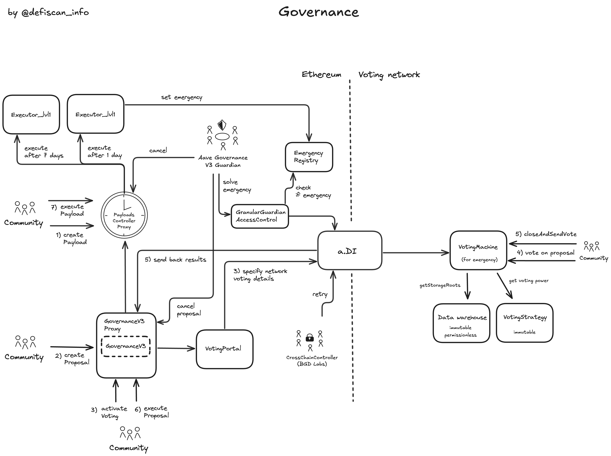

# Summary

Aave v3 is a lending protocol that allows users to lend and borrow different ERC20 assets. Users are able to create positions that consist of debt in different loan assets which is secured by different collateral assets. The lending market allows anyone to liquidate insolvent positions, based on an external price feed and specific collateral factors representing an asset's specific risk profile. Furthermore, instead of borrowing supplied assets, Aave V3 also issues its own stablecoin, GHO. Users can borrow and lend GHO like any other asset in the system.

The Aave DAO is Aave's onchain governance system, allowing AAVE, stkAAVE and aAAVE holders to govern over various aspects ranging across treasury management, risk management and strategic initiatives.

Different Aave protocol _Instances_ exist and are managed by the Aave DAO. These instances focus on specific use cases and chains. This review covers the Ethereum Mainnet Core instance.

# Ratings

## Chain

The report is concerned with the Aave V3 _Core_ instance deployed on Ethereum mainnet. Ethereum mainnet achieves a _Low_ centralization risk score.

> Chain score: Low

## Upgradeability

The Aave v3 protocol can be analyzed in a number of logical modules: _Core Lend & Borrow_, _Reserve Parameters_, _Treasury, Aave Ecosystem Reserves & Rewards_, _GHO Stablecoin_ and _Aave Governance_. Each module exposes various degrees of control as explained in more detail below. Overall, these control vectors could result in the loss of user funds, loss of unclaimed yield or otherwise materially affect the expected performance of the protocol. All the control vectors, apart from the [Emergency Admin](#security-council)'s priviledge, are behind governance vote or if permissions are given to a multisig account, the permission is successfully restricted to prevent mis-use by using steward contracts.
If the [Emergency Admin](#security-council) adhered to the [security council standards](/framework#security-council-requirements), the _Upgradeability Risk_ would achieve a _medium_ score. With the current setup the Aave V3 _core instance_ achieves a _High_ upgradeability score.

### Core Lending & Borrowing

This module forms the core of Aave v3's borrow & lending features and keeps track of users' positions and related protocol state. It centers around the `Pool` contract that governs how debt in the system can be built up, collateralized and how positions can be liquidated. It includes Aave v3's `aTokens` and `variableDebtTokens`. All of these contracts are fully upgradeable through the _Aave Governance_ [module](#aave-governance). An unintended (or malicious) contract upgrade can result in the loss of user funds, loss of unclaimed yield or otherwise materially affect the expected protocol performance.

Special attention is required for the [Emergency Admin](#security-council) multisig, which owns the role `EMERGENCY_ADMIN` that allows to pause a single reserve or pause the entire core market instance (all reserves / the entire Pool). The [Emergency Admin](#security-council) can also disable the grace period for liquidations after discontinuing the pause and resume market activities. The actions by the [Emergency Admin](#security-council) are reversible, but require a governance vote. The [Emergency Admin](#security-council) does not adhere to the _security council requirements_, as the members of the multisig are considered _insiders_ of the Aave DAO (service providers and key voting power holders). In case of a market down turn the [Emergency Admin](#security-council) could mis-use the power to liquidate from a priviledged position. Quoting the [Aave V3 technical paper](https://github.com/aave-dao/aave-v3-origin/blob/main/docs/Aave_V3_Technical_Paper.pdf) page 16.

> Timed with a market crash, the attacker can turn the pool off, and then atomically perform the sequence (turn-on - liquidate - turn-off), allowing him to be the sole liquidator.

### Reserve Parameters

The _Reserve Parameters_ module is responsible for maintaining and updating critical risk parameters in the Aave v3 protocol. Among others, these include the set of enabled collateral and loan assets, their specific _liquidation loan-to-value_ ratios, _liquidation bonuses_ or _interest rate parameters_ and _borrow and supply caps_. An upgradeable `PoolConfigurator` contract controls these parameters with permissions to implement changes delegated to different, specialized, multisig accounts such as the [Emergency Admin](#security-council) or [Risk Council](#security-council). A system of _Roles_, implemented using OpenZeppelin's ACL pattern, and _Stewards_ ensures that these multisig accounts can only implement changes in a limited range or with a certain frequency. This system thus limits the risk of unintended updates through the multisig accounts. However, an upgrade of the `PoolConfigurator` contract could remove these safeguards, for instance by assigning permissions to an _EOA_ or multisig account directly, thus reintroducing the risk of loss of funds, loss of unclaimed yield or a material change of the expected protocol performance.

### Treasury, Aave Ecosystem Reserves and Rewards System

This module manages how fees are collected, spent and third-party rewards allocated and claimed by users. Fees taken across the Aave v3 protocol (and previous versions) are collected in the `TreasuryCollector`, a fully upgradeable contract. Through _Aave Governance_ and different (upgradeable) utility contracts these funds are distributed among _service providers_ and ecosystem initiatives.

### GHO Stablecoin

GHO is Aave v3's native stablecoin that is pegged to the US Dollar and mintable at a 1:1 rate against the centralized USDC and USDT stablecoins through the `GhoStabilityModule` contract. Furthermore, a [Risk Council](#security-council) multisig account (not a _Security Council_ according to the DeFiScan definition) has the ability to mint unbacked GHO supply into (or burn from) the Aave lending market for users to borrow by supplying collateral assets (and thus collateralizing the GHO supply) (this [Risk Council](#security-council) is not the same multisig as the multisig controlling the steward contracts for reserve parameters.) Direct minting and burning through the [Risk Council](#security-council) is managed through the `GhoDirectMinter` contract and limited by minting caps which are controlled by the _Aave Governance_. Both the `GhoStabilityModule` and the `GhoDirectMinter` as well as the respective `aToken` and `variableDebtToken` contracts are upgradeable by the _Aave Governance_ opening the possibility of uncontrolled minting or burning of GHO in case of an unintended upgrade. If abused, this control thus introduces a risk of loss of funds, loss of unclaimed yield (accrued interest in GHO) or an otherwise material impact on the expected protocol performance for GHO holders and Aave users.

### Aave Governance

_Aave Governance_ refers to Aave v3's onchain governance system which controls contract upgrades as well as other critical permissions as outlined above. We discuss the governance process itself in the _Exit Window_ [section](#exit-window) and here focus on upgradeability and control in this module itself. This governance process is implemented in the `GovernanceV3` contract which is fully upgradeable through a permissionless governance proposal. Hence, an unintended proposal could change the _Aave Governance_ system and reassign its control to a less robust or fully centralized setup. In order to mitigate this risk, upgrades to the `GovernanceV3` contract, as well as the AAVE token, require passing a 7 day _Exit Window_ (read more [here](#exit-window)). During this window, users can exit the Aave v3 protocol. Furthermore, the [Aave Governance v3 Guardian](#security-council) multisig account, adhering to the _Security Council_ requirements, can cancel the execution of unintended proposals. On the other hand, this control can be abused to censor regular proposals with majority support.

Also note that the (current) implementation of `GovernanceV3` enables a native multi-chain governance process. Specifically, this process enables proposals to designate a different chain for holding governance votes. While Aave v3's proprietary cross-chain messaging protocol, called `a.DI`, itself does not exhibit centralized control, it makes the governance process susceptible to control over the designated chain itself.

> Upgradeability score: High

## Autonomy

### Oracle and Prices

The Aave V3 protocol relies on Chainlink oracle feeds to price collateral and borrowed assets in the system.

Chainlink achieves a _High_ centralization risk score as discussed in a separate report [here](/protocols/chainlink-oracles/ethereum).

The protocol does currently have limited validation on asset prices provided by Chainlink. These checks include upper caps for stablecoins and LSTs and a sanity check that the price is above 0 for all assets. If the reported price by the price feed was below 0, a fallback oracle would be queried.

Aave has currently no fallback oracle price feeds instantiated. As a consequence if the price was equal to or below 0, user actions on the `Pool` contract that require a price would revert.

The replacement of a stale or untrusted oracle price feed requires a governance vote on permission level 1 (see [Exit Window](#exit-window)).

### Cross-Chain Vote

Votes are currently held on Polygon by using a system called a.DI for cross-chain communication developed by the Aave Community (BGD Labs).

The a.DI does not rely on a single bridge provider to move messages across different networks, but uses a 2/3 threshold, sending the messages in parallel via different bridge providers, reducing the dependency on a single provider.

If the community cannot or does not want to use the a.DI or the other voting networks, then the community still can carry out the vote on Ethereum Mainnet. This would eliminate the cross-chain dependencies for voting.

The cross-chain voting system has low centralization risk because of its fault tolerant design, while the oracle system is currently unmitigated.

> Autonomy score: High

## Exit Window

Critical permissions, including protocol upgrades, are controlled by _Aave Governance_ and an [Emergency Admin](#security-council) multisig account.

Two levels of permissions are separated in the (current) implementation of _Aave Governance_: _Level 2_ defines permissions on the governance system itself and on the `AAVE` token contract, _Level 1_ covers the remaining permissions.

AAVE holders (also stkAAVE, aAAVE) are able to create new proposals (requires 80,000 / 200,0000 votes for Level 1 / Level 2) and vote on proposals (at least 320,000 / 1,040,000 votes are required for a valid proposal and a voting differential (yes minus no votes) of 80,000 / 1,040,000 votes).

Votes start 1 day after proposal creation and the voting period is 10 days for _Level 2_, and 3 days for _Level 1_ proposals.

The execution of successful votes is blocked by an Exit Window with a delay of 7 days for _Level 2_ and 1 day for _Level 1_ permissions. While these Exit Windows do not qualify for a _Low_ or _Medium_ score, the risk of unwanted updates is further mitigated by the [Aave Governance V3 Guardian](#security-council) multisig, which is able to cancel unintended governance proposals and which adheres to the _Security Council_ requirements.

However, these safeguards do only apply to permissions controlled by _Aave Governance_. The [Emergency Admin](#security-council) multisig too holds critical permissions which are not protected with an Exit Window or _Security Council_ setup. Specifically, the [Emergency Admin](#security-council) is able to pause individual Aave markets or the entire protocol as well as disabling the liquidation grace period. If compromised e.g. during a high-volatility market, these permissions could be taken advantage of, in order to execute controlled liquidations.

Meanwhile the permissions of multisig accounts [Risk Council](#security-council) for `Gho` and for the `Pool` contract are sufficiently restricted by steward contracts in terms of frequency of updates and magnitude of the updates, such that an exit window is not required.

> Exit Window score: High

## Accessibility

The official frontend to the Aave V3 protocol is open source and each commit on Aave's GitHub repository is published to IPFS (https://github.com/aave/interface/releases).

In addition to that the Aave v3 protocol is also available through [DeFi Saver](https://app.defisaver.com/aave) and other third-party tools.

https://aave.com/help/aave-101/accessing-aave

> Accessibility score: Low

## Conclusion

The Aave-v3 Ethereum mainnet protocol achieves High centralization risk scores for its Upgradeability, Autonomy and Exit Window dimensions. It thus ranks **Stage 0**.

The protocol could reach **Stage 1** by; 1) adopting the security council requirements for the [Emergency Admin](#security-council) multisig account and 2) implementing fallback mechanism around the Chainlink oracle (or Chainlink adopting a _Security Council_ setup for its own multisig account).

The project additionally could advance to **Stage 2** if all critical permissions were assigned to Aave Governance and protected with a 30-day _Exit Window_.

> Overall Score: Stage 0

# Reviewer Notes

⚠️ During our analysis, we identified a unverified role (not mentioned in the docs https://github.com/bgd-labs/aave-permissions-book/blob/main/out/MAINNET-V3.md#admins). Role Id is `0xd1d2cf869016112a9af1107bcf43c3759daf22cf734aad47d0c9c726e33bc782`. The owners of this role are related to the V2 to V3 migration.

⚠️ Third parties are able to distribute rewards, in their own ERC20 token, to Aave users through the `RewardsControllerManager` and `EmissionManager` contracts. Rewards are distributed continuously among eligible users but controlled by the [Aave Chan Initiative multisig](#security-council) account until claimed. The Aave Chan Initiative multisig account can thus potentially be abused to withhold or steal distributed rewards resulting in a loss of unclaimed yield for users.

# Protocol Analysis

## Upgradeable Pool Contract and mutable reserve parameters

The center of the Aave V3 market is the contract called `Pool`. Each supported asset is attached to a reserve in this `Pool` contract. A reserve specifies the market parameters for this asset (Loan-to-Value, Liquidation Threshold, Supply and Borrow Caps and the interest rate model). Additionally, each asset (ie reserve) can be enabled or disabled for borrowing, if disabled, the asset can only be supplied as collateral for borrowing other assets. The assets are technically deposited to the respective aToken contracts (the receipt token of supplied assets) of a given reserve.

The `Pool` contract is completely upgradeable via the proxy-pattern. The permission to update the `Pool` contract via the proxy contract is owned by the onchain governance (DAO).

In addition to completely upgrading the contracts, the control over some market parameters is handed to the [Risk Council](#security-council) multisig through steward contracts. Steward contracts are contracts that wrap around permissions and restrict the multisig's permission to update market parameters with guardrails. These guardrails include rate-limiting (frequency) as well as relative or absolute changes to parameters. The market parameters which are assigned to the [Risk Council](#security-council) via the steward contracts do not include binary decisions like listing an asset, or allowing/disallowing an asset as collateral. Governance is always the only owner of these steward contracts and is the only allowed entity to update the guardrails.

The system with risk intermediaries (Stewards & Councils) was implemented by giving the `PoolConfigurator` contract permission to change any reserve parameter on the `Pool` contract while the `PoolConfigurator` assigns various roles from the `ACLManager` to these permissioned funcions. LTV, LLTV or Supply and Borrow Caps are assigned to the `RISK_ADMIN` role. Steward contracts own these roles and expose the functions with aforementioned guardrails. Councils (regular multisigs) are the permission owners of these steward functions and thus have only limited control over reserve parameters which prevents malicious behavior and reduces trust assumptions for these multisigs.

This system allows to add more risk councils and to deploy more steward contracts if needed.

The Governance itself can also update reserve parameters directly if the community decides to do so. Additionally Governance has direct permissions on the `PoolConfigurator` endpoints via the role called `POOL_ADMIN` to make changes to the parameters without the Stewards and Councils as intermediaries.

## Smart Contract Upgrade Flow

Many contracts of the Aave V3 system are directly upgradeable through a proxy pattern (see in the contract table for proxy keyword). The `Executor` contract would call the `upgradeTo` and point to the referenced new implementation contract that is specified in the payload. Additionally to the proxy upgrade pattern, Aave V3 has a contract called `PoolAddressesProvider` which serves as a registry of contracts. Through this contract upgrades can be made by deploying a new contract and switching the reference inside the `PoolAddressesProvider` as contracts in the Aave V3 system rely on `PoolAddressesProvider` as a registry of Aave V3 contracts. Also the `PoolAddressesProvider` is owner of many crucial contracts as well.

Contracts that `PoolAddressesProvider` owns or can set are

- `Pool`
- `PoolConfigurator`
- `ACLManager`
- `Governance Executor`

## Treasury

Treasury is funded through reserve fees collected when users pay back debt. The treasury contract is called `Collector`. The treasury contract allows the Aave DAO to pay service providers and fund incentives to grow the Aave ecosystem.

The DAO community can vote on proposals that call `createStream` or `transfer` on the `Collector` contract to spend tokens on behalf of the DAO.

Additionally, the DAO owns permissions to create streams and initiate transfers from the Ecosystem Reserve which holds Aave tokens. The DAO executes via a controller contract called `AaveEcosystemReserveController`.

Both the treasury and the Aave reserve are upgradeable contracts which are sensitive to update, as they hold a lot of value.

## Incentives

3rd parties can list incentives additional to the interest rate paid to the suppliers of capital via the `EmissionManager`. The governance admits the emission admin role to an onchain account that can configure the details of a specific incentive (token, amount of tokens, duration). The tokens are claimed from an account external of the Aave V3 system (for example the ACI multisig) via the `RewardsController` contract.
As a consequence the trust assumptions on receiving the additional incentives has to be studied on a case-by-case basis.

## GHO

GHO is the native stablecoin of Aave. The actual total supply of GHO is governed by the facilitators, which are a set of contracts that have permission to call mint on the `GHO` contract. The total minted GHO cannot exceed an amount set by the DAO. This is enforced by a limit on each facilitator (bucket cap).

Currently the facilitators are

- GhoAToken (Aave market)
- GhoDirectMinter
- GHOFlashMinter
- GHO Stability Modules (USDC, USDT)

Via the `GSM` GHO is redeemable for USDC and USDT at a 1:1 rate up to a certain USDC and USDT cap. The GHO dedicated multisig [Risk Council](#security-council) can update the exposure caps to USDC/USDT via the `GhoGsmSteward`. Upon receiving USDC/USDT `GSM` supplies the stablecoins to the Aave USDC and USDT reserve and issues freshly minted GHO to the seller of the stablecoins. Similarly if the user buys USDC or USDT from the GSM, the returned GHO is burned.

GHO can be borrowed from the reserve at a dynamic interest rate. The total borrowed GHO cannot exceed the bucket cap. Governance and the [Risk Council](#security-council) manage the interest rate by supplying fresh GHO to the reserve via the `GhoDirectMinter` or they can withdraw and burn GHO from the reserve increasing the interest rate.

# Dependencies

## a.DI

The Aave delivery infrastructure (a.DI) ensures decentralized and fault-tolerant cross-chain messaging. It achieves this by encoding a message and submitting it to multiple independent bridges.

On the receiving end (destination network) the a.DI validates the transaction, requiring multiple matching messages from different bridges before executing the bridged message on the destination network. If the confirmation threshold is not reached, a new attempt can be made by retrying the cross-chain message which uses the same bridge configuration but attempts with a new message. In case the previous transaction failed because lack of gas or other reasons.

The a.DI also incorporates an emergency mode which allows the [Aave Governance V3 guardian](#security-council) to replace current bridge providers if one or more bridges become untrusted.

## Oracle

Aave stores the oracle price feeds in the `AaveOracle` contract. The price feeds can be one of 3 kind,

1. regular un-mitigated Chainlink price feed (for all volatile assets)
2. a `PriceCapAdapterStable` contract which wraps the regular Chainlink price feed and adds an upper cap to the reported stablecoin price, if the price is above the cap, the cap is returned, otherwise the price is returned
3. a price cap adapter for LSTs which checks the price ratio of the asset/underlying and compares it to an upper cap computed by the maximum allowed growth rate and the duration since the last check

The Chainlink oracle system itself is upgradeable potentially as discussed in a separate report [here](/protocols/chainlink-oracles/ethereum).

# Governance

The onchain governance system of Aave is multi-chain by design. The creation of proposals and voting on the proposals in permissionless. In this paragraph, the architecture and existing permissions are highlighted.

To get to the stage of voting and creating an onchain proposal a few prior steps need to be passed to have sufficient probability of being accepted through an onchain vote.

1. The proposal was discussed with the community and incorporated feedback
2. A temperature check on Snapshot is conducted. This vote is not binding, but it helps determining if sufficient support is within the community to move the proposal forward.
3. ARFC (Aave Request for Final Comments) where service provider and community members prepare the AIP
4. AIP (Aave Improvement Proposal) which includes the contract payload submission onchain
5. Actual onchain vote
6. Execution on the `PayloadsController` on each chain where the change needs to be enforced

## AIP - Payload submission

Payload submission is technically permissionless. The payload is created by calling `createPayload` on the `PayloadsController` contract. The payload is an array of actions and each action contains information that specifies which contract to call with what data.

## Voting

Voting can be held on either Ethereum Mainnet, Polygon (PoS) or Avalanche. When proposal is created (`createProposal`) the specified `VotingPortal` address determines the voting network of the particular vote. Once the voting is activated by the community, the details of the vote (proposal id, snapshot and voting duration) are sent to the voting network cross-chain with the general purpose Aave delivery infrastructure (a.DI). Mainnet AAVE, aAAVE and stkAAVE token holders can vote on the voting network (e.g Polygon PoS) via the `VotingMachine` contract. The `VotingMachine` contract uses state tree hashes to validate the voting power of each voter. Once the voting duration is over, users can call `closeAndSendVote` which sends the results back to mainnet.

## Execution

Once the proposal passes, the function `executeProposal` on the `AaveGovernanceV3` allows to execute the approved proposal, which forwards the message to the `CrossChainController` (calling `forward`). The CCC forwards the proposal to each chain where the proposal must be executed. If the proposal is also dedicated to the deployment on Ethereum, the payload id is forwarded to the `SameChainAdapter` that calls the function `receiveCrossChainMessage` on the `PayloadsController` contract, which queues the payload to be executed. The payload was previously created on the `PayloadsController` by calling `createPayload` which returns a payload id. This payload id is referenced in the governance proposal (see previous section). Anyone can call `executePayload` once sufficient time has passed (timelock). By calling `executePayload` on the `PayloadsController` `executeTransaction` on the `Executor Lvl1` contract will be triggered. A technical detail, if in this report it is mentioned that the governance owns the permission, it is actually (if we are very precise) this `Executor Lvl1` contract (as shown in the permission table) because community approved payloads will be executed from this contract. Alternatively also the `Executor Lvl2` can be the chosen executor by the payload if it requires permission to update the AAVE token or the Aave governance contract.

In case of a malicious proposal the [Aave Governance V3 Guardian](#security-council) can step in and stop the malicious proposal of being executed at the level of the `Payloads Controller` or at the Governance contract level (`AaveGovernanceV3`). Note this is can happen even if the proposal is supported by the majority of the community.

## Security Council

This table shows the external permission owners and how they are rated against the security council criteria.

| Multisig / Role                     | Address                                                                                                               | Type         | At least 7 signers | At least 51% threshold | ≥50% non-insider signers | Signers publicly announced                                                                                                                  |
| ----------------------------------- | --------------------------------------------------------------------------------------------------------------------- | ------------ | ------------------ | ---------------------- | ------------------------ | ------------------------------------------------------------------------------------------------------------------------------------------- |
| Aave Governance V3 Guardian         | [0xCe52ab41C40575B072A18C9700091Ccbe4A06710](https://etherscan.io/address/0xCe52ab41C40575B072A18C9700091Ccbe4A06710) | Multisig 5/9 | ✅                 | ✅                     | ✅                       | ✅ ([source](https://aave.com/docs/primitives/governance#community-guardians-protocol-emergency-guardian))                                  |
| Emergency Admin                     | [0x2cfe3ec4d5a6811f4b8067f0de7e47dfa938aa30](https://etherscan.io/address/0x2cfe3ec4d5a6811f4b8067f0de7e47dfa938aa30) | Multisig 5/9 | ✅                 | ✅                     | ❌                       | ✅ ([source](https://aave.com/docs/primitives/governance#community-guardians-governance-emergency-guardian))                                |
| Risk Council (for Pool Stewards)    | [0x47c71dFEB55Ebaa431Ae3fbF99Ea50e0D3d30fA8](https://etherscan.io/address/0x47c71dFEB55Ebaa431Ae3fbF99Ea50e0D3d30fA8) | Multisig 2/2 | ❌                 | ✅                     | ❌                       | ✅ ([source](https://vote.onaave.com/proposal/?proposalId=197&ipfsHash=0x2f41406557b0fc69c256916c066a77c57434fa77ccab3cfe56c8db6a4f306c01)) |
| Risk Council (for GhoGsmSteward)    | [0x8513e6F37dBc52De87b166980Fa3F50639694B60](https://etherscan.io/address/0x8513e6F37dBc52De87b166980Fa3F50639694B60) | Multisig 3/4 | ❌                 | ✅                     | ❌                       | ✅ ([source](https://vote.onaave.com/proposal/?proposalId=61&ipfsHash=0x111fca5019e0bc411dc4bfa36167ad7d88c57c9ddbffb202fb1568e16dd06570))  |
| CrossChainController Guardian (BGD) | [0xb812d0944f8F581DfAA3a93Dda0d22EcEf51A9CF](https://etherscan.io/address/0xb812d0944f8F581DfAA3a93Dda0d22EcEf51A9CF) | Multisig 2/3 | ❌                 | ✅                     | ❌                       | ✅ ([source](https://github.com/bgd-labs/aave-permissions-book/blob/main/out/MAINNET-V3.md#governance-v3-contracts))                        |
| CleanUp Admin                       | [0xdeadD8aB03075b7FBA81864202a2f59EE25B312b](https://etherscan.io/address/0xdeadD8aB03075b7FBA81864202a2f59EE25B312b) | Multisig 2/3 | ❌                 | ✅                     | ❌                       | ✅ ([source](https://vote.onaave.com/proposal/?proposalId=270&ipfsHash=0x4043001b72316afa6b6728772941bfa08f127b66c1c006316a3f20510b6738ab)) |
| Aave Chan Initiative (ACI)          | [0xac140648435d03f784879cd789130F22Ef588Fcd](https://etherscan.io/address/0xac140648435d03f784879cd789130F22Ef588Fcd) | Multisig 1/2 | ❌                 | ❌                     | ❌                       | ✅                                                                                                                                          |
| ACI Automation (Bot)                | [0x3Cbded22F878aFC8d39dCD744d3Fe62086B76193](https://etherscan.io/address/0x3Cbded22F878aFC8d39dCD744d3Fe62086B76193) | EOA          | ❌                 | ❌                     | ❌                       | ❌                                                                                                                                          |

💡 The BGD Labs maintains a public markdown page on the existing permissions to inform its users: https://github.com/bgd-labs/aave-permissions-book/blob/main/out/ARBITRUM_ONE-V3.md

## Multisigs and their permission

This table summarizes the permission owner multisig accounts and the stewards which enforce guardrails on the action by the multisig accounts.

| Role                              | Risk Parameter                  | Controlled by                    | Guardrails enforced by                         | Contract                        |
| --------------------------------- | ------------------------------- | -------------------------------- | ---------------------------------------------- | ------------------------------- |
| `EMERGENCY_ADMIN` or `POOL_ADMIN` | setReservePause                 | Emergency Admin                  |                                                | PoolConfigurator                |
| `EMERGENCY_ADMIN` or `POOL_ADMIN` | setPoolPause                    | Emergency Admin                  |                                                | PoolConfigurator                |
| `EMERGENCY_ADMIN` or `POOL_ADMIN` | disableLiquidationGracePeriod   | Emergency Admin                  |                                                | PoolConfigurator                |
| `RISK_ADMIN` or `POOL_ADMIN`      | configureReserveAsCollateral    | Risk Council (for Pool Stewards) | Manual AGRS (RiskSteward)                      | PoolConfigurator                |
| `RISK_ADMIN` or `POOL_ADMIN`      | setBorrowCap                    | Risk Council (for Pool Stewards) | CapsPlusRiskSteward, Manual AGRS (RiskSteward) | PoolConfigurator                |
| `RISK_ADMIN` or `POOL_ADMIN`      | setReserveFreeze                | Emergency Admin                  |                                                | PoolConfigurator                |
| `RISK_ADMIN` or `POOL_ADMIN`      | setReserveInterestRateData      | Risk Council (for Pool Stewards) | Manual AGRS (RiskSteward)                      | PoolConfigurator                |
| `RISK_ADMIN` or `POOL_ADMIN`      | setSupplyCap                    | Risk Council (for Pool Stewards) | CapsPlusRiskSteward, Manual AGRS (RiskSteward) | PoolConfigurator                |
| `RISK_ADMIN` or `POOL_ADMIN`      | updateStablePriceCaps           | Risk Council (for Pool Stewards) | Manual AGRS (RiskSteward)                      | Oracle Pricefeed wrappers       |
| `RISK_ADMIN` or `POOL_ADMIN`      | updateLstPriceCaps              | Risk Council (for Pool Stewards) | Manual AGRS (RiskSteward)                      | Oracle Pricefeed wrappers       |
| `CONFIGURATOR_ROLE`               | updateGsmExposureCap            | Risk Council (for GhoGsmSteward) | GhoGsmSteward                                  | GSM                             |
| `CONFIGURATOR_ROLE`               | updateGsmBuySellFees            | Risk Council (for GhoGsmSteward) | GhoGsmSteward                                  | GSM                             |
| Guardian                          | updateBridgeLimit               | Risk Council (for GhoGsmSteward) | GhoCcipSteward                                 | UpgradeableLockReleaseTokenPool |
| Guardian                          | updateRateLimit                 | Risk Council (for GhoGsmSteward) | GhoCcipSteward                                 | UpgradeableLockReleaseTokenPool |
| `BUCKET_MANAGER_ROLE`             | updateFacilitatorBucketCapacity | Risk Council (for GhoGsmSteward) | GhoBucketSteward                               | GHO                             |
| Risk Council                      | updateGhoBorrowRate             | Risk Council (for GhoGsmSteward) | GhoAaveSteward                                 | PoolConfigurator                |
| Risk Council                      | updateGhoBorrowCap              | Risk Council (for GhoGsmSteward) | GhoAaveSteward                                 | PoolConfigurator                |
| Risk Council                      | updateGhoSupplyCap              | Risk Council (for GhoGsmSteward) | GhoAaveSteward                                 | PoolConfigurator                |

# Contracts and Permissions

## Contracts

| Contract Name                                               | Address                                                                                                               |
| ----------------------------------------------------------- | --------------------------------------------------------------------------------------------------------------------- |
| Pool (Proxy)                                                | [0x87870Bca3F3fD6335C3F4ce8392D69350B4fA4E2](https://etherscan.io/address/0x87870Bca3F3fD6335C3F4ce8392D69350B4fA4E2) |
| Pool (Implementation)                                       | [0x9aEb8aAA1cA38634Aa8C0c8933E7fB4D61091327](https://etherscan.io/address/0x9aEb8aAA1cA38634Aa8C0c8933E7fB4D61091327) |
| aToken (Proxy)                                              | [0x5Ee5bf7ae06D1Be5997A1A72006FE6C607eC6DE8](https://etherscan.io/address/0x5Ee5bf7ae06D1Be5997A1A72006FE6C607eC6DE8) |
| aToken (Implementation)                                     | [0x7effd7b47bfd17e52fb7559d3f924201b9dbff3d](https://etherscan.io/address/0x7effd7b47bfd17e52fb7559d3f924201b9dbff3d) |
| variableDebtToken (Proxy)                                   | [0x40aAbEf1aa8f0eEc637E0E7d92fbfFB2F26A8b7B](https://etherscan.io/address/0x40aAbEf1aa8f0eEc637E0E7d92fbfFB2F26A8b7B) |
| variableDebtToken (Implementation)                          | [0xac725cb59d16c81061bdea61041a8a5e73da9ec6](https://etherscan.io/address/0xac725cb59d16c81061bdea61041a8a5e73da9ec6) |
| GhoAToken (Proxy)                                           | [0x00907f9921424583e7ffBfEdf84F92B7B2Be4977](https://etherscan.io/address/0x00907f9921424583e7ffBfEdf84F92B7B2Be4977) |
| GhoAToken (Implementation)                                  | [0x2f32a274e02fa356423ce5e97a8e3155c1ac396b](https://etherscan.io/address/0x2f32a274e02fa356423ce5e97a8e3155c1ac396b) |
| GhoVariableDebtToken (Proxy)                                | [0x786dBff3f1292ae8F92ea68Cf93c30b34B1ed04B](https://etherscan.io/address/0x786dBff3f1292ae8F92ea68Cf93c30b34B1ed04B) |
| GhoVariableDebtToken (Implementation)                       | [0x20cb2f303ede313e2cc44549ad8653a5e8c0050e](https://etherscan.io/address/0x20cb2f303ede313e2cc44549ad8653a5e8c0050e) |
| GhoDiscountRateStrategy                                     | [0x4C38Ec4D1D2068540DfC11DFa4de41F733DDF812](https://etherscan.io/address/0x4C38Ec4D1D2068540DfC11DFa4de41F733DDF812) |
| DefaultReserveInterestRateStrategy                          | [0x9ec6F08190DeA04A54f8Afc53Db96134e5E3FdFB](https://etherscan.io/address/0x9ec6F08190DeA04A54f8Afc53Db96134e5E3FdFB) |
| GhoInterestRateStrategy                                     | [0x16E77D8a7192b65fEd49B3374417885Ff4421A74](https://etherscan.io/address/0x16E77D8a7192b65fEd49B3374417885Ff4421A74) |
| GHOFlashMinter                                              | [0xb639D208Bcf0589D54FaC24E655C79EC529762B8](https://etherscan.io/address/0xb639D208Bcf0589D54FaC24E655C79EC529762B8) |
| WrappedTokenGatewayV3                                       | [0xA434D495249abE33E031Fe71a969B81f3c07950D](https://etherscan.io/address/0xA434D495249abE33E031Fe71a969B81f3c07950D) |
| PoolAddressesProvider                                       | [0x2f39d218133AFaB8F2B819B1066c7E434Ad94E9e](https://etherscan.io/address/0x2f39d218133AFaB8F2B819B1066c7E434Ad94E9e) |
| PoolConfigurator (Proxy)                                    | [0x64b761D848206f447Fe2dd461b0c635Ec39EbB27](https://etherscan.io/address/0x64b761D848206f447Fe2dd461b0c635Ec39EbB27) |
| PoolConfigurator (Implementation)                           | [0xE5e48Ad1F9D1A894188b483DcF91f4FaD6AbA43b](https://etherscan.io/address/0xE5e48Ad1F9D1A894188b483DcF91f4FaD6AbA43b) |
| UiPoolDataProvider                                          | [0x194324C9Af7f56E22F1614dD82E18621cb9238E7](https://etherscan.io/address/0x194324C9Af7f56E22F1614dD82E18621cb9238E7) |
| UiIncentiveDataProvider                                     | [0x5a40cDe2b76Da2beD545efB3ae15708eE56aAF9c](https://etherscan.io/address/0x5a40cDe2b76Da2beD545efB3ae15708eE56aAF9c) |
| UiGHODataProvider                                           | [0x379c1EDD1A41218bdbFf960a9d5AD2818Bf61aE8](https://etherscan.io/address/0x379c1EDD1A41218bdbFf960a9d5AD2818Bf61aE8) |
| ACLManager                                                  | [0xc2aaCf6553D20d1e9d78E365AAba8032af9c85b0](https://etherscan.io/address/0xc2aaCf6553D20d1e9d78E365AAba8032af9c85b0) |
| WalletBalanceProvider                                       | [0xC7be5307ba715ce89b152f3Df0658295b3dbA8E2](https://etherscan.io/address/0xC7be5307ba715ce89b152f3Df0658295b3dbA8E2) |
| TreasuryCollector (Proxy)                                   | [0x464C71f6c2F760DdA6093dCB91C24c39e5d6e18c](https://etherscan.io/address/0x464C71f6c2F760DdA6093dCB91C24c39e5d6e18c) |
| TreasuryCollector (Implementation)                          | [0x83b7ce402a0e756e901c4a9d1cafa27ca9572afc](https://etherscan.io/address/0x83b7ce402a0e756e901c4a9d1cafa27ca9572afc) |
| ClinicSteward                                               | [0xf00E2de0E78DFf055A92AD4719a179CE275b6Ef7](https://etherscan.io/address/0xf00E2de0E78DFf055A92AD4719a179CE275b6Ef7) |
| Aave (Proxy) (Token)                                        | [0x7Fc66500c84A76Ad7e9c93437bFc5Ac33E2DDaE9](https://etherscan.io/address/0x7Fc66500c84A76Ad7e9c93437bFc5Ac33E2DDaE9) |
| Aave (Implementation) (Token)                               | [0x5d4aa78b08bc7c530e21bf7447988b1be7991322](https://etherscan.io/address/0x5d4aa78b08bc7c530e21bf7447988b1be7991322) |
| stkAAVE (Proxy)                                             | [0x4da27a545c0c5B758a6BA100e3a049001de870f5](https://etherscan.io/address/0x4da27a545c0c5B758a6BA100e3a049001de870f5) |
| stkAAVE (Implementation)                                    | [0x0fe58fe1caa69951dc924a8c222be19013b89476](https://etherscan.io/address/0x0fe58fe1caa69951dc924a8c222be19013b89476) |
| GHO                                                         | [0x40D16FC0246aD3160Ccc09B8D0D3A2cD28aE6C2f](https://etherscan.io/address/0x40D16FC0246aD3160Ccc09B8D0D3A2cD28aE6C2f) |
| GhoOracle                                                   | [0xD110cac5d8682A3b045D5524a9903E031d70FCCd](https://etherscan.io/address/0xD110cac5d8682A3b045D5524a9903E031d70FCCd) |
| GhoDirectMinter (Proxy)                                     | [0x2cE01c87Fec1b71A9041c52CaED46Fc5f4807285](https://etherscan.io/address/0x2cE01c87Fec1b71A9041c52CaED46Fc5f4807285) |
| GhoDirectMinter (Implementation)                            | [0xc718786A7E45353835De634897385b3371A749f0](https://etherscan.io/address/0xc718786A7E45353835De634897385b3371A749f0) |
| GSM (USDC) (Proxy)                                          | [0xFeeb6FE430B7523fEF2a38327241eE7153779535](https://etherscan.io/address/0xFeeb6FE430B7523fEF2a38327241eE7153779535) |
| GSM (USDC) (Implementation)                                 | [0x2edfb4eb6a7fb78b3ac9204f179510865d77c660](https://etherscan.io/address/0x2edfb4eb6a7fb78b3ac9204f179510865d77c660) |
| FixedPriceStrategy (USDC)                                   | [0x00e89F4022FD13AD56e321D50612Eec598eF3b72](https://etherscan.io/address/0x00e89F4022FD13AD56e321D50612Eec598eF3b72) |
| FixedFeeStrategy (USDC)                                     | [0x83896a35db4519BD8CcBAF5cF86CCA61b5cfb938](https://etherscan.io/address/0x83896a35db4519BD8CcBAF5cF86CCA61b5cfb938) |
| GSM (USDT) (Proxy)                                          | [0x535b2f7C20B9C83d70e519cf9991578eF9816B7B](https://etherscan.io/address/0x535b2f7C20B9C83d70e519cf9991578eF9816B7B) |
| GSM (USDT) (Implementation)                                 | [0x0a539750a534765ba960af863cb5c31e34b4c846](https://etherscan.io/address/0x0a539750a534765ba960af863cb5c31e34b4c846) |
| GSMRegistry                                                 | [0x167527db01325408696326e3580cd8e55d99dc1a](https://etherscan.io/address/0x167527db01325408696326e3580cd8e55d99dc1a) |
| FixedPriceStrategy (USDT)                                   | [0x20Be7090711995336A13e24B9EA9e05ac2cdd8C0](https://etherscan.io/address/0x20Be7090711995336A13e24B9EA9e05ac2cdd8C0) |
| FixedFeeStrategy (USDT)                                     | [0x83896a35db4519BD8CcBAF5cF86CCA61b5cfb938](https://etherscan.io/address/0x83896a35db4519BD8CcBAF5cF86CCA61b5cfb938) |
| GhoGsmSteward                                               | [0xd1e856a947cdf56b4f000ee29d34f5808e0a6848](https://etherscan.io/address/0xd1e856a947cdf56b4f000ee29d34f5808e0a6848) |
| OracleSwapFreezer (USDC)                                    | [0x29F8c924B7aB50649c9597B8811d08f9Ef0310c3](https://etherscan.io/address/0x29F8c924B7aB50649c9597B8811d08f9Ef0310c3) |
| OracleSwapFreezer (USDT)                                    | [0x6439DA186BD3d37fE7Fd36036543b403e9FAbaE7](https://etherscan.io/address/0x6439DA186BD3d37fE7Fd36036543b403e9FAbaE7) |
| GhoCcipSteward                                              | [0xC5BcC58BE6172769ca1a78B8A45752E3C5059c39](https://etherscan.io/address/0xC5BcC58BE6172769ca1a78B8A45752E3C5059c39) |
| GhoBucketSteward                                            | [0x46Aa1063e5265b43663E81329333B47c517A5409](https://etherscan.io/address/0x46Aa1063e5265b43663E81329333B47c517A5409) |
| GhoAaveSteward                                              | [0x98217a06721ebf727f2c8d9ad7718ec28b7aae34](https://etherscan.io/address/0x98217a06721ebf727f2c8d9ad7718ec28b7aae34) |
| UpgradeableLockReleaseTokenPool (Gho CCIP Token Pool) Proxy | [0x06179f7C1be40863405f374E7f5F8806c728660A](https://etherscan.io/address/0x06179f7C1be40863405f374E7f5F8806c728660A) |
| UpgradeableLockReleaseTokenPool (Gho CCIP Token Pool)       | [0x2ce400703dacc37b7edfa99d228b8e70a4d3831b](https://etherscan.io/address/0x2ce400703dacc37b7edfa99d228b8e70a4d3831b) |
| stkGHO (Proxy)                                              | [0x1a88Df1cFe15Af22B3c4c783D4e6F7F9e0C1885d](https://etherscan.io/address/0x1a88Df1cFe15Af22B3c4c783D4e6F7F9e0C1885d) |
| stkGHO (Implementation)                                     | [0x50f9d4e28309303f0cdcac8af0b569e8b75ab857](https://etherscan.io/address/0x50f9d4e28309303f0cdcac8af0b569e8b75ab857) |
| stkABPTV2 (Proxy)                                           | [0x9eDA81C21C273a82BE9Bbc19B6A6182212068101](https://etherscan.io/address/0x9eDA81C21C273a82BE9Bbc19B6A6182212068101) |
| stkABPTV2 (Implementation)                                  | [0x4ad4a620eeae490d5872f69845104faefb67efc4](https://etherscan.io/address/0x4ad4a620eeae490d5872f69845104faefb67efc4) |
| BalancerV2SharedPoolPriceProvider Oracle                    | [0xADf86b537eF08591c2777E144322E8b0Ca7E82a7](https://etherscan.io/address/0xADf86b537eF08591c2777E144322E8b0Ca7E82a7) |
| AaveEcosystemReserve (Proxy)                                | [0x25F2226B597E8F9514B3F68F00f494cF4f286491](https://etherscan.io/address/0x25F2226B597E8F9514B3F68F00f494cF4f286491) |
| AaveEcosystemReserve (Implementation)                       | [0x10c74b37ad4541e394c607d78062e6d22d9ad632](https://etherscan.io/address/0x10c74b37ad4541e394c607d78062e6d22d9ad632) |
| AaveEcosystemReserveController                              | [0x3d569673dAa0575c936c7c67c4E6AedA69CC630C](https://etherscan.io/address/0x3d569673dAa0575c936c7c67c4E6AedA69CC630C) |
| AaveProtocolDataProvider                                    | [0x497a1994c46d4f6C864904A9f1fac6328Cb7C8a6](https://etherscan.io/address/0x497a1994c46d4f6C864904A9f1fac6328Cb7C8a6) |
| RewardsController (Proxy)                                   | [0x8164Cc65827dcFe994AB23944CBC90e0aa80bFcb](https://etherscan.io/address/0x8164Cc65827dcFe994AB23944CBC90e0aa80bFcb) |
| RewardsController (Implementation)                          | [0xe7b67f44ea304dd7f6d215b13686637ff64cd2b2](https://etherscan.io/address/0xe7b67f44ea304dd7f6d215b13686637ff64cd2b2) |
| EmissionManager                                             | [0x223d844fc4B006D67c0cDbd39371A9F73f69d974](https://etherscan.io/address/0x223d844fc4B006D67c0cDbd39371A9F73f69d974) |
| StaticATokenFactory (Proxy)                                 | [0x411D79b8cC43384FDE66CaBf9b6a17180c842511](https://etherscan.io/address/0x411D79b8cC43384FDE66CaBf9b6a17180c842511) |
| StaticATokenFactory (Implementation)                        | [0x7a68e572efe159753813eb86a8c84157d684bda2](https://etherscan.io/address/0x7a68e572efe159753813eb86a8c84157d684bda2) |
| PoolAddressesProviderRegistry                               | [0xbaA999AC55EAce41CcAE355c77809e68Bb345170](https://etherscan.io/address/0xbaA999AC55EAce41CcAE355c77809e68Bb345170) |
| AaveOracle                                                  | [0x54586bE62E3c3580375aE3723C145253060Ca0C2](https://etherscan.io/address/0x54586bE62E3c3580375aE3723C145253060Ca0C2) |
| SvrOracleSteward                                            | [0x8b493f416F5F7933cC146b1899c069F2361cad60](https://etherscan.io/address/0x8b493f416F5F7933cC146b1899c069F2361cad60) |
| RepayWithCollateral / ParaSwapRepayAdapter                  | [0x35bb522b102326ea3F1141661dF4626C87000e3E](https://etherscan.io/address/0x35bb522b102326ea3F1141661dF4626C87000e3E) |
| CollateralSwitch / ParaSwapLiquiditySwapAdapter             | [0xADC0A53095A0af87F3aa29FE0715B5c28016364e](https://etherscan.io/address/0xADC0A53095A0af87F3aa29FE0715B5c28016364e) |
| DebtSwitch / ParaSwapDebtSwapAdapterV3GHO                   | [0xd7852E139a7097E119623de0751AE53a61efb442](https://etherscan.io/address/0xd7852E139a7097E119623de0751AE53a61efb442) |
| WithdrawSwitchAdapter / ParaSwapWithdrawSwapAdapter         | [0x78F8Bd884C3D738B74B420540659c82f392820e0](https://etherscan.io/address/0x78F8Bd884C3D738B74B420540659c82f392820e0) |
| ACLAdmin / Executor_lvl1                                    | [0x5300A1a15135EA4dc7aD5a167152C01EFc9b192A](https://etherscan.io/address/0x5300A1a15135EA4dc7aD5a167152C01EFc9b192A) |
| Executor_lvl2                                               | [0x17Dd33Ed0e3dD2a80E37489B8A63063161BE6957](https://etherscan.io/address/0x17Dd33Ed0e3dD2a80E37489B8A63063161BE6957) |
| CapsPlusRiskSteward                                         | [0x82dcCF206Ae2Ab46E2099e663F70DeE77caE7778](https://etherscan.io/address/0x82dcCF206Ae2Ab46E2099e663F70DeE77caE7778) |
| ProxyAdmin                                                  | [0xD3cF979e676265e4f6379749DECe4708B9A22476](https://etherscan.io/address/0xD3cF979e676265e4f6379749DECe4708B9A22476) |
| ProxyAdminLong                                              | [0x86C3FfeE349A7cFf7cA88C449717B1b133bfb517](https://etherscan.io/address/0x86C3FfeE349A7cFf7cA88C449717B1b133bfb517) |
| FreezingSteward                                             | [0x2eE68ACb6A1319de1b49DC139894644E424fefD6](https://etherscan.io/address/0x2eE68ACb6A1319de1b49DC139894644E424fefD6) |
| AaveMerkleDistributor                                       | [0xa88c6D90eAe942291325f9ae3c66f3563B93FE10](https://etherscan.io/address/0xa88c6D90eAe942291325f9ae3c66f3563B93FE10) |
| AavePolEthBridge                                            | [0x1C2BA5b8ab8e795fF44387ba6d251fa65AD20b36](https://etherscan.io/address/0x1C2BA5b8ab8e795fF44387ba6d251fa65AD20b36) |
| Manual AGRS (RiskSteward)                                   | [0x7C7143f4bE189928A6a98D8686c5e84c893c59c7](https://etherscan.io/address/0x7C7143f4bE189928A6a98D8686c5e84c893c59c7) |
| GranularGuardianAccessControl                               | [0x4457cA11E90f416Cc1D3a8E1cA41C0cdEcC251d4](https://etherscan.io/address/0x4457cA11E90f416Cc1D3a8E1cA41C0cdEcC251d4) |
| AaveGovernanceV3 (Proxy)                                    | [0x9AEE0B04504CeF83A65AC3f0e838D0593BCb2BC7](https://etherscan.io/address/0x9AEE0B04504CeF83A65AC3f0e838D0593BCb2BC7) |
| AaveGovernanceV3 (Implementation)                           | [0x58bcb647c4beff253b4b6996c62f737b783f2cdd](https://etherscan.io/address/0x58bcb647c4beff253b4b6996c62f737b783f2cdd) |
| PayloadsController (Proxy)                                  | [0xdAbad81aF85554E9ae636395611C58F7eC1aAEc5](https://etherscan.io/address/0xdAbad81aF85554E9ae636395611C58F7eC1aAEc5) |
| PayloadsController (Implementation)                         | [0x7222182cb9c5320587b5148bf03eee107ad64578](https://etherscan.io/address/0x7222182cb9c5320587b5148bf03eee107ad64578) |
| VotingMachine                                               | [0x06a1795a88b82700896583e123F46BE43877bFb6](https://etherscan.io/address/0x06a1795a88b82700896583e123F46BE43877bFb6) |
| VotingStrategy                                              | [0x5642A5A5Ec284B4145563aBF319620204aCCA7f4](https://etherscan.io/address/0x5642A5A5Ec284B4145563aBF319620204aCCA7f4) |
| DataWarehouse                                               | [0x1699FE9CaDC8a0b6c93E06B62Ab4592a0fFEcF61](https://etherscan.io/address/0x1699FE9CaDC8a0b6c93E06B62Ab4592a0fFEcF61) |
| VotingPortal_Eth_Eth                                        | [0x6ACe1Bf22D57a33863161bFDC851316Fb0442690](https://etherscan.io/address/0x6ACe1Bf22D57a33863161bFDC851316Fb0442690) |
| VotingPortal_Eth_Avax                                       | [0x9Ded9406f088C10621BE628EEFf40c1DF396c172](https://etherscan.io/address/0x9Ded9406f088C10621BE628EEFf40c1DF396c172) |
| VotingPortal_Eth_Pol                                        | [0xFe4683C18aaad791B6AFDF0a8e1Ed5C6e2c9ecD6](https://etherscan.io/address/0xFe4683C18aaad791B6AFDF0a8e1Ed5C6e2c9ecD6) |
| EmergencyRegistry                                           | [0x73C6Fb358dDA8e84D50e98A98F7c0dF32e15C7e9](https://etherscan.io/address/0x73C6Fb358dDA8e84D50e98A98F7c0dF32e15C7e9) |
| CCIPAdapter                                                 | [0xB7a6618df58626C3a122ABAFD6Ee63Af63f3Ef29](https://etherscan.io/address/0xB7a6618df58626C3a122ABAFD6Ee63Af63f3Ef29) |
| PolygonAdapterEthereum (native adapter)                     | [0x1562F1b2487F892BBA8Ef325aF054Fd157510a71](https://etherscan.io/address/0x1562F1b2487F892BBA8Ef325aF054Fd157510a71) |
| LayerZeroAdapter                                            | [0x8410d9BD353b420ebA8C48ff1B0518426C280FCC](https://etherscan.io/address/0x8410d9BD353b420ebA8C48ff1B0518426C280FCC) |
| HyperLaneAdapter                                            | [0x01dcb90Cf13b82Cde4A0BAcC655585a83Af3cCC1](https://etherscan.io/address/0x01dcb90Cf13b82Cde4A0BAcC655585a83Af3cCC1) |
| SameChainAdapter                                            | [0x6cfbd2aA4691fc18B9C209bDd43DC3943C228FCf](https://etherscan.io/address/0x6cfbd2aA4691fc18B9C209bDd43DC3943C228FCf) |
| CrossChainController (Proxy)                                | [0xEd42a7D8559a463722Ca4beD50E0Cc05a386b0e1](https://etherscan.io/address/0xEd42a7D8559a463722Ca4beD50E0Cc05a386b0e1) |
| CrossChainControllerUpgradeRev3 (Implementation)            | [0x92f4736b72d131d836b3e4d4c3c23fe53150ce4d](https://etherscan.io/address/0x92f4736b72d131d836b3e4d4c3c23fe53150ce4d) |
| PayloadsControllerDataHelper                                | [0xE3B770Dc4ae3f8bECaB3Ed12dE692c741603e16A](https://etherscan.io/address/0xE3B770Dc4ae3f8bECaB3Ed12dE692c741603e16A) |
| GovernanceDataHelper                                        | [0x971c82c8316aD611904F95616c21ce90837f1856](https://etherscan.io/address/0x971c82c8316aD611904F95616c21ce90837f1856) |
| VotingMachineDataHelper                                     | [0x77976B51569896523EE215962Ee91ff236Fa50E8](https://etherscan.io/address/0x77976B51569896523EE215962Ee91ff236Fa50E8) |
| MetaDelegateHelper                                          | [0x94363B11b37BC3ffe43AB09cff5A010352FE85dC](https://etherscan.io/address/0x94363B11b37BC3ffe43AB09cff5A010352FE85dC) |

## All Permission owners

| Name                                     | Account                                                                                                               | Type         |
| ---------------------------------------- | --------------------------------------------------------------------------------------------------------------------- | ------------ |
| Aave Governance V3 Guardian              | [0xCe52ab41C40575B072A18C9700091Ccbe4A06710](https://etherscan.io/address/0xCe52ab41C40575B072A18C9700091Ccbe4A06710) | Multisig 5/9 |
| Executor_lvl1                            | [0x5300A1a15135EA4dc7aD5a167152C01EFc9b192A](https://etherscan.io/address/0x5300A1a15135EA4dc7aD5a167152C01EFc9b192A) | Contract     |
| Executor_lvl2                            | [0x17Dd33Ed0e3dD2a80E37489B8A63063161BE6957](https://etherscan.io/address/0x17Dd33Ed0e3dD2a80E37489B8A63063161BE6957) | Contract     |
| PoolAddressesProvider                    | [0x2f39d218133AFaB8F2B819B1066c7E434Ad94E9e](https://etherscan.io/address/0x2f39d218133AFaB8F2B819B1066c7E434Ad94E9e) | Contract     |
| PoolConfigurator                         | [0x64b761D848206f447Fe2dd461b0c635Ec39EbB27](https://etherscan.io/address/0x64b761D848206f447Fe2dd461b0c635Ec39EbB27) | Contract     |
| ProxyAdmin                               | [0xD3cF979e676265e4f6379749DECe4708B9A22476](https://etherscan.io/address/0xD3cF979e676265e4f6379749DECe4708B9A22476) | Contract     |
| ProxyAdminLong                           | [0x86C3FfeE349A7cFf7cA88C449717B1b133bfb517](https://etherscan.io/address/0x86C3FfeE349A7cFf7cA88C449717B1b133bfb517) | Contract     |
| CrossChainController Guardian (BGD Labs) | [0xb812d0944f8F581DfAA3a93Dda0d22EcEf51A9CF](https://etherscan.io/address/0xb812d0944f8F581DfAA3a93Dda0d22EcEf51A9CF) | Multisig 2/3 |
| Emergency Admin                          | [0x2cfe3ec4d5a6811f4b8067f0de7e47dfa938aa30](https://etherscan.io/address/0x2cfe3ec4d5a6811f4b8067f0de7e47dfa938aa30) | Multisig 5/9 |
| Risk Council (for Pool Stewards)         | [0x47c71dFEB55Ebaa431Ae3fbF99Ea50e0D3d30fA8](https://etherscan.io/address/0x47c71dFEB55Ebaa431Ae3fbF99Ea50e0D3d30fA8) | Multisig 2/2 |
| Risk Council (for GhoGsmSteward)         | [0x8513e6F37dBc52De87b166980Fa3F50639694B60](https://etherscan.io/address/0x8513e6F37dBc52De87b166980Fa3F50639694B60) | Multisig 3/4 |
| CleanUp Admin                            | [0xdeadD8aB03075b7FBA81864202a2f59EE25B312b](https://etherscan.io/address/0xdeadD8aB03075b7FBA81864202a2f59EE25B312b) | Multisig 2/3 |
| ACI Automation (Bot)                     | [0x3Cbded22F878aFC8d39dCD744d3Fe62086B76193](https://etherscan.io/address/0x3Cbded22F878aFC8d39dCD744d3Fe62086B76193) | EOA          |
| ProxyAdmin for GHO CCIP Token Pool       | [0xB54f773211331f3889b74624D341e49328E83473](https://etherscan.io/address/0xB54f773211331f3889b74624D341e49328E83473) | Contract     |
| Aave Chan Initiative (in short ACI)      | [0xac140648435d03f784879cd789130F22Ef588Fcd](https://etherscan.io/address/0xac140648435d03f784879cd789130F22Ef588Fcd) | Multisig 1/2 |

## Permissions

| Contract                                                          | Function                               | Impact                                                                                                                                                                                                                                                                                                                                                                                                                                                                                                                                                                                                                                                                                                                                                                                                                                                                                                                                                                                                                                                                                                                           | Owner                                                                                                                                                                        |
| ----------------------------------------------------------------- | -------------------------------------- | -------------------------------------------------------------------------------------------------------------------------------------------------------------------------------------------------------------------------------------------------------------------------------------------------------------------------------------------------------------------------------------------------------------------------------------------------------------------------------------------------------------------------------------------------------------------------------------------------------------------------------------------------------------------------------------------------------------------------------------------------------------------------------------------------------------------------------------------------------------------------------------------------------------------------------------------------------------------------------------------------------------------------------------------------------------------------------------------------------------------------------- | ---------------------------------------------------------------------------------------------------------------------------------------------------------------------------- |
| Pool (Proxy) (BaseImmutableAdminUpgradeabilityProxy)              | admin                                  | Permissioned getter of the owner address (only the owner can retrieve it onchain). The owner address is stored in the bytecode (keyword immutable) and is thus immutable.                                                                                                                                                                                                                                                                                                                                                                                                                                                                                                                                                                                                                                                                                                                                                                                                                                                                                                                                                        | PoolAddressesProvider                                                                                                                                                        |
| Pool (Proxy) (BaseImmutableAdminUpgradeabilityProxy)              | implementation                         | Permissioned getter of the implementation address.                                                                                                                                                                                                                                                                                                                                                                                                                                                                                                                                                                                                                                                                                                                                                                                                                                                                                                                                                                                                                                                                               | PoolAddressesProvider                                                                                                                                                        |
| Pool (Proxy) (BaseImmutableAdminUpgradeabilityProxy)              | upgradeTo                              | This function allows the permission owner to set a new implementation contract to forward calls to. This can change the whole pool implementation logic and thus can affect deposits, collateral and unclaimed yield. The function on `PoolAddressesProvider` that can call this function is `setAddress` and this function is governed by the _Aave Governance_. Thus this change needs to pass governance vote, but as all governance votes it can be vetoed by the [Aave Governance V3 Guardian](#security-council) to protect against malicious governance proposals that have passed.                                                                                                                                                                                                                                                                                                                                                                                                                                                                                                                                       | PoolAddressesProvider                                                                                                                                                        |
| Pool (Proxy) (BaseImmutableAdminUpgradeabilityProxy)              | upgradeToAndCall                       | Same as `upgradeTo` (previous row) but allows to atomically call also a function on the new implementation contract in one transaction.                                                                                                                                                                                                                                                                                                                                                                                                                                                                                                                                                                                                                                                                                                                                                                                                                                                                                                                                                                                          | PoolAddressesProvider                                                                                                                                                        |
| Pool (Implementation)                                             | initReserve                            | Initializes a reserve, activating it, assigning an aToken and debt tokens and an interest rate strategy. This function is permissioned and only the `PoolConfigurator` can execute it. This function is called if support for a new asset is desired. Users can supply this asset, receive the aToken or if they want to borrow they receive the debt token, while the interest rate strategy is applied for users positions.                                                                                                                                                                                                                                                                                                                                                                                                                                                                                                                                                                                                                                                                                                    | PoolConfigurator (Proxy)                                                                                                                                                     |
| Pool (Implementation)                                             | dropReserve                            | The `dropReserve` function in Aave V3 serves as a mechanism to permanently remove a reserve from the pool's active reserves. This action is more comprehensive than freezing or pausing, as it completely deactivates the reserve, preventing any further user interactions with the asset within the pool. Dropping the reserve requires that the aToken and the DebtToken supplies are 0.                                                                                                                                                                                                                                                                                                                                                                                                                                                                                                                                                                                                                                                                                                                                      | PoolConfigurator (Proxy)                                                                                                                                                     |
| Pool (Implementation)                                             | setReserveInterestRateStrategyAddress  | Sets the interest rate strategy of a reserve. It achieves this by pointing to a new smart contract that implements the interest rate strategy. The PoolConfigurator is the only permissioned account to call this function. The change to this new interest rate strategy most likely results in different future yield. Past unclaimed yield is not affected.                                                                                                                                                                                                                                                                                                                                                                                                                                                                                                                                                                                                                                                                                                                                                                   | PoolConfigurator (Proxy)                                                                                                                                                     |
| Pool (Implementation)                                             | syncIndexesState                       | Accumulates interest to all indexes of the reserve. To be used when required by the configurator, for example when updating interest rates strategy data.                                                                                                                                                                                                                                                                                                                                                                                                                                                                                                                                                                                                                                                                                                                                                                                                                                                                                                                                                                        | PoolConfigurator (Proxy)                                                                                                                                                     |
| Pool (Implementation)                                             | syncRatesState                         | When the protocol's governance decides to modify the interest rate strategy for a reserve, it's crucial to synchronize the reserve's indexes with the new strategy to maintain accurate interest calculations. `syncRatesState` achieves that. The `PoolConfigurator` contract facilitates this process. For instance, in the `setReserveInterestRateStrategyAddress` function within the `PoolConfigurator`, the `syncIndexesState` function is called to update the reserve's state before applying the new interest rate strategy.                                                                                                                                                                                                                                                                                                                                                                                                                                                                                                                                                                                            | PoolConfigurator (Proxy)                                                                                                                                                     |
| Pool (Implementation)                                             | updateBridgeProtocolFee                | Updates the protocol fee on the bridging. The fee is sent to the protocol treasury. The fee is raised when calling `backUnbacked` on the `Pool` contract.                                                                                                                                                                                                                                                                                                                                                                                                                                                                                                                                                                                                                                                                                                                                                                                                                                                                                                                                                                        | PoolConfigurator (Proxy)                                                                                                                                                     |
| Pool (Implementation)                                             | setConfiguration                       | Allows to update all configurations of a reserve at once without any guardrails.                                                                                                                                                                                                                                                                                                                                                                                                                                                                                                                                                                                                                                                                                                                                                                                                                                                                                                                                                                                                                                                 | PoolConfigurator (Proxy)                                                                                                                                                     |
| Pool (Implementation)                                             | updateFlashloanPremiums                | Increasing flashLoanPremiumTotal: Raises the overall cost of flash loans, potentially reducing their usage but increasing earnings for both liquidity providers and the protocol. Adjusting flashLoanPremiumToProtocol: Alters the revenue split between liquidity providers and the protocol. A higher value directs more fees to the protocol treasury, while a lower value benefits liquidity providers. There are no limits enforced on the smart contract level.                                                                                                                                                                                                                                                                                                                                                                                                                                                                                                                                                                                                                                                            | PoolConfigurator (Proxy)                                                                                                                                                     |
| Pool (Implementation)                                             | configureEModeCategory                 | Configures a new or alters an existing collateral configuration of an eMode. Users can opt-in using eMode to profit from better LTV settings for correlated assets. This function sets LTV, liquidationThreshold and liquidationBonus. There are no boundaries enforced on the settings of an eMode in the Pool contract, but on the PoolConfigurator, which is the only contract permissioned to call this function, has relative boundaries.                                                                                                                                                                                                                                                                                                                                                                                                                                                                                                                                                                                                                                                                                   | PoolConfigurator (Proxy)                                                                                                                                                     |
| Pool (Implementation)                                             | configureEModeCategoryCollateralBitmap | While `configureEModeCategory` specifies the LTV, liquidationThreshold and liquidationBonus, `configureEModeCategoryBorrowableBitmap` specifies which assets belong to a certain EMode (ie. which assets are closely correlated) and can serve as collateral in this EMode.                                                                                                                                                                                                                                                                                                                                                                                                                                                                                                                                                                                                                                                                                                                                                                                                                                                      | PoolConfigurator (Proxy)                                                                                                                                                     |
| Pool (Implementation)                                             | configureEModeCategoryBorrowableBitmap | Specifies which assets belong to a certain EMode (ie. which assets are closely correlated) and can be borrowed in this EMode.                                                                                                                                                                                                                                                                                                                                                                                                                                                                                                                                                                                                                                                                                                                                                                                                                                                                                                                                                                                                    | PoolConfigurator (Proxy)                                                                                                                                                     |
| Pool (Implementation)                                             | resetIsolationModeTotalDebt            | Resets the isolation mode total debt of the given asset to zero. It requires the given asset has zero debt ceiling. Which is done by `setDebtCeiling` inside `PoolConfigurator`, first it sets debt ceiling to 0 and then sets total debt to 0. This action is indicating that no new borrowing against this asset is allowed.                                                                                                                                                                                                                                                                                                                                                                                                                                                                                                                                                                                                                                                                                                                                                                                                   | PoolConfigurator (Proxy)                                                                                                                                                     |
| Pool (Implementation)                                             | setLiquidationGracePeriod              | Sets the liquidation grace period of the given asset (applied for all positions). This halts liquidations for a specific asset until a certain timestamp. `PoolConfigurator` only calls this function when pausing a reserve or when disabling the Liquidation Grace Period e.g after discontinuing the pause.                                                                                                                                                                                                                                                                                                                                                                                                                                                                                                                                                                                                                                                                                                                                                                                                                   | PoolConfigurator (Proxy)                                                                                                                                                     |
| Pool (Implementation)                                             | rescueTokens                           | Rescue and transfer tokens locked in this contract. This function can transfer ERC20 tokens from this contract on demand. Useful when users send tokens to this contract by mistake. This function can be called by the `POOL_ADMIN` any time.                                                                                                                                                                                                                                                                                                                                                                                                                                                                                                                                                                                                                                                                                                                                                                                                                                                                                   | `POOL_ADMIN`                                                                                                                                                                 |
| Pool (Implementation)                                             | mintUnbacked                           | `mintUnbacked` function is a specialized mechanism that allows authorized bridge contracts to mint aTokens without immediately supplying the corresponding underlying assets. This function is integral to Aave's cross-chain liquidity feature known as "Portals", which facilitates seamless asset transfers across different blockchain networks for users. Users can have the funds on the destination chain with the transanction mined. Upon arrival of the underlying assets on the target network by the bridge, the bridge contract invokes the `backUnbacked` function and pays a fee to Aave V3 Portal system. This function supplies the underlying assets to the Aave protocol, thereby backing the previously minted aTokens and ensuring the system's solvency.                                                                                                                                                                                                                                                                                                                                                   | no permission holder (ie un-used for bridging from L2 to Mainnet)                                                                                                            |
| Pool (Implementation)                                             | backUnbacked                           | See `mintUnbacked`                                                                                                                                                                                                                                                                                                                                                                                                                                                                                                                                                                                                                                                                                                                                                                                                                                                                                                                                                                                                                                                                                                               | no permission holder (ie un-used)                                                                                                                                            |
| Pool (Implementation)                                             | eliminateReserveDeficit                | Allows the Umbrella system to cover bad debt by burning aTokens or GHO.                                                                                                                                                                                                                                                                                                                                                                                                                                                                                                                                                                                                                                                                                                                                                                                                                                                                                                                                                                                                                                                          | listed Umbrella in the PoolAddressesProvider (currently none)                                                                                                                |
| DefaultReserveInterestRateStrategyV2                              | setInterestRateParams                  | Sets the interest rate parameters for a certain reserve. The supplied parameters to the function are checked against constant boundaries (MIN_OPTIMAL_POINT, MAX_OPTIMAL_POINT, slope2 > slope1, MAX_BORROW_RATE). Past unclaimed yield is not affected. Future yield is suspect to change.                                                                                                                                                                                                                                                                                                                                                                                                                                                                                                                                                                                                                                                                                                                                                                                                                                      | PoolConfigurator (Proxy)                                                                                                                                                     |
| aToken (Proxy)                                                    | upgradeTo                              | This function allows to update the aToken's implementation and change its logic. The governance holds the permission via the `PoolConfigurator` contract. This function needs to be protected as it can lead to loss of funds if used maliciously.                                                                                                                                                                                                                                                                                                                                                                                                                                                                                                                                                                                                                                                                                                                                                                                                                                                                               | PoolConfigurator (Proxy)                                                                                                                                                     |
| aToken (Proxy)                                                    | upgradeToAndCall                       | Similar to `upgradeTo` but it allows to call a function after the upgrade which is often used to initialise the new implementation contract.                                                                                                                                                                                                                                                                                                                                                                                                                                                                                                                                                                                                                                                                                                                                                                                                                                                                                                                                                                                     | PoolConfigurator (Proxy)                                                                                                                                                     |
| aToken (Implementation)                                           | setIncentivesController                | All operations that change balance through user actions cause, if specified, a hook call to the `IncentivesController`. If the `IncentivesController` is removed by this function (setting to 0 address) or a new contract is appointed as `IncentivesController` during an on-going incentive campaign, then incentives rewards that could not been accumulated by user actions are lost. No effect if no incentive campaign is active for this asset.                                                                                                                                                                                                                                                                                                                                                                                                                                                                                                                                                                                                                                                                          | `POOL_ADMIN`                                                                                                                                                                 |
| aToken (Implementation)                                           | rescueTokens                           | This function allows to rescue tokens that were sent to this contract by mistake. The implementation prevents to "rescue" the underlying asset.                                                                                                                                                                                                                                                                                                                                                                                                                                                                                                                                                                                                                                                                                                                                                                                                                                                                                                                                                                                  | `POOL_ADMIN`                                                                                                                                                                 |
| aToken (Implementation)                                           | mint                                   | aTokens are minted when user deposits funds into an Aave reserve. User interacts with the `Pool` and thus is the `Pool` the only contract that is allowed to call this function and mint value accruing receipt tokens to the user. User funds also are held in the aToken contract. If this contract is updated maliciously it will lead to loss of funds.                                                                                                                                                                                                                                                                                                                                                                                                                                                                                                                                                                                                                                                                                                                                                                      | Pool (Proxy)                                                                                                                                                                 |
| aToken (Implementation)                                           | burn                                   | When a user returns the aTokens, they are burned and the user receives back the underlying asset that was deposited. Only the `Pool` contract is allowed to facilitate this movement of assets.                                                                                                                                                                                                                                                                                                                                                                                                                                                                                                                                                                                                                                                                                                                                                                                                                                                                                                                                  | Pool (Proxy)                                                                                                                                                                 |
| aToken (Implementation)                                           | mintToTreasury                         | This function is called via the same named function on the `Pool` contract `mintToTreasury`. The function on the `Pool` contract is permissionless. It allows the treasury to collect income on the reserve activity based on the accrued amount for the treasury. This function creates income for the Treasury via minting new aTokens.                                                                                                                                                                                                                                                                                                                                                                                                                                                                                                                                                                                                                                                                                                                                                                                        | Pool (Proxy)                                                                                                                                                                 |
| aToken (Implementation)                                           | transferOnLiquidation                  | Transfers aTokens in the event of a borrow being liquidated from the borrower to the liquidator if the liquidators reclaims the aTokens. Only the `Pool` contract is allowed to make this call.                                                                                                                                                                                                                                                                                                                                                                                                                                                                                                                                                                                                                                                                                                                                                                                                                                                                                                                                  | Pool (Proxy)                                                                                                                                                                 |
| aToken (Implementation)                                           | transferUnderlyingTo                   | Transfers the underlying asset to the specified address. This is used when the underlying asset is transferred based on a borrow, withdraw or flashloan operation.                                                                                                                                                                                                                                                                                                                                                                                                                                                                                                                                                                                                                                                                                                                                                                                                                                                                                                                                                               | Pool (Proxy)                                                                                                                                                                 |
| aToken (Implementation)                                           | handleRepayment                        | Currently not implemented since for ERC20 no further action is required after the transfer. However, future aTokens may introduce functionalities such as staking the underlying asset to earn LM rewards. In such cases, `handleRepayment()` would handle the staking process.                                                                                                                                                                                                                                                                                                                                                                                                                                                                                                                                                                                                                                                                                                                                                                                                                                                  | Pool (Proxy)                                                                                                                                                                 |
| variableDebtToken (Proxy)                                         | upgradeTo                              | This function allows to update the variableDebtTokens's implementation and change its logic. The governance holds the permission via the `PoolConfigurator` contract.                                                                                                                                                                                                                                                                                                                                                                                                                                                                                                                                                                                                                                                                                                                                                                                                                                                                                                                                                            | PoolConfigurator (Proxy)                                                                                                                                                     |
| variableDebtToken (Proxy)                                         | upgradeToAndCall                       | Similar to `upgradeTo` but it allows to call a function after the upgrade which is often used to initialise the new implementation contract.                                                                                                                                                                                                                                                                                                                                                                                                                                                                                                                                                                                                                                                                                                                                                                                                                                                                                                                                                                                     | PoolConfigurator (Proxy)                                                                                                                                                     |
| variableDebtToken (Implementation)                                | setIncentivesController                | All operations that change balance through user actions cause, if specified, a hook call to the `IncentivesController`. If the `IncentivesController` is removed by this function (setting to 0 address) or a new contract is appointed as `IncentivesController` during an on-going incentive campaign, then incentives rewards that could not been accumulated by user actions are lost. No effect if no incentive campaign is active for this asset.                                                                                                                                                                                                                                                                                                                                                                                                                                                                                                                                                                                                                                                                          | `POOL_ADMIN`                                                                                                                                                                 |
| variableDebtToken (Implementation)                                | mint                                   | Variable debt tokens are issued for borrowers as a receipt for the borrowed assets. Only the `Pool` contract is permissioned to call this function based on positions that are opened via the `Pool` contract.                                                                                                                                                                                                                                                                                                                                                                                                                                                                                                                                                                                                                                                                                                                                                                                                                                                                                                                   | Pool (Proxy)                                                                                                                                                                 |
| variableDebtToken (Implementation)                                | burn                                   | The variable debt tokens are burned when the borrower repays the debt.                                                                                                                                                                                                                                                                                                                                                                                                                                                                                                                                                                                                                                                                                                                                                                                                                                                                                                                                                                                                                                                           | Pool (Proxy)                                                                                                                                                                 |
| GhoAToken (Proxy)                                                 | upgradeTo                              | This function allows to update the aToken's implementation and change its logic. The governance holds the permission via the `PoolConfigurator` contract. GHO cannot be supplied to the Aave Protocol. However, the GhoAToken is required as it contains logic for GHO to work as a reserve with the Aave Protocol.                                                                                                                                                                                                                                                                                                                                                                                                                                                                                                                                                                                                                                                                                                                                                                                                              | PoolConfigurator (Proxy)                                                                                                                                                     |
| GhoAToken (Proxy)                                                 | upgradeToAndCall                       | Similar to `upgradeTo` but it allows to call a function after the upgrade which is often used to initialise the new implementation contract.                                                                                                                                                                                                                                                                                                                                                                                                                                                                                                                                                                                                                                                                                                                                                                                                                                                                                                                                                                                     | PoolConfigurator (Proxy)                                                                                                                                                     |
| GhoAToken (Implementation)                                        | setIncentivesController                | All operations that change balance through user actions cause, if specified, a hook call to the `IncentivesController`. If the `IncentivesController` is removed by this function (setting to 0 address) or a new contract is appointed as `IncentivesController` during an on-going incentive campaign, then incentives rewards that could not been accumulated by user actions are lost. No effect if no incentive campaign is active for this asset.                                                                                                                                                                                                                                                                                                                                                                                                                                                                                                                                                                                                                                                                          | `POOL_ADMIN`                                                                                                                                                                 |
| GhoAToken (Implementation)                                        | rescueTokens                           | This function allows to rescue tokens that were sent to this contract by mistake. The implementation prevents to "rescue" the underlying asset (GHO).                                                                                                                                                                                                                                                                                                                                                                                                                                                                                                                                                                                                                                                                                                                                                                                                                                                                                                                                                                            | `POOL_ADMIN`                                                                                                                                                                 |
| GhoAToken (Implementation)                                        | setVariableDebtToken                   | Sets a reference to the GHO variable debt token.                                                                                                                                                                                                                                                                                                                                                                                                                                                                                                                                                                                                                                                                                                                                                                                                                                                                                                                                                                                                                                                                                 | `POOL_ADMIN`                                                                                                                                                                 |
| GhoAToken (Implementation)                                        | updateGhoTreasury                      | Updates the address of the Gho Treasury. This function should be executed with care as the specified address is where the revenue is sent to.                                                                                                                                                                                                                                                                                                                                                                                                                                                                                                                                                                                                                                                                                                                                                                                                                                                                                                                                                                                    | `POOL_ADMIN`                                                                                                                                                                 |
| GhoAToken (Implementation)                                        | transferUnderlyingTo                   | To mint GHO tokens equivalent to the borrowed amount and transfer them to the borrower's address.                                                                                                                                                                                                                                                                                                                                                                                                                                                                                                                                                                                                                                                                                                                                                                                                                                                                                                                                                                                                                                | Pool                                                                                                                                                                         |
| GhoAToken (Implementation)                                        | handleRepayment                        | This function manages the burning of GHO tokens when a user repays their GHO debt.                                                                                                                                                                                                                                                                                                                                                                                                                                                                                                                                                                                                                                                                                                                                                                                                                                                                                                                                                                                                                                               |                                                                                                                                                                              |
| GhoVariableDebtToken (Proxy)                                      | upgradeTo                              | This function allows to update the variableDebtTokens's implementation and change its logic. The governance holds the permission via the `PoolConfigurator` contract.                                                                                                                                                                                                                                                                                                                                                                                                                                                                                                                                                                                                                                                                                                                                                                                                                                                                                                                                                            | PoolConfigurator (Proxy)                                                                                                                                                     |
| GhoVariableDebtToken (Proxy)                                      | upgradeToAndCall                       | Similar to `upgradeTo` but it allows to call a function after the upgrade which is often used to initialise the new implementation contract.                                                                                                                                                                                                                                                                                                                                                                                                                                                                                                                                                                                                                                                                                                                                                                                                                                                                                                                                                                                     | PoolConfigurator (Proxy)                                                                                                                                                     |
| GhoVariableDebtToken (Implementation)                             | setIncentivesController                | All operations that change balance through user actions cause, if specified, a hook call to the `IncentivesController`. If the `IncentivesController` is removed by this function (setting to 0 address) or a new contract is appointed as `IncentivesController` during an on-going incentive campaign, then incentives rewards that could not been accumulated by user actions are lost. No effect if no incentive campaign is active for this asset.                                                                                                                                                                                                                                                                                                                                                                                                                                                                                                                                                                                                                                                                          | `POOL_ADMIN`                                                                                                                                                                 |
| GhoVariableDebtToken (Implementation)                             | mint                                   | Variable debt tokens are issued for borrowers as a receipt for the borrowed assets. Only the `Pool` contract is permissioned to call this function based on positions that are opened via the `Pool` contract.                                                                                                                                                                                                                                                                                                                                                                                                                                                                                                                                                                                                                                                                                                                                                                                                                                                                                                                   | Pool                                                                                                                                                                         |
| GhoVariableDebtToken (Implementation)                             | burn                                   | he variable debt tokens are burned when the borrower repays the debt.                                                                                                                                                                                                                                                                                                                                                                                                                                                                                                                                                                                                                                                                                                                                                                                                                                                                                                                                                                                                                                                            | Pool                                                                                                                                                                         |
| GhoVariableDebtToken (Implementation)                             | setAToken                              | Sets a reference to the GHO aToken.                                                                                                                                                                                                                                                                                                                                                                                                                                                                                                                                                                                                                                                                                                                                                                                                                                                                                                                                                                                                                                                                                              | `POOL_ADMIN`                                                                                                                                                                 |
| GhoVariableDebtToken (Implementation)                             | updateDiscountRateStrategy             | To set or update the strategy that determines how discount rates are calculated for users. Subject to discount are the positions with discount token.                                                                                                                                                                                                                                                                                                                                                                                                                                                                                                                                                                                                                                                                                                                                                                                                                                                                                                                                                                            | `POOL_ADMIN`                                                                                                                                                                 |
| GhoVariableDebtToken (Implementation)                             | updateDiscountToken                    | To specify or change the token used to assess eligibility for borrowing discounts. Users holding this token may qualify for reduced interest rates on their GHO borrowings.                                                                                                                                                                                                                                                                                                                                                                                                                                                                                                                                                                                                                                                                                                                                                                                                                                                                                                                                                      | `POOL_ADMIN`                                                                                                                                                                 |
| GhoVariableDebtToken (Implementation)                             | updateDiscountDistribution             | Updates the discount percents of the users when a discount token transfer occurs. This function is automatically called when stkAAVE tokens are transferred into the user’s address. This function can only be called by the discount token.                                                                                                                                                                                                                                                                                                                                                                                                                                                                                                                                                                                                                                                                                                                                                                                                                                                                                     | stkAAVE                                                                                                                                                                      |
| GhoVariableDebtToken (Implementation)                             | decreaseBalanceFromInterest            | Decreases the amount of interest accumulated by the user. This function can only be called by the AToken.                                                                                                                                                                                                                                                                                                                                                                                                                                                                                                                                                                                                                                                                                                                                                                                                                                                                                                                                                                                                                        | GhoAToken                                                                                                                                                                    |
| GHOFlashMinter                                                    | updateFee                              | Updates the percentage fee for flashloans. The percentage of the flash-minted amount that needs to be repaid. The fee is expressed in bps. A value of 100, results in 1%. The max fee that is constraint to 100% (10000).                                                                                                                                                                                                                                                                                                                                                                                                                                                                                                                                                                                                                                                                                                                                                                                                                                                                                                        | `POOL_ADMIN`                                                                                                                                                                 |
| GHOFlashMinter                                                    | updateGhoTreasury                      | Updates the address of the Gho Treasury. The GhoTreasury is where flashloan revenue fees are sent to (via calling `distributeFeesToTreasury` on the same contract). The current destination (Treasury) is the `TreasuryCollector` contract. The right to change the beneficiary lies solely with the Governance (owning `POOL_ADMIN` role)                                                                                                                                                                                                                                                                                                                                                                                                                                                                                                                                                                                                                                                                                                                                                                                       | `POOL_ADMIN`                                                                                                                                                                 |
| WrappedTokenGatewayV3                                             | renounceOwnership                      | Calling this function results in the contract not having any permissioned function calls allowed.                                                                                                                                                                                                                                                                                                                                                                                                                                                                                                                                                                                                                                                                                                                                                                                                                                                                                                                                                                                                                                | Executor_lvl1                                                                                                                                                                |
| WrappedTokenGatewayV3                                             | transferOwnership                      | Transfers the permission to call all functions with the `onlyOwner` modifier. The owner is currently the Governance executor.                                                                                                                                                                                                                                                                                                                                                                                                                                                                                                                                                                                                                                                                                                                                                                                                                                                                                                                                                                                                    | Executor_lvl1                                                                                                                                                                |
| WrappedTokenGatewayV3                                             | emergencyTokenTransfer                 | Transfers ERC20 from the contract to a specified target address. This serves to recover ERC20 tokens that are stuck due to direct transfers to the contract address.                                                                                                                                                                                                                                                                                                                                                                                                                                                                                                                                                                                                                                                                                                                                                                                                                                                                                                                                                             | Executor_lvl1                                                                                                                                                                |
| WrappedTokenGatewayV3                                             | emergencyEtherTransfer                 | For native Ether recovery in case of stuck Ether due to selfdestructs or ether transfers to the pre-computed contract address before deployment.                                                                                                                                                                                                                                                                                                                                                                                                                                                                                                                                                                                                                                                                                                                                                                                                                                                                                                                                                                                 | Executor_lvl1                                                                                                                                                                |
| PoolAddressesProvider                                             | renounceOwnership                      | Calling this function results in the contract not having any permissioned function calls being allowed. `PoolAddressesProvider` contract oversees all addresses of a Aave market deployment. Ownership over this contract is crucial. It's directly governed by the Aave Governance executor contract. Renouncing ownership would result in the loss of ownership over the `Pool` and the `PoolConfigurator` contract.                                                                                                                                                                                                                                                                                                                                                                                                                                                                                                                                                                                                                                                                                                           | Executor_lvl1                                                                                                                                                                |
| PoolAddressesProvider                                             | transferOwnership                      | Transfers the permission to call all functions with the `onlyOwner` modifier. Transferring ownership over this contract to a malicious actor results in loss of funds, as the owner over `PoolAddressesProvider` can fully upgrade the `Pool` contract.                                                                                                                                                                                                                                                                                                                                                                                                                                                                                                                                                                                                                                                                                                                                                                                                                                                                          | Executor_lvl1                                                                                                                                                                |
| PoolAddressesProvider                                             | setMarketId                            | Associates a market id with this `PoolAddressesProvider`. This can be used to create an onchain registry of PoolAddressesProviders to identify and validate multiple Aave markets. Like it is done by `PoolAddressesProviderRegistry` which keeps track of different `PoolAddressesProvider`. Currently on Ethereum Mainnet there are three markets main market, lido market and etherfi market. They all got their own `PoolAddressesProvider` instance, and also their own `Pool`, `PoolConfigurator` and `ACLManager` and a bunch of other contracts.                                                                                                                                                                                                                                                                                                                                                                                                                                                                                                                                                                         | Executor_lvl1                                                                                                                                                                |
| PoolAddressesProvider                                             | setAddress                             | Sets a new address in the `PoolAddressesProvider` for one of the following contracts `Pool`, `PoolConfigurator`, `PriceOracle`, `ACLManager`, `Executor` and `PriceOracleSentinel`. `PoolAddressesProvider` is the main registry of addresses part of or connected to the a specific market. Permission over this function is crucial as it allows to set relationships between contracts. Setting a new `PoolConfigurator` or `ACLManager` would allow an attacker to change Reserve Parameters at will which would result in the loss of funds.                                                                                                                                                                                                                                                                                                                                                                                                                                                                                                                                                                                | Executor_lvl1                                                                                                                                                                |
| PoolAddressesProvider                                             | setAddressAsProxy                      | Similar to setAddress but this function sets address as an implementation address of the registered proxy and initialises it. This allows to upgrade the proxy contracts, for example `Pool` or `PoolConfigurator`.                                                                                                                                                                                                                                                                                                                                                                                                                                                                                                                                                                                                                                                                                                                                                                                                                                                                                                              | Executor_lvl1                                                                                                                                                                |
| PoolAddressesProvider                                             | setPoolImpl                            | Same effect like `setAddressAsProxy`, but specifically designated function for updating the `Pool` implementation contract.                                                                                                                                                                                                                                                                                                                                                                                                                                                                                                                                                                                                                                                                                                                                                                                                                                                                                                                                                                                                      | Executor_lvl1                                                                                                                                                                |
| PoolAddressesProvider                                             | setPoolConfiguratorImpl                | Same effect like `setAddressAsProxy`, but specifically designated function for updating `PoolConfiguration` implementation contract.                                                                                                                                                                                                                                                                                                                                                                                                                                                                                                                                                                                                                                                                                                                                                                                                                                                                                                                                                                                             | Executor_lvl1                                                                                                                                                                |
| PoolAddressesProvider                                             | setPriceOracle                         | Same effect like `setAddressAsProxy`, but specifically designated function for updating price oracle implementation contract.                                                                                                                                                                                                                                                                                                                                                                                                                                                                                                                                                                                                                                                                                                                                                                                                                                                                                                                                                                                                    | Executor_lvl1                                                                                                                                                                |
| PoolAddressesProvider                                             | setACLManager                          | Same effect like setAddressAsProxy, but specifically designated function for updating ACL Manager implementation contract.                                                                                                                                                                                                                                                                                                                                                                                                                                                                                                                                                                                                                                                                                                                                                                                                                                                                                                                                                                                                       | Executor_lvl1                                                                                                                                                                |
| PoolAddressesProvider                                             | setACLAdmin                            | Same effect like `setAddressAsProxy`, but specifically designated function for updating ACL Admin implementation contract.                                                                                                                                                                                                                                                                                                                                                                                                                                                                                                                                                                                                                                                                                                                                                                                                                                                                                                                                                                                                       | Executor_lvl1                                                                                                                                                                |
| PoolAddressesProvider                                             | setPriceOracleSentinel                 | Same effect like `setAddressAsProxy`, but specifically designated function for updating price oracle sentinel implementation contract.                                                                                                                                                                                                                                                                                                                                                                                                                                                                                                                                                                                                                                                                                                                                                                                                                                                                                                                                                                                           | Executor_lvl1                                                                                                                                                                |
| PoolAddressesProvider                                             | setPoolDataProvider                    | Same effect like `setAddressAsProxy`, but specifically designated function for updating pool data provider implementation contract.                                                                                                                                                                                                                                                                                                                                                                                                                                                                                                                                                                                                                                                                                                                                                                                                                                                                                                                                                                                              | Executor_lvl1                                                                                                                                                                |
| PoolConfigurator (Proxy) (BaseImmutableAdminUpgradeabilityProxy)  | admin                                  | Permissioned getter of the owner address (only the owner can retrieve it onchain). The owner address is stored in the bytecode (keyword immutable) and is thus immutable.                                                                                                                                                                                                                                                                                                                                                                                                                                                                                                                                                                                                                                                                                                                                                                                                                                                                                                                                                        | PoolAddressesProvider                                                                                                                                                        |
| PoolConfigurator (Proxy) (BaseImmutableAdminUpgradeabilityProxy)  | implementation                         | Permissioned getter of the implementation address.                                                                                                                                                                                                                                                                                                                                                                                                                                                                                                                                                                                                                                                                                                                                                                                                                                                                                                                                                                                                                                                                               | PoolAddressesProvider                                                                                                                                                        |
| PoolConfigurator (Proxy) (BaseImmutableAdminUpgradeabilityProxy)  | upgradeTo                              | This function allows the permission owner to set a new implementation contract to direct calls to. If the new implementation contract has flaws (on purpose or faulty), then this could lead to loss of funds, as the `PoolConfigurator` can fully update reserve parameters on the `Pool` contract.                                                                                                                                                                                                                                                                                                                                                                                                                                                                                                                                                                                                                                                                                                                                                                                                                             | PoolAddressesProvider                                                                                                                                                        |
| PoolConfigurator (Proxy) (BaseImmutableAdminUpgradeabilityProxy)  | upgradeToAndCall                       | Upgrade the implementation where the proxy points to and call a function on the new implementation. This is often used to initialize the proxied contract. (see for risk row above)                                                                                                                                                                                                                                                                                                                                                                                                                                                                                                                                                                                                                                                                                                                                                                                                                                                                                                                                              | PoolAddressesProvider                                                                                                                                                        |
| PoolConfigurator (Implementation)                                 | initReserves                           | Initializes multiple reserves for the pool contract. Initialize each reserve by creating and initializing aToken and variable debt token and sets the reserve as active. Calls `initReserve` on the Pool contract.                                                                                                                                                                                                                                                                                                                                                                                                                                                                                                                                                                                                                                                                                                                                                                                                                                                                                                               | Caller needs to have either `AssetListingAdmin` or `POOL_ADMIN` Role assigned. See ownership over roles in [Roles Permission Overview](#roles-permission-overview). (Proxy). |
| PoolConfigurator (Implementation)                                 | dropReserve                            | Calls dropReserve on the Pool contract. See `dropReserve` of `Pool (Implementation)`                                                                                                                                                                                                                                                                                                                                                                                                                                                                                                                                                                                                                                                                                                                                                                                                                                                                                                                                                                                                                                             | `POOL_ADMIN` Role                                                                                                                                                            |
| PoolConfigurator (Implementation)                                 | updateAToken                           | Updates the aToken implementation contract. This could change the way how the aToken of a certain reserve behaves. With a bad or maliciously implemented aToken this could lead to loss of funds for depositors.                                                                                                                                                                                                                                                                                                                                                                                                                                                                                                                                                                                                                                                                                                                                                                                                                                                                                                                 | `POOL_ADMIN` Role                                                                                                                                                            |
| PoolConfigurator (Implementation)                                 | updateVariableDebtToken                | Updates the variable debt token implementation for a specific reserve.                                                                                                                                                                                                                                                                                                                                                                                                                                                                                                                                                                                                                                                                                                                                                                                                                                                                                                                                                                                                                                                           | `POOL_ADMIN` Role                                                                                                                                                            |
| PoolConfigurator (Implementation)                                 | setReserveBorrowing                    | Sets if an asset is borrowable from a reserve. Requires asset to be listed. It is called either by the Payload of an approved onchain governance vote via L1 Executor or by the `Risk Council` that calls a Steward that owns the `RISK_ADMIN` role.                                                                                                                                                                                                                                                                                                                                                                                                                                                                                                                                                                                                                                                                                                                                                                                                                                                                             | `RISK_ADMIN` or `POOL_ADMIN` Role                                                                                                                                            |
| PoolConfigurator (Implementation)                                 | configureReserveAsCollateral           | Configures the reserve collateralization parameters (LTV, liquidationThreshold, liquidationBonus) for a specific asset. Calls `setConfiguration` on the Pool contract. A malicious contract that has the `RISK_ADMIN` role assigned could drop the liquidationThreshold to 0 and liquidate users.                                                                                                                                                                                                                                                                                                                                                                                                                                                                                                                                                                                                                                                                                                                                                                                                                                | `RISK_ADMIN` or `POOL_ADMIN` Role                                                                                                                                            |
| PoolConfigurator (Implementation)                                 | setReserveFlashLoaning                 | Enable or disable flashloans on a reserve.                                                                                                                                                                                                                                                                                                                                                                                                                                                                                                                                                                                                                                                                                                                                                                                                                                                                                                                                                                                                                                                                                       | `RISK_ADMIN` or `POOL_ADMIN` Role                                                                                                                                            |
| PoolConfigurator (Implementation)                                 | setReserveActive                       | Sets the active state of the reserve. If the reserve is not paused or frozen it is in functional mode. It is called to continue the reserve after it has been paused or frozen. This decision is only permitted for the executor of governance votes.                                                                                                                                                                                                                                                                                                                                                                                                                                                                                                                                                                                                                                                                                                                                                                                                                                                                            | `POOL_ADMIN` Role                                                                                                                                                            |
| PoolConfigurator (Implementation)                                 | setBorrowableInIsolation               | Sets this flag to true/false, if true the asset will be borrowable against isolated collaterals and the borrowed amount will be accumulated in the isolated collateral's total debt exposure. Only assets of the same family (e.g. USD stablecoins) should be borrowable in isolation mode to keep consistency in the debt ceiling calculations.                                                                                                                                                                                                                                                                                                                                                                                                                                                                                                                                                                                                                                                                                                                                                                                 | `RISK_ADMIN` or `POOL_ADMIN` Role                                                                                                                                            |
| PoolConfigurator (Implementation)                                 | setReservePause                        | Unlike `setPoolPause` this function pauses one specific reserve. A paused reserve does not allow any interaction supply, borrow, repay, swap interest rate, liquidate, atoken transfers. It is called either by the Payload of an approved Vote via L1 Executor or any address with the `EMERGENCY_ADMIN` role. A malicious `EMERGENCY_ADMIN` address could pause - unpause - liquidate and be the sole liquidator as this is possible in an atomic transaction.                                                                                                                                                                                                                                                                                                                                                                                                                                                                                                                                                                                                                                                                 | `EMERGENCY_ADMIN` or `POOL_ADMIN` Role                                                                                                                                       |
| PoolConfigurator (Implementation)                                 | disableLiquidationGracePeriod          | Allows liquidations for a certain asset again and overrule a liquidation grace period. A malicious `EMERGENCY_ADMIN` address could disable the liquidation grace period and liquidate positions in pole position.                                                                                                                                                                                                                                                                                                                                                                                                                                                                                                                                                                                                                                                                                                                                                                                                                                                                                                                | `EMERGENCY_ADMIN` or `POOL_ADMIN` Role                                                                                                                                       |
| PoolConfigurator (Implementation)                                 | setReserveFactor                       | The amount from the paid borrowers interest that is paid to the reserve (DAO treasury). The maximal % is 100% and thus it would re-direct all future paid interest to the DAO instead of the lender. However, no un-claimed yield is lost for the users if this was decided.                                                                                                                                                                                                                                                                                                                                                                                                                                                                                                                                                                                                                                                                                                                                                                                                                                                     | `RISK_ADMIN` or `POOL_ADMIN` Role                                                                                                                                            |
| PoolConfigurator (Implementation)                                 | setDebtCeiling                         | Sets the max amount that can be borrowed from a certain type of asset in isolation mode. If the debt ceiling is set below of the current debt, no future borrow operations are allowed until the debt moves below the ceiling.                                                                                                                                                                                                                                                                                                                                                                                                                                                                                                                                                                                                                                                                                                                                                                                                                                                                                                   | `RISK_ADMIN` or `POOL_ADMIN` Role                                                                                                                                            |
| PoolConfigurator (Implementation)                                 | setSiloedBorrowing                     | Sets the flag for an asset whether it is in siloed mode, ie. can only be borrowed against itself.                                                                                                                                                                                                                                                                                                                                                                                                                                                                                                                                                                                                                                                                                                                                                                                                                                                                                                                                                                                                                                | `RISK_ADMIN` or `POOL_ADMIN` Role                                                                                                                                            |
| PoolConfigurator (Implementation)                                 | setBorrowCap                           | The Borrow Cap sets a maximum limit on the total amount of a specific asset that can be borrowed from the protocol. If the borrow cap is set lower the current debt, no future borrow operations are allowed until the debt moves below the cap.                                                                                                                                                                                                                                                                                                                                                                                                                                                                                                                                                                                                                                                                                                                                                                                                                                                                                 | `RISK_ADMIN` or `POOL_ADMIN` Role                                                                                                                                            |
| PoolConfigurator (Implementation)                                 | setSupplyCap                           | A limit set on the total amount of a particular asset that can be supplied to the Aave protocol.                                                                                                                                                                                                                                                                                                                                                                                                                                                                                                                                                                                                                                                                                                                                                                                                                                                                                                                                                                                                                                 | `RISK_ADMIN` or `POOL_ADMIN` Role                                                                                                                                            |
| PoolConfigurator (Implementation)                                 | setLiquidationProtocolFee              | Updates the liquidation protocol fee of a reserve. This specifies the amount that is deducted from the liquidationBonus paid to the liquidator.                                                                                                                                                                                                                                                                                                                                                                                                                                                                                                                                                                                                                                                                                                                                                                                                                                                                                                                                                                                  | `RISK_ADMIN` or `POOL_ADMIN` Role                                                                                                                                            |
| PoolConfigurator (Implementation)                                 | setEModeCategory                       | Calls `configureEModeCategory` on the Pool contract (see Pool (Implementation) - configureEModeCategory for more details).                                                                                                                                                                                                                                                                                                                                                                                                                                                                                                                                                                                                                                                                                                                                                                                                                                                                                                                                                                                                       | `RISK_ADMIN` or `POOL_ADMIN` Role                                                                                                                                            |
| PoolConfigurator (Implementation)                                 | setAssetCollateralInEMode              | Calls `configureEModeCategoryCollateralBitmap` on the Pool contract (see Pool (Implementation) - configureEModeCategoryCollateralBitmap)                                                                                                                                                                                                                                                                                                                                                                                                                                                                                                                                                                                                                                                                                                                                                                                                                                                                                                                                                                                         | `RISK_ADMIN` or `POOL_ADMIN` Role                                                                                                                                            |
| PoolConfigurator (Implementation)                                 | setAssetBorrowableInEMode              | Calls `configureEModeCategoryBorrowableBitmap` on the Pool contract (See Pool Implementation - configureEModeCategoryBorrowableBitmap)                                                                                                                                                                                                                                                                                                                                                                                                                                                                                                                                                                                                                                                                                                                                                                                                                                                                                                                                                                                           | `RISK_ADMIN` or `POOL_ADMIN` Role                                                                                                                                            |
| PoolConfigurator (Implementation)                                 | setUnbackedMintCap                     | Updates the unbacked mint cap of reserve, ie specifies how much can be borrowed cross-chain. See `mintUnbacked` on Pool (Implemenation) for more details.                                                                                                                                                                                                                                                                                                                                                                                                                                                                                                                                                                                                                                                                                                                                                                                                                                                                                                                                                                        | `RISK_ADMIN` or `POOL_ADMIN` Role                                                                                                                                            |
| PoolConfigurator (Implementation)                                 | setReserveInterestRateData             | Calls `setInterestRateParams` on the interest rate strategy contract. Past unclaimed yield is not affected. Future yield is suspect to change.                                                                                                                                                                                                                                                                                                                                                                                                                                                                                                                                                                                                                                                                                                                                                                                                                                                                                                                                                                                   | `RISK_ADMIN` or `POOL_ADMIN` Role                                                                                                                                            |
| PoolConfigurator (Implementation)                                 | setReserveInterestRateStrategyAddress  | Calls `setReserveInterestRateStrategyAddress` on the `Pool` contract. And sets the Interest Rate Strategy for a certain reserve.                                                                                                                                                                                                                                                                                                                                                                                                                                                                                                                                                                                                                                                                                                                                                                                                                                                                                                                                                                                                 | `RISK_ADMIN` or `POOL_ADMIN` Role                                                                                                                                            |
| PoolConfigurator (Implementation)                                 | setReserveFreeze                       | Calls `setReserveFreeze` on the `Pool` contract and sets the reserve flag on ReserveConfigurationMap thus freezes a certain reserve. A frozen reserve doesn't allow any new supply, borrow or rate swap but allows repayments, liquidations, rate rebalances and withdrawals. It is called either by the Payload of an approved Vote via L1 Executor or by `FreezingSteward`'s `setFreeze` function called by a contract that has the `EMERGENCY_ADMIN` assigned to it.                                                                                                                                                                                                                                                                                                                                                                                                                                                                                                                                                                                                                                                          | `RISK_ADMIN` or `POOL_ADMIN` Role                                                                                                                                            |
| PoolConfigurator (Implementation)                                 | setPoolPause                           | When invoked, `setPoolPause` halts all user interactions across the entire pool (ie. all reserves). This includes actions such as supplying assets, borrowing, repaying, withdrawing, and liquidations. When un-pausing a graceperiod can be specified which is the count of seconds after unpause during which liquidations will not be allowed. It is called either by the Payload of an approved Vote via L1 Executor or any address with the `EMERGENCY_ADMIN` role. A malicious contract owning the `EMERGENCY_ADMIN` role could pause - unpause - liquidate and thus be the sole liquidator as this is possible in a single transaction.                                                                                                                                                                                                                                                                                                                                                                                                                                                                                   | `EMERGENCY_ADMIN` or `POOL_ADMIN` Role                                                                                                                                       |
| PoolConfigurator (Implementation)                                 | updateBridgeProtocolFee                | Updates the bridge fee collected by the protocol reserves. The maximal fee is a 100%, thus making the bridge pay 100% of the bridged amount to the DAO treasury.                                                                                                                                                                                                                                                                                                                                                                                                                                                                                                                                                                                                                                                                                                                                                                                                                                                                                                                                                                 | `POOL_ADMIN` role                                                                                                                                                            |
| PoolConfigurator (Implementation)                                 | updateFlashloanPremiumTotal            | The total flash loan fee, represented by FLASHLOAN_PREMIUM_TOTAL, is divided between liquidity providers (LPs) and the protocol's reserves. See `updateFlashloanPremiums` on `Pool` contract.                                                                                                                                                                                                                                                                                                                                                                                                                                                                                                                                                                                                                                                                                                                                                                                                                                                                                                                                    | `POOL_ADMIN` role                                                                                                                                                            |
| PoolConfigurator (Implementation)                                 | updateFlashloanPremiumToProtocol       | Updates the flash loan premium collected by protocol reserves. See `updateFlashloanPremiums` on `Pool` contract.                                                                                                                                                                                                                                                                                                                                                                                                                                                                                                                                                                                                                                                                                                                                                                                                                                                                                                                                                                                                                 | `POOL_ADMIN` role                                                                                                                                                            |
| ACLManager                                                        | grantRole                              | Caller can grant role for a certain role (available in Access Control List Manager are `DEFAULT_ADMIN`, `POOL_ADMIN`, `EMERGENCY_ADMIN`, `RISK_ADMIN`, `FLASH_BORROWER`, `BRIDGE_ROLE` and `ASSET_LISTING_ADMIN`). These roles are needed on the `PoolConfigurator` contract to protect permissioned functions. See methods of the `PoolConfigurator` what each role can achieve.                                                                                                                                                                                                                                                                                                                                                                                                                                                                                                                                                                                                                                                                                                                                                | The admin of each role can grant the role to new contracts or EOAs. See the roles table for the admin of each role.                                                          |
| ACLManager                                                        | revokeRole                             | Removes role privilege from a certain address for a given role.                                                                                                                                                                                                                                                                                                                                                                                                                                                                                                                                                                                                                                                                                                                                                                                                                                                                                                                                                                                                                                                                  | The admin of each role can revoke the role from an address that owns the respective role. See the roles table for the admin of each role.                                    |
| ACLManager                                                        | setRoleAdmin                           | Sets admins for each role. The admin of each role has the permission to allow new addresses to call functions on the `PoolConfigurator` contract. This function needs to be handled with care. Wrong addresses with `POOL_ADMIN` role can steal funds, by listing malicious aToken or debt Token implementations. Other roles can also lead to undesired and harmful actions, but are less privileged on the `PoolConfigurator` contract.                                                                                                                                                                                                                                                                                                                                                                                                                                                                                                                                                                                                                                                                                        | `DEFAULT_ADMIN`                                                                                                                                                              |
| ACLManager                                                        | addPoolAdmin                           | Calls grantRole for `POOL_ADMIN`. `POOL_ADMIN` is the most powerful role on the `PoolConfigurator` contract. It allows to set all market parameters without restrictions and list aTokens and debt tokens.                                                                                                                                                                                                                                                                                                                                                                                                                                                                                                                                                                                                                                                                                                                                                                                                                                                                                                                       | `DEFAULT_ADMIN`                                                                                                                                                              |
| ACLManager                                                        | removePoolAdmin                        | Calls revokeRole for `POOL_ADMIN`.                                                                                                                                                                                                                                                                                                                                                                                                                                                                                                                                                                                                                                                                                                                                                                                                                                                                                                                                                                                                                                                                                               | `DEFAULT_ADMIN`                                                                                                                                                              |
| ACLManager                                                        | addEmergencyAdmin                      | Calls grantRole for `EMERGENCY_ADMIN`. See `setPoolPause`, `disableLiquidationGracePeriod`, `setFreeze` and `setReserveFreeze` for associated risks.                                                                                                                                                                                                                                                                                                                                                                                                                                                                                                                                                                                                                                                                                                                                                                                                                                                                                                                                                                             | `DEFAULT_ADMIN`                                                                                                                                                              |
| ACLManager                                                        | removeEmergencyAdmin                   | Calls revokeRole for `EMERGENCY_ADMIN`.                                                                                                                                                                                                                                                                                                                                                                                                                                                                                                                                                                                                                                                                                                                                                                                                                                                                                                                                                                                                                                                                                          | `DEFAULT_ADMIN`                                                                                                                                                              |
| ACLManager                                                        | addRiskAdmin                           | Calls grantRole for `RISK_ADMIN`.                                                                                                                                                                                                                                                                                                                                                                                                                                                                                                                                                                                                                                                                                                                                                                                                                                                                                                                                                                                                                                                                                                | `DEFAULT_ADMIN`                                                                                                                                                              |
| ACLManager                                                        | removeRiskAdmin                        | Calls revokeRole for `RISK_ADMIN`.                                                                                                                                                                                                                                                                                                                                                                                                                                                                                                                                                                                                                                                                                                                                                                                                                                                                                                                                                                                                                                                                                               | `DEFAULT_ADMIN`                                                                                                                                                              |
| ACLManager                                                        | addFlashBorrower                       | Calls grantRole for `FLASH_BORROWER`.                                                                                                                                                                                                                                                                                                                                                                                                                                                                                                                                                                                                                                                                                                                                                                                                                                                                                                                                                                                                                                                                                            | `DEFAULT_ADMIN`                                                                                                                                                              |
| ACLManager                                                        | removeFlashBorrower                    | Calls grantRole for `FLASH_BORROWER`.                                                                                                                                                                                                                                                                                                                                                                                                                                                                                                                                                                                                                                                                                                                                                                                                                                                                                                                                                                                                                                                                                            | `DEFAULT_ADMIN`                                                                                                                                                              |
| ACLManager                                                        | addBridge                              | Calls grantRole for `BRIDGE`.                                                                                                                                                                                                                                                                                                                                                                                                                                                                                                                                                                                                                                                                                                                                                                                                                                                                                                                                                                                                                                                                                                    | `DEFAULT_ADMIN`                                                                                                                                                              |
| ACLManager                                                        | removeBridge                           | Calls revokeRole for `BRIDGE`.                                                                                                                                                                                                                                                                                                                                                                                                                                                                                                                                                                                                                                                                                                                                                                                                                                                                                                                                                                                                                                                                                                   | `DEFAULT_ADMIN`                                                                                                                                                              |
| ACLManager                                                        | addAssetListingAdmin                   | Calls grantRole for `ASSET_LISTING_ADMIN`.                                                                                                                                                                                                                                                                                                                                                                                                                                                                                                                                                                                                                                                                                                                                                                                                                                                                                                                                                                                                                                                                                       | `DEFAULT_ADMIN`                                                                                                                                                              |
| ACLManager                                                        | removeAssetListingAdmin                | Calls revokeRole for `ASSET_LISTING_ADMIN`.                                                                                                                                                                                                                                                                                                                                                                                                                                                                                                                                                                                                                                                                                                                                                                                                                                                                                                                                                                                                                                                                                      | `DEFAULT_ADMIN`                                                                                                                                                              |
| Collector (Proxy) (BaseImmutableAdminUpgradeabilityProxy)         | admin                                  | Permissioned getter of the owner address (only the owner can retrieve it onchain). The owner address is stored in the bytecode (keyword immutable) and is thus immutable.                                                                                                                                                                                                                                                                                                                                                                                                                                                                                                                                                                                                                                                                                                                                                                                                                                                                                                                                                        | PoolAddressesProvider                                                                                                                                                        |
| Collector (Proxy) (BaseImmutableAdminUpgradeabilityProxy)         | implementation                         | Permissioned getter of the implementation address.                                                                                                                                                                                                                                                                                                                                                                                                                                                                                                                                                                                                                                                                                                                                                                                                                                                                                                                                                                                                                                                                               | PoolAddressesProvider                                                                                                                                                        |
| Collector (Proxy) (BaseImmutableAdminUpgradeabilityProxy)         | upgradeTo                              | This function allows the permission owner to set a new implementation contract to direct calls to.                                                                                                                                                                                                                                                                                                                                                                                                                                                                                                                                                                                                                                                                                                                                                                                                                                                                                                                                                                                                                               | PoolAddressesProvider                                                                                                                                                        |
| Collector (Proxy) (BaseImmutableAdminUpgradeabilityProxy)         | upgradeToAndCall                       | Upgrade the backing implementation of the proxy and call a function on the new implementation. This is often used to initialize the proxied contract.                                                                                                                                                                                                                                                                                                                                                                                                                                                                                                                                                                                                                                                                                                                                                                                                                                                                                                                                                                            | PoolAddressesProvider                                                                                                                                                        |
| Collector (Implementation)                                        | grantRole                              | The contract acts as treasury contract of Aave. It is used to pay incentives and service providers that help the DAO. Collector inherits `AccessControl` by OpenZeppelin. Two immutable roles exist `FUNDS_ADMIN` and `DEFAULT_ADMIN`, but the contract allows more registering new roles by calling this function with a new identifier. The admin of the roles is the `DEFAULT_ADMIN` role. The `FUNDS_ADMIN` can call `approve`, `transfer`, `createStream`, `cancelStream` and `withdrawFromStream`.                                                                                                                                                                                                                                                                                                                                                                                                                                                                                                                                                                                                                         | `DEFAULT_ADMIN`                                                                                                                                                              |
| Collector (Implementation)                                        | revokeRole                             | Transfer the ownership of the funds administrator role.                                                                                                                                                                                                                                                                                                                                                                                                                                                                                                                                                                                                                                                                                                                                                                                                                                                                                                                                                                                                                                                                          | `DEFAULT_ADMIN`                                                                                                                                                              |
| Collector (Implementation)                                        | renounceRole                           | An account that owns a role can renounce its role by calling this function. If the `DEFAULT_ADMIN` calls this function no new roles can be assigned, created and revoked, freezing roles as they are, apart from other role owners calling `renounceRole` themselves.                                                                                                                                                                                                                                                                                                                                                                                                                                                                                                                                                                                                                                                                                                                                                                                                                                                            | The owner of a role                                                                                                                                                          |
| Collector (Implementation)                                        | approve                                | Owner of the `FUNDS_ADMIN` role can approve a recipient a token and an amount to withdraw from the treasury (the collector contract). If called maliciously an attacker can steal funds from the DAO.                                                                                                                                                                                                                                                                                                                                                                                                                                                                                                                                                                                                                                                                                                                                                                                                                                                                                                                            | `FUNDS_ADMIN`                                                                                                                                                                |
| Collector (Implementation)                                        | transfer                               | Owner of the `FUNDS_ADMIN` role can transfer an amount of a certain token from the treasury (the collector contract) to a recipient. If called maliciously an attacker can steal funds from the DAO.                                                                                                                                                                                                                                                                                                                                                                                                                                                                                                                                                                                                                                                                                                                                                                                                                                                                                                                             | `FUNDS_ADMIN`                                                                                                                                                                |
| Collector (Implementation)                                        | createStream                           | Owner of the `FUNDS_ADMIN` role can create a token deposit that is vested and streamed to a recipient over a certain period of time from the treasury (the collector contract). This is often used to pay service providers to the DAO over a period of time. A stream can be cancelled at any point, the remaining funds that are not streamed yet, remain with the DAO treasury.                                                                                                                                                                                                                                                                                                                                                                                                                                                                                                                                                                                                                                                                                                                                               | `FUNDS_ADMIN`                                                                                                                                                                |
| Collector (Implementation)                                        | cancelStream                           | Owner of the `FUNDS_ADMIN` or the recipient can cancel the token stream. (see `createStream` for more context). The pro-rata amount of the stream deposit that are not withdrawn yet by the recipient are paid to the recipient.                                                                                                                                                                                                                                                                                                                                                                                                                                                                                                                                                                                                                                                                                                                                                                                                                                                                                                 | `FUNDS_ADMIN` or streams recipient                                                                                                                                           |
| Collector (Implementation)                                        | withdrawFromStream                     | Withdraws from the contract to the recipient's account. This should be called by the beneficiary of the DAO treasury. Even if the caller is not the recipient but the `FUNDS_ADMIN` the funds move to the recipient of the stream.                                                                                                                                                                                                                                                                                                                                                                                                                                                                                                                                                                                                                                                                                                                                                                                                                                                                                               | `FUNDS_ADMIN` or streams recipient                                                                                                                                           |
| ClinicSteward                                                     | renewAllowance                         | The underlying asset of each position that should be liquidated or repaid needs to be approved from the `ClinicSteward` to the `Pool` contract. This function gives infinite allowance to the `Pool` for the specified asset, such that each asset only needs to be approved once.                                                                                                                                                                                                                                                                                                                                                                                                                                                                                                                                                                                                                                                                                                                                                                                                                                               | `CLEANUP_ROLE`                                                                                                                                                               |
| ClinicSteward                                                     | batchRepayBadDebt                      | For the specified users this call repays the debt of users that have no collateral. The amount to repay is sourced from the Treasury (`Collector`). Surplus amounts are paid back to the `Collector`. The function can use the underlying asset or the aToken.                                                                                                                                                                                                                                                                                                                                                                                                                                                                                                                                                                                                                                                                                                                                                                                                                                                                   | `CLEANUP_ROLE`                                                                                                                                                               |
| ClinicSteward                                                     | batchLiquidate                         | For a specified debtAsset and collateralAsset pair the specified users get liquidated. Excess funds are sent back to the `Collector`. The function can use the underlying asset or the aToken.                                                                                                                                                                                                                                                                                                                                                                                                                                                                                                                                                                                                                                                                                                                                                                                                                                                                                                                                   | `CLEANUP_ROLE`                                                                                                                                                               |
| ClinicSteward                                                     | setAvailableBudget                     | The function allows the permission owner to allow the `CLEANUP_ROLE` owner to repay and liquidate positions up to this amount. With each repay or liquidate call the budget gets decreased and later has to be re-allocated by the `DEFAULT_ADMIN_ROLE`.                                                                                                                                                                                                                                                                                                                                                                                                                                                                                                                                                                                                                                                                                                                                                                                                                                                                         | `DEFAULT_ADMIN_ROLE`                                                                                                                                                         |
| ClinicSteward                                                     | grantRole                              | The admin of the roles can grant new roles to new addresses. This Contract can not exploit or take funds to itself as the functions source funds from the Treasury and repay them atomically in one transaction.                                                                                                                                                                                                                                                                                                                                                                                                                                                                                                                                                                                                                                                                                                                                                                                                                                                                                                                 | `DEFAULT_ADMIN_ROLE`                                                                                                                                                         |
| ClinicSteward                                                     | revokeRole                             | The admin of the roles can take away roles from role owners. If no role owner of `CLEANUP_ROLE` bad debt starts to accumulate. (Umbrella system will handle this in the near future.)                                                                                                                                                                                                                                                                                                                                                                                                                                                                                                                                                                                                                                                                                                                                                                                                                                                                                                                                            | `DEFAULT_ADMIN_ROLE`                                                                                                                                                         |
| Aave (Proxy) (Token)                                              | admin                                  | Permissioned getter of the owner address (only the owner can retrieve it onchain).                                                                                                                                                                                                                                                                                                                                                                                                                                                                                                                                                                                                                                                                                                                                                                                                                                                                                                                                                                                                                                               | ProxyAdminLong                                                                                                                                                               |
| Aave (Proxy) (Token)                                              | changeAdmin                            | The admin can upgrade the contract. This function allows to change the admin of this contract, ie. the permission holder of upgrading the token. Upgrading the ERC20 token's implementation can lead to loss of funds. The current admin is owned by the Governance mitigating the risk of malicious impact.                                                                                                                                                                                                                                                                                                                                                                                                                                                                                                                                                                                                                                                                                                                                                                                                                     | ProxyAdminLong                                                                                                                                                               |
| Aave (Proxy) (Token)                                              | upgradeTo                              | This function allows to update the implementation of this contract. Upgrading the ERC20 token's implementation can lead to loss of funds. The current admin is owned by the Governance mitigating the risk of malicious impact.                                                                                                                                                                                                                                                                                                                                                                                                                                                                                                                                                                                                                                                                                                                                                                                                                                                                                                  | ProxyAdminLong                                                                                                                                                               |
| Aave (Proxy) (Token)                                              | upgradeToAndCall                       | Same as `upgradeTo` (previous row) but allows to atomically call also a function on the new implementation contract in one transaction.                                                                                                                                                                                                                                                                                                                                                                                                                                                                                                                                                                                                                                                                                                                                                                                                                                                                                                                                                                                          | ProxyAdminLong                                                                                                                                                               |
| stkAAVE (Proxy)                                                   | admin                                  | Permissioned getter of the owner address (only the owner can retrieve it onchain).                                                                                                                                                                                                                                                                                                                                                                                                                                                                                                                                                                                                                                                                                                                                                                                                                                                                                                                                                                                                                                               | ProxyAdminLong                                                                                                                                                               |
| stkAAVE (Proxy)                                                   | changeAdmin                            | The admin can upgrade the contract. This function allows to change the admin of this contract, ie. the permission holder of upgrading the Aave staking contract. Upgrading the implementation can lead to loss of funds. The current admin is owned by the Governance mitigating the risk of malicious impact.                                                                                                                                                                                                                                                                                                                                                                                                                                                                                                                                                                                                                                                                                                                                                                                                                   | ProxyAdminLong                                                                                                                                                               |
| stkAAVE (Proxy)                                                   | upgradeTo                              | This function allows to update the implementation of this contract. Upgrading the staking contract's implementation can lead to loss of funds. The current admin is owned by the Governance mitigating the risk of malicious impact.                                                                                                                                                                                                                                                                                                                                                                                                                                                                                                                                                                                                                                                                                                                                                                                                                                                                                             | ProxyAdminLong                                                                                                                                                               |
| stkAAVE (Proxy)                                                   | upgradeToAndCall                       | Same as `upgradeTo` (previous row) but allows to atomically call also a function on the new implementation contract in one transaction.                                                                                                                                                                                                                                                                                                                                                                                                                                                                                                                                                                                                                                                                                                                                                                                                                                                                                                                                                                                          | ProxyAdminLong                                                                                                                                                               |
| stkAAVE (Implementation)                                          | configureAssets                        | This function allows the owner of the EMISSION_MANAGER role to change the emission rate that are emitted as rewards on staked Aave tokens. This could reduce future rewards to 0. Unclaimed accumulated yield is not affected.                                                                                                                                                                                                                                                                                                                                                                                                                                                                                                                                                                                                                                                                                                                                                                                                                                                                                                   | Executor_Lvl1                                                                                                                                                                |
| stkAAVE (Implementation)                                          | cooldownOnBehalfOf                     | Allows the `CLAIM_HELPER_ROLE` to start the cooldown for a Aave staker. After the cooldown is over, a limited time window is available in which the user can withdraw the funds.                                                                                                                                                                                                                                                                                                                                                                                                                                                                                                                                                                                                                                                                                                                                                                                                                                                                                                                                                 | `CLAIM_HELPER_ROLE`                                                                                                                                                          |
| stkAAVE (Implementation)                                          | redeemOnBehalf                         | Allows the `CLAIM_HELPER_ROLE` to redeem the staked Aave (underlying) for the stkAAVE tokens for any user that is in the cooldown window. No checks are in place to prevent the Governor from withdrawing user funds to a 3rd party or seize the assets.                                                                                                                                                                                                                                                                                                                                                                                                                                                                                                                                                                                                                                                                                                                                                                                                                                                                         | `CLAIM_HELPER_ROLE`                                                                                                                                                          |
| stkAAVE (Implementation)                                          | claimRewardsOnBehalf                   | Allows the `CLAIM_HELPER_ROLE` to claim emissioned rewards on behalf of a user. No checks are in place to prevent the Governor from claiming rewards of a user to a 3rd party.                                                                                                                                                                                                                                                                                                                                                                                                                                                                                                                                                                                                                                                                                                                                                                                                                                                                                                                                                   | `CLAIM_HELPER_ROLE`                                                                                                                                                          |
| stkAAVE (Implementation)                                          | claimRewardsAndRedeemOnBehalf          | Allows the `CLAIM_HELPER_ROLE` to combine both calls (`redeemOnBehalf`, `claimRewardsOnBehalf`) into one. Risk to claim principal or yield to a 3rd party also exist here.                                                                                                                                                                                                                                                                                                                                                                                                                                                                                                                                                                                                                                                                                                                                                                                                                                                                                                                                                       | `CLAIM_HELPER_ROLE`                                                                                                                                                          |
| stkAAVE (Implementation)                                          | slash                                  | Allows the `SLASH_ADMIN_ROLE` owner to slash. After a slashing event, the exchange rate is updated to reflect the reduced total assets, proportionally affecting all stakers. The module then enters a post-slashing period during which new staking is temporarily disabled to prevent dilution of existing stakers' shares. Stakers can redeem their tokens without waiting for a cooldown period, allowing them to exit the module promptly. No further slashing events can occur until the current one is settled. The claimed funds from slashing is used to cover shortfalls of the protocol. To resume the staking contract (allow new deposits and new slashing events) the function `settleSlashing` needs to be called.                                                                                                                                                                                                                                                                                                                                                                                                | `SLASH_ADMIN_ROLE`                                                                                                                                                           |
| stkAAVE (Implementation)                                          | settleSlashing                         | This function can be called by the `SLASH_ADMIN_ROLE` owner to conclude the slashing and resume the staking contract to normal state. Staking and cooldown periods are active again.                                                                                                                                                                                                                                                                                                                                                                                                                                                                                                                                                                                                                                                                                                                                                                                                                                                                                                                                             | `SLASH_ADMIN_ROLE`                                                                                                                                                           |
| stkAAVE (Implementation)                                          | setMaxSlashablePercentage              | This function allows the `SLASH_ADMIN_ROLE` to set a new max slashable percentage of the staked assets. The percentage can be as high as 99%. There is no rate limiting on changing this parameter.                                                                                                                                                                                                                                                                                                                                                                                                                                                                                                                                                                                                                                                                                                                                                                                                                                                                                                                              | `SLASH_ADMIN_ROLE`                                                                                                                                                           |
| stkAAVE (Implementation)                                          | setCooldownSeconds                     | This function allows the `COOLDOWN_ADMIN_ROLE` owner to set a new duration for the cooldown. There are no restriction on setting the cooldown duration. It specifies how long a user needs to wait until the staked position can be closed.                                                                                                                                                                                                                                                                                                                                                                                                                                                                                                                                                                                                                                                                                                                                                                                                                                                                                      | `COOLDOWN_ADMIN_ROLE`                                                                                                                                                        |
| stkAAVE (Implementation)                                          | setPendingAdmin                        | Allows to change role owner (`CLAIM_ADMIN_ROLE`, `SLASH_ADMIN_ROLE`, `COOLDOWN_ADMIN_ROLE`). Only the certain role owner can introduce this change. The new owner needs to accept the role by calling `claimRoleAdmin`.                                                                                                                                                                                                                                                                                                                                                                                                                                                                                                                                                                                                                                                                                                                                                                                                                                                                                                          | each role owner can set its successor                                                                                                                                        |
| stkAAVE (Implementation)                                          | claimRoleAdmin                         | After a role is assigned to a new address, the address has status pending admin for a certain role. This account needs to call this function `claimRoleAdmin` to take ownership over this role.                                                                                                                                                                                                                                                                                                                                                                                                                                                                                                                                                                                                                                                                                                                                                                                                                                                                                                                                  | onlyPendingRoleAdmin                                                                                                                                                         |
| stkAAVE (Implementation)                                          | claimRewardsAndStakeOnBehalf           | Allows the `CLAIM_HELPER_ROLE` owner to claim rewards and stake on behalf of a user that has a position. No checks are in place to prevent the Governor from claiming rewards of a user and stake them on behalf a 3rd party.                                                                                                                                                                                                                                                                                                                                                                                                                                                                                                                                                                                                                                                                                                                                                                                                                                                                                                    | `CLAIM_HELPER_ROLE`                                                                                                                                                          |
| GHO                                                               | grantRole                              | This function allows the `DEFAULT_ADMIN` to grant existing (`FACILITATOR_MANAGER_ROLE` and `BUCKET_MANAGER_ROLE`) or new roles to addresses. This manager roles are crucial as they allow to designate new facilitators and increase their buckets. A maliciously facilitator designated by a malicious manager could mint GHO with the only restriction being the bucket size. This would lead to loss of funds in all places where GHO serves as a store of value.                                                                                                                                                                                                                                                                                                                                                                                                                                                                                                                                                                                                                                                             | `DEFAULT_ADMIN` role                                                                                                                                                         |
| GHO                                                               | revokeRole                             | This function allows the `DEFAULT_ADMIN` to revoke roles from the current role owners of `FACILITATOR_MANAGER_ROLE` and `BUCKET_MANAGER_ROLE`.                                                                                                                                                                                                                                                                                                                                                                                                                                                                                                                                                                                                                                                                                                                                                                                                                                                                                                                                                                                   | `DEFAULT_ADMIN` role                                                                                                                                                         |
| GHO                                                               | addFacilitator                         | Facilitators are addresses approved by Aave Governance with the ability to mint and burn GHO tokens. Each facilitator operates under a specific bucket cap, controlling the maximum amount of GHO they can generate. Facilitators play a crucial role in maintaining GHO's stability and integrating it across various platforms and use cases. A maliciously facilitator designated by a malicious manager could mint GHO with the only restriction being the bucket size. This would lead to loss of funds in all places where GHO serves as a store of value.                                                                                                                                                                                                                                                                                                                                                                                                                                                                                                                                                                 | `FACILITATOR_MANAGER_ROLE`                                                                                                                                                   |
| GHO                                                               | removeFacilitator                      | This removes the facilitator role of an address. After a successful transaction, this address can no longer mint and burn GHO.                                                                                                                                                                                                                                                                                                                                                                                                                                                                                                                                                                                                                                                                                                                                                                                                                                                                                                                                                                                                   | `FACILITATOR_MANAGER_ROLE`                                                                                                                                                   |
| GHO                                                               | setFacilitatorBucketCapacity           | This function can set the maximal amount of GHO a facilitator can emit via calling `mint` and `burn`. There are no numerical nor rate limiting restrictions in this permission. It is important that this value is set responsibly and in accordance to market dynamics and demand. This permission is ultimately owned by the governance to protect against malicious exploited dilution.                                                                                                                                                                                                                                                                                                                                                                                                                                                                                                                                                                                                                                                                                                                                       | `BUCKET_MANAGER_ROLE`                                                                                                                                                        |
| GHO                                                               | mint                                   | A facilitator can mint GHO. Facilitators are approved by the `FACILITATOR_MANAGER_ROLE` owner. Currently GHO can be created in 4 ways. In a flash loan facilitated by `GHOFlashMinter`, GHO tokens can be borrowed (collateralised borrow position), the GHO Stability Modules which allow to trade 1 GHO against 1 USDC or USDT at a fixed rate and the `GhoDirectMinter` which allows the governance to mint and supply GHO in to the Aave Market. The privilege to mint GHO must be sufficiently protected to prevent loss of funds via dilution. The governance has control over all listed facilitators via this contract `Executor_lvl1`.                                                                                                                                                                                                                                                                                                                                                                                                                                                                                  | GhoAToken, GHOFlashMinter, GSMUSDC, GSMUSDT, GhoDirectMinter                                                                                                                 |
| GHO                                                               | burn                                   | A facilitator can beside minting also burn GHO tokens. See for more context the row above.                                                                                                                                                                                                                                                                                                                                                                                                                                                                                                                                                                                                                                                                                                                                                                                                                                                                                                                                                                                                                                       | GhoAToken, GHOFlashMinter, GSMUSDC, GSMUSDT,GhoDirectMinter                                                                                                                  |
| GhoDirectMinter (Proxy)                                           | changeAdmin                            | The admin can upgrade the contract. This function allows to change the admin of this contract, ie. the permission holder of upgrading the `GhoDirectMinter` contract. The current proxy admin is owned by the Governance mitigating the risk of malicious impact. The address of this proxy is listed as facilitator and thus is allowed to mint GHO. The current implementation makes sure this GHO only goes into the treasury (`Collector`) or is supplied to the reserve in the `Pool` contract.                                                                                                                                                                                                                                                                                                                                                                                                                                                                                                                                                                                                                             | ProxyAdmin (0xD3cF979e676265e4f6379749DECe4708B9A22476)                                                                                                                      |
| GhoDirectMinter (Proxy)                                           | upgradeToAndCall                       | This function allows to upgrade the contract. The current proxy admin is owned by the Governance mitigating the risk of malicious impact. The address of this proxy is listed as facilitator and thus is allowed to mint GHO.                                                                                                                                                                                                                                                                                                                                                                                                                                                                                                                                                                                                                                                                                                                                                                                                                                                                                                    | ProxyAdmin (0xD3cF979e676265e4f6379749DECe4708B9A22476)                                                                                                                      |
| GhoDirectMinter (Implementation)                                  | mintAndSupply                          | This function allows the owner or the guardian to mint GHO tokens and supply them to the GHO reserve in the pool. The restriction on the amount that the GhoDirectMinter can mint comes from the GHO contract itself, as it checks the facilitator bucket capacity for each facilitator, in this case GhoDirectMinter.                                                                                                                                                                                                                                                                                                                                                                                                                                                                                                                                                                                                                                                                                                                                                                                                           | owner: Executor_Lvl1 and guardian: Risk Council for GhoGsmSteward (0x8513e6F37dBc52De87b166980Fa3F50639694B60)                                                               |
| GhoDirectMinter (Implementation)                                  | withdrawAndBurn                        | This function allows the owner or the guardian to withdraw the GHO tokens from the reserve and burn them. There is no restriction on how much the Risk Council can withdraw from the reserve and burn.                                                                                                                                                                                                                                                                                                                                                                                                                                                                                                                                                                                                                                                                                                                                                                                                                                                                                                                           | owner: Executor_Lvl1 and guardian: Risk Council for GhoGsmSteward (0x8513e6F37dBc52De87b166980Fa3F50639694B60)                                                               |
| GSM (Proxy)                                                       | admin                                  | Permissioned getter of the owner address (only the owner can retrieve it onchain).                                                                                                                                                                                                                                                                                                                                                                                                                                                                                                                                                                                                                                                                                                                                                                                                                                                                                                                                                                                                                                               | ProxyAdmin (0xD3cF979e676265e4f6379749DECe4708B9A22476)                                                                                                                      |
| GSM (Proxy)                                                       | changeAdmin                            | The admin can upgrade the contract. This function allows to change the admin of this contract, ie. the permission holder of upgrading the GSM contract. The current proxy admin is owned by the Governance mitigating the risk of malicious impact. This account holds significant amount of value. A malicious admin could use the upgrade to steal the funds from the protocol.                                                                                                                                                                                                                                                                                                                                                                                                                                                                                                                                                                                                                                                                                                                                                | ProxyAdmin (0xD3cF979e676265e4f6379749DECe4708B9A22476)                                                                                                                      |
| GSM (Proxy)                                                       | upgradeTo                              | This function allows to update the implementation of this contract. The current proxy admin is owned by the Governance mitigating the risk of malicious impact.                                                                                                                                                                                                                                                                                                                                                                                                                                                                                                                                                                                                                                                                                                                                                                                                                                                                                                                                                                  | ProxyAdmin (0xD3cF979e676265e4f6379749DECe4708B9A22476)                                                                                                                      |
| GSM (Proxy)                                                       | upgradeToAndCall                       | Same as `upgradeTo` (previous row) but allows to atomically call also a function on the new implementation contract in one transaction.                                                                                                                                                                                                                                                                                                                                                                                                                                                                                                                                                                                                                                                                                                                                                                                                                                                                                                                                                                                          | ProxyAdmin (0xD3cF979e676265e4f6379749DECe4708B9A22476)                                                                                                                      |
| GSM (Implementation)                                              | grantRole                              | GSM inherits `AccessControl` by OpenZeppelin. 5 different immutable roles exist `CONFIGURATOR_ROLE`, `TOKEN_RESCUER_ROLE`, `SWAP_FREEZER_ROLE`, `LIQUIDATOR_ROLE` and `DEFAULT_ADMIN`. This pattern also allows registering new roles by calling this function with a new identifier. The admin of these roles is the `DEFAULT_ADMIN` role. The remaining roles can call the permissioned functions on this contract. The permissions can be revoked by calling `revokeRole` or updating this implementation contract, where the roles do not own any permissions anymore.                                                                                                                                                                                                                                                                                                                                                                                                                                                                                                                                                       | `DEFAULT_ADMIN`                                                                                                                                                              |
| GSM (Implementation)                                              | revokeRole                             | The admin of a role can remove the ownership over a role from a role owner. See row above for available roles for which ownership can be revoked.                                                                                                                                                                                                                                                                                                                                                                                                                                                                                                                                                                                                                                                                                                                                                                                                                                                                                                                                                                                | `DEFAULT_ADMIN`                                                                                                                                                              |
| GSM (Implementation)                                              | backWithGho                            | If there is a deficit in backing, GHO can be burned with this function to restore the backing.                                                                                                                                                                                                                                                                                                                                                                                                                                                                                                                                                                                                                                                                                                                                                                                                                                                                                                                                                                                                                                   | `CONFIGURATOR_ROLE`                                                                                                                                                          |
| GSM (Implementation)                                              | backWithUnderyling                     | If there is a deficit in backing, additional underlying can be donated with this function to restore the backing.                                                                                                                                                                                                                                                                                                                                                                                                                                                                                                                                                                                                                                                                                                                                                                                                                                                                                                                                                                                                                | `CONFIGURATOR_ROLE`                                                                                                                                                          |
| GSM (Implementation)                                              | rescueTokens                           | This function allows to rescue tokens that were sent to this contract by mistake.                                                                                                                                                                                                                                                                                                                                                                                                                                                                                                                                                                                                                                                                                                                                                                                                                                                                                                                                                                                                                                                | (currently no permission owner)                                                                                                                                              |
| GSM (Implementation)                                              | setSwapFreeze                          | The GSM contract allows to swap GHO against USDC or USDT or vice versa. This function allows to temporarily freeze swapping on this contract. User can swap these tokens also on the open market.                                                                                                                                                                                                                                                                                                                                                                                                                                                                                                                                                                                                                                                                                                                                                                                                                                                                                                                                | `SWAP_FREEZER_ROLE`                                                                                                                                                          |
| GSM (Implementation)                                              | seize                                  | Seizes all of the underlying asset (USDC or USDT) from the GSM, sending to the Treasury (`TreasuryCollector` contract). This function can be used by the `LIQUIDATOR_ROLE` owner in case of unforseen events that disrupt functioning of the GSM.                                                                                                                                                                                                                                                                                                                                                                                                                                                                                                                                                                                                                                                                                                                                                                                                                                                                                | (currently no permission owner)                                                                                                                                              |
| GSM (Implementation)                                              | burnAfterSeize                         | After the `LIQUIDATOR_ROLE` owner called `seize` the function `burnAfterSeize` shall be used to burn all GHO that was coupled with the underlying USDC or USDT in this contract. This helps to wind down this facilitator (GSM is a facilitator in the GHO system).                                                                                                                                                                                                                                                                                                                                                                                                                                                                                                                                                                                                                                                                                                                                                                                                                                                              | `LIQUIDATOR_ROLE`                                                                                                                                                            |
| GSM (Implementation)                                              | updateFeeStrategy                      | Sets a new reference for the `FeeStrategy` contract. This contract is GSM specific. The fee in the `FeeStrategy` contract is immutable. Currently 20 bps for buying, 0 for selling.                                                                                                                                                                                                                                                                                                                                                                                                                                                                                                                                                                                                                                                                                                                                                                                                                                                                                                                                              | `CONFIGURATOR_ROLE`                                                                                                                                                          |
| GSM (Implementation)                                              | updateExposureCap                      | Updates the exposure cap of the underlying asset. If a selling the underlying asset to the GSM would exceed the exposure cap, the transaction reverts.                                                                                                                                                                                                                                                                                                                                                                                                                                                                                                                                                                                                                                                                                                                                                                                                                                                                                                                                                                           | `CONFIGURATOR_ROLE`                                                                                                                                                          |
| GSM (Implementation)                                              | updateGhoTreasury                      | Allows to update the Gho Treasury reference. This function is crucial to protect as the reference allows to withdraw the underlying asset (USDC or USDT) to this address. The `GhoGsmSteward` controlled by the risk council owns the `CONFIGURATOR_ROLE` but has no implementation for calling this function, making the governance executor the only permission owner currently.                                                                                                                                                                                                                                                                                                                                                                                                                                                                                                                                                                                                                                                                                                                                               | `CONFIGURATOR_ROLE`                                                                                                                                                          |
| GSMRegistry                                                       | transferOwnership                      | This function transfers ownership over the GSMRegistry. The owner can register and delist GSM in this registry.                                                                                                                                                                                                                                                                                                                                                                                                                                                                                                                                                                                                                                                                                                                                                                                                                                                                                                                                                                                                                  | Executor_lvl1                                                                                                                                                                |
| GSMRegistry                                                       | renounceOwnership                      | If the owner calls this function the owner looses access to make changes to the registry and it remains a read-only contract.                                                                                                                                                                                                                                                                                                                                                                                                                                                                                                                                                                                                                                                                                                                                                                                                                                                                                                                                                                                                    | Executor_lvl1                                                                                                                                                                |
| GSMRegistry                                                       | addGsm                                 | This function allows the owner to list a GSM (Gho Stability Module) in this registry.                                                                                                                                                                                                                                                                                                                                                                                                                                                                                                                                                                                                                                                                                                                                                                                                                                                                                                                                                                                                                                            | Executor_lvl1                                                                                                                                                                |
| GSMRegistry                                                       | removeGsm                              | This function allows the owner to delist a GSM from the registry.                                                                                                                                                                                                                                                                                                                                                                                                                                                                                                                                                                                                                                                                                                                                                                                                                                                                                                                                                                                                                                                                | Executor_lvl1                                                                                                                                                                |
| GhoGsmSteward                                                     | updateGsmExposureCap                   | The steward manages the parameters of the GSM contracts. This function (`updateGsmExposureCap`) allows to call `updateExposureCap`. This limits how much USDC or USDT can be sold for GHO. The guardrails that are enforced with this function is a max 100% of the exposure cap and max frequency of changes to the exposure cap of 24 hours.                                                                                                                                                                                                                                                                                                                                                                                                                                                                                                                                                                                                                                                                                                                                                                                   | Risk Council for GhoGsmSteward (0x8513e6F37dBc52De87b166980Fa3F50639694B60)                                                                                                  |
| GhoGsmSteward                                                     | updateGsmBuySellFees                   | This function creates a new FeeStrategy contract and links it with the GSM contract. The GSM will for further buy and sell operations query this new FeeStrategy contract for the specific amount of fees. This function calls `updateFeeStrategy` on the GSM contracts. The steward contract enforces a max change of 0.5% change and the contract enforces to allow only updates the earliest after 24 hours.                                                                                                                                                                                                                                                                                                                                                                                                                                                                                                                                                                                                                                                                                                                  | Risk Council for GhoGsmSteward (0x8513e6F37dBc52De87b166980Fa3F50639694B60)                                                                                                  |
| GhoCcipSteward                                                    | updateBridgeLimit                      | This function allows the permission owner to update the CCIP bridge limit.                                                                                                                                                                                                                                                                                                                                                                                                                                                                                                                                                                                                                                                                                                                                                                                                                                                                                                                                                                                                                                                       | Risk Council for GhoGsmSteward (0x8513e6F37dBc52De87b166980Fa3F50639694B60)                                                                                                  |
| GhoCcipSteward                                                    | updateRateLimit                        | This function allows the permission owner to update the CCIP rate limit config. The rate limit specifies a total number of tokens that can be transferred from one chain to the other chain (specific direction) within a given time.                                                                                                                                                                                                                                                                                                                                                                                                                                                                                                                                                                                                                                                                                                                                                                                                                                                                                            | Risk Council for GhoGsmSteward (0x8513e6F37dBc52De87b166980Fa3F50639694B60)                                                                                                  |
| UpgradeableLockReleaseTokenPool (Gho CCIP Token Pool) (Proxy)     | admin                                  | Permissioned getter of the owner address (only the owner can retrieve it onchain).                                                                                                                                                                                                                                                                                                                                                                                                                                                                                                                                                                                                                                                                                                                                                                                                                                                                                                                                                                                                                                               | ProxyAdmin (0xB54f773211331f3889b74624D341e49328E83473)                                                                                                                      |
| UpgradeableLockReleaseTokenPool (Gho CCIP Token Pool) (Proxy)     | changeAdmin                            | The admin can upgrade the contract. This function allows to change the admin of this contract, ie. the permission holder of upgrading the GHO CCIP Token pool contract. The current proxy admin is owned by the Governance mitigating the risk of malicious impact. This account holds significant amount of value. A malicious admin could use the upgrade to steal the funds from the protocol.                                                                                                                                                                                                                                                                                                                                                                                                                                                                                                                                                                                                                                                                                                                                | ProxyAdmin (0xB54f773211331f3889b74624D341e49328E83473)                                                                                                                      |
| UpgradeableLockReleaseTokenPool (Gho CCIP Token Pool) (Proxy)     | upgradeTo                              | This function allows to update the implementation of this contract. The current proxy admin is owned by the Governance mitigating the risk of malicious impact.                                                                                                                                                                                                                                                                                                                                                                                                                                                                                                                                                                                                                                                                                                                                                                                                                                                                                                                                                                  | ProxyAdmin (0xB54f773211331f3889b74624D341e49328E83473)                                                                                                                      |
| UpgradeableLockReleaseTokenPool (Gho CCIP Token Pool) (Proxy)     | upgradeToAndCall                       | Same as `upgradeTo` (previous row) but allows to atomically call also a function on the new implementation contract in one transaction.                                                                                                                                                                                                                                                                                                                                                                                                                                                                                                                                                                                                                                                                                                                                                                                                                                                                                                                                                                                          | ProxyAdmin (0xB54f773211331f3889b74624D341e49328E83473)                                                                                                                      |
| UpgradeableLockReleaseTokenPool (Gho CCIP Token Pool)             | setRouter                              | This function allows to set the trusted CCIP router. User interact through this contract to send the GHO tokens cross-chain.                                                                                                                                                                                                                                                                                                                                                                                                                                                                                                                                                                                                                                                                                                                                                                                                                                                                                                                                                                                                     | Executor_lvl1                                                                                                                                                                |
| UpgradeableLockReleaseTokenPool (Gho CCIP Token Pool)             | addRemotePool                          | This function allows to register a corresponding GHO CCIP Token Pool (like this contract on mainnet) on another chain. This address is used by the CCIP protocol to increase the balance for a recipient on the destination chain.                                                                                                                                                                                                                                                                                                                                                                                                                                                                                                                                                                                                                                                                                                                                                                                                                                                                                               | Executor_lvl1                                                                                                                                                                |
| UpgradeableLockReleaseTokenPool (Gho CCIP Token Pool)             | removeRemotePool                       | This function ondoes what `addRemotePool` achieves. The pool on the remote chain cannot be used anymore to source liquidity on the destination chain. I If no pool remains on the other chain, sending GHO cross-chain via CCIP does not work anymore for this other chain.                                                                                                                                                                                                                                                                                                                                                                                                                                                                                                                                                                                                                                                                                                                                                                                                                                                      | Executor_lvl1                                                                                                                                                                |
| UpgradeableLockReleaseTokenPool (Gho CCIP Token Pool)             | applyChainUpdates                      | This function removes and adds chains to be used with the GHO token pool. Removed chains cannot be used to send GHO cross-chain. Newly added chains allow new cross-chain transfers under the specified rate limits (token cross-chain per unit of time).                                                                                                                                                                                                                                                                                                                                                                                                                                                                                                                                                                                                                                                                                                                                                                                                                                                                        | Executor_lvl1                                                                                                                                                                |
| UpgradeableLockReleaseTokenPool (Gho CCIP Token Pool)             | setRateLimitAdmin                      | The rate limiting admin can set rate limit (limit on tokens sent cross-chain per unit of time) by calling `setChainRateLimiterConfig`. The rate limiting admin can temporary halt GHO flow from chain A to chain B, by setting the capacity to 0. The governance or the rate limiting admin can increase the capacity again.                                                                                                                                                                                                                                                                                                                                                                                                                                                                                                                                                                                                                                                                                                                                                                                                     | Executor_lvl1                                                                                                                                                                |
| UpgradeableLockReleaseTokenPool (Gho CCIP Token Pool)             | setChainRateLimiterConfig              | This function allows the rate limiting admin or the owner of the contract to set the rate limit. (see `setRateLimitAdmin`)                                                                                                                                                                                                                                                                                                                                                                                                                                                                                                                                                                                                                                                                                                                                                                                                                                                                                                                                                                                                       | Executor_lvl1 or GhoCcipSteward                                                                                                                                              |
| UpgradeableLockReleaseTokenPool (Gho CCIP Token Pool)             | applyAllowListUpdates                  | The addresses in the allow list are allowed to trigger `lockOrBurn` as original senders from the source chain. Currently this list is empty.                                                                                                                                                                                                                                                                                                                                                                                                                                                                                                                                                                                                                                                                                                                                                                                                                                                                                                                                                                                     | Executor_lvl1                                                                                                                                                                |
| UpgradeableLockReleaseTokenPool (Gho CCIP Token Pool)             | transferOwnership                      | The owner can call all permissioned functions on this contract. When ownership is transferred the permission over these functions are with the new owner. The new owner has to accept the transfer of the ownership. This prevents transfer to a non-controlled address by mistake.                                                                                                                                                                                                                                                                                                                                                                                                                                                                                                                                                                                                                                                                                                                                                                                                                                              | Executor_lvl1                                                                                                                                                                |
| UpgradeableLockReleaseTokenPool (Gho CCIP Token Pool)             | acceptOwnership                        | When a transfer of the ownership is initiated the recipient of the ownership role needs to call this function in order to gain permission over the permissioned functions.                                                                                                                                                                                                                                                                                                                                                                                                                                                                                                                                                                                                                                                                                                                                                                                                                                                                                                                                                       | Executor_lvl1                                                                                                                                                                |
| UpgradeableLockReleaseTokenPool (Gho CCIP Token Pool)             | setRebalancer                          | This function allows to set a rebalancer or assign a new rebalancer. The rebalancer can deposit or withdraw GHO without any restrictions. This role must be assigned carefully as it could lead to loss of funds.                                                                                                                                                                                                                                                                                                                                                                                                                                                                                                                                                                                                                                                                                                                                                                                                                                                                                                                | Executor_lvl1                                                                                                                                                                |
| UpgradeableLockReleaseTokenPool (Gho CCIP Token Pool)             | setCurrentBridgedAmount                | This function allows to overwrite the amount of GHO token bridged (transferred out). It should only be used for migration to a new Token pool.                                                                                                                                                                                                                                                                                                                                                                                                                                                                                                                                                                                                                                                                                                                                                                                                                                                                                                                                                                                   | Executor_lvl1                                                                                                                                                                |
| UpgradeableLockReleaseTokenPool (Gho CCIP Token Pool)             | setBridgeLimit                         | This function allows to set a new upper limit on how many GHO tokens can be bridged to other chains in total. It can be set below the current bridged amount which would temporarily pause the bridge until the amount of GHO bridged back to Ethereum is below the bridge limit.                                                                                                                                                                                                                                                                                                                                                                                                                                                                                                                                                                                                                                                                                                                                                                                                                                                | Executor_lvl1 or GhoCcipSteward                                                                                                                                              |
| UpgradeableLockReleaseTokenPool (Gho CCIP Token Pool)             | setBridgeLimitAdmin                    | This function allows to set a bridge limit admin, which can set the bridge limit (see `setBridgeLimit`).                                                                                                                                                                                                                                                                                                                                                                                                                                                                                                                                                                                                                                                                                                                                                                                                                                                                                                                                                                                                                         | Executor_lvl1                                                                                                                                                                |
| UpgradeableLockReleaseTokenPool (Gho CCIP Token Pool)             | provideLiquidity                       | In order for users to withdraw GHO from the pool there must be GHO deposited. A rebalancer can add GHO to the pool for users to withdraw. This function is currently not in use, as users lock their mainnet GHO to withdraw on layer 2s.                                                                                                                                                                                                                                                                                                                                                                                                                                                                                                                                                                                                                                                                                                                                                                                                                                                                                        | rebalancer role not assigned to any address                                                                                                                                  |
| UpgradeableLockReleaseTokenPool (Gho CCIP Token Pool)             | withdrawLiquidity                      | This functions allows the rebalancer to withdraw previously deposited GHO. Nothing prevents                                                                                                                                                                                                                                                                                                                                                                                                                                                                                                                                                                                                                                                                                                                                                                                                                                                                                                                                                                                                                                      | rebalancer role not assigned to any address                                                                                                                                  |
| UpgradeableLockReleaseTokenPool (Gho CCIP Token Pool)             | transferLiquidity                      | This function can be used to transfer liquidity from an older version of the pool to this new pool. In order to make this call succeed this pool (the new pool) needs to be set as rebalancer in the old pool, as it calls `withdrawLiquidity` on the old pool. This allows it to transfer the funds in the old pool to the new pool. Migration should be executed with care as it can loose funds. Only the owner can call this function.                                                                                                                                                                                                                                                                                                                                                                                                                                                                                                                                                                                                                                                                                       | Executor_lvl1                                                                                                                                                                |
| GhoBucketSteward                                                  | renounceOwnership                      | With this function the owner renounces the ownership over this contract. Access over the function `setControlledFacilitator` is lost. The risk council still can manage the bucket capacity of the listed facilitators.                                                                                                                                                                                                                                                                                                                                                                                                                                                                                                                                                                                                                                                                                                                                                                                                                                                                                                          | Executor_lvl1                                                                                                                                                                |
| GhoBucketSteward                                                  | transferOwnership                      | This function changes ownership over this contract and the ability to call `setControlledFacilitator` which allows to list and unlist the controlled facilitators by ultimately by the permission owner of the `updateFacilitatorBucketCapacity` function.                                                                                                                                                                                                                                                                                                                                                                                                                                                                                                                                                                                                                                                                                                                                                                                                                                                                       | Executor_lvl1                                                                                                                                                                |
| GhoBucketSteward                                                  | updateFacilitatorBucketCapacity        | This function allows this steward contract to call the function `setFacilitatorBucketCapacity` on the GHO contract as the `GhoBucketSteward` owns the `BUCKET_MANAGER_ROLE` role. Importantly, the bucket capacity can only be updated for listed and controller facilitators. The list of steward controlled facilitators and their bucket capacity is managed by `setControlledFacilitator`. `setControlledFacilitator` is owned by the governance.                                                                                                                                                                                                                                                                                                                                                                                                                                                                                                                                                                                                                                                                            | Risk Council for GhoGsmSteward                                                                                                                                               |
| GhoBucketSteward                                                  | setControlledFacilitator               | This function allows the governance to list the GHO facilitators (can create/destroy supply) that are controlled by this steward and by the Risk Council.                                                                                                                                                                                                                                                                                                                                                                                                                                                                                                                                                                                                                                                                                                                                                                                                                                                                                                                                                                        | Executor_lvl1                                                                                                                                                                |
| GhoAaveSteward                                                    | transferOwnership                      | This function changes the owner of the GhoAaveSteward. The owner can set the limits in which the borrow rate are updated.                                                                                                                                                                                                                                                                                                                                                                                                                                                                                                                                                                                                                                                                                                                                                                                                                                                                                                                                                                                                        | Executor_lvl1                                                                                                                                                                |
| GhoAaveSteward                                                    | renounceOwnership                      | When the owner calls this function the ownership is renounced and access to `setBorrowRateConfig` is lost. The risk council can still adjust caps and borrow rates within the constraints.                                                                                                                                                                                                                                                                                                                                                                                                                                                                                                                                                                                                                                                                                                                                                                                                                                                                                                                                       | Executor_lvl1                                                                                                                                                                |
| GhoAaveSteward                                                    | updateGhoBorrowRate                    | This function updates the interest rate parameters for borrowing GHO within the Aave V3 protocol. By modifying the optimal usage ratio, base variable borrow rate, and interest rate slopes, it directly influences the cost of borrowing GHO, affecting liquidity dynamics, risk management, and overall borrowing incentives. The function ensures changes are within predefined constraints and includes a timelock to prevent abrupt modifications. The allowed ranges for each parameter are enforced by the owner which can call `setBorrowRateConfig`.                                                                                                                                                                                                                                                                                                                                                                                                                                                                                                                                                                    | Risk Council for GhoGsmSteward                                                                                                                                               |
| GhoAaveSteward                                                    | updateGhoBorrowCap                     | This function modifies the maximum amount of GHO that can be borrowed from the Aave protocol. Adjusting the borrow cap influences credit risk and liquidity availability—raising the cap can facilitate more lending activity, while lowering it can act as a safeguard against overexposure. The function includes validation checks to prevent excessive changes and requires a timelock to enforce responsible changes.                                                                                                                                                                                                                                                                                                                                                                                                                                                                                                                                                                                                                                                                                                       | Risk Council for GhoGsmSteward                                                                                                                                               |
| GhoAaveSteward                                                    | updateGhoSupplyCap                     | This function sets the maximum supply of GHO within Aave Pool (Pool being one of the facilitators). The function ensures changes remain within safe limits and enforces a time delay to prevent abuse by the risk council.                                                                                                                                                                                                                                                                                                                                                                                                                                                                                                                                                                                                                                                                                                                                                                                                                                                                                                       | Risk Council for GhoGsmSteward                                                                                                                                               |
| GhoAaveSteward                                                    | setBorrowRateConfig                    | This function adjusts the constraints for how much the GHO borrow rate can change in a single update. By modifying the maximum allowable changes for optimal usage ratio, base variable borrow rate, and interest rate slopes, it sets the flexibility of rate adjustments.                                                                                                                                                                                                                                                                                                                                                                                                                                                                                                                                                                                                                                                                                                                                                                                                                                                      | Executor_lvl1                                                                                                                                                                |
| stkGHO (Proxy)                                                    | changeAdmin                            | The admin can upgrade the contract. This function allows to change the admin of this contract, ie. the permission holder of upgrading the GHO staking contract. Upgrading the implementation can lead to loss of funds. The current admin is owned by the Governance mitigating the risk of malicious impact.                                                                                                                                                                                                                                                                                                                                                                                                                                                                                                                                                                                                                                                                                                                                                                                                                    | ProxyAdmin (0xD3cF979e676265e4f6379749DECe4708B9A22476)                                                                                                                      |
| stkGHO (Proxy)                                                    | upgradeTo                              | This function allows to update the implementation of this contract. Upgrading the staking contract's implementation can lead to loss of funds. The current admin is owned by the Governance mitigating the risk of malicious impact.                                                                                                                                                                                                                                                                                                                                                                                                                                                                                                                                                                                                                                                                                                                                                                                                                                                                                             | ProxyAdmin (0xD3cF979e676265e4f6379749DECe4708B9A22476)                                                                                                                      |
| stkGHO (Proxy)                                                    | upgradeToAndCall                       | Same as `upgradeTo` (previous row) but allows to atomically call also a function on the new implementation contract in one transaction.                                                                                                                                                                                                                                                                                                                                                                                                                                                                                                                                                                                                                                                                                                                                                                                                                                                                                                                                                                                          | ProxyAdmin (0xD3cF979e676265e4f6379749DECe4708B9A22476)                                                                                                                      |
| stkGHO (Implementation)                                           | setPendingAdmin                        | Allows to change role owner (`CLAIM_ADMIN_ROLE`, `SLASH_ADMIN_ROLE`, `COOLDOWN_ADMIN_ROLE`). Only the certain role owner can introduce this change. The new owner needs to accept the role by calling `claimRoleAdmin`. As these roles allow claiming user funds they need to be protected. Currently they are all owned by governance.                                                                                                                                                                                                                                                                                                                                                                                                                                                                                                                                                                                                                                                                                                                                                                                          | each role owner can set its successor                                                                                                                                        |
| stkGHO (Implementation)                                           | claimRoleAdmin                         | After a role is assigned to a new address, the address has status pending admin for a certain role. This account needs to call this function `claimRoleAdmin` to take ownership over this role.                                                                                                                                                                                                                                                                                                                                                                                                                                                                                                                                                                                                                                                                                                                                                                                                                                                                                                                                  | onlyPendingRoleAdmin                                                                                                                                                         |
| stkGHO (Implementation)                                           | setDistributionEnd                     | The `EMISSION_MANAGER` can set the distribution end to disable rewards from the time on where `block.timestamp` exceeds the set distribution end. It only affects future yield and not unclaimed past yield.                                                                                                                                                                                                                                                                                                                                                                                                                                                                                                                                                                                                                                                                                                                                                                                                                                                                                                                     | Executor_lvl1                                                                                                                                                                |
| stkGHO (Implementation)                                           | configureAssets                        | This function allows the owner of the `EMISSION_MANAGER` role to change the emission rate that are emitted as rewards on staked Aave tokens. This could reduce future rewards to 0. Unclaimed accumulated yield is not affected. This permission is currently controlled by the Governance.                                                                                                                                                                                                                                                                                                                                                                                                                                                                                                                                                                                                                                                                                                                                                                                                                                      | Executor_lvl1                                                                                                                                                                |
| stkGHO (Implementation)                                           | cooldownOnBehalfOf                     | Allows the `CLAIM_HELPER_ROLE` to start the cooldown for a GHO staker. After the cooldown is over, a limited time window is available in which the user can withdraw the funds.                                                                                                                                                                                                                                                                                                                                                                                                                                                                                                                                                                                                                                                                                                                                                                                                                                                                                                                                                  | `CLAIM_HELPER_ROLE`                                                                                                                                                          |
| stkGHO (Implementation)                                           | redeemOnBehalf                         | Allows the `CLAIM_HELPER_ROLE` to redeem the staked GHO (underlying) for the stkGHO tokens for any user that is in the cooldown window. No checks are in place to prevent the Governor from withdrawing user funds to a 3rd party or seize the assets.                                                                                                                                                                                                                                                                                                                                                                                                                                                                                                                                                                                                                                                                                                                                                                                                                                                                           | `CLAIM_HELPER_ROLE`                                                                                                                                                          |
| stkGHO (Implementation)                                           | claimRewardsOnBehalf                   | Allows the `CLAIM_HELPER_ROLE` to claim emissioned rewards on behalf of a user. No checks are in place to prevent the Governor from claiming rewards from a user to a 3rd party.                                                                                                                                                                                                                                                                                                                                                                                                                                                                                                                                                                                                                                                                                                                                                                                                                                                                                                                                                 | `CLAIM_HELPER_ROLE`                                                                                                                                                          |
| stkGHO (Implementation)                                           | claimRewardsAndRedeemOnBehalf          | Allows the `CLAIM_HELPER_ROLE` to combine both calls (`redeemOnBehalf`, `claimRewardsOnBehalf`) into one. Risk to claim principal or yield to a 3rd party also exist here.                                                                                                                                                                                                                                                                                                                                                                                                                                                                                                                                                                                                                                                                                                                                                                                                                                                                                                                                                       | `CLAIM_HELPER_ROLE`                                                                                                                                                          |
| stkGHO (Implementation)                                           | slash                                  | Allows the `SLASH_ADMIN_ROLE` owner to slash staker funds. After a slashing event, the exchange rate is updated to reflect the reduced total assets, proportionally affecting all stakers. The module then enters a post-slashing period during which new staking is temporarily disabled to prevent dilution of existing stakers' shares. Stakers can redeem their tokens without waiting for a cooldown period, allowing them to exit the module promptly. No further slashing events can occur until the current one is settled. The claimed funds from slashing is used to cover shortfalls of the protocol. To resume the staking contract (allow new deposits and new slashing events) the function `settleSlashing` needs to be called.                                                                                                                                                                                                                                                                                                                                                                                   | `SLASH_ADMIN_ROLE`                                                                                                                                                           |
| stkGHO (Implementation)                                           | settleSlashing                         | This function can be called by the `SLASH_ADMIN_ROLE` owner to conclude the slashing and resume the staking contract to normal state. Staking and cooldown periods are active again.                                                                                                                                                                                                                                                                                                                                                                                                                                                                                                                                                                                                                                                                                                                                                                                                                                                                                                                                             | `SLASH_ADMIN_ROLE`                                                                                                                                                           |
| stkGHO (Implementation)                                           | setMaxSlashablePercentage              | This function allows the `SLASH_ADMIN_ROLE` to set a new max slashable percentage of the staked assets. The percentage can be as high as 99%. There is no rate limiting on changing this parameter.                                                                                                                                                                                                                                                                                                                                                                                                                                                                                                                                                                                                                                                                                                                                                                                                                                                                                                                              | `SLASH_ADMIN_ROLE`                                                                                                                                                           |
| stkGHO (Implementation)                                           | setCooldownSeconds                     | This function allows the `COOLDOWN_ADMIN_ROLE` owner to set a new duration for the cooldown. There are no restriction on setting the cooldown duration. It specifies how long a user needs to wait until the staked position can be closed.                                                                                                                                                                                                                                                                                                                                                                                                                                                                                                                                                                                                                                                                                                                                                                                                                                                                                      | `COOLDOWN_ADMIN_ROLE`                                                                                                                                                        |
| stkABPTv2 (Proxy)                                                 | admin                                  | Permissioned getter of the owner address (only the owner can retrieve it onchain).                                                                                                                                                                                                                                                                                                                                                                                                                                                                                                                                                                                                                                                                                                                                                                                                                                                                                                                                                                                                                                               | ProxyAdmin (0xD3cF979e676265e4f6379749DECe4708B9A22476)                                                                                                                      |
| stkABPTv2 (Proxy)                                                 | changeAdmin                            | The admin can upgrade the contract. This function allows to change the admin of this contract, ie. the permission holder of upgrading the GHO staking contract. Upgrading the implementation can lead to loss of funds. The current admin is owned by the Governance mitigating the risk of malicious impact.                                                                                                                                                                                                                                                                                                                                                                                                                                                                                                                                                                                                                                                                                                                                                                                                                    | ProxyAdmin (0xD3cF979e676265e4f6379749DECe4708B9A22476)                                                                                                                      |
| stkABPTv2 (Proxy)                                                 | upgradeTo                              | This function allows to update the implementation of this contract. Upgrading the staking contract's implementation can lead to loss of funds. The current admin is owned by the Governance mitigating the risk of malicious impact.                                                                                                                                                                                                                                                                                                                                                                                                                                                                                                                                                                                                                                                                                                                                                                                                                                                                                             | ProxyAdmin (0xD3cF979e676265e4f6379749DECe4708B9A22476)                                                                                                                      |
| stkABPTv2 (Proxy)                                                 | upgradeToAndCall                       | Same as `upgradeTo` (previous row) but allows to atomically call also a function on the new implementation contract in one transaction.                                                                                                                                                                                                                                                                                                                                                                                                                                                                                                                                                                                                                                                                                                                                                                                                                                                                                                                                                                                          | ProxyAdmin (0xD3cF979e676265e4f6379749DECe4708B9A22476)                                                                                                                      |
| stkABPTv2 (Implementation)                                        | setPendingAdmin                        | Allows to change role owner (`CLAIM_ADMIN_ROLE`, `SLASH_ADMIN_ROLE`, `COOLDOWN_ADMIN_ROLE`). Only the certain role owner can introduce this change. The new owner needs to accept the role by calling `claimRoleAdmin`. As these roles allow claiming user funds they need to be protected. Currently they are all owned by governance.                                                                                                                                                                                                                                                                                                                                                                                                                                                                                                                                                                                                                                                                                                                                                                                          | each role owner can set its successor                                                                                                                                        |
| stkABPTv2 (Implementation)                                        | claimRoleAdmin                         | After a role is assigned to a new address, the address has status pending admin for a certain role. This account needs to call this function `claimRoleAdmin` to take ownership over this role.                                                                                                                                                                                                                                                                                                                                                                                                                                                                                                                                                                                                                                                                                                                                                                                                                                                                                                                                  | onlyPendingRoleAdmin                                                                                                                                                         |
| stkABPTv2 (Implementation)                                        | setDistributionEnd                     | The `EMISSION_MANAGER` can set the distribution end to disable rewards from the time on where `block.timestamp` exceeds the set distribution end. It only affects future yield and not unclaimed past yield. `EMISSION_MANAGER`Executor_Lvl1)                                                                                                                                                                                                                                                                                                                                                                                                                                                                                                                                                                                                                                                                                                                                                                                                                                                                                    |
| stkABPTv2 (Implementation)                                        | configureAssets                        | This function allows the owner of the `EMISSION_MANAGER` role to change the emission rate that are emitted as rewards on staked Aave tokens. This could reduce future rewards to 0. Unclaimed accumulated yield is not affected. This permission is currently controlled by the Governance.                                                                                                                                                                                                                                                                                                                                                                                                                                                                                                                                                                                                                                                                                                                                                                                                                                      | `EMISSION_MANAGER` (assigned to the Executor_Lvl1)                                                                                                                           |
| stkABPTv2 (Implementation)                                        | cooldownOnBehalfOf                     | Allows the `CLAIM_HELPER_ROLE` to start the cooldown for a ABPTv2 staker. After the cooldown is over, a limited time window is available in which the user can withdraw the funds.                                                                                                                                                                                                                                                                                                                                                                                                                                                                                                                                                                                                                                                                                                                                                                                                                                                                                                                                               | `CLAIM_HELPER_ROLE`                                                                                                                                                          |
| stkABPTv2 (Implementation)                                        | redeemOnBehalf                         | Allows the `CLAIM_HELPER_ROLE` to redeem the staked ABPTv2 (underlying) for the stkABPTv2 tokens for any user that is in the cooldown window. No checks are in place to prevent the Governor from withdrawing user funds to a 3rd party or seize the assets.                                                                                                                                                                                                                                                                                                                                                                                                                                                                                                                                                                                                                                                                                                                                                                                                                                                                     | Role `CLAIM_HELPER_ROLE` (owned by Executor_Lvl1)                                                                                                                            |
| stkABPTv2 (Implementation)                                        | claimRewardsOnBehalf                   | Allows the `CLAIM_HELPER_ROLE` to claim emissioned rewards on behalf of a user. No checks are in place to prevent the Governor from claiming rewards from a user to a 3rd party.                                                                                                                                                                                                                                                                                                                                                                                                                                                                                                                                                                                                                                                                                                                                                                                                                                                                                                                                                 | `CLAIM_HELPER_ROLE`                                                                                                                                                          |
| stkABPTv2 (Implementation)                                        | claimRewardsAndRedeemOnBehalf          | Allows the `CLAIM_HELPER_ROLE` to combine both calls (`redeemOnBehalf`, `claimRewardsOnBehalf`) into one. Risk to claim principal or yield to a 3rd party also exist here.                                                                                                                                                                                                                                                                                                                                                                                                                                                                                                                                                                                                                                                                                                                                                                                                                                                                                                                                                       | `CLAIM_HELPER_ROLE`                                                                                                                                                          |
| stkABPTv2 (Implementation)                                        | slash                                  | Allows the `SLASH_ADMIN_ROLE` owner to slash staker funds. After a slashing event, the exchange rate is updated to reflect the reduced total assets, proportionally affecting all stakers. The module then enters a post-slashing period during which new staking is temporarily disabled to prevent dilution of existing stakers' shares. Stakers can redeem their tokens without waiting for a cooldown period, allowing them to exit the module promptly. No further slashing events can occur until the current one is settled. The claimed funds from slashing is used to cover shortfalls of the protocol. To resume the staking contract (allow new deposits and new slashing events) the function `settleSlashing` needs to be called.                                                                                                                                                                                                                                                                                                                                                                                   | `SLASH_ADMIN_ROLE`                                                                                                                                                           |
| stkABPTv2 (Implementation)                                        | settleSlashing                         | This function can be called by the `SLASH_ADMIN_ROLE` owner to conclude the slashing and resume the staking contract to normal state. Staking and cooldown periods are active again.                                                                                                                                                                                                                                                                                                                                                                                                                                                                                                                                                                                                                                                                                                                                                                                                                                                                                                                                             | `SLASH_ADMIN_ROLE`                                                                                                                                                           |
| stkABPTv2 (Implementation)                                        | setMaxSlashablePercentage              | This function allows the `SLASH_ADMIN_ROLE` to set a new max slashable percentage of the staked assets. The percentage can be as high as 99%. There is no rate limiting on changing this parameter.                                                                                                                                                                                                                                                                                                                                                                                                                                                                                                                                                                                                                                                                                                                                                                                                                                                                                                                              | `SLASH_ADMIN_ROLE`                                                                                                                                                           |
| stkABPTv2 (Implementation)                                        | setCooldownSeconds                     | This function allows the `COOLDOWN_ADMIN_ROLE` owner to set a new duration for the cooldown. There are no restriction on setting the cooldown duration. It specifies how long a user needs to wait until the staked position can be closed.                                                                                                                                                                                                                                                                                                                                                                                                                                                                                                                                                                                                                                                                                                                                                                                                                                                                                      | `COOLDOWN_ADMIN_ROLE`                                                                                                                                                        |
| AaveEcosystemReserve (Proxy)                                      | admin                                  | Permissioned getter of the owner address (only the owner can retrieve it onchain).                                                                                                                                                                                                                                                                                                                                                                                                                                                                                                                                                                                                                                                                                                                                                                                                                                                                                                                                                                                                                                               | ProxyAdmin (0xD3cF979e676265e4f6379749DECe4708B9A22476)                                                                                                                      |
| AaveEcosystemReserve (Proxy)                                      | changeAdmin                            | The admin can upgrade the contract. This function allows to change the admin of this contract, ie. the permission holder of upgrading the GHO staking contract. Upgrading the implementation can lead to loss of funds. The current proxy admin is owned by the Governance mitigating the risk of malicious impact.                                                                                                                                                                                                                                                                                                                                                                                                                                                                                                                                                                                                                                                                                                                                                                                                              | ProxyAdmin (0xD3cF979e676265e4f6379749DECe4708B9A22476)                                                                                                                      |
| AaveEcosystemReserve (Proxy)                                      | upgradeTo                              | This function allows to update the implementation of this contract. Upgrading the reserve contract's implementation can lead to stealing from the reserve. The current admin is owned by the Governance mitigating the risk of malicious impact.                                                                                                                                                                                                                                                                                                                                                                                                                                                                                                                                                                                                                                                                                                                                                                                                                                                                                 | ProxyAdmin (0xD3cF979e676265e4f6379749DECe4708B9A22476)                                                                                                                      |
| AaveEcosystemReserve (Proxy)                                      | upgradeToAndCall                       | Same as `upgradeTo` (previous row) but allows to atomically call also a function on the new implementation contract in one transaction.                                                                                                                                                                                                                                                                                                                                                                                                                                                                                                                                                                                                                                                                                                                                                                                                                                                                                                                                                                                          | ProxyAdmin (0xD3cF979e676265e4f6379749DECe4708B9A22476)                                                                                                                      |
| AaveEcosystemReserve (Implementation)                             | approve                                | Approving some Aave token amount to be withdrawn by the receiver (recipient) who can can call `transferFrom` on the Aave token itself.                                                                                                                                                                                                                                                                                                                                                                                                                                                                                                                                                                                                                                                                                                                                                                                                                                                                                                                                                                                           | AaveEcosystemReserveController                                                                                                                                               |
| AaveEcosystemReserve (Implementation)                             | transfer                               | This function allows the `FUNDS_ADMIN` to directly transfer Aave tokens to a beneficiary address. This function is protected by a permission owned indirectly by the DAO.                                                                                                                                                                                                                                                                                                                                                                                                                                                                                                                                                                                                                                                                                                                                                                                                                                                                                                                                                        | AaveEcosystemReserveController                                                                                                                                               |
| AaveEcosystemReserve (Implementation)                             | createStream                           | Owner of the `FUNDS_ADMIN` role can create a Aave token stream to a recipient over a certain period of time from the contract itself (it is the Aave reserve). A stream can be cancelled at any point, the remaining funds that are not streamed yet, remain with the reserve.                                                                                                                                                                                                                                                                                                                                                                                                                                                                                                                                                                                                                                                                                                                                                                                                                                                   | AaveEcosystemReserveController                                                                                                                                               |
| AaveEcosystemReserve (Implementation)                             | withdrawFromStream                     | Withdraws from the contract to the recipient's account. This should be called by the beneficiary of the reserve. The `FUNDS_ADMIN` can withdraw on behalf of the recipient (still transferring to the recipient).                                                                                                                                                                                                                                                                                                                                                                                                                                                                                                                                                                                                                                                                                                                                                                                                                                                                                                                | AaveEcosystemReserveController or stream recipient                                                                                                                           |
| AaveEcosystemReserve (Implementation)                             | cancelStream                           | Owner of the `FUNDS_ADMIN` role or the recipient can cancel the token stream. (see `createStream` for more context). The pro-rata amount of the stream deposit that are not withdrawn yet by the recipient are paid to the recipient.                                                                                                                                                                                                                                                                                                                                                                                                                                                                                                                                                                                                                                                                                                                                                                                                                                                                                            | AaveEcosystemReserveController or stream recipient                                                                                                                           |
| AaveEcosystemReserveController                                    | renounceOwnership                      | The `AaveEcosystemReserveController` is the owner over the Aave token reserve (`AaveEcosystemReserve`). If ownership over this controller is renounced, a new implementation contract must be deployed for `AaveEcosystemReserve` as the controller currently is the only contract that can control the flow of Aave tokens out of the reserve. Ownership over this controller contract must be protected as it controls a big amount of protocol funds. The current owner is the governance executor.                                                                                                                                                                                                                                                                                                                                                                                                                                                                                                                                                                                                                           | Executor_Lvl1                                                                                                                                                                |
| AaveEcosystemReserveController                                    | transferOwnership                      | Transferring ownership over the reserve controller must be executed with great care as the owner of the controller execute transfers on behalf of the `AaveEcosystemReserve`.                                                                                                                                                                                                                                                                                                                                                                                                                                                                                                                                                                                                                                                                                                                                                                                                                                                                                                                                                    | Executor_Lvl1                                                                                                                                                                |
| AaveEcosystemReserveController                                    | transfer                               | Calls `transfer` on `AaveEcosystemReserve` (see AaveEcosystemReserve (Implementation) for more details)                                                                                                                                                                                                                                                                                                                                                                                                                                                                                                                                                                                                                                                                                                                                                                                                                                                                                                                                                                                                                          | Executor_Lvl1                                                                                                                                                                |
| AaveEcosystemReserveController                                    | createStream                           | Calls `createStream` on `AaveEcosystemReserve` (see AaveEcosystemReserve (Implementation) for more details)                                                                                                                                                                                                                                                                                                                                                                                                                                                                                                                                                                                                                                                                                                                                                                                                                                                                                                                                                                                                                      | Executor_Lvl1                                                                                                                                                                |
| AaveEcosystemReserveController                                    | withdrawFromStream                     | Calls `withdrawFromStream` on `AaveEcosystemReserve` (see AaveEcosystemReserve (Implementation) for more details)                                                                                                                                                                                                                                                                                                                                                                                                                                                                                                                                                                                                                                                                                                                                                                                                                                                                                                                                                                                                                | Executor_Lvl1                                                                                                                                                                |
| AaveEcosystemReserveController                                    | cancelStream                           | Calls `cancelStream` on `AaveEcosystemReserve` (see AaveEcosystemReserve (Implementation) for more details)                                                                                                                                                                                                                                                                                                                                                                                                                                                                                                                                                                                                                                                                                                                                                                                                                                                                                                                                                                                                                      | Executor_Lvl1                                                                                                                                                                |
| EmissionManager                                                   | renounceOwnership                      | Calling this function disables all function calls to onlyOwner guarded functions for future transactions. Functions that are solely permissioned for the emission manager of a certain reward is not affected. However, it's not possible to assign new emission manager accounts after renouncing ownership.                                                                                                                                                                                                                                                                                                                                                                                                                                                                                                                                                                                                                                                                                                                                                                                                                    | Executor_lvl1.                                                                                                                                                               |
| EmissionManager                                                   | transferOwnership                      | Calling this function transfers the right to call all the functions guarded by onlyOwner modifier.                                                                                                                                                                                                                                                                                                                                                                                                                                                                                                                                                                                                                                                                                                                                                                                                                                                                                                                                                                                                                               | Executor_lvl1.                                                                                                                                                               |
| EmissionManager                                                   | setEmissionAdmin                       | By calling this function on the `EmissionManager` contract the owner can assign new emission managers (role) of new reward assets or update the admin an existing reward asset. Each reward asset can have multiple incentive campaigns, but the emission manager is the same for one reward asset. The emission manager calls always the `EmissionManager` contract which calls the `RewardsController` functions.                                                                                                                                                                                                                                                                                                                                                                                                                                                                                                                                                                                                                                                                                                              | Executor_lvl1.                                                                                                                                                               |
| EmissionManager                                                   | configureAssets                        | For a given reward asset the emission manager (role) can call this function on the `EmissionManager` contract to configure a incentivization campaign with emission rate, start and end timestamp.                                                                                                                                                                                                                                                                                                                                                                                                                                                                                                                                                                                                                                                                                                                                                                                                                                                                                                                               | emission manager of the referenced reward asset                                                                                                                              |
| EmissionManager                                                   | setEmissionManager                     | By calling this function on the `EmissionManager` contract the owner can link the EmissionManager contract with another `RewardsController` contract. The `RewardsController` needs to update the `EmissionManager` reference too, otherwise the permissions on the `EmissionManager` do not work.                                                                                                                                                                                                                                                                                                                                                                                                                                                                                                                                                                                                                                                                                                                                                                                                                               | Executor_lvl1                                                                                                                                                                |
| EmissionManager                                                   | setTransferStrategy                    | Allows to update the address of the transfer strategy contract. The transfer strategy contract allows to send tokens from the allocated incentive treasury to the beneficiary user.                                                                                                                                                                                                                                                                                                                                                                                                                                                                                                                                                                                                                                                                                                                                                                                                                                                                                                                                              | emission manager of the referenced reward asset                                                                                                                              |
| EmissionManager                                                   | setRewardOracle                        | Allows to update the address of the oracle contract. The price oracle of a reward is used for displaying correct data about the incentives on the UI frontend.                                                                                                                                                                                                                                                                                                                                                                                                                                                                                                                                                                                                                                                                                                                                                                                                                                                                                                                                                                   | emission manager of the referenced reward asset                                                                                                                              |
| EmissionManager                                                   | setDistributionEnd                     | Allows to update the end of the distribution phase. This can be changed during an active distribution phase. If done so, the future rewards could be completely reduced, if the end is set to the current timestamp.                                                                                                                                                                                                                                                                                                                                                                                                                                                                                                                                                                                                                                                                                                                                                                                                                                                                                                             | emission manager of the referenced reward asset                                                                                                                              |
| EmissionManager                                                   | setEmissionPerSecond                   | Allows to update the emission rate of reward tokens. This can be changed even during an active distribution phase. If done so, the future rewards could be completely reduced, if the rate is set to 0.                                                                                                                                                                                                                                                                                                                                                                                                                                                                                                                                                                                                                                                                                                                                                                                                                                                                                                                          | emission manager of the referenced reward asset                                                                                                                              |
| EmissionManager                                                   | setRewardsController                   | Updates the address of the `RewardsController`. While the `RewardsController` has an immutable reference to the `EmissionManager` contract, the `EmissionManager` can freely point to another new `RewardsController` contract. Ongoing emissions are not affected by removing the pointer via this function.                                                                                                                                                                                                                                                                                                                                                                                                                                                                                                                                                                                                                                                                                                                                                                                                                    | Executor_lvl1                                                                                                                                                                |
| EmissionManager                                                   | setClaimer                             | Whitelists an address to claim the rewards on behalf of another address                                                                                                                                                                                                                                                                                                                                                                                                                                                                                                                                                                                                                                                                                                                                                                                                                                                                                                                                                                                                                                                          | Executor_lvl1.                                                                                                                                                               |
| RewardsController (Proxy) (BaseImmutableAdminUpgradeabilityProxy) | admin                                  | Permissioned getter of the owner address (only the owner can retrieve it onchain). The owner address is stored in the bytecode (keyword immutable) and is thus immutable.                                                                                                                                                                                                                                                                                                                                                                                                                                                                                                                                                                                                                                                                                                                                                                                                                                                                                                                                                        | PoolAddressesProvider                                                                                                                                                        |
| RewardsController (Proxy) (BaseImmutableAdminUpgradeabilityProxy) | implementation                         | Permissioned getter of the implementation address.                                                                                                                                                                                                                                                                                                                                                                                                                                                                                                                                                                                                                                                                                                                                                                                                                                                                                                                                                                                                                                                                               | PoolAddressesProvider                                                                                                                                                        |
| RewardsController (Proxy) (BaseImmutableAdminUpgradeabilityProxy) | upgradeTo                              | This function allows the permission owner to set a new implementation contract to forward calls to. This can change the whole `RewardsController` implementation logic and thus can affect rewards from ongoing incentive campaigns. The function on `PoolAddressesProvider` that can call this function is `setAddress` and this function is governed by the Aave Governance. Thus this change needs to pass governance vote, but as all governance votes it can be vetoed by the [Aave Governance V3 Guardian](#security-council) to protect against malicious governance proposals that have passed.                                                                                                                                                                                                                                                                                                                                                                                                                                                                                                                          | PoolAddressesProvider                                                                                                                                                        |
| RewardsController (Proxy) (BaseImmutableAdminUpgradeabilityProxy) | upgradeToAndCall                       | Same as `upgradeTo` (previous row) but allows to atomically call also a function on the new implementation contract in one transaction.                                                                                                                                                                                                                                                                                                                                                                                                                                                                                                                                                                                                                                                                                                                                                                                                                                                                                                                                                                                          | PoolAddressesProvider                                                                                                                                                        |
| RewardsController (Implementation)                                | configureAssets                        | Allows to start a new incentive campaign, specifying start and end of the campaign, reward token and the distributed token amount. It is called by the `configureAsset` function on the `EmissionManager` contract. This allows to control on the `EmissionManager` the access to this function, by allowing accounts to manage emissions for certain assets.                                                                                                                                                                                                                                                                                                                                                                                                                                                                                                                                                                                                                                                                                                                                                                    | EmissionManager                                                                                                                                                              |
| RewardsController (Implementation)                                | setTransferStrategy                    | Allows to update the address of the transfer strategy contract. The transfer strategy contract allows to send tokens from the allocated incentive treasury to the beneficiary user. According to the Aave Governance this role is currently held by the Aave Chan Initiative's multisig. The `setTransferStrategy` function is called by the `setTransferStrategy` function on the `EmissionManager` contract. This allows to control on the `EmissionManager` the access to this function, by allowing accounts to manage emissions for certain assets.                                                                                                                                                                                                                                                                                                                                                                                                                                                                                                                                                                         | EmissionManager                                                                                                                                                              |
| RewardsController (Implementation)                                | setRewardOracle                        | Allows to update the address of the oracle contract. The Price Oracle of a reward is used for displaying correct data about the incentives on the UI frontend. The `setRewardOracle` function is called by the `setRewardOracle` function on the `EmissionManager` contract. This allows to control on the `EmissionManager` the access to this function, by allowing accounts to manage emissions for certain assets.                                                                                                                                                                                                                                                                                                                                                                                                                                                                                                                                                                                                                                                                                                           | EmissionManager                                                                                                                                                              |
| RewardsController (Implementation)                                | setDistributionEnd                     | Allows to update the end of the distribution phase. This can be changed during an active distribution phase. If done so, the future rewards could be completely reduced, if the end is set to the current timestamp. The `setDistributionEnd` function is called by the `setDistributionEnd` function on the `EmissionManager` contract. This allows to control on the `EmissionManager` the access to this function, by allowing accounts to manage emissions for certain assets.                                                                                                                                                                                                                                                                                                                                                                                                                                                                                                                                                                                                                                               | EmissionManager                                                                                                                                                              |
| RewardsController (Implementation)                                | setEmissionPerSecond                   | Allows to update the emission rate of reward tokens. This can be changed even during an active distribution phase. If done so, the future rewards could be completely reduced, if the rate is set to 0. The `setEmissionPerSecond` function is called by the `setEmissionPerSecond` function on the `EmissionManager` contract. This allows to control on the `EmissionManager` the access to this function, by allowing accounts to manage emissions for certain assets.                                                                                                                                                                                                                                                                                                                                                                                                                                                                                                                                                                                                                                                        | EmissionManager                                                                                                                                                              |
| RewardsController (Implementation)                                | setClaimer                             | Allows to set specific accounts to claim on behalf of the beneficiary. It is called by the `setClaimer` function on the `EmissionManager` contract.                                                                                                                                                                                                                                                                                                                                                                                                                                                                                                                                                                                                                                                                                                                                                                                                                                                                                                                                                                              | EmissionManager                                                                                                                                                              |
| RewardsController                                                 | claimRewardsOnBehalf                   | Allows a white listed claimer to claim pending rewards on behalf of another user. The claimed rewards can be sent to any address up to the choice of the caller.                                                                                                                                                                                                                                                                                                                                                                                                                                                                                                                                                                                                                                                                                                                                                                                                                                                                                                                                                                 | Whitelisted Claimers For that user                                                                                                                                           |
| RewardsController                                                 | claimAllRewardsOnBehalf                | Allows a whitelisted claimer to claim all pending rewards on behald of another user. The claimed rewards can be sent to any address up to the choice of the caller.                                                                                                                                                                                                                                                                                                                                                                                                                                                                                                                                                                                                                                                                                                                                                                                                                                                                                                                                                              | Whitelisted Claimers For that user                                                                                                                                           |
| StaticATokenFactory (Proxy)                                       | admin                                  | Returns the current admin.                                                                                                                                                                                                                                                                                                                                                                                                                                                                                                                                                                                                                                                                                                                                                                                                                                                                                                                                                                                                                                                                                                       | ProxyAdmin (0xD3cF979e676265e4f6379749DECe4708B9A22476)                                                                                                                      |
| StaticATokenFactory (Proxy)                                       | implementation                         | Returns the current implementation of the StaticAToken Factory.                                                                                                                                                                                                                                                                                                                                                                                                                                                                                                                                                                                                                                                                                                                                                                                                                                                                                                                                                                                                                                                                  | ProxyAdmin (0xD3cF979e676265e4f6379749DECe4708B9A22476)                                                                                                                      |
| StaticATokenFactory (Proxy)                                       | changeAdmin                            | Changes the admin of the proxy.                                                                                                                                                                                                                                                                                                                                                                                                                                                                                                                                                                                                                                                                                                                                                                                                                                                                                                                                                                                                                                                                                                  | ProxyAdmin (0xD3cF979e676265e4f6379749DECe4708B9A22476)                                                                                                                      |
| StaticATokenFactory (Proxy)                                       | upgradeTo                              | Upgrade the implementation of the proxy. The StaticATokenFactory is a factory and registry contract that manages all deployed StaticAToken instances for a specified Aave pool. It allows deploying new StaticAToken instances on demand and validates that there is only one StaticAToken instance per underlying asset. This contract maintains a mapping between underlying assets (aToken) and their corresponding StaticAToken addresses. StaticAToken are ERC-4626 compliant tokens that wrap Aave's aTokens to provide a non-rebasing yield accrual mechanism. Updating the implementation contract changes the token factory's logic.                                                                                                                                                                                                                                                                                                                                                                                                                                                                                    | ProxyAdmin (0xD3cF979e676265e4f6379749DECe4708B9A22476)                                                                                                                      |
| StaticATokenFactory (Proxy)                                       | upgradeToAndCall                       | Upgrade the implementation of the proxy, and then call a function from the new implementation as specified by `data`, which should be an encoded function call. This is useful to initialize new storage variables in the proxied contract.                                                                                                                                                                                                                                                                                                                                                                                                                                                                                                                                                                                                                                                                                                                                                                                                                                                                                      | ProxyAdmin (0xD3cF979e676265e4f6379749DECe4708B9A22476)                                                                                                                      |
| PoolAddressesProviderRegistry                                     | transferOwnership                      | Transfers the ownership over the `onlyOwner` permissions in this contract.                                                                                                                                                                                                                                                                                                                                                                                                                                                                                                                                                                                                                                                                                                                                                                                                                                                                                                                                                                                                                                                       | Executor_lvl1                                                                                                                                                                |
| PoolAddressesProviderRegistry                                     | renounceOwnership                      | Revokes the ownership over this contract. All permissioned functions in this contract are not callable after calling renounceOwnership.                                                                                                                                                                                                                                                                                                                                                                                                                                                                                                                                                                                                                                                                                                                                                                                                                                                                                                                                                                                          | Executor_lvl1                                                                                                                                                                |
| PoolAddressesProviderRegistry                                     | registerAddressesProvider              | Registers a contract address of a deployed `PoolAddressesProvider`. This is used when a new market is deployed. On Ethereum Mainnet currently three markets exist, each has its own `PoolAddressesProvider` contract which is a central reference for a market instance.                                                                                                                                                                                                                                                                                                                                                                                                                                                                                                                                                                                                                                                                                                                                                                                                                                                         | Executor_lvl1                                                                                                                                                                |
| PoolAddressesProviderRegistry                                     | unregisterAddressesProvider            | Removes an addresses provider from the list of registered addresses providers                                                                                                                                                                                                                                                                                                                                                                                                                                                                                                                                                                                                                                                                                                                                                                                                                                                                                                                                                                                                                                                    | Executor_lvl1                                                                                                                                                                |
| AaveOracle                                                        | setAssetSources                        | `AaveOracle` contract is an aggregated interface for many different price feeds and it redirects the `latestAnswer` price to the primary chainlink pricefeed oracle contract based on the specified asset. `setAssetSources` sets or replaces a chainlink price sources of a specified asset (oracle price feed contracts). The `Pool` contract calls the price source that is set with this function to determine the value of collateral and borrowed assets. If no price feed was registered or the pricefeed is not functioning for a requested asset, the call will revert. This disables `withdraw` and `borrow` calls on the `Pool` contract. The `Pool` or certain reserves in the `Pool` would then need to be paused to replace the oracle. Malicious price sources could be listed here but the DAO governance is in control of listing.                                                                                                                                                                                                                                                                              | `POOL_ADMIN` OR `ASSET_LISTING_ADMIN`                                                                                                                                        |
| AaveOracle                                                        | setFallbackOracle                      | Sets the fallback oracle. The fallback oracle is like `AaveOracle` a contract that aggregates multiple sources. Currently no fallback oracle is set on AaveV3 main market. It would allow to increase price certainty for a given asset irrespective of oracle failures. If operated it would trigger if prices reported by the primary oracle are below 0.                                                                                                                                                                                                                                                                                                                                                                                                                                                                                                                                                                                                                                                                                                                                                                      | `POOL_ADMIN` OR `ASSET_LISTING_ADMIN`                                                                                                                                        |
| SvrOracleSteward                                                  | transferOwnership                      | This function transfers ownership over the SvrOracleSteward contract. The owner can update the guardian, remove oracles and enables new SVR oracles.                                                                                                                                                                                                                                                                                                                                                                                                                                                                                                                                                                                                                                                                                                                                                                                                                                                                                                                                                                             | Executor_lvl1                                                                                                                                                                |
| SvrOracleSteward                                                  | renounceOwnership                      | When ownership is renounced, this function only serves the purpose of disabling already installed SVR oracle price feeds by the guardian. Otherwise a new contract needs to be deployed and accepted by the DAO governance.                                                                                                                                                                                                                                                                                                                                                                                                                                                                                                                                                                                                                                                                                                                                                                                                                                                                                                      | Executor_lvl1                                                                                                                                                                |
| SvrOracleSteward                                                  | updateGuardian                         | The guardian can replace the current SVR oracle with the previous vanilla Chainlink price feed at any time. This function updates the guardian.                                                                                                                                                                                                                                                                                                                                                                                                                                                                                                                                                                                                                                                                                                                                                                                                                                                                                                                                                                                  | Executor_lvl1 or Emergency Admin (guardian)                                                                                                                                  |
| SvrOracleSteward                                                  | removeOracle                           | This removes both the cached and the SVR oracle stored for an asset. A vanilla price feed can be set inplace by the Aave Oracle contract and the Executor permission.                                                                                                                                                                                                                                                                                                                                                                                                                                                                                                                                                                                                                                                                                                                                                                                                                                                                                                                                                            | Executor_lvl1                                                                                                                                                                |
| SvrOracleSteward                                                  | enableSvrOracles                       | This function allows the owner to set a new SVR oracle price feed and caches the current (vanilla) price feed.                                                                                                                                                                                                                                                                                                                                                                                                                                                                                                                                                                                                                                                                                                                                                                                                                                                                                                                                                                                                                   | Executor_lvl1                                                                                                                                                                |
| SvrOracleSteward                                                  | disableSvrOracle                       | The current SVR oracle price feed is replaced with the previous vanilla price feed. This function reverts if there was no previous oracle and the current oracle is not a SVR oracle price feed.                                                                                                                                                                                                                                                                                                                                                                                                                                                                                                                                                                                                                                                                                                                                                                                                                                                                                                                                 | Emergency Admin (guardian)                                                                                                                                                   |
| RepayWithCollateral / ParaSwapRepayAdapter                        | transferOwnership                      | The owner can transfer ownership over the permission functions. The new address can call transferOwnership, renounceOwnership and rescueTokens.                                                                                                                                                                                                                                                                                                                                                                                                                                                                                                                                                                                                                                                                                                                                                                                                                                                                                                                                                                                  | Executor_lvl1                                                                                                                                                                |
| RepayWithCollateral / ParaSwapRepayAdapter                        | renounceOwnership                      | Revokes the ownership over this contract. All permissioned functions in this contract are not callable after calling renounceOwnership.                                                                                                                                                                                                                                                                                                                                                                                                                                                                                                                                                                                                                                                                                                                                                                                                                                                                                                                                                                                          | Executor_lvl1                                                                                                                                                                |
| RepayWithCollateral / ParaSwapRepayAdapter                        | rescueTokens                           | The permission owner can claim the wrongfully sent erc20 tokens to this contract.                                                                                                                                                                                                                                                                                                                                                                                                                                                                                                                                                                                                                                                                                                                                                                                                                                                                                                                                                                                                                                                | Executor_lvl1                                                                                                                                                                |
| RepayWithCollateral / ParaSwapRepayAdapter                        | executeOperation                       | Uses the received funds from the flash loan to repay a debt on the protocol on behalf of the user. Then pulls the collateral from the user and swaps it to the debt asset to repay the flash loan. The user should give this contract allowance to pull the ATokens in order to withdraw the underlying asset, swap it and repay the flash loan.                                                                                                                                                                                                                                                                                                                                                                                                                                                                                                                                                                                                                                                                                                                                                                                 | Pool                                                                                                                                                                         |
| CollateralSwitch / ParaSwapLiquiditySwapAdapter                   | transferOwnership                      | The owner can transfer ownership over the permission functions. The new address can call transferOwnership, renounceOwnership and rescueTokens.                                                                                                                                                                                                                                                                                                                                                                                                                                                                                                                                                                                                                                                                                                                                                                                                                                                                                                                                                                                  | Executor_lvl1                                                                                                                                                                |
| CollateralSwitch / ParaSwapLiquiditySwapAdapter                   | renounceOwnership                      | Revokes the ownership over this contract. All permissioned functions in this contract are not callable after calling renounceOwnership.                                                                                                                                                                                                                                                                                                                                                                                                                                                                                                                                                                                                                                                                                                                                                                                                                                                                                                                                                                                          | Executor_lvl1                                                                                                                                                                |
| CollateralSwitch / ParaSwapLiquiditySwapAdapter                   | rescueTokens                           | The permission owner can claim the wrongfully sent erc20 tokens to this contract.                                                                                                                                                                                                                                                                                                                                                                                                                                                                                                                                                                                                                                                                                                                                                                                                                                                                                                                                                                                                                                                | Executor_lvl1                                                                                                                                                                |
| CollateralSwitch / ParaSwapLiquiditySwapAdapter                   | executeOperation                       | The amount from the flashloan is swapped into the new specified collateral. The received funds from the swap are then deposited into the protocol as collateral on behalf of the user.                                                                                                                                                                                                                                                                                                                                                                                                                                                                                                                                                                                                                                                                                                                                                                                                                                                                                                                                           | Pool                                                                                                                                                                         |
| DebtSwitch / ParaSwapDebtSwapAdapterV3GHO                         | transferOwnership                      | The owner can transfer ownership over the permission functions. The new address can call transferOwnership, renounceOwnership and rescueTokens.                                                                                                                                                                                                                                                                                                                                                                                                                                                                                                                                                                                                                                                                                                                                                                                                                                                                                                                                                                                  | Executor_lvl1                                                                                                                                                                |
| DebtSwitch / ParaSwapDebtSwapAdapterV3GHO                         | renounceOwnership                      | Revokes the ownership over this contract. All permissioned functions in this contract are not callable after calling renounceOwnership.                                                                                                                                                                                                                                                                                                                                                                                                                                                                                                                                                                                                                                                                                                                                                                                                                                                                                                                                                                                          | Executor_lvl1                                                                                                                                                                |
| DebtSwitch / ParaSwapDebtSwapAdapterV3GHO                         | rescueTokens                           | The permission owner can claim the wrongfully sent erc20 tokens to this contract.                                                                                                                                                                                                                                                                                                                                                                                                                                                                                                                                                                                                                                                                                                                                                                                                                                                                                                                                                                                                                                                | Executor_lvl1                                                                                                                                                                |
| DebtSwitch / ParaSwapDebtSwapAdapterV3GHO                         | executeOperation                       | This function allows a user to swithc the debt asset of a position via a flashloan. It is executed via the Pool contract which calls this adapter.                                                                                                                                                                                                                                                                                                                                                                                                                                                                                                                                                                                                                                                                                                                                                                                                                                                                                                                                                                               | Pool                                                                                                                                                                         |
| WithdrawSwitchAdapter / ParaSwapWithdrawSwapAdapter               | transferOwnership                      | The owner can transfer ownership over the permission functions. The new address can call transferOwnership, renounceOwnership and rescueTokens.                                                                                                                                                                                                                                                                                                                                                                                                                                                                                                                                                                                                                                                                                                                                                                                                                                                                                                                                                                                  | Executor_lvl1                                                                                                                                                                |
| WithdrawSwitchAdapter / ParaSwapWithdrawSwapAdapter               | renounceOwnership                      | Revokes the ownership over this contract. All permissioned functions in this contract are not callable after calling renounceOwnership.                                                                                                                                                                                                                                                                                                                                                                                                                                                                                                                                                                                                                                                                                                                                                                                                                                                                                                                                                                                          | Executor_lvl1                                                                                                                                                                |
| WithdrawSwitchAdapter / ParaSwapWithdrawSwapAdapter               | rescueTokens                           | The permission owner can claim the wrongfully sent erc20 tokens to this contract.                                                                                                                                                                                                                                                                                                                                                                                                                                                                                                                                                                                                                                                                                                                                                                                                                                                                                                                                                                                                                                                | Executor_lvl1                                                                                                                                                                |
| Executor_lvl1                                                     | transferOwnership                      | Ownership over the `Executor_lvl1` is equivalent with sole ownership over the DAO decisions with short exit window. This contract can execute arbitrary payloads on many contracts in the system, specifically for each where the `Executor_lvl1` has permissions for. The ownership should only be transferred to a contract that executes voting results of the DAO. Malicious ownership will lead to loss of user funds and DAO treasury funds.                                                                                                                                                                                                                                                                                                                                                                                                                                                                                                                                                                                                                                                                               | PayloadsController (Proxy)                                                                                                                                                   |
| Executor_lvl1                                                     | renounceOwnership                      | Renounces ownership over the governance executor. Disconnects governance decisions from the Aave V3 system. Only contract upgrades via `Executor_lvl2` (long executor) are still possible (Aave token contract and Governance contract). Risk Councils can still manage risk parameters of Aave V3 market. Funds in the Safety Module cannot be used for covering bad debt. Risk Council for `GhoGsmSteward` can still mint new GHO and supply it to the Aave V3 market. DAO treasury funds in `TreasuryCollector` and `AaveEcosystemReserve` are stuck indefinitely.                                                                                                                                                                                                                                                                                                                                                                                                                                                                                                                                                            | PayloadsController (Proxy)                                                                                                                                                   |
| Executor_lvl1                                                     | executeTransaction                     | Payloads that were created by the community with `createPayload` on the `PayloadsController` can be executed from the `PayloadsController` with `executePayload` and trigger the `executeTransaction` on the `Executor_lvl1` if the payload id identifies a successful vote and the time delay of 1 day has passed since `executeProposal` has been called on the `GovernanceV3` contract. The `Executor_lvl1` then calls all functions that have been specified in the payload. (see all permissions with permission owner `Executor_lvl1`)                                                                                                                                                                                                                                                                                                                                                                                                                                                                                                                                                                                     | PayloadsController (Proxy)                                                                                                                                                   |
| ACLAdmin / Executor_lvl2 (Proxy)                                  | transferOwnership                      | Ownership over the `Executor_lvl2` is equivalent of acting on behalf of the DAO for contracts that are designed to allow only long exit window. This contract can execute arbitrary payloads on two contracts in the system, specifically the Aave token and the Aave Governance contract. The ownership should only be transferred to a contract that executes voting results of the DAO. Malicious ownership will lead to loss of user funds (Aave tokens). Malicious Governance voting attempts can be blocked by [Aave Governance V3 Guardian](#security-council).                                                                                                                                                                                                                                                                                                                                                                                                                                                                                                                                                           | PayloadsController (Proxy)                                                                                                                                                   |
| ACLAdmin / Executor_lvl2 (Proxy)                                  | renounceOwnership                      | If the ownership was renounced over the `Executor_lvl2` (executor long) the `AaveGovernanceV3` and the Aave token contract would remain immutable. There is no immediate risk introduced by this.                                                                                                                                                                                                                                                                                                                                                                                                                                                                                                                                                                                                                                                                                                                                                                                                                                                                                                                                | PayloadsController (Proxy)                                                                                                                                                   |
| ACLAdmin / Executor_lvl2 (Proxy)                                  | executeTransaction                     | Payloads that were created by the community with `createPayload` on the `PayloadsController` can be executed from the `PayloadsController` with `executePayload` and trigger the `executeTransaction` on the `Executor_lvl2` if the payload id identifies a successful vote and the time delay of 7 days have passed since `executeProposal` has been called on the `GovernanceV3` contract. The `Executor_lvl2` then calls all functions that have been specified in the payload. (see all permissions with permission owner `Executor_lvl2`)                                                                                                                                                                                                                                                                                                                                                                                                                                                                                                                                                                                   | PayloadsController (Proxy)                                                                                                                                                   |
| CapsPlusRiskSteward (will be deprecated for AGRS)                 | updateCaps                             | Allows increasing borrow and supply caps accross multiple assets. A cap increase is only possible ever 5 days for each asset. A cap increase is only allowed to increase the cap by 50%. This function calls via an intermediate contract `setSupplyCap` and `setBorrowCap` on `PoolConfigurator`.                                                                                                                                                                                                                                                                                                                                                                                                                                                                                                                                                                                                                                                                                                                                                                                                                               | Risk Council                                                                                                                                                                 |
| ProxyAdmin                                                        | transferOwnership                      | Calling this function transfers the ownership from the current owner to the new designated owner. The owner can change the admin of the owned proxies and upgrade owned proxies.                                                                                                                                                                                                                                                                                                                                                                                                                                                                                                                                                                                                                                                                                                                                                                                                                                                                                                                                                 | Executor_lvl1                                                                                                                                                                |
| ProxyAdmin                                                        | renounceOwnership                      | By calling this function the proxies that are owned by this ProxyAdmin contract cannot be upgraded anymore. See permission owner column for occurrence of ProxyAdmin as owner.                                                                                                                                                                                                                                                                                                                                                                                                                                                                                                                                                                                                                                                                                                                                                                                                                                                                                                                                                   | Executor_lvl1                                                                                                                                                                |
| ProxyAdmin                                                        | changeProxyAdmin                       | The owner can change the admin of an owned proxy and thus does not own the specified proxy anymore. The proxy cannot be upgraded anymore by this ProxyAdmin.                                                                                                                                                                                                                                                                                                                                                                                                                                                                                                                                                                                                                                                                                                                                                                                                                                                                                                                                                                     | Executor_lvl1                                                                                                                                                                |
| ProxyAdmin                                                        | upgrade                                | This function allows the proxy admin to upgrade proxy contracts that are owned.                                                                                                                                                                                                                                                                                                                                                                                                                                                                                                                                                                                                                                                                                                                                                                                                                                                                                                                                                                                                                                                  | Executor_lvl1                                                                                                                                                                |
| ProxyAdmin                                                        | upgradeAndCall                         | This function allows the proxy admin to upgrade proxy contracts that are owned and call a function on this new implementation contract.                                                                                                                                                                                                                                                                                                                                                                                                                                                                                                                                                                                                                                                                                                                                                                                                                                                                                                                                                                                          | Executor_lvl1                                                                                                                                                                |
| ProxyAdminLong                                                    | transferOwnership                      | Calling this function transfers the ownership from the current owner to the new designated owner. The owner can change the admin of the owned proxies and upgrade owned proxies.                                                                                                                                                                                                                                                                                                                                                                                                                                                                                                                                                                                                                                                                                                                                                                                                                                                                                                                                                 | Executor_lvl2                                                                                                                                                                |
| ProxyAdminLong                                                    | renounceOwnership                      | By calling this function the proxies that are owned by this ProxyAdminLong contract cannot be upgraded anymore. See permission owner column for occurrence of ProxyAdminLong as owner.                                                                                                                                                                                                                                                                                                                                                                                                                                                                                                                                                                                                                                                                                                                                                                                                                                                                                                                                           | Executor_lvl2                                                                                                                                                                |
| ProxyAdminLong                                                    | changeProxyAdmin                       | The owner can change the admin of an owned proxy and thus does not own the specified proxy anymore. The proxy cannot be upgraded anymore by this ProxyAdminLong.                                                                                                                                                                                                                                                                                                                                                                                                                                                                                                                                                                                                                                                                                                                                                                                                                                                                                                                                                                 | Executor_lvl2                                                                                                                                                                |
| ProxyAdminLong                                                    | upgrade                                | This function allows the proxy admin to upgrade proxy contracts that are owned.                                                                                                                                                                                                                                                                                                                                                                                                                                                                                                                                                                                                                                                                                                                                                                                                                                                                                                                                                                                                                                                  | Executor_lvl2                                                                                                                                                                |
| ProxyAdminLong                                                    | upgradeAndCall                         | This function allows the proxy admin to upgrade proxy contracts that are owned and call a function on this new implementation contract.                                                                                                                                                                                                                                                                                                                                                                                                                                                                                                                                                                                                                                                                                                                                                                                                                                                                                                                                                                                          | Executor_lvl2                                                                                                                                                                |
| FreezingSteward                                                   | setFreeze                              | An address with the role `EMERGENCY_ADMIN` can call `setFreeze` through this FreezingSteward contract. It calls `setReserveFreeze` on the `PoolConfigurator` contract and freezes a certain reserve. A frozen reserve doesn't allow any new supply, borrow or rate swap but allows repayments, liquidations, rate rebalances and withdrawals.                                                                                                                                                                                                                                                                                                                                                                                                                                                                                                                                                                                                                                                                                                                                                                                    | Emergency Admin                                                                                                                                                              |
| AaveMerkleDistributor                                             | transferOwnership                      | Calling this function transfers the ownership over this contract. As a consequence, a new owner is allowed to post merkle tree roots and also to remove tokens from this distributor contract. Thus this contract could be maliciously captured to claim the rewards in this contract. This function needs to be protected by a secure setup, like an onchain DAO or a security council.                                                                                                                                                                                                                                                                                                                                                                                                                                                                                                                                                                                                                                                                                                                                         | Executor_lvl1                                                                                                                                                                |
| AaveMerkleDistributor                                             | renounceOwnership                      | If this function is called, no tokens or native ether can be rescued or claimed before distribution receivers designated in the merkle tree. Also no future distributions can be posted.                                                                                                                                                                                                                                                                                                                                                                                                                                                                                                                                                                                                                                                                                                                                                                                                                                                                                                                                         | Executor_lvl1                                                                                                                                                                |
| AaveMerkleDistributor                                             | addDistributions                       | This function allows the owner to post one or more merkle trees and respective tokens for claiming by the beneficiaries.                                                                                                                                                                                                                                                                                                                                                                                                                                                                                                                                                                                                                                                                                                                                                                                                                                                                                                                                                                                                         | Executor_lvl1                                                                                                                                                                |
| AaveMerkleDistributor                                             | emergencyTokenTransfers                | This function allows the owner to remove tokens from the MerkleDistributor. This is intended to be used for stuck ERC20 tokens that were falsely sent to this contract. However, it could be mis-used to remove the promised rewards.                                                                                                                                                                                                                                                                                                                                                                                                                                                                                                                                                                                                                                                                                                                                                                                                                                                                                            | Executor_lvl1                                                                                                                                                                |
| AaveMerkleDistributor                                             | emergencyEtherTransfers                | Helps to transfer native Ether from the utility contract, for native Ether recovery in case of stuck Ether due selfdestructs or transfer ether to pre-computated contract address before deployment.                                                                                                                                                                                                                                                                                                                                                                                                                                                                                                                                                                                                                                                                                                                                                                                                                                                                                                                             | Executor_lvl1                                                                                                                                                                |
| AavePolEthERC20Bridge                                             | bridge                                 | This function withdraws an ERC20 token from Polygon to Mainnet. exit() needs to be called on mainnet with the corresponding burnProof in order to complete. Polygon only. Function will revert if called from other network.                                                                                                                                                                                                                                                                                                                                                                                                                                                                                                                                                                                                                                                                                                                                                                                                                                                                                                     | Executor_lvl1                                                                                                                                                                |
| AavePolEthERC20Bridge                                             | emergencyTokenTransfer                 | This function allows to claim falsely sent ERC20 tokens from this contract.                                                                                                                                                                                                                                                                                                                                                                                                                                                                                                                                                                                                                                                                                                                                                                                                                                                                                                                                                                                                                                                      | Executor_lvl1                                                                                                                                                                |
| AavePolEthERC20Bridge                                             | emergencyEtherTransfer                 | Method called to rescue ether sent erroneously to the contract. Only callable by owner.                                                                                                                                                                                                                                                                                                                                                                                                                                                                                                                                                                                                                                                                                                                                                                                                                                                                                                                                                                                                                                          | Executor_lvl1                                                                                                                                                                |
| AavePolEthERC20Bridge                                             | transferOwnership                      | Transfers the ownership over this contract to a new owner. The owner can rescue tokens and bridge assets.                                                                                                                                                                                                                                                                                                                                                                                                                                                                                                                                                                                                                                                                                                                                                                                                                                                                                                                                                                                                                        | Executor_lvl1                                                                                                                                                                |
| AavePolEthERC20Bridge                                             | renounceOwnership                      | This function allows to renounce ownership over this contract. In this case this bridge contract is not functional anymore.                                                                                                                                                                                                                                                                                                                                                                                                                                                                                                                                                                                                                                                                                                                                                                                                                                                                                                                                                                                                      | Executor_lvl1                                                                                                                                                                |
| Manual AGRS (RiskSteward) - Mainnet Market                        | updateCaps                             | Allows increasing borrow and supply caps across multiple assets. This function enforces boundaries to increase/decrease the cap only after 3 days at least have passed since the last cap update on a specific asset. This function calls `updateCaps` on `AaveV3ConfigEngine` which in turn calls `executeCapsUpdate` on `CapsEngine` which calls `setSupplyCap` and `setBorrowCap` on contract `PoolConfigurator`. The `PoolConfigurator` contract will then call `setConfiguration` on the `Pool` contract and enforcing this new cap on supply and borrow calls. If the supply cap is lower than current supply, no future deposits can be made until the cap is increased or the total amount of deposits is lower as the cap (same goes for borrow).                                                                                                                                                                                                                                                                                                                                                                       | Risk Council (for Pool Stewards)                                                                                                                                             |
| Manual AGRS (RiskSteward) - Mainnet Market                        | updateRates                            | Allows updating interest rates params across multiple assets. The following parameters are subject to change with this function: `optimalUsageRatio` (Optimal Point), `baseVariableBorrowRate`, `variableRateSlope1` and `variableRateSlope2`. A rate update is only possible after minDelay has passed after last update. A rate increase / decrease is only allowed by a magnitude of maxPercentChange. `optimalUsageRatio` by 3%, `baseVariableBorrowRate` by 0.5%, `variableRateSlope1` by 0.5% and `variableRateSlope2` by 5%. This function calls via an intermediate contract `setReserveInterestRateData` on `PoolConfigurator` which in turn calls the `Pool` contract to `setConfiguration`. The change is immediate but since the change is in low % digits the risk associated with it is deemed low.                                                                                                                                                                                                                                                                                                                | Risk Council (for Pool Stewards)                                                                                                                                             |
| Manual AGRS (RiskSteward) - Mainnet Market                        | updateCollateralSide                   | Allows updating collateral params across multiple assets. The following parameters are subject to change with this function: `ltv`, `liqThreshold`, `liqBonus` and `debtCeiling`. A collateral update is only possible after minDelay has passed after last update. The above mentioned parameters are only allowed to increase / decrease by a magnitude of maxPercentChange (`ltv` by 0.25%, `liqThreshold` by 0.25%, `liqBonus` by 0.5% and `debtCeiling` by 20% (relative)). This function calls via an intermediate contract (`AaveV3ConfigEngine`) `configureReserveAsCollateral` on `PoolConfigurator`. The change is immediate but since the change is in low % digits the risk associated with it is deemed low.                                                                                                                                                                                                                                                                                                                                                                                                        | Risk Council (for Pool Stewards)                                                                                                                                             |
| Manual AGRS (RiskSteward) - Mainnet Market                        | updateLstPriceCaps                     | Allows to set a max ratio (ie price) of Liquid Staking Tokens to underlying base token when querying the oracle. This is used when querying the price of the deposited LST asset. If the price is above the ratio (max Cap which is set with this function), the max cap is returned to protect the protocol from unrealistic collateral prices. The AGRS contract enforces a max update of 5% (relative to the current cap).                                                                                                                                                                                                                                                                                                                                                                                                                                                                                                                                                                                                                                                                                                    | Risk Council (for Pool Stewards)                                                                                                                                             |
| Manual AGRS (RiskSteward) - Mainnet Market                        | updateStablePriceCaps                  | Allows to set a max ratio (ie price) of Stablecoins to underlying asset (USD e.g) when querying the oracle. This is used when querying the price of the deposited stablecoin. If the price is above the ratio (max Cap which is set with this function), the max cap is returned to protect the protocol from unrealistic collateral prices. The AGRS contract enforces a max update of 0.5% (relative to the current cap).                                                                                                                                                                                                                                                                                                                                                                                                                                                                                                                                                                                                                                                                                                      | Risk Council (for Pool Stewards)                                                                                                                                             |
| Manual AGRS (RiskSteward) - Mainnet Market                        | setRiskConfig                          | This function allows to set the guardrails for the steward. It can set the max percentage change and the max frequency for `ltv`, `liquidationThreshold`, `liquidationBonus`, `supplyCap`, `borrowCap`, `debtCeiling`, `baseVariableBorrowRate`, `variableRateSlope1`, `variableRateSlope2`, `optimalUsageRatio`, `priceCapLst` and `priceCapStable`.                                                                                                                                                                                                                                                                                                                                                                                                                                                                                                                                                                                                                                                                                                                                                                            | Executor_lvl1                                                                                                                                                                |
| Manual AGRS (RiskSteward) - Mainnet Market                        | setAddressRestricted                   | Called by the owner to set an asset/oracle as restricted. If asset/oracle is marked as restricted then its risk parameters can not be updated by the risk steward. As a consequence only the owner (ACLAdmin) can make changes to the risk parameters of this asset/oracle.                                                                                                                                                                                                                                                                                                                                                                                                                                                                                                                                                                                                                                                                                                                                                                                                                                                      | Executor_lvl1                                                                                                                                                                |
| Manual AGRS (RiskSteward) - Mainnet Market                        | transferOwnership                      | The owner of this contract can designate a new owner with this function. This new contract/EOA could remove all guardrails for updating reserve parameters of all assets in the Aave protocol. This could lead to loss of funds.                                                                                                                                                                                                                                                                                                                                                                                                                                                                                                                                                                                                                                                                                                                                                                                                                                                                                                 | Executor_lvl1                                                                                                                                                                |
| Manual AGRS (RiskSteward) - Mainnet Market                        | renounceOwnership                      | If the owner renounces ownership the guardrails for the updates of the reserve parameters through this RiskSteward instance cannot be changed anymore.                                                                                                                                                                                                                                                                                                                                                                                                                                                                                                                                                                                                                                                                                                                                                                                                                                                                                                                                                                           | Executor_lvl1                                                                                                                                                                |
| GranularGuardianAccessControl                                     | grantRole                              | This function allows the `DEFAULT_ADMIN` to assign roles to addresses. Remaining role holders keep their role.                                                                                                                                                                                                                                                                                                                                                                                                                                                                                                                                                                                                                                                                                                                                                                                                                                                                                                                                                                                                                   | `DEFAULT_ADMIN`                                                                                                                                                              |
| GranularGuardianAccessControl                                     | revokeRole                             | This function allows the `DEFAULT_ADMIN` to remove roles from addresses.                                                                                                                                                                                                                                                                                                                                                                                                                                                                                                                                                                                                                                                                                                                                                                                                                                                                                                                                                                                                                                                         | `DEFAULT_ADMIN`                                                                                                                                                              |
| GranularGuardianAccessControl                                     | retryEnvelope                          | Calls `retryEnvelope` on the `CrossChainController` on the same chain. (See `retryEnvelope` for `CrossChainController` for more details )                                                                                                                                                                                                                                                                                                                                                                                                                                                                                                                                                                                                                                                                                                                                                                                                                                                                                                                                                                                        | `RETRY_ROLE`                                                                                                                                                                 |
| GranularGuardianAccessControl                                     | retryTransaction                       | Calls `retryTransaction` on the CrossChainController on the same chain. (See `retryTransaction` for `CrossChainController` for more details )                                                                                                                                                                                                                                                                                                                                                                                                                                                                                                                                                                                                                                                                                                                                                                                                                                                                                                                                                                                    | `RETRY_ROLE`                                                                                                                                                                 |
| GranularGuardianAccessControl                                     | solveEmergency                         | As a result of the community having approved a proposal to set the mainnet a.DI part into emergency mode the [Aave Governance V3 Guardian](#security-council) receives special permission to call this function `solveEmergency` on this contract. This call gets forwarded to the `CrossChainController` to change the cross-chain settings to fix the emergency. This can include disallow or allow bridges to receive or send to, and to list or delist originators of cross-chain messages. After this call, the emergency status is over, and the system is normally operating. This means changing settings of the `CrossChainController` requires governance vote.                                                                                                                                                                                                                                                                                                                                                                                                                                                        | `SOLVE_EMERGENCY_ROLE`                                                                                                                                                       |
| CrossChainController (Proxy)                                      | changeAdmin                            | The CrossChainController (using an upgradable proxy pattern) is a contract that represents the Aave Delivery Infrastructure (a.DI). This report is concerned with Ethereum Mainnet, thus this contract represents a.DI on Ethereum. a.DI is a component in the Aave Protocol designed for cross-chain communication for DAO messages. It helps to minimise the risk of the underlying individual bridge providers and enabling Aave's governance decisions and protocol updates to propagate across different blockchain environments efficiently. Changing the Admin with the function `changeAdmin` gives a new address the power to specify the new implementation over cross-chain communication. False or hostile take over are fatal for the project's cross-chain dependencies as messages from and to Ethereum could be compromised signalling wrong votes to Ethereum or signalling false function calls to destination chains.                                                                                                                                                                                         | ProxyAdmin                                                                                                                                                                   |
| CrossChainController (Proxy)                                      | upgradeTo                              | This function call allows to upgrade the implementation of the CrossChainController contract. At time of this writing CrossChainControllerUpgradeRev3 is the current version. The risk associated with this function is to deploy and upgrade to a new implementation that is compromised or less secure. If a vulnerability is introduced, cross-chain messages from and to Ethereum could signal wrong votes and decisions of the DAO.                                                                                                                                                                                                                                                                                                                                                                                                                                                                                                                                                                                                                                                                                         | ProxyAdmin                                                                                                                                                                   |
| CrossChainController (Proxy)                                      | upgradeToAndCall                       | Same as `upgradeTo` but this function will atomically execute a designated function on the deployed implementation contract as part of the upgrade.                                                                                                                                                                                                                                                                                                                                                                                                                                                                                                                                                                                                                                                                                                                                                                                                                                                                                                                                                                              | ProxyAdmin                                                                                                                                                                   |
| CrossChainControllerUpgradeRev3 (Implemenation)                   | renounceOwnership                      | The owner controls the following functions exclusively `transferOwnership`, `updateGuardian`, `updateConfirmations`, `updateMessagesValidityTimestamp`, `allowReceiverBridgeAdapters`, `disallowReceiverBridgeAdapters`, `approveSenders`, `removeSenders`, `enableBridgeAdapters`, `disableBridgeAdapters`, `udpateOptimalBandwidthByChain`. By calling renounceOwnership the CrossChainController has no owner anymore. The previously mentioned functions are not callable anymore. As a result important parameters of CrossChainReceiver and CrossChainForwarder (send messages to other chains) cannot be changed anymore. While it mostly would affect efficiency, disabling or disallowing hacked bridges would not be possible, but since the system already abstracts single bridges to a consensus based abstracted cross-chain platform, single failures do not have a immediate effect.                                                                                                                                                                                                                             | Executor_lvl1                                                                                                                                                                |
| CrossChainControllerUpgradeRev3 (Implemenation)                   | transferOwnership                      | Transferring ownership would allow another address to call the above mentioned functions plus also not exclusively by owner held permissions over the following functions `updateGuardian`, `retryEnvelope`, `retryTransaction`.                                                                                                                                                                                                                                                                                                                                                                                                                                                                                                                                                                                                                                                                                                                                                                                                                                                                                                 | ACLAdmin / Executor_lvl1                                                                                                                                                     |
| CrossChainControllerUpgradeRev3 (Implemenation)                   | updateGuardian                         | Method to update the CrossChainController guardian. The guardian can retry envelopes and transactions on the CrossChainForwarder (parent contract of CrossChainController) if they failed on the target chains.                                                                                                                                                                                                                                                                                                                                                                                                                                                                                                                                                                                                                                                                                                                                                                                                                                                                                                                  | Guardian (Multisig)                                                                                                                                                          |
| CrossChainControllerUpgradeRev3 (Implemenation)                   | emergencyTokenTransfer                 | Method called to rescue tokens sent erroneously to the contract. Only callable by the `rescueGuardian` which is assigned to the owner.                                                                                                                                                                                                                                                                                                                                                                                                                                                                                                                                                                                                                                                                                                                                                                                                                                                                                                                                                                                           | Executor_lvl1                                                                                                                                                                |
| CrossChainControllerUpgradeRev3 (Implemenation)                   | emergencyEtherTransfer                 | Method called to rescue ether sent erroneously to the contract. Only callable by the `rescueGuardian` which is assigned to the owner.                                                                                                                                                                                                                                                                                                                                                                                                                                                                                                                                                                                                                                                                                                                                                                                                                                                                                                                                                                                            | Executor_lvl1                                                                                                                                                                |
| CrossChainControllerUpgradeRev3 (Implemenation)                   | updateConfirmations                    | This method allows to update the number of confirmations for each chain necessary for the messages to be accepted as valid. This method allows to update configuration for all chains that this CCC can receive from. Confirmations are part of the consensus mechanism of the a.DI system. Just an example, if 2 out of 3 for Ethereum -> Polygon means that 2 out of the 3 bridges need to pass the desired bridged transaction from Ethereum to Polygon in order to be executed on the destination chain (Polygon). The new confirmation number has to be at least 1, and at max the number of allowed bridge adapters (which can send messages to this Cross-Chain-Controller).                                                                                                                                                                                                                                                                                                                                                                                                                                              | Executor_lvl1                                                                                                                                                                |
| CrossChainControllerUpgradeRev3 (Implemenation)                   | updateMessagesValidityTimestamp        | Method to invalidate previous messages from specific chains if one of the incoming bridges is hacked. This can only be called through governance proposal.                                                                                                                                                                                                                                                                                                                                                                                                                                                                                                                                                                                                                                                                                                                                                                                                                                                                                                                                                                       | Executor_lvl1                                                                                                                                                                |
| CrossChainControllerUpgradeRev3 (Implemenation)                   | allowReceiverBridgeAdapters            | This method allows to receive cross-chain messages from new bridge adapters or existing bridge adapters but new chains. If the number of confirmations is left as it is, the consensus is reached easier.                                                                                                                                                                                                                                                                                                                                                                                                                                                                                                                                                                                                                                                                                                                                                                                                                                                                                                                        | Executor_lvl1                                                                                                                                                                |
| CrossChainControllerUpgradeRev3 (Implemenation)                   | disallowReceiverBridgeAdapters         | This method achieves to disallow receiving cross-chain messages from existing bridge adapters for all allowed chains or just a subset of chains. The bridge adapter then can no longer call `receiveCrossChainMessage` on this `CrossChainController` from the disallowed chain(s). There is no guardrail to prevent to remove all bridge adapters as allowed senders to this contract (receiving from them). This would lead to a situation where mainnet cannot receive any messages from other chains. Since a voting can be executed on mainnet governance is still functional and it can recover to send messages to other chains.                                                                                                                                                                                                                                                                                                                                                                                                                                                                                          | Executor_lvl1                                                                                                                                                                |
| CrossChainControllerUpgradeRev3 (Implemenation)                   | receiveCrossChainMessage               | This method is called by the Bridge Adapters that receive the message from the bridge. If the confirmation count has not reached the threshold, the count is incremented otherwise the message is forwarded by the CCC to the destination address of the cross-chain message.                                                                                                                                                                                                                                                                                                                                                                                                                                                                                                                                                                                                                                                                                                                                                                                                                                                    | approved bridge adapters on ethereum `CCIP Adapter`, `Polygon native adapter`, `LayerZero adapter`, `Hyperlane adapter`                                                      |
| CrossChainControllerUpgradeRev3 (Implemenation)                   | updateGuardian                         | Allows the owner of this contract to update the guardian. The guardian can call `retryEnvelope`, `retryTransaction` and `solveEmergency` if the a.DI is in the state of emergency.                                                                                                                                                                                                                                                                                                                                                                                                                                                                                                                                                                                                                                                                                                                                                                                                                                                                                                                                               | Executor_lvl1                                                                                                                                                                |
| CrossChainControllerUpgradeRev3 (Implemenation)                   | forwardMessage                         | This method allows approved senders to forward a message through the a.DI network.                                                                                                                                                                                                                                                                                                                                                                                                                                                                                                                                                                                                                                                                                                                                                                                                                                                                                                                                                                                                                                               | onlyApproved senders                                                                                                                                                         |
| CrossChainControllerUpgradeRev3 (Implemenation)                   | retryEnvelope                          | This method should be used when the intention is to send the Envelope as if it was a new message. As a consequence the receiver side starts counting from 0 for the required confirmation. This approached is chosen over `retryTransaction` if the bridged transactions were invalidated. (Envelope and transaction are two abstract concepts used by the a.DI, and the transaction is not 1:1 the same as a blockchain transaction.)                                                                                                                                                                                                                                                                                                                                                                                                                                                                                                                                                                                                                                                                                           | CrossChainController Guardian (BGD Labs)                                                                                                                                     |
| CrossChainControllerUpgradeRev3 (Implemenation)                   | retryTransaction                       | This function allows the guardian to manually trigger sending a transaction from the CCC. It should be used when some of the bridges on the initial forwarding did not work out when for example when sending cross-chain led to out of gas. Unlike `retryEnvelope` the confirmation counter does not start with 0. A list is specified for this function call and thus allows to only re-try for certain bridges.                                                                                                                                                                                                                                                                                                                                                                                                                                                                                                                                                                                                                                                                                                               | CrossChainController Guardian (BGD Labs)                                                                                                                                     |
| CrossChainControllerUpgradeRev3 (Implemenation)                   | approveSenders                         | The CrossChainController (CCC) allows senders to send messages cross-chain with the a.DI and to receive messages from other chains. This method allows to register senders that can use the a.DI from this chain to send messages to other chains.                                                                                                                                                                                                                                                                                                                                                                                                                                                                                                                                                                                                                                                                                                                                                                                                                                                                               | Executor_lvl1                                                                                                                                                                |
| CrossChainControllerUpgradeRev3 (Implemenation)                   | removeSenders                          | This function removes senders that are allowed to use the CCC to forward messages to other chains. There is no guardrail to prevent removing all senders. If a governance proposal that removes all senders is accepted and enforced, not cancelled by the [Aave Governance V3 Guardian](#security-council), then Governance is incapable of holding any further vote after this, as it requires the CCC to forward messages (`activateVoting` on the Governance contract calls `VotingPortal` which calls the CCC with `forwardMessage` which requires sender permission. Also the `VotingMachine` on Ethereum mainnet sends the voting results to the CCC and requires to be approved as a sender). If the system is in emergency mode at the same time, the [Aave Governance V3 Guardian](#security-council) can fix the CCC by calling `solveEmergency` which allows to approve senders. However, if the system is not in emergency, the emergency status can also not be emitted, as it relies on the CCC for queueing the payload to call the function to transition to emergency state. As a result Governance is doomed. | Executor_lvl1                                                                                                                                                                |
| CrossChainControllerUpgradeRev3 (Implemenation)                   | enableBridgeAdapters                   | While the function `allowReceiverBridgeAdapters` can list new bridge adapters to receive from, this function `enableBridgeAdapters` allows to list bridge adapters to send to. The community needs to be careful to only allow bridge adapters for vetted bridges that the community trusts.                                                                                                                                                                                                                                                                                                                                                                                                                                                                                                                                                                                                                                                                                                                                                                                                                                     | Executor_lvl1                                                                                                                                                                |
| CrossChainControllerUpgradeRev3 (Implemenation)                   | disableBridgeAdapters                  | While the function `disallowReceiverBridgeAdapters` can delist bridge adapters to receive from, this function allows to delist bridge adapters to be valid receivers of the CCC. Similar argument as with `removeSenders` applies to this function. If all bridge adapters are removed as recipients of this CCC on mainnet and the system is not in emergency state, no further communication can happen and governance is incapable of future action.                                                                                                                                                                                                                                                                                                                                                                                                                                                                                                                                                                                                                                                                          | Executor_lvl1                                                                                                                                                                |
| CrossChainControllerUpgradeRev3 (Implemenation)                   | updateOptimalBandwidthByChain          | The optimal bandwith is a setting variable for the a.DI that specifies how many bridges should be used from chain A to chain B (CCC on chain B specifies optimal bandwith from B to A). If the number of configured bridges is lower than the optimal bandwith all configured bridges are used. If the optimal bandwith number is 0, all the configured bridges are used as well.                                                                                                                                                                                                                                                                                                                                                                                                                                                                                                                                                                                                                                                                                                                                                | Executor_lvl1                                                                                                                                                                |
| AaveGovernanceV3 (Proxy)                                          | changeAdmin                            | The admin of this proxy contract has the right to update the implementation contract (upgrade this contract). This function call updates the admin of this contact. The call to this function is protected by an exit window of 7 days (`Executor_lvl2`) after a DAO decision.                                                                                                                                                                                                                                                                                                                                                                                                                                                                                                                                                                                                                                                                                                                                                                                                                                                   | ProxyAdminLong                                                                                                                                                               |
| AaveGovernanceV3 (Proxy)                                          | upgradeTo                              | The admin can call this function to update the implementation of the governance contract. Updating the implementation of the governance should only be in control of the DAO itself. The call to this function is protected by an exit window of 7 days (`Executor_lvl2`) after a DAO decision.                                                                                                                                                                                                                                                                                                                                                                                                                                                                                                                                                                                                                                                                                                                                                                                                                                  | ProxyAdminLong                                                                                                                                                               |
| AaveGovernanceV3 (Proxy)                                          | upgradeToAndCall                       | Combines `upgradeTo` with directly calling a function on the new implementation contract, often used to initialise the new implementation contract in one atomic transaction.                                                                                                                                                                                                                                                                                                                                                                                                                                                                                                                                                                                                                                                                                                                                                                                                                                                                                                                                                    | ProxyAdminLong                                                                                                                                                               |
| AaveGovernanceV3 (Implementation)                                 | renounceOwnership                      | This removes all access to the functions that are protected by the `onlyOwner` modifier. This includes `transferOwnership`, `renounceOwnership`, `updateCancellationFee`, `addVotingPortals`, `rescueVotingPortal`, `removeVotingPortals`, `setVotingConfigs`, `setPowerStrategy` and `updateGasLimit`. See potential impact on these functions in each dedicated row.                                                                                                                                                                                                                                                                                                                                                                                                                                                                                                                                                                                                                                                                                                                                                           | Executor_lvl1                                                                                                                                                                |
| AaveGovernanceV3 (Implementation)                                 | transferOwnership                      | Allows to transfer ownership over the permission to call `transferOwnership`, `renounceOwnership`, `updateCancellationFee`, `addVotingPortals`, `rescueVotingPortal`, `removeVotingPortals`, `setVotingConfigs`, `setPowerStrategy` and `updateGasLimit`.                                                                                                                                                                                                                                                                                                                                                                                                                                                                                                                                                                                                                                                                                                                                                                                                                                                                        | Executor_lvl1                                                                                                                                                                |
| AaveGovernanceV3 (Implementation)                                 | updateGuardian                         | This function allows the owner to update the governance guardian. The governance guardian has the permission to veto and cancel accepted proposals. The guardian can also resolve a.DI emergencies by re-configureing a.DI parameters. The guardian can effectively block the payload to update itself and thus prevent any proposal from being executed. The guardian can also cancel proposals before they are accepted with `cancelProposal` on this contract. The Guardian can also cancel during timelock on the `PayloadsController`, but this means that the payload has to be cancelled on each separate chain, if it is a multi-chain and multi-payload proposal.                                                                                                                                                                                                                                                                                                                                                                                                                                                       | [Aave Governance V3 Guardian](#security-council) or Executor_lvl1                                                                                                            |
| AaveGovernanceV3 (Implementation)                                 | cancelProposal                         | This function allows the creator or the [Aave Governance V3 Guardian](#security-council) to cancel the proposal, between creation and execution. This effectively blocks the proposal to be enforced on the targeted chains. The proposer loses the cancellation fee paid during proposal creation to the treasury.                                                                                                                                                                                                                                                                                                                                                                                                                                                                                                                                                                                                                                                                                                                                                                                                              | [Aave Governance V3 Guardian](#security-council) or proposal creator                                                                                                         |
| AaveGovernanceV3 (Implementation)                                 | updateCancellationFee                  | The cancellation fee must be paid to submit a proposal. The cancellation fee prevents spaming the governance contract. This function updates the fee. There are no boundaries on the cancellation fee. It could theoretically lead to the situation where the DAO upgrades to a high fee that nobody is willing to pay and thus blocking future updates through governance.                                                                                                                                                                                                                                                                                                                                                                                                                                                                                                                                                                                                                                                                                                                                                      | Executor_lvl1                                                                                                                                                                |
| AaveGovernanceV3 (Implementation)                                 | addVotingPortals                       | Votingportals allow the governance to hold votes, also on alternative chains. This function allows to add new portals to bridge proposalId, snapshot to a voting network (e.g. Polygon) and bridge the voting results back to mainnet. The portals communicate with the a.DI.                                                                                                                                                                                                                                                                                                                                                                                                                                                                                                                                                                                                                                                                                                                                                                                                                                                    | Executor_lvl1                                                                                                                                                                |
| AaveGovernanceV3 (Implementation)                                 | rescueVotingPortal                     | This method is only callable by the [Aave Governance V3 Guardian](#security-council) and it can only be called if there are no voting portals registered. The Guardian has to rescue the system if all voting portals were removed by mistake or maliciously. If there are no Voting Portals, no votes can be held by the Governance.                                                                                                                                                                                                                                                                                                                                                                                                                                                                                                                                                                                                                                                                                                                                                                                            | [Aave Governance V3 Guardian](#security-council)                                                                                                                             |
| AaveGovernanceV3 (Implementation)                                 | removeVotingPortals                    | The method removes specified portals. Only the governance executor is allowed to call this function. There are no guardrails to prevent the passed proposal to remove all voting portals, this would lead to a incapable governance. The governance guardian can rescue the system by calling `rescueVotingPortal` and specifying a working portal.                                                                                                                                                                                                                                                                                                                                                                                                                                                                                                                                                                                                                                                                                                                                                                              | Executor_lvl1                                                                                                                                                                |
| AaveGovernanceV3 (Implementation)                                 | setVotingConfigs                       | This function allows the governance executor to change the voting configurations. This includes the cooldown before voting start, the voting duration, the yes threshold, the vote differential and the minimum proposition power, a proposer needs to have. There are guardrails that enforce boundaries to these values.                                                                                                                                                                                                                                                                                                                                                                                                                                                                                                                                                                                                                                                                                                                                                                                                       | Executor_lvl1                                                                                                                                                                |
| AaveGovernanceV3 (Implementation)                                 | setPowerStrategy                       | The `PowerStrategy` contract itself is immutable and thus to update, a new `PowerStrategy` contract needs to be deployed and this function allows to update the pointer to this contract. The `PowerStrategy` contract computes the proposition power of an address and informs the governance contract on this power. If the power is above a certain value, the proposal creation is successful.                                                                                                                                                                                                                                                                                                                                                                                                                                                                                                                                                                                                                                                                                                                               | Executor_lvl1                                                                                                                                                                |
| AaveGovernanceV3 (Implementation)                                 | updateGasLimit                         | Upper limit for gas to be used on the destination chain for the cross-chain communication of the a.DI (aave delivery infrastructure). If it's too low cross-chain calls might fail.                                                                                                                                                                                                                                                                                                                                                                                                                                                                                                                                                                                                                                                                                                                                                                                                                                                                                                                                              | Executor_lvl1                                                                                                                                                                |
| PayloadsController (Proxy)                                        | changeAdmin                            | This function allows to change the admin of the proxy contract. The admin can upgrade this contract and change the implementation. Having contract over this implementation is crucial as this contract informs the Executor which payloads to execute that were accepted by the governance. If this contract is upgraded maliciously any payload could be enforced and all the permissions owned by Govnernance in the Aave System can be used maliciously.                                                                                                                                                                                                                                                                                                                                                                                                                                                                                                                                                                                                                                                                     | ProxyAdmin                                                                                                                                                                   |
| PayloadsController (Proxy)                                        | upgradeTo                              | Allows to update the `PayloadsController` contract. The new implementation must ensure that it can receive the governance decision to trigger the call with the accepted and correct payloads. If this contract is upgraded maliciously any payload could be enforced and all the permissions owned by Govnernance in the Aave System can be used maliciously.                                                                                                                                                                                                                                                                                                                                                                                                                                                                                                                                                                                                                                                                                                                                                                   | ProxyAdmin                                                                                                                                                                   |
| PayloadsController (Proxy)                                        | upgradeToAndCall                       | Calls `upgradeTo` and additional functions atomically in one transaction. This can be used to initialise the new implementation contract.                                                                                                                                                                                                                                                                                                                                                                                                                                                                                                                                                                                                                                                                                                                                                                                                                                                                                                                                                                                        | ProxyAdmin                                                                                                                                                                   |
| PayloadsController (Implementation)                               | cancelPayload                          | This function allows the Governance Guardian to cancel an accepted proposal from being executed. This centralisation vector is accepted by the community as the guardian can prevent malicious proposals from being passed. See security council section for the rating of the Guardian.                                                                                                                                                                                                                                                                                                                                                                                                                                                                                                                                                                                                                                                                                                                                                                                                                                         | [Aave Governance V3 Guardian](#security-council)                                                                                                                             |
| PayloadsController (Implementation)                               | updateExecutors                        | The PayloadsController moves the accepted proposal to the executor such that it can be executed. The executors own the permissions in the Aave V3 system. This function allows to appoint new executors contracts. Their delay must be at least 1 day (currently used by `Executor_lvl1`) and cannot be longer than 10 days (`Executor_lvl2`). Technically longer exit windows could be allowed by updating this `PayloadsController` and update the hardcoded guardrails.                                                                                                                                                                                                                                                                                                                                                                                                                                                                                                                                                                                                                                                       | Executor_lvl1                                                                                                                                                                |
| PayloadsController (Implementation)                               | updateGuardian                         | This function allows the governance or the guardian itself to update the guardian. The new appointed guardian must be chosen with great care, as they can block every proposal if they want to.                                                                                                                                                                                                                                                                                                                                                                                                                                                                                                                                                                                                                                                                                                                                                                                                                                                                                                                                  | Executor_lvl1 or [Aave Governance V3 Guardian](#security-council)                                                                                                            |
| PayloadsController (Implementation)                               | emergencyTokenTransfer                 | This function allows to claim falsely sent ERC20 tokens from this contract.                                                                                                                                                                                                                                                                                                                                                                                                                                                                                                                                                                                                                                                                                                                                                                                                                                                                                                                                                                                                                                                      | Executor_lvl1                                                                                                                                                                |
| PayloadsController (Implementation)                               | emergencyEtherTransfer                 | Method called to rescue ether sent erroneously to the contract. Only callable by owner.                                                                                                                                                                                                                                                                                                                                                                                                                                                                                                                                                                                                                                                                                                                                                                                                                                                                                                                                                                                                                                          | Executor_lvl1                                                                                                                                                                |
| PayloadsController (Implementation)                               | receiveCrossChainMessage               | This function is called by the `CrossChainController` via the `SameChainAdapter` via delegatecall. The `CrossChainController` forwarded the call from the Governance. The content of the message informs the `PayloadsController`, which payloadId can be executed after the time delay. This triggers the final step before execution. After the time delay has paased, anyone can permissionlessly call `executePayload`.                                                                                                                                                                                                                                                                                                                                                                                                                                                                                                                                                                                                                                                                                                      | CrossChainController                                                                                                                                                         |
| PayloadsController (Implementation)                               | renounceOwnership                      | The owner can call `updateExecutors`, `updateGuardian`, `emergencyTokenTransfer`, `emergencyEtherTransfer` and the two functions to transfer and revoke ownership. Calling this function results in revoking the ownership. If the governance lost ownership over this function it could update the contract to restore similar or the same logic with itself as owner over these functions.                                                                                                                                                                                                                                                                                                                                                                                                                                                                                                                                                                                                                                                                                                                                     | Executor_lvl1                                                                                                                                                                |
| PayloadsController (Implementation)                               | transferOwnership                      | The owner can call `updateExecutors`, `updateGuardian`, `emergencyTokenTransfer`, `emergencyEtherTransfer` and the two functions to transfer and revoke ownership. Calling this function results in transferring the owner to a new specified address. This ownership should only be in the control of the governance as it can appoint an address that can cancel accepted payloads, effectively blocking governance. If the governance lost ownership over this function it could update the contract to restore similar or the same logic with itself as owner over these functions.                                                                                                                                                                                                                                                                                                                                                                                                                                                                                                                                          | Executor_lvl1                                                                                                                                                                |
| VotingMachine                                                     | transferOwnership                      | The owner can call `updateGasLimit`. But this function has no impact on mainnet itself. Transfer ownership has technically no implications.                                                                                                                                                                                                                                                                                                                                                                                                                                                                                                                                                                                                                                                                                                                                                                                                                                                                                                                                                                                      | Executor_lvl1                                                                                                                                                                |
| VotingMachine                                                     | renounceOwnership                      | The owner can call `updateGasLimit`. But this function has no impact on mainnet itself. This would disallow to call this function. Transfer ownership has technically no implications.                                                                                                                                                                                                                                                                                                                                                                                                                                                                                                                                                                                                                                                                                                                                                                                                                                                                                                                                           | Executor_lvl1                                                                                                                                                                |
| VotingMachine                                                     | updateGasLimit                         | The owner of this contract can update the gas limit that is used when the voting results are sent back crosschain via the `CrossChainController`. But since this `VotingMachine` is on mainnet itself, this variable is not used by the `SameChainAdapter`.                                                                                                                                                                                                                                                                                                                                                                                                                                                                                                                                                                                                                                                                                                                                                                                                                                                                      | Executor_lvl1                                                                                                                                                                |
| VotingMachine                                                     | receiveCrossChainMessage               | If a voting gets activated on the Governance contract and it specifies as a voting network the Ethereum Mainnet, then the details of this vote (proposalId, snapshot and voting duration) get forwarded from the governance contract to the `VotingMachine` via the `VotingPortal` and the `CrossChainController`. On the VotingMachine community members can vote.                                                                                                                                                                                                                                                                                                                                                                                                                                                                                                                                                                                                                                                                                                                                                              | `CrossChainController`                                                                                                                                                       |
| VotingPortal (ETH<->ETH)                                          | renounceOwnership                      | ​In Aave V3's cross-chain governance system, the `VotingPortal` contracts facilitate communication between the core governance contract (`GovernanceV3`) on Ethereum and the voting machines on other networks like Avalanche and Polygon. These contracts enable proposals initiated on Ethereum to be voted on across different networks. They forward the voting details alongside the correct parameters for the a.DI system. There is one designated `VotingPortal` contract for each voting network. They are not upgradeable and need to be re-deployed if changes to the governance system need to be made. This `VotingPortal` in particular is for the case that the vote is held on mainnet itself. The `VotingPortal` sends to voting details to the `VotingMachine` on mainnet via the `CrossChainController` on mainnet.                                                                                                                                                                                                                                                                                           | Executor_lvl1                                                                                                                                                                |
| VotingPortal (ETH<->ETH)                                          | transferOwnership                      | The owner can call `setStartVotingGasLimit`. This function changes the ownership over this function.                                                                                                                                                                                                                                                                                                                                                                                                                                                                                                                                                                                                                                                                                                                                                                                                                                                                                                                                                                                                                             | Executor_lvl1                                                                                                                                                                |
| VotingPortal (ETH<->ETH)                                          | receiveCrossChainMessage               | If a vote is finished on the voting network (mainnet) the `CrossChainController` on mainnet receives the voting results from the `VotingMachine` on mainnet and forwards them to the `VotingPortal` contract which calls `queueProposal` on the `GovernanceV3` contract. If the voting result is matching or exceeding the pass criterion, the proposal vote was successful, otherwise it failed. A successful vote is then queued for execution.                                                                                                                                                                                                                                                                                                                                                                                                                                                                                                                                                                                                                                                                                | CrossChainController                                                                                                                                                         |
| VotingPortal (ETH<->ETH)                                          | setStartVotingGasLimit                 | This method sets the gas limit for the bridging transaction to "Start voting" on the voting network.                                                                                                                                                                                                                                                                                                                                                                                                                                                                                                                                                                                                                                                                                                                                                                                                                                                                                                                                                                                                                             | Executor_lvl1                                                                                                                                                                |
| VotingPortal (ETH<->Avalanche)                                    | renounceOwnership                      | ​In Aave V3's cross-chain governance system, the `VotingPortal` contracts facilitate communication between the core governance contract (`GovernanceV3`) on Ethereum and the voting machines on other networks like Avalanche and Polygon. These contracts enable proposals initiated on Ethereum to be voted on across different networks. They forward the voting details alongside the correct parameters for the a.DI system. There is one designated `VotingPortal` contract for each voting network. They are not upgradeable and need to be re-deployed if changes to the governance system need to be made. This `VotingPortal` in particular is for the case that the vote is held on Avalanche. The `VotingPortal` sends to voting details to the `VotingMachine` on Avalanche via the `CrossChainController` on mainnet, the associated bridge adapters and bridges that are configured for mainnet to avalanche communication and the `CrossChainController` on Avalanche itself.                                                                                                                                    | Executor_lvl1                                                                                                                                                                |
| VotingPortal (ETH<->Avalanche)                                    | transferOwnership                      | The owner can call `setStartVotingGasLimit`. This function changes the ownership over this function. (see impact on the function itself)                                                                                                                                                                                                                                                                                                                                                                                                                                                                                                                                                                                                                                                                                                                                                                                                                                                                                                                                                                                         | Executor_lvl1                                                                                                                                                                |
| VotingPortal (ETH<->Avalanche)                                    | receiveCrossChainMessage               | If a vote is finished on the voting network (Avalanche) the `CrossChainController` on Mainnet receives the voting results from the `VotingMachine` on Avalanche (via the `CrossChainController` on Avalanche and the bridges from Avalanche to Mainnet) and forwards them to the `VotingPortal` contract which calls `queueProposal` on the `GovernanceV3` contract. If the voting result is matching or exceeding the pass criterion, the proposal vote was successful, otherwise it failed. A successful vote is then queued for execution.                                                                                                                                                                                                                                                                                                                                                                                                                                                                                                                                                                                    | CrossChainController                                                                                                                                                         |
| VotingPortal (ETH<->Avalanche)                                    | setStartVotingGasLimit                 | The gas limit specifies the maximum amount of computational work allowed for a transaction on the destination blockchain (Avalanche). If it's too low, the transaction to initiate the vote on Avalanche has too low gas. The governance could accept a too low gas limit for initiating the voting start "burning the bridge" to Avalanche. A new proposal to increase the gas limit needs to be passed, by a proposal that uses mainnet or another alternative voting network which is functional.                                                                                                                                                                                                                                                                                                                                                                                                                                                                                                                                                                                                                             | Executor_lvl1                                                                                                                                                                |
| VotingPortal (ETH<->Polygon)                                      | renounceOwnership                      | ​In Aave V3's cross-chain governance system, the `VotingPortal` contracts facilitate communication between the core governance contract (`GovernanceV3`) on Ethereum and the voting machines on other networks like Avalanche and Polygon. These contracts enable proposals initiated on Ethereum to be voted on across different networks. They forward the voting details alongside the correct parameters for the a.DI system. There is one designated `VotingPortal` contract for each voting network. They are not upgradeable and need to be re-deployed if changes to the governance system need to be made. This `VotingPortal` in particular is for the case that the vote is held on Polygon. The `VotingPortal` sends to voting details to the `VotingMachine` on Polygon via the `CrossChainController` on Mainnet, the associated bridge adapters and bridges that are configured for Mainnet to Polygon communication and the `CrossChainController` on Polygon itself.                                                                                                                                            | Executor_lvl1                                                                                                                                                                |
| VotingPortal (ETH<->Polygon)                                      | transferOwnership                      | The owner can call `setStartVotingGasLimit`. This function changes the ownership over this function.                                                                                                                                                                                                                                                                                                                                                                                                                                                                                                                                                                                                                                                                                                                                                                                                                                                                                                                                                                                                                             | Executor_lvl1                                                                                                                                                                |
| VotingPortal (ETH<->Polygon)                                      | receiveCrossChainMessage               | If a vote is finished on the voting network (Polygon) the `CrossChainController` on Mainnet receives the voting results from the `VotingMachine` on Polygon (via the `CrossChainController` on Polygon and the bridges from Polygon to Mainnet) and forwards them to the `VotingPortal` contract which calls `queueProposal` on the `GovernanceV3` contract. If the voting result is matching or exceeding the pass criterion, the proposal vote was successful, otherwise it failed. A successful vote is then queued for execution.                                                                                                                                                                                                                                                                                                                                                                                                                                                                                                                                                                                            | CrossChainController                                                                                                                                                         |
| VotingPortal (ETH<->Polygon)                                      | setStartVotingGasLimit                 | The gas limit specifies the maximum amount of computational work allowed for a transaction on the destination blockchain (Polygon). If it's too low, the transaction to initiate the vote on Polygon has too low gas. The governance could accept a too low gas limit for initiating the voting start "burning the bridge" to Polygon. A new proposal to increase the gas limit needs to be passed, by a proposal that uses mainnet or another alternative voting network which is functional.                                                                                                                                                                                                                                                                                                                                                                                                                                                                                                                                                                                                                                   | Executor_lvl1                                                                                                                                                                |
| EmergencyRegistry                                                 | transferOwnership                      | The owner of this contract (currently governance via the short executor) can set the a.DI into emergency state. This transfer of the ownership transfers this privilege. If in the wrong hands, the governance cross-chain communication could be maliciously setup if also control over the guardian is achieved.                                                                                                                                                                                                                                                                                                                                                                                                                                                                                                                                                                                                                                                                                                                                                                                                               | Executor_lvl1                                                                                                                                                                |
| EmergencyRegistry                                                 | renounceOwnership                      | This removes control over this contract. If the system is not in emergency mode, no emergency mode can be postulated with this contract anymore. A new contract with similar functionality would be needed.                                                                                                                                                                                                                                                                                                                                                                                                                                                                                                                                                                                                                                                                                                                                                                                                                                                                                                                      | Executor_lvl1                                                                                                                                                                |
| EmergencyRegistry                                                 | setEmergency                           | This function allows the governance to set the state of the a.DI on a particular chain into emergency mode. In emergency mode the designated guardian on that chain has temporary permissions to change the a.DI settings which include nominate and remove bridges, bridge adapters and settings used for cross-chain communication (like gas limits). The guardian calls `solveEmergency` on the `GranularGuardianAccessControl` which checks if the emergency is set by this contract. After the `solveEmergency` call is made, the system automatically goes back into normal mode and the special permissions are renounced until the system is moved again into emergency mode. Only the governance is allowed to set emergency via the short executor.                                                                                                                                                                                                                                                                                                                                                                    | Executor_lvl1                                                                                                                                                                |
| CCIPAdapter                                                       | ccipReceive                            | The CCIP adapter receives the message from the CCIP network which was initiated by a `CrossChainController` contract on another network where Aave is deployed. In the context of governance, there are only two networks that are used besides Mainnet, which are Polygon (actively used) and Avalanche (not actively used). This function handles the receiving messages and forwards it to the designated receiver on Mainnet. In the context of Governance, this contract is the `CrossChainController` on Mainnet, which then forwards the call to the `VotingPortal`.                                                                                                                                                                                                                                                                                                                                                                                                                                                                                                                                                      | CCIP_ROUTER (0x80226fc0Ee2b096224EeAc085Bb9a8cba1146f7D)                                                                                                                     |
| PolygonAdapterEthereum                                            | processMessage                         | The `PolygonAdapterEthereum` adapter receives the message from the Polygon network which was initiated by a `CrossChainController` contract on Polygon. This function handles the receiving messages and forwards it to the designated receiver on Mainnet. In the context of Governance, this contract is the `CrossChainController` on Mainnet, which then forwards the call to the `VotingPortal`.                                                                                                                                                                                                                                                                                                                                                                                                                                                                                                                                                                                                                                                                                                                            | FX_TUNNEL (0xF30FA9e36FdDd4982B722432FD39914e9ab2b033)                                                                                                                       |
| LayerZeroAdapter                                                  | lzReceive                              | The `LayerZeroAdapter` receives the message from the LayerZero network which was initiated by a `CrossChainController` contract on another network where Aave is deployed. In the context of governance, there are only two networks that are used besides Mainnet, which are Polygon (actively used) and Avalanche (not actively used). This function handles the receiving messages and forwards it to the designated receiver on Mainnet. In the context of Governance, this contract is the `CrossChainController` on Mainnet, which then forwards the call to the `VotingPortal`.                                                                                                                                                                                                                                                                                                                                                                                                                                                                                                                                           | LZ_ENDPOINT (0x1a44076050125825900e736c501f859c50fE728c)                                                                                                                     |
| HyperLaneAdapter                                                  | handle                                 | The `HyperLaneAdapter` receives the message from the HyperLane network which was initiated by a `CrossChainController` contract on another network where Aave is deployed. In the context of governance, there are only two networks that are used besides Mainnet, which are Polygon (actively used) and Avalanche (not actively used). This function handles the receiving messages and forwards it to the designated receiver on Mainnet. In the context of Governance, this contract is the `CrossChainController` on Mainnet, which then forwards the call to the `VotingPortal`.                                                                                                                                                                                                                                                                                                                                                                                                                                                                                                                                           | HL_MAIL_BOX (0xc005dc82818d67AF737725bD4bf75435d065D239)                                                                                                                     |

### Roles Permission inside `ACLManager`

ID refers to the 32-bytes value that is used within `AccessControl` by Open Zeppelin (inherited by `ACLManager`) to identify different roles.

RoleAdmin is currently the Governance Executor, but technically any address could become a role admin.

| Role name           | ID                                                                 | Role Owners                                                                                                                                                                                                                                                                                                                                                                                                                                                                                                                                    | Role Admin    |
| ------------------- | ------------------------------------------------------------------ | ---------------------------------------------------------------------------------------------------------------------------------------------------------------------------------------------------------------------------------------------------------------------------------------------------------------------------------------------------------------------------------------------------------------------------------------------------------------------------------------------------------------------------------------------- | ------------- |
| DEFAULT_ADMIN       | 0x0000000000000000000000000000000000000000000000000000000000000000 | Executor_lvl1                                                                                                                                                                                                                                                                                                                                                                                                                                                                                                                                  | DEFAULT_ADMIN |
| POOL_ADMIN          | 0x12ad05bde78c5ab75238ce885307f96ecd482bb402ef831f99e7018a0f169b7b | Executor_lvl1                                                                                                                                                                                                                                                                                                                                                                                                                                                                                                                                  | DEFAULT_ADMIN |
| RISK_ADMIN          | 0x8aa855a911518ecfbe5bc3088c8f3dda7badf130faaf8ace33fdc33828e18167 | CapsPlusRiskSteward, FreezingSteward, GhoAaveSteward, Manual AGRS                                                                                                                                                                                                                                                                                                                                                                                                                                                                              | DEFAULT_ADMIN |
| BRIDGE_ROLE         | 0x08fb31c3e81624356c3314088aa971b73bcc82d22bc3e3b184b4593077ae3278 |                                                                                                                                                                                                                                                                                                                                                                                                                                                                                                                                                | DEFAULT_ADMIN |
| EMERGENCY_ADMIN     | 0x5c91514091af31f62f596a314af7d5be40146b2f2355969392f055e12e0982fb | Emergency Admin                                                                                                                                                                                                                                                                                                                                                                                                                                                                                                                                | DEFAULT_ADMIN |
| ASSET_LISTING_ADMIN | 0x19c860a63258efbd0ecb7d55c626237bf5c2044c26c073390b74f0c13c857433 | SvrOracleSteward                                                                                                                                                                                                                                                                                                                                                                                                                                                                                                                               | DEFAULT_ADMIN |
| FLASH_BORROWER      | 0x939b8dfb57ecef2aea54a93a15e86768b9d4089f1ba61c245e6ec980695f4ca4 | 0xd9d8e68717ce24ccbf162868aaad7e38d81b05d1, 0x72915d41982dfcaf30b871290618e59c45edba7f, 0x8761e0370f94f68db8eaa731f4fc581f6ad0bd68, 0xab515542d621574f9b5212d50593cd0c07e641bd, 0x85105b7e11c442ca6ff6b4d90d7a439f68376ac4, 0x45c00508c14601fd1c1e296eb3c0e3eeedca45d0, 0x6e8ac99b2ec2e08600c7d0aab970f31e9b11957a, 0x3a657ec8a755d2e43ddbfdeadc15899edaf8dcf8, 0xb5b29320d2dde5ba5bafa1ebcd270052070483ec, 0x0274a704a6d9129f90a62ddc6f6024b33ecdad36, 0x49d9409111a6363d82c4371ffa43faea660c917b, 0x352423e2fa5d5c99343d371c9e3bc56c87723cc7 | DEFAULT_ADMIN |
| unkown              | 0xd1d2cf869016112a9af1107bcf43c3759daf22cf734aad47d0c9c726e33bc782 | 0x872fbcb1b582e8cd0d0dd4327fbfa0b4c2730995, 0xb748952c7bc638f31775245964707bcc5ddfabfc                                                                                                                                                                                                                                                                                                                                                                                                                                                         | DEFAULT_ADMIN |

### Role Permission inside `TreasuryCollector`

| Role name     | ID                                                                 | Role Owners                                      | Role Admin    |
| ------------- | ------------------------------------------------------------------ | ------------------------------------------------ | ------------- |
| DEFAULT_ADMIN | 0x0000000000000000000000000000000000000000000000000000000000000000 | Executor_lvl1                                    | DEFAULT_ADMIN |
| FUNDS_ADMIN   | 0x46554e44535f41444d494e000000000000000000000000000000000000000000 | Executor_lvl1, ClinicSteward, Lido ClinicSteward | DEFAULT_ADMIN |

### Role Permission inside `ClinicSteward`

| Role name     | ID                                                                 | Role Owners                         | Role Admin    |
| ------------- | ------------------------------------------------------------------ | ----------------------------------- | ------------- |
| DEFAULT_ADMIN | 0x0000000000000000000000000000000000000000000000000000000000000000 | Executor_lvl1                       | DEFAULT_ADMIN |
| CLEANUP_ROLE  | 0xa76fa7c45e5f73660ff588d1884d27398b8576fbdeca4568c9e474f45a928f19 | CleanUp Admin, ACI Automation (Bot) | DEFAULT_ADMIN |

### Role Permission inside `stkAAVE` (not based on Access Control by OZ)

| Role name           | ID  | Role Owners   | Role Admin          |
| ------------------- | --- | ------------- | ------------------- |
| SLASH_ADMIN_ROLE    | 0   | Executor_lvl1 | SLASH_ADMIN_ROLE    |
| COOLDOWN_ADMIN_ROLE | 1   | Executor_lvl1 | COOLDOWN_ADMIN_ROLE |
| CLAIM_HELPER_ROLE   | 2   | Executor_lvl1 | CLAIM_HELPER_ROLE   |

### Role Permission inside `stkGHO` (not based on Access Control by OZ)

| Role name           | ID  | Role Owners   | Role Admin          |
| ------------------- | --- | ------------- | ------------------- |
| SLASH_ADMIN_ROLE    | 0   | Executor_lvl1 | SLASH_ADMIN_ROLE    |
| COOLDOWN_ADMIN_ROLE | 1   | Executor_lvl1 | COOLDOWN_ADMIN_ROLE |
| CLAIM_HELPER_ROLE   | 2   | Executor_lvl1 | CLAIM_HELPER_ROLE   |

### Role Permission inside `stkABPT` (not based on Access Control by OZ)

| Role name           | ID  | Role Owners   | Role Admin          |
| ------------------- | --- | ------------- | ------------------- |
| SLASH_ADMIN_ROLE    | 0   | Executor_lvl1 | SLASH_ADMIN_ROLE    |
| COOLDOWN_ADMIN_ROLE | 1   | Executor_lvl1 | COOLDOWN_ADMIN_ROLE |
| CLAIM_HELPER_ROLE   | 2   | Executor_lvl1 | CLAIM_HELPER_ROLE   |

### Role Permission inside `GHO` (Token)

| Role name                | ID                                                                 | Role Owners                     | Role Admin    |
| ------------------------ | ------------------------------------------------------------------ | ------------------------------- | ------------- |
| DEFAULT_ADMIN            | 0x0000000000000000000000000000000000000000000000000000000000000000 | Executor_lvl1                   | DEFAULT_ADMIN |
| BUCKET_MANAGER_ROLE      | 0xc7f115822aabac0cd6b9d21b08c0c63819451a58157aecad689d1b5674fad408 | Executor_lvl1, GhoBucketSteward | DEFAULT_ADMIN |
| FACILITATOR_MANAGER_ROLE | 0x5e20732f79076148980e17b6ce9f22756f85058fe2765420ed48a504bef5a8bc | Executor_lvl1                   | DEFAULT_ADMIN |

### Role Permission inside `GhoStabilityModule` (USDC & USDT)

| Role name          | ID                                                                 | Role Owners                      | Role Admin    |
| ------------------ | ------------------------------------------------------------------ | -------------------------------- | ------------- |
| DEFAULT_ADMIN      | 0x0000000000000000000000000000000000000000000000000000000000000000 | Executor_lvl1                    | DEFAULT_ADMIN |
| CONFIGURATOR_ROLE  | 0x3b49a237fe2d18fa4d9642b8a0e065923cceb71b797783b619a030a61d848bf0 | Executor_lvl1, GhoGsmSteward     | DEFAULT_ADMIN |
| TOKEN_RESCUER_ROLE | 0xbf63066482b01a20567880b14a2934fecb21c925e6bcc0a0a091c59723fa9c06 |                                  | DEFAULT_ADMIN |
| SWAP_FREEZER_ROLE  | 0x6dac4cc0544e34aa1a4ed2862f6de78290e3f18f00fe77179ee8ef34de9dfa24 | Executor_lvl1, OracleSwapFreezer | DEFAULT_ADMIN |
| LIQUIDATOR_ROLE    | 0x5e17fc5225d4a099df75359ce1f405503ca79498a8dc46a7d583235a0ee45c16 |                                  | DEFAULT_ADMIN |

### Role Permission inside `GranularGuardianAccessControl`

| Role name            | ID                                                                 | Role Owners                              | Role Admin    |
| -------------------- | ------------------------------------------------------------------ | ---------------------------------------- | ------------- |
| DEFAULT_ADMIN        | 0x0000000000000000000000000000000000000000000000000000000000000000 | Executor_lvl1                            | DEFAULT_ADMIN |
| RETRY_ADMIN          | 0xc448b9502bbdf9850cc39823b6ea40cfe96d3ac63008e89edd2b8e98c6cc0af3 | CrossChainController Guardian (BGD Labs) | DEFAULT_ADMIN |
| SOLVE_EMERGENCY_ROLE | 0xf4cdc679c22cbf47d6de8e836ce79ffdae51f38408dcde3f0645de7634fa607d | Aave Governance V3 Guardian              | DEFAULT_ADMIN |

## Risk Parameter Control

| Role                                | Risk Parameter                            | Controlled by                                       | Guardrails enforced by                         | Contract                        |
| ----------------------------------- | ----------------------------------------- | --------------------------------------------------- | ---------------------------------------------- | ------------------------------- |
| `AssetListingAdmin` or `POOL_ADMIN` | initReserves                              | _Aave Governance_                                   |                                                | PoolConfigurator                |
| `AssetListingAdmin` or `POOL_ADMIN` | dropReserve                               | _Aave Governance_                                   |                                                | PoolConfigurator                |
| `POOL_ADMIN`                        | updateAToken                              | _Aave Governance_                                   |                                                | PoolConfigurator                |
| `POOL_ADMIN`                        | updateVariableDebtToken                   | _Aave Governance_                                   |                                                | PoolConfigurator                |
| `POOL_ADMIN`                        | setReserveActive                          | _Aave Governance_                                   |                                                | PoolConfigurator                |
| `POOL_ADMIN`                        | setBorrowableInIsolation                  | _Aave Governance_                                   |                                                | PoolConfigurator                |
| `EMERGENCY_ADMIN` or `POOL_ADMIN`   | setReservePause                           | _Aave Governance_, Emergency Admin                  |                                                | PoolConfigurator                |
| `EMERGENCY_ADMIN` or `POOL_ADMIN`   | setPoolPause                              | _Aave Governance_, Emergency Admin                  |                                                | PoolConfigurator                |
| `EMERGENCY_ADMIN` or `POOL_ADMIN`   | disableLiquidationGracePeriod             | _Aave Governance_, Emergency Admin                  |                                                | PoolConfigurator                |
| `RISK_ADMIN` or `POOL_ADMIN`        | configureReserveAsCollateral              | _Aave Governance_, Risk Council (for Pool Stewards) | Manual AGRS (RiskSteward)                      | PoolConfigurator                |
| `RISK_ADMIN` or `POOL_ADMIN`        | setAssetCollateralInEMode                 | _Aave Governance_                                   |                                                | PoolConfigurator                |
| `RISK_ADMIN` or `POOL_ADMIN`        | setBorrowCap                              | _Aave Governance_, Risk Council (for Pool Stewards) | CapsPlusRiskSteward, Manual AGRS (RiskSteward) | PoolConfigurator                |
| `RISK_ADMIN` or `POOL_ADMIN`        | setDebtCeiling                            | _Aave Governance_                                   |                                                | PoolConfigurator                |
| `RISK_ADMIN` or `POOL_ADMIN`        | setEModeCategory                          | _Aave Governance_                                   |                                                | PoolConfigurator                |
| `RISK_ADMIN` or `POOL_ADMIN`        | setLiquidationProtocolFee                 | _Aave Governance_                                   |                                                | PoolConfigurator                |
| `RISK_ADMIN` or `POOL_ADMIN`        | setReserveBorrowing                       | _Aave Governance_                                   |                                                | PoolConfigurator                |
| `RISK_ADMIN` or `POOL_ADMIN`        | setReserveFlashLoaning                    | _Aave Governance_                                   |                                                | PoolConfigurator                |
| `RISK_ADMIN` or `POOL_ADMIN`        | setReserveFactor                          | _Aave Governance_                                   |                                                | PoolConfigurator                |
| `RISK_ADMIN` or `POOL_ADMIN`        | setReserveFreeze                          | _Aave Governance_, Emergency Admin                  | FreezingSteward                                | PoolConfigurator                |
| `RISK_ADMIN` or `POOL_ADMIN`        | setReserveInterestRateData                | _Aave Governance_, Risk Council (for Pool Stewards) | Manual AGRS (RiskSteward)                      | PoolConfigurator                |
| `RISK_ADMIN` or `POOL_ADMIN`        | setReserveInterestRateStrategyAddress     | _Aave Governance_                                   |                                                | PoolConfigurator                |
| `RISK_ADMIN` or `POOL_ADMIN`        | setSiloedBorrowing                        | _Aave Governance_                                   |                                                | PoolConfigurator                |
| `RISK_ADMIN` or `POOL_ADMIN`        | setSupplyCap                              | _Aave Governance_, Risk Council (for Pool Stewards) | CapsPlusRiskSteward, Manual AGRS (RiskSteward) | PoolConfigurator                |
| `RISK_ADMIN` or `POOL_ADMIN`        | setUnbackedMintCap                        | _Aave Governance_                                   |                                                | PoolConfigurator                |
| `RISK_ADMIN` or `POOL_ADMIN`        | updateBridgeProtocolFee                   | _Aave Governance_                                   |                                                | PoolConfigurator                |
| `RISK_ADMIN` or `POOL_ADMIN`        | updateFlashloanPremiumTotal               | _Aave Governance_                                   |                                                | PoolConfigurator                |
| `RISK_ADMIN` or `POOL_ADMIN`        | updateStablePriceCaps                     | _Aave Governance_, Risk Council (for Pool Stewards) | Manual AGRS (RiskSteward)                      | Oracle Pricefeed wrappers       |
| `RISK_ADMIN` or `POOL_ADMIN`        | updateLstPriceCaps                        | _Aave Governance_, Risk Council (for Pool Stewards) | Manual AGRS (RiskSteward)                      | Oracle Pricefeed wrappers       |
| `SWAP_FREEZER_ROLE`                 | setSwapFreeze                             | _Aave Governance_, Risk Council (for GhoGsmSteward) |                                                | GSM                             |
| `LIQUIDATOR_ROLE`                   | seize                                     | _Aave Governance_                                   |                                                | GSM                             |
| `LIQUIDATOR_ROLE`                   | burnAfterSeize                            | _Aave Governance_                                   |                                                | GSM                             |
| `CONFIGURATOR_ROLE`                 | updateGhoTreasury                         | _Aave Governance_                                   |                                                | GSM                             |
| `CONFIGURATOR_ROLE`                 | updateFeeStrategy                         | _Aave Governance_                                   |                                                | GSM                             |
| `CONFIGURATOR_ROLE`                 | updateGsmExposureCap                      | _Aave Governance_, Risk Council (for GhoGsmSteward) | GhoGsmSteward                                  | GSM                             |
| `CONFIGURATOR_ROLE`                 | updateGsmBuySellFees                      | _Aave Governance_, Risk Council (for GhoGsmSteward) | GhoGsmSteward                                  | GSM                             |
| Owner                               | addRemotePool                             | _Aave Governance_                                   |                                                | UpgradeableLockReleaseTokenPool |
| Owner                               | removeRemotePool                          | _Aave Governance_                                   |                                                | UpgradeableLockReleaseTokenPool |
| Owner                               | applyChainUpdates                         | _Aave Governance_                                   |                                                | UpgradeableLockReleaseTokenPool |
| Owner                               | setRateLimitAdmin                         | _Aave Governance_                                   |                                                | UpgradeableLockReleaseTokenPool |
| Owner                               | applyAllowListUpdates                     | _Aave Governance_                                   |                                                | UpgradeableLockReleaseTokenPool |
| Owner                               | setRebalancer                             | _Aave Governance_                                   |                                                | UpgradeableLockReleaseTokenPool |
| Owner                               | setCurrentBridgedAmount                   | _Aave Governance_                                   |                                                | UpgradeableLockReleaseTokenPool |
| Owner                               | transferLiquidity                         | _Aave Governance_                                   |                                                | UpgradeableLockReleaseTokenPool |
| Rebalancer                          | withdrawLiquidity                         | _Aave Governance_                                   |                                                | UpgradeableLockReleaseTokenPool |
| Guardian                            | setBridgeLimit/updateBridgeLimit          | _Aave Governance_, Risk Council (for GhoGsmSteward) | GhoCcipSteward                                 | UpgradeableLockReleaseTokenPool |
| Guardian                            | setChainRateLimiterConfig/updateRateLimit | _Aave Governance_, Risk Council (for GhoGsmSteward) | GhoCcipSteward                                 | UpgradeableLockReleaseTokenPool |
| `FACILITATOR_MANAGER_ROLE`          | addFacilitator                            | _Aave Governance_                                   |                                                | GHO                             |
| `FACILITATOR_MANAGER_ROLE`          | removeFacilitator                         | _Aave Governance_                                   |                                                | GHO                             |
| `BUCKET_MANAGER_ROLE`               | setFacilitatorBucketCapacity              | _Aave Governance_                                   |                                                | GHO                             |
| `BUCKET_MANAGER_ROLE`               | updateFacilitatorBucketCapacity           | Risk Council (for GhoGsmSteward)                    | GhoBucketSteward                               | GHO                             |
| Risk Council                        | updateGhoBorrowRate                       | Risk Council (for GhoGsmSteward)                    | GhoAaveSteward                                 | PoolConfigurator                |
| Risk Council                        | updateGhoBorrowCap                        | Risk Council (for GhoGsmSteward)                    | GhoAaveSteward                                 | PoolConfigurator                |
| Risk Council                        | updateGhoSupplyCap                        | Risk Council (for GhoGsmSteward)                    | GhoAaveSteward                                 | PoolConfigurator                |
