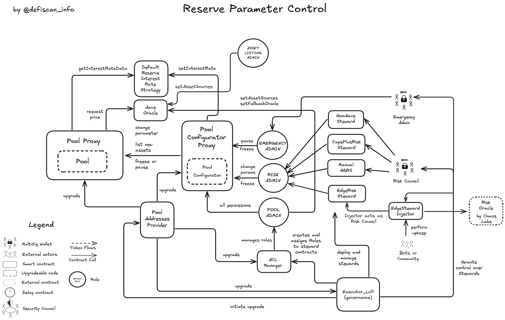

# Summary

Aave v3 EtherFi is a lending protocol which is governed by the Aave DAO with a specific focus on weETH. Users can lend and borrow this asset together with FRAX, USDC and PYUSD.

Aave v3 EtherFi uses the same contract code as Aave v3 Core instance overall, but redeployed modules _Lend & Borrow_ and _Reserve Parameters_, while re-using the same deployments for _Treasury, Aave Ecosystem Reserves & Rewards_, the _GHO Stablecoin_ and the _Aave Governance_.

We only report on the specific differences in this report, to understand the redeployed and re-used modules check out our Aave v3 Core instance [report](/protocols/aave).

Due to the minimal differences to Aave v3 Core the same scores apply for Aave v3 Prime.

# Ratings

## Chain

The report is concerned with the Aave V3 _EtherFi_ instance deployed on Ethereum mainnet. Ethereum mainnet achieves a _Low_ centralization risk score.

> Chain score: Low

## Upgradeability

The permissions and Upgradeability in the re-deployed contracts of the modules _Core Lend & Borrow_ and _Reserve Parameters_ are the same to the Aave v3 Core instance. The permission owners are the same multisig accounts as on the Aave v3 Core instance. As a consequence, the same _Upgradeability_ rating is assigned to the Aave v3 EtherFi report.

> Upgradeability score: High

## Autonomy

The Aave v3 EtherFi instance uses the same dependencies as the Aave v3 Core instance plus an additional dependency which is the Risk Oracle.

### Risk Oracle

Next to handing some control over market parameters to the [Risk Council](#security-council) via steward contracts, the Aave V3 _EtherFi_ instance on Mainnet updates the interest rate by handing off the control to a Risk Oracle implemented by Chaos Labs (service provider to the DAO). The Risk Oracle by Chaos Labs receives a _High centralization_ rating but the `EdgeRiskSteward` makes sure the updated parameters by the `RiskOracle` contract are within guardrails to prevent abusive behavior. In case of failure of the Risk Oracle, the [Risk Council](#security-council) can still update the interest rate parameters in due time, so the Risk Oracle setup is fault tolerant. No additional dependency risk is introduced by using the Risk Oracle provided by Chaos Labs.

> Autonomy score: High

## Exit Window

The Aave v3 _Prime_, _Core_ and _Etherfi_ instances use the same governance structure, thus the same exit window risks apply.

Read more in our Aave v3 Core instance [report](/protocols/aave).

> Exit Window score: High

## Accessibility

Aave V3 EtherFi is accessible through the same Aave UI and third party UIs than the Aave v3 Core instance.

Read more in our Aave v3 Core instance [report](/protocols/aave).

> Accessibility score: Low

## Conclusion

The Aave-v3 Ethereum mainnet protocol, and specifically the Aave v3 EtherFi instance achieves _High_ centralization risk scores for its _Upgradeability_, _Autonomy_ and _Exit Window_ dimensions. It thus ranks **Stage 0**.

The protocol could reach **Stage 1** by; 1) adopting the security council requirements for the [Emergency Admin](#security-council) multisig account and 2) implementing fallback mechanism around the Chainlink oracle (or Chainlink adopting a _Security Council_ setup for its own multisig account).

The project additionally could advance to **Stage 2** if all critical permissions were assigned to _Aave Governance_ and protected with a 30-day _Exit Window_.

# Protocol Analysis

## Upgradeable Pool Contract and mutable reserve parameters

Specifically to the Aave v3 EtherFi instance there is an additional Steward contract called `EdgeRiskSteward` which calls changes to the risk parameters. The new values for the parameters are pushed on-chain by the Risk Oracle by Chaos Labs.

## Dependencies

### Risk Oracle

Besides the [Risk Council](#security-council) having control over market parameters via steward contracts, the Aave V3 instance on the Aave v3 EtherFi instance automates the borrow and supply cap automatically by handing off the updates of this caps to a risk oracle implemented by Chaos Labs (service provider to the DAO). This allows automatic updates of these risk parameters based on quantitative algorithmic risk models in real time. `EdgeRiskSteward` makes sure the values submitted by the `RiskOracle` contract are within guardrails to prevent abusive behavior by malicious intent.

See our report on [Chaos Labs' Risk Oracle](/protocols/chaos-labs-risk-oracle)

# Governance

The The Aave v3 _Prime_, _Core_ and _Etherfi_ instances use the same governance structure, thus the same exit window risks apply.

Read more in our Aave v3 Core instance [report](/protocols/aave).

## Security Council

This table shows the external permission owners and how they are rated against the security council criteria.

| External Permission Owner | Address                                                                                                               | Type         | At least 7 signers | At least 51% threshold | Above 50% non-insiders signers | Signers publicly announced                                                                                                                  |
| ------------------------- | --------------------------------------------------------------------------------------------------------------------- | ------------ | ------------------ | ---------------------- | ------------------------------ | ------------------------------------------------------------------------------------------------------------------------------------------- |
| Executor_lvl              | [0x5300A1a15135EA4dc7aD5a167152C01EFc9b192A](https://etherscan.io/address/0x5300A1a15135EA4dc7aD5a167152C01EFc9b192A) | Contract     | n/a                | n/a                    | n/a                            | n/a                                                                                                                                         |
| EmergencyAdmin            | [0x2cfe3ec4d5a6811f4b8067f0de7e47dfa938aa30](https://etherscan.io/address/0x2cfe3ec4d5a6811f4b8067f0de7e47dfa938aa30) | Multisig 5/9 | ✅                 | ✅                     | ❌                             | ✅ ([source](https://aave.com/docs/primitives/governance))                                                                                  |
| Risk Council              | [0x47c71dFEB55Ebaa431Ae3fbF99Ea50e0D3d30fA8](https://etherscan.io/address/0x47c71dFEB55Ebaa431Ae3fbF99Ea50e0D3d30fA8) | Multisig 2/2 | ❌                 | ✅                     | ❌                             | ✅ ([source](https://governance.aave.com/t/arfc-aave-generalized-risk-stewards-agrs-activation/19178))                                      |
| ACI Automation (Bot)      | [0x3Cbded22F878aFC8d39dCD744d3Fe62086B76193](https://etherscan.io/address/0x3Cbded22F878aFC8d39dCD744d3Fe62086B76193) | EOA          | ❌                 | ❌                     | ❌                             | ❌                                                                                                                                          |
| CleanUp Admin             | [0xdeadD8aB03075b7FBA81864202a2f59EE25B312b](https://etherscan.io/address/0xdeadD8aB03075b7FBA81864202a2f59EE25B312b) | Multisig 2/3 | ❌                 | ✅                     | ❌                             | ✅ ([source](https://vote.onaave.com/proposal/?proposalId=270&ipfsHash=0x4043001b72316afa6b6728772941bfa08f127b66c1c006316a3f20510b6738ab)) |
| Injector Owner (BGD Labs) | [0xff37939808EcF199A2D599ef91D699Fb13dab7F7](https://etherscan.io/address/0xff37939808EcF199A2D599ef91D699Fb13dab7F7) | Multisig 1/2 | ❌                 | ❌                     | ❌                             | ✅                                                                                                                                          |

💡 The BGD Labs maintains a public markdown page on the existing permissions to inform its users: https://github.com/bgd-labs/aave-permissions-book/blob/main/out/MAINNET-ETHERFI.md

## Multisigs and their permission

This table summarizes the permission owner multisig accounts and the stewards which enforce guardrails on the action by the multisig accounts.

| Role                              | Risk Parameter                              | Controlled by                    | Guardrails enforced by                         | Contract                  |
| --------------------------------- | ------------------------------------------- | -------------------------------- | ---------------------------------------------- | ------------------------- |
| `EMERGENCY_ADMIN` or `POOL_ADMIN` | setReservePause                             | Emergency Admin                  |                                                | PoolConfigurator          |
| `EMERGENCY_ADMIN` or `POOL_ADMIN` | setPoolPause                                | Emergency Admin                  |                                                | PoolConfigurator          |
| `EMERGENCY_ADMIN` or `POOL_ADMIN` | disableLiquidationGracePeriod               | Emergency Admin                  |                                                | PoolConfigurator          |
| `RISK_ADMIN` or `POOL_ADMIN`      | configureReserveAsCollateral                | Risk Council (for Pool Stewards) | Manual AGRS (RiskSteward)                      | PoolConfigurator          |
| `RISK_ADMIN` or `POOL_ADMIN`      | setBorrowCap                                | Risk Council (for Pool Stewards) | CapsPlusRiskSteward, Manual AGRS (RiskSteward) | PoolConfigurator          |
| `RISK_ADMIN` or `POOL_ADMIN`      | setReserveFreeze                            | Emergency Admin                  |                                                | PoolConfigurator          |
| `RISK_ADMIN` or `POOL_ADMIN`      | setReserveInterestRateData                  | Risk Council (for Pool Stewards) | Manual AGRS (RiskSteward)                      | PoolConfigurator          |
| `RISK_ADMIN` or `POOL_ADMIN`      | setReserveInterestRateData (limited assets) | RiskOracle                       | EdgeRiskSteward                                | PoolConfigurator          |
| `RISK_ADMIN` or `POOL_ADMIN`      | setSupplyCap                                | Risk Council (for Pool Stewards) | CapsPlusRiskSteward, Manual AGRS (RiskSteward) | PoolConfigurator          |
| `RISK_ADMIN` or `POOL_ADMIN`      | updateStablePriceCaps                       | Risk Council (for Pool Stewards) | Manual AGRS (RiskSteward)                      | Oracle Pricefeed wrappers |
| `RISK_ADMIN` or `POOL_ADMIN`      | updateLstPriceCaps                          | Risk Council (for Pool Stewards) | Manual AGRS (RiskSteward)                      | Oracle Pricefeed wrappers |

# Contracts and Permissions

## Contracts

| Contract Name                                       | Address                                                                                                               |
| --------------------------------------------------- | --------------------------------------------------------------------------------------------------------------------- |
| Pool (Proxy)                                        | [0x56401d666f486c495566A29249447C2BB8C56bB2](https://etherscan.io/address/0x56401d666f486c495566A29249447C2BB8C56bB2) |
| Pool (Implementation)                               | [0xc405a0eab071a085a832f876d8e5be7cfeafb624](https://etherscan.io/address/0xc405a0eab071a085a832f876d8e5be7cfeafb624) |
| aToken (weETH) (Proxy)                              | [0xbe1F842e7e0afd2c2322aae5d34bA899544b29db](https://etherscan.io/address/0xbe1F842e7e0afd2c2322aae5d34bA899544b29db) |
| aToken (weETH) (Implementation)                     | [0xaffa06528bd92625de2e7a0cfa0119319265ea4b](https://etherscan.io/address/0xaffa06528bd92625de2e7a0cfa0119319265ea4b) |
| variableDebtToken (weETH) (Proxy)                   | [0x16264412CB72F0d16A446f7D928Dd0D822810048](https://etherscan.io/address/0x16264412CB72F0d16A446f7D928Dd0D822810048) |
| variableDebtToken (weETH) (Implementation)          | [0xbb077daffeb23b2126e7358b0b122ba6838fb881](https://etherscan.io/address/0xbb077daffeb23b2126e7358b0b122ba6838fb881) |
| WeETHPriceCapAdapter                                | [0xf112aF6F0A332B815fbEf3Ff932c057E570b62d3](https://etherscan.io/address/0xf112aF6F0A332B815fbEf3Ff932c057E570b62d3) |
| DefaultReserveInterestRateStrategy                  | [0x9ec6F08190DeA04A54f8Afc53Db96134e5E3FdFB](https://etherscan.io/address/0x9ec6F08190DeA04A54f8Afc53Db96134e5E3FdFB) |
| wstETHReserveInterestRateStrategy                   | [0x8958b1C39269167527821f8c276Ef7504883f2fa](https://etherscan.io/address/0x8958b1C39269167527821f8c276Ef7504883f2fa) |
| GhoDirectMinter                                     | [0x2cE01c87Fec1b71A9041c52CaED46Fc5f4807285](https://etherscan.io/address/0x2cE01c87Fec1b71A9041c52CaED46Fc5f4807285) |
| WrappedTokenGatewayV3                               | [0xf956B38F035dC9067fb827A512D3CF35202AB0Bc](https://etherscan.io/address/0xf956B38F035dC9067fb827A512D3CF35202AB0Bc) |
| PoolAddressesProvider                               | [0xeBa440B438Ad808101d1c451C1C5322c90BEFCdA](https://etherscan.io/address/0xeBa440B438Ad808101d1c451C1C5322c90BEFCdA) |
| PoolConfigurator (Proxy)                            | [0x8438F4D29D895d75C86BDC25360c25eF0607E65d](https://etherscan.io/address/0x8438F4D29D895d75C86BDC25360c25eF0607E65d) |
| PoolConfigurator (Implementation)                   | [0xe5e48ad1f9d1a894188b483dcf91f4fad6aba43b](https://etherscan.io/address/0xe5e48ad1f9d1a894188b483dcf91f4fad6aba43b) |
| UiPoolDataProvider                                  | [0x3F78BBD206e4D3c504Eb854232EdA7e47E9Fd8FC](https://etherscan.io/address/0x3F78BBD206e4D3c504Eb854232EdA7e47E9Fd8FC) |
| UiIncentiveDataProvider                             | [0xe3dFf4052F0bF6134ACb73bEaE8fe2317d71F047](https://etherscan.io/address/0xe3dFf4052F0bF6134ACb73bEaE8fe2317d71F047) |
| UiGHODataProvider                                   | [0x379c1EDD1A41218bdbFf960a9d5AD2818Bf61aE8](https://etherscan.io/address/0x379c1EDD1A41218bdbFf960a9d5AD2818Bf61aE8) |
| AaveProtocolDataProvider                            | [0xECdA3F25B73261d1FdFa1E158967660AA29f00cC](https://etherscan.io/address/0xECdA3F25B73261d1FdFa1E158967660AA29f00cC) |
| ACLManager                                          | [0x3cE8E2eb6501d4705477643E96881B1bef6A2DB3](https://etherscan.io/address/0x3cE8E2eb6501d4705477643E96881B1bef6A2DB3) |
| WalletBalanceProvider                               | [0xC7be5307ba715ce89b152f3Df0658295b3dbA8E2](https://etherscan.io/address/0xC7be5307ba715ce89b152f3Df0658295b3dbA8E2) |
| TreasuryCollector (Proxy)                           | [0x464C71f6c2F760DdA6093dCB91C24c39e5d6e18c](https://etherscan.io/address/0x464C71f6c2F760DdA6093dCB91C24c39e5d6e18c) |
| TreasuryCollector (Implementation)                  | [0x83b7ce402a0e756e901c4a9d1cafa27ca9572afc](https://etherscan.io/address/0x83b7ce402a0e756e901c4a9d1cafa27ca9572afc) |
| AaveEcosystemReserve (Proxy)                        | [0x25F2226B597E8F9514B3F68F00f494cF4f286491](https://etherscan.io/address/0x25F2226B597E8F9514B3F68F00f494cF4f286491) |
| AaveEcosystemReserve (Implementation)               | [0x10c74b37ad4541e394c607d78062e6d22d9ad632](https://etherscan.io/address/0x10c74b37ad4541e394c607d78062e6d22d9ad632) |
| AaveEcosystemReserveController                      | [0x3d569673dAa0575c936c7c67c4E6AedA69CC630C](https://etherscan.io/address/0x3d569673dAa0575c936c7c67c4E6AedA69CC630C) |
| RewardsController (Proxy)                           | [0x8164Cc65827dcFe994AB23944CBC90e0aa80bFcb](https://etherscan.io/address/0x8164Cc65827dcFe994AB23944CBC90e0aa80bFcb) |
| RewardsController (Implementation)                  | [0xe7b67f44ea304dd7f6d215b13686637ff64cd2b2](https://etherscan.io/address/0xe7b67f44ea304dd7f6d215b13686637ff64cd2b2) |
| EmissionManager                                     | [0x223d844fc4B006D67c0cDbd39371A9F73f69d974](https://etherscan.io/address/0x223d844fc4B006D67c0cDbd39371A9F73f69d974) |
| StataTokenFactory (Proxy)                           | [0x347C75d19718a05148687E13dca259aD016aB411](https://etherscan.io/address/0x347C75d19718a05148687E13dca259aD016aB411) |
| StataTokenFactory (Implementation)                  | [0x8d8410c91d3bbe5957e46c2ff2f6e2ce8c99f00d](https://etherscan.io/address/0x8d8410c91d3bbe5957e46c2ff2f6e2ce8c99f00d) |
| PoolAddressesProviderRegistry                       | [0xbaA999AC55EAce41CcAE355c77809e68Bb345170](https://etherscan.io/address/0xbaA999AC55EAce41CcAE355c77809e68Bb345170) |
| AaveOracle                                          | [0x43b64f28A678944E0655404B0B98E443851cC34F](https://etherscan.io/address/0x43b64f28A678944E0655404B0B98E443851cC34F) |
| SvrOracleSteward                                    | [0x8b493f416F5F7933cC146b1899c069F2361cad60](https://etherscan.io/address/0x8b493f416F5F7933cC146b1899c069F2361cad60) |
| RepayWithCollateral / ParaSwapRepayAdapter          | [0x23b282c49C88d9161aae14b5eD777B976A5Ae65D](https://etherscan.io/address/0x23b282c49C88d9161aae14b5eD777B976A5Ae65D) |
| CollateralSwitch / ParaSwapLiquiditySwapAdapter     | [0xB04427eFdd15b0EC233400d2F7f7E4fd0291C285](https://etherscan.io/address/0xB04427eFdd15b0EC233400d2F7f7E4fd0291C285) |
| DebtSwitch / ParaSwapDebtSwapAdapterV3GHO           | [0x40ede12b44d98Fc4E53A2fB027D1BD1846e1690C](https://etherscan.io/address/0x40ede12b44d98Fc4E53A2fB027D1BD1846e1690C) |
| WithdrawSwitchAdapter / ParaSwapWithdrawSwapAdapter | [0x850347E0cF64fd342A3404c1c5DA21Aa0A46c5c6](https://etherscan.io/address/0x850347E0cF64fd342A3404c1c5DA21Aa0A46c5c6) |
| ACLAdmin / Executor_lvl1                            | [0x5300A1a15135EA4dc7aD5a167152C01EFc9b192A](https://etherscan.io/address/0x5300A1a15135EA4dc7aD5a167152C01EFc9b192A) |
| ConfigEngine                                        | [0x1097eDb85392932b7dCB630baDDC8A6D73585218](https://etherscan.io/address/0x1097eDb85392932b7dCB630baDDC8A6D73585218) |
| EdgeRiskSteward                                     | [0x81aFd0F99c2Afa2f2DD7E387c2Ef9CD2a29b6E1A](https://etherscan.io/address/0x81aFd0F99c2Afa2f2DD7E387c2Ef9CD2a29b6E1A) |
| AaveStewardInjector                                 | [0x834a5aC6e9D05b92F599A031941262F761c34859](https://etherscan.io/address/0x834a5aC6e9D05b92F599A031941262F761c34859) |
| RiskOracle                                          | [0x7ABB46C690C52E919687D19ebF89C81A6136C1F2](https://etherscan.io/address/0x7ABB46C690C52E919687D19ebF89C81A6136C1F2) |
| CapsPlusRiskSteward                                 | [0x3843b29118fFC18d5d12EE079d0324E1bF115e69](https://etherscan.io/address/0x3843b29118fFC18d5d12EE079d0324E1bF115e69) |
| Manual AGRS (RiskSteward)                           | [0x30adC2f98ff78fDde12F191Acb82699f640694FB](https://etherscan.io/address/0x30adC2f98ff78fDde12F191Acb82699f640694FB) |
| ProxyAdmin                                          | [0xD3cF979e676265e4f6379749DECe4708B9A22476](https://etherscan.io/address/0xD3cF979e676265e4f6379749DECe4708B9A22476) |

## All Permission owners

| Name                               | Account                                                                                                               | Type         |
| ---------------------------------- | --------------------------------------------------------------------------------------------------------------------- | ------------ |
| Executor_lvl1                      | [0x5300A1a15135EA4dc7aD5a167152C01EFc9b192A](https://etherscan.io/address/0x5300A1a15135EA4dc7aD5a167152C01EFc9b192A) | Contract     |
| PoolAddressesProvider              | [0xeBa440B438Ad808101d1c451C1C5322c90BEFCdA](https://etherscan.io/address/0xeBa440B438Ad808101d1c451C1C5322c90BEFCdA) | Contract     |
| PoolConfigurator                   | [0x8438F4D29D895d75C86BDC25360c25eF0607E65d](https://etherscan.io/address/0x8438F4D29D895d75C86BDC25360c25eF0607E65d) | Contract     |
| ProxyAdmin                         | [0xD3cF979e676265e4f6379749DECe4708B9A22476](https://etherscan.io/address/0xD3cF979e676265e4f6379749DECe4708B9A22476) | Contract     |
| EmergencyAdmin                     | [0x2cfe3ec4d5a6811f4b8067f0de7e47dfa938aa30](https://etherscan.io/address/0x2cfe3ec4d5a6811f4b8067f0de7e47dfa938aa30) | Multisig 5/9 |
| Risk Council (for Pool Stewards)   | [0x47c71dFEB55Ebaa431Ae3fbF99Ea50e0D3d30fA8](https://etherscan.io/address/0x47c71dFEB55Ebaa431Ae3fbF99Ea50e0D3d30fA8) | Multisig 2/2 |
| Injector Owner (BGD Labs multisig) | [0xff37939808EcF199A2D599ef91D699Fb13dab7F7](https://etherscan.io/address/0xff37939808EcF199A2D599ef91D699Fb13dab7F7) | Multisig 1/2 |
| Chaos Labs Multi-sig?              | [0x2400ad77C8aCCb958b824185897db9B9DD771830](https://etherscan.io/address/0x2400ad77C8aCCb958b824185897db9B9DD771830) | Multisig ?/? |
| Chaos Labs Bot                     | [0x42939e82DF15afc586bb95f7dD69Afb6Dc24A6f9](https://etherscan.io/address/0x42939e82DF15afc586bb95f7dD69Afb6Dc24A6f9) | EOA          |

## Permissions

| Contract                                                          | Function                               | Impact                                                                                                                                                                                                                                                                                                                                                                                                                                                                                                                                                                                                                                                                                                                                                                                                                                                                               | Owner                                                                                                                                                                        |
| ----------------------------------------------------------------- | -------------------------------------- | ------------------------------------------------------------------------------------------------------------------------------------------------------------------------------------------------------------------------------------------------------------------------------------------------------------------------------------------------------------------------------------------------------------------------------------------------------------------------------------------------------------------------------------------------------------------------------------------------------------------------------------------------------------------------------------------------------------------------------------------------------------------------------------------------------------------------------------------------------------------------------------ | ---------------------------------------------------------------------------------------------------------------------------------------------------------------------------- | --- |
| Pool (Proxy) (BaseImmutableAdminUpgradeabilityProxy)              | admin                                  | Permissioned getter of the owner address (only the owner can retrieve it on-chain). The owner address is stored in the bytecode (keyword immutable) and is thus immutable.                                                                                                                                                                                                                                                                                                                                                                                                                                                                                                                                                                                                                                                                                                           | PoolAddressesProvider                                                                                                                                                        |
| Pool (Proxy) (BaseImmutableAdminUpgradeabilityProxy)              | implementation                         | Permissioned getter of the implementation address.                                                                                                                                                                                                                                                                                                                                                                                                                                                                                                                                                                                                                                                                                                                                                                                                                                   | PoolAddressesProvider                                                                                                                                                        |
| Pool (Proxy) (BaseImmutableAdminUpgradeabilityProxy)              | upgradeTo                              | This function allows the permission owner to set a new implementation contract to forward calls to. This can change the whole pool implementation logic and thus can affect deposits, collateral and unclaimed yield. The function on `PoolAddressesProvider` that can call this function is `setAddress` and this function is governed by the Aave Governance. Thus this change needs to pass governance vote, but as all governance votes it can be vetoed by the Aave Governance V3 Guardian to protect against malicious governance proposals that have passed.                                                                                                                                                                                                                                                                                                                  | PoolAddressesProvider                                                                                                                                                        |
| Pool (Proxy) (BaseImmutableAdminUpgradeabilityProxy)              | upgradeToAndCall                       | Same as `upgradeTo` (previous row) but allows to atomically call also a function on the new implementation contract in one transaction.                                                                                                                                                                                                                                                                                                                                                                                                                                                                                                                                                                                                                                                                                                                                              | PoolAddressesProvider                                                                                                                                                        |
| Pool (Implementation)                                             | initReserve                            | Initializes a reserve, activating it, assigning an aToken and debt tokens and an interest rate strategy. This function is permissioned and only the `PoolConfigurator` can execute it. This function is called if support for a new asset is desired. Users can supply this asset, receive the aToken or if they want to borrow they receive the debt token, while the interest rate strategy is applied for users positions.                                                                                                                                                                                                                                                                                                                                                                                                                                                        | PoolConfigurator (Proxy)                                                                                                                                                     |
| Pool (Implementation)                                             | dropReserve                            | The `dropReserve` function in Aave V3 serves as a mechanism to permanently remove a reserve from the pool's active reserves. This action is more comprehensive than freezing or pausing, as it completely deactivates the reserve, preventing any further user interactions with the asset within the pool. Dropping the reserve requires that the aToken and the DebtToken supplies are 0.                                                                                                                                                                                                                                                                                                                                                                                                                                                                                          | PoolConfigurator (Proxy)                                                                                                                                                     |
| Pool (Implementation)                                             | setReserveInterestRateStrategyAddress  | Sets the interest rate strategy of a reserve. It achieves this by pointing to a new smart contract that implements the interest rate strategy. The PoolConfigurator is the only permissioned account to call this function. The change to this new interest rate strategy most likely results in different future yield. Past unclaimed yield is not affected.                                                                                                                                                                                                                                                                                                                                                                                                                                                                                                                       | PoolConfigurator (Proxy)                                                                                                                                                     |
| Pool (Implementation)                                             | syncIndexesState                       | Accumulates interest to all indexes of the reserve. To be used when required by the configurator, for example when updating interest rates strategy data.                                                                                                                                                                                                                                                                                                                                                                                                                                                                                                                                                                                                                                                                                                                            | PoolConfigurator (Proxy)                                                                                                                                                     |
| Pool (Implementation)                                             | syncRatesState                         | When the protocol's governance decides to modify the interest rate strategy for a reserve, it's crucial to synchronize the reserve's indexes with the new strategy to maintain accurate interest calculations. `syncRatesState` achieves that. The `PoolConfigurator` contract facilitates this process. For instance, in the `setReserveInterestRateStrategyAddress` function within the `PoolConfigurator`, the `syncIndexesState` function is called to update the reserve's state before applying the new interest rate strategy.                                                                                                                                                                                                                                                                                                                                                | PoolConfigurator (Proxy)                                                                                                                                                     |
| Pool (Implementation)                                             | updateBridgeProtocolFee                | Updates the protocol fee on the bridging. The fee is sent to the protocol treasury. The fee is raised when calling `backUnbacked` on the `Pool` contract.                                                                                                                                                                                                                                                                                                                                                                                                                                                                                                                                                                                                                                                                                                                            | PoolConfigurator (Proxy)                                                                                                                                                     |
| Pool (Implementation)                                             | setConfiguration                       | Allows to update all configurations of a reserve at once without any guardrails.                                                                                                                                                                                                                                                                                                                                                                                                                                                                                                                                                                                                                                                                                                                                                                                                     | PoolConfigurator (Proxy)                                                                                                                                                     |
| Pool (Implementation)                                             | updateFlashloanPremiums                | Increasing flashLoanPremiumTotal: Raises the overall cost of flash loans, potentially reducing their usage but increasing earnings for both liquidity providers and the protocol. Adjusting flashLoanPremiumToProtocol: Alters the revenue split between liquidity providers and the protocol. A higher value directs more fees to the protocol treasury, while a lower value benefits liquidity providers. There are no limits enforced on the smart contract level.                                                                                                                                                                                                                                                                                                                                                                                                                | PoolConfigurator (Proxy)                                                                                                                                                     |
| Pool (Implementation)                                             | configureEModeCategory                 | Configures a new or alters an existing collateral configuration of an eMode. Users can opt-in using eMode to profit from better LTV settings for correlated assets. This function sets LTV, liquidationThreshold and liquidationBonus. There are no boundaries enforced on the settings of an eMode in the Pool contract, but on the PoolConfigurator, which is the only contract permissioned to call this function, has relative boundaries.                                                                                                                                                                                                                                                                                                                                                                                                                                       | PoolConfigurator (Proxy)                                                                                                                                                     |
| Pool (Implementation)                                             | configureEModeCategoryCollateralBitmap | While `configureEModeCategory` specifies the LTV, liquidationThreshold and liquidationBonus, `configureEModeCategoryBorrowableBitmap` specifies which assets belong to a certain EMode (ie. which assets are closely correlated) and can serve as collateral in this EMode.                                                                                                                                                                                                                                                                                                                                                                                                                                                                                                                                                                                                          | PoolConfigurator (Proxy)                                                                                                                                                     |
| Pool (Implementation)                                             | configureEModeCategoryBorrowableBitmap | Specifies which assets belong to a certain EMode (ie. which assets are closely correlated) and can be borrowed in this EMode.                                                                                                                                                                                                                                                                                                                                                                                                                                                                                                                                                                                                                                                                                                                                                        | PoolConfigurator (Proxy)                                                                                                                                                     |
| Pool (Implementation)                                             | resetIsolationModeTotalDebt            | Resets the isolation mode total debt of the given asset to zero. It requires the given asset has zero debt ceiling. Which is done by `setDebtCeiling` inside `PoolConfigurator`, first it sets debt ceiling to 0 and then sets total debt to 0. This action is indicating that no new borrowing against this asset is allowed.                                                                                                                                                                                                                                                                                                                                                                                                                                                                                                                                                       | PoolConfigurator (Proxy)                                                                                                                                                     |
| Pool (Implementation)                                             | setLiquidationGracePeriod              | Sets the liquidation grace period of the given asset (applied for all positions). This halts liquidations for a specific asset until a certain timestamp. `PoolConfigurator` only calls this function when pausing a reserve or when disabling the Liquidation Grace Period e.g after discontinuing the pause.                                                                                                                                                                                                                                                                                                                                                                                                                                                                                                                                                                       | PoolConfigurator (Proxy)                                                                                                                                                     |
| Pool (Implementation)                                             | rescueTokens                           | Rescue and transfer tokens locked in this contract. This function can transfer ERC20 tokens from this contract on demand. Useful when users send tokens to this contract by mistake. This function can be called by the `POOL_ADMIN` any time.                                                                                                                                                                                                                                                                                                                                                                                                                                                                                                                                                                                                                                       | `POOL_ADMIN`                                                                                                                                                                 |
| Pool (Implementation)                                             | mintUnbacked                           | `mintUnbacked` function is a specialized mechanism that allows authorized bridge contracts to mint aTokens without immediately supplying the corresponding underlying assets. This function is integral to Aave's cross-chain liquidity feature known as "Portals", which facilitates seamless asset transfers across different blockchain networks for users. Users can have the funds on the destination chain with the transanction mined. Upon arrival of the underlying assets on the target network by the bridge, the bridge contract invokes the `backUnbacked` function and pays a fee to Aave V3 Portal system. This function supplies the underlying assets to the Aave protocol, thereby backing the previously minted aTokens and ensuring the system's solvency.                                                                                                       | no permission holder (ie un-used for bridging from L2 to Mainnet)                                                                                                            |
| Pool (Implementation)                                             | backUnbacked                           | See `mintUnbacked`                                                                                                                                                                                                                                                                                                                                                                                                                                                                                                                                                                                                                                                                                                                                                                                                                                                                   | no permission holder (ie un-used)                                                                                                                                            |
| Pool (Implementation)                                             | eliminateReserveDeficit                | Allows the Umbrella system to cover bad debt by burning aTokens or GHO.                                                                                                                                                                                                                                                                                                                                                                                                                                                                                                                                                                                                                                                                                                                                                                                                              | listed Umbrella in the PoolAddressesProvider (currently none)                                                                                                                |
| DefaultReserveInterestRateStrategyV2                              | setInterestRateParams                  | Sets the interest rate parameters for a certain reserve. The supplied parameters to the function are checked against constant boundaries (MIN_OPTIMAL_POINT, MAX_OPTIMAL_POINT, slope2 > slope1, MAX_BORROW_RATE). Past unclaimed yield is not affected. Future yield is suspect to change.                                                                                                                                                                                                                                                                                                                                                                                                                                                                                                                                                                                          | PoolConfigurator (Proxy)                                                                                                                                                     |
| aToken (Proxy)                                                    | upgradeTo                              | This function allows to update the aToken's implementation and change its logic. The governance holds the permission via the `PoolConfigurator` contract. This function needs to be protected as it can lead to loss of funds if used maliciously.                                                                                                                                                                                                                                                                                                                                                                                                                                                                                                                                                                                                                                   | PoolConfigurator (Proxy)                                                                                                                                                     |
| aToken (Proxy)                                                    | upgradeToAndCall                       | Similar to `upgradeTo` but it allows to call a function after the upgrade which is often used to initialise the new implementation contract.                                                                                                                                                                                                                                                                                                                                                                                                                                                                                                                                                                                                                                                                                                                                         | PoolConfigurator (Proxy)                                                                                                                                                     |
| aToken (Implementation)                                           | setIncentivesController                | All operations that change balance through user actions cause, if specified, a hook call to the `IncentivesController`. If the `IncentivesController` is removed by this function (setting to 0 address) or a new contract is appointed as `IncentivesController` during an on-going incentive campaign, then incentives rewards that could not been accumulated by user actions are lost. No effect if no incentive campaign is active for this asset.                                                                                                                                                                                                                                                                                                                                                                                                                              | `POOL_ADMIN`                                                                                                                                                                 |
| aToken (Implementation)                                           | rescueTokens                           | This function allows to rescue tokens that were sent to this contract by mistake. The implementation prevents to "rescue" the underlying asset.                                                                                                                                                                                                                                                                                                                                                                                                                                                                                                                                                                                                                                                                                                                                      | `POOL_ADMIN`                                                                                                                                                                 |
| aToken (Implementation)                                           | mint                                   | aTokens are minted when user deposits funds into an Aave reserve. User interacts with the `Pool` and thus is the `Pool` the only contract that is allowed to call this function and mint value accruing receipt tokens to the user. User funds also are held in the aToken contract. If this contract is updated maliciously it will lead to loss of funds.                                                                                                                                                                                                                                                                                                                                                                                                                                                                                                                          | Pool (Proxy)                                                                                                                                                                 |
| aToken (Implementation)                                           | burn                                   | When a user returns the aTokens, they are burned and the user receives back the underlying asset that was deposited. Only the `Pool` contract is allowed to facilitate this movement of assets.                                                                                                                                                                                                                                                                                                                                                                                                                                                                                                                                                                                                                                                                                      | Pool (Proxy)                                                                                                                                                                 |
| aToken (Implementation)                                           | mintToTreasury                         | This function is called via the same named function on the `Pool` contract `mintToTreasury`. The function on the `Pool` contract is permissionless. It allows the treasury to collect income on the reserve activity based on the accrued amount for the treasury. This function creates income for the Treasury via minting new aTokens.                                                                                                                                                                                                                                                                                                                                                                                                                                                                                                                                            | Pool (Proxy)                                                                                                                                                                 |
| aToken (Implementation)                                           | transferOnLiquidation                  | Transfers aTokens in the event of a borrow being liquidated from the borrower to the liquidator if the liquidators reclaims the aTokens. Only the `Pool` contract is allowed to make this call.                                                                                                                                                                                                                                                                                                                                                                                                                                                                                                                                                                                                                                                                                      | Pool (Proxy)                                                                                                                                                                 |
| aToken (Implementation)                                           | transferUnderlyingTo                   | Transfers the underlying asset to the specified address. This is used when the underlying asset is transferred based on a borrow, withdraw or flashloan operation.                                                                                                                                                                                                                                                                                                                                                                                                                                                                                                                                                                                                                                                                                                                   | Pool (Proxy)                                                                                                                                                                 |
| aToken (Implementation)                                           | handleRepayment                        | Currently not implemented since for ERC20 no further action is required after the transfer. However, future aTokens may introduce functionalities such as staking the underlying asset to earn LM rewards. In such cases, `handleRepayment()` would handle the staking process.                                                                                                                                                                                                                                                                                                                                                                                                                                                                                                                                                                                                      | Pool (Proxy)                                                                                                                                                                 |
| variableDebtToken (Proxy)                                         | upgradeTo                              | This function allows to update the variableDebtTokens's implementation and change its logic. The governance holds the permission via the `PoolConfigurator` contract.                                                                                                                                                                                                                                                                                                                                                                                                                                                                                                                                                                                                                                                                                                                | PoolConfigurator (Proxy)                                                                                                                                                     |
| variableDebtToken (Proxy)                                         | upgradeToAndCall                       | Similar to `upgradeTo` but it allows to call a function after the upgrade which is often used to initialise the new implementation contract.                                                                                                                                                                                                                                                                                                                                                                                                                                                                                                                                                                                                                                                                                                                                         | PoolConfigurator (Proxy)                                                                                                                                                     |
| variableDebtToken (Implementation)                                | setIncentivesController                | All operations that change balance through user actions cause, if specified, a hook call to the `IncentivesController`. If the `IncentivesController` is removed by this function (setting to 0 address) or a new contract is appointed as `IncentivesController` during an on-going incentive campaign, then incentives rewards that could not been accumulated by user actions are lost. No effect if no incentive campaign is active for this asset.                                                                                                                                                                                                                                                                                                                                                                                                                              | `POOL_ADMIN`                                                                                                                                                                 |
| variableDebtToken (Implementation)                                | mint                                   | Variable debt tokens are issued for borrowers as a receipt for the borrowed assets. Only the `Pool` contract is permissioned to call this function based on positions that are opened via the `Pool` contract.                                                                                                                                                                                                                                                                                                                                                                                                                                                                                                                                                                                                                                                                       | Pool (Proxy)                                                                                                                                                                 |
| variableDebtToken (Implementation)                                | burn                                   | The variable debt tokens are burned when the borrower repays the debt.                                                                                                                                                                                                                                                                                                                                                                                                                                                                                                                                                                                                                                                                                                                                                                                                               | Pool (Proxy)                                                                                                                                                                 |
| GHOFlashMinter                                                    | updateFee                              | Updates the percentage fee for flashloans. The percentage of the flash-minted amount that needs to be repaid. The fee is expressed in bps. A value of 100, results in 1%. The max fee that is constraint to 100% (10000).                                                                                                                                                                                                                                                                                                                                                                                                                                                                                                                                                                                                                                                            | `POOL_ADMIN`                                                                                                                                                                 |
| GHOFlashMinter                                                    | updateGhoTreasury                      | Updates the address of the Gho Treasury. The GhoTreasury is where flashloan revenue fees are sent to (via calling `distributeFeesToTreasury` on the same contract). The current destination (Treasury) is the `TreasuryCollector` contract. The right to change the beneficiary lies solely with the Governance (owning `POOL_ADMIN` role)                                                                                                                                                                                                                                                                                                                                                                                                                                                                                                                                           | `POOL_ADMIN`                                                                                                                                                                 |
| WrappedTokenGatewayV3                                             | renounceOwnership                      | Calling this function results in the contract not having any permissioned function calls allowed.                                                                                                                                                                                                                                                                                                                                                                                                                                                                                                                                                                                                                                                                                                                                                                                    | Executor_lvl1                                                                                                                                                                |
| WrappedTokenGatewayV3                                             | transferOwnership                      | Transfers the permission to call all functions with the `onlyOwner` modifier. The owner is currently the Governance executor.                                                                                                                                                                                                                                                                                                                                                                                                                                                                                                                                                                                                                                                                                                                                                        | Executor_lvl1                                                                                                                                                                |
| WrappedTokenGatewayV3                                             | emergencyTokenTransfer                 | Transfers ERC20 from the contract to a specified target address. This serves to recover ERC20 tokens that are stuck due to direct transfers to the contract address.                                                                                                                                                                                                                                                                                                                                                                                                                                                                                                                                                                                                                                                                                                                 | Executor_lvl1                                                                                                                                                                |
| WrappedTokenGatewayV3                                             | emergencyEtherTransfer                 | For native Ether recovery in case of stuck Ether due to selfdestructs or ether transfers to the pre-computed contract address before deployment.                                                                                                                                                                                                                                                                                                                                                                                                                                                                                                                                                                                                                                                                                                                                     | Executor_lvl1                                                                                                                                                                |
| PoolAddressesProvider                                             | renounceOwnership                      | Calling this function results in the contract not having any permissioned function calls being allowed. `PoolAddressesProvider` contract oversees all addresses of a Aave market deployment. Ownership over this contract is crucial. It's directly governed by the Aave Governance executor contract. Renouncing ownership would result in the loss of ownership over the `Pool` and the `PoolConfigurator` contract.                                                                                                                                                                                                                                                                                                                                                                                                                                                               | Executor_lvl1                                                                                                                                                                |
| PoolAddressesProvider                                             | transferOwnership                      | Transfers the permission to call all functions with the `onlyOwner` modifier. Transferring ownership over this contract to a malicious actor results in loss of funds, as the owner over `PoolAddressesProvider` can fully upgrade the `Pool` contract.                                                                                                                                                                                                                                                                                                                                                                                                                                                                                                                                                                                                                              | Executor_lvl1                                                                                                                                                                |
| PoolAddressesProvider                                             | setMarketId                            | Associates a market id with this `PoolAddressesProvider`. This can be used to create an onchain registry of PoolAddressesProviders to identify and validate multiple Aave markets. Like it is done by `PoolAddressesProviderRegistry` which keeps track of different `PoolAddressesProvider`. Currently on Ethereum Mainnet there are three markets main market, lido market and etherfi market. They all got their own `PoolAddressesProvider` instance, and also their own `Pool`, `PoolConfigurator` and `ACLManager` and a bunch of other contracts.                                                                                                                                                                                                                                                                                                                             | Executor_lvl1                                                                                                                                                                |
| PoolAddressesProvider                                             | setAddress                             | Sets a new address in the `PoolAddressesProvider` for one of the following contracts `Pool`, `PoolConfigurator`, `PriceOracle`, `ACLManager`, `Executor` and `PriceOracleSentinel`. `PoolAddressesProvider` is the main registry of addresses part of or connected to the a specific market. Permission over this function is crucial as it allows to set relationships between contracts. Setting a new `PoolConfigurator` or `ACLManager` would allow an attacker to change Reserve Parameters at will which would result in the loss of funds.                                                                                                                                                                                                                                                                                                                                    | Executor_lvl1                                                                                                                                                                |
| PoolAddressesProvider                                             | setAddressAsProxy                      | Similar to setAddress but this function sets address as an implementation address of the registered proxy and initialises it. This allows to upgrade the proxy contracts, for example `Pool` or `PoolConfigurator`.                                                                                                                                                                                                                                                                                                                                                                                                                                                                                                                                                                                                                                                                  | Executor_lvl1                                                                                                                                                                |
| PoolAddressesProvider                                             | setPoolImpl                            | Same effect like `setAddressAsProxy`, but specifically designated function for updating the `Pool` implementation contract.                                                                                                                                                                                                                                                                                                                                                                                                                                                                                                                                                                                                                                                                                                                                                          | Executor_lvl1                                                                                                                                                                |
| PoolAddressesProvider                                             | setPoolConfiguratorImpl                | Same effect like `setAddressAsProxy`, but specifically designated function for updating `PoolConfiguration` implementation contract.                                                                                                                                                                                                                                                                                                                                                                                                                                                                                                                                                                                                                                                                                                                                                 | Executor_lvl1                                                                                                                                                                |
| PoolAddressesProvider                                             | setPriceOracle                         | Same effect like `setAddressAsProxy`, but specifically designated function for updating price oracle implementation contract.                                                                                                                                                                                                                                                                                                                                                                                                                                                                                                                                                                                                                                                                                                                                                        | Executor_lvl1                                                                                                                                                                |
| PoolAddressesProvider                                             | setACLManager                          | Same effect like setAddressAsProxy, but specifically designated function for updating ACL Manager implementation contract.                                                                                                                                                                                                                                                                                                                                                                                                                                                                                                                                                                                                                                                                                                                                                           | Executor_lvl1                                                                                                                                                                |
| PoolAddressesProvider                                             | setACLAdmin                            | Same effect like `setAddressAsProxy`, but specifically designated function for updating ACL Admin implementation contract.                                                                                                                                                                                                                                                                                                                                                                                                                                                                                                                                                                                                                                                                                                                                                           | Executor_lvl1                                                                                                                                                                |
| PoolAddressesProvider                                             | setPriceOracleSentinel                 | Same effect like `setAddressAsProxy`, but specifically designated function for updating price oracle sentinel implementation contract.                                                                                                                                                                                                                                                                                                                                                                                                                                                                                                                                                                                                                                                                                                                                               | Executor_lvl1                                                                                                                                                                |
| PoolAddressesProvider                                             | setPoolDataProvider                    | Same effect like `setAddressAsProxy`, but specifically designated function for updating pool data provider implementation contract.                                                                                                                                                                                                                                                                                                                                                                                                                                                                                                                                                                                                                                                                                                                                                  | Executor_lvl1                                                                                                                                                                |
| PoolConfigurator (Proxy) (BaseImmutableAdminUpgradeabilityProxy)  | admin                                  | Permissioned getter of the owner address (only the owner can retrieve it on-chain). The owner address is stored in the bytecode (keyword immutable) and is thus immutable.                                                                                                                                                                                                                                                                                                                                                                                                                                                                                                                                                                                                                                                                                                           | PoolAddressesProvider                                                                                                                                                        |
| PoolConfigurator (Proxy) (BaseImmutableAdminUpgradeabilityProxy)  | implementation                         | Permissioned getter of the implementation address.                                                                                                                                                                                                                                                                                                                                                                                                                                                                                                                                                                                                                                                                                                                                                                                                                                   | PoolAddressesProvider                                                                                                                                                        |
| PoolConfigurator (Proxy) (BaseImmutableAdminUpgradeabilityProxy)  | upgradeTo                              | This function allows the permission owner to set a new implementation contract to direct calls to. If the new implementation contract has flaws (on purpose or faulty), then this could lead to loss of funds, as the `PoolConfigurator` can fully update reserve parameters on the `Pool` contract.                                                                                                                                                                                                                                                                                                                                                                                                                                                                                                                                                                                 | PoolAddressesProvider                                                                                                                                                        |
| PoolConfigurator (Proxy) (BaseImmutableAdminUpgradeabilityProxy)  | upgradeToAndCall                       | Upgrade the implementation where the proxy points to and call a function on the new implementation. This is often used to initialize the proxied contract. (see for risk row above)                                                                                                                                                                                                                                                                                                                                                                                                                                                                                                                                                                                                                                                                                                  | PoolAddressesProvider                                                                                                                                                        |
| PoolConfigurator (Implementation)                                 | initReserves                           | Initializes multiple reserves for the pool contract. Initialize each reserve by creating and initializing aToken and variable debt token and sets the reserve as active. Calls `initReserve` on the Pool contract.                                                                                                                                                                                                                                                                                                                                                                                                                                                                                                                                                                                                                                                                   | Caller needs to have either `AssetListingAdmin` or `POOL_ADMIN` Role assigned. See ownership over roles in [Roles Permission Overview](#roles-permission-overview). (Proxy). |
| PoolConfigurator (Implementation)                                 | dropReserve                            | Calls dropReserve on the Pool contract. See `dropReserve` of `Pool (Implementation)`                                                                                                                                                                                                                                                                                                                                                                                                                                                                                                                                                                                                                                                                                                                                                                                                 | `POOL_ADMIN` Role                                                                                                                                                            |
| PoolConfigurator (Implementation)                                 | updateAToken                           | Updates the aToken implementation contract. This could change the way how the aToken of a certain reserve behaves. With a bad or maliciously implemented aToken this could lead to loss of funds for depositors.                                                                                                                                                                                                                                                                                                                                                                                                                                                                                                                                                                                                                                                                     | `POOL_ADMIN` Role                                                                                                                                                            |
| PoolConfigurator (Implementation)                                 | updateVariableDebtToken                | Updates the variable debt token implementation for a specific reserve.                                                                                                                                                                                                                                                                                                                                                                                                                                                                                                                                                                                                                                                                                                                                                                                                               | `POOL_ADMIN` Role                                                                                                                                                            |
| PoolConfigurator (Implementation)                                 | setReserveBorrowing                    | Sets if an asset is borrowable from a reserve. Requires asset to be listed. It is called either by the Payload of an approved on-chain governance vote via L1 Executor or by the `Risk Council` that calls a Steward that owns the `RISK_ADMIN` role.                                                                                                                                                                                                                                                                                                                                                                                                                                                                                                                                                                                                                                | `RISK_ADMIN` or `POOL_ADMIN` Role                                                                                                                                            |
| PoolConfigurator (Implementation)                                 | configureReserveAsCollateral           | Configures the reserve collateralization parameters (LTV, liquidationThreshold, liquidationBonus) for a specific asset. Calls `setConfiguration` on the Pool contract. A malicious contract that has the `RISK_ADMIN` role assigned could drop the liquidationThreshold to 0 and liquidate users.                                                                                                                                                                                                                                                                                                                                                                                                                                                                                                                                                                                    | `RISK_ADMIN` or `POOL_ADMIN` Role                                                                                                                                            |
| PoolConfigurator (Implementation)                                 | setReserveFlashLoaning                 | Enable or disable flashloans on a reserve.                                                                                                                                                                                                                                                                                                                                                                                                                                                                                                                                                                                                                                                                                                                                                                                                                                           | `RISK_ADMIN` or `POOL_ADMIN` Role                                                                                                                                            |
| PoolConfigurator (Implementation)                                 | setReserveActive                       | Sets the active state of the reserve. If the reserve is not paused or frozen it is in functional mode. It is called to continue the reserve after it has been paused or frozen. This decision is only permitted for the executor of governance votes.                                                                                                                                                                                                                                                                                                                                                                                                                                                                                                                                                                                                                                | `POOL_ADMIN` Role                                                                                                                                                            |
| PoolConfigurator (Implementation)                                 | setBorrowableInIsolation               | Sets this flag to true/false, if true the asset will be borrowable against isolated collaterals and the borrowed amount will be accumulated in the isolated collateral's total debt exposure. Only assets of the same family (e.g. USD stablecoins) should be borrowable in isolation mode to keep consistency in the debt ceiling calculations.                                                                                                                                                                                                                                                                                                                                                                                                                                                                                                                                     | `RISK_ADMIN` or `POOL_ADMIN` Role                                                                                                                                            |
| PoolConfigurator (Implementation)                                 | setReservePause                        | Unlike `setPoolPause` this function pauses one specific reserve. A paused reserve does not allow any interaction supply, borrow, repay, swap interest rate, liquidate, atoken transfers. It is called either by the Payload of an approved Vote via L1 Executor or any address with the `EMERGENCY_ADMIN` role. A malicious `EMERGENCY_ADMIN` address could pause - unpause - liquidate and be the sole liquidator as this is possible in an atomic transaction.                                                                                                                                                                                                                                                                                                                                                                                                                     | `EMERGENCY_ADMIN` or `POOL_ADMIN` Role                                                                                                                                       |
| PoolConfigurator (Implementation)                                 | disableLiquidationGracePeriod          | Allows liquidations for a certain asset again and overrule a liquidation grace period. A malicious `EMERGENCY_ADMIN` address could disable the liquidation grace period and liquidate positions in pole position.                                                                                                                                                                                                                                                                                                                                                                                                                                                                                                                                                                                                                                                                    | `EMERGENCY_ADMIN` or `POOL_ADMIN` Role                                                                                                                                       |
| PoolConfigurator (Implementation)                                 | setReserveFactor                       | The amount from the paid borrowers interest that is paid to the reserve (DAO treasury). The maximal % is 100% and thus it would re-direct all future paid interest to the DAO instead of the lender. However, no un-claimed yield is lost for the users if this was decided.                                                                                                                                                                                                                                                                                                                                                                                                                                                                                                                                                                                                         | `RISK_ADMIN` or `POOL_ADMIN` Role                                                                                                                                            |
| PoolConfigurator (Implementation)                                 | setDebtCeiling                         | Sets the max amount that can be borrowed from a certain type of asset in isolation mode. If the debt ceiling is set below of the current debt, no future borrow operations are allowed until the debt moves below the ceiling.                                                                                                                                                                                                                                                                                                                                                                                                                                                                                                                                                                                                                                                       | `RISK_ADMIN` or `POOL_ADMIN` Role                                                                                                                                            |
| PoolConfigurator (Implementation)                                 | setSiloedBorrowing                     | Sets the flag for an asset whether it is in siloed mode, ie. can only be borrowed against itself.                                                                                                                                                                                                                                                                                                                                                                                                                                                                                                                                                                                                                                                                                                                                                                                    | `RISK_ADMIN` or `POOL_ADMIN` Role                                                                                                                                            |
| PoolConfigurator (Implementation)                                 | setBorrowCap                           | The Borrow Cap sets a maximum limit on the total amount of a specific asset that can be borrowed from the protocol. If the borrow cap is set lower the current debt, no future borrow operations are allowed until the debt moves below the cap.                                                                                                                                                                                                                                                                                                                                                                                                                                                                                                                                                                                                                                     | `RISK_ADMIN` or `POOL_ADMIN` Role                                                                                                                                            |
| PoolConfigurator (Implementation)                                 | setSupplyCap                           | A limit set on the total amount of a particular asset that can be supplied to the Aave protocol.                                                                                                                                                                                                                                                                                                                                                                                                                                                                                                                                                                                                                                                                                                                                                                                     | `RISK_ADMIN` or `POOL_ADMIN` Role                                                                                                                                            |
| PoolConfigurator (Implementation)                                 | setLiquidationProtocolFee              | Updates the liquidation protocol fee of a reserve. This specifies the amount that is deducted from the liquidationBonus paid to the liquidator.                                                                                                                                                                                                                                                                                                                                                                                                                                                                                                                                                                                                                                                                                                                                      | `RISK_ADMIN` or `POOL_ADMIN` Role                                                                                                                                            |
| PoolConfigurator (Implementation)                                 | setEModeCategory                       | Calls `configureEModeCategory` on the Pool contract (see Pool (Implementation) - configureEModeCategory for more details).                                                                                                                                                                                                                                                                                                                                                                                                                                                                                                                                                                                                                                                                                                                                                           | `RISK_ADMIN` or `POOL_ADMIN` Role                                                                                                                                            |
| PoolConfigurator (Implementation)                                 | setAssetCollateralInEMode              | Calls `configureEModeCategoryCollateralBitmap` on the Pool contract (see Pool (Implementation) - configureEModeCategoryCollateralBitmap)                                                                                                                                                                                                                                                                                                                                                                                                                                                                                                                                                                                                                                                                                                                                             | `RISK_ADMIN` or `POOL_ADMIN` Role                                                                                                                                            |
| PoolConfigurator (Implementation)                                 | setAssetBorrowableInEMode              | Calls `configureEModeCategoryBorrowableBitmap` on the Pool contract (See Pool Implementation - configureEModeCategoryBorrowableBitmap)                                                                                                                                                                                                                                                                                                                                                                                                                                                                                                                                                                                                                                                                                                                                               | `RISK_ADMIN` or `POOL_ADMIN` Role                                                                                                                                            |
| PoolConfigurator (Implementation)                                 | setUnbackedMintCap                     | Updates the unbacked mint cap of reserve, ie specifies how much can be borrowed cross-chain. See `mintUnbacked` on Pool (Implemenation) for more details.                                                                                                                                                                                                                                                                                                                                                                                                                                                                                                                                                                                                                                                                                                                            | `RISK_ADMIN` or `POOL_ADMIN` Role                                                                                                                                            |
| PoolConfigurator (Implementation)                                 | setReserveInterestRateData             | Calls `setInterestRateParams` on the interest rate strategy contract. Past unclaimed yield is not affected. Future yield is suspect to change.                                                                                                                                                                                                                                                                                                                                                                                                                                                                                                                                                                                                                                                                                                                                       | `RISK_ADMIN` or `POOL_ADMIN` Role                                                                                                                                            |
| PoolConfigurator (Implementation)                                 | setReserveInterestRateStrategyAddress  | Calls `setReserveInterestRateStrategyAddress` on the `Pool` contract. And sets the Interest Rate Strategy for a certain reserve.                                                                                                                                                                                                                                                                                                                                                                                                                                                                                                                                                                                                                                                                                                                                                     | `RISK_ADMIN` or `POOL_ADMIN` Role                                                                                                                                            |
| PoolConfigurator (Implementation)                                 | setReserveFreeze                       | Calls `setReserveFreeze` on the `Pool` contract and sets the reserve flag on ReserveConfigurationMap thus freezes a certain reserve. A frozen reserve doesn't allow any new supply, borrow or rate swap but allows repayments, liquidations, rate rebalances and withdrawals. It is called either by the Payload of an approved Vote via L1 Executor or by `FreezingSteward`'s `setFreeze` function called by a contract that has the `EMERGENCY_ADMIN` assigned to it.                                                                                                                                                                                                                                                                                                                                                                                                              | `RISK_ADMIN` or `POOL_ADMIN` Role                                                                                                                                            |
| PoolConfigurator (Implementation)                                 | setPoolPause                           | When invoked, `setPoolPause` halts all user interactions across the entire pool (ie. all reserves). This includes actions such as supplying assets, borrowing, repaying, withdrawing, and liquidations. When un-pausing a graceperiod can be specified which is the count of seconds after unpause during which liquidations will not be allowed. It is called either by the Payload of an approved Vote via L1 Executor or any address with the `EMERGENCY_ADMIN` role. A malicious contract owning the `EMERGENCY_ADMIN` role could pause - unpause - liquidate and thus be the sole liquidator as this is possible in a single transaction.                                                                                                                                                                                                                                       | `EMERGENCY_ADMIN` or `POOL_ADMIN` Role                                                                                                                                       |
| PoolConfigurator (Implementation)                                 | updateBridgeProtocolFee                | Updates the bridge fee collected by the protocol reserves. The maximal fee is a 100%, thus making the bridge pay 100% of the bridged amount to the DAO treasury.                                                                                                                                                                                                                                                                                                                                                                                                                                                                                                                                                                                                                                                                                                                     | `POOL_ADMIN` role                                                                                                                                                            |
| PoolConfigurator (Implementation)                                 | updateFlashloanPremiumTotal            | The total flash loan fee, represented by FLASHLOAN_PREMIUM_TOTAL, is divided between liquidity providers (LPs) and the protocol's reserves. See `updateFlashloanPremiums` on `Pool` contract.                                                                                                                                                                                                                                                                                                                                                                                                                                                                                                                                                                                                                                                                                        | `POOL_ADMIN` role                                                                                                                                                            |
| PoolConfigurator (Implementation)                                 | updateFlashloanPremiumToProtocol       | Updates the flash loan premium collected by protocol reserves. See `updateFlashloanPremiums` on `Pool` contract.                                                                                                                                                                                                                                                                                                                                                                                                                                                                                                                                                                                                                                                                                                                                                                     | `POOL_ADMIN` role                                                                                                                                                            |
| ACLManager                                                        | grantRole                              | Caller can grant role for a certain role (available in Access Control List Manager are `DEFAULT_ADMIN`, `POOL_ADMIN`, `EMERGENCY_ADMIN`, `RISK_ADMIN`, `FLASH_BORROWER`, `BRIDGE_ROLE` and `ASSET_LISTING_ADMIN`). These roles are needed on the `PoolConfigurator` contract to protect permissioned functions. See methods of the `PoolConfigurator` what each role can achieve.                                                                                                                                                                                                                                                                                                                                                                                                                                                                                                    | The admin of each role can grant the role to new contracts or EOAs. See the roles table for the admin of each role.                                                          |
| ACLManager                                                        | revokeRole                             | Removes role privilege from a certain address for a given role.                                                                                                                                                                                                                                                                                                                                                                                                                                                                                                                                                                                                                                                                                                                                                                                                                      | The admin of each role can revoke the role from an address that owns the respective role. See the roles table for the admin of each role.                                    |
| ACLManager                                                        | setRoleAdmin                           | Sets admins for each role. The admin of each role has the permission to allow new addresses to call functions on the `PoolConfigurator` contract. This function needs to be handled with care. Wrong addresses with `POOL_ADMIN` role can steal funds, by listing malicious aToken or debt Token implementations. Other roles can also lead to undesired and harmful actions, but are less privileged on the `PoolConfigurator` contract.                                                                                                                                                                                                                                                                                                                                                                                                                                            | `DEFAULT_ADMIN`                                                                                                                                                              |
| ACLManager                                                        | addPoolAdmin                           | Calls grantRole for `POOL_ADMIN`. `POOL_ADMIN` is the most powerful role on the `PoolConfigurator` contract. It allows to set all market parameters without restrictions and list aTokens and debt tokens.                                                                                                                                                                                                                                                                                                                                                                                                                                                                                                                                                                                                                                                                           | `DEFAULT_ADMIN`                                                                                                                                                              |
| ACLManager                                                        | removePoolAdmin                        | Calls revokeRole for `POOL_ADMIN`.                                                                                                                                                                                                                                                                                                                                                                                                                                                                                                                                                                                                                                                                                                                                                                                                                                                   | `DEFAULT_ADMIN`                                                                                                                                                              |
| ACLManager                                                        | addEmergencyAdmin                      | Calls grantRole for `EMERGENCY_ADMIN`. See `setPoolPause`, `disableLiquidationGracePeriod`, `setFreeze` and `setReserveFreeze` for associated risks.                                                                                                                                                                                                                                                                                                                                                                                                                                                                                                                                                                                                                                                                                                                                 | `DEFAULT_ADMIN`                                                                                                                                                              |
| ACLManager                                                        | removeEmergencyAdmin                   | Calls revokeRole for `EMERGENCY_ADMIN`.                                                                                                                                                                                                                                                                                                                                                                                                                                                                                                                                                                                                                                                                                                                                                                                                                                              | `DEFAULT_ADMIN`                                                                                                                                                              |
| ACLManager                                                        | addRiskAdmin                           | Calls grantRole for `RISK_ADMIN`.                                                                                                                                                                                                                                                                                                                                                                                                                                                                                                                                                                                                                                                                                                                                                                                                                                                    | `DEFAULT_ADMIN`                                                                                                                                                              |
| ACLManager                                                        | removeRiskAdmin                        | Calls revokeRole for `RISK_ADMIN`.                                                                                                                                                                                                                                                                                                                                                                                                                                                                                                                                                                                                                                                                                                                                                                                                                                                   | `DEFAULT_ADMIN`                                                                                                                                                              |
| ACLManager                                                        | addFlashBorrower                       | Calls grantRole for `FLASH_BORROWER`.                                                                                                                                                                                                                                                                                                                                                                                                                                                                                                                                                                                                                                                                                                                                                                                                                                                | `DEFAULT_ADMIN`                                                                                                                                                              |
| ACLManager                                                        | removeFlashBorrower                    | Calls grantRole for `FLASH_BORROWER`.                                                                                                                                                                                                                                                                                                                                                                                                                                                                                                                                                                                                                                                                                                                                                                                                                                                | `DEFAULT_ADMIN`                                                                                                                                                              |
| ACLManager                                                        | addBridge                              | Calls grantRole for `BRIDGE`.                                                                                                                                                                                                                                                                                                                                                                                                                                                                                                                                                                                                                                                                                                                                                                                                                                                        | `DEFAULT_ADMIN`                                                                                                                                                              |
| ACLManager                                                        | removeBridge                           | Calls revokeRole for `BRIDGE`.                                                                                                                                                                                                                                                                                                                                                                                                                                                                                                                                                                                                                                                                                                                                                                                                                                                       | `DEFAULT_ADMIN`                                                                                                                                                              |
| ACLManager                                                        | addAssetListingAdmin                   | Calls grantRole for `ASSET_LISTING_ADMIN`.                                                                                                                                                                                                                                                                                                                                                                                                                                                                                                                                                                                                                                                                                                                                                                                                                                           | `DEFAULT_ADMIN`                                                                                                                                                              |
| ACLManager                                                        | removeAssetListingAdmin                | Calls revokeRole for `ASSET_LISTING_ADMIN`.                                                                                                                                                                                                                                                                                                                                                                                                                                                                                                                                                                                                                                                                                                                                                                                                                                          | `DEFAULT_ADMIN`                                                                                                                                                              |
| Collector (Proxy) (BaseImmutableAdminUpgradeabilityProxy)         | admin                                  | Permissioned getter of the owner address (only the owner can retrieve it on-chain). The owner address is stored in the bytecode (keyword immutable) and is thus immutable.                                                                                                                                                                                                                                                                                                                                                                                                                                                                                                                                                                                                                                                                                                           | PoolAddressesProvider                                                                                                                                                        |
| Collector (Proxy) (BaseImmutableAdminUpgradeabilityProxy)         | implementation                         | Permissioned getter of the implementation address.                                                                                                                                                                                                                                                                                                                                                                                                                                                                                                                                                                                                                                                                                                                                                                                                                                   | PoolAddressesProvider                                                                                                                                                        |
| Collector (Proxy) (BaseImmutableAdminUpgradeabilityProxy)         | upgradeTo                              | This function allows the permission owner to set a new implementation contract to direct calls to.                                                                                                                                                                                                                                                                                                                                                                                                                                                                                                                                                                                                                                                                                                                                                                                   | PoolAddressesProvider                                                                                                                                                        |
| Collector (Proxy) (BaseImmutableAdminUpgradeabilityProxy)         | upgradeToAndCall                       | Upgrade the backing implementation of the proxy and call a function on the new implementation. This is often used to initialize the proxied contract.                                                                                                                                                                                                                                                                                                                                                                                                                                                                                                                                                                                                                                                                                                                                | PoolAddressesProvider                                                                                                                                                        |
| Collector (Implementation)                                        | grantRole                              | The contract acts as treasury contract of Aave. It is used to pay incentives and service providers that help the DAO. Collector inherits `AccessControl` by OpenZeppelin. Two immutable roles exist `FUNDS_ADMIN` and `DEFAULT_ADMIN`, but the contract allows more registering new roles by calling this function with a new identifier. The admin of the roles is the `DEFAULT_ADMIN` role. The `FUNDS_ADMIN` can call `approve`, `transfer`, `createStream`, `cancelStream` and `withdrawFromStream`.                                                                                                                                                                                                                                                                                                                                                                             | `DEFAULT_ADMIN`                                                                                                                                                              |
| Collector (Implementation)                                        | revokeRole                             | Transfer the ownership of the funds administrator role.                                                                                                                                                                                                                                                                                                                                                                                                                                                                                                                                                                                                                                                                                                                                                                                                                              | `DEFAULT_ADMIN`                                                                                                                                                              |
| Collector (Implementation)                                        | renounceRole                           | An account that owns a role can renounce its role by calling this function. If the `DEFAULT_ADMIN` calls this function no new roles can be assigned, created and revoked, freezing roles as they are, apart from other role owners calling `renounceRole` themselves.                                                                                                                                                                                                                                                                                                                                                                                                                                                                                                                                                                                                                | The owner of a role                                                                                                                                                          |
| Collector (Implementation)                                        | approve                                | Owner of the `FUNDS_ADMIN` role can approve a recipient a token and an amount to withdraw from the treasury (the collector contract). If called maliciously an attacker can steal funds from the DAO.                                                                                                                                                                                                                                                                                                                                                                                                                                                                                                                                                                                                                                                                                | `FUNDS_ADMIN`                                                                                                                                                                |
| Collector (Implementation)                                        | transfer                               | Owner of the `FUNDS_ADMIN` role can transfer an amount of a certain token from the treasury (the collector contract) to a recipient. If called maliciously an attacker can steal funds from the DAO.                                                                                                                                                                                                                                                                                                                                                                                                                                                                                                                                                                                                                                                                                 | `FUNDS_ADMIN`                                                                                                                                                                |
| Collector (Implementation)                                        | createStream                           | Owner of the `FUNDS_ADMIN` role can create a token deposit that is vested and streamed to a recipient over a certain period of time from the treasury (the collector contract). This is often used to pay service providers to the DAO over a period of time. A stream can be cancelled at any point, the remaining funds that are not streamed yet, remain with the DAO treasury.                                                                                                                                                                                                                                                                                                                                                                                                                                                                                                   | `FUNDS_ADMIN`                                                                                                                                                                |
| Collector (Implementation)                                        | cancelStream                           | Owner of the `FUNDS_ADMIN` or the recipient can cancel the token stream. (see `createStream` for more context). The pro-rata amount of the stream deposit that are not withdrawn yet by the recipient are paid to the recipient.                                                                                                                                                                                                                                                                                                                                                                                                                                                                                                                                                                                                                                                     | `FUNDS_ADMIN` or streams recipient                                                                                                                                           |
| Collector (Implementation)                                        | withdrawFromStream                     | Withdraws from the contract to the recipient's account. This should be called by the beneficiary of the DAO treasury. Even if the caller is not the recipient but the `FUNDS_ADMIN` the funds move to the recipient of the stream.                                                                                                                                                                                                                                                                                                                                                                                                                                                                                                                                                                                                                                                   | `FUNDS_ADMIN` or streams recipient                                                                                                                                           |
| ClinicSteward                                                     | renewAllowance                         | The underlying asset of each position that should be liquidated or repaid needs to be approved from the `ClinicSteward` to the `Pool` contract. This function gives infinite allowance to the `Pool` for the specified asset, such that each asset only needs to be approved once.                                                                                                                                                                                                                                                                                                                                                                                                                                                                                                                                                                                                   | `CLEANUP_ROLE`                                                                                                                                                               |
| ClinicSteward                                                     | batchRepayBadDebt                      | For the specified users this call repays the debt of users that have no collateral. The amount to repay is sourced from the Treasury (`Collector`). Surplus amounts are paid back to the `Collector`. The function can use the underlying asset or the aToken.                                                                                                                                                                                                                                                                                                                                                                                                                                                                                                                                                                                                                       | `CLEANUP_ROLE`                                                                                                                                                               |
| ClinicSteward                                                     | batchLiquidate                         | For a specified debtAsset and collateralAsset pair the specified users get liquidated. Excess funds are sent back to the `Collector`. The function can use the underlying asset or the aToken.                                                                                                                                                                                                                                                                                                                                                                                                                                                                                                                                                                                                                                                                                       | `CLEANUP_ROLE`                                                                                                                                                               |
| ClinicSteward                                                     | setAvailableBudget                     | The function allows the permission owner to allow the `CLEANUP_ROLE` owner to repay and liquidate positions up to this amount. With each repay or liquidate call the budget gets decreased and later has to be re-allocated by the `DEFAULT_ADMIN_ROLE`.                                                                                                                                                                                                                                                                                                                                                                                                                                                                                                                                                                                                                             | `DEFAULT_ADMIN_ROLE`                                                                                                                                                         |
| ClinicSteward                                                     | grantRole                              | The admin of the roles can grant new roles to new addresses. This Contract can not exploit or take funds to itself as the functions source funds from the Treasury and repay them atomically in one transaction.                                                                                                                                                                                                                                                                                                                                                                                                                                                                                                                                                                                                                                                                     | `DEFAULT_ADMIN_ROLE`                                                                                                                                                         |
| ClinicSteward                                                     | revokeRole                             | The admin of the roles can take away roles from role owners. If no role owner of `CLEANUP_ROLE` bad debt starts to accumulate. (Umbrella system will handle this in the near future.)                                                                                                                                                                                                                                                                                                                                                                                                                                                                                                                                                                                                                                                                                                | `DEFAULT_ADMIN_ROLE`                                                                                                                                                         |
| GhoDirectMinter (Proxy)                                           | changeAdmin                            | The admin can upgrade the contract. This function allows to change the admin of this contract, ie. the permission holder of upgrading the `GhoDirectMinter` contract. The current proxy admin is owned by the Governance mitigating the risk of malicious impact. The address of this proxy is listed as facilitator and thus is allowed to mint GHO. The current implementation makes sure this GHO only goes into the treasury (`Collector`) or is supplied to the reserve in the `Pool` contract.                                                                                                                                                                                                                                                                                                                                                                                 | ProxyAdmin (0xD3cF979e676265e4f6379749DECe4708B9A22476)                                                                                                                      |
| GhoDirectMinter (Proxy)                                           | upgradeToAndCall                       | This function allows to upgrade the contract. The current proxy admin is owned by the Governance mitigating the risk of malicious impact. The address of this proxy is listed as facilitator and thus is allowed to mint GHO.                                                                                                                                                                                                                                                                                                                                                                                                                                                                                                                                                                                                                                                        | ProxyAdmin (0xD3cF979e676265e4f6379749DECe4708B9A22476)                                                                                                                      |
| GhoDirectMinter (Implementation)                                  | mintAndSupply                          | This function allows the owner or the guardian to mint GHO tokens and supply them to the GHO reserve in the pool. The restriction on the amount that the GhoDirectMinter can mint comes from the GHO contract itself, as it checks the facilitator bucket capacity for each facilitator, in this case GhoDirectMinter.                                                                                                                                                                                                                                                                                                                                                                                                                                                                                                                                                               | owner: Executor_Lvl1 and guardian: Risk Council for GhoGsmSteward (0x8513e6F37dBc52De87b166980Fa3F50639694B60)                                                               |
| GhoDirectMinter (Implementation)                                  | withdrawAndBurn                        | This function allows the owner or the guardian to withdraw the GHO tokens from the reserve and burn them. There is no restriction on how much the Risk Council can withdraw from the reserve and burn.                                                                                                                                                                                                                                                                                                                                                                                                                                                                                                                                                                                                                                                                               | owner: Executor_Lvl1 and guardian: Risk Council for GhoGsmSteward (0x8513e6F37dBc52De87b166980Fa3F50639694B60)                                                               |
| AaveEcosystemReserve (Proxy)                                      | admin                                  | Permissioned getter of the owner address (only the owner can retrieve it on-chain).                                                                                                                                                                                                                                                                                                                                                                                                                                                                                                                                                                                                                                                                                                                                                                                                  | ProxyAdmin (0xD3cF979e676265e4f6379749DECe4708B9A22476)                                                                                                                      |
| AaveEcosystemReserve (Proxy)                                      | changeAdmin                            | The admin can upgrade the contract. This function allows to change the admin of this contract, ie. the permission holder of upgrading the GHO staking contract. Upgrading the implementation can lead to loss of funds. The current proxy admin is owned by the Governance mitigating the risk of malicious impact.                                                                                                                                                                                                                                                                                                                                                                                                                                                                                                                                                                  | ProxyAdmin (0xD3cF979e676265e4f6379749DECe4708B9A22476)                                                                                                                      |
| AaveEcosystemReserve (Proxy)                                      | upgradeTo                              | This function allows to update the implementation of this contract. Upgrading the reserve contract's implementation can lead to stealing from the reserve. The current admin is owned by the Governance mitigating the risk of malicious impact.                                                                                                                                                                                                                                                                                                                                                                                                                                                                                                                                                                                                                                     | ProxyAdmin (0xD3cF979e676265e4f6379749DECe4708B9A22476)                                                                                                                      |
| AaveEcosystemReserve (Proxy)                                      | upgradeToAndCall                       | Same as `upgradeTo` (previous row) but allows to atomically call also a function on the new implementation contract in one transaction.                                                                                                                                                                                                                                                                                                                                                                                                                                                                                                                                                                                                                                                                                                                                              | ProxyAdmin (0xD3cF979e676265e4f6379749DECe4708B9A22476)                                                                                                                      |
| AaveEcosystemReserve (Implementation)                             | approve                                | Approving some Aave token amount to be withdrawn by the receiver (recipient) who can can call `transferFrom` on the Aave token itself.                                                                                                                                                                                                                                                                                                                                                                                                                                                                                                                                                                                                                                                                                                                                               | AaveEcosystemReserveController                                                                                                                                               |
| AaveEcosystemReserve (Implementation)                             | transfer                               | This function allows the `FUNDS_ADMIN` to directly transfer Aave tokens to a beneficiary address. This function is protected by a permission owned indirectly by the DAO.                                                                                                                                                                                                                                                                                                                                                                                                                                                                                                                                                                                                                                                                                                            | AaveEcosystemReserveController                                                                                                                                               |
| AaveEcosystemReserve (Implementation)                             | createStream                           | Owner of the `FUNDS_ADMIN` role can create a Aave token stream to a recipient over a certain period of time from the contract itself (it is the Aave reserve). A stream can be cancelled at any point, the remaining funds that are not streamed yet, remain with the reserve.                                                                                                                                                                                                                                                                                                                                                                                                                                                                                                                                                                                                       | AaveEcosystemReserveController                                                                                                                                               |
| AaveEcosystemReserve (Implementation)                             | withdrawFromStream                     | Withdraws from the contract to the recipient's account. This should be called by the beneficiary of the reserve. The `FUNDS_ADMIN` can withdraw on behalf of the recipient (still transferring to the recipient).                                                                                                                                                                                                                                                                                                                                                                                                                                                                                                                                                                                                                                                                    | AaveEcosystemReserveController or stream recipient                                                                                                                           |
| AaveEcosystemReserve (Implementation)                             | cancelStream                           | Owner of the `FUNDS_ADMIN` role or the recipient can cancel the token stream. (see `createStream` for more context). The pro-rata amount of the stream deposit that are not withdrawn yet by the recipient are paid to the recipient.                                                                                                                                                                                                                                                                                                                                                                                                                                                                                                                                                                                                                                                | AaveEcosystemReserveController or stream recipient                                                                                                                           |
| AaveEcosystemReserveController                                    | renounceOwnership                      | The `AaveEcosystemReserveController` is the owner over the Aave token reserve (`AaveEcosystemReserve`). If ownership over this controller is renounced, a new implementation contract must be deployed for `AaveEcosystemReserve` as the controller currently is the only contract that can control the flow of Aave tokens out of the reserve. Ownership over this controller contract must be protected as it controls a big amount of protocol funds. The current owner is the governance executor.                                                                                                                                                                                                                                                                                                                                                                               | Executor_Lvl1                                                                                                                                                                |
| AaveEcosystemReserveController                                    | transferOwnership                      | Transferring ownership over the reserve controller must be executed with great care as the owner of the controller execute transfers on behalf of the `AaveEcosystemReserve`.                                                                                                                                                                                                                                                                                                                                                                                                                                                                                                                                                                                                                                                                                                        | Executor_Lvl1                                                                                                                                                                |
| AaveEcosystemReserveController                                    | transfer                               | Calls `transfer` on `AaveEcosystemReserve` (see AaveEcosystemReserve (Implementation) for more details)                                                                                                                                                                                                                                                                                                                                                                                                                                                                                                                                                                                                                                                                                                                                                                              | Executor_Lvl1                                                                                                                                                                |
| AaveEcosystemReserveController                                    | createStream                           | Calls `createStream` on `AaveEcosystemReserve` (see AaveEcosystemReserve (Implementation) for more details)                                                                                                                                                                                                                                                                                                                                                                                                                                                                                                                                                                                                                                                                                                                                                                          | Executor_Lvl1                                                                                                                                                                |
| AaveEcosystemReserveController                                    | withdrawFromStream                     | Calls `withdrawFromStream` on `AaveEcosystemReserve` (see AaveEcosystemReserve (Implementation) for more details)                                                                                                                                                                                                                                                                                                                                                                                                                                                                                                                                                                                                                                                                                                                                                                    | Executor_Lvl1                                                                                                                                                                |
| AaveEcosystemReserveController                                    | cancelStream                           | Calls `cancelStream` on `AaveEcosystemReserve` (see AaveEcosystemReserve (Implementation) for more details)                                                                                                                                                                                                                                                                                                                                                                                                                                                                                                                                                                                                                                                                                                                                                                          | Executor_Lvl1                                                                                                                                                                |
| EmissionManager                                                   | renounceOwnership                      | Calling this function disables all function calls to onlyOwner guarded functions for future transactions. Functions that are solely permissioned for the emission manager of a certain reward is not affected. However, it's not possible to assign new emission manager accounts after renouncing ownership.                                                                                                                                                                                                                                                                                                                                                                                                                                                                                                                                                                        | Executor_lvl1.                                                                                                                                                               |
| EmissionManager                                                   | transferOwnership                      | Calling this function transfers the right to call all the functions guarded by onlyOwner modifier.                                                                                                                                                                                                                                                                                                                                                                                                                                                                                                                                                                                                                                                                                                                                                                                   | Executor_lvl1.                                                                                                                                                               |
| EmissionManager                                                   | setEmissionAdmin                       | By calling this function on the `EmissionManager` contract the owner can assign new emission managers (role) of new reward assets or update the admin an existing reward asset. Each reward asset can have multiple incentive campaigns, but the emission manager is the same for one reward asset. The emission manager calls always the `EmissionManager` contract which calls the `RewardsController` functions.                                                                                                                                                                                                                                                                                                                                                                                                                                                                  | Executor_lvl1.                                                                                                                                                               |
| EmissionManager                                                   | configureAssets                        | For a given reward asset the emission manager (role) can call this function on the `EmissionManager` contract to configure a incentivization campaign with emission rate, start and end timestamp.                                                                                                                                                                                                                                                                                                                                                                                                                                                                                                                                                                                                                                                                                   | emission manager of the referenced reward asset                                                                                                                              |
| EmissionManager                                                   | setTransferStrategy                    | Allows to update the address of the transfer strategy contract. The transfer strategy contract allows to send tokens from the allocated incentive treasury to the beneficiary user.                                                                                                                                                                                                                                                                                                                                                                                                                                                                                                                                                                                                                                                                                                  | emission manager of the referenced reward asset                                                                                                                              |
| EmissionManager                                                   | setRewardOracle                        | Allows to update the address of the oracle contract. The price oracle of a reward is used for displaying correct data about the incentives on the UI frontend.                                                                                                                                                                                                                                                                                                                                                                                                                                                                                                                                                                                                                                                                                                                       | emission manager of the referenced reward asset                                                                                                                              |
| EmissionManager                                                   | setDistributionEnd                     | Allows to update the end of the distribution phase. This can be changed during an active distribution phase. If done so, the future rewards could be completely reduced, if the end is set to the current timestamp.                                                                                                                                                                                                                                                                                                                                                                                                                                                                                                                                                                                                                                                                 | emission manager of the referenced reward asset                                                                                                                              |
| EmissionManager                                                   | setEmissionPerSecond                   | Allows to update the emission rate of reward tokens. This can be changed even during an active distribution phase. If done so, the future rewards could be completely reduced, if the rate is set to 0.                                                                                                                                                                                                                                                                                                                                                                                                                                                                                                                                                                                                                                                                              | emission manager of the referenced reward asset                                                                                                                              |
| EmissionManager                                                   | setRewardsController                   | Updates the address of the `RewardsController`. While the `RewardsController` has an immutable reference to the `EmissionManager` contract, the `EmissionManager` can freely point to another new `RewardsController` contract. Ongoing emissions are not affected by removing the pointer via this function.                                                                                                                                                                                                                                                                                                                                                                                                                                                                                                                                                                        | Only emission admin of the given reward (each reward has it's own admin).                                                                                                    |
| EmissionManager                                                   | setClaimer                             | Whitelists an address to claim the rewards on behalf of another address                                                                                                                                                                                                                                                                                                                                                                                                                                                                                                                                                                                                                                                                                                                                                                                                              | Executor_lvl1.                                                                                                                                                               |
| RewardsController (Proxy) (BaseImmutableAdminUpgradeabilityProxy) | admin                                  | Permissioned getter of the owner address (only the owner can retrieve it on-chain). The owner address is stored in the bytecode (keyword immutable) and is thus immutable.                                                                                                                                                                                                                                                                                                                                                                                                                                                                                                                                                                                                                                                                                                           | PoolAddressesProvider                                                                                                                                                        |
| RewardsController (Proxy) (BaseImmutableAdminUpgradeabilityProxy) | implementation                         | Permissioned getter of the implementation address.                                                                                                                                                                                                                                                                                                                                                                                                                                                                                                                                                                                                                                                                                                                                                                                                                                   | PoolAddressesProvider                                                                                                                                                        |
| RewardsController (Proxy) (BaseImmutableAdminUpgradeabilityProxy) | upgradeTo                              | This function allows the permission owner to set a new implementation contract to forward calls to. This can change the whole `RewardsController` implementation logic and thus can affect rewards from ongoing incentive campaigns. The function on `PoolAddressesProvider` that can call this function is `setAddress` and this function is governed by the Aave Governance. Thus this change needs to pass governance vote, but as all governance votes it can be vetoed by the Aave Governance V3 Guardian to protect against malicious governance proposals that have passed.                                                                                                                                                                                                                                                                                                   | PoolAddressesProvider                                                                                                                                                        |
| RewardsController (Proxy) (BaseImmutableAdminUpgradeabilityProxy) | upgradeToAndCall                       | Same as `upgradeTo` (previous row) but allows to atomically call also a function on the new implementation contract in one transaction.                                                                                                                                                                                                                                                                                                                                                                                                                                                                                                                                                                                                                                                                                                                                              | PoolAddressesProvider                                                                                                                                                        |
| RewardsController (Implementation)                                | configureAssets                        | Allows to start a new incentive campaign, specifying start and end of the campaign, reward token and the distributed token amount. It is called by the `configureAsset` function on the `EmissionManager` contract. This allows to control on the `EmissionManager` the access to this function, by allowing accounts to manage emissions for certain assets.                                                                                                                                                                                                                                                                                                                                                                                                                                                                                                                        | EmissionManager                                                                                                                                                              |
| RewardsController (Implementation)                                | setTransferStrategy                    | Allows to update the address of the transfer strategy contract. The transfer strategy contract allows to send tokens from the allocated incentive treasury to the beneficiary user. According to the Aave Governance this role is currently held by the Aave Chan Initiative's multisig. The `setTransferStrategy` function is called by the `setTransferStrategy` function on the `EmissionManager` contract. This allows to control on the `EmissionManager` the access to this function, by allowing accounts to manage emissions for certain assets.                                                                                                                                                                                                                                                                                                                             | EmissionManager                                                                                                                                                              |
| RewardsController (Implementation)                                | setRewardOracle                        | Allows to update the address of the oracle contract. The Price Oracle of a reward is used for displaying correct data about the incentives on the UI frontend. The `setRewardOracle` function is called by the `setRewardOracle` function on the `EmissionManager` contract. This allows to control on the `EmissionManager` the access to this function, by allowing accounts to manage emissions for certain assets.                                                                                                                                                                                                                                                                                                                                                                                                                                                               | EmissionManager                                                                                                                                                              |
| RewardsController (Implementation)                                | setDistributionEnd                     | Allows to update the end of the distribution phase. This can be changed during an active distribution phase. If done so, the future rewards could be completely reduced, if the end is set to the current timestamp. The `setDistributionEnd` function is called by the `setDistributionEnd` function on the `EmissionManager` contract. This allows to control on the `EmissionManager` the access to this function, by allowing accounts to manage emissions for certain assets.                                                                                                                                                                                                                                                                                                                                                                                                   | EmissionManager                                                                                                                                                              |
| RewardsController (Implementation)                                | setEmissionPerSecond                   | Allows to update the emission rate of reward tokens. This can be changed even during an active distribution phase. If done so, the future rewards could be completely reduced, if the rate is set to 0. The `setEmissionPerSecond` function is called by the `setEmissionPerSecond` function on the `EmissionManager` contract. This allows to control on the `EmissionManager` the access to this function, by allowing accounts to manage emissions for certain assets.                                                                                                                                                                                                                                                                                                                                                                                                            | EmissionManager                                                                                                                                                              |
| RewardsController (Implementation)                                | setClaimer                             | Allows to set specific accounts to claim on behalf of the beneficiary. It is called by the `setClaimer` function on the `EmissionManager` contract.                                                                                                                                                                                                                                                                                                                                                                                                                                                                                                                                                                                                                                                                                                                                  | EmissionManager                                                                                                                                                              |
| StaticATokenFactory (Proxy)                                       | admin                                  | Returns the current admin.                                                                                                                                                                                                                                                                                                                                                                                                                                                                                                                                                                                                                                                                                                                                                                                                                                                           | ProxyAdmin (0xD3cF979e676265e4f6379749DECe4708B9A22476)                                                                                                                      |
| StaticATokenFactory (Proxy)                                       | implementation                         | Returns the current implementation of the StaticAToken Factory.                                                                                                                                                                                                                                                                                                                                                                                                                                                                                                                                                                                                                                                                                                                                                                                                                      | ProxyAdmin (0xD3cF979e676265e4f6379749DECe4708B9A22476)                                                                                                                      |
| StaticATokenFactory (Proxy)                                       | changeAdmin                            | Changes the admin of the proxy.                                                                                                                                                                                                                                                                                                                                                                                                                                                                                                                                                                                                                                                                                                                                                                                                                                                      | ProxyAdmin (0xD3cF979e676265e4f6379749DECe4708B9A22476)                                                                                                                      |
| StaticATokenFactory (Proxy)                                       | upgradeTo                              | Upgrade the implementation of the proxy. The StaticATokenFactory is a factory and registry contract that manages all deployed StaticAToken instances for a specified Aave pool. It allows deploying new StaticAToken instances on demand and validates that there is only one StaticAToken instance per underlying asset. This contract maintains a mapping between underlying assets (aToken) and their corresponding StaticAToken addresses. StaticAToken are ERC-4626 compliant tokens that wrap Aave's aTokens to provide a non-rebasing yield accrual mechanism. Updating the implementation contract changes the token factory's logic.                                                                                                                                                                                                                                        | ProxyAdmin (0xD3cF979e676265e4f6379749DECe4708B9A22476)                                                                                                                      |
| StaticATokenFactory (Proxy)                                       | upgradeToAndCall                       | Upgrade the implementation of the proxy, and then call a function from the new implementation as specified by `data`, which should be an encoded function call. This is useful to initialize new storage variables in the proxied contract.                                                                                                                                                                                                                                                                                                                                                                                                                                                                                                                                                                                                                                          | ProxyAdmin (0xD3cF979e676265e4f6379749DECe4708B9A22476)                                                                                                                      |
| PoolAddressesProviderRegistry                                     | transferOwnership                      | Transfers the ownership over the `onlyOwner` permissions in this contract.                                                                                                                                                                                                                                                                                                                                                                                                                                                                                                                                                                                                                                                                                                                                                                                                           | Executor_lvl1                                                                                                                                                                |
| PoolAddressesProviderRegistry                                     | renounceOwnership                      | Revokes the ownership over this contract. All permissioned functions in this contract are not callable after calling renounceOwnership.                                                                                                                                                                                                                                                                                                                                                                                                                                                                                                                                                                                                                                                                                                                                              | Executor_lvl1                                                                                                                                                                |
| PoolAddressesProviderRegistry                                     | registerAddressesProvider              | Registers a contract address of a deployed `PoolAddressesProvider`. This is used when a new market is deployed. On Ethereum Mainnet currently three markets exist, each has its own `PoolAddressesProvider` contract which is a central reference for a market instance.                                                                                                                                                                                                                                                                                                                                                                                                                                                                                                                                                                                                             | Executor_lvl1                                                                                                                                                                |
| PoolAddressesProviderRegistry                                     | unregisterAddressesProvider            | Removes an addresses provider from the list of registered addresses providers                                                                                                                                                                                                                                                                                                                                                                                                                                                                                                                                                                                                                                                                                                                                                                                                        | Executor_lvl1                                                                                                                                                                |
| AaveOracle                                                        | setAssetSources                        | `AaveOracle` contract is an aggregated interface for many different price feeds and it redirects the `latestAnswer` price to the primary chainlink pricefeed oracle contract based on the specified asset. `setAssetSources` sets or replaces a chainlink price sources of a specified asset (oracle price feed contracts). The `Pool` contract calls the price source that is set with this function to determine the value of collateral and borrowed assets. If no price feed was registered or the pricefeed is not functioning for a requested asset, the call will revert. This disables `withdraw` and `borrow` calls on the `Pool` contract. The `Pool` or certain reserves in the `Pool` would then need to be paused to replace the oracle. Malicious price sources could be listed here but the DAO governance is in control of listing.                                  | `POOL_ADMIN` OR `ASSET_LISTING_ADMIN`                                                                                                                                        |
| AaveOracle                                                        | setFallbackOracle                      | Sets the fallback oracle. The fallback oracle is like `AaveOracle` a contract that aggregates multiple sources. Currently no fallback oracle is set on AaveV3 main market. It would allow to increase price certainty for a given asset irrespective of oracle failures. If operated it would trigger if prices reported by the primary oracle are below 0.                                                                                                                                                                                                                                                                                                                                                                                                                                                                                                                          | `POOL_ADMIN` OR `ASSET_LISTING_ADMIN`                                                                                                                                        |
| RepayWithCollateral / ParaSwapRepayAdapter                        | transferOwnership                      | The owner can transfer ownership over the permission functions. The new address can call transferOwnership, renounceOwnership and rescueTokens.                                                                                                                                                                                                                                                                                                                                                                                                                                                                                                                                                                                                                                                                                                                                      | Executor_lvl1                                                                                                                                                                |
| RepayWithCollateral / ParaSwapRepayAdapter                        | renounceOwnership                      | Revokes the ownership over this contract. All permissioned functions in this contract are not callable after calling renounceOwnership.                                                                                                                                                                                                                                                                                                                                                                                                                                                                                                                                                                                                                                                                                                                                              | Executor_lvl1                                                                                                                                                                |
| RepayWithCollateral / ParaSwapRepayAdapter                        | rescueTokens                           | The permission owner can claim the wrongfully sent erc20 tokens to this contract.                                                                                                                                                                                                                                                                                                                                                                                                                                                                                                                                                                                                                                                                                                                                                                                                    | Executor_lvl1                                                                                                                                                                |
| RepayWithCollateral / ParaSwapRepayAdapter                        | executeOperation                       | Uses the received funds from the flash loan to repay a debt on the protocol on behalf of the user. Then pulls the collateral from the user and swaps it to the debt asset to repay the flash loan. The user should give this contract allowance to pull the ATokens in order to withdraw the underlying asset, swap it and repay the flash loan.                                                                                                                                                                                                                                                                                                                                                                                                                                                                                                                                     | Pool                                                                                                                                                                         |
| CollateralSwitch / ParaSwapLiquiditySwapAdapter                   | transferOwnership                      | The owner can transfer ownership over the permission functions. The new address can call transferOwnership, renounceOwnership and rescueTokens.                                                                                                                                                                                                                                                                                                                                                                                                                                                                                                                                                                                                                                                                                                                                      | Executor_lvl1                                                                                                                                                                |
| CollateralSwitch / ParaSwapLiquiditySwapAdapter                   | renounceOwnership                      | Revokes the ownership over this contract. All permissioned functions in this contract are not callable after calling renounceOwnership.                                                                                                                                                                                                                                                                                                                                                                                                                                                                                                                                                                                                                                                                                                                                              | Executor_lvl1                                                                                                                                                                |
| CollateralSwitch / ParaSwapLiquiditySwapAdapter                   | rescueTokens                           | The permission owner can claim the wrongfully sent erc20 tokens to this contract.                                                                                                                                                                                                                                                                                                                                                                                                                                                                                                                                                                                                                                                                                                                                                                                                    | Executor_lvl1                                                                                                                                                                |
| CollateralSwitch / ParaSwapLiquiditySwapAdapter                   | executeOperation                       | This function allows a user to switch the collateral asset of a position via a flashloan. It is executed via the Pool contract which calls this adapter.                                                                                                                                                                                                                                                                                                                                                                                                                                                                                                                                                                                                                                                                                                                             | Pool                                                                                                                                                                         |
| DebtSwitch / ParaSwapDebtSwapAdapterV3GHO                         | transferOwnership                      | The owner can transfer ownership over the permission functions. The new address can call transferOwnership, renounceOwnership and rescueTokens.                                                                                                                                                                                                                                                                                                                                                                                                                                                                                                                                                                                                                                                                                                                                      | Executor_lvl1                                                                                                                                                                |
| DebtSwitch / ParaSwapDebtSwapAdapterV3GHO                         | renounceOwnership                      | Revokes the ownership over this contract. All permissioned functions in this contract are not callable after calling renounceOwnership.                                                                                                                                                                                                                                                                                                                                                                                                                                                                                                                                                                                                                                                                                                                                              | Executor_lvl1                                                                                                                                                                |
| DebtSwitch / ParaSwapDebtSwapAdapterV3GHO                         | rescueTokens                           | The permission owner can claim the wrongfully sent erc20 tokens to this contract.                                                                                                                                                                                                                                                                                                                                                                                                                                                                                                                                                                                                                                                                                                                                                                                                    | Executor_lvl1                                                                                                                                                                |
| DebtSwitch / ParaSwapDebtSwapAdapterV3GHO                         | executeOperation                       | This function allows a user to swithc the debt asset of a position via a flashloan. It is executed via the Pool contract which calls this adapter.                                                                                                                                                                                                                                                                                                                                                                                                                                                                                                                                                                                                                                                                                                                                   | Pool                                                                                                                                                                         |
| WithdrawSwitchAdapter / ParaSwapWithdrawSwapAdapter               | transferOwnership                      | The owner can transfer ownership over the permission functions. The new address can call transferOwnership, renounceOwnership and rescueTokens.                                                                                                                                                                                                                                                                                                                                                                                                                                                                                                                                                                                                                                                                                                                                      | Executor_lvl1                                                                                                                                                                |
| WithdrawSwitchAdapter / ParaSwapWithdrawSwapAdapter               | renounceOwnership                      | Revokes the ownership over this contract. All permissioned functions in this contract are not callable after calling renounceOwnership.                                                                                                                                                                                                                                                                                                                                                                                                                                                                                                                                                                                                                                                                                                                                              | Executor_lvl1                                                                                                                                                                |
| WithdrawSwitchAdapter / ParaSwapWithdrawSwapAdapter               | rescueTokens                           | The permission owner can claim the wrongfully sent erc20 tokens to this contract.                                                                                                                                                                                                                                                                                                                                                                                                                                                                                                                                                                                                                                                                                                                                                                                                    | Executor_lvl1                                                                                                                                                                |
| Executor_lvl1                                                     | transferOwnership                      | Ownership over the `Executor_lvl1` is equivalent with sole ownership over the DAO decisions with short exit window. This contract can execute arbitrary payloads on many contracts in the system, specifically for each where the `Executor_lvl1` has permissions for. The ownership should only be transferred to a contract that executes voting results of the DAO. Malicious ownership will lead to loss of user funds and DAO treasury funds.                                                                                                                                                                                                                                                                                                                                                                                                                                   | PayloadsController (Proxy)                                                                                                                                                   |
| Executor_lvl1                                                     | renounceOwnership                      | Renounces ownership over the governance executor. Disconnects governance decisions from the Aave V3 system. Only contract upgrades via `Executor_lvl2` (long executor) are still possible (Aave token contract and Governance contract). Risk Councils can still manage risk parameters of Aave V3 market. Funds in the Safety Module cannot be used for covering bad debt. Risk Council for `GhoGsmSteward` can still mint new GHO and supply it to the Aave V3 market. DAO treasury funds in `TreasuryCollector` and `AaveEcosystemReserve` are stuck indefinitely.                                                                                                                                                                                                                                                                                                                | PayloadsController (Proxy)                                                                                                                                                   |
| Executor_lvl1                                                     | executeTransaction                     | Payloads that were created by the community with `createPayload` on the `PayloadsController` can be executed from the `PayloadsController` with `executePayload` and trigger the `executeTransaction` on the `Executor_lvl1` if the payload id identifies a successful vote and the time delay of 1 day has passed since `executeProposal` has been called on the `GovernanceV3` contract. The `Executor_lvl1` then calls all functions that have been specified in the payload. (see all permissions with permission owner `Executor_lvl1`)                                                                                                                                                                                                                                                                                                                                         | PayloadsController (Proxy)                                                                                                                                                   |
| ACLAdmin / Executor_lvl2 (Proxy)                                  | transferOwnership                      | Ownership over the `Executor_lvl2` is equivalent of acting on behalf of the DAO for contracts that are designed to allow only long exit window. This contract can execute arbitrary payloads on two contracts in the system, specifically the Aave token and the Aave Governance contract. The ownership should only be transferred to a contract that executes voting results of the DAO. Malicious ownership will lead to loss of user funds (Aave tokens). Malicious Governance voting attempts can be blocked by `Aave Governance V3 Guardian`.                                                                                                                                                                                                                                                                                                                                  | PayloadsController (Proxy)                                                                                                                                                   |
| ACLAdmin / Executor_lvl2 (Proxy)                                  | renounceOwnership                      | If the ownership was renounced over the `Executor_lvl2` (executor long) the `AaveGovernanceV3` and the Aave token contract would remain immutable. There is no immediate risk introduced by this.                                                                                                                                                                                                                                                                                                                                                                                                                                                                                                                                                                                                                                                                                    | PayloadsController (Proxy)                                                                                                                                                   |
| ACLAdmin / Executor_lvl2 (Proxy)                                  | executeTransaction                     | Payloads that were created by the community with `createPayload` on the `PayloadsController` can be executed from the `PayloadsController` with `executePayload` and trigger the `executeTransaction` on the `Executor_lvl2` if the payload id identifies a successful vote and the time delay of 7 days have passed since `executeProposal` has been called on the `GovernanceV3` contract. The `Executor_lvl2` then calls all functions that have been specified in the payload. (see all permissions with permission owner `Executor_lvl2`)                                                                                                                                                                                                                                                                                                                                       | PayloadsController (Proxy)                                                                                                                                                   |
| CapsPlusRiskSteward (will be deprecated for AGRS)                 | updateCaps                             | Allows increasing borrow and supply caps accross multiple assets. A cap increase is only possible ever 5 days for each asset. A cap increase is only allowed to increase the cap by 50%. This function calls via an intermediate contract `setSupplyCap` and `setBorrowCap` on `PoolConfigurator`.                                                                                                                                                                                                                                                                                                                                                                                                                                                                                                                                                                                   | Risk Council                                                                                                                                                                 |
| ProxyAdmin                                                        | transferOwnership                      | Calling this function transfers the ownership from the current owner to the new designated owner. The owner can change the admin of the owned proxies and upgrade owned proxies.                                                                                                                                                                                                                                                                                                                                                                                                                                                                                                                                                                                                                                                                                                     | Executor_lvl1                                                                                                                                                                |
| ProxyAdmin                                                        | renounceOwnership                      | By calling this function the proxies that are owned by this ProxyAdmin contract cannot be upgraded anymore. See permission owner column for occurrence of ProxyAdmin as owner.                                                                                                                                                                                                                                                                                                                                                                                                                                                                                                                                                                                                                                                                                                       | Executor_lvl1                                                                                                                                                                |
| ProxyAdmin                                                        | changeProxyAdmin                       | The owner can change the admin of an owned proxy and thus does not own the specified proxy anymore. The proxy cannot be upgraded anymore by this ProxyAdmin.                                                                                                                                                                                                                                                                                                                                                                                                                                                                                                                                                                                                                                                                                                                         | Executor_lvl1                                                                                                                                                                |
| ProxyAdmin                                                        | upgrade                                | This function allows the proxy admin to upgrade proxy contracts that are owned.                                                                                                                                                                                                                                                                                                                                                                                                                                                                                                                                                                                                                                                                                                                                                                                                      | Executor_lvl1                                                                                                                                                                |
| ProxyAdmin                                                        | upgradeAndCall                         | This function allows the proxy admin to upgrade proxy contracts that are owned and call a function on this new implementation contract.                                                                                                                                                                                                                                                                                                                                                                                                                                                                                                                                                                                                                                                                                                                                              | Executor_lvl1                                                                                                                                                                |
| ProxyAdminLong                                                    | transferOwnership                      | Calling this function transfers the ownership from the current owner to the new designated owner. The owner can change the admin of the owned proxies and upgrade owned proxies.                                                                                                                                                                                                                                                                                                                                                                                                                                                                                                                                                                                                                                                                                                     | Executor_lvl2                                                                                                                                                                |
| ProxyAdminLong                                                    | renounceOwnership                      | By calling this function the proxies that are owned by this ProxyAdminLong contract cannot be upgraded anymore. See permission owner column for occurrence of ProxyAdminLong as owner.                                                                                                                                                                                                                                                                                                                                                                                                                                                                                                                                                                                                                                                                                               | Executor_lvl2                                                                                                                                                                |
| ProxyAdminLong                                                    | changeProxyAdmin                       | The owner can change the admin of an owned proxy and thus does not own the specified proxy anymore. The proxy cannot be upgraded anymore by this ProxyAdminLong.                                                                                                                                                                                                                                                                                                                                                                                                                                                                                                                                                                                                                                                                                                                     | Executor_lvl2                                                                                                                                                                |
| ProxyAdminLong                                                    | upgrade                                | This function allows the proxy admin to upgrade proxy contracts that are owned.                                                                                                                                                                                                                                                                                                                                                                                                                                                                                                                                                                                                                                                                                                                                                                                                      | Executor_lvl2                                                                                                                                                                |
| ProxyAdminLong                                                    | upgradeAndCall                         | This function allows the proxy admin to upgrade proxy contracts that are owned and call a function on this new implementation contract.                                                                                                                                                                                                                                                                                                                                                                                                                                                                                                                                                                                                                                                                                                                                              | Executor_lvl2                                                                                                                                                                |     |
| Manual AGRS (RiskSteward) - EtherFi Market                        | updateCaps                             | Allows increasing borrow and supply caps across multiple assets. This function enforces boundaries to increase/decrease the cap only after 3 days at least have passed since the last cap update on a specific asset. This function calls `updateCaps` on `AaveV3ConfigEngine` which in turn calls `executeCapsUpdate` on `CapsEngine` which calls `setSupplyCap` and `setBorrowCap` on contract `PoolConfigurator`. The `PoolConfigurator` contract will then call `setConfiguration` on the `Pool` contract and enforcing this new cap on supply and borrow calls. If the supply cap is lower than current supply, no future deposits can be made until the cap is increased or the total amount of deposits is lower as the cap (same goes for borrow).                                                                                                                           | `RISK_COUNCIL`                                                                                                                                                               |
| Manual AGRS (RiskSteward) - EtherFi Market                        | updateRates                            | Allows updating interest rates params across multiple assets. The following parameters are subject to change with this function: `optimalUsageRatio` (Optimal Point), `baseVariableBorrowRate`, `variableRateSlope1` and `variableRateSlope2`. A rate update is only possible after minDelay has passed after last update. A rate increase / decrease is only allowed by a magnitude of maxPercentChange. `optimalUsageRatio` by 3%, `baseVariableBorrowRate` by 0.5%, `variableRateSlope1` by 0.5% and `variableRateSlope2` by 5%. This function calls via an intermediate contract `setReserveInterestRateData` on `PoolConfigurator` which in turn calls the `Pool` contract to `setConfiguration`. The change is immediate but since the change is in low % digits the risk associated with it is deemed low.                                                                    | `RISK_COUNCIL`                                                                                                                                                               |
| Manual AGRS (RiskSteward) - EtherFi Market                        | updateCollateralSide                   | Allows updating collateral params across multiple assets. The following parameters are subject to change with this function: `ltv`, `liqThreshold`, `liqBonus` and `debtCeiling`. A collateral update is only possible after minDelay has passed after last update. The above mentioned parameters are only allowed to increase / decrease by a magnitude of maxPercentChange (`ltv` by 0.25%, `liqThreshold` by 0.25%, `liqBonus` by 0.5% and `debtCeiling` by 20% (relative)). This function calls via an intermediate contract (`AaveV3ConfigEngine`) `configureReserveAsCollateral` on `PoolConfigurator`. The change is immediate but since the change is in low % digits the risk associated with it is deemed low.                                                                                                                                                            | `RISK_COUNCIL`                                                                                                                                                               |
| Manual AGRS (RiskSteward) - EtherFi Market                        | updateLstPriceCaps                     | Allows to set a max ratio (ie price) of Liquid Staking Tokens to underlying base token when querying the oracle. This is used when querying the price of the deposited LST asset. If the price is above the ratio (max Cap which is set with this function), the max cap is returned to protect the protocol from unrealistic collateral prices. The AGRS contract enforces a max update of 5% (relative to the current cap).                                                                                                                                                                                                                                                                                                                                                                                                                                                        | `RISK_COUNCIL`                                                                                                                                                               |
| Manual AGRS (RiskSteward) - EtherFi Market                        | updateStablePriceCaps                  | Allows to set a max ratio (ie price) of Stablecoins to underlying asset (USD e.g) when querying the oracle. This is used when querying the price of the deposited stablecoin. If the price is above the ratio (max Cap which is set with this function), the max cap is returned to protect the protocol from unrealistic collateral prices. The AGRS contract enforces a max update of 0.5% (relative to the current cap).                                                                                                                                                                                                                                                                                                                                                                                                                                                          | `RISK_COUNCIL`                                                                                                                                                               |
| Manual AGRS (RiskSteward) - EtherFi Market                        | setRiskConfig                          | This function allows to set any of the risk parameter through governance. While the other functions are restricted in impact (bounded % changes), this function call has no boundaries, but has to pass a governance vote. It can set `ltv`, `liquidationThreshold`, `liquidationBonus`, `supplyCap`, `borrowCap`, `debtCeiling`, `baseVariableBorrowRate`, `variableRateSlope1`, `variableRateSlope2`, `optimalUsageRatio`, `priceCapLst` and `priceCapStable`                                                                                                                                                                                                                                                                                                                                                                                                                      | Executor_lvl1                                                                                                                                                                |
| Manual AGRS (RiskSteward) - EtherFi Market                        | setAddressRestricted                   | Called by the owner to set an asset/oracle as restricted. If asset/oracle is marked as restricted then its risk parameters can not be updated by the risk steward. As a consequence only the owner (ACLAdmin) can make changes to the risk parameters of this asset/oracle.                                                                                                                                                                                                                                                                                                                                                                                                                                                                                                                                                                                                          | Executor_lvl1                                                                                                                                                                |
| Manual AGRS (RiskSteward) - EtherFi Market                        | transferOwnership                      | The owner of this contract can designate a new owner with this function. This new contract/EOA could remove all guardrails for updating reserve parameters of all assets in the Aave protocol. This could lead to loss of funds.                                                                                                                                                                                                                                                                                                                                                                                                                                                                                                                                                                                                                                                     | Executor_lvl1                                                                                                                                                                |
| Manual AGRS (RiskSteward) - EtherFi Market                        | renounceOwnership                      | If the owner renounces ownership the guardrails for the updates of the reserve parameters through this RiskSteward instance cannot be changed anymore.                                                                                                                                                                                                                                                                                                                                                                                                                                                                                                                                                                                                                                                                                                                               | Executor_lvl1                                                                                                                                                                |
| EdgeRiskSteward                                                   | setRiskConfig                          | This function allows to set the guardrails for the steward. It can set the max percentage change and the max frequency for `ltv`, `liquidationThreshold`, `liquidationBonus`, `supplyCap`, `borrowCap`, `debtCeiling`, `baseVariableBorrowRate`, `variableRateSlope1`, `variableRateSlope2`, `optimalUsageRatio`, `priceCapLst` and `priceCapStable`.                                                                                                                                                                                                                                                                                                                                                                                                                                                                                                                                | Executor_lvl1                                                                                                                                                                |
| EdgeRiskSteward                                                   | setAddressRestricted                   | Called by the owner to set an asset/oracle as restricted. If asset/oracle is marked as restricted then its risk parameters can not be updated by the edge risk steward. As a consequence only the owner (Executor_lvl1) can make changes to the risk parameters of this asset/oracle.                                                                                                                                                                                                                                                                                                                                                                                                                                                                                                                                                                                                | Executor_lvl1                                                                                                                                                                |
| EdgeRiskSteward                                                   | renounceOwnership                      | If the owner renounces ownership the guardrails for the updates of the reserve parameters through this RiskSteward instance cannot be changed anymore.                                                                                                                                                                                                                                                                                                                                                                                                                                                                                                                                                                                                                                                                                                                               | Executor_lvl1                                                                                                                                                                |
| EdgeRiskSteward                                                   | transferOwnership                      | The owner of this contract can designate a new owner with this function. This new contract/EOA could remove all guardrails for updating reserve parameters of all assets in the Aave protocol. This could lead to loss of funds.                                                                                                                                                                                                                                                                                                                                                                                                                                                                                                                                                                                                                                                     | Executor_lvl1                                                                                                                                                                |
| EdgeRiskSteward                                                   | updateRates                            | This function allows to update the interest rate parameters based on the values that were pushed into the `RiskOracle` contract. The following parameters are subject to change with this function: `optimalUsageRatio` (Optimal Point), `baseVariableBorrowRate`, `variableRateSlope1` and `variableRateSlope2`. A rate update is only possible after minDelay has passed after last update. A rate increase / decrease is only allowed by a magnitude of maxPercentChange. `optimalUsageRatio` by 3%, `baseVariableBorrowRate` by 0.5%, `variableRateSlope1` by 0.5% and `variableRateSlope2` by 5%. This function calls via an intermediate contract `setReserveInterestRateData` on `PoolConfigurator` which in turn calls the `Pool` contract to `setConfiguration`. The change is immediate but since the change is in low % digits the risk associated with it is deemed low. | AaveStewardInjector                                                                                                                                                          |
| AaveStewardInjector                                               | renounceOwnership                      | The owner is allowed to call `disableUpdateById` but this function is currently not used. Pushing the update from the oracle to the risk steward is permissionless and mostly executed by the Aave robot (performUpkeep).                                                                                                                                                                                                                                                                                                                                                                                                                                                                                                                                                                                                                                                            | Injector Owner (BGD Labs multisig)                                                                                                                                           |
| AaveStewardInjector                                               | transferOwnership                      | The owner is allowed to call `disableUpdateById` but this function is currently not used. Pushing the update from the oracle to the risk steward is permissionless and mostly executed by the Aave robot (performUpkeep).                                                                                                                                                                                                                                                                                                                                                                                                                                                                                                                                                                                                                                                            | Injector Owner (BGD Labs multisig)                                                                                                                                           |
| AaveStewardInjector                                               | disableUpdateById                      | This function allows could allow the owner to veto against certain data points pushed by the `RiskOracle`. The EdgeRiskSteward contract makes no use of it.                                                                                                                                                                                                                                                                                                                                                                                                                                                                                                                                                                                                                                                                                                                          | Injector Owner (BGD Labs multisig)                                                                                                                                           |
| RiskOracle                                                        | renounceOwnership                      | The owner can update the list of authorized senders. If the ownership is transferred/revoked, further changes to the authorized senders is not possible. If the list was empty, the oracle is useless, otherwise the `RISK_ADMIN` role has to be revoked from the `EdgeRiskSteward` to prevent the remaining senders (if untrusted) to send untrusted prices.                                                                                                                                                                                                                                                                                                                                                                                                                                                                                                                        | Chaos Labs Multi-sig?                                                                                                                                                        |
| RiskOracle                                                        | transferOwnership                      | The owner can update the list of authorized senders. If the new owner is unstrusted, the `RISK_ADMIN` role has to be revoked from the `EdgeRiskSteward` to prevent untrusted prices.                                                                                                                                                                                                                                                                                                                                                                                                                                                                                                                                                                                                                                                                                                 | Chaos Labs Multi-sig?                                                                                                                                                        |
| RiskOracle                                                        | addAuthorizedSender                    | Authorized senders can call `publishRiskParameterUpdate` and `publishBulkRiskParameterUpdates` and push updates to the oracle contract. This function allows to add authorized senders. Mis-use can happen if an untrusted authorized sender was added. The impact is small, since the EdgeRiskSteward has guardrails on the updates.                                                                                                                                                                                                                                                                                                                                                                                                                                                                                                                                                | Chaos Labs Multi-sig?                                                                                                                                                        |
| RiskOracle                                                        | removeAuthorizedSender                 | This function removes authorized senders that can call `publishRiskParameterUpdate` and `publishBulkRiskParameterUpdates`. If there is none left, the parameters cannot be updated through this contract. The Aave governance can update parameters itself directly, so no real impact.                                                                                                                                                                                                                                                                                                                                                                                                                                                                                                                                                                                              | Chaos Labs Multi-sig?                                                                                                                                                        |
| RiskOracle                                                        | addUpdateType                          | This function allows to support new parameter types to be supported.                                                                                                                                                                                                                                                                                                                                                                                                                                                                                                                                                                                                                                                                                                                                                                                                                 | Chaos Labs Multi-sig?                                                                                                                                                        |
| RiskOracle                                                        | publishRiskParameterUpdate             | Allows to update the parameters in the oracle contract. This parameter data is the _oracle data_ for the `EdgeRiskSteward`.                                                                                                                                                                                                                                                                                                                                                                                                                                                                                                                                                                                                                                                                                                                                                          | Chaos Labs Bot                                                                                                                                                               |
| RiskOracle                                                        | publishBulkRiskParameterUpdates        | Unlike `publishRiskParameterUpdate` this function allows to update multiple parameters at once.                                                                                                                                                                                                                                                                                                                                                                                                                                                                                                                                                                                                                                                                                                                                                                                      | Chaos Labs Bot                                                                                                                                                               |

### Roles Permission inside `ACLManager`

ID refers to the 32-bytes value that is used within `AccessControl` by Open Zeppelin (inherited by `ACLManager`) to identify different roles.

RoleAdmin is currently the Governance Executor, but technically any address could become a role admin.

| Role name           | ID                                                                 | Role Owners                                                                                                                                                                    | Role Admin    |
| ------------------- | ------------------------------------------------------------------ | ------------------------------------------------------------------------------------------------------------------------------------------------------------------------------ | ------------- |
| POOL_ADMIN          | 0x12ad05bde78c5ab75238ce885307f96ecd482bb402ef831f99e7018a0f169b7b | Executor_lvl1                                                                                                                                                                  | Executor_lvl1 |
| RISK_ADMIN          | 0x8aa855a911518ecfbe5bc3088c8f3dda7badf130faaf8ace33fdc33828e18167 | CapsPlusRiskSteward, GhoAaveSteward, Manual AGRS (RiskSteward), EdgeRiskSteward, GhoDirectMinter                                                                               | Executor_lvl1 |
| BRIDGE_ROLE         | 0x08fb31c3e81624356c3314088aa971b73bcc82d22bc3e3b184b4593077ae3278 |                                                                                                                                                                                | Executor_lvl1 |
| EMERGENCY_ADMIN     | 0x5c91514091af31f62f596a314af7d5be40146b2f2355969392f055e12e0982fb | EmergencyAdmin                                                                                                                                                                 | Executor_lvl1 |
| ASSET_LISTING_ADMIN | 0x19c860a63258efbd0ecb7d55c626237bf5c2044c26c073390b74f0c13c857433 |                                                                                                                                                                                | Executor_lvl1 |
| FLASH_BORROWER      | 0x939b8dfb57ecef2aea54a93a15e86768b9d4089f1ba61c245e6ec980695f4ca4 | 0x49d9409111a6363d82c4371ffa43faea660c917b, 0x45c00508c14601fd1c1e296eb3c0e3eeedca45d0, 0xab515542d621574f9b5212d50593cd0c07e641bd, 0x352423e2fa5d5c99343d371c9e3bc56c87723cc7 | Executor_lvl1 |

### Role Permission inside `TreasuryCollector`

| Role name     | ID                                                                 | Role Owners                                      | Role Admin    |
| ------------- | ------------------------------------------------------------------ | ------------------------------------------------ | ------------- |
| DEFAULT_ADMIN | 0x0000000000000000000000000000000000000000000000000000000000000000 | Executor_lvl1                                    | DEFAULT_ADMIN |
| FUNDS_ADMIN   | 0x46554e44535f41444d494e000000000000000000000000000000000000000000 | Executor_lvl1, ClinicSteward, Lido ClinicSteward | DEFAULT_ADMIN |

## Risk Parameter Control

| Role                                | Risk Parameter                        | Controlled by                                       | Guardrails enforced by                         | Contract                  |
| ----------------------------------- | ------------------------------------- | --------------------------------------------------- | ---------------------------------------------- | ------------------------- |
| `AssetListingAdmin` or `POOL_ADMIN` | initReserves                          | _Aave Governance_                                   |                                                | PoolConfigurator          |
| `AssetListingAdmin` or `POOL_ADMIN` | dropReserve                           | _Aave Governance_                                   |                                                | PoolConfigurator          |
| `POOL_ADMIN`                        | updateAToken                          | _Aave Governance_                                   |                                                | PoolConfigurator          |
| `POOL_ADMIN`                        | updateVariableDebtToken               | _Aave Governance_                                   |                                                | PoolConfigurator          |
| `POOL_ADMIN`                        | setReserveActive                      | _Aave Governance_                                   |                                                | PoolConfigurator          |
| `POOL_ADMIN`                        | setBorrowableInIsolation              | _Aave Governance_                                   |                                                | PoolConfigurator          |
| `EMERGENCY_ADMIN` or `POOL_ADMIN`   | setReservePause                       | _Aave Governance_, Emergency Admin                  |                                                | PoolConfigurator          |
| `EMERGENCY_ADMIN` or `POOL_ADMIN`   | setPoolPause                          | _Aave Governance_, Emergency Admin                  |                                                | PoolConfigurator          |
| `EMERGENCY_ADMIN` or `POOL_ADMIN`   | disableLiquidationGracePeriod         | _Aave Governance_, Emergency Admin                  |                                                | PoolConfigurator          |
| `RISK_ADMIN` or `POOL_ADMIN`        | configureReserveAsCollateral          | _Aave Governance_, Risk Council (for Pool Stewards) | Manual AGRS (RiskSteward)                      | PoolConfigurator          |
| `RISK_ADMIN` or `POOL_ADMIN`        | setAssetCollateralInEMode             | _Aave Governance_                                   |                                                | PoolConfigurator          |
| `RISK_ADMIN` or `POOL_ADMIN`        | setBorrowCap                          | _Aave Governance_, Risk Council (for Pool Stewards) | CapsPlusRiskSteward, Manual AGRS (RiskSteward) | PoolConfigurator          |
| `RISK_ADMIN` or `POOL_ADMIN`        | setDebtCeiling                        | _Aave Governance_                                   |                                                | PoolConfigurator          |
| `RISK_ADMIN` or `POOL_ADMIN`        | setEModeCategory                      | _Aave Governance_                                   |                                                | PoolConfigurator          |
| `RISK_ADMIN` or `POOL_ADMIN`        | setLiquidationProtocolFee             | _Aave Governance_                                   |                                                | PoolConfigurator          |
| `RISK_ADMIN` or `POOL_ADMIN`        | setReserveBorrowing                   | _Aave Governance_                                   |                                                | PoolConfigurator          |
| `RISK_ADMIN` or `POOL_ADMIN`        | setReserveFlashLoaning                | _Aave Governance_                                   |                                                | PoolConfigurator          |
| `RISK_ADMIN` or `POOL_ADMIN`        | setReserveFactor                      | _Aave Governance_                                   |                                                | PoolConfigurator          |
| `RISK_ADMIN` or `POOL_ADMIN`        | setReserveFreeze                      | _Aave Governance_, Emergency Admin                  |                                                | PoolConfigurator          |
| `RISK_ADMIN` or `POOL_ADMIN`        | setReserveInterestRateData            | _Aave Governance_, Risk Council (for Pool Stewards) | Manual AGRS (RiskSteward)                      | PoolConfigurator          |
| `RISK_ADMIN` or `POOL_ADMIN`        | setReserveInterestRateStrategyAddress | _Aave Governance_                                   |                                                | PoolConfigurator          |
| `RISK_ADMIN` or `POOL_ADMIN`        | setSiloedBorrowing                    | _Aave Governance_                                   |                                                | PoolConfigurator          |
| `RISK_ADMIN` or `POOL_ADMIN`        | setSupplyCap                          | _Aave Governance_, Risk Council (for Pool Stewards) | CapsPlusRiskSteward, Manual AGRS (RiskSteward) | PoolConfigurator          |
| `RISK_ADMIN` or `POOL_ADMIN`        | setUnbackedMintCap                    | _Aave Governance_                                   |                                                | PoolConfigurator          |
| `RISK_ADMIN` or `POOL_ADMIN`        | updateBridgeProtocolFee               | _Aave Governance_                                   |                                                | PoolConfigurator          |
| `RISK_ADMIN` or `POOL_ADMIN`        | updateFlashloanPremiumTotal           | _Aave Governance_                                   |                                                | PoolConfigurator          |
| `RISK_ADMIN` or `POOL_ADMIN`        | updateStablePriceCaps                 | _Aave Governance_, Risk Council (for Pool Stewards) | Manual AGRS (RiskSteward)                      | Oracle Pricefeed wrappers |
| `RISK_ADMIN` or `POOL_ADMIN`        | updateLstPriceCaps                    | _Aave Governance_, Risk Council (for Pool Stewards) | Manual AGRS (RiskSteward)                      | Oracle Pricefeed wrappers |
