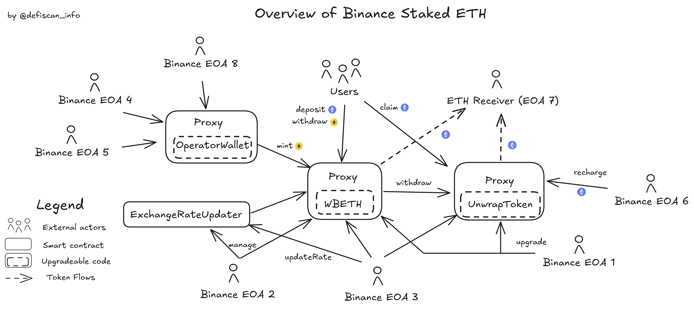

# Summary

Binance Staked ETH is a liquid ETH staking protocol operated by Binance. It allows users to supply ETH in exchange for the liquid staking token `wBETH`, Wrapped Beacon ETH, which accumulates ETH staking yield for holders. Binance custodies the supplied ETH and operates Ethereum validators on behalf of users. `wBETH` can be used in other DeFi products, for example, as collateral.

# Ratings

## Chain

`wBETH` is issued on both Ethereum mainnet and Binance Smart Chain. This review focuses on the Ethereum deployment.

> Chain score: Low

## Upgradeability

All the critical contracts in the protocol are upgradeable, including the `wBETH` token and the contracts used to deposit ETH (mint `wBETH`) and withdraw ETH (burn `wBETH`). Those updates can be performed by Binance itself through a set of Externally Owned Accounts (EOAs), and could lead to the _loss of user funds_. Furthermore, Binance has the ability to pause the protocol and blacklist specific users with a potential impact of temporarily or permanently freezing user funds.

In order to withdraw funds (and burn `wBETH`), a redemption delay of 7 days is currently enforced. This delay can be increased arbitrarily by Binance immediately (see [Exit Window](#exit-window)).

> Upgradeability score: High

## Autonomy

As mentioned in the [Terms of services](https://www.binance.com/en/terms-ETH-2-0-staking#:~:text=Binance%20Group%20Entities%20may%2C%20in,their%20sole%20and%20absolute%20discretion), Binance is the sole operator of Ethereum validators in the Binance Staked ETH protocol. Binance has full custody of and control over user funds throughout the staking process. The creation of new Ethereum validators and withdrawal of ETH is handled privately by Binance through its EOAs.

> Autonomy score: High

## Exit Window

No Exit Window is enforced, all changes and upgrades can be made without delay.

> Exit Window score: High

## Accessibility

Binance Staked ETH can be accessed using the Binance app on [binance.com](https://binance.com). This app is not open-source and there are no alternatives to interact with the contracts. Interacting directly with the contracts is possible on [etherscan](https://etherscan.io), but this is not documented in the Binance docs.

> Accessibility score: High

## Conclusion

_Binance's Staked ETH_ achieves _High_ centralization risk scores for its _Upgradeability_, _Autonomy_, _Exit Window_, and _Accessibility_. Furthermore, as described in the _Protocol Analysis_, the user funds are sent out to a centralized custody. For this reason, _Binance's Staked ETH_ does not meet the [Stage 0 requirements](/learn-more#others-protocol-category) and thus does not qualify as a DeFi product according to our framework.

It could become _Stage 0_ if it implemented a decentralized protocol to stake users' `ETH` without relying on centralized custody.

# Reviewer's Notes

There are no particular remarks for this review.

# Protocol Analysis

The overview of the protocol can be seen in the diagram below.

The protocol relies on Externally Owned Accounts (EOAs) to function correctly. Those accounts need to provide exchange rates for `ETH` to `wBETH` and liquidity for withdrawals. `ETH` deposited in the contract can withdrawn to the [Binance EOA 7](#all-permission-owners) for deposits in the Ethereum Proof-of-Stake network by calling `moveToStakingAddress`. This process is not documented and entirely up to Binance, as mentioned in their [Terms of services](https://www.binance.com/en/terms-ETH-2-0-staking).

When withdrawing their `ETH` (_unwrapping_ their `wBETH` back to `ETH`), the request is forwarded to the `UnwrapToken` contract that enforces a 7-day delay. EOAs acting as operators ([Binance EOA 3 and 6](#all-permission-owners)) need to allocate liquidity to this contract to address the withdrawals. Any `ETH` left in that contract can be withdrawn to the [Binance EOA 7](#all-permission-owners) by [Binance EOA 3](#all-permission-owners)

The`ExchangeRateUpdator` allows the [Binance EOA 3](#all-permission-owners) to update the `ETH`/`wBETH` rate arbitrarily, this rate determines how much `wBETH` will users receive when depositing, and how much `ETH` they will receive when withdrawing. Users need to trust that the rate is set correctly.

# Dependencies

As mentioned in the [Terms of services](https://www.binance.com/en/terms-ETH-2-0-staking#:~:text=Binance%20Group%20Entities%20may%2C%20in,their%20sole%20and%20absolute%20discretion), the protocol relies on _Binance Group_ as the sole operator of Ethereum validators. Users' `ETH` is
in total custody of Externally Owned Accounts (EOAs) who handle privately the creation of new validators.

# Governance

No governance is publicly disclosed as all critical permissions are held by Externally Owned Accounts (EOAs).

## Security Council

All critical permissions are held by Externally Owned Accounts (EOAs) and no security council is in place.

# Contracts & Permissions

## Contracts

| Contract Name            | Address                                                                                                               |
| ------------------------ | --------------------------------------------------------------------------------------------------------------------- |
| wBETH (Proxy)            | [0xa2E3356610840701BDf5611a53974510Ae27E2e1](https://etherscan.io/address/0xa2E3356610840701BDf5611a53974510Ae27E2e1) |
| wBETH (Implementation)   | [0x9e021c9607bd3adb7424d3b25a2d35763ff180bb](https://etherscan.io/address/0x9e021c9607bd3adb7424d3b25a2d35763ff180bb) |
| UnwrapTokenV1ETH (Proxy) | [0x79973d557CD9dd87eb61E250cc2572c990e20196](https://etherscan.io/address/0x79973d557CD9dd87eb61E250cc2572c990e20196) |
| UnwrapTokenV1ETH         | [0x542059d658624df6452b22b10302a15a6ab59f10](https://etherscan.io/address/0x542059d658624df6452b22b10302a15a6ab59f10) |
| ExchangeRateUpdater      | [0x81720695e43A39C52557Ce6386feB3FAAC215f06](https://etherscan.io/address/0x81720695e43A39C52557Ce6386feB3FAAC215f06) |
| OperatorWallet (Proxy)   | [0xb05a6449f383a1A43A172970858B97394FEcDAD6](https://etherscan.io/address/0xb05a6449f383a1A43A172970858B97394FEcDAD6) |
| OperatorWallet           | [0x18cb25f214b95bfac05d594d14ef68bb94d55813](https://etherscan.io/address/0x18cb25f214b95bfac05d594d14ef68bb94d55813) |

## All Permission Owners

| Name                       | Account                                                                                                               | Type     |
| -------------------------- | --------------------------------------------------------------------------------------------------------------------- | -------- |
| Binance EOA 1 (undeclared) | [0xA3eE6926edcce93BacF05F4222c243c4d9F6d853](https://etherscan.io/address/0xA3eE6926edcce93BacF05F4222c243c4d9F6d853) | EOA      |
| Binance EOA 2 (undeclared) | [0x099d699C07Bbc8eE6eB5703746063E04B2aA62A7](https://etherscan.io/address/0x099d699C07Bbc8eE6eB5703746063E04B2aA62A7) | EOA      |
| Binance EOA 3 (undeclared) | [0x2B59215778e99035CF38663454eF1240a7AE70F5](https://etherscan.io/address/0x2B59215778e99035CF38663454eF1240a7AE70F5) | EOA      |
| Binance EOA 4 (undeclared) | [0xB2F56fc21EFe0f3921FC28adeCacC36A4bFdcAC1](https://etherscan.io/address/0xB2F56fc21EFe0f3921FC28adeCacC36A4bFdcAC1) | EOA      |
| Binance EOA 5 (undeclared) | [0x7cfe99c15537753682def016d17d4b29a7cab4ee](https://etherscan.io/address/0x7cfe99c15537753682def016d17d4b29a7cab4ee) | EOA      |
| Binance EOA 6 (undeclared) | [0x3E4BD5FB2fCeF981BAFd1D164f838DFC31370Fb1](https://etherscan.io/address/0x3E4BD5FB2fCeF981BAFd1D164f838DFC31370Fb1) | EOA      |
| Binance EOA 7 (undeclared) | [0x26ad6395DABF271fD9bFDC82d7377261930E6B86](https://etherscan.io/address/0x26ad6395DABF271fD9bFDC82d7377261930E6B86) | EOA      |
| Binance EOA 8 (undeclared) | [0xa42436335a41fA6C82CDe224Ae2B82C025027e5b](https://etherscan.io/address/0xa42436335a41fA6C82CDe224Ae2B82C025027e5b) | EOA      |
| OperatorWallet             | [0xb05a6449f383a1A43A172970858B97394FEcDAD6](https://etherscan.io/address/0xb05a6449f383a1A43A172970858B97394FEcDAD6) | Contract |
| ExchangeRateUpdater        | [0x81720695e43A39C52557Ce6386feB3FAAC215f06](https://etherscan.io/address/0x81720695e43A39C52557Ce6386feB3FAAC215f06) | Contract |

## Permissions

| Contract                 | Function                    | Impact                                                                                                                                                                                                                                                                                         | Owner                                                  |
| ------------------------ | --------------------------- | ---------------------------------------------------------------------------------------------------------------------------------------------------------------------------------------------------------------------------------------------------------------------------------------------- | ------------------------------------------------------ |
| wBETH (Proxy)            | changeAdmin                 | Changes the admin of the proxy. The admin can change the entire implementation contract, potentially changing the entire logic and the ownership of the tokens.                                                                                                                                | Binance EOA 1 (undeclared)                             |
| wBETH (Proxy)            | upgradeTo                   | Upgrades the implementation contract. This can potentially changing the entire logic and the ownership of the tokens.                                                                                                                                                                          | Binance EOA 1 (undeclared)                             |
| wBETH (Proxy)            | upgradeToAndCall            | Similar to `upgradeTo` followed by a call in the newly deployed contract.                                                                                                                                                                                                                      | Binance EOA 1 (undeclared)                             |
| wBETH (Implementation)   | updateOracle                | Updates the oracle contract address. The oracle can set the exchange rate between `ETH` and `wBETH`. This exchange rate determines directly how much `wBETH` users get when depositing their `ETH` using the deposit function.                                                                 | Binance EOA 2 (undeclared)                             |
| wBETH (Implementation)   | updateExchangeRate          | Updates the `ETH`/`wBETH` exchange rate. This exchange rate determines directly how much `wBETH` users get when depositing their `ETH` using the deposit function. If malicious or wrong, the rate could drain the contract or lock user funds by not dilluting the value of `wBETH`.          | ExchangeRateUpdater                                    |
| wBETH (Implementation)   | updateEthReceiver           | Updates the ETH receiver account. This address can receive ETH from this contract by the operator. A malicious `ETHReceiver` could steal all fund received or collude with the Operator to drain the contract.                                                                                 | Binance EOA 2 (undeclared)                             |
| wBETH (Implementation)   | updateOperator              | Updates the Operator's address. The operator can send any amount of ETH out of the contract and into either the `ethReceiver` external account or the `unwrapETH` contract. A malicious node operator could collude with the `ethReceiver` to drain the contract.                              | Binance EOA 2 (undeclared)                             |
| wBETH (Implementation)   | rescueERC20                 | Transfers any ERC-20 contract out to an arbitrary given address.                                                                                                                                                                                                                               | 0x0 (Managed by Binance EOA 2 (undeclared))            |
| wBETH (Implementation)   | updateRescuer               | Updates the rescuer. The rescuer can transfer any ERC-20 out of the contract and to any given address.                                                                                                                                                                                         | Binance EOA 2 (undeclared)                             |
| wBETH (Implementation)   | transferOwnership           | Transfers ownership over the contract. The owner has managing rights and can grant roles to other addresses. This includes the right to mint arbitrarily or change the exchange rate.                                                                                                          | Binance EOA 2 (undeclared)                             |
| wBETH (Implementation)   | mint                        | Mints new `wBETH` to any non-blacklisted address, within the limits of the minter's allowance.                                                                                                                                                                                                 | OperatorWallet                                         |
| wBETH (Implementation)   | configureMinter             | Configures a minter. The minter has the right to mint within a given allowance.                                                                                                                                                                                                                | Binance EOA 2 (undeclared)                             |
| wBETH (Implementation)   | removeMinter                | Removes a minter from the list.                                                                                                                                                                                                                                                                | Binance EOA 2 (undeclared)                             |
| wBETH (Implementation)   | burn                        | Allows a minter to burn some of its own tokens. This doesn't impact the minter's minting allowance.                                                                                                                                                                                            | OperatorWallet                                         |
| wBETH (Implementation)   | updateMasterMinter          | Updates the account with the right to name minters and define their allowance. The master minter has the power to mint any amount of wBETH by naming itself or other addresses in their control.                                                                                               | Binance EOA 2 (undeclared)                             |
| wBETH (Implementation)   | blacklist                   | Blacklists an address from transacting with this contract. If the address has a non-zero balance this freezes the funds until it is explicitely taken out of the blacklist.                                                                                                                    | Binance EOA 2 (undeclared)                             |
| wBETH (Implementation)   | unBlacklist                 | Takes an address off the blacklist. This unfreezes its balance and allows it to transact again with the contract.                                                                                                                                                                              | Binance EOA 2 (undeclared)                             |
| wBETH (Implementation)   | updateBlacklister           | Updates the _Blacklister_, the account in charge of the blacklist.                                                                                                                                                                                                                             | Binance EOA 2 (undeclared)                             |
| wBETH (Implementation)   | pause                       | Pauses the entire contract. This freezes any transfer, deposit, withdrawal, minting, or burning of `wBETH`.                                                                                                                                                                                    | Binance EOA 2 (undeclared)                             |
| wBETH (Implementation)   | unpause                     | Unpauses the contract.                                                                                                                                                                                                                                                                         | Binance EOA 2 (undeclared)                             |
| wBETH (Implementation)   | updatePauser                | Updates the _Pauser_, the account with the right to pause the contract.                                                                                                                                                                                                                        | Binance EOA 2 (undeclared)                             |
| wBETH (Implementation)   | supplyEth                   | Supplies (transfers) ETH into the contract, with no additional action.                                                                                                                                                                                                                         | Binance EOA 3 (undeclared)                             |
| wBETH (Implementation)   | moveToStakingAddress        | Transfers any given amount of ETH out of the contract and into the `ethReceiver` external account. If the `ethReceiver` is malicious, this could be abused to drain the funds.                                                                                                                 | Binance EOA 3 (undeclared)                             |
| wBETH (Implementation)   | moveToUnwrapAddress         | Transfers any given amount of ETH out of the contract and into the `unwrapETH` contract. If the `unwrapETH` contract is malicious or in control by malicious actors, this could be abused to drain the funds.                                                                                  | Binance EOA 3 (undeclared)                             |
| UnwrapTokenV1ETH (Proxy) | changeAdmin                 | Changes the admin of this proxy. The admin can update the implementation logic. This could potentially change the entire logic or custody of the funds in the contract.                                                                                                                        | Binance EOA 1 (undeclared)                             |
| UnwrapTokenV1ETH (Proxy) | upgradeTo                   | Upgrades to a new implementation contract. This could potentially change the entire logic or custody of the funds in the contract.                                                                                                                                                             | Binance EOA 1 (undeclared)                             |
| UnwrapTokenV1ETH (Proxy) | upgradeToAndCall            | Similar to `upgradeTo` with an additional call in the new contract after the update.                                                                                                                                                                                                           | Binance EOA 1 (undeclared)                             |
| UnwrapTokenV1ETH         | requestWithdraw             | Initiates a withdrawal request on behalf of the user to convert `wBETH` back to `ETH`. The `ETH` can only be claimed after the mandatory 7 days delay.                                                                                                                                         | wBETH                                                  |
| UnwrapTokenV1ETH         | allocate                    | Allocates liquidity to withdrawal requests. This allows users to claim their withdrawal once the lock time has passed.                                                                                                                                                                         | Binance EOA 3 (undeclared)                             |
| UnwrapTokenV1ETH         | moveFromWrapContract        | Moves `ETH` from the `wBETH` contract. This action is triggered by the Operator of the `wBETH` contract.                                                                                                                                                                                       | wBETH                                                  |
| UnwrapTokenV1ETH         | setNewOperator              | Changes the operator's address (currently set to Binance EOA 3). The operator handles the withdrawal queue and its liquidity. A malicious operator could block withdrawals or set extensively long lock times.                                                                                 | Binance EOA 2 (undeclared)                             |
| UnwrapTokenV1ETH         | setRechargeAddress          | Sets the recharge address. This is an account allowed to add ETH to this contract in order to feed withdrawals.                                                                                                                                                                                | Binance EOA 2 (undeclared)                             |
| UnwrapTokenV1ETH         | setEthBackAddress           | Sets the "EthBack" address. This externally owned account can receive unused ETH in the contract from the operator.                                                                                                                                                                            | Binance EOA 2 (undeclared)                             |
| UnwrapTokenV1ETH         | setLockTime                 | Sets a new lock time. The lock time is at least 2 days and represent the time users have to wait between their withdrawal requests and the moment they can claim their `ETH`.                                                                                                                  | Binance EOA 3 (undeclared)                             |
| UnwrapTokenV1ETH         | setNewEthStaked             | Updates the total amount of ETH staked, for accounting purposes. The amount is not used within the contract.                                                                                                                                                                                   | Binance EOA 3 (undeclared)                             |
| UnwrapTokenV1ETH         | blacklist                   | Blacklists an address. A blacklist address can no longer withdraw its funds.                                                                                                                                                                                                                   | Binance EOA 2 (undeclared)                             |
| UnwrapTokenV1ETH         | unBlacklist                 | Removes a user from the blacklist.                                                                                                                                                                                                                                                             | Binance EOA 2 (undeclared)                             |
| UnwrapTokenV1ETH         | updateBlacklister           | Updates the _Blacklister_, the account with the rights to blacklist. A malicious blacklister could prevent any user from withdrawing their funds.                                                                                                                                              | Binance EOA 2 (undeclared)                             |
| UnwrapTokenV1ETH         | transferOwnership           | Transfers ownership of the contract to a new address. The owner can grant any of the roles in this contract, this could lead to fund drainage or freezing user funds.                                                                                                                          | Binance EOA 2 (undeclared)                             |
| UnwrapTokenV1ETH         | pause                       | Pauses the entire contract. No further withdrawals or allocations are possible.                                                                                                                                                                                                                | Binance EOA 2 (undeclared)                             |
| UnwrapTokenV1ETH         | unpause                     | This unpauses the contract.                                                                                                                                                                                                                                                                    | Binance EOA 2 (undeclared)                             |
| UnwrapTokenV1ETH         | updatePauser                | This changes the _Pauser_ address, the address with the right to pause the contract.                                                                                                                                                                                                           | Binance EOA 2 (undeclared)                             |
| UnwrapTokenV1ETH         | rechargeFromRechargeAddress | Sends ETH from the recharge address and into the withdrawal queue.                                                                                                                                                                                                                             | Binance EOA 6 (undeclared)                             |
| UnwrapTokenV1ETH         | moveToBackAddress           | Moves any unused ETH from the contract to the "backAddress", an externally owned account.                                                                                                                                                                                                      | Binance EOA 3 (undeclared)                             |
| ExchangeRateUpdater      | configureCaller             | Configures a caller who can update the exchange rate in the contract. The caller has an associated count and interval which specifies how frequently he can update the price. Malicious callers could manipulate the `ETH`/`wBETH` exchange rate. Currently, the only caller is Binance EOA 3. | Binance EOA 2 (undeclared)                             |
| ExchangeRateUpdater      | removeCaller                | Removes a caller from the list.                                                                                                                                                                                                                                                                | Binance EOA 2 (undeclared)                             |
| ExchangeRateUpdater      | renounceOwnership           | Renounces ownership over the contract. This would prevent removing or adding any caller in the future.                                                                                                                                                                                         | Binance EOA 2 (undeclared)                             |
| ExchangeRateUpdater      | transferOwnership           | Transfers ownership over the contract. The owner has the power to add and remove callers. Malicious callers could manipulate the `ETH`/`wBETH` exchange rate.                                                                                                                                  | Binance EOA 2 (undeclared)                             |
| ExchangeRateUpdater      | updateExchangeRate          | Updates the `ETH`/`wBETH` exchange rate. If wrong or malicious, this rate could be abused and lead to loss of user funds.                                                                                                                                                                      | Binance EOA 3 (undeclared)                             |
| OperatorWallet (Proxy)   | changeAdmin                 | Changes the admin of this proxy. The admin can update the implementation logic. This could potentially change the entire logic or custody of the funds in the contract.                                                                                                                        | Binance EOA 5 (undeclared)                             |
| OperatorWallet (Proxy)   | upgradeTo                   | Upgrades to a new implementation contract. This could potentially change the entire logic or custody of the funds in the contract.                                                                                                                                                             | Binance EOA 5 (undeclared)                             |
| OperatorWallet (Proxy)   | upgradeToAndCall            | Similar to `upgradeTo` with an additional call in the new contract after the update.                                                                                                                                                                                                           | Binance EOA 5 (undeclared)                             |
| OperatorWallet           | addHotWallet                | Adds an address allowed to be the rececipient of mints.                                                                                                                                                                                                                                        | Binance EOA 4 (undeclared)                             |
| OperatorWallet           | removeHotWallet             | Removes an address from the list.                                                                                                                                                                                                                                                              | Binance EOA 4 (undeclared)                             |
| OperatorWallet           | changeOperator              | Changes the operator: the address with mint privileges.                                                                                                                                                                                                                                        | Binance EOA 4 (undeclared)                             |
| OperatorWallet           | mint                        | Mints a given token to a listed hot wallet or the current contract. This could mint arbitrary `wBETH`.                                                                                                                                                                                         | Binance EOA 8 (undeclared), Binance EOA 4 (undeclared) |
| OperatorWallet           | transfer                    | Transfer tokens from this contract to a hot wallet.                                                                                                                                                                                                                                            | Binance EOA 8 (undeclared), Binance EOA 4 (undeclared) |
| OperatorWallet           | execTransaction             | Executes arbitrary transactions with custom data.                                                                                                                                                                                                                                              | Binance EOA 4 (undeclared)                             |
| OperatorWallet           | withdraw                    | Withdraws any token, or ETH, stored in this contract and transfers it to the Owner (currenty Binance EOA 4).                                                                                                                                                                                   | Binance EOA 4 (undeclared)                             |
| OperatorWallet           | pause                       | Pauses the contract. No function can be called except unpause.                                                                                                                                                                                                                                 | Binance EOA 4 (undeclared)                             |
| OperatorWallet           | unpause                     | Unpauses the contract.                                                                                                                                                                                                                                                                         | Binance EOA 4 (undeclared)                             |
| OperatorWallet           | transferOwnership           | Transfers ownership to a new address. The owner can mint arbitrary amount of `wBETH` which could lead to loss of user funds. The new owner needs to accept the position.                                                                                                                       | Binance EOA 4 (undeclared)                             |
| OperatorWallet           | acceptOwnership             | Allows the new owner to accept the position.                                                                                                                                                                                                                                                   | pendingAdmin                                           |
