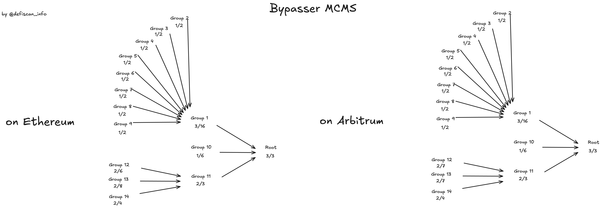

# Summary

CCIP is a cross-chain protocol that allows any protocol to use a multi-purpose bridge to transfer messages and tokens from one blockchain to another.

This report is work in progress and currently only covers scanned permissions and the owners of these permission of the cross-chain communication infrastructure between Ethereum Mainnet and Arbitrum based on smart contract analysis.

# Ratings

## Upgradeability

This report did not analyse all smart contracts permissions that build the onchain component of the CCIP infrastructure. Three functions that expose upgradeability risk are `setConfig` on `RMN` contract, `setOCR2Config` on `CommitStore` and `setOCR2Config` on the `EVM2EVMOfframp` contract.

These functions allow to set the signer and transmitter addresses of proofs and messages that form the cross-chain messages. Updating the representing addresses to a smaller set can introduce centralisation risk that could be exploited to trigger malicious cross-chain messages, as minting/releasing tokens on the destination chain, without sufficient collateralisation on the origin chain.

> Upgradeability Score: high

## Exit Window

Updates to Smart Contracts that build the infrastructure of CCIP need to be scheduled and executed by the `RBACTimelock` contract. The timelock is always subject to the proposing MCMS's decision but cannot be lower than 3 hours.

The Bypasser Role owners can even circumvent the timelock and execute their calls immediately.

> Exit Window Score: high

## Conclusion

CCIP smart contracts expose centralisatized permissions to update the set of nodes that can push cross-chain messages. Updates via the Bypasser role are immediately executed. The CCIP protocol is rated as a Stage 0 equivalent.

The CCIP protocol could advance to Stage 1 if the Bypasser Role owner adhered to the Security Council Requirements. Publishing the owners of the signers and having more than 50% outside signers (in contract to insider signers) would make the MCMS a security council.

# Protocol Analysis

## Action flow of CCIP

There are three networks that help to make CCIP as a bridge secure. Each network has a distinct role inside the cross chain communication flow.

There is the risk network which monitors the chain, and can halt the cross-chain flow to and from this network. Additionally it “blesses” or “curses” messages that should be moved cross chain.

Additionally, there is the committing network which observes events on the source chain that signals messages that should be moved cross chain. If it detects such a transaction it posts a root to the `CommitStore` contract on the destination chain.

Lastly, there is the executing network that observes the transactions and if roots are posted to the `CommitStore` and the roots are blessed, the executing network triggers the message to be executed on the target chain with the blessed messages.

# Governance

The CCIP protocol is governed by the `RBACTimelock` contract. The governance can change parameters and the onchain addresses representing nodes in each network (Risk, Committing, Executing).

The governance usually works by proposing and executing. The `RBACTimelock` contract enforces a minimum timelock, which is set to 3 hours. Particpants of governance can propose transactions by calling `scheduleBatch` on the `RBACTimelock` contract. Any address with the Role `Proposer` can schedule transactions to be executed (see role owner table). The scheduled transactions are then ready to be executed after the timelock has passed. During the time of the exit window the scheduled transactions can also be cancelled. When no cancellation happened execution is permissionless.

For the case of an emergency a Bypasser role is assigned to a Multichain Multisig to execute transactions instantaneously.

The `RBACTimelock` (Governance) contract is deployed to any chain which CCIP is connecting.

## Multichain Multisig (MCMS)

Role owners of the `RBACTimelock` (governance) are multichain multisigs or MCMS for short. They allow to use the same signatures across many chains, as such only EOAs are supported and not smart contracts.
Signing groups are arranged in a tree and each node in the tree has its own threshold. A group or interior node is successful if a quorum of its children are successful. The multisig signs, ie. sets a root successfully if the root group is successful. EOAs are the leaves of the tree.

## Bypasser

The Bypasser role can call any contract with arbitrary data via the `RBACTimelock` without delay. This means the Bypasser can act on behalf of the governance. The onchain analysis revealed that only one MCMS (`0x117ec8ad107976e1dbcc21717ff78407bc36aadc`) holds the Bypasser role.

The governance (`RBACTimelock`) owns the contracts in the CCIP smart contract system. The Bypasser has thus immediate and ultimate control over many functions (see permission table).

The Bypasser controls crucial functions on the `CommitStore` contract, the `RMN` contract (Risk Management Network Smart Contract) and the `EVM2EVMOffRamp` contract. Since the Bypasser signers are not attested to belong to different entitites, the risk remains that a single actor or an insufficiently decentralised group of actors can update the previously mentioned contract to exploit funds from CCIP token pools.

The MCMS with Bypasser role could reduce the set of oracle nodes for the three networks by calling `RMN.setConfig`, `CommitStore.setOCR2Config` and `EVM2EVMOfframp.setOCR2Config` and only list addresses that the Bypasser group controls. In a next step the malicious actor would mint or release tokens on the destination chain (source) to addresses it self controls, by posting data to the `CommitStore`, blessing with the controlled Risk Management Network signers and executing the malicious transactions by passing messages that match the root posted to the `CommitStore`.

# Security Council

| Multisig / Role | Address                                    | Type | At least 7 signers | At least 51% threshold | ≥50% non-insider signers | Signers publicly announced |
| --------------- | ------------------------------------------ | ---- | ------------------ | ---------------------- | ------------------------ | -------------------------- |
| BYPASSER        | 0x117ec8ad107976e1dbcc21717ff78407bc36aadc | MCMS | ✅                 | ?                      | ❌                       | ❌                         |

# Reviewer notes

The review was not exhaustive and does not cover all permissions in the CCIP system and does not cover all permissioned functions of the two deployments on Ethereum Mainnet and Arbitrum. The review focuses on the most important centralisation vector (weakest link logic).

# Contracts & Permissions

## Contracts

### Ethereum Mainnet

| Contract Name      | Address                                                                                                               |
| ------------------ | --------------------------------------------------------------------------------------------------------------------- | --- |
| Router             | [0x80226fc0Ee2b096224EeAc085Bb9a8cba1146f7D](https://etherscan.io/address/0x80226fc0Ee2b096224EeAc085Bb9a8cba1146f7D) |
| ARMProxy           | [0x411dE17f12D1A34ecC7F45f49844626267c75e81](https://etherscan.io/address/0x411dE17f12D1A34ecC7F45f49844626267c75e81) |
| EVM2EVMOnRamp      | [0x69eCC4E2D8ea56E2d0a05bF57f4Fd6aEE7f2c284](https://etherscan.io/address/0x69eCC4E2D8ea56E2d0a05bF57f4Fd6aEE7f2c284) |
| EVM2EVMOffRamp     | [0xeFC4a18af59398FF23bfe7325F2401aD44286F4d](https://etherscan.io/address/0xeFC4a18af59398FF23bfe7325F2401aD44286F4d) |     |
| TokenAdminRegistry | [0xb22764f98dD05c789929716D677382Df22C05Cb6](https://etherscan.io/address/0xb22764f98dD05c789929716D677382Df22C05Cb6) |
| CommitStore        | [...](https://etherscan.io/address/...)                                                                               |

### Arbitrum

| Contract Name      | Address                                                                                                              |
| ------------------ | -------------------------------------------------------------------------------------------------------------------- |
| Router             | [0x141fa059441E0ca23ce184B6A78bafD2A517DdE8](https://arbiscan.io/address/0x141fa059441E0ca23ce184B6A78bafD2A517DdE8) |
| ARMProxy           | [0xC311a21e6fEf769344EB1515588B9d535662a145](https://arbiscan.io/address/0xC311a21e6fEf769344EB1515588B9d535662a145) |
| EVM2EVMOnRamp      | [0x67761742ac8A21Ec4D76CA18cbd701e5A6F3Bef3](https://arbiscan.io/address/0x67761742ac8A21Ec4D76CA18cbd701e5A6F3Bef3) |
| EVM2EVMOffRamp     | [0x91e46cc5590A4B9182e47f40006140A7077Dec31](https://arbiscan.io/address/0x91e46cc5590A4B9182e47f40006140A7077Dec31) |
| TokenAdminRegistry | [0x39AE1032cF4B334a1Ed41cdD0833bdD7c7E7751E](https://arbiscan.io/address/0x39AE1032cF4B334a1Ed41cdD0833bdD7c7E7751E) |
| CommitStore        | [0x86be76A0FA2bD3ECB69330cBb4fd1f62c48F43E3](https://arbiscan.io/address/0x86be76A0FA2bD3ECB69330cBb4fd1f62c48F43E3) |

## Permissions Mainnet

| Contract           | Function                  | Owner                                                             |
| ------------------ | ------------------------- | ----------------------------------------------------------------- |
| Router             | transferOwnership         | RBACTimelock                                                      |
| Router             | acceptOwnership           | pending owner                                                     |
| Router             | setWrappedNative          | RBACTimelock                                                      |
| Router             | applyRampUpdates          | RBACTimelock                                                      |
| Router             | recoverTokens             | RBACTimelock                                                      |
| ARMProxy           | transferOwnership         | RBACTimelock                                                      |
| ARMProxy           | acceptOwnership           | pending owner                                                     |
| ARMProxy           | setARM                    | RBACTimelock                                                      |
| RMNRemote          | transferOwnership         | RBACTimelock                                                      |
| RMNRemote          | acceptOwnership           | pending owner                                                     |
| RMNRemote          | setConfig                 | RBACTimelock                                                      |
| RMNRemote          | curse                     | RBACTimelock                                                      |
| RMNRemote          | uncurse                   | RBACTimelock                                                      |
| EVM2EVMOnRamp      | setRateLimiterConfig      | RBACTimelock or MCMS (0x2F2A3e36CE5Fb0924C414BEB1D98B531Cdf17e0B) |
| EVM2EVMOnRamp      | setAdmin                  | RBACTimelock or MCMS (0x2F2A3e36CE5Fb0924C414BEB1D98B531Cdf17e0B) |
| EVM2EVMOnRamp      | transferOwnership         | RBACTimelock                                                      |
| EVM2EVMOnRamp      | acceptOwnership           | pending owner                                                     |
| EVM2EVMOnRamp      | forwardFromRouter         | Router                                                            |
| EVM2EVMOnRamp      | setDynamicConfig          | RBACTimelock                                                      |
| EVM2EVMOnRamp      | setFeeTokenConfig         | RBACTimelock or MCMS (0x2F2A3e36CE5Fb0924C414BEB1D98B531Cdf17e0B) |
| EVM2EVMOnRamp      | setTokenTransferFeeConfig | RBACTimelock or MCMS (0x2F2A3e36CE5Fb0924C414BEB1D98B531Cdf17e0B) |
| EVM2EVMOnRamp      | setNops                   | RBACTimelock or MCMS (0x2F2A3e36CE5Fb0924C414BEB1D98B531Cdf17e0B) |
| EVM2EVMOnRamp      | payNops                   | RBACTimelock or MCMS (0x2F2A3e36CE5Fb0924C414BEB1D98B531Cdf17e0B) |
| EVM2EVMOnRamp      | withdrawNonLinkFees       | RBACTimelock or MCMS (0x2F2A3e36CE5Fb0924C414BEB1D98B531Cdf17e0B) |
| TokenAdminRegistry | transferOwnership         | RBACTimelock                                                      |
| TokenAdminRegistry | acceptOwnership           | pending owner                                                     |
| TokenAdminRegistry | setPool                   | Token Admin (each CCIP token has its own admin)                   |
| TokenAdminRegistry | transferAdminRole         | Token Admin (each CCIP token has its own admin)                   |
| TokenAdminRegistry | acceptAdminRole           | pending owner                                                     |
| TokenAdminRegistry | proposeAdministrator      | RBACTimelock                                                      |
| TokenAdminRegistry | addRegistryModule         | RBACTimelock                                                      |
| TokenAdminRegistry | removeRegistryModule      | RBACTimelock                                                      |

## Permissions Arbitrum

| Contract       | Function                    | Owner                             |
| -------------- | --------------------------- | --------------------------------- |
| EVM2EVMOffRamp | setOCR2Config               | RBACTimelock                      |
| EVM2EVMOffRamp | transmit                    | Addresses from Executing Network  |
| EVM2EVMOffRamp | transferOwnership           | RBACTimelock                      |
| EVM2EVMOffRamp | acceptOwnership             | pending owner                     |
| EVM2EVMOffRamp | setRateLimiterConfig        | RBACTimelock                      |
| EVM2EVMOffRamp | setAdmin                    | RBACTimelock                      |
| EVM2EVMOffRamp | updateRateLimitTokens       | RBACTimelock                      |
| CommitStore    | setOCR2Config               | RBACTimelock                      |
| CommitStore    | transmit                    | Addresses from Committing Network |
| CommitStore    | transferOwnership           | RBACTimelock                      |
| CommitStore    | acceptOwnership             | pending owner                     |
| CommitStore    | setMinSeqNr                 | RBACTimelock                      |
| CommitStore    | setLatestPriceEpochAndRound | RBACTimelock                      |
| CommitStore    | resetUnblessedRoots         | RBACTimelock                      |
| CommitStore    | pause                       | RBACTimelock                      |
| CommitStore    | unpause                     | RBACTimelock                      |
