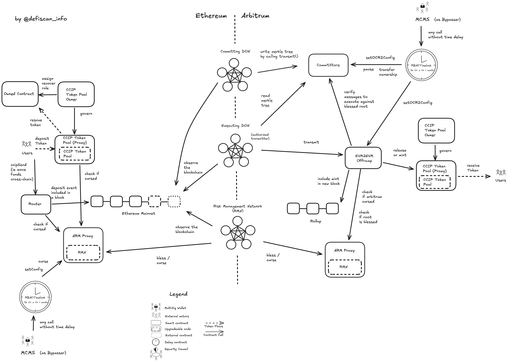

# Summary

CCIP is a cross-chain protocol that allows any smart contract protocol to use a multi-purpose bridge to transfer messages and tokens from one blockchain to another.

This report only covers scanned permissions and the owners of these permissions of the cross-chain communication infrastructure between Ethereum Mainnet and Arbitrum based on smart contract analysis. The code of the oracle networks and centralization vectors thereof are not part of the scope.

# Protocol Analysis

There are three oracle networks that help to secure CCIP. Each network has a distinct role inside the cross-chain communication flow.

First, the _Risk Management Network_ monitors the chain and can halt the cross-chain flow of messages and tokens to and from a network. Additionally, the _Risk Management Network_ “blesses” or “curses” messages that should be moved cross-chain. When the count of nodes blessing a message reaches the quorum, the message can be executed on the destination chain.

Additionally, the _Committing Network_ observes events of new cross-chain messages on the source chain. If it detects such an event, the _Committing Network_ posts a root to the `CommitStore` contract on the destination chain.

Lastly, the _Executing Network_ observes the transactions, and if roots are posted to the `CommitStore` and the roots are blessed, the executing network triggers the message to be executed on the target chain with the blessed messages.

# Centralization

## Governance

The smart contracts of the CCIP protocol are governed by the `RBACTimelock` contract. The governance can change parameters (e.g fee tokens) and the signer addresses of the nodes in each network (Risk, Committing, Executing).

Governance actions are proposed by multichain multisigs (MCMSs) which have the Proposer role by calling `scheduleBatch` on the `RBACTimelock` contract (see [role owner table](#role-owners-rbactimelock)). The `RBACTimelock` contract enforces a minimum timelock, which is set to 3 hours. Particpants of governance can choose a specific timelock which is above or equal to the minimum timelock. The scheduled transactions are then ready to be executed after the timelock has passed. During the time of the exit window the scheduled transactions is object to cancellation by MCMSs with the Canceller role. With no cancellation during the exit window period execution becomes permissionless.

A Bypasser role is assigned to a Multichain Multisig (MCMS) for the case of an emergency to execute transactions instantaneously without the possibility to cancel the transaction.

The `RBACTimelock` (Governance) contract is deployed to any chain which CCIP is connecting.

## Upgradeability

This report did not analyse all smart contract permissions that can be found in the smart contract foundation of the CCIP infrastructure. Nonetheless, three functions that expose upgradeability risk are `setConfig` on `RMN` contract, `setOCR2Config` on `CommitStore`, and `setOCR2Config` on the `EVM2EVMOfframp` contract.

These functions allow to set the signer and transmitter addresses of the cross-chain messages for the three different networks. Updating the representing addresses to a smaller set can introduce centralization risk that could be exploited to trigger malicious cross-chain messages, such as minting/releasing tokens on the destination chain, without sufficient collateralization on the origin chain.

## Multichain Multisig (MCMS)

Role owners of the `RBACTimelock` (governance) are multichain multisigs or MCMS for short (see also [security council table](#security-council)). They allow to use the same signatures across many chains, as such only EOAs are supported and not smart contracts.

The MCMS is a multisig based of many children multisigs, the MCMS signs if the root multisig is successful. In order for the root to reach the quorum, its children need to reach their thresholds.
EOAs are the leaves of the tree.

## Bypasser

The Bypasser role can call any contract with arbitrary data via the `RBACTimelock` without delay. This means the Bypasser can act on behalf of the governance. The onchain analysis revealed that only one MCMS (`0x117ec8ad107976e1dbcc21717ff78407bc36aadc`) holds the Bypasser role on the Ethereum instance. On the Arbitrum instance of the CCIP governance deployment there is as well only one MCMS in control of the Bypasser role (`0xf4c257b5c6c526d56367a602e87b1932d13e67cb`).

The governance (`RBACTimelock`) owns the contracts in the CCIP smart contract system. The Bypasser has thus immediate and ultimate control over many functions (see [permission table](#permissions-mainnet)) on the respective chain.

The Bypasser controls crucial functions on the `CommitStore` contract, the `RMN` contract (Risk Management Network Smart Contract) and the `EVM2EVMOffRamp` contract. Since the Bypasser signers are not attested to belong to different entitites, the risk remains that a single actor or an insufficiently decentralised group of actors can update the previously mentioned contracts to exploit funds from CCIP token pools.

The MCMS with Bypasser role on the destination chain could reduce the set of addresses for the signers and the transmitters for the oracle nodes for the three networks by calling `RMN.setConfig`, `CommitStore.setOCR2Config` and `EVM2EVMOfframp.setOCR2Config` and only list addresses that the Bypasser group controls on the destination chain. In a next step the malicious actor would mint or release tokens on the destination chain (source) to addresses it controls, by posting data to the `CommitStore`, blessing with the controlled Risk Management Network signers and executing the malicious transactions by passing messages that match the root posted to the `CommitStore`.

## Conclusion

CCIP smart contracts expose centralized permissions to update the set of nodes that can push cross-chain messages. Updates via the Bypasser role are immediately executed. The CCIP protocol is therefore rated as highly centralized.

The CCIP protocol could advance to Medium Centralization if the Bypasser Role owner adhered to the Security Council Requirements. Publishing the owners of the signers and having more than 50% outside signers (in contract to insider signers) would make the MCMS a security council.

> Overall centralization: High

# Reviewer notes

⚠️ The review was not exhaustive and does not cover all permissions in the CCIP system and does not cover all permissioned functions of the two deployments on Ethereum Mainnet and Arbitrum. The described permissions in the section above are enough to showcase critical centralization vectors within CCIP.

# Appendix

## Security Council

| Multisig / Role     | Address                                                                                                               | Type | At least 7 signers | At least 51% threshold | ≥50% non-insider signers | Signers publicly announced |
| ------------------- | --------------------------------------------------------------------------------------------------------------------- | ---- | ------------------ | ---------------------- | ------------------------ | -------------------------- |
| BYPASSER (Ethereum) | [0x117ec8ad107976e1dbcc21717ff78407bc36aadc](https://etherscan.io/address/0x117ec8ad107976e1dbcc21717ff78407bc36aadc) | MCMS | ✅                 | ❌                     | ❌                       | ❌                         |
| BYPASSER (Arbitrum) | [0xf4c257b5c6c526d56367a602e87b1932d13e67cb](https://etherscan.io/address/0xf4c257b5c6c526d56367a602e87b1932d13e67cb) | MCMS | ✅                 | ❌                     | ❌                       | ❌                         |

## Contracts

### Ethereum Mainnet

| Contract Name      | Address                                                                                                               |
| ------------------ | --------------------------------------------------------------------------------------------------------------------- |
| Router             | [0x80226fc0Ee2b096224EeAc085Bb9a8cba1146f7D](https://etherscan.io/address/0x80226fc0Ee2b096224EeAc085Bb9a8cba1146f7D) |
| ARMProxy           | [0x411dE17f12D1A34ecC7F45f49844626267c75e81](https://etherscan.io/address/0x411dE17f12D1A34ecC7F45f49844626267c75e81) |
| EVM2EVMOnRamp      | [0x69eCC4E2D8ea56E2d0a05bF57f4Fd6aEE7f2c284](https://etherscan.io/address/0x69eCC4E2D8ea56E2d0a05bF57f4Fd6aEE7f2c284) |
| EVM2EVMOffRamp     | [0xeFC4a18af59398FF23bfe7325F2401aD44286F4d](https://etherscan.io/address/0xeFC4a18af59398FF23bfe7325F2401aD44286F4d) |
| TokenAdminRegistry | [0xb22764f98dD05c789929716D677382Df22C05Cb6](https://etherscan.io/address/0xb22764f98dD05c789929716D677382Df22C05Cb6) |
| CommitStore        | [0xf7b343a17445f175f2dd9f5cb29baf0a8de75ed3](https://etherscan.io/address/0xf7b343a17445f175f2dd9f5cb29baf0a8de75ed3) |
| RBACTimelock       | [0x44835bbba9d40deda9b64858095ecfb2693c9449](https://etherscan.io/address/0x44835bbba9d40deda9b64858095ecfb2693c9449) |

### Arbitrum

| Contract Name      | Address                                                                                                              |
| ------------------ | -------------------------------------------------------------------------------------------------------------------- |
| Router             | [0x141fa059441E0ca23ce184B6A78bafD2A517DdE8](https://arbiscan.io/address/0x141fa059441E0ca23ce184B6A78bafD2A517DdE8) |
| ARMProxy           | [0xC311a21e6fEf769344EB1515588B9d535662a145](https://arbiscan.io/address/0xC311a21e6fEf769344EB1515588B9d535662a145) |
| EVM2EVMOnRamp      | [0x67761742ac8A21Ec4D76CA18cbd701e5A6F3Bef3](https://arbiscan.io/address/0x67761742ac8A21Ec4D76CA18cbd701e5A6F3Bef3) |
| EVM2EVMOffRamp     | [0x91e46cc5590A4B9182e47f40006140A7077Dec31](https://arbiscan.io/address/0x91e46cc5590A4B9182e47f40006140A7077Dec31) |
| TokenAdminRegistry | [0x39AE1032cF4B334a1Ed41cdD0833bdD7c7E7751E](https://arbiscan.io/address/0x39AE1032cF4B334a1Ed41cdD0833bdD7c7E7751E) |
| CommitStore        | [0x86be76A0FA2bD3ECB69330cBb4fd1f62c48F43E3](https://arbiscan.io/address/0x86be76A0FA2bD3ECB69330cBb4fd1f62c48F43E3) |
| RBACTimelock       | [0x8a89770722c84B60cE02989Aedb22Ac4791F8C7f](https://arbiscan.io/address/0x8a89770722c84B60cE02989Aedb22Ac4791F8C7f) |

## Permissions Mainnet

| Contract           | Function                  | Owner                                                             |
| ------------------ | ------------------------- | ----------------------------------------------------------------- |
| Router             | transferOwnership         | RBACTimelock                                                      |
| Router             | acceptOwnership           | pending owner                                                     |
| Router             | setWrappedNative          | RBACTimelock                                                      |
| Router             | applyRampUpdates          | RBACTimelock                                                      |
| Router             | recoverTokens             | RBACTimelock                                                      |
| ARMProxy           | transferOwnership         | RBACTimelock                                                      |
| ARMProxy           | acceptOwnership           | pending owner                                                     |
| ARMProxy           | setARM                    | RBACTimelock                                                      |
| RMNRemote          | transferOwnership         | RBACTimelock                                                      |
| RMNRemote          | acceptOwnership           | pending owner                                                     |
| RMNRemote          | setConfig                 | RBACTimelock                                                      |
| RMNRemote          | curse                     | RBACTimelock                                                      |
| RMNRemote          | uncurse                   | RBACTimelock                                                      |
| EVM2EVMOnRamp      | setRateLimiterConfig      | RBACTimelock or MCMS (0x2F2A3e36CE5Fb0924C414BEB1D98B531Cdf17e0B) |
| EVM2EVMOnRamp      | setAdmin                  | RBACTimelock or MCMS (0x2F2A3e36CE5Fb0924C414BEB1D98B531Cdf17e0B) |
| EVM2EVMOnRamp      | transferOwnership         | RBACTimelock                                                      |
| EVM2EVMOnRamp      | acceptOwnership           | pending owner                                                     |
| EVM2EVMOnRamp      | forwardFromRouter         | Router                                                            |
| EVM2EVMOnRamp      | setDynamicConfig          | RBACTimelock                                                      |
| EVM2EVMOnRamp      | setFeeTokenConfig         | RBACTimelock or MCMS (0x2F2A3e36CE5Fb0924C414BEB1D98B531Cdf17e0B) |
| EVM2EVMOnRamp      | setTokenTransferFeeConfig | RBACTimelock or MCMS (0x2F2A3e36CE5Fb0924C414BEB1D98B531Cdf17e0B) |
| EVM2EVMOnRamp      | setNops                   | RBACTimelock or MCMS (0x2F2A3e36CE5Fb0924C414BEB1D98B531Cdf17e0B) |
| EVM2EVMOnRamp      | payNops                   | RBACTimelock or MCMS (0x2F2A3e36CE5Fb0924C414BEB1D98B531Cdf17e0B) |
| EVM2EVMOnRamp      | withdrawNonLinkFees       | RBACTimelock or MCMS (0x2F2A3e36CE5Fb0924C414BEB1D98B531Cdf17e0B) |
| TokenAdminRegistry | transferOwnership         | RBACTimelock                                                      |
| TokenAdminRegistry | acceptOwnership           | pending owner                                                     |
| TokenAdminRegistry | setPool                   | Token Admin (each CCIP token has its own admin)                   |
| TokenAdminRegistry | transferAdminRole         | Token Admin (each CCIP token has its own admin)                   |
| TokenAdminRegistry | acceptAdminRole           | pending owner                                                     |
| TokenAdminRegistry | proposeAdministrator      | RBACTimelock                                                      |
| TokenAdminRegistry | addRegistryModule         | RBACTimelock                                                      |
| TokenAdminRegistry | removeRegistryModule      | RBACTimelock                                                      |
| RBACTimelock       | grantRole                 | `ADMIN_ROLE`                                                      |
| RBACTimelock       | revokeRole                | `ADMIN_ROLE`                                                      |
| RBACTimelock       | scheduleBatch             | `PROPOSER_ROLE`                                                   |
| RBACTimelock       | cancel                    | `CANCELLER_ROLE`                                                  |
| RBACTimelock       | executeBatch              | `EXECUTOR_ROLE`                                                   |
| RBACTimelock       | updateDelay               | `ADMIN_ROLE`                                                      |
| RBACTimelock       | blockFunctionSelector     | `ADMIN_ROLE`                                                      |
| RBACTimelock       | unblockFunctionSelector   | `ADMIN_ROLE`                                                      |
| RBACTimelock       | bypasserExecuteBatch      | `BYPASSER_ROLE`                                                   |

## Permissions Arbitrum

| Contract           | Function                    | Owner                                                             |
| ------------------ | --------------------------- | ----------------------------------------------------------------- |
| Router             | transferOwnership           | RBACTimelock                                                      |
| Router             | acceptOwnership             | pending owner                                                     |
| Router             | setWrappedNative            | RBACTimelock                                                      |
| Router             | applyRampUpdates            | RBACTimelock                                                      |
| Router             | recoverTokens               | RBACTimelock                                                      |
| ARMProxy           | transferOwnership           | RBACTimelock                                                      |
| ARMProxy           | acceptOwnership             | pending owner                                                     |
| ARMProxy           | setARM                      | RBACTimelock                                                      |
| RMNRemote          | transferOwnership           | RBACTimelock                                                      |
| RMNRemote          | acceptOwnership             | pending owner                                                     |
| RMNRemote          | setConfig                   | RBACTimelock                                                      |
| RMNRemote          | curse                       | RBACTimelock                                                      |
| RMNRemote          | uncurse                     | RBACTimelock                                                      |
| EVM2EVMOnRamp      | setRateLimiterConfig        | RBACTimelock or MCMS (0xe93D6A88555C4e3bDd288b756FFBBA2c25D74a7b) |
| EVM2EVMOnRamp      | setAdmin                    | RBACTimelock or MCMS (0xe93D6A88555C4e3bDd288b756FFBBA2c25D74a7b) |
| EVM2EVMOnRamp      | transferOwnership           | RBACTimelock                                                      |
| EVM2EVMOnRamp      | acceptOwnership             | pending owner                                                     |
| EVM2EVMOnRamp      | forwardFromRouter           | Router                                                            |
| EVM2EVMOnRamp      | setDynamicConfig            | RBACTimelock                                                      |
| EVM2EVMOnRamp      | setFeeTokenConfig           | RBACTimelock or MCMS (0xe93D6A88555C4e3bDd288b756FFBBA2c25D74a7b) |
| EVM2EVMOnRamp      | setTokenTransferFeeConfig   | RBACTimelock or MCMS (0xe93D6A88555C4e3bDd288b756FFBBA2c25D74a7b) |
| EVM2EVMOnRamp      | setNops                     | RBACTimelock or MCMS (0xe93D6A88555C4e3bDd288b756FFBBA2c25D74a7b) |
| EVM2EVMOnRamp      | payNops                     | RBACTimelock or MCMS (0xe93D6A88555C4e3bDd288b756FFBBA2c25D74a7b) |
| EVM2EVMOnRamp      | withdrawNonLinkFees         | RBACTimelock or MCMS (0xe93D6A88555C4e3bDd288b756FFBBA2c25D74a7b) |
| EVM2EVMOffRamp     | setOCR2Config               | RBACTimelock                                                      |
| EVM2EVMOffRamp     | transmit                    | Addresses from Executing Network                                  |
| EVM2EVMOffRamp     | transferOwnership           | RBACTimelock                                                      |
| EVM2EVMOffRamp     | acceptOwnership             | pending owner                                                     |
| EVM2EVMOffRamp     | setRateLimiterConfig        | RBACTimelock                                                      |
| EVM2EVMOffRamp     | setAdmin                    | RBACTimelock                                                      |
| EVM2EVMOffRamp     | updateRateLimitTokens       | RBACTimelock                                                      |
| CommitStore        | setOCR2Config               | RBACTimelock                                                      |
| CommitStore        | transmit                    | Addresses from Committing Network                                 |
| CommitStore        | transferOwnership           | RBACTimelock                                                      |
| CommitStore        | acceptOwnership             | pending owner                                                     |
| CommitStore        | setMinSeqNr                 | RBACTimelock                                                      |
| CommitStore        | setLatestPriceEpochAndRound | RBACTimelock                                                      |
| CommitStore        | resetUnblessedRoots         | RBACTimelock                                                      |
| CommitStore        | pause                       | RBACTimelock                                                      |
| CommitStore        | unpause                     | RBACTimelock                                                      |
| TokenAdminRegistry | transferOwnership           | RBACTimelock                                                      |
| TokenAdminRegistry | acceptOwnership             | pending owner                                                     |
| TokenAdminRegistry | setPool                     | Token Admin (each CCIP token has its own admin)                   |
| TokenAdminRegistry | transferAdminRole           | Token Admin (each CCIP token has its own admin)                   |
| TokenAdminRegistry | acceptAdminRole             | pending owner                                                     |
| TokenAdminRegistry | proposeAdministrator        | RBACTimelock                                                      |
| TokenAdminRegistry | addRegistryModule           | RBACTimelock                                                      |
| TokenAdminRegistry | removeRegistryModule        | RBACTimelock                                                      |
| RBACTimelock       | grantRole                   | `ADMIN_ROLE`                                                      |
| RBACTimelock       | revokeRole                  | `ADMIN_ROLE`                                                      |
| RBACTimelock       | scheduleBatch               | `PROPOSER_ROLE`                                                   |
| RBACTimelock       | cancel                      | `CANCELLER_ROLE`                                                  |
| RBACTimelock       | executeBatch                | `EXECUTOR_ROLE`                                                   |
| RBACTimelock       | updateDelay                 | `ADMIN_ROLE`                                                      |
| RBACTimelock       | blockFunctionSelector       | `ADMIN_ROLE`                                                      |
| RBACTimelock       | unblockFunctionSelector     | `ADMIN_ROLE`                                                      |
| RBACTimelock       | bypasserExecuteBatch        | `BYPASSER_ROLE`                                                   |

## Role Owners `RBACTimelock` on Ethereum

| Role name      | ID                                                                 | Role Owners                                                                                                                                                                                                                                                            | Role Admin |
| -------------- | ------------------------------------------------------------------ | ---------------------------------------------------------------------------------------------------------------------------------------------------------------------------------------------------------------------------------------------------------------------- | ---------- |
| ADMIN_ROLE     | 0xa49807205ce4d355092ef5a8a18f56e8913cf4a201fbe287825b095693c21775 | 0x44835bbba9d40deda9b64858095ecfb2693c9449                                                                                                                                                                                                                             | ADMIN_ROLE |
| PROPOSER_ROLE  | 0xb09aa5aeb3702cfd50b6b62bc4532604938f21248a27a1d5ca736082b6819cc1 | 0xe53289f32c8e690b7173aa33affe9b6b0cb0012f, 0xd6597750bf74dcaec57e0f9ad2ec998d837005bf, 0xd9757aa52907798d1af2fda7a6c0cc733e5acf7e                                                                                                                                     | ADMIN_ROLE |
| CANCELLER_ROLE | 0xfd643c72710c63c0180259aba6b2d05451e3591a24e58b62239378085726f783 | 0xe53289f32c8e690b7173aa33affe9b6b0cb0012f, 0xad97c0270a243270136e40278155c12ce7c7f87b, 0xd6597750bf74dcaec57e0f9ad2ec998d837005bf, 0xa8d5e1daa6d8b94f11d77b7e09de846292ef69ff, 0x117ec8ad107976e1dbcc21717ff78407bc36aadc, 0xd9757aa52907798d1af2fda7a6c0cc733e5acf7e | ADMIN_ROLE |
| BYPASSER_ROLE  | 0xa1b2b8005de234c4b8ce8cd0be058239056e0d54f6097825b5117101469d5a8d | 0x117ec8ad107976e1dbcc21717ff78407bc36aadc                                                                                                                                                                                                                             | ADMIN_ROLE |
| EXECUTOR_ROLE  | 0xd8aa0f3194971a2a116679f7c2090f6939c8d4e01a2a8d7e41d55e5351469e63 | 0x82b8a19497fa25575f250a3dcffcd2562b575a2e                                                                                                                                                                                                                             | ADMIN_ROLE |

## Role Owners `RBACTimelock` on Arbitrum

| Role name      | ID                                                                 | Role Owners                                                                                                                                                                                                                                                            | Role Admin |
| -------------- | ------------------------------------------------------------------ | ---------------------------------------------------------------------------------------------------------------------------------------------------------------------------------------------------------------------------------------------------------------------- | ---------- |
| ADMIN_ROLE     | 0xa49807205ce4d355092ef5a8a18f56e8913cf4a201fbe287825b095693c21775 | 0x8a89770722c84b60ce02989aedb22ac4791f8c7f                                                                                                                                                                                                                             | ADMIN_ROLE |
| PROPOSER_ROLE  | 0xb09aa5aeb3702cfd50b6b62bc4532604938f21248a27a1d5ca736082b6819cc1 | 0x69b798425cfff3ae962f6118fd6d6646c829a8c5, 0x5972428082b6e1b6670014cf373b3e42b42aef13, 0x0cff501cdb93e72221231ca5b6b1a3321a338b14                                                                                                                                     | ADMIN_ROLE |
| CANCELLER_ROLE | 0xfd643c72710c63c0180259aba6b2d05451e3591a24e58b62239378085726f783 | 0x69b798425cfff3ae962f6118fd6d6646c829a8c5, 0x4ea3f791511d35aa859455bd60af526537040bb3, 0x6662e348b2710bddfb69a1356482e2cf1c27dd7c, 0x5972428082b6e1b6670014cf373b3e42b42aef13, 0xf4c257b5c6c526d56367a602e87b1932d13e67cb, 0x0cff501cdb93e72221231ca5b6b1a3321a338b14 | ADMIN_ROLE |
| BYPASSER_ROLE  | 0xa1b2b8005de234c4b8ce8cd0be058239056e0d54f6097825b5117101469d5a8d | 0xf4c257b5c6c526d56367a602e87b1932d13e67cb                                                                                                                                                                                                                             | ADMIN_ROLE |
| EXECUTOR_ROLE  | 0xd8aa0f3194971a2a116679f7c2090f6939c8d4e01a2a8d7e41d55e5351469e63 | 0x031828231b6829208c1b2aad4ecfea2c011dcf87                                                                                                                                                                                                                             | ADMIN_ROLE |

## Signers of Bypasser MCMS on Ethereum

| Signers Group 1                                                                                                       |
| --------------------------------------------------------------------------------------------------------------------- |
| [0x146cae49dbe1b1d1968fc4652814740706548952](https://etherscan.io/address/0x146cae49dbe1b1d1968fc4652814740706548952) |
| [0x2b88575011c5e11389ddb50d28d31c7d06b352a0](https://etherscan.io/address/0x2b88575011c5e11389ddb50d28d31c7d06b352a0) |
| [0x2bbb172cd88dcad64cbe762dcc53e6f96a17d1d6](https://etherscan.io/address/0x2bbb172cd88dcad64cbe762dcc53e6f96a17d1d6) |
| [0x43640f208956c7d49e04f40ff95df818643b76aa](https://etherscan.io/address/0x43640f208956c7d49e04f40ff95df818643b76aa) |
| [0x4e509c60b3e916644de441298595fed12c4ac926](https://etherscan.io/address/0x4e509c60b3e916644de441298595fed12c4ac926) |
| [0x570f41d83b1031d382f641b9a532a8d7cbd7a695](https://etherscan.io/address/0x570f41d83b1031d382f641b9a532a8d7cbd7a695) |
| [0x6924e54339c7f28730dbb4b842a7fe86ed01ecf7](https://etherscan.io/address/0x6924e54339c7f28730dbb4b842a7fe86ed01ecf7) |
| [0xa3177f64efe98422e782bc17be7971f01187b7cf](https://etherscan.io/address/0xa3177f64efe98422e782bc17be7971f01187b7cf) |
| Group 2                                                                                                               |
| Group 3                                                                                                               |
| Group 4                                                                                                               |
| Group 5                                                                                                               |
| Group 6                                                                                                               |
| Group 7                                                                                                               |
| Group 8                                                                                                               |
| Group 9                                                                                                               |

| Signers Group 2                                                                                                       |
| --------------------------------------------------------------------------------------------------------------------- |
| [0x5bd3a90e94bb8aa6fe6ccf494e292f5f707b92d6](https://etherscan.io/address/0x5bd3a90e94bb8aa6fe6ccf494e292f5f707b92d6) |
| [0x5c33bf560f29e04df8a666493aad8e47eea9b1c8](https://etherscan.io/address/0x5c33bf560f29e04df8a666493aad8e47eea9b1c8) |

| Signers Group 3                                                                                                       |
| --------------------------------------------------------------------------------------------------------------------- |
| [0x3c6ce61b611e3b41289c2fafa5bc4e150dd88de3](https://etherscan.io/address/0x3c6ce61b611e3b41289c2fafa5bc4e150dd88de3) |
| [0x48a094f7a354d8fad7263ea2a82391d105df6628](https://etherscan.io/address/0x48a094f7a354d8fad7263ea2a82391d105df6628) |

| Signers Group 4                                                                                                       |
| --------------------------------------------------------------------------------------------------------------------- |
| [0x2b73763722378ab2013cb0877946f69fc3727fd8](https://etherscan.io/address/0x2b73763722378ab2013cb0877946f69fc3727fd8) |
| [0xa35b7219521134caf52dccad44d604335b64a4fb](https://etherscan.io/address/0xa35b7219521134caf52dccad44d604335b64a4fb) |

| Signers Group 5                                                                                                       |
| --------------------------------------------------------------------------------------------------------------------- |
| [0x180159135c9b93c59d16ea1a690e465d22c5eb67](https://etherscan.io/address/0x180159135c9b93c59d16ea1a690e465d22c5eb67) |
| [0x7eff312905dedb38bf8f07befadff96376154374](https://etherscan.io/address/0x7eff312905dedb38bf8f07befadff96376154374) |

| Signers Group 6                                                                                                       |
| --------------------------------------------------------------------------------------------------------------------- |
| [0x70c2ddc97c4faea760027d45e5de4d1e2ad2b9a5](https://etherscan.io/address/0x70c2ddc97c4faea760027d45e5de4d1e2ad2b9a5) |
| [0x9453e18f03a36e2a2c70598de520bd24434d2d1d](https://etherscan.io/address/0x9453e18f03a36e2a2c70598de520bd24434d2d1d) |

| Signers Group 7                                                                                                       |
| --------------------------------------------------------------------------------------------------------------------- |
| [0x124ba7e2188074335a0e9b12b449ad5781a73d60](https://etherscan.io/address/0x124ba7e2188074335a0e9b12b449ad5781a73d60) |
| [0x6b0f508b8cbef970faf9e8a28b9b4c6f1fd3afae](https://etherscan.io/address/0x6b0f508b8cbef970faf9e8a28b9b4c6f1fd3afae) |

| Signers Group 8                                                                                                       |
| --------------------------------------------------------------------------------------------------------------------- |
| [0x9079410666ed02725ee9d148398cee26397c2a36](https://etherscan.io/address/0x9079410666ed02725ee9d148398cee26397c2a36) |
| [0xb122347811e8e9c89cdbfd761fbc9929f52090b9](https://etherscan.io/address/0xb122347811e8e9c89cdbfd761fbc9929f52090b9) |

| Signers Group 9                                                                                                       |
| --------------------------------------------------------------------------------------------------------------------- |
| [0x4189a291cc7e497015b45d4bb046dc0a82580688](https://etherscan.io/address/0x4189a291cc7e497015b45d4bb046dc0a82580688) |
| [0x925d7ea0ade586dbfd56a942bb297286ce428c79](https://etherscan.io/address/0x925d7ea0ade586dbfd56a942bb297286ce428c79) |

| Signers Group 10                                                                                                      |
| --------------------------------------------------------------------------------------------------------------------- |
| [0x013d4a675fd02359c3c35abc514dafd97b127e34](https://etherscan.io/address/0x013d4a675fd02359c3c35abc514dafd97b127e34) |
| [0x0d2730ad6d62a49907fb9273cd4a59d1092cb472](https://etherscan.io/address/0x0d2730ad6d62a49907fb9273cd4a59d1092cb472) |
| [0x14a8f3b302bbfa7f2f2ac2f4515548370bc7badc](https://etherscan.io/address/0x14a8f3b302bbfa7f2f2ac2f4515548370bc7badc) |
| [0x56b167decd5fc4e3bbc07b3b4e1f30e74534f9dd](https://etherscan.io/address/0x56b167decd5fc4e3bbc07b3b4e1f30e74534f9dd) |
| [0x6bfbf6bc4bc5cd20768daa6f58f0743baff2e5f4](https://etherscan.io/address/0x6bfbf6bc4bc5cd20768daa6f58f0743baff2e5f4) |
| [0xa42c8570771240d1e2f3211064a7c7472cc05b7d](https://etherscan.io/address/0xa42c8570771240d1e2f3211064a7c7472cc05b7d) |

| Signers Group 11 |
| ---------------- |
| Group 12         |
| Group 13         |
| Group 14         |

| Signers Group 12                                                                                                      |
| --------------------------------------------------------------------------------------------------------------------- |
| [0x29c5f7acfdea3f48486b282af0fa797b0f04d845](https://etherscan.io/address/0x29c5f7acfdea3f48486b282af0fa797b0f04d845) |
| [0x34e42200901133bdceb1195f2c5241cb03d06274](https://etherscan.io/address/0x34e42200901133bdceb1195f2c5241cb03d06274) |
| [0x3ce065c714810e0b2a85ed71f1582038823c75d8](https://etherscan.io/address/0x3ce065c714810e0b2a85ed71f1582038823c75d8) |
| [0x41eadbc688797a02bfabe48472995833489ce69d](https://etherscan.io/address/0x41eadbc688797a02bfabe48472995833489ce69d) |
| [0x4833c0fce02c92ff8d92903bab14827ff1cbd4bf](https://etherscan.io/address/0x4833c0fce02c92ff8d92903bab14827ff1cbd4bf) |
| [0xa53a14c85965734c875c91a6a145cfb5ff4624dd](https://etherscan.io/address/0xa53a14c85965734c875c91a6a145cfb5ff4624dd) |

| Signers Group 13                                                                                                      |
| --------------------------------------------------------------------------------------------------------------------- |
| [0x1e2cdb5fe0461c3688e090b879fd1156ed32a887](https://etherscan.io/address/0x1e2cdb5fe0461c3688e090b879fd1156ed32a887) |
| [0x54081602645704ee2b76fee30e8b4d4f2d82d4e0](https://etherscan.io/address/0x54081602645704ee2b76fee30e8b4d4f2d82d4e0) |
| [0x70f498a0ad8a17fc853fcb8edbe31fbce71173e6](https://etherscan.io/address/0x70f498a0ad8a17fc853fcb8edbe31fbce71173e6) |
| [0x8e0e08e8cbc324310550e195383b7ac200726639](https://etherscan.io/address/0x8e0e08e8cbc324310550e195383b7ac200726639) |
| [0xb89fc4d62344a77dd09159390f9283ae9e5150f2](https://etherscan.io/address/0xb89fc4d62344a77dd09159390f9283ae9e5150f2) |
| [0xb8c1688807788a7f3ffc3fb6f0c19e06889c051f](https://etherscan.io/address/0xb8c1688807788a7f3ffc3fb6f0c19e06889c051f) |
| [0xba778eaba9e592b644344bc5fe9d0a89d5c24009](https://etherscan.io/address/0xba778eaba9e592b644344bc5fe9d0a89d5c24009) |
| [0xbbe4467c7151b810ec8fdb281f6fb7f0cd8a7b65](https://etherscan.io/address/0xbbe4467c7151b810ec8fdb281f6fb7f0cd8a7b65) |

| Signers Group 14                                                                                                      |
| --------------------------------------------------------------------------------------------------------------------- |
| [0x5aa4d76f0cd8ea04fb3c4c4b771a0b9e03dc776c](https://etherscan.io/address/0x5aa4d76f0cd8ea04fb3c4c4b771a0b9e03dc776c) |
| [0x60fead3745461393f9298228e19d6d720db89f2e](https://etherscan.io/address/0x60fead3745461393f9298228e19d6d720db89f2e) |
| [0x615b9b28b754afd1fd03ebab2bae8b14a6dc94ee](https://etherscan.io/address/0x615b9b28b754afd1fd03ebab2bae8b14a6dc94ee) |
| [0x9b391a5179bdc59af9b3a49423fe8f10b74af3c6](https://etherscan.io/address/0x9b391a5179bdc59af9b3a49423fe8f10b74af3c6) |

## Signers of Bypasser MCMS on Arbitrum

| Signers Group 1                                                                                                      |
| -------------------------------------------------------------------------------------------------------------------- |
| [0x146cae49dbe1b1d1968fc4652814740706548952](https://arbiscan.io/address/0x146cae49dbe1b1d1968fc4652814740706548952) |
| [0x2b88575011c5e11389ddb50d28d31c7d06b352a0](https://arbiscan.io/address/0x2b88575011c5e11389ddb50d28d31c7d06b352a0) |
| [0x2bbb172cd88dcad64cbe762dcc53e6f96a17d1d6](https://arbiscan.io/address/0x2bbb172cd88dcad64cbe762dcc53e6f96a17d1d6) |
| [0x43640f208956c7d49e04f40ff95df818643b76aa](https://arbiscan.io/address/0x43640f208956c7d49e04f40ff95df818643b76aa) |
| [0x4e509c60b3e916644de441298595fed12c4ac926](https://arbiscan.io/address/0x4e509c60b3e916644de441298595fed12c4ac926) |
| [0x570f41d83b1031d382f641b9a532a8d7cbd7a695](https://arbiscan.io/address/0x570f41d83b1031d382f641b9a532a8d7cbd7a695) |
| [0x6924e54339c7f28730dbb4b842a7fe86ed01ecf7](https://arbiscan.io/address/0x6924e54339c7f28730dbb4b842a7fe86ed01ecf7) |
| [0xa3177f64efe98422e782bc17be7971f01187b7cf](https://arbiscan.io/address/0xa3177f64efe98422e782bc17be7971f01187b7cf) |
| Group 2                                                                                                              |
| Group 3                                                                                                              |
| Group 4                                                                                                              |
| Group 5                                                                                                              |
| Group 6                                                                                                              |
| Group 7                                                                                                              |
| Group 8                                                                                                              |
| Group 9                                                                                                              |

| Signers Group 2                                                                                                      |
| -------------------------------------------------------------------------------------------------------------------- |
| [0x5bd3a90e94bb8aa6fe6ccf494e292f5f707b92d6](https://arbiscan.io/address/0x5bd3a90e94bb8aa6fe6ccf494e292f5f707b92d6) |
| [0x5c33bf560f29e04df8a666493aad8e47eea9b1c8](https://arbiscan.io/address/0x5c33bf560f29e04df8a666493aad8e47eea9b1c8) |

| Signers Group 3                                                                                                      |
| -------------------------------------------------------------------------------------------------------------------- |
| [0x3c6ce61b611e3b41289c2fafa5bc4e150dd88de3](https://arbiscan.io/address/0x3c6ce61b611e3b41289c2fafa5bc4e150dd88de3) |
| [0x48a094f7a354d8fad7263ea2a82391d105df6628](https://arbiscan.io/address/0x48a094f7a354d8fad7263ea2a82391d105df6628) |

| Signers Group 4                                                                                                      |
| -------------------------------------------------------------------------------------------------------------------- |
| [0x2b73763722378ab2013cb0877946f69fc3727fd8](https://arbiscan.io/address/0x2b73763722378ab2013cb0877946f69fc3727fd8) |
| [0xa35b7219521134caf52dccad44d604335b64a4fb](https://arbiscan.io/address/0xa35b7219521134caf52dccad44d604335b64a4fb) |

| Signers Group 5                                                                                                      |
| -------------------------------------------------------------------------------------------------------------------- |
| [0x180159135c9b93c59d16ea1a690e465d22c5eb67](https://arbiscan.io/address/0x180159135c9b93c59d16ea1a690e465d22c5eb67) |
| [0x7eff312905dedb38bf8f07befadff96376154374](https://arbiscan.io/address/0x7eff312905dedb38bf8f07befadff96376154374) |

| Signers Group 6                                                                                                      |
| -------------------------------------------------------------------------------------------------------------------- |
| [0x70c2ddc97c4faea760027d45e5de4d1e2ad2b9a5](https://arbiscan.io/address/0x70c2ddc97c4faea760027d45e5de4d1e2ad2b9a5) |
| [0x9453e18f03a36e2a2c70598de520bd24434d2d1d](https://arbiscan.io/address/0x9453e18f03a36e2a2c70598de520bd24434d2d1d) |

| Signers Group 7                                                                                                      |
| -------------------------------------------------------------------------------------------------------------------- |
| [0x124ba7e2188074335a0e9b12b449ad5781a73d60](https://arbiscan.io/address/0x124ba7e2188074335a0e9b12b449ad5781a73d60) |
| [0x6b0f508b8cbef970faf9e8a28b9b4c6f1fd3afae](https://arbiscan.io/address/0x6b0f508b8cbef970faf9e8a28b9b4c6f1fd3afae) |

| Signers Group 8                                                                                                      |
| -------------------------------------------------------------------------------------------------------------------- |
| [0x9079410666ed02725ee9d148398cee26397c2a36](https://arbiscan.io/address/0x9079410666ed02725ee9d148398cee26397c2a36) |
| [0xb122347811e8e9c89cdbfd761fbc9929f52090b9](https://arbiscan.io/address/0xb122347811e8e9c89cdbfd761fbc9929f52090b9) |

| Signers Group 9                                                                                                      |
| -------------------------------------------------------------------------------------------------------------------- |
| [0x4189a291cc7e497015b45d4bb046dc0a82580688](https://arbiscan.io/address/0x4189a291cc7e497015b45d4bb046dc0a82580688) |
| [0x925d7ea0ade586dbfd56a942bb297286ce428c79](https://arbiscan.io/address/0x925d7ea0ade586dbfd56a942bb297286ce428c79) |

| Signers Group 10                                                                                                     |
| -------------------------------------------------------------------------------------------------------------------- |
| [0x013d4a675fd02359c3c35abc514dafd97b127e34](https://arbiscan.io/address/0x013d4a675fd02359c3c35abc514dafd97b127e34) |
| [0x0d2730ad6d62a49907fb9273cd4a59d1092cb472](https://arbiscan.io/address/0x0d2730ad6d62a49907fb9273cd4a59d1092cb472) |
| [0x14a8f3b302bbfa7f2f2ac2f4515548370bc7badc](https://arbiscan.io/address/0x14a8f3b302bbfa7f2f2ac2f4515548370bc7badc) |
| [0x56b167decd5fc4e3bbc07b3b4e1f30e74534f9dd](https://arbiscan.io/address/0x56b167decd5fc4e3bbc07b3b4e1f30e74534f9dd) |
| [0x6bfbf6bc4bc5cd20768daa6f58f0743baff2e5f4](https://arbiscan.io/address/0x6bfbf6bc4bc5cd20768daa6f58f0743baff2e5f4) |
| [0xa42c8570771240d1e2f3211064a7c7472cc05b7d](https://arbiscan.io/address/0xa42c8570771240d1e2f3211064a7c7472cc05b7d) |

| Signers Group 11 |
| ---------------- |
| Group 12         |
| Group 13         |
| Group 14         |

| Signers Group 12                                                                                                     |
| -------------------------------------------------------------------------------------------------------------------- |
| [0x29c5f7acfdea3f48486b282af0fa797b0f04d845](https://arbiscan.io/address/0x29c5f7acfdea3f48486b282af0fa797b0f04d845) |
| [0x34e42200901133bdceb1195f2c5241cb03d06274](https://arbiscan.io/address/0x34e42200901133bdceb1195f2c5241cb03d06274) |
| [0x3ce065c714810e0b2a85ed71f1582038823c75d8](https://arbiscan.io/address/0x3ce065c714810e0b2a85ed71f1582038823c75d8) |
| [0x41eadbc688797a02bfabe48472995833489ce69d](https://arbiscan.io/address/0x41eadbc688797a02bfabe48472995833489ce69d) |
| [0x4833c0fce02c92ff8d92903bab14827ff1cbd4bf](https://arbiscan.io/address/0x4833c0fce02c92ff8d92903bab14827ff1cbd4bf) |
| [0xa53a14c85965734c875c91a6a145cfb5ff4624dd](https://arbiscan.io/address/0xa53a14c85965734c875c91a6a145cfb5ff4624dd) |

| Signers Group 13                                                                                                     |
| -------------------------------------------------------------------------------------------------------------------- |
| [0x1e2cdb5fe0461c3688e090b879fd1156ed32a887](https://arbiscan.io/address/0x1e2cdb5fe0461c3688e090b879fd1156ed32a887) |
| [0x54081602645704ee2b76fee30e8b4d4f2d82d4e0](https://arbiscan.io/address/0x54081602645704ee2b76fee30e8b4d4f2d82d4e0) |
| [0x70f498a0ad8a17fc853fcb8edbe31fbce71173e6](https://arbiscan.io/address/0x70f498a0ad8a17fc853fcb8edbe31fbce71173e6) |
| [0x8e0e08e8cbc324310550e195383b7ac200726639](https://arbiscan.io/address/0x8e0e08e8cbc324310550e195383b7ac200726639) |
| [0xb89fc4d62344a77dd09159390f9283ae9e5150f2](https://arbiscan.io/address/0xb89fc4d62344a77dd09159390f9283ae9e5150f2) |
| [0xb8c1688807788a7f3ffc3fb6f0c19e06889c051f](https://arbiscan.io/address/0xb8c1688807788a7f3ffc3fb6f0c19e06889c051f) |
| [0xba778eaba9e592b644344bc5fe9d0a89d5c24009](https://arbiscan.io/address/0xba778eaba9e592b644344bc5fe9d0a89d5c24009) |
| [0xbbe4467c7151b810ec8fdb281f6fb7f0cd8a7b65](https://arbiscan.io/address/0xbbe4467c7151b810ec8fdb281f6fb7f0cd8a7b65) |

| Signers Group 14                                                                                                     |
| -------------------------------------------------------------------------------------------------------------------- |
| [0x5aa4d76f0cd8ea04fb3c4c4b771a0b9e03dc776c](https://arbiscan.io/address/0x5aa4d76f0cd8ea04fb3c4c4b771a0b9e03dc776c) |
| [0x60fead3745461393f9298228e19d6d720db89f2e](https://arbiscan.io/address/0x60fead3745461393f9298228e19d6d720db89f2e) |
| [0x615b9b28b754afd1fd03ebab2bae8b14a6dc94ee](https://arbiscan.io/address/0x615b9b28b754afd1fd03ebab2bae8b14a6dc94ee) |
| [0x9b391a5179bdc59af9b3a49423fe8f10b74af3c6](https://arbiscan.io/address/0x9b391a5179bdc59af9b3a49423fe8f10b74af3c6) |
