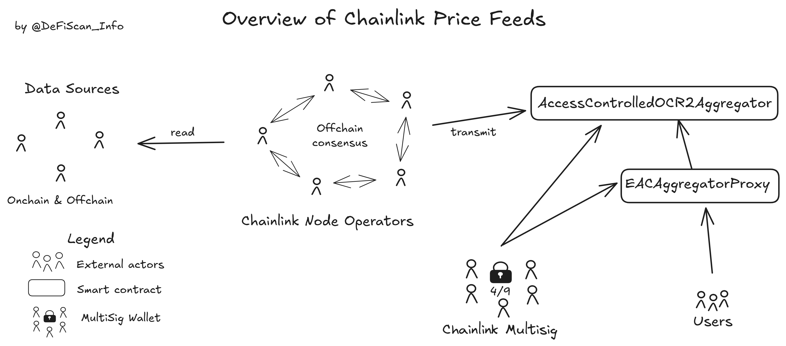

# Summary

Chainlink offers onchain price feeds for a variety of assets, which are broadly used in DeFi.

Chainlink's price feeds aggregate several data sources and publish them onchain using a combination of the Decentralized Data Model and Offchain Reporting. More information on those concepts can be found directly [in their docs](https://docs.chain.link/data-feeds#price-feeds).

This report is a limited assessment of Chainlink's price feeds to assess the centralization of DeFi projects that rely on Chainlink for prices. We therefore limited our investigation to the main centralization vectors that we have found and listed below.

# Protocol Analysis

An overview of the Chainlink price feeds' architecture can be seen below.

The core of the protocol is the aggregator contract (`AccessControlledOCR2Aggregator`) and its proxy (`EACAggregatorProxy`), the _Node Operators_, and the [Chainlink multisig](#security-council).

The Chainlink _Node Operators_ are a set of well-established companies in diverse economic sectors such as Vodafone, Coinbase, and Swisscom. The _Node Operators_ reach a consensus by collaborating offchain using several data sources. Once enough _Node Operators_ agree on a price, one transmitter can send the new price and a sufficient amount of signatures to the `AccessControlledOCR2Aggregator` contract. The entry point for users is the `EACAggregatorProxy`, which will in turn query the `AccessControlledOCR2Aggregator`. Both contracts are under the control of the [Chainlink multisig](#security-council) multisig, which could effectively update which aggregator contract is used by the `EACAggregatorProxy`. This could arbitrarily change the entire logic of the price feeds consumed by users.

# Rating

As mentioned in the [protocol analysis](#protocol-analysis), the [Chainlink multisig](#security-council) has permissions to change the price feeds arbitrarily. This could change the entire logic of the price feeds, disabling further updates or rendering inaccurate data.

Those changes can be made **without delay** and the [Chainlink multisig](#security-council) does not follow the requirements for a _Security Council_.

## Conclusion

Chainlink's oracle protocol exposes critical permissions that are not protected by an _Exit Window_ nor a _Security Council_. This results in a _High_ Centralization score.

> Overall score: High

# Reviewer Notes

This review is limited to Chainlink Oracles deployed on Ethereum mainnet. We note that the findings should generalize to all chains.

# Appendix

## Security Council

The multisig in control of the price feeds and aggregator contracts is a 4/9 multisig controlled by Chainlink. It does not meet our security council requirements.

&nbsp;

| Name               | Account                                                                                                                | Type         | ≥ 7 signers | ≥ 51% threshold | ≥ 50% non-insider | Signers public |
| ------------------ | ---------------------------------------------------------------------------------------------------------------------- | ------------ | ----------- | --------------- | ----------------- | -------------- |
| Chainlink Multisig | [0x21f73D42Eb58Ba49dDB685dc29D3bF5c0f0373CA](https://etherscan.org/address/0x21f73D42Eb58Ba49dDB685dc29D3bF5c0f0373CA) | Multisig 4/9 | ✅          | ❌              | ❌                | ❌             |

## Contracts

We list here an example price feed. All Chainlink price feeds are listed [here](https://docs.chain.link/data-feeds/price-feeds/addresses?page=1&testnetPage=1&network=ethereum).

&nbsp;

| Contract Name                                | Address                                                                                                               |
| -------------------------------------------- | --------------------------------------------------------------------------------------------------------------------- |
| EACAggregatorProxy (1INCH / USD)             | [0x72AFAECF99C9d9C8215fF44C77B94B99C28741e8](https://etherscan.io/address/0x72AFAECF99C9d9C8215fF44C77B94B99C28741e8) |
| AccessControlledOCR2Aggregator (1INCH / USD) | [0x2b16C345E0558458E919E3351C62EcAD57cA7F36](https://etherscan.io/address/0x2b16C345E0558458E919E3351C62EcAD57cA7F36) |

## All Permission Owners

| Name               | Account                                                                                                               | Type         |
| ------------------ | --------------------------------------------------------------------------------------------------------------------- | ------------ |
| Chainlink Multisig | [0x21f73D42Eb58Ba49dDB685dc29D3bF5c0f0373CA](https://etherscan.io/address/0x21f73D42Eb58Ba49dDB685dc29D3bF5c0f0373CA) | Multisig 4/9 |

## Permissions

| Contract                       | Function                     | Impact                                                                                                                                                                                                              | Owner                                                                    |
| ------------------------------ | ---------------------------- | ------------------------------------------------------------------------------------------------------------------------------------------------------------------------------------------------------------------- | ------------------------------------------------------------------------ |
| EACAggregatorProxy             | proposeAggregator            | Proposes a new aggregator. The aggregator needs to be confirmed in an additional transaction. If confirmed the new aggregator will be the reference for prices, effectively upgrading the price feed.               | Chainlink Multisig                                                       |
| EACAggregatorProxy             | confirmAggregator            | Confirms the new aggregator and starts using it for the latest prices. A malicious aggegator contract could manipulat prices.                                                                                       | Chainlink Multisig                                                       |
| EACAggregatorProxy             | transferOwnership            | Transfers ownership over the contract. The new owner would inherit access to all permissioned functions and could update the price feed, including in a malcious fashion. The new owner has to accept the position. | Chainlink Multisig                                                       |
| EACAggregatorProxy             | acceptOwnership              | Called by the new owner to accept the position.                                                                                                                                                                     | pendingOwner                                                             |
| EACAggregatorProxy             | setController                | Sets an access control contract to limit the access to the oracle's prices. There are no access control in place at the time of writing.                                                                            | Chainlink Multisig                                                       |
| AccessControlledOCR2Aggregator | addAccess                    | Adds access to the price feed to a given address. Currently only the `EACAggregatorProxy` and a `FeedRegistry` have access.                                                                                         | Chainlink Multisig                                                       |
| AccessControlledOCR2Aggregator | removeAccess                 | Removes access to the price feed to a given address.                                                                                                                                                                | Chainlink Multisig                                                       |
| AccessControlledOCR2Aggregator | enableAccessCheck            | Enables the access control over the price feeds (restricting the price functions to the addresses in the white list)                                                                                                | Chainlink Multisig                                                       |
| AccessControlledOCR2Aggregator | disableAccessCheck           | Disables access control over the price feeds, anyone could query prices from this contract directly.                                                                                                                | Chainlink Multisig                                                       |
| AccessControlledOCR2Aggregator | transferOwnership            | Transfers ownership over the contract to a new address. The new address need to accept ownership and would inherit all control over the price feed.                                                                 | Chainlink Multisig                                                       |
| AccessControlledOCR2Aggregator | acceptOwnership              | Called by the new owner to accept ownership.                                                                                                                                                                        | pendingOwner                                                             |
| AccessControlledOCR2Aggregator | setConfig                    | Configures the Off-Chain Reporting (OCR) system by setting the oracle network participants (signers, transmitters), fault tolerance threshold, and configuration parameters.                                        | Chainlink Multisig                                                       |
| AccessControlledOCR2Aggregator | setValidatorConfig           | Sets a validator configuration. The validator contract can be used to validate submitted data. No validator contract is in use in the scanned price feed.                                                           | Chainlink Multisig                                                       |
| AccessControlledOCR2Aggregator | setRequesterAccessController | Sets the access controller that determines who can request new price updates.                                                                                                                                       | Chainlink Multisig                                                       |
| AccessControlledOCR2Aggregator | requestNewRound              | Signals to the oracle the need for a price update.                                                                                                                                                                  | Chainlink Multisig, Request Controll (any permissioned address)          |
| AccessControlledOCR2Aggregator | transmit                     | Submits a price update with a list of cryptographic signatures.                                                                                                                                                     | Approved price transmitters                                              |
| AccessControlledOCR2Aggregator | setLinkToken                 | Sets the address of the LINK token. This is used to enable payment from users and to validators.                                                                                                                    | Chainlink Multisig                                                       |
| AccessControlledOCR2Aggregator | setBillingAccessController   | Sets the access controller that determines who can modify billing parameters.                                                                                                                                       | Chainlink Multisig                                                       |
| AccessControlledOCR2Aggregator | setBilling                   | Configures the payment parameters for oracles.                                                                                                                                                                      | Chainlink Multisig, Billing Access Controller (any permissioned account) |
| AccessControlledOCR2Aggregator | withdrawPayment              | Allows an oracle to withdraw their earned LINK tokens.                                                                                                                                                              | Transmitter's payee address                                              |
| AccessControlledOCR2Aggregator | withdrawFunds                | Allows withdrawal of excess LINK tokens from the contract.                                                                                                                                                          | Chainlink Multisig, Billing Access Controller (any permissioned account) |
| AccessControlledOCR2Aggregator | setPayees                    | Sets the payment addresses for oracle transmitters.                                                                                                                                                                 | Chainlink Multisig                                                       |
| AccessControlledOCR2Aggregator | transferPayeeship            | Transfers the payee address of a transmitter, the new payee needs to accept the role.                                                                                                                               | Transmitter's payee address                                              |
| AccessControlledOCR2Aggregator | acceptPayeeship              | Accepts the role of payee for a transmitter.                                                                                                                                                                        | new payee                                                                |
