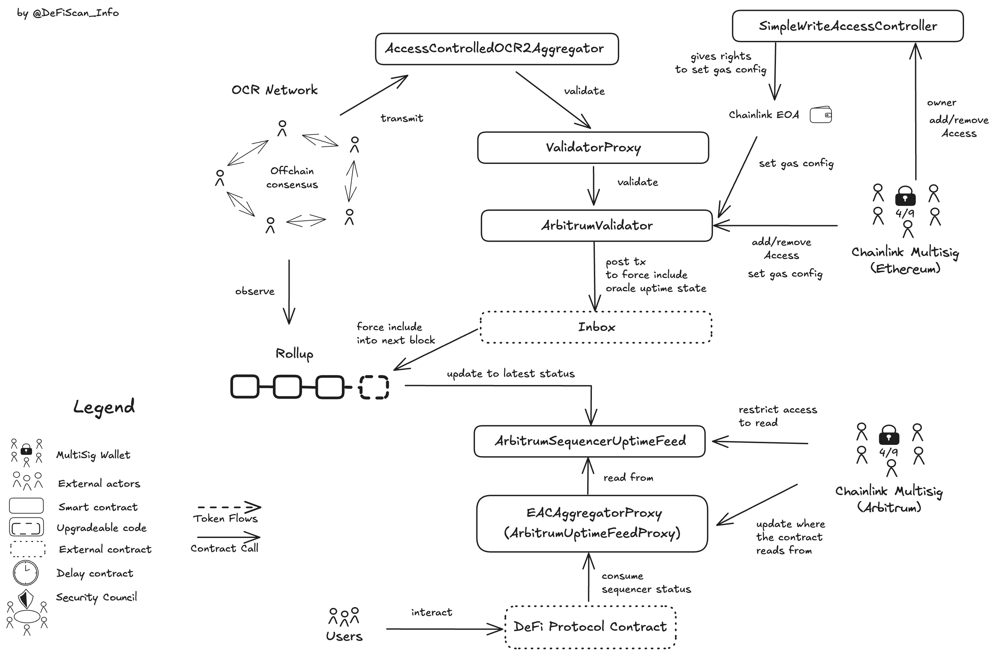

# Summary

Chainlink offers realtime sequencer downtime information with the _L2 Sequencer Uptime Feeds_ contracts on the different L2s.

DeFi protocols on L2s can consume this oracle for functions for which the protocol wants to create fairness for its user base. For example a DeFi protocol could prevent liquidations from happening by requiring that the L2 Sequencer Uptime Feed reports uptime for the respective L2. With that setup, sophisticated users cannot force include liquidation transactions via posting the transaction to the L1 and extract value from non-sophisticated users.

This report is a limited assessment of Chainlink's _L2 Sequencer Uptime Feeds_ to assess the centralization of DeFi projects that rely on Chainlink for sequencer uptime. We therefore limited our investigation to the main centralization vectors that we have found and listed below.

# Protocol Analysis

Chainlink build the oracle contract that reports the sequencer uptime on the L2 by leveraging the force transaction inclusion via the L1.

The Chainlink Oracle network (OCR) reports to sequencer status with messages that are sent to the inbox of the L2 on Ethereum. The inbox of the L2 deployed on Ethereum is the queue where transactions are posted which should be forced into the L2 before native-L2 transactions are processed.

If the sequencer goes down and restarts, it will include a queued transaction reporting the downtime. Consequently, the _L2 Sequencer Uptime Feeds_ contract on the L2 will reflect sequencer downtime for all subsequent forced transactions in the queue being processed. Once all queued transactions are complete and the sequencer is working, the oracle can submit a transaction to update the state, indicating the sequencer is back online

This also means that _L2 Sequencer Uptime Feeds_ is only as good as it manages to be the first in the queue that will be forced into the L2. All transactions that are in the queue before the oracle update, execute with the _L2 Sequencer Uptime Feeds_ reporting _uptime_.

The exact workings and contracts used for this system are dependent on the respective L2 that should be reported on.

An overview of the _L2 Sequencer Uptime Feeds_ architecture can be seen below.

## Arbitrum L2 Sequencer Uptime Feed

The Chainlink OCR oracle network observes the sequencer activity and sends an update every 30s to the inbox of Arbitrum on the L1 by the following process.

1. The OCR network calls the `validate` function on the `ArbitrumValidator` via the `ValidatorProxy` to check the sequencer’s status. The `ArbitrumValidator` compares the current reported status with the previous one and, if a change is detected, sends a message to the Arbitrum Inbox contract.
2. The Inbox forwards this message to the `ArbitrumSequencerUptimeFeed` contract on Arbitrum, which updates the sequencer status (0 if up, 1 if down) and logs the block timestamp from L1.
3. L2 consumer contracts access this status and timestamp via the `ArbitrumUptimeFeedProxy`, which reads data from the `ArbitrumSequencerUptimeFeed`.

The `ArbitrumUptimeFeedProxy` (name in the docs, actual contract name is `EACAggregatorProxy`) is a proxy which currently points to the `ArbitrumSequencerUptimeFeed` contract. Both contracts, `ArbitrumUptimeFeedProxy` and `ArbitrumSequencerUptimeFeed`, are under the control of the [Chainlink multisig](#security-council) multisig. If the proxy starts pointing to a new uptime feed, it could be a malicious or a faulty implementation that reports not the correct sequencer status. This requires the DeFi protocol to implement a grace period that is potentially also configurable because important functions related to liquidations could be permanently blocked, disrupting protocol functionality.

Additionally, the Chainlink EOA on Ethereum can update the gas config (`setGasConfig`) that reported sequencer downtime cannot successfully be pushed onto the L2 because the gas costs are not met by paid gas in the L2 transaction.

Moreover, the Chainlink Multisig can disrupt the oracle from functioning, by removing the permission to post data from the oracle off-chain network. This could also lead to failed oracle, that is unable to push new sequencer states.

# Rating

As mentioned in the [protocol analysis](#protocol-analysis), the [Chainlink multisig on Arbitrum](#security-council) has permissions to change the _L2 Sequencer Uptime Feed_ arbitrarily. This could change the entire logic of the uptime feeds, disabling further updates or rendering inaccurate sequencer status.

Those changes can be made **without delay** and the [Chainlink multisig](#security-council) on Ethereum nor on Arbitrum do not follow the requirements for a _Security Council_.

## Conclusion

Chainlink's _L2 Sequencer Uptime Feed_ exposes critical permissions that are not protected by an _Exit Window_ nor a _Security Council_. This results in a _High_ Centralization score.

> Overall score: High

# Reviewer Notes

This review is currently limited to Chainlink _L2 Sequencer Uptime Feed_ from Ethereum to Arbitrum. The findings should generalize for other L2s.

# Appendix

## Security Council

The multisig in control of the price feeds and aggregator contracts is a 4/9 multisig controlled by Chainlink. It does not meet our security council requirements.

&nbsp;

| Name                          | Account                                                                                                                | Type         | ≥ 7 signers | ≥ 51% threshold | ≥ 50% non-insider | Signers public |
| ----------------------------- | ---------------------------------------------------------------------------------------------------------------------- | ------------ | ----------- | --------------- | ----------------- | -------------- |
| Chainlink Multisig (Arbitrum) | [0x2F3b388EB017613eb51F06843DFEF12Db1fDD3c5 ](https://arbiscan.io/address/0x2F3b388EB017613eb51F06843DFEF12Db1fDD3c5)  | Multisig 4/9 | ✅          | ❌              | ❌                | ❌             |
| Chainlink EOA (Ethereum)      | [0xcc8be80d607f087432541f49bdc5e9545f722356](https://etherscan.io/address/cc8be80d607f087432541f49bdc5e9545f722356)    | EOA          | ❌          | ❌              | ❌                | ❌             |
| Chainlink Multisig (Ethereum) | [0x21f73D42Eb58Ba49dDB685dc29D3bF5c0f0373CA](https://etherscan.org/address/0x21f73D42Eb58Ba49dDB685dc29D3bF5c0f0373CA) | Multisig 4/9 | ✅          | ❌              | ❌                | ❌             |

## Contracts

&nbsp;

| Contract Name                                | Address                                                                                                               |
| -------------------------------------------- | --------------------------------------------------------------------------------------------------------------------- |
| AccessControlledOCR2Aggregator               | [0xAbab7646c0535dF1BeC82D4257c4E1f8df79c625](https://etherscan.io/address/0xAbab7646c0535dF1BeC82D4257c4E1f8df79c625) |
| SimpleWriteAccessController                  | [0x2be843e2a5907fff0b7c9337b5058617bfec2bfe](https://etherscan.io/address/0x2be843e2a5907fff0b7c9337b5058617bfec2bfe) |
| ValidatorProxy                               | [0x7d6e163930a7a66078c1497072404f9bc4841502](https://etherscan.io/address/0x7d6e163930a7a66078c1497072404f9bc4841502) |
| ArbitrumValidator                            | [0x7399c5e6437269b9ff338251b2e88fb363703910](https://etherscan.io/address/0x7399c5e6437269b9ff338251b2e88fb363703910) |
| EACAggregatorProxy (ArbitrumUptimeFeedProxy) | [0xFdB631F5EE196F0ed6FAa767959853A9F217697D](https://arbiscan.io/address/0xFdB631F5EE196F0ed6FAa767959853A9F217697D)  |
| ArbitrumSequencerUptimeFeed                  | [0xC1303BBBaf172C55848D3Cb91606d8E27FF38428](https://arbiscan.io/address/0xC1303BBBaf172C55848D3Cb91606d8E27FF38428)  |

## All Permission Owners

| Name                          | Account                                                                                                               | Type         |
| ----------------------------- | --------------------------------------------------------------------------------------------------------------------- | ------------ |
| Chainlink Multisig (Arbitrum) | [0x2F3b388EB017613eb51F06843DFEF12Db1fDD3c5](https://arbiscan.io/address/0x2F3b388EB017613eb51F06843DFEF12Db1fDD3c5)  | Multisig 4/9 |
| Chainlink EOA (Ethereum)      | [0xcc8be80d607f087432541f49bdc5e9545f722356](https://etherscan.io/address/cc8be80d607f087432541f49bdc5e9545f722356)   | EOA          |
| Chainlink Multisig (Ethereum) | [0x21f73D42Eb58Ba49dDB685dc29D3bF5c0f0373CA](https://etherscan.io/address/0x21f73D42Eb58Ba49dDB685dc29D3bF5c0f0373CA) | Multisig 4/9 |

## Permissions

| Contract                       | Function                     | Impact                                                                                                                                                                                                                                                                                                                                                | Owner                                                                    |
| ------------------------------ | ---------------------------- | ----------------------------------------------------------------------------------------------------------------------------------------------------------------------------------------------------------------------------------------------------------------------------------------------------------------------------------------------------- | ------------------------------------------------------------------------ |
| EACAggregatorProxy             | proposeAggregator            | Proposes a new aggregator (ArbitrumSequencerUptimeFeed is the aggregator). The aggregator needs to be confirmed in an additional transaction. If confirmed the new aggregator will be the reference for reported sequencer uptime, effectively upgrading the sequencer uptime feed.                                                                   | Chainlink Multisig                                                       |
| EACAggregatorProxy             | confirmAggregator            | Confirms the new aggregator and starts using it for the uptime state. A malicious aggegator contract could manipulate report uptime even if the sequencer is down or downtime when the sequencer is up.                                                                                                                                               | Chainlink Multisig                                                       |
| EACAggregatorProxy             | transferOwnership            | Transfers ownership over the contract. The new owner would inherit access to all permissioned functions and could update the uptime feed, including in a malcious fashion. The new owner has to accept the position.                                                                                                                                  | Chainlink Multisig                                                       |
| EACAggregatorProxy             | acceptOwnership              | Called by the new owner to accept the position.                                                                                                                                                                                                                                                                                                       | pendingOwner                                                             |
| EACAggregatorProxy             | setController                | Sets an access control contract to limit the access to the oracle's uptime feed to a listed controller. There are no access control in place at the time of writing.                                                                                                                                                                                  | Chainlink Multisig                                                       |
| ArbitrumSequencerUptimeFeed    | addAccess                    | Adds access to the uptime feed to a given address. The `EACAggregatorProxy` has access.                                                                                                                                                                                                                                                               | Chainlink Multisig                                                       |
| ArbitrumSequencerUptimeFeed    | removeAccess                 | Removes access to the uptime feed to a given address.                                                                                                                                                                                                                                                                                                 | Chainlink Multisig                                                       |
| ArbitrumSequencerUptimeFeed    | enableAccessCheck            | Enables the access control over the uptime feeds (restricting the uptime functions to the addresses in the white list)                                                                                                                                                                                                                                | Chainlink Multisig                                                       |
| ArbitrumSequencerUptimeFeed    | disableAccessCheck           | Disables access control over the uptime feeds, anyone could query prices from this contract directly.                                                                                                                                                                                                                                                 | Chainlink Multisig                                                       |
| ArbitrumSequencerUptimeFeed    | transferOwnership            | Transfers ownership over the contract to a new address. The new address need to accept ownership and would inherit all control over the price feed.                                                                                                                                                                                                   | Chainlink Multisig                                                       |
| ArbitrumSequencerUptimeFeed    | acceptOwnership              | Called by the new owner to accept ownership.                                                                                                                                                                                                                                                                                                          | pendingOwner                                                             |
| ArbitrumSequencerUptimeFeed    | transferL1Sender             | Set the allowed L1 sender for this feed to a new L1 sender. If it is set to the 0-address, the uptime feed is disabled and does not report new statuses and is stuck with the latest update.                                                                                                                                                          | Chainlink Multisig                                                       |
| ArbitrumValidator              | addAccess                    | Calling `addAccess` whitelists addresses to validate. Currently only the ValidatorProxy is allowed to validate the sequencer status. If the owner maliciously or faulty lists an address that pushes false data, DeFi projects relying on Sequencer uptime reporting receive wrong information. DeFi projects need to handle broken oracle contracts. | Chainlink Multisig (Ethereum)                                            |
| ArbitrumValidator              | removeAccess                 | Removes validators from pushing sequencer status updates. If all validators are removed the oracle is not working and no new updates are pushed onchain.                                                                                                                                                                                              | Chainlink Multisig (Ethereum)                                            |
| ArbitrumValidator              | enableAccessCheck            | If this access check is disabled, every account on Ethereum can push status updates, which leads to untrustworthy data being pushed to the oracle on the L2. This should be always enabled.                                                                                                                                                           | Chainlink Multisig (Ethereum)                                            |
| ArbitrumValidator              | disableAccessCheck           | See enableAccessCheck.                                                                                                                                                                                                                                                                                                                                | Chainlink Multisig (Ethereum)                                            |
| ArbitrumValidator              | transferOwnership            | Initiates a transfer of ownership that new owner can change access.                                                                                                                                                                                                                                                                                   | Chainlink Multisig (Ethereum)                                            |
| ArbitrumValidator              | acceptOwnership              | Finalizes the transfer of ownership. The new owner can execute all owned functions.                                                                                                                                                                                                                                                                   | un-assigned                                                              |
| ArbitrumValidator              | withdrawFunds                | Allows to withdraw ETH funds from this contract to the msg.sender.                                                                                                                                                                                                                                                                                    | Chainlink Multisig (Ethereum)                                            |
| ArbitrumValidator              | withdrawFundsTo              | Allows to withdraw ETH funds from this contract to any arbitrary sender.                                                                                                                                                                                                                                                                              | Chainlink Multisig (Ethereum)                                            |
| ArbitrumValidator              | withdrawFundsFromL2          | Allows to withdraw funds from the alias contract on Arbitrum (0x84aac5e6437269b9ff338251b2e88fb363704a21).                                                                                                                                                                                                                                            | Chainlink Multisig (Ethereum)                                            |
| ArbitrumValidator              | setConfigAC                  | The config access control can set gas config and payment strategy. Currently set to SimpleWriteAccessController.                                                                                                                                                                                                                                      | Chainlink Multisig (Ethereum)                                            |
| ArbitrumValidator              | setGasConfig                 | Sets the gas configuration for posting the transaction on to the L2, it includes the max gas to pay. If the max gas fee is insufficient, transactions are not posted onto the L2 and the oracle fails to push the information onto the oracle contract. This can be considered an oracle failure.                                                     | Chainlink Multisig (Ethereum), Chainlink EOA                             |
| ArbitrumValidator              | setPaymentStrategy           | PaymentStrategy strategy describing how the contract pays for xDomain calls on the L1 or on the L2.                                                                                                                                                                                                                                                   | Chainlink Multisig (Ethereum), SimpleWriteAccessController               |
| ArbitrumValidator              | validate                     | This call is used to push a new update on the oracle. If the state (sequencer up or down) did not change, no transaction is forced onto the L2. The L2 oracle feed has thus always the latest state, but is only updated when sequencer state change.                                                                                                 | ValidatorProxy                                                           |
| ValidatorProxy                 | transferOwnership            | This function initiates a transfer of ownership. The owner can update the aggregator or validator contract.                                                                                                                                                                                                                                           | Chainlink Multisig (Ethereum)                                            |
| ValidatorProxy                 | acceptOwnership              | This function concludes the ownership transfer. This function has to be called by the receiving account of the ownership.                                                                                                                                                                                                                             | Not currently assigned                                                   |
| ValidatorProxy                 | validate                     | By calling `validate` the oracle network can push their observations of the sequencer uptime onchain.                                                                                                                                                                                                                                                 | AccessControlledOCR2Aggregator                                           |
| ValidatorProxy                 | proposeNewAggregator         | This initiates a transfer from where the updates are received.                                                                                                                                                                                                                                                                                        | Chainlink Multisig (Ethereum)                                            |
| ValidatorProxy                 | upgradeAggregator            | This function call finalises the transfer from where the updates are received.                                                                                                                                                                                                                                                                        | Chainlink Multisig (Ethereum)                                            |
| ValidatorProxy                 | proposeNewValidator          | This initiates a transfer to where the validation calls should be redirected.                                                                                                                                                                                                                                                                         | Chainlink Multisig (Ethereum)                                            |
| ValidatorProxy                 | upgradeValidator             | This function call finalises the transfer where the validation calls are redirected.                                                                                                                                                                                                                                                                  | Chainlink Multisig (Ethereum)                                            |
| SimpleWriteAccessController    | transferOwnership            | This initiates a transfer of ownership. If the owner is malicious it could lead to temporary downtime of the oracle via setting wrong gas config.                                                                                                                                                                                                     | Chainlink Multisig (Ethereum)                                            |
| SimpleWriteAccessController    | acceptOwnership              | Finalises the transfer of ownership. 2-step transfer prevents assigning ownership to uncontrolled accounts.                                                                                                                                                                                                                                           | Not currently assigned                                                   |
| SimpleWriteAccessController    | addAccess                    | Allow an address to call `ArbitrumValidator` for updating the gas config or payment strategy.                                                                                                                                                                                                                                                         | Chainlink Multisig (Ethereum)                                            |
| SimpleWriteAccessController    | removeAccess                 | Disallow an address to call `ArbitrumValidator` for updating the gas config or payment strategy.                                                                                                                                                                                                                                                      | Chainlink Multisig (Ethereum)                                            |
| SimpleWriteAccessController    | enableAccessCheck            | If check disabled, anyone can update the gas config or the payment strategy on the `ArbitrumValidator`. If disabled, anyone can as long as the access check is disabled, set gas config that makes the oracle fail.                                                                                                                                   | Chainlink Multisig (Ethereum)                                            |
| SimpleWriteAccessController    | disableAccessCheck           | See `enableAccessCheck`.                                                                                                                                                                                                                                                                                                                              | Chainlink Multisig (Ethereum)                                            |
| AccessControlledOCR2Aggregator | addAccess                    | Adds access to the sequencer aggregator contract. Currently only the `EACAggregatorProxy` (0x32EaFC72772821936BCc9b8A32dC394fEFcDBfD9) has access.                                                                                                                                                                                                    | Chainlink Multisig                                                       |
| AccessControlledOCR2Aggregator | removeAccess                 | Removes access to the price feed to a given address.                                                                                                                                                                                                                                                                                                  | Chainlink Multisig                                                       |
| AccessControlledOCR2Aggregator | enableAccessCheck            | Enables the access control over the price feeds (restricting the price functions to the addresses in the white list)                                                                                                                                                                                                                                  | Chainlink Multisig                                                       |
| AccessControlledOCR2Aggregator | disableAccessCheck           | Disables access control over the price feeds, anyone could query prices from this contract directly.                                                                                                                                                                                                                                                  | Chainlink Multisig                                                       |
| AccessControlledOCR2Aggregator | transferOwnership            | Transfers ownership over the contract to a new address. The new address need to accept ownership and would inherit all control over the price feed.                                                                                                                                                                                                   | Chainlink Multisig                                                       |
| AccessControlledOCR2Aggregator | acceptOwnership              | Called by the new owner to accept ownership.                                                                                                                                                                                                                                                                                                          | pendingOwner                                                             |
| AccessControlledOCR2Aggregator | setConfig                    | Configures the Off-Chain Reporting (OCR) system by setting the oracle network participants (signers, transmitters), fault tolerance threshold, and configuration parameters.                                                                                                                                                                          | Chainlink Multisig                                                       |
| AccessControlledOCR2Aggregator | setValidatorConfig           | Sets a validator configuration. The validator contract can be used to validate submitted data. No validator contract is in use in the scanned sequencer uptime feed.                                                                                                                                                                                  | Chainlink Multisig                                                       |
| AccessControlledOCR2Aggregator | setRequesterAccessController | Sets the access controller that determines who can request new sequencer uptime updates.                                                                                                                                                                                                                                                              | Chainlink Multisig                                                       |
| AccessControlledOCR2Aggregator | requestNewRound              | Signals to the oracle the need for a sequencer uptime update.                                                                                                                                                                                                                                                                                         | Chainlink Multisig, Request Controll (any permissioned address)          |
| AccessControlledOCR2Aggregator | transmit                     | Submits a sequencer uptime update with a list of cryptographic signatures.                                                                                                                                                                                                                                                                            | Approved price transmitters                                              |
| AccessControlledOCR2Aggregator | setLinkToken                 | Sets the address of the LINK token. This is used to enable payment from users and to validators.                                                                                                                                                                                                                                                      | Chainlink Multisig                                                       |
| AccessControlledOCR2Aggregator | setBillingAccessController   | Sets the access controller that determines who can modify billing parameters.                                                                                                                                                                                                                                                                         | Chainlink Multisig                                                       |
| AccessControlledOCR2Aggregator | setBilling                   | Configures the payment parameters for oracles.                                                                                                                                                                                                                                                                                                        | Chainlink Multisig, Billing Access Controller (any permissioned account) |
| AccessControlledOCR2Aggregator | withdrawPayment              | Allows an oracle to withdraw their earned LINK tokens.                                                                                                                                                                                                                                                                                                | Transmitter's payee address                                              |
| AccessControlledOCR2Aggregator | withdrawFunds                | Allows withdrawal of excess LINK tokens from the contract.                                                                                                                                                                                                                                                                                            | Chainlink Multisig, Billing Access Controller (any permissioned account) |
| AccessControlledOCR2Aggregator | setPayees                    | Sets the payment addresses for oracle transmitters.                                                                                                                                                                                                                                                                                                   | Chainlink Multisig                                                       |
| AccessControlledOCR2Aggregator | transferPayeeship            | Transfers the payee address of a transmitter, the new payee needs to accept the role.                                                                                                                                                                                                                                                                 | Transmitter's payee address                                              |
| AccessControlledOCR2Aggregator | acceptPayeeship              | Accepts the role of payee for a transmitter.                                                                                                                                                                                                                                                                                                          | new payee                                                                |
