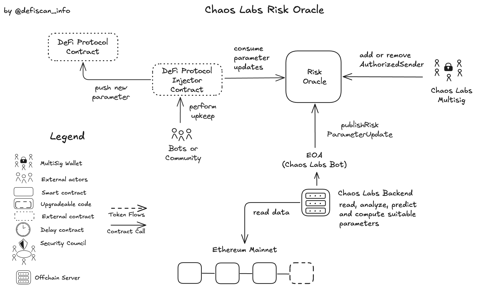

# Summary

Chaos Labs' Risk Oracle, known as the Edge Risk Oracle, is an advanced system designed to automate and optimize risk management for decentralized finance (DeFi) protocols.

The Edge Risk Oracle continuously monitors various risk indicators, such as supply and borrow caps, market volatility, and user behavior patterns, to provide timely adjustments to risk parameters.

By giving permissions to the Risk Oracle as a DeFi protocol, the Risk Oracle can automatically (by using keepers) implement changes to critical parameters like interest rates and liquidation thresholds, reducing the need for manual interventions and governance votes. It is up to the DeFi protocol to implement secure guardrails to prevent malicious or faulty parameter updates.

# Protocol Analysis

The `RiskOracle` smart contract allows _authorized senders_ to publish and _update_ risk parameters, which then can be consumed by other smart contracts or off-chain systems. The only authorized sender at the moment is the EOA which we call [Chaos Labs Bot](#security-council). This EOA can push any updates to the `RiskOracle` contract.

The `RiskOracle` contract includes the functions `publishRiskParameterUpdate` and `publishBulkRiskParameterUpdates` to facilitate these updates to parameters. The list of authorized senders can be expanded and reduced by using the functions `addAuthorizedSender` and `removeAuthorizedSender` by [Chaos Labs multisig](#security-council).

Neither the EOA to update parameters nor the Chaos Labs Multisig Account do satisfy our [security council requirements](/learn-more#security-council-requirements).

# Rating

As mentioned in the [protocol analysis](#protocol-analysis), the [Chaos Labs Bot](#security-council) has permissions to change the parameters arbitrarily. This could be used to trigger liquidations in lending protocols like Aave.

Those changes can be made **without delay** and the [Chaos Labs Bot](#security-council) does not follow the requirements for a _security council_.

## Conclusion

Chaos Labs's risk oracle protocol exposes critical permissions that are not protected by an _Exit Window_ nor a _Security Council_. This results in a **High Centralization score**, equivalent to _Stage 0_, as a dependency.

> Overall score: High

# Reviewer Notes

This review is limited to the Chaos Labs `RiskOracle` deployed on Ethereum mainnet. It is used by Aave Prime and Aave EtherFi.

# Appendix

## Security Council

| Name                  | Account                                                                                                               | Type         | ≥ 7 signers | ≥ 51% threshold | ≥ 50% non-insider | Signers public |
| --------------------- | --------------------------------------------------------------------------------------------------------------------- | ------------ | ----------- | --------------- | ----------------- | -------------- |
| Chaos Labs' Multi-sig | [0x2400ad77C8aCCb958b824185897db9B9DD771830](https://etherscan.io/address/0x2400ad77C8aCCb958b824185897db9B9DD771830) | Multisig 3/6 | ❌          | ❌              | ✅                | ❌             |

## Contracts

| Contract Name | Address                                                                                                               |
| ------------- | --------------------------------------------------------------------------------------------------------------------- |
| RiskOracle    | [0x7ABB46C690C52E919687D19ebF89C81A6136C1F2](https://etherscan.io/address/0x7ABB46C690C52E919687D19ebF89C81A6136C1F2) |

## All Permission Owners

| Name                 | Account                                                                                                               | Type         |
| -------------------- | --------------------------------------------------------------------------------------------------------------------- | ------------ |
| Chaos Labs Multi-sig | [0x2400ad77C8aCCb958b824185897db9B9DD771830](https://etherscan.io/address/0x2400ad77C8aCCb958b824185897db9B9DD771830) | Multisig 3/6 |
| Chaos Labs Bot       | [0x42939e82DF15afc586bb95f7dD69Afb6Dc24A6f9](https://etherscan.io/address/0x42939e82DF15afc586bb95f7dD69Afb6Dc24A6f9) | EOA          |

## Permissions

| Contract   | Function                        | Impact                                                                                                                                                                                                                                                                                                                                                        | Owner                |
| ---------- | ------------------------------- | ------------------------------------------------------------------------------------------------------------------------------------------------------------------------------------------------------------------------------------------------------------------------------------------------------------------------------------------------------------- | -------------------- |
| RiskOracle | renounceOwnership               | The owner can update the list of authorized senders. If the ownership is transferred/revoked, further changes to the authorized senders is not possible. If the list was empty, the oracle is useless, otherwise the `RISK_ADMIN` role has to be revoked from the `EdgeRiskSteward` to prevent the remaining senders (if untrusted) to send untrusted prices. | Chaos Labs Multi-sig |
| RiskOracle | transferOwnership               | The owner can update the list of authorized senders. If the new owner is unstrusted, the `RISK_ADMIN` role has to be revoked from the `EdgeRiskSteward` to prevent untrusted prices.                                                                                                                                                                          | Chaos Labs Multi-sig |
| RiskOracle | addAuthorizedSender             | Authorized senders can call `publishRiskParameterUpdate` and `publishBulkRiskParameterUpdates` and push updates to the oracle contract. This function allows to add authorized senders. Mis-use can happen if an untrusted authorized sender was added. The impact is small, since the EdgeRiskSteward has guardrails on the updates.                         | Chaos Labs Multi-sig |
| RiskOracle | removeAuthorizedSender          | This function removes authorized senders that can call `publishRiskParameterUpdate` and `publishBulkRiskParameterUpdates`. If there is none left, the parameters cannot be updated through this contract. The Aave governance can update parameters itself directly, so no real impact.                                                                       | Chaos Labs Multi-sig |
| RiskOracle | addUpdateType                   | This function allows to support new parameter types to be supported.                                                                                                                                                                                                                                                                                          | Chaos Labs Multi-sig |
| RiskOracle | publishRiskParameterUpdate      | Allows to update the parameters in the oracle contract. This parameter data is the _oracle data_ for the `EdgeRiskSteward`.                                                                                                                                                                                                                                   | Chaos Labs Bot       |
| RiskOracle | publishBulkRiskParameterUpdates | Unlike `publishRiskParameterUpdate` this function allows to update multiple parameters at once.                                                                                                                                                                                                                                                               | Chaos Labs Bot       |
