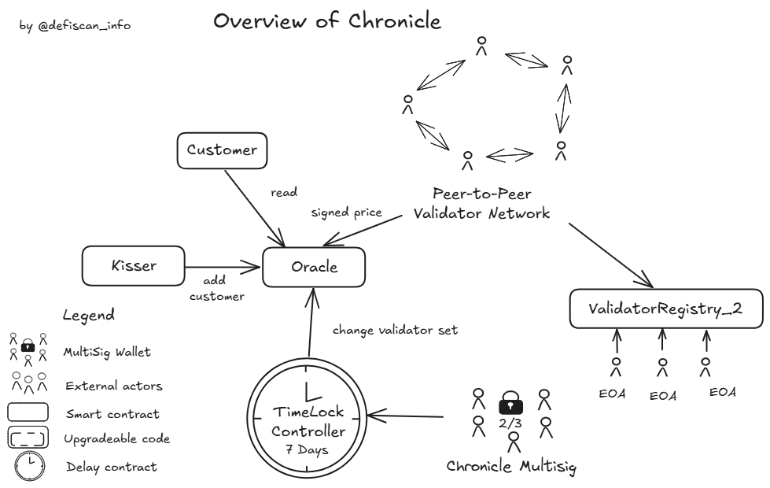

# Summary

Chronicle Labs is an oracle protocol that computes a median price from multiple sources. The protocol contains validators who push new prices and challengers who enforce cryptographic verification. Becoming a validator is a permissioned process; a majority of the validators in place are held by third-party entities in the Ethereum ecosystem.

The validators in the protocols are hosted by various third parties such as (but not limited to) Nethermind, Gnosis, Bitcoin Suisse, DeFi Saver, ETHGlobal, Gitcoin, and Etherscan. About 11 validators are listed without officially representing an entity (address only), out of 25 total. The validators collaborate in a peer-to-peer fashion, and the final signature is pushed onchain and verifiable.

Each price feed (oracle) is its own smart contract, which holds the corresponding validator set. A `ValidatorRegistry_2` exists to be used as a certificate authority and proves that each validator knows the private key to their claimed public key.

# Protocol Analysis

An overview of the Chronicle protocol can be seen below.

The core of the protocol is the oracle contracts, the validators, and the `ValidatorRegistry_2`.

Each oracle has its own validator set (a subset of all the validators). This set can be changed by a `TimelockController`, which is owned by the [Chronicle multisig](#security-council). A `Kisser` contract holds similar admin permissions over the oracles but is, by design, restricted to only being able to add new customers.

There is a single `TimelockController` per chain with admin permissions on all oracles. The delay is therefore the same for each oracle: 7 days. According to the documentation (but not strictly verified), the same delay is enforced on each chain where Chronicle is deployed.

The `ValidatorRegistry_2` does _not_ directly affect the validators whitelisted (_lifted_) on the oracles. It is used to publicly prove that each validator knows the private key to their claimed public key. This prevents rogue key attacks in which a validator claims their public key is the sum of other public keys and thereby signs for multiple other validators at once.

# Rating

As mentioned in the [protocol analysis](#protocol-analysis), the [Chronicle multisig](#security-council) has permissions to change each oracle's validator set. Changing the validator set could put the system at risk of controlled prices, which could lead to the loss of user funds in protocols that rely on ChronicleLabs' oracles. Any changes in an oracle's validator set are subject to a **7-day exit window**.

Finally, 3 _Externally Owned Accounts_ (EOAs) can add or remove validator public keys to the `ValidatorRegistry_2` without delay. Updating the registry in a malicious fashion does not weaken the assumptions on the possibility of price manipulation, as the validators perform all cryptographic actions based on the oracle contracts. Update or addition of a public key in the registry must come with a valid signature. The registry only improves the guarantees of the protocol by attesting that each validator owns their key, and this key is a single key (not a sum of keys). Moreover, it allows potential DoS mitigations on the peer-to-peer network by filtering messages based on recovered signers.

Oracles and validators are listed on ChronicleLabs' [public dashboard](https://chroniclelabs.org/dashboard). This allows anyone to verify the data cryptographically. The dashboard is not open-source, but this does not prevent the monitoring of the onchain activity from the side of projects using ChronicleLabs' oracles.

## Conclusion

ChronicleLabs' protocol exposes centralized permissions on the oracles' validator set, which are protected with a 7-day _Exit Window_. The protocol relies on third-party entities that collaborate offchain in a peer-to-peer fashion to produce a verifiable price onchain. The global list of validators contains 25 entities, including 14 publicly known in the Ethereum ecosystem. We believe that this brings the Chronicle protocol to a **Medium Centralization**, equivalent to _Stage 1_, as a dependency.

> Overall score: Medium

# Revier Notes

This review is limited to Chornicle Oracles deployed on Ethereum mainnet. We note that the findings should generalize to all chains according to Chronicle's documentation.

# Appendix

## Security Council

The multisig in charge of the `TimelockController` is a 2/3 multisig belonging to chronicle. It does not meet our security council requirements.

| Name               | Account                                                                                                                | Type         | ≥ 7 signers | ≥ 51% threshold | ≥ 50% non-insider | Signers public |
| ------------------ | ---------------------------------------------------------------------------------------------------------------------- | ------------ | ----------- | --------------- | ----------------- | -------------- |
| Chronicle Multisig | [0xC8910D85511dfe915630bfccB6bF98973e67F827](https://etherscan.org/address/0xC8910D85511dfe915630bfccB6bF98973e67F827) | Multisig 2/3 | ❌          | ✅              | ❌                | ❌             |

## Contracts

At the time of writing there are 26 public oracles curated by Chronicle Labs deployed on Ethereum Mainnet.

| Contract Name                | Address                                                                                                               |
| ---------------------------- | --------------------------------------------------------------------------------------------------------------------- |
| ValidatorRegistry_2          | [0xd7825f22d61e09fffdf49213051044e57e1d0b8d](https://etherscan.io/address/0xd7825f22d61e09fffdf49213051044e57e1d0b8d) |
| TimelockController           | [0x40c33e796be78148cec983c2202335a0962d172a](https://etherscan.io/address/0x40c33e796be78148cec983c2202335a0962d172a) |
| Chronicle Name               | Etherscan Link                                                                                                        |
| Chronicle_BTC_USD_3          | [0x24C392CDbF32Cf911B258981a66d5541d85269ce](https://etherscan.io/address/0x24C392CDbF32Cf911B258981a66d5541d85269ce) |
| Chronicle_CBBTC_USDC_1       | [0x3131E6a68BFb42976Ef574AF042f67d322098747](https://etherscan.io/address/0x3131E6a68BFb42976Ef574AF042f67d322098747) |
| Chronicle_EBTCbadger_ETH_1   | [0xEB656424e16a8092592a74e6CD93cFd212204495](https://etherscan.io/address/0xEB656424e16a8092592a74e6CD93cFd212204495) |
| Chronicle_ETH_USD_3          | [0x46ef0071b1E2fF6B42d36e5A177EA43Ae5917f4E](https://etherscan.io/address/0x46ef0071b1E2fF6B42d36e5A177EA43Ae5917f4E) |
| Chronicle_FBTC_USD_1         | [0x101ADfaf85890A000DEdea24d01Aa4a10E3709ad](https://etherscan.io/address/0x101ADfaf85890A000DEdea24d01Aa4a10E3709ad) |
| Chronicle_LIDO_LST_2DAYS_1   | [0x08669C836F41AEaD03e3EF81a59f3b8e72EC417A](https://etherscan.io/address/0x08669C836F41AEaD03e3EF81a59f3b8e72EC417A) |
| Chronicle_MKR_USD_3          | [0xa69e234a1f55072201127209a18230E89d9E71aC](https://etherscan.io/address/0xa69e234a1f55072201127209a18230E89d9E71aC) |
| Chronicle_MOG_USD_1          | [0xFE7f9Ece94500d6381bA1BB0afd77577d6834C0C](https://etherscan.io/address/0xFE7f9Ece94500d6381bA1BB0afd77577d6834C0C) |
| Chronicle_PEPE_USD_1         | [0x496C851B2A9567DfEeE0ACBf04365F3ba00Eb8dC](https://etherscan.io/address/0x496C851B2A9567DfEeE0ACBf04365F3ba00Eb8dC) |
| Chronicle_PXETH_USD_1        | [0x74a31431054cFa5EE82576df8D374916C169190B](https://etherscan.io/address/0x74a31431054cFa5EE82576df8D374916C169190B) |
| Chronicle_RUSD_USD_1         | [0xE7A6E74d1654B98E9d3DDb003B645E0d7c82C935](https://etherscan.io/address/0xE7A6E74d1654B98E9d3DDb003B645E0d7c82C935) |
| Chronicle_SKY_USD_2          | [0xc2ffbbDCCF1466Eb8968a846179191cb881eCdff](https://etherscan.io/address/0xc2ffbbDCCF1466Eb8968a846179191cb881eCdff) |
| Chronicle_SRUSD_USD_1        | [0x277F78F39b9Dc73dF3723BAcD40f8658f8a1A633](https://etherscan.io/address/0x277F78F39b9Dc73dF3723BAcD40f8658f8a1A633) |
| Chronicle_STETH_BTC_1        | [0x02238BB0085395ae52cd4755456891Fc2fd5934D](https://etherscan.io/address/0x02238BB0085395ae52cd4755456891Fc2fd5934D) |
| Chronicle_STONE_ETH_1        | [0x057f30e63A69175C69A4Af5656b8C9EE647De3D0](https://etherscan.io/address/0x057f30e63A69175C69A4Af5656b8C9EE647De3D0) |
| Chronicle_SUSDS_USD_1        | [0x496470F4835186bF118545Bd76889F123D608E84](https://etherscan.io/address/0x496470F4835186bF118545Bd76889F123D608E84) |
| Chronicle_USD0PLUSPLUS_USD_1 | [0x247b64e37cb3014566422D778b3aC7747e9C8194](https://etherscan.io/address/0x247b64e37cb3014566422D778b3aC7747e9C8194) |
| Chronicle_USDC_USD_1         | [0xCe701340261a3dc3541C5f8A6d2bE689381C8fCC](https://etherscan.io/address/0xCe701340261a3dc3541C5f8A6d2bE689381C8fCC) |
| Chronicle_USDS_USD_1         | [0x74661a9ea74fD04975c6eBc6B155Abf8f885636c](https://etherscan.io/address/0x74661a9ea74fD04975c6eBc6B155Abf8f885636c) |
| Chronicle_USDT_USD_1         | [0x7084a627a22b2de99E18733DC5aAF40993FA405C](https://etherscan.io/address/0x7084a627a22b2de99E18733DC5aAF40993FA405C) |
| Chronicle_USR_USD_1          | [0xd02d70Dd1E495f1D9245D97bFd93259fe8C81FF4](https://etherscan.io/address/0xd02d70Dd1E495f1D9245D97bFd93259fe8C81FF4) |
| Chronicle_WBTC_USD_1         | [0x286204401e0C1E63043E95a8DE93236B735d4BF2](https://etherscan.io/address/0x286204401e0C1E63043E95a8DE93236B735d4BF2) |
| Chronicle_WEETH_USD_1        | [0x6a906372cA06523bA7FeaeDab18Ab8B665CaeD71](https://etherscan.io/address/0x6a906372cA06523bA7FeaeDab18Ab8B665CaeD71) |
| Chronicle_WETH_USD_1         | [0xb074EEE1F1e66650DA49A4d96e255c8337A272a9](https://etherscan.io/address/0xb074EEE1F1e66650DA49A4d96e255c8337A272a9) |
| Chronicle_WSRUSD_USD_1       | [0x0b4Cb11faC24707F3F0F89E441A4Cdf6EF01d215](https://etherscan.io/address/0x0b4Cb11faC24707F3F0F89E441A4Cdf6EF01d215) |
| Chronicle_WSTETH_USD_3       | [0xA770582353b573CbfdCC948751750EeB3Ccf23CF](https://etherscan.io/address/0xA770582353b573CbfdCC948751750EeB3Ccf23CF) |

## All Permission Owners

| Name               | Account                                                                                                                 | Type         |
| ------------------ | ----------------------------------------------------------------------------------------------------------------------- | ------------ |
| Chronicle Multisig | [0xc8910d85511dfe915630bfccb6bf98973e67f827](https://etherscan.io/address/0xc8910d85511dfe915630bfccb6bf98973e67f827)   | Multisig 2/3 |
| Undeclared EOA     | [0x74258a92611e029b748f79c50024dd851339db15](https://etherscan.io/address/0x0x74258a92611e029b748f79c50024dd851339db15) | EOA          |
| Undeclared EOA     | [0x39abd7819e5632fa06d2ecbba45dca5c90687ee3](https://etherscan.io/address/0x0x39abd7819e5632fa06d2ecbba45dca5c90687ee3) | EOA          |
| Undeclared EOA     | [0xc50dfedb7e93ef7a3daccad7987d0960c4e2cd4b](https://etherscan.io/address/0xc50dfedb7e93ef7a3daccad7987d0960c4e2cd4b)   | EOA          |

## Permissions

| Contract                      | Function              | Impact                                                                                                                                                                                                                                                                                          | Owner                                 |
| ----------------------------- | --------------------- | ----------------------------------------------------------------------------------------------------------------------------------------------------------------------------------------------------------------------------------------------------------------------------------------------- | ------------------------------------- |
| ValidatorRegistry_2           | lift                  | Registers a validator's public key and signature in the registry.                                                                                                                                                                                                                               | Undeclared EOAs                       |
| ValidatorRegistry_2           | drop                  | Deletes a validator from the registry.                                                                                                                                                                                                                                                          | Undeclared EOAs                       |
| ValidatorRegistry_2           | rely                  | Grants admin privileges over the contract. Admins can `lift` and `drop` validators.                                                                                                                                                                                                             | Undeclared EOAs                       |
| ValidatorRegistry_2           | deny                  | Revokes admin privileges over the contract.                                                                                                                                                                                                                                                     | Undeclared EOAs                       |
| ChronicleTimelockController_1 | schedule              | Schedules a transaction to be executed. This can be anything the contract is permissioned to do in oracles and other contracts. This can only be executed once the delay of 7 days has passed.                                                                                                  | Chronicle Multisig                    |
| ChronicleTimelockController_1 | scheduleBatch         | Similarly to schedule but for a batch of transaction. This can only be executed once the delay of 7 days has passed.                                                                                                                                                                            | Chronicle Multisig                    |
| ChronicleTimelockController_1 | cancel                | Cancels a pending transaction.                                                                                                                                                                                                                                                                  | Chronicle Multisig                    |
| ChronicleTimelockController_1 | grantRole             | Grants a role to an address within the contract. Roles may give the right to propose, execute, or cancel transactions. Execution is permisionless unless the role is given to any address in the future.                                                                                        | ChronicleTimelockController_1         |
| ChronicleTimelockController_1 | revokeRole            | Revokes a role to a given address.                                                                                                                                                                                                                                                              | ChronicleTimelockController_1         |
| Chronicle\*BTC_USD_3          | opPoke                | Sends an optimistic poke (price update). The price if opimistically considered valid unless a challenge is sent within the challenge period. Anyone can challenge a price and enforce the cryptographic verification in the contract. Succesful challenges are financially rewarded with `ETH`. | Contract-specific Approved Feeds      |
| Chronicle_BTC_USD_3           | setOpChallengePeriod  | Sets the period during which users can challenge a price. Once the period has passed the \_poke\* is irreversibly accepted.                                                                                                                                                                     | ChronicleTimelockController_1, Kisser |
| Chronicle_BTC_USD_3           | setMaxChallengeReward | Sets the maximum reward sent out to challengers. In practice the reward is the minimum of the balance contract and the maximum reward amount.                                                                                                                                                   | ChronicleTimelockController_1, Kisser |
| Chronicle_BTC_USD_3           | lift                  | Adds the public key of a validator to the validator set (list of approved feeds).                                                                                                                                                                                                               | ChronicleTimelockController_1, Kisser |
| Chronicle_BTC_USD_3           | drop                  | Removes a validator from the set.                                                                                                                                                                                                                                                               | ChronicleTimelockController_1, Kisser |
| Chronicle_BTC_USD_3           | setBar                | Sets the bar. The bar is a value used to limit the lenght of the list of participating validator IDs. This limits the size of the data pushed onchain and ensures it remains financially sustainable to challenge a value pushed.                                                               | ChronicleTimelockController_1, Kisser |
| Chronicle_BTC_USD_3           | kiss                  | Kisses a customer and grants it read-access to the oracle.                                                                                                                                                                                                                                      | ChronicleTimelockController_1, Kisser |
| Chronicle_BTC_USD_3           | diss                  | Removes a customer's read-access.                                                                                                                                                                                                                                                               | ChronicleTimelockController_1, Kisser |
| Chronicle_BTC_USD_3           | rely                  | Grants admin privileges over the contract. Admins can set challenge rewards, tolls, add customers, and change the validator set. Maliciously changing the validator set could lead to price manipulation and to loss of funds in customer projects.                                             | ChronicleTimelockController_1, Kisser |
| Chronicle_BTC_USD_3           | deny                  | Revokes admin privileges over the contract.                                                                                                                                                                                                                                                     | ChronicleTimelockController_1, Kisser |
