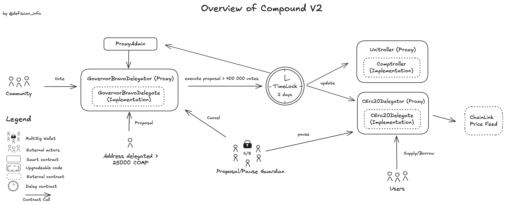

# Summary

**Compound v2** is a lending protocol where each market accepts one “base” asset (e.g. USDC, DAI, ETH via cETH, WBTC, BAT, REP, ZRX) as liquidity. Users can deposit that base asset to earn interest, or supply other supported assets as collateral to borrow it. Every base-asset market runs in its own isolated instance, with its own price oracle, interest-rate model, reserves and risk parameters.

# Ratings

## Chain

Compound-v2 is deployed on various chains. This review is based on the Ethereum mainnet deployment.

> Chain score: Low

## Upgradeability

The Compound-v2 protocol is almost fully upgradeable allowing for the update of governance and markets logic, with implementation contracts such as `CErc20Delegate`, `Comptroller` and `GovernorBravoDelegate` . This can result in the loss of funds or unclaimed yield as well as lead to other changes in the expected performance of the protocol.

Few markets use CErc20 or CEther contract (no “Delegator”) which are fixed implementation: once deployed, their logic (code) cannot be changed by the Timelock (DAO).

Compound retains privileged control over key protocol parameters (such as choosing the interest rate model per asset).

Most Compound v2 markets are governed by an upgradable proxy pointing to a shared CToken implementation. The proxy’s admin, a Timelock contract under DAO control, retains the exclusive right to swap in a new implementation, tweak interest-rate models, and withdraw accumulated reserves. This means that a sufficiently powerful proposal could install a rate model that sets borrowing costs to extremes or redirect reserves out of the protocol, underscoring that market behavior ultimately hinges on a small set of privileged permissions rather than on immutable code alone.

Compound v2 currently relies on a non-upgradeable oracle contract to deliver price feeds via Chainlink. While the contract itself cannot be upgraded, its configuration is governed by the Compound community multisig with broad administrative powers: it can change the Chainlink price feed source, add or remove asset markets, or set a fixed fallback price for individual tokens.

Governance itself is upgradeable: **`GovernorBravoDelegator`** proxy points to a delegate contract whose admin may be rotated via a two-step handover (`setPendingAdmin` → `acceptAdmin`). COMP holders propose and vote on code changes, but a short review and timelock window (two days queue, two days delay) means that, once passed, any proposal can swiftly reassign all protocol-level privileges. While this model allows the community to evolve who holds those keys—potentially handing control from a multisig to a pure on-chain DAO—it also concentrates ultimate authority in whichever admin address the governance process currently recognizes.

> Upgradeability score: High

## Autonomy

The compound-v2 protocol relies on Chainlink price feeds to price collateral and base assets in the system. The protocol does not validate asset prices returned by Chainlink or offer a valid fallback oracle mechanism.

**`PiceOracle`** fetches prices from Chainlink Price Feeds when requested for a specific cToken.

The Chainlink oracle system itself is upgradeable without decentralized ownership over those permissions. This dependency thus introduces centralization risk in the Compound-v2 protocol.

> Autonomy score: High

## Exit Window

Permissions, including protocol upgrades, are controlled by an onchain governance system. `COMP` holders are able to create new proposals (requires 25,000 `COMP`) and vote on proposals (at least 400,000 votes are required for a valid proposal). A minimum voting period of 3 days is enforced as well as a delay of 2 days for the implementation of successful proposals.

While this does not meet the 7-day exit window requirement, malicious or unintended proposals can be intercepted by the `ProposalGuardian` multisig account.

However, both the `ProposalGuardian` and the `PauseGuardian` multisig accounts do not meet the Security Council requirements ([see below](#security-council)).

> Exit Window score: High

## Accessibility

The original Compound V2 interface ( [app.compound.finance](https://app.compound.finance/?market=usdc-mainnet) ) is fully open-source; anyone can clone the repo, swap the public Graph endpoint (or run their own sub-graph) and launch a local or IPFS-hosted copy in a few minutes. In practice, users aren’t limited to this front-end: Compound V2 positions can be opened, closed, or managed from a wide list of third-party dashboards and wallets (DeFi Saver, Instadapp, Zapper, Zerion, Debank, Etherscan’s “Write” tab, Ledger + MetaMask, etc.). Because there are multiple**,** independentways to reach the contracts even if the official website and its default sub-graph go offline, user funds remain accessible.

> Accessibility score: Low

## Conclusion

The Compound-v2 Ethereum mainnet protocol achieves High centralization risk scores for its *Upgradeability*, *Autonomy* and *Exit Window* dimensions. It thus ranks Stage 0.

The protocol could reach Stage 1 by 1) adopting a *Security Council* setup for the `ProposalGuardian` and `PauseGuardian` multisig accounts, and 2) implementing validity checks and a valid fallback mechanism around the Chainlink oracle (or Chainlink adopting a *Security Council* setup for its own multisig account).

> Overall score: Stage 0

# Reviewer's Notes

There aren’t critical permissions or upgrade paths in Compound V2 that we’ve excluded from scope, everything that can materially affect market behavior (listings, rate models, reserves, oracle feeds, governance logic) sits behind the Timelock or designated guardian roles.

# Protocol Analysis

Below is an overview of the contracts from the Compound V2 protocol.

The CErc20Delegator is the proxy layer for ERC-20 markets in Compound v2. Each market is defined by it's own proxy contract. It holds all the market’s storage (balances, allowances, reserves, etc.) and forwards calls to a shared CErc20Delegate implementation. Its admin (the Timelock) can swap out that implementation to upgrade market logic without redeploying each market or migrating user funds.

The Comptroller is the risk management layer of the Compound protocol; it determines how much collateral a user is required to maintain, and whether (and by how much) a user can be liquidated. Each time a user interacts with a cToken, the Comptroller is asked to approve or deny the transaction. The Comptroller maps user balances to prices (via the Price Oracle) to risk weights (called Collateral Factors) to make its determinations.

# Dependencies

The compound-v2 protocol relies on a Chainlink oracle feed to price collateral and base assets in the system. It doesn’t have a full secondary oracle feed or liveness checks, but its **`PriceOracle`** contract does include a minimal “fallback” feature: if an administrator has set a fixedPrice for a given asset, then getUnderlyingPrice will return this hard-coded price in case of error on the primary price source. This allows the protocol to continue operating with a sane collateral price if the main feed is down or misbehaving, preventing total system paralysis.

So the protocol does not validate asset prices returned by Chainlink or offer a valid fallback oracle mechanism.

**`PiceOracle`** fetches prices from Chainlink Price Feeds when requested for a specific cToken.

The Chainlink oracle system itself is upgradeable potentially resulting in the publishing of unintended or malicious prices. The permissions to upgrade are controlled by a [multisig account](https://etherscan.io/address/0x21f73D42Eb58Ba49dDB685dc29D3bF5c0f0373CA) with a 4-of-9 signers threshold. This multisig account is listed in the Chainlink docs but signers are not publicly announced. The Chainlink multisig thus does not suffice the Security Council requirements specified by either L2Beat or DeFiScan resulting in a High centralization score.

For more information about the Chainlink price feed, see the corresponding review [here](https://www.defiscan.info/protocols/chainlink-oracles).

The [Compound community multisig](https://etherscan.io/address/0xbbf3f1421d886e9b2c5d716b5192ac998af2012c) has the ability to update the configs on the Price Feed. The multisig has the flexibility toupdate price feed, add / remove markets or fixed price for market.

# Governance

## Relevant Subsection

The Compound protocol is governed and upgraded by COMP token-holders, using three distinct components; the COMP token, governance module (Governor Bravo), and Timelock. Together, these contracts allow the community to propose, vote, and implement changes through the administrative functions of a cToken or the Comptroller. Proposals can modify system parameters, support new markets, or add entirely new functionality to the protocol.

COMP token-holders can delegate their voting rights to themselves, or an address of their choice.

Governor Bravo is the governance module of the protocol; it allows addresses with more than 25,000 COMP to propose changes to the protocol; any address can lock 100 COMP to create an Autonomous Proposal, which becomes a governance proposal after being delegated 25,000 COMP .The minimum number of votes required for an account to create a proposal is set via `proposalThreshold`. This can be changed through governance.

When a governance proposal is created, it enters a 2 day review period, after which voting weights are recorded and voting begins. Voting lasts for 3 days, addresses that held voting weight, at the start of the proposal, invoked through the `getpriorvotes` function, can submit their votes. if a majority, and at least 400,000 votes are cast for the proposal, it is queued in the Timelock, and can be implemented 2 days later. In total, any change to the protocol takes at least one week.

[Source](https://docs.compound.finance/v2/governance/)

## Security Council {#security-council}

A security council called `Pause Guardian` has the power to pause all deposits, withdrawals, and transfers in the protocol. The guardian is currently a 4/8 multisig made oGovernorBravoDelegate. The signers announced [on the governance forum](https://www.comp.xyz/t/community-multisig-4-of-6-deployment/134/18) match the current [signers set](https://etherscan.io/address/0xbbf3f1421D886E9b2c5D716B5192aC998af2012c#readProxyContract#F9) and are related to a pseudonym . The same multisig is also `Proposal Guardian` and has the power to cancel Governance Proposals before their executions.

| Name | Account | Type | ≥ 7 signers | ≥ 51% threshold | ≥ 50% non-insider | Signers public |
|-----------|-----------|-----------|-----------|-----------|-----------|-----------|
| Pause Guardian | [0xbbf3f1421D886E9b2c5D716B5192aC998af2012c](https://etherscan.io/address/0xbbf3f1421D886E9b2c5D716B5192aC998af2012c) | Multisig 4/8 | ✅ | ❌ | ❌ | ✅ |
| Proposal Guardian | [0xbbf3f1421D886E9b2c5D716B5192aC998af2012c](https://etherscan.io/address/0xbbf3f1421D886E9b2c5D716B5192aC998af2012c) | Multisig 4/8 | ✅ | ❌ | ❌ | ✅ |

# Contracts & Permissions

## Contracts

| Contract Name | Address |
|------------------------------------|------------------------------------|
| Comp (Token) | [0xc00e94Cb662C3520282E6f5717214004A7f26888](https://etherscan.io/address/0xc00e94Cb662C3520282E6f5717214004A7f26888) |
| CErc20Delegator (Proxy) (Fei market) | [0x7713DD9Ca933848F6819F38B8352D9A15EA73F67](https://etherscan.io/address/0x7713DD9Ca933848F6819F38B8352D9A15EA73F67) |
| CErc20Delegate (Implementation for all CErc20Delegator) | [0x3363bae2fc44da742df13cd3ee94b6bb868ea376](https://etherscan.io/address/0x3363bae2fc44da742df13cd3ee94b6bb868ea376) |
| CErc20Delegator (Proxy) (USDP market) | [0x041171993284df560249b57358f931d9eb7b925d](https://etherscan.io/address/0x041171993284df560249b57358f931d9eb7b925d) |
| CErc20Delegator (Proxy) (Aave market) | [0xe65cdb6479bac1e22340e4e755fae7e509ecd06c](https://etherscan.io/address/0xe65cdb6479bac1e22340e4e755fae7e509ecd06c) |
| CErc20Delegator (Proxy) (Sushi market) | [0x4b0181102a0112a2ef11abee5563bb4a3176c9d7](https://etherscan.io/address/0x4b0181102a0112a2ef11abee5563bb4a3176c9d7) |
| CErc20Delegator (Proxy) (Yearn market) | [0x80a2ae356fc9ef4305676f7a3e2ed04e12c33946](https://etherscan.io/address/0x80a2ae356fc9ef4305676f7a3e2ed04e12c33946) |
| CErc20Delegator (Proxy) (TUSD market) | [0x12392f67bdf24fae0af363c24ac620a2f67dad86](https://etherscan.io/address/0x12392f67bdf24fae0af363c24ac620a2f67dad86) |
| CErc20Delegator (Proxy) (LINK market) | [0xface851a4921ce59e912d19329929ce6da6eb0c7](https://etherscan.io/address/0xface851a4921ce59e912d19329929ce6da6eb0c7) |
| CErc20Delegator (Proxy) (WBTC2 market) | [0xccF4429DB6322D5C611ee964527D42E5d685DD6a](https://etherscan.io/address/0xccF4429DB6322D5C611ee964527D42E5d685DD6a) |
| CErc20Delegator (Proxy) (COMP market) | [0x70e36f6bf80a52b3b46b3af8e106cc0ed743e8e4](https://etherscan.io/address/0x70e36f6bf80a52b3b46b3af8e106cc0ed743e8e4) |
| CErc20Delegator (Proxy) (Dai market) | [0x5d3a536E4D6DbD6114cc1Ead35777bAB948E3643](https://etherscan.io/address/0x5d3a536E4D6DbD6114cc1Ead35777bAB948E3643) |
| CErc20Delegator (Proxy) (USDT market) | [0xf650C3d88D12dB855b8bf7D11Be6C55A4e07dCC9](https://etherscan.io/address/0xf650C3d88D12dB855b8bf7D11Be6C55A4e07dCC9) |
| CErc20Delegator (Proxy) (UNI market) | [0x35a18000230da775cac24873d00ff85bccded550](https://etherscan.io/address/0x35a18000230da775cac24873d00ff85bccded550) |
| CErc20Delegator (Proxy) (Maker market) | [0x95b4eF2869eBD94BEb4eEE400a99824BF5DC325b](https://etherscan.io/address/0x95b4eF2869eBD94BEb4eEE400a99824BF5DC325b) |
| CErc20 (BAT market) | [0x6C8c6b02E7b2BE14d4fA6022Dfd6d75921D90E4E](https://etherscan.io/address/0x6C8c6b02E7b2BE14d4fA6022Dfd6d75921D90E4E) |
| CErc20 (SAI market) | [0xF5DCe57282A584D2746FaF1593d3121Fcac444dC](https://etherscan.io/address/0xF5DCe57282A584D2746FaF1593d3121Fcac444dC) |
| CErc20 (REP market) | [0x158079Ee67Fce2f58472A96584A73C7Ab9AC95c1](https://etherscan.io/address/0x158079Ee67Fce2f58472A96584A73C7Ab9AC95c1) |
| CErc20 (ZRX market) | [0xB3319f5D18Bc0D84dD1b4825Dcde5d5f7266d407](https://etherscan.io/address/0xB3319f5D18Bc0D84dD1b4825Dcde5d5f7266d407) |
| CErc20 (WBTC market) | [0xC11b1268C1A384e55C48c2391d8d480264A3A7F4](https://etherscan.io/address/0xC11b1268C1A384e55C48c2391d8d480264A3A7F4) |
| CEther | [0x4Ddc2D193948926D02f9B1fE9e1daa0718270ED5](https://etherscan.io/address/0x4Ddc2D193948926D02f9B1fE9e1daa0718270ED5) |
| Maximillion | [0xf859A1AD94BcF445A406B892eF0d3082f4174088](https://etherscan.io/address/0xf859A1AD94BcF445A406B892eF0d3082f4174088) |
| JumpRateModelV2 (IRM for WBTC) | [0xf2e5db36b0682f2cd6bc805c3a4236194e01f4d5](https://etherscan.io/address/0xf2e5db36b0682f2cd6bc805c3a4236194e01f4d5) |
| JumpRateModelV2 (IRM for USDT) | [0xFB564da37B41b2F6B6EDcc3e56FbF523bD9F2012](https://etherscan.io/address/0xFB564da37B41b2F6B6EDcc3e56FbF523bD9F2012) |
| JumpRateModelV2 (IRM for USDC) | [0xD8EC56013EA119E7181d231E5048f90fBbe753c0](https://etherscan.io/address/0xD8EC56013EA119E7181d231E5048f90fBbe753c0) |
| JumpRateModelV2 (IRM for UNI) | [0xd88b94128ff2b8cf2d7886cd1c1e46757418ca2a](https://etherscan.io/address/0xd88b94128ff2b8cf2d7886cd1c1e46757418ca2a) |
| JumpRateModelV2 (IRM) | [0xd956188795ca6F4A74092ddca33E0Ea4cA3a1395](https://etherscan.io/address/0xd956188795ca6F4A74092ddca33E0Ea4cA3a1395) |
| PriceOracle | [0x8CF42B08AD13761345531b839487aA4d113955d9](https://etherscan.io/address/0x8CF42B08AD13761345531b839487aA4d113955d9) |
| Reservoir | [0x2775b1c75658Be0F640272CCb8c72ac986009e38](https://etherscan.io/address/0x2775b1c75658Be0F640272CCb8c72ac986009e38) |
| Comptroller (Proxy) | [0x3d9819210A31b4961b30EF54bE2aeD79B9c9Cd3B](https://etherscan.io/address/0x3d9819210A31b4961b30EF54bE2aeD79B9c9Cd3B) |
| Comptroller (Implementation) | [0xbafe01ff935c7305907c33bf824352ee5979b526](https://etherscan.io/address/0xbafe01ff935c7305907c33bf824352ee5979b526) |
| Timelock | [0x6d903f6003cca6255D85CcA4D3B5E5146dC33925](https://etherscan.io/address/0x6d903f6003cca6255D85CcA4D3B5E5146dC33925) |
| GovernorBravoDelegator (Proxy) | [0xc0da02939e1441f497fd74f78ce7decb17b66529](https://etherscan.io/address/0xc0da02939e1441f497fd74f78ce7decb17b66529) |
| GovernorBravoDelegate (Implementation) | [0x6f6e4785c97885d26466945055d4ae8931be6f7a](https://etherscan.io/address/0x6f6e4785c97885d26466945055d4ae8931be6f7a) |

## All Permission Owners {#permissions}

| Name | Account | Type |
|------------------------|------------------------|------------------------|
| Pause Guardian | [0xbbf3f1421D886E9b2c5D716B5192aC998af2012c](https://etherscan.io/address/0xbbf3f1421D886E9b2c5D716B5192aC998af2012c) | Multisig 4/8 |
| Proposal Guardian | [0xbbf3f1421D886E9b2c5D716B5192aC998af2012c](https://etherscan.io/address/0xbbf3f1421D886E9b2c5D716B5192aC998af2012c) | Multisig 4/8 |
| Guardian | [0x8B8592E9570E96166336603a1b4bd1E8Db20fa20](https://etherscan.io/address/0x8B8592E9570E96166336603a1b4bd1E8Db20fa20) | EOA |
| anchorAdmin | [0xF06e41aDD8A7E7A8aD81a07C0ACA291E4573ca50](https://etherscan.io/address/0xF06e41aDD8A7E7A8aD81a07C0ACA291E4573ca50) | EOA |
| Timelock (DAO) | [0x6d903f6003cca6255D85CcA4D3B5E5146dC33925](https://etherscan.io/address/0x6d903f6003cca6255D85CcA4D3B5E5146dC33925) | Contract |
| Governor (DAO) | [0xc0Da02939E1441F497fd74F78cE7Decb17B66529](https://etherscan.io/address/0xc0Da02939E1441F497fd74F78cE7Decb17B66529) | Contract |
| PriceOracleAdmin | [0xbbf3f1421D886E9b2c5D716B5192aC998af2012c](https://etherscan.io/address/0xbbf3f1421D886E9b2c5D716B5192aC998af2012c#code) | Multisig 4/8 |

## Permissions

| Contract | Function | Impact | Owner |
|------------------|------------------|------------------|------------------|
| CErc20Delegator ( Proxy ) / CErc20 / CEther | \_setImplementation | Upgrades the **`CErc20Delegate`** (market logic). Malicious code could steal balances or block withdrawals. | Timelock (DAO) |
| CErc20Delegate | sweepToken | Recovers any ERC-20 tokens (other than the market’s underlying) accidentally sent to the cToken, forwarding them to the Timelock. Because it explicitly blocks sweeping the underlying asset, it cannot touch user deposits or borrows—only stray tokens can be rescued. | Timelock (DAO) |
| CErc20Delegate | \_delegateCompLikeTo | Delegates the governance voting power of any accrued COMP-like tokens (the protocol’s incentive token) to compLikeDelegatee, so that address can vote on protocol proposals using those tokens. A rogue admin could funnel all COMP voting power to an attacker-controlled address, allowing them to seize control of governance votes. | Timelock (DAO) |
| CErc20Delegate / CErc20 / CEther | \_setPendingAdmin | Updates the admin of the contract. The new admin gain full privileges, upgrading implementations, adjusting parameters like reserve factors or interest models, and withdrawing reserves. The new admin has to call `_acceptAdmin` to accept the nomination. | Timelock (DAO) |
| CErc20Delegate / CErc20 / CEther | \_acceptAdmin | Called by the new admin to finalize the admin transfer and accept the nomination. | PendingAdmin |
| CErc20Delegate / CErc20 / CEther | \_setComptroller | Updates the market to use a new **`Comptroller`** contract. The Comptroller determines how much collateral a user is required to maintain, and whether (and by how much) a user can be liquidated. If a malicious admin points this at a compromised Comptroller, they could loosen collateral checks to allow under‐collateralized borrows, disable liquidations, or otherwise manipulate risk controls to drain funds. | Timelock (DAO) |
| CErc20Delegate / CErc20 / CEther | \_setReserveFactor | Accrues interest andset a new `reserveFactorMantissa` (the fraction of interest set aside as reserves) using `_setReserveFactorFresh`. Admin can instantly raise fees or drain reserves. | Timelock (DAO) |
| CErc20Delegate / CErc20 / CEther | \_reduceReserves | Accrues interest for the market, then subtracts the specified amount from totalReserves and transfers that amount to the admin address using `_reduceReservesFresh` | Timelock (DAO) |
| CErc20Delegate / CErc20 / CEther | \_setInterestRateModel | Accrues interest for the market and then set a new interest rate model using `_setInterestRateModelFresh`, pointing the market to a different rate‐calculation contract. A malicious admin could install a model that sets exorbitant rates or breaks interest accrual. | Timelock (DAO) |
| CErc20Delegate | \_becomeImplementation | Marks this contract as the new **`CErc20Delegator`** implementation, switching all cToken calls to its code for this market. This effectively lets the admin redefine every market operation—minting, borrowing, repaying, or liquidating—by swapping in arbitrary logic. A malicious upgrade could, for example, takes a small fee on every mint or prevents withdrawals entirely, redirecting protocol value or locking user deposits until a corrective upgrade is applied. | Timelock (DAO) |
| CErc20Delegate | \_resignImplementation | Allows admin to resign this contract as an implementation. A malicious admin could resign without setting a valid successor, freezing the market. | Timelock (DAO) |
| JumpRateModelV2 | updateJumpRateModel | Updates the per-block interest rate parameters. A rogue admin could set extreme parameters, forcing exorbitant interest rates. | Timelock (DAO) |
| PriceOracle | addConfig | Adds a new token configuration, defining how the oracle fetches and scales prices for a given market. A malicious owner could onboard an asset with a broken or manipulated price feed, creating arbitrage or manipulation opportunities and undermining collateral valuations. | PriceOracleAdmin |
| PriceOracle | updateConfigPriceFeed | Updates the Chainlink price feed address for a token config. Since Compound relies directly on Chainlink prices, a malicious update to a spoofed or compromised feed could misprice assets, causing liquidations or halting borrowing. | PriceOracleAdmin |
| PriceOracle | updateConfigFixedPrice | Sets a hardcoded fallback price for a token. This fallback is used when the primary Chainlink price feed fails. An owner could set unrealistic fallback prices, either zero (triggering liquidations) or inflated values (allowing excessive borrowing or blocking liquidations). | PriceOracleAdmin |
| PriceOracle | removeConfig | Removes an asset configuration entirely, effectively removing oracle support for the asset. This could lead to protocol dysfunction or force emergency governance intervention if collateral cannot be priced. | PriceOracleAdmin |
| PriceOracle | transferOwnership | Initiates transfer of contract ownership to a new address. If the new owner is compromised or malicious, they gain full control over all price feed configurations and fallback mechanisms. | PriceOracleAdmin |
| PriceOracle | renounceOwnership | Allows the current owner to give up ownership, which would lock the configuration permanently. If used irresponsibly, this could freeze the protocol’s ability to respond to oracle feed failures or asset additions. | PriceOracleAdmin |
| Comptroller (Proxy) | \_setPendingImplementation | Assigns a new address to the pending Comptroller Implementation storage slot. This stages which implementation the Unitroller will switch to on the next upgrade, controlling the protocol’s core logic. A malicious admin could point pendingComptrollerImplementation to a backdoored contract, then finalize it to seize control of all markets. | Timelock (DAO) |
| Comptroller (Proxy) | \_acceptImplementation | Replaces the active comptroller Implementation with whatever address is in `pendingComptrollerImplementation`, then clears the pending slot. This finalizes the upgrade, swapping in new logic for all market operations. A rogue admin could accept a malicious implementation they previously staged, instantly redirecting all protocol behavior to attacker-controlled code. | Comptroller (Implementation) |
| Comptroller (Proxy) | \_setPendingAdmin | Writes a new pendingAdmin address. Controls who can then call `_acceptAdmin` to become the new admin, governing all Unitroller upgrades and critical settings. | Timelock (DAO) |
| Comptroller (Proxy) | \_acceptAdmin | Moves `pendingAdmin` into admin and clears `pendingAdmin`. This transfers full admin privileges—upgrade and parameter control—to the newly accepted address. A malicious nominee could accept and instantly gain the power to change fees, reserves, or upgrade to a malicious implementation. | pendingAdmin |
| Timelock | setDelay | Updates the delay (currently 2 days) to wait between when a proposal is accepted and when it is executed. | Timelock (DAO) |
| Timelock | SetPendingAdmin | Writes a new pendingAdmin address.. Controls who can then call `_acceptAdmin` to become the new admin. This can be used if the Governor contract is updated. | Timelock (DAO) |
| Timelock | acceptAdmins | Moves pendingAdmin into admin and clears pendingAdmin. Only the nominated pendingAdmin can call this, so they gain full admin rights | pendingAdmin (Null) |
| Timelock | queueTransaction | Queues a transaction that can be executed once a delay. Current dela is 2 days. This can impact the own TimeLock 's settings (change admin, set delays) or interaction with any other contract the DAO has permissions on. | Governor (DAO) |
| Timelock | cancelTransaction | Cancels a pending transaction and removes it from the queue. This allows the DAO to cancel one of its own decision before it is executed. | Governor (DAO) |
| Timelock | executeTransaction | Executes a transaction that was previously queued, if the corresponding delay has passed. | Governor (DAO) |
| GovernorBravoDelegator (proxy) | \_setImplementation | Upgrades the **`GovernorBravoDelegate`** (governance logic). A rogue admin could replace it with a backdoored version that grants itself unilateral proposal powers or skips the timelock, effectively seizing governance control. | Timelock (DAO) |
| GovernorBravoDelegate | cancel | Cancels an active proposal. Anyone can cancel a proposal if the proposer's voting power fell below the proposal threshold. The proposal guardian and the proposer itself are allowed to cancel a proposal at any time. | Proposal Guardian & Proposer |
| GovernorBravoDelegate | \_setVotingDelay | Updates the voting delay parameter. The voting delay is the number of Ethereum blocks to wait before voting on a proposal may begin. This delay is part of the overall time between a proposal is made and executed and contributes to the exit window. | Timelock (DAO) |
| GovernorBravoDelegate | \_setVotingPeriod | Updates the voting period parameter. The voting period is the time people have to vote on a proposal. A lower period increases the vulnerability of the protocol as people have less time to deny a malicious proposal in the case of an attacker with a voting power high enough to cover the quorum. | Timelock (DAO) |
| GovernorBravoDelegate | \_setProposalThreshold | Updates the proposal threshold parameter. The proposal threshold is the minimum number of votes required for an account to create a proposal. If this number is too low it could allow users to flood the governance with proposals. | Timelock (DAO) |
| GovernorBravoDelegate | \_setWhitelistAccountExpiration | Writes an expiration timestamp for a whitelisted account’s ability to bypass the normal proposal‐threshold check. This lets trusted actors propose without holding the usual token stake, streamlining governance for known contributors. A compromised whitelistGuardian could expire all whitelisted accounts immediately, blocking any new proposals even from legitimate, pre-approved actors. | Timelock (DAO) or Proposal Guardian |
| GovernorBravoDelegate | \_setWhitelistGuardian | Assigns a new address to whitelistGuardian, granting that address authority to whitelist or expire proposal accounts. The whitelistGuardian role can thus grant expedited proposal rights to selected actors. A malicious admin could appoint an attacker as whitelistGuardian, who then whitelists only colluding addresses and freezes out honest proposals. | Timelock (DAO) |
| GovernorBravoDelegate | \_setProposalGuardian | Sets a new proposalGuardian address, empowering that address to cancel any proposal unilaterally. The proposalGuardian acts as an emergency brake, able to halt malicious or erroneous proposals before they queue in the timelock. A rogue admin could install a colluding proposalGuardian who cancels every legitimate proposal, effectively vetoing all governance. | Timelock (DAO) |
| GovernorBravoDelegate | \_initiate | Initiate the GovernorBravo contract **.** Sets initial proposal id which initiates the contract, ensuring a continuous proposal id count | Timelock (DAO) |
| GovernorBravoDelegate | \_setPendingAdmin | Writes a new pendingAdmin address.. Controls who can then call `_acceptAdmin` to become the new admin. A malicious admin could point pendingAdmin at an attacker, who then finalizes control and reconfigures the entire protocol arbitrarily. | Timelock (DAO) |
| GovernorBravoDelegate | \_acceptAdmin | Moves pendingAdmin into admin and clears pendingAdmin. This finalizes the transfer of all governance privileges (voting delays, periods, thresholds, guardianships, etc.) to the new admin. A compromised or malicious pendingAdmin could call this and immediately seize full governance control—reconfiguring parameters or blocking proposals with no recourse. | pendingAdmin |
