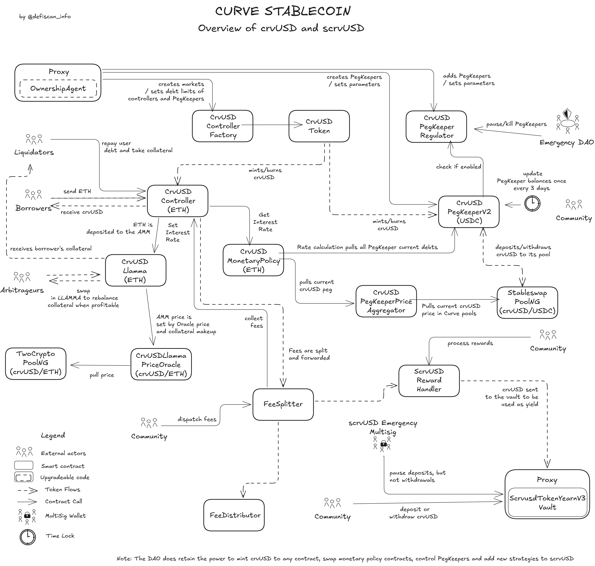
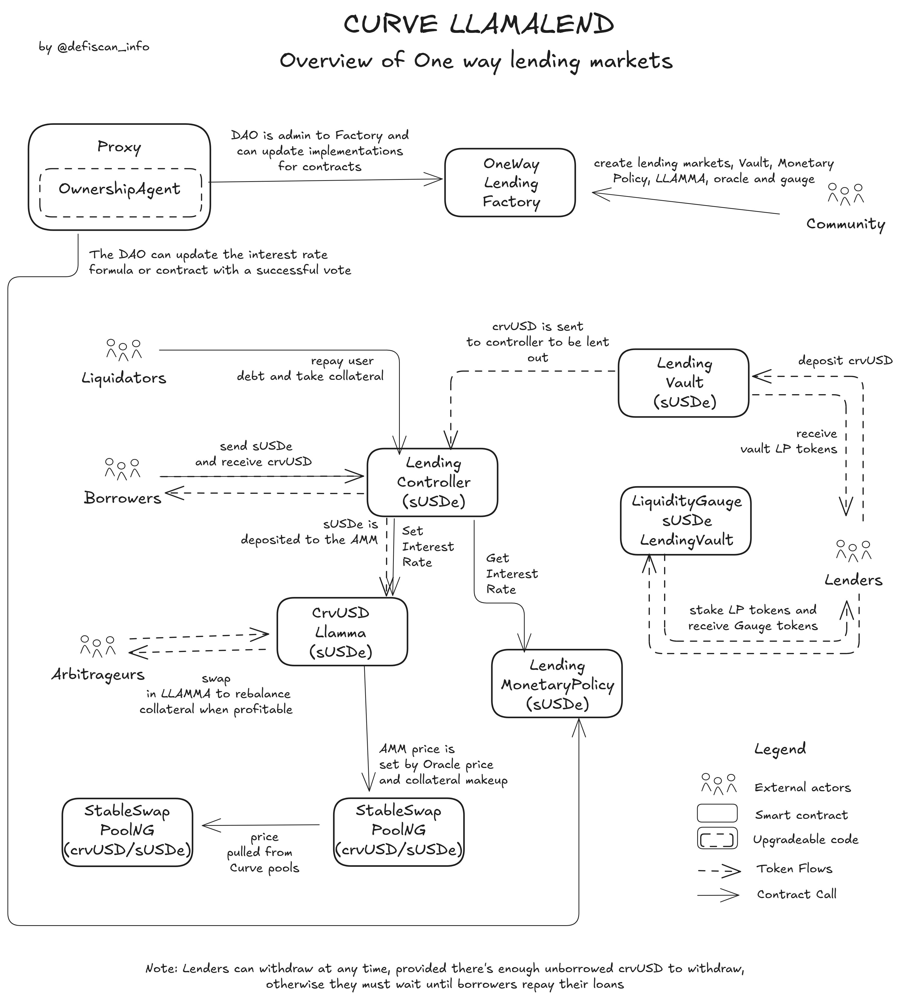
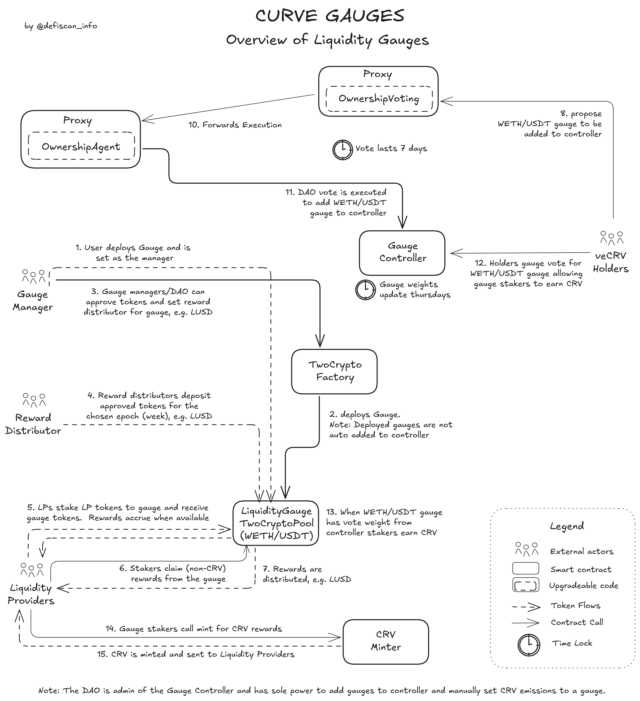
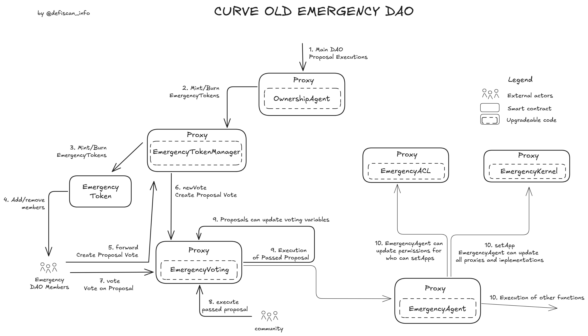

# Summary

Curve Finance is a protocol consisting of a _Decentralized Exchange (DEX)_ focused on stablecoin and correlated-asset swaps, _Isolated Lending Markets (Llamalend)_, and a _Stablecoin (crvUSD)_.

Governance of the entire protocol is managed entirely through the _Curve DAO_, using a vote-escrowed token model (veCRV) where voting power is proportional to the amount of `CRV` locked and the remaining lock duration (up to four years).

# Ratings

## Chain

The _Curve DAO_ operates exclusively on Ethereum mainnet. Although Curve products are deployed across multiple EVM-compatible chains, this review focuses only on the Ethereum mainnet deployment.

> Chain score: Low

## Upgradeability

Governance contracts are upgradeable and its permissions can also be delegated to other entities. The _Curve DAO_ manages all upgrades, primarily through the `OwnershipAgentProxy`, which executes successful governance votes. It owns critical permissions that could lead to the _loss of user funds_, which include:

- Minting arbitrarily `crvUSD` tokens and managing the `scrvUSD` vault by assigning the funds to different strategies. Assigning funds to a malicious strategy could lead to the _loss of user funds_.
- Upgrading governance contracts, potentially reassigning control to any desired account or removing the governance altogether.

In addition to those, the _Curve DAO_ can perform low risk changes to the protocol, which can only result in non-material changes in expected protocol performances, such as:

- Changing parameters like interest rate policies in `crvUSD` and lending markets, which only impacts future performances. Interest rates are limitted to 300% on crvUSD and 1000% through Llamalend.
- Changing fee settings and liquidity concentration in DEX pools, which only impacts future performances. Fees have an upper bound of 5% in StableSwap pools and 10% in TriCrypto, with 50% of those fees going to the _Curve DAO_.
- Updating the implementation contracts of the DEX's pools can be updated for future pools only, which does not impact existing users' funds nor unclaimed yield.

The [EmergencyDAO](#security-council), a multisig, can stop gauges (`CRV` emission), fee distributors, or pegkeepers, in case of emergency. Stopping gauges will only affect future performances and `CRV` emission in the specific gauge. Furthermore, the [EmergencyDAO](#security-council) meets the security council requirements.

> Upgradeability score: High

## Autonomy

The only external dependency in Curve is the CoWSwap burner used in the DAO’s revenue collection architecture. It submits limit orders that are guaranteed to execute only within predefined parameter ranges, converting collected tokens into `crvUSD`. If this mechanism fails or malfunctions, DAO revenue remains in its original token until it can be manually swapped through Curve pools via a DAO vote, or [EmergencyDAO](#security-council) intervention.

> Autonomy score: Low

## Exit Window

All governance votes occur over a 7-day period, with voting frontloaded in the first half due to the linear decay of _veCRV_ voting power after 3.5 days (see more on this in the [governance section](#governance)). There is no mandatory delay between the end of voting and execution. While the voting duration and decay mechanics provide some opportunity for users to react, this does not qualify as a formal delay under the framework.

> Exit Window score: High

## Accessibility

Curve's primary user interface is hosted at [curve.finance](https://curve.finance/). Other interfaces, including [crvhub.com](https://crvhub.com), [curvemonitor.com](https://curvemonitor.com), and [DeFi Saver](https://app.defisaver.com/), provide access to several features of Curve such as `crvUSD`, `scrvUSD`, locking `veCRV`, and claiming rewards. Those frontends offer complete data access but redirect to [curve.finance](https://curve.finance/) for some critical actions such as withdrawing liquidty from pools. For this reason they do not represent sufficiently decentralized alternative frontends.

The frontend code is open source and available at the [Curve Frontend GitHub repository](https://github.com/curvefi/curve-frontend), with instructions to launch it. The latest and previous production deployments are accessible from the repository.

> Accessibility score: Medium

## Conclusion

Curve received a _Low_ centralization risk score for its _Chain_ and _Autonomy_ criteria. Nonetheless, it received a _High_ centralization risk score for its _Upgradeability_ and _Exit Window_, and _Medium_ for its _Accessibility_. Overall, this grants Curve a rating of **Stage 0**. It is notable that _Curve DEX_, on its own, would have achieved the rating of Stage 1.

There are three primary paths for Curve to advance to Stage 1 under the existing framework:

1. Relinquish some control at the DAO level, specifically over `crvUSD` minting and `scrvUSD` vault management such that loss of user funds is no longer possible through governance actions.
2. Expand the authority of the [EmergencyDAO](#security-council) to include a veto right on governance proposals, effectively enabling it to stop proposals that could result in the loss of user funds.
3. Introduce a mandatory 7-day delay between the approval, and execution of governance proposals which may result in the loss of user funds.

# Reviewer's Notes

Only the latest versions of each contract implementation were analyzed. While Curve has used various contract versions over time, they have all mostly followed the same architecture and permission structure. Zap contracts were excluded from this review, as they have no permissioned functions and are optional to use.

The [permissions](#permissions) were analysed manually by the reviewer, as our Permissions Scanner does not yet support Vyper contracts.

# Protocol Analysis

## Decentralized Exchange (DEX)

Curve’s DEX is the foundation of all products within the protocol. There are three main types of pools:

- _Stableswap_: Stablecoin and stable-asset pools with up to 8 assets
- _Twocrypto_: Pools with 2 volatile assets
- _Tricrypto_: Pools with 3 volatile assets

In addition, Curve supports:

- _Basepools_: Stableswap pools whose LP tokens can be used as assets in other pools
- _Metapools_: Pools that include a Basepool LP token as one of the underlying assets

Each of the three primary pool types have its own factory contract, allowing any user to permissionlessly create a pool. The DAO owns all pools by controlling the parent factories. Most pools (except for legacy deployments) inherit their admin address from the factory. This admin has the ability to adjust parameters such as liquidity concentration, trading fees, and, in some cases, other settings like the off-peg multiplier, which increases fees when a pool becomes imbalanced. The implementation of the pools can also be updated by the factory admin (the DAO), but this will only affect future pools and not put existing user positions at risk.

All of these parameters can be updated by the _Curve DAO_. More details can be found in the [Contracts and Permissions](#permissions) section. _Tricrypto Pools_ are the only pool type that enforces a mandatory 3-day waiting period before parameter changes take effect.

_Note: Four older factories are owned by a proxy contract, such as `FactoryOwnerProxy (old)`, which delegates different administrative functions to separate roles: `ownership_admin`, `parameter_admin`, and `emergency_admin`. This model has been deprecated in newer factories but could be reinstated by the Curve DAO._

## crvUSD & scrvUSD

`crvUSD` is Curve’s stablecoin. It is minted when users deposit collateral (currently only BTC or ETH derivatives) and take out a loan. The collateral is deposited into the novel [LLAMMA](https://docs.curve.finance/crvUSD/amm/), which implements the soft-liquidation mechanism.

Interest rates are automatically calculated and continuously updated based on the `crvUSD` peg and the reserves held by _PegKeepers_. _PegKeepers_ are allocated `crvUSD`, which they can deposit into a designated pool (e.g., `crvUSD`/`USDC`) when `crvUSD` trades above peg (i.e., selling `crvUSD` above peg), and withdraw when it trades below peg (i.e., buying `crvUSD` below peg).

The _Curve DAO_ creates revenue from `crvUSD` by charging interest on outstanding debt. This revenue is distributed between the DAO (`veCRV` holders) and `scrvUSD` stakers. `scrvUSD` is a staking vault that complements _PegKeeper_ dynamics. When `crvUSD` falls below peg, interest rates increase, raising yields for `scrvUSD` stakers, increasing `crvUSD` demand. When `crvUSD` rises above peg, interest rates decrease, helping to reduce demand and restore the peg. The _Curve DAO_ can choose the strategies followed by the `scrvUSD` module, and could assign the funds to malicious strategies.

The different mechanics of `crvUSD` can be seen in the overview below:

## Llamalend

_Llamalend_ is a peer-to-peer lending protocol that follows the same structure as `crvUSD` loans but supports riskier collateral. Unlike `crvUSD`, where the DAO assumes risk when collateral falls below the loan value, _Llamalend_ distributes this risk to depositors. Users deposit `crvUSD` into vaults and earn yield from loans that are collateralized with specific assets, each within its own isolated market.

## Curve DAO - Revenue Sharing Contracts

The _Curve DAO_ earns revenue from its decentralized exchange pools and from interest charged on `crvUSD` mints. The DAO votes on how this revenue is allocated, including what portion is distributed to `veCRV` holders. This process is documented here: [Fee Collection](https://docs.curve.finance/fees/overview/). An overview is also provided below:

## Gauges & CRV Minting

Curve’s gauges are where `CRV` is minted and distributed as rewards, primarily to users providing liquidity in DEX pools and supplying assets to _Llamalend_. Any pool or lending market vault can have a gauge, but the DAO must first vote to add it to the `GaugeController` to make it eligible for `CRV` emissions.

`veCRV` holders can vote once every 10 days to decide how `CRV` emissions are distributed across active gauges. Every Thursday at 00:00 UTC, the weekly `CRV` emissions are split proportionally based on the total votes each gauge received.

Users who stake LP tokens in a gauge can boost their rewards relative to others by holding more `veCRV`. This boost can increase their rewards by up to 2.5 times compared to users with no `veCRV`. See the diagram below for an overview of how gauges operate:

# Dependencies

Curve operates on Ethereum without relying on external dependencies, with one exception: swapping collected fees into `crvUSD` using CoWSwap limit orders. These orders only execute within parameters set by the DAO, and Curve can fallback to using its own pools to perform swaps via a DAO vote. The [EmergencyDAO](#security-council) currently also has the authority to carry out this function.

All other components are developed in-house. Curve products rely solely on internal price oracles derived from its own pools.

# Governance

## Curve DAO - Aragon DAO Contracts

The Curve DAO is built on top of the Aragon DAO framework and has been running since August 2020.

Users can lock their `CRV` tokens for `veCRV` (vote-escrowed `CRV`), which allows them to vote on proposals and receive a share of the revenue generated. Users receive `veCRV` based on the duration of their lock, up to a maximum of four years. One `veCRV` equals one `CRV` locked for four years; however, the `veCRV` balance decays linearly over this period:

This system is designed to align incentives, encouraging the DAO to make positive long-term decisions and reducing the surface area for coin-voting governance attacks.

There are two vote types within the Curve DAO: _Ownership votes_ and _Parameter votes_, each with different quorum and support thresholds:

- _Ownership Votes_ - Minimum Quorum of 30%, 51% support
- _Parameter Votes_ - Minimum Quorum of 15%, 60% support

_Note that only "YES" votes count towards Quorum, detailed here: [Curve Resources - DAO Votes](https://resources.curve.finance/governance/understanding-governance/#dao-votes)_

Originally, _Ownership votes_ were used for actions such as setting the owner/admin on contracts and approving gauges to receive `CRV` emissions, while _Parameter votes_ handled changes to parameters within pools. Today, most votes within the Curve DAO are _Ownership votes_, as current participation levels allow for it.

All votes within the Curve DAO occur on Ethereum mainnet and are currently set to a **7-day** voting period. This can be adjusted by the DAO to any value between 0.5 and 14 days. To mitigate manipulation toward the end of the voting period, user voting power decays linearly to zero starting at day 3.5:

An overview of the contracts and how voting works can be seen below:

## Curve Emergency DAO - Aragon DAO Contracts

As a complement to the main DAO, an `oldEmergencyDAO` was setup, which would be able to act quickly, with a voting period of just 24 hours instead of 7 days. The contracts are the same as the main DAO, and are upgradable. The main DAO retains control over this `oldEmergencyDAO` with the power to issue and burn voting tokens for members.

This setup has been moved to a 5/9 multisig called [EmergencyDAO](#security-council) with no direct control possible by the main DAO. However, some contracts, namely the `veCRV` `FeeDistributor (old)` are hardcoded to send funds in emergency situations to the old `oldEmergencyDAO`. Because of this, it is documented here and an overview is given below:

## Security Council

| Name                                   | Account                                                                                                               | Type         | ≥ 7 signers | ≥ 51% threshold | ≥ 50% non-insider | Signers public |
| -------------------------------------- | --------------------------------------------------------------------------------------------------------------------- | ------------ | ----------- | --------------- | ----------------- | -------------- |
| oldEmergencyDAO (EmergencyVotingProxy) | [0x1115c9b3168563354137cdc60efb66552dd50678](https://etherscan.io/address/0x1115c9b3168563354137cdc60efb66552dd50678) | Contract     | ✅          | ✅              | ✅                | ✅             |
| EmergencyDAO                           | [0x467947EE34aF926cF1DCac093870f613C96B1E0c](https://etherscan.io/address/0x467947EE34aF926cF1DCac093870f613C96B1E0c) | Multisig 5/9 | ✅          | ✅              | ✅                | ✅             |
| scrvusdEmergencyDAO                    | [0xe286b81d16FC7e87eD9dc2a80dd93b1816F4Dcf2](https://etherscan.io/address/0xe286b81d16FC7e87eD9dc2a80dd93b1816F4Dcf2) | Multisig 2/5 | ❌          | ❌              | ❌                | ❌             |

The old `oldEmergencyDAO` was sunset in favor of the current [EmergencyDAO](#security-council). This does reduce friction and increases speed for the members if actions are required, but also increases the risk of malicious actions, as the [EmergencyDAO](#security-council) can add and remove members with a majority vote. There is no oversight or direct control currently possible from the main _Curve DAO_.

The old `oldEmergencyDAO` is still hardcoded into some contracts, namely `veCRV`'s `FeeDistributor (old)`.

Members for the `oldEmergencyDAO` are the same as [EmergencyDAO](#security-council), publicly available here in two locations with telegram handles:

1. [https://dao-old.curve.finance/emergencymembers](https://dao-old.curve.finance/emergencymembers)
2. [Curve Resources - Emergency DAO](https://resources.curve.finance/governance/overview/#emergency-dao)

At least 4 of the 5 signers on the `scrvusdEmergencyDAO` can be identified as members/previous members of the Curve team. However, this multisig can only limit/stop deposits into the `scrvUSD` vault. It cannot steal user funds or limit withdrawals.

## Exit Window

All DAO votes have a 7-day voting period. Due to `veCRV` voting decay, most votes are cast in the first 3.5 days, after which voting power linearly decays to zero.

For all liquidity pools, lending markets, and gauges, the DAO can only vote to modify parameters within predefined ranges.

In addition, the current `TriCryptoSwapFactory` pool implementation enforces a mandatory 3-day delay on all parameter changes, these changes can also be vetoed by the [EmergencyDAO](#security-council).

# Contracts & Permissions

## Contracts

| Contract Name                         | Address                                                                                                               |
| ------------------------------------- | --------------------------------------------------------------------------------------------------------------------- |
| OwnershipVotingProxy                  | [0xE478de485ad2fe566d49342Cbd03E49ed7DB3356](https://etherscan.io/address/0xE478de485ad2fe566d49342Cbd03E49ed7DB3356) |
| OwnershipVotingImplementation         | [0xa4D1a2693589840BABb7f3A44D14Fdf41b3bF1Fe](https://etherscan.io/address/0xa4D1a2693589840BABb7f3A44D14Fdf41b3bF1Fe) |
| ParameterVotingProxy                  | [0xBCfF8B0b9419b9A88c44546519b1e909cF330399](https://etherscan.io/address/0xBCfF8B0b9419b9A88c44546519b1e909cF330399) |
| ParameterVotingImplementation         | [0xa4D1a2693589840BABb7f3A44D14Fdf41b3bF1Fe](https://etherscan.io/address/0xa4D1a2693589840BABb7f3A44D14Fdf41b3bF1Fe) |
| OwnershipAgentProxy                   | [0x40907540d8a6C65c637785e8f8B742ae6b0b9968](https://etherscan.io/address/0x40907540d8a6C65c637785e8f8B742ae6b0b9968) |
| OwnershipAgentImplementation          | [0x3A93C17FC82CC33420d1809dDA9Fb715cc89dd37](https://etherscan.io/address/0x3A93C17FC82CC33420d1809dDA9Fb715cc89dd37) |
| ParameterAgentProxy                   | [0x4EEb3bA4f221cA16ed4A0cC7254E2E32DF948c5f](https://etherscan.io/address/0x4EEb3bA4f221cA16ed4A0cC7254E2E32DF948c5f) |
| ParameterAgentImplementation          | [0x3A93C17FC82CC33420d1809dDA9Fb715cc89dd37](https://etherscan.io/address/0x3A93C17FC82CC33420d1809dDA9Fb715cc89dd37) |
| KernelProxy                           | [0xad06868167BC5Ac5cFcbEf2CAFa82bc76961D72d](https://etherscan.io/address/0xad06868167BC5Ac5cFcbEf2CAFa82bc76961D72d) |
| KernelImplementation                  | [0x2b33CF282f867A7FF693A66e11B0FcC5552e4425](https://etherscan.io/address/0x2b33CF282f867A7FF693A66e11B0FcC5552e4425) |
| ACLProxy                              | [0xBd0697BA421e7fEc529E3E76D9e9F3a710490369](https://etherscan.io/address/0xBd0697BA421e7fEc529E3E76D9e9F3a710490369) |
| ACLImplementation                     | [0x81F7564e413586f1f99fDe55740Ac52b43cA99c9](https://etherscan.io/address/0x81F7564e413586f1f99fDe55740Ac52b43cA99c9) |
| CrvToken                              | [0xD533a949740bb3306d119CC777fa900bA034cd52](https://etherscan.io/address/0xD533a949740bb3306d119CC777fa900bA034cd52) |
| CrvMinter                             | [0xd061D61a4d941c39E5453435B6345Dc261C2fcE0](https://etherscan.io/address/0xd061D61a4d941c39E5453435B6345Dc261C2fcE0) |
| VecrvToken                            | [0x5f3b5DfEb7B28CDbD7FAba78963EE202a494e2A2](https://etherscan.io/address/0x5f3b5DfEb7B28CDbD7FAba78963EE202a494e2A2) |
| SmartWalletWhitelist                  | [0xca719728Ef172d0961768581fdF35CB116e0B7a4](https://etherscan.io/address/0xca719728Ef172d0961768581fdF35CB116e0B7a4) |
| EmergencyVotingProxy                  | [0x1115c9b3168563354137cdc60efb66552dd50678](https://etherscan.io/address/0x1115c9b3168563354137cdc60efb66552dd50678) |
| EmergencyVotingImplementation         | [0xb935C3D80229d5D92f3761b17Cd81dC2610e3a45](https://etherscan.io/address/0xb935C3D80229d5D92f3761b17Cd81dC2610e3a45) |
| EmergencyAgentProxy                   | [0x00669DF67E4827FCc0E48A1838a8d5AB79281909](https://etherscan.io/address/0x00669DF67E4827FCc0E48A1838a8d5AB79281909) |
| EmergencyAgentImplementation          | [0x3A93C17FC82CC33420d1809dDA9Fb715cc89dd37](https://etherscan.io/address/0x3A93C17FC82CC33420d1809dDA9Fb715cc89dd37) |
| KernelEmergencyProxy                  | [0x79CF3E23EDed0fc20992b79ACb3B3ffB7C6799b4](https://etherscan.io/address/0x79CF3E23EDed0fc20992b79ACb3B3ffB7C6799b4) |
| KernelEmergencyImplementation         | [0x2b33CF282f867A7FF693A66e11B0FcC5552e4425](https://etherscan.io/address/0x2b33CF282f867A7FF693A66e11B0FcC5552e4425) |
| ACLEmergencyProxy                     | [0x2e6F008efF832b80161F739Dd9CB48F855A6f499](https://etherscan.io/address/0x2e6F008efF832b80161F739Dd9CB48F855A6f499) |
| ACLEmergencyImplementation            | [0x81F7564e413586f1f99fDe55740Ac52b43cA99c9](https://etherscan.io/address/0x81F7564e413586f1f99fDe55740Ac52b43cA99c9) |
| EmergencyToken                        | [0x923573a3F7C2D94d647De85714106Ba3E45B1dED](https://etherscan.io/address/0x923573a3F7C2D94d647De85714106Ba3E45B1dED) |
| EmergencyTokenManagerProxy            | [0xf409Ce40B5bb1e4Ef8e97b1979629859c6d5481f](https://etherscan.io/address/0xf409Ce40B5bb1e4Ef8e97b1979629859c6d5481f) |
| EmergencyTokenManagerImplementation   | [0xde3A93028F2283cc28756B3674BD657eaFB992f4](https://etherscan.io/address/0xde3A93028F2283cc28756B3674BD657eaFB992f4) |
| FeeDistributor (old)                  | [0xA464e6DCda8AC41e03616F95f4BC98a13b8922Dc](https://etherscan.io/address/0xA464e6DCda8AC41e03616F95f4BC98a13b8922Dc) |
| FeeCollector                          | [0xa2Bcd1a4Efbd04B63cd03f5aFf2561106ebCCE00](https://etherscan.io/address/0xa2Bcd1a4Efbd04B63cd03f5aFf2561106ebCCE00) |
| FeeBurner                             | [0xC0fC3dDfec95ca45A0D2393F518D3EA1ccF44f8b](https://etherscan.io/address/0xC0fC3dDfec95ca45A0D2393F518D3EA1ccF44f8b) |
| FeeHooker                             | [0x9A9DF35cd8E88565694CA6AD5093c236C7f6f69D](https://etherscan.io/address/0x9A9DF35cd8E88565694CA6AD5093c236C7f6f69D) |
| FeeDistributor                        | [0xD16d5eC345Dd86Fb63C6a9C43c517210F1027914](https://etherscan.io/address/0xD16d5eC345Dd86Fb63C6a9C43c517210F1027914) |
| FeeSplitter                           | [0x2dFd89449faff8a532790667baB21cF733C064f2](https://etherscan.io/address/0x2dFd89449faff8a532790667baB21cF733C064f2) |
| CrvusdToken                           | [0xf939E0A03FB07F59A73314E73794Be0E57ac1b4E](https://etherscan.io/address/0xf939E0A03FB07F59A73314E73794Be0E57ac1b4E) |
| CrvusdControllerFactory               | [0xC9332fdCB1C491Dcc683bAe86Fe3cb70360738BC](https://etherscan.io/address/0xC9332fdCB1C491Dcc683bAe86Fe3cb70360738BC) |
| CrvusdController                      | [0x652aEa6B22310C89DCc506710CaD24d2Dba56B11](https://etherscan.io/address/0x652aEa6B22310C89DCc506710CaD24d2Dba56B11) |
| CrvusdLlamma                          | [0x9a2e6bb3114B1EEB5492D97188A3ECB09E39fac8](https://etherscan.io/address/0x9a2e6bb3114B1EEB5492D97188A3ECB09E39fac8) |
| CrvusdLlammaPriceOracle               | [0x0a9aE947495034C0bBBAB845Fd75b5BBAfc91aAb](https://etherscan.io/address/0x0a9aE947495034C0bBBAB845Fd75b5BBAfc91aAb) |
| CrvusdMonetaryPolicy                  | [0x8D76F31E7C3b8f637131dF15D9b4a3F8ba93bd75](https://etherscan.io/address/0x8D76F31E7C3b8f637131dF15D9b4a3F8ba93bd75) |
| CrvusdPegKeeperV2                     | [0x9201da0D97CaAAff53f01B2fB56767C7072dE340](https://etherscan.io/address/0x9201da0D97CaAAff53f01B2fB56767C7072dE340) |
| CrvusdPegKeeperRegulator              | [0x36a04CAffc681fa179558B2Aaba30395CDdd855f](https://etherscan.io/address/0x36a04CAffc681fa179558B2Aaba30395CDdd855f) |
| CrvusdPegKeeperPriceAggregator        | [0x18672b1b0c623a30089A280Ed9256379fb0E4E62](https://etherscan.io/address/0x18672b1b0c623a30089A280Ed9256379fb0E4E62) |
| ScrvusdRewardHandler                  | [0xE8d1E2531761406Af1615A6764B0d5fF52736F56](https://etherscan.io/address/0xE8d1E2531761406Af1615A6764B0d5fF52736F56) |
| ScrvusdTokenYearnV3VaultProxy         | [0x0655977FEb2f289A4aB78af67BAB0d17aAb84367](https://etherscan.io/address/0x0655977FEb2f289A4aB78af67BAB0d17aAb84367) |
| ScrvusdTokenYearnV3VaultImplemetation | [0xd8063123BBA3B480569244AE66BFE72B6c84b00d](https://etherscan.io/address/0xd8063123BBA3B480569244AE66BFE72B6c84b00d) |
| GaugeController                       | [0x2F50D538606Fa9EDD2B11E2446BEb18C9D5846bB](https://etherscan.io/address/0x2F50D538606Fa9EDD2B11E2446BEb18C9D5846bB) |
| LiquidityGaugeV6                      | [0x479dFB03cdDEa20dC4e8788B81Fd7C7A08FD3555](https://etherscan.io/address/0x479dFB03cdDEa20dC4e8788B81Fd7C7A08FD3555) |
| StableSwapFactory                     | [0x6A8cbed756804B16E05E741eDaBd5cB544AE21bf](https://etherscan.io/address/0x6A8cbed756804B16E05E741eDaBd5cB544AE21bf) |
| StableSwapNG                          | [0x4f493B7dE8aAC7d55F71853688b1F7C8F0243C85](https://etherscan.io/address/0x4f493B7dE8aAC7d55F71853688b1F7C8F0243C85) |
| StableSwapMetaNG                      | [0x7d10A8734d985dBB3aD91Fce9c48CcC78b9F8B94](https://etherscan.io/address/0x7d10A8734d985dBB3aD91Fce9c48CcC78b9F8B94) |
| TwoCryptoFactory                      | [0x98EE851a00abeE0d95D08cF4CA2BdCE32aeaAF7F](https://etherscan.io/address/0x98EE851a00abeE0d95D08cF4CA2BdCE32aeaAF7F) |
| TwoCryptoNG                           | [0x4ed22C5F2834591660c2926EcDC159864CFE96e0](https://etherscan.io/address/0x4ed22C5F2834591660c2926EcDC159864CFE96e0) |
| TriCryptoFactory                      | [0x0c0e5f2fF0ff18a3be9b835635039256dC4B4963](https://etherscan.io/address/0x0c0e5f2fF0ff18a3be9b835635039256dC4B4963) |
| TriCryptoNG                           | [0x7F86Bf177Dd4F3494b841a37e810A34dD56c829B](https://etherscan.io/address/0x7F86Bf177Dd4F3494b841a37e810A34dD56c829B) |
| CurveRouterV1.2                       | [0x45312ea0eFf7E09C83CBE249fa1d7598c4C8cd4e](https://etherscan.io/address/0x45312ea0eFf7E09C83CBE249fa1d7598c4C8cd4e) |
| FactoryOwnerProxy (old)               | [0x742C3cF9Af45f91B109a81EfEaf11535ECDe9571](https://etherscan.io/address/0x742C3cF9Af45f91B109a81EfEaf11535ECDe9571) |
| OnewayLendingFactory                  | [0xeA6876DDE9e3467564acBeE1Ed5bac88783205E0](https://etherscan.io/address/0xeA6876DDE9e3467564acBeE1Ed5bac88783205E0) |
| LendingVault                          | [0x4a7999c55d3a93dAf72EA112985e57c2E3b9e95D](https://etherscan.io/address/0x4a7999c55d3a93dAf72EA112985e57c2E3b9e95D) |
| LendingController                     | [0xB536FEa3a01c95Dd09932440eC802A75410139D6](https://etherscan.io/address/0xB536FEa3a01c95Dd09932440eC802A75410139D6) |
| LendingLlamma                         | [0x6505aeC799AC3b16a79cb1Ae2A61884889b54C1b](https://etherscan.io/address/0x6505aeC799AC3b16a79cb1Ae2A61884889b54C1b) |
| LlammaPriceOracle                     | [0x92473A2fd36EF1d8Ead3251ee1aa08e9568CC10c](https://etherscan.io/address/0x92473A2fd36EF1d8Ead3251ee1aa08e9568CC10c) |
| LendingMonetryPolicySemiLog           | [0xb8CeDa456f8191d8D0d5b196C7BAab87A309ea50](https://etherscan.io/address/0xb8CeDa456f8191d8D0d5b196C7BAab87A309ea50) |

## All Permission owners

| Name                                       | Account                                                                                                               | Type         | Notes                                                                                                                                                                                                |
| ------------------------------------------ | --------------------------------------------------------------------------------------------------------------------- | ------------ | ---------------------------------------------------------------------------------------------------------------------------------------------------------------------------------------------------- |
| OwnershipVotingProxy                       | [0xE478de485ad2fe566d49342Cbd03E49ed7DB3356](https://etherscan.io/address/0xE478de485ad2fe566d49342Cbd03E49ed7DB3356) | Contract     | Main DAO Voting (Ownership)                                                                                                                                                                          |
| OwnershipAgentProxy                        | [0x40907540d8a6C65c637785e8f8B742ae6b0b9968](https://etherscan.io/address/0x40907540d8a6C65c637785e8f8B742ae6b0b9968) | Contract     | Main DAO Execution Agent (Ownership)                                                                                                                                                                 |
| ParameterVotingProxy                       | [0xBCfF8B0b9419b9A88c44546519b1e909cF330399](https://etherscan.io/address/0xBCfF8B0b9419b9A88c44546519b1e909cF330399) | Contract     | Main DAO Voting (Parameter)                                                                                                                                                                          |
| ParameterAgentProxy                        | [0x4EEb3bA4f221cA16ed4A0cC7254E2E32DF948c5f](https://etherscan.io/address/0x4EEb3bA4f221cA16ed4A0cC7254E2E32DF948c5f) | Contract     | Main DAO Execution Agent (Parameter)                                                                                                                                                                 |
| EmergencyVotingProxy (old oldEmergencyDAO) | [0x1115c9b3168563354137cdc60efb66552dd50678](https://etherscan.io/address/0x1115c9b3168563354137cdc60efb66552dd50678) | Contract     | Old Emergency DAO, still in use through limited hardcoded power. Signers all from surrounding community and [fully public](https://dao-old.curve.finance/emergencymembers).                          |
| EmergencyDAO                               | [0x467947EE34aF926cF1DCac093870f613C96B1E0c](https://etherscan.io/address/0x467947EE34aF926cF1DCac093870f613C96B1E0c) | Multisig 5/9 | Replaced old oldEmergencyDAO. Holds emergency powers. Signers all from surrounding community and [fully public](https://resources.curve.finance/governance/understanding-governance/#emergency-dao). |
| scrvusdEmergencyDAO                        | [0xe286b81d16FC7e87eD9dc2a80dd93b1816F4Dcf2](https://etherscan.io/address/0xe286b81d16FC7e87eD9dc2a80dd93b1816F4Dcf2) | Multisig 2/5 | Holds emergency powers over scrvUSD vault (deposit limits, shutdown). Predominantly team members.                                                                                                    |

## Permissions

| Contract                       | Function                      | Impact                                                                                                                                                                                                                                                                                                                                                                                                                                                                                                                                 | Owner (Currnet Owner)                                                                           |
| :----------------------------- | :---------------------------- | :------------------------------------------------------------------------------------------------------------------------------------------------------------------------------------------------------------------------------------------------------------------------------------------------------------------------------------------------------------------------------------------------------------------------------------------------------------------------------------------------------------------------------------- | :---------------------------------------------------------------------------------------------- |
| OwnershipVotingProxy           | changeSupportRequiredPct      | Changes the minimum percentage of “yes” votes for a proposal to be successful, out of the total votes cast. Currently set to 51%. The support must be higher than the QuorumPct, and less than 100%, however that's the only requirement. Theoretically the Quorum could be 0% and Support could both be set at 0%, allowing any proposal to pass with a single "yes" vote.                                                                                                                                                            | MODIFY_SUPPORT_ROLE (OwnershipVotingProxy)                                                      |
| OwnershipVotingProxy           | changeMinAcceptQuorumPct      | Changes the minimum percentage of votes cast for a proposal to be successful, out of the total possible votes. Currently set to 30%, must be lower than supportRequiredPct.                                                                                                                                                                                                                                                                                                                                                            | MODIFY_QUORUM_ROLE (OwnershipVotingProxy)                                                       |
| OwnershipVotingProxy           | setMinBalance                 | Changes the minimum amount of veCRV required to create a vote, currently set to 2,500 (10k CRV locked for 1 year, or 2.5k CRV locked for 4 years). It must be between 2,500 and 50,000. Increasing the minimum veCRV to a higher number could stop a rigorous and decentralized governance process.                                                                                                                                                                                                                                    | SET_MIN_BALANCE_ROLE (OwnershipVotingProxy)                                                     |
| OwnershipVotingProxy           | setMinTime                    | Changes the minimum time a vote needs to be open for, currently set to 7 days. It must be between 0.5 and 14 days.                                                                                                                                                                                                                                                                                                                                                                                                                     | SET_MIN_TIME_ROLE (OwnershipVotingProxy)                                                        |
| OwnershipVotingProxy           | newVote                       | Creates a vote with an attached execution script which can be executed if the vote passes.                                                                                                                                                                                                                                                                                                                                                                                                                                             | CREATE_VOTES_ROLE (Anyone with >2500 veCRV)                                                     |
| OwnershipVotingProxy           | votePct                       | Vote for a proposal, can set a percentage so a portion of your total is split for “yes” and “no”.                                                                                                                                                                                                                                                                                                                                                                                                                                      | Anyone (Anyone with >0 veCRV)                                                                   |
| ParameterVotingProxy           | changeSupportRequiredPct      | Changes the minimum percentage of “yes” votes for a proposal to be successful, out of the total votes cast. Currently set to 60%. The support must be higher than the QuorumPct, and less than 100%, however that's the only requirement. Theoretically the Quorum could be 0% and Support could both be set at 0%, allowing any proposal to pass with a single "yes" vote.                                                                                                                                                            | MODIFY_SUPPORT_ROLE (ParameterVotingProxy)                                                      |
| ParameterVotingProxy           | changeMinAcceptQuorumPct      | Changes the minimum percentage of votes cast for a proposal to be successful, out of the total possible votes. Currently set to 15%, must be lower than supportRequiredPct.                                                                                                                                                                                                                                                                                                                                                            | MODIFY_QUORUM_ROLE (ParameterVotingProxy)                                                       |
| ParameterVotingProxy           | setMinBalance                 | Changes the minimum amount of veCRV required to create a vote, currently set to 2,500 (10k CRV locked for 1 year, or 2.5k CRV locked for 4 years). It must be between 2,500 and 50,000. Increasing the minimum veCRV to a higher number could stop a rigorous and decentralized governance process.                                                                                                                                                                                                                                    | SET_MIN_BALANCE_ROLE (ParameterVotingProxy)                                                     |
| ParameterVotingProxy           | setMinTime                    | Changes the minimum time a vote needs to be open for, currently set to 7 days. It must be between 0.5 and 14 days.                                                                                                                                                                                                                                                                                                                                                                                                                     | SET_MIN_TIME_ROLE (ParameterVotingProxy)                                                        |
| ParameterVotingProxy           | newVote                       | Creates a vote with an attached execution script which can be executed if the vote passes.                                                                                                                                                                                                                                                                                                                                                                                                                                             | CREATE_VOTES_ROLE (Anyone with >2500 veCRV)                                                     |
| ParameterVotingProxy           | votePct                       | Vote for a proposal, can set a percentage so a portion of your total is split for “yes” and “no”.                                                                                                                                                                                                                                                                                                                                                                                                                                      | Anyone (Anyone with >0 veCRV)                                                                   |
| KernalProxy                    | setApp                        | Allows the DAO proxy and implementation contracts to all be upgradable by the app manager.                                                                                                                                                                                                                                                                                                                                                                                                                                             | APP_MANAGER_ROLE (OwnershipAgentProxy)                                                          |
| ACLProxy                       | createPermission              | Creates a permission (role) that wasn't previously set and managed. There are currently no permissions created. So for any permissions to be granted/revoked/burnt/managers set, permissions must first be created. The DAO has that ultimate authority through the OwnershipVotingProxy which controls the OwnershipAgentProxy.                                                                                                                                                                                                       | CREATE_PERMISSIONS_ROLE (OwnershipAgentProxy)                                                   |
| ACLProxy                       | grantPermission               | Grants an existing permission (role) to an entity in an app.                                                                                                                                                                                                                                                                                                                                                                                                                                                                           | None (None)                                                                                     |
| ACLProxy                       | grantPermissionP              | Grants an existing permission (role) to an entity with parameters in an app.                                                                                                                                                                                                                                                                                                                                                                                                                                                           | None (None)                                                                                     |
| ACLProxy                       | revokePermission              | Revokes an existing permission (role) from an entity in a certain app.                                                                                                                                                                                                                                                                                                                                                                                                                                                                 | None (None)                                                                                     |
| ACLProxy                       | setPermissionManager          | Sets the manager of a permission (role) in an app to a certain entity, allowing them control over access to that permission (role).                                                                                                                                                                                                                                                                                                                                                                                                    | None (None)                                                                                     |
| ACLProxy                       | removePermissionManager       | Removes the manager of a permission (role) in an app.                                                                                                                                                                                                                                                                                                                                                                                                                                                                                  | None (None)                                                                                     |
| ACLProxy                       | createBurnedPermission        | Burn a non-existent permission (role) in an app so that no changes can be made.                                                                                                                                                                                                                                                                                                                                                                                                                                                        | CREATE_PERMISSIONS_ROLE (OwnershipAgentProxy)                                                   |
| ACLProxy                       | burnPermissionManager         | Burns a role in an app so no modification can be made.                                                                                                                                                                                                                                                                                                                                                                                                                                                                                 | None (None)                                                                                     |
| OwnershipAgentProxy            | execute                       | Executes a transaction by an agent. This agent is the contract which is the admin/owner of most contracts within the Curve Finance ecosystem. The only way the agent can execute a transaction is by a successful Ownership vote, which includes a transaction for the OwnershipAgent to execute. The DAO could theoretically pass a vote allowing another entity access to the EXECUTE_ROLE on this agent, which would allow it to perform some malicious actions, however most LPs to pools and lending markets would be unaffected. | EXECUTE_ROLE (OwnershipVotingProxy)                                                             |
| ParameterAgentProxy            | execute                       | Executes a transaction by agent. This agent is used less than previously, most contracts simply use the OwnershipAgent for all admin functions currently. However this ParameterAgent is still used to set parameters in older pools, which could be used maliciously to set fees and parameters to undesirable settings.                                                                                                                                                                                                              | EXECUTE_ROLE (ParameterVotingProxy)                                                             |
| CrvToken                       | set_admin                     | Set a new admin for the contract.                                                                                                                                                                                                                                                                                                                                                                                                                                                                                                      | admin (OwnershipAgentProxy)                                                                     |
| CrvToken                       | set_name                      | Low impact, the admin can only set the name and symbol of the token.                                                                                                                                                                                                                                                                                                                                                                                                                                                                   | admin (OwnershipAgentProxy)                                                                     |
| VecrvToken                     | commit_transfer_ownership     | Set a new admin for the contract.                                                                                                                                                                                                                                                                                                                                                                                                                                                                                                      | admin (OwnershipAgentProxy)                                                                     |
| VecrvToken                     | apply_transfer_ownership      | Apply the next admin for the contract.                                                                                                                                                                                                                                                                                                                                                                                                                                                                                                 | admin (OwnershipAgentProxy)                                                                     |
| VecrvToken                     | commit_smart_wallet_checker   | CRV cannot be locked into veCRV by smart contracts unless allowed by the smart_wallet_checker contract, the admin can change the checker contract. This commits the next contract.                                                                                                                                                                                                                                                                                                                                                     | admin (OwnershipAgentProxy)                                                                     |
| VecrvToken                     | apply_smart_wallet_checker    | Admin can apply the committed smart_wallet_checker contract after commitment.                                                                                                                                                                                                                                                                                                                                                                                                                                                          | admin (OwnershipAgentProxy)                                                                     |
| SmartWalletWhitelist           | approveWallet                 | The admin can approve any smart contract so they can mint veCRV.                                                                                                                                                                                                                                                                                                                                                                                                                                                                       | admin (OwnershipAgentProxy)                                                                     |
| SmartWalletWhitelist           | revokeWallet                  | The admin can revoke a smart contract from being able to mint or increace lock duration for veCRV, however all current CRV remains locked and veCRV voting power decays until unlock happens and CRV can be withdrawn.                                                                                                                                                                                                                                                                                                                 | admin (OwnershipAgentProxy)                                                                     |
| EmergencyVotingProxy           | changeSupportRequiredPct      | Changes the minimum percentage of “yes” votes for a proposal to be successful, out of the total votes cast. Set to 60%. It can only be changed with a vote from it's own contract.                                                                                                                                                                                                                                                                                                                                                     | MODIFY_SUPPORT_ROLE (EmergencyVotingProxy)                                                      |
| EmergencyVotingProxy           | changeMinAcceptQuorumPct      | Changes the minimum percentage of votes cast for a proposal to be successful, out of the total possible votes. Currently set to 51%. It can only be changed with a vote from it's own contract.                                                                                                                                                                                                                                                                                                                                        | MODIFY_QUORUM_ROLE (EmergencyVotingProxy)                                                       |
| EmergencyVotingProxy           | newVote                       | Creates a vote with an attached execution script which can be executed if the vote passes.                                                                                                                                                                                                                                                                                                                                                                                                                                             | CREATE_VOTES_ROLE (Token Holders through EmergencyTokenManagerProxy)                            |
| EmergencyVotingProxy           | vote                          | Vote for a proposal either “yes” or “no” using the 1 allocated vote.                                                                                                                                                                                                                                                                                                                                                                                                                                                                   | Token Holders                                                                                   |
| EmergencyAgentProxy            | execute                       | Executes a transaction by the agent.                                                                                                                                                                                                                                                                                                                                                                                                                                                                                                   | EXECUTE_ROLE (EmergencyVotingProxy)                                                             |
| KernalEmergencyProxy           | setApp                        | Allows the Emergency DAO proxy and implementation contract to be upgradable by the app manager.                                                                                                                                                                                                                                                                                                                                                                                                                                        | APP_MANAGER_ROLE (EmergencyVotingProxy)                                                         |
| ACLEmergencyProxy              | createPermission              | Creates a permission (role) that wasn't previously set and managed. There are currently no permissions created. So for any permissions to be granted/revoked/burnt/managers set, permissions must first be created.                                                                                                                                                                                                                                                                                                                    | CREATE_PERMISSIONS_ROLE (EmergencyVotingProxy)                                                  |
| ACLEmergencyProxy              | grantPermission               | Grants an existing permission (role) to an entity in an app.                                                                                                                                                                                                                                                                                                                                                                                                                                                                           | None (None)                                                                                     |
| ACLEmergencyProxy              | grantPermissionP              | Grants an existing permission (role) to an entity with parameters in an app.                                                                                                                                                                                                                                                                                                                                                                                                                                                           | None (None)                                                                                     |
| ACLEmergencyProxy              | revokePermission              | Revokes an existing permission (role) from an entity in a certain app.                                                                                                                                                                                                                                                                                                                                                                                                                                                                 | None (None)                                                                                     |
| ACLEmergencyProxy              | setPermissionManager          | Sets the manager of a permission (role) in an app to a certain entity, allowing them control over access to that permission (role).                                                                                                                                                                                                                                                                                                                                                                                                    | None (None)                                                                                     |
| ACLEmergencyProxy              | removePermissionManager       | Removes the manager of a permission (role) in an app                                                                                                                                                                                                                                                                                                                                                                                                                                                                                   | None (None)                                                                                     |
| ACLEmergencyProxy              | createBurnedPermission        | Burn a non-existent permission (role) in an app so that no changes can be made.                                                                                                                                                                                                                                                                                                                                                                                                                                                        | CREATE_PERMISSIONS_ROLE (EmergencyVotingProxy)                                                  |
| ACLEmergencyProxy              | burnPermissionManager         | Burns a role in an app so no modification can be made.                                                                                                                                                                                                                                                                                                                                                                                                                                                                                 | None (None)                                                                                     |
| EmergencyToken                 | changeController              | Changes the controller (owner/admin) to a new entity                                                                                                                                                                                                                                                                                                                                                                                                                                                                                   | Controller (OwnershipVotingProxy through EmergencyTokenManagerProxy)                            |
| EmergencyToken                 | generateTokens                | Mints tokens to new members, no member can have more than 1 token. The main DAO is the only entity allowed to do this.                                                                                                                                                                                                                                                                                                                                                                                                                 | Controller (OwnershipVotingProxy through EmergencyTokenManagerProxy)                            |
| EmergencyToken                 | destroyTokens                 | The controller can destroy tokens, in case members lose access to a wallet, or accidentally transfer them to someone else.                                                                                                                                                                                                                                                                                                                                                                                                             | Controller (OwnershipVotingProxy through EmergencyTokenManagerProxy)                            |
| EmergencyToken                 | claimTokens                   | Claim any ERC20 tokens mistakenly sent to the contract address.                                                                                                                                                                                                                                                                                                                                                                                                                                                                        | Controller (OwnershipVotingProxy through EmergencyTokenManagerProxy)                            |
| EmergencyToken                 | enableTransfers               | Allows holders of the token to transfer the tokens if set to true.                                                                                                                                                                                                                                                                                                                                                                                                                                                                     | Controller (OwnershipVotingProxy through EmergencyTokenManagerProxy)                            |
| FeeDistributor (old)           | commit_admin                  | Commit the next admin of the contract.                                                                                                                                                                                                                                                                                                                                                                                                                                                                                                 | admin (OwnershipAgentProxy)                                                                     |
| FeeDistributor (old)           | apply_admin                   | Apply the next admin for the contract.                                                                                                                                                                                                                                                                                                                                                                                                                                                                                                 | admin (OwnershipAgentProxy)                                                                     |
| FeeDistributor (old)           | kill_me                       | Admin can call this function which sends all unclaimed 3CRV rewards allocated to veCRV holders to a hardcoded at initialization emergency admin address. Currently there is around $2.6M in this contract. These funds will always be distributed to the `oldEmergencyDAO` from this function, which the main DAO has admin controls over. However the old `oldEmergencyDAO` could steal these funds if they colluded before the DAO could act.                                                                                        | admin (OwnershipAgentProxy)                                                                     |
| FeeDistributor (old)           | recover_balance               | The admin can recover any ERC20 tokens which are mistakenly sent to this address, except the 3CRV tokens, which can only be recovered through the `kill_me` function.                                                                                                                                                                                                                                                                                                                                                                  | admin (OwnershipAgentProxy)                                                                     |
| FeeCollector                   | recover                       | The owner and emergency owner can both transfer any ERC20 tokens from this contract. Currently, as the owner is the DAO, the emergency owner ([EmergencyDAO](#security-council)) could steal around 8 days of fees before the DAO could vote to revoke their permission.                                                                                                                                                                                                                                                               | owner, emergency_owner (OwnershipAgentProxy, EmergencyDAO)                                      |
| FeeCollector                   | set_max_fee                   | Set a new max_fee (reward) for forwarding to the hooker currently 0.28%.                                                                                                                                                                                                                                                                                                                                                                                                                                                               | owner (OwnershipAgentProxy)                                                                     |
| FeeCollector                   | set_burner                    | Sets a new burner to swap ERC20 tokens into `crvUSD`, must implement the `BURNER_INTERFACE_ID`.                                                                                                                                                                                                                                                                                                                                                                                                                                        | owner (OwnershipAgentProxy)                                                                     |
| FeeCollector                   | set_hooker                    | Sets a new hooker to forward `crvUSD` through `HOOKER_INTERFACE` to the `FeeDistributor`.                                                                                                                                                                                                                                                                                                                                                                                                                                              | owner (OwnershipAgentProxy)                                                                     |
| FeeCollector                   | set_target                    | Change from `crvUSD` to another coin for fee accumulation.                                                                                                                                                                                                                                                                                                                                                                                                                                                                             | owner (OwnershipAgentProxy)                                                                     |
| FeeCollector                   | set_killed                    | Setting a coin to killed stops that specific coin from being burnt.                                                                                                                                                                                                                                                                                                                                                                                                                                                                    | owner, emergency_owner (OwnershipAgentProxy, EmergencyDAO)                                      |
| FeeCollector                   | set_owner                     | Set a new owner for the contract.                                                                                                                                                                                                                                                                                                                                                                                                                                                                                                      | owner (OwnershipAgentProxy)                                                                     |
| FeeCollector                   | set_emergency_owner           | Set a new emergency owner for the contract.                                                                                                                                                                                                                                                                                                                                                                                                                                                                                            | owner (OwnershipAgentProxy)                                                                     |
| FeeBurner                      | set_target_threshold          | Sets the minimum received `crvUSD` from a swap, currently 500                                                                                                                                                                                                                                                                                                                                                                                                                                                                          | FeeCollector.owner (OwnershipAgentProxy)                                                        |
| FeeBurner                      | recover                       | The owner and emergency owner can both transfer any ERC20 tokens from this contract. Currently, as the owner is the DAO, the emergency owner ([EmergencyDAO](#security-council)) could steal around 8 days of fees before the DAO could vote to revoke their permission.                                                                                                                                                                                                                                                               | FeeCollector.owner, FeeCollector.emergency_owner (OwnershipAgentProxy, EmergencyDAO)            |
| FeeHooker                      | one_time_hooks                | Allows flexibility for the DAO to do a single time hook before the tokens are sent to the `FeeDistributor`. All hooks must be approved by the DAO.                                                                                                                                                                                                                                                                                                                                                                                     | FeeCollector.owner (OwnershipAgentProxy)                                                        |
| FeeHooker                      | set_hooks                     | Allows flexibility for the DAO to do interesting things before the tokens are sent to the `FeeDistributor`. All hooks must be approved by the DAO.                                                                                                                                                                                                                                                                                                                                                                                     | FeeCollector.owner (OwnershipAgentProxy)                                                        |
| FeeHooker                      | recover                       | The owner and emergency owner can both transfer any ERC20 tokens from this contract. Tokens only move through the hooker mid transaction, no fees ever sit in this contract.                                                                                                                                                                                                                                                                                                                                                           | FeeCollector.owner, FeeCollector.emergency_owner (OwnershipAgentProxy, EmergencyDAO)            |
| FeeDistributor                 | commit_admin                  | Commit the next admin of the contract.                                                                                                                                                                                                                                                                                                                                                                                                                                                                                                 | admin (OwnershipAgentProxy)                                                                     |
| FeeDistributor                 | apply_admin                   | Apply the next admin for the contract.                                                                                                                                                                                                                                                                                                                                                                                                                                                                                                 | admin (OwnershipAgentProxy)                                                                     |
| FeeDistributor                 | toggle_allow_checkpoint_token | veCRV balances decay over time, this setting allows users to perform actions to update veCRV balances if enabled (currently is enabled).                                                                                                                                                                                                                                                                                                                                                                                               | admin (OwnershipAgentProxy)                                                                     |
| FeeDistributor                 | kill_me                       | The admin can kill this contract which sends all unclaimed `crvUSD` rewards for veCRV holders to the emergency return address (hardcoded to be the [EmergencyDAO](#security-council)). Currently there is around $500k in this contract. This means there are 2 layers of protection for the funds in this contract.                                                                                                                                                                                                                   | admin (OwnershipAgentProxy)                                                                     |
| FeeDistributor                 | recover                       | The admin can transfer any ERC20 tokens from this contract to the hardcoded emergency return address ([EmergencyDAO](#security-council)), except the defined reward token to be distributed.                                                                                                                                                                                                                                                                                                                                           | admin (OwnershipAgentProxy)                                                                     |
| FeeSplitter                    | set_receivers                 | Owner can set where future `crvUSD` revenue flows to from the fees collected in `crvUSD` minting markets, with dynamic splitting possible. There are no requirements or stipulations. Currently the admin is the DAO, and as it is revenue of the DAO, it makes sense it can vote to choose where it goes. The admin cannot be changed of this contract.                                                                                                                                                                               | owner (OwnershipAgentProxy)                                                                     |
| FeeSplitter                    | transfer_ownership            | Transfers the ownership of the contract to another address (can’t be the 0x0000...0 address).                                                                                                                                                                                                                                                                                                                                                                                                                                          | owner (OwnershipAgentProxy)                                                                     |
| FeeSplitter                    | renounce_ownership            | Sets the owner as the empty address (0x0000...0).                                                                                                                                                                                                                                                                                                                                                                                                                                                                                      | owner (OwnershipAgentProxy)                                                                     |
| CrvusdToken                    | set_minter                    | This function sets a new contract to be able to mint `crvUSD`, but thankfully it’s effectively useless.  The minter was set to the `crvusdControllerFactory` at deployment, but the `crvusdControllerFactory` has no way of calling this function, making it redundant.                                                                                                                                                                                                                                                                | minter (CrvusdControllerFactory)                                                                |
| CrvusdControllerFactory        | add_market                    | The admin can create new `crvUSD` markets with parameters hardcoded between min and max values.                                                                                                                                                                                                                                                                                                                                                                                                                                        | admin (OwnershipAgentProxy)                                                                     |
| CrvusdControllerFactory        | set_implemenations            | Update underlying contracts for the controller and amm implementations so new markets can have new features.  This has no affect on current markets.                                                                                                                                                                                                                                                                                                                                                                                   | admin (OwnershipAgentProxy)                                                                     |
| CrvusdControllerFactory        | set_admin                     | Change the owner.                                                                                                                                                                                                                                                                                                                                                                                                                                                                                                                      | admin (OwnershipAgentProxy)                                                                     |
| CrvusdControllerFactory        | set_fee_receiver              | Set a new fee receiver (currently the `FeeSplitter`).                                                                                                                                                                                                                                                                                                                                                                                                                                                                                  | admin (OwnershipAgentProxy)                                                                     |
| CrvusdControllerFactory        | set_debt_ceiling              | Mints `crvUSD` and sends it to the supplied address. Theoretically could be used to mint unlimited `crvUSD` for the DAO.                                                                                                                                                                                                                                                                                                                                                                                                               | admin (OwnershipAgentProxy)                                                                     |
| CrvusdControllerFactory        | collect_fees_above_ceiling    | If debt ceiling is maxed, collect fees above ceiling.                                                                                                                                                                                                                                                                                                                                                                                                                                                                                  | admin (OwnershipAgentProxy)                                                                     |
| CrvusdController               | set_amm_fee                   | The fee can be changed to a maximum value, up to 4% for most markets, and to around 6% for LBTC, weETH, cbBTC, as it’s based on band widths and liquidity density.                                                                                                                                                                                                                                                                                                                                                                     | crvusdControllerFactory.admin (OwnershipAgentProxy)                                             |
| CrvusdController               | set_monetary_policy           | Change the monetary policy contract which sets the borrowing interest rate, however it has a hard ceiling of 300% APY, and cannot go higher.                                                                                                                                                                                                                                                                                                                                                                                           | crvusdControllerFactory.admin (OwnershipAgentProxy)                                             |
| CrvusdController               | set_borrowing_discounts       | Set `liquidation_discount` and `loan_discount` to values between the min and max hardcoded values (min 1%, max 50%, `loan_discount > liquidation_discount`), essentially discounting collateral within current loans, which could liquidate some loans.                                                                                                                                                                                                                                                                                | crvusdControllerFactory.admin (OwnershipAgentProxy)                                             |
| CrvusdController               | set_callback                  | The admin can set a contract which is called after liquidity is deposited to the amm/withdrawn from the amm, so liquidity mining, creating the possibility of liquidity mining for borrows or a gauge to incentivize borrowing.                                                                                                                                                                                                                                                                                                        | crvusdControllerFactory.admin (OwnershipAgentProxy)                                             |
| CrvusdLlamma                   | deposit_range                 | The controller calls this function in its `create_loan`, `repay`, and `repay_extended` external functions.  The admin is hardcoded as the specific controller relating to this LLAMMA, and cannot be changed.                                                                                                                                                                                                                                                                                                                          | admin (CrvusdController)                                                                        |
| CrvusdLlamma                   | withdraw                      | The controller calls this function in it’s `create_loan`, `repay`, and `repay_extended` external functions.  The admin is hardcoded as the specific controller relating to this LLAMMA, and cannot be changed.                                                                                                                                                                                                                                                                                                                         | admin (CrvusdController)                                                                        |
| CrvusdLlamma                   | set_rate                      | The controller gets the rate from the monetary policy contract and writes it to the AMM.                                                                                                                                                                                                                                                                                                                                                                                                                                               | admin (CrvusdController)                                                                        |
| CrvusdLlamma                   | set_fee                       | The controller sets the AMM fee from it’s `set_amm_fee` function detailed above.                                                                                                                                                                                                                                                                                                                                                                                                                                                       | admin (CrvusdController)                                                                        |
| CrvusdLlamma                   | set_admin_fee                 | This function can only be called from the controller contract, however it is not implemented in any controller function, making this function redundant.                                                                                                                                                                                                                                                                                                                                                                               | admin (CrvusdController)                                                                        |
| CrvusdLlamma                   | reset_admin_fees              | This function can only be called from the controller contract, however it is not implemented in any controller function, making this function redundant.                                                                                                                                                                                                                                                                                                                                                                               | admin (CrvusdController)                                                                        |
| CrvusdLlamma                   | set_callback                  | This function is called from the `set_callback` function on the controller.                                                                                                                                                                                                                                                                                                                                                                                                                                                            | admin (CrvusdController)                                                                        |
| CrvusdMonetaryPolicy           | set_admin                     | Change the owner.                                                                                                                                                                                                                                                                                                                                                                                                                                                                                                                      | admin (OwnershipAgentProxy)                                                                     |
| CrvusdMonetaryPolicy           | add_peg_keeper                | Add a pegkeeper, which changes the rate calculation based on the oracle price of the asset of the pegkeeper and the amount of debt in pool LP tokens it currently holds.                                                                                                                                                                                                                                                                                                                                                               | admin (OwnershipAgentProxy)                                                                     |
| CrvusdMonetaryPolicy           | remove_peg_keeper             | Remove a pegkeeper from the rate calculation.                                                                                                                                                                                                                                                                                                                                                                                                                                                                                          | admin (OwnershipAgentProxy)                                                                     |
| CrvusdMonetaryPolicy           | set_rate                      | Manually sets the rate to a certain value less than the hardcoded value, but this contract also exports this rate to the Controller, it also has a hardcoded max value as well (currently 300%). So even if this contract is swapped out, the max interest cannot be higher than the hardcoded controller value.                                                                                                                                                                                                                       | admin (OwnershipAgentProxy)                                                                     |
| CrvusdMonetaryPolicy           | set_sigma                     | Sigma affects how quickly the rates change w.r.t debt balances of the pegkeepers and the `crvUSD` peg found from oracles in `crvUSD` pools in curve.  Higher sigma = more volatility in the rates.                                                                                                                                                                                                                                                                                                                                     | admin (OwnershipAgentProxy)                                                                     |
| CrvusdMonetaryPolicy           | set_target_debt_fraction      | `crvUSD` targets a specific debt fraction (currently 80% of the debt limit) so rates are lower below this fraction, and go higher faster above this limit.  The owner of the contract can change this fraction.                                                                                                                                                                                                                                                                                                                        | admin (OwnershipAgentProxy)                                                                     |
| CrvusdMonetaryPolicy           | set_extra_const               | A constant can be added to the rate at all times, e.g. for wstETH markets, 2% is added, so that the user is still making yield, but this is reduced and the DAO is also benefiting from this.  This could be theoretically be set to 300% (max hardcoded value) by the admin.                                                                                                                                                                                                                                                          | admin (OwnershipAgentProxy)                                                                     |
| CrvusdPegKeeperV2              | set_new_action_delay          | PegKeepers have a minimum time period before another update is allowed.  Updating a pegkeeper makes it check whether it needs to withdraw from a pool and burn `crvUSD` if it’s below peg, or borrow `crvUSD` and deposit to its allowed pool if `crvUSD` is above peg, this set_new_action_delay changes the frequency of allowed updates.                                                                                                                                                                                            | admin (OwnershipAgentProxy)                                                                     |
| CrvusdPegKeeperV2              | set_new_caller_share          | PegKeeper updates are profitable, they are essentially selling `crvUSD` above peg, and buying below peg. But to be trustless they need to be updated permissionlessly, so anyone can call to update a pegkeepers balance and they are rewarded with a small share of the profit.  This function changes this share, up to a maximum hardcoded value.                                                                                                                                                                                   | admin (OwnershipAgentProxy)                                                                     |
| CrvusdPegKeeperV2              | set_new_regulator             | The regulator has certain controls over the PegKeepers, it can kill/pause them, and has to check whether an update is allowed, before performing an update.                                                                                                                                                                                                                                                                                                                                                                            | admin (OwnershipAgentProxy)                                                                     |
| CrvusdPegKeeperV2              | commit_new_admin              | Commit the next admin of the contract.                                                                                                                                                                                                                                                                                                                                                                                                                                                                                                 | admin (OwnershipAgentProxy)                                                                     |
| CrvusdPegKeeperV2              | apply_new_admin               | Apply the next admin for the contract.                                                                                                                                                                                                                                                                                                                                                                                                                                                                                                 | admin (OwnershipAgentProxy)                                                                     |
| CrvusdPegKeeperRegulator       | add_peg_keepers               | Adding a pegkeeper adds an oracle price to the regulator for the pool the pegkeeper is tasked with maintaining. This affects the calculation of the `crvUSD` peg, and sets a maximum debt limit for that specific pool.                                                                                                                                                                                                                                                                                                                | admin (OwnershipAgentProxy)                                                                     |
| CrvusdPegKeeperRegulator       | remove_peg_keepers            | Removing pegkeepers removes the pool and price oracle from the peg calculation for crvUSD.                                                                                                                                                                                                                                                                                                                                                                                                                                             | admin (OwnershipAgentProxy)                                                                     |
| CrvusdPegKeeperRegulator       | set_worst_price_threshold     | Pegkeepers will not be allowed to perform actions if the price difference is more than the `worst_price_threshold`, this sets that value.                                                                                                                                                                                                                                                                                                                                                                                              | admin (OwnershipAgentProxy)                                                                     |
| CrvusdPegKeeperRegulator       | set_price_deviation           | The price deviation also is a safety parameter which can be set, if the price deviates out of the set range, no actions are allowed.                                                                                                                                                                                                                                                                                                                                                                                                   | admin (OwnershipAgentProxy)                                                                     |
| CrvusdPegKeeperRegulator       | set_debt_parameters           | Sets 2 debt calaculation parameters, alpha and beta, increase alpha to increase the individual allowed debt of each pegkeeper, increase beta to increase the collective debt, but reduces the ability for pegkeepers to act individually.                                                                                                                                                                                                                                                                                              | admin (OwnershipAgentProxy)                                                                     |
| CrvusdPegKeeperRegulator       | set_aggregator                | The `crvUSD` price aggregator is the oracle of all the tracked `crvUSD` pools.                                                                                                                                                                                                                                                                                                                                                                                                                                                         | admin (OwnershipAgentProxy)                                                                     |
| CrvusdPegKeeperRegulator       | set_fee_receiver              | Set where the profit of the pegkeepers is sent, these are funds the dao controls.                                                                                                                                                                                                                                                                                                                                                                                                                                                      | admin (OwnershipAgentProxy)                                                                     |
| CrvusdPegKeeperRegulator       | set_killed                    | Pause/kill the pegkeepers, this is allowed by both the admin and the emergency admin.                                                                                                                                                                                                                                                                                                                                                                                                                                                  | admin, emergency_admin (OwnershipAgentProxy, EmergencyDAO)                                      |
| CrvusdPegKeeperRegulator       | set_admin                     | Change the owner/admin of the pegkeeper regulator, which has access to the functions defined here.                                                                                                                                                                                                                                                                                                                                                                                                                                     | admin (OwnershipAgentProxy)                                                                     |
| CrvusdPegKeeperRegulator       | set_emergency_admin           | Change the emergency admin of the pegkeepers, allowing pause/kills, only accessible by the current admin (DAO).                                                                                                                                                                                                                                                                                                                                                                                                                        | admin (OwnershipAgentProxy)                                                                     |
| CrvusdPegKeeperPriceAggregator | set_admin                     | Change the admin of this contract.                                                                                                                                                                                                                                                                                                                                                                                                                                                                                                     | admin (OwnershipAgentProxy)                                                                     |
| CrvusdPegKeeperPriceAggregator | add_price_pair                | Add any stableswap pool to the crvusd price calculation, it must have `crvUSD` as an asset in the pool.  It uses the TVL of all the pools to find a weighted price average.                                                                                                                                                                                                                                                                                                                                                            | admin (OwnershipAgentProxy)                                                                     |
| CrvusdPegKeeperPriceAggregator | remove_price_pair             | Remove a pool from the `crvUSD` price calculation.                                                                                                                                                                                                                                                                                                                                                                                                                                                                                     | admin (OwnershipAgentProxy)                                                                     |
| ScrvusdRewardHandler           | set_twa_snapshot_dt           | Setter for the time-weighted average minimal frequency.                                                                                                                                                                                                                                                                                                                                                                                                                                                                                | RATE_MANAGER (OwnershipAgentProxy)                                                              |
| ScrvusdRewardHandler           | set_twa_window                | Setter for the time-weighted average window.                                                                                                                                                                                                                                                                                                                                                                                                                                                                                           | RATE_MANAGER (OwnershipAgentProxy)                                                              |
| ScrvusdRewardHandler           | set_distribution_time         | Admin function to correct the distribution rate of the rewards. Making this value lower will reduce the time it takes to stream the rewards. Setting it to 0 will immediately distribute all the rewards.  This is to stop twa window manipulation from MEV attacks, i.e. depositing before snapshot, withdraw after.                                                                                                                                                                                                                  | RATE_MANAGER (OwnershipAgentProxy)                                                              |
| ScrvusdRewardHandler           | set_minimum_weight            | Sets the minimum share that flows to the scrvUSD vault.                                                                                                                                                                                                                                                                                                                                                                                                                                                                                | RATE_MANAGER (OwnershipAgentProxy)                                                              |
| ScrvusdRewardHandler           | set_scaling_factor            | There’s a scaling factor in the calculation for the revenue share scrvusd is allocated, it can be set through this.                                                                                                                                                                                                                                                                                                                                                                                                                    | RATE_MANAGER (OwnershipAgentProxy)                                                              |
| ScrvusdRewardHandler           | set_stablecoin_lens           | The stablecoin lens contract calculates the circulating supply so the reward handler can request the correct amount of crvUSD.                                                                                                                                                                                                                                                                                                                                                                                                         | LENS_MANAGER (OwnershipAgentProxy)                                                              |
| ScrvusdRewardHandler           | recover_erc20                 | Allows the owner (DAO) to recover other ERC20 tokens which are not crvUSD.                                                                                                                                                                                                                                                                                                                                                                                                                                                             | RECOVERY_MANAGER (OwnershipAgentProxy)                                                          |
| ScrvusdTokenYearnV3VaultProxy  | setName                       | Set a new name for the Vault/Token.                                                                                                                                                                                                                                                                                                                                                                                                                                                                                                    | role_manager (OwnershipAgentProxy)                                                              |
| ScrvusdTokenYearnV3VaultProxy  | setSymbol                     | Set a new symbol for the token.                                                                                                                                                                                                                                                                                                                                                                                                                                                                                                        | role_manager (OwnershipAgentProxy)                                                              |
| ScrvusdTokenYearnV3VaultProxy  | set_role                      | Allows the `role_manager` to set roles for any address, this overrides existing roles if they aren’t also specified in the call.                                                                                                                                                                                                                                                                                                                                                                                                       | role_manager (OwnershipAgentProxy)                                                              |
| ScrvusdTokenYearnV3VaultProxy  | add_role                      | Add a new role/s to an address.                                                                                                                                                                                                                                                                                                                                                                                                                                                                                                        | role_manager (OwnershipAgentProxy)                                                              |
| ScrvusdTokenYearnV3VaultProxy  | remove_role                   | Remove a role/s from an address.                                                                                                                                                                                                                                                                                                                                                                                                                                                                                                       | role_manager (OwnershipAgentProxy)                                                              |
| ScrvusdTokenYearnV3VaultProxy  | transfer_role_manager         | Transfers the future `role_manager` to a new address, which is step 1 of 2 to transfer the manager role.                                                                                                                                                                                                                                                                                                                                                                                                                               | role_manager (OwnershipAgentProxy)                                                              |
| ScrvusdTokenYearnV3VaultProxy  | accept_role_manager           | The future role manager accepts the future role manager.                                                                                                                                                                                                                                                                                                                                                                                                                                                                               | future_role_manager (None)                                                                      |
| ScrvusdTokenYearnV3VaultProxy  | set_accountant                | Allows a current accountant to transfer their role to another address.                                                                                                                                                                                                                                                                                                                                                                                                                                                                 | Roles.ACCOUNTANT_MANAGER (None)                                                                 |
| ScrvusdTokenYearnV3VaultProxy  | set_default_queue             | Set the new default queue array.  The default queue serves as a withdrawal priority order for strategies when users redeem shares.  Currently unused as there is a single strategy.                                                                                                                                                                                                                                                                                                                                                    | Roles.QUEUE_MANAGER (None)                                                                      |
| ScrvusdTokenYearnV3VaultProxy  | set_use_default_queue         | Sets the default queue to be used.  Currently set to false.                                                                                                                                                                                                                                                                                                                                                                                                                                                                            | Roles.QUEUE_MANAGER (None)                                                                      |
| ScrvusdTokenYearnV3VaultProxy  | set_auto_allocate             | Only relevant when default queue is used with multiple strategies, unused here.                                                                                                                                                                                                                                                                                                                                                                                                                                                        | Roles.DEBT_MANAGER (Rewardhandler)                                                              |
| ScrvusdTokenYearnV3VaultProxy  | set_deposit_limit             | Sets a deposit limit for future deposits.  Currently set to infinite, however a 2/5 `scrvusdEmergencyDAO` has control over this role, they could stop deposits for around 8 days until the DAO could vote to remove their role.                                                                                                                                                                                                                                                                                                        | Roles.DEPOSIT_LIMIT_MANAGER (scrvusdEmergencyDAO)                                               |
| ScrvusdTokenYearnV3VaultProxy  | set_deposit_limit_module      | Sets a deposit limit contract for custom logic for future deposit limits.  Currently the 2/5 `scrvusdEmergencyDAO` has control over this role, they could not steal user deposits, simply stop some users depositing while allowing others until the DAO could act.                                                                                                                                                                                                                                                                    | Roles.DEPOSIT_LIMIT_MANAGER (scrvusdEmergencyDAO)                                               |
| ScrvusdTokenYearnV3VaultProxy  | set_withdrawal_limit_module   | A contract can be set by an entity with `Roles.WITHDRAW_LIMIT_MANAGER` role, however currently this is unset.  The `role_manager` could add an entity here though to limit withdrawals if they wanted to.                                                                                                                                                                                                                                                                                                                              | Roles.WITHDRAW_LIMIT_MANAGER (None)                                                             |
| ScrvusdTokenYearnV3VaultProxy  | set_minimum_total_idle        | Sets the minimum amount of the underlying assets that should always remain idle (uninvested) in the vault.  Currently set to 0.                                                                                                                                                                                                                                                                                                                                                                                                        | Roles.MINIMUM_IDLE_MANAGER (None)                                                               |
| ScrvusdTokenYearnV3VaultProxy  | setProfitMaxUnlockTime        | This controls how fast the rewards are streamed to the depositors in the vault.  Must be less than 1year, currently set to 1 week.                                                                                                                                                                                                                                                                                                                                                                                                     | Roles.PROFIT_UNLOCK_MANAGER (None)                                                              |
| ScrvusdTokenYearnV3VaultProxy  | process_report                | This function processes a profit/loss report from a strategy.  Currently the external version of this function can’t be called manually from someone with the role, however the internal function is called to checkpoint balances when the `ScrvusdRewardHandler` deposits crvUSD to the vault.                                                                                                                                                                                                                                       | Roles.REPORTING_MANAGER (None)                                                                  |
| ScrvusdTokenYearnV3VaultProxy  | buy_debt                      | This is used to buy bad debt from the vault.  As the only strategy is currently the `ScrvusdRewardHandler` depositing crvUSD, this is not relevant.  If the `role_manager` somehow was changed to a malicious actor however, this could be used.                                                                                                                                                                                                                                                                                       | Roles.DEBT_PURCHASER (None)                                                                     |
| ScrvusdTokenYearnV3VaultProxy  | add_strategy                  | This is the main function which could be used to steal depositors crvUSD.  A malicious strategy could be used to drain balances, e.g. send crvUSD somewhere it can be stolen.  Currently no entity has permission to add strategies.  Only the `role_manager` (DAO) can give permission to do this.                                                                                                                                                                                                                                    | Roles.ADD_STRATEGY_MANAGER (None)                                                               |
| ScrvusdTokenYearnV3VaultProxy  | revoke_strategy               | Revoking the current strategy could cause depositors to stop receiving any future yield.  It does not affect their current earnings.   The strategy must have 0 debt for this function call to succeed.                                                                                                                                                                                                                                                                                                                                | Roles.REVOKE_STRATEGY_MANAGER (None)                                                            |
| ScrvusdTokenYearnV3VaultProxy  | force_revoke_strategy         | Forces a strategy to be revoked.  Not applicable to this vault in its current form as no debt is taken on.  But this function can force the exit of a strategy while forcing depositors to take a loss.                                                                                                                                                                                                                                                                                                                                | Roles.FORCE_REVOKE_MANAGER (None)                                                               |
| ScrvusdTokenYearnV3VaultProxy  | update_max_debt_for_strategy  | Sets a limit for how much capital can be applied to each strategy.  As the only strategy is the internal scrvusd strategy, this value is unlimited.                                                                                                                                                                                                                                                                                                                                                                                    | Roles.MAX_DEBT_MANAGER (None)                                                                   |
| ScrvusdTokenYearnV3VaultProxy  | update_debt                   | The debt manager can increase or decrease the allocation of deposits to a certain strategy.  However this has no affect when the only strategy is the internal strategy.  Unless a new external strategy is added to the vault, this has no affect.                                                                                                                                                                                                                                                                                    | Roles.DEBT_MANAGER (ScrvusdRewardHandler)                                                       |
| ScrvusdTokenYearnV3VaultProxy  | shutdown_vault                | Shuts down the vault and stops new deposits into the vault.  Users can withdraw in their own time.  No funds are not at risk, however no more rewards will flow.                                                                                                                                                                                                                                                                                                                                                                       | Roles.EMERGENCY_MANAGER (scrvusdEmergencyDAO)                                                   |
| GaugeController                | commit_transfer_ownership     | Commit the next admin of the contract.                                                                                                                                                                                                                                                                                                                                                                                                                                                                                                 | admin (OwnershipAgentProxy)                                                                     |
| GaugeController                | apply_transfer_ownership      | Apply the next admin for the contract.                                                                                                                                                                                                                                                                                                                                                                                                                                                                                                 | admin (OwnershipAgentProxy)                                                                     |
| GaugeController                | add_gauge                     | Adds a gauge, allowing it to receive weight = CRV emissions.                                                                                                                                                                                                                                                                                                                                                                                                                                                                           | admin (OwnershipAgentProxy)                                                                     |
| GaugeController                | add_type                      | Add a gauge type – an outdated feature which isn’t used anymore, but can be used to put gauges into groups.                                                                                                                                                                                                                                                                                                                                                                                                                            | admin (OwnershipAgentProxy)                                                                     |
| GaugeController                | change_type_weight            | Change a gauge type to manually receive a share of CRV emissions.                                                                                                                                                                                                                                                                                                                                                                                                                                                                      | admin (OwnershipAgentProxy)                                                                     |
| GaugeController                | change_gauge_weight           | Change a gauge to manually receive a share of CRV emissions.                                                                                                                                                                                                                                                                                                                                                                                                                                                                           | admin (OwnershipAgentProxy)                                                                     |
| LiquidityGaugeV6               | set_gauge_manager             | The admin of the factory which deployed the gauge (`StableSwapFactory`, `OneWayLendingFactory`, etc) or gauge manager can set a new gauge manager of this contract.                                                                                                                                                                                                                                                                                                                                                                    | Factory.admin, manager (OwnershipAgentProxy, manager)                                           |
| LiquidityGaugeV6               | add_reward                    | This adds a new asset to manually incentivize users to deposit into the gauge. After setting a reward it can be added by the defined `RewardDistributor`.                                                                                                                                                                                                                                                                                                                                                                              | Factory.admin, manager (OwnershipAgentProxy, manager)                                           |
| LiquidityGaugeV6               | set_reward_distributor        | This defines a new entity to act as a reward distributor for a token to deposit into the gauge as incentives.                                                                                                                                                                                                                                                                                                                                                                                                                          | Factory.admin, manager, current_distributor (OwnershipAgentProxy, manager, current_distributor) |
| LiquidityGaugeV6               | set_killed                    | The admin of the factory which deployed the gauge (`StableSwapFactory`, `OneWayLendingFactory`, etc) can kill the gauge, in older pools and gauges the `oldEmergencyDAO`/[EmergencyDAO](#security-council) can also kill gauges. Killing a gauge does nothing except stop new CRV emissions from being allocated to staked users. All accrued emissions remain claimable for users forever.                                                                                                                                            | Factory.admin (OwnershipAgentProxy)                                                             |
| StableSwapFactory              | add_base_pool                 | Add a basepool, this allows metapools to use the basepool LP tokens as an asset within the metapool, utilizating liquidity efficiently. This is a guarded function because metapools (pools built on a basepool) rely on basepools having a strong foundation and so it is only callable by the admin (DAO).                                                                                                                                                                                                                           | admin (OwnershipAgentProxy)                                                                     |
| StableSwapFactory              | set_pool_implementation       | Sets a new pool contract implementation for future Stableswap pools.                                                                                                                                                                                                                                                                                                                                                                                                                                                                   | admin (OwnershipAgentProxy)                                                                     |
| StableSwapFactory              | set_metapool_implementation   | Sets a new pool contract implementation for future Stableswap metapool deployments.                                                                                                                                                                                                                                                                                                                                                                                                                                                    | admin (OwnershipAgentProxy)                                                                     |
| StableSwapFactory              | set_math_implementation       | Sets a new math contract implementation for all future Stableswap pools.                                                                                                                                                                                                                                                                                                                                                                                                                                                               | admin (OwnershipAgentProxy)                                                                     |
| StableSwapFactory              | set_gauge_implementation      | Sets a new gauge contract implementation for future Stableswap pools.                                                                                                                                                                                                                                                                                                                                                                                                                                                                  | admin (OwnershipAgentProxy)                                                                     |
| StableSwapFactory              | set_views_implementation      | Sets a new views contract implementation for future Stableswap pools.                                                                                                                                                                                                                                                                                                                                                                                                                                                                  | admin (OwnershipAgentProxy)                                                                     |
| StableSwapFactory              | commit_transfer_ownership     | Commit the next admin of the contract.                                                                                                                                                                                                                                                                                                                                                                                                                                                                                                 | admin (OwnershipAgentProxy)                                                                     |
| StableSwapFactory              | accept_transfer_ownership     | The future admin accepts to be the next admin of the contract.                                                                                                                                                                                                                                                                                                                                                                                                                                                                         | future_admin (OwnershipAgentProxy)                                                              |
| StableSwapFactory              | set_fee_receiver              | Set the fee receiver for DAO accrued admin fees.                                                                                                                                                                                                                                                                                                                                                                                                                                                                                       | admin (OwnershipAgentProxy)                                                                     |
| StableSwapFactory              | add_asset_type                | Add asset type, current types are: Standard, Rebasing, Oracle, ERC4626.                                                                                                                                                                                                                                                                                                                                                                                                                                                                | admin (OwnershipAgentProxy)                                                                     |
| StableSwapNG                   | ramp_A                        | `A` is the amplification of liquidity. Higher `A` means prices will be closer to 1:1 even if pools become unbalanced. When the pool is created an `A` value is chosen, the admin has authority to increase or decrease this value over a set time window of minimum 1 day.                                                                                                                                                                                                                                                             | StableSwapFactory.admin (OwnershipAgentProxy)                                                   |
| StableSwapNG                   | stop_ramp_A                   | The admin can also stop the ramping of `A`. In some older pools, stopping the ramping of `A` is also allowed by an emergency owner.                                                                                                                                                                                                                                                                                                                                                                                                    | StableSwapFactory.admin (OwnershipAgentProxy)                                                   |
| StableSwapNG                   | set_new_fee                   | The admin can change the fee for the pool, up to a maximum of 5% in the current implementation and also change the `offpeg_fee_multiplier`, which dynamically increases the fee when pools are unbalanced and the user is wishing to swap to the illiquid asset.                                                                                                                                                                                                                                                                       | StableSwapFactory.admin (OwnershipAgentProxy)                                                   |
| StableSwapNG                   | set_ma_exp_time               | Each pool has a price oracle. This admin can change the window for this price moving average calculation.                                                                                                                                                                                                                                                                                                                                                                                                                              | StableSwapFactory.admin (OwnershipAgentProxy)                                                   |
| StableSwapMetaNG               | ramp_A                        | `A` is the amplification of liquidity. Higher `A` means prices will be closer to 1:1 even if pools become unbalanced. When the pool is created an `A` value is chosen, the DAO has authority to increase or decrease this value over a set time window of minimum 1 day.                                                                                                                                                                                                                                                               | StableSwapFactory.admin (OwnershipAgentProxy)                                                   |
| StableSwapMetaNG               | stop_ramp_A                   | The admin can also stop the ramping of `A`. In some older pools, stopping the ramping of `A` is also callable by an emergency admin.                                                                                                                                                                                                                                                                                                                                                                                                   | StableSwapFactory.admin (OwnershipAgentProxy)                                                   |
| StableSwapMetaNG               | set_new_fee                   | The owner can change the fee for the pool, up to a maximum of 50% in the current implementation and also change the `offpeg_fee_multiplier`, which dynamically increases the fee when pools are unbalanced and the user is wishing to swap to the illiquid asset.                                                                                                                                                                                                                                                                      | StableSwapFactory.admin (OwnershipAgentProxy)                                                   |
| StableSwapMetaNG               | set_ma_exp_time               | Each pool has a price oracle. This owner can change the window for this price moving average calculation.                                                                                                                                                                                                                                                                                                                                                                                                                              | StableSwapFactory.admin (OwnershipAgentProxy)                                                   |
| TwoCryptoFactory               | set_pool_implementation       | Sets the pool implementations for future TwoCryptoNG Pools.                                                                                                                                                                                                                                                                                                                                                                                                                                                                            | admin (OwnershipAgentProxy)                                                                     |
| TwoCryptoFactory               | set_math_implementation       | Sets a new math contract implementation for future TwoCryptoNG Pools.                                                                                                                                                                                                                                                                                                                                                                                                                                                                  | admin (OwnershipAgentProxy)                                                                     |
| TwoCryptoFactory               | set_gauge_implementation      | Sets a new gauge contract implementation for future TwoCryptoNG Pools.                                                                                                                                                                                                                                                                                                                                                                                                                                                                 | admin (OwnershipAgentProxy)                                                                     |
| TwoCryptoFactory               | set_views_implementation      | Sets a new views contract implementation for future TwoCryptoNG Pools.                                                                                                                                                                                                                                                                                                                                                                                                                                                                 | admin (OwnershipAgentProxy)                                                                     |
| TwoCryptoFactory               | commit_transfer_ownership     | Commit the next admin of the contract.                                                                                                                                                                                                                                                                                                                                                                                                                                                                                                 | admin (OwnershipAgentProxy)                                                                     |
| TwoCryptoFactory               | accept_transfer_ownership     | The future admin accepts to be the next admin of the contract.                                                                                                                                                                                                                                                                                                                                                                                                                                                                         | future_admin (OwnershipAgentProxy)                                                              |
| TwoCryptoFactory               | set_fee_receiver              | Set the fee receiver for DAO accrued admin fees.                                                                                                                                                                                                                                                                                                                                                                                                                                                                                       | admin (OwnershipAgentProxy)                                                                     |
| TwoCryptoNG                    | ramp_A_gamma                  | Ramps the `A` and `gamma` parameters to values chosen by the owner as long as they are within min and max hardcoded values. This happens over the time window defined, with a minimum of 1 day.                                                                                                                                                                                                                                                                                                                                        | TwoCryptoFactory.admin (OwnershipAgentProxy)                                                    |
| TwoCryptoNG                    | stop_ramp_A_gamma             | Stops the ramping of `A` and `gamma` immediately at their current values.                                                                                                                                                                                                                                                                                                                                                                                                                                                              | TwoCryptoFactory.admin (OwnershipAgentProxy)                                                    |
| TwoCryptoNG                    | apply_new_parameters          | This is a function which sets numerous parameters relating to fees, adjustment steps for price movements and moving average times. The admin cannot steal funds from LPs, but they can make it unprofitable or almost free to swap through the pool, increasing the IL significantly.                                                                                                                                                                                                                                                  | TwoCryptoFactory.admin (OwnershipAgentProxy)                                                    |
| TriCryptoFactory               | set_pool_implementation       | Sets the pool implementations for future TriCryptoNG Pools.                                                                                                                                                                                                                                                                                                                                                                                                                                                                            | admin (OwnershipAgentProxy)                                                                     |
| TriCryptoFactory               | set_math_implementation       | Sets a new math contract implementation for future TriCryptoNG Pools.                                                                                                                                                                                                                                                                                                                                                                                                                                                                  | admin (OwnershipAgentProxy)                                                                     |
| TriCryptoFactory               | set_gauge_implementation      | Sets a new gauge contract implementation for future TriCryptoNG Pools.                                                                                                                                                                                                                                                                                                                                                                                                                                                                 | admin (OwnershipAgentProxy)                                                                     |
| TriCryptoFactory               | set_views_implementation      | Sets a new views contract implementation for future TriCryptoNG Pools.                                                                                                                                                                                                                                                                                                                                                                                                                                                                 | admin (OwnershipAgentProxy)                                                                     |
| TriCryptoFactory               | commit_transfer_ownership     | Commit the next admin of the contract.                                                                                                                                                                                                                                                                                                                                                                                                                                                                                                 | admin (OwnershipAgentProxy)                                                                     |
| TriCryptoFactory               | accept_transfer_ownership     | The future admin accepts to be the next admin of the contract.                                                                                                                                                                                                                                                                                                                                                                                                                                                                         | future_admin (OwnershipAgentProxy)                                                              |
| TriCryptoFactory               | set_fee_receiver              | Set the fee receiver for DAO accrued admin fees.                                                                                                                                                                                                                                                                                                                                                                                                                                                                                       | admin (OwnershipAgentProxy)                                                                     |
| TriCryptoNG                    | ramp_A_gamma                  | Ramps the `A` and `gamma` parameters to values as long as they are within min and max hardcoded values. This happens over the time window defined, with a minimum of 1 day.                                                                                                                                                                                                                                                                                                                                                            | TriCryptoFactory.admin (OwnershipAgentProxy)                                                    |
| TriCryptoNG                    | stop_ramp_A_gamma             | Stops the ramping of `A` and `gamma` immediately at their current values.                                                                                                                                                                                                                                                                                                                                                                                                                                                              | TriCryptoFactory.admin (OwnershipAgentProxy)                                                    |
| TriCryptoNG                    | commit_new_parameters         | This is a function which sets numerous parameters relating to fees, adjustment steps for price movements and moving average times. The admin cannot steal funds from LPs, but they can make it unprofitable or almost free to swap through the pool, increasing the IL significantly. Fees are bounded between 0.005% and 10%.                                                                                                                                                                                                         | TriCryptoFactory.admin (OwnershipAgentProxy)                                                    |
| TriCryptoNG                    | apply_new_parameters          | Commit/apply pattern for parameters in TriCryptoNG pools, committed parameters cannot be applied until a 3 day waiting period has passed                                                                                                                                                                                                                                                                                                                                                                                               | TriCryptoFactory.admin (OwnershipAgentProxy)                                                    |
| TriCryptoNG                    | revert_new_parameters         | While in the 3 day waiting period between committing/applying new parameters, the admin can revert the parameters at any time.                                                                                                                                                                                                                                                                                                                                                                                                         | TriCryptoFactory.admin (OwnershipAgentProxy)                                                    |
| FactoryOwnerProxy (old)        | commit_set_admins             | For older pool factories, a proxy contract was set as the admin, allowing a single admin role to be split into 3 parts: ownership, parameter and emergency. The ownership admin is the master admin, and solely has the ability to commit new admins on this proxy contract.                                                                                                                                                                                                                                                           | ownership_admin (OwnershipAgentProxy)                                                           |
| FactoryOwnerProxy (old)        | apply_set_admins              | Applies the committed set of admins to be the new admins.                                                                                                                                                                                                                                                                                                                                                                                                                                                                              | ownership_admin (OwnershipAgentProxy)                                                           |
| FactoryOwnerProxy (old)        | set_ma_exp_time               | Each pool has a price oracle. This admin can change the window for this price moving average calculation.                                                                                                                                                                                                                                                                                                                                                                                                                              | parameter_admin (ParameterAgentProxy)                                                           |
| FactoryOwnerProxy (old)        | commit_new_fee                | The admin can change the fee for the pool, up to the hardcoded maximum in the pool.                                                                                                                                                                                                                                                                                                                                                                                                                                                    | parameter_admin (ParameterAgentProxy)                                                           |
| FactoryOwnerProxy (old)        | ramp_A                        | `A` is the amplification of liquidity. Higher `A` means prices will be closer to 1:1 even if pools become unbalanced. When the pool is created an `A` value is chosen, the DAO has authority to increase or decrease this value over a set time window of min 1 day.                                                                                                                                                                                                                                                                   | parameter_admin (ParameterAgentProxy)                                                           |
| FactoryOwnerProxy (old)        | stop_ramp_A                   | Allowed admins can also stop the ramping of `A`, important if the values chosen were wrong. The [EmergencyDAO](#security-council) is currently the emergency admin, and so they could solely block a change to `A` until they could be voted and replaced within this proxy contract.                                                                                                                                                                                                                                                  | parameter_admin, emergency_admin (ParameterAgentProxy, EmergencyDAO)                            |
| FactoryOwnerProxy (old)        | add_base_pool                 | Add a basepool, this allows metapools to use the basepool LP tokens as an asset within the metapool, utilizating liquidity efficiently. This is a guarded function because metapools (pools built on a basepool) rely on basepools having a strong foundation and so it is only callable by the admin (DAO).                                                                                                                                                                                                                           | ownership_admin (OwnershipAgentProxy)                                                           |
| FactoryOwnerProxy (old)        | set_metapool_implementation   | Sets a new pool contract implementation for future StableswapMetapool deployments.                                                                                                                                                                                                                                                                                                                                                                                                                                                     | ownership_admin (OwnershipAgentProxy)                                                           |
| FactoryOwnerProxy (old)        | set_plain_implementations     | Sets a new pool contract implementation for future Stableswap pools.                                                                                                                                                                                                                                                                                                                                                                                                                                                                   | ownership_admin (OwnershipAgentProxy)                                                           |
| FactoryOwnerProxy (old)        | set_fee_receiver              | Set the fee receiver for DAO accrued admin fees. This is callable by the ownership admin and in one older factory also the emergency admin. As the [EmergencyDAO](#security-council) is currently set to the emergency admin, so they could steal these admin fees until the DAO voted to remove them as the emergency admin.                                                                                                                                                                                                          | ownership_admin, emergency_admin (OwnershipAgentProxy, EmergencyDAO)                            |
| FactoryOwnerProxy (old)        | commit_transfer_ownership     | Sets the ownership of a specific factory to the chosen address.                                                                                                                                                                                                                                                                                                                                                                                                                                                                        | ownership_admin (OwnershipAgentProxy)                                                           |
| OnewayLendingFactory           | set_implementations           | Update underlying contracts for the controller, amm, vault, price oracle, monetary policy and gauge implementations for future markets. This has no affect on current markets.                                                                                                                                                                                                                                                                                                                                                         | admin (OwnershipAgentProxy)                                                                     |
| OnewayLendingFactory           | set_default_rates             | Sets the default max and min rates for all future deployed markets. These must be within the hardcoded values in this Factory, i.e. min of 0.1% and max of 1000%.                                                                                                                                                                                                                                                                                                                                                                      | admin (OwnershipAgentProxy)                                                                     |
| OnewayLendingFactory           | set_admin                     | Change the admin of the contract.                                                                                                                                                                                                                                                                                                                                                                                                                                                                                                      | admin (OwnershipAgentProxy)                                                                     |
| LendingController              | set_amm_fee                   | The fee can be changed but must be between the min and max hardcoded values, this is based on risk of the market, and up to 10% in the current implementation. The minimum fee is 1e-10%.                                                                                                                                                                                                                                                                                                                                              | LendingControllerFactory.admin (OwnershipAgentProxy)                                            |
| LendingController              | set_monetary_policy           | Change the monetary policy contract which sets the borrowing interest rate, but this is also hardcoded to a maximum value of 1000% APY in the current implementation, so it cannot go higher than that.                                                                                                                                                                                                                                                                                                                                | LendingControllerFactory.admin (OwnershipAgentProxy)                                            |
| LendingController              | set_borrowing_discounts       | Set `liquidation_discount` and `loan_discount` to values between the min and max hardcoded values (min 1%, max 50%, `loan_discount > liquidation_discount`), essentially discounting collateral within current loans, which could liquidate some loans.                                                                                                                                                                                                                                                                                | LendingControllerFactory.admin (OwnershipAgentProxy)                                            |
| LendingController              | set_callback                  | The admin can set a contract which is called after liquidity is deposited to the amm/withdrawn from the amm, so that borrowing can be incentizied for example.                                                                                                                                                                                                                                                                                                                                                                         | LendingControllerFactory.admin (OwnershipAgentProxy)                                            |
| LendingLlamma                  | deposit_range                 | The controller calls this function in it’s `create_loan`, `repay`, and `repay_extended` external functions. The admin is hardcoded as the specific controller relating to this LLAMMA, and cannot be changed.                                                                                                                                                                                                                                                                                                                          | admin (LendingController)                                                                       |
| LendingLlamma                  | withdraw                      | The controller calls this function in it’s `create_loan`, `repay`, and `repay_extended` external functions. The admin is hardcoded as the specific controller relating to this LLAMMA, and cannot be changed.                                                                                                                                                                                                                                                                                                                          | admin (LendingController)                                                                       |
| LendingLlamma                  | set_rate                      | The controller gets the rate from its monetary policy contract and writes it to the AMM.                                                                                                                                                                                                                                                                                                                                                                                                                                               | admin (LendingController)                                                                       |
| LendingLlamma                  | set_fee                       | The controller sets the AMM fee from it’s `set_amm_fee` function detailed above.                                                                                                                                                                                                                                                                                                                                                                                                                                                       | admin (LendingController)                                                                       |
| LendingLlamma                  | set_admin_fee                 | This function can only be called from the controller contract, however it is not implemented in any controller function, making this function redundant.                                                                                                                                                                                                                                                                                                                                                                               | admin (LendingController)                                                                       |
| LendingLlamma                  | reset_admin_fees              | This function can only be called from the controller contract, however it is not implemented in any controller function, making this function redundant.                                                                                                                                                                                                                                                                                                                                                                               | admin (LendingController)                                                                       |
| LendingLlamma                  | set_callback                  | This function is called from the `set_callback` function on the controller.                                                                                                                                                                                                                                                                                                                                                                                                                                                            | admin (LendingController)                                                                       |
| LendingMonetryPolicySemiLog    | set_rates                     | Sets the max and min rates for this contract and attached lending market. These must be within the hardcoded values in this Factory, i.e. min of 0.1% and max of 1000%.                                                                                                                                                                                                                                                                                                                                                                | LendingControllerFactory.admin (OwnershipAgentProxy)                                            |
