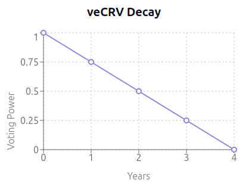
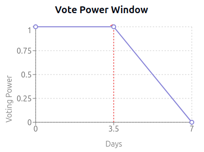

# Summary

Curve Finance is a multi-faceted DeFi protocol encompassing a decentralized exchange (DEX) primarily focused on stablecoin and correlated-asset swaps, lending markets (Llamalend), and a decentralized stablecoin (crvUSD). Its governance is managed via the Curve DAO using a vote-escrowed token model (veCRV).

# Overview

## Chain

Curve Finance's core governance (DAO) resides and operates on the Ethereum mainnet. While Curve protocol components are deployed across numerous EVM-compatible chains, this review focuses exclusively on the Ethereum mainnet deployment. Cross-chain messaging contracts and deployments on other chains are outside the scope of this analysis. As Ethereum is a mature Layer 1 blockchain, it meets the criteria for the lowest risk category.

> Chain score: Low

## Upgradeability

The Curve protocol incorporates significant upgradeability mechanisms, primarily managed by the Curve DAO via the `OwnershipAgentProxy`. This agent possesses administrative privileges over key contracts, including deployment factories, core DAO components, revenue distribution, and parameter setting contracts.

Key aspects include:

1.  **Contract Logic Upgrades:** The DAO can modify implementation contracts for core functions and future deployments.
2.  **Parameter Changes:** The DAO can adjust critical financial parameters in existing pools and markets, sometimes within defined bounds, potentially affecting performance and risk profiles.
3.  **Permission Control:** The DAO manages permissions within the Aragon framework and controls critical roles, including the ability to assign roles like adding strategies to the scrvUSD vault.
4.  **Emergency Controls:** The Emergency Multisig holds specific permissions, including potential ownership transfers of older factories, and direct access to assets in the `FeeCollector` contract.

This level of administrative control means upgrades or parameter changes have the technical capability to modify core logic or financial variables. Such changes, if implemented in certain ways, could expose users to outcomes described in the 'High' severity definition of the framework (potential fund loss or material performance alteration). Therefore, the protocol's upgradeability characteristics align with the 'High' risk score criteria.

> Upgradeability score: High

## Autonomy

There are no dependencies on external services or entities for core operations.

> Autonomy score: Low

## Exit Window

All governance votes occur over a 7 day time period, with voting frontloaded for the first half of the period due to the linear decay of veCRV voting power after this time.  This provides ample time to exit their positions.  Votes are usually executed quickly if successful, but the DAO has very limited powers to materially affect the users of Curve products without substantially hurting itself due to the incentive alignment due to veCRV locking and decaying mechanisms.

> Exit Window score: Medium

## Accessibility

Curve Finance's functionality can be accessed through multiple independent interfaces:

1.  **Primary UI:** The main interface is hosted at [curve.fi](https://curve.fi/).
2.  **Secondary UIs**: Other UIs exist which offer most required functionality, e.g. [crvhub.com](https://crvhub.com), [curvemonitor.com](https://curvemonitor.com).
2.  **Aggregators:** Numerous DEX aggregators (e.g., 1inch, Paraswap, Odos) integrate Curve pools, allowing users to trade and sometimes provide liquidity.
3.  **Yield Aggregators/Vaults:** Protocols like Yearn Finance, Convex Finance, StakeDAO build strategies on top of Curve, providing alternative access points.
4.  **Portfolio Managers:** Dashboards like Zapper, Zerion, DeBank allow users to interact with their Curve positions.
5.  **Wallet Integrations:** Some wallets offer direct interaction with DeFi protocols, including Curve.
6.  **Self-Hosting:** The interface code is all open-source, allowing users to self-host: [Curve Frontend Github Repo](https://github.com/curvefi/curve-frontend).

The existence of multiple, independent user interfaces and the open-source nature of the front-end guarantees access to user funds and core protocol functions even if the primary UI website becomes unavailable.

> Accessibility score: Low

# Technical Analysis

## Curve DAO - Aragon DAO Contracts

The Curve DAO is built on top of the Aragon DAO framework and has been running successfully since August 2020.

Users can lock their CRV tokens for veCRV (vote-escrowed CRV), which allows them to vote on proposals and receive a share of the revenue generated by the DAO. Users receive veCRV based on the duration of their lock, up to a maximum of four years. One veCRV equals one CRV locked for four years; however, the veCRV balance decays linearly over this period:

This system is designed to align incentives, encouraging the DAO to make positive long-term decisions and reducing the surface area for coin-voting governance attacks.

There are two vote types within the Curve DAO: Ownership votes and Parameter votes, each with different quorum and support thresholds:

- **Ownership Votes** - Minimum Quorum of 30%, 51% support
- **Parameter Votes** - Minimum Quorum of 15%, 60% support

Originally, Ownership votes were used for actions such as setting the owner/admin on contracts and approving gauges to receive CRV emissions, while Parameter votes handled changes to parameters within pools. Today, most votes within the Curve DAO are Ownership votes, as current participation levels allow for it.

All votes within the Curve DAO occur on Ethereum mainnet and are currently set to a **7-day** voting period. This can be adjusted by the DAO to any value between 0.5 and 14 days. To mitigate manipulation toward the end of the voting period, user voting power decays linearly to zero starting at day 3.5:

### **Contract Addresses**

| Contract Name                 | Address                                                                                                               |
|-------------------------------|-----------------------------------------------------------------------------------------------------------------------|
| VotingOwnershipProxy          | [0xE478de485ad2fe566d49342Cbd03E49ed7DB3356](https://etherscan.io/address/0xE478de485ad2fe566d49342Cbd03E49ed7DB3356) |
| VotingOwnershipImplementation | [0xa4D1a2693589840BABb7f3A44D14Fdf41b3bF1Fe](https://etherscan.io/address/0xa4D1a2693589840BABb7f3A44D14Fdf41b3bF1Fe) |
| VotingParameterProxy          | [0xBCfF8B0b9419b9A88c44546519b1e909cF330399](https://etherscan.io/address/0xBCfF8B0b9419b9A88c44546519b1e909cF330399) |
| VotingParameterImplementation | [0xa4D1a2693589840BABb7f3A44D14Fdf41b3bF1Fe](https://etherscan.io/address/0xa4D1a2693589840BABb7f3A44D14Fdf41b3bF1Fe) |
| OwnershipAgentProxy           | [0x40907540d8a6C65c637785e8f8B742ae6b0b9968](https://etherscan.io/address/0x40907540d8a6C65c637785e8f8B742ae6b0b9968) |
| OwnershipAgentImplementation  | [0x3A93C17FC82CC33420d1809dDA9Fb715cc89dd37](https://etherscan.io/address/0x3A93C17FC82CC33420d1809dDA9Fb715cc89dd37) |
| ParameterAgentProxy           | [0x4EEb3bA4f221cA16ed4A0cC7254E2E32DF948c5f](https://etherscan.io/address/0x4EEb3bA4f221cA16ed4A0cC7254E2E32DF948c5f) |
| ParameterAgentImplementation  | [0x3A93C17FC82CC33420d1809dDA9Fb715cc89dd37](https://etherscan.io/address/0x3A93C17FC82CC33420d1809dDA9Fb715cc89dd37) |
| KernelProxy                   | [0xad06868167BC5Ac5cFcbEf2CAFa82bc76961D72d](https://etherscan.io/address/0xad06868167BC5Ac5cFcbEf2CAFa82bc76961D72d) |
| KernelImplementation          | [0x2b33CF282f867A7FF693A66e11B0FcC5552e4425](https://etherscan.io/address/0x2b33CF282f867A7FF693A66e11B0FcC5552e4425) |
| ACLProxy                      | [0xBd0697BA421e7fEc529E3E76D9e9F3a710490369](https://etherscan.io/address/0xBd0697BA421e7fEc529E3E76D9e9F3a710490369) |
| ACLImplementation             | [0x81F7564e413586f1f99fDe55740Ac52b43cA99c9](https://etherscan.io/address/0x81F7564e413586f1f99fDe55740Ac52b43cA99c9) |
| CrvToken             | [0xD533a949740bb3306d119CC777fa900bA034cd52](https://etherscan.io/address/0xD533a949740bb3306d119CC777fa900bA034cd52) |
| CrvMinter            | [0xd061D61a4d941c39E5453435B6345Dc261C2fcE0](https://etherscan.io/address/0xd061D61a4d941c39E5453435B6345Dc261C2fcE0) |
| VecrvToken           | [0x5f3b5DfEb7B28CDbD7FAba78963EE202a494e2A2](https://etherscan.io/address/0x5f3b5DfEb7B28CDbD7FAba78963EE202a494e2A2) |
| SmartWalletWhitelist | [0xca719728Ef172d0961768581fdF35CB116e0B7a4](https://etherscan.io/address/0xca719728Ef172d0961768581fdF35CB116e0B7a4) |

### **Function Permissions**

| Contract             | Function                 | Owner (Current Owner)                         | Impact                                                                                                                                                                                                                                                                                                                                                                                             |
|----------------------|--------------------------|-----------------------------------------------|----------------------------------------------------------------------------------------------------------------------------------------------------------------------------------------------------------------------------------------------------------------------------------------------------------------------------------------------------------------------------------------------------|
| VotingOwnershipProxy | changeSupportRequiredPct | MODIFY_SUPPORT_ROLE (VotingOwnershipProxy)    | Changes the minimum percentage of “yes” votes for a proposal to be successful, out of the total votes cast.  Currently set to 51%.  The support must be higher than the QuorumPct, and less than 100%, however that's the only requirement.  Theoretically the Quorum could be 0% and Support could both be set at 0%, allowing any proposal to pass with a single "yes" vote.                                                                                                         |
| VotingOwnershipProxy | changeMinAcceptQuorumPct | MODIFY_QUORUM_ROLE (VotingOwnershipProxy)     | Changes the minimum percentage of votes cast for a proposal to be successful, out of the total possible votes.  Currently set to 30%, must be lower than supportRequiredPct.                                                                                                     |
| VotingOwnershipProxy | setMinBalance            | SET_MIN_BALANCE_ROLE (VotingOwnershipProxy)   | Changes the minimum amount of veCRV required to create a vote, currently set to 2,500 (10k CRV locked for 1 year, or 2.5k CRV locked for 4 years).  It must be between 2,500 and 50,000.  Increasing the minimum veCRV to a higher number could stop a rigorous and decentralized governance process.                                                                                                                                                                                                                                                                        |
| VotingOwnershipProxy | setMinTime               | SET_MIN_TIME_ROLE (VotingOwnershipProxy)      | Changes the minimum time a vote needs to be open for, currently set to 7 days.  It must be between 0.5 and 14 days.                                                                                                                                                                                                                                                                                   |
| VotingOwnershipProxy | newVote                  | CREATE_VOTES_ROLE (Anyone with >2500 veCRV)   | Creates a vote with an attached execution script which can be executed if the vote passes.                                                                                                                                                                                                                                                                                                         |
| VotingOwnershipProxy | votePct                  | Anyone (Anyone with >0 veCRV)                 | Vote for a proposal, can set a percentage so a portion of your total is split for “yes” and “no”.                                                                                                                                                                                                                                                                                                   |
| VotingParameterProxy | changeSupportRequiredPct | MODIFY_SUPPORT_ROLE (VotingParameterProxy)    | Changes the minimum percentage of “yes” votes for a proposal to be successful, out of the total votes cast.  Currently set to 60%.  The support must be higher than the QuorumPct, and less than 100%, however that's the only requirement.  Theoretically the Quorum could be 0% and Support could both be set at 0%, allowing any proposal to pass with a single "yes" vote.                                                                                                        |
| VotingParameterProxy | changeMinAcceptQuorumPct | MODIFY_QUORUM_ROLE (VotingParameterProxy)     | Changes the minimum percentage of votes cast for a proposal to be successful, out of the total possible votes.  Currently set to 15%, must be lower than supportRequiredPct.                                                                                                     |
| VotingParameterProxy | setMinBalance            | SET_MIN_BALANCE_ROLE (VotingParameterProxy)   | Changes the minimum amount of veCRV required to create a vote, currently set to 2,500 (10k CRV locked for 1 year, or 2.5k CRV locked for 4 years).  It must be between 2,500 and 50,000.  Increasing the minimum veCRV to a higher number could stop a rigorous and decentralized governance process.                                                                                                                                                                                                                                                                        |
| VotingParameterProxy | setMinTime               | SET_MIN_TIME_ROLE (VotingParameterProxy)      | Changes the minimum time a vote needs to be open for, currently set to 7 days.  It must be between 0.5 and 14 days.                                                                                                                                                                                                                                                                                 |
| VotingParameterProxy | newVote                  | CREATE_VOTES_ROLE (Anyone with >2500 veCRV)   | Creates a vote with an attached execution script which can be executed if the vote passes.                                                                                                                                                                                                                                                                                                         |
| VotingParameterProxy | votePct                  | Anyone (Anyone with >0 veCRV)                 | Vote for a proposal, can set a percentage so a portion of your total is split for “yes” and “no”.                                                                                                                                                                                                                                                                                                   |
| KernalProxy          | setApp                   | APP_MANAGER_ROLE (OwnershipAgentProxy)        | Allows the DAO proxy and implementation contracts to all be upgradable by the app manager.                                                                                                                                                                                                                                                                                                                 |
| ACLProxy             | createPermission         | CREATE_PERMISSIONS_ROLE (OwnershipAgentProxy) | Creates a permission (role) that wasn't previously set and managed.  There are currently no permissions created.  So for any permissions to be granted/revoked/burnt/managers set, permissions must first be created.  The DAO has that ultimate authority through the VotingOwnershipProxy which controls the OwnershipAgentProxy.           |
| ACLProxy             | grantPermission          | None (None)                                   | Grants an existing permission (role) to an entity in an app.                                                                                                                                                                                                                                                                                                                                        |
| ACLProxy             | grantPermissionP         | None (None)                                   | Grants an existing permission (role) to an entity with parameters in an app.                                                                                                                                                                                                                                                                                                                        |
| ACLProxy             | revokePermission         | None (None)                                   | Revokes an existing permission (role) from an entity in a certain app.                                                                                                                                                                                                                                                                                                                              |
| ACLProxy             | setPermissionManager     | None (None)                                   | Sets the manager of a permission (role) in an app to a certain entity, allowing them control over access to that permission (role).                                                                                                                                                                                                                                                                 |
| ACLProxy             | removePermissionManager  | None (None)                                   | Removes the manager of a permission (role) in an app.                                                                                                                                                                                                                                                                                                                                               |
| ACLProxy             | createBurnedPermission   | CREATE_PERMISSIONS_ROLE (OwnershipAgentProxy) | Burn a non-existent permission (role) in an app so that no changes can be made.                                                                                                                                                                                                                                                                                                                     |
| ACLProxy             | burnPermissionManager    | None (None)                                   | Burns a role in an app so no modification can be made.                                                                                                                                                                                                                                                                                                                                            |
| OwnershipAgentProxy  | execute                  | EXECUTE_ROLE (VotingOwnershipProxy)           | Executes a transaction by an agent.  This agent is the contract which is the admin/owner of most contracts within the Curve Finance ecosystem.  The only way the agent can execute a transaction is by a successful Ownership vote, which includes a transaction for the OwnershipAgent to execute.  The DAO could theoretically pass a vote allowing another entity access to the EXECUTE_ROLE on this agent, which would allow it to perform some malicious actions, however most LPs to pools and lending markets would be unaffected.  |
| ParameterAgentProxy  | execute                  | EXECUTE_ROLE (VotingParameterProxy)           | Executes a transaction by agent.  This agent is used less than previously, most contracts simply use the OwnershipAgent for all admin functions currently.  However this ParameterAgent is still used to set parameters in older pools, which could be used maliciously to set fees and parameters to undesirable settings.                                                                                                                                                              |
| CrvToken             | set_admin                     | admin (OwnershipAgentProxy)                                                          | Set a new admin for the contract.                                                                                                                                                                                                                                                                                                                                                                                                                        |
| CrvToken             | set_name                      | admin (OwnershipAgentProxy)                                                          | Low impact, the admin can only set the name and symbol of the token.                                                                                                                                                                                                                                                                                                                                                                                     |
| VecrvToken           | commit_transfer_ownership     | admin (OwnershipAgentProxy)                                                          | Set a new admin for the contract.                                                                                                                                                                                                                                                                                                                                                                                                                        |
| VecrvToken           | apply_transfer_ownership      | admin (OwnershipAgentProxy)                                                          | Apply the next admin for the contract.                                                                                                                                                                                                                                                                                                                                                                                                                   |
| VecrvToken           | commit_smart_wallet_checker   | admin (OwnershipAgentProxy)                                                          | CRV cannot be locked into veCRV by smart contracts unless allowed by the smart_wallet_checker contract, the admin can change the checker contract.  This commits the next contract.                                                                                                                                                                                                                                                                      |
| VecrvToken           | apply_smart_wallet_checker    | admin (OwnershipAgentProxy)                                                          | Admin can apply the committed smart_wallet_checker contract after commitment.                                                                                                                                                                                                                                                                                                                                                                            |
| SmartWalletWhitelist | approveWallet                 | admin (OwnershipAgentProxy)                                                          | The admin can approve any smart contract so they can mint veCRV.                                                                                                                                                                                                                                                                                                                                                                                        |
| SmartWalletWhitelist | revokeWallet                  | admin (OwnershipAgentProxy)                                                          | The admin can revoke a smart contract from being able to mint or increace lock duration for veCRV, however all current CRV remains locked and veCRV voting power decays until unlock happens and CRV can be withdrawn.                                                                                                                                                                                                                                                      |

---

## Curve Emergency DAO (old) - Aragon DAO Contracts

As a complement to the main DAO, an `EmergencyDAO` was setup, which would be able to act quickly, with a voting period of just 24hrs instead of 7 days.  The contracts are the same as the main DAO, and are upgradable.  The main DAO retains control over this `EmergencyDAO` with the power to issue and burn voting tokens for members.

This has been since moved to a 5/9 multisig called `EmergencyMultisig` with no direct control possible by the main DAO.  However, some contracts, namely the veCRV `FeeDistributor (old)` are hardcoded to send funds in emergency situations to the old `EmergencyDAO`.  Because of this, it is documented below.

### **Contract Addresses**

| Contract Name                       | Address                                                                                                               |
|-------------------------------------|-----------------------------------------------------------------------------------------------------------------------|
| VotingEmergencyProxy                | [0x1115c9b3168563354137cdc60efb66552dd50678](https://etherscan.io/address/0x1115c9b3168563354137cdc60efb66552dd50678) |
| VotingEmergencyImplementation       | [0xb935C3D80229d5D92f3761b17Cd81dC2610e3a45](https://etherscan.io/address/0xb935C3D80229d5D92f3761b17Cd81dC2610e3a45) |
| AgentEmergencyProxy                 | [0x00669DF67E4827FCc0E48A1838a8d5AB79281909](https://etherscan.io/address/0x00669DF67E4827FCc0E48A1838a8d5AB79281909) |
| AgentEmergencyImplementation        | [0x3A93C17FC82CC33420d1809dDA9Fb715cc89dd37](https://etherscan.io/address/0x3A93C17FC82CC33420d1809dDA9Fb715cc89dd37) |
| KernelEmergencyProxy                | [0x79CF3E23EDed0fc20992b79ACb3B3ffB7C6799b4](https://etherscan.io/address/0x79CF3E23EDed0fc20992b79ACb3B3ffB7C6799b4) |
| KernelEmergencyImplementation       | [0x2b33CF282f867A7FF693A66e11B0FcC5552e4425](https://etherscan.io/address/0x2b33CF282f867A7FF693A66e11B0FcC5552e4425) |
| ACLEmergencyProxy                   | [0x2e6F008efF832b80161F739Dd9CB48F855A6f499](https://etherscan.io/address/0x2e6F008efF832b80161F739Dd9CB48F855A6f499) |
| ACLEmergencyImplementation          | [0x81F7564e413586f1f99fDe55740Ac52b43cA99c9](https://etherscan.io/address/0x81F7564e413586f1f99fDe55740Ac52b43cA99c9) |
| EmergencyToken                      | [0x923573a3F7C2D94d647De85714106Ba3E45B1dED](https://etherscan.io/address/0x923573a3F7C2D94d647De85714106Ba3E45B1dED) |
| EmergencyTokenManagerProxy          | [0xf409Ce40B5bb1e4Ef8e97b1979629859c6d5481f](https://etherscan.io/address/0xf409Ce40B5bb1e4Ef8e97b1979629859c6d5481f) |
| EmergencyTokenManagerImplementation | [0xde3A93028F2283cc28756B3674BD657eaFB992f4](https://etherscan.io/address/0xde3A93028F2283cc28756B3674BD657eaFB992f4) |

### **Function Permissions**

| Contract             | Function                 | Owner (Current Owner)                                                | Impact                                                                                                                                                                                                                |
|----------------------|--------------------------|----------------------------------------------------------------------|-----------------------------------------------------------------------------------------------------------------------------------------------------------------------------------------------------------------------|
| VotingEmergencyProxy | changeSupportRequiredPct | MODIFY_SUPPORT_ROLE (VotingEmergencyProxy)                           | Changes the minimum percentage of “yes” votes for a proposal to be successful, out of the total votes cast.  Set to 60%.  It can only be changed with a vote from it's own contract.                                  |
| VotingEmergencyProxy | changeMinAcceptQuorumPct | MODIFY_QUORUM_ROLE (VotingEmergencyProxy)                            | Changes the minimum percentage of votes cast for a proposal to be successful, out of the total possible votes.  Currently set to 51%.  It can only be changed with a vote from it's own contract.                     |
| VotingEmergencyProxy | newVote                  | CREATE_VOTES_ROLE (Token Holders through EmergencyTokenManagerProxy)                       | Creates a vote with an attached execution script which can be executed if the vote passes.                                                                                                                            |
| VotingEmergencyProxy | vote                     | Token Holders                            | Vote for a proposal either “yes” or “no” using the 1 allocated vote.                                                                                                                                                            |
| AgentEmergencyProxy  | execute                  | EXECUTE_ROLE (VotingEmergencyProxy)                                  | Executes a transaction by the agent.                                                                                                                                                                                  |
| KernalEmergencyProxy | setApp                   | APP_MANAGER_ROLE (VotingEmergencyProxy)                              | Allows the Emergency DAO proxy and implementation contract to be upgradable by the app manager.                                                                                                                        |
| ACLEmergencyProxy    | createPermission         | CREATE_PERMISSIONS_ROLE (VotingEmergencyProxy)                       | Creates a permission (role) that wasn't previously set and managed.  There are currently no permissions created.  So for any permissions to be granted/revoked/burnt/managers set, permissions must first be created. |
| ACLEmergencyProxy    | grantPermission          | None (None)                                                          | Grants an existing permission (role) to an entity in an app.                                                                                                                                                           |
| ACLEmergencyProxy    | grantPermissionP         | None (None)                                                          | Grants an existing permission (role) to an entity with parameters in an app.                                                                                                                                           |
| ACLEmergencyProxy    | revokePermission         | None (None)                                                          | Revokes an existing permission (role) from an entity in a certain app.                                                                                                                                                 |
| ACLEmergencyProxy    | setPermissionManager     | None (None)                                                          | Sets the manager of a permission (role) in an app to a certain entity, allowing them control over access to that permission (role).                                                                                    |
| ACLEmergencyProxy    | removePermissionManager  | None (None)                                                          | Removes the manager of a permission (role) in an app                                                                                                                                                                  |
| ACLEmergencyProxy    | createBurnedPermission   | CREATE_PERMISSIONS_ROLE (VotingEmergencyProxy)                       | Burn a non-existent permission (role) in an app so that no changes can be made.                                                                                                                                        |
| ACLEmergencyProxy    | burnPermissionManager    | None (None)                                                          | Burns a role in an app so no modification can be made.                                                                                                                                                               |
| EmergencyToken       | changeController         | Controller (VotingOwnershipProxy through EmergencyTokenManagerProxy) | Changes the controller (owner/admin) to a new entity                                                                                                                                                                  |
| EmergencyToken       | generateTokens           | Controller (VotingOwnershipProxy through EmergencyTokenManagerProxy) | Mints tokens to new members, no member can have more than 1 token.  The main DAO is the only entity allowed to do this.                                                                                                |
| EmergencyToken       | destroyTokens            | Controller (VotingOwnershipProxy through EmergencyTokenManagerProxy) | The controller can destroy tokens, in case members lose access to a wallet, or accidentally transfer them to someone else.                                                                                            |
| EmergencyToken       | claimTokens              | Controller (VotingOwnershipProxy through EmergencyTokenManagerProxy) | Claim any ERC20 tokens mistakenly sent to the contract address.                                                                                                                                                        |
| EmergencyToken       | enableTransfers          | Controller (VotingOwnershipProxy through EmergencyTokenManagerProxy) | Allows holders of the token to transfer the tokens if set to true.                                                                                                                                                     |

---

## Curve DAO - Revenue Sharing Contracts

The Curve DAO earns revenue from it's decentralized exchange pools and from interest charged on crvUSD mints.  The DAO votes on how to allocate this revenue, and what portion of it flows back to veCRV holders.  This process is documented here: [Fee Collection](https://docs.curve.fi/fees/overview/).

### **Contract Addresses**

| Contract Name        | Address                                                                                                               |
|----------------------|-----------------------------------------------------------------------------------------------------------------------|
| FeeDistributor (old) | [0xA464e6DCda8AC41e03616F95f4BC98a13b8922Dc](https://etherscan.io/address/0xA464e6DCda8AC41e03616F95f4BC98a13b8922Dc) |
| FeeCollector         | [0xa2Bcd1a4Efbd04B63cd03f5aFf2561106ebCCE00](https://etherscan.io/address/0xa2Bcd1a4Efbd04B63cd03f5aFf2561106ebCCE00) |
| FeeBurner            | [0xC0fC3dDfec95ca45A0D2393F518D3EA1ccF44f8b](https://etherscan.io/address/0xC0fC3dDfec95ca45A0D2393F518D3EA1ccF44f8b) |
| FeeHooker            | [0x9A9DF35cd8E88565694CA6AD5093c236C7f6f69D](https://etherscan.io/address/0x9A9DF35cd8E88565694CA6AD5093c236C7f6f69D) |
| FeeDistributor       | [0xD16d5eC345Dd86Fb63C6a9C43c517210F1027914](https://etherscan.io/address/0xD16d5eC345Dd86Fb63C6a9C43c517210F1027914) |
| FeeSplitter          | [0x2dFd89449faff8a532790667baB21cF733C064f2](https://etherscan.io/address/0x2dFd89449faff8a532790667baB21cF733C064f2) |

### **Function Permissions**

| Contract             | Function                      | Owner (Current Owner)                                                                | Impact                                                                                                                                                                                                                                                                                                                                                                                                                                                  |
|----------------------|-------------------------------|--------------------------------------------------------------------------------------|---------------------------------------------------------------------------------------------------------------------------------------------------------------------------------------------------------------------------------------------------------------------------------------------------------------------------------------------------------------------------------------------------------------------------------------------------------|
| FeeDistributor (old) | commit_admin                  | admin (OwnershipAgentProxy)                                                          | Commit the next admin of the contract.                                                                                                                                                                                                                                                                                                                                                                                                                   |
| FeeDistributor (old) | apply_admin                   | admin (OwnershipAgentProxy)                                                          | Apply the next admin for the contract.                                                                                                                                                                                                                                                                                                                                                                                                                   |
| FeeDistributor (old) | kill_me                       | admin (OwnershipAgentProxy)                                                          | Admin can call this function which sends all unclaimed 3CRV rewards allocated to veCRV holders  to a hardcoded at initialization emergency admin address.  Currently there is around $2.6M in this contract.  These funds will always be distributed to the `EmergencyDAO` from this function, which the main DAO has admin controls over.  However the old `EmergencyDAO` could steal these funds if they colluded before the DAO could act. |
| FeeDistributor (old) | recover_balance               | admin (OwnershipAgentProxy)                                                          | The admin can recover any ERC20 tokens which are mistakenly sent to this address, except the 3CRV tokens, which can only be recovered through the `kill_me` function.                                                                                                                                                                                                                                                                                      |
| FeeCollector         | recover                       | owner, emergency_owner (OwnershipAgentProxy, EmergencyMultisig)                           | The owner and emergency owner can both transfer any ERC20 tokens from this contract.  Currently, as the owner is the DAO, the emergency owner (`EmergencyMultisig`) could steal around 8 days of fees before the DAO could vote to revoke their permission.                                                                                                                                                                                                     |
| FeeCollector         | set_max_fee                   | owner (OwnershipAgentProxy)                                                          | Set a new max_fee (reward) for forwarding to the hooker currently 0.28%.                                                                                                                                                                                                                                                                                                                                                                                 |
| FeeCollector         | set_burner                    | owner (OwnershipAgentProxy)                                                          | Sets a new burner to swap ERC20 tokens into crvUSD, must implement the `BURNER_INTERFACE_ID`.                                                                                                                                                                                                                                                                                                                                                              |
| FeeCollector         | set_hooker                    | owner (OwnershipAgentProxy)                                                          | Sets a new hooker to forward crvUSD through `HOOKER_INTERFACE` to the `FeeDistributor`.                                                                                                                                                                                                                                                                                                                                                                      |
| FeeCollector         | set_target                    | owner (OwnershipAgentProxy)                                                          | Change from crvUSD to another coin for fee accumulation.                                                                                                                                                                                                                                                                                                                                                                                                 |
| FeeCollector         | set_killed                    | owner, emergency_owner (OwnershipAgentProxy, EmergencyMultisig)                           | Setting a coin to killed stops that specific coin from being burnt.                                                                                                                                                                                                                                                                                                                                                                                      |
| FeeCollector         | set_owner                     | owner (OwnershipAgentProxy)                                                          | Set a new owner for the contract.                                                                                                                                                                                                                                                                                                                                                                                                                        |
| FeeCollector         | set_emergency_owner           | owner (OwnershipAgentProxy)                                                          | Set a new emergency owner for the contract.                                                                                                                                                                                                                                                                                                                                                                                                              |
| FeeBurner            | set_target_threshold          | FeeCollector.owner (OwnershipAgentProxy)                                             | Sets the minimum received crvUSD from a swap, currently 500                                                                                                                                                                                                                                                                                                                                                                                             |
| FeeBurner            | recover                       | FeeCollector.owner, FeeCollector.emergency_owner (OwnershipAgentProxy, EmergencyMultisig) | The owner and emergency owner can both transfer any ERC20 tokens from this contract.  Currently, as the owner is the DAO, the emergency owner (`EmergencyMultisig`) could steal around 8 days of fees before the DAO could vote to revoke their permission.                                                                                                                                                                                                     |
| FeeHooker            | one_time_hooks                | FeeCollector.owner (OwnershipAgentProxy)                                             | Allows flexibility for the DAO to do a single time hook before the tokens are sent to the `FeeDistributor`.  All hooks must be approved by the DAO.                                                                                                                                                                                                                                                                                                        |
| FeeHooker            | set_hooks                     | FeeCollector.owner (OwnershipAgentProxy)                                             | Allows flexibility for the DAO to do interesting things before the tokens are sent to the `FeeDistributor`.  All hooks must be approved by the DAO.                                                                                                                                                                                                                                                                                                        |
| FeeHooker            | recover                       | FeeCollector.owner, FeeCollector.emergency_owner (OwnershipAgentProxy, EmergencyMultisig) | The owner and emergency owner can both transfer any ERC20 tokens from this contract.  Currently, as the owner is the DAO, the emergency owner (`EmergencyMultisig`) could steal around 8 days of fees before the DAO could vote to revoke their permission.                                                                                                                                                                                                     |
| FeeDistributor       | commit_admin                  | admin (OwnershipAgentProxy)                                                          | Commit the next admin of the contract.                                                                                                                                                                                                                                                                                                                                                                                                                   |
| FeeDistributor       | apply_admin                   | admin (OwnershipAgentProxy)                                                          | Apply the next admin for the contract.                                                                                                                                                                                                                                                                                                                                                                                                                   |
| FeeDistributor       | toggle_allow_checkpoint_token | admin (OwnershipAgentProxy)                                                          | veCRV balances decay over time, this setting allows users to perform actions to update veCRV balances if enabled (currently is enabled).                                                                                                                                                                                                                                                                                                             |
| FeeDistributor       | kill_me                       | admin (OwnershipAgentProxy)                                                          | The admin can kill this contract which sends all unclaimed crvUSD rewards for veCRV holders to the emergency return address (hardcoded to be the `EmergencyMultisig`).  Currently there is around $500k in this contract.  This means there are 2 layers of protection for the funds in this contract.                                                                                                                                                          |
| FeeDistributor       | recover                       | admin (OwnershipAgentProxy)                                                          | The admin can transfer any ERC20 tokens from this contract to the hardcoded emergency return address (`EmergencyMultisig`), except the defined reward token to be distributed.                                                                                                                                                                                                                                                                                                                                      |
| FeeSplitter          | set_receivers                 | owner (OwnershipAgentProxy)                                                          | Owner can set where future crvUSD revenue flows to from the fees collected in crvUSD minting markets, with dynamic splitting possible.  There are no requirements or stipulations.  Currently the admin is the DAO, and as it is revenue of the DAO, it makes sense it can vote to choose where it goes.  The admin cannot be changed of this contract.                                                                      |
| FeeSplitter          | transfer_ownership            | owner (OwnershipAgentProxy)                                                          | Transfers the ownership of the contract to another address (can’t be the 0x0000...0 address).                                                                                                                                                                                                                                                                                                                                                            |
| FeeSplitter          | renounce_ownership            | owner (OwnershipAgentProxy)                                                          | Sets the owner as the empty address (0x0000...0).                                                                                                                                                                                                                                                                                                                                                                                                        |

---

## crvUSD & scrvUSD Contracts

### **Contract Addresses**

| Contract Name                         | Address                                                                                                               |
|---------------------------------------|-----------------------------------------------------------------------------------------------------------------------|
| CrvusdToken                           | [0xf939E0A03FB07F59A73314E73794Be0E57ac1b4E](https://etherscan.io/address/0xf939E0A03FB07F59A73314E73794Be0E57ac1b4E) |
| CrvusdControllerFactory               | [0xC9332fdCB1C491Dcc683bAe86Fe3cb70360738BC](https://etherscan.io/address/0xC9332fdCB1C491Dcc683bAe86Fe3cb70360738BC) |
| CrvusdController                      | [0x652aEa6B22310C89DCc506710CaD24d2Dba56B11](https://etherscan.io/address/0x652aEa6B22310C89DCc506710CaD24d2Dba56B11) |
| CrvusdLlamma                          | [0x9a2e6bb3114B1EEB5492D97188A3ECB09E39fac8](https://etherscan.io/address/0x9a2e6bb3114B1EEB5492D97188A3ECB09E39fac8) |
| CrvusdLlammaPriceOracle               | [0x0a9aE947495034C0bBBAB845Fd75b5BBAfc91aAb](https://etherscan.io/address/0x0a9aE947495034C0bBBAB845Fd75b5BBAfc91aAb) |
| CrvusdMonetaryPolicy                  | [0x8D76F31E7C3b8f637131dF15D9b4a3F8ba93bd75](https://etherscan.io/address/0x8D76F31E7C3b8f637131dF15D9b4a3F8ba93bd75) |
| CrvusdPegKeeperV2                     | [0x9201da0D97CaAAff53f01B2fB56767C7072dE340](https://etherscan.io/address/0x9201da0D97CaAAff53f01B2fB56767C7072dE340) |
| CrvusdPegKeeperRegulator              | [0x36a04CAffc681fa179558B2Aaba30395CDdd855f](https://etherscan.io/address/0x36a04CAffc681fa179558B2Aaba30395CDdd855f) |
| CrvusdPegKeeperPriceAggregator        | [0x18672b1b0c623a30089A280Ed9256379fb0E4E62](https://etherscan.io/address/0x18672b1b0c623a30089A280Ed9256379fb0E4E62) |
| ScrvUSDRewardHandler                  | [0xE8d1E2531761406Af1615A6764B0d5fF52736F56](https://etherscan.io/address/0xE8d1E2531761406Af1615A6764B0d5fF52736F56) |
| ScrvusdTokenYearnV3VaultProxy         | [0x0655977FEb2f289A4aB78af67BAB0d17aAb84367](https://etherscan.io/address/0x0655977FEb2f289A4aB78af67BAB0d17aAb84367) |
| ScrvusdTokenYearnV3VaultImplemetation | [0xd8063123BBA3B480569244AE66BFE72B6c84b00d](https://etherscan.io/address/0xd8063123BBA3B480569244AE66BFE72B6c84b00d) |

### **Function Permissions**

| Contract                       | Function                     | Owner (Current Owner)                                      | Impact                                                                                                                                                                                                                                                                                                                                               |
|--------------------------------|------------------------------|------------------------------------------------------------|------------------------------------------------------------------------------------------------------------------------------------------------------------------------------------------------------------------------------------------------------------------------------------------------------------------------------------------------------|
| CrvusdToken                    | set_minter                   | minter (CrvusdControllerFactory)                           | This function sets a new contract to be able to mint crvusd, but thankfully it’s effectively useless.  The minter was set to the `crvusdControllerFactory` at deployment, but the `crvusdControllerFactory` has no way of calling this function, making it redundant.                                                                                     |
| CrvusdControllerFactory        | add_market                   | admin (OwnershipAgentProxy)                                | The admin can create new crvUSD markets with parameters hardcoded between min and max values.                                                                                                                                                                                                                                                         |
| CrvusdControllerFactory        | set_implemenations           | admin (OwnershipAgentProxy)                                | Update underlying contracts for the controller and amm implementations so new markets can have new features.  This has no affect on current markets.                                                                                                                                                                                                    |
| CrvusdControllerFactory        | set_admin                    | admin (OwnershipAgentProxy)                                | Change the owner.                                                                                                                                                                                                                                                                                                                                     |
| CrvusdControllerFactory        | set_fee_receiver             | admin (OwnershipAgentProxy)                                | Set a new fee receiver (currently the `FeeSplitter`).                                                                                                                                                                                                                                                                                                  |
| CrvusdControllerFactory        | set_debt_ceiling             | admin (OwnershipAgentProxy)                                | Set debt ceilings for all markets created by this factory.                                                                                                                                                                                                                                                                                            |
| CrvusdControllerFactory        | collect_fees_above_ceiling   | admin (OwnershipAgentProxy)                                | If debt ceiling is maxed, collect fees above ceiling.                                                                                                                                                                                                                                                                                                 |
| CrvusdController               | set_amm_fee                  | crvusdControllerFactory.admin (OwnershipAgentProxy)        | The fee can be changed to a maximum value, up to 4% for most markets, and to around 6% for LBTC, weETH, cbBTC, as it’s based on band widths and liquidity density.                                                                                                                                                                                    |
| CrvusdController               | set_monetary_policy          | crvusdControllerFactory.admin (OwnershipAgentProxy)        | Change the monetary policy contract which sets the borrowing interest rate, however it has a hard ceiling of 300% APY, and cannot go higher.                                                                                                                                                                              |
| CrvusdController               | set_borrowing_discounts      | crvusdControllerFactory.admin (OwnershipAgentProxy)        | Set `liquidation_discount` and `loan_discount` to values between the min and max hardcoded values (min 1%, max 50%, `loan_discount > liquidation_discount`), essentially discounting collateral within current loans, which could liquidate some loans.                                                                                                |
| CrvusdController               | set_callback                 | crvusdControllerFactory.admin (OwnershipAgentProxy)        | The admin can set a contract which is called after liquidity is deposited to the amm/withdrawn from the amm, so liquidity mining, creating the possibility of liquidity mining for borrows or a gauge to incentivize borrowing.                                                                                                                                         |
| CrvusdLlamma                   | deposit_range                | admin (CrvusdController)                                   | The controller calls this function in it’s `create_loan`, `repay`, and `repay_extended` external functions.  The admin is hardcoded as the specific controller relating to this LLAMMA, and cannot be changed.                                                                                                                                              |
| CrvusdLlamma                   | withdraw                     | admin (CrvusdController)                                   | The controller calls this function in it’s `create_loan`, `repay`, and `repay_extended` external functions.  The admin is hardcoded as the specific controller relating to this LLAMMA, and cannot be changed.                                                                                                                                              |
| CrvusdLlamma                   | set_rate                     | admin (CrvusdController)                                   | The controller gets the rate from the monetary policy contract and writes it to the AMM.                                                                                                                                                                                                                                                               |
| CrvusdLlamma                   | set_fee                      | admin (CrvusdController)                                   | The controller sets the AMM fee from it’s `set_amm_fee` function detailed above.                                                                                                                                                                                                                                                                        |
| CrvusdLlamma                   | set_admin_fee                | admin (CrvusdController)                                   | This function can only be called from the controller contract, however it is not implemented in any controller function, making this function redundant.                                                                                                                                                                                              |
| CrvusdLlamma                   | reset_admin_fees             | admin (CrvusdController)                                   | This function can only be called from the controller contract, however it is not implemented in any controller function, making this function redundant.                                                                                                                                                                                              |
| CrvusdLlamma                   | set_callback                 | admin (CrvusdController)                                   | This function is called from the `set_callback` function on the controller.                                                                                                                                                                                                                                                                             |
| CrvusdMonetaryPolicy           | set_admin                    | admin (OwnershipAgentProxy)                                | Change the owner.                                                                                                                                                                                                                                                                                                                                     |
| CrvusdMonetaryPolicy           | add_peg_keeper               | admin (OwnershipAgentProxy)                                | Add a pegkeeper, which changes the rate calculation based on the oracle price of the asset of the pegkeeper and the amount of debt in pool LP tokens it currently holds.                                                                                                                                                                                  |
| CrvusdMonetaryPolicy           | remove_peg_keeper            | admin (OwnershipAgentProxy)                                | Remove a pegkeeper from the rate calculation.                                                                                                                                                                                                                                                                                                         |
| CrvusdMonetaryPolicy           | set_rate                     | admin (OwnershipAgentProxy)                                | Manually sets the rate to a certain value less than the hardcoded value, but this contract also exports this rate to the Controller, it also has a hardcoded max value as well (currently 300%).  So even if this contract is swapped out, the max interest cannot be higher than the hardcoded controller value.                                                                       |
| CrvusdMonetaryPolicy           | set_sigma                    | admin (OwnershipAgentProxy)                                | Sigma affects how quickly the rates change w.r.t debt balances of the pegkeepers and the crvusd peg found from oracles in crvusd pools in curve.  Higher sigma = more volatility in the rates.                                                                                                                                                        |
| CrvusdMonetaryPolicy           | set_target_debt_fraction     | admin (OwnershipAgentProxy)                                | crvusd targets a specific debt fraction (currently 80% of the debt limit) so rates are lower below this fraction, and go higher faster above this limit.  The owner of the contract can change this fraction.                                                                                                                                         |
| CrvusdMonetaryPolicy           | set_extra_const              | admin (OwnershipAgentProxy)                                | A constant can be added to the rate at all times, e.g. for wstETH markets, 2% is added, so that the user is still making yield, but this is reduced and the DAO is also benefiting from this.  This could be theoretically be set to 300% (max hardcoded value) by the admin.                                                                                               |
| CrvusdPegKeeperV2              | set_new_action_delay         | admin (OwnershipAgentProxy)                                | PegKeepers have a minimum time period before another update is allowed.  Updating a pegkeeper makes it check whether it needs to withdraw from a pool and burn crvUSD if it’s below peg, or borrow crvusd and deposit to it’s allowed pool if crvusd is above peg, this set_new_action_delay changes the frequency of allowed updates.                |
| CrvusdPegKeeperV2              | set_new_caller_share         | admin (OwnershipAgentProxy)                                | PegKeeper updates are profitable, they are essentially selling crvusd above peg, and buying below peg. But to be trustless they need to be updated permissionlessly, so anyone can call to update a pegkeepers balance and they are rewarded with a small share of the profit.  This function changes this share, up to a maximum hardcoded value. |
| CrvusdPegKeeperV2              | set_new_regulator            | admin (OwnershipAgentProxy)                                | The regulator has certain controls over the PegKeepers, it can kill/pause them, and has to check whether an update is allowed, before performing an update.                                                                                                                                                                                           |
| CrvusdPegKeeperV2              | commit_new_admin             | admin (OwnershipAgentProxy)                                | Commit the next admin of the contract.                                                                                                                                                                                                                                                                                                                |
| CrvusdPegKeeperV2              | apply_new_admin              | admin (OwnershipAgentProxy)                                | Apply the next admin for the contract.                                                                                                                                                                                                                                                                                                                |
| CrvusdPegKeeperRegulator       | add_peg_keepers              | admin (OwnershipAgentProxy)                                | Adding a pegkeeper adds an oracle price to the regulator for the pool the pegkeeper is tasked with maintaining. This affects the calculation of the crvusd peg, and sets a maximum debt limit for that specific pool.                                                                                                                                                               |
| CrvusdPegKeeperRegulator       | remove_peg_keepers           | admin (OwnershipAgentProxy)                                | Remvoing pegkeepers removes the pool and price oracle from the peg calculation for crvusd.                                                                                                                                                                                                                                                            |
| CrvusdPegKeeperRegulator       | set_worst_price_threshold    | admin (OwnershipAgentProxy)                                | Pegkeepers will not be allowed to perform actions if the price difference is more than the `worst_price_threshold`, this sets that value.                                                                                                                                                                                                               |
| CrvusdPegKeeperRegulator       | set_price_deviation          | admin (OwnershipAgentProxy)                                | The price deviation also is a safety parameter which can be set, if the price deviates out of the set range, no actions are allowed.                                                                                                                                                                                                                  |
| CrvusdPegKeeperRegulator       | set_debt_parameters          | admin (OwnershipAgentProxy)                                | Sets 2 debt calaculation parameters, alpha and beta, increase alpha to increase the individual allowed debt of each pegkeeper, increase beta to increase the collective debt, but reduces the ability for pegkeepers to act individually.                                                                 |
| CrvusdPegKeeperRegulator       | set_aggregator               | admin (OwnershipAgentProxy)                                | The crvusd price aggregator is the oracle of all the tracked crvusd pools.                                                                                                                                                                                                                                                                                    |
| CrvusdPegKeeperRegulator       | set_fee_receiver             | admin (OwnershipAgentProxy)                                | Set where the profit of the pegkeepers is sent, these are funds the dao controls.                                                                                                                                                                                                                                                                     |
| CrvusdPegKeeperRegulator       | set_killed                   | admin, emergency_admin (OwnershipAgentProxy, EmergencyMultisig) | Pause/kill the pegkeepers, this is allowed by both the admin and the emergency admin.                                                                                                                                                                                                                                                                    |
| CrvusdPegKeeperRegulator       | set_admin                    | admin (OwnershipAgentProxy)                                | Change the owner/admin of the pegkeeper regulator, which has access to the functions defined here.                                                                                                                                                                                                                                                    |
| CrvusdPegKeeperRegulator       | set_emergency_admin          | admin (OwnershipAgentProxy)                                | Change the emergency admin of the pegkeepers, allowing pause/kills, only accessible by the current admin (DAO).                                                                                                                                                                                                                                                       |
| CrvusdPegKeeperPriceAggregator | set_admin                    | admin (OwnershipAgentProxy)                                | Change the admin of this contract.                                                                                                                                                                                                                                                                                                                     |
| CrvusdPegKeeperPriceAggregator | add_price_pair               | admin (OwnershipAgentProxy)                                | Add any stableswap pool to the crvusd price calculation, it must have crvusd as an asset in the pool.  It uses the TVL of all the pools to find a weighted price average.                                                                                                                                                                             |
| CrvusdPegKeeperPriceAggregator | remove_price_pair            | admin (OwnershipAgentProxy)                                | Remove a pool from the crvusd price calculation.                                                                                                                                                                                                                                                                                                      |
| ScrvusdRewardHandler           | set_twa_snapshot_dt          | RATE_MANAGER (OwnershipAgentProxy)                         | Setter for the time-weighted average minimal frequency.                                                                                                                                                                                                                                                                                              |
| ScrvusdRewardHandler           | set_twa_window               | RATE_MANAGER (OwnershipAgentProxy)                         | Setter for the time-weighted average window.                                                                                                                                                                                                                                                                                                          |
| ScrvusdRewardHandler           | set_distribution_time        | RATE_MANAGER (OwnershipAgentProxy)                         | Admin function to correct the distribution rate of the rewards. Making this value lower will reduce the time it takes to stream the rewards. Setting it to 0 will immediately distribute all the rewards.  This is to stop twa window manipulation from MEV attacks, i.e. depositing before snapshot, withdraw after.                                 |
| ScrvusdRewardHandler           | set_minimum_weight           | RATE_MANAGER (OwnershipAgentProxy)                         | Sets the minimum share that flows to the scrvusd vault.                                                                                                                                                                                                                                                                                               |
| ScrvusdRewardHandler           | set_scaling_factor           | RATE_MANAGER (OwnershipAgentProxy)                         | There’s a scaling factor in the calculation for the revenue share scrvusd is allocated, it can be set through this.                                                                                                                                                                                                                                     |
| ScrvusdRewardHandler           | set_stablecoin_lens          | LENS_MANAGER (OwnershipAgentProxy)                         | The stablecoin lens contract calculates the circulating supply so the reward handler can request the correct amount of crvUSD.                                                                                                                                                                                                                        |
| ScrvusdRewardHandler           | recover_erc20                | RECOVERY_MANAGER (OwnershipAgentProxy)                     | Allows the owner (DAO) to recover other ERC20 tokens which are not crvUSD.                                                                                                                                                                                                                                                                            |
| ScrvusdTokenYearnV3VaultProxy  | setName                      | role_manager (OwnershipAgentProxy)                         | Set a new name for the Vault/Token.                                                                                                                                                                                                                                                                                                                   |
| ScrvusdTokenYearnV3VaultProxy  | setSymbol                    | role_manager (OwnershipAgentProxy)                         | Set a new symbol for the token.                                                                                                                                                                                                                                                                                                                       |
| ScrvusdTokenYearnV3VaultProxy  | set_role                     | role_manager (OwnershipAgentProxy)                         | Allows the `role_manager` to set roles for any address, this overrides existing roles if they aren’t also specified in the call.                                                                                                                                                                                                                        |
| ScrvusdTokenYearnV3VaultProxy  | add_role                     | role_manager (OwnershipAgentProxy)                         | Add a new role/s to an address.                                                                                                                                                                                                                                                                                                                       |
| ScrvusdTokenYearnV3VaultProxy  | remove_role                  | role_manager (OwnershipAgentProxy)                         | Remove a role/s from an address.                                                                                                                                                                                                                                                                                                                      |
| ScrvusdTokenYearnV3VaultProxy  | transfer_role_manager        | role_manager (OwnershipAgentProxy)                         | Transfers the future `role_manager` to a new address, which is step 1 of 2 to transfer the manager role.                                                                                                                                                                                                                                                |
| ScrvusdTokenYearnV3VaultProxy  | accept_role_manager          | future_role_manager (None)                                 | The future role manager accepts the future role manager.                                                                                                                                                                                                                                                                                              |
| ScrvusdTokenYearnV3VaultProxy  | set_accountant               | Roles.ACCOUNTANT_MANAGER (None)                            | Allows a current accountant to transfer their role to another address.                                                                                                                                                                                                                                                                                |
| ScrvusdTokenYearnV3VaultProxy  | set_default_queue            | Roles.QUEUE_MANAGER (None)                                 | Set the new default queue array.  The default queue serves as a withdrawal priority order for strategies when users redeem shares.  Currently unused as there is a single strategy.                                                                                                                                                                   |
| ScrvusdTokenYearnV3VaultProxy  | set_use_default_queue        | Roles.QUEUE_MANAGER (None)                                 | Sets the default queue to be used.  Currently set to false.                                                                                                                                                                                                                                                                                           |
| ScrvusdTokenYearnV3VaultProxy  | set_auto_allocate            | Roles.DEBT_MANAGER (Rewardhandler)                         | Only relevant when default queue is used with multiple strategies, unused here.                                                                                                                                                                                                                                                                       |
| ScrvusdTokenYearnV3VaultProxy  | set_deposit_limit            | Roles.DEPOSIT_LIMIT_MANAGER (scrvusdEmergencyMultisig)     | Sets a deposit limit for future deposits.  Currently set to infinite, however a 2/5 `scrvusdEmergencyMultisig` has control over this role, they could stop deposits for around 8 days until the DAO could vote to remove their role.                                                                                                                    |
| ScrvusdTokenYearnV3VaultProxy  | set_deposit_limit_module     | Roles.DEPOSIT_LIMIT_MANAGER (scrvusdEmergencyMultisig)     | Sets a deposit limit contract for custom logic for future deposit limits.  Currently the 2/5 `scrvusdEmergencyMultisig` has control over this role, they could not steal user deposits, simply stop some users depositing while allowing others until the DAO could act.                                                                                |
| ScrvusdTokenYearnV3VaultProxy  | set_withdrawal_limit_module  | Roles.WITHDRAW_LIMIT_MANAGER (None)                        | A contract can be set by an entity with `Roles.WITHDRAW_LIMIT_MANAGER` role, however currently this is unset.  The `role_manager` could add an entity here though to limit withdrawals if they wanted to.                                                                                                                                                 |
| ScrvusdTokenYearnV3VaultProxy  | set_minimum_total_idle       | Roles.MINIMUM_IDLE_MANAGER (None)                          | Sets the minimum amount of the underlying assets that should always remain idle (uninvested) in the vault.  Currently set to 0.                                                                                                                                                                                                                        |
| ScrvusdTokenYearnV3VaultProxy  | setProfitMaxUnlockTime       | Roles.PROFIT_UNLOCK_MANAGER (None)                         | This controls how fast the rewards are streamed to the depositors in the vault.  Must be less than 1year, currently set to 1 week.                                                                                                                                                                                                                   |
| ScrvusdTokenYearnV3VaultProxy  | process_report               | Roles.REPORTING_MANAGER (None)                             | This function processes a profit/loss report from a strategy.  Currently the external version of this function can’t be called manually from someone with the role, however the internal function is called to checkpoint balances when the `scrvusdRewardHandler` deposits crvUSD to the vault.                                                        |
| ScrvusdTokenYearnV3VaultProxy  | buy_debt                     | Roles.DEBT_PURCHASER (None)                                | This is used to buy bad debt from the vault.  As the only strategy is currently the `scrvUSDRewardHandler` depositing crvUSD, this is not relevant.  If the `role_manager` somehow was changed to a malicious actor however, this could be used.                                                                                                         |
| ScrvusdTokenYearnV3VaultProxy  | add_strategy                 | Roles.ADD_STRATEGY_MANAGER (None)                          | This is the main function which could be used to steal depositors crvUSD.  A malicious strategy could be used to drain balances, e.g. send crvUSD somewhere it can be stolen.  Currently no entity has permission to add strategies.  Only the `role_manager` (DAO) can give permission to do this.                                                    |
| ScrvusdTokenYearnV3VaultProxy  | revoke_strategy              | Roles.REVOKE_STRATEGY_MANAGER (None)                       | Revoking the current strategy could cause depositors to stop receiving any future yield.  It does not affect their current earnings.   The strategy must have 0 debt for this function call to succeed.                                                                                                                                               |
| ScrvusdTokenYearnV3VaultProxy  | force_revoke_strategy        | Roles.FORCE_REVOKE_MANAGER (None)                          | Forces a strategy to be revoked.  Not applicable to this vault in its current form as no debt is taken on.  But this function can force the exit of a strategy while forcing depositors to take a loss.                                                                                                                                              |
| ScrvusdTokenYearnV3VaultProxy  | update_max_debt_for_strategy | Roles.MAX_DEBT_MANAGER (None)                              | Sets a limit for how much capital can be applied to each strategy.  As the only strategy is the internal scrvusd strategy, this value is unlimited.                                                                                                                                                                                                   |
| ScrvusdTokenYearnV3VaultProxy  | update_debt                  | Roles.DEBT_MANAGER (scrvUSDRewardHandler)                  | The debt manager can increase or decrease the allocation of deposits to a certain strategy.  However this has no affect when the only strategy is the internal strategy.  Unless a new external strategy is added to the vault, this has no affect.                                                                                                   |
| ScrvusdTokenYearnV3VaultProxy  | shutdown_vault               | Roles.EMERGENCY_MANAGER (scrvusdEmergencyMultisig)         | Shuts down the vault and stops new deposits into the vault.  Users can withdraw in their own time.  No funds are not at risk, however no more rewards will flow.                                                                                                                                                                                     |
---

## Gauge Contracts

### **Contract Addresses**

| Contract Name    | Address                                                                                                               |
|------------------|-----------------------------------------------------------------------------------------------------------------------|
| GaugeController  | [0x2F50D538606Fa9EDD2B11E2446BEb18C9D5846bB](https://etherscan.io/address/0x2F50D538606Fa9EDD2B11E2446BEb18C9D5846bB) |
| LiquidityGaugeV6 | [0x479dFB03cdDEa20dC4e8788B81Fd7C7A08FD3555](https://etherscan.io/address/0x479dFB03cdDEa20dC4e8788B81Fd7C7A08FD3555) |

### **Function Permissions**

| Contract         | Function                  | Owner (Current Owner)                                                                           | Impact                                                                                                                                                                                                                                                                                                                                                              |
|------------------|---------------------------|-------------------------------------------------------------------------------------------------|---------------------------------------------------------------------------------------------------------------------------------------------------------------------------------------------------------------------------------------------------------------------------------------------------------------------------------------------------------------------|
| GaugeController  | commit_transfer_ownership | admin (OwnershipAgentProxy)                                                                     | Commit the next admin of the contract.                                                                                                                                                                                                                                                                                                                               |
| GaugeController  | apply_transfer_ownership  | admin (OwnershipAgentProxy)                                                                     | Apply the next admin for the contract.                                                                                                                                                                                                                                                                                                                               |
| GaugeController  | add_gauge                 | admin (OwnershipAgentProxy)                                                                     | Adds a gauge, allowing it to receive weight = CRV emissions.                                                                                                                                                                                                                                                                                                         |
| GaugeController  | add_type                  | admin (OwnershipAgentProxy)                                                                     | Add a gauge type – an outdated feature which isn’t used anymore, but can be used to put gauges into groups.                                                                                                                                                                                                                                                         |
| GaugeController  | change_type_weight        | admin (OwnershipAgentProxy)                                                                     | Change a gauge type to manually receive a share of CRV emissions.                                                                                                                                                                                                                                                                                                    |
| GaugeController  | change_gauge_weight       | admin (OwnershipAgentProxy)                                                                     | Change a gauge to manually receive a share of CRV emissions.                                                                                                                                                                                                                                                                                                         |
| LiquidityGaugeV6 | set_gauge_manager         | Factory.admin, manager (OwnershipAgentProxy, manager)                                           | The admin of the factory which deployed the gauge (`StableswapFactory`, `OneWayLendingFactory`, etc) or gauge manager can set a new gauge manager of this contract.                                                                                                                                                                                                   |
| LiquidityGaugeV6 | add_reward                | Factory.admin, manager (OwnershipAgentProxy, manager)                                           | This adds a new asset to manually incentivize users to deposit into the gauge.  After setting a reward it can be added by the defined `RewardDistributor`.                                                                                                                                                                                                             |
| LiquidityGaugeV6 | set_reward_distributor    | Factory.admin, manager, current_distributor (OwnershipAgentProxy, manager, current_distributor) | This defines a new entity to act as a reward distributor for a token to deposit into the gauge as incentives.                                                                                                                                                                                                                                                        |
| LiquidityGaugeV6 | set_killed                | Factory.admin (OwnershipAgentProxy)                                                             | The admin of the factory which deployed the gauge (`StableswapFactory`, `OneWayLendingFactory`, etc) can kill the gauge, in older pools and gauges the `EmergencyDAO`/`EmergencyMultisig` can also kill gauges.  Killing a gauge does nothing except stop new CRV emissions from being allocated to staked users.  All accrued emissions remain claimable for users forever. |

---

## Decentralized Exchange Contracts

### **Contract Addresses**

| Contract Name              | Address                                                                                                               |
|----------------------------|-----------------------------------------------------------------------------------------------------------------------|
| StableswapFactory          | [0x6A8cbed756804B16E05E741eDaBd5cB544AE21bf](https://etherscan.io/address/0x6A8cbed756804B16E05E741eDaBd5cB544AE21bf) |
| StableswapPoolNG           | [0x4f493B7dE8aAC7d55F71853688b1F7C8F0243C85](https://etherscan.io/address/0x4f493B7dE8aAC7d55F71853688b1F7C8F0243C85) |
| StableswapMetapoolNG       | [0xede71F77d7c900dCA5892720E76316C6E575F0F7](https://etherscan.io/address/0xede71F77d7c900dCA5892720E76316C6E575F0F7) |
| TwoCryptoFactory           | [0x98EE851a00abeE0d95D08cF4CA2BdCE32aeaAF7F](https://etherscan.io/address/0x98EE851a00abeE0d95D08cF4CA2BdCE32aeaAF7F) |
| TwoCryptoPoolNG            | [0x4ed22C5F2834591660c2926EcDC159864CFE96e0](https://etherscan.io/address/0x4ed22C5F2834591660c2926EcDC159864CFE96e0) |
| TriCryptoFactory           | [0x0c0e5f2fF0ff18a3be9b835635039256dC4B4963](https://etherscan.io/address/0x0c0e5f2fF0ff18a3be9b835635039256dC4B4963) |
| TriCryptoPoolNG            | [0x7F86Bf177Dd4F3494b841a37e810A34dD56c829B](https://etherscan.io/address/0x7F86Bf177Dd4F3494b841a37e810A34dD56c829B) |
| StableSwapOwnerProxy (old) | [0x0959158b6040D32d04c301A72CBFD6b39E21c9AE](https://etherscan.io/address/0x0959158b6040D32d04c301A72CBFD6b39E21c9AE) |

*Note: some older factories are owned by proxy contract such as `StableSwapOwnerProxy (old)` which grants permission to different admins for different functions within the factory and pools, essentially splitting the sole admin role up into 3 roles: `ownership_admin`, `parameter_admin`, `emergency_admin`.  This has been sunset in new factories, but could be implemented again if the DAO voted to change the admin to a proxy admin contract.*

### **Function Permissions**

| Contract                   | Function                    | Owner (Current Owner)                                                | Impact                                                                                                                                                                                                                                                                                                                                                                   |
|----------------------------|-----------------------------|----------------------------------------------------------------------|--------------------------------------------------------------------------------------------------------------------------------------------------------------------------------------------------------------------------------------------------------------------------------------------------------------------------------------------------------------------------|
| StableswapFactory          | add_base_pool               | admin (OwnershipAgentProxy)                                          | Add a basepool, this allows metapools to use the basepool LP tokens as an asset within the metapool, utilizating liquidity efficiently.  This is a guarded function because metapools (pools built on a basepool) rely on basepools having a strong foundation and so it is only callable by the admin (DAO).                                                                              |
| StableswapFactory          | set_pool_implementation     | admin (OwnershipAgentProxy)                                          | Sets a new pool contract implementation for future Stableswap pools.                                                                                                                                                                                                                                                                                                      |
| StableswapFactory          | set_metapool_implementation | admin (OwnershipAgentProxy)                                          | Sets a new pool contract implementation for future Stableswap metapool deployments.                                                                                                                                                                                                                                                                                        |
| StableswapFactory          | set_math_implementation     | admin (OwnershipAgentProxy)                                          | Sets a new math contract implementation for all future Stableswap pools.                                                                                                                                                                                                                                                                                                  |
| StableswapFactory          | set_gauge_implementation    | admin (OwnershipAgentProxy)                                          | Sets a new gauge contract implementation for future Stableswap pools.                                                                                                                                                                                                                                                                                                     |
| StableswapFactory          | set_views_implementation    | admin (OwnershipAgentProxy)                                          | Sets a new views contract implementation for future Stableswap pools.                                                                                                                                                                                                                                                                                                     |
| StableswapFactory          | commit_transfer_ownership   | admin (OwnershipAgentProxy)                                          | Commit the next admin of the contract.                                                                                                                                                                                                                                                                                                                                    |
| StableswapFactory          | accept_transfer_ownership   | future_admin (OwnershipAgentProxy)                                   | The future admin accepts to be the next admin of the contract.                                                                                                                                                                                                                                                                                                            |
| StableswapFactory          | set_fee_receiver            | admin (OwnershipAgentProxy)                                          | Set the fee receiver for DAO accrued admin fees.                                                                                                                                                                                                                                                                                                                          |
| StableswapFactory          | add_asset_type              | admin (OwnershipAgentProxy)                                          | Add asset type, current types are: Standard, Rebasing, Oracle, ERC4626.                                                                                                                                                                                                                                                                                                   |
| StableswapPoolNG           | ramp_A                      | StableswapFactory.admin (OwnershipAgentProxy)                        | `A` is the amplification of liquidity.  Higher `A` means prices will be closer to 1:1 even if pools become unbalanced.  When the pool is created an `A` value is chosen, the admin has authority to increase or decrease this value over a set time window of minimum 1 day.                                                                                                          |
| StableswapPoolNG           | stop_ramp_A                 | StableswapFactory.admin (OwnershipAgentProxy)                        | The admin can also stop the ramping of `A`. In some older pools, stopping the ramping of `A` is also allowed by an emergency owner.                                                                                                                                                                                                                                |
| StableswapPoolNG           | set_new_fee                 | StableswapFactory.admin (OwnershipAgentProxy)                        | The admin can change the fee for the pool, up to a maximum of 50% in the current implementation and also change the `offpeg_fee_multiplier`, which dynamically increases the fee when pools are unbalanced and the user is wishing to swap to the illiquid asset.                                                                                                                       |
| StableswapPoolNG           | set_ma_exp_time             | StableswapFactory.admin (OwnershipAgentProxy)                        | Each pool has a price oracle.  This admin can change the window for this price moving average calculation.                                                                                                                                                                                                                                                                |
| StableswapMetapoolNG       | ramp_A                      | StableswapFactory.admin (OwnershipAgentProxy)                        | `A` is the amplification of liquidity.  Higher `A` means prices will be closer to 1:1 even if pools become unbalanced.  When the pool is created an `A` value is chosen, the DAO has authority to increase or decrease this value over a set time window of minimum 1 day.                                                                                                          |
| StableswapMetapoolNG       | stop_ramp_A                 | StableswapFactory.admin (OwnershipAgentProxy)                        | The admin can also stop the ramping of `A`.  In some older pools, stopping the ramping of `A` is also callable by an emergency admin.                                                                                                                                                                                                                                |
| StableswapMetapoolNG       | set_new_fee                 | StableswapFactory.admin (OwnershipAgentProxy)                        | The owner can change the fee for the pool, up to a maximum of 50% in the current implementation and also change the `offpeg_fee_multiplier`, which dynamically increases the fee when pools are unbalanced and the user is wishing to swap to the illiquid asset.                                                                                                                       |
| StableswapMetapoolNG       | set_ma_exp_time             | StableswapFactory.admin (OwnershipAgentProxy)                        | Each pool has a price oracle.  This owner can change the window for this price moving average calculation.                                                                                                                                                                                                                                                                |
| TwoCryptoFactory           | set_pool_implementation     | admin (OwnershipAgentProxy)                                          | Sets the pool implementations for future TwoCryptoNG Pools.                                                                                                                                                                                                                                                                                                               |
| TwoCryptoFactory           | set_math_implementation     | admin (OwnershipAgentProxy)                                          | Sets a new math contract implementation for future TwoCryptoNG Pools.                                                                                                                                                                                                                                                                                                     |
| TwoCryptoFactory           | set_gauge_implementation    | admin (OwnershipAgentProxy)                                          | Sets a new gauge contract implementation for future TwoCryptoNG Pools.                                                                                                                                                                                                                                                                                                    |
| TwoCryptoFactory           | set_views_implementation    | admin (OwnershipAgentProxy)                                          | Sets a new views contract implementation for future TwoCryptoNG Pools.                                                                                                                                                                                                                                                                                                    |
| TwoCryptoFactory           | commit_transfer_ownership   | admin (OwnershipAgentProxy)                                          | Commit the next admin of the contract.                                                                                                                                                                                                                                                                                                                                    |
| TwoCryptoFactory           | accept_transfer_ownership   | future_admin (OwnershipAgentProxy)                                   | The future admin accepts to be the next admin of the contract.                                                                                                                                                                                                                                                                                                            |
| TwoCryptoFactory           | set_fee_receiver            | admin (OwnershipAgentProxy)                                          | Set the fee receiver for DAO accrued admin fees.                                                                                                                                                                                                                                                                                                                          |
| TwoCryptoPoolNG            | ramp_A_gamma                | TwoCryptoFactory.admin (OwnershipAgentProxy)                         | Ramps the `A` and `gamma` parameters to values chosen by the owner as long as they are within min and max hardcoded values.  This happens over the time window defined, with a minimum of 1 day.                                                                                                                                                                              |
| TwoCryptoPoolNG            | stop_ramp_A_gamma           | TwoCryptoFactory.admin (OwnershipAgentProxy)                         | Stops the ramping of `A` and `gamma` immediately at their current values.                                                                                                                                                                                                                                                                                                     |
| TwoCryptoPoolNG            | apply_new_parameters        | TwoCryptoFactory.admin (OwnershipAgentProxy)                         | This is a function which sets numerous parameters relating to fees, adjustment steps for price movements and moving average times.  The admin cannot steal funds from LPs, but they can make it unprofitable or almost free to swap through the pool, increasing the IL significantly.                                                                                    |
| TriCryptoFactory           | set_pool_implementation     | admin (OwnershipAgentProxy)                                          | Sets the pool implementations for future TriCryptoNG Pools.                                                                                                                                                                                                                                                                                                               |
| TriCryptoFactory           | set_math_implementation     | admin (OwnershipAgentProxy)                                          | Sets a new math contract implementation for future TriCryptoNG Pools.                                                                                                                                                                                                                                                                                                     |
| TriCryptoFactory           | set_gauge_implementation    | admin (OwnershipAgentProxy)                                          | Sets a new gauge contract implementation for future TriCryptoNG Pools.                                                                                                                                                                                                                                                                                                    |
| TriCryptoFactory           | set_views_implementation    | admin (OwnershipAgentProxy)                                          | Sets a new views contract implementation for future TriCryptoNG Pools.                                                                                                                                                                                                                                                                                                    |
| TriCryptoFactory           | commit_transfer_ownership   | admin (OwnershipAgentProxy)                                          | Commit the next admin of the contract.                                                                                                                                                                                                                                                                                                                                    |
| TriCryptoFactory           | accept_transfer_ownership   | future_admin (OwnershipAgentProxy)                                   | The future admin accepts to be the next admin of the contract.                                                                                                                                                                                                                                                                                                            |
| TriCryptoFactory           | set_fee_receiver            | admin (OwnershipAgentProxy)                                          | Set the fee receiver for DAO accrued admin fees.                                                                                                                                                                                                                                                                                                                          |
| TriCryptoPoolNG            | ramp_A_gamma                | TriCryptoFactory.admin (OwnershipAgentProxy)                         | Ramps the `A` and `gamma` parameters to values as long as they are within min and max hardcoded values.  This happens over the time window defined, with a minimum of 1 day.                                                                                                                                                                                                  |
| TriCryptoPoolNG            | stop_ramp_A_gamma           | TriCryptoFactory.admin (OwnershipAgentProxy)                         | Stops the ramping of `A` and `gamma` immediately at their current values.                                                                                                                                                                                                                                                                                                     |
| TriCryptoPoolNG            | commit_new_parameters       | TriCryptoFactory.admin (OwnershipAgentProxy)                         | This is a function which sets numerous parameters relating to fees, adjustment steps for price movements and moving average times.  The admin cannot steal funds from LPs, but they can make it unprofitable or almost free to swap through the pool, increasing the IL significantly.                                                                                    |
| TriCryptoPoolNG            | apply_new_parameters        | TriCryptoFactory.admin (OwnershipAgentProxy)                         | Commit/apply pattern for parameters in TriCryptoNG pools, committed parameters cannot be applied until a 3 day waiting period has passed                                                                                                                                                                                                                                 |
| TriCryptoPoolNG            | revert_new_parameters       | TriCryptoFactory.admin (OwnershipAgentProxy)                         | While in the 3 day waiting period between committing/applying new parameters, the admin can revert the parameters at any time.                                                                                                                                                                                                                                           |
| StableSwapOwnerProxy (old) | commit_set_admins           | ownership_admin (OwnershipAgentProxy)                                | For older pool factories, a proxy contract was set as the admin, allowing a single admin role to be split into 3 parts: ownership, parameter and emergency.  The ownership admin is the master admin, and solely has the ability to commit new admins on this proxy contract.                                                                                             |
| StableSwapOwnerProxy (old) | apply_set_admins            | ownership_admin (OwnershipAgentProxy)                                | Applies the committed set of admins to be the new admins.                                                                                                                                                                                                                                                                                                                 |
| StableSwapOwnerProxy (old) | set_ma_exp_time             | parameter_admin (ParameterAgentProxy)                                | Each pool has a price oracle.  This admin can change the window for this price moving average calculation.                                                                                                                                                                                                                                                                |
| StableSwapOwnerProxy (old) | commit_new_fee              | parameter_admin (ParameterAgentProxy)                                | The admin can change the fee for the pool, up to the hardcoded maximum in the pool.                                                                                                                                                                                                                                                                                       |
| StableSwapOwnerProxy (old) | ramp_A                      | parameter_admin (ParameterAgentProxy)                                | `A` is the amplification of liquidity.  Higher `A` means prices will be closer to 1:1 even if pools become unbalanced.  When the pool is created an `A` value is chosen, the DAO has authority to increase or decrease this value over a set time window of min 1 day.                                                                                                          |
| StableSwapOwnerProxy (old) | stop_ramp_A                 | parameter_admin, emergency_admin (ParameterAgentProxy, EmergencyMultisig) | Allowed admins can also stop the ramping of `A`, important if the values chosen were wrong.  The `EmergencyMultisig` is currently the emergency admin, and so they could solely block a change to `A` until they could be voted and replaced within this proxy contract.                                                                                                             |
| StableSwapOwnerProxy (old) | add_base_pool               | ownership_admin (OwnershipAgentProxy)                                | Add a basepool, this allows metapools to use the basepool LP tokens as an asset within the metapool, utilizating liquidity efficiently. This is a guarded function because metapools (pools built on a basepool) rely on basepools having a strong foundation and so it is only callable by the admin (DAO).                                                                              |
| StableSwapOwnerProxy (old) | set_metapool_implementation | ownership_admin (OwnershipAgentProxy)                                | Sets a new pool contract implementation for future StableswapMetapool deployments.                                                                                                                                                                                                                                                                                        |
| StableSwapOwnerProxy (old) | set_plain_implementations   | ownership_admin (OwnershipAgentProxy)                                | Sets a new pool contract implementation for future Stableswap pools.                                                                                                                                                                                                                                                                 |
| StableSwapOwnerProxy (old) | set_fee_receiver            | ownership_admin, emergency_admin (OwnershipAgentProxy, EmergencyMultisig) | Set the fee receiver for DAO accrued admin fees.  This is callable by the ownership admin and in one older factory also the emergency admin.  As the `EmergencyMultisig` is currently set to the emergency admin, so they could steal these admin fees until the DAO voted to remove them as the emergency admin.                                                                                             |
| StableSwapOwnerProxy (old) | commit_transfer_ownership   | ownership_admin, emergency_admin (OwnershipAgentProxy, EmergencyMultisig) | Sets the ownership of a specific factory to the chosen address.  Strangely this is callable by the ownership admin and in one older factory also the emergency admin.  This means the `EmergencyMultisig` could take control of the pool Factory controlled by this proxy contract.  Allowing it to indefinitely steal DAO rewards, add basepools and set parameters by itself if it became malicious. |

---

## Llamalend Contracts

### **Contract Addresses**

| Contract Name               | Address                                                                                                               |
|-----------------------------|-----------------------------------------------------------------------------------------------------------------------|
| OnewayLendingFactory        | [0xeA6876DDE9e3467564acBeE1Ed5bac88783205E0](https://etherscan.io/address/0xeA6876DDE9e3467564acBeE1Ed5bac88783205E0) |
| LendingVault                | [0xdfA525BD3A8e59d336EF725309F855250538c337](https://etherscan.io/address/0xdfA525BD3A8e59d336EF725309F855250538c337) |
| LendingController           | [0xc572297c5e995692B972c8eEa1D12b56b6399e1e](https://etherscan.io/address/0xc572297c5e995692B972c8eEa1D12b56b6399e1e) |
| LendingLlamma               | [0x82008dd2Ab6fc26379AecE70A281cf84EFf5751e](https://etherscan.io/address/0x82008dd2Ab6fc26379AecE70A281cf84EFf5751e) |
| LlammaPriceOracle           | [0x92473A2fd36EF1d8Ead3251ee1aa08e9568CC10c](https://etherscan.io/address/0x92473A2fd36EF1d8Ead3251ee1aa08e9568CC10c) |
| LendingMonetryPolicySemiLog | [0x062492Bac309494EE963605778897b4fb32f50CB](https://etherscan.io/address/0x062492Bac309494EE963605778897b4fb32f50CB) |

### **Function Permissions**

| Contract                    | Function                | Owner (Current Owner)                                | Impact                                                                                                                                                                                                                                                |
|-----------------------------|-------------------------|------------------------------------------------------|-------------------------------------------------------------------------------------------------------------------------------------------------------------------------------------------------------------------------------------------------------|
| OnewayLendingFactory        | set_implementations     |  (OwnershipAgentProxy)                               | Update underlying contracts for the controller, amm, vault, price oracle, monetary policy and gauge implementations for future markets.  This has no affect on current markets.                                                                        |
| OnewayLendingFactory        | set_default_rates       |  (OwnershipAgentProxy)                               | Sets the default max and min rates for all future deployed markets.  These must be within the hardcoded values in this Factory, i.e. min of 0.1% and max of 1000%.                                                                                     |
| OnewayLendingFactory        | set_admin               |  (OwnershipAgentProxy)                               | Change the admin of the contract.                                                                                                                                                                                                                      |
| LendingController           | set_amm_fee             | LendingControllerFactory.admin (OwnershipAgentProxy) | The fee can be changed but must be between the min and max hardcoded values, this is based on risk of the market, and up to 10% in the current implementation.  The minimum fee is 1e-10%.                                                             |
| LendingController           | set_monetary_policy     | LendingControllerFactory.admin (OwnershipAgentProxy) | Change the monetary policy contract which sets the borrowing interest rate, but this is also hardcoded to a maximum value of 1000% APY in the current implementation, so it cannot go higher than that.                                                |
| LendingController           | set_borrowing_discounts | LendingControllerFactory.admin (OwnershipAgentProxy) | Set `liquidation_discount` and `loan_discount` to values between the min and max hardcoded values (min 1%, max 50%, `loan_discount > liquidation_discount`), essentially discounting collateral within current loans, which could liquidate some loans. |
| LendingController           | set_callback            | LendingControllerFactory.admin (OwnershipAgentProxy) | The admin can set a contract which is called after liquidity is deposited to the amm/withdrawn from the amm, so that borrowing can be incentizied for example.                                        |
| LendingLlamma               | deposit_range           | admin (LendingController)                            | The controller calls this function in it’s `create_loan`, `repay`, and `repay_extended` external functions.  The admin is hardcoded as the specific controller relating to this LLAMMA, and cannot be changed.                                               |
| LendingLlamma               | withdraw                | admin (LendingController)                            | The controller calls this function in it’s `create_loan`, `repay`, and `repay_extended` external functions.  The admin is hardcoded as the specific controller relating to this LLAMMA, and cannot be changed.                                               |
| LendingLlamma               | set_rate                | admin (LendingController)                            | The controller gets the rate from its monetary policy contract and writes it to the AMM.                                                                                                                                                                |
| LendingLlamma               | set_fee                 | admin (LendingController)                            | The controller sets the AMM fee from it’s `set_amm_fee` function detailed above.                                                                                                                                                                         |
| LendingLlamma               | set_admin_fee           | admin (LendingController)                            | This function can only be called from the controller contract, however it is not implemented in any controller function, making this function redundant.                                                                                               |
| LendingLlamma               | reset_admin_fees        | admin (LendingController)                            | This function can only be called from the controller contract, however it is not implemented in any controller function, making this function redundant.                                                                                               |
| LendingLlamma               | set_callback            | admin (LendingController)                            | This function is called from the `set_callback` function on the controller.                                                                                                                                                                              |
| LendingMonetryPolicySemiLog | set_rates               | LendingControllerFactory.admin (OwnershipAgentProxy) | Sets the max and min rates for this contract and attached lending market.  These must be within the hardcoded values in this Factory, i.e. min of 0.1% and max of 1000%.                                                                               |

---

## Permission owners

| Name                     | Account                                                                                                               | Type         | Notes                                                                                                |
| :----------------------- | :-------------------------------------------------------------------------------------------------------------------- | :----------- | :--------------------------------------------------------------------------------------------------- |
| VotingOwnershipProxy     | [0xE478de485ad2fe566d49342Cbd03E49ed7DB3356](https://etherscan.io/address/0xE478de485ad2fe566d49342Cbd03E49ed7DB3356) | Contract     | Main DAO Voting (Ownership)                                                                        |
| OwnershipAgentProxy      | [0x40907540d8a6C65c637785e8f8B742ae6b0b9968](https://etherscan.io/address/0x40907540d8a6C65c637785e8f8B742ae6b0b9968) | Contract     | Main DAO Execution Agent (Ownership)                                                               |
| VotingParameterProxy     | [0xBCfF8B0b9419b9A88c44546519b1e909cF330399](https://etherscan.io/address/0xBCfF8B0b9419b9A88c44546519b1e909cF330399) | Contract     | Main DAO Voting (Parameter)                                                                        |
| ParameterAgentProxy      | [0x4EEb3bA4f221cA16ed4A0cC7254E2E32DF948c5f](https://etherscan.io/address/0x4EEb3bA4f221cA16ed4A0cC7254E2E32DF948c5f) | Contract     | Main DAO Execution Agent (Parameter)                                                               |
| VotingEmergencyProxy (old EmergencyDAO)     | [0x1115c9b3168563354137cdc60efb66552dd50678](https://etherscan.io/address/0x1115c9b3168563354137cdc60efb66552dd50678) | Contract     | Old Emergency DAO, still in use through limited hardcoded power. Signers all from surrounding community and [fully public](https://dao-old.curve.fi/emergencymembers).
| EmergencyMultisig        | [0x467947EE34aF926cF1DCac093870f613C96B1E0c](https://etherscan.io/address/0x467947EE34aF926cF1DCac093870f613C96B1E0c) | Multisig 5/9 | Replaced old EmergencyDAO. Holds emergency powers. Signers not fully public/verified.          |
| scrvusdEmergencyMultisig | [0xe286b81d16FC7e87eD9dc2a80dd93b1816F4Dcf2](https://etherscan.io/address/0xe286b81d16FC7e87eD9dc2a80dd93b1816F4Dcf2) | Multisig 2/5 | Holds emergency powers over scrvUSD vault (deposit limits, shutdown). Predominantly team members. |

## Dependencies

Curve functions on Ethereum without relying on any external dependencies. Everything is built in house, and relies on internal price oracles from it's own pools.

## Exit Window

All votes have a 7 day voting period and because of veCRV voting decay votes are usually frontloaded in the first 3 days of the period.  This allows anyone 7 days of notice for any contentious votes.  For all LPs in pools, lending markets, and gauges, the DAO can only vote to increase/decrease parameters within the hardcoded ranges.

The `TriCryptoSwapFactory`'s current pool implementation also implements a mandatory 3 day extra delay on all parameter changes, which can also be vetoed by the `EmergencyMultisig`.

# Security Council

| Requirement                                             | EmergencyDAO | EmergencyMultisig | scrvusdEmergencyMultisig |
|---------------------------------------------------------|--------------|-------------------|--------------------------|
| At least 7 signers                                      | ✅            | ✅                 | ❌                        |
| At least 51% threshold                                  | ✅            | ✅                 | ❌                        |
| At least 50% non-insider signers                        | ✅            | ✅                 | ❌                        |
| Signers are publicly announced (with name or pseudonym) | ✅            | ❌                 | ❌                        |

The old `EmergencyDAO` was quietly sunset in favor of the current `EmergencyMultisig`.  A reason couldn't be found for this.  This does reduce friction and increases speed for the members if actions are required, but also increases the risk of malicious actions, as the `EmergencyMultisig` can add and remove members with a majority vote.  There is no oversight or direct control currently possible from the main DAO.

The old `EmergencyDAO` is still hardcoded into some contracts, namely the veCRV `FeeDistributor (old)`.

Members for the old `EmergencyDAO` are publicly available here: [https://dao-old.curve.fi/emergencymembers](https://dao-old.curve.fi/emergencymembers).  Unfortunately due to no public update since the original `EmergencyDAO` was [formed in 2020](https://dao-old.curve.fi/emergencymembers), it is unknown if all the current signers of the new `EmergencyMultisig` are the same as the previous DAO.  We can see that at least five members do overlap with the old signers, and all of these are non-insiders of Curve.  However, as we don't have names/pseudonyms for all signers, it does not fit the requirements of a security council under the defiscan criteria.

At least 4 of the 5 signers on the `scrvusdEmergencyMultisig` can be identified as members/previous members of the Curve team.  However, this multisig can only limit/stop deposits into the scrvUSD vault.  It cannot steal user funds or limit withdrawals.