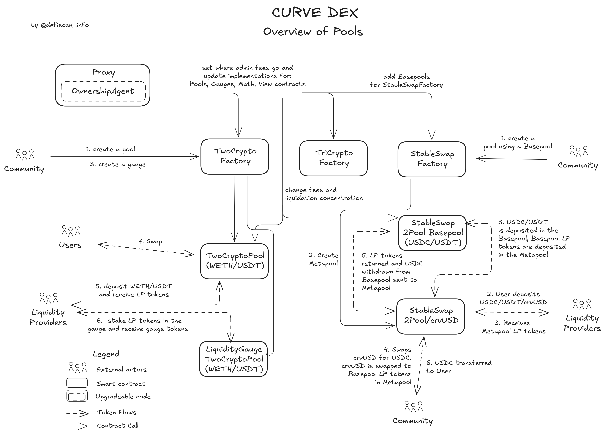
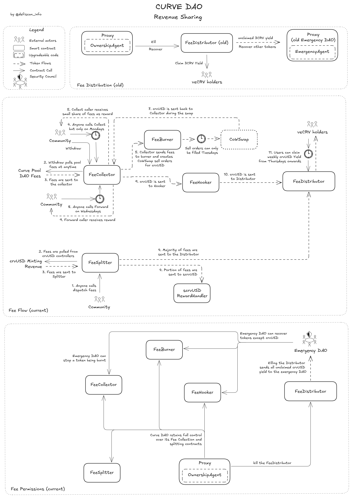
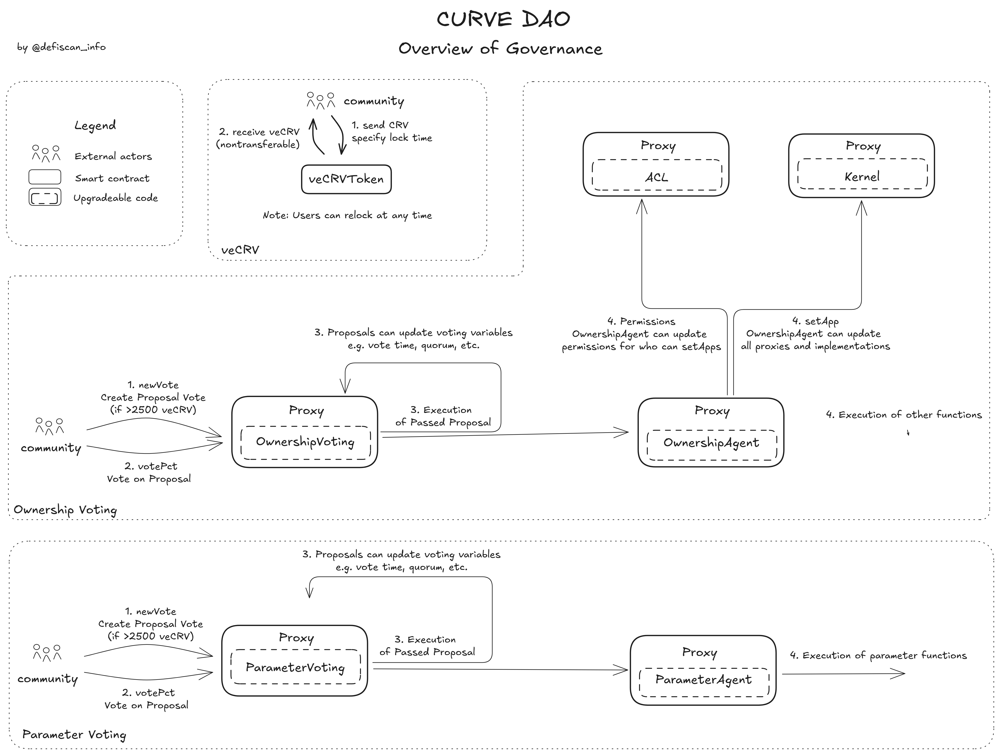

# Summary

Curve Finance is a protocol consisting of a _decentralized exchange (DEX)_ focused on stablecoin and correlated-asset swaps, _isolated lending markets (Llamalend)_, and an overcollateralized _stablecoin (crvUSD)_.

Governance of all products, as well as the protocol itself, is managed entirely through the _Curve DAO_, using a vote-escrowed token model (veCRV) where voting power is proportional to the amount of CRV locked and the remaining lock duration (up to four years).

# Ratings

## Chain

Curve Finance's core governance (the DAO) operates exclusively on Ethereum mainnet. Although Curve products are deployed across multiple EVM-compatible chains, this review focuses only on the Ethereum mainnet. As a mature Layer 1 blockchain, Ethereum falls into the lowest risk category.

> Chain score: Low

## Upgradeability

The Curve DAO manages all upgrades, primarily through the `OwnershipAgentProxy`, which executes successful governance votes. Most Curve contracts have an owner or manager with varying permissions, all ultimately controlled by the DAO.

The DAO's powers are extensive. It can upgrade core DAO contracts or delegate permissions to other entities through governance. It also controls key parameters, such as interest rate policies in `crvUSD` and lending markets, fee settings, and liquidity concentration in pools. Additionally, it can mint `crvUSD` without limits and manages the `scrvUSD` vault, both of which could be used maliciously. All admin/ownership actions are locked behind governance votes, with some power allocated to the `EmergencyDAO` to stop gauges (`CRV` emission), fee distributors, or pegkeepers, in case of emergency.

The implementation contracts of the DEX's pools can be updated for future pools only, which does not impact users' funds and unclaimed yield.

As possible updates may result in the _loss of user funds_, this results in a _High upgradeability score_.

> Upgradeability score: High

## Autonomy

The only external dependency in Curve is the CoWSwap burner used in the DAO’s revenue collection architecture. It submits limit orders that are guaranteed to execute only within predefined parameter ranges, converting collected tokens into `crvUSD`. If this mechanism fails or malfunctions, DAO revenue remains in its original token until it can be manually swapped through Curve pools via a DAO vote, or `EmergencyDAO` intervention.

> Autonomy score: Low

## Exit Window

All governance votes occur over a 7-day period, with voting frontloaded in the first half due to the linear decay of _veCRV_ voting power after 3.5 days (see more on this in the [governance section](#governance)). There is no mandatory delay between the end of voting and execution. While the voting duration and decay mechanics provide some opportunity for users to react, this does not qualify as a formal delay under the framework.

> Exit Window score: High

## Accessibility

Curve's primary user interface is hosted at [curve.finance](https://curve.finance/). Other interfaces also provide most core functionality, including [crvhub.com](https://crvhub.com), [curvemonitor.com](https://curvemonitor.com), and [DeFi Saver](https://app.defisaver.com/). Different third-party apps integrate directly with Curve, allowing swaps to route through Curve regardless of the UI’s status.

The full frontend code is open source and available at the [Curve Frontend GitHub repository](https://github.com/curvefi/curve-frontend), although there are currently no published instructions for self-hosting.

> Accessibility score: Low

## Conclusion

Curve received a _Low_ centralization risk score for its _Chain_ and _Accessibility_ criteria. Nonetheless, it received a _High_ centralization risk score for its _Upgradeability_ and _Exit Window_. Overall, this grants Curve a rating of **Stage 0**.

There are three primary paths for Curve to advance to Stage 1 under the existing framework:

1. Relinquish some control at the DAO level, specifically over crvUSD minting and scrvUSD vault management such that loss of user funds is no longer possible through DAO actions.
2. Expand the authority of the `EmergencyDAO` to include a veto right on governance proposals, effectively enabling it to stop proposals that could result in the loss of user funds.
3. Introduce a mandatory 7-day delay between the approval, and execution of governance proposals which may result in the loss of user funds.

# Reviewer's Notes

Zap contracts were excluded from this review, as they have no permissioned functions and are optional to use.

Deployments on other chains, including their associated cross-chain messaging contracts and the supporting Ethereum infrastructure, are also out of scope.

Only the latest versions of each contract implementation were analyzed. While Curve has used various contract versions over time, they have all mostly followed the same architecture and permission structure.

# Protocol Analysis

## Decentralized Exchange (DEX)

Curve’s DEX is the foundation of all products within the protocol, and user assets within pools are safe, except from smart contract risk. There are three main types of pools:

- **Stableswap**: Stablecoin and stable-asset pools with up to 8 assets
- **Twocrypto**: Pools with 2 volatile assets
- **Tricrypto**: Pools with 3 volatile assets

In addition, Curve supports:

- **Basepools**: Stableswap pools whose LP tokens can be used as assets in other pools
- **Metapools**: Pools that include a Basepool LP token as one of the underlying assets

Each of the three primary pool types has its own factory contract, allowing any user to permissionlessly create a pool. The DAO owns all pools by controlling the parent factories. Most pools (except for legacy deployments) inherit their admin address from the factory. This admin has the ability to adjust parameters such as liquidity concentration, trading fees, and, in some cases, other settings like the off-peg multiplier, which increases fees when a pool becomes imbalanced. The implementation of the pools can also be updated by the factory admin (the DAO), but this will only affect future pools and not put existing user positions at risk.

All of these parameters can be updated via DAO vote. More details can be found in the [Contracts and Permissions](#permissions) section. Tricrypto pools are the only pool type that enforces a mandatory 3-day waiting period before parameter changes take effect.

_Note: Four older factories are owned by a proxy contract, such as `FactoryOwnerProxy (old)`, which delegates different administrative functions to separate roles: `ownership_admin`, `parameter_admin`, and `emergency_admin`. This model has been deprecated in newer factories but could be reinstated by DAO vote._

## crvUSD & scrvUSD

`crvUSD` is Curve’s overcollateralized stablecoin. It is minted when users deposit collateral (currently only BTC or ETH derivatives) and take out a loan. The collateral is deposited into the novel [LLAMMA](https://docs.curve.finance/crvUSD/amm/), which implements the soft-liquidation mechanism.

Interest rates are automatically calculated and continuously updated based on the `crvUSD` peg and the reserves held by _PegKeepers_. _PegKeepers_ are allocated `crvUSD`, which they can deposit into a designated pool (e.g., `crvUSD`/`USDC`) when `crvUSD` trades above peg (i.e., selling `crvUSD` above peg), and withdraw when it trades below peg (i.e., buying `crvUSD` below peg)

`crvUSD` generates revenue for the DAO by charging interest on outstanding debt. This revenue is distributed between the DAO (`veCRV` holders) and `scrvUSD` stakers. `scrvUSD` is a staking vault that complements _PegKeeper_ dynamics. When `crvUSD` falls below peg, interest rates increase, raising yields for `scrvUSD` stakers, increasing `crvUSD` demand. When `crvUSD` rises above peg, interest rates decrease, helping to reduce demand and restore the peg. The DAO can choose the strategies followed by the `scrvUSD` module, and could assign the funds to malicious strategies.

For more information, see the overview below:

## Llamalend

Llamalend is a peer-to-peer lending protocol that follows the same structure as `crvUSD` loans but supports riskier collateral. Unlike `crvUSD`, where the DAO assumes risk when collateral falls below the loan value, Llamalend distributes this risk to depositors. Users deposit `crvUSD` into vaults and earn yield from loans that are collateralized with specific assets, each within its own isolated market.

## Curve DAO - Revenue Sharing Contracts

The Curve DAO earns revenue from its decentralized exchange pools and from interest charged on `crvUSD` mints. The DAO votes on how this revenue is allocated, including what portion is distributed to `veCRV` holders. This process is documented here: [Fee Collection](https://docs.curve.finance/fees/overview/). An overview is also provided below:

## Gauges & CRV Minting

Curve’s gauges are where `CRV` is minted and distributed as rewards, primarily to users providing liquidity in DEX pools and supplying assets to Llamalend. Any pool or lending market vault can have a gauge, but the DAO must first vote to add it to the `GaugeController` to make it eligible for `CRV` emissions.

`veCRV` holders can vote once every 10 days to decide how `CRV` emissions are distributed across active gauges. Every Thursday at 00:00 UTC, the weekly `CRV` emissions are split proportionally based on the total votes each gauge received.

Users who stake LP tokens in a gauge can boost their rewards relative to others by holding more `veCRV`. This boost can increase their rewards by up to 2.5 times compared to users with no `veCRV`. See the diagram below for an overview of how gauges operate:

# Dependencies

Curve operates on Ethereum without relying on external dependencies, with one exception: swapping collected fees into `crvUSD` using CoWSwap limit orders. These orders only execute within parameters set by the DAO, and Curve can fallback to using its own pools to perform swaps via a DAO vote. The `EmergencyDAO` currently also has the authority to carry out this function.

All other components are developed in-house. Curve products rely solely on internal price oracles derived from its own pools.

# Governance

## Curve DAO - Aragon DAO Contracts

The Curve DAO is built on top of the Aragon DAO framework and has been running since August 2020.

Users can lock their `CRV` tokens for `veCRV` (vote-escrowed `CRV`), which allows them to vote on proposals and receive a share of the revenue generated by the DAO. Users receive `veCRV` based on the duration of their lock, up to a maximum of four years. One `veCRV` equals one `CRV` locked for four years; however, the `veCRV` balance decays linearly over this period:

This system is designed to align incentives, encouraging the DAO to make positive long-term decisions and reducing the surface area for coin-voting governance attacks.

There are two vote types within the Curve DAO: _Ownership votes_ and _Parameter votes_, each with different quorum and support thresholds:

- **Ownership Votes** - Minimum Quorum of 30%, 51% support
- **Parameter Votes** - Minimum Quorum of 15%, 60% support

_Note that only "YES" votes count towards Quorum, detailed here: [Curve Resources - DAO Votes](https://resources.curve.finance/governance/understanding-governance/#dao-votes)_

Originally, _Ownership votes_ were used for actions such as setting the owner/admin on contracts and approving gauges to receive `CRV` emissions, while _Parameter votes_ handled changes to parameters within pools. Today, most votes within the Curve DAO are _Ownership votes_, as current participation levels allow for it.

All votes within the Curve DAO occur on Ethereum mainnet and are currently set to a **7-day** voting period. This can be adjusted by the DAO to any value between 0.5 and 14 days. To mitigate manipulation toward the end of the voting period, user voting power decays linearly to zero starting at day 3.5:

An overview of the contracts and how voting works can be seen below:

## Curve Emergency DAO (old) - Aragon DAO Contracts

As a complement to the main DAO, an `oldEmergencyDAO` was setup, which would be able to act quickly, with a voting period of just 24hrs instead of 7 days. The contracts are the same as the main DAO, and are upgradable. The main DAO retains control over this `oldEmergencyDAO` with the power to issue and burn voting tokens for members.

This has been since moved to a 5/9 multisig called `EmergencyDAO` with no direct control possible by the main DAO. However, some contracts, namely the `veCRV` `FeeDistributor (old)` are hardcoded to send funds in emergency situations to the old `oldEmergencyDAO`. Because of this, it is documented here and an overview is given below:

## Security Council

All externally controllable permission owners are detailed below:

| Permission Owner                       | At least 7 signers | At least 51% threshold | At least 50% non-insider signers | Signers are publicly announced (with name or pseudonym) |
| -------------------------------------- | ------------------ | ---------------------- | -------------------------------- | ------------------------------------------------------- |
| OwnershipVotingProxy                   | N/A                | N/A                    | N/A                              | N/A                                                     |
| ParameterVotingProxy                   | N/A                | N/A                    | N/A                              | N/A                                                     |
| oldEmergencyDAO (EmergencyVotingProxy) | ✅                 | ✅                     | ✅                               | ✅                                                      |
| EmergencyDAO                           | ✅                 | ✅                     | ✅                               | ✅                                                      |
| scrvusdEmergencyDAO                    | ❌                 | ❌                     | ❌                               | ❌                                                      |

_Note: the main DAO execution contracts are `OwnershipAgentProxy` and `ParameterAgentProxy`, but both of these are controlled by their parent voting contracts, which is why they are not in the list._

The old `oldEmergencyDAO` was sunset in favor of the current `EmergencyDAO`. This does reduce friction and increases speed for the members if actions are required, but also increases the risk of malicious actions, as the `EmergencyDAO` can add and remove members with a majority vote. There is no oversight or direct control currently possible from the main DAO.

The old `oldEmergencyDAO` is still hardcoded into some contracts, namely `veCRV`'s `FeeDistributor (old)`.

Members for the `oldEmergencyDAO` are the same as `EmergencyDAO`, publicly available here in two locations with telegram handles:

1. [https://dao-old.curve.finance/emergencymembers](https://dao-old.curve.finance/emergencymembers)
2. [Curve Resources - Emergency DAO](https://resources.curve.finance/governance/overview/#emergency-dao)

At least 4 of the 5 signers on the `scrvusdEmergencyDAO` can be identified as members/previous members of the Curve team. However, this multisig can only limit/stop deposits into the `scrvUSD` vault. It cannot steal user funds or limit withdrawals.

## Exit Window

All DAO votes have a 7-day voting period. Due to `veCRV` voting decay, most votes are cast in the first 3.5 days, after which voting power linearly decays to zero.

For all liquidity pools, lending markets, and gauges, the DAO can only vote to modify parameters within predefined ranges.

In addition, the current `TriCryptoSwapFactory` pool implementation enforces a mandatory 3-day delay on all parameter changes, these changes can also be vetoed by the `EmergencyDAO`.
