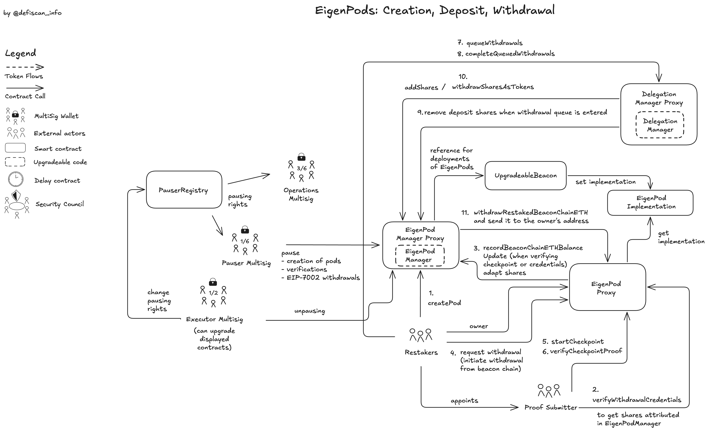
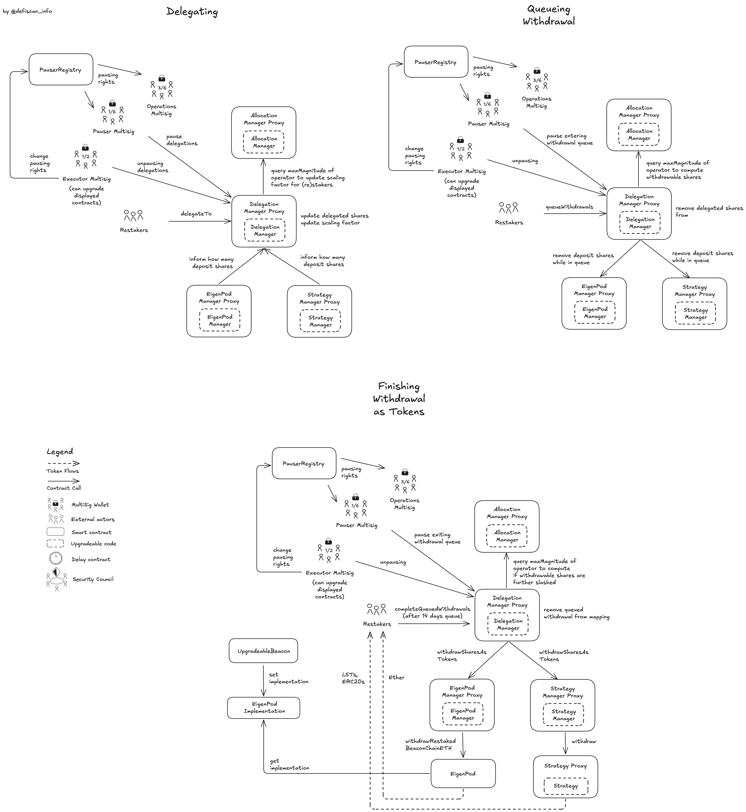
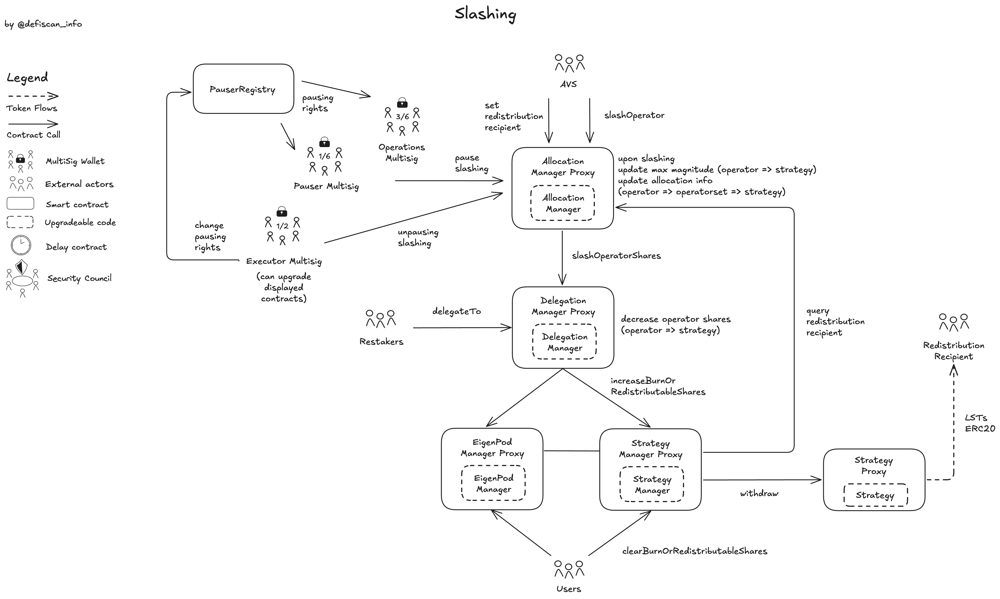

# Summary

Eigenlayer is a marketplace that matches compute (by _Operators_) with tasks (by _AVSs_). In order that _AVSs_ trust the _Operators_ with the given tasks, the _Operators_ need economic security (stake), which is provided by _(Re)Stakers_, who can be slashed in case of shortcoming of operational performance. _(Re)Stakers_ have to trust _Operators_ that they do their tasks according to the requirements stated by the _AVSs_. For economic stake, _(Re)Stakers_ can use; a) arbitrary ERC20 tokens, which also include Liquid Staking Tokens (LSTs), or b) Beacon Chain deposits to increase the capital efficiency of staked ETH.

# Ratings

## Chain

The report is concerned with the Eigenlayer protocol deployed on Ethereum mainnet. Ethereum mainnet achieves a _Low_ centralization risk score.

> Chain score: Low

## Upgradeability

Smart contracts that control user funds, the accounting of delegation, and slashing are fully _upgradeable_ and this can lead to _loss of user funds_ and _loss of unclaimed yield_.

Rewards committed by _AVSs_ to the `RewardsCoordinator` contract are distributed to _Operators_ and _Stakers_ via a merkle tree root posted by an account with the role `RewardsUpdater` , which computes eligibility for each _(Re)Staker_ and _Operator_ based on their stake and _AVS_ rewards specification. If an account with that role is compromised, the rewards can be distributed to the wrong addresses, which leads to _loss of unclaimed yield_.

The withdrawal process can be paused immediately by pausers registered in the `PauserRegistry` contract. Pausing can lead to temporary loss of access to funds, the [Community Council (9/13)](#security-council) however can resume the pause immediately if misused.

> Upgradeability score: High

## Autonomy

The Eigenlayer protocol does not rely on a single _Operator_, nor on a single _AVS_ to work since it is a market place that brings _AVSs_ and _Operators_ together. Thus, the overall _Dependency_ risk is _low_. However, single _AVSs_ or _Operators_ can impose risks on each other and on _(Re)Stakers_ as the respective counterparties.

The [Dependencies](#dependencies) section goes into more detail about risks potentially originating from _AVSs_ and _Operators_.

> Autonomy score: Low

## Exit Window

### Upgrading Contracts

Upgrading of all upgradeable Eigenlayer smart contracts can be executed through the [Executor Multisig (1/2)](#security-council), which has two signers, the [Community Multisig (9/13)](#security-council), which can execute immediately, and the [Protocol TimelockController](#security-council). The [Protocol TimelockController](#security-council) has an _Exit Window_ of 10 days before executing a call on the [Executor Multisig (1/2)](#security-council).

For the `bEIGEN` token (the backing token that is wrapped into `EIGEN` and used to control the `EIGEN` supply) there is a dedicated parallel upgrading process, which is also controlled by the [Community Council (9/13)](#security-council) signer and a dedicated [bEIGEN TimelockController](#security-council) with an _Exit Window_ of 24 days.

### Pausing Strategy Contracts

Deposit contracts of economic stake (Strategies and EigenPods) can be paused immediately by pausers registered in the `PauserRegistry` contract which includes the [Pauser Multisig (1/6)](#security-council), the [Executor Multisig (1/2)](#security-council), and the [Operations Multisig (3/6)](#security-council). During a pause, the _(Re)Stakers_ cannot withdraw their funds. Resuming can only be enforced by the [Executor Multisig (1/2)](#security-council) with a 10-day _Exit Window_ or immediately through the [Community Council (9/13)](#security-council) signer which adheres to the [Security Council Requirements](/framework#security-council-requirements).

### Rewards

The `RewardsUpdater` can immediately remove a root that holds the information of the weekly rewards and post a new root, claiming all deposited funds by _AVSs_ instead of distributing them to _Operators_ and _Stakers_. Immediate _loss of unclaimed yield_ leads to _Medium_ _Exit Window_ score.

### Overall Exit Window

The worst _Exit Window_ score of the different vectors is _High_. Immediate upgrade of contracts can only be executed by the [Community Council (9/13)](#security-council) signer, thus the _Exit Window_ score is _High_. However, the impact on the total score is _Medium_ (_Stage 1_), as the [Community Council (9/13)](#security-council) satisfies the [Security Council Requirements](/framework#security-council-requirements). Multisigs that are not compliant with the [Security Council Requirements](/framework#security-council-requirements) can initiate upgrades as well, but are protected by an _Exit Window_ of more than 7 days and can be overruled by the [Community Council (9/13)](#security-council).

> Exit Window score: High

## Accessibility

There are no other frontends available for _Stakers_ and _Restakers_ to delegate and initiate withdrawal. The Eigenlayer protocol does not provide a frontend for _AVSs_ to manage their contracts as they can vary on a case by case basis.

For _Operators_ a CLI is available to interact with the Eigenlayer protocol, for configuration allocations, registering to _Operator Sets_ and configuration of rewards. We argue that the option of a CLI is comparable to self hosting (_Medium_), because it's local, but not low risk, because if the CLI has a bug/vulnerability, as there is no diversity in terms of execution of the _Operator_ actions.

> Accessibility score: High

## Conclusion

The Eigenlayer protocol achieves _High_ centralization risk scores for its _Upgradeability_, _Exit Window_ and _Accessibility_ dimensions. It achieves _Low_ centralization risk scores for its _Autonomy_ and _Chain_ dimensions. Eigenlayer overall ranks _Stage 0_. The impact of the _Upgradeability_ and _Exit Window_ on the overall score is _Medium_ (_Stage 1_), because the permission owner satisfies the _Security Council Requirements_.

The protocol could reach _Stage 1_ by offering a self-hosting option for _Stakers_ and _Restakers_ to manage their delegation and withdrawal.

The project additionally could advance to _Stage 2_ if alternative frontends are available for _Stakers_, _Restakers_ and _Operators_ to manage their delegation, withdrawal and participation in _Operator Sets_. Additionally it is required that the _Upgradeability_ is protected by 30 days _Exit Window_.

# Reviewer's Notes

- _Stakers_ denote users that deposit general ERC20 tokens in Eigenlayer to secure AVSs. _Restakers_ denote users that secure _AVSs_ by making Beacon Chain deposits slashable via Eigenlayer.
- _AVSs_ are required to deploy their own smart contracts which interact with the Eigenlayer smart contracts. These smart contracts are not part of the Eigenlayer protocol and thus are not part of this review.

# Protocol Analysis

The top-left shows the governance module. Arrows from the [Executor Multisig (1/2)](#security-council) mostly denote upgrading power or upgrading calls through the `ProxyAdmin` located below.

Left-middle shows the strategy contracts module. There are two types of strategy contracts. Strategy contracts created by users through the factory, they are denoted as `StrategyBaseBeaconProxy` (this contract is deployed for each token, only one is shown). `StrategyTVLLimits` are contracts that were deployed initially and there is one contract per Liquid Staked Token (LST), only one is shown. Both type of contracts and each instance store ERC20 _(Re)Staker_ funds that are referenced from the `StrategyManager`.

Center is the heart-piece of Eigenlayer the `DelegationManager`. The `DelegationManager` interacts with the `StrategyManager` and the `EigenPodManager` below left and below right. These contracts store information on the deposited tokens and restaked Beacon Chain ETH. Above of the `DelegationManager` is the `AllocationManager` which is the contract with which _Operators_ and _AVSs_ allocate and slash staked assets. Next to `AllocationManager` is the `RewardsCoordinator` contract which allows _AVSs_ to post rewards, which then can be claimed by _Operators_ and _(Re)Stakers_ defined on agreed splits.

On the right hand side the contracts deployed by the _AVSs_ are denoted with the pointed box. The contracts by the _AVS_ are highly customizable. DApps possibly interact with this contracts denoted top right. The tasks that need to be validated/executed can then be picked up by _Operators_ from these contracts.

## Roles

### Stakers and Restakers

A _Staker_ or _Restaker_ is any user who has assets deposited (or "restaked") into EigenLayer (low center in the main diagram). They can stake multiple ERC20 assets that are accepted as _Economic Security_ or restake Beacon Chain ETH to secure _AVSs_.

The _Stakers_ and _Restakers_ have the following actions available; 1) deposit assets into EigenLayer via either the `StrategyManager` (for ERC20s) or the `EigenPodManager` (for Beacon Chain ETH), 2) withdraw assets via the `DelegationManager`, no matter what assets they're withdrawing, 3) delegate to an _Operator_ via the `DelegationManager`, 4) undelegating from an _Operator_ via the `DelegationManager`, 5) and claiming rewards posted by _AVSs_ from the `RewardsCoordinator` contract.

### Operators

_Operators_ are entities that opt-in to _Operator Sets_ created by _AVSs_ to execute tasks for the _AVS_ (upper center in the main diagram). _Operators_ receive economic stake delegated by the _Stakers_ and _Restakers_ and take a cut from the weekly rewards issued by the _AVSs_ (default: 10% _Operator_, 90% _Stakers_ and _Restakers_). _Operators_ can also stake themselves, the roles are not mutually exclusive.

_Operators_ have the following actions available; 1) register and deregister to and from an _Operator Set_ via the `AllocationManager` contract, 2) allocate and deallocate delegated stake to and from the _Operator Set_ via the `AllocationManager`, 3) change the reward split via the `RewardsCoordinator` contract, 4) claim rewards posted by _AVSs_ from the `RewardsCoordinator` contract, and 5) change the allocation delay via the `AllocationManager` contract, this affects the delay until the allocation becomes slashable upon allocation.

For conditions and timelines on (de)registering and (de)allocation read the [AllocationManager](#allocationmanager) contract section.

### AVSs

_AVSs_ are entities and protocols that offer services to their end users (e.g. Cryptographic Services, Data Availability, Bridging, Oracles, etc.). These services require task execution by an economically secured and distributed set of nodes, such as a PoS system. This task is required to be objective and verifiable; _Operators_ from the Eigenlayer marketplace opt-in to execute this task such that the _AVS_ can offer its service. Eigenlayer helps thus to make Beacon-Chain deposits more economically efficient by allowing _ETH Stakers_ to restake this economic stake to secure also other services that require validation. Additionally, _Stakers_ can also use arbitrary ERC20 tokens that are accepted by _AVSs_, which includes LSTs.

_AVSs_ are required to deploy their own smart contracts which interact with the Eigenlayer smart contracts (right hand side in the main diagram). The details of the implementation are free to choose by the _AVS_, but they must implement the following functions or manually perform them:

- provide a callback to the `AVSRegistrar` contract to notify the `AllocationManager` if the registration and deregistration by the _Operator_ is accepted (allows whitelisting, or parameter based acceptance, e.g type of stake etc.)
- create _Operator Sets_ (calling `createOperatorSets` or `createRedistributingOperatorSet` on the `AllocationManager` contract)
- slash operators (calling `slashOperator` on the `AllocationManager` contract)
- supply and post rewards for _Operators_ and _Stakers_ (calling `createOperatorDirectedOperatorSetRewardsSubmission` on the `RewardsCoordinator` contract)
- to allow registered operators to post results
- various functions to update and configure _Operator Sets_.

Additionally, _AVSs_ can increase fairness and transparency guarantees by; 1) allowing the Operators to veto a slash (Governance contract that calls `slashOperator` on the `AllocationManager` contract), 2) create protocols to eject _Operators_ (Governance contract that calls `deregisterFromOperatorSets` on the `AllocationManager` contract), 3) to create quorums for task submission or veto and 4) to compute rewards onchain instead of offchain (Smart Contract computing rewards and posting them to the `RewardsCoordinator` contract instead of multisigs/EOAs).

Regarding rewards, _AVSs_ are free to design their own reward logic, whether it is based on offchain or onchain data, and can distribute rewards in any ERC20 token. For instance, an _AVS_ can distribute a flat rate of rewards or a performance-based reward structure that is dependent on the work performed by _Operators_ within a certain time period. Additionally, an _AVS_ can submit multiple reward submissions, denominated in different tokens.

Repositories that help _AVSs_ to implement their contracts are:

- https://github.com/Layr-Labs/eigenlayer-middleware/tree/dev
- https://github.com/Layr-Labs/devkit-cli

## Important Eigenlayer Contracts and Concepts

### Strategies and EigenPods

Each asset that is accepted as _Economic Security_ to secure _AVSs_ is held in a separate contract, with exception of restaked `ETH` that remains on the Beacon Chain (Consensus Layer of Ethereum).

The three types of contracts that are used are:

1. **EigenPods**: These contracts are directly connected to the Beacon Chain and they are responsible for managing the deposit/withdrawal of Beacon Chain deposits. Each _Restaker_ deploys its own `EigenPod` contract via the `EigenPodManager` contract. The `EigenPod` validates a proof that the withdrawal credentials point to this contract, such that the Eigenlayer protocol can facilitate slashing by _AVSs_.
2. **Legacy Strategy Contracts**: These contracts are transparent upgradeable proxy contracts that each hold liquid staking ETH tokens. Each contract needs to be upgraded separately by the `ProxyAdmin` contract.
3. **Factory based Strategy Contracts**: These contracts are instantiated through the `StrategyFactory` and are responsible for managing tokens added by users themselves. These contracts are upgradeable and share the same implementation contract (beacon proxy), which allows to update the contracts all at once.

An upgrade of any of the three contract types could lead to _loss of funds_ if compromised.

The `StrategyFactory` creates new strategies (ie allows to accept new ERC20 tokens as security), with the [Operations Multisig (3/6)](#security-council) controlling strategy whitelisting and blacklisting, which corresponds to whitelisting/blacklisting ERC20 tokens as _Economic Security_ for _AVSs_. When a _Strategy_ is removed from the whitelist or blacklisted, _Stakers_ can still withdraw or delegate existing funds, but new deposits are blocked. By default, new strategies created by the factory are whitelisted. Staked capital that is in blacklisted strategies can still earn rewards, it is up to the _AVS_ to postpone or omit rewards for these strategies. However, the [rewardsUpdater](#security-council) can still post a root to a tree that excludes rewards based on this blacklisted strategy and overrule _AVSs_.

### EigenPods

EigenPods are the contracts that point to Beacon Chain deposits and make them slashable by _AVSs_. To create deposit shares in the `EigenPodManager` contract, which then can be used to delegate to _Operators_ and earn additional rewards from the _AVSs_, a proof of the withdrawal credentials pointing to the `EigenPod` contract address supplied by the _Restaker_ and owner of the `EigenPod` is required.

If a _Restaker_ wants to withdraw their funds from the Beacon Chain, they need to start a checkpoint and verify the checkpoint to update their shares in the `EigenPodManager` based on validator rewards they received on the Beacon Chain. Additional shares from validator rewards can be withdrawn or used to delegate to _Operators_. Reduced Beacon Chain deposits through validator slashing, lead to a reduction of the shares. To withdraw ETH from the Beacon Chain, _Restakers_ can use the EIP-7002 execution layer triggereable withdrawals, via calling `requestWithdrawal` on the `EigenPod` contract, or use the Consensus Layer primary key to initiate the withdrawal to the Execution Layer (Ethereum Mainnet). To be able to withdraw the ETH deposited in the `EigenPod` contract through the previous step, _Restakers_ need to queue and complete a withdrawal with the `DelegationManager` contract. (see [DelegationManager](#delegationmanager))

Each `EigenPod` shares the same implementation contract, which allows to update the `EigenPods` contracts all at once by the [Executor Multisig (1/2)](#security-council) with the Beacon-Proxy `UpgradeableBeacon` contract. A malicious upgrade could be used to add a function that allows to withdraw the ETH from the Beacon-Chain by using the EIP-7002 execution layer triggereable withdrawals to a malicious address. However, updates like this can be cancelled by the [Community Multisig (9/13)](#security-council), which is one of the signers in the [Executor Multisig (1/2)](#security-council).

The starting of checkpoints and their verification can be paused by the pausers. A permanent pause of the withdrawal process leads to _loss of funds_ for the _Restakers_.

### DelegationManager

After users first deposit into the strategies or EigenPods (and the `StrategyManager` and `EigenPodManager` keep track of the deposit shares). The `DelegationManager` is the contract that allows _(Re)Stakers_ to delegate their stake to _Operators_. The `DelegationManager` fetches the amount of deposit shares from the `StrategyManager` or `EigenPodManager` contract, and the scaling factor (how many _AVS_ slashes suffered) from the `AllocationManager` contract to set the starting point for the _(Re)Stakers_.

Withdrawal as a _Staker_ or _Restaker_ is only possible through the `DelegationManager` contract. When withdrawing the _Stakers_ and _Restakers_ receive the amount of deposit shares minus the amount of slashes suffered by the _AVS_ during their delegation. This amount of tokens are called withdrawable shares.

Withdrawal is a 2-step process which requires a `queueWithdrawal` and a `completeQueuedWithdrawal` call to the `DelegationManager` contract. The `queueWithdrawal` call is required to initiate the withdrawal process, and the `completeQueuedWithdrawal` call is required to complete the withdrawal process. The `completeQueuedWithdrawal` call is only possible after a cooldown period (14 days) is over. During this two step process, sufferred slashes by _AVS_ are taken into account to calculate the final amount of ETH or tokens to be sent to the _(Re)Staker_.

_Operators_ can configure a _Delegation Approver_, that requires _Stakers_ to first get an approval before they may delegate to the _Operator_ through the `DelegationManager` contract. This way, _Operators_ can prevent _Stakers_ from delegating their funds to them and keep a privileged set of _Stakers_. If the _Delegation Approver_ is set to the 0-address, any _Staker_ can delegate their stake to the respective _Operator_.

The `DelegationManager` contract also allows users to register as _Operators_ in the Eigenlayer system, which is a requirement for _Operators_ to register in _Operator Sets_ created by _AVSs_.

The `DelegationManager` contract's _Upgradeability_ through the `ProxyAdmin` contract introduces an _Upgradeability_ risk, as the upgrade could potentially modify core delegation logic, the slashing accounting and thus lead to _loss of funds_ of _(Re)Stakers_ if the upgrade is malicious or faulty, as _(Re)Stakers_ initiate withdrawals of funds through this contract.

Delegation, undelegation, withdrawal (queueing and completion) and registration as _Operators_ can be paused by the pausers. A permanent pause of the withdrawal process can lead to _loss of funds_ for the _Restakers_ and _Stakers_.

### AllocationManager

Through the `AllocationManager` the `AVSs` can manage _Operator Sets_ (creation and changes) and AVS configurations as metadata. The `AllocationManager` allows _Operators_ to allocate and deallocate from _Operator Sets_ and _AVSs_. _Operator Sets_ are isolated pools of staked capital that serve as economic security for an _AVS_. _Operator Sets_ allow _AVSs_ to differentiate different _Operators_ with regarding to their business requirements and type of stake. Also _AVSs_ can slash certain strategies within an _Operator Set_ and issue rewards in a granular way for each supplied strategy within the _Operator Set_. Slashing is done when the _Operators_ break a certain committments to the _AVS_. _AVSs_ can slash _Operators_ up to the full stake inside the _Operator Sets_. The `AllocationManager` contract forwards the slashing request by the _AVSs_ to the `DelegationManager` contract, to reduce the delegated amount of the _Operators_.

_Operators_ can change their allocation delay which is the duration until which the new allocated stake becomes slashable. A change of allocation delay registered by _Operator_ takes 17.5 days (ALLOCATION_CONFIGURATION_DELAY) until it is effective.

The duration until a deallocation is effective (the capital is not slashable anymore) takes 14 days (DEALLOCATION_DELAY). This is only changeable through an upgrade of the `AllocationManager` contract. Deallocation cannot be prevented by the AVS.

Registering and deregistering by an _Operator_ from an _Operator Set_ has to be accepted by the _AVS_. The _AVSs_ can setup an `AVSRegistrar` contract, which is called by the `AllocationManager` when _Operators_ register to and deregister from _Operator Sets_. If the _AVS_ does not have an `AVSRegistrar` set, the `AllocationManager` will forward the call to the registered _AVS_ contract itself. If the `AVSRegistrar` or the registered _AVS_ contract reverts the transaction, the `AllocationManager` will revert the transaction as well, and _Operators_ will not be able to register to or deregister from _Operator Sets_. This can create unfair scenarios, where _AVSs_ allow opt-in, but disallow opt-out (see [dependencies](#dependencies) for risks steming from _AVSs_).

The contract's _Upgradeability_ through the `ProxyAdmin` contract introduces an _Upgradeability_ risk, as the upgrade could potentially modify slashing logic and the slashing accounting and thus lead to _loss of funds_ of _(Re)Stakers_ if the upgrade is malicious or faulty, as the `DelegationManager` contract is informed on suffered slashes by the `AllocationManager` contract.

Registration and deregistration of _Operators_ from _Operator Sets_, modification of allocations to _Operator Sets_ by _Operators_, and slashing by _AVSs_ can be paused by the pausers. A pause of deregistration and modification of allocations, but not slashing, could lead to an unfair situation for _Operators_ and _Stakers_.

### RewardsCoordinator

The `RewardsCoordinator` contract holds reward funds sent by the _AVSs_ which will be distributed to _Operators_ and _Stakers_. By default, _Operators_ receive 10% and _Stakers_ 90% of the rewards distributed by the _AVSs_. The _Operators_ can change the reward split by calling `setOperatorAVSSplit`.

The `rewardsUpdater` EOA calculates rewards offchain and consolidates these into a merkle root posted onchain by calling the `submitRoot` function. The reward amounts are calculated based on the supplied rewards and the arguments supplied with calling `createOperatorDirectedOperatorSetRewardsSubmission` such as start time, duration, distribution among strategies inside the operator set, token, amounts and operators by _AVSs_. This function also transfers the ERC20 tokens to the `RewardsCoordinator` contract. Rewards are posted every week, rewards that should be applied to the next claiming period have to be posted by _AVSs_ at least 48h before root submission.

The `disableRoot` function can be called by the `rewardsUpdater` to disable the current root and prevent further distributions. If the `disableRoot` function is called, _Operators_ and _Stakers_ cannot further claim their rewards and rely on the Eigenlayer protocol to re-enable the reward distribution mechanism, by posting a new root.

This means the `rewardsUpdater` role must be completely trusted in the distribution of rewards. Malicious behavior by the Eigenlayer protocol could lead to _loss of unclaimed yield_. The [Operator Multisig](#security-council) can appoint a new `rewardsUpdater` in case of compromised or malicious behavior.

Rewards are distributed periodically, with a delay period of 7 days before they become claimable.

The _Upgradeability_ of the `RewardsCoordinator`, controlled by the `ProxyAdmin`, means that deposited funds by _AVSs_ could be withdrawn and stolen which leads to _loss of unclaimed yield_ for both _Stakers_ and _Operators_. Additionally, the 90/10 default split between _Stakers_ and _Operators_ can be modified with a delay of 7 days.

Setting the split between _Stakers_ and _Operators_, claiming of rewards can be paused by the pausers. A pause of claiming rewards could lead to _loss of unclaimed yield_ for both _Stakers_ and _Operators_.

### PermissionController

The `PermissionController` is a contract that allows _AVSs_ and _Operators_ to appoint general admins to call functions on the `AllocationManager` and `DelegationManager` contracts or appointees (can call only selected addresses and functions) on behalf of them.

The _Upgradeability_ of the `PermissionController`, controlled by the `ProxyAdmin`, means that permissions to slash operators on behalf of AVS (as an appointee) can be hijacked by a permission owner going rogue, leading to _loss of funds_ for _Stakers_ and loss of delegated stake for _Operators_.

### PauserRegistry

The `PauserRegistry` contract informs all pausable contracts, who can pause, and who can unpause. The [Executor Multisig (1/2)](#security-council) can assign pausing rights to new accounts. [Community Multisig (9/13)](#security-council) as one of the signers of the [Executor Multisig (1/2)](#security-council) can resume the paused actions.

### EIGEN and bEIGEN

`bEIGEN` is used to control the supply of `EIGEN` and will serve in the future as intersubjective work token that can be slashed via forking, while `EIGEN` remains slashing unaware to maintain DeFi compatibility (learn more [here](https://blog.eigencloud.xyz/eigen/)).

`EIGEN` tokens are created by supplying and wrapping `BackingEigen` (or denoted as `bEIGEN`) tokens into the `EIGEN` token contract through the `wrap` function.

The `BackingEigen` token contract is upgradeable, which means that the permissions to upgrade the token contract can have an impact on user funds, such as dilution or change of ownership. New minters of `bEIGEN` can be appointed with the `setIsMinter` function, which could lead to malicious minters mis-using this minting right to wrap it into `EIGEN` tokens.

Currently `bEIGEN` is minted by the Eigenlayer protocol through the `TokenHopper` contract, which mints `bEIGEN` tokens, wraps them into `EIGEN` tokens and deposits them into the `RewardsCoordinator` contract through by calling `createRewardsForAllEarners`. This inflation serves as Programmatic Incentives (PI).

### Programmatic Incentives

Programmatic Incentives (PI) are `EIGEN` tokens minted by the EigenLayer protocol and distributed to _(Re)Stakers_ and _Operators_ to incentivize and bootstrap participants in the Eigenlayer.

PI are distributed in `EIGEN` tokens minted by the Eigenlayer protocol and distributed to _(Re)Stakers_ and _Operators_ through the `RewardsCoordinator` contract. The permission owner to post the root is again the [rewardsUpdater](#security-council). Read more here on the emission schedule and emission amount in the [official docs](https://docs.eigenfoundation.org/programmatic-incentives/programmatic-incentives-faq).

# Dependencies

The Eigenlayer protocol does not depend on a single _AVS_ or _Operator_. However, _AVSs_, _(Re)Stakers_ and _Operators_ depend on each other, and as such create dependency risks for each other.

The following subsections highlight risks potentially coming from _AVSs_ and _Operators_ for respective counterparties.

## AVSs

### Slashing Operators unfairly

The _AVSs_ can slash _Operators_ by specifying which _Operator_ and which _Strategies_ should be slashed and by which amount. This leads to _loss of funds_ for _(Re)Stakers_ and loss of delegated stake for _Operators_. The slashing can be fair (according to published terms by the _AVSs_) or unfair (not according to published terms by the _AVSs_ and supplied performance by the _Operator(s)_).

_AVSs_ are allowed to create _Operator Sets_ that have redistribution recipients, which receive the slashed amount instead of burning the slashed tokens. Thus slashing could be mis-used to steal the funds of the _(Re)Stakers_ delegated to the _Operators_. A non-redistributing _Operator Set_ cannot be transformed into a redistributing _Operator Set_.

### Preventing Deregistration of Operators from Operator Sets

Deregistration of _Operators_ from _Operator Sets_ can be prevented by _AVSs_ by reverting the callback `deregisterOperator` on the registered `AVSRegistrar` contract. This is a contract specific to each _AVS_ that is controlled by each _AVS_. This could open a greater time window for an _AVS_ to slash _Operators_ if deallocation is not triggered as a response. However, deallocation from the _Operator Set_ can not be prevented by the _AVSs_ and it always takes 14 days (DEALLOCATION_DELAY).

### Breaking Reward Promises

The _AVSs_ can post less rewards than promised to the `RewardsCoordinator` contract for the _Operators_ and _Stakers_, leading to worse yield performance than expected.

## Operators

### Change Reward Split

_Operators_ can change the reward split by calling `setOperatorAVSSplit` on the `RewardsCoordinator` contract. This could lead to reduced yield performance for _Stakers_ and _Restakers_ if the _Operator_ changes the split to their favor. It is only applied for the future and takes at least one week to be applied (set with global variable `activationDelay`).

### Slacking duty

Queued _Stakers_ and _Restakers_ are still subject to slashing for their delegated operator for 14 days after they queued their withdrawal, this makes them vulnerable to slacking operators that phase out or become unreliable, but only if the _Operator_ is registered for _AVSs_ that have mandatory duties (the type of tasks that the _Operator_ is required to perform by the _AVSs_ can have different modalities). This could lead to _loss of funds_ for _(Re)Stakers_.

# Governance

The [Executor Multisig (1/2)](#security-council) holds all permissions to upgrade contracts of the protocol through the `ProxyAdmin` contract or directly on the contracts themselves. The [Executor Multisig (1/2)](#security-council)'s signers are the [Community Multisig (9/13)](#security-council) and the [Protocol TimelockController](#security-council).

The [Protocol TimelockController](#security-council) has two admins, the [Community Multisig (9/13)](#security-council) and the contract itself. Additionally three roles exist; proposer, canceler and executor. The proposers are the [Operations Multisig (3/6)](#security-council) and the [Protocol Council (3/5)](#security-council), the canceler is the [Operations Multisig (3/6)](#security-council) and the executor is the [Protocol Council (3/5)](#security-council).

For the `bEIGEN` token there is a dedicated parallel upgrade process with the same roles and entities. Instead of the [Protocol TimelockController](#security-council) a dedicated [bEIGEN TimelockController](#security-council) with a sufficient _Exit Window_ of 24 days instead of 10 days is used.

## Protocol Council

The 3 out of 5 multisig has 2 signers from the Eigen Foundation and 3 external signers from the Eigenlayer ecosystem. The [Protocol Council (3/5)](#security-council) is responsible for executing proposals on the [Protocol TimelockController](#security-council) and [bEIGEN TimelockController](#security-council).

## Community Multisig

The [Community Multisig (9/13)](#security-council) can execute calls through the [Executor Multisig (1/2)](#security-council) and [bEIGEN Executor Multisig (1/2)](#security-council) without co-signer. This permission is designed for emergency situations and key compromises. This permission could technically be misused to steal funds from the Eigenlayer protocol with immediate effect (no exit window for the [Community Multisig (9/13)](#security-council)), therefore distribution of signers across the ecosystem with long term alignment is important.

The [Community Multisig (9/13)](#security-council) satisfies our [security council requirements](/framework#security-council-requirements).

Signers of the [Community Multisig (9/13)](#security-council) are

- Tim Beiko - Ethereum Foundation
- Viktor Bunin - Coinbase
- Uma Roy - Succinct
- Myles O'Neil - Repyh Labs
- Swapnil Raj - Nethermind
- Dimitry Ukhanov - P2P
- Tarun Chitra - Robot Ventures
- Anna Rose - ZK Validator
- Curtis Spencer - Electric Capital
- Yuan Han Li - Blockchain Capital
- Ben Rodriguez - Coinbase Cloud
- Rob Pellecchia - Figment Capital
- Certora

[source](https://docs.eigenfoundation.org/protocol-governance/technical-architecture#community-multisig)

## Security Council

| Name                     | Account                                                                                                               | Type          | ≥ 7 signers | ≥ 51% threshold | ≥ 50% non-insider | Signers public                                                                                                |
| ------------------------ | --------------------------------------------------------------------------------------------------------------------- | ------------- | ----------- | --------------- | ----------------- | ------------------------------------------------------------------------------------------------------------- |
| bEIGEN Executor Multisig | [0x942eaF324971440384e4cA0ffA39fC3bb369D67d](https://etherscan.io/address/0x942eaF324971440384e4cA0ffA39fC3bb369D67d) | Multisig 1/2  | ❌          | ❌              | ❌                | ❌                                                                                                            |
| Executor Multisig        | [0x369e6F597e22EaB55fFb173C6d9cD234BD699111](https://etherscan.io/address/0x369e6F597e22EaB55fFb173C6d9cD234BD699111) | Multisig 1/2  | ❌          | ❌              | ❌                | ❌                                                                                                            |
| Pauser Multisig          | [0x5050389572f2d220ad927CcbeA0D406831012390](https://etherscan.io/address/0x5050389572f2d220ad927CcbeA0D406831012390) | Multisig 1/6  | ❌          | ❌              | ❌                | ❌                                                                                                            |
| Community Multisig       | [0xFEA47018D632A77bA579846c840d5706705Dc598](https://etherscan.io/address/0xFEA47018D632A77bA579846c840d5706705Dc598) | Multisig 9/13 | ✅          | ✅              | ✅                | ✅ ([source](https://docs.eigenfoundation.org/protocol-governance/technical-architecture#community-multisig)) |
| Operations Multisig      | [0xBE1685C81aA44FF9FB319dD389addd9374383e90](https://etherscan.io/address/0xBE1685C81aA44FF9FB319dD389addd9374383e90) | Multisig 3/6  | ❌          | ❌              | ❌                | ❌                                                                                                            |
| Protocol Council         | [0x461854d84ee845f905e0ecf6c288ddeeb4a9533f](https://etherscan.io/address/0x461854d84ee845f905e0ecf6c288ddeeb4a9533f) | Multisig 3/5  | ❌          | ✅              | ✅                | ✅ ([source](https://docs.eigenfoundation.org/protocol-governance/technical-architecture#protocol-council))   |
| rewardsUpdater           | [0x8f94F55fD8c9E090296283137C303fE97d32A9e2](https://etherscan.io/address/0x8f94F55fD8c9E090296283137C303fE97d32A9e2) | EOA           | ❌          | ❌              | ❌                | ❌                                                                                                            |

# Contracts & Permissions

## Contracts

| Contract Name                                                   | Address                                                                                                               |
| --------------------------------------------------------------- | --------------------------------------------------------------------------------------------------------------------- |
| DelegationManager (Proxy)                                       | [0x39053D51B77DC0d36036Fc1fCc8Cb819df8Ef37A](https://etherscan.io/address/0x39053D51B77DC0d36036Fc1fCc8Cb819df8Ef37A) |
| DelegationManager (Implementation)                              | [0x6eed6c2802df347e05884857cddb2d3e96d12f89](https://etherscan.io/address/0x6eed6c2802df347e05884857cddb2d3e96d12f89) |
| StrategyFactory (Proxy)                                         | [0x5e4c39ad7a3e881585e383db9827eb4811f6f647](https://etherscan.io/address/0x5e4c39ad7a3e881585e383db9827eb4811f6f647) |
| StrategyFactory (Implementation)                                | [0x1b97d8f963179c0e17e5f3d85cdfd9a31a49bc66](https://etherscan.io/address/0x1b97d8f963179c0e17e5f3d85cdfd9a31a49bc66) |
| StrategyManager (Proxy)                                         | [0x858646372CC42E1A627fcE94aa7A7033e7CF075A](https://etherscan.io/address/0x858646372CC42E1A627fcE94aa7A7033e7CF075A) |
| StrategyManager (Implementation)                                | [0x46aefd30415be99e20169ee7046f65784b46d123](https://etherscan.io/address/0x46aefd30415be99e20169ee7046f65784b46d123) |
| EigenPodManager (Proxy)                                         | [0x91E677b07F7AF907ec9a428aafA9fc14a0d3A338](https://etherscan.io/address/0x91E677b07F7AF907ec9a428aafA9fc14a0d3A338) |
| EigenPodManager (Implementation)                                | [0xe48d7caec1790b293667e4bb2de1e00536f2babd](https://etherscan.io/address/0xe48d7caec1790b293667e4bb2de1e00536f2babd) |
| AllocationManager (Proxy)                                       | [0x948a420b8cc1d6bfd0b6087c2e7c344a2cd0bc39](https://etherscan.io/address/0x948a420b8cc1d6bfd0b6087c2e7c344a2cd0bc39) |
| AllocationManager (Implementation)                              | [0xc97602648fa52f92b4ee2b0e5a54bd15b6cb0345](https://etherscan.io/address/0xc97602648fa52f92b4ee2b0e5a54bd15b6cb0345) |
| RewardsCoordinator (Proxy)                                      | [0x7750d328b314EfFa365A0402CcfD489B80B0adda](https://etherscan.io/address/0x7750d328b314EfFa365A0402CcfD489B80B0adda) |
| RewardsCoordinator (Implementation)                             | [0xa505c0116ad65071f0130061f94745b7853220ab](https://etherscan.io/address/0xa505c0116ad65071f0130061f94745b7853220ab) |
| UpgradeableBeacon (Strategies from StrategyFactory) (Proxy)     | [0x0ed6703c298d28ae0878d1b28e88ca87f9662fe9](https://etherscan.io/address/0x0ed6703c298d28ae0878d1b28e88ca87f9662fe9) |
| StrategyBase (Strategies from StrategyFactory) (Implementation) | [0xD4d1746142642Db4c1ab17b03B9c58baac913E5B](https://etherscan.io/address/0xD4d1746142642Db4c1ab17b03B9c58baac913E5B) |
| StrategyBase cbETH (Proxy)                                      | [0x54945180dB7943c0ed0FEE7EdaB2Bd24620256bc](https://etherscan.io/address/0x54945180dB7943c0ed0FEE7EdaB2Bd24620256bc) |
| StrategyBase cbETH (Implementation)                             | [0x62f7226fb9d615590eadb539713b250fb2fdf4e0](https://etherscan.io/address/0x62f7226fb9d615590eadb539713b250fb2fdf4e0) |
| StrategyBase stETH (Proxy)                                      | [0x93c4b944D05dfe6df7645A86cd2206016c51564D](https://etherscan.io/address/0x93c4b944D05dfe6df7645A86cd2206016c51564D) |
| StrategyBase stETH (Implementation)                             | [0x62f7226fb9d615590eadb539713b250fb2fdf4e0](https://etherscan.io/address/0x62f7226fb9d615590eadb539713b250fb2fdf4e0) |
| StrategyBase rETH (Proxy)                                       | [0x1BeE69b7dFFfA4E2d53C2a2Df135C388AD25dCD2](https://etherscan.io/address/0x1BeE69b7dFFfA4E2d53C2a2Df135C388AD25dCD2) |
| StrategyBase rETH (Implementation)                              | [0x62f7226fb9d615590eadb539713b250fb2fdf4e0](https://etherscan.io/address/0x62f7226fb9d615590eadb539713b250fb2fdf4e0) |
| StrategyBase ETHx (Proxy)                                       | [0x9d7eD45EE2E8FC5482fa2428f15C971e6369011d](https://etherscan.io/address/0x9d7eD45EE2E8FC5482fa2428f15C971e6369011d) |
| StrategyBase ETHx (Implementation)                              | [0x62f7226fb9d615590eadb539713b250fb2fdf4e0](https://etherscan.io/address/0x62f7226fb9d615590eadb539713b250fb2fdf4e0) |
| StrategyBase ankrETH (Proxy)                                    | [0x13760F50a9d7377e4F20CB8CF9e4c26586c658ff](https://etherscan.io/address/0x13760F50a9d7377e4F20CB8CF9e4c26586c658ff) |
| StrategyBase ankrETH (Implementation)                           | [0x62f7226fb9d615590eadb539713b250fb2fdf4e0](https://etherscan.io/address/0x62f7226fb9d615590eadb539713b250fb2fdf4e0) |
| StrategyBase OETH (Proxy)                                       | [0xa4C637e0F704745D182e4D38cAb7E7485321d059](https://etherscan.io/address/0xa4C637e0F704745D182e4D38cAb7E7485321d059) |
| StrategyBase OETH (Implementation)                              | [0x62f7226fb9d615590eadb539713b250fb2fdf4e0](https://etherscan.io/address/0x62f7226fb9d615590eadb539713b250fb2fdf4e0) |
| StrategyBase osETH (Proxy)                                      | [0x57ba429517c3473B6d34CA9aCd56c0e735b94c02](https://etherscan.io/address/0x57ba429517c3473B6d34CA9aCd56c0e735b94c02) |
| StrategyBase osETH (Implementation)                             | [0x62f7226fb9d615590eadb539713b250fb2fdf4e0](https://etherscan.io/address/0x62f7226fb9d615590eadb539713b250fb2fdf4e0) |
| StrategyBase swETH (Proxy)                                      | [0x0Fe4F44beE93503346A3Ac9EE5A26b130a5796d6](https://etherscan.io/address/0x0Fe4F44beE93503346A3Ac9EE5A26b130a5796d6) |
| StrategyBase swETH (Implementation)                             | [0x62f7226fb9d615590eadb539713b250fb2fdf4e0](https://etherscan.io/address/0x62f7226fb9d615590eadb539713b250fb2fdf4e0) |
| StrategyBase wBETH (Proxy)                                      | [0x7CA911E83dabf90C90dD3De5411a10F1A6112184](https://etherscan.io/address/0x7CA911E83dabf90C90dD3De5411a10F1A6112184) |
| StrategyBase wBETH (Implementation)                             | [0x62f7226fb9d615590eadb539713b250fb2fdf4e0](https://etherscan.io/address/0x62f7226fb9d615590eadb539713b250fb2fdf4e0) |
| StrategyBase sfrxETH (Proxy)                                    | [0x8CA7A5d6f3acd3A7A8bC468a8CD0FB14B6BD28b6](https://etherscan.io/address/0x8CA7A5d6f3acd3A7A8bC468a8CD0FB14B6BD28b6) |
| StrategyBase sfrxETH (Implementation)                           | [0x62f7226fb9d615590eadb539713b250fb2fdf4e0](https://etherscan.io/address/0x62f7226fb9d615590eadb539713b250fb2fdf4e0) |
| StrategyBase lsETH (Proxy)                                      | [0xAe60d8180437b5C34bB956822ac2710972584473](https://etherscan.io/address/0xAe60d8180437b5C34bB956822ac2710972584473) |
| StrategyBase lsETH (Implementation)                             | [0x62f7226fb9d615590eadb539713b250fb2fdf4e0](https://etherscan.io/address/0x62f7226fb9d615590eadb539713b250fb2fdf4e0) |
| StrategyBase mETH (Proxy)                                       | [0x298aFB19A105D59E74658C4C334Ff360BadE6dd2](https://etherscan.io/address/0x298aFB19A105D59E74658C4C334Ff360BadE6dd2) |
| StrategyBase mETH (Implementation)                              | [0x62f7226fb9d615590eadb539713b250fb2fdf4e0](https://etherscan.io/address/0x62f7226fb9d615590eadb539713b250fb2fdf4e0) |
| EigenStrategy (Proxy)                                           | [0xaCB55C530Acdb2849e6d4f36992Cd8c9D50ED8F7](https://etherscan.io/address/0xaCB55C530Acdb2849e6d4f36992Cd8c9D50ED8F7) |
| EigenStrategy (Implementation)                                  | [0x530fdb7adf7d489df49c27e3d3512c0dd64886be](https://etherscan.io/address/0x530fdb7adf7d489df49c27e3d3512c0dd64886be) |
| UpgradeableBeacon (EigenPod) (Proxy)                            | [0x5a2a4F2F3C18f09179B6703e63D9eDD165909073](https://etherscan.io/address/0x5a2a4F2F3C18f09179B6703e63D9eDD165909073) |
| EigenPod (Implementation)                                       | [0xcb27A4819A64FBA93ABD4D480e4466aEc0503745](https://etherscan.io/address/0xcb27A4819A64FBA93ABD4D480e4466aEc0503745) |
| Eigen (Token) (Proxy)                                           | [0xec53bf9167f50cdeb3ae105f56099aaab9061f83](https://etherscan.io/address/0xec53bf9167f50cdeb3ae105f56099aaab9061f83) |
| Eigen (Token) (Implementation)                                  | [0x2c4a81e257381f87f5a5c4bd525116466d972e50](https://etherscan.io/address/0x2c4a81e257381f87f5a5c4bd525116466d972e50) |
| BackingEigen (bEIGEN) (Proxy)                                   | [0x83E9115d334D248Ce39a6f36144aEaB5b3456e75](https://etherscan.io/address/0x83E9115d334D248Ce39a6f36144aEaB5b3456e75) |
| BackingEigen (bEIGEN) (Implementation)                          | [0xF2b225815F70c9b327DC9db758A36c92A4279b17](https://etherscan.io/address/0xF2b225815F70c9b327DC9db758A36c92A4279b17) |
| PauserRegistry                                                  | [0xB8765ed72235d279c3Fb53936E4606db0Ef12806](https://etherscan.io/address/0xB8765ed72235d279c3Fb53936E4606db0Ef12806) |
| TimelockController (Protocol)                                   | [0xC06Fd4F821eaC1fF1ae8067b36342899b57BAa2d](https://etherscan.io/address/0xC06Fd4F821eaC1fF1ae8067b36342899b57BAa2d) |
| TimelockController (bEIGEN)                                     | [0x738130BC8eADe1Bc65A9c056DEa636835896bc53](https://etherscan.io/address/0x738130BC8eADe1Bc65A9c056DEa636835896bc53) |
| ProxyAdmin (Protocol)                                           | [0x8b9566AdA63B64d1E1dcF1418b43fd1433b72444](https://etherscan.io/address/0x8b9566AdA63B64d1E1dcF1418b43fd1433b72444) |
| ProxyAdmin (bEIGEN)                                             | [0x3f5Ab2D4418d38568705bFd6672630fCC3435CC9](https://etherscan.io/address/0x3f5Ab2D4418d38568705bFd6672630fCC3435CC9) |
| PermissionController (Proxy)                                    | [0x25E5F8B1E7aDf44518d35D5B2271f114e081f0E5](https://etherscan.io/address/0x25E5F8B1E7aDf44518d35D5B2271f114e081f0E5) |
| PermissionController (Implementation)                           | [0xe7f3705c9addf2de14e03c345fa982cab2c1c6b1](https://etherscan.io/address/0xe7f3705c9addf2de14e03c345fa982cab2c1c6b1) |
| TokenHopper                                                     | [0x0ffc6ac10515ee0f83fee71fcaf5ea5805256563](https://etherscan.io/address/0x0ffc6ac10515ee0f83fee71fcaf5ea5805256563) |
| RewardAllStakersActionGenerator                                 | [0x99E6a294349072F9873081Cde9AC9eeb7Fd1F9dE](https://etherscan.io/address/0x99E6a294349072F9873081Cde9AC9eeb7Fd1F9dE) |

## Permission owners

| Name                          | Account                                                                                                               | Type          |
| ----------------------------- | --------------------------------------------------------------------------------------------------------------------- | ------------- |
| TimelockController (Protocol) | [0xC06Fd4F821eaC1fF1ae8067b36342899b57BAa2d](https://etherscan.io/address/0xC06Fd4F821eaC1fF1ae8067b36342899b57BAa2d) | Contract      |
| TimelockController (bEIGEN)   | [0x738130BC8eADe1Bc65A9c056DEa636835896bc53](https://etherscan.io/address/0x738130BC8eADe1Bc65A9c056DEa636835896bc53) | Contract      |
| ProxyAdmin (Protocol)         | [0x8b9566AdA63B64d1E1dcF1418b43fd1433b72444](https://etherscan.io/address/0x8b9566AdA63B64d1E1dcF1418b43fd1433b72444) | Contract      |
| ProxyAdmin (bEIGEN)           | [0x3f5Ab2D4418d38568705bFd6672630fCC3435CC9](https://etherscan.io/address/0x3f5Ab2D4418d38568705bFd6672630fCC3435CC9) | Contract      |
| bEIGEN Executor Multisig      | [0x942eaF324971440384e4cA0ffA39fC3bb369D67d](https://etherscan.io/address/0x942eaF324971440384e4cA0ffA39fC3bb369D67d) | Multisig 1/2  |
| Executor Multisig             | [0x369e6F597e22EaB55fFb173C6d9cD234BD699111](https://etherscan.io/address/0x369e6F597e22EaB55fFb173C6d9cD234BD699111) | Multisig 1/2  |
| Pauser Multisig               | [0x5050389572f2d220ad927CcbeA0D406831012390](https://etherscan.io/address/0x5050389572f2d220ad927CcbeA0D406831012390) | Multisig 1/6  |
| Community Multisig            | [0xFEA47018D632A77bA579846c840d5706705Dc598](https://etherscan.io/address/0xFEA47018D632A77bA579846c840d5706705Dc598) | Multisig 9/13 |
| Operations Multisig           | [0xBE1685C81aA44FF9FB319dD389addd9374383e90](https://etherscan.io/address/0xBE1685C81aA44FF9FB319dD389addd9374383e90) | Multisig 3/6  |
| Protocol Council              | [0x461854d84ee845f905e0ecf6c288ddeeb4a9533f](https://etherscan.io/address/0x461854d84ee845f905e0ecf6c288ddeeb4a9533f) | Multisig 3/5  |
| rewardsUpdater                | [0x8f94F55fD8c9E090296283137C303fE97d32A9e2](https://etherscan.io/address/0x8f94F55fD8c9E090296283137C303fE97d32A9e2) | EOA           |

## Permissions

| Contract                               | Function                                           | Impact                                                                                                                                                                                                                                                                                                                                                                                                                                                                                                                                                                                                                                                                                                                                                                                                                                                                                                                                                                                                                                                                                                       | Owner                                                                                                                                                                                                     |
| -------------------------------------- | -------------------------------------------------- | ------------------------------------------------------------------------------------------------------------------------------------------------------------------------------------------------------------------------------------------------------------------------------------------------------------------------------------------------------------------------------------------------------------------------------------------------------------------------------------------------------------------------------------------------------------------------------------------------------------------------------------------------------------------------------------------------------------------------------------------------------------------------------------------------------------------------------------------------------------------------------------------------------------------------------------------------------------------------------------------------------------------------------------------------------------------------------------------------------------ | --------------------------------------------------------------------------------------------------------------------------------------------------------------------------------------------------------- |
| DelegationManager (Proxy)              | changeAdmin                                        | The admin can upgrade the `DelegationManager` contract. The `DelegationManager` contract manages delegations from restakers to operators. Restakers that want to withdraw from active (delegated) positions, need to call this contract to withdraw their funds. If this contract is maliciously upgraded it could block withdrawal of user funds or change claimable funds and yield and thus it could lead to a loss of user funds.                                                                                                                                                                                                                                                                                                                                                                                                                                                                                                                                                                                                                                                                        | ProxyAdmin                                                                                                                                                                                                |
| DelegationManager (Proxy)              | upgradeTo                                          | Upgrades the `DelegationManager` contract. See `changeAdmin` for more details.                                                                                                                                                                                                                                                                                                                                                                                                                                                                                                                                                                                                                                                                                                                                                                                                                                                                                                                                                                                                                               | ProxyAdmin                                                                                                                                                                                                |
| DelegationManager (Proxy)              | upgradeToAndCall                                   | Upgrades the `DelegationManager` contract and calls an arbitrary function subsequently after the upgrade. See `changeAdmin` for more details.                                                                                                                                                                                                                                                                                                                                                                                                                                                                                                                                                                                                                                                                                                                                                                                                                                                                                                                                                                | ProxyAdmin                                                                                                                                                                                                |
| DelegationManager (Implementation)     | pause                                              | The function allows to pause new delegations, entering withdrawal queue and completing withdrawal queue. Three different multisigs are allowed to pause. Unpausing is exclusive to the Executor Multisig. If the Strategy contract is permanently paused, the funds of the users are lost. Community Multisig can overwrite actions by the Pauser Multisig or Executor Multisig, to prevent this from happening.                                                                                                                                                                                                                                                                                                                                                                                                                                                                                                                                                                                                                                                                                             | Pauser Multisig, Executor Multisig and Operations Multisig                                                                                                                                                |
| DelegationManager (Implementation)     | pauseAll                                           | This function allows to pause new delegations, entering withdrawal queue and completing withdrawal queue at once. If paused, funds cannot flow back to users, because queueing and finalising withdrawal are paused.                                                                                                                                                                                                                                                                                                                                                                                                                                                                                                                                                                                                                                                                                                                                                                                                                                                                                         | Pauser Multisig, Executor Multisig and Operations Multisig                                                                                                                                                |
| DelegationManager (Implementation)     | unpause                                            | This function allows to continue new delegations, entering withdrawal queue and completing withdrawal queue. MIN_WITHDRAWAL_DELAY_BLOCKS is 14 days, and new withdrawals are delayed for the time of the pause + 14 days. The unpausing can happen immediately if signed by the Community Multisig, or if through normal process, takes at least 10 days because of the Exit Window in the TimelockController contract. For fairness, slashing inside AllocationManager should be paused as well.                                                                                                                                                                                                                                                                                                                                                                                                                                                                                                                                                                                                            | Executor Multisig                                                                                                                                                                                         |
| DelegationManager (Implementation)     | modifyOperatorDetails                              | Allows an operator to change the `delegation approver` for the respective operator. If the delegation approver is set to the 0-address, any staker can delegate their stake to the respective operator. If a delegation approver is configured all new stakers need to get a signature from the approver first, before they can delegate to this operator. Funds of existing stakers are not blocked when the operator transitions to a delegation approver setting, but the approver can forcefully return the stake to the staker.                                                                                                                                                                                                                                                                                                                                                                                                                                                                                                                                                                         | only registered Operators                                                                                                                                                                                 |
| DelegationManager (Implementation)     | updateOperatorMetadataURI                          | Allows an operator to update their metadata. The metadata is not stored in storage, but emitted as event.                                                                                                                                                                                                                                                                                                                                                                                                                                                                                                                                                                                                                                                                                                                                                                                                                                                                                                                                                                                                    | only registered Operators                                                                                                                                                                                 |
| DelegationManager (Implementation)     | increaseDelegatedShares                            | This function is triggered by the `StrategyManager` or `EigenPodManager` contract when a (re)staker deposits funds into Eigenlayer.                                                                                                                                                                                                                                                                                                                                                                                                                                                                                                                                                                                                                                                                                                                                                                                                                                                                                                                                                                          | StrategyManager or EigenPodManager                                                                                                                                                                        |
| DelegationManager (Implementation)     | decreaseDelegatedShares                            | This function is triggered by the `EigenPodManager` contract when the Beacon Chain deposit looses value through withdrawal or slashing.                                                                                                                                                                                                                                                                                                                                                                                                                                                                                                                                                                                                                                                                                                                                                                                                                                                                                                                                                                      | EigenPodManager                                                                                                                                                                                           |
| DelegationManager (Implementation)     | slashOperatorShares                                | If the AVS slashes an Operator via `AllocationManager` contract, `the DelegationManager` contract is called to update the accounting for the operator's active shares.                                                                                                                                                                                                                                                                                                                                                                                                                                                                                                                                                                                                                                                                                                                                                                                                                                                                                                                                       | AllocationManager                                                                                                                                                                                         |
| StrategyFactory (Proxy)                | changeAdmin                                        | The admin can upgrade the `StrategyFactory` contract. The `StrategyFactory` contract allows to deploy new strategies, ie. to accept new tokens as economic security to secure AVS by restakers. Additionally, the contract allows to white- and blacklist a strategy via calling the `StrategyManager` contract. If a strategy is removed from the whitelisted, no further deposits can be made, but user funds are not stuck to withdraw.                                                                                                                                                                                                                                                                                                                                                                                                                                                                                                                                                                                                                                                                   | ProxyAdmin                                                                                                                                                                                                |
| StrategyFactory (Proxy)                | upgradeTo                                          | This function is called to upgrade the `StrategyFactory` contract. The contract does not control any funds, but the contract can block future deposits into single strategies. An false or malicious upgrade could only lead to a temporary/permanent block of new funds in form of ERC20 tokens, while Beacon deposits can still be used.                                                                                                                                                                                                                                                                                                                                                                                                                                                                                                                                                                                                                                                                                                                                                                   | ProxyAdmin                                                                                                                                                                                                |
| StrategyFactory (Proxy)                | upgradeToAndCall                                   | See `upgradeTo`. This function additionally allows to atomically call a function after the upgrade took place.                                                                                                                                                                                                                                                                                                                                                                                                                                                                                                                                                                                                                                                                                                                                                                                                                                                                                                                                                                                               | ProxyAdmin                                                                                                                                                                                                |
| StrategyFactory (Implementation)       | whitelistStrategies                                | Strategies need to be whitelisted in order to receive new funds. Newly deployed strategies by users are whitelisted by default. The owner of this contract can whitelist previously delisted strategies again (delisting with `removeStrategiesFromWhitelist`).                                                                                                                                                                                                                                                                                                                                                                                                                                                                                                                                                                                                                                                                                                                                                                                                                                              | Operations Multisig                                                                                                                                                                                       |
| StrategyFactory (Implementation)       | removeStrategiesFromWhitelist                      | The owner of this implementation contract can remove strategies from the whitelist. If removed from the whitelist, the stakers can still withdraw their funds, or delegate the funds to operators, but the Eigenlayer ecosystem does not allow new deposits. To prevent delegation of the token/strategy, AVS need to delist strategies from their operatorsets.                                                                                                                                                                                                                                                                                                                                                                                                                                                                                                                                                                                                                                                                                                                                             | Operations Multisig                                                                                                                                                                                       |
| StrategyFactory (Implementation)       | blacklistTokens                                    | The owner of this implementation contract can blacklist strategies. Blacklisting also allows to block creation of strategies for this token before the strategy is created, and if the strategy is already created the consequence is removal from the whitelist.                                                                                                                                                                                                                                                                                                                                                                                                                                                                                                                                                                                                                                                                                                                                                                                                                                            | Operations Multisig                                                                                                                                                                                       |
| StrategyFactory (Implementation)       | pause                                              | The function allows to pause creation of new strategies. Current existing strategies are not affected by this action. Creation of strategies is permissionless otherwise.                                                                                                                                                                                                                                                                                                                                                                                                                                                                                                                                                                                                                                                                                                                                                                                                                                                                                                                                    | Pauser Multisig, Executor Multisig and Operations Multisig                                                                                                                                                |
| StrategyFactory (Implementation)       | pauseAll                                           | Since this contract has only one functionality to pause, the impact is the same as calling `pause`.                                                                                                                                                                                                                                                                                                                                                                                                                                                                                                                                                                                                                                                                                                                                                                                                                                                                                                                                                                                                          | Pauser Multisig, Executor Multisig and Operations Multisig                                                                                                                                                |
| StrategyFactory (Implementation)       | unpause                                            | The function allows to unpause creation of new strategies.                                                                                                                                                                                                                                                                                                                                                                                                                                                                                                                                                                                                                                                                                                                                                                                                                                                                                                                                                                                                                                                   | Executor Multisig                                                                                                                                                                                         |
| StrategyManager (Proxy)                | changeAdmin                                        | This function changes the admin which has the right to upgrade the contract.                                                                                                                                                                                                                                                                                                                                                                                                                                                                                                                                                                                                                                                                                                                                                                                                                                                                                                                                                                                                                                 | ProxyAdmin                                                                                                                                                                                                |
| StrategyManager (Proxy)                | upgradeTo                                          | Upgrading the `StrategyManager` contract can lead to loss of user funds as `stakerDepositShares` are referenced in withdrawal process, to inform how many shares (ie tokens) a user can withdraw from a given Strategy contract.                                                                                                                                                                                                                                                                                                                                                                                                                                                                                                                                                                                                                                                                                                                                                                                                                                                                             | ProxyAdmin                                                                                                                                                                                                |
| StrategyManager (Proxy)                | upgradeToAndCall                                   | This function calls `upgradeTo` and allows to call atomically any other arbitrary function subsequently after the upgrade. See more in `upgradeTo`.                                                                                                                                                                                                                                                                                                                                                                                                                                                                                                                                                                                                                                                                                                                                                                                                                                                                                                                                                          | ProxyAdmin                                                                                                                                                                                                |
| StrategyManager (Implementation)       | setStrategyWhitelister                             | The owner of the contract can set the permission to call `addStrategiesToDepositWhitelist`. If a strategy is removed from the whitelist, the stakers can still withdraw their funds, or delegate the funds to operators, but the Eigenlayer ecosystem does not allow new deposits.                                                                                                                                                                                                                                                                                                                                                                                                                                                                                                                                                                                                                                                                                                                                                                                                                           | Executor Multisig                                                                                                                                                                                         |
| StrategyManager (Implementation)       | addStrategiesToDepositWhitelist                    | When the `Operations multisig` calls `whitelistStrategies` on the `StrategyFactory` contract, the `StrategyManager` contract saves them into the whitelist.                                                                                                                                                                                                                                                                                                                                                                                                                                                                                                                                                                                                                                                                                                                                                                                                                                                                                                                                                  | StrategyFactory                                                                                                                                                                                           |
| StrategyManager (Implementation)       | removeStrategiesFromDepositWhitelist               | When the `Operations multisig` calls `removeStrategiesFromWhitelist` on the `StrategyFactory` contract, the `StrategyManager` contract removes the strategy from the whitelist.                                                                                                                                                                                                                                                                                                                                                                                                                                                                                                                                                                                                                                                                                                                                                                                                                                                                                                                              | StrategyFactory                                                                                                                                                                                           |
| StrategyManager (Implementation)       | removeDepositShares                                | The `DelegationManager` contract calls this function when a staker wants to queue the withdrawal. It reduces the shares of the staker and the delegated shares of the Operator, but the shares remain slashable. Once the period is finished, the staker can either allocate to a new strategy, or withdraw the underlying token from the respective strategy contract.                                                                                                                                                                                                                                                                                                                                                                                                                                                                                                                                                                                                                                                                                                                                      | DelegationManager                                                                                                                                                                                         |
| StrategyManager (Implementation)       | addShares                                          | This function is called by the `DelegationManager` contract, when the staker wants to remain the holder of the shares and delegate to a new operator, after the withdrawal queue period has passed. A new operator receives the shares as delegation. The shares are added back to the stakers tracked shares `stakerDepositShares[staker][strategy]`. A user starts this interaction by calling `completeQueuedWithdrawal` on the `DelegationManager` contract.                                                                                                                                                                                                                                                                                                                                                                                                                                                                                                                                                                                                                                             | DelegationManager                                                                                                                                                                                         |
| StrategyManager (Implementation)       | withdrawSharesAsTokens                             | This function is called by the `DelegationManager` contract, when the staker wants to receive the underlying token from the strategy contract, after the withdrawal queue period has passed. A user starts this interaction by calling `completeQueuedWithdrawal` on the `DelegationManager` contract.                                                                                                                                                                                                                                                                                                                                                                                                                                                                                                                                                                                                                                                                                                                                                                                                       | DelegationManager                                                                                                                                                                                         |
| StrategyManager (Implementation)       | increaseBurnOrRedistributableShares                | This function is called by the `DelegationManager` when a operator set was slashed. This function registers the amount to slash (or burn) for a given strategy. This function is triggered when an AVS slashes an operator set by calling `slashOperator` on the `AllocationManager` contract, which calls `slashOperatorShares` on the `DelegationManager` which calls `increaseBurnOrRedistributableShares` on the `StrategyManager` contract.                                                                                                                                                                                                                                                                                                                                                                                                                                                                                                                                                                                                                                                             |
| DelegationManager                      |
| StrategyManager (Implementation)       | pause                                              | The function allows to pause new deposits. Stakers cannot enter Eigenlayer. Three different multisigs are allowed to pause. Unpausing is exclusive to the Executor Multisig.                                                                                                                                                                                                                                                                                                                                                                                                                                                                                                                                                                                                                                                                                                                                                                                                                                                                                                                                 | Pauser Multisig, Executor Multisig and Operations Multisig                                                                                                                                                |
| StrategyManager (Implementation)       | pauseAll                                           | Since this contract has only one functionality to pause, the impact is the same as calling `pause`.                                                                                                                                                                                                                                                                                                                                                                                                                                                                                                                                                                                                                                                                                                                                                                                                                                                                                                                                                                                                          | Pauser Multisig, Executor Multisig and Operations Multisig                                                                                                                                                |
| StrategyManager (Implementation)       | unpause                                            | This function allows to continue new deposits.                                                                                                                                                                                                                                                                                                                                                                                                                                                                                                                                                                                                                                                                                                                                                                                                                                                                                                                                                                                                                                                               | Executor Multisig                                                                                                                                                                                         |
| EigenPodManager (Proxy)                | changeAdmin                                        | Calling this function changes the admin which has the right to upgrade the contract.                                                                                                                                                                                                                                                                                                                                                                                                                                                                                                                                                                                                                                                                                                                                                                                                                                                                                                                                                                                                                         | ProxyAdmin                                                                                                                                                                                                |
| EigenPodManager (Proxy)                | upgradeTo                                          | Upgrading the `EigenPodManager` contract can lead to loss of user funds as deposited shares stored in this contract are referenced in withdrawal process. A malicious upgrade could state that users do not own any shares during the withdrawal process and call `withdrawRestakedBeaconChainETH` on behalf of the users and steal ETH located in the `EigenPod` contract. The ETH in the Beacon Chain Validators cannot be accessed, for this a malicious update of the EigenPod contracts would be required.                                                                                                                                                                                                                                                                                                                                                                                                                                                                                                                                                                                              | ProxyAdmin                                                                                                                                                                                                |
| EigenPodManager (Proxy)                | upgradeToAndCall                                   | This function allows to call `upgradeTo` and atomically in the same transaction call another function.                                                                                                                                                                                                                                                                                                                                                                                                                                                                                                                                                                                                                                                                                                                                                                                                                                                                                                                                                                                                       | ProxyAdmin                                                                                                                                                                                                |
| EigenPodManager (Implementation)       | recordBeaconChainETHBalanceUpdate                  | This function is called by an `EigenPod` when the respective owner of the `EigenPod` verifies withdrawal credentials or verifies the registered checkpoint. If the user suffered slashes on the Beacon Chain, this function reduces the delegated stake to the Operators and claimable shares for the Restaker, if the restaker earned validator rewards, the user receives more shares and the delegated amount to the operator increases.                                                                                                                                                                                                                                                                                                                                                                                                                                                                                                                                                                                                                                                                  | only Eigenpod contracts                                                                                                                                                                                   |
| EigenPodManager (Implementation)       | removeDepositShares                                | The `DelegationManager` contract calls this function when a staker wants to queue the withdrawal. It reduces the shares of the staker and the delegated shares of the Operator, but the shares remain slashable. Once the period is finished, the staker can either allocate to a new operator, or withdraw the ETH from their `EigenPod` contract, once the ETH is sent back from the CL to the EL.                                                                                                                                                                                                                                                                                                                                                                                                                                                                                                                                                                                                                                                                                                         | DelegationManager                                                                                                                                                                                         |
| EigenPodManager (Implementation)       | addShares                                          | This function is called by the `DelegationManager` contract, when the restaker wants to remain the holder of the shares and delegate to a new operator, after the withdrawal queue period has passed. A new operator receives the shares as delegation. The shares are added back to the restakers tracked shares. A user starts this interaction by calling `completeQueuedWithdrawal` on the `DelegationManager` contract.                                                                                                                                                                                                                                                                                                                                                                                                                                                                                                                                                                                                                                                                                 | DelegationManager                                                                                                                                                                                         |
| EigenPodManager (Implementation)       | withdrawSharesAsTokens                             | This function is called by the `DelegationManager` contract, when the staker wants to receive the underlying token (ETH) from their `EigenPod` contract, after the withdrawal queue period has passed. A user starts this interaction by calling `completeQueuedWithdrawal` on the `DelegationManager` contract. In order for this function to succeed, the `EigenPod` contract must have received the ETH from the Beacon Chain.                                                                                                                                                                                                                                                                                                                                                                                                                                                                                                                                                                                                                                                                            | DelegationManager                                                                                                                                                                                         |
| EigenPodManager (Implementation)       | increaseBurnOrRedistributableShares                | This function is called by the `DelegationManager` when a operator set was slashed. This function registers the amount to slash (or burn). This function is triggered when an AVS slashes an operator set by calling `slashOperator` on the `AllocationManager` contract, which calls `slashOperatorShares` on the `DelegationManager` which calls `increaseBurnOrRedistributableShares` on the `StrategyManager` contract.                                                                                                                                                                                                                                                                                                                                                                                                                                                                                                                                                                                                                                                                                  | DelegationManager                                                                                                                                                                                         |
| EigenPodManager (Implementation)       | setProofTimestampSetter                            | This function allows the contract owner to set a privilege address that can set the timestamp for the pectra fork.                                                                                                                                                                                                                                                                                                                                                                                                                                                                                                                                                                                                                                                                                                                                                                                                                                                                                                                                                                                           | Executor Multisig                                                                                                                                                                                         |
| EigenPodManager (Implementation)       | setPectraForkTimestamp                             | This function allows the contract owner to set the timestamp for the pectra fork. After the fork, the tree of the Beacon Chain has a different height.                                                                                                                                                                                                                                                                                                                                                                                                                                                                                                                                                                                                                                                                                                                                                                                                                                                                                                                                                       | Operations Multisig                                                                                                                                                                                       |
| EigenPodManager (Implementation)       | pause                                              | The function allows to pause new deposits, creation of new pods, verification of credentials, verification of checkpoint proofs, creation of checkpoints, verification of stale balance, validator consolidation and withdrawals. Three different multisigs are allowed to pause. Unpausing is exclusive to the Executor Multisig. If the StrategyManager contract is permanently paused, the funds of the users are lost.                                                                                                                                                                                                                                                                                                                                                                                                                                                                                                                                                                                                                                                                                   | Pauser Multisig, Executor Multisig and Operations Multisig                                                                                                                                                |
| EigenPodManager (Implementation)       | pauseAll                                           | Since this contract has only one functionality to pause, the impact is the same as calling `pause`.                                                                                                                                                                                                                                                                                                                                                                                                                                                                                                                                                                                                                                                                                                                                                                                                                                                                                                                                                                                                          | Pauser Multisig, Executor Multisig and Operations Multisig                                                                                                                                                |
| EigenPodManager (Implementation)       | unpause                                            | This function allows to continue new deposits.                                                                                                                                                                                                                                                                                                                                                                                                                                                                                                                                                                                                                                                                                                                                                                                                                                                                                                                                                                                                                                                               | Executor Multisig                                                                                                                                                                                         |
| RewardsCoordinator (Proxy)             | changeAdmin                                        | The admin of this proxy contract, can upgrade the `RewardsCoordinator` contract. Changing the admin transfers the right to upgrade the contract. This has to be executed with care, since the `RewardsCoordinator` contract holds the reward funds sent from AVSs dedicated for operators and stakers which could be stolen with a malicious upgrade.                                                                                                                                                                                                                                                                                                                                                                                                                                                                                                                                                                                                                                                                                                                                                        | ProxyAdmin                                                                                                                                                                                                |
| RewardsCoordinator (Proxy)             | upgradeTo                                          | See `changeAdmin` on the impact of ugprading this contract.                                                                                                                                                                                                                                                                                                                                                                                                                                                                                                                                                                                                                                                                                                                                                                                                                                                                                                                                                                                                                                                  | ProxyAdmin                                                                                                                                                                                                |
| RewardsCoordinator (Proxy)             | upgradeToAndCall                                   | This function calls `upgradeTo` and allows to call atomically any other arbitrary function subsequently after the upgrade. See `upgradeTo`.                                                                                                                                                                                                                                                                                                                                                                                                                                                                                                                                                                                                                                                                                                                                                                                                                                                                                                                                                                  | ProxyAdmin                                                                                                                                                                                                |
| RewardsCoordinator (Implementation)    | createAVSRewardsSubmission                         | This allows an AVS to post the rewards for the past epoch, it includes the weighting distribution (across strategies), the total token amounts, the duration and the starting timestamp. This function also transfers the ERC20 tokens from the AVS controlled account into the `RewardsCoordinator` contract. The starting timestamp is allowed to be maximum back in the past by `MAX_RETROACTIVE_LENGTH` duration. This function can be paused, by pausers from the `PauserRegistry` with the `PAUSED_AVS_REWARDS_SUBMISSION` flag. This function uses the AVS Directory (https://docs.eigencloud.xyz/products/eigenlayer/developers/howto/build/submit-rewards-submissions) which will be deprecated, as such also this function `createAVSRewardsSubmission`. AVSs are advised to use `createOperatorDirectedOperatorSetRewardsSubmission`. This distributes the rewards evenly among the operators.                                                                                                                                                                                                    | permissionless, but designed to be called by the AVS                                                                                                                                                      |
| RewardsCoordinator (Implementation)    | createRewardsForAllSubmission                      | Permissioned function to distribute rewards for all restakers shared evenly. This function can only be called by addresses that are listed in `rewardsForAllSubmitter` mapping managed by the owner of the contract. This could be used by third-parties to distribute and incentivize with certain token, an AVS or an operator.                                                                                                                                                                                                                                                                                                                                                                                                                                                                                                                                                                                                                                                                                                                                                                            | onlyRewardsForAllSubmitter                                                                                                                                                                                |
| RewardsCoordinator (Implementation)    | createRewardsForAllEarners                         | Permissioned function to distribute rewards for all earners across all AVSs. Similar to `createRewardsForAllSubmission` with the difference that delegated claimers (that were assigned by the earners themselves) are not allowed to claim on behalf of them.                                                                                                                                                                                                                                                                                                                                                                                                                                                                                                                                                                                                                                                                                                                                                                                                                                               | onlyRewardsForAllSubmitter                                                                                                                                                                                |
| RewardsCoordinator (Implementation)    | createOperatorDirectedAVSRewardsSubmission         | This uses the AVS Directory (https://docs.eigencloud.xyz/products/eigenlayer/developers/howto/build/submit-rewards-submissions) which will be deprecated. AVSs are advised to use `createOperatorDirectedOperatorSetRewardsSubmission`. The difference to `createAVSRewardsSubmission` is that this function allows AVS to specify the weight for each operator.                                                                                                                                                                                                                                                                                                                                                                                                                                                                                                                                                                                                                                                                                                                                             | Admin(s) of the AVS or AVS's appointee(s) for the function `createOperatorDirectedAVSRewardsSubmission` on `RewardsCoordinator` (access control rights stored in `PermissionController` contract)         |
| RewardsCoordinator (Implementation)    | createOperatorDirectedOperatorSetRewardsSubmission | Main function used to create rewards for operators based on the operator set the belong to. This function is called by the AVS, an admin of the AVS or an appointee. Tokens are sent to this contract from the AVS by calling this function. The function specifies the strategies and their relative weight of the total reward.                                                                                                                                                                                                                                                                                                                                                                                                                                                                                                                                                                                                                                                                                                                                                                            | Admin(s) of the AVS or AVS's appointee(s) for the function `createOperatorDirectedOperatorSetRewardsSubmission` on `RewardsCoordinator` (access control rights stored in `PermissionController` contract) |
| RewardsCoordinator (Implementation)    | submitRoot                                         | An account with `RewardsUpdater` role can publish a merkle tree root, which allows operators and stakers to claim their rewards. The RewardsUpdater is trusted that the distribution is correctly computed based on the supplied rewards by the AVSs.                                                                                                                                                                                                                                                                                                                                                                                                                                                                                                                                                                                                                                                                                                                                                                                                                                                        | rewardsUpdater role                                                                                                                                                                                       |
| RewardsCoordinator (Implementation)    | disableRoot                                        | This function allows an account with the `RewardsUpdater` role to disable posted roots. Claimers cannot claim with `processClaim` anymore. The funds are stuck as a consequence if this function was called. The `RewardsUpdater` would need to post a new root of a tree for recovering the funds as claiming through merkle proof is the only way to withdraw funds from the contract, besides upgrading the contract and creating new logic for token rescue.                                                                                                                                                                                                                                                                                                                                                                                                                                                                                                                                                                                                                                             | rewardsUpdater role                                                                                                                                                                                       |
| RewardsCoordinator (Implementation)    | setClaimerFor                                      | This function allows an AVS or operator to delegate claiming of reward tokens to an address of their choice. This can be revoked by calling the function again with another delegated address.                                                                                                                                                                                                                                                                                                                                                                                                                                                                                                                                                                                                                                                                                                                                                                                                                                                                                                               | Admin(s) of the AVS/Operator or AVS's/Operator's appointee(s) for the function `setClaimerFor` on `RewardsCoordinator` (access control rights stored in `PermissionController` contract)                  |
| RewardsCoordinator (Implementation)    | setActivationDelay                                 | The owner of the `RewardsCoordinator` can set the activation delay, that is the duration between a root being set and the start of the claiming window. This duration acts as security measure, if the distribution was computed incorrectly, the root can be disabled, and re-submitted, such that each operator and staker receive their fair share from the AVS rewards. Already set reward roots are not affected by the new activation delay. The new delay has to be set before the submission of the root. If the root is invalidated, and re-submitted, the new delay would take in immediate effect. A unreasonable long delay would technically mean loss of funds (max timestamp of the the storage value is the year 2106).                                                                                                                                                                                                                                                                                                                                                                      | Operations Multisig                                                                                                                                                                                       |
| RewardsCoordinator (Implementation)    | setDefaultOperatorSplit                            | The owner of the `RewardsCoordinator` contract can specify a default split for all operators. The split defines how much of the AVS reward is passed onto the stakers and how much is left for the operators. By default operators receive 10% and the stakers 90%. The new default split is applied for the next root if before 2 days of the next root posting (calculation delay), but this is not strictly enforced as the computation is done offchain, thus it could be technically applied with the next root.                                                                                                                                                                                                                                                                                                                                                                                                                                                                                                                                                                                        | Operations Multisig                                                                                                                                                                                       |
| RewardsCoordinator (Implementation)    | setOperatorAVSSplit                                | The operator can specify the share between stakers and itself, the operator. Applied after the `activationDelay` passed. If the timestamp (after activation delay) lies before the next calculation phase, the new split is applied, otherwise the new split is applied to the claim period that follows after. The operator is not restricted to set the split to 100% for itself, and 0% for stakers. However, this split is not strictly enforced as the computation is done offchain, thus it could be technically applied with the next root.                                                                                                                                                                                                                                                                                                                                                                                                                                                                                                                                                           | Admin(s) of the Operator or Operator's appointee(s) for the function `setOperatorAVSSplit` on `RewardsCoordinator` (access control rights stored in `PermissionController` contract)                      |
| RewardsCoordinator (Implementation)    | setOperatorPISplit                                 | PI (programmatic incentives), are incentives distributed by the Eigenlayer foundation to reward early adopters of the platform. The operator is free to choose the distribution between itself and the delegated stakers. The operator could redirect 100% of the EIGEN tokens to itself. The activation delay applies here as well.                                                                                                                                                                                                                                                                                                                                                                                                                                                                                                                                                                                                                                                                                                                                                                         | Admin(s) of the Operator or Operator's appointee(s) for the function `setOperatorPISplit` on `RewardsCoordinator` (access control rights stored in `PermissionController` contract)                       |
| RewardsCoordinator (Implementation)    | setOperatorSetSplit                                | The operator can besides setting a split for a specific AVS also set the split for a specific operator set. This is the preferred way, with transitioning to the operator set model (see for more details on impact `setOperatorAVSSplit`).                                                                                                                                                                                                                                                                                                                                                                                                                                                                                                                                                                                                                                                                                                                                                                                                                                                                  | Admin(s) of the Operator or Operator's appointee(s) for the function `setOperatorSetSplit` on `RewardsCoordinator` (access control rights stored in `PermissionController` contract)                      |
| RewardsCoordinator (Implementation)    | setRewardsUpdater                                  | This function sets the rewardsUpdater address which can post new roots (`submitRoot`) and disable Roots (`disableRoot`). This function is only callable by the owner of the contract.                                                                                                                                                                                                                                                                                                                                                                                                                                                                                                                                                                                                                                                                                                                                                                                                                                                                                                                        | Operations Multisig                                                                                                                                                                                       |
| RewardsCoordinator (Implementation)    | setRewardsForAllSubmitter                          | This function sets a new `rewardsForAllSubmitter` address that can submit `createRewardsForAllSubmission`. rewardsForAllSubmitter is a mapping, ie allowing for multiple "rewardsForAllSubmitter" at once. This function is only callable by the owner of the contract.                                                                                                                                                                                                                                                                                                                                                                                                                                                                                                                                                                                                                                                                                                                                                                                                                                      | Operations Multisig                                                                                                                                                                                       |
| RewardsCoordinator (Implementation)    | pause                                              | The function allows to pause AVS rewards submission, general reward submission, claiming of rewards, disabling the root and setting splits. Three different multisigs are allowed to pause. Unpausing is exclusive to the Executor Multisig. Paus can temporary delay the distribution of rewards.                                                                                                                                                                                                                                                                                                                                                                                                                                                                                                                                                                                                                                                                                                                                                                                                           | Pauser Multisig, Executor Multisig and Operations Multisig                                                                                                                                                |
| RewardsCoordinator (Implementation)    | pauseAll                                           | This function allows to pause all pausable functions at once.                                                                                                                                                                                                                                                                                                                                                                                                                                                                                                                                                                                                                                                                                                                                                                                                                                                                                                                                                                                                                                                | Pauser Multisig, Executor Multisig and Operations Multisig                                                                                                                                                |
| RewardsCoordinator (Implementation)    | unpause                                            | This function allows to continue all functions.                                                                                                                                                                                                                                                                                                                                                                                                                                                                                                                                                                                                                                                                                                                                                                                                                                                                                                                                                                                                                                                              | Executor Multisig                                                                                                                                                                                         |
| UpgradeableBeacon (Beacon Proxy)       | renounceOwnership                                  | The owner can renounce the ownership, if this function is called, the contract is without ownership and the functions `transferOwnership` and `upgradeTo` are not callable anymore. As a consequence all deployed Strategies from the `StrategyFactory` are rendered immutable.                                                                                                                                                                                                                                                                                                                                                                                                                                                                                                                                                                                                                                                                                                                                                                                                                              | Executor Multisig                                                                                                                                                                                         |
| UpgradeableBeacon (Beacon Proxy)       | transferOwnership                                  | This function appoints a new owner. The owner can upgrade the contract or appoint a new owner as well.                                                                                                                                                                                                                                                                                                                                                                                                                                                                                                                                                                                                                                                                                                                                                                                                                                                                                                                                                                                                       | Executor Multisig                                                                                                                                                                                         |
| UpgradeableBeacon (Beacon Proxy)       | upgradeTo                                          | The owner of this beacon proxy can upgrade the implementation contract for all strategy contracts that were deployed with the `StrategyFactory`. Since this Strategy contracts hold funds, this upgrade could lead to loss user funds of all ERC20 deposits in Eigenlayer. This upgrade has no direct effect on Beaconchain ETH deposits as they are handled through EigenPods.                                                                                                                                                                                                                                                                                                                                                                                                                                                                                                                                                                                                                                                                                                                              | Executor Multisig                                                                                                                                                                                         |
| StrategyBase (Beacon Implementation)   | deposit                                            | This function allows users to stake funds into a strategy contract, which in turn gives them the right to delegate the received shares to an operator. The function is called with the function `depositIntoStrategy` from the `StrategyManager` contract.                                                                                                                                                                                                                                                                                                                                                                                                                                                                                                                                                                                                                                                                                                                                                                                                                                                   | StrategyManager                                                                                                                                                                                           |
| StrategyBase (Beacon Implementation)   | withdraw                                           | This function allows users to receive their staked funds. The function is called with the function `withdrawSharesAsTokens` from the `StrategyManager` contract.                                                                                                                                                                                                                                                                                                                                                                                                                                                                                                                                                                                                                                                                                                                                                                                                                                                                                                                                             | StrategyManager                                                                                                                                                                                           |
| StrategyBase (Beacon Implementation)   | pause                                              | The function allows to pause deposits or withdrawal. Three different multisigs are allowed to pause. Unpausing is exclusive to the Executor Multisig. If the Strategy contract is permanently paused, the funds of the users are lost.                                                                                                                                                                                                                                                                                                                                                                                                                                                                                                                                                                                                                                                                                                                                                                                                                                                                       | Pauser Multisig, Executor Multisig and Operations Multisig                                                                                                                                                |
| StrategyBase (Beacon Implementation)   | pauseAll                                           | This function allows to pause deposits and withdrawal at once. If paused, no further funds can flow into the strategy contract, nor be withdrawn.                                                                                                                                                                                                                                                                                                                                                                                                                                                                                                                                                                                                                                                                                                                                                                                                                                                                                                                                                            | Pauser Multisig, Executor Multisig and Operations Multisig                                                                                                                                                |
| StrategyBase (Beacon Implementation)   | unpause                                            | If a strategy contract is paused, the Executor multisig can unpause withdrawal and deposits, such that users can get back their funds or continue to deposit funds into a strategy contract.                                                                                                                                                                                                                                                                                                                                                                                                                                                                                                                                                                                                                                                                                                                                                                                                                                                                                                                 | Executor Multisig                                                                                                                                                                                         |
| StrategyBase (Beacon Implementation)   | setPauserRegistry                                  | The PauserRegistry contract is taken as reference for access control. A new PauserRegistry needs to maintain access control to only legitimate pausers and unpausers.                                                                                                                                                                                                                                                                                                                                                                                                                                                                                                                                                                                                                                                                                                                                                                                                                                                                                                                                        | Executor Multisig                                                                                                                                                                                         |
| StrategyBaseTVLLimits (Proxy)          | changeAdmin                                        | The admin can upgrade the `StrategyBaseTVLLimits` contract. The `StrategyBaseTVLLimits` contract is the strategy contract for the ETH derivate assets which are not instantiated through the `StrategyFactory`. The `StrategyBaseTVLLimits` contract holds the funds and exposes the functions to deposit and to withdraw via the `StrategyManager` contract.                                                                                                                                                                                                                                                                                                                                                                                                                                                                                                                                                                                                                                                                                                                                                | Executor Multisig                                                                                                                                                                                         |
| StrategyBaseTVLLimits (Proxy)          | upgradeTo                                          | This function allows to upgrade the Strategy contract. This contract holds user funds. A malicious or faulty upgrade can lead to loss of user funds.                                                                                                                                                                                                                                                                                                                                                                                                                                                                                                                                                                                                                                                                                                                                                                                                                                                                                                                                                         | Executor Multisig                                                                                                                                                                                         |
| StrategyBaseTVLLimits (Proxy)          | upgradeToAndCall                                   | This function calls `upgradeTo` and allows to call atomically any other arbitrary function subsequently after the upgrade. See `upgradeTo`.                                                                                                                                                                                                                                                                                                                                                                                                                                                                                                                                                                                                                                                                                                                                                                                                                                                                                                                                                                  | Executor Multisig                                                                                                                                                                                         |
| StrategyBaseTVLLimits (Implementation) | deposit                                            | This function allows users to stake funds into a strategy contract, which in turn gives them the right to delegate the received shares to an operator. The function is called with the function `depositIntoStrategy` from the `StrategyManager` contract.                                                                                                                                                                                                                                                                                                                                                                                                                                                                                                                                                                                                                                                                                                                                                                                                                                                   | StrategyManager                                                                                                                                                                                           |
| StrategyBaseTVLLimits (Implementation) | withdraw                                           | This function allows users to receive their staked funds. The function is called with the function `withdrawSharesAsTokens` from the `StrategyManager` contract.                                                                                                                                                                                                                                                                                                                                                                                                                                                                                                                                                                                                                                                                                                                                                                                                                                                                                                                                             | StrategyManager                                                                                                                                                                                           |
| StrategyBaseTVLLimits (Implementation) | pause                                              | The function allows to pause deposits or withdrawal. Three different multisigs are allowed to pause. Unpausing is exclusive to the Executor Multisig. If the Strategy contract is permanently paused, the funds of the users are lost.                                                                                                                                                                                                                                                                                                                                                                                                                                                                                                                                                                                                                                                                                                                                                                                                                                                                       | Pauser Multisig, Executor Multisig and Operations Multisig                                                                                                                                                |
| StrategyBaseTVLLimits (Implementation) | pauseAll                                           | This function allows to pause deposits and withdrawal at once. If paused, no further funds can flow into the strategy contract, nor be withdrawn.                                                                                                                                                                                                                                                                                                                                                                                                                                                                                                                                                                                                                                                                                                                                                                                                                                                                                                                                                            | Pauser Multisig, Executor Multisig and Operations Multisig                                                                                                                                                |
| StrategyBaseTVLLimits (Implementation) | unpause                                            | If a strategy contract is paused, the Executor multisig can unpause withdrawal and deposits, such that users can get back their funds or continue to deposit funds into a strategy contract.                                                                                                                                                                                                                                                                                                                                                                                                                                                                                                                                                                                                                                                                                                                                                                                                                                                                                                                 | Executor Multisig                                                                                                                                                                                         |
| StrategyBaseTVLLimits (Implementation) | setPauserRegistry                                  | The PauserRegistry contract is taken as reference for access control. A new PauserRegistry needs to maintain access control to only legitimate pausers and unpausers.                                                                                                                                                                                                                                                                                                                                                                                                                                                                                                                                                                                                                                                                                                                                                                                                                                                                                                                                        | Executor Multisig                                                                                                                                                                                         |
| StrategyBaseTVLLimits (Implementation) | setTVLLimits                                       | Only the Unpauser of this contract can set a TVL limit of the underlying token that can be supplied to this contract. Deposits after max TVL is reached, revert. This function allows to limit over-exposure of Eigenlayer to a certain ETH derivative asset.                                                                                                                                                                                                                                                                                                                                                                                                                                                                                                                                                                                                                                                                                                                                                                                                                                                | Executor Multisig                                                                                                                                                                                         |
| EigenStrategy (Proxy)                  | changeAdmin                                        | The admin can upgrade the `EigenStrategy` contract. The `EigenStrategy` contract is the strategy contract for the EIGEN token. The `EigenStrategy` contract holds `EIGEN` funds.                                                                                                                                                                                                                                                                                                                                                                                                                                                                                                                                                                                                                                                                                                                                                                                                                                                                                                                             | ProxyAdmin                                                                                                                                                                                                |
| EigenStrategy (Proxy)                  | upgradeTo                                          | This function upgrades the `EigenStrategy` contract. Malicious upgrade can lead to loss of funds, as this contract keeps `EIGEN` tokens.                                                                                                                                                                                                                                                                                                                                                                                                                                                                                                                                                                                                                                                                                                                                                                                                                                                                                                                                                                     | ProxyAdmin                                                                                                                                                                                                |
| EigenStrategy (Proxy)                  | upgradeToAndCall                                   | This function calls `upgradeTo` and allows to call atomically any other arbitrary function subsequently after the upgrade. See `upgradeTo`.                                                                                                                                                                                                                                                                                                                                                                                                                                                                                                                                                                                                                                                                                                                                                                                                                                                                                                                                                                  | ProxyAdmin                                                                                                                                                                                                |
| EigenStrategy (Implementation)         | deposit                                            | This function allows users to stake funds into the EigenStrategy contract, which in turn gives them the right to delegate the received shares to an operator. The function is called with the function `depositIntoStrategy` from the `StrategyManager` contract.                                                                                                                                                                                                                                                                                                                                                                                                                                                                                                                                                                                                                                                                                                                                                                                                                                            | StrategyManager                                                                                                                                                                                           |
| EigenStrategy (Implementation)         | withdraw                                           | This function allows users to receive their staked funds. The function is called with the function `withdrawSharesAsTokens` from the `StrategyManager` contract.                                                                                                                                                                                                                                                                                                                                                                                                                                                                                                                                                                                                                                                                                                                                                                                                                                                                                                                                             | StrategyManager                                                                                                                                                                                           |
| EigenStrategy (Implementation)         | pause                                              | The function allows to pause deposits or withdrawal. Three different multisigs are allowed to pause. Unpausing is exclusive to the Executor Multisig. If the Strategy contract is permanently paused, the funds of the users are lost. The reference to the `PauserRegistry` contract is immutable for the `EigenStrategy` contract.                                                                                                                                                                                                                                                                                                                                                                                                                                                                                                                                                                                                                                                                                                                                                                         | Pauser Multisig, Executor Multisig and Operations Multisig                                                                                                                                                |
| EigenStrategy (Implementation)         | pauseAll                                           | This function allows to pause deposits and withdrawal at once. If paused, no further funds can flow into the strategy contract, nor be withdrawn.                                                                                                                                                                                                                                                                                                                                                                                                                                                                                                                                                                                                                                                                                                                                                                                                                                                                                                                                                            | Pauser Multisig, Executor Multisig and Operations Multisig                                                                                                                                                |
| EigenStrategy (Implementation)         | unpause                                            | If a strategy contract is paused, the Executor multisig can unpause withdrawal and deposits, such that users can get back their funds or continue to deposit funds into a strategy contract.                                                                                                                                                                                                                                                                                                                                                                                                                                                                                                                                                                                                                                                                                                                                                                                                                                                                                                                 | Executor Multisig                                                                                                                                                                                         |
| EigenPod (Beacon Proxy)                | renounceOwnership                                  | The owner can renounce the ownership, if this function is called, the contract is without ownership and the functions `transferOwnership` and `upgradeTo` are not callable anymore. As a consequence all deployed Strategies from the `StrategyFactory` are rendered immutable.                                                                                                                                                                                                                                                                                                                                                                                                                                                                                                                                                                                                                                                                                                                                                                                                                              | Executor Multisig                                                                                                                                                                                         |
| EigenPod (Beacon Proxy)                | transferOwnership                                  | This function appoints a new owner. The owner can upgrade the contract or appoint a new owner as well.                                                                                                                                                                                                                                                                                                                                                                                                                                                                                                                                                                                                                                                                                                                                                                                                                                                                                                                                                                                                       | Executor Multisig                                                                                                                                                                                         |
| EigenPod (Beacon Proxy)                | upgradeTo                                          | The owner of this beacon proxy can upgrade the implementation contract for all strategy contracts that were deployed with the `StrategyFactory`. Since this Strategy contracts hold funds, this upgrade could lead to loss user funds of all ERC20 deposits in Eigenlayer. This upgrade has no direct effect on Beaconchain ETH deposits as they are handled through EigenPods.                                                                                                                                                                                                                                                                                                                                                                                                                                                                                                                                                                                                                                                                                                                              | Executor Multisig                                                                                                                                                                                         |
| EigenPod (Beacon Implementation)       | startCheckpoint                                    | The EigenPod owner or the ProofSubmitter need to register a change of balance in order to withdraw Consensus Layer rewards, register loss of stake through slashing, or when the funds are withdrawn to the EigenPod from the Beacon Chain in order to withdraw the stake to a desired address. To register these changes, the EigenPod owner or the ProofSubmitter need to call this function which stores beacon block root, the ETH balance of the EigenPod, the number of validators for which a proof needs to be submitted. In a second step the EigenPod owner or the ProofSubmitter need to call `verifyCheckpointProofs` (function is permissionless) which arguments includes beacon balance container proof and a proof of this root and proof, as well as pubkeys, balance roots and proofs. The function then computes all the deltas of each registered validator for this EigenPod, if the delta is positive, the EigenPod receives more shares which are delegated to the current operator, if the delta is negative, the EigenPod loses shares which are delegated to the current operator. | EigenPod owner or ProofSubmitter                                                                                                                                                                          |
| EigenPod (Beacon Implementation)       | verifyWithdrawalCredentials                        | This method is required to call when new validators are registered as stake in the Eigenlayer system (Restaking). If the caller can prove that the Withdrawal Credentials point to this EigenPod, the EigenPodManager awards the EigenPod shares which can be used to delegate to Operators to earn restaking rewards.                                                                                                                                                                                                                                                                                                                                                                                                                                                                                                                                                                                                                                                                                                                                                                                       | EigenPod owner or ProofSubmitter                                                                                                                                                                          |
| EigenPod (Beacon Implementation)       | requestConsolidation                               | With the pectra upgrade, each validator can have more than 32 ETH used for staking (consolidation and efficiency gain). This function allows to register such a consolidation to execute on the Beacon Chain. To register the balance changes, a checkpoint needs to be registered and verified.                                                                                                                                                                                                                                                                                                                                                                                                                                                                                                                                                                                                                                                                                                                                                                                                             | EigenPod owner or ProofSubmitter                                                                                                                                                                          |
| EigenPod (Beacon Implementation)       | requestWithdrawal                                  | With the pectra update, Consensus Layer (Beacon Chain) deposits can be withdrawn to the Execution Layer via Execution Layer calls. This function achieves such a call. The speed of the completion depends on the current withdrawal queue. In order for the owner to withdraw the ETH that is sent to the EigenPod by this call, the owner needs to queue a withdrawal from the DelegationManager, after the withdrawal queue is finished, the withdrawal can be executed and the ETH is sent from the EigenPod to the users address.                                                                                                                                                                                                                                                                                                                                                                                                                                                                                                                                                                       | EigenPod owner or ProofSubmitter                                                                                                                                                                          |
| EigenPod (Beacon Implementation)       | recoverTokens                                      | Token transfers by mistake to this EigenPod address can be recovered by calling this function.                                                                                                                                                                                                                                                                                                                                                                                                                                                                                                                                                                                                                                                                                                                                                                                                                                                                                                                                                                                                               | EigenPod owner                                                                                                                                                                                            |
| EigenPod (Beacon Implementation)       | setProofSubmitter                                  | The ProofSubmitter role is an additional permission owner next to the EigenPod owner. This role is allowed to call `startCheckpoint`, `verifyCheckpointProofs`, `requestConsolidation` and `requestWithdrawal` functions. The a compromised role cannot steal funds, but disrupt the Validators activity by request a withdrawal.                                                                                                                                                                                                                                                                                                                                                                                                                                                                                                                                                                                                                                                                                                                                                                            | EigenPod owner                                                                                                                                                                                            |
| EigenPod (Beacon Implementation)       | stake                                              | Instead of calling verifyWithdrawalCredentials to register the deposited ETH on the Beacon Chain as restaked and slashable under Eigenlayer by AVSs. The user can also deposit ETH via calling stake on the EigenPodManager contract, which calls the EigenPod contract's function stake.                                                                                                                                                                                                                                                                                                                                                                                                                                                                                                                                                                                                                                                                                                                                                                                                                    | EigenPodManager                                                                                                                                                                                           |
| EigenPod (Beacon Implementation)       | withdrawRestakedBeaconChainETH                     | When the EigenPod owner queues a withdrawal from the DelegationManager and the queue is finished, the user can complete the withdrawal by again calling the DelegationManager, the withdrawal is executed and the ETH is sent from the EigenPod to the users address.                                                                                                                                                                                                                                                                                                                                                                                                                                                                                                                                                                                                                                                                                                                                                                                                                                        | EigenPodManager                                                                                                                                                                                           |
| Eigen (Proxy)                          | changeAdmin                                        | The admin of this proxy contract, can upgrade the `Eigen` token contract. Changing the admin transfers the right to upgrade the contract. This has to be executed with care, since the Eigen contract stores token balances of users which could be stolen with a malicious upgrade.                                                                                                                                                                                                                                                                                                                                                                                                                                                                                                                                                                                                                                                                                                                                                                                                                         | ProxyAdmin                                                                                                                                                                                                |
| Eigen (Proxy)                          | upgradeTo                                          | See `changeAdmin`                                                                                                                                                                                                                                                                                                                                                                                                                                                                                                                                                                                                                                                                                                                                                                                                                                                                                                                                                                                                                                                                                            | ProxyAdmin                                                                                                                                                                                                |
| Eigen (Proxy)                          | upgradeToAndCall                                   | Calls `upgradeTo` and any target with an arbitrary call atomically.                                                                                                                                                                                                                                                                                                                                                                                                                                                                                                                                                                                                                                                                                                                                                                                                                                                                                                                                                                                                                                          | ProxyAdmin                                                                                                                                                                                                |
| Eigen (Implementation)                 | renounceOwnership                                  | Owner rights have no functionality anymore, since transferRestrictions were disabled. Call to this function has no immediate impact.                                                                                                                                                                                                                                                                                                                                                                                                                                                                                                                                                                                                                                                                                                                                                                                                                                                                                                                                                                         | Executor Multisig                                                                                                                                                                                         |
| Eigen (Implementation)                 | transferOwnership                                  | Owner rights have no functionality anymore, since transferRestrictions were disabled. Call to this function has no immediate impact.                                                                                                                                                                                                                                                                                                                                                                                                                                                                                                                                                                                                                                                                                                                                                                                                                                                                                                                                                                         | Executor Multisig                                                                                                                                                                                         |
| Eigen (Implementation)                 | setAllowedFrom                                     | This function allowed to whitelist token senders before transfer of EIGEN tokens was generally allowed. This has no further use anymore, as transfers are allowed now.                                                                                                                                                                                                                                                                                                                                                                                                                                                                                                                                                                                                                                                                                                                                                                                                                                                                                                                                       | Executor Multisig                                                                                                                                                                                         |
| Eigen (Implementation)                 | setAllowedTo                                       | This function allowed to whitelist token receivers before transfer of EIGEN tokens was generally allowed. This has no further use anymore, as transfers are allowed now.                                                                                                                                                                                                                                                                                                                                                                                                                                                                                                                                                                                                                                                                                                                                                                                                                                                                                                                                     | Executor Multisig                                                                                                                                                                                         |
| Eigen (Implementation)                 | disableTransferRestrictions                        | The transfer restriction was set once, but is disabled now. This function has no further impact.                                                                                                                                                                                                                                                                                                                                                                                                                                                                                                                                                                                                                                                                                                                                                                                                                                                                                                                                                                                                             | Executor Multisig                                                                                                                                                                                         |
| Eigen (Implementation)                 | mint                                               | Addresses with mintingAllowance are allowed to mint EIGEN tokens freely after mintAllowedAfter. MintingAllowance is reduced for the amount of EIGEN tokens minted. MintingAllowance was only set once with the initialization of the contract.                                                                                                                                                                                                                                                                                                                                                                                                                                                                                                                                                                                                                                                                                                                                                                                                                                                               | Accounts with valid mintingAllowance above or equal to the minted amount                                                                                                                                  |
| BackingEigen (Proxy)                   | changeAdmin                                        | The admin of this proxy contract, can upgrade the `BackingEigen` token contract. Changing the admin transfers the right to upgrade the contract. This has to be executed with care, since the `BackingEigen` contract stores user balances which could be stolen with a malicious upgrade. Also it could be used to mint many new `BackingEigen` tokens and then mint `EIGEN` tokens from it.                                                                                                                                                                                                                                                                                                                                                                                                                                                                                                                                                                                                                                                                                                                | ProxyAdmin (bEIGEN)                                                                                                                                                                                       |
| BackingEigen (Proxy)                   | upgradeTo                                          | See `changeAdmin`                                                                                                                                                                                                                                                                                                                                                                                                                                                                                                                                                                                                                                                                                                                                                                                                                                                                                                                                                                                                                                                                                            | ProxyAdmin (bEIGEN)                                                                                                                                                                                       |
| BackingEigen (Proxy)                   | upgradeToAndCall                                   | Calls `upgradeTo` and any target with an arbitrary call atomically.                                                                                                                                                                                                                                                                                                                                                                                                                                                                                                                                                                                                                                                                                                                                                                                                                                                                                                                                                                                                                                          | ProxyAdmin (bEIGEN)                                                                                                                                                                                       |
| BackingEigen (Implementation)          | renounceOwnership                                  | If the ownership is renounced, no new minters can be appointed without completely upgrading the contract.                                                                                                                                                                                                                                                                                                                                                                                                                                                                                                                                                                                                                                                                                                                                                                                                                                                                                                                                                                                                    | Executor Multisig                                                                                                                                                                                         |
| BackingEigen (Implementation)          | transferOwnership                                  | The owner can call `setIsMinter` (besides from the already disabled functions: `setAllowedFrom`, `setAllowedTo` and `disableTransferRestrictions`). Transfer of ownership has to be carried out with caution, as the new owner can appoint new minters. Minted BackingEigen (bEIGEN) can be used to acquire EIGEN tokens.                                                                                                                                                                                                                                                                                                                                                                                                                                                                                                                                                                                                                                                                                                                                                                                    | Executor Multisig                                                                                                                                                                                         |
| BackingEigen (Implementation)          | setIsMinter                                        | New minters of `bEIGEN` can be appointed with this function. Malicious minters can mis-use this minting right to acquire `EIGEN` tokens, which can be minted by depositing `BackingEigen` into the Eigen contract (calling `wrap` on the `EIGEN` token contract).                                                                                                                                                                                                                                                                                                                                                                                                                                                                                                                                                                                                                                                                                                                                                                                                                                            | Executor Multisig                                                                                                                                                                                         |
| BackingEigen (Implementation)          | mint                                               | The permissioned caller can mint new BackingEigen tokens (see `setIsMinter` and `transferOwnership` for impact).                                                                                                                                                                                                                                                                                                                                                                                                                                                                                                                                                                                                                                                                                                                                                                                                                                                                                                                                                                                             | accounts in `isMinter` mapping, only `TokenHopper` contract                                                                                                                                               |
| BackingEigen (Implementation)          | setAllowedFrom                                     | This function allowed to whitelist token senders before transfer of EIGEN tokens was generally allowed. This has no further use anymore, as transfers are allowed now.                                                                                                                                                                                                                                                                                                                                                                                                                                                                                                                                                                                                                                                                                                                                                                                                                                                                                                                                       | Executor Multisig                                                                                                                                                                                         |
| BackingEigen (Implementation)          | setAllowedTo                                       | This function allowed to whitelist token receivers before transfer of EIGEN tokens was generally allowed. This has no further use anymore, as transfers are allowed now.                                                                                                                                                                                                                                                                                                                                                                                                                                                                                                                                                                                                                                                                                                                                                                                                                                                                                                                                     | Executor Multisig                                                                                                                                                                                         |
| BackingEigen (Implementation)          | disableTransferRestrictions                        | The transfer restriction was set once, but is disabled now. This function has no further impact.                                                                                                                                                                                                                                                                                                                                                                                                                                                                                                                                                                                                                                                                                                                                                                                                                                                                                                                                                                                                             | Executor Multisig                                                                                                                                                                                         |
| PauserRegistry                         | setIsPauser                                        | The `PauserRegistry` is used to inform consuming contracts within Eigenlayer about who owns rights to pause functionalities in the target contracts. Only the account with the unpauser role can appoint new pauser accounts.                                                                                                                                                                                                                                                                                                                                                                                                                                                                                                                                                                                                                                                                                                                                                                                                                                                                                | Executor Multisig                                                                                                                                                                                         |
| PauserRegistry                         | setUnpauser                                        | The unpauser is the only account that can pause, but also unpause contracts pause mode. If The unpauser role needs to be appointed with great care.                                                                                                                                                                                                                                                                                                                                                                                                                                                                                                                                                                                                                                                                                                                                                                                                                                                                                                                                                          | Executor Multisig                                                                                                                                                                                         |
| TimelockController (Protocol)          | grantRole                                          | This function allows to grant a role to an account, possible roles are `TIMELOCK_ADMIN_ROLE`, `PROPOSER_ROLE`, `EXECUTOR_ROLE` and `CANCELLER_ROLE`. Wrong assignment to `TIMELOCK_ADMIN_ROLE` can lead to disruption of the protocol, as the `TimelockController` is controlled by this role and the `TimelockController` governs the entire Eigenlayer protocol except the EIGEN token.                                                                                                                                                                                                                                                                                                                                                                                                                                                                                                                                                                                                                                                                                                                    | TIMELOCK_ADMIN_ROLE                                                                                                                                                                                       |
| TimelockController (Protocol)          | revokeRole                                         | This method is used to remove a role from an account. This can be used if a role owner is compromised.                                                                                                                                                                                                                                                                                                                                                                                                                                                                                                                                                                                                                                                                                                                                                                                                                                                                                                                                                                                                       | TIMELOCK_ADMIN_ROLE                                                                                                                                                                                       |
| TimelockController (Protocol)          | renounceRole                                       | This method can be used by a role owner to renounce its ownership over this role. If this role is the `TIMELOCK_ADMIN_ROLE`, it can lead to loss of admin control over this governance contract, and changing role owners becomes impossible.                                                                                                                                                                                                                                                                                                                                                                                                                                                                                                                                                                                                                                                                                                                                                                                                                                                                | msg.sender if msg.sender owns a role                                                                                                                                                                      |
| TimelockController (Protocol)          | schedule                                           | Proposer role owners can schedule proposals, that if not cancelled become executable by the `EXECUTOR_ROLE` after the mandatory exit window of 10 days. To execute upgrades or permissioned functions inside the Eigenlayer system, these proposals target the `Executor Multisig` and sign and execute a transaction there, since the `Executor Multisig` is the ultimate permission owner, controlling contracts directly or via `ProxyAdmin`.                                                                                                                                                                                                                                                                                                                                                                                                                                                                                                                                                                                                                                                             | PROPOSER_ROLE                                                                                                                                                                                             |
| TimelockController (Protocol)          | scheduleBatch                                      | Similar to `schedule` but with the possibility to schedule multiple transactions at once.                                                                                                                                                                                                                                                                                                                                                                                                                                                                                                                                                                                                                                                                                                                                                                                                                                                                                                                                                                                                                    | PROPOSER_ROLE                                                                                                                                                                                             |
| TimelockController (Protocol)          | execute                                            | `EXECUTOR_ROLE` owners can execute proposals, that were registered with `schedule` or `scheduleBatch` after the mandatory exit window of 10 days. To execute upgrades or permissioned functions inside the Eigenlayer system, these proposals target the `Executor Multisig` and sign and execute a transaction there, since the `Executor Multisig` is the ultimate permission owner, controlling contracts directly or via `ProxyAdmin`.                                                                                                                                                                                                                                                                                                                                                                                                                                                                                                                                                                                                                                                                   | EXECUTOR_ROLE                                                                                                                                                                                             |
| TimelockController (Protocol)          | executeBatch                                       | Similar to `execute` but with the possibility to execute multiple transactions at once.                                                                                                                                                                                                                                                                                                                                                                                                                                                                                                                                                                                                                                                                                                                                                                                                                                                                                                                                                                                                                      | EXECUTOR_ROLE                                                                                                                                                                                             |
| TimelockController (Protocol)          | updateDelay                                        | This function allows to update the exit window of a proposal. There are not enforced restrictions on the duration of the exit window. A too short exit window poses risks for users, and a too long exit window makes adapting the protocol impractical.                                                                                                                                                                                                                                                                                                                                                                                                                                                                                                                                                                                                                                                                                                                                                                                                                                                     | only through a successful proposal                                                                                                                                                                        |
| TimelockController (Protocol)          | cancel                                             | CANCELLER_ROLE owners can cancel proposals that have not yet been executed. Misbehaving or compromised CANCELLER_ROLE owners could effectively block proposals from being executed and can only be removed by the TIMELOCK_ADMIN_ROLE through revoking the role of the account owner.                                                                                                                                                                                                                                                                                                                                                                                                                                                                                                                                                                                                                                                                                                                                                                                                                        | CANCELLER_ROLE                                                                                                                                                                                            |
| TimelockController (bEIGEN)            | grantRole                                          | This function allows to grant a role to an account, possible roles are `TIMELOCK_ADMIN_ROLE`, `PROPOSER_ROLE`, `EXECUTOR_ROLE` and `CANCELLER_ROLE`. Wrong assignment to `TIMELOCK_ADMIN_ROLE` can lead to disruption of the protocol, as the `TimelockController` is controlled by this role and the `TimelockController` governs the EIGEN token.                                                                                                                                                                                                                                                                                                                                                                                                                                                                                                                                                                                                                                                                                                                                                          | TIMELOCK_ADMIN_ROLE                                                                                                                                                                                       |
| TimelockController (bEIGEN)            | revokeRole                                         | This method is used to remove a role from an account. This can be used if a role owner is compromised.                                                                                                                                                                                                                                                                                                                                                                                                                                                                                                                                                                                                                                                                                                                                                                                                                                                                                                                                                                                                       | TIMELOCK_ADMIN_ROLE                                                                                                                                                                                       |
| TimelockController (bEIGEN)            | renounceRole                                       | This method can be used by a role owner to renounce its ownership over this role. If this role is the `TIMELOCK_ADMIN_ROLE`, it can lead to loss of admin control over this governance contract, and changing role owners becomes impossible.                                                                                                                                                                                                                                                                                                                                                                                                                                                                                                                                                                                                                                                                                                                                                                                                                                                                | msg.sender if msg.sender owns a role                                                                                                                                                                      |
| TimelockController (bEIGEN)            | schedule                                           | Proposer role owners can schedule proposals, that if not cancelled become executable by the `EXECUTOR_ROLE` after the mandatory exit window of 24 days. To execute upgrades or permissioned functions for the EIGEN token, these proposals target the `bEIGEN Executor Multisig` and sign and execute a transaction there, since the `bEIGEN Executor Multisig` is the ultimate permission owner, controlling the `bEIGEN ProxyAdmin`.                                                                                                                                                                                                                                                                                                                                                                                                                                                                                                                                                                                                                                                                       | PROPOSER_ROLE                                                                                                                                                                                             |
| TimelockController (bEIGEN)            | scheduleBatch                                      | Similar to `schedule` but with the possibility to schedule multiple transactions at once.                                                                                                                                                                                                                                                                                                                                                                                                                                                                                                                                                                                                                                                                                                                                                                                                                                                                                                                                                                                                                    | PROPOSER_ROLE                                                                                                                                                                                             |
| TimelockController (bEIGEN)            | execute                                            | `EXECUTOR_ROLE` owners can execute proposals, that were registered with `schedule` or `scheduleBatch` after the mandatory exit window of 24 days. To execute upgrades or permissioned functions for the EIGEN token, these proposals target the `bEIGEN Executor Multisig` and sign and execute a transaction there, since the `bEIGEN Executor Multisig` is the ultimate permission owner, controlling the `bEIGEN ProxyAdmin`.                                                                                                                                                                                                                                                                                                                                                                                                                                                                                                                                                                                                                                                                             | EXECUTOR_ROLE                                                                                                                                                                                             |
| TimelockController (bEIGEN)            | executeBatch                                       | Similar to `execute` but with the possibility to execute multiple transactions at once.                                                                                                                                                                                                                                                                                                                                                                                                                                                                                                                                                                                                                                                                                                                                                                                                                                                                                                                                                                                                                      | EXECUTOR_ROLE                                                                                                                                                                                             |
| TimelockController (bEIGEN)            | updateDelay                                        | This function allows to update the exit window of a proposal. There are not enforced restrictions on the duration of the exit window. A too short exit window poses risks for users, and a too long exit window makes adapting the protocol impractical.                                                                                                                                                                                                                                                                                                                                                                                                                                                                                                                                                                                                                                                                                                                                                                                                                                                     | only through a successful proposal                                                                                                                                                                        |
| TimelockController (bEIGEN)            | cancel                                             | CANCELLER_ROLE owners can cancel proposals that have not yet been executed. Misbehaving or compromised CANCELLER_ROLE owners could effectively block proposals from being executed and can only be removed by the TIMELOCK_ADMIN_ROLE through revoking the role of the account owner.                                                                                                                                                                                                                                                                                                                                                                                                                                                                                                                                                                                                                                                                                                                                                                                                                        | CANCELLER_ROLE                                                                                                                                                                                            |
| ProxyAdmin                             | renounceOwnership                                  | If the owner renounces ownership over the contract, all the functions of this contract are not callable anymore. As a consequence, many important contracts within the Eigenlayer ecosystem are not upgradeable anymore, this includes legacy strategy contracts, `StrategyFactory`, `StrategyManager`, `DelegationManager`, `RewardsCoordinator`, `PermissionController`, `EIGEN` token and `AllocationManager`.                                                                                                                                                                                                                                                                                                                                                                                                                                                                                                                                                                                                                                                                                            | Executor Multisig                                                                                                                                                                                         |
| ProxyAdmin                             | transferOwnership                                  | The new appointed owner receives high impactful permissions within the Eigenlayer system. The new appointed owner needs to be aligned with Eigenlayer's success, otherwise risk of malicious or harmful actions are substantial.                                                                                                                                                                                                                                                                                                                                                                                                                                                                                                                                                                                                                                                                                                                                                                                                                                                                             | Executor Multisig                                                                                                                                                                                         |
| ProxyAdmin                             | changeProxyAdmin                                   | This function can be used to change the admin of any of the governed proxies. If changed, this `ProxyAdmin` looses admin rights over the specified proxy contract.                                                                                                                                                                                                                                                                                                                                                                                                                                                                                                                                                                                                                                                                                                                                                                                                                                                                                                                                           | Executor Multisig                                                                                                                                                                                         |
| ProxyAdmin                             | upgrade                                            | The owner of the `ProxyAdmin` can use this function to upgrade any of the controlled proxy contracts, which includes legacy strategy contracts, `StrategyFactory`, `StrategyManager`, `DelegationManager`, `RewardsCoordinator`, `PermissionController`, `EIGEN` token and `AllocationManager`.                                                                                                                                                                                                                                                                                                                                                                                                                                                                                                                                                                                                                                                                                                                                                                                                              | Executor Multisig                                                                                                                                                                                         |
| ProxyAdmin                             | upgradeAndCall                                     | Upgrades a proxy contract and atomically calls any function on any specified target.                                                                                                                                                                                                                                                                                                                                                                                                                                                                                                                                                                                                                                                                                                                                                                                                                                                                                                                                                                                                                         | Executor Multisig                                                                                                                                                                                         |
| ProxyAdmin (bEIGEN)                    | renounceOwnership                                  | If the owner renounces ownership over the contract, all the functions of this contract are not callable anymore. As a consequence, bEIGEN is not upgradeable anymore.                                                                                                                                                                                                                                                                                                                                                                                                                                                                                                                                                                                                                                                                                                                                                                                                                                                                                                                                        | ProxyAdmin (bEIGEN) Multisig                                                                                                                                                                              |
| ProxyAdmin (bEIGEN)                    | transferOwnership                                  | The new appointed owner receives the right to update the bEIGEN contract. The new appointed owner needs to be aligned with Eigenlayer's success, otherwise risk of malicious or harmful actions are substantial.                                                                                                                                                                                                                                                                                                                                                                                                                                                                                                                                                                                                                                                                                                                                                                                                                                                                                             | ProxyAdmin (bEIGEN) Multisig                                                                                                                                                                              |
| ProxyAdmin (bEIGEN)                    | changeProxyAdmin                                   | This function can be used to change the admin of the bEIGEN contract. If changed, this `ProxyAdmin (bEIGEN)` looses admin rights over the specified proxy contract.                                                                                                                                                                                                                                                                                                                                                                                                                                                                                                                                                                                                                                                                                                                                                                                                                                                                                                                                          | ProxyAdmin (bEIGEN) Multisig                                                                                                                                                                              |
| ProxyAdmin (bEIGEN)                    | upgrade                                            | The owner of the `ProxyAdmin` can use this function to upgrade the `bEIGEN` contract.                                                                                                                                                                                                                                                                                                                                                                                                                                                                                                                                                                                                                                                                                                                                                                                                                                                                                                                                                                                                                        | ProxyAdmin (bEIGEN) Multisig                                                                                                                                                                              |
| ProxyAdmin (bEIGEN)                    | upgradeAndCall                                     | Upgrades a proxy contract and atomically calls any function on any specified target.                                                                                                                                                                                                                                                                                                                                                                                                                                                                                                                                                                                                                                                                                                                                                                                                                                                                                                                                                                                                                         | ProxyAdmin (bEIGEN) Multisig                                                                                                                                                                              |
| PermissionController (Proxy)           | changeAdmin                                        | The admin of this proxy contract, can upgrade the `PermissionController`. Changing the admin transfers the right to upgrade the contract. This has to be executed with care, because the `PermissionController` stores permissions to act on behalf of operators (joining operator sets) and of behalf of AVS (slashing operators, or allowing new strategies, ie tokens). An upgrade can lead to maliciously allowing addresses to act on behalf of operators and AVSs.                                                                                                                                                                                                                                                                                                                                                                                                                                                                                                                                                                                                                                     | ProxyAdmin                                                                                                                                                                                                |
| PermissionController (Proxy)           | upgradeTo                                          | Upgrading this function allows to change the implementation and logic of the `PermissionController`. See `changeAdmin` for some risks.                                                                                                                                                                                                                                                                                                                                                                                                                                                                                                                                                                                                                                                                                                                                                                                                                                                                                                                                                                       | ProxyAdmin                                                                                                                                                                                                |
| PermissionController (Proxy)           | upgradeToAndCall                                   | Calls `upgradeTo` and atomically any specified call after the upgrade.                                                                                                                                                                                                                                                                                                                                                                                                                                                                                                                                                                                                                                                                                                                                                                                                                                                                                                                                                                                                                                       | ProxyAdmin                                                                                                                                                                                                |
| PermissionController (Implementation)  | addPendingAdmin                                    | Any account can appoint admins that needs to accept the admin rights, by calling `acceptAdmin`. The admin rights are used in other contracts.                                                                                                                                                                                                                                                                                                                                                                                                                                                                                                                                                                                                                                                                                                                                                                                                                                                                                                                                                                | account for which admin rights are stored, or registered admins that act on behalf of the account                                                                                                         |
| PermissionController (Implementation)  | removePendingAdmin                                 | The account for which admin rights are stored, or any previous appointed admin can remove pending admins, before they accept being an admin.                                                                                                                                                                                                                                                                                                                                                                                                                                                                                                                                                                                                                                                                                                                                                                                                                                                                                                                                                                 | account for which admin rights are stored, or registered admins that act on behalf of the account                                                                                                         |
| PermissionController (Implementation)  | acceptAdmin                                        | Accounts that were appointed admin rights through `addPendingAdmin` can accept the invitation for admin privileges.                                                                                                                                                                                                                                                                                                                                                                                                                                                                                                                                                                                                                                                                                                                                                                                                                                                                                                                                                                                          | an account which is a pending admin                                                                                                                                                                       |
| PermissionController (Implementation)  | removeAdmin                                        | Registered admins can remove other registered admins from the list of appointed admins. The account over which admin rights are granted cannot be removed from its admin rights.                                                                                                                                                                                                                                                                                                                                                                                                                                                                                                                                                                                                                                                                                                                                                                                                                                                                                                                             | account for which admin rights are stored, or registered admins that act on behalf of the account                                                                                                         |
| PermissionController (Implementation)  | setAppointee                                       | Appointees are specific admin rights for a specific contract and function on this contract. The appointee can only call this target and function on behalf of the account.                                                                                                                                                                                                                                                                                                                                                                                                                                                                                                                                                                                                                                                                                                                                                                                                                                                                                                                                   | account for which admin rights are stored, or registered admins that act on behalf of the account                                                                                                         |
| PermissionController (Implementation)  | removeAppointee                                    | This function is used to remove an appointee.                                                                                                                                                                                                                                                                                                                                                                                                                                                                                                                                                                                                                                                                                                                                                                                                                                                                                                                                                                                                                                                                | account for which admin rights are stored, or registered admins that act on behalf of the account                                                                                                         |
| AllocationManager (Proxy)              | changeAdmin                                        | The admin can upgrade the `AllocationManager` contract. The `AllocationManager` contract is the                                                                                                                                                                                                                                                                                                                                                                                                                                                                                                                                                                                                                                                                                                                                                                                                                                                                                                                                                                                                              | ProxyAdmin                                                                                                                                                                                                |
| AllocationManager (Proxy)              | upgradeTo                                          | This function allows to upgrade the `AllocationManager` contract. A malicious upgrade could lead to wrongfully slashing operator shares without AVSs approval. This would lead to loss of user funds for _Stakers_ and _Restakers_.                                                                                                                                                                                                                                                                                                                                                                                                                                                                                                                                                                                                                                                                                                                                                                                                                                                                          | ProxyAdmin                                                                                                                                                                                                |
| AllocationManager (Proxy)              | upgradeToAndCall                                   | This function calls `upgradeTo` and allows to call atomically any other arbitrary function subsequently after the upgrade. See `upgradeTo`.                                                                                                                                                                                                                                                                                                                                                                                                                                                                                                                                                                                                                                                                                                                                                                                                                                                                                                                                                                  | ProxyAdmin                                                                                                                                                                                                |
| AllocationManager (Implementation)     | renounceOwnership                                  | The owner could renounce its ownership. The contract is then ownerless. However, currently the contract has no onlyOwner permissions.                                                                                                                                                                                                                                                                                                                                                                                                                                                                                                                                                                                                                                                                                                                                                                                                                                                                                                                                                                        | Executor Multisig                                                                                                                                                                                         |
| AllocationManager (Implementation)     | transferOwnership                                  | The owner can trasnfer its ownership. The new owner has then permission. However, currently the contract has no onlyOwner permissions.                                                                                                                                                                                                                                                                                                                                                                                                                                                                                                                                                                                                                                                                                                                                                                                                                                                                                                                                                                       | Executor Multisig                                                                                                                                                                                         |
| AllocationManager (Implementation)     | pause                                              | The function allows to pause modification of allocations by operators, slashing by AVSs or (de)registration of operators in operatorsets. Operators are trapped and can be slashed, if deregistration of operators from operatorsets is paused, but AVSs are still allowed to slash.                                                                                                                                                                                                                                                                                                                                                                                                                                                                                                                                                                                                                                                                                                                                                                                                                         | Pauser Multisig, Executor Multisig and Operations Multisig (reference stored in `PauserRegistry` contract)                                                                                                |
| AllocationManager (Implementation)     | pauseAll                                           | The function allows to pause modification of allocations by operators, slashing by AVSs and (de)registration of operators in operatorsets all in one function call. See more in `pause`.                                                                                                                                                                                                                                                                                                                                                                                                                                                                                                                                                                                                                                                                                                                                                                                                                                                                                                                     | Pauser Multisig, Executor Multisig and Operations Multisig (reference stored in `PauserRegistry` contract)                                                                                                |
| AllocationManager (Implementation)     | unpause                                            | This function allows the unpauser to unpause any paused operation (see `pause` for the different operations that can be paused.)                                                                                                                                                                                                                                                                                                                                                                                                                                                                                                                                                                                                                                                                                                                                                                                                                                                                                                                                                                             | Executor Multisig (reference stored in `PauserRegistry` contract)                                                                                                                                         |
| AllocationManager (Implementation)     | slashOperator                                      | This function is callable by an AVS to slash an operator that is registered in a operator set and has slashable stake in this operator set. The AVS can specify which strategies should be slashed and the weight of the total slashed amount. This function is only callable when operator slashing is not paused.                                                                                                                                                                                                                                                                                                                                                                                                                                                                                                                                                                                                                                                                                                                                                                                          | Admin(s) of the AVS or AVS's appointee(s) for the function `slashOperator` on AllocationManager (access control rights stored in PermissionController)                                                    |
| AllocationManager (Implementation)     | modifyAllocations                                  | This function is callable by an Operator to change allocations to operator sets and the strategies used for each operator set. Deallocations remain slashable for DEALLOCATION_DELAY blocks. This function is only callable if modify allocations is not paused.                                                                                                                                                                                                                                                                                                                                                                                                                                                                                                                                                                                                                                                                                                                                                                                                                                             | Admin(s) of the Operator or Operator's appointee(s) for the function `modifyAllocations` on AllocationManager (access control rights stored in PermissionController)                                      |
| AllocationManager (Implementation)     | registerForOperatorSets                            | This function allows an operator to register to one or multiple operator sets of one AVS. Allocated stake to operator sets becomes immediately slashable. The registration is only successful if the AVSRegistrar call (`getAVSRegistrar(params.avs).registerOperator`) succeeds. The function `registerOperator` allows the AVS to configure (dis)allowing new operators. This function is only callable when modifying operator registration and deregistration is not paused.                                                                                                                                                                                                                                                                                                                                                                                                                                                                                                                                                                                                                             | Admin(s) of the Operator or Operator's appointee(s) for the function `registerForOperatorSets` on AllocationManager (access control rights stored in PermissionController)                                |
| AllocationManager (Implementation)     | deregisterFromOperatorSets                         | This function allows an operator to deregister from one or multiple operator sets of one AVS. The deregistration is only successful if the AVSRegistrar call (`getAVSRegistrar(params.avs).deregisterOperator`) succeeds. The function `deregisterOperator` allows the AVS to configure disallowing operators. This function is only callable when modifying operator registration and deregistration on the `AllocationManager` is not paused.                                                                                                                                                                                                                                                                                                                                                                                                                                                                                                                                                                                                                                                              | Admin(s) of the Operator or Operator's appointee(s) for the function `deregisterForOperatorSets` on AllocationManager (access control rights stored in PermissionController)                              |
| AllocationManager (Implementation)     | setAllocationDelay                                 | This function is called by the `DelegationManager` when an operator registers and sets the default allocation delay, or later when the operator wants to change the allocation delay. It sets the number of blocks between an operator allocating and the allocation becoming slashable.                                                                                                                                                                                                                                                                                                                                                                                                                                                                                                                                                                                                                                                                                                                                                                                                                     | Admin(s) of the Operator or Operator's appointee(s) for the function `setAllocationDelay` on AllocationManager (access control rights stored in PermissionController)                                     |
| AllocationManager (Implementation)     | setAVSRegistrar                                    | This function allows to configure an address that is called for registering and deregistering operators. If not set (0-address) it defaults to the AVS's address itself. If a malicious registrar is appointed, deregistering could be blocked, and operator and funds remain slashable.                                                                                                                                                                                                                                                                                                                                                                                                                                                                                                                                                                                                                                                                                                                                                                                                                     | Admin(s) of the AVS or AVS's appointee(s) for the function `setAVSRegistrar` on AllocationManager (access control rights stored in PermissionController)                                                  |
| AllocationManager (Implementation)     | updateAVSMetadataURI                               | Called by an AVS to emit an event indicating the metadata has changed.                                                                                                                                                                                                                                                                                                                                                                                                                                                                                                                                                                                                                                                                                                                                                                                                                                                                                                                                                                                                                                       | Admin(s) of the AVS or AVS's appointee(s) for the function `updateAVSMetadataURI` on AllocationManager (access control rights stored in PermissionController)                                             |
| AllocationManager (Implementation)     | createOperatorSets                                 | Function used by an AVS to create a new operator set and specifying which strategies are allowed as economic stake.                                                                                                                                                                                                                                                                                                                                                                                                                                                                                                                                                                                                                                                                                                                                                                                                                                                                                                                                                                                          | Admin(s) of the AVS or AVS's appointee(s) for the function `createOperatorSets` on AllocationManager (access control rights stored in PermissionController)                                               |
| AllocationManager (Implementation)     | createRedistributingOperatorSets                   | Function used by an AVS to create a new operator set, specifying which strategies are allowed as economic stake and unlike `createOperatorSets`, it allows to specify a redistribution recipients.                                                                                                                                                                                                                                                                                                                                                                                                                                                                                                                                                                                                                                                                                                                                                                                                                                                                                                           | Admin(s) of the AVS or AVS's appointee(s) for the function `createRedistributingOperatorSets` on AllocationManager (access control rights stored in PermissionController)                                 |
| AllocationManager (Implementation)     | addStrategiesToOperatorSet                         | Allows an AVS to add new strategies to an operator set. The new strategies are now eligible as economic stake for the AVS.                                                                                                                                                                                                                                                                                                                                                                                                                                                                                                                                                                                                                                                                                                                                                                                                                                                                                                                                                                                   | Admin(s) of the AVS or AVS's appointee(s) for the function `addStrategiesToOperatorSet` on AllocationManager (access control rights stored in PermissionController)                                       |
| AllocationManager (Implementation)     | removeStrategiesFromOperatorSet                    | Allows an AVS to remove strategies from an operator set. The removed strategies are not eligible anymore as economic stake for the AVS.                                                                                                                                                                                                                                                                                                                                                                                                                                                                                                                                                                                                                                                                                                                                                                                                                                                                                                                                                                      | Admin(s) of the AVS or AVS's appointee(s) for the function `removeStrategiesFromOperatorSet` on AllocationManager (access control rights stored in PermissionController)                                  |

### Role Permission inside `TimelockController` (Protocol)

| Role name           | ID                                                                 | Role Owners                                              | Role Admin          |
| ------------------- | ------------------------------------------------------------------ | -------------------------------------------------------- | ------------------- |
| TIMELOCK_ADMIN_ROLE | 0x5f58e3a2316349923ce3780f8d587db2d72378aed66a8261c916544fa6846ca5 | TimelockController (contract itself), Community Multisig | TIMELOCK_ADMIN_ROLE |
| PROPOSER_ROLE       | 0xb09aa5aeb3702cfd50b6b62bc4532604938f21248a27a1d5ca736082b6819cc1 | Operations Multisig, Protocol Council Multisig           | TIMELOCK_ADMIN_ROLE |
| EXECUTOR_ROLE       | 0xd8aa0f3194971a2a116679f7c2090f6939c8d4e01a2a8d7e41d55e5351469e63 | Protocol Council Multisig                                | TIMELOCK_ADMIN_ROLE |
| CANCELLER_ROLE      | 0xfd643c72710c63c0180259aba6b2d05451e3591a24e58b62239378085726f783 | Operations Multisig                                      | TIMELOCK_ADMIN_ROLE |

### Role Permission inside `TimelockController` (bEIGEN)

| Role name           | ID                                                                 | Role Owners                                              | Role Admin          |
| ------------------- | ------------------------------------------------------------------ | -------------------------------------------------------- | ------------------- |
| TIMELOCK_ADMIN_ROLE | 0x5f58e3a2316349923ce3780f8d587db2d72378aed66a8261c916544fa6846ca5 | TimelockController (contract itself), Community Multisig | TIMELOCK_ADMIN_ROLE |
| PROPOSER_ROLE       | 0xb09aa5aeb3702cfd50b6b62bc4532604938f21248a27a1d5ca736082b6819cc1 | Operations Multisig, Protocol Council Multisig           | TIMELOCK_ADMIN_ROLE |
| EXECUTOR_ROLE       | 0xd8aa0f3194971a2a116679f7c2090f6939c8d4e01a2a8d7e41d55e5351469e63 | Protocol Council Multisig                                | TIMELOCK_ADMIN_ROLE |
| CANCELLER_ROLE      | 0xfd643c72710c63c0180259aba6b2d05451e3591a24e58b62239378085726f783 | Operations Multisig                                      | TIMELOCK_ADMIN_ROLE |
