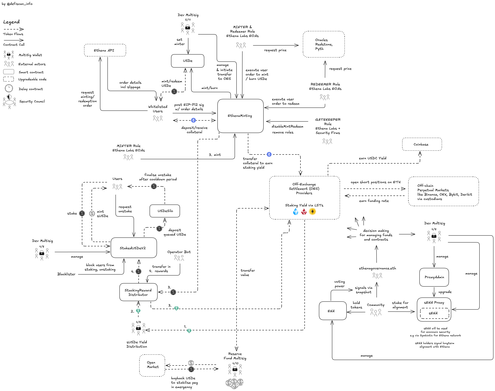

# Summary

Ethena is a stablecoin protocol built on Ethereum. Ethena's stablecoin dollar, `USDe`, is fully backed by crypto assets (Bitcoin, Ethereum, Solana), yield from staked ETH through Liquid Staking Tokens (LSTs) and funding rates earnings from short futures positions on CEXs. `USDe` is minted and redeemed by whitelisted KYCed users. Any user can acquire `USDe` on the open market and stake it to get access to yield sourced from the strategies and passed onto the users of the `USDe` stablecoin. `ENA` the governance token is freely tradeable and can be used to signal the direction of the protocol through offchain governance on [Snapshot](https://snapshot.box/#/s:ethenagovernance.eth).

# Ratings

## Chain

The report is concerned with the `USDe` stablecoin protocol deployed on Ethereum mainnet. Ethereum mainnet achieves a _Low_ centralization risk score.

> Chain score: Low

## Upgradeability

Users mint `USDe` by depositing Bitcoin, Ethereum, or Solana assets in the protocol. These funds make up the collateral backing of the `USDe` stablecoin and are sent to simple Ethereum (custodian) accounts (EOAs). If the accounts are not configured correctly or compromised, the `USDe` collateral backing could be lost immediately resulting in the _loss of funds_.

Minting and redemption of `USDe` is permissioned to the `MINTER` & `REDEEMER` roles which is owned by a number of Ethena Labs accounts (EOAs). No onchain guardrails exist that restrict the uncontrolled minting by a compromised account.

Third-parties have to go through KYC to be whitelisted for minting and redeeming `USDe`. The whitelist is managed by the `DEFAULT_ADMIN_ROLE` role currently held by the [Dev Multisig](#security-council). If users are removed from the whitelist, they would have to sell any `USDe` holdings on the open market, potentially at a loss.

Users can further stake `USDe` to receive `sUSDe` and benefit from the distribution of yield generated by strategies executed on- and offchain. The `USDe` staking contract includes a blacklist feature. If a user is blacklisted, they are blocked from staking or unstaking `USDe`. Moreover, a blacklisted user's `USDe` could be seized and sent to another account or redestributed among all other stakers. Blacklisting and seizing stakers' funds require two steps that are carried out by two different permission owners, the `BLACKLIST_MANAGER_ROLE` (blacklisting) and the `DEFAULT_ADMIN_ROLE` (seizing), see [table](#role-permission-inside-stakedusdev2) for current role owners. If access to these accounts was lost or compromised, users' could suffer from the freezing or _loss of funds_.

Additionally, the Ethena stablecoin protocol comes with a staking contract for the the governance token `ENA`. Users can stake `ENA` to gain additionally rewards and show longterm alignment with Ethena. The `ENA` staking contract is upgradeable with permission to upgrade owned by the [Dev Multisig](#security-council). If access to these accounts was lost or compromised, users that staked their `ENA` tokens could suffer from _loss of funds_.

> Upgradeability score: High

## Autonomy

As discussed, the Ethena stablecoin protocol relies on a set of offchain hedging and yield strategies to maintain full backing of the USDe stablecoin and generate yield for stakers. According to the protocol [documentation](https://docs.ethena.fi/), these offchain strategies are diversified in a number of important ways and specifically:

1. different custody providers
2. different CEXs for opening hedging positions
3. holding reserves in different spot assets (BTC, ETH, SOL)
4. different ETH staking yield sources through multiple LSTs

That said, the different services providers involved in these activities are all in full control over respective assets thus introducing critical centralization vectors.

As a result, the Ethena stablecoin protocol achieves a High centralization risk score for the Autonomy dimension.

> Autonomy score: High

## Exit Window

All permissions are not protected by an _Exit Window_ and can be executed immediately, thus could harm the users immediately. An notable exception is the minting of `ENA` tokens which can be minted only once every year.

> Exit Window score: High

## Accessibility

The user interactions with the protocol can be divided into two parts: the minting and redeeming of `USDe` and the staking of `USDe`.

Users can host a frontend to mint and redeem `USDe` from https://github.com/ethena-labs/ethena-minting-client. For this action the _Accessibility_ risk is _Medium_.

For staking `USDe` the protocol does not provide a frontend to self host. The staking is only possible through the Ethena frontend. For this action the _Accessibility_ risk is _High_.

> Accessibility score: High

## Conclusion

The `USDe` stablecoin protocol places custody over user funds, the assets that users are promised to redeem the `USDe` stablecoin for, in centralized custody with third-party custodians. The protocol is thus classified as **Others**.

# Reviewer's Notes

No additional notes.

# Protocol Analysis

## USDe Token

The owner of the `USDe` contract is the [Dev Multisig](#security-council). The [Dev Multisig](#security-council) can set any minter address, which can increase the `USDe` supply and mint `USDe` tokens to any address. The multisig is trusted to not abuse this power. The minter address is set to the `EthenaMinting` contract, which requires a transfer of accepted collateral, before minting `USDe`.

## Minting and Redeeming USDe

The Ethena stablecoin protocol allows whitelisted users to mint and redeem `USDe` through a flow that combines offchain quoting and onchain order submission with final execution by Ethena servers using EOAs with roles `MINTER_ROLE` and `REDEEMER_ROLE` (see [table](#role-permission-inside-ethenaminting)).

The process begins offchain, where a whitelisted user interacts with an Ethena-hosted pricing server to request a quote. This quote reflects the amount of collateral to be deposited and the expected `USDe` to be received. Using this information, the user constructs and signs an EIP-712 order. The signed order includes the benefactor address, collateral asset and amount of `USDe` minted.

A central server operated by the Ethena team validates this order. If the algorithms decide the order is not suitable or valid, the order is not processed or queued for later execution. Thus the users do not have inclusion guarantees for their orders. These checks do not have to be strictly enforced due to the centralized nature of compute and control, additionally the checks for global and block-level caps are strictly enforced inside the smart contract of `EthenaMinting` which prevents over-exposure to certain collateral assets and too drastic changes in collateral exposure.

If all internal checks pass, the Ethena server submits the signed order onchain by calling the `mint` or `redeem` function on the `EthenaMinting` contract. The EOAs used by the server must hold the `MINTER_ROLE` to call `mint`, or the `REDEEMER_ROLE` to call `redeem` (see [table](#role-permission-inside-ethenaminting)). On `mint`, the collateral is transferred from the whitelisted user to the `EthenaMinting` contract and `USDe` is minted into the users address by calling `mint` on the `USDe` contract. The `EthenaMinting` contract is assigned as the minter in `USDe` and is therefore the sole entity able to issue new tokens. On `redeem`, `USDe` is burned and the corresponding collateral is released to the user. No cooldown period exists for redeeming collateral for returning `USDe`.

Multiple administrative permissions exist to modify creation and burning of `USDe`. The `DEFAULT_ADMIN_ROLE` in `EthenaMinting` can set or change the global mint and redeem caps using `setGlobalMaxMintPerBlock` and `setGlobalMaxRedeemPerBlock`. Furthermore, the `GATEKEEPER_ROLE` may call `disableMintRedeem`, which pauses all minting and redeeming operations. This function is designed to temporary preventing further minting or redeeming in the case of a vulnerability or instability. Users that have collateral deposited and are prohibited to access their collateral can lose funds if they have to sell it in the open market if the `USDe` trades below the collateral value. Restoring minting and redeeming functionality requires setting non-zero limits via the respective `setGlobalMaxMintPerBlock` and `setGlobalMaxRedeemPerBlock` functions which only can be executed by the `DEFAULT_ADMIN_ROLE`.

The `GATEKEEPER_ROLE` may also revoke `MINTER_ROLE` and `REDEEMER_ROLE` from addresses that currently own the respective roles by calling `removeMinterRole`, `removeRedeemerRole` or `removeCollateralManagerRole`. Which is a designed security measure in case of compromised addresses.

Additionally, `removeWhitelistedBenefactor` allows the `GATEKEEPER_ROLE` to remove an address from the whitelist. Only whitelisted addresses are allowed to supply valid orders. Ethena will not accept orders from addresses that are not whitelisted, to comply with AML laws and KYC requirements, as well as anti-terrorist financing laws. If an address created a position with collateral, but got removed from the whitelist, the address has to sell the `USDe` on the open market and has no access to its deposited collateral. This could lead to _loss of funds_ for users that have collateral deposited and are removed from the whitelist if the `USDe` price drops below the collateral value.

All core permissions for minting, redeeming, managing roles, and custodial flows are ultimately under the control of [Dev Multisig](#security-council), either directly or indirectly via its ability to control `DEFAULT_ADMIN_ROLE` holders and keeps onchain authority over the `USDe` supply.

Collateral flows to custodian addresses are executed through the `transferToCustody` function, callable only by addresses with the `COLLATERAL_MANAGER_ROLE`. The destination addresses for this function can only be added or removed by holding the `DEFAULT_ADMIN_ROLE`. Maliciously set addresses can lead to stealing collateral from users and the protocol.

## Staking USDe

Ethena enables _Stakers_ to earn yield by locking their `USDe` in the `StakedUSDeV2` contract, which issues `sUSDe` in return. This contract inherits the ERC-4626 vault standard and adds a cooldown period to complete a withdrawal. Users deposit `USDe` and receive `sUSDe` at a ratio determined by total vault assets and total shares. Yield earned by the vault is reflected as an increase in the value of each `sUSDe` share.

The `StakedUSDeV2` contract implements a cooldown period, _Stakers_ must wait 7 days to complete a withdrawal. After the cooldown the `USDe` can be withdrawn by calling `withdraw` which transfers `USDe` from the `USDeSilo` contract to the _Staker_. The cooldown period is configurable by calling `setCooldownDuration` and is capped at 90 days max.

The `StakedUSDeV2` contract also includes a blacklist mechanism managed by addresses holding the `BLACKLIST_MANAGER_ROLE`. If a user is blacklisted, they are prevented from staking or unstaking `USDe`. This could result in _loss of funds_ if users are unable to retrieve their staked assets and and if they have to sell `sUSDe` on the open market at a discount. It can lead to a complete _loss of funds_ if their `sUSDe` is burned from their wallet and redistributed to other _Stakers_ via the `redistributeLockedAmount` function, which is controlled by the `DEFAULT_ADMIN_ROLE`.

Yield from the various strategies is transferred into the system via the `StakingRewardsDistributor` contract. The `StakingRewardsDistributor` contract holds `USDe` rewards and regularly calls `transferInRewards` to transfer them into `StakedUSDeV2`. The `StakingRewardsDistributor` is operated by an address labeled [Operator](#security-council), which is itself appointed by the [Dev Multisig](#security-council). While the [Operator](#security-council) can delay transfers, they cannot redirect funds or change the recipient. This minimizes the risk of _loss of unclaimed yield_, though misconfiguration or inaction may still delay yield distribution. The [Dev Multisig](#security-council) can replace the [Operator](#security-council) to prevent _loss of unclaimed yield_ at any time.

The ability to rescue tokens from the vault, handled by `rescueTokens`, is restricted to addresses with the `DEFAULT_ADMIN_ROLE`. Although this function cannot extract `USDe`, it can affect other tokens accidentally sent to the vault.

# Dependencies

`USDe` is only slightly overcollateralized and relies on various strategies to maintain stability and peg to the US-Dollar. The strategies rely on various counterparties to function correctly. If any of the counterparties fail, the solvency of the protocol is at risk. Ethena has a [Reserve Fund](#security-council) to provide a buffer in case of negative performance of the diversified yield strategies. Ethena employs diversification within each strategy by relying on various counterparties and tokens as well as diversify in different strategies. The following paragraphs go into more detail.

## CEXs

The Ethena `USDe` Stablecoin protocol relies on centralized exchanges (CEXs) for maintaining short perpetual positions to create a delta neutral strategy.

The CEXs that are used by Ethena `USDe` protocol include Binance, OKX, Deribit and Bybit. By splitting opening short perpetuals on multiple CEXs, Ethena can reduce the risk of a single exchange failure.

## Custodians (Off-Exchange Settlement)

Ethena holds the backing assets used in CEXs for perpetual positions in custody with "Off-Exchange Settlement" solutions which allows to delegate funds to the CEX trades without transferring the assets to the CEX. The funds only flow for settlement of PnL and paying funding rate. For example, via Copper Clearloop this happens daily to prevent accumulation of unsettled profit/loss. In case of an exchange failure, Ethena should be able to delegate the funds to other exchanges to continue the strategy.

OES providers that Ethena uses as mentioned include Copper, Ceffu and Fireblocks.

## Centralized Stablecoins

Ethena allocates parts of their collateral funds into `USDC` to earn yield distributed by Coinbase. Ethena therefore relies on Circle as Stablecoin issuer and on Coinbase custody.

## Backing Assets

Ethena holds `BTC`, `ETH`, `SOL` and ETH `LSTs` as collateral for the `USDe` stablecoin. To reduce dependency risk on a single `LST`, Ethena diversifies their collateral assets into [Binance Staked ETH (WBETH)](../binance-staked-eth/ethereum.md), [Lido stETH](../lido-v2/ethereum.md) and Mantle's mETH.

## Margin Collateral

Most of the margin in perpetual futures positions are denominated in `USDT`. By this, Ethena is unidirectionally LONG exposed to the `USDT` price without offsetting with short exposure. In case of indicated solvency risk, custodial risk, regulatory risk for `USDT`, Ethena would aim to open inverse perpetuals contracts, margined with `BTC` or `ETH`.

## USDtb

`USDtb` is an asset in the [Reserve Fund](#security-council) to provide a buffer in case of negative performance of the diversified yield strategy. `USDtb` is a separate project from the `USDe` stablecoin, but is also created and managed by the Ethena Team. `USDtb` is backed by short duration treasury assets inside the BlackRock's BUIDL fund. tb inside USDtb stands for "Treasury Bills".

# Governance

Ethena governance using the `ENA` token is purely used for signalling and is not technically enforcing. Holders of `ENA` can participate in offchain voting via [Snapshot](https://snapshot.box/#/s:ethenagovernance.eth), where they may submit and vote on proposals related to risk parameters, vault configurations, supported collateral, and other protocol adjustments.

Votes cast on Snapshot are technically not binding. Their outcomes inform the Ethena Labs Team and the Risk Committee, who are responsible for executing changes onchain through controlled permission owners like the [Dev Multisig](#security-council), the other multisigs and EOAs listed in the tables [here](#role-permission-inside-ethenaminting). The Risk Committee consists of selected individuals or entities elected by the Ethena Labs Team.

The `ENA` token itself is governed by the [Dev Multisig](#security-council), which holds exclusive access to the mint function. Token minting is constrained to a maximum of 10% annually and can only occur once every year. The ownership of `ENA` is transferable via `transferOwnership`.

Ultimately _Governance_ execution remains under centralized control.

## Security Council

| Name                     | Account                                                                                                               | Type          | ≥ 7 signers | ≥ 51% threshold | ≥ 50% non-insider | Signers public |
| ------------------------ | --------------------------------------------------------------------------------------------------------------------- | ------------- | ----------- | --------------- | ----------------- | -------------- |
| Dev Multisig             | [0x3B0AAf6e6fCd4a7cEEf8c92C32DFeA9E64dC1862](https://etherscan.io/address/0x3B0AAf6e6fCd4a7cEEf8c92C32DFeA9E64dC1862) | Multisig 5/11 | ✅          | ❌              | ❌                | ❌             |
| sUSDe Yield Distribution | [0x71e4f98e8f20c88112489de3dded4489802a3a87](https://etherscan.io/address/0x71e4f98e8f20c88112489de3dded4489802a3a87) | Multisig 4/11 | ✅          | ❌              | ❌                | ❌             |
| Reserve Fund             | [0x2b5ab59163a6e93b4486f6055d33ca4a115dd4d5](https://etherscan.io/address/0x2b5ab59163a6e93b4486f6055d33ca4a115dd4d5) | Multisig 4/10 | ✅          | ❌              | ❌                | ❌             |

# Contracts & Permissions

## Contracts

| Contract Name             | Address                                                                                                               |
| ------------------------- | --------------------------------------------------------------------------------------------------------------------- |
| USDe                      | [0x4c9EDD5852cd905f086C759E8383e09bff1E68B3](https://etherscan.io/address/0x4c9EDD5852cd905f086C759E8383e09bff1E68B3) |
| EthenaMinting             | [0xe3490297a08d6fC8Da46Edb7B6142E4F461b62D3](https://etherscan.io/address/0xe3490297a08d6fC8Da46Edb7B6142E4F461b62D3) |
| StakedUSDeV2              | [0x9D39A5DE30e57443BfF2A8307A4256c8797A3497](https://etherscan.io/address/0x9D39A5DE30e57443BfF2A8307A4256c8797A3497) |
| StackingRewardDistributor | [0xf2fa332bD83149c66b09B45670bCe64746C6b439](https://etherscan.io/address/0xf2fa332bD83149c66b09B45670bCe64746C6b439) |
| USDeSilo                  | [0x7FC7c91D556B400AFa565013E3F32055a0713425](https://etherscan.io/address/0x7FC7c91D556B400AFa565013E3F32055a0713425) |
| ENA                       | [0x57e114B691Db790C35207b2e685D4A43181e6061](https://etherscan.io/address/0x57e114B691Db790C35207b2e685D4A43181e6061) |
| sENA (Proxy)              | [0x8bE3460A480c80728a8C4D7a5D5303c85ba7B3b9](https://etherscan.io/address/0x8bE3460A480c80728a8C4D7a5D5303c85ba7B3b9) |
| sENA (Implementation)     | [0x7fd57b46ae1a7b14f6940508381877ee03e1018b](https://etherscan.io/address/0x7fd57b46ae1a7b14f6940508381877ee03e1018b) |
| EnaSilo                   | [0x4655B6A10C83D6bEfF1DC7116436cFD8b4F8d48A](https://etherscan.io/address/0x4655B6A10C83D6bEfF1DC7116436cFD8b4F8d48A) |
| ProxyAdmin                | [0xf849D7792Ff9b30A57656ee10a2776bCb49F4Fe4](https://etherscan.io/address/0xf849D7792Ff9b30A57656ee10a2776bCb49F4Fe4) |

## All Permission Owners

| Name                                 | Account                                                                                                               | Type          |
| ------------------------------------ | --------------------------------------------------------------------------------------------------------------------- | ------------- |
| Dev Multisig                         | [0x3B0AAf6e6fCd4a7cEEf8c92C32DFeA9E64dC1862](https://etherscan.io/address/0x3B0AAf6e6fCd4a7cEEf8c92C32DFeA9E64dC1862) | Multisig 5/11 |
| sUSDe Yield Distribution             | [0x71e4f98e8f20c88112489de3dded4489802a3a87](https://etherscan.io/address/0x71e4f98e8f20c88112489de3dded4489802a3a87) | Multisig 4/11 |
| Operator (StakingRewardsDistributor) | [0xe3880B792F6F0f8795CbAACd92E7Ca78F5d3646e](https://etherscan.io/address/0xe3880B792F6F0f8795CbAACd92E7Ca78F5d3646e) | EOA           |
| ProxyAdmin                           | [0xf849D7792Ff9b30A57656ee10a2776bCb49F4Fe4](https://etherscan.io/address/0xf849D7792Ff9b30A57656ee10a2776bCb49F4Fe4) | Contract      |
| Reserve Fund                         | [0x2b5ab59163a6e93b4486f6055d33ca4a115dd4d5](https://etherscan.io/address/0x2b5ab59163a6e93b4486f6055d33ca4a115dd4d5) | Multisig 4/10 |
| Protocol Treasury                    | [0xa2af0b03aaf167cfc9624c6ef587581b6fcced92](https://etherscan.io/address/0xa2af0b03aaf167cfc9624c6ef587581b6fcced92) | Multisig 5/11 |
| ethenagovernance.eth                 | [0xC5ceB655E63c1B990150FeeFf4f63d8A43BbD6cb](https://etherscan.io/address/0xC5ceB655E63c1B990150FeeFf4f63d8A43BbD6cb) | EOA           |

## Permissions

| Contract                                | Function                    | Impact                                                                                                                                                                                                                                                                                                                                                                                                                                                                                                                              | Owner                                                |
| --------------------------------------- | --------------------------- | ----------------------------------------------------------------------------------------------------------------------------------------------------------------------------------------------------------------------------------------------------------------------------------------------------------------------------------------------------------------------------------------------------------------------------------------------------------------------------------------------------------------------------------- | ---------------------------------------------------- |
| USDe                                    | transferOwnership           | This function transfers ownership of the contract to a new address. A malicious owner could address a new minter, it controls, and then mint `USDe` out of thin air. This would devalue the token and cause loss of funds for users.                                                                                                                                                                                                                                                                                                | Dev Multisig                                         |
| USDe                                    | renounceOwnership           | This function renounces ownership of the contract. If the owner role is renounced, the ownership cannot be changed anymore and no new minter can be set.                                                                                                                                                                                                                                                                                                                                                                            | Dev Multisig                                         |
| USDe                                    | setMinter                   | This function sets the minter role for a given address. The minter role is used to mint new `USDe` tokens. A malicious minter could mint `USDe` out of thin air.                                                                                                                                                                                                                                                                                                                                                                    | Dev Multisig                                         |
| USDe                                    | mint                        | This function mints a specified amount of `USDe` tokens. Currently owned by the `EthenaMinting` contract, which receives the collateral.                                                                                                                                                                                                                                                                                                                                                                                            | EthenaMinting                                        |
| EthenaMinting                           | transferAdmin               | This function transfers the admin role to a new address.                                                                                                                                                                                                                                                                                                                                                                                                                                                                            | DEFAULT_ADMIN_ROLE                                   |
| EthenaMinting                           | acceptAdmin                 | This function accepts the admin role.                                                                                                                                                                                                                                                                                                                                                                                                                                                                                               | new DEFAULT_ADMIN_ROLE                               |
| EthenaMinting                           | renounceRole                | This function renounces a role. The DEFAULT_ADMIN_ROLE cannot be renounced.                                                                                                                                                                                                                                                                                                                                                                                                                                                         | respective role owner                                |
| EthenaMinting                           | grantRole                   | This function grants a role to a given address. MINTER_ROLE, REDEEMER_ROLE, COLLATERAL_MANAGER_ROLE and GATEKEEPER_ROLE are the available roles to this date. A malicious MINTER_ROLE owner could call mint on existing orders without the required healthchecks, but it cannot call mint without a successful call of transferring collateral into this contract. REDEEMER_ROLE can burn `USDe` tokens but only upon successful return of `USDe` and based on an existing and valid order (EIP-712).                               | DEFAULT_ADMIN_ROLE                                   |
| EthenaMinting                           | revokeRole                  | This function allows the admin to revoke roles from role owners.                                                                                                                                                                                                                                                                                                                                                                                                                                                                    | DEFAULT_ADMIN_ROLE                                   |
| EthenaMinting                           | mint                        | This function mints a specified amount of `USDe` tokens. A malicious MINTER_ROLE owner could call mint on existing orders without the required healthchecks, but it cannot call mint without a successful call of transferring collateral into this contract.                                                                                                                                                                                                                                                                       | MINTER_ROLE                                          |
| EthenaMinting                           | mintWETH                    | Equivalent of `mint` but using `WETH` as collateral.                                                                                                                                                                                                                                                                                                                                                                                                                                                                                | MINTER_ROLE                                          |
| EthenaMinting                           | redeem                      | REDEEMER_ROLE can burn `USDe` tokens but only upon successful return of `USDe` and based on an existing and valid order (EIP-712).                                                                                                                                                                                                                                                                                                                                                                                                  | REDEEMER_ROLE                                        |
| EthenaMinting                           | setGlobalMaxMintPerBlock    | This function allows to set a cap on total mint per block, the first transaction that would surpass the cap reverts and does not execute successfully. This protects the system from an attack or distabilising the system by minting too much `USDe` in a short amount of time.                                                                                                                                                                                                                                                    | DEFAULT_ADMIN_ROLE                                   |
| EthenaMinting                           | setGlobalMaxRedeemPerBlock  | This function allows to set a cap on total redeem per block, the first transaction that would surpass the cap reverts and does not execute successfully. This protects the system from an attack or distabilising the system by redeeming too much `USDe` in a short amount of time.                                                                                                                                                                                                                                                | DEFAULT_ADMIN_ROLE                                   |
| EthenaMinting                           | disableMintRedeem           | This function disables minting and redeeming until it is resumed again. This allows to pause the system to investigate problems or to prevent (further) attacks. It could be mis-used to prevent minting and redeeming for a long period of time or indefinitely. It is resumed by calling `setGlobalMaxMintPerBlock` and `setGlobalMaxRedeemPerBlock` with a value of greater than 0.                                                                                                                                              | GATEKEEPER_ROLE                                      |
| EthenaMinting                           | transferToCustody           | This function transfers collateral to the custody wallet. This transfers ownership over the collateral tokens from the `EthenaMinting` contract to the custody wallet.                                                                                                                                                                                                                                                                                                                                                              | COLLATERAL_MANAGER_ROLE                              |
| EthenaMinting                           | removeSupportedAsset        | This function removes ERC20 assets from the list of supported assets that can be transferred to custody by calling `transferToCustody`.                                                                                                                                                                                                                                                                                                                                                                                             | DEFAULT_ADMIN_ROLE                                   |
| EthenaMinting                           | removeCustodianAddress      | This function removes custodian receiver addresses from the list of custodian addresses that can be used to call `transferToCustody`.                                                                                                                                                                                                                                                                                                                                                                                               | DEFAULT_ADMIN_ROLE                                   |
| EthenaMinting                           | removeMinterRole            | This allows the GATEKEEPER_ROLE to remove a MINTER_ROLE from an address. The address cannot further call `mint` or `mintWETH`. If all MINTER_ROLE owners are removed, the `mint` and `mintWETH` functions cannot be executed and all incoming mint orders cannot be solved.                                                                                                                                                                                                                                                         | GATEKEEPER_ROLE                                      |
| EthenaMinting                           | removeRedeemerRole          | This allows the GATEKEEPER_ROLE to remove a REDEEMER_ROLE from an address. The address cannot further call `redeem`. If all REDEEMER_ROLE owners are removed, the `redeem` function cannot be executed and all incoming redeem orders cannot be solved.                                                                                                                                                                                                                                                                             | GATEKEEPER_ROLE                                      |
| EthenaMinting                           | removeCollateralManagerRole | This allows the GATEKEEPER_ROLE to remove a COLLATERAL_MANAGER_ROLE owner. If all COLLATERAL_MANAGER_ROLE owners are removed, the `transferToCustody` function cannot be executed all funds remain in the `EthenaMinting` contract, which endangers the system, as it relies on trading strategies executed from the custody wallets instead of over-collaterlization.                                                                                                                                                              | GATEKEEPER_ROLE                                      |
| EthenaMinting                           | removeWhitelistedBenefactor | This allows the GATEKEEPER_ROLE to remove an address from the whitelist. Only whitelisted addresses are allowed to supply valid orders. Ethena will not accept orders from addresses that are not whitelisted, to comply with AML laws and KYC requirements, as well as anti-terrorist financing laws. If an address created a position with collateral, but got removed from the whitelist, the address has to sell the `USDe` on the open market and has no access to its deposited collateral. This could lead to loss of funds. | GATEKEEPER_ROLE                                      |
| EthenaMinting                           | addCustodianAddress         | This function adds addresses that can be used as receiver addresses for `transferToCustody`.                                                                                                                                                                                                                                                                                                                                                                                                                                        | DEFAULT_ADMIN_ROLE                                   |
| EthenaMinting                           | addWhitelistedBenefactor    | This function adds addresses to the whitelist. Only whitelisted addresses are allowed to supply valid orders. Ethena will not accept orders from addresses that are not whitelisted, to comply with AML laws and KYC requirements, as well as anti-terrorist financing laws.                                                                                                                                                                                                                                                        | DEFAULT_ADMIN_ROLE                                   |
| EthenaMinting                           | addSupportedAsset           | This function address assets that can be used as collateral and can be sent to custodian addresses.                                                                                                                                                                                                                                                                                                                                                                                                                                 | DEFAULT_ADMIN_ROLE                                   |
| EthenaMinting                           | setMaxMintPerBlock          | This function allows to set a maximum cap for each asset on how much of a collateral is accepted per block. The first transaction that surpasses this cap for a specific asset will revert.                                                                                                                                                                                                                                                                                                                                         | DEFAULT_ADMIN_ROLE                                   |
| EthenaMinting                           | setMaxRedeemPerBlock        | This function allows to set a maximum cap for each asset on how much of a collateral is accepted to be removed as collateral through the redeem process per block. The first transaction that surpasses this cap for a specific asset will revert.                                                                                                                                                                                                                                                                                  | DEFAULT_ADMIN_ROLE                                   |
| EthenaMinting                           | setTokenType                | This allows to set a collateral token as a stable or normal asset (volatile). If it's a stable coin, stablesDeltaLimit applies.                                                                                                                                                                                                                                                                                                                                                                                                     | DEFAULT_ADMIN_ROLE                                   |
| EthenaMinting                           | setStablesDeltaLimit        | Sets the allowed price delta in bps for a stablecoin as collateral for USDe minting.                                                                                                                                                                                                                                                                                                                                                                                                                                                | DEFAULT_ADMIN_ROLE                                   |
| StakedUSDeV2                            | transferInRewards           | This function allows to transfer rewards earned through strategies (like staking ETH, ETH shorts) to the staked USDe contract.                                                                                                                                                                                                                                                                                                                                                                                                      | REWARDER_ROLE                                        |
| StakedUSDeV2                            | addToBlacklist              | Staking and unstaking `USDe` goes through a blacklist check. If an address is blacklisted, the user cannot stake or unstake `USDe`. This function allows an address with the `BLACKLIST_MANAGER_ROLE` to add an address to the blacklist. Users that have funds already staked, cannot claim their `USDe` this could lead to loss of user funds. The `sUSDe` is tradeable and as long it can be sold for a fair price, it allows the user to opt-out of the Ethena ecosystem without incurring any loss.                            | BLACKLIST_MANAGER_ROLE                               |
| StakedUSDeV2                            | removeFromBlacklist         | This function undoes what `addToBlacklist` does immediately.                                                                                                                                                                                                                                                                                                                                                                                                                                                                        | BLACKLIST_MANAGER_ROLE                               |
| StakedUSDeV2                            | rescueTokens                | This function allows to rescue tokens that are sent to the contract by mistake. This function does not allow to "rescue" and steal `USDe`.                                                                                                                                                                                                                                                                                                                                                                                          | DEFAULT_ADMIN_ROLE                                   |
| StakedUSDeV2                            | redistributeLockedAmount    | Burns the blacklisted user `sUSDe` amount and mints to the desired owner address or removes `sUSDe` from circulation and updates the total claimable `USDe`, which benefits all users equally.                                                                                                                                                                                                                                                                                                                                      | DEFAULT_ADMIN_ROLE                                   |
| StakedUSDeV2                            | transferAdmin               | This function allows to initiate a transfer over the DEFAULT_ADMIN_ROLE to a new address. The new owner needs to call `acceptAdmin`. If the owner over this role is compromised, it could lead to loss of user funds, since the DEFAULT_ADMIN_ROLE is able to withdraw `USDe` from the contract via blacklisting all users, by assigning the BLACKLIST_MANAGER_ROLE to itself and redirecting the funds to itself.                                                                                                                  | DEFAULT_ADMIN_ROLE                                   |
| StakedUSDeV2                            | acceptAdmin                 | This function is required to accept a transfer of the DEFAULT_ADMIN_ROLE.                                                                                                                                                                                                                                                                                                                                                                                                                                                           | new DEFAULT_ADMIN_ROLE                               |
| StakedUSDeV2                            | renounceRole                | This function renounces a role. The DEFAULT_ADMIN_ROLE cannot be renounced.                                                                                                                                                                                                                                                                                                                                                                                                                                                         | respective role owner                                |
| StakedUSDeV2                            | grantRole                   | This function grants a role to a given address. The available roles are: DEFAULT_ADMIN_ROLE, BLACKLIST_MANAGER_ROLE, REWARDER_ROLE. The `BLACKLIST_MANAGER_ROLE` can prevent users from staking and unstaking `USDe` by adding them to the blacklist.                                                                                                                                                                                                                                                                               | DEFAULT_ADMIN_ROLE                                   |
| StakedUSDeV2                            | revokeRole                  | This function revokes a role (BLACKLIST_MANAGER_ROLE, REWARDER_ROLE) from a given address.                                                                                                                                                                                                                                                                                                                                                                                                                                          | DEFAULT_ADMIN_ROLE                                   |
| StakedUSDeV2                            | setCooldownDuration         | Amount of time that the user needs to wait after calling `cooldownShares` or `cooldownAssets` in order to claim `USDe`. The maximal cooldown duration is set to 90 days. Thus the user can claim `USDe` after 90 days of cooldown the latest.                                                                                                                                                                                                                                                                                       | DEFAULT_ADMIN_ROLE                                   |
| StakingRewardsDistributor               | renounceOwnership           | Renounces ownership of the contract.                                                                                                                                                                                                                                                                                                                                                                                                                                                                                                | Dev Multisig                                         |
| StakingRewardsDistributor               | transferOwnership           | Transfers ownership of the contract to a new account.                                                                                                                                                                                                                                                                                                                                                                                                                                                                               | Dev Multisig                                         |
| StakingRewardsDistributor               | transferInRewards           | This contract allows to transfer rewards earned through strategies (like staking ETH, ETH shorts) to the staked USDe contract. The purpose of this contract is to constantly transfer rewards to the staked USDe contract without requiring a multisig to repeatedly call the function. The constant transfer of rewards is required to make the distribution of yield for stakers fair. This contract has the REWARDER_ROLE in the staking contract.                                                                               | Operator                                             |
| StakingRewardsDistributor               | rescueTokens                | Transfers all wrongfully held tokens to a recipient to rescue the tokens.                                                                                                                                                                                                                                                                                                                                                                                                                                                           | Dev Multisig                                         |
| StakingRewardsDistributor               | setMintingContract          | This sets the contract                                                                                                                                                                                                                                                                                                                                                                                                                                                                                                              | Dev Multisig                                         |
| StakingRewardsDistributor               | approveToMintContract       | This function allows to increase ERC20 token allowance to a potential new Ethena Minting contract.                                                                                                                                                                                                                                                                                                                                                                                                                                  | Dev Multisig                                         |
| StakingRewardsDistributor               | revokeApprovals             | This allows to revoke allowance set to a previous Ethena Minting contract, if ever the Ethena Minting contract reference is changed.                                                                                                                                                                                                                                                                                                                                                                                                | Dev Multisig                                         |
| StakingRewardsDistributor               | setOperator                 | The operator calls the `transferInRewards` function to transfer in the `USDe` rewards from the `StakingRewardsDistributor` contract to the `sUSDe` contract. The operator has no rights to change the destination, thus it can only delay the flow of rewards to the `sUSDe` contract. A malicious operator has no ability to cause damage, and can be quickly replaced.                                                                                                                                                            | Dev Multisig                                         |
| USDeSilo                                | withdraw                    | The `USDeSilo` contract stores `USDe` during the cooldown process, when users want to withdraw their stake. The `withdraw` function is called by the staking contract, when a user withdraws the `USDe` after the cooldown period.                                                                                                                                                                                                                                                                                                  | StakedUSDeV2                                         |
| ENA                                     | transferOwnership           | The ownership can only be transferred and not renounced. Transferring ownership transfers the right to mint new ENA tokens.                                                                                                                                                                                                                                                                                                                                                                                                         | Dev Multisig                                         |
| ENA                                     | mint                        | The owner of the contract can mint new ENA tokens, but the owner can only mint once every year and only maximum by 10%. Thus inflation is clearly capped and loss of funds cannot happen through privileged access directly on the ENA token.                                                                                                                                                                                                                                                                                       | Dev Multisig                                         |
| StakedENA (TransparentUpgradeableProxy) | changeAdmin                 | This function allows to change the admin which is the privileged actor to update the contract. A contract upgrade can lead to loss of funds. The Dev Multisig is currently the owner of the ProxyAdmin contract which serves as a managing contract for upgrading.                                                                                                                                                                                                                                                                  | ProxyAdmin                                           |
| StakedENA (TransparentUpgradeableProxy) | upgradeTo                   | This function upgrades the staked ENA contract. Upgrading this contract, since it is a token, can lead to loss of funds.                                                                                                                                                                                                                                                                                                                                                                                                            | ProxyAdmin                                           |
| StakedENA (TransparentUpgradeableProxy) | upgradeToAndCall            | This function allows to upgrade the staked ENA contract and atomically call a another function.                                                                                                                                                                                                                                                                                                                                                                                                                                     | ProxyAdmin                                           |
| StakedENA (Implementation)              | transferAdmin               | This transfer of admin is not to confuse with `changeAdmin`'s "admin". This function changes the `DEFAULT_ADMIN_ROLE` which has the privilege to appoint roles to manage `StakedENA` or to directly manage this contract by calling `updateVestingPeriod`, `rescueTokens` or `redistributeLockedAmount`. Thus the `DEFAULT_ADMIN_ROLE` has the privilege to assign a `BLACKLIST_MANAGER_ROLE` and consecutively redirect the blacklisted funds to a desired address.                                                                | DEFAULT_ADMIN_ROLE                                   |
| StakedENA (Implementation)              | acceptAdmin                 | Transferring `DEFAULT_ADMIN_ROLE` is a two-step process in which the recipient of the role needs to confirm the new role. This prevents appointing a uncontrolled address or wrongly referenced.                                                                                                                                                                                                                                                                                                                                    | new DEFAULT_ADMIN_ROLE                               |
| StakedENA (Implementation)              | renounceRole                | Each role owner of `REWARDER_ROLE` or `BLACKLIST_MANAGER_ROLE` can renounce the role. The `DEFAULT_ADMIN_ROLE` cannot renounce its role.                                                                                                                                                                                                                                                                                                                                                                                            | respective role owner                                |
| StakedENA (Implementation)              | grantRole                   | This allows the `DEFAULT_ADMIN_ROLE` to grant either the `REWARDER_ROLE` or the `BLACKLIST_MANAGER_ROLE` to any address. Both roles are not exclusive and can be appointed multiple times.                                                                                                                                                                                                                                                                                                                                          | DEFAULT_ADMIN_ROLE                                   |
| StakedENA (Implementation)              | revokeRole                  | This allows the `DEFAULT_ADMIN_ROLE` to remove the role from any of the appointed role owners of the the `REWARDER_ROLE` or the `BLACKLIST_MANAGER_ROLE`.                                                                                                                                                                                                                                                                                                                                                                           | DEFAULT_ADMIN_ROLE                                   |
| StakedENA (Implementation)              | unstake                     | This allows users to unstake the `ENA` tokens by burning `sENA`. Users can only unstake once their cooldown has finished and they were not blacklisted since they started staking. If blacklisted they would suffer loss of funds, if they cannot sell the `sENA` for a fair price.                                                                                                                                                                                                                                                 | all users with finished cooldown and not blacklisted |
| StakedENA (Implementation)              | setCooldownDuration         | Amount of time that the user needs to wait after calling `cooldownShares` or `cooldownAssets` in order to claim `USDe`. The maximal cooldown duration is set to 90 days. Thus the user can claim `USDe` after 90 days of cooldown the latest. This max duration can be overwritten by a contract upgrade.                                                                                                                                                                                                                           | DEFAULT_ADMIN_ROLE                                   |
| StakedENA (Implementation)              | updateVestingPeriod         | If new rewards are sent into this contract for stakers to claim, they can claim the funds which are vested linearly over time.                                                                                                                                                                                                                                                                                                                                                                                                      | DEFAULT_ADMIN_ROLE                                   |
| StakedENA (Implementation)              | transferInRewards           | Any address that holds the `REWARDER_ROLE` can transfer in an arbitrary amount of any ERC20 asset to be distributed within a linear 90 day vesting period among all the ENA stakers.                                                                                                                                                                                                                                                                                                                                                | REWARDER_ROLE                                        |
| StakedENA (Implementation)              | addToBlacklist              | Staking and unstaking `ENA` goes through a blacklist check. If an address is blacklisted, the user cannot stake or unstake `ENA`. This function allows an address with the `BLACKLIST_MANAGER_ROLE` to add an address to the blacklist. Users that have funds already staked, cannot claim their `ENA` this could lead to loss of user funds. The `ENA` token is tradeable and as long it can be sold for a fair price, it allows the user to opt-out of the Ethena ecosystem without incurring any loss.                           | BLACKLIST_MANAGER_ROLE                               |
| StakedENA (Implementation)              | removeFromBlacklist         | This function undoes what `addToBlacklist` does immediately.                                                                                                                                                                                                                                                                                                                                                                                                                                                                        | BLACKLIST_MANAGER_ROLE                               |
| StakedENA (Implementation)              | rescueTokens                | This function allows to rescue tokens that are sent to the contract by mistake. This function does not allow to "rescue" and steal `ENA`.                                                                                                                                                                                                                                                                                                                                                                                           | DEFAULT_ADMIN_ROLE                                   |
| StakedENA (Implementation)              | redistributeLockedAmount    | Burns the blacklisted user `sENA` amount and mints to the desired new owner address or removes `sENA` from circulation and updates the total claimable `ENA`, which benefits all users equally. This function cannot be called by the `BLACKLIST_MANAGER_ROLE` which prevents one entity both to blacklist and steal funds from the black listed user.                                                                                                                                                                              | DEFAULT_ADMIN_ROLE                                   |
| ProxyAdmin                              | changeAdmin                 | The admin of this admin contract can upgrade all the registered proxies. This includes the `StakedENA` contract, which in case of malicious upgrade would result in loss of funds.                                                                                                                                                                                                                                                                                                                                                  | Dev Multisig                                         |
| ProxyAdmin                              | upgradeTo                   | This function is used to upgrade a contract that is registered with the ProxyAdmin.                                                                                                                                                                                                                                                                                                                                                                                                                                                 | Dev Multisig                                         |
| ProxyAdmin                              | upgradeToAndCall            | Achieves what `upgradeTo` does, plus can call any function atomically within the same transaction.                                                                                                                                                                                                                                                                                                                                                                                                                                  | Dev Multisig                                         |

### Role Permission inside `EthenaMinting`

| Role name               | ID                                                                 | Role Owners                                                                                                                                                                                                                                                                                                                                                                                                                                                                                                                                                                                                                                                                                                                                                                                                                                                                                                    | Role Admin    |
| ----------------------- | ------------------------------------------------------------------ | -------------------------------------------------------------------------------------------------------------------------------------------------------------------------------------------------------------------------------------------------------------------------------------------------------------------------------------------------------------------------------------------------------------------------------------------------------------------------------------------------------------------------------------------------------------------------------------------------------------------------------------------------------------------------------------------------------------------------------------------------------------------------------------------------------------------------------------------------------------------------------------------------------------- | ------------- |
| REWARDER_ROLE           | 0xbeec13769b5f410b0584f69811bfd923818456d5edcf426b0e31cf90eed7a3f6 | sUSDe Yield Distribution                                                                                                                                                                                                                                                                                                                                                                                                                                                                                                                                                                                                                                                                                                                                                                                                                                                                                       | DEFAULT_ADMIN |
| DEFAULT_ADMIN           | 0x0000000000000000000000000000000000000000000000000000000000000000 | Dev Multisig                                                                                                                                                                                                                                                                                                                                                                                                                                                                                                                                                                                                                                                                                                                                                                                                                                                                                                   | DEFAULT_ADMIN |
| GATEKEEPER_ROLE         | 0x3c63e605be3290ab6b04cfc46c6e1516e626d43236b034f09d7ede1d017beb0c | 0xab9110d36b030bae812cd3bb7b9de805a64aa7dc, 0x0f566cc38677239bed459047065925654b6d5bd9, 0x496011675b197cc136b48bc19d848fe26d3a8996, 0xb6ecae7413a3e78a3e10f15afe3066e79566cca3                                                                                                                                                                                                                                                                                                                                                                                                                                                                                                                                                                                                                                                                                                                                 | DEFAULT_ADMIN |
| MINTER_ROLE             | 0x9f2df0fed2c77648de5860a4cc508cd0818c85b8b8a1ab4ceeef8d981c8956a6 | 0xd0899998cceb5b3df5cdcfaadd43e53b8e1d553e, 0x655a1b0124b39b2d7c7f62a99627a891fad93b7b, 0x03984ddef40850bb9862ec09037853630d7b6ae4, 0x950c886cc6b9d420455985c3d31090aa060e96c8, 0xcd992cfb025014c01ebc2f2311c3f87aa8411d9c, 0x7d69817ea29244504c1a97b66e2c990f25df7599, 0x6f1d2df2acc5f2da3167ad1967b648207cfc63db, 0x661ca83074b8ec630825d4604455325499f951a1, 0x64004ae464f49c30a188c34e01b0dc66c8beb21e, 0x24be9948466feceb22a9b77b19e404f2119fb962, 0x6fd5ffee1220b0458c2114d6ce7fb4de2bc8fee6, 0x9b6889199627f78470ea230cc7df974239e0a5e5, 0x0b23d23939a1731289eaa04f62ba1dd4ecdd5c7d, 0xb229d6db056750e22499191156bf4c3654df3826, 0x4d394f45dfadef5522759c511702db97690a5c12, 0xa22c29b20f9be2c809979ed606b24fe5286ac8f2, 0x57093ffedc2f49eb3a5a11b63c0f4ca1b75c5cb7, 0xc3309fddfc8297c39a38d5d872a37222f98dad37, 0x57fefb75863cc64fecf11ac99d7a5b60ebe0080f, 0x71c95aaa22696d745e378486b769ee47ca23797c | DEFAULT_ADMIN |
| REDEEMER_ROLE           | 0x44ac9762eec3a11893fefb11d028bb3102560094137c3ed4518712475b2577cc | 0xd0899998cceb5b3df5cdcfaadd43e53b8e1d553e, 0x655a1b0124b39b2d7c7f62a99627a891fad93b7b, 0x03984ddef40850bb9862ec09037853630d7b6ae4, 0x950c886cc6b9d420455985c3d31090aa060e96c8, 0xcd992cfb025014c01ebc2f2311c3f87aa8411d9c, 0x7d69817ea29244504c1a97b66e2c990f25df7599, 0x6f1d2df2acc5f2da3167ad1967b648207cfc63db, 0x661ca83074b8ec630825d4604455325499f951a1, 0x64004ae464f49c30a188c34e01b0dc66c8beb21e, 0x24be9948466feceb22a9b77b19e404f2119fb962, 0x6fd5ffee1220b0458c2114d6ce7fb4de2bc8fee6, 0x9b6889199627f78470ea230cc7df974239e0a5e5, 0x0b23d23939a1731289eaa04f62ba1dd4ecdd5c7d, 0xb229d6db056750e22499191156bf4c3654df3826, 0x4d394f45dfadef5522759c511702db97690a5c12, 0xa22c29b20f9be2c809979ed606b24fe5286ac8f2, 0x57093ffedc2f49eb3a5a11b63c0f4ca1b75c5cb7, 0xc3309fddfc8297c39a38d5d872a37222f98dad37, 0x57fefb75863cc64fecf11ac99d7a5b60ebe0080f, 0x71c95aaa22696d745e378486b769ee47ca23797c | DEFAULT_ADMIN |
| COLLATERAL_MANAGER_ROLE | 0x85e8f2d6819d6b24108062d87ea08f54651bcb8960d98062d3faf96e7873b8b9 | Dev Multisig                                                                                                                                                                                                                                                                                                                                                                                                                                                                                                                                                                                                                                                                                                                                                                                                                                                                                                   | DEFAULT_ADMIN |

### Role Permission inside `StakedENA`

| Role name              | ID                                                                 | Role Owners              | Role Admin    |
| ---------------------- | ------------------------------------------------------------------ | ------------------------ | ------------- |
| DEFAULT_ADMIN          | 0x0000000000000000000000000000000000000000000000000000000000000000 | Dev Multisig             | DEFAULT_ADMIN |
| REWARDER_ROLE          | 0xbeec13769b5f410b0584f69811bfd923818456d5edcf426b0e31cf90eed7a3f6 | sUSDe Yield Distribution | DEFAULT_ADMIN |
| BLACKLIST_MANAGER_ROLE | 0xf988e4fb62b8e14f4820fed03192306ddf4d7dbfa215595ba1c6ba4b76b369ee |                          | DEFAULT_ADMIN |

### Role Permission inside `StakedUSDeV2`

| Role name              | ID                                                                 | Role Owners                                         | Role Admin    |
| ---------------------- | ------------------------------------------------------------------ | --------------------------------------------------- | ------------- |
| DEFAULT_ADMIN          | 0x0000000000000000000000000000000000000000000000000000000000000000 | Dev Multisig                                        | DEFAULT_ADMIN |
| REWARDER_ROLE          | 0xbeec13769b5f410b0584f69811bfd923818456d5edcf426b0e31cf90eed7a3f6 | sUSDe Yield Distribution, StackingRewardDistributor | DEFAULT_ADMIN |
| BLACKLIST_MANAGER_ROLE | 0xf988e4fb62b8e14f4820fed03192306ddf4d7dbfa215595ba1c6ba4b76b369ee |                                                     | DEFAULT_ADMIN |
