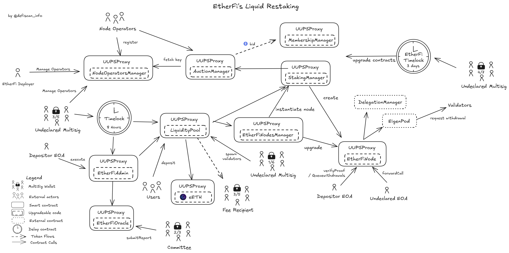

# Summary

This review focuses on EtherFi's `eETH`/`WeETH` protocol. `eETH` is a liquid restaking token designed to increase yield on top of native staking. `eETH` is backed by staked and restaked `ETH` through EigenLayer. The protocol implements native restaking at the protocol level, allowing holders to earn both staking and restaking rewards simultaneously without requiring separate actions or asset lockups. As such, the tokens can be used in other DeFi applications. In addition to this, the protocol introduced _Ether.fans_ NFTs which stake `ETH` exclusively with _Node Operators_ that use _Distributed Validators Technology (DVT)_.

# Ratings

## Chain

The protocol is deployed on several chains. This review focuses on the Ethereum mainnet deployment.

> Chain score: Low

## Upgradeability

All contracts in the protocol can be upgraded by a [4-out-of-7 multisig](#security-council) with a delay of 3 days. This includes the `eETH` and `WeETH` tokens and the contracts handling validator withdrawals. Through an upgrade, the multisig could reattribute the ownership of all funds in the protocol, which would lead to the _loss of user funds_ and _loss of unclaimed yield_. As the signers are not announced, it does not qualify for the role of security council.

An [oracle](#stakers-and-operators) with 2-out-of-3 signers reports onchain on the state of the beacon chain and the performance of the EtherFi validators. This information is critical to the functioning of the protocol and if manipulated could be used to mint excessive `eETH` and dilute users, or wrongfully rebase the token, leading to _loss of user funds_ and/or the _loss of unclaimed yield_. Once the oracle members submit a report, a [3-out-of-5 multisig](#security-council) has a limited 10 minutes window to cancel it, after which a [Depositor EOA](#security-council) can execute the corresponding actions through the `EtherFiAdmin`contract.

New validators are created in two phases when enough `ETH` has been depositted. First, any 1-of-6 signers of the [ValidatorSpawner multisig](#security-council) can create validators and deposit 1 `ETH` to them using user deposited `ETH` in the `LiquidityPool`. The oracle then confirms the validity of the withdrawal credential and triggers the deposit of the remaining `ETH` (> 31 `ETH` per validator). The initial deposit is at risk of frontrunning and collusion between the signer and _Node Operator_, this is why deposits have to be confirmed by the oracle. In case of an attack, this would allow the signer and _Node Operator_ to steal the 1 `ETH` depositted for each validator. However, this is of limitted impact given that this concerns a minority of protocol funds.

Restaking rewards are distributed either through the [KING Protocol](https://kingprotocol.org/) or EtherFi's own distributor contracts. Both solutions requires a multisig to post a merkle root onchain. The KING Protocol's root can be updated at any time by their [multisig](#security-council), which could be used to revoke distributed rewards and lead to the _loss of unclaimed yield_.

Contracts may also be paused without delay to prevent further deposits and withdrawals. Different multisigs may resume the contracts. In addition to that, user funds can be trapped in _Ether.fans_ NFTs with the possibility of adding withdrawal fees of up to 65 `ETH` per withdrawal.

> Upgradeability score: High

## Autonomy

### Ethereum staking

EtherFi relies on _Node Operators_ to operate Ethereum validators. _Node Operators_ are whitelisted by EtherFi and users' funds are not in control by the _Node Operators_, as explained in the [protocol analysis](#protocol-analysis). Nonetheless, the _Node Operators_ may misbehave and lose funds due to slashing, but they do not control the withdrawal address where the withdrawn funds are sent to. The withdrawal contract implements EIP7002 which allows it to trigger withdrawals onchain. The protocol can therefore handle both validator deposits and withdrawals without relying on _Node Operators_.

With the implementation of [EIP-7002](https://eips.ethereum.org/EIPS/eip-7002) and the current diversification of node operators discussed in the [dependencies](#dependencies) section, EtherFi would score a _Low_ Autonomy risk score for its dependency on _Node Operators_.

### Restaking on Eigenlayer

The staked `ETH` associated with `eETH` is restaked onchain using the Eigenlayer protocol. EtherFi delegates their staked `ETH` to _Eigenlayer Operators_, those operators can choose which _Eigenlayer AVS_ they will operate for. EtherFi currently uses an implementation that could not lead to the _loss of user funds_ or _loss of unclaimed yield_ because there is no slashing of funds, as discussed in the [dependencies](#dependencies) section.

We analysed the Eigenlayer protocol to be of Stage 0 in a [dedicated report](/protocols/eigenlayer/ethereum#dependencies). However, the Eigenlayer protocol would be classified as Stage 1 if the criteria _Accessibility_ was ignored. Since EtherFi interacts programmatically with Eigenlayer, _Accessibility_ does not affect its centralization risks as a dependency. The Stage 1 equivalent dependency impacts EtherFi's own score and limits it to a _Medium_ centralization risk for the _Autonomy_ dimension.

Finally, other liquid staking tokens (LSTs), such as Lido's `stETH`, can be restaked on Eigenlayer and transformed into `eETH` using the `Liquifier` contract. In this case, the tokens are also restaked on Eigenlayer using a dedicated and predetermined strategy for each type of LST. The deposits are currently limited to `stETH` with a cap of 850'000 ETH. Since this represents less than 35% of EtherFi's TVL, this grants EtherFi a _Medium_ dependency on Lido.

> Autonomy score: Medium

## Exit Window

All contract upgrades are currently subject to a delay of 3 days. Day-to-day operations related to the EtherFi oracle, which include minting and burning `eETH` according to the data pushed onchain, are executed with a 10 minute delay once the consensus has been reached.

The protocol can be paused by an [undeclared `EOA`](#security-council), preventing both deposits and withdrawals without delay. The protocol can be resumed by a multisig or the `EtherFiAdmin` contract. Pausing the protocol can be modular, with non-facing user functions remaining accessible.

_Ether.fan_ fees can be changed without delay and with up to 65 `ETH` of fees per operation.

> Exit Window score: High

## Accessibility

The official EtherFi frontends are [app.ether.fi](https://app.ether.fi/) for `eETH` and [ether.fan](https://ether.fan/) for _Ether.fans_. Neither frontends are open-source and no alternative frontends or self-hosting versions are available.

> Accessibility score: High

## Conclusion

The protocol achieves _High_ centralization risk scores for its _Upgradeability_, _Exit Window_, and _Accessibility_ section, as well as _Medium_ for the _Autonomy_ dimension. It thus scores **Stage 0**.

The protocol could reach Stage 1 by integrating a 7-day _Exit Window_ on all upgrades and actions that may lead to _loss of user funds_. Additionally, it would need to offer either an open-sourced alternative frontend or a possibility for user to self-host the existing app.

# Reviewer's Notes

[Starting October 15th](https://etherfi.gitbook.io/etherfi/king-protocol-formerly-lrt), restaking rewards will be distributed in the form of `KING` tokens using the King protocol. The older distribution contracts are no longer listed in EtherFi's documentation.

There is an important distinction to be made between Ethereum _Node Operators_ and _Eigenlayer Operators_. The former are operators which run Ethereum validators using staked `ETH`, while the latter act as operators in the _Eigenlayer_ protocol using restaked `ETH`. While some entities perform both tasks, they are different roles in different protocols.

This review reflects the state of EtherFi to the date of publication. We note that EtherFi is a fast evolving protocol and [implementation addresses](#contracts) should be verified to detect any upgrades since the last changes.

As part of their ongoing updates, the access control of most EtherFi contracts is being updated to use the `RoleRegistry (2)` contract for better traceability and auditability. However, some contracts, including the `MemershipManager` and `MembershipNFTs` used for _Ether.fans_ are not yet following this standard and it is not currently possible to audit the holders of the _admin_ role. As it is the case for other operative functions, we assume that those roles are partly granted to undeclared Externally Owned Accounts (EOAs).

# Protocol Analysis

## Liquid ReStaking

An overview of the EtherFi protocol can be seen in the diagram below.

### Node Operators

First, _Node Operators_ register themselves through the `NodeOperatorManager` contract, providing their IPFS hash containing encrypted validator keys and declaring the total number of keys they can operate. Once registered, these operators must be whitelisted via the _addToWhitelist_ function by the [Depositor EOA](#security-council) or [Multisig #1](#security-council) and approved for specific funding sources through _batchUpdateOperatorsApprovedTags_ to differentiate between standard `eETH` staking and ether.fan membership NFT staking. Ether.fan staking is meant for _Node Operators_ using _Distributed Validator Technology (DVT)_ exclusively.

### Validator Creation

_Node Operators_ then participate in the auction system by calling the _createBid_ function in the `AuctionManager` contract, where they submit a bid amount per validator. When sufficient `ETH` has accumulated in the `LiquidityPool`, any signer of the [ValidatorSpawner](#security-council) can initiate validator creation by selecting specific bid IDs from the auction and calling the _batchRegister_ function, which transfers one `ETH` per validator from the pool to the `StakingManager` contract where which processes each validator and links the validator's public key to its designated `EtherFiNode` withdrawal safe contract. Each validator has its own `EtherFiNode` contract that will receive rewards and handle withdrawal operations. Finally, one `ETH` is deposited to the official Ethereum beacon chain deposit contract.

Once the initial deposit is confirmed with the correct withdrawal address, the oracle triggers the remaining deposit to complete the validator creation process using `ETH` in the `LiquidityPool`.

### ReStaking

When `EtherFiNode` contracts are created, they deploy automatically a corresponding `EigenPod` using the `EigenPodManager`. `EigenPod` are contracts that enable restaking on Eigenlayer. The validator used for restaking have to have the `Eigenpod` as withdrawal address, this enables the Eigenlayer protocol to handle the withdrawn `ETH` and potentially slash the staker (here the `EtherFiNode`). EtherFi delegates the restaking to _Eigenlayer Node Operators_, as described in the [dependencies](#dependencies) section. This delegation can be done by any holder of the role [ETHERFI_NODE_CALL_FORWARDER_ROLE](#roleregistry-2), which includes an Externally Owner Account (EOA). Delegations and withdrawals can be made by the same role holders through Eigenlayer's `DelegationManager` using the `EtherFiNode` contract's call forwading functions.

### Ether.fan NFTs

_Ether.fans_ are NFTs minted with `ETH` that is staked exclusively with solo stakers using _Distributed Validator Technology (DVT)_. The Ether.fan NFT contract, `MembershipNFT`, is an ERC1155 with each NFT's balance being set strictly to 1. The issuance is managed by `MembershipManager`. When minted, Fans are given a random set of traits that are purely visual (gender, background, colors). These traits are stored only in offchain metadata, which can be changed by the contract administrators. The NFTs are associated with a flair depending on how much ETH is staked with them and a tier (bronze to platinum) depending on the time that has passed since they were minted. While depositing `ETH` is (currently) free of fees, depositing more than 20% in a period one month can impact the membership tier. Withdrawing `ETH` also impacts the membership tier, and withdrawing more than 50% of the all time value of the NFT will automatically burn it (withdraw the full amount). Minting is currently blocked as the limit of 10'000 mints has been reached. However, the limit can be increased by any admin of the contract.

# Dependencies

## Ethereum staking

EtherFi relies on _Node Operators_ to operate Ethereum validators. _Node Operators_ are whitelisted by EtherFi and users' funds are not in control by the _Node Operators_, as explained in the [protocol analysis](#protocol-analysis). Nonetheless, the _Node Operators_ may misbehave and lose funds due to slashing.

According to [rated](https://explorer.rated.network/o/Ether.Fi?network=mainnet&timeWindow=1d&viewBy=operator&page=1&pageSize=30&idType=pool) EtherFi has 21 different _Node Operators_ which manage the 2.5M `ETH` staked. It is worth noting that providers of Distributed Validator Technology (DVT) such as SSV and Obol count as 1 operator each, but are in fact operating validators in a distributed setup, by many different independent actors. The `ETH` is not equally distributed among operators, with the biggest operator handling 177'000 `ETH`.

Each validator is linked to a `EtherFiNode` contract, and the withdrawn funds are sent to the dedicated Eigenlayer `Eigenpod` contract. The `Eigenpod` contracts implement EIP7002 which enables withdrawals to be triggered from the contracts directly. The protocol can therefore handle both validator deposits and withdrawals without relying on _Node Operators_.

## Eigenlayer

The staked `ETH` associated with `eETH` is restaked onchain using the Eigenlayer protocol. EtherFi delegates their staked `ETH` to _Eigenlayer Node Operators_, those operators can choose which _Eigenlayer AVS_ they will operate for. The possible malicious actions of those actors are described in detail in the [DeFiScan Eigenlayer report](/protocols/eigenlayer/ethereum#dependencies). Nonetheless, in the case of EtherFi, the protocol uses an older version of Eigenlayer with the following particularities:

- The _Operator_ delegate their entire stake to the _AVSs_ they operate for. In practice, this leads to their stake being "duplicated" for each _AVS_.
- The _AVSs_ cannot slash the _Operators_. As such, misbehaviour from the _AVSs_ or _Operators_ cannot lead to the _loss of user funds_. However, _loss of unclaimed yield_ remains possible as the _AVSs_ are trusted to distribute the rewards fairly and could refuse to do so.

This version of the protocol could be deprecated in the future. The contract addresses of each operator is listed in the [Eigenlayer Operators table](#eigenlayer-operators).

[To date](https://community.chaoslabs.xyz/etherfi/risk/avs), the staked `ETH` is restaked through 12 _EigenLayer Node Operators_ across 17 _EigenLayer AVSs_. The funds are not equally distributed among _Operators_ and _AVSs_; the _Operator_ and _AVS_ with the highest concentrations have 17.5% and 9.9% respectively."

Each EtherFi's Ethereum validator has its withdrawal address set to a dedicated `EigenPod` contract. The `EigenPod` contracts are upgradeable by an [Eigenlayer multisig] which meets the security council requirements. Upgrading this contract could allow the multisig to trigger withdrawals and redirect the funds to an arbitrary address, leading to the _loss of user funds_.

We analysed the Eigenlayer protocol to be of Stage 0 in a [dedicated report](/protocols/eigenlayer/ethereum#dependencies). This impacts EtherFi's own score and limits it to a _Medium_ centralization risk for the _Autonomy_ dimension.

# Governance

EtherFi has no strict onchain governance. The governance token, `ETHFI`, can be used by users to vote on proposals on [Snapchot](https://snapshot.box/#/s:etherfi-dao.eth). Users can also delegate their vote and stake their governance tokens. The proposal outcomes are not enforced onchain and all operating permissions within the EtherFi protocol are held by [EOAs and multisigs](#security-council).

## Security Council

 | Name                                         | Account                                                                                                               | Type         | ≥ 7 signers | ≥ 51% threshold | ≥ 50% non-insider | Signers public |
| -------------------------------------------- | --------------------------------------------------------------------------------------------------------------------- | ------------ | ----------- | --------------- | ----------------- | -------------- |
| EtherFi Undeclared Multisig #1               | [0x2aCA71020De61bb532008049e1Bd41E451aE8AdC](https://etherscan.io/address/0x2aCA71020De61bb532008049e1Bd41E451aE8AdC) | Multisig 3/5 | ❌          | ✅              | ❌                | ❌             |
| EtherFi Undeclared Multisig #2               | [0xcdd57D11476c22d265722F68390b036f3DA48c21](https://etherscan.io/address/0xcdd57D11476c22d265722F68390b036f3DA48c21) | Multisig 4/7 | ✅          | ✅              | ❌                | ❌             |
| EtherFi Undeclared Multisig #3               | [0xcea8039076e35a825854c5c2f85659430b06ec96](https://etherscan.io/address/0xcea8039076e35a825854c5c2f85659430b06ec96) | Multisig 4/6 | ❌          | ✅              | ❌                | ❌             |
| KING Undeclared Multisig                     | [0xa000244b4a36d57ea1ecb39b5f02f255e4c8cd52](https://etherscan.io/address/0xa000244b4a36d57ea1ecb39b5f02f255e4c8cd52) | Multisig 3/7 | ✅          | ❌              | ❌                | ❌             |
| EtherFi Undeclared ValidatorSpawner          | [0x12582a27e5e19492b4fcd194a60f8f5e1aa31b0f](https://etherscan.io/address/0x12582a27e5e19492b4fcd194a60f8f5e1aa31b0f) | Multisig 1/6 | ❌          | ❌              | ❌                | ❌             |
| Underclared EOA (Pauser)                     | [0x9af1298993dc1f397973c62a5d47a284cf76844d](https://etherscan.io/address/0x9af1298993dc1f397973c62a5d47a284cf76844d) | EOA          | ❌          | ❌              | ❌                | ❌             |
| Underclared EOA (EtherFi Deployer)           | [0xf8a86ea1Ac39EC529814c377Bd484387D395421e](https://etherscan.io/address/0xf8a86ea1Ac39EC529814c377Bd484387D395421e) | EOA          | ❌          | ❌              | ❌                | ❌             |
| Underclared EOA (Beacon Depositor)           | [0x12582a27e5e19492b4fcd194a60f8f5e1aa31b0f](https://etherscan.io/address/0x12582a27e5e19492b4fcd194a60f8f5e1aa31b0f) | EOA          | ❌          | ❌              | ❌                | ❌             |
| Underclared EOA (EtherFiNode Call Forwarder) | [0x7835fB36A8143a014A2c381363cD1A4DeE586d2A](https://etherscan.io/address/0x7835fB36A8143a014A2c381363cD1A4DeE586d2A) | EOA          | ❌          | ❌              | ❌                | ❌             |

Multisigs have the right to Pause the LiquidVault Accountant:
0x41dfc53b13932a2690c9790527c1967d8579a6ae, 0x71e2d6c34f569cc4df5802d675b208fb8ae3bcd6, 0x523455838764e0ECf9adD7eAB8c1DAB86B0c6D7b

# Contracts & Permissions

## Contracts

UUPSProxy EtherFiRewardsRouter (ENS = "Fee Recipient"), "0x73f7b1184B5cD361cC0f7654998953E2a251dd58"

| Contract Name                             | Etherscan Link                                                                                                        |
| ----------------------------------------- | --------------------------------------------------------------------------------------------------------------------- |
| EETH (Proxy)                              | [0x35fA164735182de50811E8e2E824cFb9B6118ac2](https://etherscan.io/address/0x35fA164735182de50811E8e2E824cFb9B6118ac2) |
| EETH (Implementation)                     | [0xCB3D917A965A70214f430a135154Cd5ADdA2ad84](https://etherscan.io/address/0xCB3D917A965A70214f430a135154Cd5ADdA2ad84) |
| WeETH (Proxy)                             | [0xCd5fE23C85820F7B72D0926FC9b05b43E359b7ee](https://etherscan.io/address/0xCd5fE23C85820F7B72D0926FC9b05b43E359b7ee) |
| WeETH (Implementation)                    | [0x2d10683E941275D502173053927AD6066e6aFd6B](https://etherscan.io/address/0x2d10683E941275D502173053927AD6066e6aFd6B) |
| LiquidityPool (Proxy)                     | [0x308861A430be4cce5502d0A12724771Fc6DaF216](https://etherscan.io/address/0x308861A430be4cce5502d0A12724771Fc6DaF216) |
| LiquidityPool (Implementation)            | [0x025911766aEF6fF0C294FD831a2b5c17dC299B3f](https://etherscan.io/address/0x025911766aEF6fF0C294FD831a2b5c17dC299B3f) |
| EtherFiAdmin (Proxy)                      | [0x0EF8fa4760Db8f5Cd4d993f3e3416f30f942D705](https://etherscan.io/address/0x0EF8fa4760Db8f5Cd4d993f3e3416f30f942D705) |
| EtherFiAdmin (Implementation)             | [0xd50f28485A75A1FdE432BA7d012d0E2543D2f20d](https://etherscan.io/address/0xd50f28485A75A1FdE432BA7d012d0E2543D2f20d) |
| WithdrawRequestNFT (Proxy)                | [0x7d5706f6ef3F89B3951E23e557CDFBC3239D4E2c](https://etherscan.io/address/0x7d5706f6ef3F89B3951E23e557CDFBC3239D4E2c) |
| WithdrawRequestNFT (Implementation)       | [0xc227640c2ffe6568d02a18b95f83fe5bcce9ead1](https://etherscan.io/address/0xc227640c2ffe6568d02a18b95f83fe5bcce9ead1) |
| EtherFiGovernanceToken                    | [0xFe0c30065B384F05761f15d0CC899D4F9F9Cc0eB](https://etherscan.io/address/0xFe0c30065B384F05761f15d0CC899D4F9F9Cc0eB) |
| AddressProvider                           | [0x8487c5F8550E3C3e7734Fe7DCF77DB2B72E4A848](https://etherscan.io/address/0x8487c5F8550E3C3e7734Fe7DCF77DB2B72E4A848) |
| AuctionManager (Proxy)                    | [0x00C452aFFee3a17d9Cecc1Bcd2B8d5C7635C4CB9](https://etherscan.io/address/0x00C452aFFee3a17d9Cecc1Bcd2B8d5C7635C4CB9) |
| AuctionManager (Implementation)           | [0x68fe80c6e97e0c8613e2fed344358c6635ba5366](https://etherscan.io/address/0x68fe80c6e97e0c8613e2fed344358c6635ba5366) |
| StakingManager (Proxy)                    | [0x25e821b7197B146F7713C3b89B6A4D83516B912d](https://etherscan.io/address/0x25e821b7197B146F7713C3b89B6A4D83516B912d) |
| StakingManager (Implementation)           | [0x433d06fFc5EfE0e93daa22fcEF7eD60e65Bf70b4](https://etherscan.io/address/0x433d06fFc5EfE0e93daa22fcEF7eD60e65Bf70b4) |
| EtherFiNodesManager (Proxy)               | [0x8B71140AD2e5d1E7018d2a7f8a288BD3CD38916F](https://etherscan.io/address/0x8B71140AD2e5d1E7018d2a7f8a288BD3CD38916F) |
| EtherFiNodesManager (Implementation)      | [0x158B21148E86470E2075926EbD5528Af2D510cAF](https://etherscan.io/address/0x158B21148E86470E2075926EbD5528Af2D510cAF) |
| EtherFiNode (Implementation)              | [0x5Dae50e686f7CB980E4d0c5E4492c56bC73eD9a2](https://etherscan.io/address/0x5Dae50e686f7CB980E4d0c5E4492c56bC73eD9a2) |
| BNFT (Proxy)                              | [0x6599861e55abd28b91dd9d86A826eC0cC8D72c2c](https://etherscan.io/address/0x6599861e55abd28b91dd9d86A826eC0cC8D72c2c) |
| BNFT (Implementation)                     | [0x6a393848f5d1b8e7dab45f3a7e01f9f0dc687242](https://etherscan.io/address/0x6a393848f5d1b8e7dab45f3a7e01f9f0dc687242) |
| TNFT (Proxy)                              | [0x7B5ae07E2AF1C861BcC4736D23f5f66A61E0cA5e](https://etherscan.io/address/0x7B5ae07E2AF1C861BcC4736D23f5f66A61E0cA5e) |
| TNFT (Implementation)                     | [0xafb82ce44fd8a3431a64742bcd3547eeda1afea7](https://etherscan.io/address/0xafb82ce44fd8a3431a64742bcd3547eeda1afea7) |
| MembershipManager (Proxy)                 | [0x3d320286E014C3e1ce99Af6d6B00f0C1D63E3000](https://etherscan.io/address/0x3d320286E014C3e1ce99Af6d6B00f0C1D63E3000) |
| MembershipManager (Implementation)        | [0x047a7749ad683c2fd8a27c7904ca8dd128f15889](https://etherscan.io/address/0x047a7749ad683c2fd8a27c7904ca8dd128f15889) |
| MembershipNFT (Proxy)                     | [0xb49e4420eA6e35F98060Cd133842DbeA9c27e479](https://etherscan.io/address/0xb49e4420eA6e35F98060Cd133842DbeA9c27e479) |
| MembershipNFT (Implementation)            | [0x290d981b41b713437265cd7846806d7500307106](https://etherscan.io/address/0x290d981b41b713437265cd7846806d7500307106) |
| NodeOperatorManager (Proxy)               | [0xd5edf7730ABAd812247F6F54D7bd31a52554e35E](https://etherscan.io/address/0xd5edf7730ABAd812247F6F54D7bd31a52554e35E) |
| NodeOperatorManager (Implementation)      | [0xfcc674fc9a0602692d2a91905e7e978ae6ee2caf](https://etherscan.io/address/0xfcc674fc9a0602692d2a91905e7e978ae6ee2caf) |
| Treasury                                  | [0x6329004E903B7F420245E7aF3f355186f2432466](https://etherscan.io/address/0x6329004E903B7F420245E7aF3f355186f2432466) |
| Liquifier (Proxy)                         | [0x9ffdf407cde9a93c47611799da23924af3ef764f](https://etherscan.io/address/0x9ffdf407cde9a93c47611799da23924af3ef764f) |
| Liquifier (Implementation)                | [0xa1a15fb15cbda9e6c480c5bca6e9aba9c5e2ff95](https://etherscan.io/address/0xa1a15fb15cbda9e6c480c5bca6e9aba9c5e2ff95) |
| EtherFiRestaker (Proxy)                   | [0x1B7a4C3797236A1C37f8741c0Be35c2c72736fFf](https://etherscan.io/address/0x1B7a4C3797236A1C37f8741c0Be35c2c72736fFf) |
| EtherFiRestaker (Implementation)          | [0x0052f731a6bea541843385ffba408f52b74cb624](https://etherscan.io/address/0x0052f731a6bea541843385ffba408f52b74cb624) |
| EtherFiTimelock (3 Days)                  | [0x9f26d4C958fD811A1F59B01B86Be7dFFc9d20761](https://etherscan.io/address/0x9f26d4C958fD811A1F59B01B86Be7dFFc9d20761) |
| EtherFiTimelock (8 Hours)                 | [0xcd425f44758a08baab3c4908f3e3de5776e45d7a](https://etherscan.io/address/0xcd425f44758a08baab3c4908f3e3de5776e45d7a) |
| EtherFiOracle (Proxy)                     | [0x57AaF0004C716388B21795431CD7D5f9D3Bb6a41](https://etherscan.io/address/0x57AaF0004C716388B21795431CD7D5f9D3Bb6a41) |
| EtherFiOracle (Implementation)            | [0x5eefE6f65a280A6f1Eb1FdFf36Ab9e2af6f38462](https://etherscan.io/address/0x5eefE6f65a280A6f1Eb1FdFf36Ab9e2af6f38462) |
| CumulativeMerkleDrop (Proxy)              | [0x6Db24Ee656843E3fE03eb8762a54D86186bA6B64](https://etherscan.io/address/0x6Db24Ee656843E3fE03eb8762a54D86186bA6B64) |
| CumulativeMerkleDrop (Implementation)     | [0x5e226b1de8b0f387d7c77f78cba2571d2a1be511](https://etherscan.io/address/0x5e226b1de8b0f387d7c77f78cba2571d2a1be511) |
| EtherFiRedemptionManager (Proxy)          | [0xDadEf1fFBFeaAB4f68A9fD181395F68b4e4E7Ae0](https://etherscan.io/address/0xDadEf1fFBFeaAB4f68A9fD181395F68b4e4E7Ae0) |
| EtherFiRedemptionManager (Implementation) | [0xe6f40295a7500509fad08e924c91b0f050a7b84b](https://etherscan.io/address/0xe6f40295a7500509fad08e924c91b0f050a7b84b) |
| RoleRegistry (Proxy)                      | [0x1d3Af47C1607A2EF33033693A9989D1d1013BB50](https://etherscan.io/address/0x1d3Af47C1607A2EF33033693A9989D1d1013BB50) |
| RoleRegistry (Implementation)             | [0x1abfe5b356e8d735d3e363b5df5995a2a1012d0e](https://etherscan.io/address/0x1abfe5b356e8d735d3e363b5df5995a2a1012d0e) |
| RoleRegistry (Proxy) (2)                  | [0x62247D29B4B9BECf4BB73E0c722cf6445cfC7cE9](https://etherscan.io/address/0x62247D29B4B9BECf4BB73E0c722cf6445cfC7cE9) |
| RoleRegistry (Implementation) (2)         | [0x3a75019f8b09c278d152279d446c97d009e064f3](https://etherscan.io/address/0x3a75019f8b09c278d152279d446c97d009e064f3) |
| EarlyAdopterPool                          | [0x7623e9dc0da6ff821ddb9ebaba794054e078f8c4](https://etherscan.io/address/0x7623e9dc0da6ff821ddb9ebaba794054e078f8c4) |
| BoringGovernance                          | [0x86B5780b606940Eb59A062aA85a07959518c0161](https://etherscan.io/address/0x86B5780b606940Eb59A062aA85a07959518c0161) |

## All Permission Owners

| Name                           | Account                                                                                                               | Type         |
| ------------------------------ | --------------------------------------------------------------------------------------------------------------------- | ------------ |
| EtherFi Undeclared Multisig #1 | [0x2aCA71020De61bb532008049e1Bd41E451aE8AdC](https://etherscan.io/address/0x2aCA71020De61bb532008049e1Bd41E451aE8AdC) | Multisig 3/5 |
| EtherFi Undeclared Multisig #2 | [0xcdd57D11476c22d265722F68390b036f3DA48c21](https://etherscan.io/address/0xcdd57D11476c22d265722F68390b036f3DA48c21) | Multisig 4/7 |
| EtherFi Undeclared Multisig #3 | [0xcea8039076e35a825854c5c2f85659430b06ec96](https://etherscan.io/address/0xcea8039076e35a825854c5c2f85659430b06ec96) | Multisig 4/6 |
| Underclared EOA                | [0x9af1298993dc1f397973c62a5d47a284cf76844d](https://etherscan.io/address/0x9af1298993dc1f397973c62a5d47a284cf76844d) | EOA          |
| EtherFi Deployer               | [0xf8a86ea1Ac39EC529814c377Bd484387D395421e](https://etherscan.io/address/0xf8a86ea1Ac39EC529814c377Bd484387D395421e) | EOA          |
| Beacon Depositor               | [0x12582a27e5e19492b4fcd194a60f8f5e1aa31b0f](https://etherscan.io/address/0x12582a27e5e19492b4fcd194a60f8f5e1aa31b0f) | EOA          |
| EtherFiTimelock (3 Days)       | [0x9f26d4C958fD811A1F59B01B86Be7dFFc9d20761](https://etherscan.io/address/0x9f26d4C958fD811A1F59B01B86Be7dFFc9d20761) | Contract     |
| EtherFiTimelock (8 Hours)      | [0xcd425f44758a08baab3c4908f3e3de5776e45d7a](https://etherscan.io/address/0xcd425f44758a08baab3c4908f3e3de5776e45d7a) | Contract     |
| AuctionManager                 | [0x00C452aFFee3a17d9Cecc1Bcd2B8d5C7635C4CB9](https://etherscan.io/address/0x00C452aFFee3a17d9Cecc1Bcd2B8d5C7635C4CB9) | Contract     |
| LiquidityPool                  | [0x308861A430be4cce5502d0A12724771Fc6DaF216](https://etherscan.io/address/0x308861A430be4cce5502d0A12724771Fc6DaF216) | Contract     |
| StakingManager                 | [0x25e821b7197B146F7713C3b89B6A4D83516B912d](https://etherscan.io/address/0x25e821b7197B146F7713C3b89B6A4D83516B912d) | Contract     |
| EtherFiNodesManager            | [0x8B71140AD2e5d1E7018d2a7f8a288BD3CD38916F](https://etherscan.io/address/0x8B71140AD2e5d1E7018d2a7f8a288BD3CD38916F) | Contract     |
| Liquifier                      | [0x9ffdf407cde9a93c47611799da23924af3ef764f](https://etherscan.io/address/0x9ffdf407cde9a93c47611799da23924af3ef764f) | Contract     |

## Eigenlayer Operators

Below are are the addresses of the _Operators_ used by EtherFi. Those are controlled through the Beacon contract [0x29b1c223be35ccb6bfbd43154528cd0b881756e9](https://etherscan.io/address/0x29b1c223be35ccb6bfbd43154528cd0b881756e9) and use the implementation contract [0xf4718766a7fc8c81f788669b0985fac03d064d29](https://etherscan.io/address/0xf4718766a7fc8c81f788669b0985fac03d064d29).

| Name             | Address                                                                                                               |
| ---------------- | --------------------------------------------------------------------------------------------------------------------- |
| Pier Two         | [0xfb487f216ca24162119c0c6ae015d680d7569c2f](https://etherscan.io/address/0xfb487f216ca24162119c0c6ae015d680d7569c2f) |
| P2P              | [0x4bd479a34450d0cb1f5ef16a877bee47e1e4cdb9](https://etherscan.io/address/0x4bd479a34450d0cb1f5ef16a877bee47e1e4cdb9) |
| DSRV(old)        | [0x5b9b3cf0202a1a3dc8f527257b7e6002d23d8c85](https://etherscan.io/address/0x5b9b3cf0202a1a3dc8f527257b7e6002d23d8c85) |
| Finoa            | [0xea50bb6735703422d2e053452f1f28bff17da51f](https://etherscan.io/address/0xea50bb6735703422d2e053452f1f28bff17da51f) |
| Validation Cloud | [0x5d4b5ef127c545e5bf8e247f9fcd4e75a0a366b4](https://etherscan.io/address/0x5d4b5ef127c545e5bf8e247f9fcd4e75a0a366b4) |
| A41              | [0xe0156ef2905c2ea8b1f7571caee85fdf1657ab38](https://etherscan.io/address/0xe0156ef2905c2ea8b1f7571caee85fdf1657ab38) |
| Cosmostation     | [0x17c5f0cc30bd57b308b7f62600b415fd1335e1fe](https://etherscan.io/address/0x17c5f0cc30bd57b308b7f62600b415fd1335e1fe) |
| DSRV(New)        | [0xdcae4faf7c7d0f4a78abe147244c6e9d60cfd202](https://etherscan.io/address/0xdcae4faf7c7d0f4a78abe147244c6e9d60cfd202) |
| Chainnodes       | [0x8e7e7176d3470c6c2efe71004f496a6ef422a56f](https://etherscan.io/address/0x8e7e7176d3470c6c2efe71004f496a6ef422a56f) |
| Allnodes         | [0x1abdcdd0ec2523dd2c66b8c7d1c734f743e98b4a](https://etherscan.io/address/0x1abdcdd0ec2523dd2c66b8c7d1c734f743e98b4a) |
| Nethermind       | [0xd972a58b6a582954e578455e4752b12f2c8fcdbc](https://etherscan.io/address/0xd972a58b6a582954e578455e4752b12f2c8fcdbc) |
| NodeMonster      | [0x67943ae8e07bfc9f5c9a90d608f7923d9c21e051](https://etherscan.io/address/0x67943ae8e07bfc9f5c9a90d608f7923d9c21e051) |

## Permissions

| Contract                                               | Function                                                  | Impact                                                                                                                                                                                                                                                                                                                                                                                                                                                                                                           | Owner                                                                          |
| ------------------------------------------------------ | --------------------------------------------------------- | ---------------------------------------------------------------------------------------------------------------------------------------------------------------------------------------------------------------------------------------------------------------------------------------------------------------------------------------------------------------------------------------------------------------------------------------------------------------------------------------------------------------- | ------------------------------------------------------------------------------ | ------------------------ |
| EETH                                                   | renounceOwnership                                         | Renounces ownership of the contract. This would set the owner to the zero address and make the contract immutable.                                                                                                                                                                                                                                                                                                                                                                                               | EtherFiTimelock (3 Days)                                                       |
| EETH                                                   | transferOwnership                                         | Transfers ownership of contract to a specified address. The new owner will have the right to upgrade the contract, potentially changing its entire logic and reassigning ownership of tokens held in the contract.                                                                                                                                                                                                                                                                                               | EtherFiTimelock (3 Days)                                                       |
| EETH                                                   | upgradeTo                                                 | Upgrade the implementation contract. This effectively changes the logic of the contract and may reassign ownership of tokens held in the contract.                                                                                                                                                                                                                                                                                                                                                               | EtherFiTimelock (3 Days)                                                       |
| EETH                                                   | upgradeToAndCall                                          | Similar to _upgradeTo_, with an additional call to the newly assigned logic.                                                                                                                                                                                                                                                                                                                                                                                                                                     | EtherFiTimelock (3 Days)                                                       |
| EETH                                                   | mintShares                                                | Mints new shares (`eETH` tokens) for a given user and increases the total supply. This is meant to be called by the `LiquidityPool` when a user makes a deposit.                                                                                                                                                                                                                                                                                                                                                 | LiquidityPool                                                                  |
| EETH                                                   | burnShares                                                | Burns a users' shares and reduces the total supply. This is meant to be called by the `LiquidityPool` upon redemption of the token for `ETH`.                                                                                                                                                                                                                                                                                                                                                                    | LiquidityPool                                                                  |
| WeETH                                                  | renounceOwnership                                         | Renounces ownership of the contract. This would set the owner to the zero address and make the contract immutable.                                                                                                                                                                                                                                                                                                                                                                                               | EtherFiTimelock (3 Days)                                                       |
| WeETH                                                  | transferOwnership                                         | Transfers ownership of contract to a specified address. The new owner will have the right to upgrade the contract, potentially changing its entire logic and reassigning ownership of tokens held in the contract.                                                                                                                                                                                                                                                                                               | EtherFiTimelock (3 Days)                                                       |
| WeETH                                                  | upgradeTo                                                 | Upgrade the implementation contract. This effectively changes the logic of the contract and may reassign ownership of tokens held in the contract.                                                                                                                                                                                                                                                                                                                                                               | EtherFiTimelock (3 Days)                                                       |
| WeETH                                                  | upgradeToAndCall                                          | Similar to _upgradeTo_, with an additional call to the newly assigned logic.                                                                                                                                                                                                                                                                                                                                                                                                                                     | EtherFiTimelock (3 Days)                                                       |
| WeETH                                                  | rescueTreasuryWeeth                                       | This function forces the transfer of `WeETH` out of a deprecated treasury and sends them to the owner (`EtherFiTimelock (3 Days)`).                                                                                                                                                                                                                                                                                                                                                                              | EtherFiTimelock (3 Days)                                                       |
| NodeOperatorManager                                    | fetchNextKeyIndex                                         | Fetches the IPFS index of the next unused key for the given Node Operator. This is used during bidding to commit a certain key to the associated bid.                                                                                                                                                                                                                                                                                                                                                            | AuctionManager                                                                 |
| NodeOperatorManager                                    | batchUpdateOperatorsApprovedTags                          | Approves or un approves an operator to run validators from a specific source of funds (`EETH` or `ETHER_FAN`). Only operators approved for a source of fund can run the validators created out of those specific deposits. Operators may be approved for both sources.                                                                                                                                                                                                                                           | EtherFiTimelock (3 Days), EtherFi Deployer (EOA), Undeclared Multisig #1       |
| NodeOperatorManager                                    | addToWhitelist                                            | Adds a node operator to the white list. Node operators can register themselves without being white listed but the `AuctionManager` will check they Node Operators are whitelisted at the time of bidding.                                                                                                                                                                                                                                                                                                        | EtherFiTimelock (3 Days), EtherFi Deployer (EOA), Undeclared Multisig #1       |
| NodeOperatorManager                                    | removeFromWhitelist                                       | Removes a Node Operator from the whitelist. The Node Operator will no longer be able to bid for new allocations.                                                                                                                                                                                                                                                                                                                                                                                                 | EtherFiTimelock (3 Days), EtherFi Deployer (EOA), Undeclared Multisig #1       |
| NodeOperatorManager                                    | pauseContract                                             | Pauses the registration of new node operators in the contract.                                                                                                                                                                                                                                                                                                                                                                                                                                                   | EtherFiTimelock (3 Days), EtherFi Deployer (EOA), Undeclared Multisig #1       |
| NodeOperatorManager                                    | unPauseContract                                           | Resumes the contract and the registration of node operators.                                                                                                                                                                                                                                                                                                                                                                                                                                                     | EtherFiTimelock (3 Days), EtherFi Deployer (EOA), Undeclared Multisig #1       |
| NodeOperatorManager                                    | setAuctionContractAddress                                 | Sets the address of the `AuctionContract`. The `AuctionContract` is the only one able to fetch keys. Each fetch consumes the key, if this address is set to a malicious contract is could exausth valid keys of Node Operators to prevent further deposits on the beacon chain.                                                                                                                                                                                                                                  | EtherFiTimelock (3 Days)                                                       |
| NodeOperatorManager                                    | updateAdmin                                               | Grants or revokes admin privileges over the contract to a specific address.                                                                                                                                                                                                                                                                                                                                                                                                                                      | EtherFiTimelock (3 Days)                                                       |
| NodeOperatorManager                                    | renounceOwnership                                         | Renounces ownership of the contract. This would set the owner to the zero address and make the contract immutable. This would also prevent revoking admin rights of the current administrators.                                                                                                                                                                                                                                                                                                                  | EtherFiTimelock (3 Days)                                                       |
| NodeOperatorManager                                    | transferOwnership                                         | Transfers ownership of contract to a specified address. The new owner will have the right to upgrade the contract, potentially changing its entire logic and grant admin privileges to other addresses.                                                                                                                                                                                                                                                                                                          | EtherFiTimelock (3 Days)                                                       |
| NodeOperatorManager                                    | upgradeTo                                                 | Upgrade the implementation contract. This effectively changes the logic of the contract and how Node Operators are added and allocated funds.                                                                                                                                                                                                                                                                                                                                                                    | EtherFiTimelock (3 Days)                                                       |
| NodeOperatorManager                                    | upgradeToAndCall                                          | Similar to _upgradeTo_, with an additional call to the newly assigned logic.                                                                                                                                                                                                                                                                                                                                                                                                                                     | EtherFiTimelock (3 Days)                                                       |
| StakingManager                                         | createBeaconValidators                                    | Creates beacon validators with 1 ETH deposits using compounding withdrawal credentials. The contract also interacts with the EtherFiNodesManager to link the validator public key with its `EtherFiNode`. This is the first step of validator creation, the complete deposit amount will be added in another transaction once the oracle confirms the withdrawal address.                                                                                                                                        | LiquidityPool                                                                  |
| StakingManager                                         | confirmAndFundBeaconValidators                            | Sends remaining ETH to complete validator activation after oracle verification. The validator can hold anywhere between 32 and 2048 ETH. A malicious oracle could confirm the deposit to a compromised validator and steal the funds.                                                                                                                                                                                                                                                                            | LiquidityPool                                                                  |
| StakingManager                                         | instantiateEtherFiNode                                    | Creates new EtherFiNode proxy instance and optionnally a corresponding EigenPod. Those `EtherFiNode` are then used when new validators are created.                                                                                                                                                                                                                                                                                                                                                              | **TODO**: STAKING MANAGER NODE CREATOR ROLE                                    |
| StakingManager                                         | upgradeEtherFiNode                                        | Upgrades the `EtherFiNode` implementation contract. This could reassign all the funds and rewards withdrawn by validators, potentially leading to loss of funds.                                                                                                                                                                                                                                                                                                                                                 | EtherFiTimelock (3 Days)                                                       |
| StakingManager                                         | pauseContract                                             | Marks the contract as paused. This has no effect in practice, as no function is sensitive to the pause flag.                                                                                                                                                                                                                                                                                                                                                                                                     | [PROTOCOL_PAUSER](#roleregistry-2)                                             |
| StakingManager                                         | unPauseContract                                           | Marks the contract as unpaused.                                                                                                                                                                                                                                                                                                                                                                                                                                                                                  | [PROTOCOL_UNPAUSER](#roleregistry-2)                                           |
| StakingManager                                         | upgradeTo                                                 | Upgrade the implementation contract. This effectively changes the logic of the contract and how deposits happen.                                                                                                                                                                                                                                                                                                                                                                                                 | EtherFiTimelock (3 Days)                                                       |
| StakingManager                                         | upgradeToAndCall                                          | Similar to _upgradeTo_, with an additional call to the newly assigned logic.                                                                                                                                                                                                                                                                                                                                                                                                                                     | EtherFiTimelock (3 Days)                                                       | EtherFiTimelock (3 Days) |
| StakingManager                                         | renounceOwnership                                         | Renounces ownership of the contract. This would set the owner to the zero address but would not make the contract immutable, nor impact its access control logic, as those permissions are handled in the `RoleRegistry (2)`.                                                                                                                                                                                                                                                                                    | EtherFiTimelock (3 Days)                                                       |
| StakingManager                                         | transferOwnership                                         | Transfers ownership of contract to a specified address. The new owner will not have any specific privileges in the current implementation, as the access control is handled in the `RoleRegistry (2)`.                                                                                                                                                                                                                                                                                                           | EtherFiTimelock (3 Days)                                                       |
| AuctionManager                                         | createBid                                                 | Create bids to run a given amount of validators. The Node Operator has to be whitelisted but the whitelist may be disabled. The Node Operator needs to pay the entire bid amount upfront, this amount will be collected if the validator is assigned to the bid ot the Node Operator can cancel an active bid to get a full refund.                                                                                                                                                                              | NodeOperatorManager(Whitelisted Node Operator)                                 |
| AuctionManager                                         | updateSelectedBidInformation                              | Marks a bid as selected. This is called by the `StakingManager` when a bid is chosen. It can then no longer be cancelled.                                                                                                                                                                                                                                                                                                                                                                                        | StakingManager                                                                 |
| AuctionManager                                         | reEnterAuction                                            | Lets the `StakingManager` re-enable a previously selected bid if its stake was cancelled.                                                                                                                                                                                                                                                                                                                                                                                                                        | StakingManager                                                                 |
| AuctionManager                                         | processAuctionFeeTransfer                                 | Once a bid is selected and confirmed, the bid amount is transferred to the `MembershipManager` contract, if it's above a certain threshold.                                                                                                                                                                                                                                                                                                                                                                      | StakingManager                                                                 |
| AuctionManager                                         | transferAccumulatedRevenue                                | Transfers the accumulated revenue (from selected bids) to the `MembershipManager` contract, no matter the amount.                                                                                                                                                                                                                                                                                                                                                                                                | ['onlyAdmin']                                                                  |
| AuctionManager                                         | disableWhitelist                                          | Disables the whitelist. If the whitelist is disabled any node operator can bid.                                                                                                                                                                                                                                                                                                                                                                                                                                  | ['onlyAdmin']                                                                  |
| AuctionManager                                         | enableWhitelist                                           | Enables the whitelist. When the whitelist is enabled only node operators white listed in the `NodeOperatorManager` can create new bids.                                                                                                                                                                                                                                                                                                                                                                          | ['onlyAdmin']                                                                  |
| AuctionManager                                         | pauseContract                                             | Pauses the creation and cancellation of bids. When paused new validators can still be attributed to existing bids, but the node operators have no mean to cancel their bids.                                                                                                                                                                                                                                                                                                                                     | ['onlyAdmin', 'whenNotPaused']                                                 |
| AuctionManager                                         | unPauseContract                                           | Unpauses the contract and allow the creation and cancellation of bids again.                                                                                                                                                                                                                                                                                                                                                                                                                                     | ['onlyAdmin', 'whenPaused']                                                    |
| AuctionManager                                         | setStakingManagerContractAddress                          | Sets the address of the `StakingManager`. This is used for access control and giving this access to a malicious address could prevent the creation of further validators.                                                                                                                                                                                                                                                                                                                                        | EtherFiTimelock (3 Days)                                                       |
| AuctionManager                                         | setMinBidPrice                                            | Sets the minimum bid price. Excessive amounts could prevent further bids and validator creation.                                                                                                                                                                                                                                                                                                                                                                                                                 | ['onlyAdmin']                                                                  |
| AuctionManager                                         | setMaxBidPrice                                            | Sets the maximum bid price.                                                                                                                                                                                                                                                                                                                                                                                                                                                                                      | ['onlyAdmin']                                                                  |
| AuctionManager                                         | setAccumulatedRevenueThreshold                            | Sets the threshold above which the `ETH` associated with confirmed bid is transferred to the `MembershipManager`.                                                                                                                                                                                                                                                                                                                                                                                                | ['onlyAdmin']                                                                  |
| AuctionManager                                         | updateWhitelistMinBidAmount                               | Updates the minimum bid amount for node operators in the whitelist. Excessive amounts could prevent further bids and validator creation.                                                                                                                                                                                                                                                                                                                                                                         | EtherFiTimelock (3 Days)                                                       |
| AuctionManager                                         | updateNodeOperatorManager                                 | Updates the address used for the `NodeOperatorManager`, this contract is used as a reference for node operators and the whitelist. Assigning a malicious contract could effectively remove the whitelist.                                                                                                                                                                                                                                                                                                        | EtherFiTimelock (3 Days)                                                       |
| AuctionManager                                         | updateAdmin                                               | Grants or revokes admin permission to a given address. Admins have the right to disable the whitelist and set bounds of bid prices.                                                                                                                                                                                                                                                                                                                                                                              | EtherFiTimelock (3 Days)                                                       |
| AuctionManager                                         | upgradeTo                                                 | Upgrade the implementation contract. This effectively changes the logic of the contract and how Node Operators bid for new validators. This could also reassign the ownership of all funds in the contract, even for unconfirmed bids.                                                                                                                                                                                                                                                                           | EtherFiTimelock (3 Days)                                                       |
| AuctionManager                                         | upgradeToAndCall                                          | Similar to _upgradeTo_, with an additional call to the newly assigned logic.                                                                                                                                                                                                                                                                                                                                                                                                                                     | EtherFiTimelock (3 Days)                                                       |
| AuctionManager                                         | renounceOwnership                                         | Renounces ownership of the contract. This would set the owner to the zero address and make the contract immutable. This would also prevent revoking admin rights of the current administrators.                                                                                                                                                                                                                                                                                                                  | EtherFiTimelock (3 Days)                                                       |
| AuctionManager                                         | transferOwnership                                         | Transfers ownership of contract to a specified address. The new owner will have the right to upgrade the contract, potentially changing its entire logic and grant or admin privileges to other addresses.                                                                                                                                                                                                                                                                                                       | EtherFiTimelock (3 Days)                                                       |
| LiquidityPool                                          | DEPRECATED_sendExitRequests                               | Legacy function for sending exit requests, now only emits events. The events are critical for tracking validator lifecycle but no longer functional within the protocol.                                                                                                                                                                                                                                                                                                                                         | [LIQUIDITY_POOL_ADMIN_ROLE](#roleregistry-2)                                   |
| LiquidityPool                                          | addEthAmountLockedForWithdrawal                           | Updates amount reserved for withdrawal requests. Critical for withdrawal liquidity management. Malicious admin contract could manipulate withdrawal availability, potentially blocking user access to funds or causing liquidity issues.                                                                                                                                                                                                                                                                         | EtherFiAdmin                                                                   |
| LiquidityPool                                          | batchRegister                                             | Registers validator keys and sends 1 `ETH` to beacon chain per validator. Critical step in validator lifecycle that commits pool `ETH`. Malicious use could register invalid keys, waste pool `ETH`, or front-run with malicious withdrawal credentials.                                                                                                                                                                                                                                                         | ValidatorSpawners (Controlled by [LIQUIDITY_POOL_ADMIN_ROLE](#roleregistry-2)) |
| LiquidityPool                                          | batchApproveRegistration                                  | Approves validators and triggers the remaining ETH deposit to the beacon chain. Completes validator activation. This is meant to be called by the oracle once it has confirmed that the 1 ETH registered were deposited on validators with the right withdrawal credentials. Malicious oracle could approve invalid validators, drain pool `ETH` to wrong validators. Since the latest version it supports deposits greater than 32 ETH, but future services are meannt to use `confirmAndFundBeaconValidators`. | [LIQUIDITY_POOL_VALIDATOR_APPROVER_ROLE](#roleregistry-2)                      |
| LiquidityPool                                          | burnEEthShares                                            | Destroys user shares during withdrawal process. Permanently reduces user token balance and total token supply. Malicious use could burn shares without corresponding `ETH` withdrawal, effectively stealing user funds through token destruction.                                                                                                                                                                                                                                                                | etherFiRedemptionManager OR withdrawRequestNFT contracts                       |
| LiquidityPool                                          | confirmAndFundBeaconValidators                            | Similar to `batchApproveRegistration` but dedicated to the new format which uses validator public keys as IDs. Performs less validation than the forementioned function, the input is trusted.                                                                                                                                                                                                                                                                                                                   | [LIQUIDITY_POOL_VALIDATOR_APPROVER_ROLE](#roleregistry-2)                      |
| LiquidityPool                                          | depositToRecipient                                        | Deposits `ETH` on behalf of another user. Can mint `eETH` tokens to arbitrary recipients. Malicious use could drain protocol by minting unlimited `eETH` without corresponding `ETH` backing.                                                                                                                                                                                                                                                                                                                    | Liquifier, EtherFiAdmin                                                        |
| LiquidityPool                                          | payProtocolFees                                           | Distributes protocol fees by minting `eETH` to fee recipient. Directly affects protocol revenue and token supply. The fee recipient receives the entire amount and is trusted to further split it to the right beneficiaries. A malicious use could mint arbitrary amounts of `eETH` and disrupt the protocol's economic viability.                                                                                                                                                                              | EtherFiAdmin                                                                   |
| LiquidityPool                                          | withdraw                                                  | Burns `eETH` shares and sends `ETH` to the recipient. Directly reduces pool liquidity and burns user shares. Withdrawals using `withdrawRequestNFT` are taken directly out of the dedicated `ETH` amount locked for withdrawal.                                                                                                                                                                                                                                                                                  | withdrawRequestNFT, membershipManager, etherFiRedemptionManager                |
| LiquidityPool                                          | rebase                                                    | Updates pool's staking rewards balance, core mechanism for distributing validator earnings. Adjusts `totalValueOutOfLp` affecting all user balances. Malicious use could artificially inflate/deflate all user holdings by manipulating reward calculations.                                                                                                                                                                                                                                                     | MembershipManager                                                              |
| LiquidityPool                                          | registerValidatorSpawner                                  | Grants permission to spawn validators. Critical gatekeeper function allowing addresses to initiate validator creation using pool funds. Malicious admin could register compromised spawners.                                                                                                                                                                                                                                                                                                                     | [LIQUIDITY_POOL_ADMIN_ROLE](#roleregistry-2)                                   |
| LiquidityPool                                          | unregisterValidatorSpawner                                | Removes validator spawning permissions from addresses. Prevents spawners from creating new validators using pool funds.                                                                                                                                                                                                                                                                                                                                                                                          | [LIQUIDITY_POOL_ADMIN_ROLE](#roleregistry-2)                                   |
| LiquidityPool                                          | setValidatorSizeWei                                       | Sets the validator size for batchApproveRegistration calls. Controls how much ETH is deposited per validator (32-2048 ETH). Critical parameter affecting capital efficiency. Malicious use could set invalid sizes, waste capital, or break validator economics.                                                                                                                                                                                                                                                 | [LIQUIDITY_POOL_ADMIN_ROLE](#roleregistry-2)                                   |
| LiquidityPool                                          | setFeeRecipient                                           | Changes where protocol fees are sent. Determines destination of protocol revenue streams. Malicious admin could redirect all future protocol fees to arbitrary addresses.                                                                                                                                                                                                                                                                                                                                        | [LIQUIDITY_POOL_ADMIN_ROLE](#roleregistry-2)                                   |
| LiquidityPool                                          | setRestakeBnftDeposits                                    | Controls whether new validators are restaked on EigenLayer. Affects protocol's restaking strategy and additional yield generation. Critical for managing protocol's risk/reward profile.                                                                                                                                                                                                                                                                                                                         | [LIQUIDITY_POOL_ADMIN_ROLE](#roleregistry-2)                                   |
| LiquidityPool                                          | pauseContract                                             | Emergency function that halts all protocol operations. Stops deposits, withdrawals, and validator operations. Malicious pauser could permanently DoS the protocol, preventing users from accessing funds or new deposits.                                                                                                                                                                                                                                                                                        | [PROTOCOL_PAUSER](#roleregistry-2)                                             |
| LiquidityPool                                          | unPauseContract                                           | Resumes protocol operations after pause. Restores user access to funds and protocol functionality. Malicious use could unpause during ongoing attacks or before fixes are implemented, exposing users to continued risks.                                                                                                                                                                                                                                                                                        | [PROTOCOL_UNPAUSER](#roleregistry-2)                                           |
| LiquidityPool                                          | upgradeTo                                                 | Upgrade the implementation contract. This effectively changes the logic of the contract and how users deposit and withdraw funds. This could also reassign the ownership of all `eETH` tokens.                                                                                                                                                                                                                                                                                                                   | EtherFiTimelock (3 Days) (PROTOCOL\*UPGRADER)                                  |
| LiquidityPool                                          | upgradeToAndCall                                          | Similar to \_upgradeTo\*, with an additional call to the newly assigned logic.                                                                                                                                                                                                                                                                                                                                                                                                                                   | EtherFiTimelock (3 Days) (PROTOCOL_UPGRADER)                                   |
| LiquidityPool                                          | renounceOwnership                                         | Renounces ownership of the contract. This would set the owner to the zero address but would not make the contract immutable. Permissions and roles for specific functions could still be changed through the `RoleRegistry` contract, which handles the access control.                                                                                                                                                                                                                                          | EtherFiTimelock (3 Days)                                                       |
| LiquidityPool                                          | transferOwnership                                         | Transfers ownership of contract to a specified address. The new owner will not have the right to upgrade the contract, as the access control is handled in the `RoleRegistry`.                                                                                                                                                                                                                                                                                                                                   | EtherFiTimelock (3 Days)                                                       |
| EtherFiAdmin                                           | setValidatorTaskBatchSize                                 | Sets how many validators are processed together in a                                                                                                                                                                                                                                                                                                                                                                                                                                                             |
| single batch when creating validator management tasks. | [ETHERFI_ORACLE_EXECUTOR_ADMIN_ROLE](#roleregistry-2)     |
| EtherFiAdmin                                           | executeTasks                                              | Executes management tasks related to the report generated by the oracle. The consensus must have been reached on the report. Tasks include accruying rewards, managing validator states, collecting fees, and withdrawals. Processing a report containing false data could be critical for user funds.                                                                                                                                                                                                           | [ETHERFI_ORACLE_EXECUTOR_TASK_MANAGER_ROLE](#roleregistry-2)                   |
| EtherFiAdmin                                           | executeValidatorManagementTask                            | Executes management tasks specifically for validators, based on a report by the oracle. The consensus must have been reached on the report. Tasks include approving registrations or sending exit requests by calling `LiquidityPool`, as well as processing exit requests or reporting slashes by calling the `EtherFiNodesManager`. Processing a report containing false data could be critical for user funds.                                                                                                | [ETHERFI_ORACLE_EXECUTOR_TASK_MANAGER_ROLE](#roleregistry-2)                   |
| EtherFiAdmin                                           | invalidateValidatorManagementTask                         | Invalidates a pending validator management task.                                                                                                                                                                                                                                                                                                                                                                                                                                                                 | [ETHERFI_ORACLE_EXECUTOR_ADMIN_ROLE](#roleregistry-2)                          |
| EtherFiAdmin                                           | updateAcceptableRebaseApr                                 | Updates the acceptable rebase APR variable. This sets a maximum by which the APR can change in one report. If the APR changes above the maximum, the execution will revert and the report cannot be processed. The current limit is 500 BPS.                                                                                                                                                                                                                                                                     | [ETHERFI_ORACLE_EXECUTOR_TASK_MANAGER_ROLE](#roleregistry-2)                   |
| EtherFiAdmin                                           | updatePostReportWaitTimeInSlots                           | Sets the mandatory delay between oracle report submission and execution (to allow for invalidation). The current delay is 50 slots (10 minutes).                                                                                                                                                                                                                                                                                                                                                                 | [ETHERFI_ORACLE_EXECUTOR_TASK_MANAGER_ROLE](#roleregistry-2)                   |
| EtherFiAdmin                                           | Pause                                                     | Can pause all or some contracts simultaneously among the `LiquidityPool`, `MembershipManager`, `EtherFiOracle`, `StakingManager`, `AuctionManager`, and `EtherFiNodesManager`. See their respective _pause_ function for details.                                                                                                                                                                                                                                                                                | [PROTOCOL_PAUSER](#roleregistry-2)                                             |
| EtherFiAdmin                                           | Unpause                                                   | Unpause all or some contracts simultaneously among the contracts cited above.                                                                                                                                                                                                                                                                                                                                                                                                                                    | [PROTOCOL_UNPAUSER](#roleregistry-2)                                           |
| EtherFiAdmin                                           | upgradeTo                                                 | Upgrade the implementation contract. This effectively changes the logic of the contract and how oracle reports are processed. This could also change the pausing logic of the entire protocol.                                                                                                                                                                                                                                                                                                                   | EtherFiTimelock (3 Days)                                                       |
| EtherFiAdmin                                           | upgradeToAndCall                                          | Similar to _upgradeTo_, with an additional call to the newly assigned logic.                                                                                                                                                                                                                                                                                                                                                                                                                                     | EtherFiTimelock (3 Days)                                                       |
| EtherFiAdmin                                           | renounceOwnership                                         | Renounces ownership of the contract. This would set the owner to the zero address and make the contract immutable. Permissions and roles for specific functions could still be changed through the `RoleRegistry` contract, which handles the access control.                                                                                                                                                                                                                                                    | EtherFiTimelock (3 Days)                                                       |
| EtherFiAdmin                                           | transferOwnership                                         | Transfers ownership of contract to a specified address. The new owner will have the right to upgrade the contract, potentially changing its entire logic and bypassing access controls that are delegated to the `RoleRegistry`.                                                                                                                                                                                                                                                                                 | EtherFiTimelock (3 Days)                                                       |
| EtherFiRedemptionManager                               | setCapacity (EtherFiRedemptionManager)                    | Sets maximum instant redemption capacity per time period. Controls liquidity available for instant withdrawals. Malicious admin could set to zero to DoS instant redemptions, or to maximum to allow bank-run scenarios that could destabilize the protocol.                                                                                                                                                                                                                                                     | ETHERFI_REDEMPTION_MANAGER_ADMIN_ROLE holders                                  |
| EtherFiRedemptionManager                               | setRefillRatePerSecond (EtherFiRedemptionManager)         | Controls how fast redemption capacity refills. Affects user withdrawal experience and protocol stability. Malicious use could set to zero preventing redemptions, or extremely high allowing rapid pool drainage through instant redemptions.                                                                                                                                                                                                                                                                    | ETHERFI_REDEMPTION_MANAGER_ADMIN_ROLE holders                                  |
| EtherFiRedemptionManager                               | setExitFeeBasisPoints (EtherFiRedemptionManager)          | Sets fee charged for instant redemptions. Directly affects user costs and protocol revenue. Malicious admin could set to 100% (maximum) making redemptions prohibitively expensive, or to 0% reducing protocol sustainability and value capture.                                                                                                                                                                                                                                                                 | ETHERFI_REDEMPTION_MANAGER_ADMIN_ROLE holders                                  |
| EtherFiRedemptionManager                               | setLowWatermarkInBpsOfTvl (EtherFiRedemptionManager)      | Sets minimum liquidity threshold for instant redemptions. Controls when instant redemptions are disabled. Malicious use could set to 100% permanently disabling instant redemptions, or to 0% allowing redemptions even with no liquidity causing protocol instability.                                                                                                                                                                                                                                          | ETHERFI_REDEMPTION_MANAGER_ADMIN_ROLE holders                                  |
| EtherFiRedemptionManager                               | setExitFeeSplitToTreasuryInBps (EtherFiRedemptionManager) | Controls how redemption fees are split between treasury and stakers. Affects protocol revenue distribution. Malicious admin could set to 100% redirecting all fees to treasury away from stakers, or 0% eliminating protocol fee revenue.                                                                                                                                                                                                                                                                        | ETHERFI_REDEMPTION_MANAGER_ADMIN_ROLE holders                                  |
| EtherFiRedemptionManager                               | pauseContract (EtherFiRedemptionManager)                  | Halts instant redemption functionality. Stops users from instant ETH withdrawals. Malicious pauser could block all instant redemptions forcing users into longer withdrawal queues, potentially causing liquidity crisis and user dissatisfaction.                                                                                                                                                                                                                                                               | PROTOCOL_PAUSER role holders                                                   |
| EtherFiRedemptionManager                               | unPauseContract (EtherFiRedemptionManager)                | Resumes instant redemption functionality. Restores user access to instant withdrawals. Malicious use could resume redemptions during attacks or before fixes are implemented, allowing continued exploitation of redemption-related vulnerabilities.                                                                                                                                                                                                                                                             | PROTOCOL_UNPAUSER role holders                                                 |
| EtherFiRedemptionManager                               | upgradeTo                                                 | Upgrade the implementation contract. This effectively changes the logic of the contract and could prevent withdrawals.                                                                                                                                                                                                                                                                                                                                                                                           | EtherFiTimelock (3 Days)                                                       |
| EtherFiRedemptionManager                               | upgradeToAndCall                                          | Similar to `upgradeTo`, with an additional call to the newly deployed logic contract.                                                                                                                                                                                                                                                                                                                                                                                                                            | EtherFiTimelock (3 Days)                                                       |
| AddressProvider                                        | addContract                                               | Adds a contract and an associated name to the `AddressProvider`. This serves as a registry for contract addresses in the protocol.                                                                                                                                                                                                                                                                                                                                                                               | EtherFiTimelock (3 Days)                                                       |
| AddressProvider                                        | removeContract                                            | Removes a contract from the provider.                                                                                                                                                                                                                                                                                                                                                                                                                                                                            | EtherFiTimelock (3 Days)                                                       |
| AddressProvider                                        | setOwner                                                  | Changes the owner of the contract. The owner has the right to add and remove contracts.                                                                                                                                                                                                                                                                                                                                                                                                                          | EtherFiTimelock (3 Days)                                                       |
| EtherFiNodesManager                                    | queueETHWithdrawals                                       | Calls the function of same name for the given `EtherFiNode` id. (see `EtherFiNode`)                                                                                                                                                                                                                                                                                                                                                                                                                              | [ETHERFI_NODES_MANAGER_EIGENLAYER_ADMIN_ROLE](#roleregistry-2)                 |
| EtherFiNodesManager                                    | queueWithdrawals                                          | Calls the function of same name for the given `EtherFiNode` id. (see `EtherFiNode`)                                                                                                                                                                                                                                                                                                                                                                                                                              | [ETHERFI_NODES_MANAGER_EIGENLAYER_ADMIN_ROLE](#roleregistry-2)                 |
| EtherFiNodesManager                                    | completeQueuedETHWithdrawals                              | Calls the function of same name for the given `EtherFiNode` id. (see `EtherFiNode`)                                                                                                                                                                                                                                                                                                                                                                                                                              | [ETHERFI_NODES_MANAGER_EIGENLAYER_ADMIN_ROLE](#roleregistry-2)                 |
| EtherFiNodesManager                                    | completeQueuedWithdrawals                                 | Calls the function of same name for the given `EtherFiNode` id. (see `EtherFiNode`)                                                                                                                                                                                                                                                                                                                                                                                                                              | [ETHERFI_NODES_MANAGER_EIGENLAYER_ADMIN_ROLE](#roleregistry-2)                 |
| EtherFiNodesManager                                    | forwardEigenPodCall                                       | Forwards whitelisted `EigenPod` calls through multiple `EtherFiNodes`. Enables batch EigenLayer operations. This can call any `EigenPod` whitelisted function with any argument, in particular the withdraw function, with any amount.                                                                                                                                                                                                                                                                           | [ETHERFI_NODES_MANAGER_CALL_FORWARDER_ROLE](#roleregistry-2)                   |
| EtherFiNodesManager                                    | forwardExternalCall                                       | Forwards whitelisted external calls through multiple `EtherFiNodes`. Enables batch operations and flexible integrations. This can call any whitelisted function, with any argument.                                                                                                                                                                                                                                                                                                                              | [ETHERFI_NODES_MANAGER_CALL_FORWARDER_ROLE](#roleregistry-2)                   |
| EtherFiNodesManager                                    | linkLegacyValidatorIds                                    | Links legacy validator IDs to pubkey hashes for migration. Temporary function for protocol migration. Malicious use could incorrectly link legacy validators and prevent tracking the validators correctly, the contract could always be upgraded to revert mistakes.                                                                                                                                                                                                                                            | [ETHERFI_NODES_MANAGER_ADMIN_ROLE](#roleregistry-2)                            |
| EtherFiNodesManager                                    | linkPubkeyToNode                                          | Associates the validator public key with its EtherFiNode instance. Critical for tracking validator ownership. Called automatically during validator creation.                                                                                                                                                                                                                                                                                                                                                    | StakingManager                                                                 |
| EtherFiNodesManager                                    | setProofSubmitter                                         | Calls the function of same name for the given `EtherFiNode` id. (see `EtherFiNode`)                                                                                                                                                                                                                                                                                                                                                                                                                              | [ETHERFI_NODES_MANAGER_EIGENLAYER_ADMIN_ROLE](#roleregistry-2)                 |
| EtherFiNodesManager                                    | startCheckpoint                                           | Calls the function of same name for the given `EtherFiNode` id. (see `EtherFiNode`)                                                                                                                                                                                                                                                                                                                                                                                                                              | [ETHERFI_NODES_MANAGER_EIGENLAYER_ADMIN_ROLE](#roleregistry-2)                 |
| EtherFiNodesManager                                    | verifyCheckpointProof                                     | Calls the function of same name for the given `EtherFiNode` id. (see `EtherFiNode`)                                                                                                                                                                                                                                                                                                                                                                                                                              | [ETHERFI_NODES_MANAGER_EIGENLAYER_ADMIN_ROLE](#roleregistry-2)                 |
| EtherFiNodesManager                                    | sweepFunds                                                | Transfers any ETH held by specified `EtherFiNode` to the liquidity pool. Safety mechanism for handling accidentally sent ETH.                                                                                                                                                                                                                                                                                                                                                                                    | [ETHERFI_NODES_MANAGER_ADMIN_ROLE](#roleregistry-2)                            |
| EtherFiNodesManager                                    | updateAllowedForwardedExternalCalls                       | Updates whitelist for external calls via `EtherFiNode`. Critical security function controlling what external contracts can be called. Malicious admin could whitelist dangerous contracts or functions. The calls will be made by the `EtherFiNode` contracts directly.                                                                                                                                                                                                                                          | [ETHERFI_NODES_MANAGER_ADMIN_ROLE](#roleregistry-2)                            |
| EtherFiNodesManager                                    | updateAllowedForwardedEigenpodCalls                       | Updates whitelist for `EigenPod` calls via `EtherFiNode`. Enables EigenLayer functionality without contract upgrades. The calls will be on functions in the `EigenPod` contract, by the `EtherFiNode`.                                                                                                                                                                                                                                                                                                           | [ETHERFI_NODES_MANAGER_ADMIN_ROLE](#roleregistry-2)                            |
| EtherFiNodesManager                                    | pauseContract                                             | Pauses the entire contract, including Eigenlayer checkpoints and withdrawals.                                                                                                                                                                                                                                                                                                                                                                                                                                    | [PROTOCOL_PAUSER](#roleregistry-2)                                             |
| EtherFiNodesManager                                    | unPauseContract                                           | Resumes the contract.                                                                                                                                                                                                                                                                                                                                                                                                                                                                                            | [PROTOCOL_UNPAUSER](#roleregistry-2)                                           |
| EtherFiNodesManager                                    | upgradeTo                                                 | Upgrade the implementation contract. This effectively changes the logic of the contract and could also abuse the interactions with Eigenlayer and trigger withdrawals.                                                                                                                                                                                                                                                                                                                                           | EtherFiTimelock (3 Days)                                                       |
| EtherFiNodesManager                                    | upgradeToAndCall                                          | Similar to `upgradeTo`, with an additional call to the newly deployed logic contract.                                                                                                                                                                                                                                                                                                                                                                                                                            | EtherFiTimelock (3 Days)                                                       |
| EtherFiNodesManager                                    | renounceOwnership                                         | Renounces ownership of the contract. This would set the owner to the zero address and make the contract immutable (prevent further ugprades). It would not prevent changing the accesses to the contract, as those are handled in the `RoleRegistry (2)`.                                                                                                                                                                                                                                                        | EtherFiTimelock (3 Days)                                                       |
| EtherFiNodesManager                                    | transferOwnership                                         | Transfers ownership of contract to a specified address. Only the Owner of the `RoleRegistry (2)` is allowed to upgrade this contract, no matter the current owner.                                                                                                                                                                                                                                                                                                                                               | EtherFiTimelock (3 Days)                                                       |

| EtherFiNode (Proxy) | | | |

| EtherFiNode | createEigenPod | Creates the Node's corresponging `EigenPod` using the `EigenPodManager` contract. | [ETHERFI_NODE_EIGENLAYER_ADMIN_ROLE](#roleregistry-2) |
| EtherFiNode | setProofSubmitter | The ProofSubmitter role is an additional permission owner next to the `EigenPod` owner. This role is allowed to call `startCheckpoint`, `verifyCheckpointProofs`, `requestConsolidation` and `requestWithdrawal` functions on the `EigenPod` contract. A compromised role cannot steal funds, but disrupt the Validators activity by requesting a withdrawal. | [ETHERFI_NODE_EIGENLAYER_ADMIN_ROLE](#roleregistry-2) |
| EtherFiNode | startCheckpoint | Starts a checkpoint to register a change of balance in order to withdraw Consensus Layer rewards, register loss of stake through slashing, or when the funds are withdrawn to the `EigenPod` from the Beacon Chain in order to withdraw the stake to a desired address. The correpsonding function in the `EigenPod` contract stores the beacon block root, the ETH balance of the `EigenPod`, and the number of validators for which a proof needs to be submitted. In a second step the `verifyCheckpointProofs` needs to be called. | [ETHERFI_NODE_EIGENLAYER_ADMIN_ROLE](#roleregistry-2) |
| EtherFiNode | verifyCheckpointProofs | This function is called after a checkpoint is started. The function computes all the deltas of each registered validator for this EigenPod, if the delta is positive, the EigenPod receives more shares which are delegated to the current operator, if the delta is negative, the EigenPod loses shares which are delegated to the current operator. | [ETHERFI_NODE_EIGENLAYER_ADMIN_ROLE](#roleregistry-2) |
| EtherFiNode | queueETHWithdrawal | Convenience function to queue a beaconETH withdrawal from eigenlayer. Performs the `queueWithdrawal` function with the correct params. The withdrawal is done through the Eigenlayer's `DelegationManager` contract. | [ETHERFI_NODE_EIGENLAYER_ADMIN_ROLE](#roleregistry-2) |
| EtherFiNode | completeQueuedETHWithdrawals | Completes all queued beaconETH withdrawals that are currently claimable. If there are available rewards, they're sent to the `LiquidityPool`. | [ETHERFI_NODE_EIGENLAYER_ADMIN_ROLE](#roleregistry-2) |
| EtherFiNode | queueWithdrawals | Queues an arbitrary withdrawal from Eigenlayer throught its `DelegationManager` contract. A set amount of time must pass before the withdrawal can be claimed used `completeQueuedWithdrawals`. | [ETHERFI_NODE_EIGENLAYER_ADMIN_ROLE](#roleregistry-2) |
| EtherFiNode | completeQueuedWithdrawals | Completes a previous withdrawal. Simply calls the homonymous function in the `DelegationManager` contract | [ETHERFI_NODE_EIGENLAYER_ADMIN_ROLE](#roleregistry-2) |
| EtherFiNode | sweepFunds | Transfer any `ETH` held in the node to the `LiquidityPool`. This is not meant to be used in practice, but exists to handle exceptional cases or mistakes. | [ETHERFI_NODE_EIGENLAYER_ADMIN_ROLE](#roleregistry-2) |
| EtherFiNode | forwardEigenPodCall | Forwards a call to the `EigenPod` contract. This function can be used to call any whitelisted function in the `EigenPod`. The `EtherFiNodesManager` contains the whitelist of allowed function calls. | [ETHERFI_NODE_CALL_FORWARDER_ROLE](#roleregistry-2) |
| EtherFiNode | forwardExternalCall | Fowards a call to any arbitrary external contract. The contract and the specific function call has to be whitelisted in the `EtherFiNodesManager`. | [ETHERFI_NODE_CALL_FORWARDER_ROLE](#roleregistry-2) |

| BNFT | mint | Mints a new `BNFT`. Those NFTs are no longer used and the `StakingManager` contract's implementation no longer calls this function upon validator creation. | StakingManager |
| BNFT | burnFromWithdrawal | Burns the NFT associated with the given validator ID. Those NFTs are no longer used and the `EtherFiNodesManager` contract's implementation no longer calls this function upon validator creation. | EtherFiNodesManager |
| BNFT | burnFromCancelBNftFlow | Burns the NFT associated with the given validator ID. Those NFTs are no longer used and the `EtherFiNodesManager` contract's implementation no longer calls this function upon validator creation. | StakingManager |
| BNFT | renounceOwnership | Renounces ownership of the contract. This would set the owner to the zero address and make the contract immutable (prevent further ugprades). | EtherFiTimelock (3 Days) |
| BNFT | transferOwnership | Transfers ownership of contract to a specified address. The new owner will have the right to upgrade the contract, potentially changing its entire logic. | EtherFiTimelock (3 Days) |
| BNFT | upgradeTo | Upgrade the implementation contract. This effectively changes the logic of the contract and could also be used to reassign the ownership of all `BNFT`s already minted. | EtherFiTimelock (3 Days) |
| BNFT | upgradeToAndCall | Similar to _upgradeTo_, with an additional call to the newly assigned logic. | EtherFiTimelock (3 Days) |
| TNFT | mint | Mints a new `TFNT`. Those NFTs are no longer used and the `StakingManager` contract's implementation no longer calls this function upon validator creation. | StakingManager |
| TNFT | burnFromWithdrawal | Burns the NFT associated with the given validator ID. Those NFTs are no longer used and the `EtherFiNodesManager` contract's implementation no longer calls this function upon validator creation. | EtherFiNodesManager |
| TNFT | burnFromCancelBNftFlow | Burns the NFT associated with the given validator ID. Those NFTs are no longer used and the `EtherFiNodesManager` contract's implementation no longer calls this function upon validator creation. | StakingManager|
| TNFT | renounceOwnership | Renounces ownership of the contract. This would set the owner to the zero address and make the contract immutable (prevent further ugprades). | EtherFiTimelock (3 Days) |
| TNFT | transferOwnership | Transfers ownership of contract to a specified address. The new owner will have the right to upgrade the contract, potentially changing its entire logic. | EtherFiTimelock (3 Days) |
| TNFT | upgradeTo | Upgrade the implementation contract. This effectively changes the logic of the contract and could also be used to reassign the ownership of all `TNFT`s already minted. | EtherFiTimelock (3 Days) |
| TNFT | upgradeToAndCall | Similar to _upgradeTo_, with an additional call to the newly assigned logic. | EtherFiTimelock (3 Days) |

| MembershipManager | rebase | Updates the contract's staking rewards balance, core mechanism for distributing validator earnings to different fan tiers. Malicious use could artificially inflate/deflate all user holdings by manipulating reward calculations. The contract protocol relies on this contract to forwards the call to the `LiquidityPool`. | EtherFiAdmin |
| MembershipManager | addNewTier | Adds a new membership tier. A membership tier is reached when the specified amount of memberhsip points are accumulated by the NFT, the tier has an associated "weight" which is used to compute the portion of rewards captured. | [TODO: admins] |
| MembershipManager | updateTier | Updates a tier's point threshold and weight, without bounds. Setting an excessive weight could redirect all rewards towards member in a specific tier. | [TODO: admins] |
| MembershipManager | setPoints | Sets the loaylty and tier points for a given NFT. This is a hard overwrite and could grant any amount of loyalty and tier point to a membership NFT. | [] |
| MembershipManager | updatePointsParams | Sets the pointsBoostFactor and the pointsGrowthFactor to arbitrary given values. The `pointsBoostFactor` is unused, but the `pointsGrowthFactor` determines the rate at which membership points are accrued. | [] |
| MembershipManager | setWithdrawalLockBlocks | Sets the delay for an NFT cannot be transferred once a withdrawal is requested. The current delay is 360 blocks. | [] |
| MembershipManager | setDepositAmountParams | Sets the minimum deposit (0.1 ETH) and the maximum top up that can be performed on an existing deposit without penalties on the memberhsip tier (20%). Topups (additional deposits) above 20% have a penalty that proportionally dillutes the existing membership points (potentially losing tiers). | [] |
| MembershipManager | setTopUpCooltimePeriod | Sets the time a user must wait between topups. Currently there is a delay of 28 days between each deposit. | [] |
| MembershipManager | setFeeAmounts | Sets the mint, upgrade, and burn fees that users have to pay. Fees are fixed amounts between 0.001 and 65.535 `ETH`. An additional variable, the `burnFeeWaiverPeriodInDays` can be set using this function. This is the number of days after which the NFT can be burnt with no fees. All fees are currently set to zero. | [] |
| MembershipManager | setFanBoostThresholdEthAmount | Sets the threshold of `ETH` rewards that need to be accumulated before distribution to the NFT holders according to their tier. The rewards are directly depositted in the `LiquidityPool` during the `rebase`. | [] |
| MembershipManager | updateAdmin | Grants or revokes admin privileges to a given address. Admins parameter the contract, change tiers and fees. Abuse could lead to _loss of user funds_ through maximal fees or loss of future rewards by creating an exclusive tier tunneling all rewards. | EtherFiTimelock (3 Days) |
| MembershipManager | pauseContract | Pauses all user facing functions, including deposits and withdrawals. This could trap user funds if not unpaused. Rewards can still be accumulated, but not claimed. | ['whenNotPaused'] |
| MembershipManager | unPauseContract | Unpauses the contract and resumes user facing functions. | ['whenPaused'] |
| MembershipManager | upgradeTo | Upgrade the implementation contract. This effectively changes the logic of the contract and could also be used to reassign the ownership of all NFTs already minted through the mint and burn privileges of this contract. | EtherFiTimelock (3 Days) |
| MembershipManager | upgradeToAndCall | Similar to _upgradeTo_, with an additional call to the newly assigned logic. | EtherFiTimelock (3 Days) |
| MembershipManager | renounceOwnership | Renounces ownership of the contract. This would set the owner to the zero address and make the contract immutable (prevent further ugprades). It would also prevent revoking or granting the admin role to any further addresses. | EtherFiTimelock (3 Days) |
| MembershipManager | transferOwnership | Transfers ownership of contract to a specified address. The new owner will have the right to upgrade the contract, potentially changing its entire logic, as well as granting admin permissions to other addresses. | EtherFiTimelock (3 Days) |

| MembershipNFT | mint | Mints a new NFT token and an associated amount of tokens for that specific NFT. Currently only 1 token is minted per NFT. | MembershipManager |
| MembershipNFT | burn | Burns a given NFT. | MembershipManager |
| MembershipNFT | incrementLock | Locks a given NFT from being transfered for a given amount of blocks. This is used when withdrawals are triggered (see `setWithdrawalLockBlocks`). | MembershipManager |
| MembershipNFT | processDepositFromEapUser | Processes a deposit for a user in the EarlyAdopterPool. The deposit must include a merkle proof that is verified in the contract. | MembershipManager |
| MembershipNFT | setMaxTokenId | Sets the max token (NFT) id. NFT ids are unique and incremented by 1 every mint. This value represents therefore the maximal amount of NFTs that can be minted. | ['onlyAdmin'] |
| MembershipNFT | setUpForEap | Sets up the EAP migration. This updates the merkle root used to verify proofs. Changing the root could prevent users from claiming their rewards linked to the previous root, or grant arbitrary new rewards to other accounts. | ['onlyAdmin'] |
| MembershipNFT | updateAdmin | Grants or revokes admin privileges to a given address. Admin privileges include setting NFT metadata, pausing mints, and handling EAP migration. | EtherFiTimelock (3 Days) |
| MembershipNFT | setMintingPaused | Pauses or resumes minting of new NFTs in this contract. | ['onlyAdmin'] |
| MembershipNFT | setContractMetadataURI | Sets the metadata URI for NFTs in this contract. | ['onlyAdmin'] |
| MembershipNFT | setMetadataURI | Sets the ERC1155 specific metadata URI. | ['onlyAdmin'] |
| MembershipNFT | alertMetadataUpdate | Emits an event to alert offchain services (opensea) of a metadata update for a given NFT. | ['onlyAdmin'] |
| MembershipNFT | alertBatchMetadataUpdate | Emits an event to alert offchain services (opensea) of metadata updates in a range of NFTs. | ['onlyAdmin'] |
| MembershipNFT | upgradeTo | Upgrade the implementation contract. This effectively changes the logic of the contract and could also be used to reassign the ownership of all NFTs already minted. | EtherFiTimelock (3 Days) |
| MembershipNFT | upgradeToAndCall | Similar to _upgradeTo_, with an additional call to the newly assigned logic. | EtherFiTimelock (3 Days) |
| MembershipNFT | renounceOwnership | Renounces ownership of the contract. This would set the owner to the zero address and make the contract immutable (prevent further ugprades). It would also prevent revoking or granting the admin role to any further addresses. | EtherFiTimelock (3 Days) |
| MembershipNFT | transferOwnership | Transfers ownership of contract to a specified address. The new owner will have the right to upgrade the contract, potentially changing its entire logic, as well as granting admin permissions to other addresses. | EtherFiTimelock (3 Days) |

| Treasury | renounceOwnership | Transfers the ownership of the contract to the zero address. This would lock the funds in the treasury irreversibly. There are no protection against this action built in the contract. | EtherFiTimelock (3 Days) |
| Treasury | transferOwnership | Transfers the ownership of the contract. The new owner has full access to the `ETH` in the treasury and could send it to any address. | EtherFiTimelock (3 Days) |
| Treasury | withdraw | Withdraws an amount of `ETH` to a given, arbitrary address. | EtherFiTimelock (3 Days) |

| Liquifier | withdrawEther | Sends all the `ETH` in this contract to the `LiquidityPool` contract. | ADMIN or EtherFiTimelock (3 Days) |
| Liquifier | sendToEtherFiRestaker | Sends a given amount of a specified token to the `EtherFiRestaker` contract. | ADMIN or EtherFiTimelock (3 Days) |
| Liquifier | updateWhitelistedToken | Update the whitelist to specify if a given token is accepted or not. Whitelisted tokens can be deposited and are sent to the `EtherFiRestaker` contract upon deposits. Whitelisted tokens are collateral used to mint new `eETH`, whitelisting arbitrary tokens could put the system at risk. | EtherFiTimelock (3 Days) |
| Liquifier | updateDepositCap | Updates the deposit cap of a given token. This cap is shared by all users to limit the amount of `eETH` that can be minted per whitelisted liquid staking `ETH` over time. | ADMIN or EtherFiTimelock (3 Days) |
| Liquifier | registerToken | Register a new liquid staking token. The caller specifies whether or not the token can already be accepted (ie. is whitelisted), its caps, Eigenlayer restaking strategy, and exchange rate reference contracts. | EtherFiTimelock (3 Days) |
| Liquifier | updateTimeBoundCapRefreshInterval | Updates the interval at which the deposit cap is reset. | EtherFiTimelock (3 Days) |
| Liquifier | pauseDeposits | Pauses deposits for a given liquid staking token by setting its cap to 0. This action to be manually cancelled by setting a new cap. | ONLYPAUSER |
| Liquifier | updateAdmin | Grants or revokes admin privileges to an address. Admins can trigger transfers to EtherFi contracts, pause and resume deposits, and change deposit caps. | EtherFiTimelock (3 Days) |
| Liquifier | updatePauser | Grants or revokes pauser privileges to an address. Pausers can | ADMIN or EtherFiTimelock (3 Days) |
| Liquifier | updateDiscountInBasisPoints | Updates the value of a staking's token "discounted rate". If nonzero users will receive less `eETH` than the value of their deposit. | ADMIN or EtherFiTimelock (3 Days) |
| Liquifier | updateQuoteStEthWithCurve | Enables or disables the use of a Curve pool to quote the value of Lido's `stETH`. | ADMIN or EtherFiTimelock (3 Days) |
| Liquifier | pauseContract | Pauses all further deposits in the contract, the remaining functionalities remain unpaused. | ADMIN or EtherFiTimelock (3 Days) |
| Liquifier | unPauseContract | Resumes deposits. | EtherFiTimelock (3 Days) |
| Liquifier | unwrapL2Eth | Sends the dummy L2ETH token to the `L1SyncPool` to be burnt in exchange for the same amount of `ETH` received by the `Liquifier`. | ['nonReentrant'] |
| Liquifier | renounceOwnership | Renounces ownership of the contract. This would set the owner to the zero address and make the contract immutable. This would also prevent revoking admin rights of the current administrators. Admin functions would remain accessible to the current admins. | EtherFiTimelock (3 Days) |
| Liquifier | transferOwnership | Transfers ownership of contract to a specified address. The new owner will have the right to upgrade the contract, potentially changing its entire logic and grant admin privileges to other addresses. This could be used to mint unlimited amounts of `eETH`. | EtherFiTimelock (3 Days) |
| Liquifier | upgradeTo | Upgrade the implementation contract. This effectively changes the logic of the contract and how it hange liquid staking tokens. This could be used to mint unlimited amounts of `eETH`, through the `LiquidityPool`. | EtherFiTimelock (3 Days) |
| Liquifier | upgradeToAndCall | Similar to _upgradeTo_, with an additional call to the newly assigned logic. | EtherFiTimelock (3 Days) |

| EtherFiRestaker | stEthRequestWithdrawal | Starts a request to withdraw `stETH` held by this contract into `ETH` using Lido's withdrawal queue. | [ admins ] |
| EtherFiRestaker | stEthClaimWithdrawals | Claims the specified withdrawals from Lido's withdrawal queue. This is meant to be called once the withdrawals reached the end of the queue and the `ETH` can be claimed by this contract. | [ admins ] |
| EtherFiRestaker | withdrawEther | Send this contract's entire `ETH` balance to the `LiquidityPool` contract. | [ admins ] |
| EtherFiRestaker | setRewardsClaimer | Sets the claimer of the restaking rewards throught Eigenlayer's `RewardsCoordinator`. | [] |
| EtherFiRestaker | delegateTo | Delegates this contract's Eigenlayer stake to an AVS operator. In current Eigenlayer implementation the stake can only be delegated to one operator at a time. **TODO** what are the implications | [] |
| EtherFiRestaker | undelegate | Undelegates the current Eigenlayer stake from the AVS operator it was previously delegated to. | [] |
| EtherFiRestaking | depositIntoStrategy | Deposits `stETH` (or the contract's token) into an Eigenlayer strategy defined at the time of contract deployment. The caller only specifies the token and amount to deposit. **TODO** what are the implications | [] |
| EtherFiRestaker | queueWithdrawals | Queues a withdrawal of a given amount of a token from the Eigenlayer restaking strategy. | [] |
| EtherFiRestaker | queueWithdrawalsParams | Alternative function to queue a withdrawal from the Eigenlayer restaking strategy. | [] |
| EtherFiRestaker | completeQueuedWithdrawals | Completes the given list of withdrawals such that the current contract receives the withdrawn tokens. The caller must match the enacter of the withdrawals. | [] |
| EtherFiRestaker | updateAdmin | ... | [] |
| EtherFiRestaker | updatePauser | Updates the list of users allowed to pause the contract. The pause functionality is not used and pausing the contract does not influence any of it functionalities. | [] |
| EtherFiRestaker | pauseContract | Pauses the contract by setting the pause flag to true. The pause functionality is not used and pausing the contract does not influence any of it functionalities. | [] |
| EtherFiRestaker | unPauseContract | Unpauses the contract. The pause functionality is not used and pausing the contract does not influence any of it functionalities. | [] |
| EtherFiRestaker | renounceOwnership | Renounces ownership of the contract. This would set the owner to the zero address and make the contract immutable. This would also prevent revoking admin rights of the current administrators. Admin functions would remain accessible to the current admins. | EtherFiTimelock (3 Days) |
| EtherFiRestaker | transferOwnership | Transfers ownership of contract to a specified address. The new owner will have the right to upgrade the contract, potentially changing its entire logic and grant admin privileges to other addresses. | EtherFiTimelock (3 Days) |
| EtherFiRestaker | upgradeTo | Upgrade the implementation contract. This effectively changes the logic of the contract and how it interacts with the Eigenlayer restaking services. This could also reassign the ownership of all funds in the contract, including its Eigenlayer stake. | EtherFiTimelock (3 Days) |
| EtherFiRestaker | upgradeToAndCall | Similar to _upgradeTo_, with an additional call to the newly assigned logic. | EtherFiTimelock (3 Days) |

| EtherFiTimelock (3 Days) | schedule | Schedules a transaction to be executed after the mandatory delay has passed. This transaction can perform any action allowed to this contract, including critical contract upgrades. | EtherFi Undeclared Multisig #2 |
| EtherFiTimelock (3 Days) | scheduleBatch | Similar to _schedule_, for a batch of multiple transactions. | EtherFi Undeclared Multisig #2 |
| EtherFiTimelock (3 Days) | cancel | Cancels a queued transaction before it has been executed. | EtherFi Undeclared Multisig #2 |
| EtherFiTimelock (3 Days) | execute | Executes a scheduled transaction once the delay has passed. | EtherFi Undeclared Multisig #2 |
| EtherFiTimelock (3 Days) | executeBatch | Executes a batch of transactions once the delay has passed. | EtherFi Undeclared Multisig #2 |
| EtherFiTimelock (3 Days) | updateDelay | Updates the mandatory delay. There are no minimum or maximum delays enforced in the contract. | EtherFiTimelock (3 Days) |
| EtherFiTimelock (3 Days) | grantRole | Grants a role to a given address. There are different roles to schedule, cancel, and execute transactions. Granting those roles to malicious addresses could have critical impact on the protocol, as this contract can upgrade all contracts in the protocol. | EtherFiTimelock (3 Days) |
| EtherFiTimelock (3 Days) | revokeRole | Revokes a role from a given address. | EtherFiTimelock (3 Days) |
| EtherFiTimelock (8 hours) | schedule | Schedules a transaction to be executed after the mandatory delay has passed. This transaction can perform any action allowed to this contract, including critical contract upgrades. | EtherFi Undeclared Multisig #1 |
| EtherFiTimelock (8 hours) | scheduleBatch | Similar to _schedule_, for a batch of multiple transactions. | EtherFi Undeclared Multisig #1 |
| EtherFiTimelock (8 hours) | cancel | Cancels a queued transaction before it has been executed. | EtherFi Undeclared Multisig #1 |
| EtherFiTimelock (8 hours) | execute | Executes a scheduled transaction once the delay has passed. | EtherFi Undeclared Multisig #1 |
| EtherFiTimelock (8 hours) | executeBatch | Executes a batch of transactions once the delay has passed. | EtherFi Undeclared Multisig #1 |
| EtherFiTimelock (8 hours) | updateDelay | Updates the mandatory delay. There are no minimum or maximum delays enforced in the contract. | EtherFiTimelock (8 hours) |
| EtherFiTimelock (8 hours) | grantRole | Grants a role to a given address. There are different roles to schedule, cancel, and execute transactions. Granting those roles to malicious addresses could have critical impact on the protocol, as this contract can upgrade all contracts in the protocol. | EtherFiTimelock (8 hours) |
| EtherFiTimelock (8 hours) | revokeRole | Revokes a role from a given address. | EtherFiTimelock (8 hours) |

| EtherFiOracle | submitReport | Called by each committee member to submit their report. The members need to submit the same report a quorum amount of time. Once the quorum is reached the report is considered published. The reports contain information on accrued rewards, validator exited, slashed, liquidity, and status of exit requests. Falsified information could lead to loss of user funds by devaluing `eETH`. | CommitteeMembers |
| EtherFiOracle | addCommitteeMember | Adds a new committee member. The member can push reports and contribute to the consensus as much as any other member. | EtherFiTimelock (3 Days) |
| EtherFiOracle | removeCommitteeMember | Removes a committee member. The member can no longer push reports. There are no protections to ensure that the quorum can still be reached once the member is removed. | EtherFiTimelock (3 Days) |
| EtherFiOracle | manageCommitteeMember | This function can be used to enable or disabled registered committee members. If disabled the members can no longer push reports. | EtherFiTimelock (3 Days) |
| EtherFiOracle | setReportStartSlot | Sets the start slot to publish reports, this will be the reference starting slot for the next report published. | Admins (TODO?) |
| EtherFiOracle | setQuorumSize | Sets the quorum size. The quorum is the number of submissions by committee members necessary in order to reach consensus and have a valid report. | EtherFiTimelock (3 Days) |
| EtherFiOracle | setOracleReportPeriod | Sets the oracle report period, the period covered by each report, in slots. | Admins (TODO?) |
| EtherFiOracle | setConsensusVersion | Sets the consensus version. Committee members need to include the consensus version in their report, the report can only be valid if it is for the latest consensus version. | Admins (TODO?) |
| EtherFiOracle | setEtherFiAdmin | Sets the address of the EtherFiAdmin contract. This contract is used to check that the previous report has been processed and that the new report is based on the correct blocks. | EtherFiTimelock (3 Days) |
| EtherFiOracle | unpublishReport | Cancels a report for which consensus has already been reached. Committee members need to submit a new report and reach consensus again from start. | Admins (TODO?) |
| EtherFiOracle | updateLastPublishedBlockStamps | Updates the reference slots and blocks of the last published report. This can be used to rebase the oracle. It could cherry pick blocks or avoid certain blocks. It might be used in cases where reports cannot be processed, for example due to high changes in the reported data, which are refused by the contracts. | EtherFiTimelock (3 Days) |
| EtherFiOracle | updateAdmin | Grants or revokes admin privileges to a given address. Admins have the power to change the consensus version, unpublish reports, or pause the contract. This could deny the oracle from functioning effectively. | EtherFiTimelock (3 Days) |
| EtherFiOracle | pauseContract | Pauses further report submission. | Admins (TODO?) |
| EtherFiOracle | unPauseContract | Resumes report submission. | Admins (TODO?) |
| EtherFiOracle | upgradeTo | Upgrade the implementation contract. This effectively changes the logic of the contract and how reports are submitted. This could manipulate report data without any delay. | EtherFiTimelock (3 Days) |
| EtherFiOracle | upgradeToAndCall | Similar to _upgradeTo_, with an additional call to the newly assigned logic. | EtherFiTimelock (3 Days) |
| EtherFiOracle | renounceOwnership | Renounces ownership of the contract. This would set the owner to the zero address and make the contract immutable. This would also prevent revoking admin rights of the current administrators, and adding or removing committee members. | EtherFiTimelock (3 Days) |
| EtherFiOracle | transferOwnership | Transfers ownership of contract to a specified address. The new owner will have the right to upgrade the contract, potentially changing its entire logic and grant admin privileges to other addresses. | EtherFiTimelock (3 Days) |

| RoleRegistry | transferOwnership | ... | 0x2aCA71020De61bb532008049e1Bd41E451aE8AdC |
| RoleRegistry | renounceOwnership | ... | 0x2aCA71020De61bb532008049e1Bd41E451aE8AdC |
| RoleRegistry | transferOwnership | ... | 0x2aCA71020De61bb532008049e1Bd41E451aE8AdC |
| RoleRegistry | upgradeTo | ... | ['onlyProxy', 'onlyRole'] |
| RoleRegistry | upgradeToAndCall | ... | ['onlyProxy', 'onlyRole'] |
| RoleRegistry | grantRole | ... | ['getRoleAdmin', 'onlyRole'] |
| RoleRegistry | revokeRole | ... | ['getRoleAdmin', 'onlyRole'] |
| RoleRegistry | setRoleAdmin | ... | ['onlyRole'] |

| RoleRegistry (2) | grantRole | Grants a role to a given address. Roles have critical functions in EtherFi contracts, current roles used are listed in the [Roles Table](#roleregistry-2) below. | EtherFiTimelock (3 Days)|
| RoleRegistry (2) | revokeRole | Revokes a role from a given address. The address will no longer have the capabilities associated with the role. | EtherFiTimelock (3 Days) |
| RoleRegistry (2) | setRole | Grants or revokes a role (see `grantRole`, `revokeRole`). | EtherFiTimelock (3 Days) |
| RoleRegistry (2) | transferOwnership | Transfer ownership over the contract to different address. This address has critical power to grant and revoke EtherFi operating roles to any address. In addition to that, the owner of this contract can upgrade critical contracts such as the `LiquidityPool`, `EtherFiNodesManager`, and `StakingManager`. Granting ownership to a malicious address could put all user funds at risk. | EtherFiTimelock (3 Days) |
| RoleRegistry (2) | renounceOwnership | Renounces ownership over the contract, effectively changing the owner to the zero address. This would render many contracts in the protocol immutable, as well as fix the current role assignments. No new roles could be granted or revoked. | EtherFiTimelock (3 Days) |
| RoleRegistry (2) | upgradeTo | Upgrade the implementation contract. This effectively changes the logic of the contract and how the access control is checked and enforced. This could grant/revoke arbitrary permissions handled by this contract, as well as the upgrade rights over different other critical contracts (eg. `LiquidityPool`, `EtherFiNodesManager`, and `StakingManager`). | EtherFiTimelock (3 Days)|
| RoleRegistry (2) | upgradeToAndCall | Similar to _upgradeTo_, with an additional call to the newly assigned logic. | EtherFiTimelock (3 Days) |

| EarlyAdopterPool | renounceOwnership | ... | 0xF155a2632Ef263a6A382028B3B33feb29175b8A5 |
| EarlyAdopterPool | transferOwnership | ... | 0xF155a2632Ef263a6A382028B3B33feb29175b8A5 |
| EarlyAdopterPool | deposit | ... | ['DepositingOpen', 'OnlyCorrectAmount', 'whenNotPaused'] |
| EarlyAdopterPool | depositEther | ... | ['DepositingOpen', 'OnlyCorrectAmount', 'whenNotPaused'] |
| EarlyAdopterPool | withdraw | ... | ['nonReentrant'] |
| EarlyAdopterPool | claim | ... | ['nonReentrant'] |
| EarlyAdopterPool | setClaimingOpen | ... | 0xF155a2632Ef263a6A382028B3B33feb29175b8A5 |
| EarlyAdopterPool | setClaimReceiverContract | ... | 0xF155a2632Ef263a6A382028B3B33feb29175b8A5 |
| EarlyAdopterPool | pauseContract | ... | 0xF155a2632Ef263a6A382028B3B33feb29175b8A5 |
| EarlyAdopterPool | unPauseContract | ... | 0xF155a2632Ef263a6A382028B3B33feb29175b8A5 |

Staking of ETHFI
| BoringGovernance | setAuthority | ... | [] |
| BoringGovernance | transferOwnership | ... | ['requiresAuth'] |
| BoringGovernance | manage | ... | ['requiresAuth'] |
| BoringGovernance | manage | ... | ['requiresAuth'] |
| BoringGovernance | enter | ... | ['requiresAuth'] |
| BoringGovernance | exit | ... | ['requiresAuth'] |
| BoringGovernance | setBeforeTransferHook | ... | ['requiresAuth'] |
| BoringGovernance | setShareLocker | ... | ['requiresAuth'] |

| BoringVault | setAuthority | Changes the access control system, allowing new authority contract to control all functions. This could enable the takeover of this vault. | EtherFi Multisig #3 (Authority [role 8](#liquid-vault-access-control-authority)) |
| BoringVault | transferOwnership | Transfers contract ownership to new address. New owner gains access to every permissioned function on the contract. This could enable the takeover of this vault. | EtherFi Multisig #3 (Authority [role 8](#liquid-vault-access-control-authority)) |
| BoringVault | manage | Executes arbitrary contract calls with vault assets. Can interact with any DeFi protocol, perform strategy operations, or drain all funds. | ManagerWithMerkleVerification (Authority [role 8](#liquid-vault-access-control-authority)) |
| BoringVault | enter | Mints vault shares to specified address for given assets. Controls who can deposit and receive shares. Could mint unlimited shares if misused. | LayerZeroTellerWithRateLimiting (Authority [role 3](#liquid-vault-access-control-authority)) |
| BoringVault | exit | Burns vault shares and releases the given underlying assets. Controls withdrawal process and could withdraw arbitrary amount of tokens for any amount of shares. | LayerZeroTellerWithRateLimiting (Authority [role 2](#liquid-vault-access-control-authority)) |
| BoringVault | setBeforeTransferHook | Sets the hook called before any transfer. The hook is an external contract that is called before any transfer, with the details of the transfer as argument. It could be used to prevent transfers, for example, with rate limiting. | EtherFi Multisig #3 (Authority [role 8](#liquid-vault-access-control-authority)) |
| AccountantWithRateProviders | setAuthority | Changes access control system for this contract. Could allow unauthorized rate or fee manipulation. | EtherFi Multisig #3 (Authority [role 8](#liquid-vault-access-control-authority)) |
| AccountantWithRateProviders | transferOwnership | Transfers contract ownership to new address. New owner gains access to every permissioned function on the contract. | EtherFi Multisig #3 (Authority [role 8](#liquid-vault-access-control-authority)) |
| AccountantWithRateProviders | pause | Halts all rate updates and fee claims. Prevents yield distribution and could lead to loss of unclaimed yield if not unpaused. | EtherFi Multisig #3, Pauser EOA (Authority [role 5, 9, 14](#liquid-vault-access-control-authority)), 0x41dfc53b13932a2690c9790527c1967d8579a6ae, 0x71e2d6c34f569cc4df5802d675b208fb8ae3bcd6, 0x523455838764e0ECf9adD7eAB8c1DAB86B0c6D7b |
| AccountantWithRateProviders | unpause | Resumes the contract. | EtherFi Multisig #3 (Authority [role 5, 9](#liquid-vault-access-control-authority))|
| AccountantWithRateProviders | updateDelay | Changes delay for rate updates (time between each update). Could remove safety delays or extend them to halt operations. | EtherFi Multisig #3 (Authority [role 8](#liquid-vault-access-control-authority)) |
| AccountantWithRateProviders | updateUpper | Sets upper bound for rate changes. | EtherFi Multisig #3 (Authority [role 8](#liquid-vault-access-control-authority)) |
| AccountantWithRateProviders | updateLower | Sets lower bound for rate changes. | EtherFi Multisig #3 (Authority [role 8](#liquid-vault-access-control-authority)) |
| AccountantWithRateProviders | updateManagementFee | Updates the management fee (annual). There is an upper bound enforced in the contract of 20% annual fee. | EtherFi Multisig #3 (Authority [role 8](#liquid-vault-access-control-authority)) |
| AccountantWithRateProviders | updatePayoutAddress | Changes where fees are sent. | EtherFi Multisig #3 (Authority [role 8](#liquid-vault-access-control-authority)) |
| AccountantWithRateProviders | setRateProviderData | Updates the exchange rate provider for a given asset. Malicious rate providers could manipulate vault valuations. | EtherFi Multisig #3 (Authority [role 8](#liquid-vault-access-control-authority)) |
| AccountantWithRateProviders | updateExchangeRate | Updates vault share exchange rate. Direct manipulation could steal user funds through rate manipulation. An rate outside of the bounds or pushed before the update delay has passed will automatically pause this contract. | (Authority [role 11](#liquid-vault-access-control-authority))|
| AccountantWithRateProviders | claimFees | Pays out the fees to the predefined payout address. This function must be called through the BoringVault's manage function. The fees are paid in the Vault's base asset, which may require the contract to compute the fee amount using its exchange rate. | BoringVault |
| LayerZeroTellerWithRateLimiting | lzReceive | ... | EndpointV2 (LayerZero Endpoint) |
| LayerZeroTellerWithRateLimiting | setPeer | ... | Authority [role 8, 10](#liquid-vault-access-control-authority) |
| LayerZeroTellerWithRateLimiting | setDelegate | ... | EtherFi Multisig #3 (Authority [role 8](#liquid-vault-access-control-authority)) |
| LayerZeroTellerWithRateLimiting | setAuthority | ... | EtherFi Multisig #3 (Authority [role 8](#liquid-vault-access-control-authority)) |
| LayerZeroTellerWithRateLimiting | transferOwnership | ... | EtherFi Multisig #3 (Authority [role 8](#liquid-vault-access-control-authority)) |
| LayerZeroTellerWithRateLimiting | pause | ... | Pauser EOA, TODO (Authority [role 5, 9, 12, 14](#liquid-vault-access-control-authority)) |
| LayerZeroTellerWithRateLimiting | unpause | ... | (Authority [role 5, 9, 12](#liquid-vault-access-control-authority)) |
| LayerZeroTellerWithRateLimiting | updateAssetData | ... | EtherFi Multisig #3 (Authority [role 8](#liquid-vault-access-control-authority)) |
| LayerZeroTellerWithRateLimiting | setShareLockPeriod | ... | EtherFi Multisig #3 (Authority [role 8](#liquid-vault-access-control-authority)) |
| LayerZeroTellerWithRateLimiting | denyAll | ... | EtherFi Multisig #3 (Authority [role 8](#liquid-vault-access-control-authority)) |
| LayerZeroTellerWithRateLimiting | allowAll | ... | EtherFi Multisig #3 (Authority [role 8](#liquid-vault-access-control-authority)) |
| LayerZeroTellerWithRateLimiting | denyFrom | ... | EtherFi Multisig #3 (Authority [role 9](#liquid-vault-access-control-authority)) |
| LayerZeroTellerWithRateLimiting | allowFrom | ... | EtherFi Multisig #3 (Authority [role 9](#liquid-vault-access-control-authority)) |
| LayerZeroTellerWithRateLimiting | denyTo | ... | EtherFi Multisig #3 (Authority [role 9](#liquid-vault-access-control-authority)) |
| LayerZeroTellerWithRateLimiting | allowTo | ... | EtherFi Multisig #3 (Authority [role 9](#liquid-vault-access-control-authority))|
| LayerZeroTellerWithRateLimiting | denyOperator | ... | EtherFi Multisig #3 (Authority [role 9](#liquid-vault-access-control-authority)) |
| LayerZeroTellerWithRateLimiting | allowOperator | ... | EtherFi Multisig #3 (Authority [role 9](#liquid-vault-access-control-authority)) |
| LayerZeroTellerWithRateLimiting | refundDeposit | ... | EtherFi Multisig #3 (Authority [role 8](#liquid-vault-access-control-authority))|
| LayerZeroTellerWithRateLimiting | bulkDeposit | ... | Admins TODO (Authority [role 10](#liquid-vault-access-control-authority)) |
| LayerZeroTellerWithRateLimiting | bulkWithdraw | ... | EtherFi Multisig #3 (Authority [role 8](#liquid-vault-access-control-authority)) |
| LayerZeroTellerWithRateLimiting | addChain | ... | EtherFi Multisig #3 (Authority [role 8](#liquid-vault-access-control-authority)) |
| LayerZeroTellerWithRateLimiting | removeChain | ... | EtherFi Multisig #3 (Authority [role 8](#liquid-vault-access-control-authority))|
| LayerZeroTellerWithRateLimiting | allowMessagesFromChain | ... | EtherFi Multisig #3 (Authority [role 8](#liquid-vault-access-control-authority)) |
| LayerZeroTellerWithRateLimiting | allowMessagesToChain | ... | EtherFi Multisig #3 (Authority [role 8](#liquid-vault-access-control-authority)) |
| LayerZeroTellerWithRateLimiting | stopMessagesFromChain | ... | EtherFi Multisig #3 (Authority [role 8](#liquid-vault-access-control-authority)) |
| LayerZeroTellerWithRateLimiting | stopMessagesToChain | ... | EtherFi Multisig #3 (Authority [role 8](#liquid-vault-access-control-authority)) |
| LayerZeroTellerWithRateLimiting | setOutboundRateLimits | ... | EtherFi Multisig #3 (Authority [role 8](#liquid-vault-access-control-authority)) |
| LayerZeroTellerWithRateLimiting | setInboundRateLimits | ... | EtherFi Multisig #3 (Authority [role 8](#liquid-vault-access-control-authority)) |
| LayerZeroTellerWithRateLimiting | setChainGasLimit | ... | EtherFi Multisig #3 (Authority [role 8](#liquid-vault-access-control-authority)) |

Missing: ManagerWithMerkleVerification

## Access Control

### RoleRegistry 2

| Role name                                 | ID                                                                 | Role Owners                                                                                               | Role Admin               |
| ----------------------------------------- | ------------------------------------------------------------------ | --------------------------------------------------------------------------------------------------------- | ------------------------ | ------------------------------------------------------------------------------------------------------- |
| LIQUIDITY_POOL_ADMIN_ROLE                 | 0x0e8d94121b3383f03d9ae60b39295aa793469d7230d51a3f62cbf47cd45481d9 | EtherFiAdmin, Timelock (8 Hours)                                                                          | EtherFiTimelock (3 Days) |
| LIQUIDITY_POOL_VALIDATOR_APPROVER_ROLE    | 0xc6ace799356a5a236ccaa6708c68b77b7de838b1700b6e0c40f48a1407a5eef0 | EtherFiAdmin                                                                                              | EtherFiTimelock (3 Days) |
| PROTOCOL_PAUSER                           | 0xe6ff4398839854a2087720a46165c7be195bc9de6f7a3c5a977d3b6917b76af2 |                                                                                                           | EtherFiTimelock (3 Days) | EtherFiAdmin, [EtherFi Undeclared Multisig #1](#security-council), [Underclared EOA](#security-council) |
| PROTOCOL_UNPAUSER                         | 0xb72d40a29b0ca5ab6e0b32830618dfdcae56fae676396ff1f7c3fede659935c8 | EtherFiAdmin, [EtherFi Undeclared Multisig #1](#security-council)                                         | EtherFiTimelock (3 Days) |
| ETHERFI_ORACLE_EXECUTOR_ADMIN_ROLE        | 0xf63b1ce674d2cec0dbfcdcc7e504ce31a335c457c363b9fafb6ca524addf1775 | EtherFiTimelock (8 Hours)                                                                                 | EtherFiTimelock (3 Days) |
| ETHERFI_ORACLE_EXECUTOR_TASK_MANAGER_ROLE | 0xe9d356a03911100a5418b1829f363128136c30112754cb3dbe73b1674abe2ac8 | [Beacon Depositor EOA](#security-council)                                                                 | EtherFiTimelock (3 Days) |
| ETHERFI_NODE_EIGENLAYER_ADMIN_ROLE        | 0x684a419db2f244d8b47d229bff16baab2feeb29ee4dda8ff5b02b2b030611481 | [Beacon Depositor EOA](#security-council), EtherFiNodesManager, StakingManager, EtherFiTimelock (8 Hours) | EtherFiTimelock (3 Days) |
| ETHERFI_NODE_CALL_FORWARDER_ROLE          | 0x4d7303560323a086d90c624faaecb72bfa908b0fe627af57cab1e857234bfc3b | [Undeclared EOA](#security-council), EtherFiNodesManager, EtherFiTimelock (8 Hours)                       | EtherFiTimelock (3 Days) |

### Liquid Vault Access Control Authority
