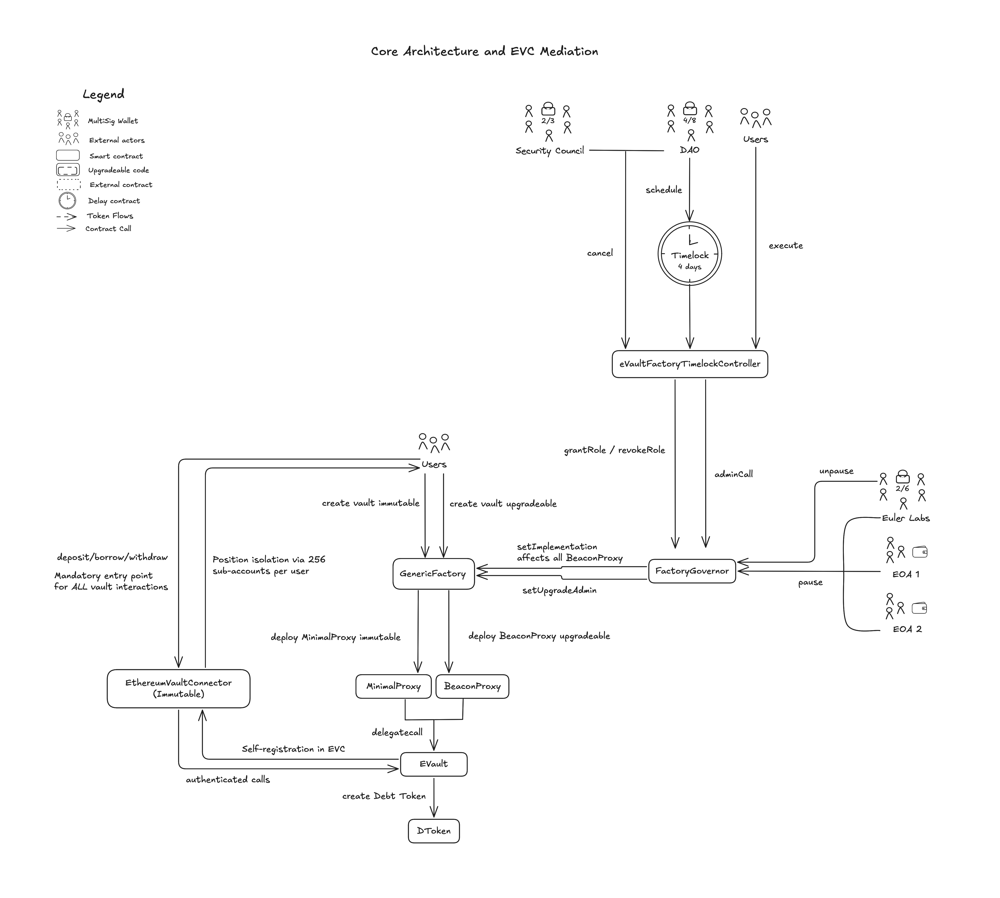
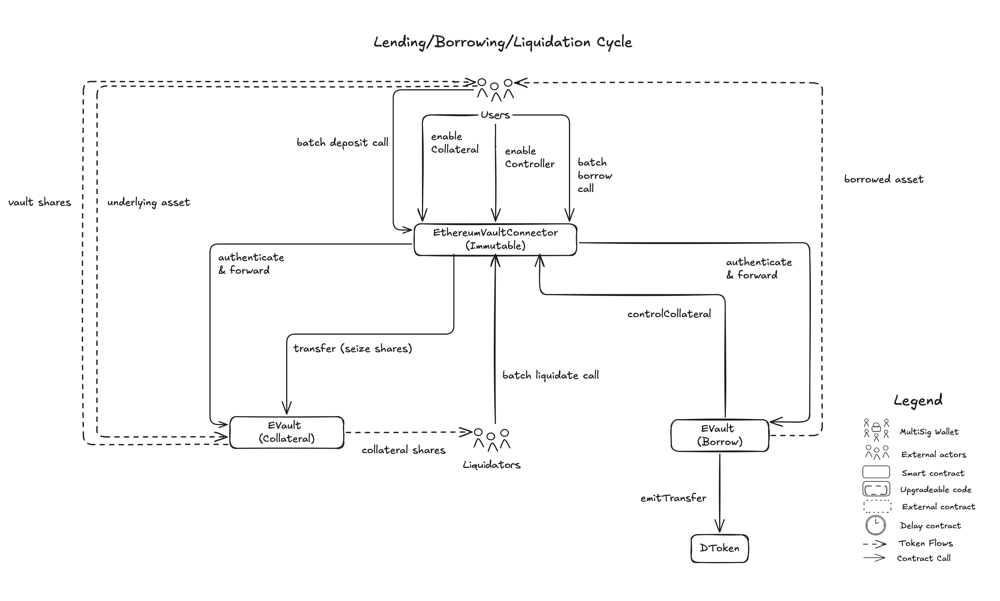
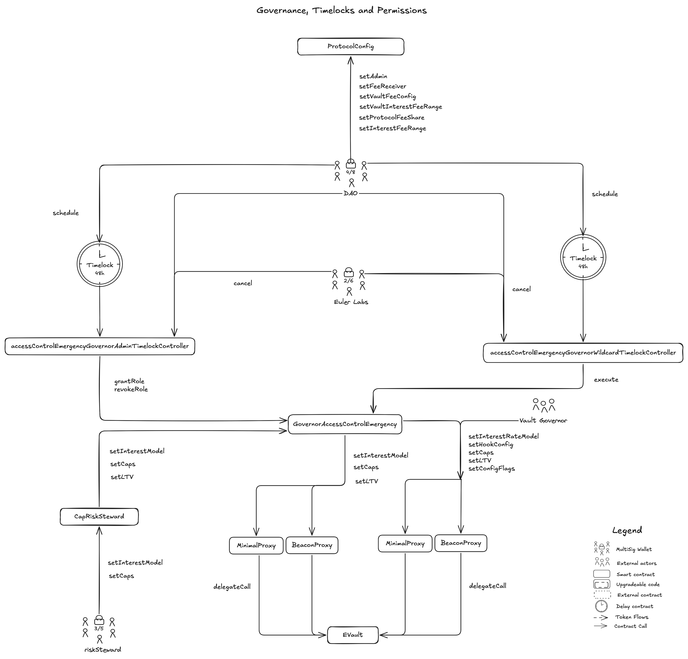
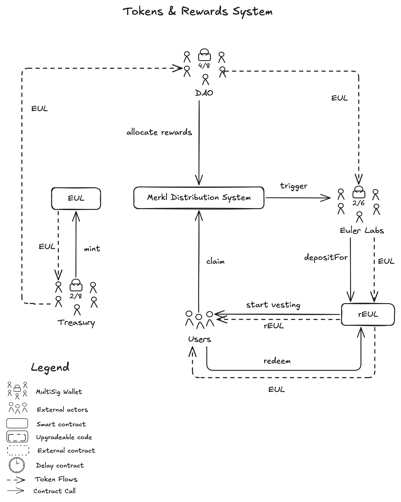
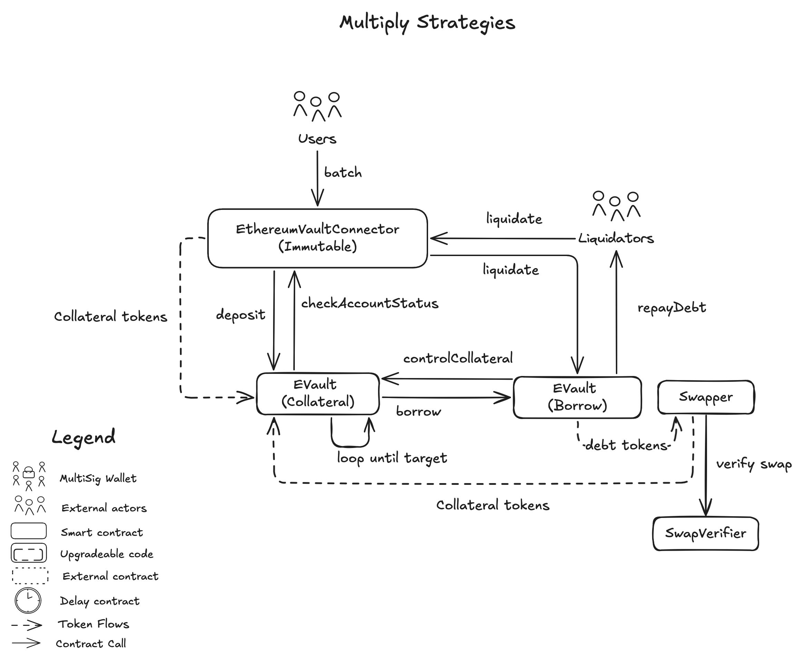
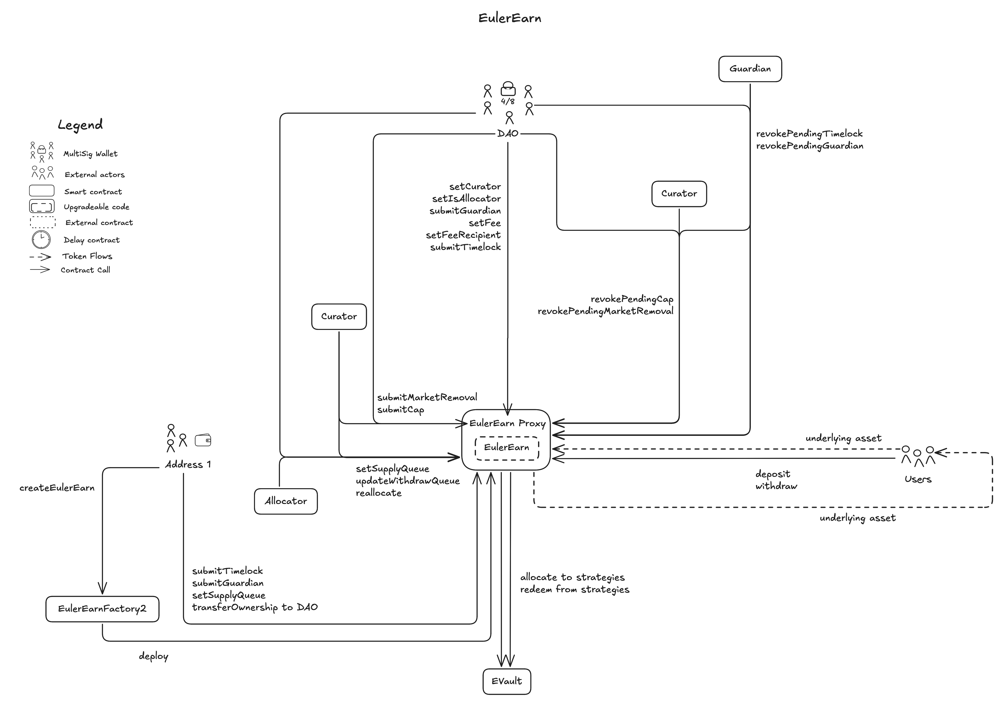
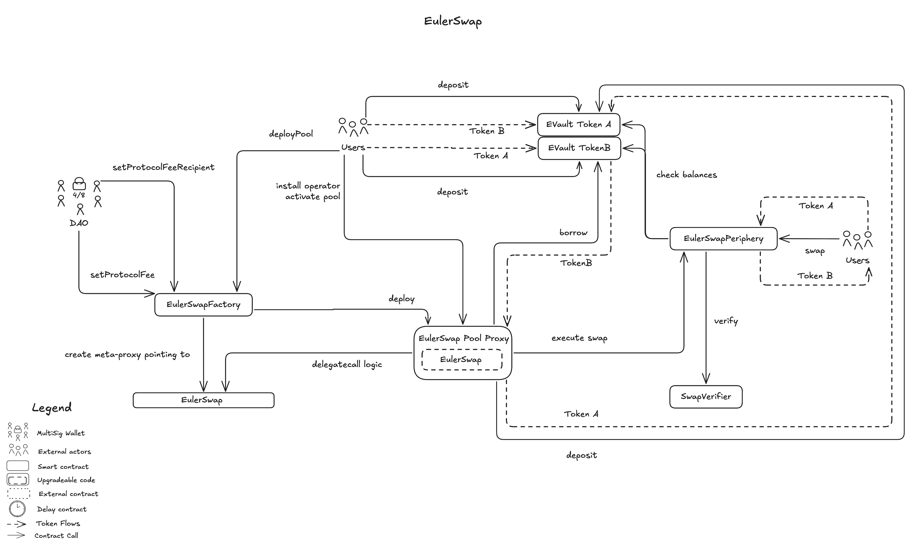

---

# Summary

Euler V2 is a lending and borrowing protocol deployed on Ethereum. It allows users to deposit assets as collateral, borrow against them, and earn interest via an on-chain interest rate model. The protocol employs smart contracts such as EVaults, a generic factory, and a router to handle asset flows, and integrates with oracles and governance modules to manage risk and updates.

# Ratings

## Chain

Euler V2 is deployed on various chains. This review is based on the Ethereum mainnet deployment.

> Chain score: Low

## Upgradeability

The Euler V2 protocol contains permissioned functions across multiple modules that could result in the theft or loss of user funds, loss of unclaimed yield, or otherwise materially affect the expected performance of the protocol. The control vectors are distributed across the [DAO multisig](#security-council), [Euler Labs](#security-council) and 3rd-party vault-specific governors. Each module carries specific risks as detailed below.

### Vault Factory

`EVaults` are created by users via the Factory contract. At creation, users decide whether the newly deployed `EVault` is immutable or upgradeable. The [Euler DAO](#security-council) multisig can upgrade all upgradeable `EVaults`. If maliciously upgraded, this can lead to _loss of funds_ for all users deposited across upgradeable vaults, as upgrades are executed across all upgradeable `EVaults` at once. The upgrade is protected by a 4-day timelock.

### Per-Vault Parameter Control

Vaults can either be governed or ungoverned. Governors of Vaults can accept new collateral assets and adjust risk parameters. Misconfiguration or acceptance of malicious collateral can cause _loss of funds_. Governed Vaults can either be governed by the Euler DAO or privately by 3rd-parties. DAO-managed vaults have a 48-hour timelock protection. Privately-managed vaults may have no timelock protection.

The [riskSteward](https://etherscan.io/address/0xBdAa3FCc9983bD72feE0F7D017e02673896a976d) multisig (3/5) holds emergency roles that bypass the 48-hour timelock for immediate risk-reducing actions.

### Oracle System

Each `EVault` has an oracle router configured at creation. The router dispatches requests for quotes to different price sources wrapped in adapters. The router governor can update which price feeds are used to price assets. The router governor and vault governor are often the same entity. Misconfiguration of oracle settings can lead to _loss of funds_ through unfair liquidations or excessive borrowing.

The [SnapshotRegistry (oracleAdapterRegistry)](https://etherscan.io/address/0xA084A7F49723E3cc5722E052CF7fce910E7C5Fe6) maintained by [Euler Labs](https://etherscan.io/address/0xB1345E7A4D35FB3E6bF22A32B3741Ae74E5Fba27) maintains a reference list of approved oracle adapters, but during user transactions routers do not verify adapter approval before using configured oracles. However, users are informed on the Euler App if oracle adapters satisfy certain checks.
### Listing of EVaults for EulerEarn Vaults

The [Euler DAO](#security-council) controls which whitelist (Perspective) is used by all `EulerEarn` vaults via `EulerEarnFactory2` to check whether an `EVault` is accepted to deposit into. If unsafe `EVaults` are accepted, this can lead to _loss of funds_. The initial configuration uses `EVKFactoryPerspective`, which automatically approves all `EVaults` deployed by the factory. If the DAO switches to `GovernedPerspective`, [Euler Labs](#security-council) would manually control which `EVaults` can be used as strategies.
### Fee Configuration

The [ProtocolConfig](https://etherscan.io/address/0x4cD6BF1D183264c02Be7748Cb5cd3A47d013351b) contract controls global fee settings through `setProtocolFeeShare`, `setInterestFeeRange`, and vault-specific overrides, which affect all existing user positions immediately. Per-vault fee configuration is available through `setFeeReceiver` and `setInterestFee` on individual EVaults.

### EulerSwap

The [EulerSwapFactory](https://etherscan.io/address/0xb013be1D0D380C13B58e889f412895970A2Cf228) controls swap fee configuration through `setProtocolFee` and `setProtocolFeeRecipient` for all EulerSwap pools.

With the current setup, the timelock protections (48-hour and 4-day delays) fall below the 7-day minimum threshold required for medium risk classification, and numerous critical functions affecting user funds can be executed by multisigs or role holders.

> Upgradeability score: High

## Autonomy

Euler V2 relies on external oracle providers selected by the `EVault` creators and risk curators for all price data required for collateral valuations and liquidation decisions.

Router Governor (most times equal to Vault creator/governor) are free to choose a price feed from any of the vendors which includes Chainlink, Pyth, RedStone, Chronicle, Lido, Pendle, Uniswap V3, Midas, MEV Capital, Idle, Resolv and many more.

The price feeds are wrapped in an adapter that provides a standardized interface to any of the vaults. Vault creators choose from the existing wrappers or deploy their own around any vendor.

Most wrappers do basic checks as liveness and check if the price is non-negative, but do not provide more checks and thus do not guarantee a true price reflecting active markets.

Users trust that the Router Governors, do not install malicious adapters, replace adapters if price feed continuously fails. Most TVL (>90%) in Euler is currently controlled by the following entities, sorted by TVL: (1) Usual, (2) Euler DAO and (3) Sentora.

Furthermore, over all 3rd party vendors Chainlink ranks number 1 among all used vendors, controlling more than 30% of the current available assets. Most TVL is currently controlled by fixed rate (asset in vault is fixed set to 1:1 USD) adapters.

If the price feed reverts the funds are stuck until the price feed is replaced. This could lead to temporary or permanent _loss of funds_.

** what is the % of adapters that are governed by euler **
XX % of the adapters are governed by Euler DAO, for the remaining adapters users trust 3rd-parties to choose oracles that are trustworthy and to replace the oracles in case of failure.

For all adapters that point to chainlink price feeds (xx %), a false price could be reported by the chainlink multisig exercising an upgrade on the price feeds. This could lead to wrong prices and _loss of user funds_. Their multisig does not comply with Security Council requirements. A complete analysis of Chainlink price feeds can be found in the dedicated [report](https://www.defiscan.info/protocols/chainlink-oracles/ethereum).

This potential impact on xx% of Euler's TVL results in a Medium centralization risk from Chainlink.

Overall Euler V2 vaults rely on a manifold of vendors and a manifold of 3rd party permission owner to install and route to these vendors.

> Autonomy score: High

## Exit Window

> Exit Window score: High

## Accessibility

Users can only access Euler V2 through a single user interface: app.euler.finance. Currently, there is no backup solution in case the interface is shut down or users are censored.

> Accessibility score: High

## Conclusion

Euler V2 receives a _Low centralization risk_ score for _Chain_, and _High centralization risk_ scores for _Upgradeability_, _Autonomy_, _Exit Window_, and _Accessibility_ dimensions.

The protocol exposes critical permissions for factory-wide bytecode upgrades and per-vault parameter control that are protected with timelock delays of only 48 hours and 4 days, falling below the 7-day minimum threshold. Furthermore, Euler V2 is exposed to centralization risks from its external oracle dependencies, where vault creators select from multiple providers including Chainlink, Pyth, and RedStone without protocol-level fallback mechanisms to mitigate price feed failures.

Euler V2 thus achieves _Stage 0_.

The protocol could reach _Stage 1_ by: 1) extending timelock protections to at least 7 days for all critical permissions, Or 2) establishing a Security Council with at least 7 signers, at least 51% threshold, at least 50% non-insider signers, and publicly announced signers with ownership of or veto power over critical permissions, And 3) implementing fallback mechanisms for oracle dependencies, And 4) publishing the frontend code to IPFS or developing alternative interfaces.

> Overall score: Stage 0

## Reviewer's Notes

We further want to highlight the following observations which did not directly factor into the scoring:

⚠️ Governors of 3rd-party managed `EVaults` are in control of critical permissions which can result in the _loss of user funds_ and _loss of unclaimed yield_. These permissions only have a direct impact on users in the respective vault and thus do not contribute to the centralization of the Euler protocol. 3rd-party managed vaults operate outside the DAO's timelocked governance framework, and users should independently evaluate the trustworthiness and operational security of the vault governor before depositing. All Vault governors are listed in the Euler App and if the entity is listed they underwent a KYB process.

⚠️ 3rd-party permission owners of `EulerEarn` vaults are in control of critical permissions which can result in the _loss of user funds_ and _loss of unclaimed yield_. Curators manage strategy risk by adding `EVaults` and setting supply caps, while Allocators control fund distribution to enabled strategies. These permissions only have a direct impact on users in the respective `EulerEarn` vault and thus do not contribute to the centralization of the Euler protocol. `EulerEarn` Vault owners can assign Guardians with the capability to revoke pending actions that increase risk towards users. All `EulerEarn` Vault owners listed in the Euler App underwent a KYB process.

⚠️ Each `EVault` uses an `EulerRouter` for price feeds, configured by the vault governor. The `EulerRouter` does not verify oracle adapters against the SnapshotRegistry on-chain, allowing vault governors to configure any oracle adapter including potentially malicious ones. The Euler App however checks the SnapshotRegistry of Routers to assess the checks it passed. Users should verify the oracle configuration of vaults they interact with from the frontend.
# Protocol Analysis

## Core Architecture and EVC Mediation

Euler V2 implements a modular vault-based lending architecture centered around two foundational contracts: the [EthereumVaultConnector (EVC)](https://etherscan.io/address/0x0C9a3dd6b8F28529d72d7f9cE918D493519EE383) and the [GenericFactory](https://etherscan.io/address/0x29a56a1b8214D9Cf7c5561811750D5cBDb45CC8e). The [EthereumVaultConnector (EVC)](https://etherscan.io/address/0x0C9a3dd6b8F28529d72d7f9cE918D493519EE383) serves as an immutable authentication layer mediating all interactions between users and vaults, while the [GenericFactory](https://etherscan.io/address/0x29a56a1b8214D9Cf7c5561811750D5cBDb45CC8e) enables permissionless creation of isolated lending markets. Each vault functions as an ERC-4626 compliant tokenized debt market for a specific underlying asset, maintaining full compatibility with the broader DeFi ecosystem.

### Vault Creation and Deployment

Vault creation begins when any user calls `createProxy` on the [GenericFactory](https://etherscan.io/address/0x29a56a1b8214D9Cf7c5561811750D5cBDb45CC8e), which deploys a new vault instance as either a `BeaconProxy` or `MinimalProxy` that delegates all function execution to the standardized [EVault (Implementation)](https://etherscan.io/address/0x8Ff1C814719096b61aBf00Bb46EAd0c9A529Dd7D) via delegatecall. The `BeaconProxy` queries the `EVault` implementation contract from the [GenericFactory](https://etherscan.io/address/0x29a56a1b8214D9Cf7c5561811750D5cBDb45CC8e) with the `implementation()` function. All upgradeable Vaults using the Beacon Proxy pattern can be upgrading using a single call to the `setImplementation`. Read more in [factory-level upgrades](###factory-level-governance)

All critical factory operations are protected by a mandatory 4-day timelock through the [eVaultFactoryTimelockController](https://etherscan.io/address/0xfb034c1C6c7F42171b2d1Cb8486E0f43ED07A968), providing users with advance notice before any upgrade takes effect. The factory also implements emergency pause functionality through the [FactoryGovernor](https://etherscan.io/address/0x2F13256E04022d6356d8CE8C53C7364e13DC1f3d), which can immediately place all upgradeable vault operations in read-only mode by installing a `ReadOnlyProxy` as the factory implementation. The complete governance structure, including proposal mechanisms, role assignments, and emergency controls, is detailed in the [Governance](#governance) section.

If the user decides to deploy an non-upgradeable Vault the factory deploys an immutable `MinimalProxy` whose logic cannot be changed. Analysis of on-chain events reveals predominantly upgradeable `BeaconProxy` deployments, with no immutable `MinimalProxy` instances observed in the examined sample.

During initialization, the newly created vault automatically registers itself with the [EthereumVaultConnector (EVC)](https://etherscan.io/address/0x0C9a3dd6b8F28529d72d7f9cE918D493519EE383), establishing itself as a recognized entity within the [EthereumVaultConnector (EVC)](https://etherscan.io/address/0x0C9a3dd6b8F28529d72d7f9cE918D493519EE383)'s authentication framework. The vault simultaneously creates an associated `DToken` contract, an ERC-20 compliant debt token that represents borrowed positions and makes debt modifications visible in block explorers and tax accounting software. The vault creator specifies critical parameters including the underlying asset, oracle router, interest rate model, and governance settings. Once deployed, the vault operates as an independent lending market with its own collateral configuration and risk parameters.

### Vault Governance Models

EVaults operate under two distinct governance models based on the `governorAdmin` storage variable. Non-governed vaults have `governorAdmin` set to `address(0)`, permanently revoking all governance capabilities. All vault parameters become immutable, including LTV ratios, interest rate models, caps, and fee configurations. Users in these vaults accept fixed risk parameters without reliance on third-party management.

Governed vaults have an active `governorAdmin` address that can modify vault parameters through functions protected by the `governorOnly` modifier. Governed vaults divide into two categories. DAO-managed vaults use the [GovernorAccessControlEmergency](https://etherscan.io/address/0xaf1a3652399aF17473FBdB0F809f0C0B033cB9eB) contract as `governorAdmin`, providing timelocked governance through 48-hour and 4-day delays and emergency roles for immediate protective actions. These vaults are managed by verified risk curators who have undergone KYB verification. Privately-managed vaults use an EOA, multisig, or custom contract as `governorAdmin`, where the vault creator retains direct control over all governance functions without mandatory timelocks. Anyone can deploy their own governance suite via the [GovernorAccessControlEmergencyFactory](https://etherscan.io/address/0x025C8831c6E45420DF8E71F7B6b99F733D120Faf) to benefit from structured governance with timelocks and emergency roles.

### Ethereum Vault Connector (EVC)

The [EthereumVaultConnector (EVC)](https://etherscan.io/address/0x0C9a3dd6b8F28529d72d7f9cE918D493519EE383) functions as an entry point for user interactions in Euler V2, serving as an immutable authentication and coordination layer with no governance or upgrade mechanisms. The [EthereumVaultConnector (EVC)](https://etherscan.io/address/0x0C9a3dd6b8F28529d72d7f9cE918D493519EE383) mediates every deposit, withdrawal, borrow, and liquidation operation, enabling vaults to trust that calls originating from the [EthereumVaultConnector (EVC)](https://etherscan.io/address/0x0C9a3dd6b8F28529d72d7f9cE918D493519EE383) are properly authenticated and authorized. This architecture ensures vault logic remains simple and modular while complex authentication, batching, and cross-vault coordination are handled by the centralized but trustless [EthereumVaultConnector (EVC)](https://etherscan.io/address/0x0C9a3dd6b8F28529d72d7f9cE918D493519EE383) contract.

The [EthereumVaultConnector (EVC)](https://etherscan.io/address/0x0C9a3dd6b8F28529d72d7f9cE918D493519EE383) provides each user address with 256 virtual sub-accounts for position isolation. These sub-accounts enable users to manage multiple isolated trading strategies, separate high-risk positions from conservative holdings, and implement sophisticated risk management frameworks without deploying separate wallet contracts. Each sub-account can independently enable or disable collateral and controller vaults, allowing users to compartmentalize their exposure across different lending markets.

The [EthereumVaultConnector (EVC)](https://etherscan.io/address/0x0C9a3dd6b8F28529d72d7f9cE918D493519EE383) enables atomic batching of operations through its `batch` function, which executes multiple calls in a single transaction while deferring solvency and cap checks until completion. This functionality allows users to open leveraged positions, rebalance collateral across vaults, execute flash loans with automatic repayment, and combine lending, borrowing, and swapping operations without intermediate states that would violate solvency requirements. The [EthereumVaultConnector (EVC)](https://etherscan.io/address/0x0C9a3dd6b8F28529d72d7f9cE918D493519EE383) also provides two emergency modes for user protection: Lockdown Mode restricts all operations except operator management and nonce updates, while Permit Disabled Mode prevents execution of any permits signed by the owner. The [EthereumVaultConnector (EVC)](https://etherscan.io/address/0x0C9a3dd6b8F28529d72d7f9cE918D493519EE383)'s operator delegation system allows users to authorize trusted contracts to act on behalf of their sub-accounts, enabling automated strategies, limit orders, and third-party integrations while maintaining user custody.

## Lending, Borrowing and Liquidation

### Deposit and Withdrawal Process

Users deposit assets into [EVault (Implementation)](https://etherscan.io/address/0x8Ff1C814719096b61aBf00Bb46EAd0c9A529Dd7D) instances through the [EthereumVaultConnector (EVC)](https://etherscan.io/address/0x0C9a3dd6b8F28529d72d7f9cE918D493519EE383), which serves as the mandatory entry point for all vault operations. When a user calls `batch` on the [EthereumVaultConnector (EVC)](https://etherscan.io/address/0x0C9a3dd6b8F28529d72d7f9cE918D493519EE383) with encoded deposit instructions, the [EthereumVaultConnector (EVC)](https://etherscan.io/address/0x0C9a3dd6b8F28529d72d7f9cE918D493519EE383) authenticates the caller, forwards the request to the target [EVault (Implementation)](https://etherscan.io/address/0x8Ff1C814719096b61aBf00Bb46EAd0c9A529Dd7D), and executes the deposit operation atomically.

The [EVault (Implementation)](https://etherscan.io/address/0x8Ff1C814719096b61aBf00Bb46EAd0c9A529Dd7D) receives the underlying asset and mints vault shares. As interest accrues from borrowers, the value of each share increases proportionally, distributing yield to all depositors automatically. Each [EVault (Implementation)](https://etherscan.io/address/0x8Ff1C814719096b61aBf00Bb46EAd0c9A529Dd7D) maintains internal balance tracking to prevent manipulation through external transfers or balance inflation attacks.

Withdrawals mirror deposits in reverse. Users call `batch` on the [EthereumVaultConnector (EVC)](https://etherscan.io/address/0x0C9a3dd6b8F28529d72d7f9cE918D493519EE383) with withdrawal instructions specifying the amount and receiver address. The [EVault (Implementation)](https://etherscan.io/address/0x8Ff1C814719096b61aBf00Bb46EAd0c9A529Dd7D) burns the corresponding vault shares and transfers the underlying assets. The [EthereumVaultConnector (EVC)](https://etherscan.io/address/0x0C9a3dd6b8F28529d72d7f9cE918D493519EE383) defers all solvency checks until the end of the batch.

### Cross-Vault Borrowing and Collateralization

Euler V2 enables borrowing from one vault using collateral from another through the [EthereumVaultConnector (EVC)](https://etherscan.io/address/0x0C9a3dd6b8F28529d72d7f9cE918D493519EE383)'s cross-vault system. Users must call `enableCollateral` on the [EthereumVaultConnector (EVC)](https://etherscan.io/address/0x0C9a3dd6b8F28529d72d7f9cE918D493519EE383) to designate collateral sources, then `enableController` to authorize the borrow vault to enforce solvency and control collateral during liquidations.

The controller designation grants privileged access via `controlCollateral`. Only vaults explicitly enabled as controllers can invoke this function through the [EthereumVaultConnector (EVC)](https://etherscan.io/address/0x0C9a3dd6b8F28529d72d7f9cE918D493519EE383), preventing unauthorized access. Users can isolate strategies across their 256 sub-accounts, each with independent collateral and controller configurations.

When borrowing, the [EthereumVaultConnector (EVC)](https://etherscan.io/address/0x0C9a3dd6b8F28529d72d7f9cE918D493519EE383) authenticates and forwards the request to the borrow vault. The vault queries the [EthereumVaultConnector (EVC)](https://etherscan.io/address/0x0C9a3dd6b8F28529d72d7f9cE918D493519EE383) for total collateral value and compares it against the requested amount multiplied by the Loan-to-Value (LTV) ratio. Euler V2 implements three LTV thresholds: Borrow LTV sets maximum leverage, Liquidation LTV defines the liquidation threshold, and Spread LTV creates a buffer zone preventing immediate liquidation. The vault governor configures these thresholds through `setLTV`.

The borrow vault mints `DToken`, an ERC-20 debt tracking token that emits Transfer events via `emitTransfer` for visibility in block explorers. DTokens function as read-only interfaces without permitting direct transfers. Debt compounds automatically every second via the vault's Interest Rate Model. The [EthereumVaultConnector (EVC)](https://etherscan.io/address/0x0C9a3dd6b8F28529d72d7f9cE918D493519EE383) calls `checkAccountStatus` on all controller vaults at batch end, reverting if any check fails.

### Interest Rate Models

Each [EVault (Implementation)](https://etherscan.io/address/0x8Ff1C814719096b61aBf00Bb46EAd0c9A529Dd7D) configures an Interest Rate Model (IRM) at deployment that dynamically adjusts borrowing costs based on utilization. The [EulerKinkIRMFactory](https://etherscan.io/address/0xcAe0A39B45Ee9C3213f64392FA6DF30CE034C9F9) creates linear kink models with piecewise-linear curves, the [EulerIRMAdaptiveCurveFactory](https://etherscan.io/address/0x3EC2d5af936bBB57DD19C292BAfb89da0E377F42) deploys adaptive models based on historical trends, and the [EulerFixedCyclicalBinaryIRMFactory](https://etherscan.io/address/0xa8F8E82C9Da15A991D7BF2486aE26e22743aC8d0) produces fixed-rate cyclical models. The vault governor selects and modifies the IRM via `setInterestRateModel`.

Interest accrues deterministically every second using exponential compounding with rates expressed as "second percent yield" (SPY) values scaled by 1e27. Higher utilization triggers higher rates, incentivizing deposits or debt repayment. A configurable portion flows to fees through the `interestFee` parameter, with [ProtocolConfig](https://etherscan.io/address/0x4cD6BF1D183264c02Be7748Cb5cd3A47d013351b) determining the split between vault governor and Euler DAO treasury. The vault governor configures this fee distribution through `setInterestFee`.

### Liquidation Mechanism

Positions become eligible for liquidation when collateral value falls below the Liquidation LTV threshold multiplied by outstanding debt. Euler V2 implements a reverse Dutch auction where the discount scales proportionally with violation depth. Slightly underwater positions offer minimal discounts, while deeper violations increase the discount progressively until liquidation becomes economically attractive.

Liquidators call `batch` on the [EthereumVaultConnector (EVC)](https://etherscan.io/address/0x0C9a3dd6b8F28529d72d7f9cE918D493519EE383) with a liquidate instruction. The borrow vault calculates the liquidatable amount and collateral seizure based on the current discount, capped by `maxLiquidationDiscount`. The borrow vault invokes `controlCollateral` on the [EthereumVaultConnector (EVC)](https://etherscan.io/address/0x0C9a3dd6b8F28529d72d7f9cE918D493519EE383) with the collateral vault address, violator's account, and transfer calldata. The [EthereumVaultConnector (EVC)](https://etherscan.io/address/0x0C9a3dd6b8F28529d72d7f9cE918D493519EE383) authenticates the controller authority and executes the transfer.

The liquidator receives vault shares at a discounted valuation. The borrow vault calls `emitTransfer` on the `DToken` to record the debt reduction. The `liquidationCoolOffTime` parameter prevents immediate liquidation after position creation. When bad debt socialization is enabled, insufficient collateral positions have their remaining liabilities distributed across all depositors by reducing the share exchange rate. The vault governor configures these liquidation parameters through `setMaxLiquidationDiscount` and `setLiquidationCoolOffTime`.

## Oracle System and Price Feeds

### Modular Oracle Architecture

Euler V2 implements a vendor-agnostic oracle system through the [EulerRouterFactory](https://etherscan.io/address/0x70B3f6F61b7Bf237DF04589DdAA842121072326A), enabling permissionless creation of independent oracle routers. Each `EulerRouter` instance, such as this [EulerRouter](https://etherscan.io/address/0x8ab93f4ee16fb9c0086651a85f941b8a8716cd57) deployment, has its own governor and configuration.

Vault creators specify an `EulerRouter` address during deployment, which connection becomes immutable. Vaults call `getQuote(inAmount, base, quote)` on their `EulerRouter`, which dispatches to registered adapters and returns price data.

Adapters are immutable contracts translating external data into ERC-7726 format. Active integrations include Chainlink, Pyth, RedStone, Chronicle, Lido, Pendle, Uniswap V3, Midas, MEV Capital, Idle, and Resolv. The system supports push-based oracles like Chainlink with automatic updates, and pull-based oracles like Pyth requiring users to submit fresh data. CrossAdapters derive prices through sequential multiplication of two sources, while ERC-4626 adapters query `convertToAssets()` for share valuations.

### Oracle Registry and Validation

The [SnapshotRegistry (oracleAdapterRegistry)](https://etherscan.io/address/0xA084A7F49723E3cc5722E052CF7fce910E7C5Fe6) maintains a reference list of approved oracle adapters for informational purposes. This registry is used by [OracleLens](https://etherscan.io/address/0x0C47736aaBEE757AB8C8F60776741e39DBf3F183) to provide approved adapter lists to frontends and dashboards via getValidAdapters(), but each `EulerRouter` does not verify adapter approval before dispatching queries from the `EVault`. Router governors can install unapproved oracle adapters via govSetConfig, users rely on the frontend to get information regarding the passed or not passed checks from the registry whitelist.
[Euler Labs](https://etherscan.io/address/0xB1345E7A4D35FB3E6bF22A32B3741Ae74E5Fba27) controls the registry via add and revoke. Each router has its own governor controlling govSetConfig, govSetResolvedVault, and govSetFallbackOracle. The router governor and vault governor are often the same entity.

## Governance, Timelocks and Permissions

Euler V2 implements a multi-layered governance architecture with per-vault governance, factory-level upgrades, and global configuration via [ProtocolConfig](https://etherscan.io/address/0x4cD6BF1D183264c02Be7748Cb5cd3A47d013351b). The [DAO multisig](https://etherscan.io/address/0xcAD001c30E96765aC90307669d578219D4fb1DCe) (4/8 threshold) operates through three TimelockController contracts: 48-hour [AdminTimelock](https://etherscan.io/address/0xBfeE2D937FB9223FFD65b7cDF607bd1DA9B97E59) for role management, 48-hour [WildcardTimelock](https://etherscan.io/address/0x1b8C367aE56656b1D0901b2ADd1AD3226fF74f5a) for parameter adjustments, and 4-day [FactoryTimelock](https://etherscan.io/address/0xfb034c1C6c7F42171b2d1Cb8486E0f43ED07A968) for protocol upgrades.

### Risk Management and Stewards

[CapRiskSteward](https://etherscan.io/address/0xFE56cAa36DA676364e1a0a97e4f7C07651e89B95) enables optimistic risk management within safety constraints. The [riskSteward multisig](https://etherscan.io/address/0xBdAa3FCc9983bD72feE0F7D017e02673896a976d) (3/5 threshold) modifies caps with 24-hour cooldown, allowing 2x increases or 0.5x decreases per period, and updates interest rate models deployed by [EulerKinkIRMFactory](https://etherscan.io/address/0xcAe0A39B45Ee9C3213f64392FA6DF30CE034C9F9). [CapRiskSteward](https://etherscan.io/address/0xFE56cAa36DA676364e1a0a97e4f7C07651e89B95) holds selector-specific roles on [GovernorAccessControlEmergency](https://etherscan.io/address/0x35400831044167E9E2DE613d26515eeE37e30a1b), bypassing the 48-hour timelock while bound by contract-enforced limits.

### Emergency Controls

[GovernorAccessControlEmergency](https://etherscan.io/address/0x35400831044167E9E2DE613d26515eeE37e30a1b) implements three emergency roles for immediate risk reduction: `LTV_EMERGENCY_ROLE` (held by [CapRiskSteward](https://etherscan.io/address/0xFE56cAa36DA676364e1a0a97e4f7C07651e89B95)) lowers borrow LTV while maintaining liquidation LTV, `CAPS_EMERGENCY_ROLE` (held by [CapRiskSteward](https://etherscan.io/address/0xFE56cAa36DA676364e1a0a97e4f7C07651e89B95)) reduces caps immediately, and `HOOK_EMERGENCY_ROLE` (unassigned) would pause vault operations. Emergency powers are strictly risk-reducing. Recovery requires normal governance through [WildcardTimelock](https://etherscan.io/address/0x1b8C367aE56656b1D0901b2ADd1AD3226fF74f5a). The DAO and [Euler Labs](https://etherscan.io/address/0xB1345E7A4D35FB3E6bF22A32B3741Ae74E5Fba27) hold `CANCELLER_ROLE` on both timelocks, enabling proposal cancellation during delays.

## Advanced Modules

### Tokens & Rewards System

The [`EUL`](https://etherscan.io/address/0xd9Fcd98c322942075A5C3860693e9f4f03AAE07b) contract minted 27,182,818 tokens at deployment to the [Treasury](https://etherscan.io/address/0x25Aa4a183800EcaB962d84ccC7ada58d4e126992). The [Treasury](https://etherscan.io/address/0x25Aa4a183800EcaB962d84ccC7ada58d4e126992) holds `ADMIN_ROLE` and can call `mint()` once every 365 days to create 2.718% of total supply. The `mintingRestrictedBefore` variable enforces this interval. The [Treasury](https://etherscan.io/address/0x25Aa4a183800EcaB962d84ccC7ada58d4e126992) transfers [`EUL`](https://etherscan.io/address/0xd9Fcd98c322942075A5C3860693e9f4f03AAE07b) to the [DAO](https://etherscan.io/address/0xcAD001c30E96765aC90307669d578219D4fb1DCe), which allocates tokens to [Euler Labs](https://etherscan.io/address/0xB1345E7A4D35FB3E6bF22A32B3741Ae74E5Fba27) for [rEUL](https://etherscan.io/address/0xf3e621395fc714B90dA337AA9108771597b4E696) rewards.

### rEUL Rewards System

The [`rEUL`](https://etherscan.io/address/0xf3e621395fc714B90dA337AA9108771597b4E696) token is a locked form of [`EUL`](https://etherscan.io/address/0xd9Fcd98c322942075A5C3860693e9f4f03AAE07b) incentivizing protocol adoption. Merkl calculates rewards every 8-12 hours off-chain. When users claim, [Euler Labs](https://etherscan.io/address/0xB1345E7A4D35FB3E6bF22A32B3741Ae74E5Fba27) calls `depositFor(account, amount)` on the [rEUL](https://etherscan.io/address/0xf3e621395fc714B90dA337AA9108771597b4E696) contract, which transfers [`EUL`](https://etherscan.io/address/0xd9Fcd98c322942075A5C3860693e9f4f03AAE07b) from [Euler Labs](https://etherscan.io/address/0xB1345E7A4D35FB3E6bF22A32B3741Ae74E5Fba27) to the [rEUL](https://etherscan.io/address/0xf3e621395fc714B90dA337AA9108771597b4E696) contract and mints corresponding [rEUL](https://etherscan.io/address/0xf3e621395fc714B90dA337AA9108771597b4E696) for the user.

### Balance Forwarding and Reward Distribution

The protocol implements a balance forwarding system through the [TrackingRewardStreams](https://etherscan.io/address/0x0D52d06ceB8Dcdeeb40Cfd9f17489B350dD7F8a3) contract, enabling instant and trustless distribution of rewards while keeping gas costs low. When an account opts in via `enableBalanceForwarder`, every balance change in the vault triggers a notification to the [TrackingRewardStreams](https://etherscan.io/address/0x0D52d06ceB8Dcdeeb40Cfd9f17489B350dD7F8a3) contract. This mechanism allows external reward distributors like Merkl to track user positions in real-time and calculate proportional reward allocations off-chain. The system maintains accuracy without requiring on-chain snapshot mechanisms or manual claim updates, reducing operational overhead for both users and reward distributors.

### Vesting Mechanism

[rEUL](https://etherscan.io/address/0xf3e621395fc714B90dA337AA9108771597b4E696) converts to [`EUL`](https://etherscan.io/address/0xd9Fcd98c322942075A5C3860693e9f4f03AAE07b) at 1:1 ratio over six months: 20% unlocks immediately, 80% linearly over 180 days. Early redemption forfeits the locked portion to [`0x000000000000000000000000000000000000dEaD`](https://etherscan.io/address/0x000000000000000000000000000000000000dEaD) (configured as `remainderReceiver`). Each [rEUL](https://etherscan.io/address/0xf3e621395fc714B90dA337AA9108771597b4E696) transfer starts a distinct unlock schedule, making each batch non-fungible despite its ERC-20 interface.

### Multiply Strategies (Leverage Looping)

Multiply strategies automate leveraged position creation through the [EthereumVaultConnector (EVC)](https://etherscan.io/address/0x0C9a3dd6b8F28529d72d7f9cE918D493519EE383). Users initiate a `batch()` transaction that deposits collateral into an [EVault (Implementation)](https://etherscan.io/address/0x8Ff1C814719096b61aBf00Bb46EAd0c9A529Dd7D), borrows against it from a debt [EVault (Implementation)](https://etherscan.io/address/0x8Ff1C814719096b61aBf00Bb46EAd0c9A529Dd7D), swaps the borrowed asset via [Swapper](https://etherscan.io/address/0x2Bba09866b6F1025258542478C39720A09B728bF) (verified by [SwapVerifier](https://etherscan.io/address/0xae26485ACDDeFd486Fe9ad7C2b34169d360737c7)), and redeposits the result as collateral. This loop repeats until reaching the target multiplier. The [EthereumVaultConnector (EVC)](https://etherscan.io/address/0x0C9a3dd6b8F28529d72d7f9cE918D493519EE383) defers liquidity checks until batch completion, then validates position health via `checkAccountStatus()`.

When a position's health score drops to ≤1, liquidators can call `liquidate()` through the [EthereumVaultConnector (EVC)](https://etherscan.io/address/0x0C9a3dd6b8F28529d72d7f9cE918D493519EE383). The debt [EVault (Implementation)](https://etherscan.io/address/0x8Ff1C814719096b61aBf00Bb46EAd0c9A529Dd7D) verifies eligibility and invokes `controlCollateral()` on the [EthereumVaultConnector (EVC)](https://etherscan.io/address/0x0C9a3dd6b8F28529d72d7f9cE918D493519EE383) to seize collateral at a discount proportional to the position's unhealthiness (reverse Dutch auction). The seized collateral transfers to the liquidator, who repays the corresponding debt. All positions and debt are stored in the respective [EVault (Implementation)](https://etherscan.io/address/0x8Ff1C814719096b61aBf00Bb46EAd0c9A529Dd7D) instances.

## EulerEarn System

### Vault Deployment

EulerEarn implements a yield aggregation layer through factory-deployed proxy contracts. Observed deployment shows [Address 1](https://etherscan.io/address/0x95058F3d4C69F14f6125ad4602E925845BD5d6A4) calling `createEulerEarn` on [EulerEarnFactory2](https://etherscan.io/address/0x59709B029B140C853FE28d277f83C3a65e308aF4), specifying the underlying asset, vault name and symbol, initial owner address, and timelock duration. The factory deploys a proxy contract via `CREATE2` that delegates all calls to the shared [EulerEarn Implementation](https://etherscan.io/address/0xBa42141648dFD74388f3541C1d80fa9387043Da9).

Each proxy maintains independent storage including role addresses, approved strategies, per-strategy caps, and user balances, while the implementation contains shared function code. During initialization, the contract assigns ownership to the specified `initialOwner` and configures the initial timelock to zero seconds.

The deployer performs immediate setup: `setSupplyQueue` to configure strategy ordering, `submitGuardian` to designate the guardian address, `submitTimelock` to establish security delays, then `transferOwnership` to transfer control to the [DAO multisig](https://etherscan.io/address/0xcAD001c30E96765aC90307669d578219D4fb1DCe).

### Role-Based Permissions

EulerEarn implements a four-level permission hierarchy via Ownable2Step:

`Owner` holds supreme authority over all vault parameters. The `Owner` can call `setCurator` to define who approves strategies, `setIsAllocator` to authorize or revoke allocators, `submitGuardian` to propose a new `Guardian`, `setFee` to adjust performance fees between 0% and 50%, `setFeeRecipient` to direct revenue destination, and `submitTimelock` to modify security delays. The `Owner` can execute any function available to other roles.

`Curator` controls strategy selection via `submitCap` to set per-strategy supply caps. Cap increases require timelock approval; decreases execute immediately. `submitMarketRemoval` initiates strategy removal from withdrawal queues after reducing caps to zero. Maximum 30 strategies per vault.

`Allocator` executes rebalancing operations via `reallocate` to move funds between strategies within cap limits, `setSupplyQueue` to reorder deposit allocation priority, and `updateWithdrawQueue` to configure withdrawal ordering. Multiple allocators can be authorized simultaneously, enabling operational decentralization or automation via contracts.

`Guardian` exercises veto power via `revokePendingTimelock`, `revokePendingGuardian`, `revokePendingCap`, and `revokePendingMarketRemoval`, functioning as a circuit-breaker for timelocked actions.

Certain functions accept multiple roles: `setSupplyQueue`, `updateWithdrawQueue`, and `reallocate` accept `Allocator`, `Curator`, or `Owner`. `revokePendingCap` and `revokePendingMarketRemoval` accept `Curator`, `Guardian`, or `Owner`.

### Strategy Whitelisting

The [Euler DAO](#security-council) controls which whitelist (Perspective) is used by all `EulerEarn` vaults via [EulerEarnFactory2](https://etherscan.io/address/0x59709B029B140C853FE28d277f83C3a65e308aF4). The current configuration uses [OneOfMetaPerspective](https://etherscan.io/address/0x692c65588F3862040D968B362c2d7876a5A2Adb9), which accepts vaults approved by either [GovernedPerspective](https://etherscan.io/address/0x6912E3A7d5a3b26548cEE7BC4663311De9E2c735) or [EVKFactoryPerspective](https://etherscan.io/address/0xB30f23bc5F93F097B3A699f71B0b1718Fc82e182).

[GovernedPerspective](https://etherscan.io/address/0x6912E3A7d5a3b26548cEE7BC4663311De9E2c735) allows [Euler Labs](https://etherscan.io/address/0xB1345E7A4D35FB3E6bF22A32B3741Ae74E5Fba27) to manually whitelist vaults via `perspectiveVerify` and remove them via `perspectiveUnverify`. [EVKFactoryPerspective](https://etherscan.io/address/0xB30f23bc5F93F097B3A699f71B0b1718Fc82e182) automatically approves all vaults deployed by the [GenericFactory](https://etherscan.io/address/0x29a56a1b8214D9Cf7c5561811750D5cBDb45CC8e).

In practice, all factory-deployed `EVaults` are automatically eligible for `EulerEarn` strategies. Curators can only add strategies from `EVaults` that appear on the configured whitelist. A compromised whitelist alone cannot cause _loss of funds_ as it requires both a compromised whitelist and a malicious curator to enable dangerous strategies.
### User Deposits and Withdrawals

Users deposit assets via standard ERC-4626 interface. The vault mints shares proportional to current vault value and allocates deposits according to the supply queue, respecting per-strategy caps. Each strategy corresponds to an underlying [EVault (Implementation)](https://etherscan.io/address/0x8Ff1C814719096b61aBf00Bb46EAd0c9A529Dd7D) eligible to receive allocations up to its individual cap.

Yield accrues automatically as underlying [EVault (Implementation)](https://etherscan.io/address/0x8Ff1C814719096b61aBf00Bb46EAd0c9A529Dd7D) instances generate lending interest. Share value increases proportionally to aggregated yield. Performance fees (if configured) are charged only on positive yield and minted as shares to the fee recipient address.

Withdrawals execute according to the withdrawal queue. The vault attempts redemption from strategies in configured order. If a strategy lacks liquidity or reverts, the vault continues with the next strategy. Liquidity availability depends on underlying strategy conditions.

The [PublicAllocator](https://etherscan.io/address/0x8fdCb80a2894F0dC052c8d52D22544DC90274800) enables permissionless optimistic rebalancing in certain vaults, allowing any address to trigger reallocations within cap constraints.

## EulerSwap System

### Pool Deployment

EulerSwap implements a capital-efficient AMM through factory-deployed meta-proxy contracts. Any user can create a pool by calling `deployPool` on [EulerSwapFactory](https://etherscan.io/address/0xb013be1D0D380C13B58e889f412895970A2Cf228), specifying two [EVault (Implementation)](https://etherscan.io/address/0x8Ff1C814719096b61aBf00Bb46EAd0c9A529Dd7D) addresses, AMM curve parameters, and their Euler account address. The factory deploys a meta-proxy via CREATE2 pointing to the shared [EulerSwap Implementation](https://etherscan.io/address/0xc35a0FDA69e9D71e68C0d9CBb541Adfd21D6B117), encoding parameters directly into bytecode for immutability and gas efficiency.

During activation, the pool approves both [EVault (Implementation)](https://etherscan.io/address/0x8Ff1C814719096b61aBf00Bb46EAd0c9A529Dd7D) instances for transfers, enables them as collateral through the [EthereumVaultConnector (EVC)](https://etherscan.io/address/0x0C9a3dd6b8F28529d72d7f9cE918D493519EE383), and registers in the factory's pool registry. Deployment restricts `_msgSender()` to match the account owner, ensuring only authorized pool creation.

### Single-Owner Pool Model

Each EulerSwap pool is controlled by a single Euler account. The owner deposits assets into underlying [EVault (Implementation)](https://etherscan.io/address/0x8Ff1C814719096b61aBf00Bb46EAd0c9A529Dd7D) instances (Token A and Token B vaults), which simultaneously earn lending interest, serve as swap liquidity, and enable borrowing. The owner installs the pool as an authorized operator via the [EthereumVaultConnector (EVC)](https://etherscan.io/address/0x0C9a3dd6b8F28529d72d7f9cE918D493519EE383), granting withdrawal and deposit permissions during swaps.

### Just-in-Time (JIT) Liquidity

When swaps require more output tokens than available reserves, EulerSwap automatically borrows the shortfall from the corresponding [EVault (Implementation)](https://etherscan.io/address/0x8Ff1C814719096b61aBf00Bb46EAd0c9A529Dd7D) using incoming input tokens as collateral. This operates through `FundsLib.withdrawAssets()`, which first withdraws available balance, then calls `enableController` and executes `borrow` if needed. Subsequently, `FundsLib.depositAssets()` deposits received input tokens, automatically repaying debt and disabling the controller at zero debt.

This architecture can simulate up to 50x liquidity depth in optimal conditions, particularly for low-volatility pairs. A pool with $20,000 reserves can service trades requiring $1,000,000 in traditional AMMs.

### Trading Execution

Traders initiate swaps via [EulerSwapPeriphery](https://etherscan.io/address/0x208fF5Eb543814789321DaA1B5Eb551881D16b06), which queries [EVault (Implementation)](https://etherscan.io/address/0x8Ff1C814719096b61aBf00Bb46EAd0c9A529Dd7D) balances, calculates routing, and forwards requests to the pool. The pool optimistically transfers output tokens, invokes callbacks for flash swaps, then deposits input tokens with fee deductions. [SwapVerifier](https://etherscan.io/address/0xae26485ACDDeFd486Fe9ad7C2b34169d360737c7) validates slippage constraints and curve compliance.

### Protocol Fees

The DAO controls global protocol fees via `setProtocolFee` and `setProtocolFeeRecipient` on the [EulerSwapFactory](https://etherscan.io/address/0xb013be1D0D380C13B58e889f412895970A2Cf228). During swaps, `FundsLib.depositAssets()` deducts the protocol fee portion and transfers it to the designated recipient. Remaining fees accrue to the pool owner's collateral, compounding with lending interest and protocol rewards.

## Data Access and Lens Contracts

Euler V2 provides comprehensive data access through specialized lens contracts that aggregate and expose protocol state for efficient querying. These read-only contracts enable developers, analytics platforms, and user interfaces to retrieve account positions, vault states, and oracle prices without executing complex multi-call operations.

The [AccountLens](https://etherscan.io/address/0x94B9D29721f0477402162C93d95B3b4e52425844) aggregates user account data across multiple vaults and sub-accounts, providing consolidated views of positions, collateral, and debt. The [VaultLens](https://etherscan.io/address/0xB65C7ac387A45d7b4709166784BB431A58Bc59eB) exposes vault-specific information including total supply, borrow rates, utilization, and caps. The [OracleLens](https://etherscan.io/address/0x0C47736aaBEE757AB8C8F60776741e39DBf3F183) facilitates price queries across multiple asset pairs through configured oracle routers. The [IRMLens](https://etherscan.io/address/0x57B1BB683b109eB0F1e6d9043067C86F0C6c52C1) retrieves interest rate model parameters and projected rates, while the [UtilsLens](https://etherscan.io/address/0xB8cac3e5CaaC2042B79938aFe7FEA3f44e5afcC1) provides utility functions for batch operations and data formatting.

Additional specialized lenses include [EulerEarnVaultLens](https://etherscan.io/address/0xafad3c14f32BD46EB32F7383214f4Af0Cff6285f) for EulerEarn vault analytics and strategy allocation data. The modular lens architecture enables efficient off-chain data indexing and analytics while maintaining compatibility with standard web3 libraries and block explorers.

# Dependencies

## Oracles

Euler V2 employs a vendor-agnostic oracle system supporting multiple price feed providers selected by vault creators and risk curators. The system operates through a modular architecture combining immutable Adapters that interface with external oracles and convert data to standardized ERC-7726 format, and configurable Routers that dispatch price queries.

The protocol distinguishes between push-based oracles like Chainlink that automatically update prices at regular intervals, and pull-based oracles like Pyth that require manual price updates with 2-3 minute validity periods. Analysis of Euler's Oracle Dashboard reveals active usage across multiple providers, with Chainlink, Pyth, RedStone, Chronicle, Lido, Pendle, Midas, MEV Capital, Idle, and Resolv representing the primary external dependencies chosen by individual vault creators.

The system also employs CrossAdapters that derive prices through sequential multiplication of two oracles sharing a common asset. For example, wstETH/USD pricing is derived by chaining wstETH/stETH and stETH/USD oracles. CrossAdapters perform simple sequential queries without validation mechanisms between component oracles, creating dependency chains where the failure of either oracle causes complete price feed failure.

Each vault's solvency calculations rely entirely on the accuracy and availability of its configured external price feeds. For ERC4626 vault collaterals, the system depends on the `convertToAssets()` function of external vaults, which may be vulnerable to manipulation attacks if those vaults lack adequate protections. Pull-based oracles like Pyth introduce operational dependencies where transactions can fail if price updates are not fetched within the 2-3 minute validity window.

A permanent failure or compromise of external price feeds could result in incorrect liquidations, blocked withdrawals, or user funds being frozen in affected vaults. Observable errors in the [Oracle Dashboard](https://oracles.euler.finance/1/?page=1) demonstrate that some price feeds already experience intermittent failures, highlighting the practical risks of external oracle dependencies. The protocol's reliance on multiple external oracle providers means that vault safety depends on the continued operation and integrity of these third-party services selected by individual vault creators and risk curators.

## OFT

Euler V2 implements cross-chain EUL token transfers through the [OFTAdapterUpgradeable (Proxy)](https://etherscan.io/address/0x4d7e09f73843Bd4735AaF7A74b6d877bac75a531), an upgradeable proxy contract pointing to the [OFTAdapterUpgradeable (Implementation)](https://etherscan.io/address/0x3bf1bd5db4457d22a85d45791b6291b98d0fc5b5). This adapter enables LayerZero-based bridging of EUL tokens across different blockchain networks using the Omnichain Fungible Token (OFT) standard.

The implementation relies on a dual-hub model with Ethereum mainnet and Base as the primary hubs for EUL transfers. Ethereum mainnet uses a lock-based OFT adapter where tokens are locked in the adapter contract during cross-chain transfers, while Base and other networks use MintBurnOFTAdapter where tokens are minted or burned as needed. This architecture balances security, liquidity, and cost efficiency for seamless cross-chain EUL transfers.

The [DAO multisig](https://etherscan.io/address/0xcAD001c30E96765aC90307669d578219D4fb1DCe) (4/8 threshold) controls all LayerZero bridge parameters through permissioned functions including `setMsgInspector`, `setEnforcedOptions`, `setPeer`, `setDelegate`, and `setPreCrime`. These functions can reconfigure message validation rules, gas parameters, trusted peer contracts on remote chains, and security modules without timelock delays. Changes to bridge configuration can affect cross-chain transfer security and functionality immediately.

# Governance

Euler V2 uses a multi-layered governance system with different timelock contracts and role-based access control. The system combines community discussion, off-chain voting via Snapshot, and on-chain execution through timelock contracts.

## Governance Process

### 1. Proposal Creation

Anyone can propose changes on the Euler Governance Forum. The community discusses proposals and EUL token holders vote off-chain via Snapshot for formal proposals.

### 2. Proposal Submission

The DAO multisig (4/8) at [0xcAD001c30E96765aC90307669d578219D4fb1DCe](https://etherscan.io/address/0xcAD001c30E96765aC90307669d578219D4fb1DCe) holds the `PROPOSER_ROLE` and can submit proposals for parameter changes and role modifications.

### 3. Execution

The `EXECUTOR_ROLE` is set to address(0), meaning anyone can execute valid proposals after the timelock period expires.

## Timelock Contracts

The system is built around three TimelockController contracts:

- `TimelockController (accessControlEmergencyGovernorAdminTimelockController)`: [0xBfeE2D937FB9223FFD65b7cDF607bd1DA9B97E59](https://etherscan.io/address/0xBfeE2D937FB9223FFD65b7cDF607bd1DA9B97E59) - Controls administrative functions with 48-hour delays
- `TimelockController (accessControlEmergencyGovernorWildcardTimelockController)`: [0x1b8C367aE56656b1D0901b2ADd1AD3226fF74f5a](https://etherscan.io/address/0x1b8C367aE56656b1D0901b2ADd1AD3226fF74f5a) - Handles routine parameter changes with 48-hour delays
- `TimelockController (eVaultFactoryTimelockController)`: [0xfb034c1C6c7F42171b2d1Cb8486E0f43ED07A968](https://etherscan.io/address/0xfb034c1C6c7F42171b2d1Cb8486E0f43ED07A968) - Controls factory operations with 4-day delays

## Key Roles and Responsibilities

DAO: [0xcAD001c30E96765aC90307669d578219D4fb1DCe](https://etherscan.io/address/0xcAD001c30E96765aC90307669d578219D4fb1DCe) - Holds `PROPOSER_ROLE` and `CANCELLER_ROLE` on all three TimelockControllers, making it the primary governance authority for proposal submission and cancellation.

Security Council: [0xb3b84e8320250Afe7a5fb313Ee32B52982b73c53](https://etherscan.io/address/0xb3b84e8320250Afe7a5fb313Ee32B52982b73c53) - Can cancel factory upgrade proposals via the `CANCELLER_ROLE` on the eVaultFactoryTimelockController only.

Euler Labs: [0xB1345E7A4D35FB3E6bF22A32B3741Ae74E5Fba27](https://etherscan.io/address/0xB1345E7A4D35FB3E6bF22A32B3741Ae74E5Fba27) - Can cancel proposals on accessControlEmergencyGovernorAdminTimelockController and accessControlEmergencyGovernorWildcardTimelockController.

Risk Steward: [CapRiskSteward](https://etherscan.io/address/0xFE56cAa36DA676364e1a0a97e4f7C07651e89B95) contract at [0xFE56cAa36DA676364e1a0a97e4f7C07651e89B95](https://etherscan.io/address/0xFE56cAa36DA676364e1a0a97e4f7C07651e89B95) allows non-critical parameter changes (caps, IRMs) without timelock. Controlled by a multisig of risk management partners.

## Security Council

| Name               | Account                                                                                                               | Type         | ≥ 7 signers | ≥ 51% threshold | ≥ 50% non-insider | Signers public |
| ------------------ | --------------------------------------------------------------------------------------------------------------------- | ------------ | ----------- | --------------- | ----------------- | -------------- |
| DAO                | [0xcAD001c30E96765aC90307669d578219D4fb1DCe](https://etherscan.io/address/0xcAD001c30E96765aC90307669d578219D4fb1DCe) | Multisig 4/8 | ✅          | ❌              | ❌                | ❌             |
| Treasury           | [0x25Aa4a183800EcaB962d84ccC7ada58d4e126992](https://etherscan.io/address/0x25Aa4a183800EcaB962d84ccC7ada58d4e126992) | Multisig 2/8 | ✅          | ❌              | ❌                | ❌             |
| Euler Labs         | [0xB1345E7A4D35FB3E6bF22A32B3741Ae74E5Fba27](https://etherscan.io/address/0xB1345E7A4D35FB3E6bF22A32B3741Ae74E5Fba27) | Multisig 2/6 | ❌          | ❌              | ❌                | ❌             |
| Security Council   | [0xb3b84e8320250Afe7a5fb313Ee32B52982b73c53](https://etherscan.io/address/0xb3b84e8320250Afe7a5fb313Ee32B52982b73c53) | Multisig 2/3 | ❌          | ✅              | ❌                | ❌             |
| Security Partner A | [0xd5b7bC743a94978d9fE6cAcED3F09Bc194cBd471](https://etherscan.io/address/0xd5b7bC743a94978d9fE6cAcED3F09Bc194cBd471) | Multisig 2/3 | ❌          | ✅              | ❌                | ❌             |
| Security Partner B | [0x62962b4d506b0065a133f37e19D163E5b002b655](https://etherscan.io/address/0x62962b4d506b0065a133f37e19D163E5b002b655) | Multisig 2/3 | ❌          | ✅              | ❌                | ❌             |
| Gauntlet           | [0xF8ef49c44Cab10244De90EF79fc10131F5069B0F](https://etherscan.io/address/0xF8ef49c44Cab10244De90EF79fc10131F5069B0F) | Multisig 3/6 | ✅          | ❌              | ❌                | ❌             |
| riskSteward        | [0xBdAa3FCc9983bD72feE0F7D017e02673896a976d](https://etherscan.io/address/0xBdAa3FCc9983bD72feE0F7D017e02673896a976d) | Multisig 3/5 | ❌          | ✅              | ❌                | ❌             |

# Contracts & Permissions

## Contracts

| Contract Name                                                                 | Address                                                                                                               |
| ----------------------------------------------------------------------------- | --------------------------------------------------------------------------------------------------------------------- |
| TrackingRewardStreams                                                         | [0x0D52d06ceB8Dcdeeb40Cfd9f17489B350dD7F8a3](https://etherscan.io/address/0x0D52d06ceB8Dcdeeb40Cfd9f17489B350dD7F8a3) |
| GenericFactory                                                                | [0x29a56a1b8214D9Cf7c5561811750D5cBDb45CC8e](https://etherscan.io/address/0x29a56a1b8214D9Cf7c5561811750D5cBDb45CC8e) |
| EVault (Implementation)                                                       | [0x8Ff1C814719096b61aBf00Bb46EAd0c9A529Dd7D](https://etherscan.io/address/0x8Ff1C814719096b61aBf00Bb46EAd0c9A529Dd7D) |
| BeaconProxy (EVault Proxy)                                                    | [0xdc3f589dc09cc120a1ccf359a3fed22b053eceb7](https://etherscan.io/address/0xdc3f589dc09cc120a1ccf359a3fed22b053eceb7) |
| DToken (Example)                                                              | [0xc8ae97896685bfda6a14193eb7f42fe5516a9f23](https://etherscan.io/address/0xc8ae97896685bfda6a14193eb7f42fe5516a9f23) |
| EulerEarnFactory                                                              | [0x9a20d3C0c283646e9701a049a2f8C152Bc1e3427](https://etherscan.io/address/0x9a20d3C0c283646e9701a049a2f8C152Bc1e3427) |
| EulerEarnFactory2                                                             | [0x59709B029B140C853FE28d277f83C3a65e308aF4](https://etherscan.io/address/0x59709B029B140C853FE28d277f83C3a65e308aF4) |
| EulerEarn (Implementation)                                                    | [0xBa42141648dFD74388f3541C1d80fa9387043Da9](https://etherscan.io/address/0xBa42141648dFD74388f3541C1d80fa9387043Da9) |
| EulerEarn (Proxy Example)                                                     | [0xe90e20d25f5c58e5cc960febbdc8815878917cfa](https://etherscan.io/address/0xe90e20d25f5c58e5cc960febbdc8815878917cfa) |
| EthereumVaultConnector (EVC)                                                  | [0x0C9a3dd6b8F28529d72d7f9cE918D493519EE383](https://etherscan.io/address/0x0C9a3dd6b8F28529d72d7f9cE918D493519EE383) |
| Permit2                                                                       | [0x000000000022D473030F116dDEE9F6B43aC78BA3](https://etherscan.io/address/0x000000000022D473030F116dDEE9F6B43aC78BA3) |
| ProtocolConfig                                                                | [0x4cD6BF1D183264c02Be7748Cb5cd3A47d013351b](https://etherscan.io/address/0x4cD6BF1D183264c02Be7748Cb5cd3A47d013351b) |
| SequenceRegistry                                                              | [0xEADDD21618ad5Deb412D3fD23580FD461c106B54](https://etherscan.io/address/0xEADDD21618ad5Deb412D3fD23580FD461c106B54) |
| EulerIRMAdaptiveCurveFactory                                                  | [0x3EC2d5af936bBB57DD19C292BAfb89da0E377F42](https://etherscan.io/address/0x3EC2d5af936bBB57DD19C292BAfb89da0E377F42) |
| CapRiskStewardFactory                                                         | [0x93c233008971e878d60a7737657869ab746f3208](https://etherscan.io/address/0x93c233008971e878d60a7737657869ab746f3208) |
| EdgeFactory                                                                   | [0xA969B8a46166B135fD5AC533AdC28c816E1659Bd](https://etherscan.io/address/0xA969B8a46166B135fD5AC533AdC28c816E1659Bd) |
| EdgeFactoryPerspective                                                        | [0x8c7543f83D3d295F68447792581F73d7d5D4d788](https://etherscan.io/address/0x8c7543f83D3d295F68447792581F73d7d5D4d788) |
| EscrowedCollateralPerspective                                                 | [0x4e58BBEa423c4B9A2Fc7b8E58F5499f9927fADdE](https://etherscan.io/address/0x4e58BBEa423c4B9A2Fc7b8E58F5499f9927fADdE) |
| EulerEarnFactoryPerspective                                                   | [0xA45895144F2b6E7E6D2fCAFfe6eA19E86aa1667E](https://etherscan.io/address/0xA45895144F2b6E7E6D2fCAFfe6eA19E86aa1667E) |
| EulerEarnFactoryPerspective2                                                  | [0xC09be111D95171d1D5db43f1324005D21C098B52](https://etherscan.io/address/0xC09be111D95171d1D5db43f1324005D21C098B52) |
| GovernedPerspective (eulerEarnGovernedPerspective)                            | [0x492e9FE1289d43F8bB6275237BF16c9248C74D44](https://etherscan.io/address/0x492e9FE1289d43F8bB6275237BF16c9248C74D44) |
| GovernedPerspective2 (eulerEarnGovernedPerspective)                           | [0x747a726736DDBE6210B9d7187b3479DC5705165E](https://etherscan.io/address/0x747a726736DDBE6210B9d7187b3479DC5705165E) |
| EulerUngovernedPerspective (eulerUngoverned0xPerspective)                     | [0xb50a07C2B0F128Faa065bD18Ea2091F5da5e7FbF](https://etherscan.io/address/0xb50a07C2B0F128Faa065bD18Ea2091F5da5e7FbF) |
| EulerUngovernedPerspective (eulerUngovernedNzxPerspective)                    | [0x600bBe1D0759F380Fea72B2e9B2B6DCb4A21B507](https://etherscan.io/address/0x600bBe1D0759F380Fea72B2e9B2B6DCb4A21B507) |
| EVKFactoryPerspective                                                         | [0xB30f23bc5F93F097B3A699f71B0b1718Fc82e182](https://etherscan.io/address/0xB30f23bc5F93F097B3A699f71B0b1718Fc82e182) |
| SnapshotRegistry (external Vault Registry)                                    | [0xB3b30ffb54082CB861B17DfBE459370d1Cc219AC](https://etherscan.io/address/0xB3b30ffb54082CB861B17DfBE459370d1Cc219AC) |
| FeeFlowController                                                             | [0xFcd3Db06EA814eB21C84304fC7F90798C00D1e32](https://etherscan.io/address/0xFcd3Db06EA814eB21C84304fC7F90798C00D1e32) |
| EulerFixedCyclicalBinaryIRMFactory                                            | [0xa8F8E82C9Da15A991D7BF2486aE26e22743aC8d0](https://etherscan.io/address/0xa8F8E82C9Da15A991D7BF2486aE26e22743aC8d0) |
| GovernedPerspective                                                           | [0xC0121817FF224a018840e4D15a864747d36e6Eb2](https://etherscan.io/address/0xC0121817FF224a018840e4D15a864747d36e6Eb2) |
| GovernorAccessControlEmergencyFactory                                         | [0x025C8831c6E45420DF8E71F7B6b99F733D120Faf](https://etherscan.io/address/0x025C8831c6E45420DF8E71F7B6b99F733D120Faf) |
| SnapshotRegistry (irm registry)                                               | [0x0a64670763777E59898AE28d6ACb7f2062BF459C](https://etherscan.io/address/0x0a64670763777E59898AE28d6ACb7f2062BF459C) |
| EulerKinkIRMFactory (kinkIRMFactory)                                          | [0xcAe0A39B45Ee9C3213f64392FA6DF30CE034C9F9](https://etherscan.io/address/0xcAe0A39B45Ee9C3213f64392FA6DF30CE034C9F9) |
| EulerKinkyIRMFactory (kinkyIRMFactory)                                        | [0x010102daAB6133d4f8cEB4C8842a70B9899Fc102](https://etherscan.io/address/0x010102daAB6133d4f8cEB4C8842a70B9899Fc102) |
| SnapshotRegistry (oracleAdapterRegistry)                                      | [0xA084A7F49723E3cc5722E052CF7fce910E7C5Fe6](https://etherscan.io/address/0xA084A7F49723E3cc5722E052CF7fce910E7C5Fe6) |
| EulerRouterFactory (oracleRouterFactory)                                      | [0x70B3f6F61b7Bf237DF04589DdAA842121072326A](https://etherscan.io/address/0x70B3f6F61b7Bf237DF04589DdAA842121072326A) |
| EulerRouter (example Oracle router)                                           | [0x8ab93f4ee16fb9c0086651a85f941b8a8716cd57](https://etherscan.io/address/0x8ab93f4ee16fb9c0086651a85f941b8a8716cd57) |
| SwapVerifier                                                                  | [0xae26485ACDDeFd486Fe9ad7C2b34169d360737c7](https://etherscan.io/address/0xae26485ACDDeFd486Fe9ad7C2b34169d360737c7) |
| Swapper                                                                       | [0x2Bba09866b6F1025258542478C39720A09B728bF](https://etherscan.io/address/0x2Bba09866b6F1025258542478C39720A09B728bF) |
| TermsOfUseSigner                                                              | [0x9ba11Acd88B79b657BDbD00B6dE759718AaAdCbA](https://etherscan.io/address/0x9ba11Acd88B79b657BDbD00B6dE759718AaAdCbA) |
| PublicAllocator (eulerEarnPublicAllocator)                                    | [0x8fdCb80a2894F0dC052c8d52D22544DC90274800](https://etherscan.io/address/0x8fdCb80a2894F0dC052c8d52D22544DC90274800) |
| AccountLens                                                                   | [0x94B9D29721f0477402162C93d95B3b4e52425844](https://etherscan.io/address/0x94B9D29721f0477402162C93d95B3b4e52425844) |
| EulerEarnVaultLens                                                            | [0xF997706566Ea9B0Df3577C41a468A8337064084A](https://etherscan.io/address/0xafad3c14f32BD46EB32F7383214f4Af0Cff6285f) |
| EulerEarnVaultLens2                                                           | [0xafad3c14f32BD46EB32F7383214f4Af0Cff6285f](https://etherscan.io/address/0xafad3c14f32BD46EB32F7383214f4Af0Cff6285f) |
| IRMLens                                                                       | [0x57B1BB683b109eB0F1e6d9043067C86F0C6c52C1](https://etherscan.io/address/0x57B1BB683b109eB0F1e6d9043067C86F0C6c52C1) |
| IRMLens2                                                                      | [0x35B2Fa6206fCC6f653B75832C281bf9d4eBfeaC2](https://etherscan.io/address/0x35B2Fa6206fCC6f653B75832C281bf9d4eBfeaC2) |
| OracleLens                                                                    | [0x0C47736aaBEE757AB8C8F60776741e39DBf3F183](https://etherscan.io/address/0x0C47736aaBEE757AB8C8F60776741e39DBf3F183) |
| OracleLens2                                                                   | [0x53DcfC583F835A23A69185E7EDB0560E8cB1858A](https://etherscan.io/address/0x53DcfC583F835A23A69185E7EDB0560E8cB1858A) |
| UtilsLens                                                                     | [0xB8cac3e5CaaC2042B79938aFe7FEA3f44e5afcC1](https://etherscan.io/address/0xB8cac3e5CaaC2042B79938aFe7FEA3f44e5afcC1) |
| UtilsLens2                                                                    | [0x3Ebfd228dD4F497B90fB8f7AC68E5Fb5E027Fb36](https://etherscan.io/address/0x3Ebfd228dD4F497B90fB8f7AC68E5Fb5E027Fb36) |
| VaultLens                                                                     | [0xB65C7ac387A45d7b4709166784BB431A58Bc59eB](https://etherscan.io/address/0xB65C7ac387A45d7b4709166784BB431A58Bc59eB) |
| VaultLens2                                                                    | [0xA8695d44EC128136F8Afcd796D6ba3Db3cdA8914](https://etherscan.io/address/0xA8695d44EC128136F8Afcd796D6ba3Db3cdA8914) |
| Eul                                                                           | [0xd9Fcd98c322942075A5C3860693e9f4f03AAE07b](https://etherscan.io/address/0xd9Fcd98c322942075A5C3860693e9f4f03AAE07b) |
| RewardToken (rEul)                                                            | [0xf3e621395fc714B90dA337AA9108771597b4E696](https://etherscan.io/address/0xf3e621395fc714B90dA337AA9108771597b4E696) |
| OFTAdapterUpgradeable (Proxy)                                                 | [0x4d7e09f73843Bd4735AaF7A74b6d877bac75a531](https://etherscan.io/address/0x4d7e09f73843Bd4735AaF7A74b6d877bac75a531) |
| OFTAdapterUpgradeable (Implementation)                                        | [0x3bf1bd5db4457d22a85d45791b6291b98d0fc5b5](https://etherscan.io/address/0x3bf1bd5db4457d22a85d45791b6291b98d0fc5b5) |
| GovernorAccessControlEmergency (accessControlEmergencyGovernor)               | [0x35400831044167E9E2DE613d26515eeE37e30a1b](https://etherscan.io/address/0x35400831044167E9E2DE613d26515eeE37e30a1b) |
| TimelockController (accessControlEmergencyGovernorAdminTimelockController)    | [0xBfeE2D937FB9223FFD65b7cDF607bd1DA9B97E59](https://etherscan.io/address/0xBfeE2D937FB9223FFD65b7cDF607bd1DA9B97E59) |
| TimelockController (accessControlEmergencyGovernorWildcardTimelockController) | [0x1b8C367aE56656b1D0901b2ADd1AD3226fF74f5a](https://etherscan.io/address/0x1b8C367aE56656b1D0901b2ADd1AD3226fF74f5a) |
| CapRiskSteward                                                                | [0xFE56cAa36DA676364e1a0a97e4f7C07651e89B95](https://etherscan.io/address/0xFE56cAa36DA676364e1a0a97e4f7C07651e89B95) |
| FactoryGovernor (eVaultFactoryGovernor)                                       | [0x2F13256E04022d6356d8CE8C53C7364e13DC1f3d](https://etherscan.io/address/0x2F13256E04022d6356d8CE8C53C7364e13DC1f3d) |
| TimelockController (eVaultFactoryTimelockController)                          | [0xfb034c1C6c7F42171b2d1Cb8486E0f43ED07A968](https://etherscan.io/address/0xfb034c1C6c7F42171b2d1Cb8486E0f43ED07A968) |
| EulerSwapFactory (eulerSwapV1Factory)                                         | [0xb013be1D0D380C13B58e889f412895970A2Cf228](https://etherscan.io/address/0xb013be1D0D380C13B58e889f412895970A2Cf228) |
| EulerSwap (eulerSwapV1 Implementation)                                        | [0xc35a0FDA69e9D71e68C0d9CBb541Adfd21D6B117](https://etherscan.io/address/0xc35a0FDA69e9D71e68C0d9CBb541Adfd21D6B117) |
| EulerSwapPeriphery (eulerSwapV1Periphery)                                     | [0x208fF5Eb543814789321DaA1B5Eb551881D16b06](https://etherscan.io/address/0x208fF5Eb543814789321DaA1B5Eb551881D16b06) |

## Permission owners

| Name                   | Account                                                                                                               | Type         |
| ---------------------- | --------------------------------------------------------------------------------------------------------------------- | ------------ |
| DAO                    | [0xcAD001c30E96765aC90307669d578219D4fb1DCe](https://etherscan.io/address/0xcAD001c30E96765aC90307669d578219D4fb1DCe) | Multisig 4/8 |
| Euler Labs             | [0xB1345E7A4D35FB3E6bF22A32B3741Ae74E5Fba27](https://etherscan.io/address/0xB1345E7A4D35FB3E6bF22A32B3741Ae74E5Fba27) | Multisig 2/6 |
| Security Council       | [0xb3b84e8320250Afe7a5fb313Ee32B52982b73c53](https://etherscan.io/address/0xb3b84e8320250Afe7a5fb313Ee32B52982b73c53) | Multisig 2/3 |
| Security Partner A     | [0xd5b7bC743a94978d9fE6cAcED3F09Bc194cBd471](https://etherscan.io/address/0xd5b7bC743a94978d9fE6cAcED3F09Bc194cBd471) | Multisig 2/3 |
| Security Partner B     | [0x62962b4d506b0065a133f37e19D163E5b002b655](https://etherscan.io/address/0x62962b4d506b0065a133f37e19D163E5b002b655) | Multisig 2/3 |
| Gauntlet               | [0xF8ef49c44Cab10244De90EF79fc10131F5069B0F](https://etherscan.io/address/0xF8ef49c44Cab10244De90EF79fc10131F5069B0F) | Multisig 3/6 |
| riskSteward            | [0xBdAa3FCc9983bD72feE0F7D017e02673896a976d](https://etherscan.io/address/0xBdAa3FCc9983bD72feE0F7D017e02673896a976d) | Multisig 3/5 |
| EthereumVaultConnector | [0x0C9a3dd6b8F28529d72d7f9cE918D493519EE383](https://etherscan.io/address/0x0C9a3dd6b8F28529d72d7f9cE918D493519EE383) | Contract     |
| FactoryGovernor        | [0x2F13256E04022d6356d8CE8C53C7364e13DC1f3d](https://etherscan.io/address/0x2F13256E04022d6356d8CE8C53C7364e13DC1f3d) | Contract     |
| Governor               | [0x1216FB4fcde507DF25e17a6f1525fd41c19dc638](https://etherscan.io/address/0x1216FB4fcde507DF25e17a6f1525fd41c19dc638) | EOA          |
| Treasury               | [0x25Aa4a183800EcaB962d84ccC7ada58d4e126992](https://etherscan.io/address/0x25Aa4a183800EcaB962d84ccC7ada58d4e126992) | Multisig 2/8 |
| Euler Deployer         | [0xEe009FAF00CF54C1B4387829aF7A8Dc5f0c8C8C5](https://etherscan.io/address/0xEe009FAF00CF54C1B4387829aF7A8Dc5f0c8C8C5) | EOA          |
| Address 1              | [0x95058F3d4C69F14f6125ad4602E925845BD5d6A4](https://etherscan.io/address/0x95058F3d4C69F14f6125ad4602E925845BD5d6A4) | EOA          |
| EOA 1                  | [0xff217004BdD3A6A592162380dc0E6BbF143291eB](https://etherscan.io/address/0xff217004BdD3A6A592162380dc0E6BbF143291eB) | EOA          |
| EOA 2                  | [0xcC6451385685721778E7Bd80B54F8c92b484F601](https://etherscan.io/address/0xcC6451385685721778E7Bd80B54F8c92b484F601) | EOA          |

## Permissions

|                                    Contract                                   |          Function          |                                                                                                                                                                                                                                                                                                                                                                                                                                                                     Impact                                                                                                                                                                                                                                                                                                                                                                                                                                                                    |                                        Owner                                        |                                                                                                                                                                                                                                                                                                                                                                                                                                                                        |                                                                                |
|:-----------------------------------------------------------------------------:|:--------------------------:|:---------------------------------------------------------------------------------------------------------------------------------------------------------------------------------------------------------------------------------------------------------------------------------------------------------------------------------------------------------------------------------------------------------------------------------------------------------------------------------------------------------------------------------------------------------------------------------------------------------------------------------------------------------------------------------------------------------------------------------------------------------------------------------------------------------------------------------------------------------------------------------------------------------------------------------------------:|:-----------------------------------------------------------------------------------:|------------------------------------------------------------------------------------------------------------------------------------------------------------------------------------------------------------------------------------------------------------------------------------------------------------------------------------------------------------------------------------------------------------------------------------------------------------------------|--------------------------------------------------------------------------------|
|                                 GenericFactory                                |      setImplementation     |                                                                                                                                                                                 Modifies the `implementation` state variable that stores the address of the implementation contract. All BeaconProxies query this address via staticcall on every function call, then delegatecall to it, meaning all existing upgradeable EVaults immediately use the new implementation logic without delay. A compromised implementation deployed and set through this function would immediately affect all BeaconProxy vaults, allowing modification of deposit, withdrawal, borrow, and liquidation logic that could drain user funds or permanently block withdrawals.                                                                                                                                                                                 |                                   FactoryGovernor                                   |                                                                                                                                                                                                                                                                                                                                                                                                                                                                        |                                                                                |
|                                 GenericFactory                                |       setUpgradeAdmin      |                                                                                                                                                                                                                           Modifies the `upgradeAdmin` state variable that controls access to the `setImplementation` function through the `adminOnly` modifier. Transfers complete administrative control over the factory and all upgradeable EVaults it manages, as the new admin can immediately call `setImplementation` to upgrade all vaults. A transfer to an unauthorized address would grant that address the ability to modify the implementation of all vaults, compromising the entire Euler ecosystem.                                                                                                                                                                                                                           |                                   FactoryGovernor                                   |                                                                                                                                                                                                                                                                                                                                                                                                                                                                        |                                                                                |
|                                     EVault                                    |      setGovernorAdmin      |                                                                                                                                                                                                          Modifies the `vaultStorage.governorAdmin` state variable that determines which address can call functions protected by the `governorOnly` modifier. Controls access to all vault configuration functions including `setFeeReceiver`, `setLTV`, `setInterestRateModel`, `setCaps`, and other governor-only functions. A change to an unauthorized address transfers complete vault configuration control, allowing modification of critical parameters like fees, collateral ratios, and interest rates without restriction.                                                                                                                                                                                                          | Vault Governor (governorAdmin - e.g. GovernorAccessControlEmergency for DAO vaults) |                                                                                                                                                                                                                                                                                                                                                                                                                                                                        |                                                                                |
|                                     EVault                                    |       setFeeReceiver       |                                                                                                                                                                                                                                    Modifies the `vaultStorage.feeReceiver` state variable that determines the address receiving the governor's share when `convertFees()` distributes accumulated interest fees between the protocol and governor according to `protocolFeeShare`. Controls the destination of vault fee revenue extracted from user interest payments. A change redirects all future vault fees to the new address, depriving the protocol or legitimate beneficiaries of these revenues.                                                                                                                                                                                                                                    | Vault Governor (governorAdmin - e.g. GovernorAccessControlEmergency for DAO vaults) |                                                                                                                                                                                                                                                                                                                                                                                                                                                                        |                                                                                |
|                                     EVault                                    |           setLTV           |                                                                                                                                                                    Modifies the `vaultStorage.ltvLookup[collateral]` mapping that stores the LTV configuration for each collateral asset, including `borrowLTV` (used for borrowing capacity) and `liquidationLTV` (used for liquidation threshold), with optional ramping when lowering LTV. Determines the maximum borrowing capacity and liquidation threshold for each collateral asset in the vault. An excessively high LTV enables under-collateralized borrows risking vault insolvency, while setting LTV to zero makes the collateral unusable for new borrows and triggers liquidations for existing positions.                                                                                                                                                                    | Vault Governor (governorAdmin - e.g. GovernorAccessControlEmergency for DAO vaults) |                                                                                                                                                                                                                                                                                                                                                                                                                                                                        |                                                                                |
|                                     EVault                                    |  setMaxLiquidationDiscount |                                                                                                                                                                                                              Modifies the `vaultStorage.maxLiquidationDiscount` state variable that limits the maximum discount liquidators receive when seizing collateral, with validation preventing values equal to `CONFIG_SCALE` (100%) which would cause division by zero. Controls the economic incentive for liquidators to intervene during under-collateralized positions. An excessively high discount allows liquidators to seize excessive portions of collateral, drastically reducing the recoverable value for liquidated users.                                                                                                                                                                                                             | Vault Governor (governorAdmin - e.g. GovernorAccessControlEmergency for DAO vaults) |                                                                                                                                                                                                                                                                                                                                                                                                                                                                        |                                                                                |
|                                     EVault                                    |  setLiquidationCoolOffTime |                                                                                                                                                                                                                                         Modifies the `vaultStorage.liquidationCoolOffTime` state variable that defines the minimum delay in seconds between two successive liquidations on the same account. Prevents continuous immediate liquidations after account status checks, giving users time to adjust positions. A zero coolOffTime enables repeated liquidations without delay, potentially exhausting user positions in a single transaction if the account remains under-collateralized.                                                                                                                                                                                                                                        | Vault Governor (governorAdmin - e.g. GovernorAccessControlEmergency for DAO vaults) |                                                                                                                                                                                                                                                                                                                                                                                                                                                                        |                                                                                |
|                                     EVault                                    |    setInterestRateModel    |                                                                                                                                                                                     Modifies the `vaultStorage.interestRateModel` state variable storing the contract address that calculates per-block interest rates, then resets `vaultStorage.interestRate` to zero and recalculates the new rate via `computeInterestRate()`. Determines the cost of borrows and yield of deposits in the vault, affecting all existing positions immediately. A compromised model could impose exorbitant interest rates on borrows making positions unsustainable, or break interest accrual logic affecting deposit values and causing incorrect fee calculations.                                                                                                                                                                                    | Vault Governor (governorAdmin - e.g. GovernorAccessControlEmergency for DAO vaults) |                                                                                                                                                                                                                                                                                                                                                                                                                                                                        |                                                                                |
|                                     EVault                                    |        setHookConfig       |                                                                                                                                       Modifies the `vaultStorage.hookTarget` state variable (hook contract address) and `vaultStorage.hookedOps` state variable (bitfield of hooked operations) that configure on-chain hooks executed during specific vault operations, with validation ensuring the hookTarget implements `IHookTarget` interface and hookedOps is below `OP_MAX_VALUE`. Allows execution of custom external code during deposits, withdrawals, borrows, or other operations according to the configured bitfield. A compromised hookTarget with critical operations hooked could execute malicious code on every user interaction, siphoning funds or blocking legitimate operations.                                                                                                                                      | Vault Governor (governorAdmin - e.g. GovernorAccessControlEmergency for DAO vaults) |                                                                                                                                                                                                                                                                                                                                                                                                                                                                        |                                                                                |
|                                     EVault                                    |       setConfigFlags       |                                                                                                                                                                                                                        Modifies the `vaultStorage.configFlags` state variable that stores a bitfield of configuration flags enabling or disabling specific vault behaviors, with validation ensuring the value is below `CFG_MAX_VALUE`. Controls security checks and protection mechanisms built into the vault without requiring redeployment. Disabling critical flags bypasses essential security checks, allowing exploits that would normally be blocked such as unauthorized deposits, borrows, or withdrawals.                                                                                                                                                                                                                        | Vault Governor (governorAdmin - e.g. GovernorAccessControlEmergency for DAO vaults) |                                                                                                                                                                                                                                                                                                                                                                                                                                                                        |                                                                                |
|                                     EVault                                    |           setCaps          |                                                                                                                                                                  Modifies the `vaultStorage.supplyCap` and `vaultStorage.borrowCap` state variables that limit maximum total deposits and borrows, with validations preventing supply caps above `2 * MAX_SANE_AMOUNT` (where `MAX_SANE_AMOUNT = type(uint112).max`) and borrow caps above `MAX_SANE_AMOUNT`. Controls vault maximum exposure and growth limits, with zero values allowing unlimited deposits or borrows. Reducing caps to zero blocks all new deposits or borrows immediately, while maximum caps allow excessive vault exposure concentrating risk and potentially enabling under-collateralized positions.                                                                                                                                                                 | Vault Governor (governorAdmin - e.g. GovernorAccessControlEmergency for DAO vaults) |                                                                                                                                                                                                                                                                                                                                                                                                                                                                        |                                                                                |
|                                     EVault                                    |       setInterestFee       |                                                                                                                 Modifies the `vaultStorage.interestFee` state variable that determines the percentage (in 1e4 scale) of accumulated interest allocated to fees, with validation requiring `protocolConfig.isValidInterestFee()` approval if the value is outside the guaranteed range (0.1% to 1%, i.e., `GUARANTEED_INTEREST_FEE_MIN` to `GUARANTEED_INTEREST_FEE_MAX`). Controls the revenue split between users and protocol/governor via `convertFees()`, affecting all existing positions immediately. A fee of 100% (1e4) redirects all future interest to fees depriving depositors of yield, while a fee of zero eliminates protocol revenue, and values outside the guaranteed range require ProtocolConfig approval.                                                                                                                | Vault Governor (governorAdmin - e.g. GovernorAccessControlEmergency for DAO vaults) |                                                                                                                                                                                                                                                                                                                                                                                                                                                                        |                                                                                |
|                               EulerEarnFactory2                               |      renounceOwnership     |                                                                                                                                                                                                                                                                             Modifies the `_owner` state variable to `address(0)` through the inherited `Ownable.renounceOwnership()` function. Permanently removes ownership, making all `onlyOwner` functions uncallable including `setPerspective`. The perspective contract becomes immutable and cannot be updated even during emergencies, preventing critical security fixes or strategy validation updates.                                                                                                                                                                                                                                                                            |                                         DAO                                         |                                                                                                                                                                                                                                                                                                                                                                                                                                                                        |                                                                                |
|                               EulerEarnFactory2                               |      transferOwnership     |                                                                                                                                                                                                                               Modifies the `_owner` state variable to a new address through the inherited `Ownable.transferOwnership()` function, executing in a single step (not two-step like Ownable2Step). Transfers complete factory control including exclusive access to `setPerspective` calls. A transfer to an unauthorized address grants that address the ability to immediately set a compromised perspective that validates dangerous strategies for all EulerEarn vaults created by this factory.                                                                                                                                                                                                                              |                                         DAO                                         |                                                                                                                                                                                                                                                                                                                                                                                                                                                                        |                                                                                |
|                               EulerEarnFactory2                               |       setPerspective       |                                                                                                                                                                                                                       Modifies the `perspective` state variable storing the IPerspective contract address used to verify strategies via `isStrategyAllowed()`, with validation preventing `address(0)`. Controls which strategies can be used by all EulerEarn vaults created by this factory. A compromised perspective alone cannot steal funds as it requires BOTH a compromised Perspective AND a malicious curator to enable dangerous strategies; honest curators provide protection even with a bad Perspective.                                                                                                                                                                                                                       |                            DAO and EthereumVaultConnector                           |                                                                                                                                                                                                                                                                                                                                                                                                                                                                        |                                                                                |
|                           EulerEarn (Proxy Example)                           |           setName          |                                                                                                                                                                                                                                                                                                   Modifies the `_name` state variable that overrides the ERC20 name returned by `name()`. Affects how the vault appears in user interfaces and block explorers. A misleading name could impersonate other vaults or confuse users about which vault they are interacting with, potentially leading to users depositing into the wrong vault.                                                                                                                                                                                                                                                                                                  |                                         DAO                                         |                                                                                                                                                                                                                                                                                                                                                                                                                                                                        |                                                                                |
|                           EulerEarn (Proxy Example)                           |          setSymbol         |                                                                                                                                                                                                                                                                                                             Modifies the `_symbol` state variable that overrides the ERC20 symbol returned by `symbol()`. Affects how the vault token is identified in wallets and DeFi interfaces. A confusing symbol could make users believe they hold a different asset, potentially leading to trading errors or incorrect asset management.                                                                                                                                                                                                                                                                                                             |                                         DAO                                         |                                                                                                                                                                                                                                                                                                                                                                                                                                                                        |                                                                                |
|                           EulerEarn (Proxy Example)                           |         setCurator         |                                                                                                                                                                                    Modifies the `curator` state variable that determines which address can call `onlyCuratorRole` functions including `submitCap` and `submitMarketRemoval`. The curator controls strategy supply caps via `submitCap` and initiates strategy removals from the withdrawal queue via `submitMarketRemoval`, but cannot directly add or remove strategies (only the owner can via factory deployment). A compromised curator could submit cap increases to dangerous strategies or initiate removals of legitimate strategies, reducing vault returns or concentrating risk.                                                                                                                                                                                   |                                         DAO                                         |                                                                                                                                                                                                                                                                                                                                                                                                                                                                        |                                                                                |
|                           EulerEarn (Proxy Example)                           |       setIsAllocator       |                                                                                                                                                                                                      Modifies the `isAllocator` mapping to grant or revoke allocator permissions for specified addresses, with validation preventing setting the same value. Allocators with `onlyAllocatorRole` can call `setSupplyQueue`, `updateWithdrawQueue`, and `reallocate` functions. Controls fund reallocation between strategies and queue management. A compromised allocator could redirect all funds to exploitable strategies via `reallocate` or manipulate withdrawal queues to prevent user exits by deprioritizing liquid strategies.                                                                                                                                                                                                     |                                         DAO                                         |                                                                                                                                                                                                                                                                                                                                                                                                                                                                        |                                                                                |
|                           EulerEarn (Proxy Example)                           |       submitTimelock       |                                      Modifies the `timelock` state variable (if increase) or `pendingTimelock` (if decrease). If `newTimelock > timelock`, executes immediately via `_setTimelock()`. If `newTimelock < timelock`, stores in `pendingTimelock` with `validAt = block.timestamp + timelock` (uses current timelock as delay). The timelock is bounded by `MAX_TIMELOCK` (2 weeks) and `POST_INITIALIZATION_MIN_TIMELOCK` (1 day minimum after initialization, though `initialTimelock` can be 0). This single timelock value controls delays for all timelocked operations including guardian changes, cap increases, and market removals. An immediate increase to maximum (2 weeks) delays all future guardian removals, cap changes, and market removals, while a decrease to minimum (1 day) after timelock expires reduces user exit window protection for all timelocked operations.                                     |                                         DAO                                         |                                                                                                                                                                                                                                                                                                                                                                                                                                                                        |                                                                                |
|                           EulerEarn (Proxy Example)                           |           setFee           |                                                                                                                                                                                                                Modifies the `fee` state variable that determines the performance fee percentage (in WAD, where `MAX_FEE = 0.5e18` = 50%) charged on positive yield, with validation requiring `feeRecipient != address(0)` if `newFee > 0` and preventing `newFee > MAX_FEE`. The fee is accrued via `_accrueInterest()` which mints fee shares to `feeRecipient` before the change. A fee set to maximum 50% redirects half of all future vault earnings to the fee recipient, permanently reducing user profitability by 50%.                                                                                                                                                                                                               |                                         DAO                                         |                                                                                                                                                                                                                                                                                                                                                                                                                                                                        |                                                                                |
|                           EulerEarn (Proxy Example)                           |       setFeeRecipient      |                                                                                                                                                                                                                              Modifies the `feeRecipient` state variable that receives minted fee shares when `_accrueInterest()` is called, with validation preventing `address(0)` if `fee != 0`. The fee is accrued via `_accrueInterest()` to the previous fee recipient before the change. Controls the destination of protocol revenue extracted from user yields. A change redirects all future performance fees to the new address, depriving the protocol or legitimate beneficiaries of these revenues.                                                                                                                                                                                                                              |                                         DAO                                         |                                                                                                                                                                                                                                                                                                                                                                                                                                                                        |                                                                                |
|                           EulerEarn (Proxy Example)                           |       submitGuardian       |                                                                                                                           Modifies the `guardian` state variable (if no guardian exists) or `pendingGuardian` (if guardian exists). If `guardian == address(0)`, executes immediately via `_setGuardian()`. If guardian exists, stores in `pendingGuardian` with `validAt = block.timestamp + timelock` (uses current timelock as delay). The guardian with `onlyGuardianRole` can call `revokePendingTimelock`, `revokePendingGuardian`, `revokePendingCap`, and `revokePendingMarketRemoval`. Controls who holds veto powers over timelocked actions. A compromised guardian could fail to veto malicious cap increases or strategy additions, or if removed entirely, eliminates the circuit-breaker protection.                                                                                                                           |                                         DAO                                         |                                                                                                                                                                                                                                                                                                                                                                                                                                                                        |                                                                                |
|                           EulerEarn (Proxy Example)                           |      transferOwnership     |                                                                                                                                                                                                                            Modifies the `_pendingOwner` state variable through the inherited `Ownable2Step.transferOwnership()` function, initiating a two-step ownership transfer. The new owner must call `acceptOwnership()` to complete the transfer. Transfers complete vault control including all `onlyOwner` functions. A transfer to an unauthorized address followed by `acceptOwnership()` grants that address all owner permissions including fee manipulation, role assignment, and curator selection.                                                                                                                                                                                                                           |                                         DAO                                         |                                                                                                                                                                                                                                                                                                                                                                                                                                                                        |                                                                                |
|                           EulerEarn (Proxy Example)                           |       acceptOwnership      |                                                                                                                                                                                                                                                             Modifies the `_owner` state variable through the inherited `Ownable2Step.acceptOwnership()` function, completing the two-step ownership transfer initiated by `transferOwnership()`. Requires `_msgSender() == _pendingOwner`. Finalizes the change of vault control to the pending owner address. If the pending owner address is compromised, accepting ownership grants complete control over all owner functions.                                                                                                                                                                                                                                                             |                                    Pending Owner                                    |                                                                                                                                                                                                                                                                                                                                                                                                                                                                        |                                                                                |
|                           EulerEarn (Proxy Example)                           |      renounceOwnership     |                                                                                                                                                                                                                                                             Modifies the `_owner` state variable to `address(0)` through the inherited `Ownable2Step.renounceOwnership()` function. Permanently removes ownership, making all `onlyOwner` functions uncallable and freezing vault configuration. The vault becomes immutable with no ability to adjust fees, change curators, or update timelocks, potentially leaving users trapped if issues arise requiring owner intervention.                                                                                                                                                                                                                                                            |                                         DAO                                         |                                                                                                                                                                                                                                                                                                                                                                                                                                                                        |                                                                                |
|                           EulerEarn (Proxy Example)                           |          submitCap         |                                                                                                                                 Modifies `config[id].cap` state variable (if decrease) or `pendingCap[id]` (if increase). If `newSupplyCap < supplyCap`, executes immediately via `_setCap()`. If `newSupplyCap > supplyCap`, stores in `pendingCap[id]` with `validAt = block.timestamp + timelock` (uses current timelock as delay) and requires validation via `IEulerEarnFactory(creator).isStrategyAllowed()`. Controls the maximum allocation per strategy, limiting vault exposure. An immediate cap reduction to zero blocks further deposits to that strategy, while a timelocked cap increase to a dangerous strategy enables massive fund exposure after timelock expires if guardian doesn't veto.                                                                                                                                |                                    Curator or DAO                                   |                                                                                                                                                                                                                                                                                                                                                                                                                                                                        |                                                                                |
|                           EulerEarn (Proxy Example)                           |     submitMarketRemoval    |                                                                                                                                                                                                              Modifies `config[id].removableAt` state variable to `block.timestamp + timelock` (uses current timelock as delay), requiring the strategy cap to be zero, the strategy to be enabled, and no pending cap. Initiates timelocked removal of a strategy vault from the withdrawal queue. Controls which strategies remain available for withdrawals. A removal of legitimate high-yield strategies forces fund reallocation to lower-yielding or riskier alternatives via `reallocate`, reducing overall vault returns.                                                                                                                                                                                                             |                                    Curator or DAO                                   |                                                                                                                                                                                                                                                                                                                                                                                                                                                                        |                                                                                |
|                           EulerEarn (Proxy Example)                           |       setSupplyQueue       |                                                                                                                                                                                                                           Modifies the `supplyQueue` state variable array that determines the priority order for allocating new deposits across strategies via `_supplyStrategy()`, with validation ensuring all strategies have non-zero caps and length <= `MAX_QUEUE_LENGTH` (30). Controls which strategies receive funds first when users deposit. Prioritizing dangerous or low-yield strategies first directs all incoming user deposits to exploitable vaults before safe alternatives, concentrating risk.                                                                                                                                                                                                                           |                              Allocator, Curator, or DAO                             |                                                                                                                                                                                                                                                                                                                                                                                                                                                                        |                                                                                |
|                           EulerEarn (Proxy Example)                           |     updateWithdrawQueue    |                                                                                                                                                                                                  Modifies the `withdrawQueue` state variable array that determines the priority order for sourcing funds during withdrawals via `_withdrawStrategy()` and removes strategies with zero cap and no funds (or with `removableAt` elapsed), with validation ensuring length <= `MAX_QUEUE_LENGTH` (30). Controls which strategies are tapped first when users withdraw. Deprioritizing liquid strategies forces withdrawals from illiquid or reverting strategies first, potentially blocking user exits if strategies revert or lack liquidity.                                                                                                                                                                                                 |                              Allocator, Curator, or DAO                             |                                                                                                                                                                                                                                                                                                                                                                                                                                                                        |                                                                                |
|                           EulerEarn (Proxy Example)                           |         reallocate         |                                                                                                                                                                                                                              Modifies `config[id].balance` state variables by withdrawing from some strategies and depositing to others within cap limits, with validation ensuring `totalWithdrawn == totalSupplied` and all strategies are enabled. Directly controls vault asset allocation across all strategies by moving funds between them. Reallocating all funds to a compromised strategy vault concentrates risk and enables potential fund theft through the external strategy if it is exploitable.                                                                                                                                                                                                                              |                              Allocator, Curator, or DAO                             |                                                                                                                                                                                                                                                                                                                                                                                                                                                                        |                                                                                |
|                           EulerEarn (Proxy Example)                           |    revokePendingTimelock   |                                                                                                                                                                                                                                                                                             Deletes the `pendingTimelock` state variable, canceling a pending timelock change before it executes via `acceptTimelock()`. Prevents modifications to the timelock delay that protects users. Revoking legitimate timelock reductions keeps the timelock at suboptimal values, maintaining longer delays than necessary and reducing user protection.                                                                                                                                                                                                                                                                                            |                                   Guardian or DAO                                   |                                                                                                                                                                                                                                                                                                                                                                                                                                                                        |                                                                                |
|                           EulerEarn (Proxy Example)                           |    revokePendingGuardian   |                                                                                                                                                                                                                                                                                    Deletes the `pendingGuardian` state variable, canceling a pending guardian change before it executes via `acceptGuardian()`. Prevents modifications to who holds veto powers over timelocked actions. A guardian revoking their own removal maintains control indefinitely even if they become compromised or act maliciously, preventing the owner from replacing them.                                                                                                                                                                                                                                                                                   |                                   Guardian or DAO                                   |                                                                                                                                                                                                                                                                                                                                                                                                                                                                        |                                                                                |
|                           EulerEarn (Proxy Example)                           |      revokePendingCap      |                                                                                                                                                                                                                                                                                                      Deletes the `pendingCap[id]` state variable, canceling a pending strategy cap increase before timelock expires via `acceptCap()`. Prevents risky cap expansions from taking effect. Revoking legitimate cap increases artificially constrains vault capacity and user deposit limits, preventing growth and reducing vault utility.                                                                                                                                                                                                                                                                                                      |                              Curator, Guardian, or DAO                              |                                                                                                                                                                                                                                                                                                                                                                                                                                                                        |                                                                                |
|                           EulerEarn (Proxy Example)                           | revokePendingMarketRemoval |                                                                                                                                                                                                                                                                                           Deletes the `config[id].removableAt` state variable, canceling a pending strategy removal before timelock expires. Keeps a strategy in the withdrawal queue. Revoking the removal of a dangerous or compromised strategy forces the vault to maintain exposure to risky external vaults, preventing the curator from removing them and concentrating risk.                                                                                                                                                                                                                                                                                          |                              Curator, Guardian, or DAO                              |                                                                                                                                                                                                                                                                                                                                                                                                                                                                        |                                                                                |
|                             EthereumVaultConnector                            |       setLockdownMode      |                                                                                                                                                                                             Modifies the `ownerLookup[addressPrefix].isLockdownMode` state variable that controls whether all 256 accounts under an address prefix are frozen, with validation preventing disabling within permit self-calls or checks-deferrable calls. When enabled, blocks all operations (deposits, withdrawals, borrows) for the entire account group via checks in vault functions. Enabling lockdown mode on an address prefix freezes all user accounts under that prefix, preventing deposits, withdrawals, and borrows, potentially trapping user funds.                                                                                                                                                                                            |                           onlyOwner (account prefix owner)                          |                                                                                                                                                                                                                                                                                                                                                                                                                                                                        |                                                                                |
|                             EthereumVaultConnector                            |    setPermitDisabledMode   |                                                                                                                                                                                              Modifies the `ownerLookup[addressPrefix].isPermitDisabledMode` state variable that controls whether ERC-2612 permit functionality is disabled for an address prefix, with validation preventing disabling within checks-deferrable calls. When enabled, forces users to use on-chain approvals instead of gas-efficient off-chain signatures via checks in the permit function. Enabling permit disabled mode on an address prefix forces all users under that prefix to use on-chain approvals, increasing gas costs and reducing user experience.                                                                                                                                                                                              |                           onlyOwner (account prefix owner)                          |                                                                                                                                                                                                                                                                                                                                                                                                                                                                        |                                                                                |
|                             EthereumVaultConnector                            |          setNonce          |                                                                                                                                                                                                           Modifies the `nonceLookup[addressPrefix][nonceNamespace]` state variable that stores the nonce value for permit signature replay protection, with validation requiring `nonce > currentNonce`. Updates the nonce to a higher value, invalidating all existing signed permits with nonces below the new value. Setting a nonce to a high value invalidates all existing signed permits for that namespace, potentially breaking integrations that rely on pre-signed permits and forcing users to re-sign all transactions.                                                                                                                                                                                                          |                           onlyOwner (account prefix owner)                          |                                                                                                                                                                                                                                                                                                                                                                                                                                                                        |                                                                                |
|                             EthereumVaultConnector                            |      enableCollateral      |                                                                                                                                                                                                              Modifies the `accountCollaterals[account]` SetStorage by inserting a vault address via `insert(vault)`, with validation preventing `vault == address(this)` and triggering `requireAccountStatusCheck(account)`. Adds a vault address to the collateral list for a specific account, making it available for use as collateral in borrowing operations. A compromised vault added as collateral enables borrowing against potentially exploitable assets, concentrating risk in the account's collateral portfolio.                                                                                                                                                                                                              |                     onlyOwnerOrOperator (account owner/operator)                    |                                                                                                                                                                                                                                                                                                                                                                                                                                                                        |                                                                                |
|                             EthereumVaultConnector                            |      disableCollateral     |                                                                                                                                                                                 Modifies the `accountCollaterals[account]` SetStorage by removing a vault address via `remove(vault)`, triggering `requireAccountStatusCheck(account)`. Removes a vault address from the collateral list for a specific account, preventing it from being used as collateral and potentially triggering liquidations if the account becomes undercollateralized. Disabling a critical collateral vault that is actively used in positions triggers liquidations if the account becomes undercollateralized, potentially forcing users to repay loans or lose their collateral.                                                                                                                                                                                |                     onlyOwnerOrOperator (account owner/operator)                    |                                                                                                                                                                                                                                                                                                                                                                                                                                                                        |                                                                                |
|                             EthereumVaultConnector                            |     reorderCollaterals     |                                                                                                                                                                                                                Modifies the `accountCollaterals[account]` SetStorage by reordering elements via `reorder(index1, index2)`, triggering `requireAccountStatusCheck(account)`. Changes the order of collateral assets in the account's collateral list, affecting liquidation priority when multiple collaterals are present. Reordering collaterals to prioritize less liquid assets forces liquidators to seize those assets first during liquidations, potentially reducing recoverable value and increasing liquidation risk.                                                                                                                                                                                                                |                     onlyOwnerOrOperator (account owner/operator)                    |                                                                                                                                                                                                                                                                                                                                                                                                                                                                        |                                                                                |
|                             EthereumVaultConnector                            |      enableController      |                                                                                                                                                             Modifies the `accountControllers[account]` SetStorage by inserting a controller address via `insert(vault)`, with validation preventing `vault == address(this)` and triggering `requireAccountStatusCheck(account)`. Adds a controller address to the authorized controllers list for a specific account, granting that controller permission to call `controlCollateral` for liquidations and risk management. A compromised controller enabled for an account gains the ability to perform collateral management operations including liquidations, potentially draining user funds through malicious liquidations.                                                                                                                                                            |                     onlyOwnerOrOperator (account owner/operator)                    |                                                                                                                                                                                                                                                                                                                                                                                                                                                                        |                                                                                |
|                             EthereumVaultConnector                            |      controlCollateral     |                                                                                                                                                  Calls the target collateral vault with `callWithContextInternal(targetCollateral, onBehalfOfAccount, value, data)` after verifying the collateral is enabled via `accountCollaterals[onBehalfOfAccount].contains(targetCollateral)`. Allows an enabled controller to perform collateral management operations (like liquidations) on an account by calling external vault functions with the account as the on-behalf-of context. A compromised controller calling `controlCollateral` with malicious data could execute unauthorized operations on the collateral vault, potentially draining user funds or manipulating account positions.                                                                                                                                                 |                 onlyController (enabled controller for the account)                 |                                                                                                                                                                                                                                                                                                                                                                                                                                                                        |                                                                                |
|                                 ProtocolConfig                                |          setAdmin          |                                                                                                                                                                                    Modifies the `admin` state variable that controls access to all `onlyAdmin` functions including `setFeeReceiver`, `setProtocolFeeShare`, `setInterestFeeRange`, `setVaultInterestFeeRange`, and `setVaultFeeConfig`, with validation preventing `address(0)`. Transfers complete control over all protocol configuration parameters affecting fee settings, interest rate ranges, and vault-specific configurations. A transfer to an unauthorized address grants that address the ability to manipulate all protocol parameters to extract value or disrupt operations.                                                                                                                                                                                   |                                         DAO                                         |                                                                                                                                                                                                                                                                                                                                                                                                                                                                        |                                                                                |
|                                 ProtocolConfig                                |       setFeeReceiver       |                                                                                                                                                                                                                     Modifies the `feeReceiver` state variable that stores the global protocol fee receiver address used by all vaults unless overridden via `setVaultFeeConfig`, with validation preventing `address(0)`. Controls where protocol revenue is sent via `protocolFeeConfig()` which is called by vaults during `convertFees()`. A change redirects all protocol fees from vaults without vault-specific overrides to the new address, depriving the protocol or legitimate beneficiaries of these revenues.                                                                                                                                                                                                                     |                                         DAO                                         |                                                                                                                                                                                                                                                                                                                                                                                                                                                                        |                                                                                |
|                                 ProtocolConfig                                |     setProtocolFeeShare    |                                                                                                                                                                                                          Modifies the `protocolFeeShare` state variable that stores the global protocol fee share percentage (in 1e4 scale, max `CONFIG_SCALE` = 1e4 = 100%), with validation preventing values > `CONFIG_SCALE`. This value is returned by `protocolFeeConfig()` for vaults without vault-specific overrides, affecting fee distribution via `convertFees()` immediately. A fee share set to maximum (100%) redirects all protocol fees from affected vaults to the protocol, while a fee share of zero eliminates protocol revenue.                                                                                                                                                                                                         |                                         DAO                                         |                                                                                                                                                                                                                                                                                                                                                                                                                                                                        |                                                                                |
|                                 ProtocolConfig                                |     setInterestFeeRange    |                                                                                                               Modifies the `minInterestFee` and `maxInterestFee` state variables that store the global minimum and maximum interest fee limits (in 1e4 scale), with validation ensuring `maxInterestFee <= CONFIG_SCALE` and `minInterestFee <= maxInterestFee`. These values are returned by `interestFeeRange()` for vaults without vault-specific overrides and validated by `isValidInterestFee()` when vault governors set interest fees outside the guaranteed range. A range set too narrow (e.g., min = max = 1%) forces all vaults to use that single fee rate, while a range set too wide (e.g., 0% to 100%) allows vault governors to set any fee, potentially reducing user yields or eliminating protocol revenue.                                                                                                               |                                         DAO                                         |                                                                                                                                                                                                                                                                                                                                                                                                                                                                        |                                                                                |
|                                 ProtocolConfig                                |  setVaultInterestFeeRange  |                                                                                                                                                                   Modifies the `_interestFeeRanges[vault]` mapping that stores vault-specific interest fee ranges overriding global defaults, with validation preventing `vault == address(0)` and ensuring `maxInterestFee <= CONFIG_SCALE` and `minInterestFee <= maxInterestFee`. When `exists_` is true, these values override global defaults for the specific vault via `interestFeeRange()`. A narrow range forces the vault to use suboptimal interest rates, while a wide range allows the vault governor to set any fee, potentially reducing user yields or eliminating protocol revenue for that specific vault.                                                                                                                                                                  |                                         DAO                                         |                                                                                                                                                                                                                                                                                                                                                                                                                                                                        |                                                                                |
|                                 ProtocolConfig                                |      setVaultFeeConfig     |                                                                                                                                                                           Modifies the `_protocolFeeConfig[vault]` mapping that stores vault-specific protocol fee configuration overriding global defaults, with validation preventing `vault == address(0)`, requiring `feeReceiver_ != address(0)` if `exists_` is true, and ensuring `protocolFeeShare_ <= CONFIG_SCALE`. When `exists_` is true, these values override global defaults for the specific vault via `protocolFeeConfig()`. A change redirects vault-specific fees to the new address or sets vault-specific fee share, affecting fee distribution for that vault immediately via `convertFees()`.                                                                                                                                                                          |                                         DAO                                         |                                                                                                                                                                                                                                                                                                                                                                                                                                                                        |                                                                                |
|                              GovernedPerspective                              |      transferOwnership     |                                                                                                                                                                                                               Modifies the `_owner` state variable through the inherited `Ownable.transferOwnership()` function, executing in a single step (not two-step). Transfers complete control over `perspectiveVerify` and `perspectiveUnverify` functions that manage the vault whitelist via the `verified` EnumerableSet. A transfer to an unauthorized address grants that address the ability to immediately add dangerous vaults to the whitelist or remove critical vaults, affecting which vaults can be used in the protocol.                                                                                                                                                                                                               |                                      Euler Labs                                     |                                                                                                                                                                                                                                                                                                                                                                                                                                                                        |                                                                                |
|                              GovernedPerspective                              |      renounceOwnership     |                                                                                                                                                                                                        Modifies the `_owner` state variable to `address(0)` through the inherited `Ownable.renounceOwnership()` function. Permanently removes ownership, making all `onlyOwner` functions uncallable including `perspectiveVerify` and `perspectiveUnverify`. The vault whitelist becomes immutable with no ability to add new vaults or remove dangerous vaults. Existing verified vaults remain functional, but new vaults cannot be added and dangerous vaults cannot be removed, potentially preventing critical security updates.                                                                                                                                                                                                        |                                      Euler Labs                                     |                                                                                                                                                                                                                                                                                                                                                                                                                                                                        |                                                                                |
|                              GovernedPerspective                              |      perspectiveVerify     |                                                                                                                                                                                                                               Modifies the `verified` EnumerableSet by adding a vault address via `verified.add(vault)` after calling `perspectiveVerifyInternal()` which always passes (tests `true` property). Adds a vault to the whitelist, making it available for use in protocols that check `isVerified()`. A compromised vault added to the whitelist becomes available for use, potentially enabling dangerous or untested vaults that could drain user funds if used in strategies or as collateral.                                                                                                                                                                                                                               |                                      Euler Labs                                     |                                                                                                                                                                                                                                                                                                                                                                                                                                                                        |                                                                                |
|                              GovernedPerspective                              |     perspectiveUnverify    |                                                                                                                                                                                                                                                                            Modifies the `verified` EnumerableSet by removing a vault address via `verified.remove(vault)`. Removes a vault from the whitelist, making it unavailable for use in protocols that check `isVerified()`. A removal of a critical vault used as collateral or in strategies blocks further protocol interactions with that vault, potentially freezing user positions that depend on it.                                                                                                                                                                                                                                                                           |                                      Euler Labs                                     |                                                                                                                                                                                                                                                                                                                                                                                                                                                                        |                                                                                |
|                                SnapshotRegistry                               |      renounceOwnership     |                                                                                                                                                                                                                   Modifies the `_owner` state variable to `address(0)` through the inherited `Ownable.renounceOwnership()` function. Permanently removes ownership, making all `onlyOwner` functions uncallable including `add` and `revoke`. The registry becomes immutable with no ability to add new addresses or revoke dangerous addresses. Existing valid addresses remain functional, but new addresses cannot be added and dangerous addresses cannot be revoked, potentially preventing critical security updates.                                                                                                                                                                                                                   |                                      Euler Labs                                     |                                                                                                                                                                                                                                                                                                                                                                                                                                                                        |                                                                                |
|                                SnapshotRegistry                               |      transferOwnership     |                                                                                                                                                                                                    Modifies the `_owner` state variable through the inherited `Ownable.transferOwnership()` function, executing in a single step (not two-step). Transfers complete control over `add` and `revoke` functions that manage the registry via the `entries` mapping and `map` nested mapping. A transfer to an unauthorized address grants that address the ability to immediately add dangerous addresses to the registry or revoke critical addresses, affecting which addresses are considered valid by protocols that check the registry.                                                                                                                                                                                                    |                                      Euler Labs                                     |                                                                                                                                                                                                                                                                                                                                                                                                                                                                        |                                                                                |
|                                SnapshotRegistry                               |             add            |                                                                                                                                                                                       Modifies the `entries[element]` mapping by setting `addedAt = block.timestamp` and the `map[asset0][asset1]` nested mapping by pushing the element to the array, with validation preventing duplicate additions. Adds an address to the registry with base and quote assets, making it available for use by protocols that check registry validity. A compromised address added to the registry becomes available for use, potentially enabling dangerous or untested addresses that could drain user funds if used as oracles or in critical protocol functions.                                                                                                                                                                                       |                                      Euler Labs                                     |                                                                                                                                                                                                                                                                                                                                                                                                                                                                        |                                                                                |
|                                SnapshotRegistry                               |           revoke           |                                                                                                                                                                                                                                           Modifies the `entries[element]` mapping by setting `revokedAt = block.timestamp`, with validation preventing revocation of non-existent entries or already revoked entries. Revokes an address from the registry, marking it as invalid via `isValid()` which checks `revokedAt == 0`. A revocation of a critical address used as an oracle or in protocol functions makes it unavailable for use, potentially freezing user positions that depend on it.                                                                                                                                                                                                                                           |                                      Euler Labs                                     |                                                                                                                                                                                                                                                                                                                                                                                                                                                                        |                                                                                |
|                                  EulerRouter                                  |     transferGovernance     |                                                                                                                                                                                                                                                   Modifies the `governor` state variable through the inherited `Governable.transferGovernance()` function. Transfers complete control over all `onlyGovernor` functions including `govSetConfig`, `govSetResolvedVault`, and `govSetFallbackOracle`. A transfer to an unauthorized address grants that address the ability to immediately reconfigure oracles and vault settings, enabling price manipulation or blocking price resolution.                                                                                                                                                                                                                                                   |                                   Governor via EVC                                  |                                                                                                                                                                                                                                                                                                                                                                                                                                                                        |                                                                                |
|                                  EulerRouter                                  |        govSetConfig        |                                                                                                                                                                                         Modifies the `oracles[asset0][asset1]` nested mapping that stores the oracle address for each asset pair, with validation preventing `base == quote` and lexicographically sorting addresses. Configures price oracles for specific asset pairs without verifying approval in `SnapshotRegistry`, completely bypassing the registry's whitelist. A compromised oracle configured for a major asset pair enables price manipulation through incorrect valuations, triggering unwarranted liquidations or blocking valid ones, potentially draining user funds.                                                                                                                                                                                         |                                   Governor via EVC                                  |                                                                                                                                                                                                                                                                                                                                                                                                                                                                        |                                                                                |
|                                  EulerRouter                                  |     govSetResolvedVault    |                                                                                                                                                                       Modifies the `resolvedVaults[vault]` mapping that stores the asset address for ERC4626 vaults configured to use internal pricing via `convertToAssets()` methods, with validation requiring the vault implements ERC4626 if `set == true`. When a vault is configured, `resolveOracle()` uses `convertToAssets()` to resolve the vault's asset price instead of querying an external oracle. A compromised vault with manipulated `convertToAssets()` configured as resolved enables price manipulation through incorrect valuations, triggering unwarranted liquidations or blocking valid ones.                                                                                                                                                                       |                                   Governor via EVC                                  |                                                                                                                                                                                                                                                                                                                                                                                                                                                                        |                                                                                |
|                                  EulerRouter                                  |    govSetFallbackOracle    |                                                                                                                                                                                                                  Modifies the `fallbackOracle` state variable that stores the PriceOracle address called when base/quote is not configured in the `oracles` mapping, with `address(0)` removing the fallback. When no oracle is configured for an asset pair, `resolveOracle()` returns the fallback oracle or reverts if it is not set. A compromised fallback oracle enables price manipulation for all unconfigured asset pairs, triggering unwarranted liquidations or blocking valid ones through incorrect valuations.                                                                                                                                                                                                                  |                                   Governor via EVC                                  |                                                                                                                                                                                                                                                                                                                                                                                                                                                                        |                                                                                |
|                                PublicAllocator                                |          setAdmin          |                                                                                                                                                                                              Modifies the `admin[vault]` mapping that determines which address can call `onlyAdminOrVaultOwner` functions including `setFee`, `setFlowCaps`, and `transferFee` for a specific vault, with validation preventing setting the same admin. Transfers administrative control over fee management and flow cap settings for that vault. A change to an unauthorized address grants that address the ability to modify fees and caps without authorization, potentially making the allocator prohibitively expensive or blocking legitimate operations.                                                                                                                                                                                             |                             Admin or Vault Owner via EVC                            |                                                                                                                                                                                                                                                                                                                                                                                                                                                                        |                                                                                |
|                                PublicAllocator                                |           setFee           |                                                                                                                                                                                                                                    Modifies the `fee[vault]` mapping that stores the fee amount (in wei) charged for reallocation operations on a specific vault, with validation preventing setting the same fee. The fee is collected via `msg.value` during `reallocateTo()` calls and accumulated in `accruedFee[vault]`. A fee set to an excessive amount makes the allocator prohibitively expensive, blocking legitimate reallocation operations, while a fee of zero eliminates revenue collection.                                                                                                                                                                                                                                   |                             Admin or Vault Owner via EVC                            |                                                                                                                                                                                                                                                                                                                                                                                                                                                                        |                                                                                |
|                                PublicAllocator                                |         setFlowCaps        |                                                                                                                                                                                                     Modifies the `flowCaps[vault][id]` nested mapping that stores the maximum flow limits (`maxIn` and `maxOut`) for specific markets within a vault, with validation requiring markets to be enabled if caps > 0 and preventing caps > `MAX_SETTABLE_FLOW_CAP`. Controls how much can be withdrawn or deposited via `reallocateTo()` for each market. A cap reduction to zero blocks all reallocation operations for that market, while maximum caps allow unlimited flow, potentially concentrating risk or enabling excessive exposure.                                                                                                                                                                                                    |                             Admin or Vault Owner via EVC                            |                                                                                                                                                                                                                                                                                                                                                                                                                                                                        |                                                                                |
|                                PublicAllocator                                |         transferFee        |                                                                                                                                                                                                                                                        Modifies the `accruedFee[vault]` mapping by setting it to zero and transferring the accumulated amount to `feeRecipient` via `call{value: claimed}("")`, with validation ensuring the transfer succeeds. Transfers accumulated fees from a specific vault to a specified recipient. A transfer to an unauthorized address redirects all accumulated fees, depriving the protocol or legitimate beneficiaries of these revenues.                                                                                                                                                                                                                                                        |                             Admin or Vault Owner via EVC                            |                                                                                                                                                                                                                                                                                                                                                                                                                                                                        |                                                                                |
|                                      Eul                                      |          grantRole         |                                                                                                                                                                                                               Modifies the role membership via the inherited `AccessControl.grantRole()` function, granting the `ADMIN_ROLE` (or `DEFAULT_ADMIN_ROLE`) to addresses. The `ADMIN_ROLE` controls access to `mint()` and `updateTreasury()` functions via the `onlyAdmin` modifier. A grant of `ADMIN_ROLE` to an unauthorized address grants that address the ability to mint tokens up to 2.718% annually and change the treasury address, potentially diluting existing holders' value or redirecting all future token minting.                                                                                                                                                                                                               |                            Treasury (DEFAULT_ADMIN_ROLE)                            |                                                                                                                                                                                                                                                                                                                                                                                                                                                                        |                                                                                |
|                                      Eul                                      |         revokeRole         |                                                                                                                                                                                                                                                            Modifies the role membership via the inherited `AccessControl.revokeRole()` function, revoking the `ADMIN_ROLE` (or `DEFAULT_ADMIN_ROLE`) from addresses. Removes the ability to call `mint()` and `updateTreasury()` functions for the affected address. A revocation of `ADMIN_ROLE` from legitimate administrators locks them out, preventing proper token management including annual minting and treasury updates.                                                                                                                                                                                                                                                            |                            Treasury (DEFAULT_ADMIN_ROLE)                            |                                                                                                                                                                                                                                                                                                                                                                                                                                                                        |                                                                                |
|                                      Eul                                      |            mint            |                                                                                                                                              Modifies the `mintingRestrictedBefore` state variable by setting it to `block.timestamp + MINT_MIN_INTERVAL` (365 days) and mints `totalSupply() * MINT_MAX_PERCENT / 100000` (up to 2.718% of total supply) tokens to the `treasury` address via `_mint()`, with validation requiring `block.timestamp >= mintingRestrictedBefore` and `treasury != address(0)`. Increases the total supply and treasury funding, affecting token inflation. A mint executed before the minimum interval elapses (if validation is bypassed) or with a compromised treasury address dilutes existing holders' value or redirects tokens to an unauthorized address.                                                                                                                                             |                                Treasury (ADMIN_ROLE)                                |                                                                                                                                                                                                                                                                                                                                                                                                                                                                        |                                                                                |
|                                      Eul                                      |       updateTreasury       |                                                                                                                                                                                                                                                                                                         Modifies the `treasury` state variable that stores the address receiving newly minted tokens, with validation preventing `address(0)`. Controls where new token supply is distributed via `mint()`. A change to an unauthorized address redirects all future token minting to that address, draining the protocol's treasury.                                                                                                                                                                                                                                                                                                         |                                Treasury (ADMIN_ROLE)                                |                                                                                                                                                                                                                                                                                                                                                                                                                                                                        |                                                                                |
|                                  RewardToken                                  |      transferOwnership     |                                                                                                                                                                                                           Modifies the `_owner` state variable through the inherited `Ownable.transferOwnership()` function, executing in a single step (not two-step). Transfers complete administrative control over `setRemainderReceiver` and `setWhitelistStatus` functions that manage whitelist and remainder receiver configuration. A transfer to an unauthorized address grants that address the ability to modify whitelist settings and remainder receiver, enabling manipulation of reward token wrapping and administrative functions.                                                                                                                                                                                                          |                                  Euler Labs via EVC                                 |                                                                                                                                                                                                                                                                                                                                                                                                                                                                        |                                                                                |
|                                  RewardToken                                  |    setRemainderReceiver    |                                                                                                                                                                                                                       Modifies the `remainderReceiver` state variable that stores the address receiving residual tokens after unlock periods are applied during `withdrawToByLockTimestamps()`, with `address(0)` defaulting to the owner. Controls where remainder amounts are sent when users withdraw tokens according to the lock schedule. A change to an unauthorized address redirects all future remainder amounts to that address, depriving the protocol or legitimate beneficiaries of these residual tokens.                                                                                                                                                                                                                      |                                  Euler Labs via EVC                                 |                                                                                                                                                                                                                                                                                                                                                                                                                                                                        |                                                                                |
|                                  RewardToken                                  | setWhitelistStatus (owner) |                                                                                                                                                                  Modifies the `whitelistStatus[account]` mapping that stores the privilege level (NONE=0, ADMIN=1, DISTRIBUTOR=2) for addresses, with validation ensuring status <= `WHITELIST_STATUS_DISTRIBUTOR`. When status changes to NONE, the account's balance is locked according to the 180-day unlock schedule; when status changes to ADMIN or DISTRIBUTOR, all locked amounts are removed. A grant of ADMIN status to an unauthorized address enables that address to call `depositFor()` and `withdrawTo()` to wrap/unwrap tokens without lock restrictions, bypassing the locked reward distribution process.                                                                                                                                                                  |                                  Euler Labs via EVC                                 |                                                                                                                                                                                                                                                                                                                                                                                                                                                                        |                                                                                |
|                                  RewardToken                                  | setWhitelistStatus (admin) |                                                                                                                                                                                        Modifies the `whitelistStatus[account]` mapping that stores the privilege level (NONE=0, ADMIN=1, DISTRIBUTOR=2) for addresses, with validation requiring the caller has ADMIN status and preventing promotion to ADMIN status. Allows existing admins to degrade their own whitelist status or promote other addresses to DISTRIBUTOR status. A compromised admin promoting accomplices to DISTRIBUTOR status enables them to transfer tokens without lock restrictions, creating multiple attack vectors for bypassing the locked reward distribution process.                                                                                                                                                                                       |                     Euler Labs via EVC (ADMIN whitelist status)                     |                                                                                                                                                                                                                                                                                                                                                                                                                                                                        |                                                                                |
|                                  RewardToken                                  |         depositFor         |                                                                                                                                                                      Modifies `_totalSupply` and `_balances[account]` by wrapping underlying ERC20 tokens into locked RewardTokens via the inherited `ERC20Wrapper.depositFor()`, with validation requiring the caller has ADMIN whitelist status. When tokens are deposited for a non-whitelisted account, they are locked according to the 180-day unlock schedule via `_update()` which creates locked amount entries. A malicious admin wrapping tokens for themselves or accomplices credits locked RewardTokens without lock restrictions if the recipient has ADMIN status, bypassing the intended lock schedule.                                                                                                                                                                      |                     Euler Labs via EVC (ADMIN whitelist status)                     |                                                                                                                                                                                                                                                                                                                                                                                                                                                                        |                                                                                |
|                                  RewardToken                                  |         withdrawTo         |                                                                                                                                                                                          Modifies `_totalSupply` and `_balances[_msgSender()]` by unwrapping RewardTokens and transferring unlocked underlying assets via the inherited `ERC20Wrapper.withdrawTo()`, with validation requiring the caller has ADMIN whitelist status. Admins can unwrap RewardTokens for any account and send the underlying assets anywhere, bypassing lock restrictions. A malicious admin withdrawing all unlocked underlying assets from the contract to their own address drains user funds that should remain locked according to the 180-day unlock schedule.                                                                                                                                                                                          |                     Euler Labs via EVC (ADMIN whitelist status)                     |                                                                                                                                                                                                                                                                                                                                                                                                                                                                        |                                                                                |
|                                  RewardToken                                  |      renounceOwnership     |                                                                                                                                                                                                                                                                                               The `renounceOwnership()` function is overridden to always revert with `NotAuthorized()`, preventing ownership renunciation. This design prevents permanent locking of administrative functions. The function cannot be executed, ensuring the owner always retains the ability to modify whitelist settings and remainder receiver configuration.                                                                                                                                                                                                                                                                                              |                                 N/A (always reverts)                                |                                                                                                                                                                                                                                                                                                                                                                                                                                                                        |                                                                                |
|                         OFTAdapterUpgradeable (Proxy)                         |       setMsgInspector      |                                                                                                                                                                                                                                                               Modifies the `msgInspector` state variable in `OFTCoreStorage` that stores the address of the contract used to inspect incoming cross-chain messages before execution. Controls which messages pass security checks via the message inspector during LayerZero cross-chain transfers. A compromised inspector could bypass validation and allow unauthorized messages, enabling cross-chain attacks or fund theft.                                                                                                                                                                                                                                                              |                                         DAO                                         |                                                                                                                                                                                                                                                                                                                                                                                                                                                                        |                                                                                |
|                         OFTAdapterUpgradeable (Proxy)                         |     setEnforcedOptions     |                                                                                                                                                                                                     Modifies the `enforcedOptions` nested mapping in `OAppOptionsType3Storage` that stores the enforced runtime options (gas limits, fee flags, execution parameters) for each endpoint and message type, with validation ensuring options are type 3. Controls mandatory options applied to all LayerZero transfers for specific endpoints and message types. A malicious update disabling safety options or enforcing unsafe flags could cause transfers to fail, result in fund loss, or enable manipulation of cross-chain operations.                                                                                                                                                                                                    |                                         DAO                                         |                                                                                                                                                                                                                                                                                                                                                                                                                                                                        |                                                                                |
|                         OFTAdapterUpgradeable (Proxy)                         |         setPreCrime        |                                                                                                                                                                                                                                             Modifies the `preCrime` state variable in `OAppPreCrimeSimulatorStorage` that stores the address of the PreCrime contract used for off-chain safety checks before message execution. Controls whether pre-crime simulation mode is enabled for incoming cross-chain messages. Disabling PreCrime or setting a compromised PreCrime contract could allow unvetted messages to run, risking fund theft or state corruption through cross-chain attacks.                                                                                                                                                                                                                                             |                                         DAO                                         |                                                                                                                                                                                                                                                                                                                                                                                                                                                                        |                                                                                |
|                         OFTAdapterUpgradeable (Proxy)                         |           setPeer          |                                                                                                                                                                                                                                                Modifies the `peers[_eid]` mapping in `OAppCoreStorage` that stores the trusted peer contract address (as bytes32) on the remote chain for each endpoint ID. Controls which counterparty contract this adapter will communicate with during LayerZero cross-chain transfers. Setting a malicious peer address redirects all cross-chain messages through an attacker's contract, enabling interception, modification, or blocking of transfers.                                                                                                                                                                                                                                                |                                         DAO                                         |                                                                                                                                                                                                                                                                                                                                                                                                                                                                        |                                                                                |
|                         OFTAdapterUpgradeable (Proxy)                         |         setDelegate        |                                                                                                                                                                                                                                                                                                Modifies the delegate address via `endpoint.setDelegate(_delegate)` that processes core adapter logic for LayerZero message execution. Controls which code path handles message execution and token operations. A rogue delegate could hijack transfers, mint or burn tokens arbitrarily, or steal funds by manipulating the core adapter logic.                                                                                                                                                                                                                                                                                               |                                         DAO                                         |                                                                                                                                                                                                                                                                                                                                                                                                                                                                        |                                                                                |
|                         OFTAdapterUpgradeable (Proxy)                         |      renounceOwnership     |                                                                                                                                                                                                                                                             Modifies the `_owner` state variable to `address(0)` through the inherited `Ownable.renounceOwnership()` function. Permanently removes ownership, making all `onlyOwner` functions uncallable including `setMsgInspector`, `setEnforcedOptions`, `setPreCrime`, `setPeer`, and `setDelegate`. The adapter configuration becomes immutable, preventing future configuration changes or emergency fixes during exploits.                                                                                                                                                                                                                                                            |                                         DAO                                         |                                                                                                                                                                                                                                                                                                                                                                                                                                                                        |                                                                                |
|                         OFTAdapterUpgradeable (Proxy)                         |      transferOwnership     |                                                                                                                                                                                                                           Modifies the `_owner` state variable through the inherited `Ownable.transferOwnership()` function, executing in a single step (not two-step). Transfers complete control over all `onlyOwner` functions including `setMsgInspector`, `setEnforcedOptions`, `setPreCrime`, `setPeer`, and `setDelegate`. A transfer to an unauthorized address grants that address the ability to reconfigure the adapter, enabling cross-chain attacks, fund theft, or compromise of cross-chain security.                                                                                                                                                                                                                          |                                         DAO                                         |                                                                                                                                                                                                                                                                                                                                                                                                                                                                        |                                                                                |
|                     OFTAdapterUpgradeable (Implementation)                    |       setMsgInspector      |                                                                                                                                                                                                                                                                                                                                The implementation contract has `_disableInitializers()` called in the constructor, making all functions including `setMsgInspector` uncallable. The implementation contract cannot be initialized or used directly. All functions revert, preventing any configuration changes.                                                                                                                                                                                                                                                                                                                               |                             N/A (initializers disabled)                             |                                                                                                                                                                                                                                                                                                                                                                                                                                                                        |                                                                                |
|                     OFTAdapterUpgradeable (Implementation)                    |     setEnforcedOptions     |                                                                                                                                                                                                                                                                                                                              The implementation contract has `_disableInitializers()` called in the constructor, making all functions including `setEnforcedOptions` uncallable. The implementation contract cannot be initialized or used directly. All functions revert, preventing any configuration changes.                                                                                                                                                                                                                                                                                                                              |                             N/A (initializers disabled)                             |                                                                                                                                                                                                                                                                                                                                                                                                                                                                        |                                                                                |
|                     OFTAdapterUpgradeable (Implementation)                    |      renounceOwnership     |                                                                                                                                                                                                                                                                                                                               The implementation contract has `_disableInitializers()` called in the constructor, making all functions including `renounceOwnership` uncallable. The implementation contract cannot be initialized or used directly. All functions revert, preventing any configuration changes.                                                                                                                                                                                                                                                                                                                              |                             N/A (initializers disabled)                             |                                                                                                                                                                                                                                                                                                                                                                                                                                                                        |                                                                                |
|                     OFTAdapterUpgradeable (Implementation)                    |      transferOwnership     |                                                                                                                                                                                                                                                                                                                               The implementation contract has `_disableInitializers()` called in the constructor, making all functions including `transferOwnership` uncallable. The implementation contract cannot be initialized or used directly. All functions revert, preventing any configuration changes.                                                                                                                                                                                                                                                                                                                              |                             N/A (initializers disabled)                             |                                                                                                                                                                                                                                                                                                                                                                                                                                                                        |                                                                                |
|                     OFTAdapterUpgradeable (Implementation)                    |         setPreCrime        |                                                                                                                                                                                                                                                                                                                                  The implementation contract has `_disableInitializers()` called in the constructor, making all functions including `setPreCrime` uncallable. The implementation contract cannot be initialized or used directly. All functions revert, preventing any configuration changes.                                                                                                                                                                                                                                                                                                                                 |                             N/A (initializers disabled)                             |                                                                                                                                                                                                                                                                                                                                                                                                                                                                        |                                                                                |
|                     OFTAdapterUpgradeable (Implementation)                    |           setPeer          |                                                                                                                                                                                                                                                                                                                                    The implementation contract has `_disableInitializers()` called in the constructor, making all functions including `setPeer` uncallable. The implementation contract cannot be initialized or used directly. All functions revert, preventing any configuration changes.                                                                                                                                                                                                                                                                                                                                   |                             N/A (initializers disabled)                             |                                                                                                                                                                                                                                                                                                                                                                                                                                                                        |                                                                                |
|                     OFTAdapterUpgradeable (Implementation)                    |         setDelegate        |                                                                                                                                                                                                                                                                                                                                  The implementation contract has `_disableInitializers()` called in the constructor, making all functions including `setDelegate` uncallable. The implementation contract cannot be initialized or used directly. All functions revert, preventing any configuration changes.                                                                                                                                                                                                                                                                                                                                 |                             N/A (initializers disabled)                             |                                                                                                                                                                                                                                                                                                                                                                                                                                                                        |                                                                                |
|                         GovernorAccessControlEmergency                        |          fallback          |                                                                                                                                                       Forwards calls to target contracts via assembly after authenticating the caller via `_authenticateCaller()` and extracting the target contract address from the last 20 bytes of calldata via `_targetContract()`. Enables dynamic execution of any function on target contracts (typically EVaults) through role-based access control where callers must have either `WILD_CARD` role or the specific function selector role. A compromised caller with `WILD_CARD` role or specific selector role could execute unauthorized protocol changes on target vaults, bypassing normal governance delays if not protected by timelock.                                                                                                                                                      |                  EVC (caller must have WILD_CARD or selector role)                  |                                                                                                                                                                                                                                                                                                                                                                                                                                                                        |                                                                                |
|                         GovernorAccessControlEmergency                        |          grantRole         | Modifies the `_roles` mapping via the inherited `AccessControlEnumerableUpgradeable.grantRole()` function, with validation requiring `onlyEVCAccountOwner`. This function manages three types of roles: (1) Emergency roles (`LTV_EMERGENCY_ROLE`, `CAPS_EMERGENCY_ROLE`, `HOOK_EMERGENCY_ROLE`) that enable immediate risk parameter reductions without delay, (2) Selector-specific roles (e.g., `setCaps` selector, `setInterestRateModel` selector) that grant permission to call specific governance functions, (3) `WILD_CARD` role (`bytes32(type(uint256).max)`) that permits calling any function. All role assignments are subject to mandatory 48-hour timelock delay via `accessControlEmergencyGovernorAdminTimelockController` when called through governance. A grant of `WILD_CARD` role to an unauthorized address after 48h enables that address to call any function on target vaults, bypassing normal governance delays. |                             DAO (via TimelockController)                            |                                                                                                                                                                                                                                                                                                                                                                                                                                                                        |                                                                                |
|                         GovernorAccessControlEmergency                        |         revokeRole         |                                                                                                                Modifies the `_roles` mapping via the inherited `AccessControlEnumerableUpgradeable.revokeRole()` function, with validation requiring `onlyEVCAccountOwner`. Controls the removal of emergency privileges (`LTV_EMERGENCY_ROLE`, `CAPS_EMERGENCY_ROLE`, `HOOK_EMERGENCY_ROLE`), selector-specific permissions, or `WILD_CARD` access. All role revocations are subject to mandatory 48-hour timelock delay via `accessControlEmergencyGovernorAdminTimelockController` when called through governance. A revocation of `WILD_CARD` role or emergency roles from legitimate addresses after 48h disables critical risk management capabilities during market stress, preventing emergency parameter adjustments.                                                                                                                |                             DAO (via TimelockController)                            |                                                                                                                                                                                                                                                                                                                                                                                                                                                                        |                                                                                |
|                         GovernorAccessControlEmergency                        |        renounceRole        |                                                                                                                                                                                                                     Modifies the `_roles` mapping via the inherited `AccessControlEnumerableUpgradeable.renounceRole()` function, with validation requiring `onlyEVCAccountOwner` and `callerConfirmation == _msgSender()`. Allows role holders to permanently remove their own privileges by renouncing roles they hold. A premature renunciation of emergency roles by all holders leaves the protocol without adequate emergency response capabilities during crises, preventing immediate risk parameter adjustments.                                                                                                                                                                                                                     |               Individual role holders via EVC (self-renunciation only)              |                                                                                                                                                                                                                                                                                                                                                                                                                                                                        |                                                                                |
|                         GovernorAccessControlEmergency                        |           setLTV           |                                                                                                                            Calls `IGovernance(_targetContract()).setLTV()` after determining the execution path: if `borrowLTV < currentBorrowLTV && liquidationLTV == currentLiquidationLTV` and caller has `LTV_EMERGENCY_ROLE`, executes immediately with `rampDuration` calculated to preserve existing ramp; otherwise requires `_authenticateCaller()` (WILD_CARD or selector role) which is subject to timelock. Modifies LTV parameters for collateral assets, controlling maximum borrowing ratios. An emergency lowering of borrow LTV via `LTV_EMERGENCY_ROLE` executes immediately without delay, while normal governance path via `WILD_CARD` role requires 48h timelock delay providing exit window.                                                                                                                            |    CapRiskSteward (LTV_EMERGENCY_ROLE) or DAO (WILD_CARD via TimelockController)    |                                                                                                                                                                                                                                                                                                                                                                                                                                                                        |                                                                                |
|                         GovernorAccessControlEmergency                        |        setHookConfig       |                                                                                                                                           Calls `IGovernance(_targetContract()).setHookConfig()` after determining the execution path: if `newHookTarget == address(0) && newHookedOps == OP_MAX_VALUE - 1` and caller has `HOOK_EMERGENCY_ROLE`, executes immediately; otherwise requires `_authenticateCaller()` (WILD_CARD or selector role) which is subject to timelock. Modifies hook configuration for vault interactions, controlling automated behaviors and integrations. This function is controlled ONLY via the `WILD_CARD` role (DAO via wildcardTimelock) with 48h delay providing exit window, as the emergency path requires `HOOK_EMERGENCY_ROLE` which is not currently assigned.                                                                                                                                          |                        DAO (WILD_CARD via TimelockController)                       |                                                                                                                                                                                                                                                                                                                                                                                                                                                                        |                                                                                |
|                         GovernorAccessControlEmergency                        |           setCaps          |                                                                                                                                                                                                                                                                                                                                                                                        Calls `IGovernance(_targetContract()).setCaps()` after determining the execution path: if caps are being lowered (`supplyCapResolved < currentSupplyCapResolved                                                                                                                                                                                                                                                                                                                                                                                        |                                                                                     | borrowCapResolved < currentBorrowCapResolved`) and caller has `CAPS_EMERGENCY_ROLE`, executes immediately; otherwise requires `_authenticateCaller()` (WILD_CARD or selector role) which is subject to timelock. Modifies supply and borrow caps for specific assets. An emergency lowering of caps via `CAPS_EMERGENCY_ROLE` executes immediately without delay, while normal governance path via `WILD_CARD` role requires 48h timelock delay providing exit window. | CapRiskSteward (CAPS_EMERGENCY_ROLE) or DAO (WILD_CARD via TimelockController) |
|   TimelockController (accessControlEmergencyGovernorAdminTimelockController)  |          grantRole         |                                                                                                                                                                                                          Modifies the `_roles` mapping via the inherited `AccessControl.grantRole()` function. Controls who can access critical timelock functions including `PROPOSER_ROLE` (for `schedule` and `scheduleBatch`), `CANCELLER_ROLE` (for `cancel`), and `EXECUTOR_ROLE` (for `execute` and `executeBatch`). A grant of `DEFAULT_ADMIN_ROLE` to an unauthorized address enables that address to grant or revoke all roles, completely undermining the governance system by controlling who can propose, cancel, or execute operations.                                                                                                                                                                                                         |   TimelockController (self-administered via DEFAULT_ADMIN_ROLE) or optional admin   |                                                                                                                                                                                                                                                                                                                                                                                                                                                                        |                                                                                |
|   TimelockController (accessControlEmergencyGovernorAdminTimelockController)  |         revokeRole         |                                                                                                                                                                                                                                                      Modifies the `_roles` mapping via the inherited `AccessControl.revokeRole()` function. Controls the revocation of access permissions to critical timelock functions including `PROPOSER_ROLE`, `CANCELLER_ROLE`, and `EXECUTOR_ROLE`. A revocation of `PROPOSER_ROLE` or `CANCELLER_ROLE` from legitimate addresses permanently blocks governance processes, preventing proposal scheduling or cancellation of dangerous operations.                                                                                                                                                                                                                                                     |   TimelockController (self-administered via DEFAULT_ADMIN_ROLE) or optional admin   |                                                                                                                                                                                                                                                                                                                                                                                                                                                                        |                                                                                |
|   TimelockController (accessControlEmergencyGovernorAdminTimelockController)  |          schedule          |                                                                                                                                                                       Modifies the `_timestamps` mapping by setting `_timestamps[id] = block.timestamp + delay` via `_schedule()`, with validation requiring `onlyRole(PROPOSER_ROLE)`, `delay >= getMinDelay()` (minimum 48 hours), and preventing duplicate operations. Registers an operation with a minimum 48-hour execution delay, determining which operations can be queued for future execution on all contracts controlled by this timelock. A malicious proposer could schedule dangerous operations like malicious upgrades or unauthorized fund transfers, which become executable after the delay expires.                                                                                                                                                                      |                                 DAO (PROPOSER_ROLE)                                 |                                                                                                                                                                                                                                                                                                                                                                                                                                                                        |                                                                                |
|   TimelockController (accessControlEmergencyGovernorAdminTimelockController)  |        scheduleBatch       |                                                                                                                                                     Modifies the `_timestamps` mapping by setting `_timestamps[id] = block.timestamp + delay` via `_schedule()` for a batch operation, with validation requiring `onlyRole(PROPOSER_ROLE)`, `delay >= getMinDelay()` (minimum 48 hours), and ensuring arrays have equal lengths. Registers multiple simultaneous operations with a minimum 48-hour execution delay, enabling coordination of complex changes requiring multiple atomic transactions. A malicious proposer could schedule coordinated operation batches to extract funds or compromise multiple contracts simultaneously, which become executable after the delay expires.                                                                                                                                                     |                                 DAO (PROPOSER_ROLE)                                 |                                                                                                                                                                                                                                                                                                                                                                                                                                                                        |                                                                                |
|   TimelockController (accessControlEmergencyGovernorAdminTimelockController)  |           cancel           |                                                                                                                                                                                                                                     Modifies the `_timestamps` mapping by deleting the entry (`delete _timestamps[id]`), with validation requiring `onlyRole(CANCELLER_ROLE)` and ensuring the operation is pending (Waiting or Ready state). Allows cancellation of scheduled operations before execution to prevent dangerous changes. A malicious canceller could cancel legitimate critical operations like security fixes or urgent updates, preventing necessary governance actions from executing.                                                                                                                                                                                                                                     |                          DAO + Euler Labs (CANCELLER_ROLE)                          |                                                                                                                                                                                                                                                                                                                                                                                                                                                                        |                                                                                |
|   TimelockController (accessControlEmergencyGovernorAdminTimelockController)  |           execute          |                                                                                       Modifies the `_timestamps` mapping by setting `_timestamps[id] = _DONE_TIMESTAMP` (uint256(1)) via `_afterCall()` and performs the call to the target contract via `_execute()` which uses `target.call{value: value}(data)`, with validation requiring `onlyRoleOrOpenRole(EXECUTOR_ROLE)` (allows execution if `EXECUTOR_ROLE` is assigned to `address(0)`), `isOperationReady(id)`, and predecessor execution if specified. Executes scheduled operations after the delay has elapsed, concretely applying governance changes. Anyone can execute valid operations if `EXECUTOR_ROLE` is assigned to `address(0)`, but operations must be pre-approved by proposers and respect the minimum delay, providing transparent and predictable governance execution.                                                                                       |                Open to all (if EXECUTOR_ROLE assigned to address(0))                |                                                                                                                                                                                                                                                                                                                                                                                                                                                                        |                                                                                |
|   TimelockController (accessControlEmergencyGovernorAdminTimelockController)  |        executeBatch        |                                                                                                                  Modifies the `_timestamps` mapping by setting `_timestamps[id] = _DONE_TIMESTAMP` (uint256(1)) via `_afterCall()` and performs all calls to target contracts via `_execute()` in a loop, with validation requiring `onlyRoleOrOpenRole(EXECUTOR_ROLE)`, `isOperationReady(id)`, and ensuring arrays have equal lengths. Simultaneously executes multiple scheduled operations after the delay has elapsed, applying coordinated changes across the ecosystem. Anyone can execute valid operation batches if `EXECUTOR_ROLE` is assigned to `address(0)`, but batches must be pre-approved by proposers and respect the minimum delay, ensuring coordinated governance changes remain under proposer control.                                                                                                                 |                Open to all (if EXECUTOR_ROLE assigned to address(0))                |                                                                                                                                                                                                                                                                                                                                                                                                                                                                        |                                                                                |
| TimelockController (accessControlEmergencyGovernorWildcardTimelockController) |          grantRole         |                                                                                                                                                                                                          Modifies the `_roles` mapping via the inherited `AccessControl.grantRole()` function. Controls who can access critical timelock functions including `PROPOSER_ROLE` (for `schedule` and `scheduleBatch`), `CANCELLER_ROLE` (for `cancel`), and `EXECUTOR_ROLE` (for `execute` and `executeBatch`). A grant of `DEFAULT_ADMIN_ROLE` to an unauthorized address enables that address to grant or revoke all roles, completely undermining the governance system by controlling who can propose, cancel, or execute operations.                                                                                                                                                                                                         |   TimelockController (self-administered via DEFAULT_ADMIN_ROLE) or optional admin   |                                                                                                                                                                                                                                                                                                                                                                                                                                                                        |                                                                                |
| TimelockController (accessControlEmergencyGovernorWildcardTimelockController) |         revokeRole         |                                                                                                                                                                                                                                                      Modifies the `_roles` mapping via the inherited `AccessControl.revokeRole()` function. Controls the revocation of access permissions to critical timelock functions including `PROPOSER_ROLE`, `CANCELLER_ROLE`, and `EXECUTOR_ROLE`. A revocation of `PROPOSER_ROLE` or `CANCELLER_ROLE` from legitimate addresses permanently blocks governance processes, preventing proposal scheduling or cancellation of dangerous operations.                                                                                                                                                                                                                                                     |   TimelockController (self-administered via DEFAULT_ADMIN_ROLE) or optional admin   |                                                                                                                                                                                                                                                                                                                                                                                                                                                                        |                                                                                |
| TimelockController (accessControlEmergencyGovernorWildcardTimelockController) |          schedule          |                                                                                                                                                                  Modifies the `_timestamps` mapping by setting `_timestamps[id] = block.timestamp + delay` via `_schedule()`, with validation requiring `onlyRole(PROPOSER_ROLE)`, `delay >= getMinDelay()` (minimum 48 hours), and preventing duplicate operations. Registers an operation with a minimum 48-hour execution delay, determining which operations can be queued for future execution on all contracts controlled by this wildcard timelock. A malicious proposer could schedule dangerous operations like malicious upgrades or unauthorized fund transfers, which become executable after the delay expires.                                                                                                                                                                  |                                 DAO (PROPOSER_ROLE)                                 |                                                                                                                                                                                                                                                                                                                                                                                                                                                                        |                                                                                |
| TimelockController (accessControlEmergencyGovernorWildcardTimelockController) |        scheduleBatch       |                                                                                                                                                     Modifies the `_timestamps` mapping by setting `_timestamps[id] = block.timestamp + delay` via `_schedule()` for a batch operation, with validation requiring `onlyRole(PROPOSER_ROLE)`, `delay >= getMinDelay()` (minimum 48 hours), and ensuring arrays have equal lengths. Registers multiple simultaneous operations with a minimum 48-hour execution delay, enabling coordination of complex changes requiring multiple atomic transactions. A malicious proposer could schedule coordinated operation batches to extract funds or compromise multiple contracts simultaneously, which become executable after the delay expires.                                                                                                                                                     |                                 DAO (PROPOSER_ROLE)                                 |                                                                                                                                                                                                                                                                                                                                                                                                                                                                        |                                                                                |
| TimelockController (accessControlEmergencyGovernorWildcardTimelockController) |           cancel           |                                                                                                                                                                                                                                     Modifies the `_timestamps` mapping by deleting the entry (`delete _timestamps[id]`), with validation requiring `onlyRole(CANCELLER_ROLE)` and ensuring the operation is pending (Waiting or Ready state). Allows cancellation of scheduled operations before execution to prevent dangerous changes. A malicious canceller could cancel legitimate critical operations like security fixes or urgent updates, preventing necessary governance actions from executing.                                                                                                                                                                                                                                     |                          DAO or Euler Labs (CANCELLER_ROLE)                         |                                                                                                                                                                                                                                                                                                                                                                                                                                                                        |                                                                                |
| TimelockController (accessControlEmergencyGovernorWildcardTimelockController) |           execute          |                                                                                       Modifies the `_timestamps` mapping by setting `_timestamps[id] = _DONE_TIMESTAMP` (uint256(1)) via `_afterCall()` and performs the call to the target contract via `_execute()` which uses `target.call{value: value}(data)`, with validation requiring `onlyRoleOrOpenRole(EXECUTOR_ROLE)` (allows execution if `EXECUTOR_ROLE` is assigned to `address(0)`), `isOperationReady(id)`, and predecessor execution if specified. Executes scheduled operations after the delay has elapsed, concretely applying governance changes. Anyone can execute valid operations if `EXECUTOR_ROLE` is assigned to `address(0)`, but operations must be pre-approved by proposers and respect the minimum delay, providing transparent and predictable governance execution.                                                                                       |                Open to all (if EXECUTOR_ROLE assigned to address(0))                |                                                                                                                                                                                                                                                                                                                                                                                                                                                                        |                                                                                |
| TimelockController (accessControlEmergencyGovernorWildcardTimelockController) |        executeBatch        |                                                                                                                  Modifies the `_timestamps` mapping by setting `_timestamps[id] = _DONE_TIMESTAMP` (uint256(1)) via `_afterCall()` and performs all calls to target contracts via `_execute()` in a loop, with validation requiring `onlyRoleOrOpenRole(EXECUTOR_ROLE)`, `isOperationReady(id)`, and ensuring arrays have equal lengths. Simultaneously executes multiple scheduled operations after the delay has elapsed, applying coordinated changes across the ecosystem. Anyone can execute valid operation batches if `EXECUTOR_ROLE` is assigned to `address(0)`, but batches must be pre-approved by proposers and respect the minimum delay, ensuring coordinated governance changes remain under proposer control.                                                                                                                 |                Open to all (if EXECUTOR_ROLE assigned to address(0))                |                                                                                                                                                                                                                                                                                                                                                                                                                                                                        |                                                                                |
|                                 CapRiskSteward                                |           setCaps          |       Modifies the `lastCapUpdate[vault]` mapping to `block.timestamp` and forwards the call to `governor` (GovernorAccessControlEmergency) via `_call()` after validating cap changes against `MAX_ADJUST_FACTOR` (immutable, typically 2e18 = 200%) and `CHARGE_INTERVAL` (immutable, typically 24 hours). The allowed adjustment factor increases linearly from 1e18 (100%) to `MAX_ADJUST_FACTOR` over `CHARGE_INTERVAL`, with validation ensuring caps are within allowed range and below absolute limits (`2 * MAX_SANE_AMOUNT` for supply, `MAX_SANE_AMOUNT` for borrow). Controls vault exposure limits through time-delayed and magnitude-limited adjustments. A malicious riskSteward multisig could increase caps by up to `MAX_ADJUST_FACTOR` (200%) every `CHARGE_INTERVAL` (24 hours), potentially reaching 4x original limits within 48 hours, or reduce caps by up to 50% every 24 hours until reaching minimal levels.       |                       riskSteward (via SelectorAccessControl)                       |                                                                                                                                                                                                                                                                                                                                                                                                                                                                        |                                                                                |
|                                 CapRiskSteward                                |    setInterestRateModel    |                                                                                                                                                            Forwards the call to `governor` (GovernorAccessControlEmergency) via `_call()` after validating the new IRM against `irmFactory` (EulerKinkIRMFactory) via `BaseFactory(irmFactory).isValidDeployment(newModel)`. Updates the vault's interest rate model with no time restrictions or magnitude limits. Factory has deployed IRMs with rates up to 425% APY after utilization kink, allowing immediate switching between extreme rate models. A malicious riskSteward multisig could instantly switch to high-rate IRMs (up to 425% APY), immediately increasing borrowing costs and potentially forcing liquidations.                                                                                                                                                            |                       riskSteward (via SelectorAccessControl)                       |                                                                                                                                                                                                                                                                                                                                                                                                                                                                        |                                                                                |
|                                 CapRiskSteward                                |          grantRole         |                                                                                                                                                                                                            Modifies the `_roles` mapping via the inherited `SelectorAccessControl.grantRole()` function, with validation requiring `onlyEVCAccountOwner`. Controls who can execute risk management functions via `_authenticateCaller()` which checks for `WILD_CARD` role or specific function selector role. A grant of `WILD_CARD` role or `setCaps`/`setInterestRateModel` selector roles to an unauthorized address enables that address to manipulate parameters across multiple vaults, bypassing risk management controls.                                                                                                                                                                                                            |                  DAO (via SelectorAccessControl DEFAULT_ADMIN_ROLE)                 |                                                                                                                                                                                                                                                                                                                                                                                                                                                                        |                                                                                |
|                                 CapRiskSteward                                |         revokeRole         |                                                                                                                                                                                                                              Modifies the `_roles` mapping via the inherited `SelectorAccessControl.revokeRole()` function, with validation requiring `onlyEVCAccountOwner`. Controls the removal of risk management privileges including `WILD_CARD` role or specific function selector roles. A revocation of `WILD_CARD` role or `setCaps`/`setInterestRateModel` selector roles from legitimate addresses blocks critical parameter adjustments during market stress, preventing risk management operations.                                                                                                                                                                                                                              |                  DAO (via SelectorAccessControl DEFAULT_ADMIN_ROLE)                 |                                                                                                                                                                                                                                                                                                                                                                                                                                                                        |                                                                                |
|                                 CapRiskSteward                                |        renounceRole        |                                                                                                                                                                                                     Modifies the `_roles` mapping via the inherited `SelectorAccessControl.renounceRole()` function, with validation requiring `onlyEVCAccountOwner` and `callerConfirmation == _msgSender()`. Allows role holders to permanently remove their own privileges by renouncing roles they hold. A premature renunciation of `WILD_CARD` role or `setCaps`/`setInterestRateModel` selector roles by all holders leaves the system without adequate risk management capabilities during critical situations, preventing parameter adjustments.                                                                                                                                                                                                     |               Individual role holders via EVC (self-renunciation only)              |                                                                                                                                                                                                                                                                                                                                                                                                                                                                        |                                                                                |
|                                FactoryGovernor                                |          grantRole         |                                                                                                                                     Modifies the `_roles` mapping via the inherited `AccessControlEnumerable.grantRole()` function. Controls who can execute critical factory operations including `PAUSE_GUARDIAN_ROLE` (for `pause()`), `UNPAUSE_ADMIN_ROLE` (for `unpause()`), and `DEFAULT_ADMIN_ROLE` (for `adminCall()`). When called through governance, subject to mandatory 4-day timelock delay via `eVaultFactoryTimelockController`. A grant of `PAUSE_GUARDIAN_ROLE` or `DEFAULT_ADMIN_ROLE` to an unauthorized address after 4-day timelock enables that address to pause all vaults or execute arbitrary factory calls, potentially freezing all vault operations or upgrading all vaults.                                                                                                                                     |     TimelockController (eVaultFactoryTimelockController) via DEFAULT_ADMIN_ROLE     |                                                                                                                                                                                                                                                                                                                                                                                                                                                                        |                                                                                |
|                                FactoryGovernor                                |         revokeRole         |                                                                                                                                                                                              Modifies the `_roles` mapping via the inherited `AccessControlEnumerable.revokeRole()` function. Controls the removal of critical factory operation privileges including `PAUSE_GUARDIAN_ROLE`, `UNPAUSE_ADMIN_ROLE`, and `DEFAULT_ADMIN_ROLE`. When called through governance, subject to mandatory 4-day timelock delay via `eVaultFactoryTimelockController`. A revocation of `PAUSE_GUARDIAN_ROLE` from legitimate addresses after 4-day timelock blocks emergency factory pauses during critical exploits, preventing protection of user funds.                                                                                                                                                                                             |     TimelockController (eVaultFactoryTimelockController) via DEFAULT_ADMIN_ROLE     |                                                                                                                                                                                                                                                                                                                                                                                                                                                                        |                                                                                |
|                                FactoryGovernor                                |          adminCall         |                                                                                                                Executes arbitrary calls on the `factory` (GenericFactory) via `factory.call(data)`, with validation requiring `onlyRole(DEFAULT_ADMIN_ROLE)`. Can call any function on the factory including `setImplementation` for upgrading all BeaconProxy vaults and `setUpgradeAdmin` for transferring factory control. When called through governance, subject to mandatory 4-day timelock delay via `eVaultFactoryTimelockController`. Provides complete administrative control over the factory that manages all upgradeable vaults. A malicious admin could upgrade the factory to a compromised implementation via `setImplementation`, affecting all vaults simultaneously and potentially draining all user funds.                                                                                                               |     TimelockController (eVaultFactoryTimelockController) via DEFAULT_ADMIN_ROLE     |                                                                                                                                                                                                                                                                                                                                                                                                                                                                        |                                                                                |
|                                FactoryGovernor                                |            pause           |                                                                                                                                                                      Modifies the `implementation` state variable in `GenericFactory(factory)` by calling `setImplementation(readOnlyProxy)` where `readOnlyProxy` is a newly deployed `ReadOnlyProxy(oldImplementation)`, with validation requiring `onlyRole(PAUSE_GUARDIAN_ROLE)` and preventing double pause. Replaces the factory implementation with a ReadOnlyProxy, immediately blocking all write operations across all upgradeable vaults via the proxy's read-only restrictions. A malicious guardian could permanently freeze all vault operations, trapping user funds indefinitely by pausing the factory.                                                                                                                                                                      |                             PAUSE_GUARDIAN_ROLE holders                             |                                                                                                                                                                                                                                                                                                                                                                                                                                                                        |                                                                                |
|                                FactoryGovernor                                |           unpause          |                                                                                                                                                                     Modifies the `implementation` state variable in `GenericFactory(factory)` by calling `setImplementation(previousImplementation)` where `previousImplementation` is extracted from `ReadOnlyProxy(implementation).roProxyImplementation()`, with validation requiring `onlyRole(UNPAUSE_ADMIN_ROLE)` and ensuring the factory is paused. Restores the original factory implementation from the ReadOnlyProxy, re-enabling all write operations across all vaults. A malicious unpause admin could prematurely restore operations before fixing critical vulnerabilities, re-exposing users to exploits.                                                                                                                                                                    |                              UNPAUSE_ADMIN_ROLE holders                             |                                                                                                                                                                                                                                                                                                                                                                                                                                                                        |                                                                                |
|              TimelockController (eVaultFactoryTimelockController)             |          grantRole         |                                                                                                                                                                                      Modifies the `_roles` mapping via the inherited `AccessControl.grantRole()` function. Controls who can access critical timelock functions for the eVault factory including `PROPOSER_ROLE` (for `schedule` and `scheduleBatch`), `CANCELLER_ROLE` (for `cancel`), and `EXECUTOR_ROLE` (for `execute` and `executeBatch`). A grant of `DEFAULT_ADMIN_ROLE` to an unauthorized address enables that address to grant or revoke all roles, completely undermining the factory governance system by controlling who can propose, cancel, or execute factory operations.                                                                                                                                                                                      |   TimelockController (self-administered via DEFAULT_ADMIN_ROLE) or optional admin   |                                                                                                                                                                                                                                                                                                                                                                                                                                                                        |                                                                                |
|              TimelockController (eVaultFactoryTimelockController)             |         revokeRole         |                                                                                                                                                                                                                                          Modifies the `_roles` mapping via the inherited `AccessControl.revokeRole()` function. Controls the revocation of access permissions to critical factory timelock functions including `PROPOSER_ROLE`, `CANCELLER_ROLE`, and `EXECUTOR_ROLE`. A revocation of `PROPOSER_ROLE` or `CANCELLER_ROLE` from legitimate addresses permanently blocks factory governance processes, preventing proposal scheduling or cancellation of dangerous factory operations.                                                                                                                                                                                                                                         |   TimelockController (self-administered via DEFAULT_ADMIN_ROLE) or optional admin   |                                                                                                                                                                                                                                                                                                                                                                                                                                                                        |                                                                                |
|              TimelockController (eVaultFactoryTimelockController)             |          schedule          |                                                                                                                                                              Modifies the `_timestamps` mapping by setting `_timestamps[id] = block.timestamp + delay` via `_schedule()`, with validation requiring `onlyRole(PROPOSER_ROLE)`, `delay >= getMinDelay()` (minimum 4 days), and preventing duplicate operations. Registers an operation with a minimum 4-day execution delay, determining which factory operations can be queued for future execution with extended timelock protection. A malicious proposer could schedule dangerous factory operations like implementation upgrades or parameter changes affecting all vaults, which become executable after the delay expires.                                                                                                                                                              |                                 DAO (PROPOSER_ROLE)                                 |                                                                                                                                                                                                                                                                                                                                                                                                                                                                        |                                                                                |
|              TimelockController (eVaultFactoryTimelockController)             |        scheduleBatch       |                                                                                                                                       Modifies the `_timestamps` mapping by setting `_timestamps[id] = block.timestamp + delay` via `_schedule()` for a batch operation, with validation requiring `onlyRole(PROPOSER_ROLE)`, `delay >= getMinDelay()` (minimum 4 days), and ensuring arrays have equal lengths. Registers multiple simultaneous operations with a minimum 4-day execution delay, enabling coordination of complex factory changes requiring multiple atomic transactions with extended protection. A malicious proposer could schedule coordinated factory operation batches to compromise the entire vault ecosystem simultaneously, which become executable after the delay expires.                                                                                                                                       |                                 DAO (PROPOSER_ROLE)                                 |                                                                                                                                                                                                                                                                                                                                                                                                                                                                        |                                                                                |
|              TimelockController (eVaultFactoryTimelockController)             |           cancel           |                                                                                                                                                                                                                  Modifies the `_timestamps` mapping by deleting the entry (`delete _timestamps[id]`), with validation requiring `onlyRole(CANCELLER_ROLE)` and ensuring the operation is pending (Waiting or Ready state). Allows cancellation of scheduled factory operations before execution to prevent dangerous changes. A malicious canceller could cancel legitimate critical factory operations like security fixes or urgent implementation updates, preventing necessary factory governance actions from executing.                                                                                                                                                                                                                 |                       DAO or Security Council (CANCELLER_ROLE)                      |                                                                                                                                                                                                                                                                                                                                                                                                                                                                        |                                                                                |
|              TimelockController (eVaultFactoryTimelockController)             |           execute          |                                                                         Modifies the `_timestamps` mapping by setting `_timestamps[id] = _DONE_TIMESTAMP` (uint256(1)) via `_afterCall()` and performs the call to the target contract via `_execute()` which uses `target.call{value: value}(data)`, with validation requiring `onlyRoleOrOpenRole(EXECUTOR_ROLE)` (allows execution if `EXECUTOR_ROLE` is assigned to `address(0)`), `isOperationReady(id)`, and predecessor execution if specified. Executes only operations previously scheduled by authorized proposers after the mandatory 4-day delay has elapsed. Anyone can trigger execution of valid operations if `EXECUTOR_ROLE` is assigned to `address(0)`, but operations must be pre-approved by proposers and respect the minimum delay, providing transparent and predictable governance execution.                                                                        |                Open to all (if EXECUTOR_ROLE assigned to address(0))                |                                                                                                                                                                                                                                                                                                                                                                                                                                                                        |                                                                                |
|              TimelockController (eVaultFactoryTimelockController)             |        executeBatch        |                                                                                                                                  Modifies the `_timestamps` mapping by setting `_timestamps[id] = _DONE_TIMESTAMP` (uint256(1)) via `_afterCall()` and performs all calls to target contracts via `_execute()` in a loop, with validation requiring `onlyRoleOrOpenRole(EXECUTOR_ROLE)`, `isOperationReady(id)`, and ensuring arrays have equal lengths. Executes only operation batches previously scheduled by authorized proposers after the mandatory 4-day delay. Anyone can trigger batch execution if `EXECUTOR_ROLE` is assigned to `address(0)`, but batches must be pre-approved by proposers and respect the minimum delay, ensuring coordinated governance changes remain under proposer control.                                                                                                                                 |                Open to all (if EXECUTOR_ROLE assigned to address(0))                |                                                                                                                                                                                                                                                                                                                                                                                                                                                                        |                                                                                |
|                                EulerSwapFactory                               |       setProtocolFee       |                                                                                                                                                 Modifies the `protocolFee` state variable that stores the protocol fee percentage (in WAD, where `MIN_PROTOCOL_FEE = 0.1e18` = 10% and `MAX_PROTOCOL_FEE = 0.25e18` = 25%), with validation requiring `onlyOwner`, `MIN_PROTOCOL_FEE <= newFee <= MAX_PROTOCOL_FEE`, and `protocolFeeRecipient != address(0)`. The protocol fee is charged on all swap fees in EulerSwap pools, affecting the revenue split between LPs and the protocol treasury. A fee set to maximum 25% redirects a quarter of all swap fees away from LPs, reducing their profitability, while a fee set to minimum 10% still extracts significant value from LP returns.                                                                                                                                                |                                     DAO (owner)                                     |                                                                                                                                                                                                                                                                                                                                                                                                                                                                        |                                                                                |
|                                EulerSwapFactory                               |   setProtocolFeeRecipient  |                                                                                                                                                                                                             Modifies the `protocolFeeRecipient` state variable that stores the address receiving protocol fees from EulerSwap pools, with validation requiring `msg.sender == recipientSetter` and `protocolFeeRecipient == address(0)` (can only be set once). Controls the destination of protocol revenue extracted from swap fees via `protocolFee` percentage. A change to an unauthorized address redirects all future protocol fees to that address, depriving the protocol or legitimate beneficiaries of these revenues.                                                                                                                                                                                                             |                          recipientSetter (one-time setter)                          |                                                                                                                                                                                                                                                                                                                                                                                                                                                                        |                                                                                |
