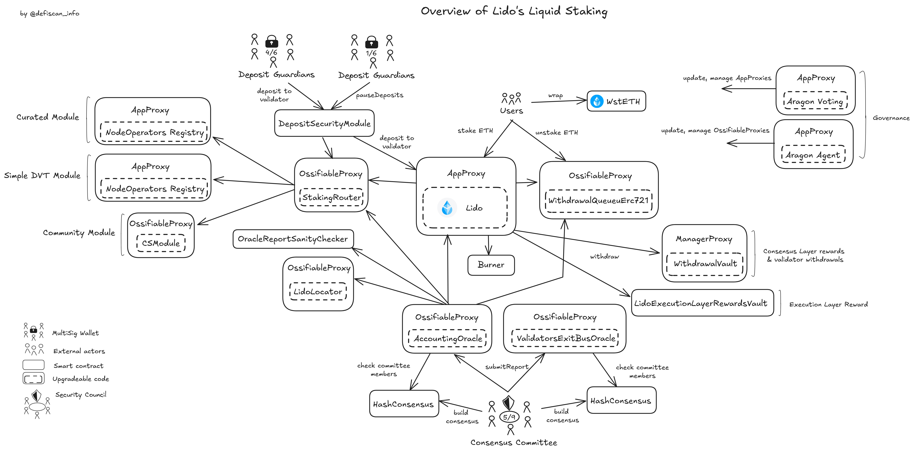
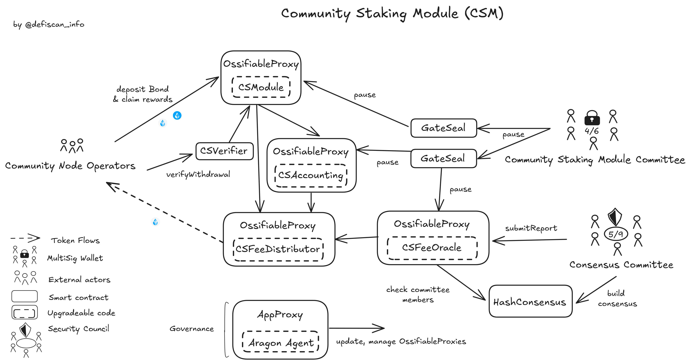
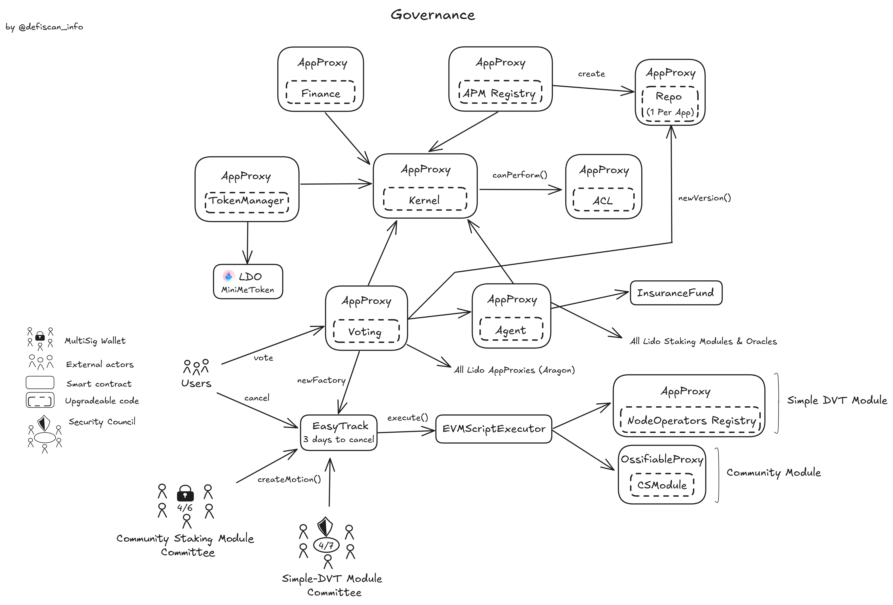

# Summary

_Lido V2_ is a liquid-staking protocol. Liquid staking allows users to deposit `ETH` for staking to a set
of _Node Operators_ who run validators with `ETH` staked in Lido. In exchange for depositing `ETH` users get `stETH`, _Liquid staked Ether_, a token issued by Lido which represents the staked `ETH`. This token can then be used throughout DeFi in other protocols, for example, as collateral. Lido takes a 10% fee on the yield, split between the _Lido Treasury_ and _Node Operators_.

_Lido V2_ uses a system of _Staking Modules_ as explained in the [Protocol Analysis](#protocol-analysis). Each _Staking Module_ has its own set of _Node Operators_, incentive mechanisms, and potential penalties. Currently three modules exist: the _Curated_, _Simple-DVT_, and _Community_ staking modules. Validators in the first two have to be approved by _Lido Governance_, whereas anyone can become a _Node Operator_ for the _Community Staking Module_ by depositing a bond.

# Ratings

## Chain

Lido is currently deployed on multiple chains. This review focuses on the Ethereum mainnet deployment.

> Chain score: Low

## Upgradeability

Most contracts in the Lido protocol can be upgraded. In particular, this includes the deposit, withdrawal and rewards contracts through which `ETH` deposits and withdrawals are processed and staking yield is distributed. Upgrading those contracts can lead to the _loss of funds_ or _unclaimed yield_ for Lido users.

The staking module contracts `NodeOperatorsRegistry` and `CSModule` are also upgradeable. Those contracts are responsible for tracking the _Node Operators_. Upgrading these contracts may lead to the _loss of funds_ for _Node Operators_ or users (to the benefit of _Node Operators_).

Furthermore, the governance contracts `Voting` and `Agent` can also be upgraded, with the potential impact of replacing the current implementation of the _Lido Governance_ permissions and processes.

Finally, the [Consensus Committee](#security-council) is in control of reporting on the state of the beacon chain through the `AccountingOracle` and `ExitBusOracle` contracts. If compromised, it could manipulate the `stETH` supply through false data reporting, leading to inflation or deflation of `stETH`. Similarly, the guardians of the [Deposit Security Module](#security-council) control the creation of new Lido validators and, if colluding with _Node Operators_, could enable theft of deposited `ETH`. Both these centralization vectors can thus result in the _loss of funds_ for users.

> Upgradeability score: High

## Autonomy

Lido relies on _Node Operators_ to operate the validators. As explained in the [protocol analysis](#protocol-analysis), users' staked funds are not in control by the _Node Operators_. This is because Lido enforces that these funds can only be withdrawn to a fixed withdrawal account, that is controlled by the Lido protocol. Nonetheless, the _Node Operators_ may misbehave and lose funds due to slashing. In addition to that, _Node Operators_ could steal parts of the earned staking yield, by redirecting them to their own address. In the worst case, a validator can lose up to 16 `ETH` to slashing events before it is forcefully exited and the remaining `ETH` withdrawn to Lido's withdrawal account.

Lido addresses those risks differently for each staking module. In the _Curated Module_, the _Node Operators_ are trusted and approved by _Lido Governance_. Currently 36 _Node Operators_ exist which manage on average 7'779 validators each. Different diversification measures are implemented to mitigate the risk of centralized infrastructure. This is detailed on a dedicated [dashboard](https://app.hex.tech/8dedcd99-17f4-49d8-944e-4857a355b90a/app/3f7d6967-3ef6-4e69-8f7b-d02d903f045b/latest). We computed that in a worst-case scenario, the failure of a _Node Operator_ in the _Curated Module_ would impact less than 1% of the total funds staked through Lido (see more in [dependencies](#dependencies)).

In the _Community Module_, anyone can become a _Node Operator_, but needs to deposit a bond of up to 2.4 `ETH` for the first validator or 1.3 `ETH` for all additional validators. Funds lost by the _Node Operators_ in the _Community Module_, eg due to slashing or theft of staking yield, are compensated through this bond and additional penalties for the _Node Operators_ applied on top. Currently 312 _Node Operators_ are active in the _Community Module_ with an average of 19 validators operated by each. Additional losses, that exceed the _Node Operator's_ deposited bond, are covered by the _Lido Treasury_.

> Autonomy score: Low

## Exit Window

_Lido Governance_ is an onchain governance system that allows `LDO` holders to vote on contract upgrades and other governance matters. The voting period lasts 5 days, only the first 3 of which can be used to approve a proposal, with 2 additional days to object to an accepted proposal. No _Exit Window_ is enforced once the voting period has ended.

A system of `Easytrack` is in place for a set of pre-approved actions to be executed without requiring a quorum. Actions in the `Easytrack` contract have a 3-day delay which can be vetoed with more than 0.5% of the voting power. Different multisigs can create `Easytrack` actions which may make treasury payments, control the _Simple-DVT Module_, or settle penalties in the _Community Module_. The [Simple-DVT Module Committee](#security-council) has the permission to create `Easytrack` actions for the _Simple-DVT Module_, these actions include the approval of new _Node Operators_ on the _Simple-DVT Module_ and thus potentially impact user funds. The [Simple-DVT Module Committee](#security-council) complies with the _Security Council_ requirements, thus mitigating the respective risks. The `Easytrack` can be paused by the [Emergency Brakes](#security-council) multisig or by _Lido Governance_.

Finally, multiple _Emergency Actions_ exist which can be initiated by different Lido multisig accounts. Any signer in the `DepositSecurityModule` can trigger the pause of all deposits without delay. In addition to that, the _Community Staking Module_ can be completely paused by the [Community Staking Module Committee](#security-council), this includes the registering of new _Node Operators_ and claiming rewards.

> Exit Window score: High

## Accessibility

Lido has a main frontend at [stake.lido.fi](https://stake.lido.fi). The different releases of this frontend are published on IPFS and instructions to access the latest release using an IPFS gateway of choice are available on the public [docs](https://docs.lido.fi/ipfs/about).

In addition to that, multiple third-party frontends, applications and wallets, such as Metamask, Argent, and Infinex, exist and enable direct access to the Lido protocol. In fact, Lido offers a public library of [UI integration elements](https://ui.lido.fi/) that enables third parties to seamlessly build more frontends to Lido.

> Accessibility score: Low

## Conclusion

Lido receives a _High Centralization_ score in terms of _Upgradeability_ and _Exit Window_. This is due to its contracts allowing for critical upgrades that are not protected with a sufficient _Exit Window_. Furthermore, its [DepositSecurityModule](#security-council) multisig exposes critical permissions without meeting the Security Council requirements. For these reasons, Lido achieves **Stage 0**.

Lido could reach _Stage 1_ by enforcing a _7-day Exit Window_ to the critical smart contract upgrades or any action that may result in the _loss of user funds_ or adopting a _Security Council_ to safeguard those actions. It would also need to update the [DepositSecurityModule](#security-council) to a _Security Council_.

Lido could reach _Stage 2_ by implementing a 30-day _Exit Window_ and replacing the [Consensus Committee](#security-council) and [DepositSecurityModule](#security-council) through sufficiently decentralizated solutions.

> Overall score: Stage 0

# Reviewer Notes

⚠️ Lido has different treasury management multisigs all listed [here](https://docs.lido.fi/multisigs/committees). For practical reasons and readability, our [securty council](#security-council) section only lists the most important committees and multisigs.

# Protocol Analysis

## Liquid Stakings

An overview of Lido's liquid staking protocol can be seen below.

Users can stake their `ETH` with Lido through the `Lido` contract and obtain `stETH` in return. Users can then redeem their `stETH` for `ETH` by entering a withdrawal queue in interacting directly with the `WithdrawalQueueuErc721`. The deposits and withdrawals may balance each other, but when excess `ETH` is deposited or more `stETH` is redeemed, Ethereum validators operated by different _Node Operators_ are created or asked to exit.

A [Consensus Committee](#security-council) is trusted to report the relevant state of the consensus layer onchain. The report includes information on the number of Lido validators on the consensus layer, their cumulative balance, exited validators, the balance of the rewards and withdrawal vaults, and the simulated share rate (total `ETH` per share emitted). This information is then processed and transmitted to other Lido contracts. It will influence how shares are rebased and whether validators may be created or asked to exit in future slots. The report of wrong data could therefore lead to the _loss of unclaimed yield_ or _loss of user funds_. This makes the [Consensus Committee](#security-council) a critical dependency.

The governance contract `Voting` and its `Agent` have managing rights on all apps and ossifiable proxies respectively. This includes contract upgrades.

### Validator creation

When enough `ETH` is deposited into the contract, the `StakingRouter` chooses a pair of validator keys from either the _Curated_, _Simple-DVT_, or _Community_ staking modules to assign funds to, following a specific algorithm and the governance chosen allocation. An offchain set of 6 guardians form the `DepositSecurityModule`. They coordinate to sign the Merkle root of the deposit contract and trigger the deposit of 32 `ETH` for the chosen validator keys. The guardians have been introduced to counter a [frontrunning vulnerability from validators](https://research.lido.fi/t/mitigations-for-deposit-front-running-vulnerability/1239) and ensure the validators' withdrawal address is the Lido `WithdrawalsManagerProxy`.

### Validator exit

Validators may be asked to exit to provide `ETH` to the withdrawal queue. The signal to exit will be sent during one of the oracle reports, the oracles should then withdraw all 32 `ETH` staked. Those funds are sent automatically to the `WithdrawalsManagerProxy`. If validators are not exited they are declared _stuck_ and the _Node Operators_ will be penalized.

### Staking Rewards

Validator rewards come from two sources: the consensus and execution layers. The consensus layer rewards come from the validators' participation in the consensus and are automatically distributed to the validators' withdrawal address. This address has to be the same for all Lido validators and is set to the `WithdrawalsManagerProxy`. Execution layer rewards include MEV and are not fixed. The _Node Operators_ are trusted to send those rewards to the `LidoExecutionLayerRewardsVault`and are penalized if they fail to do so.

Both types of rewards are combined and distributed to all `stETH` holders after a 10% fee split between the treasury and the staking modules (_Node Operators_). The specific fee allocation between treasury and module differs for each staking module.

## Staking Modules

Lido allocates funds to different staking modules that handle their own set of _Node Operators_ and incentive mechanisms. Each new module is approved through governance proposals and 3 modules are currently deployed: the _Curated_, _Simple-DVT_, and _Community_ staking modules. We detail each of those below.

### Curated and Simple-DVT Staking Modules

The _Curated Module_ is the original staking module for Lido. It is made of professional _Node Operators_ who have been approved by the governance. At the time of writing more than 95% of Lido validators are operated by the _Curated_ staking module.

The _Simple-DVT Module_ is an experimenting module to develop _Distributed Validator Technologies_ and operates with implementations from both [Obol](https://obol.tech/) and [SSV Network](https://ssv.network/). New _Node Operators_ are approved by governance through the `Easytrack` process, which is explained in the [Governance section](#governance).

Both of those modules are represented onchain by the contracts using the same implementation of the `NodeOperatorsRegistry` which simply stores information on the registered _Node Operators_, their validator keys, and potential penalties. The _Curated_ module's registry is solely managed by the governance's `Agent`, while the _Simple-DVT_ can additionally be managed through [Easytrack](#governance) by the [Simple-DVT Module Committee](#security-council), but upgraded by the `Agent` only.

### Community Staking Module

An overview of the _Community Staking Module_ can be seen below.

The _Community Staking Module_ (CSM) is a permissionless module. _Node Operators_ can register themselves into the module by paying a bond per pair of validator keys added. _Node Operators_ interact with the `CSModule` contract which deposits data and interacts with the `StakingRouter`. An additional `CSAccounting` is responsible for the management of bonds, rewards, and penalties. The bonding curve used to determine bond prices can also be updated through this contract. The `CSEarlyAdoption` contract keeps track of early adopters who have lower bond prices.

Finally, `CSFeeDistributor` handles the distribution of rewards to _Node Operators_. It receives the non-distributed rewards from the `CSModule` every time the `StakingRouter` mints additional _Node Operator_ rewards. It accepts calls from `CSAccounting` with reward claims and stores the balances of claims from each _Node Operator_ as well as the late Merkle proof of the rewards distribution Merkle tree. It receives this root from the [Consensus Committee](#security-council) through the `CSOracle`.

Those contracts are upgradeable by the governance through the `Agent` contract. The `Agent` also holds the right to change the exit charge, which could abuse the _Node Operators_' deposited bonds. The [Community Staking Module Committee](#security-council) can also report reward stealing from _Node Operators_ in order to penalize them. The committee may also pause the staking module at any time, prohibiting _Node Operators_ from claiming their rewards until it is resumed by the governance.

# Dependencies

Lido relies on _Node Operators_ to operate the validators. The funds are not in the control of the _Node Operators_ and will be returned to Lido in case of withdrawal. Nonetheless, the _Node Operators_ may misbehave and lose some of the funds due to slashing.

Lido addresses this issue differently for each staking module. This is explained in the respective staking modules' subsections of the [protocol analysis](#protocol-analysis).

We focus the analysis on the _Curated Node Operators_ since they operate 94% of the Lido validators and have the most centralization. The _Curated Node Operators_ have different diversification measures to mitigate the risk of bugs or infrastructure failures. This is detailed on a dedicated [dashboard](https://app.hex.tech/8dedcd99-17f4-49d8-944e-4857a355b90a/app/3f7d6967-3ef6-4e69-8f7b-d02d903f045b/latest). In the worst case of a _Curated Node Operator_ getting slashed on all his validators, this would result in a loss of 1.8 ETH per validator, assuming a non-Ethereum-wide adversarial coordination. On the other hand, if all validators of a given _Curated Node Operator_ go down and all keys are lost due to infrastructure issues, those validators would lose 15.8% of their funds annually due to inactivity penalties down to 16.75 ETH (as detailed in [[1](https://ethereum.stackexchange.com/questions/82067/is-there-a-penalty-for-having-a-eth-2-0-staking-node-go-down)], [[2](https://eth2book.info/latest/part2/incentives/inactivity/#:~:text=The%20inactivity%20penalty%20is%20applied,this%20is%20a%20no%2Dop.)]), assuming no ["non-activity" leak phase](https://eth2book.info/latest/part2/incentives/inactivity/#:~:text=The%20inactivity%20penalty%20is%20applied,this%20is%20a%20no%2Dop.). Once it reaches 16.75 ETH the remaining balance is automatically withdrawn. In such instance and taking the current Lido statistics, 2.65% of the funds would become inaccessible, with 1.26% being definitely lost overtime and the remaining being frozen for a long period.

In both cases, this would impact less than 3% of the funds locked in the Lido protocol.

The operators in the _Simple-DVT_ and _Community_ modules represent the same risk of potential losses per validator, but those are less impactful due to; a greater diversification of _Node Operators_ in the case of the the _Simple-DVT_ module, and the security bond deposited by operators in the _Community_ module.

# Governance

Lido uses _Aragon_ for its governance model. _Aragon_ has _Apps_ which are referred to by namespace and app ID. The `Kernel` app is the core contract in the _Aragon_ framework. It acts as both a registry for applications and the central permissions management reference. The `Kernel` forwards all permission checks to the `ACL` which stores all the access control conditions for _Lido Aragon Apps_ All the _Aragon Apps_ currently used for the _Lido Governance_ are upgradeable.

The `Voting` app is the main governance entry point in which users can vote and create proposals. Proposals that interact with _Aragon Apps_ (`AppProxy` contracts) are executed through `Voting` while proposals interacting with other contracts such as `OssifiableProxy` are executed through the `Agent`.

The `TokenManager` is an Aragon application that manages the `LDO` governance token, providing functionality for token distribution, vesting, and control. The `Finance` contract serves as a financial controller. It manages treasury funds through a Vault and handles recurring as well as one-time payments.

An `Easytrack` handles a set of pre-approved governance operations that can be executed after a waiting period if there is no governance objection. The _Factories_ through which operations can be created are created by the governance and only a _trusted caller_ can create the operations. For operations on the _Simple-DVT_ and _Community_ modules, only their respective [committees](#security-council) can create motions. Once a motion is created it can be cancelled by 0.5% of the voting power during the 3-day delay. In addition to managing the staking modules, the `EasyTrack` is also used for treasury payments through the `Finance` contract. A variety of multisigs is allowed to make different payments through the `EasyTrack`, the complete list is
documented by Lido [here](https://docs.lido.fi/multisigs/committees#21-lego-committee).

## Exit Window

The voting period on _Lido Governance_ proposals is made of 5 days, only the first 3 of which can be used to approve a proposal, with 2 additional days to object to an accepted proposal. Once the voting period ends there are no delays before the proposal can be executed. Anyone can create a proposal, but it is only valid if at least 5% of the total `LDO` tokens are used to vote for one of the options. The proposal passes if more than 50% of the votes are in favor.

## Security Council

This table shows the external permission owners and how they are rated against the security council criteria.

| Name                                | Account                                                                                                               | Type         | ≥ 7 signers | ≥ 51% threshold | ≥ 50% non-insider | Signers public                                                                          |
| ----------------------------------- | --------------------------------------------------------------------------------------------------------------------- | ------------ | ----------- | --------------- | ----------------- | --------------------------------------------------------------------------------------- |
| Consensus Committee (HashConsensus) | [0x98be4a407Bff0c125e25fBE9Eb1165504349c37d](https://etherscan.io/address/0x98be4a407Bff0c125e25fBE9Eb1165504349c37d) | Multisig 5/9 | ✅          | ✅              | ✅                | ✅ ([source](https://docs.lido.fi/guides/oracle-operator-manual#committee-membership))  |
| Relay Maintenance Committee         | [0x98be4a407Bff0c125e25fBE9Eb1165504349c37d](https://etherscan.io/address/0x98be4a407Bff0c125e25fBE9Eb1165504349c37d) | Multisig 5/7 | ✅          | ✅              | ❌                | ✅ ([source](https://docs.lido.fi/multisigs/committees#23-relay-maintenance-committee)) |
| DepositSecurityModule (Guardians)   | [0xfFA96D84dEF2EA035c7AB153D8B991128e3d72fD](https://etherscan.io/address/0xfFA96D84dEF2EA035c7AB153D8B991128e3d72fD) | Multisig 4/6 | ❌          | ✅              | ❌                | ❌                                                                                      |
| EmergencyBrakes                     | [0x73b047fe6337183A454c5217241D780a932777bD](https://etherscan.io/address/0x73b047fe6337183A454c5217241D780a932777bD) | Multisig 3/5 | ❌          | ✅              | ❌                | ✅                                                                                      |
| Community Staking Module Committee  | [0xc52fc3081123073078698f1eac2f1dc7bd71880f](https://etherscan.io/address/0xc52fc3081123073078698f1eac2f1dc7bd71880f) | Multisig 4/6 | ❌          | ✅              | ✅                | ✅ ([source](https://research.lido.fi/t/community-staking-module-committee/8333))       |
| Simple-DVT Module Committee         | [0xc52fc3081123073078698f1eac2f1dc7bd71880f](https://etherscan.io/address/0xc52fc3081123073078698f1eac2f1dc7bd71880f) | Multisig 4/7 | ✅          | ✅              | ✅                | ✅ ([source](https://research.lido.fi/t/simple-dvt-module-committee-multisig/6520))     |

Most Lido multisigs, as well as treasury management multisigs, are listed in the Lido docs with their corresponding capabilities [here](https://docs.lido.fi/multisigs/committees).

# Contracts & Permissions

## Contracts

| Contract Name                                    | Address                                                                                                               |
| ------------------------------------------------ | --------------------------------------------------------------------------------------------------------------------- |
| LidoLocator (Proxy)                              | [0xC1d0b3DE6792Bf6b4b37EccdcC24e45978Cfd2Eb](https://etherscan.io/address/0xC1d0b3DE6792Bf6b4b37EccdcC24e45978Cfd2Eb) |
| LidoLocator (Implementation)                     | [0x3abc4764f0237923d52056cfba7e9aebf87113d3](https://etherscan.io/address/0x3abc4764f0237923d52056cfba7e9aebf87113d3) |
| Lido (Proxy)                                     | [0xae7ab96520DE3A18E5e111B5EaAb095312D7fE84](https://etherscan.io/address/0xae7ab96520DE3A18E5e111B5EaAb095312D7fE84) |
| Lido (Implementation)                            | [0x17144556fd3424edc8fc8a4c940b2d04936d17eb](https://etherscan.io/address/0x17144556fd3424edc8fc8a4c940b2d04936d17eb) |
| WstETH                                           | [0x7f39C581F595B53c5cb19bD0b3f8dA6c935E2Ca0](https://etherscan.io/address/0x7f39C581F595B53c5cb19bD0b3f8dA6c935E2Ca0) |
| EIP712StETH                                      | [0x8F73e4C2A6D852bb4ab2A45E6a9CF5715b3228B7](https://etherscan.io/address/0x8F73e4C2A6D852bb4ab2A45E6a9CF5715b3228B7) |
| StakingRouter (Proxy)                            | [0xFdDf38947aFB03C621C71b06C9C70bce73f12999](https://etherscan.io/address/0xFdDf38947aFB03C621C71b06C9C70bce73f12999) |
| StakingRouter (Implementation)                   | [0x89eDa99C0551d4320b56F82DDE8dF2f8D2eF81aA](https://etherscan.io/address/0x89eDa99C0551d4320b56F82DDE8dF2f8D2eF81aA) |
| DepositSecurityModule                            | [0xfFA96D84dEF2EA035c7AB153D8B991128e3d72fD](https://etherscan.io/address/0xfFA96D84dEF2EA035c7AB153D8B991128e3d72fD) |
| LidoExecutionLayerRewardsVault                   | [0x388C818CA8B9251b393131C08a736A67ccB19297](https://etherscan.io/address/0x388C818CA8B9251b393131C08a736A67ccB19297) |
| WithdrawalQueueERC721 (Proxy)                    | [0x889edC2eDab5f40e902b864aD4d7AdE8E412F9B1](https://etherscan.io/address/0x889edC2eDab5f40e902b864aD4d7AdE8E412F9B1) |
| WithdrawalQueueERC721 (Implementation)           | [0xE42C659Dc09109566720EA8b2De186c2Be7D94D9](https://etherscan.io/address/0xE42C659Dc09109566720EA8b2De186c2Be7D94D9) |
| WithdrawalsManagerProxy                          | [0xB9D7934878B5FB9610B3fE8A5e441e8fad7E293f](https://etherscan.io/address/0xB9D7934878B5FB9610B3fE8A5e441e8fad7E293f) |
| WithdrawalVault                                  | [0xCC52f17756C04bBa7E377716d7062fC36D7f69Fd](https://etherscan.io/address/0xCC52f17756C04bBa7E377716d7062fC36D7f69Fd) |
| Burner                                           | [0xD15a672319Cf0352560eE76d9e89eAB0889046D3](https://etherscan.io/address/0xD15a672319Cf0352560eE76d9e89eAB0889046D3) |
| MinFirstAllocationStrategy                       | [0x7e70De6D1877B3711b2bEDa7BA00013C7142d993](https://etherscan.io/address/0x7e70De6D1877B3711b2bEDa7BA00013C7142d993) |
| LDO (MiniMeToken)                                | [0x5A98FcBEA516Cf06857215779Fd812CA3beF1B32](https://etherscan.io/address/0x5A98FcBEA516Cf06857215779Fd812CA3beF1B32) |
| InsuranceFund                                    | [0x8B3f33234ABD88493c0Cd28De33D583B70beDe35](https://etherscan.io/address/0x8B3f33234ABD88493c0Cd28De33D583B70beDe35) |
| EVMScriptExecutor                                | [0xFE5986E06210aC1eCC1aDCafc0cc7f8D63B3F977](https://etherscan.io/address/0xFE5986E06210aC1eCC1aDCafc0cc7f8D63B3F977) |
| EasyTrack                                        | [0xF0211b7660680B49De1A7E9f25C65660F0a13Fea](https://etherscan.io/address/0xF0211b7660680B49De1A7E9f25C65660F0a13Fea) |
| HashConsensus (AccountingOracle)                 | [0xD624B08C83bAECF0807Dd2c6880C3154a5F0B288](https://etherscan.io/address/0xD624B08C83bAECF0807Dd2c6880C3154a5F0B288) |
| Agent (Governance)                               | [0x3e40D73EB977Dc6a537aF587D48316feE66E9C8c](https://etherscan.io/address/0x3e40D73EB977Dc6a537aF587D48316feE66E9C8c) |
| Voting (Governance)                              | [0x2e59A20f205bB85a89C53f1936454680651E618e](https://etherscan.io/address/0x2e59A20f205bB85a89C53f1936454680651E618e) |
| Finance (proxy)                                  | [0xB9E5CBB9CA5b0d659238807E84D0176930753d86](https://etherscan.io/address/0xB9E5CBB9CA5b0d659238807E84D0176930753d86) |
| Kernel (proxy)                                   | [0xb8FFC3Cd6e7Cf5a098A1c92F48009765B24088Dc](https://etherscan.io/address/0xb8FFC3Cd6e7Cf5a098A1c92F48009765B24088Dc) |
| TokenManager (proxy)                             | [0xf73a1260d222f447210581DDf212D915c09a3249](https://etherscan.io/address/0xf73a1260d222f447210581DDf212D915c09a3249) |
| ACL (proxy)                                      | [0x9895f0f17cc1d1891b6f18ee0b483b6f221b37bb](https://etherscan.io/address/0x9895f0f17cc1d1891b6f18ee0b483b6f221b37bb) |
| APMRegistry (proxy)                              | [0x0cb113890b04b49455dfe06554e2d784598a29c9](https://etherscan.io/address/0x0cb113890b04b49455dfe06554e2d784598a29c9) |
| HashConsensus (ExitBusOracle)                    | [0x7FaDB6358950c5fAA66Cb5EB8eE5147De3df355a](https://etherscan.io/address/0x7FaDB6358950c5fAA66Cb5EB8eE5147De3df355a) |
| ValidatorsExitBusOracle (Proxy)                  | [0x0De4Ea0184c2ad0BacA7183356Aea5B8d5Bf5c6e](https://etherscan.io/address/0x0De4Ea0184c2ad0BacA7183356Aea5B8d5Bf5c6e) |
| AccountingOracle (Proxy)                         | [0x852deD011285fe67063a08005c71a85690503Cee](https://etherscan.io/address/0x852deD011285fe67063a08005c71a85690503Cee) |
| MEV Boost Relay Allowed List                     | [0xF95f069F9AD107938F6ba802a3da87892298610E](https://etherscan.io/address/0xF95f069F9AD107938F6ba802a3da87892298610E) |
| GateSeal                                         | [0xEe06EA501f7d9DC6F4200385A8D910182D155d3e](https://etherscan.io/address/0xEe06EA501f7d9DC6F4200385A8D910182D155d3e) |
| GateSeal                                         | [0xf9C9fDB4A5D2AA1D836D5370AB9b28BC1847e178](https://etherscan.io/address/0xf9C9fDB4A5D2AA1D836D5370AB9b28BC1847e178) |
| GateSeal Factory                                 | [0x6c82877cac5a7a739f16ca0a89c0a328b8764a24](https://etherscan.io/address/0x6c82877cac5a7a739f16ca0a89c0a328b8764a24) |
| Node Operators Registry (Proxy) (Curated Module) | [0x55032650b14df07b85bF18A3a3eC8E0Af2e028d5](https://etherscan.io/address/0x55032650b14df07b85bF18A3a3eC8E0Af2e028d5) |
| Node Operators Registry (Proxy) (DVT Module)     | [0xaE7B191A31f627b4eB1d4DaC64eaB9976995b433](https://etherscan.io/address/0xaE7B191A31f627b4eB1d4DaC64eaB9976995b433) |
| NodeOperatorsRegistry (Implementation)           | [0x1770044a38402e3cfca2fcfa0c84a093c9b42135](https://etherscan.io/address/0x1770044a38402e3cfca2fcfa0c84a093c9b42135) |
| CSModule (Proxy)                                 | [0xdA7dE2ECdDfccC6c3AF10108Db212ACBBf9EA83F](https://etherscan.io/address/0xdA7dE2ECdDfccC6c3AF10108Db212ACBBf9EA83F) |
| CSModule (Implementation)                        | [0x8daea53b17a629918cdfab785c5c74077c1d895b](https://etherscan.io/address/0x8daea53b17a629918cdfab785c5c74077c1d895b) |
| CSAccounting (Proxy)                             | [0x4d72BFF1BeaC69925F8Bd12526a39BAAb069e5Da](https://etherscan.io/address/0x4d72BFF1BeaC69925F8Bd12526a39BAAb069e5Da) |
| CSAccounting (Implementation)                    | [0x71FCD2a6F38B644641B0F46c345Ea03Daabf2758](https://etherscan.io/address/0x71FCD2a6F38B644641B0F46c345Ea03Daabf2758) |
| CSFeeDistributor (Proxy)                         | [0xD99CC66fEC647E68294C6477B40fC7E0F6F618D0](https://etherscan.io/address/0xD99CC66fEC647E68294C6477B40fC7E0F6F618D0) |
| CSFeeDistributor (Implementation)                | [0x17Fc610ecbbAc3f99751b3B2aAc1bA2b22E444f0](https://etherscan.io/address/0x17Fc610ecbbAc3f99751b3B2aAc1bA2b22E444f0) |
| CSVerifier                                       | [0x0c345dFa318f9F4977cdd4f33d80F9D0ffA38e8B](https://etherscan.io/address/0x0c345dFa318f9F4977cdd4f33d80F9D0ffA38e8B) |
| CSEarlyAdoption                                  | [0x3D5148ad93e2ae5DedD1f7A8B3C19E7F67F90c0E](https://etherscan.io/address/0x3D5148ad93e2ae5DedD1f7A8B3C19E7F67F90c0E) |
| CSFeeOracle (Proxy)                              | [0x4D4074628678Bd302921c20573EEa1ed38DdF7FB](https://etherscan.io/address/0x4D4074628678Bd302921c20573EEa1ed38DdF7FB) |
| CSFeeOracle (Implementation)                     | [0x919ac5C6c62B6ef7B05cF05070080525a7B0381E](https://etherscan.io/address/0x919ac5C6c62B6ef7B05cF05070080525a7B0381E) |
| HashConsensus (CSFeeOracle)                      | [0x71093efF8D8599b5fA340D665Ad60fA7C80688e4](https://etherscan.io/address/0x71093efF8D8599b5fA340D665Ad60fA7C80688e4) |
| GateSeal (CSModule) (CSM Committee)              | [0x5cfca30450b1e5548f140c24a47e36c10ce306f0](https://etherscan.io/address/0x5cfca30450b1e5548f140c24a47e36c10ce306f0) |
| GateSeal (CSAccounting) (CSM Committee)          | [0x16Dbd4B85a448bE564f1742d5c8cCdD2bB3185D0](https://etherscan.io/address/0x16Dbd4B85a448bE564f1742d5c8cCdD2bB3185D0) |

## All Permission Owners

| Entity Name                             | Address                                                                                                               | Type         |
| --------------------------------------- | --------------------------------------------------------------------------------------------------------------------- | ------------ |
| Lido (Proxy)                            | [0xae7ab96520DE3A18E5e111B5EaAb095312D7fE84](https://etherscan.io/address/0xae7ab96520DE3A18E5e111B5EaAb095312D7fE84) | Contract     |
| Agent (Governance)                      | [0x3e40D73EB977Dc6a537aF587D48316feE66E9C8c](https://etherscan.io/address/0x3e40D73EB977Dc6a537aF587D48316feE66E9C8c) | Contract     |
| Voting (Governance)                     | [0x2e59A20f205bB85a89C53f1936454680651E618e](https://etherscan.io/address/0x2e59A20f205bB85a89C53f1936454680651E618e) | Contract     |
| Finance (proxy)                         | [0xB9E5CBB9CA5b0d659238807E84D0176930753d86](https://etherscan.io/address/0xB9E5CBB9CA5b0d659238807E84D0176930753d86) | Contract     |
| MEV Boost Relay Allowed List            | [0xF95f069F9AD107938F6ba802a3da87892298610E](https://etherscan.io/address/0xF95f069F9AD107938F6ba802a3da87892298610E) | Contract     |
| AccountingOracle (Proxy)                | [0x852deD011285fe67063a08005c71a85690503Cee](https://etherscan.io/address/0x852deD011285fe67063a08005c71a85690503Cee) | Contract     |
| EmergencyBrakes                         | [0x73b047fe6337183A454c5217241D780a932777bD](https://etherscan.io/address/0x73b047fe6337183A454c5217241D780a932777bD) | Contract     |
| EVMScriptExecutor                       | [0xFE5986E06210aC1eCC1aDCafc0cc7f8D63B3F977](https://etherscan.io/address/0xFE5986E06210aC1eCC1aDCafc0cc7f8D63B3F977) | Contract     |
| EasyTrack                               | [0xF0211b7660680B49De1A7E9f25C65660F0a13Fea](https://etherscan.io/address/0xF0211b7660680B49De1A7E9f25C65660F0a13Fea) | Contract     |
| HashConsensus                           | [0xD624B08C83bAECF0807Dd2c6880C3154a5F0B288](https://etherscan.io/address/0xD624B08C83bAECF0807Dd2c6880C3154a5F0B288) | Contract     |
| WithdrawalsManagerProxy                 | [0xB9D7934878B5FB9610B3fE8A5e441e8fad7E293f](https://etherscan.io/address/0xB9D7934878B5FB9610B3fE8A5e441e8fad7E293f) | Contract     |
| LidoExecutionLayerRewardsVault          | [0x388C818CA8B9251b393131C08a736A67ccB19297](https://etherscan.io/address/0x388C818CA8B9251b393131C08a736A67ccB19297) | Contract     |
| CSVerifier                              | [0x3dfc50f22aca652a0a6f28a0f892ab62074b5583](https://etherscan.io/address/0x3dfc50f22aca652a0a6f28a0f892ab62074b5583) | Contract     |
| CSFeeOracle (Proxy)                     | [0x4D4074628678Bd302921c20573EEa1ed38DdF7FB](https://etherscan.io/address/0x4D4074628678Bd302921c20573EEa1ed38DdF7FB) | Contract     |
| CSFeeDistributor (Proxy)                | [0xD99CC66fEC647E68294C6477B40fC7E0F6F618D0](https://etherscan.io/address/0xD99CC66fEC647E68294C6477B40fC7E0F6F618D0) | Contract     |
| CSAccounting (Proxy)                    | [0x4d72BFF1BeaC69925F8Bd12526a39BAAb069e5Da](https://etherscan.io/address/0x4d72BFF1BeaC69925F8Bd12526a39BAAb069e5Da) | Contract     |
| CSModule (Proxy)                        | [0xdA7dE2ECdDfccC6c3AF10108Db212ACBBf9EA83F](https://etherscan.io/address/0xdA7dE2ECdDfccC6c3AF10108Db212ACBBf9EA83F) | Contract     |
| Relay Maintenance Committee             | [0x98be4a407Bff0c125e25fBE9Eb1165504349c37d](https://etherscan.io/address/0x98be4a407Bff0c125e25fBE9Eb1165504349c37d) | Multisig     |
| DepositSecurityModule (Guardians)       | [0xfFA96D84dEF2EA035c7AB153D8B991128e3d72fD](https://etherscan.io/address/0xfFA96D84dEF2EA035c7AB153D8B991128e3d72fD) | Multisig     |
| Community Staking Module Committee      | [0xc52fc3081123073078698f1eac2f1dc7bd71880f](https://etherscan.io/address/0xc52fc3081123073078698f1eac2f1dc7bd71880f) | Multisig 4/6 |
| GateSeal (CSModule) (CSM Committee)     | [0x5cfca30450b1e5548f140c24a47e36c10ce306f0](https://etherscan.io/address/0x5cfca30450b1e5548f140c24a47e36c10ce306f0) | Multisig 4/6 |
| GateSeal (CSAccounting) (CSM Committee) | [0x16Dbd4B85a448bE564f1742d5c8cCdD2bB3185D0](https://etherscan.io/address/0x16Dbd4B85a448bE564f1742d5c8cCdD2bB3185D0) | Multisig 4/6 |

## Permissions

| Contract                                  | Function                                               | Impact                                                                                                                                                                                                                                                                                                                                                                                                                                                                                                                                                                                                         | Owner                                                                                        |
| ----------------------------------------- | ------------------------------------------------------ | -------------------------------------------------------------------------------------------------------------------------------------------------------------------------------------------------------------------------------------------------------------------------------------------------------------------------------------------------------------------------------------------------------------------------------------------------------------------------------------------------------------------------------------------------------------------------------------------------------------- | -------------------------------------------------------------------------------------------- |
| Lido                                      | stop                                                   | Stops all staking similarly to `pauseStaking`, and prevents transfer of `stETH` as well as beacone chain oracle submissions. This is a critical emergency function that completely halts the users' ability to enter and exit the system.                                                                                                                                                                                                                                                                                                                                                                      | Voting                                                                                       |
| Lido                                      | resume                                                 | Resumes all operations paused after `stop` was called.                                                                                                                                                                                                                                                                                                                                                                                                                                                                                                                                                         | Voting                                                                                       |
| Lido                                      | pauseStaking                                           | Stops accepting new ETH deposits to the protocol. This ensures new funds do not enter the system without affecting other operations.                                                                                                                                                                                                                                                                                                                                                                                                                                                                           | Voting                                                                                       |
| Lido                                      | resumeStaking                                          | Re-enables staking of new ETH into the contract.                                                                                                                                                                                                                                                                                                                                                                                                                                                                                                                                                               | Voting                                                                                       |
| Lido                                      | setStakingLimit                                        | Limits the rate and total stake of ETH allows into the contract. This is done by imposing a maximum stake limit and a rate of increase per block. This will prevent users from depositing additional ETH if the limit is reached.                                                                                                                                                                                                                                                                                                                                                                              | Voting                                                                                       |
| Lido                                      | removeStakingLimit                                     | Removes the staking limit, allowing unlimited deposits.                                                                                                                                                                                                                                                                                                                                                                                                                                                                                                                                                        | Voting                                                                                       |
| Lido                                      | receiveELRewards                                       | A function to allow the rewards vault to send rewards to this contract without them being considered user deposits.                                                                                                                                                                                                                                                                                                                                                                                                                                                                                            | getLidoLocator().elRewardsVault()                                                            |
| Lido                                      | receiveWithdrawals                                     | A function to allw the `WithdrawalVault` to receive funds from exited validators without them being considered user deposits.                                                                                                                                                                                                                                                                                                                                                                                                                                                                                  | WithdrawalVault                                                                              |
| Lido                                      | handleOracleReport                                     | Handles the oracle data and takes a series of actions accordingly. Actions include process withdrawals, burning shares, distribute rewards, and rebase tokens. Malicious or wrong data reporting could lead to accounting errors and potential loss of user funds and unclaimed yield.                                                                                                                                                                                                                                                                                                                         | AccountingOracle                                                                             |
| Lido                                      | unsafeChangeDepositedValidators                        | Unsafely changes the deposited validators counter. This may be used to onboard external validators to Lido. This is function could dangerously change the accounting metrics in Lido as it changes a parameter without any safeguards. Such a change could artificially inflate or deflate the value of `stETH` or manipulate the expected returns calculation.                                                                                                                                                                                                                                                | 0x0 (Managed by Voting)                                                                      |
| Lido                                      | deposit                                                | Deposits 32 ETH into the ethereum staking contract to create a new validator. This can only be called by the DepositSecurityModule which will make sure the call reverts if the state of the deposit contract has changed between the submission and execution of the deposit.                                                                                                                                                                                                                                                                                                                                 | DepositSecurityModule                                                                        |
| Lido                                      | transferToVault                                        | Default recovery function in Aragon Apps. Irreversably disabled.                                                                                                                                                                                                                                                                                                                                                                                                                                                                                                                                               | 0x0                                                                                          |
| LidoLocator (Proxy)                       | proxy\_\_ossify                                        | Ossifies the proxy. This freezes the current implementation of the `LidoLocator` and effectively makes it non-upagreable by changing the proxy admin to the zero address.                                                                                                                                                                                                                                                                                                                                                                                                                                      | Agent                                                                                        |
| LidoLocator (Proxy)                       | proxy\_\_changeAdmin                                   | Changes the proxy admin. The admin can update the entire implementation and logic of the `LidoLocator`.                                                                                                                                                                                                                                                                                                                                                                                                                                                                                                        | Agent                                                                                        |
| LidoLocator (Proxy)                       | proxy\_\_upgradeTo                                     | Upgrades the implementation of the `LidoLocator` This can change the entire logic of the contract including change ownership of funds locked in the contract, if any.                                                                                                                                                                                                                                                                                                                                                                                                                                          | Agent                                                                                        |
| LidoLocator (Proxy)                       | proxy\_\_upgradeToAndCall                              | Upgrades the implementation of the `LidoLocator` (similarly to _proxy\_\_upgradeTo _), and then calls a function in the new contract.                                                                                                                                                                                                                                                                                                                                                                                                                                                                          | Agent                                                                                        |
| StakingRouter (Proxy)                     | proxy\_\_ossify                                        | Ossifies the proxy. This freezes the current implementation of the `StakingRouter` and effectively makes it non-upagreable by changing the proxy admin to the zero address.                                                                                                                                                                                                                                                                                                                                                                                                                                    | Agent                                                                                        |
| StakingRouter (Proxy)                     | proxy\_\_changeAdmin                                   | Changes the proxy admin. The admin can update the entire implementation and logic of the `StakingRouter`.                                                                                                                                                                                                                                                                                                                                                                                                                                                                                                      | Agent                                                                                        |
| StakingRouter (Proxy)                     | proxy\_\_upgradeTo                                     | Upgrades the implementation of the `StakingRouter` This can change the entire logic of the contract including change ownership of funds locked in the contract, if any.                                                                                                                                                                                                                                                                                                                                                                                                                                        | Agent                                                                                        |
| StakingRouter (Proxy)                     | proxy\_\_upgradeToAndCall                              | Upgrades the implementation of the `StakingRouter` (similarly to _proxy\_\_upgradeTo _), and then calls a function in the new contract.                                                                                                                                                                                                                                                                                                                                                                                                                                                                        | Agent                                                                                        |
| StakingRouter (Implementation)            | addStakingModule                                       | Registers a staking module specifying a name, contract, fee settings, and limits on the shares and validators. The new module can receive ETH deposits. Adding a malicious staking modules could lead to the loss of vunds allocated to new deposits.                                                                                                                                                                                                                                                                                                                                                          | Agent                                                                                        |
| StakingRouter (Implementation)            | updateStakingModule                                    | Updates the settings of an existing Staking Module. This can change the fees or the limits set on deposits and staking shares.                                                                                                                                                                                                                                                                                                                                                                                                                                                                                 | Agent                                                                                        |
| StakingRouter (Implementation)            | updateTargetValidatorsLimits                           | Adjusts the maximum number of validators a specific node operator within a staking module can manage. This influences risk distribution within the protocol.                                                                                                                                                                                                                                                                                                                                                                                                                                                   | Agent                                                                                        |
| StakingRouter (Implementation)            | updateRefundedValidatorsCount                          | Updates the count of validators that have been refunded for a specific node operator.                                                                                                                                                                                                                                                                                                                                                                                                                                                                                                                          | Agent                                                                                        |
| StakingRouter (Implementation)            | reportRewardsMinted                                    | Reports rewards that have been minted and notifies each module of the rewards they received by calling a dedicated function in the respective module's contract.                                                                                                                                                                                                                                                                                                                                                                                                                                               | Lido (Proxy)                                                                                 |
| StakingRouter (Implementation)            | updateExitedValidatorsCountByStakingModule             | Updates the total numbers of exited validators for each module. This is used to determine and confirm the number of active validators.                                                                                                                                                                                                                                                                                                                                                                                                                                                                         | AccountingOracle                                                                             |
| StakingRouter (Implementation)            | reportStakingModuleExitedValidatorsCountByNodeOperator | For a specific staking module, reports the total number of exited validators for each node operator.                                                                                                                                                                                                                                                                                                                                                                                                                                                                                                           | AccountingOracle                                                                             |
| StakingRouter (Implementation)            | unsafeSetExitedValidatorsCount                         | Overrides the number of exited validators for a given node operator in a given staking module, without any safety check. This function cannot be called from the current AccountingOracle, but the Oracle could be upgraded to a version which can call this function if it isn't ossified.                                                                                                                                                                                                                                                                                                                    | AccountingOracle                                                                             |
| StakingRouter (Implementation)            | reportStakingModuleStuckValidatorsCountByNodeOperator  | Updates stuck validators counts per node operator for the given staking module. Stuck validators are validators who didn't comply with the exit signal and who may be penalized.                                                                                                                                                                                                                                                                                                                                                                                                                               | AccountingOracle                                                                             |
| StakingRouter (Implementation)            | onValidatorsCountsByNodeOperatorReportingFinished      | Called when the reporting of exited and stuck validators is over. This function will call the different staking modules to update their data.                                                                                                                                                                                                                                                                                                                                                                                                                                                                  | AccountingOracle                                                                             |
| StakingRouter (Implementation)            | decreaseStakingModuleVettedKeysCountByNodeOperator     | Reduces the number of validators a specific node operator can run. This doesn't affect existing validators but may prevent the node operators to create new validators if it has reached the new limit count.                                                                                                                                                                                                                                                                                                                                                                                                  | DepositSecurityModule                                                                        |
| StakingRouter (Implementation)            | setStakingModuleStatus                                 | Changes the status of a staking module. Modules may be Active, Paused, or Stopped. When Paused no more deposits can be added but the rewards are still distributed. If stopped no more deposits can be added and the rewards go to the protocol treasury instead.                                                                                                                                                                                                                                                                                                                                              | Agent                                                                                        |
| StakingRouter (Implementation)            | deposit                                                | Deposits batchs of 32 ETH to create validators in a given staking module. The staking module is specified by the Lido contract which is the only possible caller, and the underlaying staking module constract specifies the node operator public keys.                                                                                                                                                                                                                                                                                                                                                        | Lido (Proxy)                                                                                 |
| StakingRouter (Implementation)            | setWithdrawalCredentials                               | Sets the withdraw credentials of each module. The credentials are used to withdraw ETH on the Consensus Layer side. No address currently has the permission to change those credentials.                                                                                                                                                                                                                                                                                                                                                                                                                       | 0x0                                                                                          |
| StakingRouter (Implementation)            | grantRole                                              | Grants a role within the contract. Roles are used to handle the access control of all functions above. Granting a role to a malicious actor could put lead to the hijack of deposited funds.                                                                                                                                                                                                                                                                                                                                                                                                                   | Agent                                                                                        |
| StakingRouter (Implementation)            | revokeRole                                             | Revokes a role from a specific address.                                                                                                                                                                                                                                                                                                                                                                                                                                                                                                                                                                        | Agent                                                                                        |
| DepositSecurityModule                     | setOwner                                               | Sets the owner of the contract. This role is dedicated to the DAO. The owner can add new guardians, change the quorum, and unpause the deposits.                                                                                                                                                                                                                                                                                                                                                                                                                                                               | Agent                                                                                        |
| DepositSecurityModule                     | setPauseIntentValidityPeriodBlocks                     | Sets the window of validity of a pause intent. This is the reaction time allowed for guardians to pause deposits. When a guardian wants to pause deposits it specifies a block number, the pause is only applied if the current block number is within the validity period of the specified block. This is to avoid replay of pause messages.                                                                                                                                                                                                                                                                  | Agent                                                                                        |
| DepositSecurityModule                     | pauseDeposits                                          | Pauses the deposits. Funds can no longer be deposited into new validators until deposits are unpaused. This can be called by any guardian when a frontrunning by a node operator is suspected and prevents the loss of user funds through deposits.                                                                                                                                                                                                                                                                                                                                                            | DepositSecurityModule (Guardian)                                                             |
| DepositSecurityModule                     | unvetSigningKeys                                       | Unvets signing keys for the given node operators. This can be called by any guardian when a frontrunning by a node operator is suspectedand prevents the loss of user funds through deposits.                                                                                                                                                                                                                                                                                                                                                                                                                  | DepositSecurityModule (Guardian)                                                             |
| DepositSecurityModule                     | depositsBufferedETH                                    | Deposits ETH into a given validator using `Lido.deposit`. The message must include at least 4/6 signatures from guardians for it to be valid.                                                                                                                                                                                                                                                                                                                                                                                                                                                                  | DepositSecurityModule (Guardians)                                                            |
| DepositSecurityModule                     | setMaxOperatorsPerUnvetting                            | Sets a limit on how many node operators can have their vetted signing keys unvetted in one transaction, as a safeguard against drastic changes.                                                                                                                                                                                                                                                                                                                                                                                                                                                                | Agent                                                                                        |
| DepositSecurityModule                     | setGuardianQuorum                                      | Sets the quorum value. This is the minimum number of guardians that need to take part in a deposit for it to be valid.                                                                                                                                                                                                                                                                                                                                                                                                                                                                                         | Agent                                                                                        |
| DepositSecurityModule                     | addGuardian                                            | Adds a guardian and sets a new custom quorum value. Guardians co-sign deposits to reduce the risk of collusion with node operators.                                                                                                                                                                                                                                                                                                                                                                                                                                                                            | Agent                                                                                        |
| DepositSecurityModule                     | addGuardians                                           | Adds multiple guardians and sets a new custom quorum value. Guardians co-sign deposits to reduce the risk of collusion with node operators.                                                                                                                                                                                                                                                                                                                                                                                                                                                                    | Agent                                                                                        |
| DepositSecurityModule                     | removeGuardian                                         | Removes a guardian and                                                                                                                                                                                                                                                                                                                                                                                                                                                                                                                                                                                         | Agent                                                                                        |
| DepositSecurityModule                     | unpauseDeposits                                        | unpauses the deposits without delay.                                                                                                                                                                                                                                                                                                                                                                                                                                                                                                                                                                           | Agent                                                                                        |
| AccountingOracle (Proxy)                  | proxy\_\_ossify                                        | Ossifies the proxy. This freezes the current implementation of the `AccountingOracle` and effectively makes it non-upagreable by changing the proxy admin to the zero address.                                                                                                                                                                                                                                                                                                                                                                                                                                 | Agent                                                                                        |
| AccountingOracle (Proxy)                  | proxy\_\_changeAdmin                                   | Changes the proxy admin. The admin can update the entire implementation and logic of the `AccountingOracle`.                                                                                                                                                                                                                                                                                                                                                                                                                                                                                                   | Agent                                                                                        |
| AccountingOracle (Proxy)                  | proxy\_\_upgradeTo                                     | Upgrades the implementation of the `AccountingOracle` This can change the entire logic of the contract including change ownership of funds locked in the contract, if any.                                                                                                                                                                                                                                                                                                                                                                                                                                     | Agent                                                                                        |
| AccountingOracle (Proxy)                  | proxy\_\_upgradeToAndCall                              | Upgrades the implementation of the `AccountingOracle` (similarly to _proxy\_\_upgradeTo _), and then calls a function in the new contract.                                                                                                                                                                                                                                                                                                                                                                                                                                                                     | Agent                                                                                        |
| AccountingOracle (Implementation)         | submitReportData                                       | Submits a report for a given reference slot on the beacon chain. This report includes information on the number of Lido validators on the consensus layer, their cumulative balance, exited validators, balance of the rewards and withdrawal vaults, and the simulated share rate (total ether / all shares emitted). This information is then processed and transmitted to other Lido contracts. It will influence how shares are rebased and whether validators will be exited/created in future slots. The report of wrong data could therefore lead to the loss of unclaimed yield or loss of user funds. | HashConsensus (Committee Members)                                                            |
| AccountingOracle (Implementation)         | submitReportExtraDataEmpty                             | Informs that no extra data is submitted for the given slot.                                                                                                                                                                                                                                                                                                                                                                                                                                                                                                                                                    | HashConsensus (Committee Members)                                                            |
| AccountingOracle (Implementation)         | submitReportExtraDataList                              | Submits extra data for a slot. This allows the consensus committee to compute the extra data asynchronously and report it later than the main report data. If the deadline has passed or the next report has started then no more extra data can be added for a slot.                                                                                                                                                                                                                                                                                                                                          | HashConsensus (Committee Members)                                                            |
| AccountingOracle (Implementation)         | submitConsensusReport                                  | Pushes the hash of the report built by the consensus committee. This ensures that the data reported and processed matches the consensus.                                                                                                                                                                                                                                                                                                                                                                                                                                                                       | HashConsensus                                                                                |
| AccountingOracle (Implementation)         | discardConsensusReport                                 | Discards the report for the current slot. This can only be called when (all conditions met): a consensus was pushed, the processing hasn't started, the deadline is not expired, and there is no consensus to replace the current one. This may happen if a member changers their report, is moved from the set, or the quorum value gets increased.                                                                                                                                                                                                                                                           | HashConsensus                                                                                |
| AccountingOracle (Implementation)         | setConsensusContract                                   | Sets the consensus contract to use. The consensus contract is currently `HashConsensus`, it can decide who is a committee member and push the consensus proof to the `AccountingOracle`.                                                                                                                                                                                                                                                                                                                                                                                                                       | Agent                                                                                        |
| AccountingOracle (Implementation)         | setConsensusVersion                                    | Sets the current consensus version used. The version refers to a set of rules that the members must agree on when building the report.                                                                                                                                                                                                                                                                                                                                                                                                                                                                         | Agent                                                                                        |
| AccountingOracle (Implementation)         | grantRole                                              | Grants a role within the contract to a specific address. There are roles to allow the management of the consensus contract or the right to submit data. None of these role are currently in use.                                                                                                                                                                                                                                                                                                                                                                                                               | Agent                                                                                        |
| AccountingOracle (Implementation)         | revokeRole                                             | Revokes a role for a specific address.                                                                                                                                                                                                                                                                                                                                                                                                                                                                                                                                                                         | Agent                                                                                        |
| HashConsensus                             | submitReport                                           | Used by oracle members to submit hash of the data calculated for the given reference slot. If consensus is reached (more submissions of the same report than the quorum amount) the `HashConsensus` contract submits this report to the processing contract (either `AccountingOracle` or `ValidatorsExitBusOracle`) to enable processing.                                                                                                                                                                                                                                                                     | HashConsensus (Committee Members)                                                            |
| HashConsensus                             | disableConsensus                                       | Temporarily disables consensus by increasing the quorum value an unreachable number. This prevents any consensus from being reached. Consensus needs to be re-enabled using `setQuorum`.                                                                                                                                                                                                                                                                                                                                                                                                                       | Agent                                                                                        |
| HashConsensus                             | addMember                                              | Adds a member to the consensus committee. Members can contribute to building consensus and submit reports.                                                                                                                                                                                                                                                                                                                                                                                                                                                                                                     | Agent                                                                                        |
| HashConsensus                             | removeMember                                           | Removes a member from the consensus committee.                                                                                                                                                                                                                                                                                                                                                                                                                                                                                                                                                                 | Agent                                                                                        |
| HashConsensus                             | setQuorum                                              | Sets the quorum value. This is the amount of equal reports that need to be accumulated for each slot for a report to be considered valid and ready for processing. A value higher the the number of members in the committee would make consensus impossible.                                                                                                                                                                                                                                                                                                                                                  | Agent                                                                                        |
| HashConsensus                             | updateInitialEpoch                                     | Changes when to oracle reporting system starts, given it hasn't started yet. This function can no longer becalled.                                                                                                                                                                                                                                                                                                                                                                                                                                                                                             | Agent                                                                                        |
| HashConsensus                             | setFastLaneLengthSlots                                 | Sets the duration of a fast lane rotation in slots. Members in the fast lane can (and are expected to) submit their report during a dedicated fast lane time window before submissions are open to all other members. The members in the fast lanes are rotated at a rate set using this function. The goal is to enforce active participation of all oracle members, preventing lazy copying.                                                                                                                                                                                                                 | Agent                                                                                        |
| HashConsensus                             | setFrameConfig                                         | Sets the configuration of frames. Frames are time window of equal lenghts referencing the processing of a slot and the corresponding deadline. A report based on the consensus layer must be built and consensus must be reached before each deadline.                                                                                                                                                                                                                                                                                                                                                         | Agent                                                                                        |
| HashConsensus                             | setReportProcessor                                     | Sets the processor contract to which the reports are sent over to. There are two `HashConsensus` contracts in use, one that uses the `AccountingOracle` and one that uses `ValidatorsExitBusOracle` as processor.                                                                                                                                                                                                                                                                                                                                                                                              | Agent                                                                                        |
| HashConsensus                             | grantRole                                              | Grants a role within the contract to a specific address. This may allow addresses to execute any of the functions above related to the specific role.                                                                                                                                                                                                                                                                                                                                                                                                                                                          | Agent                                                                                        |
| HashConsensus                             | revokeRole                                             | Revokes a role for a specific address.                                                                                                                                                                                                                                                                                                                                                                                                                                                                                                                                                                         | Agent                                                                                        |
| ValidatorsExitBusOracle (Proxy)           | proxy\_\_ossify                                        | Ossifies the proxy. This freezes the current implementation of the `ValidatorsExitBusOracle` and effectively makes it non-upagreable by changing the proxy admin to the zero address.                                                                                                                                                                                                                                                                                                                                                                                                                          | Agent                                                                                        |
| ValidatorsExitBusOracle (Proxy)           | proxy\_\_changeAdmin                                   | Changes the proxy admin. The admin can update the entire implementation and logic of the `ValidatorsExitBusOracle`.                                                                                                                                                                                                                                                                                                                                                                                                                                                                                            | Agent                                                                                        |
| ValidatorsExitBusOracle (Proxy)           | proxy\_\_upgradeTo                                     | Upgrades the implementation of the `ValidatorsExitBusOracle` This can change the entire logic of the contract including change ownership of funds locked in the contract, if any.                                                                                                                                                                                                                                                                                                                                                                                                                              | Agent                                                                                        |
| ValidatorsExitBusOracle (Proxy)           | proxy\_\_upgradeToAndCall                              | Upgrades the implementation of the `ValidatorsExitBusOracle` (similarly to proxy\_\_upgradeTo \_), and then calls a function in the new contract.                                                                                                                                                                                                                                                                                                                                                                                                                                                              | Agent                                                                                        |
| ValidatorsExitBusOracle (Implementation)  | resume                                                 | Resumes the contract if it was paused.                                                                                                                                                                                                                                                                                                                                                                                                                                                                                                                                                                         | Agent                                                                                        |
| ValidatorsExitBusOracle (Implementation)  | pauseFor                                               | Pauses the validator exit request processing for a specified duration.                                                                                                                                                                                                                                                                                                                                                                                                                                                                                                                                         | GateSeal Committee (expired)                                                                 |
| ValidatorsExitBusOracle (Implementation)  | pauseUntil                                             | Pauses the validator exit request processing until a specific timestamp.                                                                                                                                                                                                                                                                                                                                                                                                                                                                                                                                       | GateSeal Committee (expired)                                                                 |
| ValidatorsExitBusOracle (Implementation)  | submitReportData                                       | Submits report data containing validator exit requests for processing.                                                                                                                                                                                                                                                                                                                                                                                                                                                                                                                                         | HashConsensus (Committee Members)                                                            |
| ValidatorsExitBusOracle (Implementation)  | submitConsensusReport                                  | Pushes the hash of the exit report built by the consensus committee. This ensures that the data reported and processed matches the consensus.                                                                                                                                                                                                                                                                                                                                                                                                                                                                  | HashConsensus                                                                                |
| ValidatorsExitBusOracle (Implementation)  | discardConsensusReport                                 | Discards the validator exit report for the current slot. This can only be called when (all conditions met): a consensus was pushed, the processing hasn't started, the deadline is not expired, and there is no consensus to replace the current one. This may happen if a member changers their report, is moved from the set, or the quorum value gets increased.                                                                                                                                                                                                                                            | HashConsensus                                                                                |
| ValidatorsExitBusOracle (Implementation)  | setConsensusContract                                   | Sets the consensus contract to use. The consensus contract is currently `HashConsensus`, it can decide who is a committee member and push the consensus proof to the `ValidatorsExitBusOracle`.                                                                                                                                                                                                                                                                                                                                                                                                                | Agent                                                                                        |
| ValidatorsExitBusOracle (Implementation)  | setConsensusVersion                                    | Sets the current consensus version used. The version refers to a set of rules that the members must agree on when building the report.                                                                                                                                                                                                                                                                                                                                                                                                                                                                         | Agent                                                                                        |
| ValidatorsExitBusOracle (Implementation)  | grantRole                                              | Grants a role within the contract to a specific address. The Pause role allows the role owners to pause the exit request processing. There are roles to allow the management of the consensus contract or the right to submit data. These role are currently not in use.                                                                                                                                                                                                                                                                                                                                       | Agent                                                                                        |
| ValidatorsExitBusOracle (Implementation)  | revokeRole                                             | Revokes a role for a specific address.                                                                                                                                                                                                                                                                                                                                                                                                                                                                                                                                                                         | Agent                                                                                        |
| WithdrawalVault (Proxy)                   | proxy_upgradeTo                                        | Upgrades the implementation of the `WithdrawalVault` This can change the entire logic of the contract including change ownership of funds locked in the contract, if any.                                                                                                                                                                                                                                                                                                                                                                                                                                      | Voting                                                                                       |
| WithdrawalVault (Proxy)                   | proxy_changeAdmin                                      | Changes the proxy admin. The admin can update the entire implementation and logic of the `WithdrawalVault`.                                                                                                                                                                                                                                                                                                                                                                                                                                                                                                    | Voting                                                                                       |
| WithdrawalVault (Implementation)          | withdrawWithdrawals                                    | Transfer the amount of accumulated withdrawals (from validators) to the Lido contract.                                                                                                                                                                                                                                                                                                                                                                                                                                                                                                                         | Lido (contract)                                                                              |
| LidoExecutionLayerRewardsVault            | withdrawRewards                                        | Move all accumulated Execution Layer rewards (MEV, tx priority) to the Lido contract. Can only be called by the Lido contract.                                                                                                                                                                                                                                                                                                                                                                                                                                                                                 | Lido (contract)                                                                              |
| WithdrawalQueueERC721 (Proxy)             | proxy\_\_ossify                                        | Ossifies the proxy. This freezes the current implementation of the `WithdrawalQueueERC721` and effectively makes it non-upagreable by changing the proxy admin to the zero address.                                                                                                                                                                                                                                                                                                                                                                                                                            | Agent                                                                                        |
| WithdrawalQueueERC721 (Proxy)             | proxy\_\_changeAdmin                                   | Changes the proxy admin. The admin can update the entire implementation and logic of the `WithdrawalQueueERC721`.                                                                                                                                                                                                                                                                                                                                                                                                                                                                                              | Agent                                                                                        |
| WithdrawalQueueERC721 (Proxy)             | proxy\_\_upgradeTo                                     | Upgrades the implementation of the `WithdrawalQueueERC721` This can change the entire logic of the contract including change ownership of funds locked in the contract, if any.                                                                                                                                                                                                                                                                                                                                                                                                                                | Agent                                                                                        |
| WithdrawalQueueERC721 (Proxy)             | proxy\_\_upgradeToAndCall                              | Upgrades the implementation of the `WithdrawalQueueERC721` (similarly to _proxy\_\_upgradeTo _), and then calls a function in the new contract.                                                                                                                                                                                                                                                                                                                                                                                                                                                                | Agent                                                                                        |
| WithdrawalQueueERC721 (Implementation)    | finalize                                               | Finalizes a batch of withdrawal requests, allowing the corresponding ETH to be claimed by users. This is meant to be called by the Lido contract once the corresponding ETH has been unlocked from the Withdrawal vault.                                                                                                                                                                                                                                                                                                                                                                                       | Lido (contract), Agent                                                                       |
| WithdrawalQueueERC721 (Implementation)    | pauseFor                                               | Pause withdrawal requests placement and finalization for particular \_duration. Claiming finalized requests will still be available. The current multisig with this permission is expired and can no longer execute this function.                                                                                                                                                                                                                                                                                                                                                                             | Seal Committee (expired), Agent                                                              |
| WithdrawalQueueERC721 (Implementation)    | pauseUntil                                             | Pause withdrawal requests placement and finalization until a given timestamp. Claiming finalized requests will still be available. The current multisig with this permission is expired and can no longer execute this function.                                                                                                                                                                                                                                                                                                                                                                               | Seal Committee (expired), Agent                                                              |
| WithdrawalQueueERC721 (Implementation)    | resume                                                 | Resumes withdrawal requests placement and finalization.                                                                                                                                                                                                                                                                                                                                                                                                                                                                                                                                                        | Seal Committee (expired), Agent                                                              |
| WithdrawalQueueERC721 (Implementation)    | setBaseURI                                             | Sets the unstETH NFT token URI. This is the URI used to display information about the NFT. the unstETH NFT is used to issue withdrawal requests and allows users to claim their ETH once the request is finalized.                                                                                                                                                                                                                                                                                                                                                                                             | Agent                                                                                        |
| WithdrawalQueueERC721 (Implementation)    | setNFTDescriptorAddress                                | Sets the address of a sperarate contract that will be repsonsible for generating a complete token URI (see `setBaseURI`). This offers more flexibility than the base URI approach.                                                                                                                                                                                                                                                                                                                                                                                                                             | Agent                                                                                        |
| WithdrawalQueueERC721 (Implementation)    | grantRole                                              | Grants a role within the contract to a specific address. There are role to pause the contract, set URIs, and finalize withdrawals. The finalization role should only be granted to the Lido contract, as it could put user funds at risk if called maliciously.                                                                                                                                                                                                                                                                                                                                                | Agent                                                                                        |
| WithdrawalQueueERC721 (Implementation)    | revokeRole                                             | Revokes a role given to a specific address.                                                                                                                                                                                                                                                                                                                                                                                                                                                                                                                                                                    | Agent                                                                                        |
| Burner                                    | requestBurnMyStETHForCover                             | Tranfers stETH from the sender and irreversibly locks it on the burner contract. This increases the cover-backed burning counter. A share burn meant to _cover_ is to compensate a slashing event.                                                                                                                                                                                                                                                                                                                                                                                                             | Agent                                                                                        |
| Burner                                    | requestBurnSharesForCover                              | Transfers stETH shares from another user (who should have approved) and locks it on the burner contract. This increases the cover-backed burning counter. A share burn meant to _cover_ is to compensate a slashing event.                                                                                                                                                                                                                                                                                                                                                                                     | Lido, NodeOperatorsRegistry, CSAccounting                                                    |
| Burner                                    | requestBurnMyStETH                                     | Tranfers stETH from the sender and irreversibly locks it on the burner contract. This increases the non-cover backed burning counter.                                                                                                                                                                                                                                                                                                                                                                                                                                                                          | Agent                                                                                        |
| Burner                                    | requestBurnShares                                      | Transfers stETH shares from another user (who should have approved) and locks it on the burner contract. This increases the non-cover backed burning counter.                                                                                                                                                                                                                                                                                                                                                                                                                                                  | Lido, NodeOperatorsRegistry, CSAccounting                                                    |
| Burner                                    | commitSharesToBurn                                     | Marks previously requested to burn cover and non-cover shares as burnt. This function is meant to be called by the `Lido` contract in the same tx as the share burning it actually done.                                                                                                                                                                                                                                                                                                                                                                                                                       | Lido (contract) (stETH)                                                                      |
| Burner                                    | grantRole                                              | Grants a role within the contract to a specific address. There are roles to allow burning stETH either from a delegated address or from the caller itself. Only the Governance is currently allowed to burn its own stETH.                                                                                                                                                                                                                                                                                                                                                                                     | Agent                                                                                        |
| Burner                                    | revokeRole                                             | Revokes a role to a specific address.                                                                                                                                                                                                                                                                                                                                                                                                                                                                                                                                                                          | Agent                                                                                        |
| MiniMeToken (LDO Token)                   | generateTokens                                         | Generates (mints) new `LDO` to a specific address.                                                                                                                                                                                                                                                                                                                                                                                                                                                                                                                                                             | TokenManager                                                                                 |
| MiniMeToken (LDO Token)                   | destroyTokens                                          | Destroys (burns) `LDO` tokens from a given arbitrary address.                                                                                                                                                                                                                                                                                                                                                                                                                                                                                                                                                  | TokenManager                                                                                 |
| MiniMeToken (LDO Token)                   | enableTransfers                                        | Enables or disables transfer of `LDO` tokens.                                                                                                                                                                                                                                                                                                                                                                                                                                                                                                                                                                  | TokenManager                                                                                 |
| MiniMeToken (LDO Token)                   | claimTokens                                            | Transfers any given token held in the contract to the `TokenManager`. This is meant to recover funds sent to the contract by mistake.                                                                                                                                                                                                                                                                                                                                                                                                                                                                          | TokenManager                                                                                 |
| MiniMeToken (LDO Token)                   | changeController                                       | Changes the controller contract. The controller (currently `TokenManager`) can arbitrarily mint and burn `LDO` tokens from and to any user. This could put the governance and entire protocol at risk since `LDO` tokens are used to vote.                                                                                                                                                                                                                                                                                                                                                                     | TokenManager                                                                                 |
| Kernel                                    | setApp                                                 | Sets the implementation contract (code logic) that corresponds to a given namespace and app ID in the registry. All proxies in this namespace with this AppID will now point to this new implementation.                                                                                                                                                                                                                                                                                                                                                                                                       | Voting                                                                                       |
| Kernel                                    | newAppInstance                                         | Creates a new upgradeable application instance by deploying the proxy. The instance has an app ID and will use the implementation contract (code logic) currently associated with this ID.                                                                                                                                                                                                                                                                                                                                                                                                                     | Voting                                                                                       |
| Kernel                                    | newPinnedAppInstance                                   | Creates a new non-upgradeable (pinned) application instance. The instance has an app ID and will use the implementation contract (code logic) associated with this ID.                                                                                                                                                                                                                                                                                                                                                                                                                                         | Voting                                                                                       |
| Kernel                                    | setRecoveryVaultAppId                                  | Sets the recovery vault. A contract to recover assets if neeeded. The current vault is the Agent contract.                                                                                                                                                                                                                                                                                                                                                                                                                                                                                                     | Voting                                                                                       |
| ACL                                       | createPermission                                       | Creates a new permission and specifies its permission manager and the role ID.                                                                                                                                                                                                                                                                                                                                                                                                                                                                                                                                 | Voting                                                                                       |
| ACL                                       | grantPermission                                        | Grants a permission (a role) to an entity. The entity can then perform all the actions associated with the role. Optionally the manager can specify parameters associated with the permission that could grant additional permisisons specifically for those parameters.                                                                                                                                                                                                                                                                                                                                       | Voting                                                                                       |
| ACL                                       | revokePermission                                       | Revokes a permission from an entity.                                                                                                                                                                                                                                                                                                                                                                                                                                                                                                                                                                           | Permisison's Manager                                                                         |
| ACL                                       | setPermissionManager                                   | Sets a permission (role)'s manaer. The manager can grant and revoke the permissions for that role ID.                                                                                                                                                                                                                                                                                                                                                                                                                                                                                                          | Permisison's Manager                                                                         |
| ACL                                       | removePermissionManager                                | Removes the permission manager for a role and sets it to the zero address. This role can no longer be granted or revoked, but a new manager can still be named using the `createPermission` function.                                                                                                                                                                                                                                                                                                                                                                                                          | Permisison's Manager                                                                         |
| ACL                                       | burnPermissionManager                                  | Permanently locks a permission so it can never be modified. This is done by changing the manager to a `BURN_ENTITY`.                                                                                                                                                                                                                                                                                                                                                                                                                                                                                           | Permisison's Manager                                                                         |
| ACL                                       | createBurnedPermission                                 | Permanently locks a permission so it can never be modified. This variant is called when the manager of the role was already the zero address.                                                                                                                                                                                                                                                                                                                                                                                                                                                                  | Voting                                                                                       |
| Voting                                    | changeSupportRequiredPct                               | Changes the required percentage of "yes" votes for a proposal to pass. The number has to be greater or equal than the quorum and less than 100%.                                                                                                                                                                                                                                                                                                                                                                                                                                                               | Voting                                                                                       |
| Voting                                    | changeMinAcceptQuorumPct                               | Changes the minimum quorum required for a proposal to pass. This is the percentage of "yes" votes in regard to the total voting power. The new value has to be less or equal than the support percentage.                                                                                                                                                                                                                                                                                                                                                                                                      | Voting                                                                                       |
| Voting                                    | unsafelyChangeVoteTime                                 | Changes the total duration of voting. This affects all existing unexecuted votes. The new value has to be greater than the objection time and will effectively change the main voting period. The main voting period is the time before objection during which users can vote "yes" or "no" for proposals. If the new time is smaller than the passed time on existing proposals this would fast forward the proposals to the objection or closed phase.                                                                                                                                                       | 0x0 (Managed by Voting)                                                                      |
| Voting                                    | unsafelyChangeObjectionPhaseTime                       | Changes the duration of the objection phase. This affects all existing unexecuted votes and could be used to remove, fast forward, or exten the objection phase on existing and future proposals. The new value has to be less than the total vote time.                                                                                                                                                                                                                                                                                                                                                       | 0x0 (Managed by Voting)                                                                      |
| Voting                                    | newVote                                                | Creates a proposal with an associated execution script and description metadata. If the proposal is accepted the script will be executed and could perform any action that the Voting contract is allowed to do.                                                                                                                                                                                                                                                                                                                                                                                               | TokenManager                                                                                 |
| Voting                                    | forward                                                | Similar to `newVote` but without any description metadata. This is meant to be called as a result of other governance processes or smart contracts.                                                                                                                                                                                                                                                                                                                                                                                                                                                            | Voting                                                                                       |
| Agent                                     | execute                                                | Executes arbitrary function calls to any external contract with a given ETH value. This can perform any action that is allowed to the Agent in other Lido contracts, which includes critical ones.                                                                                                                                                                                                                                                                                                                                                                                                             | Voting                                                                                       |
| Agent                                     | transfer                                               | Transfers a given ERC20 token out of the contract to a given address.                                                                                                                                                                                                                                                                                                                                                                                                                                                                                                                                          | Finance                                                                                      |
| Agent                                     | forward                                                | Executes a script as the Agent. This is meant to be called by the Voting contract to execute proposals through the Agent.                                                                                                                                                                                                                                                                                                                                                                                                                                                                                      | Voting                                                                                       |
| Agent                                     | safeExecute                                            | Similar to `execute` but with protections for known critical tokens. It ensures there are no direct calls to the protected tokens, the token balances don't decrease, and the list of protected tokens doesn't change.                                                                                                                                                                                                                                                                                                                                                                                         | 0x0 (Managed by Voting)                                                                      |
| Agent                                     | addProtectedToken                                      | Adds a token to the protected list (maximum of 10 tokens). Those tokens are safeguarded when proposals are executed using `safeExecute`.                                                                                                                                                                                                                                                                                                                                                                                                                                                                       | 0x0 (Managed by Voting)                                                                      |
| Agent                                     | removeProtectedToken                                   | Removes a token from the protected list.                                                                                                                                                                                                                                                                                                                                                                                                                                                                                                                                                                       | 0x0 (Managed by Voting)                                                                      |
| Agent                                     | presignHash                                            | Pre-approves a hash according to ERC-1271. It allows the governance to approve a hash so that it is considered valid once verified. This allows the approval of a message without requiring the contract to actually sign it.                                                                                                                                                                                                                                                                                                                                                                                  | 0x0 (Managed by Voting)                                                                      |
| Agent                                     | setDesignatedSigner                                    | Adds a designated signer. The external address can sign messages on behalf of the Agent according to ERC-1271.                                                                                                                                                                                                                                                                                                                                                                                                                                                                                                 | 0x0 (Managed by Voting)                                                                      |
| TokenManager                              | mint                                                   | Mints a given amount of `LDO` token to a specified address.                                                                                                                                                                                                                                                                                                                                                                                                                                                                                                                                                    | 0x0 (Managed by Voting)                                                                      |
| TokenManager                              | issue                                                  | Mints a given amount of `LDO` token to the `TokenManager`. This is used to create a treasury of tokens that can later be assigned.                                                                                                                                                                                                                                                                                                                                                                                                                                                                             | 0x0 (Managed by Voting)                                                                      |
| TokenManager                              | assign                                                 | Assigns a given amount of `LDO` tokens to a recipient. The tokens are directly taken out of the `TokenManager` and transferred to the recipient.                                                                                                                                                                                                                                                                                                                                                                                                                                                               | Voting                                                                                       |
| TokenManager                              | assignVested                                           | ASsigns a given of `LDO` tokens to a recipient with a specific vesting plan. The full amount is transferred to the address but the `LDO` token is trusted to call the `TokenManager` upon each transfer and enforce the vesting plan. The plan can optionally contain a revokable flag which allows the manager to cancel the remaining locked tokens in a plan at any time before the plan expires.                                                                                                                                                                                                           | Voting                                                                                       |
| TokenManager                              | burn                                                   | Burns the given amount of `LDO` tokens of any given address. This allows this contract to burn any user's `LDO` tokens.                                                                                                                                                                                                                                                                                                                                                                                                                                                                                        | 0x0 (Managed by Voting)                                                                      |
| TokenManager                              | revokeVesting                                          | Revokes a user's vesting plan. This will cancel all the tokens that are still locked.                                                                                                                                                                                                                                                                                                                                                                                                                                                                                                                          | 0x0 (Managed by Voting)                                                                      |
| TokenManager                              | forward                                                | Runs an Aragon EVM script on behalf of a token holder. The token holder needs to have permission and the contract uses a blacklist to prevent the holder from executing actions on behalf of the `TokenManager`.                                                                                                                                                                                                                                                                                                                                                                                               | public                                                                                       |
| Finance                                   | newImmediatePayment                                    | Makes a new instant payment of a given amount of tokens to a receiver. The tokens are taken out of the vault. The current vault is the `AragonAgent`                                                                                                                                                                                                                                                                                                                                                                                                                                                           | Voting, EVMSCriptExecutor (EasyTrack)                                                        |
| Finance                                   | newScheduledPayment                                    | Creates a new recurring payment. Recurring payments have a starting date, an intervale at which they can be executed, and a total amount of executions. The intervals are fixed and in reference to the starting timestamp, the payment can be manually executed once per interval. It may also be executed late.                                                                                                                                                                                                                                                                                              | Voting, EVMSCriptExecutor (EasyTrack)                                                        |
| Finance                                   | setPeriodDuration                                      | Sets the accounting period duration. The period is used for accounting and budget restrictions. The new duration will be effective from the next period.                                                                                                                                                                                                                                                                                                                                                                                                                                                       | 0x0 (Managed by Voting)                                                                      |
| Finance                                   | setBudget                                              | Sets the spending budget of a given token for per accounting period. This budget is enforced for each payment and resets at the end of the accounting period.                                                                                                                                                                                                                                                                                                                                                                                                                                                  | 0x0 (Managed by Voting)                                                                      |
| Finance                                   | removeBudget                                           | Removes the budget for a token and enables unlimited spending.                                                                                                                                                                                                                                                                                                                                                                                                                                                                                                                                                 | 0x0 (Managed by Voting)                                                                      |
| Finance                                   | executePayment                                         | Executes a schedule payment as many times as possible according to the current timestamp and payment limit.                                                                                                                                                                                                                                                                                                                                                                                                                                                                                                    | Voting                                                                                       |
| Finance                                   | receiverExecutePayment                                 | Similar to `executePayment`but can be called by the payment's receiver.                                                                                                                                                                                                                                                                                                                                                                                                                                                                                                                                        | payment recipient                                                                            |
| Finance                                   | setPaymentStatus                                       | Sets the status of a scheduled payment as active or inactive. When inactive the payment can no longer be triggered. If reactivated the missed payment intervals can still be triggered in retrospect.                                                                                                                                                                                                                                                                                                                                                                                                          | Voting                                                                                       |
| Repo                                      | newVersion                                             | Updates the version for the tracked package. Each version is specified by a version number (major.minimal.patch), a content URI and the corresponding contract address. The contract address can only be changed if the major version number if changed.                                                                                                                                                                                                                                                                                                                                                       | 0x0 (managed by Voting)                                                                      |
| APMRegistry                               | newRepo                                                | Creates a new `Repo` contract for on-chain version control. Grants version management permissions to a an address specified by the caller.                                                                                                                                                                                                                                                                                                                                                                                                                                                                     | Voting                                                                                       |
| APMRegistry                               | newRepoWithVersion                                     | Similar to `newRepo` with the initial version specified.                                                                                                                                                                                                                                                                                                                                                                                                                                                                                                                                                       | Voting                                                                                       |
| InsuranceFund                             | transferEther                                          | Transfers ETH out of the contract and to a non-zero recipient.                                                                                                                                                                                                                                                                                                                                                                                                                                                                                                                                                 | Agent                                                                                        |
| InsuranceFund                             | transferERC20                                          | Transfers an ERC20 compatible token out of the contract and to a non-zero recipient.                                                                                                                                                                                                                                                                                                                                                                                                                                                                                                                           | Agent                                                                                        |
| InsuranceFund                             | transferERC721                                         | Transfers an ERC721 (NFT) out of the contract and to a non-zero recipient.                                                                                                                                                                                                                                                                                                                                                                                                                                                                                                                                     | Agent                                                                                        |
| InsuranceFund                             | transferERC1155                                        | Transfers an ERC1155 compatible token out of the contract and to a non-zero recipient.                                                                                                                                                                                                                                                                                                                                                                                                                                                                                                                         | Agent                                                                                        |
| InsuranceFund                             | renounceOwnership                                      | Would renounce ownership over the contract and lock assets forever. This function is irreversebly disabled.                                                                                                                                                                                                                                                                                                                                                                                                                                                                                                    | 0x0                                                                                          |
| InsuranceFund                             | transferOwnership                                      | Transfers ownership over the contract to any non-zero address. The new owner has control over all assets in the insurance fund.                                                                                                                                                                                                                                                                                                                                                                                                                                                                                | Agent                                                                                        |
| MEV Boost Relay Allowed List (Vyper)      | add_relay                                              | Adds a relay to the list of approved relays in MEV-Boost setups. The relays listed in the contract are used to generate a configuration file to be used by the node operators.                                                                                                                                                                                                                                                                                                                                                                                                                                 | Relay Maintenance Committee, Agent                                                           |
| MEV Boost Relay Allowed List (Vyper)      | remove_relay                                           | Removes a relay from the list.                                                                                                                                                                                                                                                                                                                                                                                                                                                                                                                                                                                 | Relay Maintenance Committee, Agent                                                           |
| MEV Boost Relay Allowed List (Vyper)      | change_owner                                           | Changes the contract owner. The owner can name a manager, add or remove relays, and recover funds from the contract. The current owner is the Lido DAO.                                                                                                                                                                                                                                                                                                                                                                                                                                                        | Agent                                                                                        |
| MEV Boost Relay Allowed List (Vyper)      | set_manager                                            | Sets a manager who can add or remove relays.                                                                                                                                                                                                                                                                                                                                                                                                                                                                                                                                                                   | Agent                                                                                        |
| MEV Boost Relay Allowed List (Vyper)      | dismiss_manager                                        | Dismisses the current manager and sets the manager to the zero address.                                                                                                                                                                                                                                                                                                                                                                                                                                                                                                                                        | Agent                                                                                        |
| MEV Boost Relay Allowed List (Vyper)      | recover_erc20                                          | Transfers ERC20 tokens out of the contract and to any non-zero address. This is meant to recover funds sent to the contract by mistake.                                                                                                                                                                                                                                                                                                                                                                                                                                                                        | Agent                                                                                        |
| EasyTrack                                 | addEVMScriptFactory                                    | Adds a script factory to the contract and associated permissions. This factory can later be used by anyone to create motions in the easy track. The factory can only create script which execute functions allowed by the specified permissions.                                                                                                                                                                                                                                                                                                                                                               | Voting                                                                                       |
| EasyTrack                                 | removeEVMScriptFactory                                 | Removes a script factory from the contract and prevents any further motions to be created from it.                                                                                                                                                                                                                                                                                                                                                                                                                                                                                                             | Voting                                                                                       |
| EasyTrack                                 | setEVMScriptExecutor                                   | Sets the script executor, the contract used to execute the motions.                                                                                                                                                                                                                                                                                                                                                                                                                                                                                                                                            | Voting                                                                                       |
| EasyTrack                                 | setMotionDuration                                      | Sets the duration of a motion. This is a critical parameter as it represents the minimal waiting time before a motion can be enacted. If the time is too short users will not have time to object to the motion and cancel it. A duration cannot be set to less than 48 hours and is currently 72 hours at the time of writing.                                                                                                                                                                                                                                                                                | Voting                                                                                       |
| EasyTrack                                 | setObjectionsThreshold                                 | Sets the percent of total governance tokens required to object to a motion, in basis points (1% = 100). The current objection threshold is 0.5% of all governance tokens.                                                                                                                                                                                                                                                                                                                                                                                                                                      | Voting                                                                                       |
| EasyTrack                                 | setMotionsCountLimit                                   | Sets a limit for the number of motions which can be ongoing at all times.                                                                                                                                                                                                                                                                                                                                                                                                                                                                                                                                      | Voting                                                                                       |
| EasyTrack                                 | createMotion                                           | Creates a motion using one of the pre-created script factories. Although this function is permissionless the identity of the creator is passed on to the factory who is likely to check for a trusted caller.                                                                                                                                                                                                                                                                                                                                                                                                  | Anyone                                                                                       |
| EasyTrack                                 | cancelMotion                                           | Allows the creator of a motion to cancel it before execution.                                                                                                                                                                                                                                                                                                                                                                                                                                                                                                                                                  | Motion Creator                                                                               |
| EasyTrack                                 | cancelMotions                                          | Allows the governance to cancel a list of motions.                                                                                                                                                                                                                                                                                                                                                                                                                                                                                                                                                             | Voting                                                                                       |
| EasyTrack                                 | cancelAllMotions                                       | Allows the governance to cancel all pending motions.                                                                                                                                                                                                                                                                                                                                                                                                                                                                                                                                                           | Voting                                                                                       |
| EasyTrack                                 | pause                                                  | Pauses the contract and prevents both the creation and activation of motions.                                                                                                                                                                                                                                                                                                                                                                                                                                                                                                                                  | EmergencyBrakes Multisig, Voting                                                             |
| EasyTrack                                 | unpause                                                | Unpauses the contract. New motions can be created again and existing motions can complete if they haven't been cancelled.                                                                                                                                                                                                                                                                                                                                                                                                                                                                                      | Voting                                                                                       |
| EasyTrack                                 | grantRole                                              | Grants a role within the contract. There are roles to pause, unpause, and cancel motions.                                                                                                                                                                                                                                                                                                                                                                                                                                                                                                                      | Voting                                                                                       |
| EasyTrack                                 | revokeRole                                             | Revokes a role within the contract.                                                                                                                                                                                                                                                                                                                                                                                                                                                                                                                                                                            | Voting                                                                                       |
| EVMScriptExecutor                         | renounceOwnership                                      | Would remove all ownership over the contract and prevent future update of the `EasyTrack`contract.                                                                                                                                                                                                                                                                                                                                                                                                                                                                                                             | Voting                                                                                       |
| EVMScriptExecutor                         | transferOwnership                                      | Transfers ownership over the contract to a new address. The new owner can change the `EasyTrack` contract. The new contract would have permissions to use any permissions (throughs scripts) granted to the `EVMScriptExecutor` without any mandatory delay and objection rights.                                                                                                                                                                                                                                                                                                                              | Voting                                                                                       |
| EVMScriptExecutor                         | executeEVMScript                                       | Executes a script. Only the `EasyTrack` can call this function and this ensures only scripts approved and created through the `EasyTrack` will be executed.                                                                                                                                                                                                                                                                                                                                                                                                                                                    | EasyTrack                                                                                    |
| EVMScriptExecutor                         | setEasyTrack                                           | Sets the `EasyTrack` contract, the contract allowed to execute scripts using through this contract.                                                                                                                                                                                                                                                                                                                                                                                                                                                                                                            | Voting                                                                                       |
| NodeOperatorsRegistry (Curated Module)    | addNodeOperator                                        | Adds a new approved node operator. Node operators in the curated module are trusted to operate correctly.                                                                                                                                                                                                                                                                                                                                                                                                                                                                                                      | Agent                                                                                        |
| NodeOperatorsRegistry (Curated Module)    | activateNodeOperator                                   | Activates a previously deactivated node operator.                                                                                                                                                                                                                                                                                                                                                                                                                                                                                                                                                              | Agent                                                                                        |
| NodeOperatorsRegistry (Curated Module)    | deactivateNodeOperator                                 | Deactivates an active node operator, removing them from participation in staking and rewards.                                                                                                                                                                                                                                                                                                                                                                                                                                                                                                                  | Agent                                                                                        |
| NodeOperatorsRegistry (Curated Module)    | setNodeOperatorName                                    | Changes the human-readable name of a node operator.                                                                                                                                                                                                                                                                                                                                                                                                                                                                                                                                                            | Agent                                                                                        |
| NodeOperatorsRegistry (Curated Module)    | setNodeOperatorRewardAddress                           | Changes the reward address of a node operator. This address is used by node operators to receive their rewards and register new signing keys.                                                                                                                                                                                                                                                                                                                                                                                                                                                                  | Agent                                                                                        |
| NodeOperatorsRegistry (Curated Module)    | setNodeOperatorStakingLimit                            | Sets the maximum number of validators to stake for a node operator. This sets the amount of _vetted_ signing keys a node operators is allowed to have.                                                                                                                                                                                                                                                                                                                                                                                                                                                         | Voting, EVMScriptExecutor (EasyTrack)                                                        |
| NodeOperatorsRegistry (Curated Module)    | decreaseVettedSigningKeysCount                         | Decreases the number of vetted keys for node operators. Vetted keys are keys approved to receive ether for deposit.                                                                                                                                                                                                                                                                                                                                                                                                                                                                                            | StakingRouter                                                                                |
| NodeOperatorsRegistry (Curated Module)    | onRewardsMinted                                        | Signal that stETH rewards were minted for this module.                                                                                                                                                                                                                                                                                                                                                                                                                                                                                                                                                         | StakingRouter                                                                                |
| NodeOperatorsRegistry (Curated Module)    | updateStuckValidatorsCount                             | Updates the count of validators that were requested to exit but failed. The node operators will be penalized.                                                                                                                                                                                                                                                                                                                                                                                                                                                                                                  | StakingRouter                                                                                |
| NodeOperatorsRegistry (Curated Module)    | updateExitedValidatorsCount                            | Updates the count of validators in the EXITED state.                                                                                                                                                                                                                                                                                                                                                                                                                                                                                                                                                           | StakingRouter                                                                                |
| NodeOperatorsRegistry (Curated Module)    | updateRefundedValidatorsCount                          | Updates the count of refunded validators for a node operator.                                                                                                                                                                                                                                                                                                                                                                                                                                                                                                                                                  | StakingRouter                                                                                |
| NodeOperatorsRegistry (Curated Module)    | onExitedAndStuckValidatorsCountsUpdated                | Called after oracle report is applied to update exited and stuck validators counts.                                                                                                                                                                                                                                                                                                                                                                                                                                                                                                                            | StakingRouter                                                                                |
| NodeOperatorsRegistry (Curated Module)    | unsafeUpdateValidatorsCount                            | Unsafely updates the number of validators in EXITED/STUCK states.                                                                                                                                                                                                                                                                                                                                                                                                                                                                                                                                              | StakingRouter                                                                                |
| NodeOperatorsRegistry (Curated Module)    | updateTargetValidatorsLimits                           | Updates the limit of validators that can be used for deposit.                                                                                                                                                                                                                                                                                                                                                                                                                                                                                                                                                  | StakingRouter                                                                                |
| NodeOperatorsRegistry (Curated Module)    | onWithdrawalCredentialsChanged                         | Invalidates all unused deposit data for all node operators.                                                                                                                                                                                                                                                                                                                                                                                                                                                                                                                                                    | StakingRouter                                                                                |
| NodeOperatorsRegistry (Curated Module)    | invalidateReadyToDepositKeysRange                      | Invalidates unused validators keys for the given node operators.                                                                                                                                                                                                                                                                                                                                                                                                                                                                                                                                               | Agent                                                                                        |
| NodeOperatorsRegistry (Curated Module)    | obtainDepositData                                      | Obtains deposit data to be used by StakingRouter for deposit to Ethereum Deposit contract.                                                                                                                                                                                                                                                                                                                                                                                                                                                                                                                     | StakingRouter                                                                                |
| NodeOperatorsRegistry (Curated Module)    | addSigningKeys                                         | Adds validator signing keys to a node operator.                                                                                                                                                                                                                                                                                                                                                                                                                                                                                                                                                                | Voting, Node Operator's reward address                                                       |
| NodeOperatorsRegistry (Curated Module)    | removeSigningKeys                                      | Removes validator signing keys from a node operator.                                                                                                                                                                                                                                                                                                                                                                                                                                                                                                                                                           | Voting, Node Operator's reward address                                                       |
| NodeOperatorsRegistry (Curated Module)    | setStuckPenaltyDelay                                   | Sets the delay period for stuck penalty. This is the minimum delay for which a node operator needs to suffer a penalty before the penalty can be cleared.                                                                                                                                                                                                                                                                                                                                                                                                                                                      | Agent                                                                                        |
| NodeOperatorsRegistry (Simple DVT Module) | addNodeOperator                                        | Adds a new approved node operator.                                                                                                                                                                                                                                                                                                                                                                                                                                                                                                                                                                             | EVMScriptExecutor (EasyTrack)                                                                |
| NodeOperatorsRegistry (Simple DVT Module) | activateNodeOperator                                   | Activates a previously deactivated node operator.                                                                                                                                                                                                                                                                                                                                                                                                                                                                                                                                                              | EVMScriptExecutor (EasyTrack)                                                                |
| NodeOperatorsRegistry (Simple DVT Module) | deactivateNodeOperator                                 | Deactivates an active node operator, removing them from participation in staking and rewards.                                                                                                                                                                                                                                                                                                                                                                                                                                                                                                                  | EVMScriptExecutor (EasyTrack)                                                                |
| NodeOperatorsRegistry (Simple DVT Module) | setNodeOperatorName                                    | Changes the human-readable name of a node operator.                                                                                                                                                                                                                                                                                                                                                                                                                                                                                                                                                            | EVMScriptExecutor (EasyTrack)                                                                |
| NodeOperatorsRegistry (Simple DVT Module) | setNodeOperatorRewardAddress                           | Changes the reward address of a node operator. This address is used by node operators to receive their rewards and register new signing keys.                                                                                                                                                                                                                                                                                                                                                                                                                                                                  | EVMScriptExecutor (EasyTrack)                                                                |
| NodeOperatorsRegistry (Simple DVT Module) | setNodeOperatorStakingLimit                            | Sets the maximum number of validators to stake for a node operator. This sets the amount of _vetted_ signing keys a node operators is allowed to have.                                                                                                                                                                                                                                                                                                                                                                                                                                                         | EVMScriptExecutor (EasyTrack), EVMScriptExecutor (EasyTrack)                                 |
| NodeOperatorsRegistry (Simple DVT Module) | decreaseVettedSigningKeysCount                         | Decreases the number of vetted keys for node operators. Vetted keys are keys approved to receive ether for deposit.                                                                                                                                                                                                                                                                                                                                                                                                                                                                                            | StakingRouter, EVMScriptExecutor (EasyTrack) (managed by EVMScriptExecutor)                  |
| NodeOperatorsRegistry (Simple DVT Module) | onRewardsMinted                                        | Signal that stETH rewards were minted for this module.                                                                                                                                                                                                                                                                                                                                                                                                                                                                                                                                                         | StakingRouter, EVMScriptExecutor (EasyTrack)                                                 |
| NodeOperatorsRegistry (Simple DVT Module) | updateStuckValidatorsCount                             | Updates the count of validators that were requested to exit but failed. The node operators will be penalized.                                                                                                                                                                                                                                                                                                                                                                                                                                                                                                  | StakingRouter, EVMScriptExecutor (EasyTrack)                                                 |
| NodeOperatorsRegistry (Simple DVT Module) | updateExitedValidatorsCount                            | Updates the count of validators in the EXITED state.                                                                                                                                                                                                                                                                                                                                                                                                                                                                                                                                                           | StakingRouter, EVMScriptExecutor (EasyTrack)                                                 |
| NodeOperatorsRegistry (Simple DVT Module) | updateRefundedValidatorsCount                          | Updates the count of refunded validators for a node operator.                                                                                                                                                                                                                                                                                                                                                                                                                                                                                                                                                  | StakingRouter, EVMScriptExecutor (EasyTrack)                                                 |
| NodeOperatorsRegistry (Simple DVT Module) | onExitedAndStuckValidatorsCountsUpdated                | Called after oracle report is applied to update exited and stuck validators counts.                                                                                                                                                                                                                                                                                                                                                                                                                                                                                                                            | StakingRouter, EVMScriptExecutor (EasyTrack)                                                 |
| NodeOperatorsRegistry (Simple DVT Module) | unsafeUpdateValidatorsCount                            | Unsafely updates the number of validators in EXITED/STUCK states.                                                                                                                                                                                                                                                                                                                                                                                                                                                                                                                                              | StakingRouter, EVMScriptExecutor (EasyTrack)                                                 |
| NodeOperatorsRegistry (Simple DVT Module) | updateTargetValidatorsLimits                           | Updates the limit of validators that can be used for deposit.                                                                                                                                                                                                                                                                                                                                                                                                                                                                                                                                                  | StakingRouter, EVMScriptExecutor (EasyTrack)                                                 |
| NodeOperatorsRegistry (Simple DVT Module) | onWithdrawalCredentialsChanged                         | Invalidates all unused deposit data for all node operators.                                                                                                                                                                                                                                                                                                                                                                                                                                                                                                                                                    | StakingRouter, EVMScriptExecutor (EasyTrack)                                                 |
| NodeOperatorsRegistry (Simple DVT Module) | invalidateReadyToDepositKeysRange                      | Invalidates unused validators keys for the given node operators.                                                                                                                                                                                                                                                                                                                                                                                                                                                                                                                                               | EVMScriptExecutor (EasyTrack)                                                                |
| NodeOperatorsRegistry (Simple DVT Module) | obtainDepositData                                      | Obtains deposit data to be used by StakingRouter for deposit to Ethereum Deposit contract.                                                                                                                                                                                                                                                                                                                                                                                                                                                                                                                     | StakingRouter, EVMScriptExecutor (EasyTrack)                                                 |
| NodeOperatorsRegistry (Simple DVT Module) | addSigningKeys                                         | Adds validator signing keys to a node operator.                                                                                                                                                                                                                                                                                                                                                                                                                                                                                                                                                                | Node Operator's reward address, EVMScriptExecutor (EasyTrack) (managed by EVMScriptExecutor) |
| NodeOperatorsRegistry (Simple DVT Module) | removeSigningKeys                                      | Removes validator signing keys from a node operator.                                                                                                                                                                                                                                                                                                                                                                                                                                                                                                                                                           | Node Operator's reward address, EVMScriptExecutor (EasyTrack) (managed by EVMScriptExecutor) |
| NodeOperatorsRegistry (Simple DVT Module) | setStuckPenaltyDelay                                   | Sets the delay period for stuck penalty. This is the minimum delay for which a node operator needs to suffer a penalty before the penalty can be cleared.                                                                                                                                                                                                                                                                                                                                                                                                                                                      | EVMScriptExecutor (EasyTrack)                                                                |
| CSModule (Proxy)                          | proxy\_\_ossify                                        | Ossifies the proxy. This freezes the current implementation of the `CSModule` and effectively makes it non-upagreable by changing the proxy admin to the zero address.                                                                                                                                                                                                                                                                                                                                                                                                                                         | Agent                                                                                        |
| CSModule (Proxy)                          | proxy\_\_changeAdmin                                   | Changes the proxy admin. The admin can update the entire implementation and logic of the `CSModule`.                                                                                                                                                                                                                                                                                                                                                                                                                                                                                                           | Agent                                                                                        |
| CSModule (Proxy)                          | proxy\_\_upgradeTo                                     | Upgrades the implementation of the `CSModule` This can change the entire logic of the contract including change ownership of funds locked in the contract, if any, or influence interaction with the rest of the protocol.                                                                                                                                                                                                                                                                                                                                                                                     | Agent                                                                                        |
| CSModule (Proxy)                          | proxy\_\_upgradeToAndCall                              | Upgrades the implementation of the `CSModule` (similarly to _proxy\_\_upgradeTo _), and then calls a function in the new contract.                                                                                                                                                                                                                                                                                                                                                                                                                                                                             | Agent                                                                                        |
| CSModule                                  | activatePublicRelease                                  | Publicly releases the module and enable permissionless node operator registration with no limit on the amount of keys.                                                                                                                                                                                                                                                                                                                                                                                                                                                                                         | Agent                                                                                        |
| CSModule                                  | setKeyRemovalCharge                                    | Sets the key removal charge. This charge is taken from the bond if a key is removed.                                                                                                                                                                                                                                                                                                                                                                                                                                                                                                                           | Agent                                                                                        |
| CSModule                                  | claimRewardsStETH                                      | Claim full reward (fees + bond rewards) in stETH for the given Node Operator                                                                                                                                                                                                                                                                                                                                                                                                                                                                                                                                   | Node operator's manager or rewards address                                                   |
| CSModule                                  | claimRewardsWstETH                                     | Claim full reward (fees + bond rewards) in WstETH for the given Node Operator                                                                                                                                                                                                                                                                                                                                                                                                                                                                                                                                  | Node operator's manager or rewards address                                                   |
| CSModule                                  | claimRewardsUnstETH                                    | Request full reward (fees + bond rewards) in Withdrawal NFT (unstETH) for the given Node Operator                                                                                                                                                                                                                                                                                                                                                                                                                                                                                                              | Node operator's manager or rewards address                                                   |
| CSModule                                  | removeKeys                                             | Removes validator keys and takes a charge in the node opertaor's bonds.                                                                                                                                                                                                                                                                                                                                                                                                                                                                                                                                        | Node operator's manager                                                                      |
| CSModule                                  | compensateELRewardsStealingPenalty                     | Compensate execution layer rewards stealing penalty for the given Node Operator to prevent further validator exits.                                                                                                                                                                                                                                                                                                                                                                                                                                                                                            | Node Operator's manager                                                                      |
| CSModule                                  | onRewardsMinted                                        | Called when rewards are minted for the module, it passes through the minted stETH shares to the fee distributor                                                                                                                                                                                                                                                                                                                                                                                                                                                                                                | StakingRouter, Agent                                                                         |
| CSModule                                  | updateStuckValidatorsCount                             | Update stuck validators count for Node Operators. Stuck validators are validators who did not follow the exit signal and may be penalized. If any operator has stuck validators it may no loinger be assigned validators as long as it is not resolved.                                                                                                                                                                                                                                                                                                                                                        | StakingRouter, Agent                                                                         |
| CSModule                                  | updateExitedValidatorsCount                            | Update exited validators count for Node Operators.                                                                                                                                                                                                                                                                                                                                                                                                                                                                                                                                                             | StakingRouter, Agent                                                                         |
| CSModule                                  | updateRefundedValidatorsCount                          | Unsupported, always reverts.                                                                                                                                                                                                                                                                                                                                                                                                                                                                                                                                                                                   | StakingRouter, Agent                                                                         |
| CSModule                                  | updateTargetValidatorsLimits                           | Update target validators limits for a given node operator.                                                                                                                                                                                                                                                                                                                                                                                                                                                                                                                                                     | StakingRouter, Agent                                                                         |
| CSModule                                  | onExitedAndStuckValidatorsCountsUpdated                | This method is empty but will be called every time the counts are updated.                                                                                                                                                                                                                                                                                                                                                                                                                                                                                                                                     | StakingRouter, Agent                                                                         |
| CSModule                                  | unsafeUpdateValidatorsCount                            | Called to decrease the number of vetted keys for the given node operators.                                                                                                                                                                                                                                                                                                                                                                                                                                                                                                                                     | StakingRouter, Agent                                                                         |
| CSModule                                  | decreaseVettedSigningKeysCount                         | Decreases the amount of vetted validator keys for the given node operators. Vetted keys are keys approved to receive ether for deposit.                                                                                                                                                                                                                                                                                                                                                                                                                                                                        | StakingRouter, Agent                                                                         |
| CSModule                                  | reportELRewardsStealingPenalty                         | Reports that a node operators stole execution layer rewards. The amount stolen and a fee will be locked from the node operator's bond.                                                                                                                                                                                                                                                                                                                                                                                                                                                                         | Community Staking Module Committee, Agent                                                    |
| CSModule                                  | cancelELRewardsStealingPenalty                         | Cancels a previously reported stealing penalty and unlocks the funds for the node operator.                                                                                                                                                                                                                                                                                                                                                                                                                                                                                                                    | Community Staking Module Committee, Agent                                                    |
| CSModule                                  | settleELRewardsStealingPenalty                         | Settle locked bond for the given Node Operators throught the`CSAccounting` contract. The locked bond burnt.                                                                                                                                                                                                                                                                                                                                                                                                                                                                                                    | EVMScriptExecutor (EasyTrack), Agent                                                         |
| CSModule                                  | submitWithdrawal                                       | Report Node Operator's key as withdrawn and settle withdrawn amount. If wrongly sent this signal could free funds that are still deposited and lead to accounting errors.                                                                                                                                                                                                                                                                                                                                                                                                                                      | CSVerifier, Agent                                                                            |
| CSModule                                  | submitInitialSlashing                                  | Report Node Operator's key as slashed and apply the initial slashing penalty (through `CSAccounting`).                                                                                                                                                                                                                                                                                                                                                                                                                                                                                                         | CSVerifier, Agent                                                                            |
| CSModule                                  | onWithdrawalCredentialsChanged                         | Signals that the withdrawal credentials have been changed by the DAO. This sets the withdrawal charge to zero as node operators will need to remove their keys and submit new ones.                                                                                                                                                                                                                                                                                                                                                                                                                            | StakingRouter                                                                                |
| CSModule                                  | obtainDepositData                                      | Get the next depositsCount of depositable keys with signatures from the queue.                                                                                                                                                                                                                                                                                                                                                                                                                                                                                                                                 | StakingRouter                                                                                |
| CSModule                                  | pauseFor                                               | Pause creation of the Node Operators and keys upload for a given amount of seconds. The management of existing node operators and rewards claiming remains possible. Rewards redemption can be paused through `CSAccounting`.                                                                                                                                                                                                                                                                                                                                                                                  | GateSeal (CSM Committee), Agent                                                              |
| CSModule                                  | resume                                                 | Resume creation of the Node Operators and keys upload.                                                                                                                                                                                                                                                                                                                                                                                                                                                                                                                                                         | Agent                                                                                        |
| CSModule                                  | grantRole                                              | Grants a role withing the contract to a given address. There are roles to pause and resume the contract as well as roles meant for contracts (StakingRouter, Oracles). Granting contract roles to external accounts could lead to a hijack of user funds or wrongful penalties.                                                                                                                                                                                                                                                                                                                                | Agent                                                                                        |
| CSModule                                  | revokeRole                                             | Revokes a role in the contract.                                                                                                                                                                                                                                                                                                                                                                                                                                                                                                                                                                                | Agent                                                                                        |
| CSAccounting (Proxy)                      | proxy\_\_ossify                                        | Ossifies the proxy. This freezes the current implementation of the `CSAccounting` and effectively makes it non-upagreable by changing the proxy admin to the zero address.                                                                                                                                                                                                                                                                                                                                                                                                                                     | Agent                                                                                        |
| CSAccounting (Proxy)                      | proxy\_\_changeAdmin                                   | Changes the proxy admin. The admin can update the entire implementation and logic of the `CSAccounting`.                                                                                                                                                                                                                                                                                                                                                                                                                                                                                                       | Agent                                                                                        |
| CSAccounting (Proxy)                      | proxy\_\_upgradeTo                                     | Upgrades the implementation of the `CSAccounting` This can change the entire logic of the contract including change ownership of funds locked in the contract, if any, or influence interaction with the rest of the protocol.                                                                                                                                                                                                                                                                                                                                                                                 | Agent                                                                                        |
| CSAccounting (Proxy)                      | proxy\_\_upgradeToAndCall                              | Upgrades the implementation of the `CSAccounting` (similarly to _proxy\_\_upgradeTo_), and then calls a function in the new contract.                                                                                                                                                                                                                                                                                                                                                                                                                                                                          | Agent                                                                                        |
| CSAccounting                              | setChargePenaltyRecipient                              | Sets the charge recipient. The address that will receive the withdrawal charge.                                                                                                                                                                                                                                                                                                                                                                                                                                                                                                                                | Agent                                                                                        |
| CSAccounting                              | setLockedBondRetentionPeriod                           | Sets the period (in seconds) to retain the bon lock.                                                                                                                                                                                                                                                                                                                                                                                                                                                                                                                                                           | Agent                                                                                        |
| CSAccounting                              | addBondCurve                                           | Adds a new bond curve. Bond curves determine the price of a bond given the amount of validator keys a node operator has created.                                                                                                                                                                                                                                                                                                                                                                                                                                                                               | Agent                                                                                        |
| CSAccounting                              | updateBondCurve                                        | Updates an existing bond curve.                                                                                                                                                                                                                                                                                                                                                                                                                                                                                                                                                                                | Agent                                                                                        |
| CSAccounting                              | setBondCurve                                           | Sets the bond curve for a given node operator. This sets how much a node operator needs to deposit for bonds for each validator keys created.                                                                                                                                                                                                                                                                                                                                                                                                                                                                  | CSModule, Community Staking Module Committee, Agent                                          |
| CSAccounting                              | resetBondCurve                                         | Resets a node operator's bond curve to the default one.                                                                                                                                                                                                                                                                                                                                                                                                                                                                                                                                                        | CSModule, Community Staking Module Committee, Agent                                          |
| CSAccounting                              | depositETH                                             | Stake `ETH` with Lido and deposit `stETH` to the a node operator's bond.                                                                                                                                                                                                                                                                                                                                                                                                                                                                                                                                       | CSModule                                                                                     |
| CSAccounting                              | depositStETH                                           | Deposit `stETH` to the a node operator's bond.                                                                                                                                                                                                                                                                                                                                                                                                                                                                                                                                                                 | CSModule                                                                                     |
| CSAccounting                              | depositWstETH                                          | Unwarps `wstETH` and deposit `stETH` to a node operator's bond.                                                                                                                                                                                                                                                                                                                                                                                                                                                                                                                                                | CSModule                                                                                     |
| CSAccounting                              | claimRewardsStETH                                      | Claim full rewards for the given node operator.                                                                                                                                                                                                                                                                                                                                                                                                                                                                                                                                                                | CSModule                                                                                     |
| CSAccounting                              | claimRewardsWstETH                                     | Claim full rewards in `wstETH` for the given node operator.                                                                                                                                                                                                                                                                                                                                                                                                                                                                                                                                                    | CSModule                                                                                     |
| CSAccounting                              | claimRewardsUnstETH                                    | Claim full rewards in Withdrawal NFT (`unstETH`) for the given node operator.                                                                                                                                                                                                                                                                                                                                                                                                                                                                                                                                  | CSModule                                                                                     |
| CSAccounting                              | lockBondETH                                            | Locks an amount in `ETH` from a node operator's bond. (see `CSModule`)                                                                                                                                                                                                                                                                                                                                                                                                                                                                                                                                         | CSModule                                                                                     |
| CSAccounting                              | releaseLockedBondETH                                   | Releases a node operator's locked bond. (see `CSModule`)                                                                                                                                                                                                                                                                                                                                                                                                                                                                                                                                                       | CSModule                                                                                     |
| CSAccounting                              | compensateLockedBondETH                                | Compensates a locked bond for the given node operator (see `CSModule`)                                                                                                                                                                                                                                                                                                                                                                                                                                                                                                                                         | CSModule                                                                                     |
| CSAccounting                              | settleLockedBondETH                                    | Settle a locked bond for the given node operator. (see `CSModule`)                                                                                                                                                                                                                                                                                                                                                                                                                                                                                                                                             | CSModule                                                                                     |
| CSAccounting                              | penalize                                               | Penalize a bond by burning `stETH` shares of the node operator.                                                                                                                                                                                                                                                                                                                                                                                                                                                                                                                                                | CSModule                                                                                     |
| CSAccounting                              | chargeFee                                              | Charge a fee from the bond by transfering `stETH` to the charge recipient.                                                                                                                                                                                                                                                                                                                                                                                                                                                                                                                                     | CSModule                                                                                     |
| CSAccounting                              | grantRole                                              | Grants a role within the contract to a given address. Roles may allow any address to manage bond curves and change the charge recipient. Contrary to the `CSModule`'s design, the functions destined to be called by contracts (namely by the `CSModule`) cannot be hijacked as the `CSModule`'s address used cannot be changed.                                                                                                                                                                                                                                                                               | Agent                                                                                        |
| CSAccounting                              | revokeRole                                             | Revokes a role within the contract.                                                                                                                                                                                                                                                                                                                                                                                                                                                                                                                                                                            | Agent                                                                                        |
| CSAccounting                              | pauseFor                                               | Pauses deposits and rewards claims for a given amount of seconds.                                                                                                                                                                                                                                                                                                                                                                                                                                                                                                                                              | GateSeal(CSAccounting), Agent                                                                |
| CSAccounting                              | resume                                                 | Resumes all paused functions.                                                                                                                                                                                                                                                                                                                                                                                                                                                                                                                                                                                  | Agent                                                                                        |
| CSFeeDistributor (Proxy)                  | proxy\_\_ossify                                        | Ossifies the proxy. This freezes the current implementation of the `CSFeeDistributor` and effectively makes it non-upagreable by changing the proxy admin to the zero address.                                                                                                                                                                                                                                                                                                                                                                                                                                 | Agent                                                                                        |
| CSFeeDistributor (Proxy)                  | proxy\_\_changeAdmin                                   | Changes the proxy admin. The admin can update the entire implementation and logic of the `CSFeeDistributor`.                                                                                                                                                                                                                                                                                                                                                                                                                                                                                                   | Agent                                                                                        |
| CSFeeDistributor (Proxy)                  | proxy\_\_upgradeTo                                     | Upgrades the implementation of the `CSFeeDistributor` This can change the entire logic of the contract including change ownership of funds locked in the contract, if any, or influence interaction with the rest of the protocol.                                                                                                                                                                                                                                                                                                                                                                             | Agent                                                                                        |
| CSFeeDistributor (Proxy)                  | proxy\_\_upgradeToAndCall                              | Upgrades the implementation of the `CSFeeDistributor` (similarly to _proxy\_\_upgradeTo _), and then calls a function in the new contract.                                                                                                                                                                                                                                                                                                                                                                                                                                                                     | Agent                                                                                        |
| CSFeeDistributor                          | distributeFees                                         | Distributes fees to the accounting contract in favour of the given node operator.                                                                                                                                                                                                                                                                                                                                                                                                                                                                                                                              | CSAccounting                                                                                 |
| CSFeeDistributor                          | processOracleReport                                    | Receives the data of the Merkle tree used for fee distribution.                                                                                                                                                                                                                                                                                                                                                                                                                                                                                                                                                | CSFeeOracle                                                                                  |
| CSFeeDistributor                          | recoverERC20                                           | Recovers any ERC20 (except `stETH`) from the contract. This is meant for tokens wrongfully sent to this contract.                                                                                                                                                                                                                                                                                                                                                                                                                                                                                              | Agent                                                                                        |
| CSFeeDistributor                          | grantRole                                              | Grants a role within the contract. The only role in use is _RECOVERER_, the address with the right to sweep tokens.                                                                                                                                                                                                                                                                                                                                                                                                                                                                                            | Agent                                                                                        |
| CSFeeDistributor                          | revokeRole                                             | Revokes a role from a given address.                                                                                                                                                                                                                                                                                                                                                                                                                                                                                                                                                                           | Agent                                                                                        |
| CSFeeOracle (Proxy)                       | proxy\_\_ossify                                        | Ossifies the proxy. This freezes the current implementation of the `CSFeeOracle` and effectively makes it non-upagreable by changing the proxy admin to the zero address.                                                                                                                                                                                                                                                                                                                                                                                                                                      | Agent                                                                                        |
| CSFeeOracle (Proxy)                       | proxy\_\_changeAdmin                                   | Changes the proxy admin. The admin can update the entire implementation and logic of the `CSFeeOracle`.                                                                                                                                                                                                                                                                                                                                                                                                                                                                                                        | Agent                                                                                        |
| CSFeeOracle (Proxy)                       | proxy\_\_upgradeTo                                     | Upgrades the implementation of the `CSFeeOracle` This can change the entire logic of the contract including change ownership of funds locked in the contract, if any, or influence interaction with the rest of the protocol.                                                                                                                                                                                                                                                                                                                                                                                  | Agent                                                                                        |
| CSFeeOracle (Proxy)                       | proxy\_\_upgradeToAndCall                              | Upgrades the implementation of the `CSFeeOracle` (similarly to _proxy\_\_upgradeTo _), and then calls a function in the new contract.                                                                                                                                                                                                                                                                                                                                                                                                                                                                          | Agent                                                                                        |
| CSFeeOracle                               | submitReportData                                       | Submits a report for the current slot on which the committee members reached a consensus. The report contains the data on the fee distribution.                                                                                                                                                                                                                                                                                                                                                                                                                                                                | HashConsensus Committee Members (below), Agent                                               |
| CSFeeOracle                               | setConsensusContract                                   | Sets the consensus contract to use. The consensus contract is a `HashConsensus`, it can decide who is a committee member and push the consensus proof to the `CSFeeOracle`.                                                                                                                                                                                                                                                                                                                                                                                                                                    | Agent                                                                                        |
| CSFeeOracle                               | setConsensusVersion                                    | Sets the current consensus version used. The version refers to a set of rules that the members must agree on when building the report.                                                                                                                                                                                                                                                                                                                                                                                                                                                                         | Agent                                                                                        |
| CSFeeOracle                               | setFeeDistributorContract                              | Sets the address of the `CSFeeDistributor` used.                                                                                                                                                                                                                                                                                                                                                                                                                                                                                                                                                               | Agent                                                                                        |
| CSFeeOracle                               | setPerformanceLeeway                                   | Sets the performance leeway in basis points. This is the threshold used to determine the under-performing validators in reference to the average performance reported by the oracle.                                                                                                                                                                                                                                                                                                                                                                                                                           | Agent                                                                                        |
| CSFeeOracle                               | pauseFor                                               | Stops accepting new oracle reports for a given amount of seconds.                                                                                                                                                                                                                                                                                                                                                                                                                                                                                                                                              | Agent, GateSeal (CSAccounting)                                                               |
| CSFeeOracle                               | pauseUntil                                             | Stops accepting new oracle reports until a specific timestamp.                                                                                                                                                                                                                                                                                                                                                                                                                                                                                                                                                 | Agent, GateSeal (CSAccounting)                                                               |
| CSFeeOracle                               | resume                                                 | Resumes the paused contract and starts accepting oracle reports again.                                                                                                                                                                                                                                                                                                                                                                                                                                                                                                                                         | Agent                                                                                        |
| CSFeeOracle                               | grantRole                                              | Grants a role within the contract. There are roles to manage the contract and submit data. Granting roles to a malicious actors could abuse the fee distribution system by over or under distributing rewards. Reporting wrong performances could also wrongfully penalize the node operators.                                                                                                                                                                                                                                                                                                                 | Agent                                                                                        |
| CSFeeOracle                               | revokeRole                                             | Revokes a role from a given address.                                                                                                                                                                                                                                                                                                                                                                                                                                                                                                                                                                           | Agent                                                                                        |
| HashConsensus (of CSFeeOracle)            | submitReport                                           | Used by oracle members to submit hash of the data calculated for the given reference slot. If consensus is reached (more submissions of the same report than the quorum amount) the `HashConsensus` contract submits this report to the processing contract (`CSFeeOracle`) to enable processing.                                                                                                                                                                                                                                                                                                              | HashCon sensus (Committee Members)                                                           |
| HashConsensus (of CSFeeOracle)            | disableConsensus                                       | Temporarily disables consensus by increasing the quorum value to an unreachable number. This prevents any consensus from being reached. Consensus needs to be re-enabled using `setQuorum`.                                                                                                                                                                                                                                                                                                                                                                                                                    | Agent                                                                                        |
| HashConsensus (of CSFeeOracle)            | setQuorum                                              | Sets the quorum value. This is the amount of equal reports that need to be accumulated for each slot for a report to be considered valid and ready for processing. A value higher the the number of members in the committee would make consensus impossible.                                                                                                                                                                                                                                                                                                                                                  | Agent                                                                                        |
| HashConsensus (of CSFeeOracle)            | updateInitialEpoch                                     | Changes when to oracle reporting system starts, given it hasn't started yet. This function can no longer becalled.                                                                                                                                                                                                                                                                                                                                                                                                                                                                                             | Agent                                                                                        |
| HashConsensus (of CSFeeOracle)            | setFrameConfig                                         | Sets the configuration of frames. Frames are time window of equal lenghts referencing the processing of a slot and the corresponding deadline. A report based on the consensus layer must be built and consensus must be reached before each deadline.                                                                                                                                                                                                                                                                                                                                                         | Agent                                                                                        |
| HashConsensus (of CSFeeOracle)            | setFastLaneLengthSlots                                 | Sets the duration of a fast lane rotation in slots. Members in the fast lane can (and are expected to) submit their report during a dedicated fast lane time window before submissions are open to all other members. The members in the fast lanes are rotated at a rate set using this function. The goal is to enforce active participation of all oracle members, preventing lazy copying.                                                                                                                                                                                                                 | Agent                                                                                        |
| HashConsensus (of CSFeeOracle)            | addMember                                              | Adds a member to the consensus committee. Members can contribute to building consensus and submit reports.                                                                                                                                                                                                                                                                                                                                                                                                                                                                                                     | Agent                                                                                        |
| HashConsensus (of CSFeeOracle)            | removeMember                                           | Removes a member from the consensus committee.                                                                                                                                                                                                                                                                                                                                                                                                                                                                                                                                                                 | Agent                                                                                        |
| HashConsensus (of CSFeeOracle)            | setReportProcessor                                     | Sets the processor contract to which the reports are sent over to. This particular `HashConsensus` contract is meant for the `CSFeeOracle` as processor.                                                                                                                                                                                                                                                                                                                                                                                                                                                       | Agent                                                                                        |
| HashConsensus (of CSFeeOracle)            | grantRole                                              | Grants a role within the contract to a specific address. This may allow addresses to execute any of the functions above related to the specific role.                                                                                                                                                                                                                                                                                                                                                                                                                                                          | Agent                                                                                        |
| HashConsensus (of CSFeeOracle)            | revokeRole                                             | Revokes a role to a specific address.                                                                                                                                                                                                                                                                                                                                                                                                                                                                                                                                                                          | Agent                                                                                        |

## Access Control

### Role Permissions in AccountOracle

| Role name     | ID                                                                 | Role Owners | Role Admin    |
| ------------- | ------------------------------------------------------------------ | ----------- | ------------- |
| DEFAULT_ADMIN | 0x0000000000000000000000000000000000000000000000000000000000000000 | Agent       | DEFAULT_ADMIN |

### Role Permissions in HashConsensus

| Role name                      | ID                                                                 | Role Owners | Role Admin    |
| ------------------------------ | ------------------------------------------------------------------ | ----------- | ------------- |
| DEFAULT_ADMIN                  | 0x0000000000000000000000000000000000000000000000000000000000000000 | Agent       | DEFAULT_ADMIN |
| DISABLE_CONSENSUS_ROLE         | 0x10b016346186602d93fc7a27ace09ba944baf9453611b186d36acd3d3d667dc0 |             | DEFAULT_ADMIN |
| MANAGE_FAST_LANE_CONFIG_ROLE   | 0x4af6faa30fabb2c4d8d567d06168f9be8adb583156c1ecb424b4832a7e4d6717 |             | DEFAULT_ADMIN |
| MANAGE_FRAME_CONFIG_ROLE       | 0x921f40f434e049d23969cbe68d9cf3ac1013fbe8945da07963af6f3142de6afe |             | DEFAULT_ADMIN |
| MANAGE_REPORT_PROCESSOR_ROLE   | 0xc5219a8d2d0107a57aad00b22081326d173df87bad251126f070df2659770c3e |             | DEFAULT_ADMIN |
| MANAGE_MEMBERS_AND_QUORUM_ROLE | 0x66a484cf1a3c6ef8dfd59d24824943d2853a29d96f34a01271efc55774452a51 | Agent       | DEFAULT_ADMIN |

### Role Permissions in ValidatorsExitBusOracle

| Role name                      | ID                                                                 | Role Owners                  | Role Admin    |
| ------------------------------ | ------------------------------------------------------------------ | ---------------------------- | ------------- |
| DEFAULT_ADMIN                  | 0x0000000000000000000000000000000000000000000000000000000000000000 | Agent                        | DEFAULT_ADMIN |
| MANAGE_CONSENSUS_CONTRACT_ROLE | 0x04a0afbbd09d5ad397fc858789da4f8edd59f5ca5098d70faa490babee945c3b |                              | DEFAULT_ADMIN |
| MANAGE_CONSENSUS_VERSION_ROLE  | 0xc31b1e4b732c5173dc51d519dfa432bad95550ecc4b0f9a61c2a558a2a8e4341 |                              | DEFAULT_ADMIN |
| PAUSE_ROLE                     | 0x139c2898040ef16910dc9f44dc697df79363da767d8bc92f2e310312b816e46d | GateSeal Committee (expired) | DEFAULT_ADMIN |
| RESUME_ROLE                    | 0x2fc10cc8ae19568712f7a176fb4978616a610650813c9d05326c34abb62749c7 |                              | DEFAULT_ADMIN |
| SUBMIT_DATA_ROLE               | 0x65fa0c17458517c727737e4153dd477fa3e328cf706640b0f68b1a285c5990da |                              | DEFAULT_ADMIN |

### Role Permissions in WithdrawalQueueERC721

| Role name             | ID                                                                 | Role Owners                  | Role Admin    |
| --------------------- | ------------------------------------------------------------------ | ---------------------------- | ------------- |
| DEFAULT_ADMIN         | 0x0000000000000000000000000000000000000000000000000000000000000000 | Agent                        | DEFAULT_ADMIN |
| FINALIZE_ROLE         | 0x485191a2ef18512555bd4426d18a716ce8e98c80ec2de16394dcf86d7d91bc80 | Lido (contract)              | DEFAULT_ADMIN |
| MANAGE_TOKEN_URI_ROLE | 0xbe882725f03f148e7c5a5e63ec45f182f7dcdb6bb8b92311ade5a6d138e0ee0f |                              | DEFAULT_ADMIN |
| ORACLE_ROLE           | 0x68e79a7bf1e0bc45d0a330c573bc367f9cf464fd326078812f301165fbda4ef1 | AccountingOracle             | DEFAULT_ADMIN |
| PAUSE_ROLE            | 0x139c2898040ef16910dc9f44dc697df79363da767d8bc92f2e310312b816e46d | GateSeal Committee (expired) | DEFAULT_ADMIN |
| RESUME_ROLE           | 0x2fc10cc8ae19568712f7a176fb4978616a610650813c9d05326c34abb62749c7 |                              | DEFAULT_ADMIN |

### Role Permissions in Burner

| Role name                  | ID                                                                 | Role Owners                                          | Role Admin    |
| -------------------------- | ------------------------------------------------------------------ | ---------------------------------------------------- | ------------- |
| DEFAULT_ADMIN              | 0x0000000000000000000000000000000000000000000000000000000000000000 | Agent                                                | DEFAULT_ADMIN |
| REQUEST_BURN_SHARES_ROLE   | 0x4be29e0e4eb91f98f709d98803cba271592782e293b84a625e025cbb40197ba8 | Lido (contract), NodeOperatorsRegistry, CSAccounting | DEFAULT_ADMIN |
| REQUEST_BURN_MY_STETH_ROLE | 0x28186f938b759084eea36948ef1cd8b40ec8790a98d5f1a09b70879fe054e5cc | Agent                                                | DEFAULT_ADMIN |

### Role Permissions in Easytrack

| Role Name     | ID                                                                 | Role Owners                      | Role Admin    |
| ------------- | ------------------------------------------------------------------ | -------------------------------- | ------------- |
| default admin | 0x0000000000000000000000000000000000000000000000000000000000000000 | Voting                           | DEFAULT_ADMIN |
| pause role    | 0x139c2898040ef16910dc9f44dc697df79363da767d8bc92f2e310312b816e46d | Voting, EmergencyBrakes Multisig | DEFAULT_ADMIN |
| unpause role  | 0x265b220c5a8891efdd9e1b1b7fa72f257bd5169f8d87e319cf3dad6ff52b94ae | Voting                           | DEFAULT_ADMIN |
| cancel role   | 0x9f959e00d95122f5cbd677010436cf273ef535b86b056afc172852144b9491d7 | Voting                           | DEFAULT_ADMIN |

### Role Permissions in CSModule

| Role Name                               | ID                                                                 | Role Owners                        | Role Admin    |
| --------------------------------------- | ------------------------------------------------------------------ | ---------------------------------- | ------------- |
| DEFAULT_ADMIN_ROLE                      | 0x0000000000000000000000000000000000000000000000000000000000000000 | Agent                              | DEFAULT_ADMIN |
| STAKING_ROUTER_ROLE                     | 0xbb75b874360e0bfd87f964eadd8276d8efb7c942134fc329b513032d0803e0c6 | StakingRouter                      | DEFAULT_ADMIN |
| PAUSE_ROLE                              | 0x139c2898040ef16910dc9f44dc697df79363da767d8bc92f2e310312b816e46d | GateSeal (CSM)                     | DEFAULT_ADMIN |
| REPORT_EL_REWARDS_STEALING_PENALTY_ROLE | 0x59911a6aa08a72fe3824aec4500dc42335c6d0702b6d5c5c72ceb265a0de9302 | Community Staking Module Committee | DEFAULT_ADMIN |
| SETTLE_EL_REWARDS_STEALING_PENALTY_ROLE | 0xe85fdec10fe0f93d0792364051df7c3d73e37c17b3a954bffe593960e3cd3012 | EVMScriptExecutor (EasyTrack)      | DEFAULT_ADMIN |
| VERIFIER_ROLE                           | 0x0ce23c3e399818cfee81a7ab0880f714e53d7672b08df0fa62f2843416e1ea09 | CSVerifier                         | DEFAULT_ADMIN |
| RESUME_ROLE                             | 0x2fc10cc8ae19568712f7a176fb4978616a610650813c9d05326c34abb62749c7 | 0x0                                | DEFAULT_ADMIN |
| MODULE_MANAGER_ROLE                     | 0x79dfcec784e591aafcf60db7db7b029a5c8b12aac4afd4e8c4eb740430405fa6 | 0x0                                | DEFAULT_ADMIN |

### Role Permissions in CSAccounting

| Role Name               | ID                                                                 | Role Owners                                  | Role Admin    |
| ----------------------- | ------------------------------------------------------------------ | -------------------------------------------- | ------------- |
| DEFAULT_ADMIN_ROLE      | 0x0000000000000000000000000000000000000000000000000000000000000000 | Agent                                        | DEFAULT_ADMIN |
| SET_BOND_CURVE_ROLE     | 0x645c9e6d2a86805cb5a28b1e4751c0dab493df7cf935070ce405489ba1a7bf72 | CSModule, Community Staking Module Committee | DEFAULT_ADMIN |
| RESET_BOND_CURVE_ROLE   | 0xb5dffea014b759c493d63b1edaceb942631d6468998125e1b4fe427c99082134 | CSModule, Community Staking Module Committee | DEFAULT_ADMIN |
| MANAGE_BOND_CURVES_ROLE | 0xd35e4a788498271198ec69c34f1dc762a1eee8200c111f598da1b3dde946783d | 0x0                                          | DEFAULT_ADMIN |
| PAUSE_ROLE              | 0x139c2898040ef16910dc9f44dc697df79363da767d8bc92f2e310312b816e46d | GateSeal (CSAccounting)                      | DEFAULT_ADMIN |

### Role Permissions in CSOracle

| Role Name                     | ID                                                                 | Role Owners                    | Role Admin    |
| ----------------------------- | ------------------------------------------------------------------ | ------------------------------ | ------------- |
| DEFAULT_ADMIN_ROLE            | 0x0000000000000000000000000000000000000000000000000000000000000000 | Agent                          | DEFAULT_ADMIN |
| PAUSE_ROLE                    | 0x139c2898040ef16910dc9f44dc697df79363da767d8bc92f2e310312b816e46d | Agent, GateSeal (CSAccounting) | DEFAULT_ADMIN |
| MANAGE_CONSENSUS_VERSION_ROLE | 0xc31b1e4b732c5173dc51d519dfa432bad95550ecc4b0f9a61c2a558a2a8e4341 | 0x0                            | DEFAULT_ADMIN |
