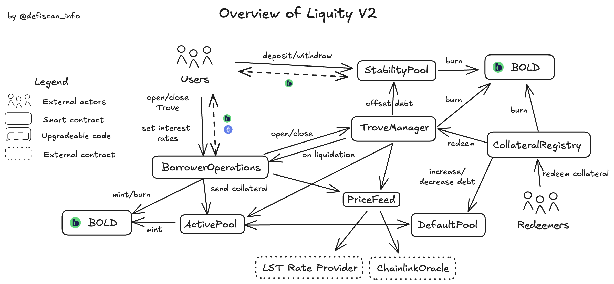

# Summary

Liquity v2 is a borrowing protocol that lets users deposit ETH or Liquid Staking Tokens (LSTs) as collateral and mint the stablecoin `BOLD`. 

`BOLD` loans need to maintain a minimum collateral ratio of 110% for `ETH` and 120% for `RETH` and `WSTETH` collaterals, respectively.

In addition to the collateral, the loans on each collateral branch are secured by a _Stability Pool_ containing `BOLD` and by fellow borrowers collectively acting as guarantors of last resort.

# Ratings

## Chain

The Liquity v2 protocol is deployed on Ethereum mainnet.

> Chain score: Low

## Upgradeability

All permissions in the system have been renounced and the protocol is fully immutable. No upgrades or changes can be made to the protocol, its functions or parameters.

> Upgradeability score: Low

## Autonomy

Liquity v2 relies on a combination of external Chainlink market oracles - ETH-USD, RETH-ETH and STETH-USD - as well as LST smart contract exchange rates in order to price collateral.

If the market oracle or LST exchange rate fails on a given collateral branch, the system shuts that branch down: it freezes new debt issuance, and enables “urgent redemptions” in order to clear debt and collateral as fast as possible. Borrowers are free to repay BOLD, withdraw collateral and close their loans on the shut down branch.

Additionally, if a branch’s LST market oracle fails, the branch falls back to pricing collateral via a combination of the LST exchange rate and ETH-USD price.

Finally, each collateral branch uses the "last good price" as a last resort if all its price sources become untrusted. This ensures the protocol can continue pricing collateral without interruption, minimizing the impact of oracle failure on its operations. Despite its reliance on external oracles, Liquity v2’s branch shutdown mechanism and fallback pricing logic mitigate the risk of disruption due to price source failure.

> Autonomy score: Low

## Exit Window

Liquity v2’s contracts are fully immutable - no upgrades or changes can be made, removing the need for an exit window.

> Exit Window score: Low

## Accessibility

Multiple user interfaces exist and are operated by independent actors ensuring access to the protocol and user funds even if an interface is shutdown or censors a user's transactions.

A list of third-party frontends can be found here: https://www.liquity.org/frontend-v2

> Accessibility score: Low

## Conclusion

The Liquity v2 deployment on Ethereum mainnet achieves _Low_ centralization risk score for its _Upgradeability_, _Autonomy_, _Exit Window_, and _Accessibility_ dimensions. It thus ranks **Stage 2**.

# Protocol Analysis

# Dependencies

The system has the following external dependencies:

- LST ERC20 tokens: RocketPool ETH (`RETH`) and Lido Wrapped Staked ETH (`WSTETH`)

- Chainlink market oracles: ETH-USD, RETH-ETH and STETH-USD

Any problem or failure with the collateral contracts could have a significant impact on the Liquity v2 system. However, the system separates different collateral branches and shuts a collateral branch down if the branch collateralization ratio falls too low, or if the LST’s smart contract exchange rate fails. Thus it does its best to mitigate economic or technical collateral failure and remain functional.

Similarly, if a market oracle fails the system shuts down the corresponding branch and falls back to a backup price calculation (see the Autonomy section for details).

In either case of LST exchange rate or market oracle failure, the branch blocks new debt issuance and allows existing users to withdraw their assets.

# Governance

Liquity v2 incorporates a governance module which gives LQTY stakers voting rights over a fixed portion of the total interest generated from loans. This is termed the “PIL” - _Protocol Incentivized Liquidity_.

`LQTY` stakers vote weekly on initiatives, deciding where to direct that week’s PIL rewards. The intent is to incentivize `BOLD` liquidity on external markets as per the protocol’s needs.

`LQTY` stakers have no control over any other system logic or parameters. Proposing initiatives and claiming an initiative's accrued rewards are completely permissionless.

## External Permission Owners and Security Council

The protocol is completely immutable, thus no Security Council is required.

# Contracts

| ContractName                | Address                                                                                                               |
| --------------------------- | --------------------------------------------------------------------------------------------------------------------- |
| BOLDToken                   | [0x6440f144b7e50d6a8439336510312d2f54beb01d](https://etherscan.io/address/0x6440f144b7e50d6a8439336510312d2f54beb01d) |
| CollateralRegistry          | [0xf949982b91c8c61e952b3ba942cbbfaef5386684](https://etherscan.io/address/0xf949982b91c8c61e952b3ba942cbbfaef5386684) |
| Governance                  | [0x807def5e7d057df05c796f4bc75c3fe82bd6eee1](https://etherscan.io/address/0x807def5e7d057df05c796f4bc75c3fe82bd6eee1) |
| WETHAddressesRegistry       | [0x20f7c9ad66983f6523a0881d0f82406541417526](https://etherscan.io/address/0x20f7c9ad66983f6523a0881d0f82406541417526) |
| WETHActivePool              | [0xeb5a8c825582965f1d84606e078620a84ab16afe](https://etherscan.io/address/0xeb5a8c825582965f1d84606e078620a84ab16afe) |
| WETHBorrowerOperations      | [0x372abd1810eaf23cb9d941bbe7596dfb2c46bc65](https://etherscan.io/address/0x372abd1810eaf23cb9d941bbe7596dfb2c46bc65) |
| WETHCollSurplusPool         | [0xedbe2509e502c0320d2e7f8b6746a49b4b50e2bf](https://etherscan.io/address/0xedbe2509e502c0320d2e7f8b6746a49b4b50e2bf) |
| WETHCollToken               | [0xc02aaa39b223fe8d0a0e5c4f27ead9083c756cc2](https://etherscan.io/address/0xc02aaa39b223fe8d0a0e5c4f27ead9083c756cc2) |
| WETHDefaultPool             | [0xd4558240d50c2e219a21c9d25afd513bb6e5b1a0](https://etherscan.io/address/0xd4558240d50c2e219a21c9d25afd513bb6e5b1a0) |
| WETHSortedTroves            | [0xa25269e41bd072513849f2e64ad221e84f3063f4](https://etherscan.io/address/0xa25269e41bd072513849f2e64ad221e84f3063f4) |
| WETHStabilityPool           | [0x5721cbbd64fc7ae3ef44a0a3f9a790a9264cf9bf](https://etherscan.io/address/0x5721cbbd64fc7ae3ef44a0a3f9a790a9264cf9bf) |
| WETHTroveManager            | [0x7bcb64b2c9206a5b699ed43363f6f98d4776cf5a](https://etherscan.io/address/0x7bcb64b2c9206a5b699ed43363f6f98d4776cf5a) |
| WETHTroveNFT                | [0x1a0fc0b843afd9140267d25d4e575cb37a838013](https://etherscan.io/address/0x1a0fc0b843afd9140267d25d4e575cb37a838013) |
| WETHPriceFeed               | [0xcc5f8102eb670c89a4a3c567c13851260303c24f](https://etherscan.io/address/0xcc5f8102eb670c89a4a3c567c13851260303c24f) |
| WSTETHAddressesRegistry     | [0x8d733f7ea7c23cbea7c613b6ebd845d46d3aac54](https://etherscan.io/address/0x8d733f7ea7c23cbea7c613b6ebd845d46d3aac54) |
| WSTETHActivePool            | [0x531a8f99c70d6a56a7cee02d6b4281650d7919a0](https://etherscan.io/address/0x531a8f99c70d6a56a7cee02d6b4281650d7919a0) |
| WSTETHBorrowerOperations    | [0xa741a32f9dcfe6adba088fd0f97e90742d7d5da3](https://etherscan.io/address/0xa741a32f9dcfe6adba088fd0f97e90742d7d5da3) |
| WSTETHCollSurplusPool       | [0x36e6cbdf68f64cf00fc3a6c634a25be32dd0a235](https://etherscan.io/address/0x36e6cbdf68f64cf00fc3a6c634a25be32dd0a235) |
| WSTETHCollToken             | [0x7f39c581f595b53c5cb19bd0b3f8da6c935e2ca0](https://etherscan.io/address/0x7f39c581f595b53c5cb19bd0b3f8da6c935e2ca0) |
| WSTETHDefaultPool           | [0xd796e1648526400386cc4d12fa05e5f11e6a22a1](https://etherscan.io/address/0xd796e1648526400386cc4d12fa05e5f11e6a22a1) |
| WSTETHSortedTroves          | [0x84eb85a8c25049255614f0536bea8f31682e86f1](https://etherscan.io/address/0x84eb85a8c25049255614f0536bea8f31682e86f1) |
| WSTETHStabilityPool         | [0x9502b7c397e9aa22fe9db7ef7daf21cd2aebe56b](https://etherscan.io/address/0x9502b7c397e9aa22fe9db7ef7daf21cd2aebe56b) |
| WSTETHTroveManager          | [0xa2895d6a3bf110561dfe4b71ca539d84e1928b22](https://etherscan.io/address/0xa2895d6a3bf110561dfe4b71ca539d84e1928b22) |
| WSTETHTroveNFT              | [0x857aecebf75f1012dc18e15020c97096aea31b04](https://etherscan.io/address/0x857aecebf75f1012dc18e15020c97096aea31b04) |
| WSTETHPriceFeed             | [0xe7aa2ba9e086a379d3beb224098bc634a46e314e](https://etherscan.io/address/0xe7aa2ba9e086a379d3beb224098bc634a46e314e) |
| RETHAddressesRegistry       | [0x6106046f031a22713697e04c08b330ddaf3e8789](https://etherscan.io/address/0x6106046f031a22713697e04c08b330ddaf3e8789) |
| RETHActivePool              | [0x9074d72cc82dad1e13e454755aa8f144c479532f](https://etherscan.io/address/0x9074d72cc82dad1e13e454755aa8f144c479532f) |
| RETHBorrowerOperations      | [0xe8119fc02953b27a1b48d2573855738485a17329](https://etherscan.io/address/0xe8119fc02953b27a1b48d2573855738485a17329) |
| RETHCollSurplusPool         | [0xba4a2bd8b76df84cac98eba3f4b967d8423192bf](https://etherscan.io/address/0xba4a2bd8b76df84cac98eba3f4b967d8423192bf) |
| RETHCollToken               | [0xae78736cd615f374d3085123a210448e74fc6393](https://etherscan.io/address/0xae78736cd615f374d3085123a210448e74fc6393) |
| RETHDefaultPool             | [0x5cc5cefd034fdc4728d487a72ca58a410cddcd6b](https://etherscan.io/address/0x5cc5cefd034fdc4728d487a72ca58a410cddcd6b) |
| RETHSortedTroves            | [0x14d8d8011df2b396ed2bbc4959bb73250324f386](https://etherscan.io/address/0x14d8d8011df2b396ed2bbc4959bb73250324f386) |
| RETHStabilityPool           | [0xd442e41019b7f5c4dd78f50dc03726c446148695](https://etherscan.io/address/0xd442e41019b7f5c4dd78f50dc03726c446148695) |
| RETHTroveManager            | [0xb2b2abeb5c357a234363ff5d180912d319e3e19e](https://etherscan.io/address/0xb2b2abeb5c357a234363ff5d180912d319e3e19e) |
| RETHTroveNFT                | [0x7ae430e25b67f19b431e1d1dc048a5bcf24c0873](https://etherscan.io/address/0x7ae430e25b67f19b431e1d1dc048a5bcf24c0873) |
| RETHPriceFeed               | [0x34f1e9c7dcc279ec70d3c4488eb2d80fba8b7b2b](https://etherscan.io/address/0x34f1e9c7dcc279ec70d3c4488eb2d80fba8b7b2b) |

## Permissioned Owners

All external permissions are revoked, the protocol is immutable.

## Permissions

| Contract   | Function                    | Impact                                                                                                                                                                                                                                                               | Owner |
| ---------- | --------------------------- | -------------------------------------------------------------------------------------------------------------------------------------------------------------------------------------------------------------------------------------------------------------------- | ----- |
| Governance | registerInitialInitiatives  | The permissioned function allows the owner of the permission to register the first initiatives for LQTY stakers to vote on. It registers these initiatives in the earliest possible epoch, which allows the owner to make them votable on immediately post-deployment. | 0x0   |
| BOLDToken | setBranchAddresses  | The permissioned allows owner of the permission to record core contract addresses for a given branch in the BOLDToken contract. It is used once, purely for contract initialization upon deployment. | 0x0   |
| BOLDToken | setCollateralRegistry  | The permissioned allows owner of the permission to record the CollateralRegistry core contract address in the BOLDToken contract. It is used once, purely for contract initialization upon deployment, and it renounces ownership after recording the address. | 0x0   |
| BoldToken | mint | Mints tokens to the specified account. Used in borrowing and interest operations. | BorrowerOperations, ActivePool |
| BoldToken | burn | Burns tokens from the specified account. Used in borrowing, liquidation and redemptions. | BorrowerOperations, CollateralRegistry, TroveManager, StabilityPool |
| BoldToken | sendToPool | Transfers the specified amount of BOLD tokens to the specified pool | StabilityPool |
| BoldToken | returnFromPool | Transfers the specified amount of BOLD tokens from the specified pool to the specified receiver | StabilityPool |
| BorrowerOperations | onLiquidateTrove | Hook which clears a Trove's delegate / manager permissions upon liquidation | TroveManager |
| BorrowerOperations | shutdownFromOracleFailure | Triggers branch shutdown if the branch is active | PriceFeed |
| TroveManager | redeemCollateral | Redeems the branch's share of a redemption from the Troves in that branch | CollateralRegistry |
| TroveManager | shutdown | Sets the shutdown flag and timestamp | BorrowerOperations |
| TroveNFT | mint | Mints a Trove NFT to the specified borrower when a Trove is opened | TroveManager |
| TroveNFT | burn | Burns the specified Trove NFT from the specified borrower when the corresponding Trove is closed or liquidated | TroveManager |
| SortedTroves | remove | Removes a non-batched Trove from the sorted list | TroveManager, BorrowerOperations |
| SortedTroves | removeFromBatch | Remove a batched Trove from the sorted list | TroveManager, BorrowerOperations |
| SortedTroves | insert | Adds a Trove to the sorted list | BorrowerOperations |
| SortedTroves | reinsert | Re-inserts a non-batched Trove at a new position, based on its new annual interest rate | BorrowerOperations |
| SortedTroves | insertIntoBatch | Adds a Trove to a Batch within the list | BorrowerOperations |
| SortedTroves | reinsertBatch | Re-insert an entire Batch of Troves at a new position, based on their new annual interest rate | BorrowerOperations |
| ActivePool | sendColl | Transfers collateral to the specified address | BorrowerOperations, TroveManager, StabilityPool |
| ActivePool | sendCollToDefaultPool | Transfers the collateral from a redistribution liquidation to the DefaultPool | TroveManager |
| ActivePool | mintAggInterestAndAccountForTroveChange | Upon a Trove debt change it mints the aggregate pending interest since the last minting operation and updates the interest accounting, incorporating the Trove debt change. | BorrowerOperations, TroveManager |
| ActivePool | mintAggInterest | Mints the aggregate pending interest since the last minting operation and updates the interest accounting | BorrowerOperations, StabilityPool |
| ActivePool | mintBatchManagermentFeeAndAccountForChange | Upon a batch fee operation it mints the aggregate pending interest since the last minting operation and updates the interest accounting, incorporating the batch fee charged. | TroveManager |
| ActivePool | setShutdownFlag | Raises the shutdown flag, i.e. sets the recorded shutdown time to current time | TroveManager |
| DefaultPool | sendCollToActivePool | Transfers collateral to the ActivePool | TroveManager |
| DefaultPool | receiveColl | Hook used to transfer the collateral from a redistribution liquidation to the DefaultPool | ActivePool |
| DefaultPool | increaseBoldDebt | Increases the recorded BOLD debt of the Pool by the specified amount | TroveManager |
| DefaultPool | decreaseBoldDebt | Decreases the recorded BOLD debt of the Pool by the specified amount | TroveManager |
| CollSurplusPool | accountSurplus | Increases the surplus collateral balance of the specified address by the specified amount | TroveManager |
| CollSurplusPool | claimColl | Transfers the specified collateral surplus to the specified address and decreases balances | BorrowerOperations |
| StabilityPool | triggerBoldRewards | Upon interest minting, updates the pool's reward accounting for depositors with the interest portion assigned to the SP | ActivePool |
| StabilityPool | offset | Cancels the specified amount of liquidated BOLD debt against BOLD tokens held in the pool, transfers liquidated collateral to the pool, and updates collateral rewards accounting for depositors | TroveManager |

## System architecture

The core Liquity contracts are organized in this manner:

There is a single `CollateralRegistry`, a single `BoldToken`, and a set of core system contracts deployed for each collateral “branch”. The `CollateralRegistry` maps external collateral ERC20 tokens to a TroveManager address. 
An entire collateral branch is deployed for each LST collateral. A collateral branch contains all the logic necessary for opening and managing Troves, liquidating Troves, Stability Pool deposits, and redemptions (from that branch).  There is one instance of each of the following contracts per branch:

- BorrowerOperations
- TroveManager
- StabilityPool
- ActivePool
- DefaultPool
- SortedTroves
- CollSurplusPool
- PriceFeed

## System diagram

BOLD holders deposit and withdraw BOLD to/from the `StabilityPool`. Primary liquidations offset debt against BOLD funds in the `StabilityPool` and distribute collateral gains to depositors. Borrowers interact with the system via `BorrowerOperations` - opening, adjusting and closing their Troves. Borrower collateral and debt is recorded on the `ActivePool`, and some is moved to the `DefaultPool` when secondary liquidations occur. Interest from borrowing positions is continuously minted and a portion of it directed as yield to the `StabilityPool`. The branch `PriceFeed` prices collateral via an external market oracle and LST exchange rate. The `CollateralRegistry` routes redemptions across the different collateral branches.

