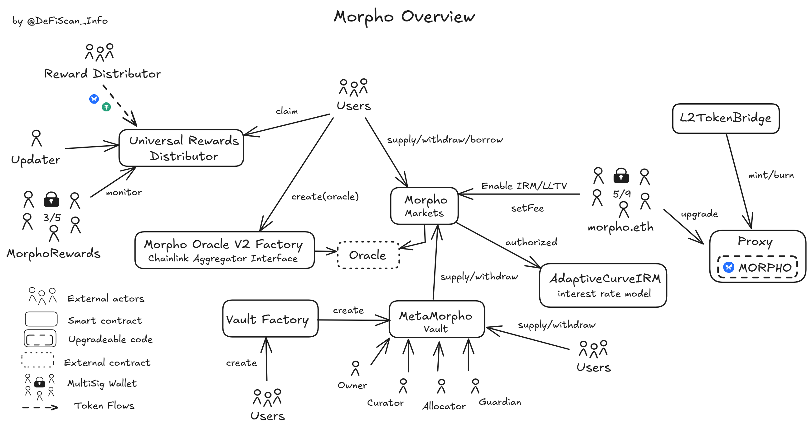

# Summary

Morpho is a lending protocol with permissionless market creation. It enables the deployment of minimal and isolated lending markets by specifying: one collateral asset, one loan asset, a Liquidation Loan To Value (LLTV), an Interest Rate Model (IRM), and an oracle. Users may lend funds directly on individual Morpho Markets or through Morpho Vaults. These vaults are created permissionlessly by third parties, or risk curators, and offer managed lending strategies by aggregating different Morpho Markets. Morpho governance operates within a very limited scope and without direct control over the Morpho protocol.

# Ratings

## Chain

Morpho is deployed on different chains. This review is based on the Base chain, an Ethereum L2 in Stage 1 according to L2BEAT.

> Chain score: Medium

## Upgradeability

The Morpho (markets) protocol and Morpho Vaults are non-upgradeable. No permissions exist in the Morpho protocol that could affect _users' funds and unclaimed yield_ or could otherwise result in non-expected protocol performance. Permissions in Morpho Vaults are owned by the vault creators themselves, aka _Curators_, and thus are not centralized under Morpho governance.

A team multisig, [morpho.eth](#security-council), is able to activate a fee switch and enable new LTV tiers and interest rate models. These permissions can only affect newly created markets with fees enforced in a fixed range.

The [morpho.eth](#security-council) multisig is further in control of the `MORPHO` token and it's upgradeability and minting features. `MORPHO` upgrades or minting can directly impact distributed rewards in the system and thus result in the _loss of unclaimed yield_. Thus the _Upgradeability Risk Score_ is _Medium_.

> Upgradeability score: Medium

## Autonomy

Morpho Markets are configured with an external price oracle based on which the solvency of a position is established. Market creators are free in the price oracle choice thus delegating responsibility to users instead of central governance.

However, the Morpho protocol facilitates oracle creation through a factory, currently `MorphoChainlinkOracleV2Factory`, which is used by more than 15% of Morpho Markets [(read more)](#dependencies).

This factory wraps price feeds compliant with Chainlink's Aggregator interface and assumes that these feeds never fail (liveness and valid prices). Although the price feed is chosen permissionlessly by the market creator, more than 92% of the Morpho Markets rely on a Chainlink curated price feed. We assessed that Chainlink price feeds have a _High_ centralization and explain our findings in a dedicated [report](/protocols/chainlink-oracles/ethereum).

An unintended upgrade of the Chainlink price feed contracts could result in stale or inaccurate prices being reported. Since the Morpho oracle reverts on a negative price reported by a Chainlink feed, this failure could result in the _permanent freezing of funds_ in affected markets. With a potential impact on more than 16% of Morpho Markets, or more than 92% of Morpho's TVL on Base. This potential impact on 92% of Morpho's TVL results in a _High centralization risk_ from Chainlink on Base.

> Autonomy score: High

## Exit Window

The [morpho.eth](#security-council) multisig account owns the permission to enable new Liquidation LTVs and Interest Rate Models to create new Morpho Markets with, but cannot change existing Morpho Markets thus not affecting existing user positions.

The Morpho protocol exposes critical permissions in the `MORPHO` token that can impact users' unclaimed `MORPHO` rewards and thus result in a _Medium Upgradeability_ risk. This risk is not mitigated with an onchain governance system and appropriate _Exit Window_.

> Exit Window score: Medium

## Accessibility

The main morpho interface is [app.morpho.org](https://app.morpho.org/). An RPC-only fallback interface ([fallback.morpho.org](https://fallback.morpho.org)) exists, offering an alternative in case of failure of the main interace. Finally, a backup solution allows users to self-host and access morpho following instructions on [this repository](https://github.com/morpho-org/morpho-blue-offchain-public).

In addition to that, morpho is also accessible through several interfaces such as [monarchlend](https://www.monarchlend.xyz), [summer.fi](https://summer.fi/borrow?protocol=morphoblue), [DefiSaver](https://app.defisaver.com/morpho), [Instadapp](https://defi.instadapp.org/metamorpho), and [Contango](https://app.contango.xyz/).

Finally, [lite.morpho.org](https://lite.morpho.org/) provides access to Morpho on Polygon, Optimism, and World Chain.

> Accessibility score: Low

## Conclusion

The Morpho protocol on Base achieves a _Low_ centralization score in the _Accessibility_ dimension. The _Upgradeability_ of the `MORPHO` token results a in _Medium_ _Upgradeability_ risk score. This _Upgradeability_ is not protected with an onchain governance system or delay and as such the _Exit Window_ risk is _Medium_ as well. Due to the _High_ _Autonomy_ risk score coming from 92% of the TVL relying on Chainlink oracle, Morpho scores **Stage 0** decentralization on Base.

The protocol could reach **Stage 1** by integrating protections within their default oracle adapter. This could include slippage limits or multiple price feeds for sanity checking.

The protocol could further advance to **Stage 2** if Base reaches Stage 2 and: 1) transferring control over the `MORPHO` permissions to onchain governance with a 30-day _Exit Window_ and 2) implementing a fallback mechanism around the Chainlink oracle dependency (or Chainlink taking measures to become a _Low Centralization_ protocol, as highlighted in this [report](/protocols/chainlink-oracles/ethereum)).

> Overall score: Stage 1

# Reviewer's Notes

We further want to highlight the following observations which did not directly factor into the scoring:

- ⚠️ Curators of Morpho Vaults are in control of critical permissions which can result in the _loss of user funds_ and _loss of unclaimed yield_. These permissions only have a direct impact on users in the respective vault and thus do not contribute to the centralization of the Morpho protocol. Vault owners can name guardians with the capability to cancel bad behaviors of curators, when the actions they are taking is increasing the risk towards the end user.

- ⚠️ The `MORPHO` token can be minted by the [morpho.eth](#security-council) multisig on Ethereum Mainnet only and then bridged to Base using the native bridge. Nonetheless, the contract on Base remains upgradeable at all time by this same multisig.

# Protocol Analysis

An overview of the Morpho protocol can be seen in the diagram below.



<!-- See [Whitepaper: Morpho Protocol](https://github.com/morpho-org/morpho-blue/blob/main/morpho-blue-whitepaper.pdf) -->

# Dependencies

Morpho Markets are configured with an external price oracle based on which the solvency of a position is established.
Market creators are free in chosing an appropriate price oracle implementation. However, once created, the feed cannot be updated.
The Morpho protocol facilitates the creation of price oracles, and markets, with the `MorphoChainlinkOracleV2Factory`.
This factory creates new price oracles which are compliant with Chainlink's Aggregator Interface. Thereby, the factory makes important assumptions on the liveness and validity of prices returned by the feed as documented in the source code as follows:

```
/// - Staleness is not checked because it's assumed that the Chainlink feed keeps its promises on this.
/// - The price is not checked to be in the min/max bounds because it's assumed that the Chainlink feed keeps its
/// promises on this.
```

Note that the price oracle in a Morpho market cannot be updated (markets are immutable). A permanent failure or staleness of the price feed can thus result in user funds being permanently frozen in Morpho Markets.

At the time of writing this review, more than 16% of the live Morpho Markets, or more than 92% of Morpho's TVL, make use of this standard price oracle and a Chainlink curated price feed. An analysis of this with results can be found on our [GitHub](https://github.com/deficollective/morpho-oracles-analysis). Thus, even though technically not enforced, Chainlink forms a critical dependency of the Morpho protocol.

The Chainlink oracle system exhibits a **High centralization score** as reported [here](/protocols/chainlink-oracles/ethereum).

# Governance

Morpho does not yet have an onchain governance system with control over protocol permissions. Instead, permissioned functions are controlled by the [morpho.eth](#security-council) (Morpho protocol and `MORPHO` token) and [MorphoRewards](#security-council) (distribution of rewards) multisig accounts.

## Security Council

&nbsp;

| Name                   | Account                                                                                                                | Type         | ≥ 7 signers | ≥ 51% threshold | ≥ 50% non-insider | Signers public |
| ---------------------- | ---------------------------------------------------------------------------------------------------------------------- | ------------ | ----------- | --------------- | ----------------- | -------------- |
| morpho.eth             | [0xBDE0c70BdC242577c52dFAD53389F82fd149EA5a](https://basescan.org/address/0xBDE0c70BdC242577c52dFAD53389F82fd149EA5a)  | Multisig 5/9 | ✅          | ✅              | ❌                | ❌             |
| MorphoRewards Multisig | [0xF057afeEc22E220f47AD4220871364e9E828b2e9](https://etherscan.org/address/0xF057afeEc22E220f47AD4220871364e9E828b2e9) | Multisig 3/5 | ❌          | ✅              | ❌                | ❌             |

## Exit Window

The Morpho protocol exposes permissions that allow the [morpho.eth](#security-council) multisig account to enable new Liquidation Loan-to-Value ratios and Interest Rate Models for future market creation. These functions do not impose risks of _loss of funds_ or _loss of unclaimed yield_ on users and thus do not need to be protected with an _Exit Window_.

However, critical permissions in the `MORPHO` token allow the same multisig account to upgrade the token contract or mint more tokens. These permissions can result in the loss of unclaimed `MORPHO` rewards and thus expose a _Medium upgradeability_ risk. The permissions are not protected with onchain governance and an _Exit Window_, instead the [morpho.eth](#security-council) multisig account can upgrade and mint on the `MORPHO` token contract instantly.

# Contracts & Permissions

| Contract Name                                      | Address                                                                                                               |
| -------------------------------------------------- | --------------------------------------------------------------------------------------------------------------------- |
| Morpho                                             | [0xBBBBBbbBBb9cC5e90e3b3Af64bdAF62C37EEFFCb](https://basescan.org/address/0xBBBBBbbBBb9cC5e90e3b3Af64bdAF62C37EEFFCb) |
| Adaptive Curve Interest Rate Model                 | [0x46415998764C29aB2a25CbeA6254146D50D22687](https://basescan.org/address/0x46415998764C29aB2a25CbeA6254146D50D22687) |
| Morpho Chainlink Oracle V2 Factory                 | [0x2DC205F24BCb6B311E5cdf0745B0741648Aebd3d](https://basescan.org/address/0x2DC205F24BCb6B311E5cdf0745B0741648Aebd3d) |
| Morpho Vault Factory V1.1                          | [0xFf62A7c278C62eD665133147129245053Bbf5918](https://basescan.org/address/0xFf62A7c278C62eD665133147129245053Bbf5918) |
| Morpho Vault V1.1                                  | [0xFf62A7c278C62eD665133147129245053Bbf5918](https://basescan.org/address/0xFf62A7c278C62eD665133147129245053Bbf5918) |
| EthereumBundlerV2                                  | [0x4095F064B8d3c3548A3bebfd0Bbfd04750E30077](https://basescan.org/address/0x4095F064B8d3c3548A3bebfd0Bbfd04750E30077) |
| Public Allocator                                   | [0xA090dD1a701408Df1d4d0B85b716c87565f90467](https://basescan.org/address/0xA090dD1a701408Df1d4d0B85b716c87565f90467) |
| PreLiquidation Factory                             | [0x8cd16b62E170Ee0bA83D80e1F80E6085367e2aef](https://basescan.org/address/0x8cd16b62E170Ee0bA83D80e1F80E6085367e2aef) |
| Universal Rewards Distributor Factory (UrdFactory) | [0x7276454fc1cf9C408deeed722fd6b5E7A4CA25D8](https://basescan.org/address/0x7276454fc1cf9C408deeed722fd6b5E7A4CA25D8) |
| Universal Rewards Distributor                      | [0x5400dbb270c956e8985184335a1c62aca6ce1333](https://basescan.org/address/0x5400dbb270c956e8985184335a1c62aca6ce1333) |
| MORPHO                                             | [0xBAa5CC21fd487B8Fcc2F632f3F4E8D37262a0842](https://basescan.org/address/0xBAa5CC21fd487B8Fcc2F632f3F4E8D37262a0842) |

## All Permission owners

| Name                   | Account                                                                                                               | Type         |
| ---------------------- | --------------------------------------------------------------------------------------------------------------------- | ------------ |
| morpho.eth             | [0xcBa28b38103307Ec8dA98377ffF9816C164f9AFa](https://basescan.org/address/0xcBa28b38103307Ec8dA98377ffF9816C164f9AFa) | Multisig 5/9 |
| MorphoRewards Multisig | [0xF057afeEc22E220f47AD4220871364e9E828b2e9](https://basescan.org/address/0xF057afeEc22E220f47AD4220871364e9E828b2e9) | Multisig 3/5 |
| Morpho                 | [0xBBBBBbbBBb9cC5e90e3b3Af64bdAF62C37EEFFCb](https://basescan.org/address/0xBBBBBbbBBb9cC5e90e3b3Af64bdAF62C37EEFFCb) | Contract     |
| L2StandardBridge       | [0x4200000000000000000000000000000000000010](https://basescan.org/address/0x4200000000000000000000000000000000000010) | Contract     |

<!-- potential additional permission owners:

Morpho operations multisig: 0x640428D38189B11B844dAEBDBAAbbdfbd8aE0143 (3/9)
SafeOwner: 0x0b9915C13e8E184951Df0d9C0b104f8f1277648B -->

## Permissions

| Contract                     | Function                   | Impact                                                                                                                                                                                                                                              | Owner                            |
| ---------------------------- | -------------------------- | --------------------------------------------------------------------------------------------------------------------------------------------------------------------------------------------------------------------------------------------------- | -------------------------------- |
| Morpho                       | setOwner                   | Sets newOwner as owner of the contract.                                                                                                                                                                                                             | morpho.eth                       |
| Morpho                       | enableIrm                  | Enables irm as a possible IRM for market creation. Once set an interest rate cannot be disabled.                                                                                                                                                    | morpho.eth                       |
| Morpho                       | enableLltv                 | Enables lltv as a possible LLTV for market creation.                                                                                                                                                                                                | morpho.eth                       |
| Morpho                       | setFee                     | Sets the newFee for the given market marketParams. Fees are taken on the interests and can be of up to 25%.                                                                                                                                         | morpho.eth                       |
| Morpho                       | setFeeRecipient            | Sets newFeeRecipient as feeRecipient of the fee, the address who will benefit from the fees, if any.                                                                                                                                                | morpho.eth                       |
| AdaptiveCurveIrm             | borrowRate                 | Returns the borrow rate per second (scaled by WAD) of the market `marketParams` and eventually adjust according to the parameters. Can only be called by the main Morpho contract upon interest collection.                                         | Morpho                           |
| UniversalRewardsDistributor  | setRootUpdater             | Grants the _Updater_ role to a specific address, typically an offchain bot. The _Updaters_ compute merkle trees of reward distribution and submit the root on-chain.                                                                                | MorphoRewards Multisig           |
| UniversalRewardsDistributor  | submitRoot                 | Submit the root of a merkle tree. The offline-computed tree allows the distribution of reward tokens to users. The tree could be wrong or malicious to distribute undeserved rewards. The root is only accepted once the timelock delay has passed. | Updater                          |
| UniversalRewardsDistributor  | revokePendingRoot          | Revokes a root during the timelock delay, before final acceptance. This can be used to cancel a malicious reward distribution.                                                                                                                      | MorphoRewards Multisig           |
| UniversalRewardsDistributor  | setRoot                    | Accepts the root as final if the correct delay has passed and the root wasn't revoked.                                                                                                                                                              | MorphoRewards Multisig           |
| UniversalRewardsDistributor  | setTimelock                | Sets a timelock for root updates. New roots submitted will be frozen for this amount of time so that the owner may cancel them.                                                                                                                     | MorphoRewards Multisig           |
| UniversalRewardsDistributor  | setOwner                   | Sets a new owner for the contract. The owner needs to accept ownership.                                                                                                                                                                             | MorphoRewards Multisig           |
| MetaMorphoV1_1               | setOwner                   | Sets a new owner, the owner has all rights on the contract, can set fees and grant access roles.                                                                                                                                                    | Vault Owner                      |
| MetaMorphoV1_1               | transferOwnership          | Transfers ownership of the contract to another addres who needs to accept it.                                                                                                                                                                       | Vault Owner                      |
| MetaMorphoV1_1               | renounceOwnership          | Renounces ownership over the contract. No new owner can be named.                                                                                                                                                                                   | Vault Owner                      |
| MetaMorphoV1_1               | setName                    | Sets the name of the vault's ERC-20.                                                                                                                                                                                                                | Vault Owner                      |
| MetaMorphoV1_1               | setSymbol                  | Sets the symbol of the vault's ERC-20.                                                                                                                                                                                                              | Vault Owner                      |
| MetaMorphoV1_1               | setCurator                 | Sets the curator. Curators can decrease/increase supply caps, allocate funds, force market removals.                                                                                                                                                | Vault Owner                      |
| MetaMorphoV1_1               | setIsAllocator             | Grants Allocator role to an addres. Allocators can decide on the order of the markets to supply/borrow from.                                                                                                                                        | Vault Owner                      |
| MetaMorphoV1_1               | setSkimRecipient           | Sets the recepient of skimming: collection of leftover tokens set to the contract.                                                                                                                                                                  | Vault Owner                      |
| MetaMorphoV1_1               | submitTimelock             | Sets the timelock. Timelock is the delay between critical changes dones by the curator and allocator and the moment they take actions. The owner and guardian can use this delay to cancel those transactions.                                      | Vault Owner                      |
| MetaMorphoV1_1               | setFee                     | Sets a fee that is taken on users' yield. The max fee is set to 25% of interests.                                                                                                                                                                   | Vault Owner                      |
| MetaMorphoV1_1               | setFeeRecipient            | Sets the fee recipient. The address that will receive the collected fees.                                                                                                                                                                           | Vault Owner                      |
| MetaMorphoV1_1               | submitGuardian             | Names a new guardian for the contract. The guardian can cancel critical transactions during the timelock delay. The new guardian takes its functions only after the timelock delay has passed.                                                      | Vault Owner                      |
| MetaMorphoV1_1               | submitCap                  | Submits a new supply cap for a specific market. The new cap only takes effect after the timelock delay.                                                                                                                                             | Vault Owner, Vault Curator       |
| MetaMorphoV1_1               | submitMarketRemoval        | Removes a market from the vault. The removal only takes effect after the timelock delay.                                                                                                                                                            | Vault Owner                      |
| MetaMorphoV1_1               | setSupplyQueue             | Sets a queue of markets for fund allocation in order.                                                                                                                                                                                               | Vault Owner, Curator, Allocators |
| MetaMorphoV1_1               | updateWithdrawQueue        | Updates the queue of markets to withdraw from in order.                                                                                                                                                                                             | Vault Owner, Curator, Allocators |
| MetaMorphoV1_1               | reallocate                 | Reallocate the funds on different markets.                                                                                                                                                                                                          | Vault Owner, Curator, Allocators |
| MetaMorphoV1_1               | revokePendingTimelock      | Revokes a timelock before it takes effect.                                                                                                                                                                                                          | Vault Owner, Guardian            |
| MetaMorphoV1_1               | revokePendingCap           | Cancel a market supply cap before it takes effect                                                                                                                                                                                                   | Vault Owner, Guardian            |
| MetaMorphoV1_1               | revokePendingMarketRemoval | Cancels a market removal before it takes effect.                                                                                                                                                                                                    | Vault Owner, Guardian            |
| MorphoTokenOptimism (MORPHO) | upgradeToAndCall           | Upgrades the contract to a new implementation. This can potentially change the logic of the token and could be used to steal funds.                                                                                                                 | morpho.eth                       |
| MorphoTokenOptimism (MORPHO) | transferOwnership          | Transfer ownership of the contract to a new adress. The new owner needs to accept ownership. The new owner has minting right and upgrade right on the `MORPHO` token and therefore extreme power.                                                   | morpho.eth                       |
| MorphoTokenOptimism (MORPHO) | renounceOwnership          | Unrevokably abandons ownership of the contract. This would make the `MORPHO` contract immutable and prevent further mints.                                                                                                                          | morpho.eth                       |
| MorphoTokenOptimism (MORPHO) | mint                       | Mints `MORPHO` tokens to a new address and increase the total supply. This can be abused to dillute the value of `MORPHO` or influence governance decisions in the future.                                                                          | L2StandardBridge                 |
| MorphoTokenOptimism (MORPHO) | burn                       | Burns `MORPHO` tokens from a given address. This can be abused to burn from any account holding `MORPHO`.                                                                                                                                           | L2StandardBridge                 |
