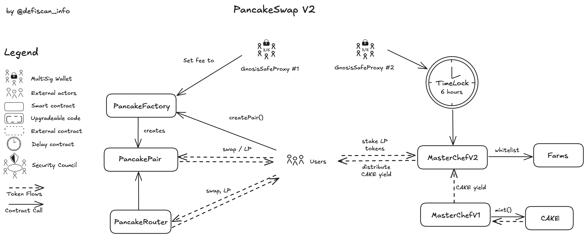

# Summary

PancakeSwap v2 is an automated market maker on BNB Smart Chain, a fork of [Uniswap v2](/protocols/uniswap-v2-ethereum) extended with an incentive layer. Users exchange BEP-20 tokens through liquidity pools, with trading fees distributed to the liquidity providers and the protocol. Holders of liquidity-provider tokens can also deposit them in their corresponding _Farm_ to receive additional `CAKE` incentives.

# Ratings Overview

## Chain

Deployed on **Binance Smart Chain**.

> Chain score: **Low**

## Upgradeability

Key economic parameters are mutable and decisions are made through **two 3-of-6 multisigs** (with an optional timelock that is not always enforced):

**About the AMM :**
The Factory contract is upgradeable via an internal multisig (GnosisSafeProxy #1), which has the authority to change the feeTo address. This address receives the 0.08% protocol fee collected from every pool. With a single transaction, approved by the multisig, the protocol fee from all liquidity pools can be redirected to a new destination.

**About the incentive layer :**
In MasterChef V1, the only source of new `CAKE` via immutable minting at a fixed rate of 40 `CAKE` per block, GnosisSafeProxy #1 can call the dev() function at any time, with no delay, to change the wallet that receives 10% of each mint. The remaining 90% is forwarded to MasterChef V2 for distribution to farms.

All reward parameters in MasterChef V2; including the list of farms, their allocation points, the `CAKE` burn split, and the address designated to receive “burned” `CAKE`, can be modified by another internal multisig (GnosisSafeProxy #2) following a minimum six-hour timelock. This allows the team to halt rewards to existing farms, funnel all new `CAKE` emissions to an insider pool, or redirect the burn address to one that simply receives the tokens without actually burning them.

This is exactly what is happening now: the current burn address is GnosisSafeProxy #1, meaning the decision to truly burn the tokens depends entirely on the multisig’s integrity.

Only the `CAKE` token is exposed to these upgradeable risks. Unclaimed yield from farms, in `CAKE`, is therefore vulnerable due to the permissions held by the team. However, users’ principal and the 0.17% liquidity provider fee earned from the pools remain secure.

> Upgradeability score: **Medium**

## Autonomy

PancakeSwap v2’s AMM contracts (Factory, Pairs) have no external price oracle or off-chain dependency: swaps resolve only against on-chain reserves.  
The `CAKE` _incentive layer_ (MasterChef V1, V2)_, however, introduces an internal dependency: LP rewards rely on a single token (`CAKE`) that is minted at a fixed rate of 40 `CAKE` per block and distributed under the control of a \_3-of-6 multisig_. The distribution of `CAKE` can directly impact rewards in the system and thus may result in the loss of unclaimed yield.

> Autonomy score: **Medium**

## Exit Window

Any update to farming parameters, whether adding new Farms, changing allocation points, or adjusting emission splits are queued through the protocol’s timelock and cannot execute until at least **six hours** after being scheduled.
In contrast, governance can reassign the 0.08 % protocol fee at any time by calling the Factory’s fee-routing function. This action bypasses the timelock, fee redirection occurs instantly and leaves **no exit window** for LPs to react.
Once a liquidity pair is deployed, its internal fee-distribution logic is permanent: the 0.17 % trading fee directed to liquidity providers cannot be turned off or paused. Moreover, neither the `PancakePair` nor `MasterChef` is pausable, so LPs always retain the ability to remove their liquidity on demand.

> Exit-Window score: **Medium**

## Accessibility

Users primarily interact with PancakeSwap v2 through its official web interface at [https://pancakeswap.finance](https://pancakeswap.finance), which is developed and maintained by Pancake Labs. PancakeSwap’s frontend code is published under an MIT license [here](https://github.com/pancakeswap/pancake-frontend). The repository’s README contains instructions on how to clone the project, install dependencies, and launch the self-hosted app.

> Accessibility score: **Medium**

## Conclusion

The PancakeSwap-v2 protocol achieves _Medium centralization_ risk scores for the Upgradeability, Autonomy, Exit-Window, and Accessibility dimensions. This grants PancakeSwap v2 the score of Stage 1.

The project could advance to Stage 2 if all critical permissions concerning `CAKE` incentive distribution were irrevocably assigned to on-chain governance and protected by a _30-day Exit Window_. In addition to those, it would require multiple independent front-ends ensuring continuous user access.

# Reviewer's Notes

PancakeSwap follows the standard Uniswap V2 pattern with the addition of a incentive layer (MasterChef V1, V2). The `MigrationHelper` used to upgrade from PancakeSwap V1 to V2 was not in the scope of this review.

GnosisSafeProxy #1 burned 18.37 million `CAKE` on May 26, 2025, while this report was being prepared.

# Protocol Analysis

PancakeFactory serves as the on-chain registry and deployer for all liquidity pools. When createPair(tokenA, tokenB) is called, it clones the PancakePair template and initializes a new pair. Two mutable variables control the protocol fees: feeTo, which receives the 0.08% protocol cut, and feeToSetter, which has the authority to update feeTo. The remaining 0.17% fee is distributed immutably to the liquidity providers of the corresponding pair.

PancakeRouter V2 is a stateless utility contract that facilitates common user interactions. During swaps, it determines the optimal path across one or more PancakePair contracts, pulls the caller’s tokens, and routes them step-by-step, enforcing the specified amountOutMin and deadline specified by the caller. For liquidity operations, it wraps addLiquidity and removeLiquidity, manages slippage constraints and token approvals, and handles wrapping or unwrapping of WBNB when native BNB is used. After execution, the router holds no residual token balances.

MasterChef V1 is the legacy farming contract responsible for minting a fixed 40 `CAKE` per block. Of this, 90% is allocated to pool rewards and 10% to a developer address. As the only source of new `CAKE`, V1 remains the core monetary policy lever of PancakeSwap's incentive layer, even after the launch of V2.

MasterChef V2 is the active farming layer where users stake LP tokens to earn `CAKE`. It receives freshly minted tokens from V1 and distributes them across pools according to their allocPoint. Governance, through a timelock-protected multisig, can add or remove pools, adjust allocation weights, and modify the burn/reward split.

# Dependencies

No external dependency has been found.

# Governance

## Security Council

PancakeSwap v2 is governed by two Gnosis Safe wallets configured as **3-of-6 multisigs**.
While this adds redundancy, the setup **does not satisfy** DeFiScan’s Security-Council requirements.

| Name               | Account                                                                                                                | Type         | ≥ 7 signers | ≥ 51 % threshold | ≥ 50 % non-insider | Signers public |
| ------------------ | ---------------------------------------------------------------------------------------------------------------------- | ------------ | ----------- | ---------------- | ------------------ | -------------- |
| GnosisSafeProxy #1 | [`0xcEba60280fb0ecd9A5A26A1552B90944770a4a0e`](https://bscscan.com/address/0xcEba60280fb0ecd9A5A26A1552B90944770a4a0e) | Multisig 3/6 | ❌          | ❌               | ❌                 | ❌             |
| GnosisSafeProxy #2 | [`0xeCc90d54B10ADd1ab746ABE7E83abe178B72aa9E`](https://bscscan.com/address/0xeCc90d54B10ADd1ab746ABE7E83abe178B72aa9E) | Multisig 3/6 | ❌          | ❌               | ❌                 | ❌             |

Because none of the criteria are met, PancakeSwap v2 **lacks a qualifying Security Council** and cannot rely on this mechanism to mitigate central-admin risk.

# Technical Analysis

## Contracts

| Contract               | Address                                                                                                                |
| ---------------------- | ---------------------------------------------------------------------------------------------------------------------- |
| PancakeFactory         | [`0xcA143Ce32Fe78f1f7019d7d551a6402fC5350c73`](https://bscscan.com/address/0xcA143Ce32Fe78f1f7019d7d551a6402fC5350c73) |
| PancakeRouter V2       | [`0x10ED43C718714eb63d5aA57B78B54704E256024E`](https://bscscan.com/address/0x10ED43C718714eb63d5aA57B78B54704E256024E) |
| PancakePair (CAKE-BNB) | [`0x0eD7e52944161450477ee417DE9Cd3a859b14fD0`](https://bscscan.com/address/0x0eD7e52944161450477ee417DE9Cd3a859b14fD0) |
| MasterChefV2           | [`0xa5f8C5Dbd5F286960b9d90548680aE5ebFf07652`](https://bscscan.com/address/0xa5f8C5Dbd5F286960b9d90548680aE5ebFf07652) |
| Timelock               | [`0xA1f482Dc58145Ba2210bC21878Ca34000E2e8fE4`](https://bscscan.com/address/0xA1f482Dc58145Ba2210bC21878Ca34000E2e8fE4) |
| MigrationHelper        | [`0x6e85689f055B6894803d5135981F7B108C9DAfd5`](https://bscscan.com/address/0x6e85689f055B6894803d5135981F7B108C9DAfd5) |
| CakeToken              | [`0x0E09FaBB73Bd3Ade0a17ECC321fD13a19e81cE82`](https://bscscan.com/address/0x0E09FaBB73Bd3Ade0a17ECC321fD13a19e81cE82) |
| MasterChef V1          | [`0x73feaa1eE314F8c655E354234017bE2193C9E24E`](https://bscscan.com/address/0x73feaa1eE314F8c655E354234017bE2193C9E24E) |

## All Permission owners

| Name               | Address                                                                                                                | Type              |
| ------------------ | ---------------------------------------------------------------------------------------------------------------------- | ----------------- |
| PancakeFactory     | [`0xcA143Ce32Fe78f1f7019d7d551a6402fC5350c73`](https://bscscan.com/address/0xcA143Ce32Fe78f1f7019d7d551a6402fC5350c73) | Contract          |
| GnosisSafeProxy #1 | [`0xcEba60280fb0ecd9A5A26A1552B90944770a4a0e`](https://bscscan.com/address/0xcEba60280fb0ecd9A5A26A1552B90944770a4a0e) | Internal Multisig |
| Timelock           | [`0xA1f482Dc58145Ba2210bC21878Ca34000E2e8fE4`](https://bscscan.com/address/0xA1f482Dc58145Ba2210bC21878Ca34000E2e8fE4) | Contract          |
| GnosisSafeProxy #2 | [`0xeCc90d54B10ADd1ab746ABE7E83abe178B72aa9E`](https://bscscan.com/address/0xeCc90d54B10ADd1ab746ABE7E83abe178B72aa9E) | Internal Multisig |
| MasterChefV2       | [`0xa5f8C5Dbd5F286960b9d90548680aE5ebFf07652`](https://bscscan.com/address/0xa5f8C5Dbd5F286960b9d90548680aE5ebFf07652) | Contract          |
| MigrationHelper    | [`0x6e85689f055B6894803d5135981F7B108C9DAfd5`](https://bscscan.com/address/0x6e85689f055B6894803d5135981F7B108C9DAfd5) | Contract          |
| MasterChef V1      | [`0x73feaa1eE314F8c655E354234017bE2193C9E24E`](https://bscscan.com/address/0x73feaa1eE314F8c655E354234017bE2193C9E24E) | Contract          |

## Permissions

| Contract       | Function          | Impact                                                                                                                                                                                                                                                                                                                                           | Owner / Signer                                                                               |
| -------------- | ----------------- | ------------------------------------------------------------------------------------------------------------------------------------------------------------------------------------------------------------------------------------------------------------------------------------------------------------------------------------------------ | -------------------------------------------------------------------------------------------- |
| PancakeFactory | setFeeTo          | Sets a new `feeTo` address that receives the 0.08 % protocol fee accross every PancakePair.                                                                                                                                                                                                                                                      | [GnosisSafeProxy #1](https://bscscan.com/address/0xcEba60280fb0ecd9A5A26A1552B90944770a4a0e) |
| PancakeFactory | setFeeToSetter    | Assigns the right to call `setFeeTo` to a new address. This hands permanent control of fee-switch power to a different signer set.                                                                                                                                                                                                               | [GnosisSafeProxy #1](https://bscscan.com/address/0xcEba60280fb0ecd9A5A26A1552B90944770a4a0e) |
| MasterChefV2   | add               | Creates a new farm with arbitrary allocation points. This reshapes `CAKE` distribution and can siphon rewards from existing farms. A malicious owner could add a “ghost” pool with zero real liquidity that captures 100 % of farms' `CAKE` emissions.                                                                                           | [Timelock](https://bscscan.com/address/0xA1f482Dc58145Ba2210bC21878Ca34000E2e8fE4)           |
| MasterChefV2   | set               | Rewrites `allocPoint` of any existing pool. This re-weights how `CAKE` emissions are shared. A hostile change could drop public pools to near-zero rewards and funnel emissions to insider pools.                                                                                                                                                | [Timelock](https://bscscan.com/address/0xA1f482Dc58145Ba2210bC21878Ca34000E2e8fE4)           |
| MasterChefV2   | updateCakeRate    | Updates the percentages sent to burn, regular, and special farms. This alters `CAKE`’s inflation schedule. Setting burn rate to 0 % while doubling farm rewards would inflate supply rapidly and erode token value.                                                                                                                              | [Timelock](https://bscscan.com/address/0xA1f482Dc58145Ba2210bC21878Ca34000E2e8fE4)           |
| MasterChefV2   | burnCake          | Transfers accumulated `CAKE` to the `burnAdmin` address. Intended to reduce supply, it actually sends tokens to whatever address is set. If that address is switched to an attacker wallet, “burns” become free `CAKE`. Currently the `burnAdmin`is [GnosisSafeProxy #1](https://bscscan.com/address/0xcEba60280fb0ecd9A5A26A1552B90944770a4a0e) | [Timelock](https://bscscan.com/address/0xA1f482Dc58145Ba2210bC21878Ca34000E2e8fE4)           |
| MasterChefV2   | transferOwnership | Writes a new `owner` for MasterChefV2. Control over emissions, pool lists, and admin settings moves with it.                                                                                                                                                                                                                                     | [Timelock](https://bscscan.com/address/0xA1f482Dc58145Ba2210bC21878Ca34000E2e8fE4)           |
| Timelock       | setDelay          | Changes the global execution delay for queued governance calls. This defines the minimum exit window for users. The delay can be a minimum of 6 hours.                                                                                                                                                                                           | [Timelock](https://bscscan.com/address/0xA1f482Dc58145Ba2210bC21878Ca34000E2e8fE4)           |
| CakeToken      | mint              | Calls `_mint`, increasing total `CAKE` supply and sending tokens to any address. This is the root of all farming emissions. MasterChef V1 is the only contract that can call this mint function, it is a fixed 40 `CAKE` per block mint maximum inside MasterChef's logic.                                                                       | [MasterChef V1](https://bscscan.com/address/0x73feaa1eE314F8c655E354234017bE2193C9E24E)      |
| CakeToken      | transferOwnership | Assigns a new owner with full mint authority. Control of `CAKE` inflation moves entirely to the new address. If passed to a malicious contract, unlimited `CAKE` could be minted, destroying token economics. It is an 'uncallable' function since MasterChef V1 functions have no direct ways to call it.                                       | [MasterChef V1](https://bscscan.com/address/0x73feaa1eE314F8c655E354234017bE2193C9E24E)      |
