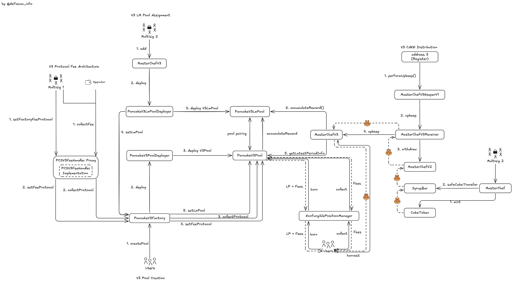
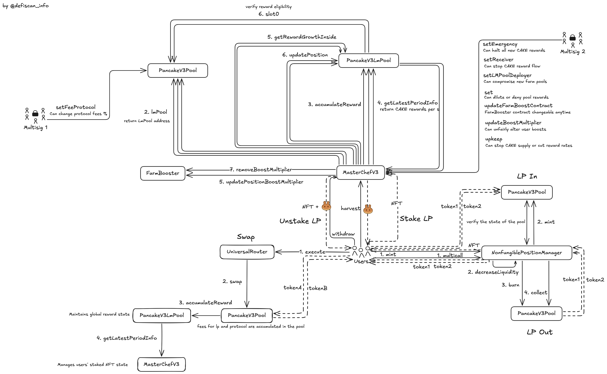

# Summary

PancakeSwap V3 is an automated market maker (AMM) on BNB with concentrated liquidity functionality. Unlike PancakeSwap V2's uniform liquidity distribution, V3 allows liquidity providers to deploy capital within specific price ranges. The protocol implements multiple fee tiers (0.01%, 0.05%, 0.3%, 1%), represents LP positions as NFTs instead of fungible tokens, and distributes `CAKE` token incentives only to liquidity positions that are in-range.

# Overview

## Chain

PancakeSwap V3 is deployed on multiple blockchains. This review focuses on its BNB Smart Chain (BSC) deployment, which uses a Proof of Staked Authority (PoSA) consensus with 45 active validators.

While L2beat's "stages" framework is commonly used to evaluate Ethereum Layer 2 solutions, it's not applicable to BSC as an independent blockchain. Unlike L2s, BSC maintains its own security model without inheriting Ethereum's security guarantees. The PoSA consensus centralizes influence among major BNB holders, with Binance playing a significant governance role. The network's fault tolerance allows up to one-third of validators to act maliciously before security is compromised.

> Chain score: High

## Upgradeability

PancakeSwap V3 presents several upgradeability vectors that primarily affect revenues and expected returns rather than users' principal funds.

### Protocol Infrastructure Upgradeability

The PancakeSwap Team which owns [Multisig 1](#security-council) administers PancakeSwap V3 through the upgradeable `PCSV3FeeHandler` contract, which serves as the primary interface for protocol management. This includes factory ownership transfers, fee configurations, and parameter updates. The contract's upgradeability via `upgradeTo` and `upgradeToAndCall` is limited to administrative functions, keeping core AMM logic immutable.

The `PancakeV3Factory`, controlled through `PCSV3FeeHandler`, manages reward distributions via `setLmPool` and `setLmPoolDeployer`. These functions allow redirecting farming incentives without affecting underlying liquidity positions. While the upgrade capability introduces risks related to administrative control, the design ensures core trading functionality remains unaffected.

### Fees and Rewards System Upgradeability

[Multisig 1](#security-council) can adjust protocol fees up to 40% which are deducted from LP earnings. This would affect future revenue distribution but not principal capital nor unclaimed yield.

[Multisig 2](#security-council) maintains complete control over the `CAKE` reward distribution system. The multisig can halt all `CAKE` rewards across the protocol immediately, and modify allocation points to redistribute rewards between different pools, effectively changing the economic incentives for liquidity providers in specific token pairs.

For the distribution of `CAKE` the reward system depends on [Address 3](#security-council) triggering `performUpkeep()` on `MasterChefV3KeeperV1`. Failure to execute this function or [Multisig 2](#security-council) calling `pause()` would halt reward distribution after the current period and would reduce future yield.

### User Position Management Upgradeability

For staked positions, [Multisig 2](#security-council) controls the `MasterChefV3` contract which holds position NFTs. The `updateFarmBoostContract` function allows replacement of reward multiplier logic, affecting reward distribution fairness without compromising principal capital.

In conclusion, PancakeSwap V3 presents a medium upgradeability risk. While significant modifications are possible through permissioned functions, these primarily affect rewards, yields, and protocol operations rather than users' principal funds, which remain protected by the fundamental design of V3 AMM pools.

> Upgradeability score: Medium

## Autonomy

There are no particular dependencies for the PancakeSwap V3 BSC protocol.

> Autonomy score: Low

## Exit Window

PancakeSwap V3 implements no timelock mechanisms for any critical protocol functions. Both multisigs can execute administrative operations immediately without waiting periods, leaving users zero time to exit when changes occur. Users remain vulnerable to sudden protocol changes affecting their expected yield without any opportunity to withdraw their positions beforehand.

> Exit Window score: High

## Accessibility

Users primarily interact with PancakeSwap v3 through its official web interface at [https://pancakeswap.finance](https://pancakeswap.finance), which is developed and maintained by Pancake Labs. PancakeSwap’s frontend code is published under an MIT license [here](https://github.com/pancakeswap/pancake-frontend). The repository’s README contains instructions on how to clone the project, install dependencies, and launch the self-hosted app.

> Accessibility score: Medium

## Conclusion

The PancakeSwap V3 protocol falls into Stage 0 category due to multiple centralization factors: deployment on BSC, control by small multisigs without sufficient decentralization requirements, absence of timelock protection on critical functions, and limited interface accessibility options.

Our analysis shows that PancakeSwap V3 protocol receives varying centralization risk scores: _High_ for _Chain_, _Exit Window_, and _Accessibility_ dimensions; _Medium_ for _Upgradeability_; and _Low_ for _Autonomy_.

To progress toward Stage 1, the protocol would need to: 1) implement timelock mechanisms of at least 7 days for all critical functions currently controlled by multisigs, 2) transfer contract control to more decentralized multisigs with at least 7 signers, a 51% threshold, and at least 50% publicly identified external signers, and 3) improve accessibility by publishing the frontend code to IPFS or developing alternative interfaces.

# Reviewer Notes

# Protocol Analysis

## Protocol Architecture & Pool Deployment

The PancakeSwap V3 protocol architecture centers around a set of interconnected contracts. At the core of the pool creation system is the `PancakeV3Factory` contract, which maintains a comprehensive registry of all deployed pools. This factory contract handles the creation of new pools through its `createPool()` function, manages fee parameters for each pool, and maintains associations between standard pools and their corresponding farming pools (LmPools).

When creating a V3 pool, two types of users can call `createPool()` on the `PancakeV3Factory` contract depending on the fee tier: any user for standard fee tiers (0.01%, 0.05%, 0.3%, 1%), and only whitelisted users for restricted fee tiers. The function validates token addresses, fee tier, and permissions, then calls `deploy()` on the `PancakeV3PoolDeployer` to create the `PancakeV3Pool` contract. The new pool is initialized with essential parameters and registered in the factory's mapping.
Pools then operate independently for trading operations, while the factory retains administrative capabilities.

The creation of LmPools follows a precise sequence controlled by the `MasterChefV3` contract. When [Multisig 2](#security-council) calls the `add()` function on `MasterChefV3`, it specifies allocation points, the address of an existing `PancakeV3Pool`, and whether existing pools should be updated. `MasterChefV3` then verifies if an LmPool already exists for the specified `PancakeV3Pool`. If not, it calls the `deploy()` function on the `PancakeV3LmPoolDeployer` contract, which creates a new `PancakeV3LmPool` contract specific to that pool. After deployment, `MasterChefV3` immediately calls `setLmPool()` on `PancakeV3Factory` to associate the new LmPool with its corresponding `PancakeV3Pool`. The newly created pool is then registered in `MasterChefV3`'s internal state with its assigned allocation points.

Each `PancakeV3Pool` contract stores liquidity reserves for both tokens, liquidity positions of providers including their price ranges, and the accumulated trading fees. The corresponding `PancakeV3LmPool` maintains a reference to its `PancakeV3Pool`, tracks accumulated rewards over time, and implements functions to calculate rewards based on provided liquidity. When trades occur in a `PancakeV3Pool`, it calls `accumulateReward()` on its associated `PancakeV3LmPool` to update the reward state based on price changes and elapsed time.

## Rewards and Fees Distribution System

### Fees

In PancakeSwap V3, users pay trading fees on each swap according to the pool's fee tier (0.01%, 0.05%, 0.3%, or 1%). The majority of these fees are distributed to liquidity providers proportionally to their share of liquidity within the active price range during the exchange.

The remainder of the trading fees is captured as "protocol fees." [Multisig 1](#security-council) controls these parameters by calling `setFactoryFeeProtocol()` on the `PCSV3FeeHandler` proxy, which then calls `setFeeProtocol()` on `PancakeV3Factory`. The factory forwards this call to individual `PancakeV3Pool` contracts via their `setFeeProtocol()` function, configuring the percentage of trading fees that will be directed to the protocol.
[Multisig 1](#security-council) can modify protocol fee percentages up to 40% without any timelock, applying these changes to all existing pools simultaneously.

During swap operations, each `PancakeV3Pool` accumulates protocol fees in its protocolFees storage variable, separating amounts for token0 and token1. The fee calculation occurs within the swap execution, where a portion of the fee amount is set aside based on the configured protocol fee percentage.
The [address 2 (Operator)](#security-council) or [Multisig 1](#security-council) can collect accumulated protocol fees through the `PCSV3FeeHandler` proxy contract, which orchestrates the fee collection process across all pools and transfers the fees to a designated recipient address.

### Rewards

PancakeSwap V3 liquidity providers receive `CAKE` rewards through a specialized distribution pathway. Rewards originate from the broader tokenomics system controlled by [Multisig 2](#security-council) and follow a specific flow: CAKE allocated to farming programs reaches `MasterChefV2`, which designates a portion for V3 incentives. The `MasterChefV3Receiver` contract serves as an intermediary, receiving tokens from `MasterChefV2` and making them available to `MasterChefV3`.

The critical link in this system is the `MasterChefV3KeeperV1` contract, which [`Address 3 (Register)`](#security-council) calls via `performUpkeep()`. When executed, this function verifies that sufficient time has elapsed since the last period (using upkeepBufferSecond, default 12 hours), then calls `MasterChefV3Receiver.upkeep(0, PERIOD_DURATION, true)` to harvest CAKE from `MasterChefV2` and transfer it to `MasterChefV3`, establishing a new reward distribution period. Since rewards are only distributed for the duration defined in each upkeep call (configurable between 1-30 days), failure to execute `performUpkeep()` regularly would result in the depletion of the current period's rewards without establishing a new distribution period, effectively ceasing all V3 CAKE rewards until the next successful upkeep.

`MasterChefV3` distributes these rewards according to allocation points configured by [Multisig 2](#security-council). Meanwhile, the interaction between `PancakeV3Pool` and `PancakeV3LmPool` ensures accurate reward tracking, with each swap in a pool triggering `accumulateReward()` to update the reward state based on price changes and liquidity.

## User Trading & Liquidity Management

Users interact with PancakeSwap V3 through a multi-contract architecture centered around concentrated liquidity positions. The `NonfungiblePositionManager` contract serves as the primary entry point for liquidity provision. This contract enables users to create positions by specifying token pairs, fee tiers, and custom price ranges, then mints an NFT representing ownership of that position. When a position is created, the underlying liquidity is deposited directly into the corresponding `PancakeV3Pool` contract while the NFT maintains a record of ownership rights and position parameters.

The `NonfungiblePositionManager` contract is non-upgradeable and doesn't implement an ownership mechanism. This contract is immutable after deployment, with no privileged addresses that can modify its behavior.

The liquidity position management flow follows a precise sequence: users interact with `NonfungiblePositionManager` to create, modify, or collect fees from positions. The `NonfungiblePositionManager` communicates with the appropriate `PancakeV3Pool` contract to adjust on-chain liquidity. All position metadata is stored within the NFT token structure, enabling transferability and flexible management.

For staking and reward earning, the system implements multiple contracts. When a user calls `deposit` on `MasterChefV3` which is controlled by [Multisig 2](#security-council), the following sequence occurs: `MasterChefV3` verifies the NFT belongs to the caller and corresponds to a valid pool. The NFT is transferred to `MasterChefV3`, which takes custody. `MasterChefV3` identifies the corresponding `PancakeV3LmPool` by calling the `PancakeV3Pool`. `MasterChefV3` then calls `updatePosition()` on `PancakeV3LmPool` to start tracking rewards. Finally, `PancakeV3LmPool` calls `getRewardGrowthInside()` to establish baseline reward state.

When users initiate a harvest operation via `harvest` on `MasterChefV3`, the contract identifies the staked position, then calls `updatePosition()` on `PancakeV3LmPool`. The latter calculates accumulated rewards using `getRewardGrowthInside()`, then `MasterChefV3` distributes the calculated rewards to the specified recipient.

For position withdrawal via `withdraw`, `MasterChefV3` first verifies ownership of the staked position, then calls `updatePosition()` on `PancakeV3LmPool` to calculate final rewards. Rewards are distributed to the user, and the position NFT is transferred back to the user.

The reward tracking mechanism is continuously updated during trading operations. When users execute trades through the `UniversalRouter` contract, the router identifies optimal swap paths and calls the `swap()` function on the appropriate `PancakeV3Pool`. During swap execution, `PancakeV3Pool` updates price and liquidity state, then calls `accumulateReward()` on its associated `PancakeV3LmPool`. `PancakeV3LmPool` updates reward growth tracking variables based on price movements. Trading fees are allocated between liquidity providers and protocol collection.

[Multisig 2](#security-council) maintains significant control over the reward system through privileged functions including: `setEmergency()` which can halt all new `CAKE` rewards, `setReceiver()` which can stop `CAKE` reward flow, `setLMPoolDeployer()` which can compromise new farm pools, `set()` which can dilute or deny pool rewards, `updateFarmBoostContract()` which can change the FarmBooster contract, `updateBoostMultiplier()` which can alter user boost parameters, and `upkeep()` which can affect `CAKE` supply or modify reward rates.

# Dependencies

The PancakeSwap V3 BSC deployment has no external dependencies.

# Governance

PancakeSwap V3's governance is centralized through two 3/6 multisig wallets without direct on-chain governance mechanisms. [Multisig 1](#security-council) controls core infrastructure including pool parameters, fee distribution, and contract upgrades. [Multisig 2](#security-council) manages the economic incentive system including `CAKE` rewards and farming configurations.

While the broader PancakeSwap ecosystem utilizes Snapshot voting for `CAKE` holders (with "Core" and "Community" proposals), these off-chain governance mechanisms have no direct binding effect on PancakeSwap V3 smart contracts. Protocol changes for V3 are implemented entirely at the discretion of the multisig signatories.

The protocol employs two additional operational addresses: [Address 2 (Operator)](#security-council) for routine fee operations and [Address 3 (Register)](#security-council) for triggering reward distributions. No public documentation exists regarding multisig signatories, and the multisigs do not follow security best practices with their low 3/6 threshold, allowing immediate implementation of changes without community approval or notification.

# Security Council

| Multisig / Role      | Address                                                                                                              | Type         | At least 7 signers | At least 51% threshold | ≥50% non-insider signers | Signers publicly announced |
| -------------------- | -------------------------------------------------------------------------------------------------------------------- | ------------ | ------------------ | ---------------------- | ------------------------ | -------------------------- |
| multisig 1           | [0x21835332cBDf1b3530fAE9f6Cd66FEB9477dFC02](https://bscscan.com/address/0x21835332cBDf1b3530fAE9f6Cd66FEB9477dFC02) | Multisig 3/6 | ❌                 | ❌                     | ❌                       | ❌                         |
| multisig 2           | [0xeCc90d54B10ADd1ab746ABE7E83abe178B72aa9E](https://bscscan.com/address/0xeCc90d54B10ADd1ab746ABE7E83abe178B72aa9E) | Multisig 3/6 | ❌                 | ❌                     | ❌                       | ❌                         |
| address 1            | [0x3af75af6F056d4D72c1675dA919aebF908A109D6](https://bscscan.com/address/0x3af75af6F056d4D72c1675dA919aebF908A109D6) | EOA          | ❌                 | ❌                     | ❌                       | ❌                         |
| address 2 (Operator) | [0xf4c21a1cB819E5F7ABe6dEFde3d118D8F3D61FA7](https://bscscan.com/address/0xf4c21a1cB819E5F7ABe6dEFde3d118D8F3D61FA7) | EOA          | ❌                 | ❌                     | ❌                       | ❌                         |
| address 3 (Register) | [0xDE129A461f713E730ABCeEC140C37264eC6054F2](https://bscscan.com/address/0xDE129A461f713E730ABCeEC140C37264eC6054F2) | EOA          | ❌                 | ❌                     | ❌                       | ❌                         |

# Contracts and Permissions

## Contracts

| Contract Name                                         | Address                                                                                                              |
| ----------------------------------------------------- | -------------------------------------------------------------------------------------------------------------------- |
| PancakeV3Factory                                      | [0x0BFbCF9fa4f9C56B0F40a671Ad40E0805A091865](https://bscscan.com/address/0x0BFbCF9fa4f9C56B0F40a671Ad40E0805A091865) |
| PancakeV3PoolDeployer                                 | [0x41ff9AA7e16B8B1a8a8dc4f0eFacd93D02d071c9](https://bscscan.com/address/0x41ff9AA7e16B8B1a8a8dc4f0eFacd93D02d071c9) |
| PancakeV3Pool (example pool)                          | [0x98b141fc697cff2bc26da84fcdb48ced18450df9](https://bscscan.com/address/0x98b141fc697cff2bc26da84fcdb48ced18450df9) |
| SwapRouter                                            | [0x1b81D678ffb9C0263b24A97847620C99d213eB14](https://bscscan.com/address/0x1b81D678ffb9C0263b24A97847620C99d213eB14) |
| V3Migrator                                            | [0xbC203d7f83677c7ed3F7acEc959963E7F4ECC5C2](https://bscscan.com/address/0xbC203d7f83677c7ed3F7acEc959963E7F4ECC5C2) |
| NonfungiblePositionManager                            | [0x46A15B0b27311cedF172AB29E4f4766fbE7F4364](https://bscscan.com/address/0x46A15B0b27311cedF172AB29E4f4766fbE7F4364) |
| QuoterV2                                              | [0xB048Bbc1Ee6b733FFfCFb9e9CeF7375518e25997](https://bscscan.com/address/0xB048Bbc1Ee6b733FFfCFb9e9CeF7375518e25997) |
| TickLens                                              | [0x9a489505a00cE272eAa5e07Dba6491314CaE3796](https://bscscan.com/address/0x9a489505a00cE272eAa5e07Dba6491314CaE3796) |
| UniswapInterfaceMulticall (PancakeInterfaceMulticall) | [0xac1cE734566f390A94b00eb9bf561c2625BF44ea](https://bscscan.com/address/0xac1cE734566f390A94b00eb9bf561c2625BF44ea) |
| MixedRouteQuoterV1                                    | [0x678Aa4bF4E210cf2166753e054d5b7c31cc7fa86](https://bscscan.com/address/0x678Aa4bF4E210cf2166753e054d5b7c31cc7fa86) |
| TokenValidator                                        | [0x864ED564875BdDD6F421e226494a0E7c071C06f8](https://bscscan.com/address/0x864ED564875BdDD6F421e226494a0E7c071C06f8) |
| SmartRouter                                           | [0x13f4EA83D0bd40E75C8222255bc855a974568Dd4](https://bscscan.com/address/0x13f4EA83D0bd40E75C8222255bc855a974568Dd4) |
| MasterChefV3                                          | [0x556B9306565093C855AEA9AE92A594704c2Cd59e](https://bscscan.com/address/0x556B9306565093C855AEA9AE92A594704c2Cd59e) |
| PCSV3FeeHandler (Proxy)                               | [0x518D9643160cFd6FE469BFBd3BA66fC8035a68a3](https://bscscan.com/address/0x518D9643160cFd6FE469BFBd3BA66fC8035a68a3) |
| PCSV3FeeHandler (Implementation)                      | [0xcb33967378a52b4e08a20953042b7a97fbef1b79](https://bscscan.com/address/0xcb33967378a52b4e08a20953042b7a97fbef1b79) |
| PancakeV3LmPoolDeployer                               | [0xd93F5c7A894bb44BDc9231087c8E559502f737eD](https://bscscan.com/address/0xd93F5c7A894bb44BDc9231087c8E559502f737eD) |
| PancakeV3LmPool (example pool)                        | [0x76bfce845094d8cdfb9fa45134132823f37ae307](https://bscscan.com/address/0x76bfce845094d8cdfb9fa45134132823f37ae307) |
| FarmBooster                                           | [0xAADd7a07BFb5114f313612865553D0f897A6389A](https://bscscan.com/address/0xAADd7a07BFb5114f313612865553D0f897A6389A) |
| MasterChefV3Receiver                                  | [0x07a57c7BdDfAda9a02DB89c58D0580344d95463C](https://bscscan.com/address/0x07a57c7BdDfAda9a02DB89c58D0580344d95463C) |
| MasterChefV3KeeperV1                                  | [0x216B55f49B7aE82Bacbfa184Baf7703b7Cc55295](https://bscscan.com/address/0x216B55f49B7aE82Bacbfa184Baf7703b7Cc55295) |

## All Permission owners

| Name                         | Account                                                                                                              | Type         |
| ---------------------------- | -------------------------------------------------------------------------------------------------------------------- | ------------ |
| multisig 1                   | [0x21835332cBDf1b3530fAE9f6Cd66FEB9477dFC02](https://bscscan.com/address/0x21835332cBDf1b3530fAE9f6Cd66FEB9477dFC02) | Multisig 3/6 |
| multisig 2                   | [0xeCc90d54B10ADd1ab746ABE7E83abe178B72aa9E](https://bscscan.com/address/0xeCc90d54B10ADd1ab746ABE7E83abe178B72aa9E) | Multisig 3/6 |
| PCSV3FeeHandler (Proxy)      | [0x518D9643160cFd6FE469BFBd3BA66fC8035a68a3](https://bscscan.com/address/0x518D9643160cFd6FE469BFBd3BA66fC8035a68a3) | Contract     |
| PancakeV3LmPoolDeployer      | [0xd93F5c7A894bb44BDc9231087c8E559502f737eD](https://bscscan.com/address/0xd93F5c7A894bb44BDc9231087c8E559502f737eD) | Contract     |
| PancakeV3Pool (example pool) | [0x98b141fc697cff2bc26da84fcdb48ced18450df9](https://bscscan.com/address/0x98b141fc697cff2bc26da84fcdb48ced18450df9) | Contract     |
| address 1                    | [0x3af75af6F056d4D72c1675dA919aebF908A109D6](https://bscscan.com/address/0x3af75af6F056d4D72c1675dA919aebF908A109D6) | EOA          |
| MasterChefV3                 | [0x556B9306565093C855AEA9AE92A594704c2Cd59e](https://bscscan.com/address/0x556B9306565093C855AEA9AE92A594704c2Cd59e) | Contract     |
| FarmBooster                  | [0xAADd7a07BFb5114f313612865553D0f897A6389A](https://bscscan.com/address/0xAADd7a07BFb5114f313612865553D0f897A6389A) | Contract     |
| MasterChefV3Receiver         | [0x07a57c7BdDfAda9a02DB89c58D0580344d95463C](https://bscscan.com/address/0x07a57c7BdDfAda9a02DB89c58D0580344d95463C) | Contract     |
| address 2 (Operator)         | [0xf4c21a1cB819E5F7ABe6dEFde3d118D8F3D61FA7](https://bscscan.com/address/0xf4c21a1cB819E5F7ABe6dEFde3d118D8F3D61FA7) | EOA          |
| MasterChefV3KeeperV1         | [0x216B55f49B7aE82Bacbfa184Baf7703b7Cc55295](https://bscscan.com/address/0x216B55f49B7aE82Bacbfa184Baf7703b7Cc55295) | Contract     |
| address 3 (Register)         | [0xDE129A461f713E730ABCeEC140C37264eC6054F2](https://bscscan.com/address/0xDE129A461f713E730ABCeEC140C37264eC6054F2) | EOA          |

## Permissions

| Contract                | Function                      | Impact                                                                                                                                                                                                                                                                                                                                                                                                                                                                                                | Owner                                              |
| ----------------------- | ----------------------------- | ----------------------------------------------------------------------------------------------------------------------------------------------------------------------------------------------------------------------------------------------------------------------------------------------------------------------------------------------------------------------------------------------------------------------------------------------------------------------------------------------------- | -------------------------------------------------- |
| PancakeV3Factory        | setOwner                      | This function transfers complete control of the factory to a new address, replacing the current owner. The owner controls all administrative functions including fee management, revenue collection, and pool deployment. A transfer to a malicious address would give total control over all critical protocol functions.                                                                                                                                                                            | PCSV3FeeHandler (Proxy)                            |
| PancakeV3Factory        | enableFeeAmount               | This function permanently adds a new fee tier with an associated tick spacing to the protocol. Once added, a fee tier's existence cannot be removed from the system, but its activation state can be modified. The fee is limited by code to a maximum of 99.9999% (require(fee < 1000000)).                                                                                                                                                                                                          | PCSV3FeeHandler (Proxy)                            |
| PancakeV3Factory        | setWhiteListAddress           | This function modifies an address's status in the whitelist authorized to create pools. The owner can restrict pool creation for fee tiers with whitelistRequested=true to only approved addresses. This restriction limits access to new pool creation for non-whitelisted users without affecting existing pools.                                                                                                                                                                                   | PCSV3FeeHandler (Proxy)                            |
| PancakeV3Factory        | setFeeAmountExtraInfo         | This function modifies the activation state and whitelist requirement of an existing fee tier. Setting a fee tier to disabled (enabled=false) prevents it from being used for new pool creation, while still preserving its entry in the system. If all existing fee tiers were disabled, creation of any new pools would be temporarily impossible until at least one tier is re-enabled.                                                                                                            | PCSV3FeeHandler (Proxy)                            |
| PancakeV3Factory        | setLmPoolDeployer             | This function sets the address that, in addition to the owner, is authorized to call setLmPool. A change to this address modifies who can establish associations between exchange pools and reward pools. An incorrect address would prevent configuration of new farming pools, affecting only the incentive distribution system.                                                                                                                                                                    | PCSV3FeeHandler (Proxy)                            |
| PancakeV3Factory        | setFeeProtocol                | This function configures the percentage of exchange fees redirected to the protocol for a specific pool. Accepted values are between 0% (disabled) and 40% (value 4000), with a granularity of 0.01%. At maximum (40%), this function reduces liquidity providers' revenue by 40% in the targeted pool.                                                                                                                                                                                               | PCSV3FeeHandler (Proxy)                            |
| PancakeV3Factory        | collectProtocol               | This function withdraws accumulated protocol fees from a specific pool to a recipient address. It transfers the exact token amounts collected during exchange activities. These funds can be sent to any address specified by the caller, with no restriction on the destination.                                                                                                                                                                                                                     | PCSV3FeeHandler (Proxy)                            |
| PancakeV3Factory        | setLmPool                     | This function associates a farming pool with an existing exchange pool by calling setLmPool on the pool contract. It registers the address where liquidity providers can stake their position NFTs to earn `CAKE` rewards. An incorrect address would prevent access to farming rewards for that specific pool only.                                                                                                                                                                                  | PCSV3FeeHandler (Proxy) or PancakeV3LmPoolDeployer |
| PancakeV3PoolDeployer   | deploy                        | This function creates a new PancakeV3Pool contract with the specified parameters (tokens, fee, tickSpacing). It can only be called by the factory address that was set during initialization. The deployment uses create2 with a deterministic salt based on the tokens and fee, ensuring predictable pool addresses.                                                                                                                                                                                 | PancakeV3Factory                                   |
| PancakeV3Pool           | setFeeProtocol                | This function configures the protocol fee percentage for both tokens in a pool. The values must be either 0 (no protocol fee) or between 1000 (10%) and 4000 (40%). When set to a non-zero value, the specified percentage of all swap fees will be directed to the protocol instead of liquidity providers. This affects the economics of the pool by redistributing a portion of fees from LPs to the protocol treasury.                                                                            | PancakeV3Factory or PCSV3FeeHandler (Proxy)        |
| PancakeV3Pool           | collectProtocol               | This function allows withdrawal of accumulated protocol fees from the pool to a specified recipient address. It can collect any amount up to the total accumulated fees for each token. This represents the actual extraction of value that was redirected from LPs to the protocol via the protocol fee setting.                                                                                                                                                                                     | PancakeV3Factory or PCSV3FeeHandler (Proxy)        |
| PancakeV3Pool           | setLmPool                     | This function sets the address of the liquidity mining pool contract that will be called during swap operations to manage liquidity mining rewards. Once set, the pool will interact with this contract to distribute rewards to liquidity providers based on their participation. This integration enables the incentivization mechanism for liquidity providers.                                                                                                                                    | PancakeV3Factory or PCSV3FeeHandler (Proxy)        |
| SmartRouter             | setStableSwap                 | This function updates the `stableSwapFactory` and `stableSwapInfo` addresses used by the SmartRouter. A malicious update to these addresses could potentially route transactions through unauthorized or manipulated pools. However, users can inspect the calldata to verify which pools will be used for their transactions before signing.                                                                                                                                                         | address 1                                          |
| SmartRouter             | transferOwnership             | This function allows the current owner to transfer complete control of the contract to a new address. Such action would give full control over the contract and its restricted functions to the new address.                                                                                                                                                                                                                                                                                          | address 1                                          |
| SmartRouter             | renounceOwnership             | This function allows the owner to renounce ownership of the contract, making restricted functions permanently inaccessible. Once ownership is renounced, administrative features cannot be recovered.                                                                                                                                                                                                                                                                                                 | address 1                                          |
| MasterChefV3            | setEmergency                  | This function sets the boolean variable emergency to true or false. When emergency is true, the harvestOperation function will not accumulate new `CAKE` rewards and the withdraw function will not update positions in LM pools. Users retain the ability to withdraw their tokens and claim rewards accumulated before the emergency state was activated.                                                                                                                                           | multisig 2                                         |
| MasterChefV3            | setReceiver                   | This function updates the receiver address variable which is the only address authorized to call the upkeep function. The upkeep function is responsible for transferring `CAKE` tokens from the receiver to the contract and setting the reward distribution parameters. A change to this address modifies the source of `CAKE` tokens for the reward system.                                                                                                                                        | multisig 2                                         |
| MasterChefV3            | setLMPoolDeployer             | This function changes the address that deploys new LM pool contracts when adding V3 pools to the farming system. It only affects future pools, not existing ones. A malicious deployer could create compromised LM pools that manipulate reward calculations, divert funds during position updates, or contain backdoors to manipulate position states.                                                                                                                                               | multisig 2                                         |
| MasterChefV3            | add                           | This function registers a new V3 pool for farming rewards, deploys its associated LMPool contract, and assigns allocation points that directly determine its share of `CAKE` rewards. Through this function, the owner selects which token pairs receive rewards and determines their exact reward allocation, creating direct economic incentives for liquidity provision in selected pools.                                                                                                         | multisig 2                                         |
| MasterChefV3            | set                           | This function modifies the allocation points of an existing pool, which mathematically alters the percentage of total `CAKE` rewards it receives (allocation/totalAllocation). The owner can drastically change reward distribution by increasing points for favored pools or reducing/zeroing points for others, directly affecting yield farming profitability across different pools.                                                                                                              | multisig 2                                         |
| MasterChefV3            | updateBoostMultiplier         | This function sets the boost multiplier value for a specific NFT position within the range of 100% to 200% of base rewards. This multiplier directly modifies the effective liquidity calculation used for reward distribution, increasing rewards for boosted positions while proportionally decreasing rewards for others. Setting the maximum 200% boost for selected positions doubles their `CAKE` rewards while reducing the proportional rewards for all other positions in the same pool.     | FarmBooster                                        |
| MasterChefV3            | upkeep                        | This function transfers `CAKE` tokens from the receiver address to the contract and sets the parameters for the next reward distribution period (duration and tokens per second). This operation determines the total rewards available for distribution and establishes the timeframe during which these rewards will be allocated. Failure to call this function at the end of a distribution period immediately stops all `CAKE` rewards across all farming pools.                                 | MasterChefV3Receiver                               |
| MasterChefV3            | updatePools                   | This function forces immediate calculation and recording of accumulated rewards for specified pools by calling accumulateReward on their respective LM pools. This ensures rewards are properly tracked up to the current block, particularly important before allocation point changes or at period boundaries. Missing updates to specific pools creates accounting discrepancies in reward distribution, leading to incorrect reward amounts for users who deposit or withdraw during this period. | multisig 2 or operator (0x0 not assigned)          |
| MasterChefV3            | setOperator                   | This function changes the operatorAddress variable that has permission to call the updatePools function. This address has administrative capabilities over reward calculation timing but not over allocation points or other critical parameters. An operator can manipulate reward calculations by selectively updating certain pools while ignoring others, creating temporary reward distribution imbalances.                                                                                      | multisig 2                                         |
| MasterChefV3            | setPeriodDuration             | This function modifies the PERIOD_DURATION variable which sets the default timeframe for reward distribution periods (between 1 and 30 days). This duration parameter affects how frequently rewards are calculated and how long each batch of `CAKE` rewards is distributed. Shorter periods increase the frequency of required upkeep calls while longer periods create extended commitments to existing allocation structures.                                                                     | multisig 2                                         |
| MasterChefV3            | updateFarmBoostContract       | This function replaces the FarmBooster contract address which determines which NFT positions receive boosted rewards and by what multiplier. This contract has exclusive permission to call updateBoostMultiplier, directly controlling the reward multipliers for all staked positions. A malicious boost contract can implement arbitrary multiplier logic, redirecting rewards to specific positions by maximizing their multipliers while minimizing others.                                      | multisig 2                                         |
| PCSV3FeeHandler         | renounceOwnership             | This function permanently relinquishes control of the contract by setting the owner to the zero address. It removes any future possibility for upgrades or maintenance of the contract, making all functions protected by onlyOwner permanently inaccessible.                                                                                                                                                                                                                                         | multisig 1                                         |
| PCSV3FeeHandler         | transferOwnership             | This function transfers complete control of the contract and its upgrade mechanisms to a new address. It changes which entity can execute future upgrades of the contract and manage fee distribution. Transferring ownership to a malicious or compromised address would give that entity complete control over the protocol's fee collection and distribution system.                                                                                                                               | multisig 1                                         |
| PCSV3FeeHandler         | upgradeTo                     | This function replaces the implementation contract of the proxy with a new address. This change affects all aspects of the contract's behavior as the entire codebase is replaced. A malicious implementation could steal all funds held by the proxy or redirect future protocol fees to arbitrary addresses.                                                                                                                                                                                        | multisig 1                                         |
| PCSV3FeeHandler         | upgradeToAndCall              | This function replaces the contract implementation and executes a specified function with arbitrary parameters in a single atomic transaction. It allows immediate modification of contract state during the upgrade process, enabling direct manipulation of funds, permissions, and configuration. A malicious implementation could instantly transfer all collected fees to unauthorized addresses and permanently compromise the fee collection system without requiring separate transactions.   | multisig 1                                         |
| PCSV3FeeHandler         | collectFee                    | This function collects fees according to the configured rate and adds them to the total fee amount in the contract. It controls the accumulation of protocol fees that will later be distributed to stakeholders.                                                                                                                                                                                                                                                                                     | multisig 1 or Operator                             |
| PCSV3FeeHandler         | swap                          | This function executes exchanges of collected tokens via the 1inch aggregator (0x1111111254EEB25477B68fb85Ed929f73A960582). It converts collected fees into other tokens according to specified parameters and updates fee allocations accordingly. This function is essential for consolidating various fee tokens before their final distribution.                                                                                                                                                  | multisig 1 or Operator                             |
| PCSV3FeeHandler         | smart_router_swap             | This function executes exchanges of collected tokens via the PancakeSwap SmartRouter (0x13f4EA83D0bd40E75C8222255bc855a974568Dd4). It uses a low-level call to execute the provided exchange data and verifies that the minimum return amount is respected. This function allows fee conversions to remain within the PancakeSwap ecosystem.                                                                                                                                                          | multisig 1 or Operator                             |
| PCSV3FeeHandler         | sendCake                      | This function reduces the contract's internal `CAKE` token accounting balances and transfers the specified amounts to burn and vault addresses defined in PCSV2FeeHandler. It finalizes the fee distribution process by executing the actual token transfers according to the predefined allocation model. If not called regularly, accumulated `CAKE` tokens would remain in the contract instead of being distributed to their intended destinations.                                               | multisig 1 or Operator                             |
| PCSV3FeeHandler         | setStargateComposer           | This function updates the contract address that is authorized to call the sgReceive function for cross-chain fee transfers. It changes which external system can interact with the fee handler when receiving tokens from other blockchains. Setting an incorrect address would prevent all incoming cross-chain fee transfers from being processed correctly.                                                                                                                                        | multisig 1                                         |
| PCSV3FeeHandler         | setPancakeV3Factory           | This function updates the address of the PancakeSwap V3 factory that the fee handler interacts with for collecting protocol fees and managing factory settings. It determines which factory contract receives administrative commands from the fee handler, including protocol fee configurations. Setting this to an address that doesn't implement the required interface would cause all factory-related operations to fail due to invalid function calls.                                         | multisig 1                                         |
| PCSV3FeeHandler         | setOperator                   | This function changes the address that can execute functions protected by the onlyOwnerOrOperator modifier, including fee collection, swaps, and token distributions. It enables the owner to delegate operational responsibilities without transferring full contract ownership. The designated operator gains immediate access to execute all operationally sensitive functions that directly handle protocol fee tokens.                                                                           | multisig 1                                         |
| PCSV3FeeHandler         | setFeeRate                    | This function defines how collected protocol fees are distributed between burn, treasury, and user allocations for a specific fee tier. It directly determines the proportions of protocol revenue allocated to each destination, with a requirement that the sum of allocations equals 100% (RATE_DENOMINATOR). Setting an allocation to 0% for any category would completely eliminate that aspect of the protocol's fee distribution model.                                                        | multisig 1                                         |
| PCSV3FeeHandler         | withdraw                      | This function reduces the internal fee counters (feeAmount) for a specific token and transfers the total amount to the designated address. It directly moves collected tokens from their planned allocations (burn, treasury, user) to an external destination, bypassing the standard distribution process. A complete withdrawal of all allocations would immediately halt the planned distribution mechanism for those tokens.                                                                     | multisig 1                                         |
| PCSV3FeeHandler         | recoverToken                  | This function transfers tokens from the contract that are not accounted for in fee allocations, verifying that the current balance minus accounted fees is sufficient for the requested amount. It provides a recovery mechanism for tokens sent to the contract by mistake without disturbing existing fee allocations. A recovery performed immediately after a swap but before fees are accounted for could include legitimate revenue not yet recorded in the allocation system.                  | multisig 1                                         |
| PCSV3FeeHandler         | topUpOperator                 | This function transfers native BNB/ETH to the operator address, limited by PCSV2FeeHandler.operatorTopUpLimit(). It funds the operator's maintenance operations, particularly to cover gas fees required for management transactions. Repeated transfers up to the maximum limit could transfer all native BNB/ETH from the contract to the operator if the contract is not replenished.                                                                                                              | multisig 1                                         |
| PCSV3FeeHandler         | addDestination                | This function authorizes a token as a destination for collected fee conversions. Without this authorization, fees cannot be converted to this token, blocking the consolidation and distribution of protocol revenue for that specific token.                                                                                                                                                                                                                                                         | multisig 1                                         |
| PCSV3FeeHandler         | removeDestination             | This function removes a token's authorization as a fee conversion destination. If applied to an essential token like `CAKE`, this action would immediately block the process of converting and distributing collected fees.                                                                                                                                                                                                                                                                           | multisig 1                                         |
| PCSV3FeeHandler         | setFactoryOwner               | This function transfers complete control of the V3 factory to a new address. A permanent transfer deprives the fee system of its authority over pool creation and protocol fee collection, directly affecting the protocol's fee mechanism for all users.                                                                                                                                                                                                                                             | multisig 1                                         |
| PCSV3FeeHandler         | enableFactoryFeeAmount        | This function activates a new fee tier with the specified tick spacing in the PancakeSwap V3 factory. It permanently adds a new option for future pool creation without affecting existing pools. Once activated, this fee tier cannot be deactivated, becoming a permanent option for all future pools.                                                                                                                                                                                              | multisig 1                                         |
| PCSV3FeeHandler         | setFactoryWhiteListAddress    | This function updates the whitelist status of an address in the PancakeSwap V3 Factory. It controls which addresses can create pools when the factory has whitelisting enabled. Improper whitelisting could allow unauthorized entities to create official pools or restrict legitimate pool creation.                                                                                                                                                                                                | multisig 1                                         |
| PCSV3FeeHandler         | setFactoryFeeAmountExtraInfo  | This function configures the parameters of a fee tier, including whether it requires whitelisting and if it is enabled. It only affects new pools to be created and has no impact on existing pools. Disabling a fee tier (enabled=false) immediately prevents the creation of new pools with this tier.                                                                                                                                                                                              | multisig 1                                         |
| PCSV3FeeHandler         | setFactoryLmPoolDeployer      | This function changes the address of the liquidity mining pool deployer. It only affects future mining pools and not those already deployed. The risk for users is the immediate interruption of new reward program deployments, which may limit farming opportunities on new pools.                                                                                                                                                                                                                  | multisig 1                                         |
| PCSV3FeeHandler         | setFactoryFeeProtocol         | This function modifies the percentage of trading fees that goes to the protocol for a specific pool. It directly affects existing pools, immediately changing the fee distribution. For users providing liquidity, an increase in protocol fees proportionally reduces their revenue without any opt-out option other than withdrawing liquidity.                                                                                                                                                     | multisig 1                                         |
| PCSV3FeeHandler         | setFactoryLmPool              | This function associates a V3 trading pool with a liquidity mining pool. It can affect both existing and new pools. For users, an incorrect change can immediately direct rewards to the wrong pool, depriving legitimate stakers of their expected rewards.                                                                                                                                                                                                                                          | multisig 1                                         |
| PCSV3FeeHandler         | \_authorizeUpgrade            | This internal function checks whether a contract upgrade is authorized. It implements the access control that restricts who can upgrade the contract implementation. This is a critical security function that prevents unauthorized changes to the contract's code.                                                                                                                                                                                                                                  | multisig 1                                         |
| PancakeV3LmPoolDeployer | deploy                        | This function deploys a new LMPool contract for a specific V3 pool. It only affects new liquidity mining pools at the time of their creation and has no impact on existing pools. This function is critical as it establishes the link between V3 pools and the reward system.                                                                                                                                                                                                                        | MasterChefV3                                       |
| PancakeV3LmPool         | accumulateReward              | This function updates the global reward counter based on elapsed time and active liquidity in the pool. It controls the distribution of `CAKE` rewards to all liquidity providers participating in farming. Manipulation of the timestamp or interruption of calls to this function would directly affect the calculation and distribution of rewards for all users of the pool.                                                                                                                      | PancakeV3Pool and MasterChefV3                     |
| PancakeV3LmPool         | crossLmTick                   | This function updates the state of ticks and active liquidity when the price crosses a tick in the pool. It synchronizes the state of the reward system with price changes in the underlying V3 pool. A malfunction of this function would prevent the correct update of rewards during significant price movements.                                                                                                                                                                                  | PancakeV3Pool                                      |
| PancakeV3LmPool         | updatePosition                | This function updates a user's position in the reward system when liquidity is added, removed, or modified. It recalculates rewards due and adjusts the global liquidity tracked by the farming system. An interruption of these updates would block the accumulation of new rewards for affected positions.                                                                                                                                                                                          | MasterChefV3                                       |
| FarmBooster             | updatePositionBoostMultiplier | This function verifies the consistency of position data for a specific NFT and always returns the standard multiplier (100%). It doesn't apply any variable boost but only performs a safety check between boost liquidity and existing multiplier. In this implementation, no position receives a boost beyond 100%, contrary to what its name suggests.                                                                                                                                             | MasterChefV3                                       |
| MasterChefV3Receiver    | renounceOwnership             | This function allows the owner to permanently renounce ownership of the contract, making all administrative functions permanently inaccessible. Once renounced, no further updates to the reward distribution system will be possible.                                                                                                                                                                                                                                                                | multisig 2                                         |
| MasterChefV3Receiver    | transferOwnership             | This function transfers complete control of the contract to a new address. The new owner gains all administrative rights, including `CAKE` fund management and reward system configuration.                                                                                                                                                                                                                                                                                                           | multisig 2                                         |
| MasterChefV3Receiver    | depositForMasterChefV2Pool    | This function deposits `CAKE` tokens into the specified MasterChefV2 pool. It affects the source of `CAKE` tokens that will be distributed to V3 farming participants. This deposit is essential for maintaining the reward flow between V2 and V3 systems.                                                                                                                                                                                                                                           | multisig 2                                         |
| MasterChefV3Receiver    | upkeep                        | This function transfers `CAKE` tokens from MasterChefV2 to MasterChefV3 and configures parameters for the next reward distribution period. It determines the total amount of available rewards and establishes the timeframe during which these rewards will be distributed. If this function is not called at the end of a distribution period, all `CAKE` rewards immediately cease across all farming pools.                                                                                       | multisig 2 or MasterChefV3KeeperV1 (operator)      |
| MasterChefV3Receiver    | setOperator                   | This function changes the operator address that is authorized to call the upkeep function. It modifies who can maintain the `CAKE` reward flow to the V3 farming system. A malicious operator can disrupt reward distribution by failing to maintain the system.                                                                                                                                                                                                                                      | multisig 2                                         |
| MasterChefV3Receiver    | withdraw                      | This function allows the owner to withdraw any token from the contract to a specified address.                                                                                                                                                                                                                                                                                                                                                                                                        | multisig 2                                         |
| MasterChefV3KeeperV1    | setRegister                   | This function sets the address authorized to call performUpkeep. It controls which entity can trigger the automatic process of transferring `CAKE` rewards from MasterChefV2 to MasterChefV3. The address cannot be set to zero.                                                                                                                                                                                                                                                                      | multisig 2                                         |
| MasterChefV3KeeperV1    | setBufferSecond               | This function sets the buffer time before the end of the current period during which the system allows a new upkeep. Setting this value too high could cause distribution periods to overlap, while setting it too low risks creating interruptions in rewards.                                                                                                                                                                                                                                       | multisig 2                                         |
| MasterChefV3KeeperV1    | setUpkeepBufferSecond         | This function sets the minimum time between two upkeep executions, preventing duplicate transactions. It directly affects the maximum frequency at which rewards can be distributed.                                                                                                                                                                                                                                                                                                                  | multisig 2                                         |
| MasterChefV3KeeperV1    | setPeriodDuration             | This function modifies the duration of the reward distribution period (between 1 and 30 days). Shorter periods require more frequent upkeeps, while longer periods extend the commitment to the existing allocation structure. Will revert if the period duration is outside the allowed range.                                                                                                                                                                                                       | multisig 2                                         |
| MasterChefV3KeeperV1    | performUpkeep                 | This function calls upkeep on the Receiver contract, triggering the transfer of `CAKE` to MasterChefV3 and establishing the next reward period. It only executes when the last period start time plus the upkeep buffer has passed. If this function is not executed regularly, all `CAKE` rewards cease.                                                                                                                                                                                             | address 3 (Register)                               |
| MasterChefV3KeeperV1    | pause                         | This function suspends the automatic execution of upkeeps by calling the internal \_pause function from the Pausable contract, immediately blocking the flow of new `CAKE` rewards to MasterChefV3. This directly affects users who will no longer receive new rewards until the function is deactivated.                                                                                                                                                                                             | multisig 2                                         |
| MasterChefV3KeeperV1    | unpause                       | This function reactivates the automatic execution of upkeeps by calling the internal \_unpause function, allowing the resumption of `CAKE` rewards flow to MasterChefV3.                                                                                                                                                                                                                                                                                                                              | multisig 2 (owner)                                 |
| MasterChefV3KeeperV1    | transferOwnership             | This function transfers complete control of the contract to a new address. The new owner gains all administrative rights.                                                                                                                                                                                                                                                                                                                                                                             | multisig 2                                         |
| MasterChefV3KeeperV1    | renounceOwnership             | This function allows the owner to permanently renounce ownership of the contract, making all administrative functions permanently inaccessible.                                                                                                                                                                                                                                                                                                                                                       | multisig 2                                         |
