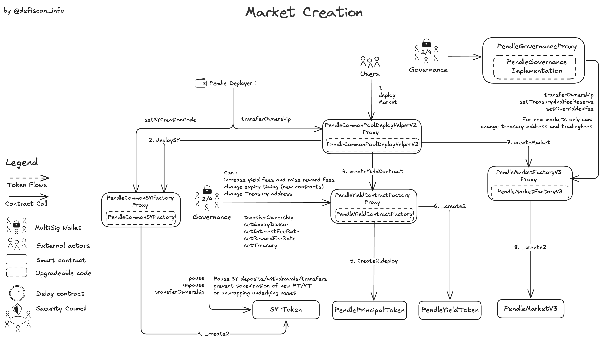
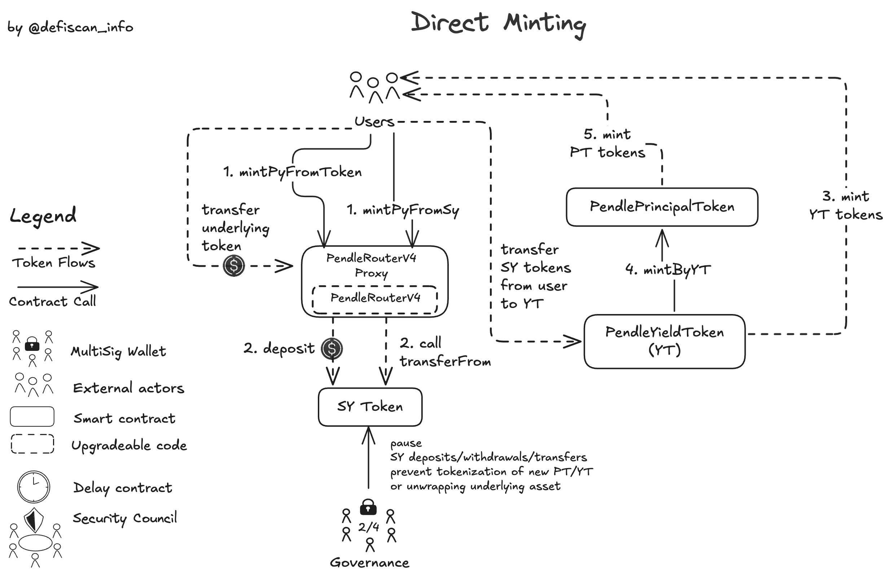
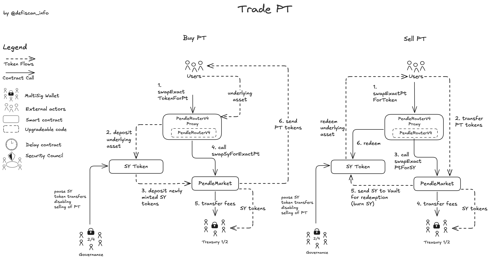
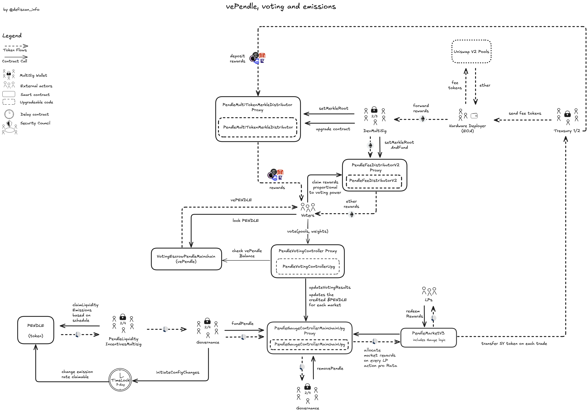
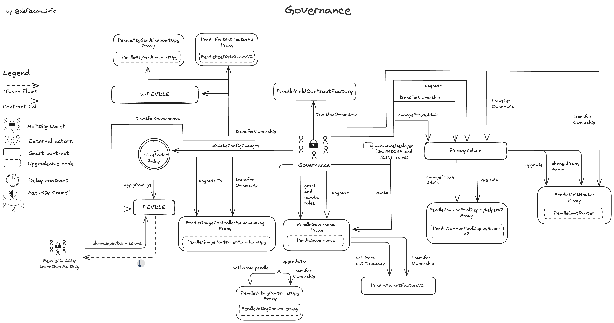

# Summary

Pendle is a yield-trading protocol that enables users to manage and optimize their yield exposure. By tokenizing yield-bearing assets into standardized yield tokens (SY), Pendle allows these assets to be split into principal tokens (PT) and yield tokens (YT). This separation facilitates various strategies, including earning fixed yields, speculating on future yield changes, and providing liquidity to earn additional rewards. Pendle's Automated Market Maker (AMM) is specifically designed to handle the trading of these assets.

# Ratings

## Chain

Pendle is deployed on various chains. This review is based on the Ethereum mainnet deployment of the protocol.

> Chain score: Low

## Upgradeability

The Pendle V2 protocol can be analyzed in a number of logical modules: _Yield Tokenization_, _Pendle AMM_ and _vePENDLE, Fees and Incentives_. Each module has upgradeable parts. Overall, these vectors could result in the _loss of user funds_, _loss of unclaimed yield_ or otherwise _materially affect the expected performance_ of the protocol. All the control vectors are held by various multisigs with insufficient decentralisation and no distributed _Onchain Governance_ voting exists to this date. See the [Security Council Table](#security-council) for more details on the accounts that are the permission owners.

With the current setup the _Upgradeability_ Score is _High_.

### Yield Tokenization

_Yield Tokenization_ is the foundation of Pendle. It allows to convert yield-bearing assets into standardized yield (SY) tokens which are then split into Principal Tokens (PT) and Yield Tokens (YT). This separation allows users to trade yield or fix the yield until the maturity date of a given market.

The [Governance](#security-council) multisig or the [hardwareDeployer](#security-council) EOA can pause the SY tokens, locking the supplied yield-bearing assets in the Pendle protocol beyond the maturity of a market and without an _Exit Window_. This could lead to temporary or permanent _loss of user funds_ and _loss of unclaimed yield_.

The [Governance](#security-council) multisig can further change the fees taken on the interest and rewards generated by a market from currently 5% to up to 20% without an _Exit Window_. A change of the fees applies retrospectively to the accrued interest and/or rewards in a market. This can thus lead to the _loss of unclaimed yield_ by YT holders in the respective market. Currently, this fee is 5% and 100% is redirected to vePENDLE voters. The official Pendle documentation mentions that the fee is subject to change in the future.

### Pendle AMM Module

Pendle PTs and YTs are traded on immutable AMM markets. These markets only allow the [Governance](#security-council) multisig to change a swap fee parameter up to 5% without affecting past LP yield.

### vePENDLE, Fees and Incentives

The _vePENDLE, fees and incentives_ module handles voting, boosts and rewards.

Each week the `vePENDLE` voters decide in a vote which pendle markets receive `PENDLE` emissions the next week by allocating their voting power to specific markets. The received voting share of each market from the total `vePENDLE` voting power determines the fraction of `PENDLE` issued to a single market. During the vote the `PENDLE` tokens reside in the `PendleVotingControllerUpg` contract before distribution to the markets. LPs can claim the emission only from the market contracts.

The [Governance](#security-council) multisig can completely upgrade the `PendleVotingControllerUpg`, or add and remove pools from receiving votes without timelock. A market that has received votes but is removed before the epoch is finalized and voting results are broadcasted does not receive `PENDLE` emissions in the next week.

After a vote concluded, the `PENDLE` tokens are sent to the market contract over the course of the entire week for LPs to claim. The `PENDLE` tokens that are accounted for the LPs can, before sent to the market contract, be withheld by the [Governance](#security-council) multisig by withdrawing the `PENDLE` tokens from the `PendleGaugeControllerMainchainUpg` contract which would cause a _loss of unclaimed yield_ for the LPs.

Already distributed `PENDLE` tokens from the `PendleGaugeControllerMainchainUpg` to the market contract cannot be withdrawn by a privileged permission owner, like the [Governance](#security-council) multisig.

Charged fees from trading activities (see this [section](#pendle-amm-module)) are automatically sent to the `Treasury` multisig. The fees allocated for the `vePENDLE` holders are forwarded to the `PendleFeeDistributorV2Proxy` from the `Treasury` multisig account via the [hardwareDeployer](#security-council) EOA. The collected fees can be withhold at any stage of the transfer from the Treasury to the `vePENDLE` holders. This could lead to complete _loss of unclaimed yield_ for an entire week.

The `PendleMultiTokenMerkleDistributor` allows `vePENDLE` holders to claim token rewards issued by third parties. The `PendleMultiTokenMerkleDistributor` is upgradeable by the [DevMultisig](#security-council) allowing to replace the contract implementation used to validate reward claims, without an _Exit Window_ or other protection. This could lead to _loss of unclaimed yield_.

> Upgradeability score: High

## Autonomy

Pendle deployment on Ethereum does not rely on any external dependency. However, Pendle markets use yield bearing tokens from third-party protocols. While this does not affect the decentralization assessment of the Pendle protocol itself, users should be aware that the performance and security of specific markets depend on the underlying yield bearing tokens of third-party protocols.

Please read the [Reviewer Notes](#reviewer-notes) to informed about the dependency risk on other chain deployments.

> Autonomy score: Low

## Exit Window

With the exception of the `PENDLE` token which implements a 7-day delay through the `initiateConfigChanges` function, most other protocol contracts can be upgraded or modified instantly without any delay or warning to users.

The [Governance](#security-council) multisig can _instantly_:

- pause SY tokens (blocking redemption of the underlying yield bearing token after maturity leading to _loss of funds_, and blocking trading of PT/YT)
- increase protocol fees on yield (leading to _loss of unclaimed yield_ of YT holders)
- increase trading fees (only affecting future yield)
- remove pools from voting systems (eliminating anticipated PENDLE rewards)
- withdrawing `PENDLE` emissions before distributed to market contracts (leading to _loss of unclaimed yield_ of LPs)
- withhold Fee distribution to `vePENDLE` voters

A _Medium_ score would require either a _Medium_ _Upgradeability_ score or at least _7-day Exit Window_ for all critical permissions, but the current setup does not provide any _Exit Window_ protection.

> Exit window score: High

## Accessibility

Users can only access Pendle through a single user interface: [app.pendle.finance](https://app.pendle.finance). Currently, there is no backup solution in case the interface is shut down or users are censored.

> Accessibility score: High

## Conclusion

The Pendle V2 protocol receives _High_ centralization scores for _Upgradeability_, _Exit Window_, and _Accessibility_ dimensions, and a _Low_ score for _Autonomy_.

The protocol could advance to **Stage 1** by; 1) assign permissions to an account that suffices the _Security Council requirements_ Or 2) implement 7-day exit window for critical functions.
And 3) improve accessibility by publishing the frontend code to IPFS or developing alternative interfaces.

# Reviewer Notes

⚠️ [sySwapper](https://etherscan.io/address/0x248087c69e72e211b7264720bf6cc5a954f98cde#code) is NOT verified on a public block explorer. As a consequence the full scope of permissions and their definitive impact cannot be assessed.

⚠️ The `PendlePYLpOracle`, essential for integrations by external protocols, is fully upgradeable and owned by the Governance multisig (2/4). The Governance multisig account can call `setBlockCycleNumerator` which can modifies TWAP calculations. This is a upgradeability risk introduced to protocols that integrate Pendle's TWAP.

⚠️ The `BaseSplitCodeFactoryContract` creates large contracts by splitting their bytecode into two separate fragments that function together as a single logical entity. The resulting fragment contracts remain unverified on Etherscan. The `BaseSplitCodeFactoryContract` is controlled by the EOA "Pendle: Deployer 1". The associated splitted unverified contracts are used as helper contracts to deploy markets and YT tokens.

⚠️ `vePENDLE` balances are synchronized across chains, to boost LP positions on other chains than mainnet. This requires LayerZero as a dependency. Such an analysis would be included in the report on the respective alternative chain.

# Protocol Analysis

## Market Creation

The Pendle protocol utilizes a yield-bearing token wrapper (SY) which then is split into principal (PT) and yield (YT) components. The creation of a market is permissionless.

The `PendleCommonSYFactory` is used to create new markets and instantiate the corresponding SY token via the `deploySY` function. The implementation code used by the Factory to deploy new SY tokens can be updated by [Pendle: Deployer 1](#security-council), an EOA, using creation code registered with `setSYCreationCode`. Importantly, existing SY token contracts and user funds already deposited in the protocol are not affected by this upgradeability vector, as the implementation update only applies to new SY token deployments.

`PendleYieldContractFactory` enables the creation of Principal Token (PT) and Yield Token (YT) contracts through its `createYieldContract` function, which is also permissionless. This function can be called directly by users or programmatically via the `PendleCommonPoolDeployHelperV2` as part of a full pool deployment process which also deploys the market.

## Yield Tokenization Process

### Direct Minting

PT and YT tokens are minted via the `PendleRouterV4`, fundamentally by converting Standardized Yield (SY) tokens. Users with SY can directly convert them to PT and YT using `mintPyFromSy`, where the `PendleYieldToken` contract receives SY, mints YT, and triggers `PendlePrincipalToken` to mint PT. Alternatively, `mintPyFromToken` allows users to start with external assets (e.g., ETH), which the router first converts to SY before following the same SY-to-PT/YT minting pathway.

In both cases, the `PendleYieldToken` contract serves as the vault for SY tokens and coordinates the creation of equal quantities of PT and YT. The `PendlePrincipalToken` contract does not hold any assets directly, while the `PendleYieldToken` contract retains all SY tokens as collateral.

Governance can interrupt this process by pausing SY operations, thus blocking deposits, withdrawals, and transfers and preventing the creation of new PT/YT.

### Redeem Underlying

SY → Underlying Assets (`redeemSyToToken`)  
Users can convert SY tokens back to the underlying assets through the `PendleRouterV4`. The router calls the respective SY contract's redeem function, which unwraps the SY token and returns the underlying asset (such as ETH, USDC, or wstETH) directly to the user. This process allows users to exit the Pendle ecosystem completely and reclaim their original assets.

## Providing Liquidity (LP)

Users can add liquidity to Pendle Markets to earn `PENDLE` emission rewards through the `addLiquiditySingleToken` function of `PendleRouterV4`, which delegates the operation to the `ActionAddRemoveLiqV3` contract. This process converts the deposited tokens to SY, uses a portion to acquire PT via `swapSyForExactPt`, and issues LP tokens representing a position in the PT/SY pool. Fees are collected and transferred to the Treasury.

Liquidity removal is performed via `removeLiquiditySingleToken`. The LP tokens are burned, the user receives their proportional share of SY and PT, the PT are converted to SY via `swapExactPtForSy`, and the SY are converted to underlying tokens. During both addition and removal, the `PendleGaugeController` contract distributes `PENDLE` rewards to the market and the user.

## AMM PT and YT Trading

### Trade PT

Principal Tokens can be minted indirectly through `PendleRouterV4` using swap functions, which delegate operations to the `ActionSwapPTV3` contract.

Buying PT:
Users can convert external tokens to PT in a single transaction using `swapExactTokenForPt`. The process involves tokenizing the external asset into SY tokens via the SY contract, then using these SY tokens in the `PendleMarket` to obtain PT. Unlike direct minting, this method acquires only PT without the corresponding YT. A portion of SY tokens is sent as fees to the `Treasury`.

Selling PT:
When redeeming PT for external tokens, users call `swapExactPtForToken`. The PT tokens are sent to the `PendleMarket` for conversion to SY tokens, which are then redeemed for the underlying asset. A portion of SY tokens is send as fees to the `Treasury`.

[Governance](#security-council) can `pause` SY token transfers, which technically prevents all PT trading operations. This pause blocks essential SY functions (deposits, withdrawals, transfers) that are required for both buying PT (cannot convert assets to SY or transfer SY to markets) and selling PT (cannot convert received SY back to underlying assets). Users with PT positions would be unable to exit until governance reactivates the SY token.

### Trade YT

Yield Tokens can be traded through the `PendleRouterV4` which delegates operations to the `ActionSwapYTV3` contract. Trading YT uses a flash swap mechanism to enable buying or selling YT independently.

Buying YT:
Users can acquire YT tokens without holding PT via `swapExactTokenForYt`. The router converts the external tokens to SY tokens, then temporarily borrows additional SY from the `PendleMarketV3` contract. All SY are used to mint both PT and YT (as they must be created in equal quantities), but only the YT are kept for the user. The PT are immediately sold back to the market to repay the borrowed SY. A portion of SY is sent as fees to the `Treasury`.

Selling YT:
When selling YT via `swapExactYtForToken`, the router borrows an equivalent amount of PT from the market, combines them with the user's YT to redeem SY (as both tokens are needed to unlock the underlying asset), then returns a portion of the SY to the market to repay the borrowed PT. The remaining SY are converted to the desired output token. As with buying, fees are collected and sent to the `Treasury`.

[Governance](#security-council) can `pause` SY token transfers, which completely blocks YT trading mechanisms. This pause prevents all essential operations on SY tokens (deposits, withdrawals, and transfers) that are necessary for flash swap functionality. Without these operations, it becomes technically impossible to buy or sell YT, as the process requires converting tokens to SY, minting PT+YT, and combining PT+YT to release SY. Users holding YT find themselves unable to exit their positions until governance decides to reactivate transfers.

## Router System and Action Modules

The `PendleRouterV4` functions as the protocol's central interface hub, directing user interactions to specialized execution modules. This architecture employs a selector-based routing mechanism where each function call is mapped to one of seven dedicated action modules, each responsible for specific protocol operations.

Unlike conventional Transparent proxies, the routing infrastructure of `PendleRouterV4` relies on a diamond proxy with `ActionStorageV4` to manage function selector mappings. The owner of the proxy is set to the governance multisig. By updating the different contracts which receive calls via the `PendleRouterV4` new endpoints can be established.

The primary modules include `ActionAddRemoveLiqV3` for liquidity management in Pendle pools, `ActionSwapPTV3` for Principal Token exchange operations, and `ActionSwapYTV3` for Yield Token transactions. Supporting modules such as `ActionMiscV3` handle yield redemption, token conversions, and position exits, while `ActionSimple` provides core utility functions. Advanced functionalities are enabled through `ActionAggregator` for batched operations and `ActionLimitOrder` for conditional trades.

## Limit Order System

The protocol implemented the `PendleLimitRouter` contract which enables limit orders of PT and YT.

Users can create orders that execute only when specific price conditions are met and can cancel their orders individually or in batches. The system uses EIP-712 signatures for order validation and employs logarithmic calculations for fee determination. These fee parameters are configured via `setLnFeeRateRoots` by either [Governance](#security-council) or the [hardwareDeployer](#security-council), while collected fees are directed to `Treasury1`.

## PENDLE Incentives and Fees

### Fee Collection and Distribution Path

The protocol implements a multi-stage fee distribution architecture with distinct flows for different market types. Fee revenue generated through market operations flows into two separate Treasury multisig accounts: `Treasury1` (2/6 multisig) processes fees from pools created before October 8, 2024, while `Treasury2` (2/5 multisig) handles those from newer pools.

From these Treasury accounts, tokens follow a standardized conversion path. The [hardwareDeployer](#security-council) EOA serves as an intermediary conversion agent, receiving tokens from both Treasury multisigs.
This EOA trades various tokens into ETH through the `PendleRouterV4` and then direct this ETH to the `PendleFeeDistributorV2Proxy` for final distribution to voters. However, since it's an EOA, high trust assumptions need to made that the collected fee is distributed.

The `PendleFeeDistributorV2Proxy` functions as the distribution contract for the collected fees that are rewarded to `vePENDLE` holders for their respective voting power. Under the [DevMultisig](#security-council) (2/3) administration, this contract posts merkle proofs through `setMerkleRootAndFund` to set the claims while simultaneously depositing funds for claiming.

In parallel, the legacy `PendleFeeDistributor` remains active under the control of an unidentified address (0xD9c9935f4BFaC33F38fd3A35265a237836b30Bd1). This contract continues to distribute USDC to users through a separate reward system not accountable to the current Treasury structure.

### PENDLE Emissions to LPs

The Pendle protocol distributes `PENDLE` tokens as incentives to liquidity providers (LPs) through a weighted voting system. `vePENDLE` holders can allocate their voting power across different pools.

The emission cycle begins when the [PendleLiquidityIncentivesMultisig](#security-council) claims newly minted PENDLE through `claimLiquidityEmissions` based on a predetermined schedule. The `PENDLE` token's parameters are protected by a 7-day timelock via `initiateConfigChanges`. These tokens then flow to [Governance](#security-council), which funds the `PendleGaugeControllerMainchainUpg` through the `fundPendle` function.

`vePENDLE` holders lock their `PENDLE` in the `VotingEscrowPendleMainchain` contract and direct incentives by voting on pool allocations through `vote(pools, weights)` in the `PendleVotingControllerUpg`. This contract verifies `vePENDLE` balances and manages configuration parameters including emission rates (`setPendlePerSec`) and pool eligibility (`addPool`, `removePool`).

The `PendleVotingControllerUpg` sends voting results to the `PendleGaugeControllerMainchainUpg` via `updateVotingResults`, which then allocates `PENDLE` rewards to `PendleMarketV3` contracts dynamically.

Finally, LPs can claim their accumulated rewards directly from `PendleMarketV3` contracts via `redeemRewards` or automatically receive them when closing their LP position through `removeLiquiditySingleToken`.

### Points Rewards

The `PendleMultiTokenMerkleDistributor` manages token points system rewards for `vePENDLE` holders through a monthly cycle. The system takes a snapshot of `vePENDLE` balances on the 20th of each month, with token distributions occurring approximately one week later. The [DevMultisig](#security-council) (2/3) controls this contract.

The process uses the `setMerkleRoot` function to establish which addresses can claim specific reward amounts, allowing the [DevMultisig](#security-council) to control reward distribution between the monthly snapshot and payout dates.
The contract implements the UUPS upgradeability pattern through `upgradeToAndCall`, enabling the [DevMultisig](#security-council) to modify implementation logic while preserving claimed data, and can also determine which token types are included in distributions. Administrative control follows a two-step ownership transfer pattern via `transferOwnership`, requiring the pending owner to explicitly claim ownership for security.

# Dependencies

The Pendle V2 Ethereum deployment has no external dependencies. The Pendle V2 deployments on other chains rely on Layer0 for broadcasting voting results and `vePENDLE` balances.

Pendle markets use yield bearing tokens from third-party protocols. This does not affect the dependency centralization risk assessment of the Pendle protocol itself, as its TVL is distributed across many different markets, each relying on a different third-party yield bearing token. As a result, each dependency on a third-party protocol is limited to a single market.

# Governance

The Pendle protocol implements a governance model where the [Governance](#security-council) multisig (2/4) maintains extensive control over all protocol aspects through multiple mechanisms.

For direct token control, [Governance](#security-council) controls the `PENDLE` token via `transferOwnership` authority and initiates parameter changes through `initiateConfigChanges` (with 7-day timelock protection). It also controls the vote-escrowed `vePENDLE` token via `transferGovernance`, which is the cornerstone of the protocol's voting mechanism.

Regarding core infrastructure, [Governance](#security-council) holds the `DEFAULT_ADMIN_ROLE` in `PendleGovernanceProxy`, enabling it to grant and revoke roles, upgrade the implementation, and pause critical protocol functions. The `PendleGovernanceProxy` in turn has direct control over `PendleMarketFactoryV3`, with capabilities to set fees and treasury addresses. Separately, [Governance](#security-council) directly manages the `ProxyAdmin` contract, which specifically provides upgrade authority over `PendleCommonPoolDeployHelperV2` and `PendleLimitRouter`.

For reward system control, [Governance](#security-council) directly manages both `PendleGaugeControllerMainchainUpg` and `PendleVotingControllerUpg` via `upgradeTo` and `transferOwnership` functions.

[Governance](#security-council) also maintains authority over `PendleYieldContractFactory` via `transferOwnership` and controls cross-chain messaging through the `PendleMsgSendEndpointUpg` proxy. The multisig has assigned `GUARDIAN` and `ALICE` roles to the [hardwareDeployer](#security-council) EOA, which enables this address to perform critical actions including pausing functions.

The only significant timelock protection in this governance structure is the 7-day delay on `PENDLE` token parameter changes, while other governance actions can be executed without delay. The `Timelock` contract receives the `initiateConfigChanges` call and enforces the waiting period before `applyConfigs` can be called, providing a security mechanism for token parameter modifications.

## Security Council

| Multisig / Role                   | Address                                                                                                               | Type         | At least 7 signers | At least 51% threshold | ≥50% non-insider signers | Signers publicly announced |
| --------------------------------- | --------------------------------------------------------------------------------------------------------------------- | ------------ | ------------------ | ---------------------- | ------------------------ | -------------------------- |
| Governance                        | [0x8119EC16F0573B7dAc7C0CB94EB504FB32456ee1](https://etherscan.io/address/0x8119EC16F0573B7dAc7C0CB94EB504FB32456ee1) | Multisig 2/4 | ❌                 | ❌                     | ❌                       | ❌                         |
| PendleLiquidityIncentivesMultisig | [0xe8D28E2CA24BB16Fc7e6549eF937e05981d02606](https://etherscan.io/address/0xe8D28E2CA24BB16Fc7e6549eF937e05981d02606) | Multisig 2/4 | ❌                 | ❌                     | ❌                       | ❌                         |
| Pendle: Deployer 1                | [0x1FcCC097db89A86Bfc474A1028F93958295b1Fb7](https://etherscan.io/address/0x1FcCC097db89A86Bfc474A1028F93958295b1Fb7) | EOA          | ❌                 | ❌                     | ❌                       | ❌                         |
| hardwareDeployer                  | [0xeea6F790F18563E91b18DF00B89d9f79b2E6761F](https://etherscan.io/address/0xeea6F790F18563E91b18DF00B89d9f79b2E6761F) | EOA          | ❌                 | ❌                     | ❌                       | ❌                         |
| DevMultisig                       | [0xE6F0489ED91dc27f40f9dbe8f81fccbFC16b9cb1](https://etherscan.io/address/0xE6F0489ED91dc27f40f9dbe8f81fccbFC16b9cb1) | Multisig 2/3 | ❌                 | ✅                     | ❌                       | ❌                         |
| Treasury 1                        | [0x8270400d528c34e1596EF367eeDEc99080A1b592](https://etherscan.io/address/0x8270400d528c34e1596EF367eeDEc99080A1b592) | Multisig 2/6 | ❌                 | ❌                     | ❌                       | ❌                         |
| Treasury 2                        | [0xC328dFcD2C8450e2487a91daa9B75629075b7A43](https://etherscan.io/address/0xC328dFcD2C8450e2487a91daa9B75629075b7A43) | Multisig 2/5 | ❌                 | ❌                     | ❌                       | ❌                         |
| Undeclared Address                | [0xD9c9935f4BFaC33F38fd3A35265a237836b30Bd1](https://etherscan.io/address/0xD9c9935f4BFaC33F38fd3A35265a237836b30Bd1) | EOA          | ❌                 | ❌                     | ❌                       | ❌                         |

# Contracts and Permissions

## Contracts

| Contract Name                                       | Address                                                                                                               |
| --------------------------------------------------- | --------------------------------------------------------------------------------------------------------------------- |
| PENDLE                                              | [0x808507121b80c02388fad14726482e061b8da827](https://etherscan.io/address/0x808507121b80c02388fad14726482e061b8da827) |
| WETH9                                               | [0xc02aaa39b223fe8d0a0e5c4f27ead9083c756cc2](https://etherscan.io/address/0xc02aaa39b223fe8d0a0e5c4f27ead9083c756cc2) |
| sySwapper                                           | [0x248087C69e72E211b7264720Bf6cC5A954F98CDE](https://etherscan.io/address/0x248087C69e72E211b7264720Bf6cC5A954F98CDE) |
| BaseSplitCodeFactoryContract                        | [0x35878C2Cff38cC4032E85283183428170BA618A2](https://etherscan.io/address/0x35878C2Cff38cC4032E85283183428170BA618A2) |
| PendleGovernanceProxy (Proxy)                       | [0x2aD631F72fB16d91c4953A7f4260A97C2fE2f31e](https://etherscan.io/address/0x2aD631F72fB16d91c4953A7f4260A97C2fE2f31e) |
| PendleGovernanceProxy (Implementation)              | [0x41dd1bd32a1db1460e7253969d591132f75f74d6](https://etherscan.io/address/0x41dd1bd32a1db1460e7253969d591132f75f74d6) |
| PendleRouterV4                                      | [0x888888888889758F76e7103c6CbF23ABbF58F946](https://etherscan.io/address/0x888888888889758F76e7103c6CbF23ABbF58F946) |
| ActionAddRemoveLiqV3                                | [0x663C21103915B68e9dA797CfdF3cAb01a037D5Ff](https://etherscan.io/address/0x663C21103915B68e9dA797CfdF3cAb01a037D5Ff) |
| ActionSwapPTV3                                      | [0xd8D200d9A713A1c71cF1e7F694B14E5F1D948b15](https://etherscan.io/address/0xd8D200d9A713A1c71cF1e7F694B14E5F1D948b15) |
| ActionSwapYTV3                                      | [0x4a03Ce0a268951d04E187B1CF48075eE69266e27](https://etherscan.io/address/0x4a03Ce0a268951d04E187B1CF48075eE69266e27) |
| ActionMiscV3                                        | [0x373Dba2055Ad40cb4815148bC47cd1DC16e92E44](https://etherscan.io/address/0x373Dba2055Ad40cb4815148bC47cd1DC16e92E44) |
| ActionSimple                                        | [0x852e59252c94716F0df19B52b36512f6C9297a96](https://etherscan.io/address/0x852e59252c94716F0df19B52b36512f6C9297a96) |
| ActionCallbackV3                                    | [0x997FBC511a8Ad11F84a400feACD66E2A3fa805d2](https://etherscan.io/address/0x997FBC511a8Ad11F84a400feACD66E2A3fa805d2) |
| ActionStorageV4                                     | [0x6a0Ed0A9193FCBe7ae9B0F3D90F88e365Cca64fC](https://etherscan.io/address/0x6a0Ed0A9193FCBe7ae9B0F3D90F88e365Cca64fC) |
| PendleSwap                                          | [0xd4e9B0d466789d7F6201442eecCBA6a75A552db0](https://etherscan.io/address/0xd4e9B0d466789d7F6201442eecCBA6a75A552db0) |
| PendlePYLpOracle (Proxy)                            | [0x9a9fa8338dd5e5b2188006f1cd2ef26d921650c2](https://etherscan.io/address/0x9a9fa8338dd5e5b2188006f1cd2ef26d921650c2) |
| PendlePYLpOracle (Implementation)                   | [0x14418800e0b4c971905423aa873e83355922428c](https://etherscan.io/address/0x14418800e0b4c971905423aa873e83355922428c) |
| PendleYieldContractFactory (yieldContractFactoryV5) | [0x35A338522a435D46f77Be32C70E215B813D0e3aC](https://etherscan.io/address/0x35A338522a435D46f77Be32C70E215B813D0e3aC) |
| PendlePrincipalToken (Example PT)                   | [0x50D2C7992b802Eef16c04FeADAB310f31866a545](https://etherscan.io/address/0x50D2C7992b802Eef16c04FeADAB310f31866a545) |
| PendleYieldToken (Example YT)                       | [0x708dD9B344dDc7842f44C7b90492CF0e1E3eb868](https://etherscan.io/address/0x708dD9B344dDc7842f44C7b90492CF0e1E3eb868) |
| PendleMarketFactoryV3 (marketFactoryV5)             | [0x6fcf753f2C67b83f7B09746Bbc4FA0047b35D050](https://etherscan.io/address/0x6fcf753f2C67b83f7B09746Bbc4FA0047b35D050) |
| PendleMarketV3 (Example)                            | [0x85667e484a32d884010cf16427d90049ccf46e97](https://etherscan.io/address/0x85667e484a32d884010cf16427d90049ccf46e97) |
| PendlePoolDeployHelper                              | [0x4Df98410c95737FD646D2413AC6CAFc1c04834b9](https://etherscan.io/address/0x4Df98410c95737FD646D2413AC6CAFc1c04834b9) |
| PendlePoolDeployHelperV2                            | [0xF642d8Daa026B8aEd6dFE82FACbA2E077AF199E2](https://etherscan.io/address/0xF642d8Daa026B8aEd6dFE82FACbA2E077AF199E2) |
| PendleLimitRouter (Proxy)                           | [0x000000000000c9B3E2C3Ec88B1B4c0cD853f4321](https://etherscan.io/address/0x000000000000c9B3E2C3Ec88B1B4c0cD853f4321) |
| PendleLimitRouter (Implementation)                  | [0xcbefc0b1fb24995883e31f8e24cb78c25a9f51ab](https://etherscan.io/address/0xcbefc0b1fb24995883e31f8e24cb78c25a9f51ab) |
| ProxyAdmin                                          | [0xA28c08f165116587D4F3E708743B4dEe155c5E64](https://etherscan.io/address/0xA28c08f165116587D4F3E708743B4dEe155c5E64) |
| Reflector                                           | [0x73d5DBF81A4f3bFa7b335e6a2d4638D6017a4fA8](https://etherscan.io/address/0x73d5DBF81A4f3bFa7b335e6a2d4638D6017a4fA8) |
| PendleCommonPoolDeployHelperV2 (Proxy)              | [0x2Ed473F528E5B320f850d17ADfe0e558f0298aA9](https://etherscan.io/address/0x2Ed473F528E5B320f850d17ADfe0e558f0298aA9) |
| PendleCommonPoolDeployHelperV2 (Implementation)     | [0x1bd53748cb557da4cfe7c535f6dcb3bcec38d055](https://etherscan.io/address/0x1bd53748cb557da4cfe7c535f6dcb3bcec38d055) |
| PendleCommonSYFactory (Proxy)                       | [0x466ced3b33045ea986b2f306c8d0aa8067961cf8](https://etherscan.io/address/0x466ced3b33045ea986b2f306c8d0aa8067961cf8) |
| PendleCommonSYFactory (Implementation)              | [0x3ba05f8989262e0637c6350437d0db7f14fbda96](https://etherscan.io/address/0x3ba05f8989262e0637c6350437d0db7f14fbda96) |
| PendleERC4626SYV2 (Example SY)                      | [0x7ac8ca87959b1d5EDfe2df5325A37c304DCea4D0](https://etherscan.io/address/0x7ac8ca87959b1d5EDfe2df5325A37c304DCea4D0) |
| PendleSparkLinearDiscountOracleFactory              | [0x34C91651A070664279866E5f3d6B4d5F65cbbFFb](https://etherscan.io/address/0x34C91651A070664279866E5f3d6B4d5F65cbbFFb) |
| PendleChainlinkOracleFactory                        | [0x2A73e899389cABa2a2f648BaBA35e67f5C00EFee](https://etherscan.io/address/0x2A73e899389cABa2a2f648BaBA35e67f5C00EFee) |
| VotingEscrowPendleMainchain (vePendle)              | [0x4f30A9D41B80ecC5B94306AB4364951AE3170210](https://etherscan.io/address/0x4f30A9D41B80ecC5B94306AB4364951AE3170210) |
| PendleMsgSendEndpointUpg (Proxy)                    | [0x07b1014c88f14C9E910092526db57A20052E989F](https://etherscan.io/address/0x07b1014c88f14C9E910092526db57A20052E989F) |
| PendleMsgSendEndpointUpg (Implementation)           | [0xdcf7313cc90cfd7589fba65d1985e02b5de31e9a](https://etherscan.io/address/0xdcf7313cc90cfd7589fba65d1985e02b5de31e9a) |
| PendleVotingControllerUpg (Proxy)                   | [0x44087E105137a5095c008AaB6a6530182821F2F0](https://etherscan.io/address/0x44087E105137a5095c008AaB6a6530182821F2F0) |
| PendleVotingControllerUpg (Implementation)          | [0x2ddfe90808e6a4679575c0f727d3f2f104fba604](https://etherscan.io/address/0x2ddfe90808e6a4679575c0f727d3f2f104fba604) |
| PendleGaugeControllerMainchainUpg (Proxy)           | [0x47D74516B33eD5D70ddE7119A40839f6Fcc24e57](https://etherscan.io/address/0x47D74516B33eD5D70ddE7119A40839f6Fcc24e57) |
| PendleGaugeControllerMainchainUpg (Implementation)  | [0x7762cbfa8f62999a8a40d800b751686e99a31c9a](https://etherscan.io/address/0x7762cbfa8f62999a8a40d800b751686e99a31c9a) |
| PendleMultiTokenMerkleDistributor (Proxy)           | [0x3942F7B55094250644cFfDa7160226Caa349A38E](https://etherscan.io/address/0x3942F7B55094250644cFfDa7160226Caa349A38E) |
| PendleMultiTokenMerkleDistributor (Implementation)  | [0x946afc64dcb64bb96688ead4f0d0ac67b1dd7a36](https://etherscan.io/address/0x946afc64dcb64bb96688ead4f0d0ac67b1dd7a36) |
| ERC1967Proxy (externalRewardsDistributor)           | [0xae898a7d07f8e27f25e13d0f351a7401f9a5bf9d](https://etherscan.io/address/0xae898a7d07f8e27f25e13d0f351a7401f9a5bf9d) |
| PendleFeeDistributor (Proxy)                        | [0xd7b34a6fDCb2A7ceD2115FF7f5fdD72aa6aA4dE2](https://etherscan.io/address/0xd7b34a6fDCb2A7ceD2115FF7f5fdD72aa6aA4dE2) |
| PendleFeeDistributor (Implementation)               | [0xb0caa67c712d96809f2abaf2c95369ef942ce8cb](https://etherscan.io/address/0xb0caa67c712d96809f2abaf2c95369ef942ce8cb) |
| PendleFeeDistributorV2 (Proxy)                      | [0x8C237520a8E14D658170A633D96F8e80764433b9](https://etherscan.io/address/0x8C237520a8E14D658170A633D96F8e80764433b9) |
| PendleFeeDistributorV2 (Implementation)             | [0xafaae49c7684a2f386eb18569966604973f9d83d](https://etherscan.io/address/0xafaae49c7684a2f386eb18569966604973f9d83d) |

## All Permission owners

| Name                                                     | Account                                                                                                               | Type         |
| -------------------------------------------------------- | --------------------------------------------------------------------------------------------------------------------- | ------------ |
| Governance                                               | [0x8119EC16F0573B7dAc7C0CB94EB504FB32456ee1](https://etherscan.io/address/0x8119EC16F0573B7dAc7C0CB94EB504FB32456ee1) | Multisig 2/4 |
| PendleLiquidityIncentivesMultisig                        | [0xe8D28E2CA24BB16Fc7e6549eF937e05981d02606](https://etherscan.io/address/0xe8D28E2CA24BB16Fc7e6549eF937e05981d02606) | Multisig 2/4 |
| Pendle: Deployer 1                                       | [0x1FcCC097db89A86Bfc474A1028F93958295b1Fb7](https://etherscan.io/address/0x1FcCC097db89A86Bfc474A1028F93958295b1Fb7) | EOA          |
| hardwareDeployer                                         | [0xeea6F790F18563E91b18DF00B89d9f79b2E6761F](https://etherscan.io/address/0xeea6F790F18563E91b18DF00B89d9f79b2E6761F) | EOA          |
| DevMultisig                                              | [0xE6F0489ED91dc27f40f9dbe8f81fccbFC16b9cb1](https://etherscan.io/address/0xE6F0489ED91dc27f40f9dbe8f81fccbFC16b9cb1) | Multisig 2/3 |
| Treasury                                                 | [0x8270400d528c34e1596EF367eeDEc99080A1b592](https://etherscan.io/address/0x8270400d528c34e1596EF367eeDEc99080A1b592) | Multisig 2/6 |
| Unknown Address (PendleFeeDistributor(not in use) Owner) | [0xD9c9935f4BFaC33F38fd3A35265a237836b30Bd1](https://etherscan.io/address/0xD9c9935f4BFaC33F38fd3A35265a237836b30Bd1) | EOA          |

## Permissions

| Contract                          | Function                 | Impact                                                                                                                                                                                                                                                                                                                                                                                                                                                                                                                                                                                                                                                                                             | Owner                                                                          |     |
| --------------------------------- | ------------------------ | -------------------------------------------------------------------------------------------------------------------------------------------------------------------------------------------------------------------------------------------------------------------------------------------------------------------------------------------------------------------------------------------------------------------------------------------------------------------------------------------------------------------------------------------------------------------------------------------------------------------------------------------------------------------------------------------------- | ------------------------------------------------------------------------------ | --- |
| PENDLE                            | withdrawEther            | This function transfers Ether held in the contract to an address specified by [Governance](#security-council). This function exists as a safety mechanism to recover any Ether accidentally sent to the contract address, as the contract itself has no functionality that intentionally accepts Ether deposits.                                                                                                                                                                                                                                                                                                                                                                                   | Governance                                                                     |     |
| PENDLE                            | withdrawToken            | This function allows [Governance](#security-council) to withdraw any ERC-20 token from the contract to a specified address. Similar to withdrawEther, it serves as a recovery mechanism for tokens that might be sent to the contract unintentionally, as the contract explicitly prevents direct `PENDLE` token transfers to itself.                                                                                                                                                                                                                                                                                                                                                              | Governance                                                                     |     |
| PENDLE                            | claimGovernance          | This function allows the pending governance address to claim control over the contract by updating the governance state variable. This completes the two-step governance transfer process, ensuring secure transition of administrative control. If the pending governance address is compromised, the attacker would gain control over all governance-restricted functions, including config changes and fund withdrawals.                                                                                                                                                                                                                                                                        | pending owner not assigned                                                     |     |
| PENDLE                            | transferGovernance       | This function initiates the process of transferring governance control by setting a new pending governance address. This is the first step in the two-phase ownership transfer mechanism designed to prevent accidental transfers.                                                                                                                                                                                                                                                                                                                                                                                                                                                                 | Governance                                                                     |     |
| PENDLE                            | initiateConfigChanges    | This function applies previously initiated configuration changes, but only after the mandatory 7-day timelock period has elapsed. This timelock mechanism provides a security buffer against malicious or erroneous configuration changes. If configuration changes were maliciously initiated, this function would make them effective after the timelock, potentially allowing manipulation of the token economics.                                                                                                                                                                                                                                                                              | Governance                                                                     |     |
| PENDLE                            | claimLiquidityEmissions  | This function mints new `PENDLE` tokens according to the emission schedule and sends them to the liquidityIncentivesRecipient. This is the primary mechanism for distributing token rewards in the protocol's liquidity incentive program. If the incentives recipient is compromised, the attacker could claim all newly minted tokens meant for liquidity providers.                                                                                                                                                                                                                                                                                                                             | PendleLiquidityIncentivesMultisig                                              |     |
| BaseSplitCodeFactoryContract      | transferOwnership        | This function transfers ownership rights to a new address, either directly or by setting a pending owner depending on the parameters provided. The owner has exclusive privileges to deploy arbitrarily large contracts that can bypass standard EVM size limitations through the code-splitting technique. A malicious owner could transfer ownership to an untrusted entity who could then deploy malicious contracts.                                                                                                                                                                                                                                                                           | Pendle: Deployer 1                                                             |     |
| BaseSplitCodeFactoryContract      | claimOwnership           | This function allows the pending owner to claim ownership as the second step in the two-phase ownership transfer process with no waiting period or timelock. This function completes the ownership transfer giving the new owner complete control over the factory's deployment capabilities. If the pending owner address is compromised before the claim is executed, an attacker could immediately take control of the contract factory and deploy malicious large-scale contracts throughout the ecosystem.                                                                                                                                                                                    | Pendle: Deployer 1                                                             |     |
| BaseSplitCodeFactoryContract      | deploy                   | This function allows the owner to deploy contracts with creation code exceeding standard EVM size limits by splitting the code across two storage contracts. This capability enables the factory to deploy extremely large and complex contracts that would otherwise be impossible under Ethereum's size constraints. A malicious owner could deploy contracts with complex vulnerabilities or backdoors hidden within large bytecode, making them particularly difficult to audit and potentially enabling sophisticated attacks on the protocol.                                                                                                                                                | Pendle: Deployer 1                                                             |     |
| PendleGovernanceProxy             | upgradeTo                | This function allows addresses with the DEFAULT_ADMIN_ROLE to upgrade the implementation of the UUPS proxy to a new contract address. This contract serves as an intermediary ownership contract, controlling permissions in the Pendle system. Upgrading this contract could lead to assigning permissions to outside actors which could claim controler over the permissions that are ultimately assigned to PendleGovernanceProxy.                                                                                                                                                                                                                                                              | Governance                                                                     |     |
| PendleGovernanceProxy             | upgradeToAndCall         | This function allows addresses with the DEFAULT_ADMIN_ROLE to upgrade the implementation contract and immediately execute an initialization function on the new implementation.                                                                                                                                                                                                                                                                                                                                                                                                                                                                                                                    | Governance                                                                     |     |
| PendleGovernanceProxy             | grantRole                | This function enables addresses with the DEFAULT_ADMIN_ROLE to assign specific roles to any address in the system. Role-based access control is the foundation of the contract's security model, determining which addresses can perform sensitive actions. A malicious admin could grant critical roles like GUARDIAN or DEFAULT_ADMIN_ROLE to compromised addresses, which then have control over permissions assigned to PendleGovernanceProxy.                                                                                                                                                                                                                                                 | Governance                                                                     |     |
| PendleGovernanceProxy             | revokeRole               | This function allows addresses with the DEFAULT_ADMIN_ROLE to remove roles from any address in the system. This capability is essential for maintaining the security of the contract by removing privileges from compromised addresses. A malicious admin could revoke roles from legitimate operators, creating a denial of service by preventing authorized actions from being performed, disrupting the protocol's operations.                                                                                                                                                                                                                                                                  | Governance                                                                     |     |
| PendleGovernanceProxy             | aggregate                | This function allows addresses with ALICE, BOB, CHARLIE or DEFAULT_ADMIN_ROLE to execute multiple contract calls in a single transaction, with non-admins restricted to pre-approved function selectors. This multicall capability enables efficient batch operations and complex contract interactions in a single transaction. A malicious actor with access to one of these roles could execute harmful combinations of allowed functions, potentially exploiting interactions between contract calls that might not be apparent when evaluating individual function permissions.                                                                                                               | Governance, hardwareDeployer                                                   |     |
| PendleGovernanceProxy             | pause                    | This function enables addresses with the GUARDIAN or DEFAULT_ADMIN_ROLE to pause multiple contracts implementing the IPPausingInterface in a single transaction. This emergency mechanism protects the system during attacks or when critical bugs are discovered by temporarily halting operations. A malicious guardian could inappropriately trigger a system-wide pause. If pause is called on an SY token, user funds associated with the particular market are then locked into Pendle.                                                                                                                                                                                                      | Governance, hardwareDeployer                                                   |     |
| PendleGovernanceProxy             | setAllowedSelectors      | This function allows addresses with the DEFAULT_ADMIN_ROLE to configure which function selectors are permitted for use with the aggregate function by specific roles. This control mechanism restricts which contract functions can be called by which roles when using the batch execution capability.                                                                                                                                                                                                                                                                                                                                                                                            | Governance                                                                     |     |
| PendleGovernanceProxy             | \_authorizeUpgrade       | This internal function enforces that only addresses with the DEFAULT_ADMIN_ROLE can authorize upgrades of the contract implementation. This is the core security check of the UUPS proxy pattern that protects against unauthorized upgrades.                                                                                                                                                                                                                                                                                                                                                                                                                                                      | Governance                                                                     |     |
| ActionStorageV4                   | setSelectorToFacets      | This function allows the owner to modify the routing of function selectors to their respective implementations.                                                                                                                                                                                                                                                                                                                                                                                                                                                                                                                                                                                    | Governance                                                                     |     |
| ActionStorageV4                   | transferOwnership        | This function initiates the two-step ownership transfer process by setting a pending owner address. The direct parameter also allows for immediate transfer, bypassing the two-step security mechanism.                                                                                                                                                                                                                                                                                                                                                                                                                                                                                            | Governance                                                                     |     |
| ActionStorageV4                   | claimOwnership           | This function finalizes the two-step ownership transfer process, allowing the pending owner to claim full administrative control.                                                                                                                                                                                                                                                                                                                                                                                                                                                                                                                                                                  | Governance                                                                     |     |
| PendlePYLpOracle                  | transferOwnership        | This function transfers ownership rights to a new address, either directly or through a two-step process depending on the parameters provided. The owner of this oracle has the ability to modify the blockCycleNumerator parameter which affects the TWAP calculations and oracle cardinality requirements. A malicious owner could set an invalid blockCycleNumerator that would cause the oracle to potentially become succeptible to manipulation. This risk affects protocols that integrate Pendles TWAP oracle.                                                                                                                                                                             | Governance                                                                     |     |
| PendlePYLpOracle                  | claimOwnership           | This function allows the pending owner to claim ownership of the contract as the second step in the two-phase ownership transfer process. This function enables the secure transfer of critical oracle control without requiring direct handover. The new owner can set parameters of the TWAP, potentially making the oracle more suceptible for manipulation.                                                                                                                                                                                                                                                                                                                                    | pending owner not assigned                                                     |     |
| PendlePYLpOracle                  | setBlockCycleNumerator   | This function allows the owner to modify the blockCycleNumerator parameter which determines how the oracle calculates required cardinality for TWAP measurements. This parameter is critical for ensuring the oracle has sufficient historical data points to calculate accurate prices. A malicious owner could set this parameter inappropriately, which could make the TWAP suceptible for manipulation.                                                                                                                                                                                                                                                                                        | Governance                                                                     |     |
| PendleYieldContractFactory        | transferOwnership        | This function allows the current owner to transfer ownership to a new address through a two-step process where the new address must claim ownership. The owner controls critical parameters including fee rates, expiry divisor, and treasury address that affect the entire yield token ecosystem. A malicious owner could initiate a transfer to a compromised address which could then modify fee parameters up to their maximum values (20%) or redirect treasury funds to steal protocol revenue.                                                                                                                                                                                             | Governance                                                                     |     |
| PendleYieldContractFactory        | setExpiryDivisor         | This function allows the owner to set the expiry divisor parameter which determines valid expiry timestamps for all yield contracts (expiry must be divisible by this value). This parameter directly impacts which yield contracts can be created and when they expire, affecting market liquidity and user positions. A malicious owner could set a disruptive divisor that prevents users from creating contracts with reasonable expiry periods.                                                                                                                                                                                                                                               | Governance                                                                     |     |
| PendleYieldContractFactory        | setInterestFeeRate       | This function allows the owner to adjust the interest fee rate (currently 3%) that applies to all yield accrued across the protocol, with a maximum cap of 20%. This fee directly impacts returns for all YT holders and revenue for expired unredeemed PTs in the system. A malicious owner could suddenly increase the fee to the maximum 20% threshold, capturing a substantial portion of users' yield and redirecting it to the treasury, causing loss of unclaimed yield.                                                                                                                                                                                                                    | Governance                                                                     |     |
| PendleYieldContractFactory        | setRewardFeeRate         | This function allows the owner to modify the reward fee rate (currently 3%) charged on token rewards (including points) with a maximum cap of 20%. This fee determines what percentage of external rewards generated through the yield tokens is captured by the protocol. A malicious owner could increase this fee to the maximum allowed 20%, significantly reducing user rewards and potentially making certain yield strategies unprofitable, directly affecting user returns and liquidity incentives throughout the system.                                                                                                                                                                 | Governance                                                                     |     |
| PendleYieldContractFactory        | setTreasury              | This function allows the owner to change the treasury address that receives all protocol fees collected from interest and rewards. This address accumulates significant value over time as it receives a percentage of all yield generated across the protocol. A malicious owner could change the treasury address to a personal wallet or compromised contract, redirecting all future protocol revenue away from the intended recipient (currently 0x8270400d528c34e1596EF367eeDEc99080A1b592) and stealing funds that should benefit the protocol and its stakeholders.                                                                                                                        | Governance                                                                     |     |
| PendleMarketFactoryV3             | transferOwnership        | This function allows the current owner to transfer ownership to a new address, either directly or through a two-step process depending on parameters. The owner has complete control over critical protocol parameters including treasury address and fee configurations that directly impact revenue distribution. A malicious owner could transfer control to a compromised address without any timelock, allowing immediate manipulation of fees and treasury addresses to divert protocol revenue.                                                                                                                                                                                             | PendleGovernanceProxy                                                          |     |
| PendleMarketFactoryV3             | claimOwnership           | This function allows the pending owner address to claim control of the contract, completing the two-step ownership transfer process. This final step of ownership transfer grants all administrative privileges to the new address without any waiting period. If the pending owner address were compromised, the attacker would immediately gain full control over all critical protocol parameters, including fee configuration and revenue direction.                                                                                                                                                                                                                                           | pending owner not assigned                                                     |     |
| PendleMarketFactoryV3             | setTreasuryAndFeeReserve | This function simultaneously updates the treasury address that receives protocol fees and the reserve fee percentage, without timelock protection. The treasury receives a portion of all trading fees from Pendle markets, making this function critical for protocol revenue management. A malicious owner could redirect fee revenue to a malicious address and maximize the reserve fee percentage to 100%, diverting all protocol fees meant for legitimate stakeholders.                                                                                                                                                                                                                     | PendleGovernanceProxy                                                          |     |
| PendleMarketFactoryV3             | setOverriddenFee         | This function allows the owner to set a custom fee rate for specific router and market combinations that overrides the default fee. If the fee is significantly lowered, the `vePENDLE` voters receive less fees, reducing their expected performance.                                                                                                                                                                                                                                                                                                                                                                                                                                             | PendleGovernanceProxy                                                          |     |
| PendleLimitRouter                 | setFeeRecipient          | This function changes the address that receives all protocol fees collected from limit order executions. The fee recipient is the destination for all revenue generated by the protocol based on the fee rates set by setLnFeeRateRoots. A malicious owner could instantly redirect all protocol fee revenue to a controlled address, immediately diverting the revenue stream with no timelock or governance vote required.                                                                                                                                                                                                                                                                       | Governance                                                                     |     |
| PendleLimitRouter                 | setOwnerHelper           | This function allows the owner to set a new address as the ownerHelper, which has equivalent permissions to the owner for specific functions like setLnFeeRateRoots. The ownerHelper creates a dual control mechanism for certain critical parameter changes in the protocol. If compromised, an attacker with owner privileges could set a malicious ownerHelper, bypassing the dual control security measure, with no timelock protection in place to prevent immediate execution.                                                                                                                                                                                                               | Governance                                                                     |     |
| PendleLimitRouter                 | setLnFeeRateRoots        | This function updates the logarithmic fee rate parameters for specific Yield Token addresses, directly impacting the fee calculation for limit orders in the protocol. Either the owner or ownerHelper can call this function, with fee rates having a hard-coded maximum value to prevent extreme settings. If misused, an attacker with either owner or ownerHelper privileges could immediately set fees to their maximum allowed values, extracting excessive value from users without any timelock delay.                                                                                                                                                                                     | Governance, hardwareDeployer                                                   |     |
| PendleLimitRouter                 | transferOwnership        | This function initiates the first step of the two-phase ownership transfer process by setting a pending owner address. This function controls who will have future administrative control over the entire protocol, including all privileged functions. If compromised, an attacker could initiate a transfer to a malicious address which could then claim ownership, with no timelock or delay protecting this critical administrative change.                                                                                                                                                                                                                                                   | Governance                                                                     |     |
| PendleLimitRouter                 | claimOwnership           | This function completes the two-phase ownership transfer process, allowing the pending owner to claim full administrative control. The claimOwnership function can only be called by the address set as pendingOwner, creating a security check for ownership transfers. If the pendingOwner address were compromised (currently set to address zero), an attacker could immediately claim full control over the protocol without any timelock or waiting period.                                                                                                                                                                                                                                  | pending owner not assigned                                                     |     |
| ProxyAdmin                        | transferOwnership        | This function transfers the ownership of the ProxyAdmin contract to a new address. The owner has complete control over proxy upgrades and admin changes for all proxies managed by this contract. A malicious owner could upgrade proxies to malicious implementations, potentially stealing user funds or permanently breaking functionality of all associated contracts.                                                                                                                                                                                                                                                                                                                         | Governance                                                                     |     |
| ProxyAdmin                        | renounceOwnership        | This function allows the current owner to relinquish control of the contract by setting the owner to the zero address. Once ownership is renounced, all admin functions become permanently inaccessible, making the proxies effectively non-upgradable. If executed mistakenly or maliciously, this could permanently freeze all proxy contracts in their current implementation with no possibility of future upgrades.                                                                                                                                                                                                                                                                           | Governance                                                                     |     |
| ProxyAdmin                        | changeProxyAdmin         | This function changes the admin of a specific proxy contract to a new address. The admin of a proxy has exclusive rights to upgrade that proxy's implementation. A malicious owner could transfer admin rights of critical proxies to compromised addresses, creating multiple vulnerable points or fragmenting admin control across the system.                                                                                                                                                                                                                                                                                                                                                   | Governance                                                                     |     |
| ProxyAdmin                        | upgrade                  | This function upgrades a proxy to point to a new implementation contract. This capability is the core of upgradeable contract systems, allowing logic to be modified while preserving state and contract addresses. A malicious owner could upgrade proxies to implementations with backdoors or vulnerabilities, potentially allowing theft of funds or manipulation of critical protocol parameters.                                                                                                                                                                                                                                                                                             | Governance                                                                     |     |
| ProxyAdmin                        | upgradeAndCall           | This function upgrades a proxy to a new implementation and immediately calls an initialization function on the new implementation. This atomic upgrade+initialize pattern is essential for complex upgrades that require state migrations or parameter settings. A malicious owner could use this to deploy and immediately execute harmful logic, such as draining funds or manipulating state variables in a single transaction without any delay.                                                                                                                                                                                                                                               | Governance                                                                     |     |
| PendleCommonPoolDeployHelperV2    | transferOwnership        | This function allows the current owner to transfer ownership to a new address. If transferred to a malicious actor, they would gain control over the helper contract, potentially allowing them to alter market deployment parameters or configurations. However, this doesn't directly affect existing markets, only future deployments.                                                                                                                                                                                                                                                                                                                                                          | Pendle: Deployer 1                                                             |     |
| PendleCommonSYFactory             | transferOwnership        | This function allows the current owner to transfer ownership of the SY Factory to a new address. If transferred to a malicious actor, they would gain control over the factory, allowing them to register malicious creation codes for SY tokens. This could lead to compromised SY tokens being deployed by users of the protocol, potentially resulting in fund loss when users interact with these tokens.                                                                                                                                                                                                                                                                                      | Pendle: Deployer 1                                                             |     |
| PendleCommonSYFactory             | setSYCreationCode        | This function allows the owner to register implementation code for new SY tokens of different types (identified by bytes32 id). A malicious owner could register creation code that contains backdoors or vulnerabilities. When users deploy new SY tokens through this factory, those tokens would contain the malicious code, potentially leading to loss of funds for users who deposit assets into these SY tokens. This is particularly high risk as it directly impacts the code that handles user assets.                                                                                                                                                                                   | Pendle: Deployer 1                                                             |     |
| PendleERC4626SYV2 (Example SY)    | pause                    | This function allows the owner to pause all activities on the SY token, including deposits, redemptions, and transfers. When paused, users cannot deposit new assets, redeem their shares for underlying assets, or transfer their SY tokens. This could temporarily freeze user funds, preventing them from accessing their assets during critical market conditions when they might need liquidity the most.                                                                                                                                                                                                                                                                                     | PendleGovernanceProxy                                                          |     |
| PendleERC4626SYV2 (Example SY)    | unpause                  | This function allows the owner to resume operations after the contract has been paused. While this function itself isn't risky, it complements the pause function by giving the owner control over when to restore access to user funds. The owner could potentially use selective timing of unpausing to benefit certain users or strategies.                                                                                                                                                                                                                                                                                                                                                     | PendleGovernanceProxy                                                          |     |
| PendleERC4626SYV2 (Example SY)    | transferOwnership        | This function allows the current owner to transfer control of the SY token to a new address. If ownership is transferred to a malicious actor, they would gain the ability to pause the contract and block users from accessing their funds. Since this function can indirectly lead to user funds being frozen via the pause mechanism, it represents a significant risk to the protocol's users.                                                                                                                                                                                                                                                                                                 | PendleGovernanceProxy                                                          |     |
| VotingEscrowPendleMainchain       | addDestinationContract   | This function adds new destination contracts for synchronizing `vePENDLE` balances from Ethereum to other chains. This capability is critical for enabling LP reward boosts cross-chain, allowing users to apply their `vePENDLE` voting power benefits on secondary chains without re-locking their tokens. A malicious owner could add compromised destination contracts that would incorrectly synchronize `vePENDLE` balances, preventing users from receiving their rightful LP reward boosts or manipulating reward distributions on secondary chains.                                                                                                                                       | Governance                                                                     |     |
| VotingEscrowPendleMainchain       | setApproxDstExecutionGas | This function sets the approximated gas amount required for executing cross-chain `vePENDLE` synchronization messages. This parameter directly impacts the cost users must pay when broadcasting their `vePENDLE` positions to secondary chains to activate their LP reward boosts. A malicious owner could set excessively high gas estimates to make cross-chain synchronization prohibitively expensive, effectively preventing users from accessing their rightful LP reward boosts on other chains, or set it too low causing synchronization failures.                                                                                                                                       | Governance                                                                     |     |
| VotingEscrowPendleMainchain       | transferOwnership        | This function initiates the transfer of contract ownership by setting the pendingOwner address. This is the first step in the two-phase ownership transfer pattern that controls administrative access to critical `vePENDLE` cross-chain infrastructure. A malicious owner could transfer ownership to a compromised address, giving it complete control over which chains can receive `vePENDLE` data and how gas costs are calculated, potentially disrupting the entire cross-chain reward boost system for all users.                                                                                                                                                                         | Governance                                                                     |     |
| VotingEscrowPendleMainchain       | claimOwnership           | This function allows the pending owner to claim full ownership of the contract, completing the second step of the ownership transfer process. This function finalizes the transfer of all administrative rights over the `vePENDLE` cross-chain infrastructure, including the ability to add or remove destination chains. Currently, this function presents no immediate risk as pendingOwner is set to the zero address, making it impossible for anyone to successfully call this function.                                                                                                                                                                                                     | pending owner not assigned                                                     |     |
| PendleMsgSendEndpointUpg          | setWhitelisted           | This function configures which addresses are allowed to send cross-chain messages through LayerZero. This whitelisting is essential for securing the `vePENDLE` cross-chain synchronization system, ensuring only authorized contracts can broadcast position data to other chains. A malicious owner could whitelist unauthorized contracts that might send incorrect `vePENDLE` position data, potentially preventing users from receiving their legitimate LP reward boosts on secondary chains.                                                                                                                                                                                                | Governance                                                                     |     |
| PendleMsgSendEndpointUpg          | transferOwnership        | This function initiates the transfer of contract ownership to a new address by setting the pendingOwner. This role controls all administrative aspects of the cross-chain messaging system used to synchronize `vePENDLE` balances across chains. A malicious owner could transfer control to a compromised address, enabling manipulation of the cross-chain communication infrastructure that `vePENDLE` users rely on exclusively for their LP reward boosts on secondary chains.                                                                                                                                                                                                               | Governance                                                                     |     |
| PendleMsgSendEndpointUpg          | upgradeTo                | This function allows the owner to upgrade the implementation contract of the proxy, changing the fundamental logic of the cross-chain messaging system. This upgradeability is necessary for maintenance and improvements to the `vePENDLE` cross-chain infrastructure. A malicious owner could upgrade to an implementation that incorrectly synchronizes `vePENDLE` balances or introduces vulnerabilities, disrupting the cross-chain LP reward boost system, which is the only `vePENDLE` functionality available on secondary chains.                                                                                                                                                         | Governance                                                                     |     |
| PendleMsgSendEndpointUpg          | addReceiveEndpoints      | This function registers new destination contracts on other chains that can receive `vePENDLE` position data. This capability is essential for expanding `vePENDLE`'s cross-chain LP boosting functionality to new blockchains. A malicious owner could add incorrect or compromised receive endpoints, causing `vePENDLE` position synchronization to fail or be routed to the wrong destination contracts, preventing users from receiving their boost benefits.                                                                                                                                                                                                                                  | Governance                                                                     |     |
| PendleMsgSendEndpointUpg          | setLzSendVersion         | This function updates the version of the LayerZero protocol used for sending cross-chain messages. This adaptation capability is necessary to maintain compatibility with LayerZero as the underlying protocol evolves. A malicious owner could set an incompatible version, causing `vePENDLE` position synchronization failures and preventing users from receiving their LP reward boosts on secondary chains.                                                                                                                                                                                                                                                                                  | Governance                                                                     |     |
| PendleMsgSendEndpointUpg          | \_authorizeUpgrade       | This internal function verifies that only the owner can authorize contract upgrades, providing a security check for the UUPS upgrade pattern. This authorization is a critical safeguard protecting the integrity of the `vePENDLE` cross-chain infrastructure. A compromised owner could bypass this protection, potentially implementing changes that disrupt the `vePENDLE` cross-chain synchronization                                                                                                                                                                                                                                                                                         | Governance                                                                     |     |
| PendleMsgSendEndpointUpg          | sendMessage              | This function transmits `vePENDLE` position data to other blockchains through LayerZero, but only whitelisted contracts can call it. This function is the core mechanism that enables `vePENDLE` holders to synchronize their positions to secondary chains for LP reward boosts. If a malicious contract were whitelisted, it could potentially send incorrect `vePENDLE` data to other chains, causing incorrect reward boost calculations for users.                                                                                                                                                                                                                                            | Whitelisted Addresses (VotingEscrowPendleMainchain, PendleVotingControllerUpg) |     |
| PendleVotingControllerUpg         | upgradeTo                | This function upgrades the implementation of the contract to a new address, changing the core logic that manages the gauge voting system for `vePENDLE`. A malicious owner could upgrade to a malicious implementation that redirects `PENDLE` rewards to certain pools or manipulating voting weights.                                                                                                                                                                                                                                                                                                                                                                                            | Governance                                                                     |     |
| PendleVotingControllerUpg         | addDestinationContract   | This function registers new destination contracts on other chains to receive cross-chain voting results from Ethereum. This cross-chain capability allows `vePENDLE` voting results to influence `PENDLE` incentive distribution on secondary chains like Arbitrum.                                                                                                                                                                                                                                                                                                                                                                                                                                | Governance                                                                     |     |
| PendleVotingControllerUpg         | transferOwnership        | This function initiates the transfer of contract ownership to a new address by setting the pendingOwner. This ownership transfer controls who has administrative privileges over the entire `vePENDLE` voting and incentive distribution system. A malicious actor gaining ownership could manipulate the incentive distribution framework, add malicious pools, redirect `PENDLE` rewards, and potentially compromise the entire protocol's tokenomics.                                                                                                                                                                                                                                           | Governance                                                                     |     |
| PendleVotingControllerUpg         | addPool                  | This function adds a new pool to the voting system, allowing `vePENDLE` holders to direct `PENDLE` incentives to it. This capability enables the protocol to expand liquidity incentives to new markets and assets as they are added to the platform. A malicious owner or poolHelper could add a pool to the voting system, allowing `PENDLE` incentives to be directed to it.                                                                                                                                                                                                                                                                                                                    | Governance, hardwareDeployer                                                   |     |
| PendleVotingControllerUpg         | addMultiPools            | This function adds multiple pools to the voting system simultaneously, enabling efficient expansion of the incentivized pool set. This batch functionality reduces transaction costs and simplifies the administration of the protocol's incentive framework. A malicious owner or poolHelper could add several pools at once, rapidly scaling an attack on the incentive system and potentially directing significant amounts of `PENDLE` rewards to malicious-controlled markets (see `addPool`).                                                                                                                                                                                                | Governance, hardwareDeployer                                                   |     |
| PendleVotingControllerUpg         | removePool               | This function removes a pool from the voting system, preventing `vePENDLE` holders from directing further incentives to it. This capability is necessary for managing the incentive system when pools become deprecated or need to be phased out. A malicious owner or poolHelper could remove legitimate before end of the epoch and transmitting of the voting results causing loss of unclaimed yield for the respective LPs.                                                                                                                                                                                                                                                                   | Governance, DevMultisig                                                        |     |
| PendleVotingControllerUpg         | forceBroadcastResults    | This function allows broadcasting voting results to destination chains with specific parameters, bypassing normal checks. This override capability provides a failsafe mechanism in case of cross-chain message failures (layer0).                                                                                                                                                                                                                                                                                                                                                                                                                                                                 | Governance                                                                     |     |
| PendleVotingControllerUpg         | setPendlePerSec          | This function sets the rate at which `PENDLE` tokens are distributed as incentives across all pools per second. This parameter directly controls the emission rate of the protocol's incentive system and the overall inflation rate of PENDLE. A malicious owner could set an excessively high rate, leading to hyperinflation of `PENDLE`, or reduce it to zero, completely halting rewards.                                                                                                                                                                                                                                                                                                     | Governance                                                                     |     |
| PendleVotingControllerUpg         | setAddPoolHelper         | This function sets the address that has permission to add pools to the voting system alongside the owner. This delegation mechanism allows operational flexibility by permitting a trusted entity to manage pool additions without full ownership rights. A malicious owner could set a any address as the poolHelper, giving an attacker persistent ability to add unauthorized pools to the system.                                                                                                                                                                                                                                                                                              | Governance                                                                     |     |
| PendleVotingControllerUpg         | setRemovePoolHelper      | This function sets the address that has permission to remove pools from the voting system alongside the owner. This delegation mechanism allows operational flexibility by permitting a trusted entity to manage pool removals without full ownership rights. A malicious owner could set a compromised address as the removePoolHelper, enabling an attacker to disable legitimate pools and disrupt the protocol's incentive distribution at will.                                                                                                                                                                                                                                               | Governance                                                                     |     |
| PendleVotingControllerUpg         | setApproxDstExecutionGas | This function sets the approximate gas amount needed for cross-chain message execution when broadcasting voting results. This parameter affects the cost and reliability of the cross-chain communication that synchronizes `vePENDLE` voting results to secondary chains. A malicious owner could set this value inappropriately high, wasting protocol funds on transaction fees, or dangerously low, causing cross-chain messages to fail and preventing proper incentive distribution on secondary chains.                                                                                                                                                                                     | Governance                                                                     |     |
| PendleGaugeControllerMainchainUpg | redeemMarketReward       | This function allows a pool market to claim its allocated `PENDLE` rewards based on the voting results and time elapsed since the last claim. This mechanism distributes incentives to pools according to the `vePENDLE` holders' votes, ensuring that markets receive the correct amount of rewards they are entitled to.                                                                                                                                                                                                                                                                                                                                                                         | Markets (verified by marketFactory)                                            |     |
| PendleGaugeControllerMainchainUpg | withdrawPendle           | This function allows the owner to withdraw any amount of `PENDLE` tokens from the contract to any specified address. This capability serves as an emergency function to recover funds or redirect rewards in exceptional circumstances, giving governance complete control over the protocol's incentive reserves. A malicious owner could drain all `PENDLE` rewards from the contract in a single transaction, permanently halting all incentive distributions to pools and causing loss of unclaimed yield.                                                                                                                                                                                     | Governance                                                                     |     |
| PendleGaugeControllerMainchainUpg | \_authorizeUpgrade       | This internal function verifies that only the owner can authorize an upgrade to the contract implementation, serving as a security check in the UUPS upgrade pattern. This authorization mechanism is essential for protecting the integrity of the contract's upgrade process, ensuring only governance can change the core functionality. A compromised owner could authorize an upgrade to a malicious implementation that redirects rewards, manipulates the distribution logic, or adds backdoors to steal future deposits of `PENDLE` rewards.                                                                                                                                               | Governance                                                                     |     |
| PendleGaugeControllerMainchainUpg | upgradeTo                | This function upgrades the implementation of the contract to a new address, changing the core logic that handles `PENDLE` reward distribution to markets. This upgradeability allows the protocol to evolve and improve its incentive distribution mechanisms or fix bugs without disrupting the system's state or stored rewards. A malicious owner could upgrade to a compromised implementation that misallocates rewards, creates unfair distribution, or contains deliberate vulnerabilities that allow theft of the contract's `PENDLE` reserves.                                                                                                                                            | Governance                                                                     |     |
| PendleGaugeControllerMainchainUpg | transferOwnership        | This function initiates the transfer of contract ownership to a new address by setting the pendingOwner, implementing the first step of a two-phase ownership transfer pattern. This controlled ownership transfer process determines who will have full administrative control over the `PENDLE` reward distribution system and its significant treasury of tokens. A malicious actor could transfer ownership to a compromised address, giving it permanent control over reward distribution and the ability to withdraw all protocol incentives.                                                                                                                                                | Governance                                                                     |     |
| PendleGaugeControllerMainchainUpg | updateVotingResults      | This function receives and processes voting results from the PendleVotingControllerUpg, updating the reward distribution rates for each market based on `vePENDLE` holder votes. This core mechanism implements the incentive allocation, ensuring that `PENDLE` rewards are distributed to markets according to the collective decisions of `vePENDLE` holders. If the PendleVotingControllerUpg contract were compromised, it could manipulate voting results to direct disproportionate rewards to specific markets, potentially disrupting the fair distribution of incentives and the resulting liquidity across the protocol.                                                                | PendleVotingControllerUpg                                                      |     |
| PendleMultiTokenMerkleDistributor | transferOwnership        | This function initiates the transfer of contract ownership to a new address by setting the pendingOwner variable, implementing the first step of a two-phase ownership transfer pattern. This controlled ownership change process determines who will have administrative control over the monthly `vePENDLE` reward distributions across multiple token types. A malicious owner could set a merkle root to redirect the 3rd party incentives to addresses that they controls.                                                                                                                                                                                                                    | DevMultisig                                                                    |     |
| PendleMultiTokenMerkleDistributor | claimOwnership           | This function completes the second phase of the ownership transfer process, allowing the pending owner to claim full administrative control over the contract that manages monthly token distributions. This transaction finalizes the change of ownership, transferring all privileged capabilities to update the merkle root and control the distribution of rewards generated from the monthly `vePENDLE` snapshots.                                                                                                                                                                                                                                                                            | pending owner not assigned                                                     |     |
| PendleMultiTokenMerkleDistributor | upgradeTo                | This function allows to update the implementation contract. If the incentive funds are already deposited in the contract, the contract update could be used to steal funds.                                                                                                                                                                                                                                                                                                                                                                                                                                                                                                                        | DevMultisig                                                                    |     |
| PendleMultiTokenMerkleDistributor | upgradeToAndCall         | Same impact as upgradeTo, but can atomically call the upgrade and any arbitrary smart contract call within the same transaction atomically.                                                                                                                                                                                                                                                                                                                                                                                                                                                                                                                                                        | DevMultisig                                                                    |     |
| PendleMultiTokenMerkleDistributor | setMerkleRoot            | This function updates the merkle root that validates which addresses can claim which token amounts based on the monthly snapshot taken on the 20th. The merkle root acts as a cryptographic verification system that enables users to prove their reward eligibility without storing the full distribution data on-chain. Users must provide valid merkle proofs matching this root to claim their rewards. If called with a incorrect root, a malicious owner could create an illegitimate distribution scheme that diverts the monthly rewards to specific addresses, potentially stealing an entire month's worth of incentives across multiple token types from legitimate `vePENDLE` holders. | DevMultisig                                                                    |     |
| PendleFeeDistributor              | transferOwnership        | This function initiates the transfer of contract ownership to a new address by setting the pendingOwner variable in the original fee distribution system that distributes rewards in tokens (such as USDC). This version is still active but considered legacy as the protocol has migrated to FeeDistributorV2 for ETH-based fee distribution. A malicious actor with ownership could redirect all fees to manipulated pools, potentially draining accumulated token rewards that have not yet been claimed by `vePENDLE` holders.                                                                                                                                                                | Unknown Address                                                                |     |
| PendleFeeDistributor              | claimOwnership           | This function completes the ownership transfer process in the legacy token-based fee distribution system, allowing the address set as pendingOwner to claim full ownership rights. If compromised, an attacker could modify how accumulated protocol fees in tokens are distributed to early `vePENDLE` holders.                                                                                                                                                                                                                                                                                                                                                                                   | pending owner not assigned                                                     |     |
| PendleFeeDistributor              | upgradeTo                | This function upgrades the implementation contract of the legacy token-based fee distributor to a new address, affecting the distribution mechanism for protocol-collected tokens across weekly epochs. The upgradeability mechanism in this V1 version differs significantly from the FeeDistributorV2, which uses Merkle proofs for distributing native ETH fees rather than tokens over time-based epochs. A malicious upgrade could compromise the remaining token rewards still managed by this legacy system.                                                                                                                                                                                | Unknown Address                                                                |     |
| PendleFeeDistributor              | addPool                  | This function adds a new pool to the legacy token-based fee distribution system, which uses weekly epochs and `vePENDLE` voting history. Despite being the older version, this system still controls distribution of certain token rewards to pools based on historical `vePENDLE` balances. A malicious owner could disrupt this system by adding illegitimate pools.                                                                                                                                                                                                                                                                                                                             | Unknown Address                                                                |     |
| PendleFeeDistributor              | fund                     | This function manages token-based fee allocation across various time periods in the legacy system. A malicious owner could manipulate the remaining token distributions in this partially deprecated system.                                                                                                                                                                                                                                                                                                                                                                                                                                                                                       | Unknown Address                                                                |     |
| PendleFeeDistributorV2            | transferOwnership        | This function initiates the transfer of contract ownership to a new address by setting a pendingOwner, implementing the first step of a two-phase ownership transfer pattern. This controlled transfer process ensures that administrative control over the protocol fee distribution can be safely passed to new governance or multisig setups as the protocol evolves. A compromised owner could drain all accumulated fees.                                                                                                                                                                                                                                                                     | DevMultisig                                                                    |     |
| PendleFeeDistributorV2            | claimOwnership           | This function completes the second phase of ownership transfer initiated by transferOwnership, allowing the pending owner to claim full administrative control over the contract. This transaction finalizes the ownership change, transferring all privileged capabilities to control fee distribution, upgrade logic, and manage the contract's funds. If the pending owner's private key is compromised after transferOwnership is called but before claimOwnership executes, an attacker could permanently hijack the contract's administration, gaining full control over all fee distribution mechanisms and accumulated funds.                                                              | pending owner not assigned                                                     |     |
| PendleFeeDistributorV2            | upgradeToAndCall         | This function updates the implementation contract and executes function calls during the upgrade process. It allows changing the distribution logic while initializing new state variables in a single atomic transaction.                                                                                                                                                                                                                                                                                                                                                                                                                                                                         | DevMultisig                                                                    |     |
| PendleFeeDistributorV2            | setMerkleRootAndFund     | This function updates the merkle root used for validating user claims and adds ETH funds to the contract for distribution. It defines which addresses can claim what amounts. A malicious owner could use the merkle root to redirect funds to addresses they control.                                                                                                                                                                                                                                                                                                                                                                                                                             | DevMultisig                                                                    |     |
| PendleFeeDistributorV2            | updateProtocolClaimables | This function performs batch updates to claimable amounts for multiple protocol integrations in a single transaction. It allows efficient administration of reward allocations for protocol partners without executing individual transactions.                                                                                                                                                                                                                                                                                                                                                                                                                                                    | DevMultisig                                                                    |     |
| PendleFeeDistributorV2            | updateProtocolClaimable  | This function updates the claimable amounts for specific protocol pools, allowing the owner to distribute fees to advanced protocol integrations that can't use the retail claiming flow. This mechanism enables institutional or protocol-level LP providers to receive their fair share of protocol fees through a different validation process. If misused, the owner could allocate excessive rewards to specific protocol addresses, unfairly distributing fees away from retail users who rely on the merkle proofs for verification.                                                                                                                                                        | DevMultisig                                                                    |     |
