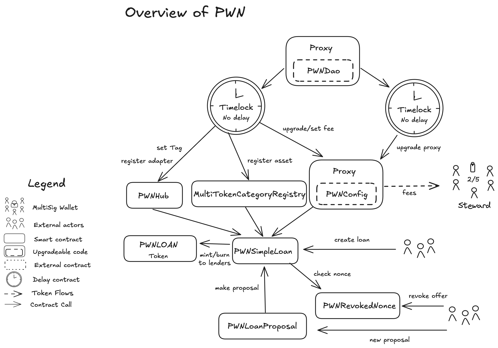

# Summary

PWN is a universal, peer-to-peer lending protocol that enables users to use any token (ERC-20, NFT, or bundled assets) as collateral and create fixed-interest loans with fully customizable terms (LTV, duration, APR). Any ERC-20 can be used as a credit in the loan. There are no price-based liquidation risks thanks to PWN oracle-less design. Operating as a trustless and permissionless protocol, PWN ensures lenders yield predictable returns while borrowers retain control—collateral is only forfeited if repayment deadlines are missed. By combining composability with flexible asset support and removing reliance on external price feeds, PWN unlocks novel liquidity strategies, optimized capital efficiency, and leverage opportunities.

# Ratings

## Chain

PWN v1.3 is deployed on various chains. This review is based on the Ethereum mainnet deployment of the protocol.

> Chain score: Low

## Upgradeability

The _PWN DAO_ can change parameters such as fees through the `PWNConfig` contract. Additionally, the _PWN DAO_ can add and deprecate valid contracts in the protocol through the `PWNHub` contract. Note that even after removing a contract from the `PWNHub` existing loans are unaffected, only new ones cannot be created.

No user funds nor unclaimed yield are affected by upgrades.

`TransparentProxy` contract with the _PWN DAO_ as admin is used for the `PWNConfig`. However, this does not impact user funds or otherwise materially change the protocol for already existing loans. Only new loans are affected by the change of parameters in the `PWNConfig`.

Upgrades by DAO are behind a timelock with a currently configured exit window of 0 days. This `TimelockController` contract ultimately owns `PWNConfig` and `PWNHub`. These upgrades have _no impact_ on existing loans and thus _Exit Window_ risk is considered _low_.

> Upgradeability score: Low

## Autonomy

There are no particular dependencies for the PWN protocol. Each proposal type is independent and can be used without the other proposal types. Some proposal types are oracle-less and don't require any external dependencies. Some proposals are using Chainlink price feeds for credit pricing during the loan creation. After a loan is created, it is immutable and oracles are not used anymore.
Furthermore, users can utilise funds from other protocols with PWN Pool Hooks. All of these are on opt-in basis and their failure doesn't affect the core protocol in any way.

> Autonomy score: Low

## Exit Window

> Exit Window score: Low

## Accessibility

PWN can be used on the PWN Platform (app.pwn.xyz). Once a loan is created, interactions with the protocol are simple enough to be feasibly done through etherscan in case of the main interface failure. PWN additionally provides a guide for funds recovery using Etherscan: https://docs.pwn.xyz/Guides/other/recover.

> Accessibility score: Medium

## Conclusion

The PWN protocol achieves _Low_ centralization risk scores for its _Upgradeability_, _Autonomy_, _Exit Window_ and _Medium_ for the _Accessibility_ dimension. It thus ranks **Stage 1**.

The protocol could reach **Stage 2** if it would have multiple independent interfaces.

# Reviewer's Notes

Nothing to note.

# Protocol Analysis

Detailed description of the contracts and their interactions is available in the [official documentation](https://dev-docs.pwn.xyz/smart-contracts/core/deep-dive).

# Dependencies

Some proposal types in PWN are using Chainlink price feeds for credit pricing. This feature is opt-in and not required to use the protocol with other proposal types. Additionally, the oracle is only used during the loan creation and not after the loan is created.

The Chainlink oracle system itself is discussed in a separate report [here](/protocols/chainlink-oracles/ethereum).

# Governance

PWN is governed by the _PWN DAO_, which is built on the Aragon OSx Framework for modular and extensible protocol management. Governance combines two structures: Optimistic (Steward) governance, where community-elected Stewards can make whitelisted decisions via multisig unless vetoed by 10% of voting power, and Token (Community) governance, where all staked $PWN holders can propose, vote, and veto, with proposals requiring a 20% quorum and 60% approval to pass. This dual system ensures efficient protocol operation while maintaining ultimate community control.

## Security Council

| Name          | Account                                     | Type     | ≥ 7 signers | ≥ 51% threshold | ≥ 50% non-insider | Signers public |
| ------------- | ------------------------------------------- | -------- | ----------- | --------------- | ----------------- | -------------- |
| Stewards | [0xd56635c0E91D31F88B89F195D3993a9e34516e59](https://etherscan.io/address/0xd56635c0E91D31F88B89F195D3993a9e34516e59) | Multisig 2/5 | ❌          | ❌              | ❌                | ❌             |

# Contracts & Permissions

## Contracts

| Contract Name | Address                                     |
| ------------- | ------------------------------------------- |
| PWNConfig    | [0xd52a2898d61636bB3eEF0d145f05352FF543bdCC](https://etherscan.io/address/0xd52a2898d61636bB3eEF0d145f05352FF543bdCC) |
| PWNHub    | [0x37807A2F031b3B44081F4b21500E5D70EbaDAdd5](https://etherscan.io/address/0x37807A2F031b3B44081F4b21500E5D70EbaDAdd5) |
| PWNLOAN    | [0x4440C069272cC34b80C7B11bEE657D0349Ba9C23](https://etherscan.io/address/0x4440C069272cC34b80C7B11bEE657D0349Ba9C23) |
| PWNRevokedNonce    | [0x972204fF33348ee6889B2d0A3967dB67d7b08e4c](https://etherscan.io/address/0x972204fF33348ee6889B2d0A3967dB67d7b08e4c) |
| PWNUtilizedCredit    | [0x8E6F44DEa3c11d69C63655BDEcbA25Fa986BCE9D](https://etherscan.io/address/0x8E6F44DEa3c11d69C63655BDEcbA25Fa986BCE9D) |
| PWNSimpleLoan    | [0x719A69d0dc67bd3Aa7648D4694081B3c87952797](https://etherscan.io/address/0x719A69d0dc67bd3Aa7648D4694081B3c87952797) |
| PWNSimpleLoanSimpleProposal    | [0xe624E7D33baC728bE2bdB606Da0018B6E05A84D9](https://etherscan.io/address/0xe624E7D33baC728bE2bdB606Da0018B6E05A84D9) |
| PWNSimpleLoanListProposal    | [0x7160Ec33788Df9AFb8AAEe777e7Ae21151B51eDd](https://etherscan.io/address/0x7160Ec33788Df9AFb8AAEe777e7Ae21151B51eDd) |
| PWNSimpleLoanElasticProposal    | [0xeC6390D4B22FFfD22E5C5FDB56DaF653C3Cd0626](https://etherscan.io/address/0xeC6390D4B22FFfD22E5C5FDB56DaF653C3Cd0626) |
| PWNSimpleLoanElasticChainlinkProposal    | [0xBA58E16BE93dAdcBB74a194bDfD9E5933b24016B](https://etherscan.io/address/0xBA58E16BE93dAdcBB74a194bDfD9E5933b24016B) |
| PWNSimpleLoanDutchAuctionProposal    | [0x1b1394F436cAeaE139131E9bca6f5d5A2A7e1369](https://etherscan.io/address/0x1b1394F436cAeaE139131E9bca6f5d5A2A7e1369) |
| MultiTokenCategoryRegistry | [0xbB2168d5546A94AE2DA9254e63D88F7f137B2534](https://etherscan.io/address/0xbB2168d5546A94AE2DA9254e63D88F7f137B2534) |

## All Permission Owners

| Name | Account                                       | Type         |
| ---- | --------------------------------------------- | ------------ |
| TimelockController (Protocol) | [0xd8dbdDf1c0FDdf9b5eCFA5C067C38DB66739FBAB](https://etherscan.io/address/0xd8dbdDf1c0FDdf9b5eCFA5C067C38DB66739FBAB) | Contract |
| TimelockController (Admin) | [0xd57e72A328AB1deC6b374c2babe2dc489819B5Ea](https://etherscan.io/address/0xd57e72A328AB1deC6b374c2babe2dc489819B5Ea) | Contract |

## Permissions

| Contract      | Function     | Impact      | Owner                   |
| ------------- | ------------ | ----------- | ----------------------- |
| PWNConfig (TransparentUpgradeableProxy) | fallback | If the msg.sender is the admin this call will resolve to admin functions. Admin write functions are upgradeTo, upgradeToAndCall and changeAdmin.  If admin is compromised, it can update the implementation and change PWN Config fee receiver to its own account. These fees are PWN DAO's and not user funds. | TimelockController (Protocol) |
| PWNConfig (Implementation) | transferOwnership | Transfers the PWNConfig contract ownership. Malicious actor could transfer the contract ownership to it's own account and control all protocol parameters. | TimelockController (Protocol) |
| PWNConfig (Implementation) | renounceOwnership | Removes contract owner. No permissioned functions can be called after this function is executed. | TimelockController (Protocol) |
| PWNConfig (Implementation) | setFee | Changes the protocol fee. The fee is collected at the loan creation from the loan credit amount. Fee is hard-capped at 10%. Malicious actor could raise the protocol fee up to 10%. | TimelockController (Protocol) |
| PWNConfig (Implementation) | setFeeCollector | Changes the account that receives the collected protocol fees. Malicious actor could change the address to his own account and collect all protocol fees. | TimelockController (Protocol) |
| PWNConfig (Implementation) | setLOANMetadataUri | Sets metadata URI for the LOAN token. This is used to display dynamic thumbnails etc. with the LOAN NFTs. Malicious actor could change this to an URL that he owns which could be malicious/scam site. | TimelockController (Protocol) |
| PWNConfig (Implementation) | setDefaultLOANMetadataUri | Sets default metadata URI for the LOAN token. This is used to display dynamic thumbnails etc. with the LOAN NFTs. Malicious actor could change this to an URL that he owns which could be malicious/scam site. | TimelockController (Protocol) |
| PWNConfig (Implementation) | registerStateFingerprintComputer | Registers new State Fingerprint Computer contract in the protocol. This contract is used to get a state fingerprint for tokens which value depends on their state. Malicious actor could register a faulty computer and scam users with tokens that appear to have certain state but actually don't. | TimelockController (Protocol) |
| PWNConfig (Implementation) | registerPoolAdapter | Registers a new Pool Adapter contract in the protocol. This contract is used to integrate with other DeFi protocols to dynamically use supply from them. Malicious actor could register a pool adapter which would transfer the tokens from the pool to an account owned by the malicious entity. Note that a user would have to manually choose to use this malicious contract. | TimelockController |
| PWNHub | transferOwnership | Transfers the PWNHub contract ownership. Malicious actor could tag malicious contracts and make them valid in the protocol. | TimelockController (Protocol) |
| PWNHub | renounceOwnership | Removes contract owner. No permissioned functions can be called after this function is executed. | TimelockController (Protocol) |
| PWNHub | setTag | Sets tag for a specified contract. Having a tag makes a contract valid in the protocol. Malicious actor could make his own contract valid and act as for example the Loan contract. Users would have to manually specify the usage of this contract. | TimelockController (Protocol) |
| PWNHub | setTags | Same as setTag. This function calls setTag multiple times. | TimelockController (Protocol) |
| PWNLOAN | mint | Mints a LOAN token. LOAN token represents a loan in the protocol for the lender. It is required to claim repayment or collateral. Malicious actor could mint worthless LOAN tokens and try to use them as a collateral for loans. | Loan contract specified in an offer |
| PWNLOAN | burn | Burns a LOAN token. LOAN token represents a loan in the protocol for the lender. It is required to claim repayment or collateral. Malicious actor could burn other LOAN tokens and make it impossible to claim loans. | Loan contract specified in an offer |
| PWNRevokedNonce | revokeNonce | Revokes nonce for an offer. Used to revoke an offchain signed offer on behalf of an owner. Malicious actor could revoke offers that the user wants to be valid. | Contract with a valid tag in PWNHub |
| PWNSimpleLoanSimpleProposal | acceptProposal | Accepts a given proposal. Loan contracts call this function with the signed proposal on behalf of the acceptor. | Loan contract specified in an offer |
| PWNSimpleLoanListProposal | acceptProposal |Accepts a given proposal. Loan contracts call this function with the signed proposal on behalf of the acceptor. | Loan contract specified in an offer |
| PWNSimpleLoanElasticProposal | acceptProposal | Accepts a given proposal. Loan contracts call this function with the signed proposal on behalf of the acceptor. | Loan contract specified in an offer |
| PWNSimpleLoanDutchAuctionProposal | acceptProposal | Accepts a given proposal. Loan contracts call this function with the signed proposal on behalf of the acceptor. | Loan contract specified in an offer |
| PWNSimpleLoanElasticChainlinkProposal | acceptProposal | Accepts a given proposal. Loan contracts call this function with the signed proposal on behalf of the acceptor. | Loan contract specified in an offer |
| PWNUtilizedCredit | utilizeCredit | Updates utilised credit for an account. This is used to share credit between different proposal types. Malicious actor would add a valid tag to a malicious contract which could update the utilised credit to go over the credit limit. | Contract with a valid tag in PWNHub |
| TimelockController (Protocol) | schedule | Schedules a transaction to be executed after the mandatory delay has passed (currently none). This transaction can perform any action that this contract is allowed to, including upgrading PWNConfig and tagging new contracts in PWNHub. | PWNDAO |
| TimelockController (Protocol) | scheduleBatch | Similar to schedule, for a batch of transactions. | PWNDAO |
| TimelockController (Protocol) | updateDelay | Updates the mandatory delay. There are no minimum or maximum delays enforced in the contract. | TimelockController |
| TimelockController (Protocol) | cancel | Cancels a queued transaction before it has been executed. | PWNDAO |
| TimelockController (Protocol) | grantRole | Grants a role to a given address. There are different roles to schedule, cancel, and execute transactions, currently executing transactions is open to anyone. | TimelockController (Protocol) |
| TimelockController (Protocol) | revokeRole| Revokes a role from a given address. | TimelockController (Protocol) |
| TimelockController (Admin) | schedule | Schedules a transaction to be executed after the mandatory delay has passed (currently none). This transaction can perform any action that this contract is allowed to, including changing parameters in PWNConfig. | PWNDAO |
| TimelockController (Admin) | scheduleBatch | Similar to schedule, for a batch of transactions. | PWNDAO |
| TimelockController (Admin) | updateDelay | Updates the mandatory delay. There are no minimum or maximum delays enforced in the contract. | TimelockController |
| TimelockController (Admin) | cancel | Cancels a queued transaction before it has been executed. | PWNDAO |
| TimelockController (Admin) | grantRole | Grants a role to a given address. There are different roles to schedule, cancel, and execute transactions, currently executing transactions is open to anyone. | TimelockController (Admin) |
| TimelockController (Admin) | revokeRole| Revokes a role from a given address. | TimelockController (Admin) |
| MultiTokenCategoryRegistry | transferOwnership | Transfers the MultiTokenCategoryRegistry contract ownership. Malicious owner could register an asset to have a different category than it actually supports and make the asset unusable in the protocol. Does not affect already running loans with these assets. | TimelockController (Protocol) |
| MultiTokenCategoryRegistry | renounceOwnership | Removes contract owner. No permissioned functions can be called after this function is executed. | TimelockController (Protocol) |
| MultiTokenCategoryRegistry | registerCategoryValue | Registers a category for an asset. Malicious actor could register an asset to have a different category than it actually supports and make the asset unusable in the protocol. Does not affect already running loans with these assets. | TimelockController (Protocol) |
| MultiTokenCategoryRegistry | unregisterCategoryValue | Unregisters a category for an asset. Malicious actor could unregister an asset and make it unusable in the protocol. Does not affect already running loans with these assets. | TimelockController (Protocol) |