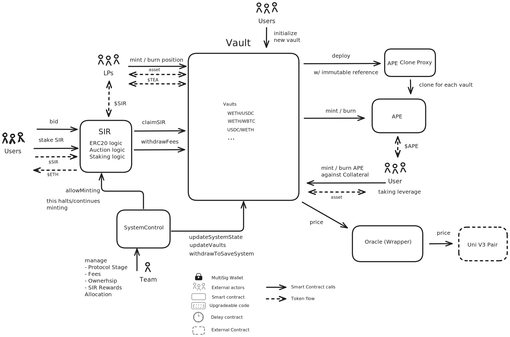
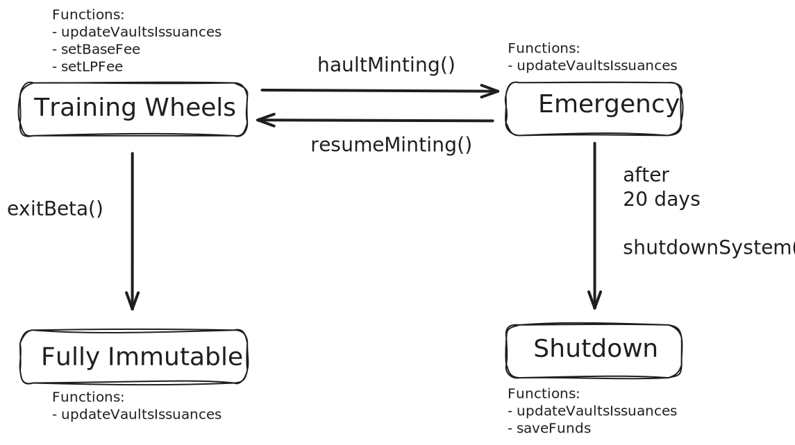

# Summary

SIR is a decentralized trading protocol designed for leveraged positions with a focus on long-term investing. Key features include a one-time fee for opening positions (no recurring funding costs), no liquidations, and no volatility decay (returns aren't eroded by market fluctuations). By eliminating these traditional risks and costs, SIR offers a sustainable way to maintain leveraged exposure over extended periods, making it ideal for investors seeking leveraged assets without the stress of daily fees, margin calls, or compounding price instability.

# Overview

## Chain

Ethereum

> Chain score: L

## Upgradeability

The protocol operates through six non-upgradable contracts, with `SystemControl` enabling limited administrative control. The owner can modify specific parameters: adjusting `APE`/`TEA` minting fees (with a 10-day delay) and transitioning between protocol states—`TrainingWheels` (configurable mode), `Emergency` (minting paused), and `Shutdown` (terminal state after 20 days in `Emergency`). Critical actions, like fee changes or shutdown initiation, are time-gated to prevent abrupt misuse. Permanent immutability is achieved via the `Unstoppable` state, locking all parameters except `SIR` token reward distribution. Users can withdraw funds in all states except `Shutdown`.

The system uses Uniswap v3's decentralized oracle and relies on procedural safeguards (delays, irreversible states) rather than a security council, prioritizing user protections while allowing controlled parameter adjustments during the initial phase.

> Upgradeabillity score: H

## Autonomy

SIR relies on Uniswap V3 oracles for price data and evaluating the value of collateral vs debt asset. Uniswap V3 was assessed as a Stage 2 DeFi protocol by the defiscan framework. This means no party has privileged control over the smart contracts, including the oracle. By relying on Uniswap V3, SIR, has introduced no centralisation risk by the dependency.

> Autonomy score: L

## Exit Window

The protocol implements time-delayed safeguards for critical administrative actions: fee adjustments require a 10-day activation period, while transitioning from `Emergency` to `Shutdown` status mandates a 20-day waiting period. Users retain withdrawal capabilities in all states except `Shutdown`. Permanent immutability is achieved upon entering the `Unstoppable` state, which irreversibly locks all parameters except `SIR` reward distribution. While the 10-day delay for fee changes exceeds the common 7-day threshold, the 20-day window for protocol termination falls short of the 30-day standard required for full exit window compliance.

> Exit score: M

## Accessibility

Following our recent launch, the current sole user interface is our official application at https://app.sir.trading. Our long-term vision involves establishing an ecosystem of independent third-party frontends, mirroring Liquity's successful model with its network of interface providers. As a final recourse, users can utilize Etherscan (https://etherscan.io) to interact directly with the protocol's smart contracts.

> Accessibility score: M

## Conclusion

Deposited assets can be lost if not withdrawn in the 20 days between emergency start and transition to shutdown (high upgradability score).
Our framework requires that the exit window for updates is at least 7 days for stage 1 and 30 days for stage 2.
Therefore, the protocol ranks stage 1. The protocol can reach stage 2 when successfully transition to `Unstoppable` mode, combining with a low score on Accessibility.

# Technical Analysis

## Contracts

| Contract Name   | Address                                      |
| --------------- | -------------------------------------------- |
| `Vault`         | `0xB91AE2c8365FD45030abA84a4666C4dB074E53E7` |
| `SIR`           | `0x1278B112943Abc025a0DF081Ee42369414c3A834` |
| `APE`           | `0x8E3a5ec5a8B23Fd169F38C9788B19e72aEd97b5A` |
| `Oracle`        | `0x3CDCCFA37c1B2BEe3d810eC9dAddbB205048bB29` |
| `VaultExternal` | `0x80f18B12A6dBD515C5Ad01A2006abF30C5972158` |
| `SystemControl` | `0x8d694D1b369BdE5B274Ad643fEdD74f836E88543` |

## Permission owners

| Name  | Account                                                                                                               | Type             |
| ----- | --------------------------------------------------------------------------------------------------------------------- | ---------------- |
| Owner | [0x5000Ff6Cc1864690d947B864B9FB0d603E8d1F1A](https://etherscan.io/address/0x5000Ff6Cc1864690d947B864B9FB0d603E8d1F1A) | External account |

## Permissions

| Contract        | Function                | Impact                                                                                                                                                                                                                                                                                                                                                                                                                                                                                                                                                             | Owner           |
| --------------- | ----------------------- | ------------------------------------------------------------------------------------------------------------------------------------------------------------------------------------------------------------------------------------------------------------------------------------------------------------------------------------------------------------------------------------------------------------------------------------------------------------------------------------------------------------------------------------------------------------------ | --------------- |
| `Vault`         | `claimSIR`              | The function allows to mint `SIR` rewards for LP in a deposited vault. Called via `lPerMint` on SIR contract by the LP. This function is only intended to be called by the `SIR` contract. The relationship between `Vault` and `SIR` contract is immutable.                                                                                                                                                                                                                                                                                                       | `SIR`           |
| `Vault`         | `withdrawFees`          | The fees collected from the vaults are are distributed to `SIR` stakers via the `SIR` contract. This function is only intended to be called by the `SIR` contract. The relationship between `Vault` and `SIR` contract is immutable.                                                                                                                                                                                                                                                                                                                               | `SIR`           |
| `Vault`         | `updateVaults`          | Updates the tax of the vaults whose fees are distributed to stakers of `SIR`. This function can only be called by the `SystemControl` contract via `updateVaultsIssuances` function. The relationship between `Vault` and `SystemControl` contract is immutable. This function is state independent, can also be called in `Unstoppable` state.                                                                                                                                                                                                                    | `SystemControl` |
| `Vault`         | `updateSystemState`     | It updates the base fee charged to apes, the fee charged to LPers when minting or haults all minting. This function can only be called by the `SystemControl` contract. It can only be called in `TrainingWheels` or `Emergency` status.                                                                                                                                                                                                                                                                                                                           | `SystemControl` |
| `Vault`         | `withdrawToSaveSystem`  | This function is only intended to be called as last recourse to save the system from a critical bug or hack during the beta period. To execute it, the system must be in `Shutdown` status which can only be activated after 20 days since `Emergency` status was activated. It is called by the owner on `SystemControl` via the `saveFunds` function.                                                                                                                                                                                                            | `SystemControl` |
| `APE`           | `initialize`            | Configures a new `APE` ERC20 instance with name, symbol, decimals, collateral/debt token addresses. Called exclusively when initializing a new vault via `Vault`'s publicly accessible `initialize` function. Each vault deployment creates a dedicated `APE` contract whose parameters become permanently immutable after this one-time setup.                                                                                                                                                                                                                    | `Vault`         |
| `SIR`           | `allowMinting`          | This function enables or disables minting of `SIR` tokens. When minting of `SIR` is disabled, contributors or LPers cannot mint their corresponding part of `SIR`. If minting is reenabled contributors and LPers can mint their corresponding part of `SIR` including `SIR` accumulated while minting was disabled. It is called by the owner on `SystemControl` via the `haultMinting` and `resumeMinting` functions.                                                                                                                                            | `SystemControl` |
| `SystemControl` | `setBaseFee`            | This function sets the `APE` minting fee, executable only while the protocol is in `TrainingWheels` status. The owner is permissioned to change the `APE` minting fee between any value betwen (0%, 100%). A fee change requires a 10-day activation delay, meaning the owner could propose 100% fees but users would have 10 days to withdraw before implementation.                                                                                                                                                                                              | Owner           |
| `SystemControl` | `setLPFee`              | This function sets the `TEA` minting fee, executable only while the protocol is in `TrainingWheels` status. The owner is permissioned to change the `TEA` minting fee between any value betwen (0%, 100%). A fee change requires a 10-day activation delay, meaning the owner could propose 100% fees but LPers would have 10 days to withdraw before implementation.                                                                                                                                                                                              | Owner           |
| `SystemControl` | `updateVaultsIssuances` | This function adjusts SIR reward allocations across vaults. Ownership of `SystemControl` will eventually transition to a `SIR` holder DAO, enabling decentralized governance over reward distribution. `SIR` token rewards are purely supplementary incentives for LPers, optional atop their base fee earnings. A malicious owner could direct all `SIR` token rewards to an exotic vault where its accomplices take all the `SIR` rewards.                                                                                                                       | Owner           |
| `SystemControl` | `saveFunds`             | This function enables token balance withdrawal from the `Vault` exclusively in `Shutdown` status, a fail-safe mode for emergency recourse. The owner is permissioned to withdraw funds from the `Vault` to the address of its choosing. A malicious owner could therefore steal all funds from the `Vault` but this is highly mitigated by the fact that `Shutdown` status requires a 20 day waiting period.                                                                                                                                                       | Owner           |
| `SystemControl` | `exitBeta`              | This function transitions the protocol to `Unstoppable` status, finalizing decentralization by irrevocably locking all other governance functions, leaving only `updateVaultsIssuances` operational for vault issuance adjustments. Executable solely from `TrainingWheels` status. A malicious owner could decentralize the protocol too early before the fees are properly fine tuned.                                                                                                                                                                           | Owner           |
| `SystemControl` | `haultMinting`          | This function triggers `Emergency` status, a protocol-wide freeze that permanently disables `TEA`/`APE`/`SIR` minting to protect user assets in case of critical vulnerabilities. Executable exclusively from `TrainingWheels` status. At most a malicious owner would stop new users from depositing assets, but it could not stop users from withdrawing their assets.                                                                                                                                                                                           | Owner           |
| `SystemControl` | `resumeMinting`         | This function reverts the protocol to `TrainingWheels` status, reactivating `TEA`/`APE`/`SIR` minting. Executable only from `Emergency` status. Since `Emergency` state is meant for discovering or fixing vulnerabilities, a malicious owner could reallow deposits of assets to the protocol before the protocol is safe.                                                                                                                                                                                                                                        | Owner           |
| `SystemControl` | `shutdownSystem`        | This function initiates the transition to `Shutdown` status, haulting any type of minting or burning. The transition is irreversible and can only be triggered if `Emergency` status has been active for at least 20 days. Once in `Shutdown` status, the owner can call the permissioned `saveFunds` function to withdraw all funds from the `Vault`.                                                                                                                                                                                                             | Owner           |
| `SystemControl` | `renounceOwnership`     | The owner of the `SystemControl` contract can renounce ownership over this contract. If the system is not in `Unstoppable` state, the designed transitionings between the phases becomes impossible. If the protocol was in `TrainingWheels` transitioning to `Unstoppable` can not be achieved, as the function `exitBeta` can not be called anymore. Also the protocol could not switch to `Emergency` in case of an emergency and would leave discovered attack vectors exposed. If the system was in `Shutdown` the remaining user funds could not be rescued. | Owner           |
| `SystemControl` | `initialize`            | Can be called once by the owner (already done). This set the immutable contract references to `Vault` and `SIR` contracts.                                                                                                                                                                                                                                                                                                                                                                                                                                         | Owner           |

## Dependencies

The only external dependancy of the protocol is Uniswap v3, which serves as price oracle. Uniswap v3 is a State 2 protocol, meaning that it is decentralized and cannot be upgraded.

## Exit Window

The protocol operates in four distinct statuses: (1) `Unstoppable`, (2) `TrainingWheels`, (3) `Emergency`, and (4) `Shutdown`. The owner of the `SystemControl` contract can freely switch between the (2) `TrainingWheels` and (3) `Emergency` statuses. Neither of these two statuses prevents users from withdrawing their funds. Transitioning from (2) `TrainingWheels` to (1) `Unstoppable` is irreversible and permanently renders the protocol immutable. The owner can switch from (3) `Emergency` to (4) `Shutdown` only if the `Emergency` status has been active for at least 20 days. The shutdown process is irreversible and serves as a termination mechanism for the protocol in cases of critical vulnerabilities. Once the protocol enters (4) `Shutdown` status, the owner can withdraw all remaining funds.

In the (2) `TrainingWheels` status, the owner can modify the `APE` and `TEA` minting fees. These fees could theoretically be set to values so high that users would immediately lose their deposits upon minting. To protect users from a compromised or malicious owner, any fee adjustment requires a 10-day waiting period before taking effect.

# Security Council

No security council. Any malicious action from the owner, like changing the fees to an obscene large value, or shutting down the protocol, has a built-in delay.
