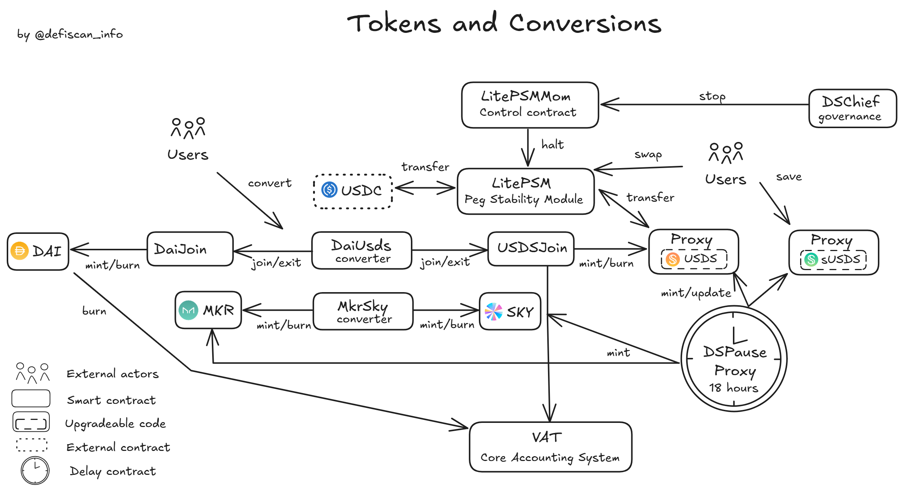

# Summary

Sky is a stablecoin protocol allowing users to mint its USDS stablecoin through _Collateralized Debt Positions_ with a variety of crypto collateral assets. Sky is built on the Maker protocol, by the MakerDAO, to replace the DAI stablecoin and allow for the 1:1 conversion between DAI and USDS. USDS can further be staked for the yield-bearing sUSDS token. Various levels of control over the Sky protocol are exercised through an onchain governance system.

# Ratings

## Chain

This review focuses on the Ethereum instance of Sky. Ethereum achieves a _Low_ centralization risk score.

> Chain score: Low

## Upgradeability

`USDS` and `sUSDS`, Sky's stablecoin and its corresponding yield-bearing version, are upgradeable contracts through _Sky Governance_ proposals. Updating those contracts could change the entire logic of those tokens and may incur a loss of funds for users.

Critical parameters in the Sky protocol can be changed through _Sky Governance_ proposals. Unwanted updates to these parameters can result in the loss of funds, loss of unclaimed yield, or otherwise materially impact the expected protocol performance. Example actions are forced liquidations, which would result in loss of user funds, creating unbacked debt, which could endanger the protocol's stability, or pausing the contracts, which could trap user funds for an undetermined amount of time.

> Upgradeability score: High

## Autonomy

Sky has a centralized dependency on Circle and its `USDC` stablecoin token. This is because users can mint `USDS` from `USDC` at a fixed 1:1 rate. This means that `USDS` is directly pegged to `USDC` (instead of `USD`), which is a centralized stablecoin. This conversion may be stopped or paused in an emergency _Sky Governance_ proposal. There is a debt ceiling limiting how much `USDS` can be backed by `USDC`. Nonetheless, at the time of writing, this debt ceiling is high enough that it does not prevent more than 50% of the collateral in Sky from being backed by `USDC`. The ceiling is explained further in the [dependencies](#dependencies) section.

The Sky protocol also relies on Chronicle's oracle price feeds to assess the solvency of debt positions. The Chronicol protocol uses a system of validators hosted by various third parties such as Bitcoin Suisse, ETHGlobal, Gitcoin, and Etherscan. Validators push price updates onchain. We found that any changes to the validator set are subject to a 7 days exit window. Chronicle thus achieves a _Medium_ centralization risk score as discussed in a separate report [here](/protocols/chronicle).

An _Oracle Security Module_ (`OSM`) enforces a 1-hour delay on price updates, and the _Sky Governance_ can freeze the current price to prevent further updates in case of emergency. The price feed provider could be changed through a governance proposal.

> Autonomy score: High

## Exit Window

All permissions within Sky are held by the onchain _Sky Governance_. There are no external accounts or multisigs in control.

The _Sky Governance_ is controlled by `MKR`/`SKY` token holders who locked their tokens to earn voting power, which allows them to submit and vote on respective proposals, or delegate their votes to another user. Any token holder can create a proposal, and the protocol uses a system of continuous approval, explained in more detail in the [governance section](#exit-window-1).

The minimum delay between approval and execution of a proposal is currently **18 hours**. _Sky Governance_ proposals have a recurring weekly and monthly schedule. Those proposals usually have a courtesy delay duration of 2-3 days before taking effect, but proposals remain possible at any time with the minimum delay.

Emergency measures allow the _Sky Governance_ to pause certain contracts through a proposal without being subject to the mandatory delay. In addition to that, an _Emergency Shutdown Module_ (ESM) exists and can irreversibly shutdown the entire protocol if **500'000** `MKR` tokens are sent to the Emergency Shutdown Contract. Funds sent to the contract are considered lost, no matter the emergency status. During an emergency shutdown, users can retrieve their supplied assets, but no additional supply or borrowing is allowed. This is explained further in the technical [governance section](#exit-window-1).

> Exit Window score: High

## Accessibility

Sky has a main frontend at [sky.money](https://sky.money). The frontend is not self-hostable nor open source, but multiple other access points exist with Sky-specific apps such as [Spark](https://spark.fi) or third-party apps like [DeFiSaver](https://defisaver.com) or [SummerFi Pro](https://pro.summer.fi). These apps build an acceptable backup solution in case of failure of the official frontend.

> Accessibility score: Low

## Conclusion

The Sky protocol exposes critical permissions that are not protected with an _Exit Window_ of at least 7 days or a _Security Council_ and thus earns a _High_ centralization risk score for its _Upgradeability_ and _Exit Window_ dimensions.

Furthermore, Sky is exposed to centralization risks from its USDC and Chronicle dependencies, resulting in an overall _High_ centralization risk score for the _Autonomy_ dimension.

Sky thus achieves a decentralization of _Stage 0_.

The protocol could reach _Stage 1_ if it no longer swaps its `USDS` with Circle's `UDSC` in a blind fashion and increases its _Exit Window_ to at least 7 days or establish a _Security Council_. It could further reach _Stage 2_ with an _Exit Window_ of at least 30 days, and if it changes its oracle provider to a _Stage 2_ or equivalent protocol. This could also be achieved if Chronicle increases its _Exit Window_ to 30 days.

> Overall score: Stage 0

# Reviewer Notes

⚠️ During our analysis, we discovered a paradigm of _Authority_ contract used to handle fine-grained permissions over functions and contracts.
In most cases, the authority is `DSChief` and this allows governance proposals to have non-delayed access to certain functions. Nonetheless, this
could be misused to grant any arbitrary address those same permissions. We note that because of the lack of _events_ in the `DSChief`'s role granting functions,
we had to scan all governance proposals to ensure this has not happened in the past, and would encourage that those functions are blocked in future versions of the
governance contract.

# Protocol Analysis

## Sky Stablecoin Module (CDP)

The contracts related to the _Collateralized Debt Module_ are highlighted below. The `Vat` is the core accounting system of the protocol and acts as a balance sheet for debt positions against all collaterals. Each collateral needs an adapter contract called `Join` so that it can be linked to the `Vat`. A `Dog` contract monitors the positions and can _bark_ when a position becomes liquidable. It _kicks_ the collateral's `Clipper` (or `LockstakeClipper` if the collateral is sealed `MKR`) and starts the auction process. The `Vow` is the contract that keeps track of all surplus and debt and is the beneficiary of all the `DAI` raised in the auction. The `Flopper` or `Flapper` is responsible for debt or surplus auctions, respectively. The `Vow` is the beneficiary of the `DAI` raised in auctions. It is important to note that the governance has permission on those contracts and could trigger unjustified liquidations by bypassing the `Dog` contract.

The `Spotter` feeds the price used for liquidation and auctions. It reads the price out of the `OSM` (_Oracle Security Module_), which delays price updates by one hour and can be frozen in case of emergency. Incorrect oracle prices could potentially liquidate the entire Maker ecosystem. The oracle provider Chronicle is, therefore, extremely trusted.

The `Pot` and `Jug` contracts represent the rates module. Respectively, the `Pot`contract allows users to save at a specific _DAI Savings rate_ and the `Jug` contract handles stability fees. We note that the savings rate is not limited and may become either highly negative or positive under future governance proposals.

As for the governance and tokens, the Mom contracts (`FlapperMom`, `FLopperMom`, `OSMMom`) have the ability to stop their child. The permissions to do so are granted by `DSChief`, the governance contract, so that governance proposals can stop those contracts without delay.

## Sky ↔ Maker Conversion Module

The contracts related to the conversion from legacy Maker tokens to Sky are displayed in the diagram below. Following the _Sky End Game Plan_, the `DAI` and `MKR` have been replaced by `USDS` and `SKY` respectively. Conversion contracts allow for the swap from legacy to new tokens and back at a fixed rate. In addition to that, a `LitePSM` (_Peg Stability Module_) allows users to swap `USDC` for `USDS` with no impact on the peg thanks to pre-attributed reserves.

A `LitePSM` (_Peg Stability Module_) allows users to swap other stablecoins for `USDS` with no impact on the peg, thanks to pre-attributed reserves.

The governance has admin privileges over all contracts and could, for example, arbitrarily mint tokens. `DSChief`, the (non-delayed) governance contract, is the authority over the `LitePSMMom`, which allows governance proposals to stop the `LitePSM` without any delay.

Finally, users can put their `USDS` into savings and obtain `sUSDS`. `sUDS` is the yield-bearing token associated with the ERC4626-compatible `sUSDS` contract. The value of `sUSDS` increases at a fixed rate chosen by the Sky Governance. This also allows users to obtain `sUSDS` tokens through other means, such as swapping using decentralized exchanges.

## Sky Rewards

A `StakingReward` contract allows users to stake `USDS` and receive `SKY` as a reward according to an issuance chosen by the governance. Users can stake their `USDS` directly in the `StakingRewards` contract and claim their rewards with the same contract. `DssVestMintable` contracts allow the governance to create vested plans that will gradually mint tokens to distribute to some beneficiaries.

# Dependencies

## Circle's USDC

`USDS` is pegged to Circle's `USDC` rather than `USD` due to its stability module.

Users can mint `USDS` from `USDC` at a fixed 1:1 rate using the `LitePSM` (_Peg Stability Module_). This means that `USDS` is directly pegged to `USDC` (instead of `USD`), which is a centralized stablecoin. There is a debt ceiling limiting how much `USDS` can be backed by `USDC`. This debt ceiling is dynamic, it can be increased every 12 hours by _400 Mio_ if the current debt approaches the ceiling (debt + 400 Mio > ceiling). The ceiling can reach up to **10 Billion** `USDS`, making `USDC` more than a collateral for Sky, but a peg for its stablecoin.

The `LitePSM`, which allows this conversion, may be stopped or paused in an emergency _Sky Governance_ proposal.

## Chronicle

The Sky protocol also relies on the provider Chronicle for price feeds of collateral assets.

Chronicle is an oracle protocol that computes a median price from multiple sources. The protocol contains validators who push new prices and challengers who can freeze and challenge new prices. The validator set of an oracle can be changed with a delay of 7 days. We analysed Chronicle's decentralization in a dedicated report [here](/protocols/chronicle).

An _Oracle Security Module_ enforces a 1-hour window on price updates, and the governance can freeze the current price value to prevent further updates. In addition to freezing prices, the MakerDAO governance can change the oracle provider with a governance proposal.

# Governance

## Sky Governance

The _Sky Governance_ process is highlighted below. Users need to seal `MKR` or `SKY` tokens into the `LockStakeEngine` in order to receive voting rights. Users may receive rewards for their sealed tokens. Withdrawing the tokens is currently subject to a fee starting at 5% and increasing up to 15% over time.

The governance contract is `DSChief`; users can either vote or delegate their vote to other users. A list of _Aligned Delegates_ who vowed to respect the protocol's core values is published on the [governance webpage](https://vote.makerdao.com/delegates). The current aligned delegates hold a majority of the voting power and extreme influence over the protocol (see [security council](#security-council)).

Each proposal comes under the form of a `DssSpell`, the points to a `DssSpellAction` contract which holds the logic to be executed upon approval. The _Sky Governance_ uses continuous approval, which means one proposal can be executed at a time, and users need to shift their vote to support a new proposal. The proposal with the most votes at any time is the `Hat` that can be scheduled and executed. Each `Spell` may be executed just once and expires after 30 days if it has not been selected to be the `Hat`.

Proposals can be scheduled for execution with the `DSPauseProxy`, which enforces a minimal 18-hour delay between approval and execution. Some proposals may exercise non-delayed action to pause some modules of the protocol such as the `LitePSM` (_Peg Stability Module_), `OSM` (_Oracle Security Module_), liquidations, and debt ceiling. Users can trigger an Emergency and irreversible shutdown of the system by sending 500'000 `MKR` to the `ESM` (_Emergency Shutdown Module_). Funds sent to the contract cannot be recovered, even if no shutdown happens.

## Exit Window

The minimum delay between approval and execution of a _Sky Governance_ proposal is **18 hours**, recently reduced from 30 hours in an [emergency proposal](https://vote.makerdao.com/executive/template-executive-vote-out-of-schedule-executive-vote-risk-parameter-changes-february-18-2025). The _Sky Governance_ has a _continuous proposal_ model, which means voters need to migrate their vote from the current proposal to a new proposal. The proposal with the most votes at any time is accepted and can be executed once its delay has passed.

Emergency measures permissions allow the _Sky Governance_ to pause certain contracts through a proposal without being subject to the mandatory delay. This is the case for all contracts that have a `Mom` who can pause or stop their child.

In addition to that, an _Emergency Shutdown Module_ exists and can shut down the entire protocol if 500'000 `MKR` tokens are irreversibly sent to the Emergency Shutdown Contract. Once the process is started, a [specific timeline](https://docs.makerdao.com/smart-contract-modules/shutdown/the-emergency-shutdown-process-for-multi-collateral-dai-mcd) allows token holders and vault users to receive the net value of their assets. If the process is activated, it is irreversible, a fork would need to be created in order to revive the protocol. It is assumed that there are 2 scenarios:

1.  A malicious majority is hijacking the _Sky Governance_. The only option once the system is shut down is to set up an alternative fork in which the malicious users' funds are slashed, and the users who shut down the system see their funds restored.
2.  A critical bug was discovered and prevented with a system shutdown. The _Sky Governance_ can refund users who shut down the system by minting new tokens.

# Contracts & Permissions

## Contracts

The list of contract and deployment addresses is available in both the [official documentation](https://developers.sky.money/) and the protocol's [chainlog](https://chainlog.makerdao.com/).

&nbsp;

| Contract Name                 | Address                                                                                                               |
| ----------------------------- | --------------------------------------------------------------------------------------------------------------------- |
| Dai                           | [0x6B175474E89094C44Da98b954EedeAC495271d0F](https://etherscan.io/address/0x6B175474E89094C44Da98b954EedeAC495271d0F) |
| DaiJoin                       | [0x9759a6ac90977b93b58547b4a71c78317f391a28](https://etherscan.io/address/0x9759a6ac90977b93b58547b4a71c78317f391a28) |
| DaiUsds                       | [0x3225737a9Bbb6473CB4a45b7244ACa2BeFdB276A](https://etherscan.io/address/0x3225737a9Bbb6473CB4a45b7244ACa2BeFdB276A) |
| MKR Token                     | [0x9f8F72aA9304c8B593d555F12eF6589cC3A579A2](https://etherscan.io/address/0x9f8F72aA9304c8B593d555F12eF6589cC3A579A2) |
| MkrSky (Converter)            | [0xBDcFCA946b6CDd965f99a839e4435Bcdc1bc470B](https://etherscan.io/address/0xBDcFCA946b6CDd965f99a839e4435Bcdc1bc470B) |
| Sky                           | [0x56072C95FAA701256059aa122697B133aDEd9279](https://etherscan.io/address/0x56072C95FAA701256059aa122697B133aDEd9279) |
| Usds (Proxy)                  | [0xdC035D45d973E3EC169d2276DDab16f1e407384F](https://etherscan.io/address/0xdC035D45d973E3EC169d2276DDab16f1e407384F) |
| Usds (Implementation)         | [0x1923DfeE706A8E78157416C29cBCCFDe7cdF4102](https://etherscan.io/address/0x1923DfeE706A8E78157416C29cBCCFDe7cdF4102) |
| UsdsJoin                      | [0x3C0f895007CA717Aa01c8693e59DF1e8C3777FEB](https://etherscan.io/address/0x3C0f895007CA717Aa01c8693e59DF1e8C3777FEB) |
| UsdsPsmWrapper                | [0xA188EEC8F81263234dA3622A406892F3D630f98c](https://etherscan.io/address/0xA188EEC8F81263234dA3622A406892F3D630f98c) |
| SUsds (Proxy)                 | [0xa3931d71877C0E7a3148CB7Eb4463524FEc27fbD](https://etherscan.io/address/0xa3931d71877C0E7a3148CB7Eb4463524FEc27fbD) |
| SUsds (Implementation)        | [0x4e7991e5C547ce825BdEb665EE14a3274f9F61e0](https://etherscan.io/address/0x4e7991e5C547ce825BdEb665EE14a3274f9F61e0) |
| StakingRewards                | [0x0650CAF159C5A49f711e8169D4336ECB9b950275](https://etherscan.io/address/0x0650CAF159C5A49f711e8169D4336ECB9b950275) |
| StakingRewards                | [0x10ab606B067C9C461d8893c47C7512472E19e2Ce](https://etherscan.io/address/0x10ab606B067C9C461d8893c47C7512472E19e2Ce) |
| VestedRewardsDistribution     | [0x2F0C88e935Db5A60DDA73b0B4EAEef55883896d9](https://etherscan.io/address/0x2F0C88e935Db5A60DDA73b0B4EAEef55883896d9) |
| VestedRewardsDistributionJob  | [0x6464C34A02DD155dd0c630CE233DD6e21C24F9A5](https://etherscan.io/address/0x6464C34A02DD155dd0c630CE233DD6e21C24F9A5) |
| DssLitePsm                    | [0xf6e72Db5454dd049d0788e411b06CfAF16853042](https://etherscan.io/address/0xf6e72Db5454dd049d0788e411b06CfAF16853042) |
| DssVestMintable               | [0xB313Eab3FdE99B2bB4bA9750C2DDFBe2729d1cE9](https://etherscan.io/address/0xB313Eab3FdE99B2bB4bA9750C2DDFBe2729d1cE9) |
| DaiJoinFab                    | [0x64a84e558192dd025F3A96775FEE8FB530f27177](https://etherscan.io/address/0x64a84e558192dd025F3A96775FEE8FB530f27177) |
| DssLitePsmMom                 | [0x467b32b0407Ad764f56304420Cddaa563bDab425](https://etherscan.io/address/0x467b32b0407Ad764f56304420Cddaa563bDab425) |
| Splitter                      | [0xBF7111F13386d23cb2Fba5A538107A73f6872bCF](https://etherscan.io/address/0xBF7111F13386d23cb2Fba5A538107A73f6872bCF) |
| SplitterMom                   | [0xF51a075d468dE7dE3599C1Dc47F5C42d02C9230e](https://etherscan.io/address/0xF51a075d468dE7dE3599C1Dc47F5C42d02C9230e) |
| FlapperUniV2                  | [0xc5A9CaeBA70D6974cBDFb28120C3611Dd9910355](https://etherscan.io/address/0xc5A9CaeBA70D6974cBDFb28120C3611Dd9910355) |
| LockStakeEngine (Seal Engine) | [0x2b16C07D5fD5cC701a0a871eae2aad6DA5fc8f12](https://etherscan.io/address/0x2b16C07D5fD5cC701a0a871eae2aad6DA5fc8f12) |
| OracleWrapper                 | [0x38e8c1D443f546Dc014D7756ec63116161CB7B25](https://etherscan.io/address/0x38e8c1D443f546Dc014D7756ec63116161CB7B25) |
| OsmMom                        | [0x76416A4d5190d071bfed309861527431304aA14f](https://etherscan.io/address/0x76416A4d5190d071bfed309861527431304aA14f) |
| DssAutoLine                   | [0xc7bdd1f2b16447dcf3de045c4a039a60ec2f0ba3](https://etherscan.io/address/0xc7bdd1f2b16447dcf3de045c4a039a60ec2f0ba3) |
| Jug                           | [0x19c0976f590D67707E62397C87829d896Dc0f1F1](https://etherscan.io/address/0x19c0976f590D67707E62397C87829d896Dc0f1F1) |
| Pot                           | [0x197e90f9fad81970ba7976f33cbd77088e5d7cf7](https://etherscan.io/address/0x197e90f9fad81970ba7976f33cbd77088e5d7cf7) |
| ESM                           | [0x09e05fF6142F2f9de8B6B65855A1d56B6cfE4c58](https://etherscan.io/address/0x09e05fF6142F2f9de8B6B65855A1d56B6cfE4c58) |
| END                           | [0x0e2e8F1D1326A4B9633D96222Ce399c708B19c28](https://etherscan.io/address/0x0e2e8F1D1326A4B9633D96222Ce399c708B19c28) |
| Flopper                       | [0xa41b6ef151e06da0e34b009b86e828308986736d](https://etherscan.io/address/0xa41b6ef151e06da0e34b009b86e828308986736d) |
| Dog                           | [0x135954d155898D42C90D2a57824C690e0c7BEf1B](https://etherscan.io/address/0x135954d155898D42C90D2a57824C690e0c7BEf1B) |
| Vow                           | [0xA950524441892A31ebddF91d3cEEFa04Bf454466](https://etherscan.io/address/0xA950524441892A31ebddF91d3cEEFa04Bf454466) |
| LockstakeClipper              | [0xA85621D35cAf9Cf5C146D2376Ce553D7B78A6239](https://etherscan.io/address/0xA85621D35cAf9Cf5C146D2376Ce553D7B78A6239) |

## All Permission owners

&nbsp;

| Name                      | Account                                                                                                               | Type     |
| ------------------------- | --------------------------------------------------------------------------------------------------------------------- | -------- |
| DSPause Proxy             | [0xBE8E3e3618f7474F8cB1d074A26afFef007E98FB](https://etherscan.io/address/0xBE8E3e3618f7474F8cB1d074A26afFef007E98FB) | contract |
| DSChief                   | [0x0a3f6849f78076aefaDf113F5BED87720274dDC0](https://etherscan.io/address/0x0a3f6849f78076aefaDf113F5BED87720274dDC0) | contract |
| ESM                       | [0x09e05fF6142F2f9de8B6B65855A1d56B6cfE4c58](https://etherscan.io/address/0x09e05fF6142F2f9de8B6B65855A1d56B6cfE4c58) | contract |
| USDSJoin                  | [0x3c0f895007ca717aa01c8693e59df1e8c3777feb](https://etherscan.io/address/0x3c0f895007ca717aa01c8693e59df1e8c3777feb) | contract |
| DAIJoin                   | [0x9759a6ac90977b93b58547b4a71c78317f391a28](https://etherscan.io/address/0x9759a6ac90977b93b58547b4a71c78317f391a28) | contract |
| DaiJoinFab                | [0x64a84e558192dd025F3A96775FEE8FB530f27177](https://etherscan.io/address/0x64a84e558192dd025F3A96775FEE8FB530f27177) | contract |
| MkrSky Converter          | [0xBDcFCA946b6CDd965f99a839e4435Bcdc1bc470B](https://etherscan.io/address/0xBDcFCA946b6CDd965f99a839e4435Bcdc1bc470B) | contract |
| DssLitePsmMom             | [0x467b32b0407Ad764f56304420Cddaa563bDab425](https://etherscan.io/address/0x467b32b0407Ad764f56304420Cddaa563bDab425) | contract |
| DssVestMintable           | [0xB313Eab3FdE99B2bB4bA9750C2DDFBe2729d1cE9](https://etherscan.io/address/0xB313Eab3FdE99B2bB4bA9750C2DDFBe2729d1cE9) | contract |
| DssVestMintable           | [0x0fC8D4f2151453ca0cA56f07359049c8f07997Bd](https://etherscan.io/address/0x0fC8D4f2151453ca0cA56f07359049c8f07997Bd) | contract |
| VestedRewardsDistribution | [0x2F0C88e935Db5A60DDA73b0B4EAEef55883896d9](https://etherscan.io/address/0x2F0C88e935Db5A60DDA73b0B4EAEef55883896d9) | contract |
| LockstakeClipper          | [0xA85621D35cAf9Cf5C146D2376Ce553D7B78A6239](https://etherscan.io/address/0xA85621D35cAf9Cf5C146D2376Ce553D7B78A6239) | contract |
| Dog                       | [0x135954d155898D42C90D2a57824C690e0c7BEf1B](https://etherscan.io/address/0x135954d155898D42C90D2a57824C690e0c7BEf1B) | contract |
| SplitterMom               | [0xF51a075d468dE7dE3599C1Dc47F5C42d02C9230e](https://etherscan.io/address/0xF51a075d468dE7dE3599C1Dc47F5C42d02C9230e) | contract |
| Vow                       | [0xA950524441892A31ebddF91d3cEEFa04Bf454466](https://etherscan.io/address/0xA950524441892A31ebddF91d3cEEFa04Bf454466) | contract |
| MkrAuthority              | [0x6eEB68B2C7A918f36B78E2DB80dcF279236DDFb8](https://etherscan.io/address/0x6eEB68B2C7A918f36B78E2DB80dcF279236DDFb8) | contract |
| Flopper                   | [0xa41b6ef151e06da0e34b009b86e828308986736d](https://etherscan.io/address/0xa41b6ef151e06da0e34b009b86e828308986736d) | contract |
| Vat                       | [0x35D1b3F3D7966A1DFe207aa4514C12a259A0492B](https://etherscan.io/address/0x35D1b3F3D7966A1DFe207aa4514C12a259A0492B) | contract |
| END                       | [0x0e2e8F1D1326A4B9633D96222Ce399c708B19c28](https://etherscan.io/address/0x0e2e8F1D1326A4B9633D96222Ce399c708B19c28) | contract |
| Jug                       | [0x19c0976f590D67707E62397C87829d896Dc0f1F1](https://etherscan.io/address/0x19c0976f590D67707E62397C87829d896Dc0f1F1) | contract |
| Pot                       | [0x197e90f9fad81970ba7976f33cbd77088e5d7cf7](https://etherscan.io/address/0x197e90f9fad81970ba7976f33cbd77088e5d7cf7) | contract |
| DssAutoLine               | [0xc7bdd1f2b16447dcf3de045c4a039a60ec2f0ba3](https://etherscan.io/address/0xc7bdd1f2b16447dcf3de045c4a039a60ec2f0ba3) | contract |

## Permissions

&nbsp;

| Contract                              | Function               | Impact                                                                                                                                                                                                                                                                                                                                                                                                                                                 | Owner                                                                                       |
| ------------------------------------- | ---------------------- | ------------------------------------------------------------------------------------------------------------------------------------------------------------------------------------------------------------------------------------------------------------------------------------------------------------------------------------------------------------------------------------------------------------------------------------------------------ | ------------------------------------------------------------------------------------------- |
| USDS                                  | upgradeToAndCall       | Updates the `USDS` implementation contract and then calls a function in the new contract. The new contract can contain arbitrary code. A malicious update could steal funds.                                                                                                                                                                                                                                                                           | DSPauseProxy (DAO), USDSJoin                                                                |
| USDS                                  | rely                   | Grants admin privileges over the `USDS` contract to an additional address. The new admin can update the contract and mint `USDS` tokens.                                                                                                                                                                                                                                                                                                               | DSPauseProxy (DAO), USDSJoin                                                                |
| USDS                                  | deny                   | Revokes admin privileges of a specific address over the `USDS` contract. This could be used to abandon ownership and make the contract immutable.                                                                                                                                                                                                                                                                                                      | DSPauseProxy (DAO), USDSJoin                                                                |
| USDS                                  | mint                   | Mints new `USDS` tokens. Is used in opposition to `burn` (unpermissioned) when `USDS` are taken out the vault engine. Can be used to mint unjustified `USDS` token by the DAO.                                                                                                                                                                                                                                                                         | DSPauseProxy (DAO), USDSJoin                                                                |
| DAI                                   | rely                   | Grants admin privileges over the `DAI` contract to an additional address. The new address has the power to mint `DAI` tokens. New admins can no longer be added as there are no options to do so in `DAIJoin`.                                                                                                                                                                                                                                         | DAIJoin                                                                                     |
| DAI                                   | deny                   | Revokes admin privileges of a specific address over the `DAI` contract. Was used by the deployer to abandon admin privileges once the contracts were deploied and joined.                                                                                                                                                                                                                                                                              | DAIJoin                                                                                     |
| DAI                                   | mint                   | Mints new `DAI` tokens. Is used in opposition to `burn` (unpermissioned) when `DAI` are taken out of the vault engine. Cannot be used by an external actor.                                                                                                                                                                                                                                                                                            | DAIJoin                                                                                     |
| DAI Join                              | rely                   | Grants admin privileges over the `DAI Join` contract to an additional address. The new admin can cage (disable) the contract. There is no possibilities to add an admin with the current state. The only admin is a deployment contract.                                                                                                                                                                                                               | DaiJoinFab                                                                                  |
| DAI Join                              | deny                   | Revokes admin privileges of a specific address over the `DAI Join` contract.                                                                                                                                                                                                                                                                                                                                                                           | DaiJoinFab                                                                                  |
| DAI Join                              | cage                   | Cages (disables) the contract. This action is irreversible and disables the exit function that removes funds from the vault engine and mints `DAI` to the user. There is no possibility to call this function as the only admin is a deployment contract.                                                                                                                                                                                              | DaiJoinFab                                                                                  |
| DssLitePsm                            | rely                   | Grants admin privileges over the contract to a specific address. The admin can change parameters such as naming fee-free users and the beneficiary of fees.                                                                                                                                                                                                                                                                                            | DSPauseProxy (DAO), DssLitePsmMom                                                           |
| DssLitePsm                            | deny                   | Revokes admin privileges over the contract to a particular address.                                                                                                                                                                                                                                                                                                                                                                                    | DSPauseProxy (DAO), DssLitePsmMom                                                           |
| DssLitePsm                            | kiss                   | Grants permission to a user to swap without fees in the contract.                                                                                                                                                                                                                                                                                                                                                                                      | DSPauseProxy (DAO), DssLitePsmMom                                                           |
| DssLitePsm                            | diss                   | Revokes permission to a user to swap without fees in the contract.                                                                                                                                                                                                                                                                                                                                                                                     | DSPauseProxy (DAO), DssLitePsmMom                                                           |
| DssLitePsm                            | file                   | Change a parameter of the contract. This can be the fee beneficiary, or enabling/disabling `USDC`/`DAI` swaps in one or both directions.                                                                                                                                                                                                                                                                                                               | DSPauDSPauseProxyse (DAO), DssLitePsmMom                                                    |
| DssLitePsm                            | sellGemNoFee           | Sells `USDC` for `DAI` without any fees.                                                                                                                                                                                                                                                                                                                                                                                                               | Kissed users                                                                                |
| DssLitePsm                            | buyGemNoFee            | Buys `USDC` with `DAI` without any fees.                                                                                                                                                                                                                                                                                                                                                                                                               | Kissed users                                                                                |
| Sky                                   | rely                   | Grants admin privileges over the `Sky` token contract to a specific address. Admins have the right to mint arbitrary amounts of `SKY`.                                                                                                                                                                                                                                                                                                                 | DSPauseProxy (DAO), MkrSky, DssVestMintable                                                 |
| Sky                                   | deny                   | Revokes admin privileges over the `Sky` token to a specific address.                                                                                                                                                                                                                                                                                                                                                                                   | DSPauseProxy (DAO), MkrSky, DssVestMintable                                                 |
| Sky                                   | mint                   | Mints `SKY` token to a destination address.                                                                                                                                                                                                                                                                                                                                                                                                            | DSPauseProxy (DAO), MkrSky, DssVestMintable                                                 |
| MKR Token                             | stop                   | Stops the mint, burn, approve, and transfers of the token. Note that this also indirectly stops the MKR-SKY converter.                                                                                                                                                                                                                                                                                                                                 | DSPauseProxy (DAO), MkrAuthority(DSPauseProxy)                                              |
| MKR Token                             | start                  | Starts again all the token's functionalities in case it has been stopped.                                                                                                                                                                                                                                                                                                                                                                              | DSPauseProxy (DAO), MkrAuthority(DSPauseProxy)                                              |
| MKR Token                             | setOwner               | Sets the owner of the contract. The owner has access to the all critical functions mint, burn, stop, and start.                                                                                                                                                                                                                                                                                                                                        | DSPauseProxy (DAO), MkrAuthority(DSPauseProxy)                                              |
| MKR Token                             | setAuthority           | Sets the authority of the contract. The authority has the same permissions as the owner. The current authority is `MkrAuthority` and serves the role of access control contract.                                                                                                                                                                                                                                                                       | DSPauseProxy (DAO), MkrAuthority(DSPauseProxy)                                              |
| MKR Token                             | mint                   | Mints new tokens. Can be abused with a malicious governance proposal.                                                                                                                                                                                                                                                                                                                                                                                  | DSPauseProxy (DAO), MkrAuthority(Flopper, MkrSky, DssVestMintable, DSPauseProxy)            |
| MKR Token                             | burn                   | Burns tokens.                                                                                                                                                                                                                                                                                                                                                                                                                                          | MkrAuthority(Anyone)                                                                        |
| MKR Token                             | setName                | Sets the name of the token.                                                                                                                                                                                                                                                                                                                                                                                                                            | DSPauseProxy (DAO), MkrAuthority(DSPauseProxy)                                              |
| sUSDS (Proxy)                         | upgradeToAndCall       | Ugprades the `sUSDS` implementation contract and the calls a function in the new contract. . The new contract can contain arbitrary code. A malicious update could steal funds.                                                                                                                                                                                                                                                                        | DSPauseProxy (DAO)                                                                          |
| sUSDS (Proxy)                         | rely                   | Grants admin privileges over the `USDS` contract to an additional address. The new admin can update the contract which could result in loss of funds.                                                                                                                                                                                                                                                                                                  | DSPauseProxy (DAO)                                                                          |
| sUSDS (Proxy)                         | deny                   | Revokes admin privileges to a specific address.                                                                                                                                                                                                                                                                                                                                                                                                        | DSPauseProxy (DAO)                                                                          |
| sUSDS (Proxy)                         | file                   | Updates a contract parameter. Currently only the savings rate can be updated.                                                                                                                                                                                                                                                                                                                                                                          | DSPauseProxy (DAO)                                                                          |
| LockStakeEngine                       | rely                   | Grants admin privileges over the contract to a specific address. The new admin can change contract parameters, add and remove farms as well as potentially transfer `MKR` out of the system.                                                                                                                                                                                                                                                           | DSPauseProxy (DAO), LockstakeClipper                                                        |
| LockStakeEngine                       | deny                   | Revokes admin privileges to a specific address.                                                                                                                                                                                                                                                                                                                                                                                                        | DSPauseProxy (DAO), LockstakeClipper                                                        |
| LockStakeEngine                       | file                   | Change contract parameters such as `jug` and `fee`. The `fee` parameters are the exit fees for user unsealing their token, this could be increased up to 100% of user funds, caging funds inside the contract. The `jug` is used to compute the borrowing rate on the collateral.                                                                                                                                                                      | DSPauseProxy (DAO), LockstakeClipper                                                        |
| LockStakeEngine                       | addFarm                | Adds a yield farm and marks it as active. Users can place their the tokens they sealed in the farm of their choice.                                                                                                                                                                                                                                                                                                                                    | DSPauseProxy (DAO), LockstakeClipper                                                        |
| LockStakeEngine                       | delFarm                | Deletes a yield farm. Users can no longer place their yield in it but they can withdraw tokens and rewards.                                                                                                                                                                                                                                                                                                                                            | DSPauseProxy (DAO), LockstakeClipper                                                        |
| LockStakeEngine                       | freeNoFee              | Unseals token fron the contract without any exit fee.                                                                                                                                                                                                                                                                                                                                                                                                  | DSPauseProxy (DAO), LockstakeClipper                                                        |
| LockStakeEngine                       | onKick                 | Prepares a position for liquidation by removing delegate votes and withdrawing its stakes from farms. The position is not checked and could be unjustifyingly liquidated by a governance decision.                                                                                                                                                                                                                                                     | DSPauseProxy (DAO), LockstakeClipper                                                        |
| LockStakeEngine                       | onTake                 | Transfers `MKR` to succesful bidders in a liquidation auction.                                                                                                                                                                                                                                                                                                                                                                                         | DSPauseProxy (DAO), LockstakeClipper                                                        |
| LockStakeEngine                       | onRemove               | Closes a liquidation by charging fees and restoring leftover collateral to the owner.                                                                                                                                                                                                                                                                                                                                                                  | DSPauseProxy (DAO), LockstakeClipper                                                        |
| Splitter                              | rely                   | Grants admin privileges over the contract to a specific address. The admin can `kick`, change contract parameters, and disable the contract.                                                                                                                                                                                                                                                                                                           | DSPauseProxy (DAO), SplitterMom, Vow                                                        |
| Splitter                              | deny                   | Revokes admin privileges to a specific address.                                                                                                                                                                                                                                                                                                                                                                                                        | DSPauseProxy (DAO), SplitterMom, Vow                                                        |
| Splitter                              | file                   | Changes contract parameters such as `hop` (time between kicks), `burn` (percentage to burn), as well as the `flapper` (burning strategy) and `farm` (rewards beneficiary) contracts. An admin could redirect funds to an arbitrary address.                                                                                                                                                                                                            | DSPauseProxy (DAO), SplitterMom, Vow                                                        |
| Splitter                              | kick                   | Splits funds into rewards and burnt tokens according to the `burn` parameters. The reward portion is paid to a stake `farm`. This parameter is updated by governance. An underlying `flapper` contract is charged with burning the tokens.                                                                                                                                                                                                             | DSPauseProxy (DAO), SplitterMom, Vow                                                        |
| Splitter                              | cage                   | Irreversibly disables the contract.                                                                                                                                                                                                                                                                                                                                                                                                                    | DSPauseProxy (DAO), SplitterMom, Vow                                                        |
| SplitterMom                           | setOwner               | Sets the owner of the contract. The owner can name a new owner and the authority.                                                                                                                                                                                                                                                                                                                                                                      | DSPauseProxy (DAO)                                                                          |
| SplitterMom                           | setAuthority           | Sets the authority. The authority has the power to stop the `Splitter` contract without any delay.                                                                                                                                                                                                                                                                                                                                                     | DSPauseProxy (DAO)                                                                          |
| SplitterMom                           | stop                   | Stops the `Splitter` contract. This action doesn't use `cage` and can be reversed by a governance proposal.                                                                                                                                                                                                                                                                                                                                            | DSPauseProxy (DAO), DSChief (non-delayed governance)                                        |
| FlapperUniV2                          | rely                   | Grants admin privileges over the contract to a specific address. The admin can change parameters such as `want` and `pip` (price feed) as well as call the `exec` function.                                                                                                                                                                                                                                                                            | DSPauseProxy (DAO), Splitter                                                                |
| FlapperUniV2                          | deny                   | Revokes admin privileges to a specific address.                                                                                                                                                                                                                                                                                                                                                                                                        | DSPauseProxy (DAO), Splitter                                                                |
| FlapperUniV2                          | file                   | Changes a contract parameter such as `pip` or `want`. `pip`is the reference price oracle and `want` is the lower bound price to swap the `USDS` token against `SKY`.                                                                                                                                                                                                                                                                                   | DSPauseProxy (DAO), Splitter                                                                |
| FlapperUniV2                          | exec                   | Swaps `USDS` or `SKY` against the other token in order to provide liquidity to the uniswap `USDS-SKY`pool. The liquidity tokens are sent to the governance `DSPause` contract. This function is called by the `Splitter`'s kick.                                                                                                                                                                                                                       | DSPauseProxy (DAO), Splitter                                                                |
| OracleWrapper                         | read                   | Feeds price on the `SKY-USDS` pool from an underlying oracle. Only the `Flapper` can read this price.                                                                                                                                                                                                                                                                                                                                                  | Flapper                                                                                     |
| DssVestMintable                       | rely                   | Grants admin privileves over the contract to a specific address. The admin can create, restrict, unrestrick, and yank (remove) vesting plans, as well as change the global `cap` for the distribution rate. Abusive admins could drain funds by setting excessive limits and creating fake vesting contracts.                                                                                                                                          | DSPauseProxy (DAO)                                                                          |
| DssVestMintable                       | deny                   | Revokes admin privileges to a specific address.                                                                                                                                                                                                                                                                                                                                                                                                        | DSPauseProxy (DAO)                                                                          |
| DssVestMintable                       | file                   | Changes contract parameter, `cap` in particular, the maximal per-second issuance token rate.                                                                                                                                                                                                                                                                                                                                                           | DSPauseProxy (DAO)                                                                          |
| DssVestMintable                       | create                 | Creates a new vesting plan. Vested tokens will be minted. Part of the plan include a manager who can end the plan early and a recipient contract who can claim the tokens.                                                                                                                                                                                                                                                                             | DSPauseProxy (DAO)                                                                          |
| DssVestMintable                       | restrict               | Restricts a vesting plan so that only the recipient contract can claim the vested funds.                                                                                                                                                                                                                                                                                                                                                               | DSPauseProxy (DAO), Vesting Plan's Recipient contract                                       |
| DssVestMintable                       | unrestrict             | Unrestricts a vesting plan. Anyone can claim the vested funds but they will be transferred to the recipient and not the claimer.                                                                                                                                                                                                                                                                                                                       | DSPauseProxy (DAO), Vesting Plan's Recipient contract                                       |
| DssVestMintable                       | yank                   | Ends a vesting plan prematurely. This can "steal" the remaining legitimate vested tokens from beneficiaries of the original vesting plan.                                                                                                                                                                                                                                                                                                              | DSPauseProxy (DAO), Vesting Plan's Manager                                                  |
| DssVestMintable                       | move                   | Transfers ownership of vested token from one address to another. Can only be called by the beneficiary of the vested tokens (recipient contract).                                                                                                                                                                                                                                                                                                      | Vesting Plan's Recipient contract                                                           |
| StakingRewards                        | setPaused              | Pauses the `stake` function. Prevents users from adding any new stake to the contract.                                                                                                                                                                                                                                                                                                                                                                 | DSPauseProxy (DAO)                                                                          |
| StakingRewards                        | nominateNewOwner       | Nominates a new owner of the contract. The new owner has to call `acceptOwnership`. The new owner can the pause the contract, influence rewards distribution, and transfer arbitrary funds out of the contract.                                                                                                                                                                                                                                        | DSPauseProxy (DAO)                                                                          |
| StakingRewards                        | acceptOwnership        | Transfers ownership to the caller if they have been nominated.                                                                                                                                                                                                                                                                                                                                                                                         | New Owner                                                                                   |
| StakingRewards                        | notifyRewardAmount     | Adds new reward to the contract. The rewards are added to the current rewards and distributed linearly over the time left.                                                                                                                                                                                                                                                                                                                             | VestedRewardsDistribution                                                                   |
| StakingRewards                        | recoverERC20           | Transfers any ERC20 token to the owner of the contract.                                                                                                                                                                                                                                                                                                                                                                                                | DSPauseProxy (DAO)                                                                          |
| StakingRewards                        | setRewardsDuration     | Updates the rewards distribution window. Reward tokens will be linearly distributed over the time left.                                                                                                                                                                                                                                                                                                                                                | DSPauseProxy (DAO)                                                                          |
| StakingRewards                        | setRewardsDistribution | Updates the rewards distribution contract, the contract with the right to add new rewards to distribute.                                                                                                                                                                                                                                                                                                                                               | DSPauseProxy (DAO)                                                                          |
| VestedRewards Distribution (USDS SKY) | rely                   | Grants admin privileges over the contract to a new address. The admin can change the `vestId` of the contract. Changing the `vestId` could render a vesting plan unusable, prohibitting users from ever claiming the vested tokens.                                                                                                                                                                                                                    | DSPauseProxy (DAO)                                                                          |
| VestedRewardsDistribution (USDS SKY)  | deny                   | Revokes admin privileges to a specific address.                                                                                                                                                                                                                                                                                                                                                                                                        | DSPauseProxy (DAO)                                                                          |
| VestedRewardsDistribution (USDS SKY)  | file                   | Changes the `vestId` of the contract. Changing the `vestId` could render a vesting plan unusable, prohibitting users from ever claiming the vested tokens.                                                                                                                                                                                                                                                                                             | DSPauseProxy (DAO)                                                                          |
| VestedRewardsDistributionJob          | rely                   | Grants admin privileges over the contract to a specific address. The admin can add and remove distribution jobs. Distribution are made from the keeper network. Adding a wrong job could waste resoures.                                                                                                                                                                                                                                               | DSPauseProxy (DAO)                                                                          |
| VestedRewardsDistributionJob          | deny                   | Revokes admin privileges to a specific address.                                                                                                                                                                                                                                                                                                                                                                                                        | DSPauseProxy (DAO)                                                                          |
| VestedRewardsDistributionJob          | set                    | Creates a distribution job with a specific distribution interval that can be executed from the keeper network.                                                                                                                                                                                                                                                                                                                                         | DSPauseProxy (DAO)                                                                          |
| VestedRewardsDistributionJob          | rem                    | Removes a distribution job.                                                                                                                                                                                                                                                                                                                                                                                                                            | DSPauseProxy (DAO)                                                                          |
| DSChief                               | setOwner               | Sets the owner of the contract. This function reverts and cannot be called.                                                                                                                                                                                                                                                                                                                                                                            | 0x0                                                                                         |
| DSChief                               | setAuthority           | Sets the authority of the contract. The current authority is the contract itself. This function reverts and cannot be called.                                                                                                                                                                                                                                                                                                                          | 0x0                                                                                         |
| DSChief                               | setRootUser            | Marks a user as root. This function reverts and cannot be called. The root user is re-defined to be the current `hat` (governance proposal with most votes).                                                                                                                                                                                                                                                                                           | 0x0                                                                                         |
| DSChief                               | setUserRole            | Gives a user a specific role. The user will inherite all the capabilities of that role. This may be used to give access to the LitePSM Mom or the OSM Mom contracts.                                                                                                                                                                                                                                                                                   | DSChief                                                                                     |
| DSChief                               | setPublicCapability    | Sets a capability public. A public capability is a function that can be called by any user without specific role requirements. This could potentially make admin functions of the LitePSM Mom and OSM Mom public.                                                                                                                                                                                                                                      | DSChief                                                                                     |
| DSChief                               | setRoleCapability      | Sets a capability for a specific role. Gives a role the right to call a specific function. Gives a role and all its users a specific capability. This could be access to admin function s of the LitePSM Mom and OSM Mom contracts.                                                                                                                                                                                                                    | DSChief                                                                                     |
| DssLitePsmMom                         | setOwner               | Sets the owner of the contract. The owner can change the `authority` and call `halt` either inflow or outflow of `gem` (here USDC) tokens.                                                                                                                                                                                                                                                                                                             | DSPauseProxy (DAO)                                                                          |
| DssLitePsmMom                         | setAuthority           | Sets the authority of the contract. The authority declares whether callers of permissioned functions are allowed to do so. This is used here to allow non-delayed execution of the `halt` function.                                                                                                                                                                                                                                                    | DSPauseProxy (DAO)                                                                          |
| DssLitePsmMom                         | halt                   | Halts the inflow or outflow of gem (here `USDC`) token in the `LitePSM` contract. Can be called without delay by governance approved contracts. If the contract is halted users can still swap `USDC` to/from `USDS` by other means, users' funds would not be trapped.                                                                                                                                                                                | DSPauseProxy (DAO), DSChief (non-delayed governance)                                        |
| LockstakeClipper                      | rely                   | Grants admin privileges over the contract to a specific address. An admin can disable the contract, set parameters, start auctions, as well as change the recipient of the DAI raised in auctions. A malicious admin could result in loss of user collateral, draining of system funds, and prevention of legitimate auctions.                                                                                                                         | DSPauseProxy (DAO), Dog, End, ClipperMom                                                    |
| LockstakeClipper                      | deny                   | Revokes admin privileges to a specific address.                                                                                                                                                                                                                                                                                                                                                                                                        | DSPauseProxy (DAO), Dog, End, ClipperMom                                                    |
| LockstakeClipper                      | file                   | Changes contract parameters such as incentives, auction reset parameters, auction duration, price modules, recipient of DAI raised, and liquidation module. The contract can also be stopped in three levels: 1) new auction stopped. 2) new auction and redoes stopped. 3) new auction, redoes, and bids stopped. Malicious or wrong manipulation of those parameters can result in unsuable auctions, loss of user colalteral, loss of system funds. | DSPauseProxy (DAO), Dog, End, ClipperMom                                                    |
| LockstakeClipper                      | kick                   | Starts an auction for liquidated collateral. The position is not checked and could be wrongfully liquidated by governance.                                                                                                                                                                                                                                                                                                                             | DSPauseProxy (DAO), Dog, End, ClipperMom                                                    |
| LockstakeClipper                      | yank                   | Cancels an auction ongoing auction.                                                                                                                                                                                                                                                                                                                                                                                                                    | DSPauseProxy (DAO), Dog, End, ClipperMom                                                    |
| DSPauseProxy                          | exec                   | Executes a governance `Spell` (proposal) that was previously added to the pause contract.                                                                                                                                                                                                                                                                                                                                                              | DSPause                                                                                     |
| Dog                                   | rely                   | Grants admin privileges over the contract to a specific address.                                                                                                                                                                                                                                                                                                                                                                                       | DSPauseProxy (DAO), Clipper, LockStakeClipper, End                                          |
| Dog                                   | deny                   | Revokes admin privileges to a specificl address.                                                                                                                                                                                                                                                                                                                                                                                                       | DSPauseProxy (DAO), Clipper, LockStakeClipper, End                                          |
| Dog                                   | file                   | Changes contract parameters such as `vow` (debt engine), `hole` (`DAI` needed to cover debt+fees of auctions), `chop` (liquidation penalty), and `clip` (liquidator).                                                                                                                                                                                                                                                                                  | DSPauseProxy (DAO), Clipper, LockStakeClipper, End                                          |
| Dog                                   | digs                   | Digs dirt (debt) out of the `hole`. Reduces the amount of debt after an auction has been resolved. This leaves the place for new liquidations to take place.                                                                                                                                                                                                                                                                                           | DSPauseProxy (DAO), Clipper, LockStakeClipper, End                                          |
| Dog                                   | cage                   | Cages the contract irreversibly. Once caged, new liquidations cannot take place.                                                                                                                                                                                                                                                                                                                                                                       | DSPauseProxy (DAO), Clipper, LockStakeClipper, End                                          |
| Vow                                   | rely                   | Grants admin privileges over the contract to a specific address.                                                                                                                                                                                                                                                                                                                                                                                       | DSPauseProxy (DAO), End, Esm, Dog                                                           |
| Vow                                   | deny                   | Revokes admin privileges to a specific address. Admins can call all permissioned functions, handling the "balance sheet" of the DAI ecosystem.                                                                                                                                                                                                                                                                                                         | DSPauseProxy (DAO), End, Esm, Dog                                                           |
| Vow                                   | file                   | Change contract parameters such as `wait`, `bump`, `dump`, `sump`, and `hump`. Those parameters define the time between debt is queue and auctioned, as well as auction parameters such as bid size, lot size, and surplus buffer.                                                                                                                                                                                                                     | DSPauseProxy (DAO), End, Esm, Dog                                                           |
| Vow                                   | fess                   | Adds debt to the queue. The debt can be auctioned after `wait` time has passed.                                                                                                                                                                                                                                                                                                                                                                        | DSPauseProxy (DAO), End, Esm, Dog                                                           |
| Vow                                   | flog                   | Release queued debt for auction (realize debt from the queue).                                                                                                                                                                                                                                                                                                                                                                                         | DSPauseProxy (DAO), End, Esm, Dog                                                           |
| Vow                                   | heal                   | Calls `heal` on the vat contract to cancel out surplus and debt (optimize the debt buffer).                                                                                                                                                                                                                                                                                                                                                            | DSPauseProxy (DAO), End, Esm, Dog                                                           |
| Vow                                   | kiss                   | Cancels out surplus and on-auction debt, then `heal`s.                                                                                                                                                                                                                                                                                                                                                                                                 | DSPauseProxy (DAO), End, Esm, Dog                                                           |
| Vow                                   | flop                   | Triggers a deficit auction via a `kick` to the `Flopper`.                                                                                                                                                                                                                                                                                                                                                                                              | DSPauseProxy (DAO), End, Esm, Dog                                                           |
| Vow                                   | flap                   | Triggers a surplus auction via a `kick` to the `Flapper`.                                                                                                                                                                                                                                                                                                                                                                                              | DSPauseProxy (DAO), End, Esm, Dog                                                           |
| Vow                                   | cage                   | Cages the contract and both the `Flopper` and `Flapper` so that they can no longer be used.                                                                                                                                                                                                                                                                                                                                                            | DSPauseProxy (DAO), End, Esm, Dog                                                           |
| MkrAuthority                          | setRoot                | Sets the root of the contract, the address with permissions to grant and revoke `mint` permissions on `MKR`. The root has additional `stop`, `start`, `setName` permissions on the `MKR` token.                                                                                                                                                                                                                                                        | DSPauseProxy (DAO)                                                                          |
| MkrAuthority                          | rely                   | Grants `mint` privileges on `MKR` to a specific address. This could be abused to mint arbitrary amounts.                                                                                                                                                                                                                                                                                                                                               | DSPauseProxy (DAO)                                                                          |
| MkrAuthority                          | deny                   | Revokes `mint` privileges to a specific address.                                                                                                                                                                                                                                                                                                                                                                                                       | DSPauseProxy (DAO)                                                                          |
| Flopper                               | rely                   | Grants admin privileges over the contract to a specific address.                                                                                                                                                                                                                                                                                                                                                                                       | DSPauseProxy (DAO), Vow                                                                     |
| Flopper                               | deny                   | Revokes admin privileges to a specific address.                                                                                                                                                                                                                                                                                                                                                                                                        | DSPauseProxy (DAO), Vow                                                                     |
| Flopper                               | file                   | Changes parameters such as `beg`, `pad`, `ttl`, and `tau`, which handle auction parameters such as bid sizes and auction timing.                                                                                                                                                                                                                                                                                                                       | DSPauseProxy (DAO), Vow                                                                     |
| Flopper                               | kick                   | Starts a new auction. Should be called by the `Vow` contract.                                                                                                                                                                                                                                                                                                                                                                                          | DSPauseProxy (DAO), Vow                                                                     |
| Flopper                               | cage                   | Cages the contract so that it can no longer be used.                                                                                                                                                                                                                                                                                                                                                                                                   | DSPauseProxy (DAO), Vow                                                                     |
| Vat                                   | rely                   | Grants admin privileges over the contract to a specific address. Any user with admin privileges has full root access, giving them complete control over the core accounting system. A malicious or vulnerable admin can therefore steall all collateral in the system, mint unlimited DAI, or destabilize the system with unbalanced core parameters.                                                                                                  | DSPauseProxy (DAO), End, ESM, Jug, Spot, IAM_Auto_line, Pot, Flop, Dog, 35x collateral-JOIN |
| Vat                                   | deny                   | Revokes admin privileges over the contract.                                                                                                                                                                                                                                                                                                                                                                                                            | DSPauseProxy (DAO), End, ESM, Jug, Spot, IAM_Auto_line, Pot, Flop, Dog, 35x collateral-JOIN |
| Vat                                   | file                   | such as global debt ceiling (`Line`), collateral type debt ceiling (`line`), and minimum vault dust amount (`dust`). Parameter changes directly affect system risk by controlling how much debt can be generated globally and per collateral type. Setting inappropriate parameters could lead to over-issuance of DAI, insolvency, or denial of service by setting unreasonable limits.                                                               | DSPauseProxy (DAO), End, ESM, Jug, Spot, IAM_Auto_line, Pot, Flop, Dog, 35x collateral-JOIN |
| Vat                                   | cage                   | Disables the contract indefinitely. Once disabled parameters can not longer be changed both `fold` and `frob` can no longer be called. Caging the `Vat` is a critical part of the Emergency Shutdown process that prevents further debt creation and prepares the system for settlement. Triggering emergency shutdown unnecessarily would disrupt the entire Maker ecosystem and potentially cause market panic.                                      | DSPauseProxy (DAO), End, ESM, Jug, Spot, IAM_Auto_line, Pot, Flop, Dog, 35x collateral-JOIN |
| Vat                                   | init                   | Initializes a new collateral type. Adding new collateral types expands the system's risk profile and creates new avenues for DAI generation. A malicious or vulnerable collateral could put the system at risk of bad debt.                                                                                                                                                                                                                            | DSPauseProxy (DAO), End, ESM, Jug, Spot, IAM_Auto_line, Pot, Flop, Dog, 35x collateral-JOIN |
| Vat                                   | slip                   | Modify a user's collateral balance, bypassing normal flows. This function is necessary for `JOIN` adapters to record collateral deposits and withdrawals in the Vat's internal accounting. Malicious use could artificially create collateral balances or steal collateral by reducing user balances.                                                                                                                                                  | DSPauseProxy (DAO), End, ESM, Jug, Spot, IAM_Auto_line, Pot, Flop, Dog, 35x collateral-JOIN |
| Vat                                   | frob                   | Modify a vault's collateral and debt position.                                                                                                                                                                                                                                                                                                                                                                                                         | DSPauseProxy (DAO), End, ESM, Jug, Spot, IAM_Auto_line, Pot, Flop, Dog, 35x collateral-JOIN |
| Vat                                   | grab                   | Liquidates a vault. Transfers debt (DAI) from the vault to a user's balance. Unauthorized access could allow theft of collateral by triggering fake liquidations on healthy vaults.                                                                                                                                                                                                                                                                    | DSPauseProxy (DAO), End, ESM, Jug, Spot, IAM_Auto_line, Pot, Flop, Dog, 35x collateral-JOIN |
| Vat                                   | suck                   | Mints unbacked DAI by directly increasing a destination address's DAI balance and the system debt counter. Used during (but not limited to) surplus and debt actions. Direct DAI minting could be abused to steal funds or completely devalue DAI if misused.                                                                                                                                                                                          | DSPauseProxy (DAO), End, ESM, Jug, Spot, IAM_Auto_line, Pot, Flop, Dog, 35x collateral-JOIN |
| Vat                                   | fold                   | Modify the debt multiplier (creating / destroying corresponding debt) for a collateral type. Used for (but not limited to) adjusting stability fee. Manipulating the rates could inflate user debt, cause insolvency, or artifically erase system debt.                                                                                                                                                                                                | DSPauseProxy (DAO), End, ESM, Jug, Spot, IAM_Auto_line, Pot, Flop, Dog, 35x collateral-JOIN |
| OsmMom                                | setOsm                 | Adds an oracle security module (osm) as child contract for a given asset.                                                                                                                                                                                                                                                                                                                                                                              | DSPauseProxy (DAO)                                                                          |
| OsmMom                                | setOwner               | Sets the owner of the contract. The owner has all rights over the contract and can name a new owner and freeze an oracle.                                                                                                                                                                                                                                                                                                                              | DSPauseProxy (DAO)                                                                          |
| OsmMom                                | setAuthority           | Sets the authority. The authority determines the access rights over the contract.                                                                                                                                                                                                                                                                                                                                                                      | DSPauseProxy (DAO)                                                                          |
| OsmMom                                | stop                   | Stops an oracle security module and therefore freezes the oracle's price. This can be used to prevent the price from being updated duringt the 1 hour delay enforced by the oracle security module.                                                                                                                                                                                                                                                    | DSPauseProxy (DAO), DSChief (non-delayed DAO)                                               |
| ESM                                   | rely                   | Grants admin privileges over the contract to a specific address. Admins can change contract parameters that have an extreme impact on the Sky Protocol, potentially leading to a complete shutdown.                                                                                                                                                                                                                                                    | DSPauseProxy (DAO)                                                                          |
| ESM                                   | deny                   | Revokes admin privileges over the contract.                                                                                                                                                                                                                                                                                                                                                                                                            | DSPauseProxy (DAO)                                                                          |
| ESM                                   | file                   | Changes a parameter of the contract. Either the address of the `End` contract of the activation threshold can be changed. Changes could endanger the protocol by setting a low threshold or point to an inactive `End` contract.                                                                                                                                                                                                                       | DSPauseProxy (DAO)                                                                          |
| ESM                                   | cage                   | Disables the contract irreversibly. Users can no longer send their funds and the shutdown process cannot be started. At any time funds sent to the contracts are considered lost.                                                                                                                                                                                                                                                                      | DSPauseProxy (DAO)                                                                          |
| End                                   | rely                   | Grants admin privileges over the contract to a specific address. Admins can shutdown the entire Sky Protocol or change contract parameters.                                                                                                                                                                                                                                                                                                            | DSPauseProxy (DAO), ESM                                                                     |
| End                                   | deny                   | Revokes admin privileges over the contract.                                                                                                                                                                                                                                                                                                                                                                                                            | DSPauseProxy (DAO), ESM                                                                     |
| End                                   | file                   | Changes contract parameters such as addresses of contracts in the protocol that will be shutdown in case of emergency shutdown. The cooldown period, part of the shutdown, can also be changed.                                                                                                                                                                                                                                                        | DSPauseProxy (DAO), ESM                                                                     |
| End                                   | cage                   | Triggers the shutdown of the entire protocol. This action is irreversible but users will be able to recover their funds after a cooldown period.                                                                                                                                                                                                                                                                                                       | DSPauseProxy (DAO), ESM                                                                     |
| Pot                                   | rely                   | Grants admin privileges over the contract to a specific address. Admins can change contract parameters, in particular the Dai's savings rate. An excessive rate could drive the protocol towards insolvency.                                                                                                                                                                                                                                           | DSPauseProxy (DAO), End                                                                     |
| Pot                                   | deny                   | Revokes admin privileges over the contract.                                                                                                                                                                                                                                                                                                                                                                                                            | DSPauseProxy (DAO), End                                                                     |
| Pot                                   | file                   | Changes contract parameters such as the _DAI Savings Rate_ or addresses of auxiliary contracts. There are no limits to enforced on the savings rate, it could be made aggressively negative and burn users' funds, whereas an excessively high rate could drive the protocol towards insolvency.                                                                                                                                                       | DSPauseProxy (DAO), End                                                                     |
| Pot                                   | cage                   | Irreversibly stops the contract and changes the savings rate to a neutral value.                                                                                                                                                                                                                                                                                                                                                                       | DSPauseProxy (DAO), End                                                                     |
| Jug                                   | rely                   | Grants admin privileges over the contract to a specific address. Admins can change the _stability fee_ which include a global rate and a collateral-specific risk premium.                                                                                                                                                                                                                                                                             | DSPauseProxy (DAO)                                                                          |
| Jug                                   | deny                   | Revokes admin privileges over the contract.                                                                                                                                                                                                                                                                                                                                                                                                            | DSPauseProxy (DAO)                                                                          |
| Jug                                   | file                   | Changes contract parameters such as _duties_, _base_, and the address of `Vow`. _Duties_ are collateral-specific fees considered risk premiums for specific collaterals, while _base_ is the global interest rate that applies to all collateral types. There are no limits on those rates and they can be made positive, which would put the system at risk of insolvency.                                                                            | DSPauseProxy (DAO)                                                                          |
| DssAutoLine                           | rely                   | Grants admin privileges over the contract to a specific address. Admins can set debt ceilings for collaterals.                                                                                                                                                                                                                                                                                                                                         | DSPauseProxy (DAO), LineMom                                                                 |
| DssAutoLine                           | deny                   | Revokes admin privileges over the contract.                                                                                                                                                                                                                                                                                                                                                                                                            | DSPauseProxy (DAO), LineMom                                                                 |
| DssAutoLine                           | setIlk                 | Adds a collateral to the contract with a specific debt ceiling. The ceiling can be instantly adapted over time through the contract and up to a maximal value. High debt ceilings can endanger the system with excess dependency on certain collaterals.                                                                                                                                                                                               | DSPauseProxy (DAO), LineMom                                                                 |
| DssAutoLine                           | remIlk                 | Removes a collateral from the contract.                                                                                                                                                                                                                                                                                                                                                                                                                | DSPauseProxy (DAO), LineMom                                                                 |
| LineMom                               | setOwner               | Sets the owner of the contract. The owner has all permissions.                                                                                                                                                                                                                                                                                                                                                                                         | DSPauseProxy (DAO)                                                                          |
| LineMom                               | setAuthority           | Sets a new authority for the contract. The authority handles the access privileges overt he `wipe` function and could grant access to anyone.                                                                                                                                                                                                                                                                                                          | DSPauseProxy (DAO)                                                                          |
| LineMom                               | file                   | Updates the address of the `DssAutoLine` contract used.                                                                                                                                                                                                                                                                                                                                                                                                | DSPauseProxy (DAO)                                                                          |
| LineMom                               | wipe                   | Instantly reduces the debt ceiling of a collateral to zero. This function is meant to be used through by emergency governance proposal.                                                                                                                                                                                                                                                                                                                | DSPauseProxy (DAO), DSChief (non-delayed governance)                                        |
| LineMom                               | addIlk                 | Adds a collateral to the list of collaterals that can be wiped.                                                                                                                                                                                                                                                                                                                                                                                        | DSPauseProxy (DAO)                                                                          |
| LineMom                               | delIlk                 | Removes a collateral from the list of collaterals that can be wiped.                                                                                                                                                                                                                                                                                                                                                                                   | DSPauseProxy (DAO)                                                                          |
| Clipper                               | Rely                   | Grants admin privileges over the contract to a specific address. Admins may start new auctions or stop ongoing auctions. There are no validations in this contract on whether liquidations are justified.                                                                                                                                                                                                                                              | DSPauseProxy (DAO), Dog, ClipperMom, ESM, End                                               |
| Clipper                               | Deny                   | Revokes admin priviles over the contract.                                                                                                                                                                                                                                                                                                                                                                                                              | DSPauseProxy (DAO), Dog, ClipperMom, ESM, End                                               |
| Clipper                               | File                   | Changes contract parameters or stops the contract. This function can be used to update the address of auxialary contracts or auction parameters that regard the timing, speed, fees, and incentives of auctions. The contract can also be stopped gradually to first stop new auctions, then auction remakes, and then bids.                                                                                                                           | DSPauseProxy (DAO), Dog, ClipperMom, ESM, End                                               |
| Clipper                               | Kick                   | Starts a new auction. This function is meant to be called by `Dog`. There are no particular input validations. If this contract is directly called by the governance (bypassing `Dog`), it could liquidate a healthy debt position.                                                                                                                                                                                                                    | DSPauseProxy (DAO), Dog, ClipperMom, ESM, End                                               |
| Clipper                               | Yank                   | Cancels an auction. All auctions would be cancelled in case of an Emergency Shutdow (through `End`).                                                                                                                                                                                                                                                                                                                                                   | DSPauseProxy (DAO), Dog, ClipperMom, ESM, End                                               |
