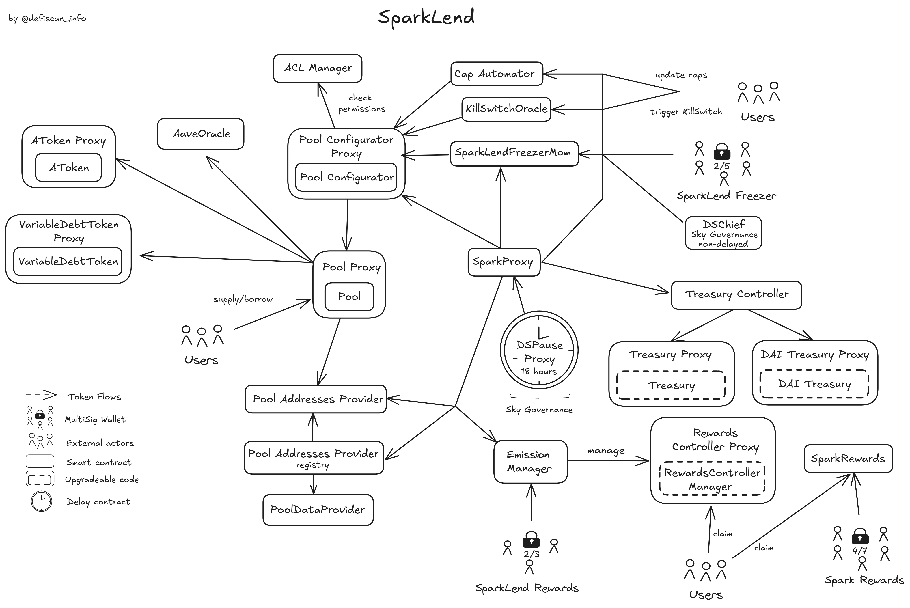
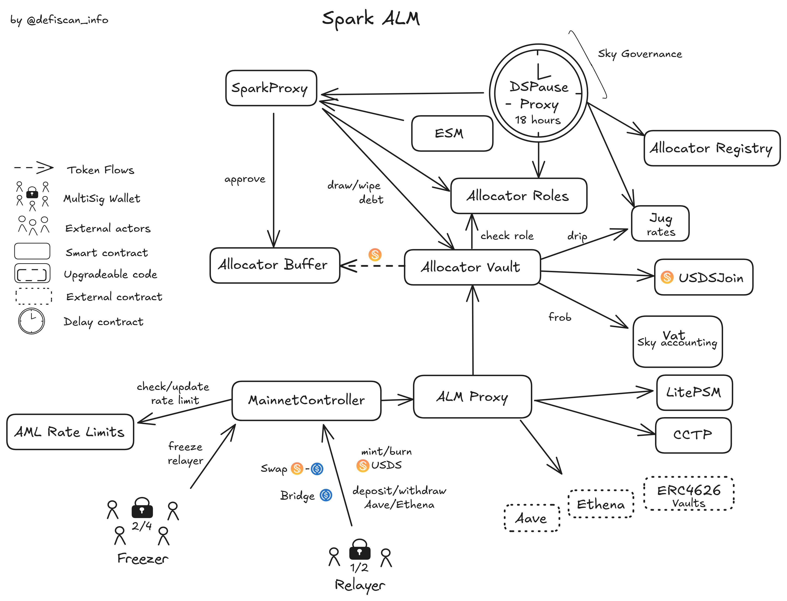

# Summary

Spark is a protocol within the Sky ecosystem and consists of two main products: _Savings USDS_ and _SparkLend_.

_Savings USDS_ is a savings product offering a fixed return on various stablecoins including `USDS`, `DAI` and `USDC`.

_SparkLend_ is a lending protocol that enables users to lend and borrow various crypto assets. It offers deep stablecoin liquidity that is provided to a large part by Sky through Spark's _Liquidity Management Layer_.

Spark's _Liquidity Management Layer_ allocates Sky stablecoin liquidity to various DeFi lending markets including _SparkLend_. The focus in this review is thus on its role within _SparkLend_ itself.

# Ratings

## Chain

Spark's products are deployed on multiple chains. This review focuses on the Ethereum mainnet deployments.

> Chain score: Low

## Upgradeability

The upgradeability of Spark is limited. The _SparkLend_ markets are not upgradeable, but the treasury (collected fees) and rewards contracts may be upgraded through the _Sky Governance_. Upgrading the rewards contracts may cancel the existing rewards and result in the _loss of unclaimed yield_. This is because the rewards are part of the yield advertised to users. The _Sky Governance_ and the [SparkLend Freezer](#security-council) multisig can both freeze all funds deposited into _SparkLend_ with no delay. If those funds are not unfrozen by a _Sky Governance_ proposal, this would lea to the _loss of user funds_.

_Savings USDS_ on Ethereum mainnet only interacts with the original `sUSDS` contract deployed by the _Sky Governance_. This contract is upgradeable, but this upgradeability is counted in Spark's dependency on Sky in the [autonomy section](#autonomy).

> Upgradeability Score: High

## Autonomy

Spark has a critical dependency on the Sky Protocol, a [Stage 0 protocol](/protocols/sky/ethereum). This dependency is two-fold. On the governance level, all key permissions in Spark contracts are held by the _Sky Governance_, this means that at this time, Spark is effectively managed by Sky. On the protocol level, Spark depends on Sky's products: `USDS` and `sUSDS` are both managed by Sky which, among other critical permissions, holds the rights to upgrade those contracts to any new logic.

Spark's own _Liquidity Management Layer (ALM)_ can be seen as a dependency for _SparkLend_ as it is responsible for providing a significant portion of the liquidity into _SparkLend_'s stablecoin markets. This layer is managed by [Relayers](#security-council) who allocate liquidity accross different DeFi protocols and chains within strict governance-defined limits. This can impact users indirectly by manipulation of interest rates. We explain this layer in more details in the [protocol analysis](#protocol-analysis) and [dependencies](#dependencies) sections.

Finally, Chronicle price feeds are used in _SparkLend_ all asset prices. A failure of those oracles could lead to wrongful liquidations. We found Chronicle to be a _Medium Centralization_ dependency in a [dedicated report](/protocols/chronicle/ethereum). An oracle killswitch was introduced to mitigate possible oracle failures. If a price falls below a certain threshold, the killswitch freezes all borrowing within _SparkLend_ until manually reset by the _Sky Governance_. Nonetheless, as discussed in [dependencies](#dependencies), this mitigation is only used for one price feed within _SparkLend_ and is not sufficient to mitigate all failures.

More information on the centralization and functioning of those dependencies can be found in [dependencies](#dependencies).

> Autonomy Score: High

## Exit Window

Spark is governed by _Sky Governance_ and the same _Exit Window_ of **18 hours** applies to regular updates, including upgrading the `RewardsControllerManager`, unfreezing markets, changing contract permisisons, or resetting the oracle killswitch.

Emergency Actions, including freezing all markets within _SparkLend_, can be executed by the _Sky Governance_ with no delay.
Furthermore, a [SparkLend Freezer](#security-council) multisig holds the same emergency permissions with only 2 signatures required out of 5 possible signers.

> Exit Window Score: High

## Accessibility

Spark has a main open-source frontend at [spark.fi](https://app.spark.fi). The code is open-source, and there are instructions to run the page locally as a developer. There are no dedicated instructions for self-hosting. Direct interaction with the contract is neither straightforward nor documented.

However, _SparkLend_ is accessible on third-party applications such as DeFiSaver and SummerFiPro. These apps build an acceptable backup solution in case of failure of the official frontend and backend.

> Accesibility score: Low

## Conclusion

Spark has a critical, unmitigated dependency on Sky, a _Stage 0_ protocol, for both its _Savings USDS_ and _SparkLend_ products. This results in a _High_ centralization score for Spark's _Autonomy_, _Upgradeability_, and _Exit Window_. Spark thus also achieves **Stage 0**.

Spark can advance to _Stage 1_, if Sky achieves _Stage 1_ and the [Sparklend Freezer](#security-council) is updated to a Security Council setup. Spark could further advance to _Stage 2_ if Sky achieves _Stage 2_, its Chronicle dependency achieves a _Low_ centralization score, and the [Sparklend Freezer](#security-council) permissions are assigned to an onchain governance system.

> Overall score: Stage 0

# Reviewer Notes

As mentioned in the summary, we only considered Spark's _Liquidity Management Layer_ as a dependency in this analysis, as it is not a user-facing product. Nonetheless, the _Liquidity Management Layer_ has been fully analysed in the [contracts and permissions](#contracts-and-permissions) section and is explained thoroughly in the [protocol analysis](#protocol-analysis).

We believe it is worth noting that funds in the _Liquidity Management Layer_ may be sent out to other chains through _Circle's Cross-Chain Transfer Protocol (CCTP)_. The CCTP which relies on a set of centralized offchain signers to provide the bridging attestation. As this review is only concerned with _Ethereum Mainnet_, it does not count as a dependency. Nonetheless, it will influence the score of Spark on other chains receiving funds from the CCTP.

# Protocol Analysis

## SparkLend

_SparkLend_ is a `USDS` and `DAI`-centric lending protocol in which users can participate as lenders or borrowers.

The protocol is a fork of [Aave v3](/protocols/aave/ethereum) with some particularities highlighted in the diagram below. Most contracts, including markets, are non-upgradeable, with upgrades only possible on the `Treasury` and `RewardsControllerManager` contracts. Upgrading the rewards may revoke unclaimed rewards and lead to the _loss of unclaimed yield_, as rewards are advertised as part of the yield. All critical permissions are held by the _Sky Governance_ through the `DSPause Proxy`.

Some emergency actions can be taken, such as freezing all new borrowing in _SparkLend_ if a certain asset price falls below a predetermined threshold. A multisig called [SparkLend Freezer](#security-council), as well as the _Sky Governance_, can freeze or pause any market in _SparkLend_ without any delay. They can then be reactivated through the delayed _Sky Governance_.

Spark has two rewards modules named `SparkRewards` and `SparkLendRewards`. `SparkRewards` is a global rewards program that may reward users for any specific action that promotes the use of Spark. This may include using a specific _SparkLend_ market. On the other hand, `SparkLendRewards` is a rewards module inherited from Aave v3, which allows the distribution of rewards for specific _SparkLend_ Markets. Both reward modules have their respective mulsitigs with 2-out-of-3 signers, and both have been used in the past to distribute rewards promoting the use of _SparkLend_.

## Savings USDS

As shown in the picture, Spark's _Savings USDS_ on Ethereum mainnet is simply Sky's native savings rate. This module is managed by the _Sky Governance_ and is considered a dependency.

## Spark Liquidity Management

Spark has a _Liquidity Management Layer (ALM)_ whose role is to automate liquidity provision of `USDS`, `sUSDS`, and `USDC` directly from Sky and across blockchain networks and DeFi protocols. The overview of this system is shown in the diagram below. No contracts in the ALM are upgradeable, and all critical permissions are held by the _Sky Governance_ through its delayed proxy (`DSPause Proxy`). The `Spark Proxy` is a simple wrapper around the _Sky Governance_ to distinguish permissions specific to Spark. The `AllocatorVault` bridges between Sky and Spark and allows minting/burning of `USDS`.

The main component of the ALM is the `ALMProxy` and its `MainnetController`. The `ALMProxy` holds all the funds while the `MainnetController` can move and distribute those funds across protocols and chains. An offchain [Relayers](#security-council) multistig made of 2 signers with a threshold of 1 can dictate all liquidity movements. However, the relayers are subject to strict rate limits and can only allocate funds to pre-approved contracts. A [Freezer](#security-council) multisig can freeze the relayers at any time if it detects suspicious behaviors. The `MainnetController` supports the provision of liquidity in Aave, Ethena, and any ERC-4626 compatible (pre-approved) vault.

# Dependencies

## Sky

Spark has a critical dependency on the Sky Protocol, a _Stage 0_ protocol. This dependency is at two levels. First, Spark revolves around `USDS`, the Sky USD stablecoin and its associated savings rate (`sUSDS`). If `USDS` came to fail due to various reasons or be upgraded maliciously, this would severely impact Spark. The savings module can also be updated by Sky. The detailed analysis of Sky's centralization can be found [here](/protocols/sky/ethereum).

In addition to that, all critical permissions in Spark are currently held by the _Sky Governance_. This means that at this time, Spark is effectively managed by Sky.

## Spark's Liquidity Management Layer

Spark's _Liquidity Management Layer (ALM)_ is a dependency for _SparkLend_ as it provides part of the liquidity in the markets. As explained in the [Protocol Analysis](#protocol-analysis), the layer is managed by two relayers who attribute liquidity in different DeFi protocols to promote `USDS`. An mismanagement of the liquidity layer by the relayers could result in the withdrawal of all the available liquidity, spiking interest rates for _SparkLend_ borrowers. Liquidity management can be done without delay, but within strict limits set by the _Sky Governance_. The management by [Relayers](#security-council) may be paused by the [Freezer](#security-council) if it detects a malfunction or malicious actions. The [Freezer](#security-council) does not meet our Security Council requirements.

## Chronicle

Currently, Chronicle oracles are used in _SparkLend_ with no fallbacks for all asset prices. We assessed that Chronicle is a _Medium Centralization_ (_Stage 1_ equivalent) dependency and explained it in detail in a [dedicated report](/protocols/chronicle/ethereum).

A `KillSwitchOracle` contract is used to set critical prices per asset in case of potential oracle failure or manipulation. If the oracle returns a price below the critical price for an asset, anyone can disable the oracle and pause all borrowing of all assets within _SparkLend_ until the killswitch is reset by the _Sky Governance_.

This feature could potentially serve as an effective mitigation for centralization vectors in _SparkLend_'s oracle dependency. However, the current `KillSwitchOracle` contract only implements protections against untrusted lower prices and does not account for potential untrusted higher prices. Furthermore, at the time of writing this revew, only one killswitch is in place within _SparkLend_, for the stETH/ETH price feed, limiting potential depegs at 0.95 stETH/ETH.

As a result, in its current form, the `KillSwitchOracle` contract does not offer a comprehensive mitigation for centralization risks in _SparkLend_'s oracle dependency.

# Governance

All critical permissions in Spark are held by the _Sky Governance_. More details on the exact functioning of
the _Sky Governance_ can be found in the [Sky Review] (https://www.defiscan.info/protocols/sky/ethereum).

## Exit Window

Spark does not add any further delay to _Sky Governance_ decisions. _Sky Governance_ proposals are delayed by **18 hours**, set by the _Sky Governance_ itself (see [Sky review](/protocols/sky/ethereum#exit-window)).

Emergency proposals are prepared for the _Sky Governance_ to freeze all markets within _SparkLend_ without any delay, which would prevent users from withdrawing their funds. Those actions could be executed without delay, but still require a vote and a majority according to Sky's continuous approval system. In addition to that, a [SparkLend Freezer](#security-council) multi-sig holds the same emergency permissions with only 2 signatures required out of 5 possible signers.

If an oracle's killswitch is triggered (see [dependencies](#dependencies)), the borrowing is disabled without delay for all assets across the protocol until the killswitch is reset by the _Sky Governance_.

## Security Council

The table below shows the permissions owners, in the Spark protocol in addition to the governance.

The [Freezer](#security-council) multisig can freeze the movement of liquidity in the ALM while the [SparkLend Freezer](#security-council) can freeze one or all markets in _SparkLend_. They do not meet our Security Council requirements and the signers are not publicly announced.

| Name              | Account                                                                                                               | Type         | ≥ 7 signers | ≥ 51% threshold | ≥ 50% non-insider | Signers public |
| ----------------- | --------------------------------------------------------------------------------------------------------------------- | ------------ | ----------- | --------------- | ----------------- | -------------- |
| SparkRewards      | [0xF649956f43825d4d7295a50EDdBe1EDC814A3a83](https://etherscan.io/address/0xF649956f43825d4d7295a50EDdBe1EDC814A3a83) | MultiSig 2/3 | ❌          | ❌              | ❌                | ❌             |
| SparkLend Rewards | [0x8076807464DaC94Ac8Aa1f7aF31b58F73bD88A27](https://etherscan.io/address/0x8076807464DaC94Ac8Aa1f7aF31b58F73bD88A27) | MultiSig 2/3 | ❌          | ❌              | ❌                | ❌             |
| Freezer           | [0x90D8c80C028B4C09C0d8dcAab9bbB057F0513431](https://etherscan.io/address/0x90D8c80C028B4C09C0d8dcAab9bbB057F0513431) | MultiSig 2/4 | ❌          | ❌              | ❌                | ❌             |
| Relayer           | [0x8a25A24EDE9482C4Fc0738F99611BE58F1c839AB](https://etherscan.io/address/0x8a25A24EDE9482C4Fc0738F99611BE58F1c839AB) | MultiSig 1/2 | ❌          | ❌              | ❌                | ❌             |
| SparkLend Freezer | [0x44efFc473e81632B12486866AA1678edbb7BEeC3](https://etherscan.io/address/0x44efFc473e81632B12486866AA1678edbb7BEeC3) | MultiSig 2/5 | ❌          | ❌              | ❌                | ❌             |

# Contracts and Permissions

## Contracts

The list of deployed contracts and their addresses is available in spark's [addresses registry](https://github.com/sparkdotfi/spark-address-registry/blob/master/src/Ethereum.sol).

| Contract Name                                                      | Address                                                                                                               |
| ------------------------------------------------------------------ | --------------------------------------------------------------------------------------------------------------------- |
| SubProxy ("Spark Proxy")                                           | [0x3300f198988e4C9C63F75dF86De36421f06af8c4](https://etherscan.io/address/0x3300f198988e4C9C63F75dF86De36421f06af8c4) |
| SparkRewards                                                       | [0xbaf21A27622Db71041Bd336a573DDEdC8eB65122](https://etherscan.io/address/0xbaf21A27622Db71041Bd336a573DDEdC8eB65122) |
| AllocatorBuffer                                                    | [0xc395D150e71378B47A1b8E9de0c1a83b75a08324](https://etherscan.io/address/0xc395D150e71378B47A1b8E9de0c1a83b75a08324) |
| AllocatorOracle                                                    | [0xc7B91C401C02B73CBdF424dFaaa60950d5040dB7](https://etherscan.io/address/0xc7B91C401C02B73CBdF424dFaaa60950d5040dB7) |
| AllocatorRegistry                                                  | [0xCdCFA95343DA7821fdD01dc4d0AeDA958051bB3B](https://etherscan.io/address/0xCdCFA95343DA7821fdD01dc4d0AeDA958051bB3B) |
| AllocatorRoles                                                     | [0x9A865A710399cea85dbD9144b7a09C889e94E803](https://etherscan.io/address/0x9A865A710399cea85dbD9144b7a09C889e94E803) |
| AllocatorVault                                                     | [0x691a6c29e9e96dd897718305427Ad5D534db16BA](https://etherscan.io/address/0x691a6c29e9e96dd897718305427Ad5D534db16BA) |
| MainnetController (ALM)                                            | [0x5cf73FDb7057E436A6eEaDFAd27E45E7ab6E431e](https://etherscan.io/address/0x5cf73FDb7057E436A6eEaDFAd27E45E7ab6E431e) |
| Proxy (ALM)                                                        | [0x1601843c5E9bC251A3272907010AFa41Fa18347E](https://etherscan.io/address/0x1601843c5E9bC251A3272907010AFa41Fa18347E) |
| RateLimits (ALM)                                                   | [0x7A5FD5cf045e010e62147F065cEAe59e5344b188](https://etherscan.io/address/0x7A5FD5cf045e010e62147F065cEAe59e5344b188) |
| SafeProxy (Freezer ALM)                                            | [0x90D8c80C028B4C09C0d8dcAab9bbB057F0513431](https://etherscan.io/address/0x90D8c80C028B4C09C0d8dcAab9bbB057F0513431) |
| SafeProxy (Relayer ALM)                                            | [0x8a25A24EDE9482C4Fc0738F99611BE58F1c839AB](https://etherscan.io/address/0x8a25A24EDE9482C4Fc0738F99611BE58F1c839AB) |
| AaveOracle                                                         | [0x8105f69D9C41644c6A0803fDA7D03Aa70996cFD9](https://etherscan.io/address/0x8105f69D9C41644c6A0803fDA7D03Aa70996cFD9) |
| ACLManager                                                         | [0xdA135Cd78A086025BcdC87B038a1C462032b510C](https://etherscan.io/address/0xdA135Cd78A086025BcdC87B038a1C462032b510C) |
| InitializableAdminUpgradeabilityProxy (DAI Treasury / Collector)   | [0x856900aa78e856a5df1a2665eE3a66b2487cD68f](https://etherscan.io/address/0x856900aa78e856a5df1a2665eE3a66b2487cD68f) |
| EmissionManager                                                    | [0xf09e48dd4CA8e76F63a57ADd428bB06fee7932a4](https://etherscan.io/address/0xf09e48dd4CA8e76F63a57ADd428bB06fee7932a4) |
| InitializableAdminUpgradeabilityProxy (Rewards Controller)         | [0x4370D3b6C9588E02ce9D22e684387859c7Ff5b34](https://etherscan.io/address/0x4370D3b6C9588E02ce9D22e684387859c7Ff5b34) |
| InitializableImmutableAdminUpgradeabilityProxy (Pool)              | [0xC13e21B648A5Ee794902342038FF3aDAB66BE987](https://etherscan.io/address/0xC13e21B648A5Ee794902342038FF3aDAB66BE987) |
| PoolAddressesProvider                                              | [0x02C3eA4e34C0cBd694D2adFa2c690EECbC1793eE](https://etherscan.io/address/0x02C3eA4e34C0cBd694D2adFa2c690EECbC1793eE) |
| PoolAddressesProviderRegistry                                      | [0x03cFa0C4622FF84E50E75062683F44c9587e6Cc1](https://etherscan.io/address/0x03cFa0C4622FF84E50E75062683F44c9587e6Cc1) |
| InitializableImmutableAdminUpgradeabilityProxy (Pool Configurator) | [0x542DBa469bdE58FAeE189ffB60C6b49CE60E0738](https://etherscan.io/address/0x542DBa469bdE58FAeE189ffB60C6b49CE60E0738) |
| InitializableAdminUpgradeabilityProxy (Treasury / Collector)       | [0xb137E7d16564c81ae2b0C8ee6B55De81dd46ECe5](https://etherscan.io/address/0xb137E7d16564c81ae2b0C8ee6B55De81dd46ECe5) |
| CollectorController (Treasury Controller)                          | [0x92eF091C5a1E01b3CE1ba0D0150C84412d818F7a](https://etherscan.io/address/0x92eF091C5a1E01b3CE1ba0D0150C84412d818F7a) |
| WrappedTokenGatewayV3                                              | [0xBD7D6a9ad7865463DE44B05F04559f65e3B11704](https://etherscan.io/address/0xBD7D6a9ad7865463DE44B05F04559f65e3B11704) |
| CapAutomator                                                       | [0x2276f52afba7Cf2525fd0a050DF464AC8532d0ef](https://etherscan.io/address/0x2276f52afba7Cf2525fd0a050DF464AC8532d0ef) |
| SparkLendFreezerMom                                                | [0x237e3985dD7E373F2ec878EC1Ac48A228Cf2e7a3](https://etherscan.io/address/0x237e3985dD7E373F2ec878EC1Ac48A228Cf2e7a3) |
| KillSwitchOracle                                                   | [0x909A86f78e1cdEd68F9c2Fe2c9CD922c401abe82](https://etherscan.io/address/0x909A86f78e1cdEd68F9c2Fe2c9CD922c401abe82) |
| AToken (Impl)                                                      | [0x6175ddEc3B9b38c88157C10A01ed4A3fa8639cC6](https://etherscan.io/address/0x6175ddEc3B9b38c88157C10A01ed4A3fa8639cC6) |
| AaveV3ConfigEngine                                                 | [0x3254F7cd0565aA67eEdC86c2fB608BE48d5cCd78](https://etherscan.io/address/0x3254F7cd0565aA67eEdC86c2fB608BE48d5cCd78) |
| ProxyAdmin                                                         | [0x883A82BDd3d07ae6ACfD151020faD350df25087e](https://etherscan.io/address/0x883A82BDd3d07ae6ACfD151020faD350df25087e) |
| V3RateFactory                                                      | [0xfE57e187EF6285e90d7049e6a21571aa47cF11a2](https://etherscan.io/address/0xfE57e187EF6285e90d7049e6a21571aa47cF11a2) |
| TransparentProxy Factory                                           | [0x777803CbDD89D5D5Bc1DdD2151B51b0B07F6bf37](https://etherscan.io/address/0x777803CbDD89D5D5Bc1DdD2151B51b0B07F6bf37) |
| AaveProtocolDataProvider                                           | [0xFc21d6d146E6086B8359705C8b28512a983db0cb](https://etherscan.io/address/0xFc21d6d146E6086B8359705C8b28512a983db0cb) |
| UiIncentiveDataProviderV3                                          | [0xA7F8A757C4f7696c015B595F51B2901AC0121B18](https://etherscan.io/address/0xA7F8A757C4f7696c015B595F51B2901AC0121B18) |
| UiPoolDataProviderV3                                               | [0xF028c2F4b19898718fD0F77b9b881CbfdAa5e8Bb](https://etherscan.io/address/0xF028c2F4b19898718fD0F77b9b881CbfdAa5e8Bb) |
| WalletBalanceProvider                                              | [0xd2AeF86F51F92E8e49F42454c287AE4879D1BeDc](https://etherscan.io/address/0xd2AeF86F51F92E8e49F42454c287AE4879D1BeDc) |
| BorrowLogic                                                        | [0x4662C88C542F0954F8CccCDE4542eEc32d7E7e9a](https://etherscan.io/address/0x4662C88C542F0954F8CccCDE4542eEc32d7E7e9a) |
| BridgeLogic                                                        | [0x2C54924711E479E639032704146b865E12f0C6D1](https://etherscan.io/address/0x2C54924711E479E639032704146b865E12f0C6D1) |
| EmodeLogic                                                         | [0x2Ad00613A66D71Ff2B0607fB3C4632C47a50DADe](https://etherscan.io/address/0x2Ad00613A66D71Ff2B0607fB3C4632C47a50DADe) |
| FlashLoanLogic                                                     | [0x7f44e1c1dE70059D7cc483378BEFeE2a030CE247](https://etherscan.io/address/0x7f44e1c1dE70059D7cc483378BEFeE2a030CE247) |
| LiquidationLogic                                                   | [0x6aEa92693C527bC2c7B3171C6f2598d67d619088](https://etherscan.io/address/0x6aEa92693C527bC2c7B3171C6f2598d67d619088) |
| PoolLogic                                                          | [0x1761a0f74032963B6Ad0774C5EBF4586c0bD7604](https://etherscan.io/address/0x1761a0f74032963B6Ad0774C5EBF4586c0bD7604) |
| SupplyLogic                                                        | [0x46256841e36b7557BB8e4c706beD38b17A9EB2c1](https://etherscan.io/address/0x46256841e36b7557BB8e4c706beD38b17A9EB2c1) |
| WalletBalanceProvider                                              | [0x52d298Ff9e77E71C2EB1992260520E7b15257d99](https://etherscan.io/address/0x52d298Ff9e77E71C2EB1992260520E7b15257d99) |

## All Permission owners

| Name                                       | Account                                                                                                               | Type         |
| ------------------------------------------ | --------------------------------------------------------------------------------------------------------------------- | ------------ |
| DSPauseProxy (Sky DAO)                     | [0xBE8E3e3618f7474F8cB1d074A26afFef007E98FB](https://etherscan.io/address/0xBE8E3e3618f7474F8cB1d074A26afFef007E98FB) | Contract     |
| ESM (Sky Emergency Shutdown Module)        | [0x09e05fF6142F2f9de8B6B65855A1d56B6cfE4c58](https://etherscan.io/address/0x09e05fF6142F2f9de8B6B65855A1d56B6cfE4c58) | Contract     |
| SubProxy ("Spark Proxy")                   | [0x3300f198988e4C9C63F75dF86De36421f06af8c4](https://etherscan.io/address/0x3300f198988e4C9C63F75dF86De36421f06af8c4) | Contract     |
| Proxy (ALM/Liquidity Management)           | [0x1601843c5E9bC251A3272907010AFa41Fa18347E](https://etherscan.io/address/0x1601843c5E9bC251A3272907010AFa41Fa18347E) | Contract     |
| MainnetController                          | [0x5cf73FDb7057E436A6eEaDFAd27E45E7ab6E431e](https://etherscan.io/address/0x5cf73FDb7057E436A6eEaDFAd27E45E7ab6E431e) | Contract     |
| EmissionManager                            | [0xf09e48dd4CA8e76F63a57ADd428bB06fee7932a4](https://etherscan.io/address/0xf09e48dd4CA8e76F63a57ADd428bB06fee7932a4) | Contract     |
| CapAutomator                               | [0x2276f52afba7Cf2525fd0a050DF464AC8532d0ef](https://etherscan.io/address/0x2276f52afba7Cf2525fd0a050DF464AC8532d0ef) | Contract     |
| SparkLendFreezerMom                        | [0x237e3985dD7E373F2ec878EC1Ac48A228Cf2e7a3](https://etherscan.io/address/0x237e3985dD7E373F2ec878EC1Ac48A228Cf2e7a3) | Contract     |
| KillSwitchOracle                           | [0x909A86f78e1cdEd68F9c2Fe2c9CD922c401abe82](https://etherscan.io/address/0x909A86f78e1cdEd68F9c2Fe2c9CD922c401abe82) | Contract     |
| Collector Controller (Treasury Controller) | [0x92eF091C5a1E01b3CE1ba0D0150C84412d818F7a](https://etherscan.io/address/0x92eF091C5a1E01b3CE1ba0D0150C84412d818F7a) | Contract     |
| SparkRewards                               | [0xF649956f43825d4d7295a50EDdBe1EDC814A3a83](https://etherscan.io/address/0xF649956f43825d4d7295a50EDdBe1EDC814A3a83) | MultiSig 2/3 |
| SparkLend Rewards                          | [0x8076807464DaC94Ac8Aa1f7aF31b58F73bD88A27](https://etherscan.io/address/0x8076807464DaC94Ac8Aa1f7aF31b58F73bD88A27) | MultiSig 2/3 |
| Freezer                                    | [0x90D8c80C028B4C09C0d8dcAab9bbB057F0513431](https://etherscan.io/address/0x90D8c80C028B4C09C0d8dcAab9bbB057F0513431) | MultiSig 2/4 |
| Relayer                                    | [0x8a25A24EDE9482C4Fc0738F99611BE58F1c839AB](https://etherscan.io/address/0x8a25A24EDE9482C4Fc0738F99611BE58F1c839AB) | MultiSig 1/2 |
| SparkLend Freezer                          | [0x44efFc473e81632B12486866AA1678edbb7BEeC3](https://etherscan.io/address/0x44efFc473e81632B12486866AA1678edbb7BEeC3) | MultiSig 2/5 |

## Permissions

| Contract                                                           | Function                         | Impact                                                                                                                                                                                                                                                                                                                                                                                                                                                                                           | Owner                                                                                 |
| ----------------------------------------------------------------------- | ------------------------------------- | ------------------------------------------------------------------------------------------------------------------------------------------------------------------------------------------------------------------------------------------------------------------------------------------------------------------------------------------------------------------------------------------------------------------------------------------------------------------------------------------------ | ------------------------------------------------------------------------------------- |
| SubProxy ("Spark Proxy")                                                | rely                                  | Grants admin privileges over the contract to a specific address. Admins can execute any code in the name of the contract (delegateCall to any address).                                                                                                                                                                                                                                                                                                                                          | DSPauseProxy (Sky DAO), ESM (Sky Shutdown)                                            |
| SubProxy ("Spark Proxy")                                                | deny                                  | Revokes admin privileges over the contract to an address.                                                                                                                                                                                                                                                                                                                                                                                                                                        | DSPauseProxy (Sky DAO), ESM (Sky Shutdown)                                            |
| SubProxy ("Spark Proxy")                                                | exec                                  | Executes any code using the current contract's state (delegateCall to any address).                                                                                                                                                                                                                                                                                                                                                                                                              | DSPauseProxy (Sky DAO), ESM (Sky Shutdown)                                            |
| SparkRewards                                                            | grantRole                             | Grants a role to a specific address, this could give permission to potentially any address over any function in the contract.                                                                                                                                                                                                                                                                                                                                                                    | SparkRewards Multisig (MultiSig 2/3)                                                  |
| SparkRewards                                                            | revokeRole                            | Revokes an address' access role in the contract.                                                                                                                                                                                                                                                                                                                                                                                                                                                 | SparkRewards Multisig (MultiSig 2/3)                                                  |
| SparkRewards                                                            | setWallet                             | Changes the `wallet` address, the address that holds the tokens to be distributed as rewards.                                                                                                                                                                                                                                                                                                                                                                                                    | SparkRewards Multisig (MultiSig 2/3)                                                  |
| SparkRewards                                                            | setMerkleRoot                         | Changes the reference merkle root used to verify claims. A wrong merkle root could prevent users from claiming their rewards.                                                                                                                                                                                                                                                                                                                                                                    | SparkRewards Multisig (MultiSig 2/3)                                                  |
| SparkRewards                                                            | setEpochClosed                        | Enables or disables claiming for a specific epoch. This could prevent users from claiming legitimate rewards if an epoch is closed early.                                                                                                                                                                                                                                                                                                                                                        | SparkRewards Multisig (MultiSig 2/3)                                                  |
| AllocatorBuffer                                                         | rely                                  | Grants admin privileges over the contract. Admins can name other admins and approve tokens to be spent by an other contract. The contract's money is debt emitted by the spark `AllocatorVault` through the Sky ecosystem.                                                                                                                                                                                                                                                                       | SubProxy ("Spark Proxy")                                                              |
| AllocatorBuffer                                                         | deny                                  | Revokes admin privileges over the contract.                                                                                                                                                                                                                                                                                                                                                                                                                                                      | SubProxy ("Spark Proxy")                                                              |
| AllocatorBuffer                                                         | approve                               | Approves a token from the buffer to be spent by another address. This buffer mainly holds `USDS`, debt emitted from the `AllocatorVault` throught the Sky ecosystem. A malicious approve could allow the drainage of all USDS from the buffer.                                                                                                                                                                                                                                                   | SubProxy ("Spark Proxy")                                                              |
| AllocatorRegistry                                                       | rely                                  | Grants admin privileges over the contract. Admins can name other admins and change or add mappings from vault tags to addresses.                                                                                                                                                                                                                                                                                                                                                                 | DSPauseProxy (Sky DAO)                                                                |
| AllocatorRegistry                                                       | deny                                  | Revokes admin privileges over the contract.                                                                                                                                                                                                                                                                                                                                                                                                                                                      | DSPauseProxy (Sky DAO)                                                                |
| AllocatorRegistry                                                       | file                                  | Adds or changes a mapping from a vault tag to its contract address. An admin could change the address to point to another contract. This could be abused if undetected but easily circumvent in other cases.                                                                                                                                                                                                                                                                                     | DSPauseProxy (Sky DAO)                                                                |
| AllocatorRoles                                                          | rely                                  | Grants admin privileges over the contract to a specific address. Admins can grant admin privileges both over the contract or over collateral vaults and handle access control for vaults.                                                                                                                                                                                                                                                                                                        | DSPauseProxy (Sky DAO)                                                                |
| AllocatorRoles                                                          | deny                                  | Revokes admin permisisons over the contract.                                                                                                                                                                                                                                                                                                                                                                                                                                                     | DSPauseProxy (Sky DAO)                                                                |
| AllocatorRoles                                                          | setIlkAdmin                           | Sets the admin for a given collateral. The admin can grant roles and permissions over the corresponding vault.                                                                                                                                                                                                                                                                                                                                                                                   | DSPauseProxy (Sky DAO)                                                                |
| AllocatorRoles                                                          | setUserRole                           | Grants a role to a specific address. This can be used to grand fine-grained vault access to other addresses or contracts. Granting access to malicious addresses could be critical for the Spark Vault and the entire Sky ecosystem.                                                                                                                                                                                                                                                             | Admin of collateral type (SubProxy ("Spark Proxy") for AllocatorVault )               |
| AllocatorRoles                                                          | setRoleAction                         | Sets the capabilities of a given role. This can be used to define the accesses on a vault for specific role holders. Granting access to malicious addresses could be critical for the Spark Vault and the entire Sky ecosystem.                                                                                                                                                                                                                                                                  | Admin of collateral type (SubProxy ("Spark Proxy") for AllocatorVault )               |
| AllocatorVault                                                          | rely                                  | Grants admin privileges over the contract. Admins can name other admins, change the jug (interest rates) contract, and draw or wipe debt from the system. A malicious admin could draw excessive debt from Sky.                                                                                                                                                                                                                                                                                  | ALMProxy, SubProxy ("Spark Proxy"), AllocatorRoles(no additional permisions)          |
| AllocatorVault                                                          | deny                                  | Revokes admin privileges over the contract.                                                                                                                                                                                                                                                                                                                                                                                                                                                      | ALMProxy, SubProxy ("Spark Proxy"), AllocatorRoles(no additional permisions)          |
| AllocatorVault                                                          | file                                  | Changes the jug contract which collects stability fees on the vault. This could be used to upgrade the Jug contract. A malicious actor might try to avoid fees by changing this contract.                                                                                                                                                                                                                                                                                                        | ALMProxy, SubProxy ("Spark Proxy"), AllocatorRoles(no additional permisions)          |
| AllocatorVault                                                          | draw                                  | Draws `USDS` out of the `AllocatorVault` and into the `AllocatorBuffer`, creating debt. A malicious actor might draw excessive debt, although each vault has a maximal debt factor.                                                                                                                                                                                                                                                                                                              | ALMProxy, SubProxy ("Spark Proxy"), AllocatorRoles(no additional permisions)          |
| AllocatorVault                                                          | wipe                                  | Returns `USDS` from the `AllocatorBuffer` to the `AllocatorVault` and wipes out the debt.                                                                                                                                                                                                                                                                                                                                                                                                        | ALMProxy, SubProxy ("Spark Proxy"), AllocatorRoles(no additional permisions)          |
| MainnetController                                                       | grantRole                             | Grants a specific role within the contract to an address. The roles may be _Admin_, [Freezer](#security-council), and _Relayer_. The [Freezer](#security-councilurity-council) can freeze the contract at any time if it detects malicious actions and is currently a multisig, an#security-cou#security-cou#security-councilelayers](#security-council) can move liquidity within rate limits. This is a critical role but is assumed to malicious in the threat model.                         | SubProxy ("Spark Proxy")                                                              |
| MainnetController                                                       | revokeRole                            | Revokes an address' role in the contract, ensuring the address no longer bears the roles' capabilities. This can be used to change the [Freezer](#security-council), the _Admin_, or add/replace a _Relayer_. Granting malicious address one of those roles could be critical for the security of the Spark's liquidity.                                                                                                                                                                         | SubProxy ("Spark Proxy")                                                              |
| MainnetController                                                       | setMintRecipient                      | Sets the token recipient of a destination chain when bridging USDC with the CCTP (Cricle's Cross-Chain Transfer Protocol). A malicious recipient can steal bridged funds.                                                                                                                                                                                                                                                                                                                        | SubProxy ("Spark Proxy")                                                              |
| MainnetController                                                       | freeze                                | Freezes all functions that can move funds. This function is meant to be used in case of emergency or malicious behaviour from the _Relayer_. An abusive [Freezer](#security-council) could start a DOS on the protocol by freezeing the funds without a valid justification.                                                                                                                                                                                                                     | Freezer                                                                               |
| MainnetController                                                       | reactivate                            | Reactivates the frozen contract so that the _Relayer_ can move funds again.                                                                                                                                                                                                                                                                                                                                                                                                                      | SubProxy ("Spark Proxy")                                                              |
| MainnetController                                                       | mintUSDS                              | Draws debt from the Sky protocol to mint USDS using the `AllocatorVault` and transfers the funds from the `AllocatorBuffer` to the `ALMProxy`. A malicious relayer could draw excessive debt, although there are limits set in the `RateLimits` contract. This                                                                                                                                                                                                                                   | Relayer                                                                               |
| MainnetController                                                       | burnUSDS                              | Returns USDS to the `AllocatorVault` USDS and wipes out the debt emitted by the Sky protocol, the amount burnt also cancels the corresponding minting limit from the `RateLimits` contract (such that more `USDS` can be minted).                                                                                                                                                                                                                                                                | Relayer                                                                               |
| MainnetController                                                       | depositERC4626                        | Deposits a token (held in the `ALMProxy` contract) into an approved and rate limited ERC4626 vault.                                                                                                                                                                                                                                                                                                                                                                                              | Relayer                                                                               |
| MainnetController                                                       | withdrawERC4626                       | Withdraws a specific asset ammount from a vault to the `ALMProxy` (and burns corresponding shares). The relayer may withdraw all assets at once.                                                                                                                                                                                                                                                                                                                                                 | Relayer                                                                               |
| MainnetController                                                       | redeemERC4626                         | Burns a specific amount of vault shares and send the corresponding amount of assets to the `ALMProxy`. The relayer may redeem all shares at once.                                                                                                                                                                                                                                                                                                                                                | Relayer                                                                               |
| MainnetController                                                       | depositAave                           | Deposits an asset (held in the `ALMProxy` contract) in an Aave pool in order to receive a specific amount of `AToken` (within rate limits) corresponding to that asset.                                                                                                                                                                                                                                                                                                                          | Relayer                                                                               |
| MainnetController                                                       | withdrawAave                          | Withdraws assets from an aave pool and send the corresponding amount of assets to the `ALMProxy`. The relayer may withdraw all `ATokens` at once.                                                                                                                                                                                                                                                                                                                                                | Relayer                                                                               |
| MainnetController                                                       | setDelegatedSigner                    | Adds a delegated signer for the Etherna protocol. The delegate needs to explicitly accept the delegate and can then sign on orders behald of the contract. _Orders_ are an expirable intent to mint or redeem `USDe` with fixed spending collateral and outcome `USDe`. The relayers can only `prepareUSDeMint` and `prepareUSDeBurn` by triggering an approval from the contract. Further operations from the delegated signers, Ethena minter and burners are required to complete the action. | Relayer                                                                               |
| MainnetController                                                       | removeDelegatedSigner                 | Removes a delegated signer for the Etherna protocol.                                                                                                                                                                                                                                                                                                                                                                                                                                             | Relayer                                                                               |
| MainnetController                                                       | prepareUSDeMint                       | Prepare for minting `USDe`by approving the necessary `USDC`.                                                                                                                                                                                                                                                                                                                                                                                                                                     | Relayer                                                                               |
| MainnetController                                                       | prepareUSDeBurn                       | Prepare for burning `USDe`by approving the necessary `USDe`.                                                                                                                                                                                                                                                                                                                                                                                                                                     | Relayer                                                                               |
| MainnetController                                                       | cooldownAssetsSUSDe                   | Initiates the cooldown process to unstake `USDe` assets from the staking contract.                                                                                                                                                                                                                                                                                                                                                                                                               | Relayer                                                                               |
| MainnetController                                                       | cooldownSharesSUSDe                   | Similar to `cooldownAssetsSUSDe` but operates in terms of `sUSDe` shares rather than `USDe` assets.                                                                                                                                                                                                                                                                                                                                                                                              | Relayer                                                                               |
| MainnetController                                                       | unstakeSUSDe                          | Completes the unstaking process once the cooldown has passed. The assets are withdrawn and returned to the `ALMProxy`.                                                                                                                                                                                                                                                                                                                                                                           | Relayer                                                                               |
| MainnetController                                                       | swapUSDSToUSDC                        | Swaps `USDS` (held in the `ALMProxy` contract) to `USDC` using Sky's `LitePSM` without fees and within rate limits.                                                                                                                                                                                                                                                                                                                                                                              | Relayer                                                                               |
| MainnetController                                                       | swapUSDCToUSDS                        | Swaps `USDC` (held in the `ALMProxy` contract) to `USDS` using Sky's `LitePSM` without fees and within rate limits. Note that new `USDS` will be minted, within the ceilings established by the Sky protocol, in order to fulfill the swap.                                                                                                                                                                                                                                                      | Relayer                                                                               |
| MainnetController                                                       | transferUSDCToCCTP                    | Triggers a cross-chain transfer of `USDC` (held in the `ALMProxy` contract) to an approved destination chain. Transfers have rate limits both in terms of total and destination-specific bridging. The recipient of the funds in the destination chain has to be predefined beforehand on a call to `setMintReceipient`.                                                                                                                                                                         | Relayer                                                                               |
| ALMProxy                                                                | grantRole                             | Grants a specific role within the contract to an address. The roles may be _Admin_ or _Controller_. The _Admin_ can handle roles while the _Controller_ has unlimited access on the protocol's liquidity which is held in the `ALMProxy`. The respect of rate limits and the logic are implemented on the _Controllers_'s side. A malicious controller or admin (by naming a malicious controller) can therefore steal all funds.                                                                | SubProxy ("Spark Proxy")                                                              |
| ALMProxy                                                                | revokeRole                            | Revokes an address' role within the contract.                                                                                                                                                                                                                                                                                                                                                                                                                                                    | SubProxy ("Spark Proxy")                                                              |
| ALMProxy                                                                | doCall                                | Makes a specific call from the `ALMProxy`. This allows the controller the use the liquidity held in the contract in the name of the `ALMProxy`. A malicious controller could steal all funds held.                                                                                                                                                                                                                                                                                               | MainnetController                                                                     |
| ALMProxy                                                                | doCallWithValue                       | Makes a specific call from the `ALMProxy` and with a specific message value. This allows the controller the use the liquidity held in the contract in the name of the `ALMProxy`. A malicious controller could steal all funds held.                                                                                                                                                                                                                                                             | MainnetController                                                                     |
| ALMProxy                                                                | doDelegateCall                        | Makes a specific call using the `ALMProxy`s state. This allows the controller to execute any arbitrary code with the `ALMProxy` as state. A malicious controller could steal all funds held.                                                                                                                                                                                                                                                                                                     | MainnetController                                                                     |
| RateLimits                                                              | grantRole                             | Grants a specific role within the contract to an address. The roles may be _Admin_ or _Controller_. The _Admin_ can handle roles and set rate limits on liquidity while the _Controller_ can track and update the rate usage (indirectly enforcing the limits). The _Controller_ is trusted to track limits accurately. If one of the _Controllers_ is malicious it could mishandle, misupdate, or ignore the limits and potentially drain the liquidity.                                        | SubProxy ("Spark Proxy")                                                              |
| RateLimits                                                              | revokeRole                            | Revokes an address' role within the contract.                                                                                                                                                                                                                                                                                                                                                                                                                                                    | SubProxy ("Spark Proxy")                                                              |
| RateLimits                                                              | setRateLimitData                      | Sets the rate limit for a specific asset or liquidity movement. A limit too high is a risk of abuse by the untrusted relayers in the controller.                                                                                                                                                                                                                                                                                                                                                 | SubProxy ("Spark Proxy")                                                              |
| RateLimits                                                              | setUnlimitedRateLimitData             | Sets the rate limit for a specific asset or liquidity movement to unlimited. This is at risk of abuse by the untrusted relayers in the controller.                                                                                                                                                                                                                                                                                                                                               | SubProxy ("Spark Proxy")                                                              |
| RateLimits                                                              | triggerRateLimitDecrease              | Decreases the limit usage for a specific asset or liquidity movement. This means that controllers have a higher direct limit and should be called when the liquidity is returned.                                                                                                                                                                                                                                                                                                                | MainnetController                                                                     |
| RateLimits                                                              | triggerRateLimitIncrease              | Increases the limit usage for a specific asset or liquidity movement. This means that controllers have a lower direct limit and should be called when the liquidity is used. This indirectly enforces the limits as the call will revert if the limit is reached.                                                                                                                                                                                                                                | MainnetController                                                                     |
| DAI Treasury Proxy (InitializableAdminUpgradeabilityProxy)              | changeAdmin                           | updates the admin of the Treasury Proxy: the account with the rights to upgrade the implementation contract. A malicious upgrade could change the whole logic of the treasury, including stealing funds.                                                                                                                                                                                                                                                                                         | SubProxy ("Spark Proxy")                                                              |
| DAI Treasury Proxy (InitializableAdminUpgradeabilityProxy)              | upgradeTo                             | Upgrades the implementation contract for the DAI Treasury. A malicious upgrade could change the whole logic of the treasury, including stealing funds.                                                                                                                                                                                                                                                                                                                                           | SubProxy ("Spark Proxy")                                                              |
| DAI Treasury Proxy (InitializableAdminUpgradeabilityProxy)              | upgradeToAndCall                      | Same as _upgradeTo_ with an additional call to the newly deployed contract.                                                                                                                                                                                                                                                                                                                                                                                                                      | SubProxy ("Spark Proxy")                                                              |
| DAI Treasury (Collector)                                                | approve                               | Allows an address to collect a given token in the treasury. If the address is malicious this would allow it to stea funds.                                                                                                                                                                                                                                                                                                                                                                       | Treasury Controller                                                                   |
| DAI Treasury (Collector)                                                | transfer                              | Transfers an amount of a given token from the treasury to an address. If called maliciously this could transfer funds to an attacker.                                                                                                                                                                                                                                                                                                                                                            | Treasury Controller                                                                   |
| DAI Treasury (Collector)                                                | setFundsAdmin                         | Sets the fund admin: the account with the right to transfer funds out of the treasury (See `CollectorController`).                                                                                                                                                                                                                                                                                                                                                                               | Treasury Controller                                                                   |
| Treasury Proxy (InitializableAdminUpgradeabilityProxy)                  | changeAdmin                           | updates the admin of the Treasury Proxy: the account with the rights to upgrade the implementation contract. A malicious upgrade could change the whole logic of the treasury, including stealing funds.                                                                                                                                                                                                                                                                                         | SubProxy ("Spark Proxy")                                                              |
| Treasury Proxy (InitializableAdminUpgradeabilityProxy)                  | upgradeTo                             | Upgrades the implementation contract for the DAI Treasury. A malicious upgrade could change the whole logic of the treasury, including stealing funds.                                                                                                                                                                                                                                                                                                                                           | SubProxy ("Spark Proxy")                                                              |
| Treasury Proxy (InitializableAdminUpgradeabilityProxy)                  | upgradeToAndCall                      | Same as _upgradeTo_ with an additional call to the newly deployed contract.                                                                                                                                                                                                                                                                                                                                                                                                                      | SubProxy ("Spark Proxy")                                                              |
| Treasury (Collector)                                                    | approve                               | Allows an address to collect a given token in the treasury. If the address is malicious this would allow it to stea funds.                                                                                                                                                                                                                                                                                                                                                                       | Treasury Controller                                                                   |
| Treasury (Collector)                                                    | transfer                              | Transfers an amount of a given token from the treasury to an address. If called maliciously this could transfer funds to an attacker.                                                                                                                                                                                                                                                                                                                                                            | Treasury Controller                                                                   |
| Treasury (Collector)                                                    | setFundsAdmin                         | Sets the fund admin: the account with the right to transfer funds out of the treasury (See `CollectorController`).                                                                                                                                                                                                                                                                                                                                                                               | Treasury Controller                                                                   |
| Treasury Controller (CollectorController)                               | renounceOwnership                     | Revokes all ownership over the contract, disabling permissioned calls. This would lock all remaining and future funds in the treasury.                                                                                                                                                                                                                                                                                                                                                           | SubProxy ("Spark Proxy")                                                              |
| Treasury Controller (CollectorController)                               | transferOwnership                     | Transfers ownership over the contract to a new address. The owner has control of all funds over the treasury and could potentially steal funds.                                                                                                                                                                                                                                                                                                                                                  | SubProxy ("Spark Proxy")                                                              |
| Treasury Controller (CollectorController)                               | approve                               | Allows an address to collect a given token in the given treasury. If the address is malicious this would allow it to stea funds.                                                                                                                                                                                                                                                                                                                                                                 | SubProxy ("Spark Proxy")                                                              |
| Treasury Controller (CollectorController)                               | transfer                              | Transfers an amount of a given token from the given treasury to an address. If called maliciously this could transfer funds to an attacker.                                                                                                                                                                                                                                                                                                                                                      | SubProxy ("Spark Proxy")                                                              |
| RewardsController Proxy (InitializableAdminUpgradeabilityProxy)         | changeAdmin                           | Changes the admin of the `RewardsController Proxy`. The admin can upgrade the implemtation contract. This can result in a change of the whole logic of the contract and therefore affect rewards of ongoing incentive campaigns.                                                                                                                                                                                                                                                                 | SubProxy ("Spark Proxy")                                                              |
| RewardsController Proxy (InitializableAdminUpgradeabilityProxy)         | upgradeTo                             | Changes the `RewardsController` implementation contract. This can result in a change of the whole logic of the contract and therefore affect rewards of ongoing incentive campaigns.                                                                                                                                                                                                                                                                                                             | SubProxy ("Spark Proxy")                                                              |
| RewardsController Proxy (InitializableAdminUpgradeabilityProxy)         | upgradeToAndCall                      | Same as _upgradeTo_, with an additional call to the new contract once upgraded.                                                                                                                                                                                                                                                                                                                                                                                                                  | SubProxy ("Spark Proxy")                                                              |
| RewardsController                                                       | setDistributionEnd                    | Updates the end of the distribution phase. This can be changed during an active distribution phase. If done so, the future rewards could be taken away from users, by an early end of the program.                                                                                                                                                                                                                                                                                               | Emission Manager                                                                      |
| RewardsController                                                       | setEmissionPerSecond                  | Updates the emission rate of reward tokens.This can be changed even during an active distribution phase. If so, the future rewards could be taken away from users, by reducing the rate to 0.                                                                                                                                                                                                                                                                                                    | Emission Manager                                                                      |
| RewardsController                                                       | configureAssets                       | Starts a new incentive campaign, specifying a start, end, and reward token distributed. This is handled thourhg the _configureAsset_ function from the `EmissionManager`.                                                                                                                                                                                                                                                                                                                        | Emission Manager                                                                      |
| RewardsController                                                       | setTransferStrategy                   | Sets a (new) `TransferStrategy` logic contract that determines the logic of the rewards transfer. The transfer strategy allows to send tokens from allocated incentives treasury to the beneficiary user.                                                                                                                                                                                                                                                                                        | Emission Manager                                                                      |
| RewardsController                                                       | setRewardOracle                       | Sets a (new) oracle contract to enforce rewards with a source of value.                                                                                                                                                                                                                                                                                                                                                                                                                          | Emission Manager                                                                      |
| RewardsController                                                       | claimRewardsOnBehalf                  | Allows a white listed claimer to claim pending rewards on behalf of another user. The claimed rewards can be sent to any address up to the choice of the caller.                                                                                                                                                                                                                                                                                                                                 | Whitelisted Claimers For that user                                                    |
| RewardsController                                                       | claimAllRewardsOnBehalf               | Allows a whitelisted claimer to claim all pending rewards on behald of another user. The claimed rewards can be sent to any address up to the choice of the caller.                                                                                                                                                                                                                                                                                                                              | Whitelisted Claimers For that user                                                    |
| RewardsController                                                       | setClaimer                            | Whitelists an address as a claimer. A whitelisted address can claim rewards on behald of a specific user and send them to arbitrary addresses.                                                                                                                                                                                                                                                                                                                                                   | Emission Manager                                                                      |
| EmissionManager                                                         | renounceOwnership                     | Revokes ownership of the contract irreversibly. This means all owner permissioned functions will be disabled. This includes assigning new emission admins, whitelist reward claimers, and change the address of the `RewardController` contract used.                                                                                                                                                                                                                                            | SubProxy ("Spark Proxy")                                                              |
| EmissionManager                                                         | transferOwnership                     | Transfers ownership of the contract to another address. The new admin inherits all the access to all owner permissioned functions and holds a core role in the incentives programs.                                                                                                                                                                                                                                                                                                              | SubProxy ("Spark Proxy")                                                              |
| EmissionManager                                                         | configureAssets                       | Gateway for an emission admin to configure an incentivization campaign for their token in the `RewardsController`, which include an emission rate and the specific campaign period (start, end). Multiple incentivization campaigns can be held at the same time for one reward token.                                                                                                                                                                                                           | Emission admin of reward asset (SparkLend Rewards Multisig)                           |
| EmissionManager                                                         | setTransferStrategy                   | Updates the address of the `transferStrategy` contract for a given reward token. This contract is used to send tokens from the allocated incentive treasury to the beneficiary. A wrong or misconfigured contract would prevent users from claiming their rewards.                                                                                                                                                                                                                               | Emission admin of reward asset (SparkLend Rewards Multisig)                           |
| EmissionManager                                                         | setRewardOracle                       | Updates the address of the oracle for a given reward token.                                                                                                                                                                                                                                                                                                                                                                                                                                      | Emission admin of reward asset (SparkLend Rewards Multisig)                           |
| EmissionManager                                                         | setDistributionEnd                    | Updates the end of the distribution phase for a given reward token. This can be changed during an active distribution phase. If done so, the future rewards could be taken away from users, by an early end of the program.                                                                                                                                                                                                                                                                      | Emission admin of reward asset (SparkLend Rewards Multisig)                           |
| EmissionManager                                                         | setEmissionPerSecond                  | Updates the emission rate of reward tokens.This can be changed even during an active distribution phase. If so, the future rewards could be taken away from users, by reducing the rate to 0.                                                                                                                                                                                                                                                                                                    | Emission admin of reward asset (SparkLend Rewards Multisig)                           |
| EmissionManager                                                         | setClaimer                            | Whitelists an address as a claimer. A whitelisted address can claim rewards on behald of a specific user and send them to arbitrary addresses.                                                                                                                                                                                                                                                                                                                                                   | SubProxy ("Spark Proxy")                                                              |
| EmissionManager                                                         | setEmissionAdmin                      | Assigns a new emission admin for a given reward token. Each reward token can have multiple incentivization campaigns but only one admin. The admins use this `EmissionManager` contract as a gateway to handle the `RewardsController` contract.                                                                                                                                                                                                                                                 | SubProxy ("Spark Proxy")                                                              |
| EmissionManager                                                         | setRewardsController                  | Changes the address of the `RewardsController` used. Ongoing campaigns are not impacted by a change of `RewardsController` because users interact with the `RewardsController` directly.                                                                                                                                                                                                                                                                                                         | SubProxy ("Spark Proxy")                                                              |
| Pool Proxy (InitializableImmutableAdminUpgradeabilityProxy)             | upgradeTo                             | Upgrades the implementation of the `Pool` contract. Nonetheless, the proxy has no admin and the `Pool` is therefore immutable.                                                                                                                                                                                                                                                                                                                                                                   | 0x0                                                                                   |
| Pool Proxy (InitializableImmutableAdminUpgradeabilityProxy)             | upgradeToAndCall                      | Similarly to _upgradeTo_, this function could upgrade the `Pool` contract. Nonetheless, the proxy has no admin and the `Pool` is therefore immutable.                                                                                                                                                                                                                                                                                                                                            | 0x0                                                                                   |
| Pool                                                                    | mintUnbacked                          |                                                                                                                                                                                                                                                                                                                                                                                                                                                                                                  | No permission holders                                                                 |
| Pool                                                                    | backUnbacked                          |                                                                                                                                                                                                                                                                                                                                                                                                                                                                                                  | No permission holders                                                                 |
| Pool                                                                    | initReserve                           | Initializes a reserve, activating it, assigning an AToken, Debt Token, and an interest rate strategy. This function is called (through `PoolConfigurator`) if support for a new asset is desired. Users can supply this asset and receive AToken, or borrow it and receive debt token.                                                                                                                                                                                                           | Pool Configurator                                                                     |
| Pool                                                                    | dropReserve                           | Permanently removes a reserve from the pool's active reserves. This action is more comprehensive than freezing or pausing, as it completely deactivates the reserve, preventing any further user interactions with the asset within the pool. This action requires that the AToken and DebtToken supplies are 0.                                                                                                                                                                                 | Pool Configurator                                                                     |
| Pool                                                                    | setReserveInterestRateStrategyAddress | Sets the interest rate strategy of a given reserve. It achieves this by pointing to a new smart conrtact that implements the interest rate strategy. Changing the interest strategy most likely will result in different future yield. Past unclaimed yield is not affected.                                                                                                                                                                                                                     | Pool Configurator                                                                     |
| Pool                                                                    | setConfiguration                      | Allows to update all configurations of a reserve at once without any guardrails. An abusive or wrong configuration may result in wrongful liquidations.                                                                                                                                                                                                                                                                                                                                          | Pool Configurator                                                                     |
| Pool                                                                    | updateBridgeProtocolFee               | Updates the protocol fee on the bridging. The fee is sent to the protocol treasury.                                                                                                                                                                                                                                                                                                                                                                                                              | Pool Configurator                                                                     |
| Pool                                                                    | updateFlashloanPremiums               | Updates the flash loan premiums. The premium revenues are split between liquidity providers and protocol treasury. The fraction of the split and the premiums can be arbitrarily decided, there are no limits enforced on the smart contract level.                                                                                                                                                                                                                                              | Pool Configurator                                                                     |
| Pool                                                                    | configureEModeCategory                | Configures or updates an eMode category. EModes have specific loan-to-value ratios and liquidation threshold, and may use a different oracle.                                                                                                                                                                                                                                                                                                                                                    | Pool Configurator                                                                     |
| Pool                                                                    | resetIsolationModeTotalDebt           | Resets the isolation mode total debt of the given asset to zero. It requires the given asset has zero debt ceiling. Which is done by _setDebtCeiling_ inside `PoolConfigurator`, first it sets debt ceiling to 0 and then sets total debt to 0. This action is indicating that no new borrowing against this asset is allowed.                                                                                                                                                                   | Pool Configurator                                                                     |
| Pool                                                                    | rescueTokens                          | Rescue and transfer tokens locked in this contract. This function can transfer ERC20 tokens from this contract on demand. Useful when users send tokens to this contract by mistake.                                                                                                                                                                                                                                                                                                             | SubProxy ("Spark Proxy")                                                              |
| PoolConfigurator Proxy (InitializableImmutableAdminUpgradeabilityProxy) | upgradeTo                             | Upgrades the implementation of the `PoolConfigurator` contract. Nonetheless, the proxy has no admin and the `PoolConfigurator` is therefore immutable.                                                                                                                                                                                                                                                                                                                                           | 0x0                                                                                   |
| PoolConfigurator Proxy (InitializableImmutableAdminUpgradeabilityProxy) | upgradeToAndCall                      | Similarly to _upgradeTo_, this function could upgrade the `PoolConfigurator` contract. Nonetheless, the proxy has no admin and the `PoolConfigurator` is therefore immutable.                                                                                                                                                                                                                                                                                                                    | 0x0                                                                                   |
| PoolConfigurator                                                        | initReserves                          | Initializes multiple reserves, activating them, assigning an AToken, Debt Token, and an interest rate strategy for each reserve.                                                                                                                                                                                                                                                                                                                                                                 | SubProxy ("Spark Proxy")                                                              |
| PoolConfigurator                                                        | dropReserve                           | Calls dropReserve on the Pool contract. See dropReserve of `Pool`.                                                                                                                                                                                                                                                                                                                                                                                                                               | SubProxy ("Spark Proxy")                                                              |
| PoolConfigurator                                                        | updateAToken                          | Updates a reserve's `AToken` contract (called spToken by Spark). This could change the logic behind the spToken. A bad or maliciously implemented `AToken` contract could lead to loss of funds for depositors. The PoolConfigurator has to be admin of the `AToken` contract proxy for this update to happen. No `AToken` currently in use in Spark has an upagreable proxy (no admin with upagre rights).                                                                                      | SubProxy ("Spark Proxy")                                                              |
| PoolConfigurator                                                        | updateStableDebtToken                 | Updates a reserve's `StableDebtToken` contract. The `StableDebtToken`s are not used currently in SparkLend. Although they are still deployed, none of the `StableDebtToken` in Sparks have an upagreable proxy (no admin with upagre rights).                                                                                                                                                                                                                                                    | SubProxy ("Spark Proxy")                                                              |
| PoolConfigurator                                                        | updateVariableDebtToken               | Updates the variable debt token implementation for a specific reserve. Wrong or malicious update on the token logic may result in inbalances in the system and potential loss of user funds (debt wrongfully erased). However, none of the `VariableDebtToken`s in Sparks have an upagreable proxy (no admin with upagre rights).                                                                                                                                                                | SubProxy ("Spark Proxy")                                                              |
| PoolConfigurator                                                        | setReserveBorrowing                   | Sets if an asset is borrowable from a reserve. Requires the asset to be listed. This may be used to freeze borrowing of assets during an oracle shutdown or asset freeze.                                                                                                                                                                                                                                                                                                                        | SubProxy ("Spark Proxy"), CapAutomator, SparklendFreezerMom, KillSwitchOracle         |
| PoolConfigurator                                                        | configureReserveAsCollateral          | Configures the reserve collateralization parameters (LTV, liquidationThreshold, liquidationBonus) for a specific asset. Calls _setConfiguration_ on the `Pool` contract. A malicious permission owner could drop the liquidationThreshold to 0 and liquidate users.                                                                                                                                                                                                                              | SubProxy ("Spark Proxy"), CapAutomator, SparklendFreezerMom, KillSwitchOracle         |
| PoolConfigurator                                                        | setReserveStableRateBorrowing         | Sets the stable borrowing rate for an asset in the protocol. Stable rates are unused in SparkLend.                                                                                                                                                                                                                                                                                                                                                                                               | SubProxy ("Spark Proxy"), CapAutomator, SparklendFreezerMom, KillSwitchOracle         |
| PoolConfigurator                                                        | setReserveFlashLoaning                | Enables or disables flashloans on a reserve.                                                                                                                                                                                                                                                                                                                                                                                                                                                     | SubProxy ("Spark Proxy"), CapAutomator, SparklendFreezerMom, KillSwitchOracle         |
| PoolConfigurator                                                        | setReserveActive                      | Sets the reserve as active after it has been paused or frozen.                                                                                                                                                                                                                                                                                                                                                                                                                                   | SubProxy ("Spark Proxy")                                                              |
| PoolConfigurator                                                        | setReserveFreeze                      | Freezes a reserve in the `Pool` contract. A frozen reserve doesn't allow any new supply, borrow or rate swap but allows repayments, liquidations, rate rebalances and withdrawals.                                                                                                                                                                                                                                                                                                               | SubProxy ("Spark Proxy"), CapAutomator, SparklendFreezerMom, KillSwitchOracle         |
| PoolConfigurator                                                        | setBorrowableInIsolation              | Enables/Disables isolation mode for a particular asset. In isolation mode the borrowed amount will be accumulated in the isolated collateral's total debt exposure. Only assets of the same family (e.g. USD stablecoins) should be borrowable to keep consistency in the debt ceiling calculations.                                                                                                                                                                                             | SubProxy ("Spark Proxy"), CapAutomator, SparklendFreezerMom, KillSwitchOracle         |
| PoolConfigurator                                                        | setReservePause                       | Pauses a specific reserve in the `Pool` contract. A paused reserve does not allow any interaction supply, borrow, repay, swap interest rate, liquidate, atoken transfers. A malicious actor with permission on this function could pause - unpause - liquidate and be the sole liquidator as this is possible in an atomic transaction. Nonetheless no permission holders are able of 1-block actions.                                                                                           | SubProxy ("Spark Proxy"), SparklendFreezerMom                                         |
| PoolConfigurator                                                        | setReserveFactor                      | Sets the ratio of the paid borrowers' interest that is paid to the treasury. The maximal is 100% and thus it would re-direct all future paid interests to the DAO instead of the lenders. However, no un-claimed yield is lost for the users when that factor is changed.                                                                                                                                                                                                                        | SubProxy ("Spark Proxy"), CapAutomator, SparklendFreezerMom, KillSwitchOracle         |
| PoolConfigurator                                                        | setDebtCeiling                        | Sets the max amount that can be borrowed from a certain type of asset in isolation mode. If the new ceiling is below of the current debt, no future borrow operations are allowed until the debt moves below the ceiling.                                                                                                                                                                                                                                                                        | SubProxy ("Spark Proxy"), CapAutomator, SparklendFreezerMom, KillSwitchOracle         |
| PoolConfigurator                                                        | setSiloedBorrowing                    | Sets whether an asset is in siloed mode, ie. can only be borrowed against itself.                                                                                                                                                                                                                                                                                                                                                                                                                | SubProxy ("Spark Proxy"), CapAutomator, SparklendFreezerMom, KillSwitchOracle         |
| PoolConfigurator                                                        | setBorrowCap                          | Sets the borrow cap: the amount of debt that can be issued for a specific asset in the protocol (how much of that asset can be borrowed). If the borrow cap is set lower than the current debt, no future borrow operations are allowed until the debt moves below the cap.                                                                                                                                                                                                                      | SubProxy ("Spark Proxy"), CapAutomator, SparklendFreezerMom, KillSwitchOracle         |
| PoolConfigurator                                                        | setSupplyCap                          | Set the supply cap: how much can be supplied for a particular asset in the protocol.                                                                                                                                                                                                                                                                                                                                                                                                             | SubProxy ("Spark Proxy"), CapAutomator, SparklendFreezerMom, KillSwitchOracle         |
| PoolConfigurator                                                        | setLiquidationProtocolFee             | Updates the liquidation protocol fee of a particular reserve in `Pool`. This specifies the amount that is deducted from the liquidationBonus paid to the liquidator.                                                                                                                                                                                                                                                                                                                             | SubProxy ("Spark Proxy"), CapAutomator, SparklendFreezerMom, KillSwitchOracle         |
| PoolConfigurator                                                        | setEModeCategory                      | Calls _configureEModeCategory_ on the `Pool` contract (see `Pool` - _configureEModeCategory_ for more details).                                                                                                                                                                                                                                                                                                                                                                                  | SubProxy ("Spark Proxy"), CapAutomator, SparklendFreezerMom, KillSwitchOracle         |
| PoolConfigurator                                                        | setAssetEModeCategory                 | Sets the EMode category associated with a particular asset.                                                                                                                                                                                                                                                                                                                                                                                                                                      | SubProxy ("Spark Proxy"), CapAutomator, SparklendFreezerMom, KillSwitchOracle         |
| PoolConfigurator                                                        | setUnbackedMintCap                    | Updates the unbacked mint cap of a reserve, ie. specifies how much can be borrowed cross-chain. See _mintUnbacked_ on `Pool` for more details.                                                                                                                                                                                                                                                                                                                                                   | SubProxy ("Spark Proxy"), CapAutomator, SparklendFreezerMom, KillSwitchOracle         |
| PoolConfigurator                                                        | setReserveInterestRateStrategyAddress | Calls _setReserveInterestRateStrategyAddress_ on the `Pool` contract and sets the Interest Rate Strategy for a certain reserve.                                                                                                                                                                                                                                                                                                                                                                  | SubProxy ("Spark Proxy"), CapAutomator, SparklendFreezerMom, KillSwitchOracle         |
| PoolConfigurator                                                        | setPoolPause                          | Pauses all user interactions in the `Pool` contract, including on all the reserves. This includes actions such as supplying assets, borrowing, repaying, withdrawing, and liquidations. When un-pausing a graceperiod can be specified which is the count of seconds after unpause during which liquidations will not be allowed.                                                                                                                                                                | SubProxy("Spark Proxy"), SparklendFreezerMom                                          |
| PoolConfigurator                                                        | updateBridgeProtocolFee               | Updates the bridge fee collected by the protocol treasury. The maximal fee is a 100%, thus making the bridge pay 100% of the bridged amount to the treasury.                                                                                                                                                                                                                                                                                                                                     | SubProxy ("Spark Proxy")                                                              |
| PoolConfigurator                                                        | updateFlashloanPremiumTotal           | Sets the total flash loan fee. The total fee is divided between liquidity providers (LPs) and the protocol's reserves. See _updateFlashloanPremiums_ on the `Pool` contract.                                                                                                                                                                                                                                                                                                                     | SubProxy ("Spark Proxy")                                                              |
| PoolConfigurator                                                        | updateFlashloanPremiumToProtocol      | Updates the flash loan premium collected by protocol treasuries. See _updateFlashloanPremiums_ on the `Pool` contract.                                                                                                                                                                                                                                                                                                                                                                           | SubProxy ("Spark Proxy")                                                              |
| V3RateStrategyFactory (proxy)                                           | upgradeTo                             | upgrades the logic of this contract which is used to deploy interest rate strategies to be used by SparkLend markets.                                                                                                                                                                                                                                                                                                                                                                            | ProxyAdmin                                                                            |
| V3RateStrategyFactory (proxy)                                           | upgradeToAndCall                      | upgrades the logic of this contract which is used to deploy interest rate strategies to be used by SparkLend markets, and then calls a function in the new contract.                                                                                                                                                                                                                                                                                                                             | ProxyAdmin                                                                            |
| V3RateStrategyFactory (proxy)                                           | changeAdmin                           | Changes the admin of this proxy contract: the account with the upgrade rights over the `V3RateStrategyFactory` logic.                                                                                                                                                                                                                                                                                                                                                                            | ProxyAdmin                                                                            |
| PoolAddressesProvider                                                   | renounceOwnership                     | Revokes ownership over the contract irreversibly. This would not make the entire ecosystem immutable but would prevent some upgrade and contract changes within SparkLend.                                                                                                                                                                                                                                                                                                                       | SubProxy ("Spark Proxy")                                                              |
| PoolAddressesProvider                                                   | transferOwnership                     | Transfers ownreship over the contract to another address. The owner can determine which contracts are being used in the ecosystem. Transferring those permissions to malicious actors could put users funds at great risk.                                                                                                                                                                                                                                                                       | SubProxy ("Spark Proxy")                                                              |
| PoolAddressesProvider                                                   | setMarketId                           | Associates a market id with this `PoolAddressesProvider`. This can be used to regiser this provider within a registry, in the case of the deployment of multiple markets in addition to SparkLend.                                                                                                                                                                                                                                                                                               | SubProxy ("Spark Proxy")                                                              |
| PoolAddressesProvider                                                   | setAddress                            | Sets a new address in the `PoolAddressesProvider` for one of the following contracts: `Pool`, `PoolConfigurator`, `PriceOracle`, `ACLManager`, `PriceOracleSentinel`, and `DataProvider`. `PoolAddressesProvider` is the main registry of addresses part of or connected to its specific market, here SparkLend.                                                                                                                                                                                 | SubProxy ("Spark Proxy")                                                              |
| PoolAddressesProvider                                                   | setAddressAsProxy                     | Similar to _setAddress_ but this function sets address as an implementation address of the registered proxy and initialises it. This would allow the upgrade of the proxy contracts such as `Pool` or `PoolConfigurator`, but this contract does not hold those permissions.                                                                                                                                                                                                                     | SubProxy ("Spark Proxy")                                                              |
| PoolAddressesProvider                                                   | setPoolImpl                           | Function specifically for the upgrade of the `Pool` implementation contract. However, this contract does not hold the right permissions to do so.                                                                                                                                                                                                                                                                                                                                                | SubProxy ("Spark Proxy")                                                              |
| PoolAddressesProvider                                                   | setPoolConfiguratorImpl               | Function specifically for the upgrade of the `PoolConfigurator` implementation contract. However, this contract does not hold the right permissions to do so.                                                                                                                                                                                                                                                                                                                                    | SubProxy ("Spark Proxy")                                                              |
| PoolAddressesProvider                                                   | setPriceOracle                        | Sets the `PriceOracle` referred to by this contract. Other contracts in the market use this reference to find the right `PriceOracle `.                                                                                                                                                                                                                                                                                                                                                          | SubProxy ("Spark Proxy")                                                              |
| PoolAddressesProvider                                                   | setACLManager                         | Changes the ACLManager referred to by this contract. Other contracts in the market use this reference to check access control. Changing the contract to a malicious contract could grant admin permissions over the pool to other actors and put users funds at risk.                                                                                                                                                                                                                            | SubProxy ("Spark Proxy")                                                              |
| PoolAddressesProvider                                                   | setACLAdmin                           | Sets the admin of the ACLManager contract.                                                                                                                                                                                                                                                                                                                                                                                                                                                       | SubProxy ("Spark Proxy")                                                              |
| PoolAddressesProvider                                                   | setPriceOracleSentinel                | Sets the `PriceOracleSentinel` referred to by this contract. Other contracts in the market use this reference to find the right `PriceOracleSentinel`.                                                                                                                                                                                                                                                                                                                                           | SubProxy ("Spark Proxy")                                                              |
| PoolAddressesProvider                                                   | setPoolDataProvider                   | Sets the `PoolDataProvider` referred to by this contract. Other contracts in the market use this reference to find the right `PoolDataProvider `.                                                                                                                                                                                                                                                                                                                                                | SubProxy ("Spark Proxy")                                                              |
| PoolAddressesProviderRegistry                                           | renounceOwnership                     | Revokes ownership over the contract irreversibly. This would prevent the addition of additional or removal of markets.                                                                                                                                                                                                                                                                                                                                                                           | SubProxy ("Spark Proxy")                                                              |
| PoolAddressesProviderRegistry                                           | transferOwnership                     | Transfers ownership over the contract to another address. The new owner could add or remove markets from the registry.                                                                                                                                                                                                                                                                                                                                                                           | SubProxy ("Spark Proxy")                                                              |
| PoolAddressesProviderRegistry                                           | registerAddressesProvider             | Registers a new market within the registry. The only market currently registered is SparkLend.                                                                                                                                                                                                                                                                                                                                                                                                   | SubProxy ("Spark Proxy")                                                              |
| PoolAddressesProviderRegistry                                           | unregisterAddressesProvider           | Removes a market from the registry. This does not have any direct implications.                                                                                                                                                                                                                                                                                                                                                                                                                  | SubProxy ("Spark Proxy")                                                              |
| AToken (Proxy)                                                          | upgradeTo                             | Updates the implementation logic of the `AToken` contract. This is not possible as there is no admin in this proxy.                                                                                                                                                                                                                                                                                                                                                                              | 0x0                                                                                   |
| AToken                                                                  | setIncentivesController               | Sets the `IncentiveController` for this asset. If the `IncentivesController` is removed by this function (setting to the 0 address) or a new contract is appointed as `IncentivesController` during an on-going incentive campaign, then incentives rewards that could not be accumulated by user actions are lost. There are no effects if no campaign is active.                                                                                                                               | SubProxy ("Spark Proxy")                                                              |
| AToken                                                                  | mint                                  | ATokens (called spTokens by Spark) are minted by `Pool` when users deposit funds into a reserve.                                                                                                                                                                                                                                                                                                                                                                                                 | Pool                                                                                  |
| AToken                                                                  | burn                                  | ATokens (called spTokens by Spark) are burned by `Pool` when users withdraw the underlying asset.                                                                                                                                                                                                                                                                                                                                                                                                | Pool                                                                                  |
| AToken                                                                  | mintToTreasury                        | This function is called via the same named function on the Pool contract mintToTreasury. The function on the Pool contract is permissionless. It allows the treasury to collect income on the reserve activity based on the accrued amount for the treasury. This function creates income for the Treasury via minting new aTokens.                                                                                                                                                              | Pool                                                                                  |
| AToken                                                                  | transferOnLiquidation                 | Transfers ATokens from a liquidated position to the liquidator if the liquidator reclaims the ATokens.                                                                                                                                                                                                                                                                                                                                                                                           | Pool                                                                                  |
| AToken                                                                  | transferUnderlyingTo                  | Transfers the underlying asset to the specified address. This is used when the underlying asset is transferred based on a borrow, withdraw or flashloan operation.                                                                                                                                                                                                                                                                                                                               | Pool                                                                                  |
| AToken                                                                  | handleRepayment                       | Handles the underlying received by the aToken after the transfer has been completed. The default implementation is empty as with standard ERC20 tokens, nothing needs to be done after the transfer is concluded. However in the future there may be aTokens that allow for example to stake the underlying to receive LM rewards. In that case, `handleRepayment()` would perform the staking of the underlying asset.                                                                          | Pool                                                                                  |
| AToken                                                                  | rescueTokens                          | Rescue and transfer tokens locked in this contract. This function can transfer ERC20 tokens from this contract on demand. Useful when users send tokens to this contract by mistake.                                                                                                                                                                                                                                                                                                             | SubProxy("Spark Proxy")                                                               |
| StableDebtToken (Proxy)                                                 | upgradeTo                             | Updates the implementation logic of the `AToken` contract. This is not possible as there is no admin in this proxy.                                                                                                                                                                                                                                                                                                                                                                              | 0x0                                                                                   |
| StableDebtToken                                                         | setIncentivesController               | Sets the `IncentiveController` for this asset. If the `IncentivesController` is removed by this function (setting to the 0 address) or a new contract is appointed as `IncentivesController` during an on-going incentive campaign, then incentives rewards that could not be accumulated by user actions are lost. There are no effects if no campaign is active.                                                                                                                               | SubProxy("Spark Proxy")                                                               |
| StableDebtToken                                                         | mint                                  | Stable debt tokens are issued for borrowers as a receipt for the borrowed assets. Note: stable debt tokens are not used and will be deprecated in future version. However the contracts are still deployed.                                                                                                                                                                                                                                                                                      | Pool                                                                                  |
| StableDebtToken                                                         | burn                                  | Stable debt tokens are burned when the borrower repays its debt. Note: stable debt tokens are not used and will be deprecated in future version. However the contracts are still deployed.                                                                                                                                                                                                                                                                                                       | Pool                                                                                  |
| VariableDebtToken (Proxy)                                               | upgradeTo                             | Updates the implementation logic of the `AToken` contract. This is not possible as there is no admin in this proxy.                                                                                                                                                                                                                                                                                                                                                                              | 0x0                                                                                   |
| VariableDebtToken                                                       | setIncentivesController               | Sets the `IncentiveController` for this asset. If the `IncentivesController` is removed by this function (setting to the 0 address) or a new contract is appointed as `IncentivesController` during an on-going incentive campaign, then incentives rewards that could not be accumulated by user actions are lost. There are no effects if no campaign is active.                                                                                                                               | SubProxy("Spark Proxy")                                                               |
| VariableDebtToken                                                       | mint                                  | Variable debt tokens are issued (by `Pool`) for borrowers as a receipt for the borrowed assets. Variable tokens are used for loans with variable interest rates.                                                                                                                                                                                                                                                                                                                                 | Pool                                                                                  |
| VariableDebtToken                                                       | burn                                  | Variable debt tokens are burned by the `Pool` contract when the borrower repays its debt.                                                                                                                                                                                                                                                                                                                                                                                                        | Pool                                                                                  |
| ACLManager                                                              | grantRole                             | Grants a role within SparkLend. Roles may be *Risk Admin *to adjust caps or freeze borrowing, _Emergency Admin_ to pause or freeze pools, _Pool Admin_ for all permissions on pools, and finally _Admin_ to handle the roles.                                                                                                                                                                                                                                                                    | SubProxy ("Spark Proxy")                                                              |
| ACLManager                                                              | revokeRole                            | Revokes a role for a given address.                                                                                                                                                                                                                                                                                                                                                                                                                                                              | SubProxy ("Spark Proxy")                                                              |
| ACLManager                                                              | setRoleAdmin                          | Sets a new admin who can handle all roles.                                                                                                                                                                                                                                                                                                                                                                                                                                                       | SubProxy ("Spark Proxy")                                                              |
| ACLManager                                                              | addPoolAdmin                          | Grants _Pool Admin_ permissions to a given address. Pool admins have all permissions on `Pool` and `Pool Configurator`.                                                                                                                                                                                                                                                                                                                                                                          | SubProxy ("Spark Proxy")                                                              |
| ACLManager                                                              | removePoolAdmin                       | Revokes _Pool Admin_ permissions to a given address.                                                                                                                                                                                                                                                                                                                                                                                                                                             | SubProxy ("Spark Proxy")                                                              |
| ACLManager                                                              | addEmergencyAdmin                     | Grants _Emergency Admin_ permissions to a given address. _Emergency Admins_ can pause or freeze pools within SparkLend.                                                                                                                                                                                                                                                                                                                                                                          | SubProxy ("Spark Proxy")                                                              |
| ACLManager                                                              | removeEmergencyAdmin                  | RRevokes _Emergency Admin_ permissions to a given address.                                                                                                                                                                                                                                                                                                                                                                                                                                       | SubProxy ("Spark Proxy")                                                              |
| ACLManager                                                              | addRiskAdmin                          | Grants _Risk Admin_ permissions to a given address. _Risk admins_ can update pool caps, fees, rate strartegies, set and create eMode categories, add/remove assets in silo mode.                                                                                                                                                                                                                                                                                                                 | SubProxy ("Spark Proxy")                                                              |
| ACLManager                                                              | removeRiskAdmin                       | Revokes _Risk Admin_ permissions to a given address.                                                                                                                                                                                                                                                                                                                                                                                                                                             | SubProxy ("Spark Proxy")                                                              |
| ACLManager                                                              | addFlashBorrower                      | Grants the _Flash Borrower_ role to a given address. Users with this role are not subject to the flash loan premium.                                                                                                                                                                                                                                                                                                                                                                             | SubProxy ("Spark Proxy")                                                              |
| ACLManager                                                              | removeFlashBorrower                   | Revokes the _Flash Borrower_ role to a given address.                                                                                                                                                                                                                                                                                                                                                                                                                                            | SubProxy ("Spark Proxy")                                                              |
| ACLManager                                                              | addBridge                             | Grants the _Bridge_ role to a given address. Those permission holders may call the corresponding bridge functions: _mintUnbacked_ and _backUnbacked_.                                                                                                                                                                                                                                                                                                                                            | SubProxy ("Spark Proxy")                                                              |
| ACLManager                                                              | removeBridge                          | Revokes _Bridge_ permissions to a given address.                                                                                                                                                                                                                                                                                                                                                                                                                                                 | SubProxy ("Spark Proxy")                                                              |
| ACLManager                                                              | addAssetListingAdmin                  | Grants _Asset Listing_ permissions to a given address. _Asset Listing Admins_ can update asset oracle sources fallback oracle and add new assets to SparkLend.                                                                                                                                                                                                                                                                                                                                   | SubProxy ("Spark Proxy")                                                              |
| ACLManager                                                              | removeAssetListingAdmin               | Revokes _Asset Listing Admin_ permissions to a given address.                                                                                                                                                                                                                                                                                                                                                                                                                                    | SubProxy ("Spark Proxy")                                                              |
| AaveOracle                                                              | setAssetSources                       | Sets a price feed for a given asset. This contract holds price feeds used by the `Pool` contract. If no price feed is set, or it is malfunctioning for a given asset, the call will revert, disabling the _withdraw_ and _borrow_ calls.                                                                                                                                                                                                                                                         | SubProxy ("Spark Proxy")                                                              |
| AaveOracle                                                              | setFallbackOracle                     | Sets a fallback oracle to be used as backup for this contract. Currently no fallback oracle is set in SparkLend. It would increase price certainty for a given asset irrespective of oracle failures. If operated it would trigger if prices reported by the primary oracle are below 0.                                                                                                                                                                                                         | Asset listing admin or Pool admin                                                     |
| WrappedTokenGatewayV3                                                   | renounceOwnership                     | Would revoke all ownership over the contract and prohibit future permissioned calls.                                                                                                                                                                                                                                                                                                                                                                                                             | SubProxy ("SparkProxy")                                                               |
| WrappedTokenGatewayV3                                                   | transferOwnership                     | Transfers ownership over the contract to another address. The owner can make the emegency token/ETH transfers described below and name a new owner.                                                                                                                                                                                                                                                                                                                                              | SubProxy ("SparkProxy")                                                               |
| WrappedTokenGatewayV3                                                   | emergencyTokenTransfer                | Transfers ERC20 from the contract to a specified target address. This serves to recover ERC20 tokens that are stuck due to direct transfers to the contract address.                                                                                                                                                                                                                                                                                                                             | SubProxy ("SparkProxy")                                                               |
| WrappedTokenGatewayV3                                                   | emergencyEtherTransfer                | For native Ether recovery in case of stuck Ether due to selfdestructs or ether transfers to the pre-computed contract address before deployment.                                                                                                                                                                                                                                                                                                                                                 | SubProxy ("SparkProxy")                                                               |
| CapAutomator                                                            | renounceOwnership                     | Revokes ownership over the contract. This would mean all the current supply and borrow caps configurations will remain unchanged. Dynamic changes will remain possible according to those configurations.                                                                                                                                                                                                                                                                                        | SubProxy ("Spark Proxy")                                                              |
| CapAutomator                                                            | transferOwnership                     | Transfers ownership over the contract to a new address. The new owner can set supply and borrow caps configurations. Wrong or malicious configurations could set excessively low or high limits on supplying/borrowing, potentially destabilizing the system.                                                                                                                                                                                                                                    | SubProxy ("Spark Proxy")                                                              |
| CapAutomator                                                            | setSupplyCapConfig                    | Defines a supply cap configuration for an asset. This defines a dynamic supply cap with a maximum allowed cap, a gap amount to add during each increase along with a cooldown to limit the increases in time.                                                                                                                                                                                                                                                                                    | SubProxy ("Spark Proxy")                                                              |
| CapAutomator                                                            | setBorrowCapConfig                    | Defines a borrow cap configuration for an asset. This defines a dynamic borrow cap with a maximum allowed cap, a gap amount to add during each increase along with a cooldown to limit the increases in time.                                                                                                                                                                                                                                                                                    | SubProxy ("Spark Proxy")                                                              |
| CapAutomator                                                            | removeSupplyCapConfig                 | Removes the supply cap configuration for a given asset. This means the cap will no longer be dynamically changed by this contract.                                                                                                                                                                                                                                                                                                                                                               | SubProxy ("Spark Proxy")                                                              |
| CapAutomator                                                            | removeBorrowCapConfig                 | Removes the borrow cap configuration for a given asset. This means the cap will no longer be dynamically changed by this contract.                                                                                                                                                                                                                                                                                                                                                               | SubProxy ("Spark Proxy")                                                              |
| SparkLendFreezerMom                                                     | setAuthority                          | Sets the authority of the contract. The authority is a contract that determines which address can call freeze and pause markets using this contract.                                                                                                                                                                                                                                                                                                                                             | SubProxy ("Spark Proxy")                                                              |
| SparkLendFreezerMom                                                     | setOwner                              | Sets the owner of the contract. The owner can call all emergency functions (freeze/pause markets), and change the authority, potentially granting this right to any other user.                                                                                                                                                                                                                                                                                                                  | SubProxy ("Spark Proxy")                                                              |
| SparkLendFreezerMom                                                     | rely                                  | Grants admin privileges over the contract. Admins have all permissions, except naming other admins, and changing the owner/authority.                                                                                                                                                                                                                                                                                                                                                            | SubProxy ("Spark Proxy")                                                              |
| SparkLendFreezerMom                                                     | deny                                  | Revokes admin privileges over the contract to a specific address.                                                                                                                                                                                                                                                                                                                                                                                                                                | SubProxy("Spark"), DSChief (non-delayed _Sky Governance_), SparklendFreezer Mulstisig |
| SparkLendFreezerMom                                                     | freezeAllMarkets                      | Freezes all markets/reserves in the `Pool` contract (see _setReserveFreeze_).                                                                                                                                                                                                                                                                                                                                                                                                                    | SubProxy("Spark"), DSChief (non-delayed _Sky Governance_), SparklendFreezer Mulstisig |
| SparkLendFreezerMom                                                     | freezeMarket                          | Freezes a specific market in the `Pool` contract (see _setReserveFreeze_).                                                                                                                                                                                                                                                                                                                                                                                                                       | SubProxy("Spark"), DSChief (non-delayed _Sky Governance_), SparklendFreezer Mulstisig |
| SparkLendFreezerMom                                                     | pauseAllMarkets                       | Pauses all markets/reserves in the `Pool` contract (see _setReservePause_).                                                                                                                                                                                                                                                                                                                                                                                                                      | SubProxy("Spark"), DSChief (non-delayed _Sky Governance_), SparklendFreezer Mulstisig |
| SparkLendFreezerMom                                                     | pauseMarket                           | Pauses a specific market/reserve in the `Pool` contract (see _setReservePause_).                                                                                                                                                                                                                                                                                                                                                                                                                 | SubProxy("Spark"), DSChief (non-delayed _Sky Governance_), SparklendFreezer Mulstisig |
| KillSwitchOracle                                                        | renounceOwnership                     | Revokes ownership over the contract and access to all permissioned functions. This would prevent the addition of new oracles, changing threshold, and resetting the kill switch if it is triggered.                                                                                                                                                                                                                                                                                              | SubProxy ("Spark Proxy")                                                              |
| KillSwitchOracle                                                        | transferOwnership                     | Transfers ownership to a new owner. The owner can add oraces and modify kill switch threshold, potentially disabling all borrowing in the protocol.                                                                                                                                                                                                                                                                                                                                              | SubProxy ("Spark Proxy")                                                              |
| KillSwitchOracle                                                        | setOracle                             | Adds an oracle and a corresponding price threshold to the surveillance list. If the oracle's price falls below the threshold, the kill switch is activated and all borrowing is frozen until it is reset. Triggering the kill switch is permissionless.                                                                                                                                                                                                                                          | SubProxy ("Spark Proxy")                                                              |
| KillSwitchOracle                                                        | disableOracle                         | Removes an oracle from the list such that it can no longer trigger the kill switch if in case of malfunction.                                                                                                                                                                                                                                                                                                                                                                                    | SubProxy ("Spark Proxy")                                                              |
| KillSwitchOracle                                                        | reset                                 | Resets the kill switch once it has been triggered. This means the kill switch can be triggered again if a price falls under its specified t threshold.                                                                                                                                                                                                                                                                                                                                           | SubProxy ("Spark Proxy")                                                              |
| ProxyAdmin                                                              | renounceOwnership                     | Renounce ownership of the contract. This makes all upgradeable contracts that have this contract as admin immutable, which only concerns the `V3InterestRatesFactory`.                                                                                                                                                                                                                                                                                                                           | SubProxy ("Spark Proxy")                                                              |
| ProxyAdmin                                                              | transferOwnership                     | Updates the owner of the ProxyAdmin contract: the account with the rights to change the admin of the proxy and upgrade the implementation contracts.                                                                                                                                                                                                                                                                                                                                             | SubProxy ("Spark Proxy")                                                              |
| ProxyAdmin                                                              | changeProxyAdmin                      | Transfers ownership over the contract to another address. The new address will have upgrade rights over all upgradeable contracts that have this contract as admin immutable, which only concerns the `V3InterestRatesFactory`.                                                                                                                                                                                                                                                                  | SubProxy ("Spark Proxy")                                                              |
| ProxyAdmin                                                              | upgrade                               | Upgrades a contract that has this ProxyAdmin as admin. To date this can only upgrade the `V3InterestRatesFactory`.                                                                                                                                                                                                                                                                                                                                                                               | SubProxy ("Spark Proxy")                                                              |
| ProxyAdmin                                                              | upgradeAndCall                        | Upgrades a contract that has this ProxyAdmin as admin and then calls a function in it. To date this can only upgrade the `V3InterestRatesFactory`.                                                                                                                                                                                                                                                                                                                                               | SubProxy ("Spark Proxy")                                                              |
