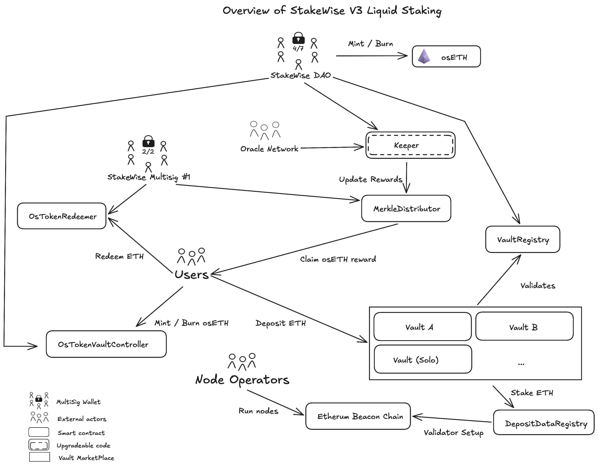

# Summary

StakeWise v3 is a liquid-staking protocol that lets users stake ETH and earn rewards while keeping their assets liquid. It tokenizes staking positions into transferable ERC-20–compatible tokens and introduces a modular “vault” architecture that allows to create custom staking strategies.

# Ratings

## Chain

Stakewise V3 is deployed on Ethereum and Gnosis. This review is based on the Ethereum mainnet deployment.

> Chain score: *Low*

## Upgradeability

StakeWise v3 relies on a range of upgradeable components, both at the bytecode level and through owner-controlled configuration parameters. Several core contracts—including the vault implementations, the OsToken suite, the Keeper, and the various factories—are deployed behind upgradeable proxy patterns or expose administrative entry points that allow their logic to be replaced. The upgrade keys are held by a small set of actors: the [StakeWise DAO multisig](#security-council) controls the `OsToken`, `VaultController`, `VaultsRegistry`, and `Keeper`; [Stakewise Multisig #1](#security-council) controls the `Redeemer`, `MerkleDistributor`, and `MetaVaultFactory`; and [Stakewise Multisig #2](#security-council) manages the `EthFoxVault` logic. These roles can enact upgrades or parameter changes without enforced delays at the protocol layer, allowing them to modify core mechanisms such as deposit handling, redemptions, and validator assignments at any moment.

These permissions mean that upgrades can directly influence both the handling of user funds and the treatment of unclaimed staking rewards. A hostile or incorrect upgrade to the vault or controller logic could lead to the direct loss of user funds by obstructing withdrawals, modifying redemption terms, or even triggering the `burn` function (`OsToken` contract) to destroy user balances. Furthermore, administrative control over fee settings, treasury recipients, and reward distribution parameters allows for the loss of unclaimed yield by redirecting staking rewards and fee flows before they are claimed by users. Because these parameters influence how assets flow through the system and how user positions evolve, changes made through these permissions can materially alter protocol behavior, even if the underlying logic contracts remain unchanged.

> *Upgradeability* score: *High*

## Autonomy

StakeWise v3 relies on independent Node Operators and an Oracle network to maintain its ongoing operations. User funds are held within isolated *vaults* where withdrawal addresses are fixed to the protocol's smart contracts, preventing operators from directly controlling or siphoning principal. Nonetheless, the protocol's *Autonomy* is significantly dependent on the performance and honesty of the entities managing the underlying infrastructure. Node Operators can cause a loss of principal through slashing or inactivity penalties; however, StakeWise v3 minimizes this risk by localizing these penalties to individual vaults rather than the entire protocol. Furthermore, the `osETH` liquid staking token is protected by an overcollateralization buffer, requiring at least 1.1 `ETH` in a vault for every 1 `osETH` minted, which acts as a line of defense against slashing events.

The second critical layer of autonomy resides in a set of [11 oracles](#dependencies) responsible for synchronizing data between the Ethereum Beacon Layer and the Execution Layer. These oracles report validator rewards and statuses to the `Keeper` contract, which is necessary for users to claim their yield. If this oracle network were to fail or collude, they could submit fraudulent Merkle roots to redirect accumulated staking rewards to unauthorized addresses before they are claimed by users. To mitigate the risk of operators holding funds hostage through unresponsiveness, the protocol relies on the oracle network and the [StakeWise DAO](#security-council) to manage encrypted exit signatures, ensuring that validators can be forcefully exited and funds returned even if an operator disappears.

> *Autonomy* score: *Medium*

## Exit Window

StakeWise v3 does not enforce mandatory execution delays or time-locked upgrade procedures at the protocol level. The entities controlling upgrade-related permissions, such as the [StakeWise DAO multisig](#security-council), the [Stakewise Multisig #1 and #2](#security-council), are able to modify logic contracts or adjust privileged parameters without a built-in waiting period that would give users time to react, migrate or redeem assets before changes take effect.

As a result, there is no built-in waiting period that would provide users with an opportunity to react, migrate, or redeem assets before changes take effect. While the oracle system may possess operational fallbacks (such as a 24h delay for missing reports), these do not constrain the governance entities' ability to enact instantaneous upgrades to the core protocol logic.

> Exit Window score: High

## Accessibility

StakeWise v3 can be accessed primarily through the official StakeWise user interface, which enables deposits, vault interactions, `OsToken` minting and redemption workflows.

The protocol provides an [open-source SDK](https://docs.stakewise.io/sdk/) and a public [vault-interface](https://github.com/stakewise/vault-interface) repository, which serves as a backup solution that allows users to locally host or deploy their own interface if the official website becomes unavailable. While the official interface remains the dominant access point, these tools, combined with the ability to submit transactions via block explorers guarantee that access to user positions is not dependent solely on the availability of the main domain.

> *Accessibility* score: *Medium*

## Conclusion

StakeWise v3 receives *High* scores in the *Upgradeability* and *Exit Window*, and *Medium* scores in *Autonomy* and *Accessibility* . This classifies the protocol as Stage 0.

The protocol could transition to Stage 1 by enforcing a mandatory *Exit Window* of at least seven days for all upgrades or parameter changes that affect user positions. Alternatively, the protocol can reach Stage 1 if the [StakeWise DAO](#security-council) and other [multisigs](#security-council) are restructured to meet the [Security Council](#security-council) requirements (typically requiring at least 8 signers with a 50% non-insider threshold). To achieve this, the "instant upgrade" powers currently held by the [multisigs](#security-council) would either need to be revoked in favor of a time-lock or transferred to a compliant *Security Council*.

# Reviewer's Notes

Some contracts (e.g., `EthFoxVault`, `RewardEthToken`) use ERC1967 or UUPS proxies. Upgrades are authorized by admin or `\_authorizeUpgrade`.

The `OsTokenFlashLoans` contract was excluded from the core analysis because it operates as an auxiliary component and does not influence user custody or the protocol’s upgrade paths in a way that fits within the decentralization evaluation criteria.

# Protocol Analysis

In StakeWise v3, the `EthFoxVault` serves as the primary entry point where users deposit ETH to receive a staking position as `osETH` This vault is an upgradeable implementation managed by [StakeWise Multisig #2](#security-council) , and it coordinates with the `VaultsRegistry`, to ensure it is a legitimate component of the ecosystem. Once ETH is inside the vault, the `DepositDataRegistry` maintains the critical on-chain mapping between the vault and the specific validator keys on the Ethereum Beacon Chain, while Node Operators manage the physical hardware and signing keys for these validators.

The Keeper contract acts as the protocol's central on-chain oracle, aggregating data from an Oracle Network to update validator performance and verify reward accruals. These verified rewards are then pushed to the `MerkleDistributor`, which allows users to claim their `osETH` through cryptographic proofs. [StakeWise Multisig #1](#security-council) maintains oversight of this distribution pipeline and the `OsTokenRedeemer`, which is the final "exit gate" used when a user wants to exchange their liquid tokens back for underlying ETH-backed positions.

For those seeking liquidity without exiting their stake, the `OsTokenVaultController` allows users to mint or burn `osETH` (represented by the OsToken contract) by locking or unlocking their vault shares. This "liquidity layer" is governed by the [StakeWise DAO](#security-council), which controls the controller's parameters such as minting capacities and protocol fees. Ultimately, the entire system relies on the [StakeWise DAO](#security-council)'s 4-of-7 multisig to manage the sensitive components, including the `Keeper`'s logic and the global configuration of the `osETH` monetary policy.

# Dependencies {#dependencies}

StakeWise v3 relies on two primary external dependencies that provide critical data and infrastructure. These are independent entities whose performance directly impacts the safety and accounting of user assets. This section focuses on the 11 Oracles as the primary independent dependency, as validator operators vary across different vaults.

The protocol relies on a network of 11 Oracles to bridge the gap between the Ethereum Execution Layer and the Beacon Chain. These oracles are the primary independent dependency of the protocol, responsible for monitoring validator performance, calculating rewards, and providing the cryptographic signatures required for core operations. The oracle set consists of infrastructure selected and approved by the [StakeWise DAO](#security-council), including [Chorus One](https://chorus.one), [Stake.fish](https://stake.fish), [Telekom](https://www.telekom-mms.com), [Finoa Consensus Services](https://www.finoa.io), [Bitfly](https://gobitfly.com), [SenseiNode](https://www.senseinode.com), [Gateway.fm](https://gateway.fm), [Gnosis Chain team](https://www.gnosis.io), [P2P](https://docs.stakewise.io/docs/oracles/intro), [DSRV](https://docs.stakewise.io/docs/oracles/intro), and the [StakeWise Lab team](https://x.com/stakewise_io).

These participants perform the following duties: **Validator Registration**: For any vault to spin up new validators, the operator must receive 8-of-11 approvals from the oracles, who verify that the registration request is valid and includes the correct exit signatures. **Reward Distribution**: Oracles reach consensus on the Merkle roots of accrued rewards and validator balances. A threshold of 6-of-11 signatures is required for the `Keeper` to update the global state and allow users to claim yield. **Automated Exits**: Oracles manage the encrypted exit signatures required to trigger validator exits, ensuring that the protocol can recover ETH from the Beacon Chain even if a vault operator becomes unresponsive.

The dependency risk lies within the 11 oracle nodes. If this network fails to reach the required consensus thresholds due to provider downtime or collusion, the protocol’s *Autonomy* is compromised: the `Keeper` will be unable to update rewards, and no new validators can be registered, halting the growth and reward flow of the vaults.

# Governance

## Relevant Subsection

Governance in StakeWise v3 is concentrated in a small set of multisigs that control upgrades, parameter changes and validator configuration across the system.

The [StakeWise DAO multisig](#security-council) governs the core contracts, including the `Keeper`, `VaultsRegistry`, the `OsToken` suite, the liquidation escrow and the reward-token logic. Through these roles it can modify oracle thresholds, update validator and reward reporting rules, adjust minting and redemption mechanics, change fee and treasury settings, whitelist or remove vault implementations and factories, and upgrade logic without delay.

[Stakewise Multisig #1](#security-council) governs the reward-distribution and redemption pipeline: it controls the `MerkleDistributor`, the `OsTokenRedeemer` and the `MetaVaultFactory`, allowing it to decide how rewards are distributed, which baskets back OsToken redemptions and how new meta-vaults are deployed.

[Stakewise Multisig #2](#security-council) manages the main vault-specific controls for `EthFoxVault`, including metadata, fee routing, blocklist administration, validator-root delegation and logic upgrades. Validator-root updates for affected vaults are executed by the separate [keysManager multisig](#security-council), while certain `Keeper` and registry operations can only be triggered by registered vaults that meet the protocol’s internal requirements.

Because no component in StakeWise v3 enforces timelocks or mandatory waiting periods, governance decisions take effect immediately once executed by the controlling multisig. This gives the DAO and the two Stakewise multisigs direct and continuous influence over how deposits are assigned to validators, how rewards are recognized and distributed, how vaults behave internally, how redemption baskets are structured and how the `OsToken` monetary policy is applied. As a result, the protocol’s operation, across validator configuration, vault logic, fees, redemptions and upgrades, remains closely tied to the actions and security of these governance actors.

## Security Council {#security-council}

| Name | Account | Type | ≥ 7 signers | ≥ 51% threshold | ≥ 50% non-insider | Signers public |
|-----------|-----------|-----------|-----------|-----------|-----------|-----------|
| [StakeWise DAO](https://docs.stakewise.io/docs/governance/dao-treasury) | [0x144a98cb1CdBb23610501fE6108858D9B7D24934](https://etherscan.io/address/0x144a98cb1CdBb23610501fE6108858D9B7D24934) | Multisig 4 / 7 | ✅ | ✅ | ❌ | ✅ |
| keysManager | [0x9e83c6Bf5540f4296D8532e79636993e9eAeD338](https://etherscan.io/address/0x9e83c6Bf5540f4296D8532e79636993e9eAeD338) | Multisig 2 / 4 | ❌ | ❌ | ❌ | ❌ |
| Stakewise Multisig #1 (undeclared) | [0x2685C0e39EEAAd383fB71ec3F493991d532A87ae](https://etherscan.io/address/0x2685C0e39EEAAd383fB71ec3F493991d532A87ae) | Multisig 2 / 2 | ❌ | ✅ | ❌ | ❌ |
| Stakewise Multisig #2 (undeclared) | [0xFD8100AA60F851e0EB585C7c893B8Ef6A7F88788](https://etherscan.io/address/0xFD8100AA60F851e0EB585C7c893B8Ef6A7F88788) | Multisig 3 / 5 | ❌ | ✅ | ❌ | ❌ |

# Contracts & Permissions

## Contracts

| Contract Name | Address |
|------------------------------------|------------------------------------|
| BalancedCurator | [0xD30E7e4bDbd396cfBe72Ad2f4856769C54eA6b0b](https://etherscan.io/address/0xD30E7e4bDbd396cfBe72Ad2f4856769C54eA6b0b) |
| BlocklistErc20VaultFactory (EthVaultFactory) | [0x39c6eef5f955bcC280966504bc5c82F2394Fa368](https://etherscan.io/address/0x39c6eef5f955bcC280966504bc5c82F2394Fa368) |
| BlocklistVaultFactory | [0x608d8Ca6916b96edf63Dd429e62Fe1366ae6f3B5](https://etherscan.io/address/0x608d8Ca6916b96edf63Dd429e62Fe1366ae6f3B5) |
| ConsolidationsChecker | [0x033E5BaE5bdc459CBb7d388b41a9d62020Be810F](https://etherscan.io/address/0x033E5BaE5bdc459CBb7d388b41a9d62020Be810F) |
| CuratorsRegistry | [0xa23F7c8d25f4503cA4cEd84d9CC2428e8745933C](https://etherscan.io/address/0xa23F7c8d25f4503cA4cEd84d9CC2428e8745933C) |
| DepositDataRegistry | [0x75AB6DdCe07556639333d3Df1eaa684F5735223e](https://etherscan.io/address/0x75AB6DdCe07556639333d3Df1eaa684F5735223e) |
| Erc20VaultFactory | [0x97795DA27138BD8d79204D37F3A2e80fA4d30488](https://etherscan.io/address/0x97795DA27138BD8d79204D37F3A2e80fA4d30488) |
| EthFoxVault (proxy) | [0x4FEF9D741011476750A243aC70b9789a63dd47Df](https://etherscan.io/address/0x4FEF9D741011476750A243aC70b9789a63dd47Df) |
| EthFoxVault (implementation) | [0x4FEF9D741011476750A243aC70b9789a63dd47Df](https://etherscan.io/address/0x4FEF9D741011476750A243aC70b9789a63dd47Df) |
| GenesisVault | [0xAC0F906E433d58FA868F936E8A43230473652885](https://etherscan.io/address/0xAC0F906E433d58FA868F936E8A43230473652885) |
| Keeper | [0x6B5815467da09DaA7DC83Db21c9239d98Bb487b5](https://etherscan.io/address/0x6B5815467da09DaA7DC83Db21c9239d98Bb487b5) |
| PoolEscrow | [0x2296e122c1a20Fca3CAc3371357BdAd3be0dF079](https://etherscan.io/address/0x2296e122c1a20Fca3CAc3371357BdAd3be0dF079) |
| LegacyRewardToken (Proxy) | [0x20BC832ca081b91433ff6c17f85701B6e92486c5](https://etherscan.io/address/0x20BC832ca081b91433ff6c17f85701B6e92486c5) |
| RewardEthToken (Implementation) | [0xAEaE7d602b537b2065f3dA05DCCE754fB23A968d](https://etherscan.io/address/0xAEaE7d602b537b2065f3dA05DCCE754fB23A968d) |
| MerkleDistributor | [0xa9dc250dF4EE9273D09CFa455da41FB1cAC78d34](https://etherscan.io/address/0xa9dc250dF4EE9273D09CFa455da41FB1cAC78d34) |
| EthMetaVaultFactory (proxy) | [0x6107dB0bdd84023228E0aB11099190E88B073c1D](https://etherscan.io/address/0x6107dB0bdd84023228E0aB11099190E88B073c1D) |
| EthMetaVault (implementation) | [0xD0D527B67186d8880f9427ea4Cf9847E89bcE764](https://etherscan.io/address/0xD0D527B67186d8880f9427ea4Cf9847E89bcE764) |
| OsToken | [0xf1C9acDc66974dFB6dEcB12aA385b9cD01190E38](https://etherscan.io/address/0xf1C9acDc66974dFB6dEcB12aA385b9cD01190E38) |
| OsTokenConfig | [0x287d1e2A8dE183A8bf8f2b09Fa1340fBd766eb59](https://etherscan.io/address/0x287d1e2A8dE183A8bf8f2b09Fa1340fBd766eb59) |
| OsTokenFlashLoans | [0xeBe12d858E55DDc5FC5A8153dC3e117824fbf5d2](https://etherscan.io/address/0xeBe12d858E55DDc5FC5A8153dC3e117824fbf5d2) |
| OsTokenRedeemer | [0xdF3123dD182b8d3e0266a2DC37eEb8366d149B5A](https://etherscan.io/address/0xdF3123dD182b8d3e0266a2DC37eEb8366d149B5A) |
| OsTokenVaultController | [0x2A261e60FB14586B474C208b1B7AC6D0f5000306](https://etherscan.io/address/0x2A261e60FB14586B474C208b1B7AC6D0f5000306) |
| OsTokenVaultEscrow | [0x09e84205DF7c68907e619D07aFD90143c5763605](https://etherscan.io/address/0x09e84205DF7c68907e619D07aFD90143c5763605) |
| PriceFeed | [0x8023518b2192FB5384DAdc596765B3dD1cdFe471](https://etherscan.io/address/0x8023518b2192FB5384DAdc596765B3dD1cdFe471) |
| PrivErc20VaultFactory | [0x1831834dC4Bf88B9d9183015e1285B105Ec2FdC9](https://etherscan.io/address/0x1831834dC4Bf88B9d9183015e1285B105Ec2FdC9) |
| PrivVaultFactory | [0x4C958642F1CD735F13aed02A4FB015153edDf8Fd](https://etherscan.io/address/0x4C958642F1CD735F13aed02A4FB015153edDf8Fd) |
| RewardSplitterFactory | [0xd12Df8543e0522CCbF12d231e822B7264c634775](https://etherscan.io/address/0xd12Df8543e0522CCbF12d231e822B7264c634775) |
| SharedMevEscrow | [0x48319f97E5Da1233c21c48b80097c0FB7a20Ff86](https://etherscan.io/address/0x48319f97E5Da1233c21c48b80097c0FB7a20Ff86) |
| ValidatorsChecker | [0x3b629aF425277FfD7cEB841a24e75d34F868651C](https://etherscan.io/address/0x3b629aF425277FfD7cEB841a24e75d34F868651C) |
| VaultFactory | [0x7A8cbBf690084E43De778173cfAcf7313c9122DD](https://etherscan.io/address/0x7A8cbBf690084E43De778173cfAcf7313c9122DD) |
| VaultsRegistry | [0x3a0008a588772446f6e656133C2D5029CC4FC20E](https://etherscan.io/address/0x3a0008a588772446f6e656133C2D5029CC4FC20E) |

## All Permission Owners

| Name | Account | Type |
|------------------------|------------------------|------------------------|
| StakeWise DAO | [0x144a98cb1CdBb23610501fE6108858D9B7D24934](https://etherscan.io/address/0x144a98cb1CdBb23610501fE6108858D9B7D24934) | Multisig 4 / 7 |
| blocklistManager / keysManager | [0x9e83c6Bf5540f4296D8532e79636993e9eAeD338](https://etherscan.io/address/0x9e83c6Bf5540f4296D8532e79636993e9eAeD338) | Multisig 2 / 4 |
| Stakewise Multisig #1 (undeclared) | [0x2685C0e39EEAAd383fB71ec3F493991d532A87ae](https://etherscan.io/address/0x2685C0e39EEAAd383fB71ec3F493991d532A87ae) | Multisig 2 / 2 |
| Stakewise Multisig #2 (undeclared) | [0xFD8100AA60F851e0EB585C7c893B8Ef6A7F88788](https://etherscan.io/address/0xFD8100AA60F851e0EB585C7c893B8Ef6A7F88788) | Multisig 3 / 5 |
| mevEscrow | [0x2577609ab927EF4a2Cee449e36cFe156c5aA43B8](https://etherscan.io/address/0x2577609ab927EF4a2Cee449e36cFe156c5aA43B8) | Contract |
| GenesisVault | [0xAC0F906E433d58FA868F936E8A43230473652885](https://etherscan.io/address/0xAC0F906E433d58FA868F936E8A43230473652885) | Contract |
| merkleDistributor | [0xa9dc250dF4EE9273D09CFa455da41FB1cAC78d34](https://etherscan.io/address/0xa9dc250dF4EE9273D09CFa455da41FB1cAC78d34) | Contract |
| Keeper | [0x6B5815467da09DaA7DC83Db21c9239d98Bb487b5](https://etherscan.io/address/0x6B5815467da09DaA7DC83Db21c9239d98Bb487b5) | Contract |

## Permissions

| Contract | Function | Impact | Owner |
|------------------|------------------|------------------|------------------|
| CuratorsRegistry | transferOwnership | Sets a new pending owner for the registry contract. Malicious owner could whitelist curators that list scam vaults or remove legitimate ones. | StakeWise DAO |
| CuratorsRegistry | renounceOwnership | Clears the owner so no further owner-only changes are possible. Permanently freezes curator configuration. Accidental renounce blocks the DAO from reacting to new risks or removing malicious curators. | StakeWise DAO |
| CuratorsRegistry | addCurator | Marks an address as a curator (or updates curator status). Curators controls who can manage/approve certain vaults or strategies.Malicious curator could promote dangerous vaults or misconfigure parameters for users. | StakeWise DAO |
| DepositDataRegistry | setDepositDataManager | Sets the address allowed to manage deposit data. Delegates control of validator deposit records. Malicious manager can corrupt mapping between vaults and validators. | ValidVault |
| DepositDataRegistry | setDepositDataRoot | Updates Merkle/commitment root for deposit data.Defines canonical source-of-truth for validator deposits. Wrong root can brick accounting or point deposits to attacker validators. | ValidVault |
| DepositDataRegistry | registerValidators | Registers new validator pubkeys/credentials. Onboards validators used for staking. Can add attacker validators or mis-assign them, capturing yield or funds. | ValidVault |
| DepositDataRegistry | migrate | Moves registry data to a new contract. Enables upgrades/maintenance of validator registry. Migration to malicious/new address can orphan or steal validator state. | ValidVault |
| EthFoxVault | updateBlocklist | Updates the list of blocked addresses.Enforces who is forbidden from interacting with the protocol. Malicious manager can block honest users, freeze redemptions, or selectively censor. | blocklistManager |
| EthFoxVault | setBlocklistManager | Sets who controls the blocklist. Delegates censorship power. Assigning malicious owners gives them direct censorship over users. | Stakewise Multisig #2 |
| EthFoxVault | setMetadata | Updates vault metadata fields. Affects UI/identification of the vault. Misleading metadata can spoof legit vaults and trick users. | Stakewise Multisig #2 |
| EthFoxVault | receiveFromMevEscrow | Pulls MEV/proceeds from MEV escrow.Routes extra yield into the vault. Malicious owner could mismatch accounting or mask theft of MEV. | mevEscrow |
| EthFoxVault | setFeeRecipient | Sets address receiving protocol/vault fees. Directs fee revenue stream. Malicious owner could redirected all fees (part of yield) to himself. | Stakewise Multisig #2 |
| EthFoxVault | setKeysManager | Sets address managing validator keys. Delegates critical validator ops. | Stakewise Multisig #2 |
| EthFoxVault | setValidatorsRoot | Updates root of validator set. Defines which validators belong to vault. Bad root points to attacker validators, capturing rewards. | keysManager |
| EthFoxVault | upgradeToAndCall | Upgrades implementation contract. Changes vault logic. Malicious upgrade can instantly drain all funds. | Stakewise Multisig #2 |
| EthFoxVault | \_authorizeUpgrade | Restricts who may upgrade. Enforces upgrade auth. If compromised, any upgrade (including malicious) becomes possible. | Stakewise Multisig #2 |
| EthFoxVault | ejectUser | Forces an address out (redeem/blacklist logic). Risk & compliance lever to kick users. Malicious use can grief users or forcibly close positions on bad terms. | blocklistManager |
| Keeper | setValidatorsMinOracles | Updates how many oracle signatures are required for validator reports. Tunes oracle security threshold. Too low = easy collusion; too high = liveness risk if oracles are offline. | StakeWise DAO |
| Keeper | approveValidators | Approves validator sets/changes for a vault (EIP-712 quorum). Controls which validators are recognized. If abused, approvals could route stake to attacker-controlled validators. | Registered Vault (must be in VaultsRegistry) |
| Keeper | harvest | Realizes rewards for a vault using oracle/Merkle data; updates accounting. Callable only by a registeredvault whose MEV escrow matches the shared escrow and whose Merkle proof verifies. Bad oracle data/roots can mis-credit rewards. | Registered Vault (with valid Merkle + MEV escrow match) |
| Keeper | setRewardsMinOracles | Sets oracle quorum for rewards. Low = cartel risk; high = can freeze updates. | StakeWise DAO |
| Keeper | addOracle | Adds a new oracle. Expands trusted data providers. Adding a malicious oracle helps corrupt reports. | StakeWise DAO |
| Keeper | removeOracle | Removes an oracle. Prunes misbehaving/obsolete oracles. Removing honest oracles concentrates power. | StakeWise DAO |
| Keeper | updateConfig | Updates Keeper config parameters (e.g., IPFS/config hash). Misconfig can break reward flows or validator recognition. | StakeWise DAO |
| Keeper | transferOwnership | Two-step handover of Keeper ownership. New owner controls all thresholds, oracle set, and config. | StakeWise DAO |
| Keeper | renounceOwnership | Clears Keeper owner permanently. Freezes current parameters; unsafe settings may become unfixable. | StakeWise DAO |
| PoolEscrow | commitOwnershipTransfer | Proposes a new owner. Starts a 2-step secure ownership transfer. Wrong address committed sets up a hostile takeover at apply step. | GenesisVault |
| PoolEscrow | applyOwnershipTransfer | Finalizes the new owner. Completes control transfer for escrow. Finalize to attacker, they can drain escrow via privileged flows | GenesisVault |
| PoolEscrow | withdraw | Transfers escrowed funds according to rules. Releases capital from escrow to recipients. Malicious logic might allow excess/unauthorized withdrawals. | GenesisVault |
| LegacyRewardToken (proxy) | changeAdmin | Changes proxy admin address. Moves upgrade power. New admin can deploy malicious logic. | StakeWise DAO |
| LegacyRewardToken (proxy) | upgradeTo / upgradeToAndCall | Switches implementation (optionally calls it). Upgrades reward token behavior. Malicious implementation can steal balances or block transfers | StakeWise DAO |
| RewardEthToken (implementation) | transferFrom | Moves tokens with allowance. Enables contracts & dApps to move rewards. Bad spender can drain if allowances mis-set. | approved spender |
| RewardEthToken (implementation) | pause/ unpause | Stops or resumes token transfers. Emergency brake on reward token. Malicious pauser can freeze all holders or keep token frozen. | PAUSER (null) |
| RewardEthToken (implementation) | setRewardsDisabled | Flags rewards as disabled. Can stop accrual/distribution. Misuse halts user rewards. | stakedEthToken contract |
| RewardEthToken (implementation) | setProtocolFeeRecipient | Sets fee receiver. Directs protocol fee stream. Malicious owner could redirects fee income to attacker. | StakeWise DAO |
| RewardEthToken (implementation) | setProtocolFee | Sets protocol fee rate. Controls how much is skimmed as protocol fee. Set to extreme values redirects most rewards to fee recipient. | StakeWise DAO |
| RewardEthToken (implementation) | updateTotalRewards | Updates total distributable rewards. Syncs accounting with vault earnings. Inflated value can cause over-distribution / dilution. | Vault |
| MerkleDistributor | transferOwnership / renounceOwnership | Moves or clears distributor owner. Controls who configures distribution parameters. | Stakewise Multisig #1 |
| MerkleDistributor | setRewardsDelay | Set the new rewards delay. Tunes UX vs safety. Set too large stalls distributions. | Stakewise Multisig #1 |
| MerkleDistributor | setRewardsMinOracles | Sets oracle threshold (if used). Secures reward data source. Too low increase manipulation risk. | Stakewise Multisig #1 |
| MerkleDistributor | setDistributor | Add or remove a distributor. Malicious distributor can front-runs or withholds distributions. | Stakewise Multisig #1 |
| EthMetaVaultFactory (proxy) | transferOwnership | Starts the ownership transfer of the contract to a new account. Governs who can create new meta vaults. | Stakewise Multisig #1 |
| EthMetaVaultFactory (proxy) | renounceOwnership | Leaves the contract without owner. Disable any functionality that is only available to the owner. | Stakewise Multisig #1 |
| EthMetaVault (implementation) | setAdmin | Assigns a new vault admin. This transfers full control over fee settings, sub-vaults, and configuration. A malicious or compromised admin can seize control of the MetaVault. | VaultAdmin |
| EthMetaVault (implementation) | setSubVaultsCurator | Sets the address allowed to add/eject sub-vaults. The curator controls the vault’s composition. A malicious curator can add unsafe sub-vaults or remove good ones. | VaultAdmin |
| EthMetaVault (implementation) | addSubVault | Adds a new sub-vault to the strategy. This changes where user assets may be allocated. Adding a malicious or faulty sub-vault can cause loss or misrouting of funds. | VaultAdmin |
| EthMetaVault (implementation) | ejectSubVault | Removes a sub-vault and starts its exit flow. Misuse can disrupt yield generation or cause long exit queues. | VaultAdmin |
| EthMetaVault (implementation) | setFeeRecipient | Sets the destination address receiving MetaVault fees. Misconfiguration could redirect fees to an attacker. | VaultAdmin |
| EthMetaVault (implementation) | setFeePercent | Updates the vault fee rate (bounded by internal caps). Improper increases raise user costs; combined with a malicious recipient, fees can be siphoned. | VaultAdmin |
| OsToken | transferOwnership / renounceOwnership | Starts the ownership transfer of the contract to a new account or leaves the contract without owner. Governs who can set controller. Renouncing will disable any functionality that is only available to the owner. | StakeWise DAO |
| OsToken | mint / burn | Mint or burn new OsToken to an address. Malicious minting or burning can result in direct theft or arbitrary modification of user balances. | Controller (null) |
| OsToken | setController | Enable or disable the controller, ie who can mint/burn. Critical monetary policy hook. Pointing to malicious controller compromises entire token. | StakeWise DAO |
| OsTokenConfig | transferOwnership/renounceOwnership | Starts the ownership transfer of the contract to a new account or leaves the contract without owner. Governs who can update redemption/params. Wrong owner can set toxic configs. | StakeWise DAO |
| OsTokenConfig | setRedeemer | Sets the OsToken redeemer address. Controls redemption pathway. Malicious redeemer misprices or blocks user exits. | StakeWise DAO |
| OsTokenConfig | updateConfig | Updates the OsToken minting and liquidating configuration values. Directly affects solvency & user safety. Misconfig can cause undercollateralization or forced liquidations. | StakeWise DAO |
| EthOsTokenRedeemer | setPositionsManager | Update the address of the positions manager. Delegates selection of backing positions. Malicious manager can lists junk collateral or removes valid ones. | Stakewise Multisig #1 |
| EthOsTokenRedeemer | proposeRedeemablePositions | Proposes new redeemable positions. Starts governance-style flow for redemptions. Spam/bad proposals can confuse or front-run governance. | positionsManager (0x00) |
| EthOsTokenRedeemer | acceptRedeemablePositions | Accepts the proposed redeemable positions. Activates a given redemption basket. Accepting bad basket lets insiders redeem against overvalued junk. | Stakewise Multisig #1 |
| EthOsTokenRedeemer | denyRedeemablePositions | Rejects proposals. Blocks unsafe baskets. Malicious denial can stall legitimate redemptions. | Stakewise Multisig #1 |
| EthOsTokenRedeemer | removeRedeemablePositions | Removes active positions. Updates redemption set over time. Removing good backing harms redeemers’ options. | Stakewise Multisig #1 |
| EthOsTokenRedeemer | transferOwnership/renounceOwnership | Starts the ownership transfer of the contract to a new account or leaves the contract without owner. Shifts or freezes power over redemption rules. Wrong owner can freeze or rig redemptions. | Stakewise Multisig #1 |
| OsTokenVaultController | transferOwnership/renounceOwnership | Starts the ownership transfer of the contract to a new account or leaves the contract without owner. Governs mint/burn & capacity of vault shares. Malicious owner can print shares or change economics unfavorably. | StakeWise DAO |
| OsTokenVaultController | mintShares | Mint OsToken vault shares. Expands vault liabilities vs backing. Over-minting dilutes backing → insolvency. | StakeWise DAO |
| OsTokenVaultController | burnShares | Burn shares for withdrawn assets. Shrinks liabilities. Incorrect burning can break accounting, reduce users balances. | StakeWise DAO |
| OsTokenVaultController | setCapacity | Sets total shares / TVL. Risk control on vault size. Too high removes safeguards; too low griefs growth. | StakeWise DAO |
| OsTokenVaultController | setTreasury | Sets treasury recipient address. Directs protocol share of yield/fees. Redirecting to attacker could drains protocol revenue. | StakeWise DAO |
| OsTokenVaultController | setFeePercent | Adjusts protocol/vault fee percent. Changes yield split. Set to extreme rates effectively seizes yield from users. | StakeWise DAO |
| OsTokenVaultController | setAvgRewardPerSecond | Updates average reward per second. Controls streaming rewards logic. Overstated rate = undercollateralization; understated = user underpayment. | Keeper |
| OsTokenVaultController | setKeeper | Sets Keeper contract. Links to oracle/harvest logic. Pointing to malicious Keeper injects bad data. | StakeWise DAO |
| EthOsTokenVaultEscrow | setAuthenticator | Updates the authenticator: address that validates operations. Adds extra auth layer. Malicious authenticator can permit invalid operations. | StakeWise DAO |
| EthOsTokenVaultEscrow | updateLiqConfig | Updates the liquidation configuration. Tunes safety vs capital efficiency. Misconfig can trigger mass liquidations or allow bad debt. | StakeWise DAO |
| EthOsTokenVaultEscrow | transferOwnership/renounceOwnership | Starts the ownership transfer of the contract to a new account or leaves the contract without owner. Shifts all above powers. Ownership to malicous adress = full control over liquidations/redemptions. | StakeWise DAO |
| VaultsRegistry | transferOwnership/renounceOwnership | Starts the ownership transfer of the contract to a new account or leaves the contract without owner. Controls master list of allowed vault impls/factories. Malicious owner whitelists could rogue implementations used across ecosystem. | StakeWise DAO |
| VaultsRegistry | addVaultImpl / removeVaultImpl | Add or remove Vault implementation contract. Defines which logic contracts are legitimate. Adding bad impl → users routed into exploitable vaults. | StakeWise DAO |
| VaultsRegistry | addFactory / removeFactory | add or remove the factory to the whitelist. Controls who can spawn official vaults. Malicious factory can mass-deploy backdoored vaults. | StakeWise DAO |
