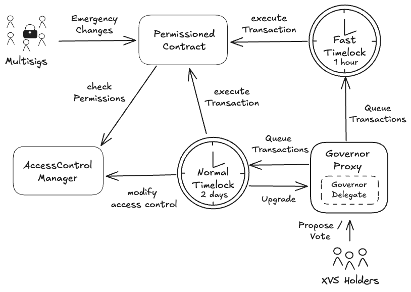

# Summary

Venus Protocol is a lending platform on Binance Smart Chain. Users can supply assets to earn yield and borrow against their collateral. The protocol is governed by `XVS` token holders who vote on upgrades and parameter changes through an onchain _Governance_ system with built-in timelocks.

# Ratings

## Chain

This report is concerned with Venus Core Protocol deployed on Binance Smart Chain (BSC). BSC achieves a *High* centralization score.

> Chain score: High

## Upgradeability

The contracts used for the core lending functionality, including the `Comptroller` (Diamond Proxy) and all market contracts (`VToken`), are upgradeable. This could change the entire logic of these contracts and may lead to the loss of user funds through malicious code changes that could steal deposits, manipulate accounting, or prevent withdrawals. These upgrades can only be performed through a _Governance_ proposal with the Normal Timelock, which implements a 48-hour delay.

The oracle contracts including `ResilientOracle`, `ChainlinkOracle`, `RedstoneOracle`, and other price feed contracts are upgradeable. This could allow manipulation of asset prices leading to liquidations or enabling attackers to borrow more than their collateral value, resulting in protocol insolvency and loss of user funds. _Oracle_ upgrades can only be executed through _Governance_ proposals with the Normal Timelock's 48-hour delay.

The reward distribution contracts such as `XVSVault`, `Prime`, and `PrimeLiquidityProvider` are upgradeable. This could result in loss of unclaimed yield if the upgrade modifies reward calculation logic or redirects accumulated rewards to different addresses. These upgrades require _Governance_ approval through the Normal Timelock with a 48-hour delay.

The `VAIController` and related stablecoin contracts are upgradeable. This could change the minting logic, interest rate calculations, or collateral requirements, potentially leading to bad debt that impacts all protocol users. Upgrades to these contracts can only be done through _Governance_ with the Normal Timelock's 48-hour delay.

Beyond contract upgrades, Venus Protocol has numerous parameter changes that can significantly impact user funds without requiring code changes. Critical parameters like collateral factors, liquidation incentives, and interest rate models can be modified to cause mass liquidations or reduce user yields. Oracle configurations can be changed to use malicious price feeds. Reward emission rates can be altered to reduce expected yields. Most critical parameters are controlled by the Normal Timelock with a 48-hour delay, while some parameters can be adjusted more quickly through the Fast Track Timelock (1-hour delay) or emergency multisigs.

> Upgradeability score: High

## Autonomy

The oracle risk is mitigated by integrating several oracles per asset. Only if two of three oracles return a price within the accepted boundaries, the price will be accepted. Otherwise, the transaction reverts.

> Autonomy score: Low

## Exit Window

The upgradeability score is High and most permissions are protected with an exit window of 2 days, while some can be changed within 1 hour.

**48-hour delay (Normal Timelock):** Controls critical functions including contract upgrades, oracle configurations, collateral factors, and liquidation parameters. This covers the majority of high-risk permissions.

**1-hour delay (Fast Track):** Limited to operational parameters like VAI interest rates and specific reward distribution speeds that have restricted impact.

**No delay:** Emergency pause functions allow immediate response to threats but can only halt operations, not modify parameters or access funds.

> Exit Window score: High

## Accessibility

The Venus Protocol frontend is open source and can be self-hosted. The repo can be found [here](https://github.com/VenusProtocol/venus-protocol-interface). No wallets or alternative interfaces were found that offer full integration, although some staking positions can be managed, e.g., through the Bitget wallet.

> Accessibility score: Medium

## Conclusion
The Venus protocol achieves High centralization risk scores for its *Upgradeability*, *Chain* and *Exit Window* dimensions. Due to the High centralization risk of the Binance Smart Chain, it ranks Stage 0.

The protocol could reach Stage 1 by deploying on a chain of stage 1.

The project additionally could advance to Stage 2 if
1) multiple different user interfaces existed
2) the ability to upgrade contracts was removed OR the timelock delay to upgrade contracts was at least 30 days
3) the protocol was deployed on a chain of stage 2.

# Reviewer's Notes

The analysis focuses on the core risks associated with lending, liquidations, and centralized control within the main protocol. It does not extend to a full risk analysis of newer, more complex additions like the **Prime Token program** or the **cross-chain governance and token wrapping functionalities** (`XVSBridgeAdmin`, `XVSProxyOFTSrc`). These systems introduce their own unique economic and smart contract risks that are beyond the scope of this core protocol review.

A unique architectural feature is the `Comptroller`'s use of the **Diamond Standard (EIP-2535)**, where logic is delegated to multiple `Facet` contracts. This allows for more granular upgrades compared to monolithic proxy upgrades, as changes can be isolated to specific facets of the protocol's logic.

# Protocol Analysis

In this section, the Venus Protocol will be analyzed in its following components: The _Core Lending Protocol_, the _Incentive Mechanism_, and the _Treasury_. The _Governance Structure_ will be analyzed in the subsequent section.

## Core Lending

The _Core Lending_ components consist of the `Comptroller` and `VToken` contracts. The `Comptroller` is implemented using the **Diamond Standard (EIP-2535)**, which provides a modular architecture for upgradeability. 

The `Comptroller` proxy (also called `Unitroller`) delegates all calls to a `Diamond` contract, which then routes function calls to one of four `Facet` contracts based on function selectors:
- `MarketFacet`: Manages market operations like entering/exiting markets and market listings
- `PolicyFacet`: Enforces protocol policies for minting, borrowing, liquidating, and integrates with the price oracle
- `RewardFacet`: Handles XVS reward distribution and claiming
- `SetterFacet`: Contains administrative functions for setting protocol parameters

This diamond architecture allows for granular upgrades where individual facets can be upgraded without affecting others, providing more flexibility and reduced risk compared to monolithic proxy upgrades. Each `Facet` can be individually upgraded through the `Comptroller`'s `diamondCut` function and are abstracted away in the displayed diagram.  
For each market, one `VToken` contract is deployed which contains all the functionalities for supplying, borrowing, and liquidating the respective asset.

### Key Permissions in Core Lending

**Comptroller Permissions:**
- `admin` can upgrade facets, set oracle, pause guardian, and core parameters
- `accessControlManager` controls collateral factors, liquidation incentives, market caps, and pause functions
- Emergency multisigs (Pause Guardian) can pause/unpause protocol actions

**VToken Permissions:**
- `admin` can upgrade implementation and set new comptroller
- `accessControlManager` controls reserve factor, interest rate models, and reserve withdrawals

## Incentives

The `RewardFacet`, which is part of the `Comptroller` Diamond Proxy structure, is responsible for distributing rewards. Users can call the `claimVenus()` function to claim the `XVS` accrued from supplying and borrowing accross all markets. For each market, two parameters can be set that define the reward per block for borrowing and supplying activities, respectively. 
Furthermore, users can stake their `XVS` in the `XVSVault` for additional `XVS` yield.

### Key Permissions in Incentives

**RewardFacet Permissions:**
- `admin` can set XVS emission speeds and grant XVS directly
- `accessControlManager` can seize XVS from addresses

**XVSVault Permissions:**
- `accessControlManager` can pause/resume operations, add/modify staking pools, and set reward rates

## Treasury

A fraction ( `reserveFactor`) of the borrower interest paid is automatically added to the Venus Protocol `reserve`. The reserves are stored in the individual `vToken` contracts and are managed by the `Comptroller`. 
The reserves are collected to the _Treasury_ through the `_reduceReserves()` function of each `vToken` contract. Once the reserves are in the _Treasury_, _Governance_ can vote on proposals to spend the _Treasury_.

### Key Permissions in Treasury

- Normal Timelock and Treasury Guardian can set _Treasury_ address and parameters
- `accessControlManager` controls reserve factor changes and reserve withdrawals

# Dependencies

Venus Protocol uses an _Oracle System_ that can support up to three price feeds per asset, though the actual configuration varies by asset. When multiple oracles are configured, prices must agree within defined boundaries or transactions will revert. The configuration of each asset can only be changed through _Governance_.

## Oracle Configuration for Top Assets by TVL

In the following, the configuration for the top 6 assets by TVL are listed:

| Asset | Oracle Setup | Boundary | Oracle Providers |
|-------|--------------|----------|------------------|
| **BTCB** | 3 oracles | ±1% | Main: RedStone, Pivot: Chainlink, Fallback: Chainlink |
| **BNB** | 1 oracle | N/A | Chainlink only |
| **SOLVBTC** | 3 oracles | ±1% | Main: RedStone, Pivot: Chainlink, Fallback: Chainlink |
| **USDT** | 1 oracle | N/A | Chainlink only |
| **SOLVBTC.BBN** | 1 oracle | N/A | Custom Oracle (0xf5534f78Df9b610B19A63956d498d00CFaD8B9D3) |
| **ETH** | 1 oracle | N/A | Chainlink only |

## How the Oracle System Works

1. **Multi-Oracle Assets**: For assets with multiple oracles (like BTCB and SOLVBTC), at least two oracles must report prices within the configured boundary percentage. If prices diverge beyond the threshold, transactions revert.

2. **Single Oracle Assets**: Many major assets (BNB, USDT, ETH) rely on a single oracle provider, primarily Chainlink. For these assets, no boundary validation occurs.

3. **Boundary Configuration**: When boundaries are set, they define the maximum acceptable price deviation between oracles. For example, BTCB's 1% boundary means oracles must agree within 1% of each other (upperBound: 1.01, lowerBound: 0.99).

## Oracle Providers

Venus integrates the following oracle types:
- **Chainlink** (0x1B2103441A0A108daD8848D8F5d790e4D402921F): The primary oracle for most assets
- **RedStone** (0x8455EFA4D7Ff63b8BFD96AdD889483Ea7d39B70a): Used as the main oracle for BTC-related assets
- **Binance Oracle** (0x594810b741d136f1960141C0d8Fb4a91bE78A820): Available but not used for top TVL assets
- **Custom Oracles**: Specialized oracles for specific assets (e.g., SOLVBTC.BBN)

All oracle configurations and boundaries can only be modified through _Governance_ proposals with a 48-hour timelock delay.

### Key Permissions in Oracle System

**ResilientOracle                                                  Permissions:**
- `accessControlManager` can pause/unpause oracle, set token configurations, change oracle feeds, and enable/disable specific oracles

# Governance

Venus Protocol utilized Compound's `Governor Bravo` framework to implement their _Governance Structure_. 
Any privileged access roles in the entire protocol are either directly or indirectly controlled by the _Governance_. A three-tiered timelock structure is implemented for different proposal urgencies that can be specified in the proposal. However, only the `Normal Timelock` and `Fast Timelock` contracts are currently utilized. The `Normal Timelock` is configured as the `admin` of all contracts with such a privileged role, while the `Fast Timelock` has specific access rights through the `accessControlManager`.
While their configuration can change, these timelock contracts are currently configured as follows:
* `Normal Timelock`:
   * `votingDelay`: 1 block
   * `votingPeriod`: 57600 blocks
   * `proposalThreshold` : 300,000 `XVS`
   * `timelock delay`: 48 hours
* `Fast Timelock`:
   * `votingDelay`: 1 block
   * `votingPeriod`: 57600 blocks
   * `proposalThreshold` : 300,000 `XVS`
   * `timelock delay`: 1 hour
* `Critical Timelock` (currently unused):
   * `votingDelay`: 1 block
   * `votingPeriod`: 14400 blocks
   * `proposalThreshold` : 300,000 `XVS`
   * `timelock delay`: 1 hour

The _Governance_ process is as follows:
1. *Proposal Creation*: A user with enough `XVS` creates a proposal with a set of transactions to execute and the timelock to be used. Dependent on the chosen timelock, the timelock parameters change as outlined above.
2. *Voting*: In the timelock-dependent `votingPeriod`, `XVS` holders can vote. To be successful, a minimum number of votes must be cast and the majority of votes needs to vote `For` the proposal.
3. *Timelock Queuing*: The passed proposal is sent to the respective timelock contract.
4. *Execution*: Anyone can execute the set of transactions after the respective `timelock delay` has passed.

In the following diagram, the _Governance Structure_ is outlined while abstracting the specific permissioned contract. Specific functions will query the `accessControlManager` to authorize transactions.

### Key Permissions in Governance

**Timelock Permissions:**
- Normal Timelock (48-hour delay): Controls all critical upgrades and parameter changes
- Fast Track Timelock (1-hour delay): Limited to operational parameters like VAI rates and reward speeds
- Critical Timelock (1-hour delay, currently unused): Intended for emergency proposals

**AccessControlManager:**
- Grants specific permissions to timelocks and multisigs
- Can be updated only by Normal Timelock

## Security Council

The Venus Protocol has deployed three Gnosis Safe contracts, which are currently 3/6 multisigs. None of these contracts currently adhere to the minimum requirements for a security council.
The _Multisig_ contracts serve the purpose of executing functionalities in the case of an emergency, in which it would not be feasible to wait for a proposal to pass and the timelock delay. The granted access rights can be assigned or revoked by the _Governance Structure_. 
The _Multisigs_ can be given access rights to specific functions by the protocol _Governance_ through the `accessControlManager` contract. 

| Name          | Account                                     | Type     | ≥ 7 signers | ≥ 51% threshold | ≥ 50% non-insider | Signers public |
| ------------- | ------------------------------------------- | -------- | ----------- | --------------- | ----------------- | -------------- |
| Multisig Critical | [0x7B1AE5Ea599bC56734624b95589e7E8E64C351c9](https://bscscan.com/address/0x7B1AE5Ea599bC56734624b95589e7E8E64C351c9) | Multisig 3/6 | ❌          | ❌              | ❌                | ❌             |
| Pause Guardian | [0x1C2CAc6ec528c20800B2fe734820D87b581eAA6B](https://bscscan.com/address/0x1C2CAc6ec528c20800B2fe734820D87b581eAA6B) | Multisig 3/6 | ❌          | ❌              | ❌                | ❌             |
| Treasury Guardian | [0x3a3284dC0FaFfb0b5F0d074c4C704D14326C98cF](https://bscscan.com/address/0x3a3284dC0FaFfb0b5F0d074c4C704D14326C98cF) | Multisig 3/6 | ❌          | ❌              | ❌                | ❌             |

## Upgrade Process

The _Upgrade Process_ for the Venus Protocol is comprehensive and managed entirely by onchain _Governance_. The _Upgrade Process_ can be split into two distinct categories: parameter changes and contract logic upgrades.

### Parameter Changes
Parameter changes are executed by calling privileged functions on various protocol contracts. Control over these functions is managed through a multi-layered permissions structure:
1.  **Direct `admin` Control**: The most critical parameters are directly alterable by the `admin` role, which is the `Normal Timelock` contract (48-hour delay).
2.  **Access Control Manager (`ACM`)**: Most parameters are owned by the `AccessControlManager` contract. This contract grants specific permissions to different roles, enabling fine-grained control. For instance:
    *   The `Normal Timelock` is granted permission for significant but non-emergency changes.
    *   The `Fast Track Timelock` (1-hour delay) is granted permission for less critical or more urgent parameter updates (e.g., `VAI` interest rates).
    *   Emergency multisigs like `Pause Guardian` and `Multisig Critical` are granted access to functions that pause the protocol or adjust critical risk parameters during emergencies, bypassing the standard _Governance_ process.

### Contract Upgrades (Code Changes)
Upgrades to the smart contract logic itself also follow the _Governance_ process, primarily through the `Normal Timelock` (48-hour delay). Venus employs two main upgrade patterns:

1.  **Diamond Proxy (`Comptroller`)**: The main `Comptroller` uses the Diamond Standard (EIP-2535). Upgrades are performed via `diamondCut` proposals, which allow governance to:
    *   Add new facets with additional functionality
    *   Replace existing facets to fix bugs or add features
    *   Remove facets that are no longer needed
    
    Each facet upgrade only affects specific functions mapped to that facet, allowing for surgical precision in upgrades. For example, updating reward logic only requires replacing the `RewardFacet` without touching market operations in `MarketFacet`. This modularity significantly reduces the risk of introducing bugs to unrelated functionality during upgrades.

2.  **Beacon Proxies (`VTokens`)**: The markets (`VToken` contracts) are deployed as proxies pointing to a central `UpgradeableBeacon`. To upgrade all markets at once, a governance proposal simply needs to change the implementation contract address within the beacon. This single transaction atomically upgrades the logic for all `VToken` contracts.

# Contracts & Permissions

## Contracts

| Contract Name | Address                                     |
| ------------- | ------------------------------------------- |
| Comptroller (Proxy)   | [0xfD36E2c2a6789Db23113685031d7F16329158384](https://bscscan.com/address/0xfD36E2c2a6789Db23113685031d7F16329158384) |
| Diamond    | [0x347ba9559fFC65A94af0F6a513037Cd4982b7b18](https://bscscan.com/address/0x347ba9559fFC65A94af0F6a513037Cd4982b7b18) |
| MarketFacet    | [0x4b093a3299F39615bA6b34B7897FDedCe7b83D63](https://bscscan.com/address/0x4b093a3299F39615bA6b34B7897FDedCe7b83D63) |
| PolicyFacet    | [0x93e7Ff7c87B496aE76fFb22d437c9d46461A9B51](https://bscscan.com/address/0x93e7Ff7c87B496aE76fFb22d437c9d46461A9B51) |
| RewardFacet    | [0xc2F6bDCEa4907E8CB7480d3d315bc01c125fb63C](https://bscscan.com/address/0xc2F6bDCEa4907E8CB7480d3d315bc01c125fb63C) |
| SetterFacet    | [0x9B0D9D7c50d90f23449c4BbCAA671Ce7cd19DbCf](https://bscscan.com/address/0x9B0D9D7c50d90f23449c4BbCAA671Ce7cd19DbCf) |
| VenusLens    | [0xe4C455cBf870A86399043B8A36A669FfA1583e95](https://bscscan.com/address/0xe4C455cBf870A86399043B8A36A669FfA1583e95) |
| ResilientOracle (Proxy)  | [0x6592b5DE802159F3E74B2486b091D11a8256ab8A](https://bscscan.com/address/0x6592b5DE802159F3E74B2486b091D11a8256ab8A) |
| ResilientOracle    | [0xb5d7a073d77102ad56b7482b18e7204c1a71c8b9](https://bscscan.com/address/0xb5d7a073d77102ad56b7482b18e7204c1a71c8b9) |
| AccessControlManager    | [0x4788629ABc6cFCA10F9f969efdEAa1cF70c23555](https://bscscan.com/address/0x4788629ABc6cFCA10F9f969efdEAa1cF70c23555) |
| PoolRegistry (Proxy)                                                   | [0x9F7b01A536aFA00EF10310A162877fd792cD0666](https://bscscan.com/address/0x9F7b01A536aFA00EF10310A162877fd792cD0666) |
| PoolRegistry (Implementation)                                          | [0xc4953e157d057941a9a71273b0af4d4477ed2770](https://bscscan.com/address/0xc4953e157d057941a9a71273b0af4d4477ed2770) |
| PoolLens                                                               | [0x0461c613433d42C06831C8e60Bf0C86FC9495072](https://bscscan.com/address/0x0461c613433d42C06831C8e60Bf0C86FC9495072) |
| ProxyAdmin                                                             | [0x6beb6D2695B67FEb73ad4f172E8E2975497187e4](https://bscscan.com/address/0x6beb6D2695B67FEb73ad4f172E8E2975497187e4) |
| UpgradeableBeacon (Comptroller Beacon) (Core Pool)                     | [0x38B4Efab9ea1bAcD19dC81f19c4D1C2F9DeAe1B2](https://bscscan.com/address/0x38B4Efab9ea1bAcD19dC81f19c4D1C2F9DeAe1B2) |
| Unitroller (Comptroller) (Core Pool)                                   | [0xfD36E2c2a6789Db23113685031d7F16329158384](https://bscscan.com/address/0xfD36E2c2a6789Db23113685031d7F16329158384) |
| UpgradeableBeacon (VToken) (Core Pool)                                 | [0x2b8A1C539ABaC89CbF7E2Bc6987A0A38A5e660D4](https://bscscan.com/address/0x2b8A1C539ABaC89CbF7E2Bc6987A0A38A5e660D4) |
| SwapRouter (Core Pool)                                                 | [0x8938E6dA30b59c1E27d5f70a94688A89F7c815a4](https://bscscan.com/address/0x8938E6dA30b59c1E27d5f70a94688A89F7c815a4) |
| VBep20Delegator (Proxy) (vAAVE) (Core Pool)                            | [0x26DA28954763B92139ED49283625ceCAf52C6f94](https://bscscan.com/address/0x26DA28954763B92139ED49283625ceCAf52C6f94) |
| VBep20Delegator (Proxy) (vADA) (Core Pool)                             | [0x9A0AF7FDb2065Ce470D72664DE73cAE409dA28Ec](https://bscscan.com/address/0x9A0AF7FDb2065Ce470D72664DE73cAE409dA28Ec) |
| VBep20Delegator (Proxy) (vBCH) (Core Pool)                             | [0x5F0388EBc2B94FA8E123F404b79cCF5f40b29176](https://bscscan.com/address/0x5F0388EBc2B94FA8E123F404b79cCF5f40b29176) |
| VBep20Delegator (Proxy) (vBETH) (Core Pool)                            | [0x972207A639CC1B374B893cc33Fa251b55CEB7c07](https://bscscan.com/address/0x972207A639CC1B374B893cc33Fa251b55CEB7c07) |
| VBep20Delegator (Proxy) (vBNB) (Core Pool)                             | [0xA07c5b74C9B40447a954e1466938b865b6BBea36](https://bscscan.com/address/0xA07c5b74C9B40447a954e1466938b865b6BBea36) |
| VBep20Delegator (Proxy) (vBTC) (Core Pool)                             | [0x882C173bC7Ff3b7786CA16dfeD3DFFfb9Ee7847B](https://bscscan.com/address/0x882C173bC7Ff3b7786CA16dfeD3DFFfb9Ee7847B) |
| VBep20Delegator (Proxy) (vBUSD) (Core Pool)                            | [0x95c78222B3D6e262426483D42CfA53685A67Ab9D](https://bscscan.com/address/0x95c78222B3D6e262426483D42CfA53685A67Ab9D) |
| VBep20Delegator (Proxy) (vCAKE) (Core Pool)                            | [0x86aC3974e2BD0d60825230fa6F355fF11409df5c](https://bscscan.com/address/0x86aC3974e2BD0d60825230fa6F355fF11409df5c) |
| VBep20Delegator (Proxy) (vDAI) (Core Pool)                             | [0x334b3eCB4DCa3593BCCC3c7EBD1A1C1d1780FBF1](https://bscscan.com/address/0x334b3eCB4DCa3593BCCC3c7EBD1A1C1d1780FBF1) |
| VBep20Delegator (Proxy) (vDOGE) (Core Pool)                            | [0xec3422Ef92B2fb59e84c8B02Ba73F1fE84Ed8D71](https://bscscan.com/address/0xec3422Ef92B2fb59e84c8B02Ba73F1fE84Ed8D71) |
| VBep20Delegator (Proxy) (vDOT) (Core Pool)                             | [0x1610bc33319e9398de5f57B33a5b184c806aD217](https://bscscan.com/address/0x1610bc33319e9398de5f57B33a5b184c806aD217) |
| VBep20Delegator (Proxy) (vETH) (Core Pool)                             | [0xf508fCD89b8bd15579dc79A6827cB4686A3592c8](https://bscscan.com/address/0xf508fCD89b8bd15579dc79A6827cB4686A3592c8) |
| VBep20Delegator (Proxy) (vFDUSD) (Core Pool)                           | [0xC4eF4229FEc74Ccfe17B2bdeF7715fAC740BA0ba](https://bscscan.com/address/0xC4eF4229FEc74Ccfe17B2bdeF7715fAC740BA0ba) |
| VBep20Delegator (Proxy) (vFIL) (Core Pool)                             | [0xf91d58b5aE142DAcC749f58A49FCBac340Cb0343](https://bscscan.com/address/0xf91d58b5aE142DAcC749f58A49FCBac340Cb0343) |
| VBep20Delegator (Proxy) (vLINK) (Core Pool)                            | [0x650b940a1033B8A1b1873f78730FcFC73ec11f1f](https://bscscan.com/address/0x650b940a1033B8A1b1873f78730FcFC73ec11f1f) |
| VBep20Delegator (Proxy) (vlisUSD) (Core Pool)                          | [0x689E0daB47Ab16bcae87Ec18491692BF621Dc6Ab](https://bscscan.com/address/0x689E0daB47Ab16bcae87Ec18491692BF621Dc6Ab) |
| VBep20Delegator (Proxy) (vLTC) (Core Pool)                             | [0x57A5297F2cB2c0AaC9D554660acd6D385Ab50c6B](https://bscscan.com/address/0x57A5297F2cB2c0AaC9D554660acd6D385Ab50c6B) |
| VBep20Delegator (Proxy) (vLUNA) (Core Pool)                            | [0xb91A659E88B51474767CD97EF3196A3e7cEDD2c8](https://bscscan.com/address/0xb91A659E88B51474767CD97EF3196A3e7cEDD2c8) |
| VBep20Delegator (Proxy) (vMATIC) (Core Pool)                           | [0x5c9476FcD6a4F9a3654139721c949c2233bBbBc8](https://bscscan.com/address/0x5c9476FcD6a4F9a3654139721c949c2233bBbBc8) |
| VBep20Delegator (Proxy) (vSOL) (Core Pool)                             | [0xBf515bA4D1b52FFdCeaBF20d31D705Ce789F2cEC](https://bscscan.com/address/0xBf515bA4D1b52FFdCeaBF20d31D705Ce789F2cEC) |
| VBep20Delegator (Proxy) (vSolvBTC) (Core Pool)                         | [0xf841cb62c19fCd4fF5CD0AaB5939f3140BaaC3Ea](https://bscscan.com/address/0xf841cb62c19fCd4fF5CD0AaB5939f3140BaaC3Ea) |
| VBep20Delegator (Proxy) (vSXP) (Core Pool)                             | [0x2fF3d0F6990a40261c66E1ff2017aCBc282EB6d0](https://bscscan.com/address/0x2fF3d0F6990a40261c66E1ff2017aCBc282EB6d0) |
| VBep20Delegator (Proxy) (vTHE) (Core Pool)                             | [0x86e06EAfa6A1eA631Eab51DE500E3D474933739f](https://bscscan.com/address/0x86e06EAfa6A1eA631Eab51DE500E3D474933739f) |
| VBep20Delegator (Proxy) (vTRX) (Core Pool)                             | [0xC5D3466aA484B040eE977073fcF337f2c00071c1](https://bscscan.com/address/0xC5D3466aA484B040eE977073fcF337f2c00071c1) |
| VBep20Delegator (Proxy) (vTRXOLD) (Core Pool)                          | [0x61eDcFe8Dd6bA3c891CB9bEc2dc7657B3B422E93](https://bscscan.com/address/0x61eDcFe8Dd6bA3c891CB9bEc2dc7657B3B422E93) |
| VBep20Delegator (Proxy) (vTUSD) (Core Pool)                            | [0xBf762cd5991cA1DCdDaC9ae5C638F5B5Dc3Bee6E](https://bscscan.com/address/0xBf762cd5991cA1DCdDaC9ae5C638F5B5Dc3Bee6E) |
| VBep20Delegator (Proxy) (vTUSDOLD) (Core Pool)                         | [0x08CEB3F4a7ed3500cA0982bcd0FC7816688084c3](https://bscscan.com/address/0x08CEB3F4a7ed3500cA0982bcd0FC7816688084c3) |
| VBep20Delegator (Proxy) (vTWT) (Core Pool)                             | [0x4d41a36D04D97785bcEA57b057C412b278e6Edcc](https://bscscan.com/address/0x4d41a36D04D97785bcEA57b057C412b278e6Edcc) |
| VBep20Delegator (Proxy) (vUNI) (Core Pool)                             | [0x27FF564707786720C71A2e5c1490A63266683612](https://bscscan.com/address/0x27FF564707786720C71A2e5c1490A63266683612) |
| VBep20Delegator (Proxy) (vUSDC) (Core Pool)                            | [0xecA88125a5ADbe82614ffC12D0DB554E2e2867C8](https://bscscan.com/address/0xecA88125a5ADbe82614ffC12D0DB554E2e2867C8) |
| VBep20Delegator (Proxy) (vUSDT) (Core Pool)                            | [0xfD5840Cd36d94D7229439859C0112a4185BC0255](https://bscscan.com/address/0xfD5840Cd36d94D7229439859C0112a4185BC0255) |
| VBep20Delegator (Proxy) (vUST) (Core Pool)                             | [0x78366446547D062f45b4C0f320cDaa6d710D87bb](https://bscscan.com/address/0x78366446547D062f45b4C0f320cDaa6d710D87bb) |
| VBep20Delegator (Proxy) (vWBETH) (Core Pool)                           | [0x6CFdEc747f37DAf3b87a35a1D9c8AD3063A1A8A0](https://bscscan.com/address/0x6CFdEc747f37DAf3b87a35a1D9c8AD3063A1A8A0) |
| VBep20Delegator (Proxy) (vXRP) (Core Pool)                             | [0xB248a295732e0225acd3337607cc01068e3b9c10](https://bscscan.com/address/0xB248a295732e0225acd3337607cc01068e3b9c10) |
| VBep20Delegator (Proxy) (vXVS) (Core Pool)                             | [0x151B1e2635A717bcDc836ECd6FbB62B674FE3E1D](https://bscscan.com/address/0x151B1e2635A717bcDc836ECd6FbB62B674FE3E1D) |
| VBep20Delegate (Implementation)                                        | [0x6e5cff66c7b671fa1d5782866d80bd15955d79f6](https://bscscan.com/address/0x6e5cff66c7b671fa1d5782866d80bd15955d79f6) |
| Venus Treasury                                                         | [0xf322942f644a996a617bd29c16bd7d231d9f35e9](https://bscscan.com/address/0xf322942f644a996a617bd29c16bd7d231d9f35e9) |
| XVSVault (Proxy)                                                       | [0x051100480289e704d20e9DB4804837068f3f9204](https://bscscan.com/address/0x051100480289e704d20e9DB4804837068f3f9204) |
| XVSVault (Implementation)                                              | [0x413c1e1b77190bc84717f8cce6eeab0594e0af4e](https://bscscan.com/address/0x413c1e1b77190bc84717f8cce6eeab0594e0af4e) |
| XVS Store                                                              | [0x1e25CF968f12850003Db17E0Dba32108509C4359](https://bscscan.com/address/0x1e25CF968f12850003Db17E0Dba32108509C4359) |
| Prime (Proxy)                                                          | [0xBbCD063efE506c3D42a0Fa2dB5C08430288C71FC](https://bscscan.com/address/0xBbCD063efE506c3D42a0Fa2dB5C08430288C71FC) |
| Prime (Implementation)                                                 | [0x7a2e3481f345367045539896e5bf385910fb5c2c](https://bscscan.com/address/0x7a2e3481f345367045539896e5bf385910fb5c2c) |
| PrimeLiquidityProvider (Proxy)                                         | [0x23c4F844ffDdC6161174eB32c770D4D8C07833F2](https://bscscan.com/address/0x23c4F844ffDdC6161174eB32c770D4D8C07833F2) |
| PrimeLiquidityProvider (Implementation)                                | [0x208068ae8a619fcc851659791659b1aa40d796da](https://bscscan.com/address/0x208068ae8a619fcc851659791659b1aa40d796da) |
| Liquidator (Proxy)                                                     | [0x0870793286aaDA55D39CE7f82fb2766e8004cF43](https://bscscan.com/address/0x0870793286aaDA55D39CE7f82fb2766e8004cF43) |
| Liquidator (Implementation)                                            | [0xe26ce9b5fdd602225cccc4cef7fae596dcf2a965](https://bscscan.com/address/0xe26ce9b5fdd602225cccc4cef7fae596dcf2a965) |
| PegStability (Proxy)                                                   | [0xC138aa4E424D1A8539e8F38Af5a754a2B7c3Cc36](https://bscscan.com/address/0xC138aa4E424D1A8539e8F38Af5a754a2B7c3Cc36) |
| PegStability (Implementation)                                          | [0x9664568e5131e85f67d87fcd55b249f5d25fa43e](https://bscscan.com/address/0x9664568e5131e85f67d87fcd55b249f5d25fa43e) |
| ProtocolShareReserve (Proxy)                                           | [0xCa01D5A9A248a830E9D93231e791B1afFed7c446](https://bscscan.com/address/0xCa01D5A9A248a830E9D93231e791B1afFed7c446) |
| ProtocolShareReserve (Implementation)                                  | [0x86a2a5eb77984e923e7b5af45819a8c8f870f061](https://bscscan.com/address/0x86a2a5eb77984e923e7b5af45819a8c8f870f061) |
| RiskFund (Proxy)                                                       | [0xdF31a28D68A2AB381D42b380649Ead7ae2A76E42](https://bscscan.com/address/0xdF31a28D68A2AB381D42b380649Ead7ae2A76E42) |
| RiskFundV2 (Implementation)                                            | [0x7ef5abbcc9a701e728beb7afd4fb5747fab15a28](https://bscscan.com/address/0x7ef5abbcc9a701e728beb7afd4fb5747fab15a28) |
| Shortfall (Proxy)                                                      | [0xf37530A8a810Fcb501AA0Ecd0B0699388F0F2209](https://bscscan.com/address/0xf37530A8a810Fcb501AA0Ecd0B0699388F0F2209) |
| Shortfall (Implementation)                                             | [0x916e607af3250ecb2fd4ea82a37eb2756a20e1fc](https://bscscan.com/address/0x916e607af3250ecb2fd4ea82a37eb2756a20e1fc) |
| VAI Unitroller                                                         | [0x004065D34C6b18cE4370ced1CeBDE94865DbFAFE](https://bscscan.com/address/0x004065D34C6b18cE4370ced1CeBDE94865DbFAFE) |
| VAIVaultProxy                                                          | [0x0667Eed0a0aAb930af74a3dfeDD263A73994f216](https://bscscan.com/address/0x0667Eed0a0aAb930af74a3dfeDD263A73994f216) |
| VAIVault                                                               | [0xa52f2a56abb7cbdd378bc36c6088fafeaf9ac423](https://bscscan.com/address/0xa52f2a56abb7cbdd378bc36c6088fafeaf9ac423) |
| VBNBAdmin (Proxy)                                                      | [0x9A7890534d9d91d473F28cB97962d176e2B65f1d](https://bscscan.com/address/0x9A7890534d9d91d473F28cB97962d176e2B65f1d) |
| VBNBAdmin (Implementation)                                             | [0xaa8d9558d8d45666552a72cecbdd0a746aeacdc9](https://bscscan.com/address/0xaa8d9558d8d45666552a72cecbdd0a746aeacdc9) |
| BinanceOracle (Proxy)                                                  | [0x594810b741d136f1960141C0d8Fb4a91bE78A820](https://bscscan.com/address/0x594810b741d136f1960141C0d8Fb4a91bE78A820) |
| BinanceOracle (Implementation)                                         | [0x8bf46792022126ae7f3ac8f4914ed66e7deb7388](https://bscscan.com/address/0x8bf46792022126ae7f3ac8f4914ed66e7deb7388) |
| BoundValidator (Proxy)                                                 | [0x6E332fF0bB52475304494E4AE5063c1051c7d735](https://bscscan.com/address/0x6E332fF0bB52475304494E4AE5063c1051c7d735) |
| BoundValidator (Implementation)                                        | [0xcf0612ceafd63709d8f7efe71ecd0aabf075f6b1](https://bscscan.com/address/0xcf0612ceafd63709d8f7efe71ecd0aabf075f6b1) |
| ChainlinkOracle (Proxy)                                                | [0x1B2103441A0A108daD8848D8F5d790e4D402921F](https://bscscan.com/address/0x1B2103441A0A108daD8848D8F5d790e4D402921F) |
| ChainlinkOracle (Implementation)                                       | [0x38120f83734f719dc199109e09a822a80cd26ead](https://bscscan.com/address/0x38120f83734f719dc199109e09a822a80cd26ead) |
| RedstoneOracle (Proxy)                                                 | [0x8455EFA4D7Ff63b8BFD96AdD889483Ea7d39B70a](https://bscscan.com/address/0x8455EFA4D7Ff63b8BFD96AdD889483Ea7d39B70a) |
| RedstoneOracle (Implementation) (same implementation as for Chainlink) | [0x1338738c0ca76824a47b325d1494373dce7e13d6](https://bscscan.com/address/0x1338738c0ca76824a47b325d1494373dce7e13d6) |
| Resilient Oracle (Proxy)                                               | [0x6592b5DE802159F3E74B2486b091D11a8256ab8A](https://bscscan.com/address/0x6592b5DE802159F3E74B2486b091D11a8256ab8A) |
| Resilient Oracle (Implementation)                                      | [0xb5d7a073d77102ad56b7482b18e7204c1a71c8b9](https://bscscan.com/address/0xb5d7a073d77102ad56b7482b18e7204c1a71c8b9) |
| AnkrBNBOracle (Proxy)                                                  | [0xb0FCf0d45C15235D4ebC30d3c01d7d0D72Fd44AB](https://bscscan.com/address/0xb0FCf0d45C15235D4ebC30d3c01d7d0D72Fd44AB) |
| AnkrBNBOracle (Implementation)                                         | [0x74080f4cfa35d10a4af7b8057bada1c3b630170d](https://bscscan.com/address/0x74080f4cfa35d10a4af7b8057bada1c3b630170d) |
| BNBxOracle (Proxy)                                                     | [0x94f30dC18D12C210E5ae32752B1033afdd89D5DB](https://bscscan.com/address/0x94f30dC18D12C210E5ae32752B1033afdd89D5DB) |
| BNBxOracle (Implementation)                                            | [0x49ba22665d598634837344c832c327593817832c](https://bscscan.com/address/0x49ba22665d598634837344c832c327593817832c) |
| SlisBNBOracle (Proxy)                                                  | [0xfE54895445eD2575Bf5386B90FFB098cBC5CA29A](https://bscscan.com/address/0xfE54895445eD2575Bf5386B90FFB098cBC5CA29A) |
| SlisBNBOracle (Implementation)                                         | [0x7ac3dc7bd02c89bca06307406d78a75867f4c048](https://bscscan.com/address/0x7ac3dc7bd02c89bca06307406d78a75867f4c048) |
| AsBNBOracle (Proxy)                                                    | [0x52375ACab348Fa3979503EB9ADB11D74560dEe99](https://bscscan.com/address/0x52375ACab348Fa3979503EB9ADB11D74560dEe99) |
| AsBNBOracle (Implementation)                                           | [0xe055cabf9af41a9ff3d87ff22b589a0b3f7de4a0](https://bscscan.com/address/0xe055cabf9af41a9ff3d87ff22b589a0b3f7de4a0) |
| StkBNBOracle (Proxy)                                                   | [0xdBAFD16c5eA8C29D1e94a5c26b31bFAC94331Ac6](https://bscscan.com/address/0xdBAFD16c5eA8C29D1e94a5c26b31bFAC94331Ac6) |
| StkBNBOracle (Implementation)                                          | [0xa7c432c50d310c805c8342488921a108b585397f](https://bscscan.com/address/0xa7c432c50d310c805c8342488921a108b585397f) |
| WBETHOracle (Proxy)                                                    | [0x739db790c656E54590957Ed4d6B94665bCcb3456](https://bscscan.com/address/0x739db790c656E54590957Ed4d6B94665bCcb3456) |
| WBETHOracle (Implementation)                                           | [0x9c79160d3adf2436ce37379186da37f2d3bbf92a](https://bscscan.com/address/0x9c79160d3adf2436ce37379186da37f2d3bbf92a) |
| DefaultProxyAdmin                                                      | [0x1BB765b741A5f3C2A338369DAb539385534E3343](https://bscscan.com/address/0x1BB765b741A5f3C2A338369DAb539385534E3343) |
| OneJumpOracle (Proxy) (wstETH/ETH/USD) (Chainlink)                     | [0x3C9850633e8Cb5ac5c3Da833C947E7c91EED15C4](https://bscscan.com/address/0x3C9850633e8Cb5ac5c3Da833C947E7c91EED15C4) |
| OneJumpOracle (Implementation) (wstETH/ETH/USD) (Chainlink)            | [0x9e1693008544d815692c20961376d78d51015c96](https://bscscan.com/address/0x9e1693008544d815692c20961376d78d51015c96) |
| OneJumpOracle (Proxy) (wstETH/ETH/USD) (Redstone)                      | [0x90dd7ae1137cC072F7740Ee0b264f2351515B98A](https://bscscan.com/address/0x90dd7ae1137cC072F7740Ee0b264f2351515B98A) |
| OneJumpOracle (Implementation) (wstETH/ETH/USD) (Redstone)             | [0xcf56aeb81930bb4d1bd94a2381a4a3fb6b4bd44b](https://bscscan.com/address/0xcf56aeb81930bb4d1bd94a2381a4a3fb6b4bd44b) |
| OneJumpOracle (Proxy) (weETH/ETH/USD) (Chainlink)                      | [0x3b3241698692906310A65ACA199701843404E175](https://bscscan.com/address/0x3b3241698692906310A65ACA199701843404E175) |
| OneJumpOracle (Implementation) (weETH/ETH/USD) (Chainlink)             | [0x157fb3dfe0bd5569cc25dc79ae195e82a3eb6855](https://bscscan.com/address/0x157fb3dfe0bd5569cc25dc79ae195e82a3eb6855) |
| OneJumpOracle (Proxy) (weETH/ETH/USD) (Redstone)                       | [0xb661102c399630420A4B9fa0a5cF57161e5452F5](https://bscscan.com/address/0xb661102c399630420A4B9fa0a5cF57161e5452F5) |
| OneJumpOracle (Implementation) (weETH/ETH/USD) (Redstone)              | [0x447fb4e894e05982ff7e150db6af4a7b7f57eedf](https://bscscan.com/address/0x447fb4e894e05982ff7e150db6af4a7b7f57eedf) |
| OneJumpOracle (Proxy) SolvBTC.BBN/BTC/USD (Redstone)                   | [0x98B9bC5a1e7E439ebEB0BEdB7e9f6b24fEc1E8B4](https://bscscan.com/address/0x98B9bC5a1e7E439ebEB0BEdB7e9f6b24fEc1E8B4) |
| OneJumpOracle (Implementation) SolvBTC.BBN/BTC/USD (Redstone)          | [0x98ed7290a3d52fa5639dd76c16ade3074ba664dd](https://bscscan.com/address/0x98ed7290a3d52fa5639dd76c16ade3074ba664dd) |
| PendleOracle (Proxy) PT-SolvBTC.BBN-27MAR2025                          | [0xE11965a3513F537d91D73d9976FBe8c0969Bb252](https://bscscan.com/address/0xE11965a3513F537d91D73d9976FBe8c0969Bb252) |
| PendleOracle (Implementation) PT-SolvBTC.BBN-27MAR2025                 | [0xd2721fb0d9f071d84b3ebfd27ab35b568b350079](https://bscscan.com/address/0xd2721fb0d9f071d84b3ebfd27ab35b568b350079) |
| PendleOracle (Proxy) PT-clisBNB-25APR2025                              | [0xEa7a92D12196A325C76ED26DBd36629d7EC46459](https://bscscan.com/address/0xEa7a92D12196A325C76ED26DBd36629d7EC46459) |
| PendleOracle (Implementation) PT-clisBNB-25APR2025                     | [0x8a183a0d35290d849e8915710d3aee7e463705e7](https://bscscan.com/address/0x8a183a0d35290d849e8915710d3aee7e463705e7) |
| Governor Bravo Delegate                                                | [0x360ac19648efc29d2b7b70bac227c35e909272fd](https://bscscan.com/address/0x360ac19648efc29d2b7b70bac227c35e909272fd) |
| Governor Bravo Delegator                                               | [0x2d56dc077072b53571b8252008c60e945108c75a](https://bscscan.com/address/0x2d56dc077072b53571b8252008c60e945108c75a) |
| Access Control Manager                                                 | [0x4788629abc6cfca10f9f969efdeaa1cf70c23555](https://bscscan.com/address/0x4788629abc6cfca10f9f969efdeaa1cf70c23555) |
| Timelock (normal)                                                      | [0x939bD8d64c0A9583A7Dcea9933f7b21697ab6396](https://bscscan.com/address/0x939bD8d64c0A9583A7Dcea9933f7b21697ab6396) |
| Timelock (fast track)                                                  | [0x555ba73dB1b006F3f2C7dB7126d6e4343aDBce02](https://bscscan.com/address/0x555ba73dB1b006F3f2C7dB7126d6e4343aDBce02) |
| Timelock (critical)                                                    | [0x213c446ec11e45b15a6E29C1C1b402B8897f606d](https://bscscan.com/address/0x213c446ec11e45b15a6E29C1C1b402B8897f606d) |
| Omnichain Proposal Sender                                              | [0x36a69dE601381be7b0DcAc5D5dD058825505F8f6](https://bscscan.com/address/0x36a69dE601381be7b0DcAc5D5dD058825505F8f6) |
| XVSBridgeAdmin (Proxy)                                                 | [0x70d644877b7b73800E9073BCFCE981eAaB6Dbc21](https://bscscan.com/address/0x70d644877b7b73800E9073BCFCE981eAaB6Dbc21) |
| XVSBridgeAdmin (Implementation)                                        | [0xb085926fa310b4af85b499162b96e30e5c0e6fac](https://bscscan.com/address/0xb085926fa310b4af85b499162b96e30e5c0e6fac) |
| XVSProxyOFTSrc                                                         | [0xf8F46791E3dB29a029Ec6c9d946226f3c613e854](https://bscscan.com/address/0xf8F46791E3dB29a029Ec6c9d946226f3c613e854) |
| XVS                                                                    | [0xcF6BB5389c92Bdda8a3747Ddb454cB7a64626C63](https://bscscan.com/address/0xcF6BB5389c92Bdda8a3747Ddb454cB7a64626C63) |
| RiskFundConverter (Proxy)                                              | [0xA5622D276CcbB8d9BBE3D1ffd1BB11a0032E53F0](https://bscscan.com/address/0xA5622D276CcbB8d9BBE3D1ffd1BB11a0032E53F0) |
| RiskFundConverter (Implementation)                                     | [0xd420bf9c31f6b4a98875b6e561b13acb19210647](https://bscscan.com/address/0xd420bf9c31f6b4a98875b6e561b13acb19210647) |
| XVSVaultTreasury (Proxy)                                               | [0x269ff7818DB317f60E386D2be0B259e1a324a40a](https://bscscan.com/address/0x269ff7818DB317f60E386D2be0B259e1a324a40a) |
| XVSVaultTreasury (Implementation)                                      | [0xa95a4f34337d8fac283c3e3d2a605b95da916cd6](https://bscscan.com/address/0xa95a4f34337d8fac283c3e3d2a605b95da916cd6) |
| SingleTokenConverterBeacon                                             | [0x4c9D57b05B245c40235D720A5f3A592f3DfF11ca](https://bscscan.com/address/0x4c9D57b05B245c40235D720A5f3A592f3DfF11ca) |
| BeaconProxy (USDTPrimeConverter)                                       | [0xD9f101AA67F3D72662609a2703387242452078C3](https://bscscan.com/address/0xD9f101AA67F3D72662609a2703387242452078C3) |
| BeaconProxy USDCPrimeConverter                                         | [0xa758c9C215B6c4198F0a0e3FA46395Fa15Db691b](https://bscscan.com/address/0xa758c9C215B6c4198F0a0e3FA46395Fa15Db691b) |
| BeaconProxy BTCBPrimeConverter                                         | [0xE8CeAa79f082768f99266dFd208d665d2Dd18f53](https://bscscan.com/address/0xE8CeAa79f082768f99266dFd208d665d2Dd18f53) |
| BeaconProxy (ETHPrimeConverter)                                        | [0xca430B8A97Ea918fF634162acb0b731445B8195E](https://bscscan.com/address/0xca430B8A97Ea918fF634162acb0b731445B8195E) |
| BeaconProxy (XVSVaultConverter)                                        | [0xd5b9AE835F4C59272032B3B954417179573331E0](https://bscscan.com/address/0xd5b9AE835F4C59272032B3B954417179573331E0) |
| SingleTokenConverter (general)                                         | [0x40ed28180df01fdeb957224e4a5415704b9d5990](https://bscscan.com/address/0x40ed28180df01fdeb957224e4a5415704b9d5990) |
| ConverterNetwork (Proxy)                                               | [0xF7Caad5CeB0209165f2dFE71c92aDe14d0F15995](https://bscscan.com/address/0xF7Caad5CeB0209165f2dFE71c92aDe14d0F15995) |
| ConverterNetwork (Implementation)                                      | [0x8d17874cda682adcbcdd8eef8dfe8eeb9d4d6f8d](https://bscscan.com/address/0x8d17874cda682adcbcdd8eef8dfe8eeb9d4d6f8d) |

## All Permission Owners

| Name | Account                                     | Type         |
| ---- | ------------------------------------------- | ------------ |
| `admin` (`Timelock Normal Track`) | [0x939bD8d64c0A9583A7Dcea9933f7b21697ab6396](https://bscscan.com/address/0x939bD8d64c0A9583A7Dcea9933f7b21697ab6396) | Governance Timelock |
| `Timelock Fast Track` | [0x555ba73db1b006f3f2c7db7126d6e4343adbce02](https://bscscan.com/address/0x555ba73db1b006f3f2c7db7126d6e4343adbce02) | Governance Timelock     |
| `pauseGuardian` | [0x1C2CAc6ec528c20800B2fe734820D87b581eAA6B](https://bscscan.com/address/0x1C2CAc6ec528c20800B2fe734820D87b581eAA6B) | Multisig     |
| `treasuryGuardian` | [0x3a3284dC0FaFfb0b5F0d074c4C704D14326C98cF](https://bscscan.com/address/0x3a3284dC0FaFfb0b5F0d074c4C704D14326C98cF) | Multisig     |
| `accessControlManager` | [0x4788629abc6cfca10f9f969efdeaa1cf70c23555](https://bscscan.com/address/0x4788629abc6cfca10f9f969efdeaa1cf70c23555) | Access Manager    |

## Permissions

In the following table, the privileged roles are listed for each function with access control. Particularly, for any function that is access controlled by `accessControlManager`, the currently assigned roles are added in parentheses. If no roles are listed, no roles are currently assigned but can be introduced by _Governance_. The `accessControlManager` itself is managed by the Normal Timelock. These roles have not changed since Oct-26-2022 and can only be adjusted through the _Governance Structure_.

| Contract      | Function     | Impact                                                                                                                                                                                                                                                                                                                                     | Owner                   |
| ------------- | ------------ | ------------------------------------------------------------------------------------------------------------------------------------------------------------------------------------------------------------------------------------------------------------------------------------------------------------------------------------------ | ----------------------- |
| Comptroller Proxy | `_setPendingImplementation()` | Set a pending implementation for Comptroller (still requires activation) | Normal Timelock |
| Comptroller Proxy | `_setPendingAdmin()` | Set a new pending `admin` (requires confirmation by proposed `admin`) | Normal Timelock |
| SetterFacet | `_setPriceOracle()` | Changes the `ResilientOracle` contract used | Normal Timelock |
| SetterFacet | `_setPauseGuardian()` | Transfers emergency `PauseGuardian` to new address  | Normal Timelock |
| SetterFacet | `_setAccessControl()` | Sets a new `AccessControlManager` address  | Normal Timelock |
| SetterFacet | `_setLiquidatorContract()` | Sets a new liquidation contract  | Normal Timelock |
| SetterFacet | `_setCloseFactor()` | Sets maximum percentage that can be repaid in single liquidation  | Normal Timelock |
| SetterFacet | `_setVAIController()` | Sets a new `VAI` controller | Normal Timelock |
| SetterFacet | `_setVAIMintRate()` | Sets the mint rate for `VAI` | Normal Timelock |
| SetterFacet | `_setVenusVAIVaultRate()` | Sets the vault rate for the Venus `VAI` vault | Normal Timelock |
| SetterFacet | `_setXVSToken()` | Sets a new `XVS` token | Normal Timelock |
| SetterFacet | `_setXVSVToken()` | Sets a new `XVS` vToken | Normal Timelock |
| SetterFacet | `_setTreasuryData()` | Sets a new treasury address, guardian, and percentage | Normal Timelock, Treasury Guardian |
| SetterFacet | `_setComptrollerLens()` | Sets a new comptroller lens | Normal Timelock |
| SetterFacet | `_setCollateralFactor()` | Set the collateral factor across all markets   | accessControlManager(Normal Timelock, Multisig Critical) |
| SetterFacet | `_setLiquidationIncentive()` | Set the liquidation incentive across all markets   | accessControlManager(Normal Timelock) |
| SetterFacet | `_setMarketBorrowCaps()` | Sets limit on total amount that can be borrowed from a market  | accessControlManager(Normal Timelock, Multisig Critical) |
| SetterFacet | `_setMarketSupplyCaps()` | Sets limit on total amount that can be supplied to market   | accessControlManager(Normal Timelock, Multisig Critical) |
| SetterFacet | `_setActionsPaused()` | Pause or unpause any specific protocol action (e.g. Supply, Borrow) for any market |  accessControlManager(Normal Timelock, Pause Guardian) |
| SetterFacet | `_setProtocolPaused()` | Pause or unpause the entire protocol |  accessControlManager(Normal Timelock, Pause Guardian) |
| SetterFacet | `_setForcedLiquidation()` | Enable or disable forced liquidations for a market |  accessControlManager |
| SetterFacet | `_setForcedLiquidationForUser()` | Enable or disable forced liquidations for a user |  accessControlManager |
| MarketFacet | `_supportMarket()` | Add new market to the protocol | accessControlManager(Normal Timelock) |
| MarketFacet | `unlistMarket()` | Remove existing market from the protocol | accessControlManager |
| RewardFacet | `_grantXVS()` | Directly grants a specified amount of `XVS` to a recipient, bypassing the normal reward accrual process. | Normal Timelock |
| RewardFacet | `seizeVenus()` | Seize `XVS` from any addresses | accessControlManager |
| PolicyFacet | `_setVenusSpeeds()` | Sets emission rate of `XVS` tokens for supplying/borrowing | Normal Timelock |
| VToken Delegator | `_setImplementation()` | Upgrades the logic contract for a specific market, allowing arbitrary code execution. Can lead to rug pull. | Normal Timelock |
| VToken Delegator | `_setComptroller()` | Sets a new Comptroller for the market. A malicious comptroller could disable liquidations or change parameters to steal funds. | Normal Timelock |
| VToken | `_setReserveFactor()` | Changes the percentage of interest collected as protocol reserves. | accessControlManager |
| VToken | `_reduceReserves()` | Withdraws accumulated reserves from the market. Can drain reserves if called maliciously. | accessControlManager |
| VToken | `_setInterestRateModel()` | Changes the interest rate model for the market, allowing for manipulation of borrow/supply rates. | accessControlManager |
| ResilientOracle | `pause()` / `unpause()` | Pauses or resumes the entire oracle system, freezing all protocol operations that require prices. | accessControlManager |
| ResilientOracle | `setTokenConfig()` | Sets the full [main, pivot, fallback] oracle configuration for an asset. A malicious config could point to controlled oracles to manipulate prices. | accessControlManager |
| ResilientOracle | `setOracle()` | Changes a single oracle (e.g., the Chainlink feed) for an asset, enabling price manipulation. | accessControlManager |
| ResilientOracle | `enableOracle()` | Enables or disables a specific oracle for an asset. Disabling valid oracles can force a fallback to a malicious one. | accessControlManager |
| VAIController | `setPrimeToken()` | Sets the `Prime` token contract. Can be used to replace with a malicious contract. | Normal Timelock |
| VAIController | `setVAIToken()` | Sets the `VAI` token contract. Can be used to replace with a malicious contract. | Normal Timelock |
| VAIController | `toggleOnlyPrimeHolderMint()` | Restricts `VAI` minting to only Prime token holders. Can enable/disable minting for majority of users. | accessControlManager |
| VAIController | `setBaseRate()` | Sets the base interest rate for `VAI`. | accessControlManager(Normal Timelock, Fast Track Timelock) |
| VAIController | `setFloatRate()` | Sets the floating interest rate for `VAI`. | accessControlManager(Normal Timelock, Fast Track Timelock) |
| VAIController | `setMintCap()` | Sets the maximum total supply for `VAI`. Can be set to 0 to halt all new `VAI` mints. | accessControlManager(Normal Timelock, Fast Track Timelock) |
| XVSVault | `pause()` / `resume()` | Pauses or resumes all staking and withdrawal operations in the `XVS` Vault. | accessControlManager |
| XVSVault | `add()` | Adds a new staking pool to the vault, controlling where rewards can be directed. | accessControlManager |
| XVSVault | `set()` | Modifies the allocation points for an existing staking pool, changing reward distribution. | accessControlManager |
| XVSVault | `setRewardAmountPerBlockOrSecond()`| Changes the rate of rewards distributed. Can be set to 0. | accessControlManager |
| Liquidator | `restrictLiquidation()` | Toggles whether liquidations are restricted to an allowlist. Can centralize liquidations. | accessControlManager |
| Liquidator | `addToAllowlist()` | Adds a specific address to the liquidator allowlist. | accessControlManager |
| Liquidator | `setTreasuryPercent()` | Sets the percentage of liquidation proceeds that go to the treasury. | accessControlManager |
| Liquidator | `setMinLiquidatableVAI()` | Sets the minimum amount of `VAI` debt that can be liquidated. Can prevent small liquidations. | accessControlManager |
| Prime | `addMarket()` | Adds a new market to the Prime program, changing reward eligibility. | accessControlManager |
| Prime | `issue()` | Triggers the issuance of Prime rewards. | accessControlManager |
| Prime | `togglePause()` | Pauses or unpauses the Prime rewards program. | accessControlManager |
| PrimeLiquidityProvider | `pauseFundsTransfer()` | Pauses the distribution of rewards from the provider contract. | accessControlManager |
| PrimeLiquidityProvider | `setTokensDistributionSpeed()` | Sets the speed at which reward tokens are distributed. | accessControlManager |